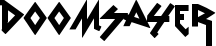

<!-- # DOOMSAYER -->



[](https://zenodo.org/badge/latestdoi/95728792) [](https://opensource.org/licenses/MIT)  [](https://mybinder.org/v2/gh/carjed/doomsayer/master) [](https://travis-ci.org/carjed/doomsayer)

## Introduction

_**DOOMSAYER** ( **D**etection **O**f **O**utliers using **M**utation **S**pectrum **A**nal**Y**sis in **E**xtremely **R**are variants) is a utility for analyzing patterns of rare, single-nucleotide variants (SNVs) in whole-genome (WGS) or whole-exome sequencing (WES) data._

_The basic intuition behind Doomsayer is that the non-somatic mutation spectra of rare SNVs should have little inter-individual heterogeneity. If an individual's mutation spectrum differs drastically from the expected distribution, it is likely due to cryptic error biases or batch effects rather than genuine biological variation. Doomsayer uses a series of statistical analyses to identify these outlier samples, and provides a diagnostic report summarizing the observed error signatures, helping to ensure rigor and reproducibility in the analysis of WGS/WES data._

_In addition to its purpose as a quality control program, Doomsayer can be applied more generally to study between-sample differences in somatic and germline mutation signatures._

<!-- ### Citation

If you use DOOMSAYER in your research, please cite our [paper](#) (citation pending). -->

<!-- - [Introduction](#introduction)
- [Setup](#setup)
  * [Using Conda (recommended)](#using-conda--recommended-)
  * [Local install](#local-install)
  * [Docker](#docker)
    + [Binder](#binder)
- [Tutorial](#tutorial)
- [Usage](#usage)
  * [Program options](#program-options)
    + [Version number](#version-number)
    + [number of CPUs](#number-of-cpus)
    + [Verbose logging](#verbose-logging)
  * [Input options](#input-options)
    + [Input data file](#input-data-file)
    + [Fasta reference file](#fasta-reference-file)
  * [Input modes](#input-modes)
    + [VCF mode (default)](#vcf-mode--default-)
      - [Single VCF file](#single-vcf-file)
      - [Multiple VCF files](#multiple-vcf-files)
    + [plain text mode](#plain-text-mode)
    + [Aggregation mode](#aggregation-mode)
  * [Filtering options](#filtering-options)
    + [Analyze specific samples](#analyze-specific-samples)
    + [Sample grouping file](#sample-grouping-file)
    + [Exclude samples with too few observations](#exclude-samples-with-too-few-observations)
    + [Set maximum allele count of SNVs to include](#set-maximum-allele-count-of-snvs-to-include)
  * [Output options](#output-options)
    + [Custom project directory](#custom-project-directory)
    + [Write only M matrix with custom name](#write-only-m-matrix-with-custom-name)
    + [Auto-filtered VCF or plain-text output](#auto-filtered-vcf-or-plain-text-output)
  * [Matrix decomposition and outlier detection options](#matrix-decomposition-and-outlier-detection-options)
    + [Specify decomposition algorithm and number of components](#specify-decomposition-algorithm-and-number-of-components)
    + [Choose outlier detection mode](#choose-outlier-detection-mode)
    + [Stringency threshold for outlier check](#stringency-threshold-for-outlier-check)
    + [Set motif length](#set-motif-length)
  * [Generate a diagnostic report](#generate-a-diagnostic-report)
- [FAQ](#faq)
  * [What are Doomsayer's hardware requirements?](#what-are-doomsayer-s-hardware-requirements-)
  * [What type of sequencing data can Doomsayer analyze?](#what-type-of-sequencing-data-can-doomsayer-analyze-)
  * [Doomsayer is not reading my input VCF](#doomsayer-is-not-reading-my-input-vcf)
  * [Why am I getting errors about the reference genome?](#why-am-i-getting-errors-about-the-reference-genome-)
  * [Why are my RMarkdown reports not rendering?](#why-are-my-rmarkdown-reports-not-rendering-)
- [Contact](#contact) -->

------------------------------------

## Setup

### Using Conda (recommended)

The following commands will create a Conda environment named `doomsayer` and install all dependencies from `env.yml`. This environment will install the R binaries and most required R packages; however, some packages are not available via the Conda channels, so must be installed in the environment using the `install.r` script (note that this script will NOT install these packages outside of the `doomsayer` environment).

```{sh id:"conda_install"}
# clone repository
git clone https://github.com/carjed/doomsayer.git

cd doomsayer

# create the conda environment
conda env create -n doomsayer -f env.yml

# activate env
source activate doomsayer

# install R libraries within the doomsayer env
R --quiet -f install.r
```

### Local install

Prerequisites for Doomsayer can also be installed using `pip` and the included `install.r` script:

```{sh id:"local_install"}
# clone repository
git clone https://github.com/carjed/doomsayer.git
cd doomsayer

# install Python libraries
pip install -r pip_reqs.txt

# install R packages
R --quiet -f install.r
```

Note that this method assumes you have `pip` and `R` (version 3.1 or higher) already installed. You will also need `pandoc` (version 1.19) installed in order to render RMarkdown reports. If [RStudio](https://www.rstudio.com/products/rstudio/download/#download) (or [RStudio Server]()) is installed on your system, the necessary pandoc binaries should already be available, and no additional acction is needed.

Debian/Ubuntu users may run the [`check_pandoc.sh`](check_pandoc.sh) script to confirm if the pandoc binaries are installed--if they are not found, the script will attempt to download the binaries to `doomsayer/pandoc/`.

```{sh id:"check_pandoc"}
bash check_pandoc.sh
```

Mac users will need to either install RStudio or manually install the binaries to `doomsayer/pandoc/` per the instructions described [here](https://github.com/jgm/pandoc/blob/master/INSTALL.md).

### Docker

For more flexible deployment options, Doomsayer is available as a Docker container. The following command will pull and run the preconfigured image from the [Docker Hub](https://hub.docker.com/):

```
docker run -d --name doomsayer \
  -v /path/to/local/data:/data \ # map directory containing input data
  -p 8888:8888 \ # expose jupyter notebook on port 8888
  start-notebook.sh --NotebookApp.token='' \ # start with token disabled
  carjed/doomsayer
```

You may also clone this repository and build the dockerfile locally, using the following commands:

```{sh id:"chj4lmgskk"}
# clone repository
git clone https://github.com/carjed/doomsayer.git

cd doomsayer
# build image from the docker file
docker build -t latest --force-rm .

# run container
docker run -d --name doomsayer \
  -p 8888:8888 \
  start-notebook.sh --NotebookApp.token='' \
  doomsayer
```

In both cases, Doomsayer will be available as a Jupyter notebook server, accessible at http://[machine ip]:8888.

#### Binder

A prebuilt Doomsayer docker image can be accessed via the cloud-based [Binder](https://mybinder.org/v2/gh/carjed/doomsayer/develop) platform.

Due to the resource constraints of the public BinderHub server, we recommend this option only for running the interactive [Doomsayer tutorials](#Tutorial) or for small input data. Users will need to upload their data to the Jupyter environment.

------------------------------------

## Tutorial

Doomsayer provides several options for performing outlier detection and mutation signature analysis on various types of data. We have included a [Jupyter notebook](./tutorial.ipynb) to guide users through the various options and use cases for Doomsayer. To run this tutorial interactively, use Binder:

[](https://mybinder.org/v2/gh/carjed/doomsayer/develop)

------------------------------------

## Usage

```
usage: doomsayer.py [-h] [-c [INT]] [-v] [-V] [-M ] -i [/path/to/input.vcf]
                    [-f [/path/to/genome.fa]]
                    [-g [/path/to/sample_batches.txt]]
                    [-s [/path/to/kept_samples.txt]] [-C [INT]] [-X [INT]]
                    [-p [/path/to/project_directory]] [-m [STR]] [-o]
                    [-d [STR]] [-r [INT]] [-F [STR]] [-t [FLOAT]] [-l [INT]]
                    [-R] [-G] [-T [STR]]

optional arguments:
  -h, --help            show this help message and exit
  -c [INT], --cpus [INT]
                        number of CPUs. Must be integer value between 1 and 
                        [maxcpus]
  -v, --verbose         Enable verbose logging
  -V, --version         show program's version number and exit
  -M [STR], --mode [STR]
                        Mode for parsing input. Must be one of {vcf, agg,
                        txt}. Defaults to VCF mode.
  -i [/path/to/input.vcf], --input [/path/to/input.vcf]
                        In VCF mode (default) input file is a VCF or text file
                        containing paths of multiple VCFs. Defaults to accept
                        input from STDIN with "--input -". In aggregation
                        mode, input file is a text file containing mutation
                        subtype count matrices, or paths of multiple such
                        matrices. In plain text mode, input file is tab-
                        delimited text file containing 5 columns: CHR, POS,
                        REF, ALT, ID
  -f [/path/to/genome.fa], --fastafile [/path/to/genome.fa]
                        reference fasta file
  -g [/path/to/sample_batches.txt], --groupfile [/path/to/sample_batches.txt]
                        two-column tab-delimited file containing sample IDs
                        (column 1) and group membership (column 2) for pooled
                        analysis
  -s [/path/to/kept_samples.txt], --samplefile [/path/to/kept_samples.txt]
                        file with sample IDs to include (one per line)
  -C [INT], --minsnvs [INT]
                        minimum # of SNVs per individual to be included in
                        analysis. Default is 0.
  -X [INT], --maxac [INT]
                        maximum allele count for SNVs to keep in analysis.
                        Defaults to 1 (singletons) Set to 0 to include all
                        variants.
  -p [/path/to/project_directory], --projectdir [/path/to/project_directory]
                        directory to store output files (do NOT include a
                        trailing '/'). Defaults to ./doomsayer_output
  -m [STR], --matrixname [STR]
                        filename prefix for M matrix [without extension]
  -o, --filterout       in VCF or plain text modes, re-reads input file and
                        writes to STDOUT, omitting records that occur in the
                        detected outliers. To write to a new file, use
                        standard output redirection [ > out.vcf] at the end of
                        the doomsayer.py command
  -d [STR], --decomp [STR]
                        mode for matrix decomposition. Must be one of {nmf,
                        pca}. Defaults to pca.
  -r [INT], --rank [INT]
                        Rank for Matrix decomposition. If --decomp pca, will
                        select first r components. Default [0] will force
                        Doomsayer to iterate through multiple ranks to find an
                        optimal choice.
  -F [STR], --filtermode [STR]
                        Method for detecting outliers. Must be one of {ee,
                        lof, if, any, any2, all, none}. Defaults to ee.
  -t [FLOAT], --threshold [FLOAT]
                        threshold for fraction of potential outliers
  -l [INT], --length [INT]
                        motif length. Allowed values are 1,3,5,7
  -R, --report          automatically generates an HTML-formatted report in R.
  -G, --staticplots     use static ggplot figures instead of interactive
                        plotly figures
  -T [STR], --template [STR]
                        Template for diagnostic report. Must be one of
                        {diagnostics, msa}. Defaults to diagnostics.
```

### Program options

#### Version number

`--version`

Show program's version number and exit.

#### number of CPUs

`--cpus [INT]`

Set the number of CPUs to use if input is a list of files.

#### Verbose logging

`--verbose`

This flag enables debug logging for troubleshooting.

### Input options

These options together specify the data to be processed by Doomsayer. Each mode and the possible inputs it can accept are described in the [input modes](#input-modes) section.

#### Input data file

`--input [/path/to/input.vcf]`

Doomsayer can accept multiple types of input:
- a single VCF file (either uncompressed or [bgzip](http://www.htslib.org/doc/tabix.html)-compressed)
- a text file containing the file paths of multiple VCF files (e.g., one per chromosome)
- a tab-delimited text file with one variant per row
- a text file containing the file paths of multiple matrices to be aggregated together

By default, Doomsayer assumes input is a VCF file or text file containing file paths of multiple VCF files. To parse tab-delimited text files or aggregate data from multiple previous runs, use the `--mode txt` or `--mode agg` options, respectively.

#### Fasta reference file

`--fastafile [/path/to/genome.fa]`

In VCF mode and plain text mode, you **must** specify the fasta-formatted reference genome to be used to look up the local sequence context for each SNV. This file must corresponding to the same reference genome build used to call the variants contained in the input VCF file, with [consistently-formatted records](#reference-file-incompatibilities). The fasta file may be either uncompressed or bgzip-compressed.

### Input modes

#### VCF mode (default)

`--mode vcf`

##### Single VCF file
A VCF file formatted with mandatory columns (#CHROM, POS, ID, REF, ALT, QUAL, FILTER, and INFO). This VCF must contain an allele count field in the INFO column ([AC=N]), and include individual genotypes (i.e., the VCF cannot be a "sites-only" file).

The VCF input can be either a file on disk or piped from STDIN (using `--input -`), enabling compatibility with a wide range of existing pipelines and workflows. The VCF can contain any combination of variant types (e.g., SNVs, indels, CNVs), allele counts, or filter flags. By default, Doomsayer will only analyze singleton SNVs with a "PASS" value in the FILTER column of the VCF. This can be disabled with the `--novarfilter` flag.

##### Multiple VCF files
If your data are spread across multiple files (e.g., one VCF per chromosome), Doomsayer will accept a plain text file containing the absolute file paths (one per line) for the VCF files to process. This assumes all VCF files contain the exact same sample IDs and that the IDs in the VCF header are ordered identically across all subfiles. This option is best used in conjunction with the `--cpus {N}` argument to enable parallel processing of the files.

#### plain text mode

`--mode txt`

When using this mode, input must be a tab-delimited text file containing a list of SNVs with the following 5 columns (order must be maintained):
- Chromosome
- Position
- Reference allele
- Alternative allele
- Identifier variable

The identifier variable can be any factor by which we wish to compare mutation patterns. This could be a population, gene ID, sample ID, variant quality level, etc.

This is the most flexible input mode, as it allows the user to curate the set of variants and identifier variables as they see fit, though we leave it to the user to coerce their data into the requisite format.

#### Aggregation mode

`--mode agg`

This mode can be used to run Doomsayer on pre-existing sample x subtype SNV count matrices, which can be obtained either from the [output](#output-options) of previous Doomsayer runs, or generated by the user. Input should be a plain text file containing the absolute paths of the count matrices to aggregate.

If generating these subtype count matrices outside of Doomsayer, files should be formatted as tab-delimited text files where the ith row of each file is a sample ID (or some other identifier variable) and the jth column is a mutation subtype. Row and column names must be included.

Aggregation mode is useful if you are combining output from previous Doomsayer runs (e.g., adding data from a new batch of samples or aggregating across subregions) or wish to run Doomsayer with different filtering/output options without needing to re-run the more computationally demanding VCF processing. This could also be used to compare mutation patterns across different species or alignments.

In aggregation mode, the input should be named either `m_regions.txt`, where each count matrix contains the same set of samples with subtype counts across a nonoverlapping set of regions, or `m_samples.txt`, where each file contains a nonoverlapping set of samples. If running regional aggregation, a final M matrix will be generated by summing subtype count matrices element-wise; if running sample aggregation, the M matrix will be generated by row-wise concatenation of the sub-matrices.

If you plan on generating subtype count matrices via Doomsayer to aggregate at a later point, you should use the `--matrixname custom_output_name` to create unique file names for the matrices to combine.

### Filtering options

Doomsayer is designed to integrate in existing VCF processing workflows, so if you wish to apply sample-level or variant-level filters to your input data prior to running Doomsayer, we advise pre-filtering your data (e.g., using bcftools) for greater flexibility and efficiency. However, we have included options that enable the user to perform a few common filtering tasks directly in Doomsayer.

#### Analyze specific samples

`--samplefile [/path/to/kept_samples.txt]`

*Currently only applies to VCF mode*

To run Doomsayer on a subset of samples present in the input VCF, this parameter will read a list of sample IDs to keep (one per line) and skip all other samples in the VCF.

#### Sample grouping file

`--groupfile [/path/to/sample_batches.txt]`

*Currently only applies to VCF mode*

This parameter forces Doomsayer to evaluate mutation spectra across pooled groups of samples. The GROUPFILE should be a tab-delimited text file containing sample IDs in the first column and a grouping variable (e.g., plate number, sequencing date, sub-study) in the second column. This option is particularly useful if you wish to explicitly filter for batch effects in your data, e.g., by setting the grouping variable to be the sequencing date, study of origin, sequencing plate, or some other batch variable.

Note that this option will assume the GROUPFILE contains all samples in the input VCF. If your GROUPFILE contains only a subset of samples, other samples will not be evaluated.

#### Exclude samples with too few observations

`--minsnvs [INT]`

In some cases, samples may appear as outliers simply because they have very few observed SNVs. The `--minsnvs` parameter forces Doomsayer to only evaluate individuals with at least X observed SNVs. By default, `minsnvs=0`, and all samples are retained. If this option is enabled, the low-SNV outliers will be written to a separate file named `doomsayer_snvs_lt{X}.txt` in the output directory, and the keep/drop lists will be derived from the remaining subset of samples.

Note that the `chisq` outlier detection mode is generally more robust to low-SNV outliers.

#### Set maximum allele count of SNVs to include

`--maxac [INT]`

By default, Doomsayer will evaluate only singleton SNVs (`--maxac 1`). To include more common SNVs, increase the value of this parameter. To include all SNVs, use `--maxac 0`. This is not recommended when using Doomsayer for QC functionality, but may be useful for more general mutation signature analysis.

### Output options
The default output consists of two plain-text files: `doomsayer_keep.txt`, containing the IDs of samples that passed the filter, and `doomsayer_drop.txt`, containing the IDs of samples that failed the filter. These lists can be easily integrated into bcftools, vcftools, PLINK, and other tools to exclude outlier samples from your downstream analyses.

By default, Doomsayer will also write three data files from the NMF decomposition to the output directory:
1. the M matrix of observed mutation spectra per sample
2. the H matrix containing loadings of the mutation subtypes in each signature
3. the W matrix containing the contributions of each signature within each sample's mutation spectrum

#### Custom project directory
`--projectdir [/path/to/project_directory]`

By default, output files are stored in a subfolder named `/doomsayer_output/` in your current directory. The `--projectdir` parameter will specify a custom name/location for the Doomsayer output directory.

#### Write only M matrix with custom name
`--matrixname [STR]`

This parameter allows you to specify a custom name for the mutation spectra matrix file. The default is `--matrixname subtype_count_matrix`. This is particularly useful if you wish to generate an initial count matrix then play around with the outlier detection parameters.

#### Auto-filtered VCF or plain-text output
`--filterout`

If the input is a single VCF or text file of sites, this flag will force Doomsayer to re-read the input file and write a new file of the same format, removing any samples specified in the `doomsayer_drop.txt` list that has been generated.

This command will print the VCF header and records to STDOUT, which can then be piped to compatible programs, or redirected to a file using standard UNIX redirection (i.e., adding `> /path/to/output.vcf` at the end of the command), allowing Doomsayer to be used as an intermediate step of more complex VCF processing pipelines.

As far as possible, all records present in the original input will be preserved in the output, with three notable exceptions:
1. All samples in the drop list (and their genotypes) will be omitted
2.  **Variants that were unique to the set of dropped samples will be automatically removed.**
3. Four of the INFO fields will be updated to reflect the smaller set of retained samples:
    1. The total number of alleles (AN)
    2. allele count in genotypes (AC)
    3. number of samples (NS)
    4. combined depth (DP)

### Matrix decomposition and outlier detection options

#### Specify decomposition algorithm and number of components
`--decomp [STR]`

Doomsayer will decompose the subtype count matrix using either Principal Components Analysis (PCA), or Nonnegative Matrix Factorization (NMF).

`--rank [INT]`

Set the rank of the NMF decomposition to R components if using `--decomp nmf`, or select the first R principal components if using `--decomp pca`

#### Choose outlier detection mode
`--filtermode [STR]`

Once we have reduced the input matrix to R components, we want to identify which individuals are outliers in that R-dimensional space. Doomsayer can apply three different outlier detection algorithms: elliptic envelopes, local outlier factors, and isolation forests.

- `--filtermode ee`: Outliers are determined by assuming components follow a multivariate Gaussian distribution, and computing an elliptic envelope.
- `--filtermode lof`: Outliers are determined using local outlier factors. 
- `--filtermode if`: Outliers are determined using isolation forests.

In addition, Doomsayer can perform omnibus filtering using two or more of the above methods:
- `--filtermode any2`: Outliers must be called by at least two of the above methods
- `--filtermode all`: Outliers must be called by all three of the above methods (will call the fewest outliers)

To disable outlier detection, use `--filtermode none`

For a detailed overview of these methods, see the [scikit-learn outlier detection tutorial](http://scikit-learn.org/stable/modules/outlier_detection.html).

#### Stringency threshold for outlier check
`--threshold [FLOAT]`

This parameter specifies the fraction of the sample to flag as potential outliers by a given algorithm. If we set `--threshold 0.05` (the default) and use either the ee, lof, or if filter modes, Doomsayer will always flag ~5% of the sample as outliers.

When using the omnibus filtering modes, 

#### Set motif length
`--length {1,3,5,7}`

This parameter specifies the (symmetric) motif length to be considered in determining the mutation subtypes. The default (3) produces 96 3-mer subtypes, which is likely sufficient for QC of whole-genome germline variants. If you are using Doomsayer for QC of whole-exome germline variants, you will likely need to specify `--length 1`, as most individuals will not have enough singleton variants to accurately infer higher-order mutation signatures. Values greater than 3 will likely lead to extremely noisy or unreliable QC results for germline variants, but may be useful for examining somatic sequencing data.

### Generate a diagnostic report
`--report` + `--template`

The `--report` option will tell Doomsayer to execute the `generate_report.r` script. This script will copy an [RMarkdown template](report_templates) (specified with the `-T, --template` parameter) into `~/doomsayer_output/` (or the user-specified project directory) and render an HTML-formatted report detailing the results of your Doomsayer run.

By default, plots are fully interactive using the Plotly engine. If you want to download static .png images, just mouse over the upper right corner of the figure and click the camera icon.

Alternatively, you can set the `--staticplots` option in your command, which will generate a report without any interactive elements. The standalone .png images will be saved to `~/doomsayer_output/report_files/figure-html/`. 

An example of a final report is available [here](sample_output/report.md). See the [sample_output](./sample_output) directory for further documentation and usage examples.

------------------------------------

## FAQ

### What are Doomsayer's hardware requirements?
Doomsayer has no specific hardware dependencies. We recommend ~2GB of free disk space if storing the demo data.

### What type of sequencing data can Doomsayer analyze?
Doomsayer's core functionality, the NMF-based or PCA-based mutation signature analysis, can be used to rapidly evaluate mutation patterns present in any collection of sequencing data, and offers an extremely efficient and almost entirely automated (albeit slightly less flexible) alternative to the functions provided by the [SomaticSignatures](http://bioconductor.org/packages/release/bioc/html/SomaticSignatures.html) R package:

>Gehring JS, Fischer B, Lawrence M, Huber W. SomaticSignatures: inferring mutational signatures from single-nucleotide variants. Bioinformatics. 2015;31(22):3673-3675. doi:10.1093/bioinformatics/btv408.

Although we have only tested Doomsayer with human data, it should be fully capable of analyzing NGS data from any other organism.

Note that the outlier analysis function of Doomsayer is exclusively designed for analyzing **population** variants in **unrelated** individuals. In its current state, this filtering is **not** appropriate for quality control in somatic sequencing data or *de novo* mutation analysis, because genuine biological variability in these data will almost certainly be inferred as errors.

### Doomsayer is not reading my input VCF
Doomsayer uses the cyvcf2 wrapper for htslib libraries for parsing VCFs. If the input VCF is not formatted properly, htslib will often throw an error/warning or stop completely. If you encounter any issues with reading in a VCF file, first confirm that it is properly formatted. [vcf-validator](https://github.com/EBIvariation/vcf-validator) is a useful utility for this. You can also try indexing the VCF with `tabix -p input.vcf.gz` and running a simple bcftools command, such as `bcftools view input.vcf.gz`. Also check that your VCF contains singleton SNVs, individual genotypes are included, and that the FILTER column contains "PASS" values.

### Why am I getting errors about the reference genome?
To build the input matrix of subtype counts, Doomsayer must annotate each site with the surrounding sequence context, using a user-specified reference genome file.

The libraries for parsing fasta files require that the chromosome records in your fasta reference file are formatted identically to the CHROM field of your VCF (e.g., if the fasta header is formatted as `>chrN` but the VCF CHROM field is just `N`). If you encounter any errors, try modifying the the fasta file to either strip or add "chr" to each record.

### Why are my RMarkdown reports not rendering?
If any errors occur when trying to generate a report, it is likely because the pandoc binaries cannot be found on your system. Try installing RStudio; otherwise, you can install precompiled binaries into `doomsayer/pandoc/bin`

Alternatively, you can transfer the contents of the `doomsayer_output` directory to a computer that has RStudio installed and run `knit_with_parameters("report.Rmd")`. In the prompt window, enter `/path/to/doomsayer_output/config.yaml` in the `yaml_cfg` field.

------------------------------------

## Contact
If you need any further help, come across a bug, or have a feature request, feel free to [open an issue](https://github.com/carjed/doomsayer/issues/new) or [contact me directly](mailto:jed.e.carlson@gmail.com). If you are reporting a bug or unexpected output, please run Doomsayer with the `--verbose` option and include this output in your inquiry.

<!--<small><i><a href='http://ecotrust-canada.github.io/markdown-toc/'>Table of contents generated with markdown-toc</a></i></small>-->
