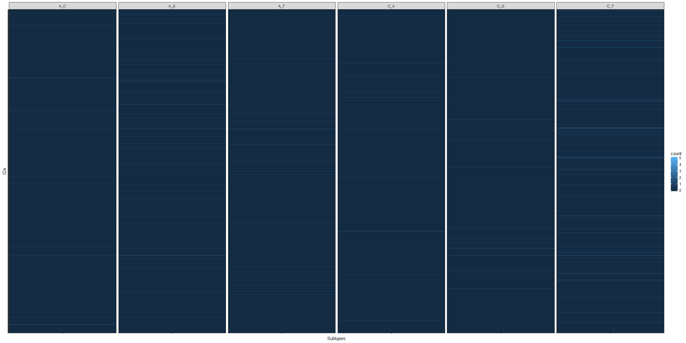
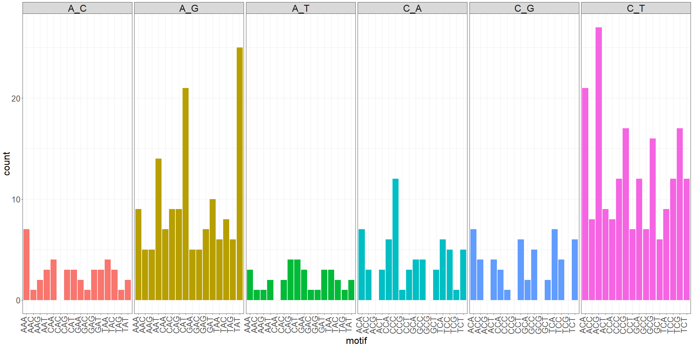
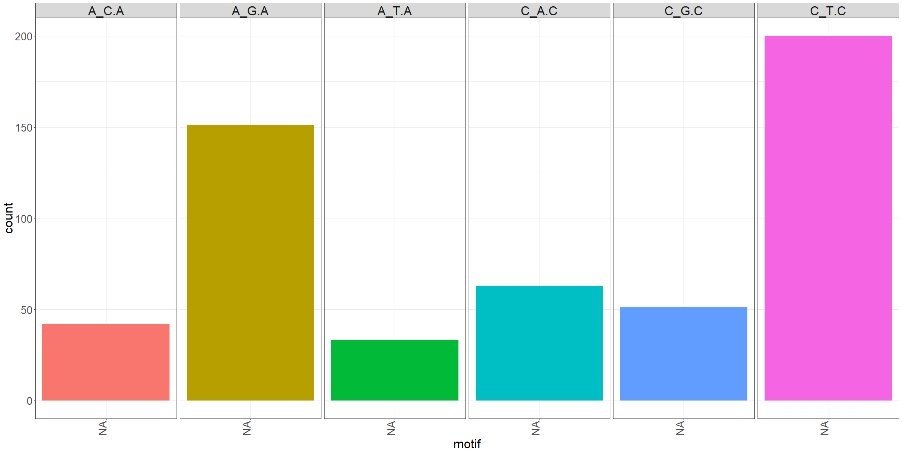

# doomsayer_diagnostics
`r format(Sys.Date())`  


#### Mutation spectrum per sample (M matrix)

Heatmap to visualize mutational spectra across all samples

<!-- -->

### Combined mutation spectrum

These plots shows the total number of observations in each subtype, combined across all samples

#### All samples


```
## Warning: Too few values at 22590 locations: 1, 2, 3, 4, 5, 6, 7, 8, 9, 10,
## 11, 12, 13, 14, 15, 16, 17, 18, 19, 20, ...
```

<!-- -->

#### Kept samples


```
## Warning: Too few values at 19758 locations: 1, 2, 3, 4, 5, 6, 7, 8, 9, 10,
## 11, 12, 13, 14, 15, 16, 17, 18, 19, 20, ...
```

<!-- -->

#### Dropped samples


```
## Warning: Too few values at 2832 locations: 1, 2, 3, 4, 5, 6, 7, 8, 9, 10,
## 11, 12, 13, 14, 15, 16, 17, 18, 19, 20, ...
```

<!-- -->

### Signature loadings (H matrix)

Describes how each mutation subtype is loaded into the r signatures


```
## Warning: Too few values at 12 locations: 1, 2, 3, 4, 5, 6, 7, 8, 9, 10, 11,
## 12
```

<!-- -->

### Signature contributions per sample (W matrix)

Proportion each signature contributes to the mutation spectrum in each individual sample

<!-- -->

### Signature contributions per kept samples (W matrix)

Proportion each signature contributes to the mutation spectrum in each individual sample

<!-- -->
