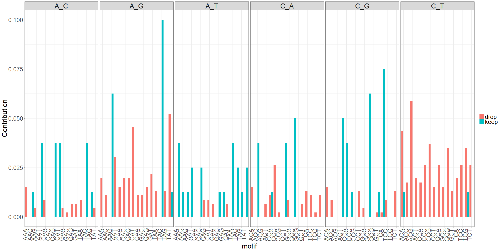
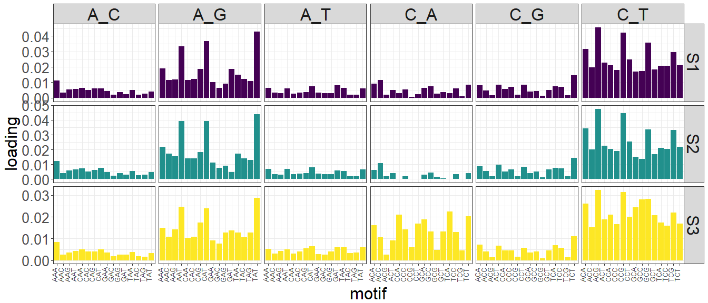
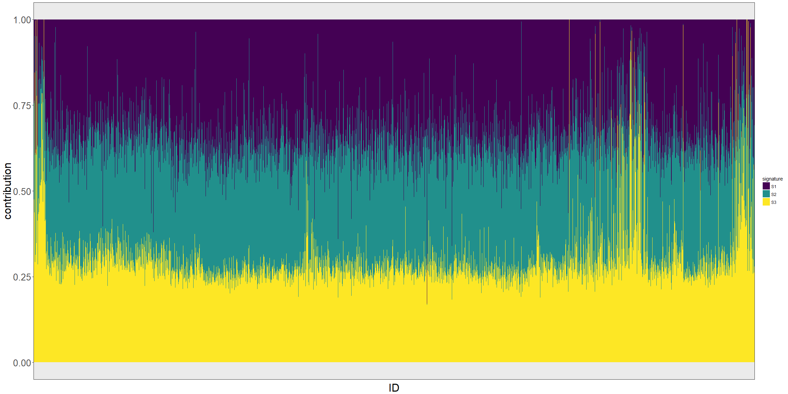

# doomsayer_diagnostics
`r format(Sys.Date())`  


### Combined mutation spectrum

These plots shows the total number of observations in each subtype, combined across all samples

#### All samples

<!-- -->

### Signature loadings (H matrix)

Describes how each mutation subtype is loaded into the r signatures


```
## # A tibble: 3 x 4
##   rowname        S1        S2        S3
##     <chr>     <dbl>     <dbl>     <dbl>
## 1      S1        NA 0.9783121 0.8396949
## 2      S2 0.9783121        NA 0.7716099
## 3      S3 0.8396949 0.7716099        NA
```

<!-- -->

### Signature contributions per sample (W matrix)

Proportion each signature contributes to the mutation spectrum in each individual sample

<!-- -->

### Interactive heatmap of error profiles

IDs with similar error profiles are grouped together using hierarchical clustering.

<!--html_preserve--><div id="27145131c1" style="width:1344px;height:1536px;" class="plotly html-widget"></div>
<script type="application/json" data-for="27145131c1">{"x":{"data":[{"x":[0,0.00187596987064],"y":[12,12],"text":"0: 0<br />ID: 1497-RMM-3245<br />ID: 12<br />RMSE: 0.001875970<br />maxgp: S1","type":"scatter","mode":"lines","line":{"width":1.88976377952756,"color":"rgba(68,1,84,1)","dash":"solid"},"hoveron":"points","name":"(S1,1)","legendgroup":"(S1,1)","showlegend":true,"xaxis":"x","yaxis":"y","hoverinfo":"text","frame":null},{"x":[0,0.00825713378092,null,0,0.00948018714804,null,0,0.00817808709442,null,0,0.00658076590771],"y":[1,1,null,2,2,null,3,3,null,4,4],"text":["0: 0<br />ID: 1497-RMM-3411<br />ID:  1<br />RMSE: 0.008257134<br />maxgp: S2","0: 0<br />ID: 1497-RMM-3411<br />ID:  1<br />RMSE: 0.008257134<br />maxgp: S2",null,"0: 0<br />ID: 1497-RMM-3379<br />ID:  2<br />RMSE: 0.009480187<br />maxgp: S2","0: 0<br />ID: 1497-RMM-3379<br />ID:  2<br />RMSE: 0.009480187<br />maxgp: S2",null,"0: 0<br />ID: 1497-RMM-3372<br />ID:  3<br />RMSE: 0.008178087<br />maxgp: S2","0: 0<br />ID: 1497-RMM-3372<br />ID:  3<br />RMSE: 0.008178087<br />maxgp: S2",null,"0: 0<br />ID: 1497-RMM-3392<br />ID:  4<br />RMSE: 0.006580766<br />maxgp: S2","0: 0<br />ID: 1497-RMM-3392<br />ID:  4<br />RMSE: 0.006580766<br />maxgp: S2"],"type":"scatter","mode":"lines","line":{"width":1.88976377952756,"color":"rgba(33,144,140,1)","dash":"solid"},"hoveron":"points","name":"(S2,1)","legendgroup":"(S2,1)","showlegend":true,"xaxis":"x","yaxis":"y","hoverinfo":"text","frame":null},{"x":[0,0.00589462780882,null,0,0.00548274208355,null,0,0.00510549478797,null,0,0.00416641406012,null,0,0.00352796848563,null,0,0.00372388242985,null,0,0.00366641401112,null,0,0.00701302445381,null,0,0.00907771514693,null,0,0.00948216565563,null,0,0.00881000617325,null,0,0.0105960661239,null,0,0.00558250782428,null,0,0.00492843732862,null,0,0.00390211261743,null,0,0.00437699653243,null,0,0.00481813681171,null,0,0.00477012673311,null,0,0.00412799586428,null,0,0.00399636612207,null,0,0.00315417302729,null,0,0.00227678533594,null,0,0.00324541398728,null,0,0.00315972601691,null,0,0.00373453851928,null,0,0.00342027191364,null,0,0.00287710384679,null,0,0.00322041858394,null,0,0.00376365358521,null,0,0.0053212804772,null,0,0.00623580194337,null,0,0.00547109317974,null,0,0.00941159288062,null,0,0.00676851308169,null,0,0.0231694300335,null,0,0.0240122113216,null,0,0.0164556001034,null,0,0.0106886631671],"y":[5,5,null,6,6,null,7,7,null,8,8,null,9,9,null,10,10,null,11,11,null,13,13,null,14,14,null,15,15,null,16,16,null,17,17,null,18,18,null,19,19,null,20,20,null,21,21,null,22,22,null,23,23,null,24,24,null,25,25,null,26,26,null,27,27,null,28,28,null,29,29,null,30,30,null,31,31,null,32,32,null,33,33,null,34,34,null,35,35,null,36,36,null,37,37,null,38,38,null,39,39,null,40,40,null,41,41,null,42,42,null,43,43],"text":["0: 0<br />ID: 1497-RMM-3367<br />ID:  5<br />RMSE: 0.005894628<br />maxgp: S3","0: 0<br />ID: 1497-RMM-3367<br />ID:  5<br />RMSE: 0.005894628<br />maxgp: S3",null,"0: 0<br />ID: 1497-RMM-3248<br />ID:  6<br />RMSE: 0.005482742<br />maxgp: S3","0: 0<br />ID: 1497-RMM-3248<br />ID:  6<br />RMSE: 0.005482742<br />maxgp: S3",null,"0: 0<br />ID: 1497-RMM-3365<br />ID:  7<br />RMSE: 0.005105495<br />maxgp: S3","0: 0<br />ID: 1497-RMM-3365<br />ID:  7<br />RMSE: 0.005105495<br />maxgp: S3",null,"0: 0<br />ID: 1497-RMM-3370<br />ID:  8<br />RMSE: 0.004166414<br />maxgp: S3","0: 0<br />ID: 1497-RMM-3370<br />ID:  8<br />RMSE: 0.004166414<br />maxgp: S3",null,"0: 0<br />ID: 1497-RMM-3377<br />ID:  9<br />RMSE: 0.003527968<br />maxgp: S3","0: 0<br />ID: 1497-RMM-3377<br />ID:  9<br />RMSE: 0.003527968<br />maxgp: S3",null,"0: 0<br />ID: 1497-RMM-3376<br />ID: 10<br />RMSE: 0.003723882<br />maxgp: S3","0: 0<br />ID: 1497-RMM-3376<br />ID: 10<br />RMSE: 0.003723882<br />maxgp: S3",null,"0: 0<br />ID: 1497-RMM-3361<br />ID: 11<br />RMSE: 0.003666414<br />maxgp: S3","0: 0<br />ID: 1497-RMM-3361<br />ID: 11<br />RMSE: 0.003666414<br />maxgp: S3",null,"0: 0<br />ID: 1497-RMM-3874<br />ID: 13<br />RMSE: 0.007013024<br />maxgp: S3","0: 0<br />ID: 1497-RMM-3874<br />ID: 13<br />RMSE: 0.007013024<br />maxgp: S3",null,"0: 0<br />ID: 1497-RMM-3979<br />ID: 14<br />RMSE: 0.009077715<br />maxgp: S3","0: 0<br />ID: 1497-RMM-3979<br />ID: 14<br />RMSE: 0.009077715<br />maxgp: S3",null,"0: 0<br />ID: 1497-RMM-3971<br />ID: 15<br />RMSE: 0.009482166<br />maxgp: S3","0: 0<br />ID: 1497-RMM-3971<br />ID: 15<br />RMSE: 0.009482166<br />maxgp: S3",null,"0: 0<br />ID: 1497-RMM-3969<br />ID: 16<br />RMSE: 0.008810006<br />maxgp: S3","0: 0<br />ID: 1497-RMM-3969<br />ID: 16<br />RMSE: 0.008810006<br />maxgp: S3",null,"0: 0<br />ID: 1497-RMM-3967<br />ID: 17<br />RMSE: 0.010596066<br />maxgp: S3","0: 0<br />ID: 1497-RMM-3967<br />ID: 17<br />RMSE: 0.010596066<br />maxgp: S3",null,"0: 0<br />ID: 1497-RMM-3017B<br />ID: 18<br />RMSE: 0.005582508<br />maxgp: S3","0: 0<br />ID: 1497-RMM-3017B<br />ID: 18<br />RMSE: 0.005582508<br />maxgp: S3",null,"0: 0<br />ID: 1497-RMM-3991<br />ID: 19<br />RMSE: 0.004928437<br />maxgp: S3","0: 0<br />ID: 1497-RMM-3991<br />ID: 19<br />RMSE: 0.004928437<br />maxgp: S3",null,"0: 0<br />ID: 1497-RMM-3342<br />ID: 20<br />RMSE: 0.003902113<br />maxgp: S3","0: 0<br />ID: 1497-RMM-3342<br />ID: 20<br />RMSE: 0.003902113<br />maxgp: S3",null,"0: 0<br />ID: 1497-RMM-3329<br />ID: 21<br />RMSE: 0.004376997<br />maxgp: S3","0: 0<br />ID: 1497-RMM-3329<br />ID: 21<br />RMSE: 0.004376997<br />maxgp: S3",null,"0: 0<br />ID: 1497-RMM-3154<br />ID: 22<br />RMSE: 0.004818137<br />maxgp: S3","0: 0<br />ID: 1497-RMM-3154<br />ID: 22<br />RMSE: 0.004818137<br />maxgp: S3",null,"0: 0<br />ID: 1497-RMM-3362<br />ID: 23<br />RMSE: 0.004770127<br />maxgp: S3","0: 0<br />ID: 1497-RMM-3362<br />ID: 23<br />RMSE: 0.004770127<br />maxgp: S3",null,"0: 0<br />ID: 1497-RMM-3890<br />ID: 24<br />RMSE: 0.004127996<br />maxgp: S3","0: 0<br />ID: 1497-RMM-3890<br />ID: 24<br />RMSE: 0.004127996<br />maxgp: S3",null,"0: 0<br />ID: 1497-RMM-3030B<br />ID: 25<br />RMSE: 0.003996366<br />maxgp: S3","0: 0<br />ID: 1497-RMM-3030B<br />ID: 25<br />RMSE: 0.003996366<br />maxgp: S3",null,"0: 0<br />ID: 1497-RMM-3965<br />ID: 26<br />RMSE: 0.003154173<br />maxgp: S3","0: 0<br />ID: 1497-RMM-3965<br />ID: 26<br />RMSE: 0.003154173<br />maxgp: S3",null,"0: 0<br />ID: 1497-RMM-0083<br />ID: 27<br />RMSE: 0.002276785<br />maxgp: S3","0: 0<br />ID: 1497-RMM-0083<br />ID: 27<br />RMSE: 0.002276785<br />maxgp: S3",null,"0: 0<br />ID: 1497-RMM-0112<br />ID: 28<br />RMSE: 0.003245414<br />maxgp: S3","0: 0<br />ID: 1497-RMM-0112<br />ID: 28<br />RMSE: 0.003245414<br />maxgp: S3",null,"0: 0<br />ID: 1497-RMM-0114<br />ID: 29<br />RMSE: 0.003159726<br />maxgp: S3","0: 0<br />ID: 1497-RMM-0114<br />ID: 29<br />RMSE: 0.003159726<br />maxgp: S3",null,"0: 0<br />ID: 1497-RMM-0013<br />ID: 30<br />RMSE: 0.003734539<br />maxgp: S3","0: 0<br />ID: 1497-RMM-0013<br />ID: 30<br />RMSE: 0.003734539<br />maxgp: S3",null,"0: 0<br />ID: 1497-RMM-0023<br />ID: 31<br />RMSE: 0.003420272<br />maxgp: S3","0: 0<br />ID: 1497-RMM-0023<br />ID: 31<br />RMSE: 0.003420272<br />maxgp: S3",null,"0: 0<br />ID: 1497-RMM-0001<br />ID: 32<br />RMSE: 0.002877104<br />maxgp: S3","0: 0<br />ID: 1497-RMM-0001<br />ID: 32<br />RMSE: 0.002877104<br />maxgp: S3",null,"0: 0<br />ID: 1497-RMM-0070<br />ID: 33<br />RMSE: 0.003220419<br />maxgp: S3","0: 0<br />ID: 1497-RMM-0070<br />ID: 33<br />RMSE: 0.003220419<br />maxgp: S3",null,"0: 0<br />ID: 1497-RMM-0021<br />ID: 34<br />RMSE: 0.003763654<br />maxgp: S3","0: 0<br />ID: 1497-RMM-0021<br />ID: 34<br />RMSE: 0.003763654<br />maxgp: S3",null,"0: 0<br />ID: 1497-RMM-0036<br />ID: 35<br />RMSE: 0.005321280<br />maxgp: S3","0: 0<br />ID: 1497-RMM-0036<br />ID: 35<br />RMSE: 0.005321280<br />maxgp: S3",null,"0: 0<br />ID: 1497-RMM-0148<br />ID: 36<br />RMSE: 0.006235802<br />maxgp: S3","0: 0<br />ID: 1497-RMM-0148<br />ID: 36<br />RMSE: 0.006235802<br />maxgp: S3",null,"0: 0<br />ID: 1497-RMM-0082<br />ID: 37<br />RMSE: 0.005471093<br />maxgp: S3","0: 0<br />ID: 1497-RMM-0082<br />ID: 37<br />RMSE: 0.005471093<br />maxgp: S3",null,"0: 0<br />ID: 1497-RMM-0063<br />ID: 38<br />RMSE: 0.009411593<br />maxgp: S3","0: 0<br />ID: 1497-RMM-0063<br />ID: 38<br />RMSE: 0.009411593<br />maxgp: S3",null,"0: 0<br />ID: 1497-RMM-3898<br />ID: 39<br />RMSE: 0.006768513<br />maxgp: S3","0: 0<br />ID: 1497-RMM-3898<br />ID: 39<br />RMSE: 0.006768513<br />maxgp: S3",null,"0: 0<br />ID: 1497-RMM-2976B<br />ID: 40<br />RMSE: 0.023169430<br />maxgp: S3","0: 0<br />ID: 1497-RMM-2976B<br />ID: 40<br />RMSE: 0.023169430<br />maxgp: S3",null,"0: 0<br />ID: 1497-RMM-3953<br />ID: 41<br />RMSE: 0.024012211<br />maxgp: S3","0: 0<br />ID: 1497-RMM-3953<br />ID: 41<br />RMSE: 0.024012211<br />maxgp: S3",null,"0: 0<br />ID: 1497-RMM-3926<br />ID: 42<br />RMSE: 0.016455600<br />maxgp: S3","0: 0<br />ID: 1497-RMM-3926<br />ID: 42<br />RMSE: 0.016455600<br />maxgp: S3",null,"0: 0<br />ID: 1497-RMM-3919<br />ID: 43<br />RMSE: 0.010688663<br />maxgp: S3","0: 0<br />ID: 1497-RMM-3919<br />ID: 43<br />RMSE: 0.010688663<br />maxgp: S3"],"type":"scatter","mode":"lines","line":{"width":1.88976377952756,"color":"rgba(253,231,37,1)","dash":"solid"},"hoveron":"points","name":"(S3,1)","legendgroup":"(S3,1)","showlegend":true,"xaxis":"x","yaxis":"y","hoverinfo":"text","frame":null},{"x":[0.00187596987064],"y":[12],"text":"RMSE: 0.001875970<br />ID: 1497-RMM-3245<br />maxgp: S1","type":"scatter","mode":"markers","marker":{"autocolorscale":false,"color":"rgba(68,1,84,1)","opacity":1,"size":15.1181102362205,"symbol":"circle","line":{"width":1.88976377952756,"color":"rgba(68,1,84,1)"}},"hoveron":"points","name":"(S1,1)","legendgroup":"(S1,1)","showlegend":false,"xaxis":"x","yaxis":"y","hoverinfo":"text","frame":null},{"x":[0.00825713378092,0.00948018714804,0.00817808709442,0.00658076590771],"y":[1,2,3,4],"text":["RMSE: 0.008257134<br />ID: 1497-RMM-3411<br />maxgp: S2","RMSE: 0.009480187<br />ID: 1497-RMM-3379<br />maxgp: S2","RMSE: 0.008178087<br />ID: 1497-RMM-3372<br />maxgp: S2","RMSE: 0.006580766<br />ID: 1497-RMM-3392<br />maxgp: S2"],"type":"scatter","mode":"markers","marker":{"autocolorscale":false,"color":"rgba(33,144,140,1)","opacity":1,"size":15.1181102362205,"symbol":"circle","line":{"width":1.88976377952756,"color":"rgba(33,144,140,1)"}},"hoveron":"points","name":"(S2,1)","legendgroup":"(S2,1)","showlegend":false,"xaxis":"x","yaxis":"y","hoverinfo":"text","frame":null},{"x":[0.00589462780882,0.00548274208355,0.00510549478797,0.00416641406012,0.00352796848563,0.00372388242985,0.00366641401112,0.00701302445381,0.00907771514693,0.00948216565563,0.00881000617325,0.0105960661239,0.00558250782428,0.00492843732862,0.00390211261743,0.00437699653243,0.00481813681171,0.00477012673311,0.00412799586428,0.00399636612207,0.00315417302729,0.00227678533594,0.00324541398728,0.00315972601691,0.00373453851928,0.00342027191364,0.00287710384679,0.00322041858394,0.00376365358521,0.0053212804772,0.00623580194337,0.00547109317974,0.00941159288062,0.00676851308169,0.0231694300335,0.0240122113216,0.0164556001034,0.0106886631671],"y":[5,6,7,8,9,10,11,13,14,15,16,17,18,19,20,21,22,23,24,25,26,27,28,29,30,31,32,33,34,35,36,37,38,39,40,41,42,43],"text":["RMSE: 0.005894628<br />ID: 1497-RMM-3367<br />maxgp: S3","RMSE: 0.005482742<br />ID: 1497-RMM-3248<br />maxgp: S3","RMSE: 0.005105495<br />ID: 1497-RMM-3365<br />maxgp: S3","RMSE: 0.004166414<br />ID: 1497-RMM-3370<br />maxgp: S3","RMSE: 0.003527968<br />ID: 1497-RMM-3377<br />maxgp: S3","RMSE: 0.003723882<br />ID: 1497-RMM-3376<br />maxgp: S3","RMSE: 0.003666414<br />ID: 1497-RMM-3361<br />maxgp: S3","RMSE: 0.007013024<br />ID: 1497-RMM-3874<br />maxgp: S3","RMSE: 0.009077715<br />ID: 1497-RMM-3979<br />maxgp: S3","RMSE: 0.009482166<br />ID: 1497-RMM-3971<br />maxgp: S3","RMSE: 0.008810006<br />ID: 1497-RMM-3969<br />maxgp: S3","RMSE: 0.010596066<br />ID: 1497-RMM-3967<br />maxgp: S3","RMSE: 0.005582508<br />ID: 1497-RMM-3017B<br />maxgp: S3","RMSE: 0.004928437<br />ID: 1497-RMM-3991<br />maxgp: S3","RMSE: 0.003902113<br />ID: 1497-RMM-3342<br />maxgp: S3","RMSE: 0.004376997<br />ID: 1497-RMM-3329<br />maxgp: S3","RMSE: 0.004818137<br />ID: 1497-RMM-3154<br />maxgp: S3","RMSE: 0.004770127<br />ID: 1497-RMM-3362<br />maxgp: S3","RMSE: 0.004127996<br />ID: 1497-RMM-3890<br />maxgp: S3","RMSE: 0.003996366<br />ID: 1497-RMM-3030B<br />maxgp: S3","RMSE: 0.003154173<br />ID: 1497-RMM-3965<br />maxgp: S3","RMSE: 0.002276785<br />ID: 1497-RMM-0083<br />maxgp: S3","RMSE: 0.003245414<br />ID: 1497-RMM-0112<br />maxgp: S3","RMSE: 0.003159726<br />ID: 1497-RMM-0114<br />maxgp: S3","RMSE: 0.003734539<br />ID: 1497-RMM-0013<br />maxgp: S3","RMSE: 0.003420272<br />ID: 1497-RMM-0023<br />maxgp: S3","RMSE: 0.002877104<br />ID: 1497-RMM-0001<br />maxgp: S3","RMSE: 0.003220419<br />ID: 1497-RMM-0070<br />maxgp: S3","RMSE: 0.003763654<br />ID: 1497-RMM-0021<br />maxgp: S3","RMSE: 0.005321280<br />ID: 1497-RMM-0036<br />maxgp: S3","RMSE: 0.006235802<br />ID: 1497-RMM-0148<br />maxgp: S3","RMSE: 0.005471093<br />ID: 1497-RMM-0082<br />maxgp: S3","RMSE: 0.009411593<br />ID: 1497-RMM-0063<br />maxgp: S3","RMSE: 0.006768513<br />ID: 1497-RMM-3898<br />maxgp: S3","RMSE: 0.023169430<br />ID: 1497-RMM-2976B<br />maxgp: S3","RMSE: 0.024012211<br />ID: 1497-RMM-3953<br />maxgp: S3","RMSE: 0.016455600<br />ID: 1497-RMM-3926<br />maxgp: S3","RMSE: 0.010688663<br />ID: 1497-RMM-3919<br />maxgp: S3"],"type":"scatter","mode":"markers","marker":{"autocolorscale":false,"color":"rgba(253,231,37,1)","opacity":1,"size":15.1181102362205,"symbol":"circle","line":{"width":1.88976377952756,"color":"rgba(253,231,37,1)"}},"hoveron":"points","name":"(S3,1)","legendgroup":"(S3,1)","showlegend":false,"xaxis":"x","yaxis":"y","hoverinfo":"text","frame":null},{"x":[1,2,3,4,5,6,7,8,9,10,11,12,13,14,15,16,17,18,19,20,21,22,23,24,25,26,27,28,29,30,31,32,33,34,35,36,37,38,39,40,41,42,43,44,45,46,47,48,49,50,51,52,53,54,55,56,57,58,59,60,61,62,63,64,65,66,67,68,69,70,71,72,73,74,75,76,77,78,79,80,81,82,83,84,85,86,87,88,89,90,91,92,93,94,95,96],"y":[1,2,3,4,5,6,7,8,9,10,11,12,13,14,15,16,17,18,19,20,21,22,23,24,25,26,27,28,29,30,31,32,33,34,35,36,37,38,39,40,41,42,43],"z":[[0.362994053533295,0.126028575677764,0.146550656179732,0.116535554120723,0.160997092621745,0.0769665309112606,0.117877407340744,0.0785295180105994,0.0623561277646425,0.233351192981307,0.0571596417532461,0.0508074781075998,0.129765482739665,0.0918476749990108,0.537530603888776,0.240382412452773,0.205879215227595,0.194805710618817,0.206985502257711,0.216907549456307,0.248973821071286,0.211821319332643,0.135610986285913,0.150535524291306,0.158961468272721,0.0790411992614386,0.136713515529208,0.103231998498933,0.0920325002605302,0.103025801274128,0.12489237003742,0.187101616273299,0.193753511150009,0.165825367677943,0.172041363829318,0.166575429984957,0.145777439266477,0.0743633403038731,0.0663409496821202,0.089104536671101,0.0890570940226189,0.0920517808499942,0.106301713257349,0.110776252858608,0.133161430446872,0.176497700539453,0.118502937915557,0.122310131632508,0.105970043201629,0.189116119599814,0.138400107133595,0.123299288898298,0.083396906794629,0.115990607951552,0.0541206723307184,0.149268846620734,0.306901831910742,0.419701588665474,0.272148159560586,0.286945335531917,0.311853286412874,0.34074193783252,0.321635778099766,0.311834259232078,0.219761935305954,0.241853303367544,0.245228374280255,0.290398736030829,0.207162319268259,0.226673685954404,0.137516006495528,0.124472463391613,0.0971612948523536,0.233113145462534,0.211860256529087,0.214367632393634,0.11908380242498,0.188748148319234,0.14579221290179,0.475695218029165,0.462564275414533,0.430759738637371,0.507035411820914,0.313848329436309,0.428065961543858,0.407414795780958,0.4424431783832,0.442912890269745,0.416245689221366,0.497097944962215,0.61003363260835,0.596563933106195,0.66139538704607,0.852485212552712,0.73192645474266,0.933724945683365],[0.317614944488686,0.156982586670685,0.148322735731382,0.090614821771598,0.132710133859172,0.0610938578185481,0.0873299053529403,0.0698694539315493,0.0617768207114176,0.229810898846979,0.0844852508298789,0.038736481953547,0.115143692183336,0.0936994240059131,0.191812660637958,0.236267384184141,0.221149396290605,0.23882262867488,0.230106103064857,0.225012620942578,0.175287785210426,0.240776096025987,0.140825023340224,0.166887549924907,0.181768526287333,0.0655796153291065,0.114174179496968,0.0886806332415328,0.0882940300255112,0.110369072013768,0.129749312854536,0.153077625757124,0.203234959796747,0.109336062110516,0.163670571540118,0.135613200326187,0.111939955825643,0.0565825918502459,0.058193676121349,0.0790095426428766,0.0821808532111498,0.0826611969605143,0.104795546238643,0.0783256649003204,0.0953764666083312,0.132877748733704,0.123489521865584,0.12496925142401,0.119083350365109,0.182686411424062,0.174156311191162,0.141160805970532,0.0853916429520736,0.122760090246762,0.0539879784229796,0.12965187212554,0.345224143977,0.283865124260704,0.326100953977083,0.279008883893176,0.362909802774903,0.399307821866206,0.326469924790555,0.333639770327672,0.291785360191039,0.289195096680148,0.304531238626963,0.329961249951137,0.267865405887241,0.174149073773437,0.164734081395361,0.116536547327984,0.0783104123016831,0.157495416556112,0.23603866186136,0.178841872916009,0.127222218901691,0.177771281515572,0.128569054385095,0.593500826551892,0.456709565974397,0.376319724453685,0.546672263761711,0.458217703340346,0.50283448123425,0.507823496158814,0.484390605179017,0.45422306378089,0.470553486631808,0.61611602661995,0.610661719583247,0.627689645780275,0.697548425445689,1,0.995207752370188,0.873639946494384],[0.293880551343638,0.115028170245223,0.142375893511222,0.137641398233778,0.159825954711227,0.14026893348384,0.167088164594936,0.132645418571354,0.0874469232630859,0.212358547907357,0.0840206106243719,0.0739172470478438,0.151876406012023,0.157842163539036,0.197664022310712,0.239559845133675,0.221162147207963,0.22501229309027,0.263723793367404,0.225918579450646,0.204787381929388,0.231808984775693,0.191854026634456,0.171880803846658,0.224824145137551,0.122969467207767,0.166495941742151,0.163189088931784,0.10960031914918,0.124247620514977,0.149394988072328,0.169920163376719,0.156111482953992,0.109040371630254,0.140735142636565,0.103660835445489,0.0994270680543419,0.0542861625200436,0.047099046603733,0.102442003666546,0.0997109458812625,0.0900182574415072,0.111376181191174,0.0786948525601776,0.0994715730509403,0.118895273451129,0.126185975822042,0.119307172820481,0.107403887766082,0.17396185332244,0.194722302211112,0.144934155902261,0.0911548265504848,0.120302689350327,0.0608667497758359,0.150101771504168,0.242095882511808,0.287133523820827,0.297548461112355,0.338043276426635,0.304420501954597,0.365895791876101,0.297722740459205,0.298434958656933,0.327671131152495,0.294742254749772,0.301631693963773,0.343099976533706,0.349921064685952,0.282120642422464,0.233638769863629,0.250310298289723,0.157962265851808,0.412594957357781,0.372046836190486,0.254917064241011,0.140563346252519,0.182338885400443,0.13158924492943,0.485433636839575,0.459345277315217,0.36729954597705,0.607067274770278,0.491890835862819,0.583516302597393,0.437131964856518,0.415883763114604,0.399302927184898,0.45624469470693,0.517252075490142,0.516507127296869,0.56392133918358,0.608947924193348,0.794520077924291,0.806724314736839,0.772491031454192],[0.305018161663134,0.140133405969359,0.175847774288571,0.143657845406261,0.183162597118434,0.144561569643943,0.168855916949668,0.114144797898567,0.117185717980506,0.201330357137736,0.103953603063665,0.0965634330784416,0.165289623306283,0.170070213372457,0.468879152531407,0.222290690017458,0.227058625683429,0.193190848226448,0.261413182275185,0.222314094999712,0.201041283979001,0.23019452162725,0.200542812616527,0.174660643083169,0.225825743953735,0.112129675758081,0.132531978971289,0.176510768979686,0.13012930023985,0.146051165150188,0.15315832613494,0.181497472257856,0.178356889898011,0.158561320409667,0.192630074542065,0.140165102821487,0.121963667038533,0.0825140112856769,0.0716035313728923,0.105657834700517,0.105149481794991,0.117308797635311,0.127898607121544,0.101999020551842,0.145007040752781,0.165603930396376,0.142449206508425,0.118854279078956,0.113523341593192,0.160699797041908,0.217000513697285,0.156706242796163,0.0992852526349224,0.147175268750238,0.0922947342122466,0.162201848076988,0.264997773531014,0.379596795021068,0.280601089277943,0.292864499531854,0.363844877471538,0.28490878290193,0.282697022210893,0.260370000274251,0.247326884652018,0.260441482466699,0.268833298046336,0.297856764816689,0.329590949954049,0.261896680351197,0.206630383516491,0.203656267879699,0.177382389860543,0.34117581104922,0.384623795107455,0.218139779219246,0.126062107583288,0.18554123368613,0.142811056790456,0.426981614468341,0.375620145948041,0.362214373461073,0.537072855714137,0.438050841804964,0.511503726236373,0.316643799414654,0.3339517541497,0.361908343556589,0.41247982532942,0.39723369369375,0.501952494500446,0.49158131774948,0.543139490774477,0.668900534114451,0.61391065921835,0.795173745148868],[0.328528212170693,0.23192671037298,0.193705594817926,0.246456917238323,0.317440984009875,0.300195623419319,0.250117270548942,0.224098265583893,0.139896425193139,0.229362075777365,0.156089149057012,0.213139134891184,0.213339384946795,0.239788992137304,0.398039506827199,0.300541384783625,0.199356331655541,0.18490959286407,0.192177287575551,0.188046655888392,0.17732810911749,0.182728175249412,0.185426810749298,0.142165941284079,0.165666494229369,0.139916653413405,0.119741355928977,0.120278018504038,0.106664421544637,0.154655809692471,0.201311260012806,0.195066127970379,0.166127544254856,0.150673655224827,0.221002414781023,0.144058883479728,0.153045817681575,0.0776568831973808,0.0955597354296065,0.127390451448262,0.14501476865634,0.118807737423358,0.133992195709034,0.101326382973673,0.145569392331325,0.160390129665208,0.128701474698444,0.121613413920283,0.102202818181744,0.147748265868192,0.166104573076137,0.138715269658418,0.107895508775925,0.130249788662078,0.0967836726969574,0.154778806188311,0.328619687095509,0.329935061577797,0.29393664826893,0.276033574524536,0.348653362645254,0.25099160306112,0.235277206691874,0.202582662064884,0.194891194773969,0.20368895943703,0.218818264897074,0.268539334119023,0.258393039622754,0.221085378044094,0.197554015699455,0.221135541786262,0.176971096870338,0.364418855592655,0.409755122661711,0.307348416500566,0.163056081781547,0.234316763862558,0.165524336812144,0.368123963030016,0.42309802672112,0.352373125638818,0.476341423472936,0.359795164983779,0.307477477867222,0.305156904229971,0.320812612467379,0.390131140723673,0.339367877682548,0.356413575219714,0.482644111833763,0.409799976295399,0.394262891543543,0.537195676987185,0.510829824086039,0.640577011956753],[0.170191531315374,0.165986687341992,0.203661350088557,0.334114496166277,0.301515006287498,0.363373822217599,0.264501946419128,0.246256595511512,0.185073825396494,0.179922251502986,0.246614912985225,0.288363000501206,0.303140286805488,0.345328960895517,0.214532693381912,0.184430368403407,0.160879122603866,0.244749723993168,0.221953799649582,0.297373859459143,0.270884202899889,0.251892332301168,0.272693735834261,0.254773656578893,0.3418860529892,0.379324759802739,0.258149607323033,0.289983490907979,0.208317905577078,0.247466648067682,0.226483520967699,0.162056940355011,0.173107422450399,0.120215026937251,0.127912639601981,0.08125524580154,0.134824592254003,0.108822978795331,0.120328285251552,0.149843951997731,0.149411113296209,0.166106306730462,0.186673740697128,0.109553432978479,0.12078886729702,0.102840940902578,0.12139166762948,0.103429108681856,0.137131184952682,0.140602578431043,0.136490369223848,0.159134198429861,0.190887236648513,0.150880120566411,0.139315573363187,0.238692016881206,0.221396574215448,0.143704576567337,0.178227028283946,0.192790942001199,0.134224912103922,0.168310738110853,0.173763715518212,0.218661410580824,0.187779066325131,0.250698319864187,0.217341442934491,0.270994219795924,0.402515501307337,0.434769801215708,0.536640819621025,0.573442881966688,0.671826030440389,1,1,0.528017697654527,0.165272292105663,0.197943336156045,0.187836330953939,0.209960221604457,0.355260085247264,0.366706712968918,0.406262517746872,0.571553718611575,0.432534868054039,0.157618467435447,0.241671704308678,0.138188635453595,0.225225305184305,0.14643492222128,0.145852923966292,0.148411527456113,0.219110778245205,0.240468809888176,0.319730714121185,0.294793756675704],[0.198127133191766,0.183154232660047,0.224994292261816,0.271500751410689,0.316655349293637,0.374246901781983,0.284011195231786,0.267537974533591,0.165253332856569,0.120909926444439,0.192218868140156,0.207962694333871,0.320986036834968,0.300735234900058,0.16419197279189,0.217091009339529,0.165576259234396,0.226775820710184,0.268187680132203,0.243623737057599,0.243426306473352,0.222884597534448,0.26864385174175,0.220772046516314,0.259753479145651,0.294728729250504,0.26142420161908,0.29542034834369,0.19826795055784,0.197685734751056,0.207298299298139,0.179014700486057,0.166138358225487,0.101770244104713,0.163958526199996,0.0976813953728331,0.116408621488381,0.123055888032167,0.113635699693031,0.147629445664862,0.183405983708226,0.159875467490937,0.15345083594377,0.0913080124173624,0.107574820305114,0.115066089100539,0.110279568406737,0.123819874890401,0.136280850132954,0.139663497045055,0.189857113479627,0.191565933726453,0.16131200255194,0.156490644735019,0.155608750452582,0.271066420201925,0.228131130876619,0.219159324463887,0.196660558309959,0.236043739372409,0.19643721578691,0.212119386933391,0.218237653444857,0.205313791067961,0.247061257728204,0.262068021207443,0.256258591721332,0.306623153530222,0.395470946182424,0.393889197213684,0.370646588697947,0.450909616678345,0.401311296014347,0.778053834231599,0.762513795920607,0.43832468795347,0.165275263036491,0.215221022216883,0.153225083940115,0.268492988549515,0.389564088576886,0.403930159291431,0.477773309156033,0.544128921188716,0.38198984332376,0.204167556210852,0.248500197204575,0.207617412850504,0.257646000462915,0.229614085505124,0.250388706648461,0.286785114697449,0.305021488530762,0.273084204148503,0.35094274024313,0.362300072135107],[0.237770940895169,0.16636049207398,0.228861816810534,0.305217251599989,0.340143970084597,0.380318735493632,0.336174504324448,0.276193451459342,0.17647370979545,0.187687743000759,0.193689002158187,0.231612723689563,0.240963040163616,0.267351841373814,0.204776975726888,0.228664718548944,0.156550765379447,0.193035086678552,0.215910889020325,0.187533020381795,0.182583844639689,0.192563418391702,0.220363394627075,0.168951670447115,0.190756940641564,0.247201595412389,0.185423857860857,0.210580964997792,0.159260812597355,0.169865140174558,0.208517345104806,0.183270078799702,0.179479927442316,0.134264708953674,0.187213722031905,0.103155096327629,0.129996768067786,0.132140137405211,0.154860421776284,0.146194286131902,0.158491974357202,0.154975639081357,0.15874653710109,0.121917733122286,0.14007951438494,0.147623075739354,0.152564102352964,0.134077838734216,0.133681881440819,0.160048523309808,0.15444907005818,0.20972645195222,0.170930867563705,0.157520734440714,0.123371106480175,0.2044325289922,0.26627419550126,0.226893742281059,0.242581775691649,0.230281980831331,0.170401105812483,0.175784206501768,0.19867200508561,0.204428087577895,0.235793245008607,0.221702555803076,0.172238385584193,0.259258843969912,0.301289827782472,0.251766036838583,0.342558808072178,0.363434915331033,0.322418936107923,0.621645413472805,0.570387620057243,0.438930347655365,0.193815319302681,0.246138921691375,0.202950099298226,0.25844448072829,0.358465948498912,0.352345247335129,0.418487911674745,0.327337638242664,0.313920269535429,0.240394345130347,0.254289022241633,0.285692135521762,0.272931133286962,0.248553114293203,0.336049165826714,0.303616330391358,0.276666732974911,0.316965126413768,0.34715498232353,0.267508941638352],[0.175564589566946,0.202526554303547,0.206702506781877,0.288550786877224,0.3264807341646,0.366635842058736,0.284141572781569,0.258830743244404,0.182063734021835,0.16531942248612,0.224886194189762,0.263697957373838,0.286970261593409,0.280436613465863,0.134619093630834,0.188731199991868,0.211998193786443,0.226770847028974,0.20215477363026,0.199968003537938,0.207007345232132,0.223249767388681,0.257120597218368,0.206148500733092,0.309635582470598,0.252168783072787,0.238595815195762,0.29174233802039,0.225566825312788,0.207808033420282,0.21516038763184,0.200800991829313,0.157318631300056,0.156938559482055,0.169448500355523,0.16655949920325,0.12369073934429,0.117202983661027,0.111113800176509,0.15483938195984,0.177245523588107,0.156824030855152,0.147841878837352,0.145230902594719,0.138652032205884,0.151635124815009,0.139650819760793,0.13296100782819,0.157057525427328,0.144268758006683,0.159553185847115,0.192636713936775,0.164945138165995,0.177766220836396,0.130980923921211,0.212867801104866,0.194496642715071,0.181584281097685,0.186050352759309,0.217508510476008,0.167048283046925,0.202099451243265,0.198224290929023,0.236320935405585,0.251237818433303,0.215919797530226,0.223866666135419,0.223188861431838,0.30213462887888,0.272312484804001,0.322710781842185,0.409312255748747,0.398149725079881,0.788141143474304,0.564319360034968,0.38882630182428,0.174698984703877,0.213006467653474,0.165729385204146,0.236158446395737,0.295225555620638,0.279552899889351,0.359379647580174,0.373593230846864,0.404003210091099,0.203186221544141,0.241409774027947,0.193653563252187,0.242828400995408,0.19452053727444,0.215393689205159,0.193651697665162,0.269976591789739,0.249660958670557,0.310141728195528,0.288723226943215],[0.229328202018493,0.273365027821772,0.213042651174195,0.315628093194098,0.32492679401925,0.423640989612908,0.347641285753589,0.329328777114042,0.181977520530922,0.180462907826067,0.268330606664499,0.360949029159214,0.336378489892108,0.321823708526021,0.197245906137933,0.195233489488184,0.161558146363554,0.170049632149464,0.245974112498844,0.201358457296637,0.215028200960033,0.178423032420928,0.233894329828327,0.208466219817679,0.247463279429637,0.28264710154998,0.244180973272741,0.197096267665475,0.213155161442913,0.215358912064634,0.201542094960967,0.182841684562398,0.171132951158253,0.152644422335703,0.147303974380466,0.196504140907721,0.18772397482972,0.149381551041128,0.145605007624067,0.18103286653799,0.189512845162197,0.169483793045781,0.161513556441667,0.132527367127967,0.142624864609456,0.142809509664467,0.144303932225114,0.144945978375533,0.138528266809485,0.157456736735061,0.144260757915512,0.192079474573566,0.194076427414773,0.189429615416075,0.197637768046013,0.236990997583148,0.214659796610783,0.193498181893707,0.190532966888433,0.188513937088543,0.251306067548055,0.183147498411352,0.181618280850153,0.161816003309257,0.214682533530622,0.218582157024951,0.179408944640053,0.216211340465877,0.304071389320127,0.327864743780011,0.302767534872674,0.398669014112427,0.403474990899999,0.7620877094957,0.531767749667312,0.323474036400717,0.184187695687668,0.218354034168061,0.208366168018262,0.237340985850019,0.317404447050517,0.322719156490285,0.356547899693888,0.402086053950359,0.366515447383965,0.112268304412586,0.190293689724295,0.195533932025417,0.219227714585187,0.196228093121681,0.195195064156968,0.179796504745007,0.201887710935214,0.208058040479064,0.30554772240311,0.177141379261733],[0.247752573770457,0.295327345810766,0.244255404432458,0.330586283874496,0.378189021369217,0.465535665395174,0.343190396307269,0.354641730707422,0.221707859434685,0.212474178610548,0.229888672730258,0.365294694763535,0.34238001475001,0.386059401798215,0.200765085409832,0.226598960625533,0.203112011664114,0.186748080530065,0.235200965024993,0.196991748430324,0.186789653518951,0.189034725890464,0.230698622922413,0.207052064979172,0.21934412073282,0.226572737241047,0.183200357883088,0.200957472643663,0.15867952508031,0.209448657785002,0.196668928138384,0.167426262563309,0.179222230528407,0.148005638924404,0.157388411709986,0.189256855488219,0.173287192313529,0.171364169955239,0.13585259554321,0.17614644279692,0.180987013988064,0.164029712088091,0.173546996767114,0.151128848966081,0.141837283571395,0.150761371528607,0.136742393415605,0.13828055552789,0.141823924458049,0.156287779829353,0.158633807037525,0.176478174421743,0.175098496921451,0.192185361240377,0.15939684977619,0.240070628920191,0.221001042746601,0.174090170422615,0.201794500075018,0.216255180971297,0.195394959906978,0.195782734728968,0.184188860867666,0.184004196512261,0.200303409023297,0.169057052736085,0.132442333651611,0.168108182240521,0.241983786491888,0.281291806070648,0.362701418536192,0.333296932340163,0.341522394861791,0.657836793123042,0.449781491653848,0.288243800776246,0.184739901496216,0.206205946179565,0.168923413975646,0.242587147627998,0.31449043313128,0.277942057643536,0.360389075434863,0.356582888213667,0.244261981910798,0.261871840820788,0.207961425591737,0.21147582447479,0.216839164627104,0.203714318304569,0.190357818438756,0.226849153429142,0.218504055486823,0.210034304647667,0.255992520300904,0.260963221232882],[0.250445635926227,0.214947031780678,0.185812886717287,0.236614624524701,0.223374594877515,0.223991867789168,0.186152658939836,0.164002521953049,0.179748162637576,0.192575934916747,0.20169966407227,0.191263971084777,0.22335094696184,0.218908430212047,0.218281198334072,0.217681081396607,0.168181477817982,0.207993480234552,0.200350397200548,0.243384829256801,0.209240589603578,0.192026482111528,0.227407665840683,0.189767794000281,0.239622253540248,0.158597749180551,0.254899809815061,0.236104517265755,0.222085191800065,0.211059771169851,0.199504280195239,0.20202761725095,0.173923555348149,0.193764834118004,0.209025001378277,0.273579121744732,0.205533760107574,0.146342078975297,0.132801968846657,0.196618535280253,0.172651118839581,0.19411638014987,0.213167245810808,0.179252027654446,0.18926034610568,0.191588750663631,0.172169260286753,0.157596678581116,0.180008005653362,0.151386292729844,0.162496259874459,0.172809495517936,0.196031665017993,0.189278781984959,0.164962895610583,0.199508660306415,0.331753925236887,0.214133797989707,0.222249782326333,0.21545794303232,0.173816628970908,0.180272512737855,0.199894644285992,0.260215268669005,0.209627078010969,0.257806857521744,0.176724210128179,0.251232661731896,0.262271346864945,0.325295757706666,0.241985020709977,0.281746905127927,0.272735438140483,0.619611842257477,0.470232522974089,0.361993074443218,0.169252024305023,0.188391377983653,0.161340865448779,0.225696127314351,0.219145224878352,0.211926587191797,0.290448800238214,0.343637515393996,0.280058863511344,0.199673291539871,0.20035066730091,0.192052511798595,0.216755664063451,0.155984462991927,0.218182615582475,0.210276070380139,0.236264565100349,0.240626353215879,0.300179174461812,0.286310806003895],[0.326446360105832,0.129710777722615,0.260430139763248,0.348806255594771,0.399457711938813,0.254620534512438,0.242642910147816,0.38350130339954,0.325409573373241,0.387369453794155,0.243433185156377,0.169595449732919,0.110276311990561,0.163611704159817,0.161659794976393,0.206760489028369,0.228352249097842,0.234728649294976,0.151510566517381,0.070498414930667,0.133694681157299,0.159088484253828,0.150618517482676,0.161670000776598,0.111549461735447,0.25122967600254,0.0680844685130907,0.238142401584665,0.173769533866626,0.164538506899323,0.155583220866511,0.153101927013239,0.125945965989342,0.236105186513253,0.278453600678307,0.28573716260501,0.198048375095924,0.242854706950109,0.1731023149378,0.130567210555506,0.138063905639063,0.188770211778196,0.208868962195546,0.153578919176505,0.180939483793824,0.177584817020128,0.182947892850618,0.124141356330377,0.144102998604283,0.100676670519488,0.232245278285341,0.145408253864292,0.0990386894567729,0.132643920767194,0.221465492152746,0.1068288526586,0.133465624216091,0.186907540558133,0.208914041421711,0.0278612334585873,2.88826150184243e-014,0.0746753273006224,0.177974771404235,0.155001934977236,0.204930691874359,0.0518582457490036,0.0533225198508839,0.032487323244727,0.0806275293616697,0.0679504241564603,0.0673970662377576,0.10675766682817,0.15000011368939,0.140215359010535,0.268829038259719,0.360436544132811,0.37361976539875,0.442775673724937,0.698714735715903,0.376334835392924,0.506467136338343,0.19183211475651,0.2976328326779,0.14356359942543,0.209796595316635,0.361481306180661,0.293872583262016,0.250089154514584,0.205203459558996,0.0996665756138665,0.12380280982844,0.221037789811014,0.282116373658126,0.0922492054688825,0.16865178269292,0.210132457816037],[0.525209487567154,0.156515754405273,0.301154830688421,0.575951624655291,0.333238993263686,0.329996743989669,0.536773462205759,0.238840036404033,0.283584943063406,0.280452048898032,0.281499982015743,0.221696224811775,0.162635146301609,0.201809534988416,0.0866964872396272,0.204708048219222,0.119153155350835,0.147518628680693,0.0886402475832244,0.0141778408740594,0.107548625995511,0.142195866192487,0.121162745327605,0.0487698527843543,0.0897342454940494,0.230968961555493,0.109539003000346,0.103153068917836,0.0986726284913135,0.145596512934737,0.138566152078216,0.135476534440388,0.278617051591201,0.255050440187201,0.120614150483309,0.321799600068099,0.202767044303004,0.230880858669604,0.150853613853194,0.146295658505009,0.185105635498622,0.197695789879567,0.168021417926599,0.1465778582964,0.148650872603546,0.142855369434347,0.16352179237791,0.110375559062919,0.0818268964032351,0.107983728202749,0.0373652270341284,0.0957038964962205,0.172618652976508,0.093365438243176,0.121468978864807,0.098213513448435,0.107364364668726,0.150354890719542,0.242749983976817,0.201712859177628,0.151879505863981,0.126817434380224,0.164644421564159,0.161362129152943,0.164853337055526,0.104291416617064,0.100087118561589,0.078401779644559,0.108099289181334,0.163985014748904,0.216866125330909,0.0715662999357231,0.256413719842702,0.22558816961898,0.216255377118489,0.474459747592282,0.434131623929242,0.669048451053055,0.769391314778274,0.467079570933155,0.448161651374269,0.334352175180045,0.119713072833268,0.202103169124784,0.0843838190475253,0.290788066258157,0.261958165128079,0.255155586685911,0.139008640687061,0.140306671523934,0.234750833131404,0.20744551774033,0.219623389665301,0.19788920469541,0.0452231092099751,0.169037817507112],[0.352304596346689,0.239974860569608,0.316191539524552,0.543425897763681,0.465313499189167,0.418726635713316,0.486316939242388,0.503520916455304,0.288473955047059,0.286665248009334,0.154814692013219,0.215713131308919,0.272026149856341,0.191706306156008,0.0996943287741216,0.186357222632434,0.228361690732858,0.156064327924912,0.165635444792183,0.163034325196565,0.108213606663414,0.0817571846668323,0.0975295224372468,0.0373877334791414,0.17197919733863,0.0829989495645393,0.0839743164255991,0.220290829410729,0.0945549792826043,0.15727789218079,0.123360368318666,0.169950165590217,0.145631044304291,0.230886689129408,0.178324774827334,0.317181364385447,0.166547564982684,0.142959022245073,0.120094696314648,0.133720341633106,0.16496442439469,0.144967269522873,0.187691441865056,0.137250564698192,0.153131181603864,0.156572462571054,0.169233797874079,0.123901463213082,0.062729781196356,0.0993384220693363,0.085934305927959,0.110052160427811,0.0839800275973036,0.0920255248364163,0.0931200228930556,0.127055281452982,0.123460806898947,0.0576322078143342,0.0644178261326158,0.257727065242032,0.174649814239924,0.138155067540395,0.139938449784742,0.092777052840234,0.168505535751572,0.167898012371123,0.131534320597886,0.120208066019319,0.124305913872561,0.094285111743587,0.124689727848168,0.131673233130057,0.294856164326804,0.6485228486634,0.331569522626176,0.303106898640387,0.345612572378213,0.63651634780826,0.831762647455174,0.447588149095223,0.562201765618541,0.384479426328701,0.302853928773821,0.132801820172037,0.0970349372528528,0.133753613343228,0.19837219541812,0.259554475806095,0.18982104826089,0.115244242837506,0.179963667758417,0.204468409340422,0.269386772025082,0.32711383227802,0.156009349212112,0.11662833609724],[0.164859047112907,0.131010774381557,0.279480256473351,0.482097592278038,0.642549295692484,0.642931026734421,0.551418172476862,0.524789807159814,0.397144024148077,0.430376953285762,0.322708232020318,0.224824925602661,0.111381531152932,0.18728499379671,0.163279993366856,0.187413960487689,0.211940247325902,0.133358154524294,0.166940778090179,0.160211180700972,0.135034605578658,0.14878047432393,0.136915251471133,0.122467726089545,0.112667440750496,0.108748957747858,0,0.148017925809069,0.103241823147527,0.132950045219085,0.190815914933101,0.139172720513485,0.222614403693165,0.238471496845949,0.151439259097707,0.173160538852221,0.0545545281063173,0.0668969080389802,0.116558128914934,0.1931038362607,0.209171429422783,0.201454313498492,0.168769842949884,0.163005491317087,0.155534390182247,0.142931181808637,0.102656359079062,0.102288199388586,0.0742005527118913,0.0474533170845489,0.0469145807137647,0.120162743095033,0.125039102640982,0.050239992818325,0.111842539745228,0.107899520447009,0.0674016264831765,0.104878210397246,0.0937812598709171,0.168842797863906,0.0953475182969675,0.167608319381015,0.116843013898971,0.128927981811889,0.0689948543168004,0.0261889915892316,0.0897615543890515,0.0984387600765263,0.0814356003685511,0.17157860442598,0.136145075896423,0.215655242345325,0.284068979224033,0.330448149354138,0.226269429937971,0.297858221274801,0.335434919293619,0.447213291836312,0.769347706051346,0.477848253607603,0.179040080657572,0.322924513889883,0.450923684697493,0.10875182461999,0.158924425349176,0.0730208340102176,0.25670733331003,0.283399959385062,0.141809517738653,0.201330922230623,0.151838651347824,0.148835393733185,0.284943820610798,0.450339801678801,0.170342056684098,0.0424476924808779],[0.573997121711933,0.494158248829575,0.295739670425003,0.645592600270465,0.667689275274596,0.621811590746316,0.711073084020467,0.645315039124911,0.460918040304479,0.544895526346664,0.347777142914404,0.341690993939004,0.290851545971001,0.185394880108817,0.157916461005742,0.146041885370433,0.188097724778095,0.137576016098144,0.0968741962682295,0.0929690728723511,0.107744089976742,0.110510002202051,0.105934212877793,0.0829113760043064,0.108966463967925,0.126212037554313,0.0266031719726693,0.118103479091167,0.113829530633203,0.122153671056533,0.156322896461107,0.182459242130367,0.129181088540656,0.207574220518449,0.0627705768149692,0.100483466164801,0.0844199741341461,0.155278638886547,0.109911114455291,0.144853366688923,0.138238623021248,0.12316469464366,0.16439187610431,0.102218858623024,0.121844485440321,0.113841478519978,0.131055187720416,0.0899927196500904,0.0728672111035789,0.0727756249000383,0.108896396719646,0.123963259220582,0.125769002411208,0.0485896753376168,0.106201956965592,0.161005109486179,0.0782250863741591,0.0486878877862878,0.0952357026737215,0.0653186138854044,0.110658573739368,0.126440033631833,0.135605850056862,0.122911541027,0.120111235883996,0.136775075944992,0.020835121380676,0.0380820706727336,0.0472563290024563,0.139391677857697,0.177758401195356,0.177285564332317,0.16484261282312,0.136968584407934,0.236343719904914,0.499328217580127,0.472720930343786,0.652291330471211,0.798902275698379,0.472655013666676,0.445265614855443,0.39351925576401,0.157000117166877,0.189323047190862,0.0922223805907809,0.0847466351422266,0.325860722373478,0.250256675521351,0.189901747626954,0.20445334041122,0.150306268494048,0.178133604922609,0.256026232604422,0.306384598627138,0.131797235887986,0.172424035499447],[0.28333669723847,0.562907537769328,0.226038408386803,0.509884299284549,0.410911239810177,0.491102232433868,0.631800343071037,0.408018395521132,0.447191640981296,0.201728666750129,0.528215069225217,0.423197449385951,0.287140521459205,0.170406678284211,0.187081893516303,0.19326055867985,0.139273315354307,0.063665934482688,0.14345724279831,0.18356572921072,0.232078613989032,0.214790597878542,0.18301951530994,0.175400347731967,0.129091370709949,0.155752095784947,0.19697803171048,0.222593464505626,0.266156432113145,0.142809976801182,0.183264910811925,0.19489606708824,0.218627734261906,0.292751065162893,0.371818057878622,0.496006902357577,0.312535669788943,0.229946118349822,0.175283348889348,0.153797999965221,0.1897332763846,0.179298469996891,0.0828737219241658,0.144594097807351,0.140338159332373,0.154133424915358,0.176431407564903,0.221166063835103,0.132430371809958,0.12233419734475,0.0806302267575295,0.160625837978339,0.128939844024391,0.172690960959894,0.262117270180289,0.158950817816913,1.77380138436621e-014,0.0721000060757708,2.08583606929937e-016,0.0483639019078529,0.163869993168163,0.115224704920968,0.169919071224397,0.2374107881065,0.237157432254047,0.135029939408806,0.123415695067802,0.169182787652725,0.139960132307785,0.412839466954297,0.233987135224457,0.0926595251794871,0.162739357794091,9.68450766716122e-015,0.311104226731124,0.227518709370906,0.205892383817331,0.249278180928557,0.437435213316329,0.186649731073618,0.26375063693173,0.221999015098448,0.206662567837843,0.124604961414646,0.0910456994981632,1.99789094724139e-014,0.234383621430006,0.232945687438304,0.0749915035282223,0.086504865149653,0.199556928322125,0.223822795455705,0.110582303216675,0.133445022902444,1.35024663985657e-014,0.14590632668989],[0.244681491607398,0.335858437757886,0.277273186610668,0.480350771024996,0.375013230047921,0.541693768476801,0.664094681098537,0.531058425549415,0.367704343069328,0.285066202509435,0.296498455676626,0.27301255333555,0.280527605671854,0.307694727112584,0.19093287682691,0.188568892457451,0.190080956106786,0.139949308315164,0.155795506901821,0.134503624489843,0.163977114009936,0.158988887126639,0.182681670600431,0.148716724853043,0.111479626348499,0.207868378156574,0.11134119980506,0.142296701046364,0.165767075430067,0.174152140844296,0.177193253863232,0.15926541730675,0.158764205268221,0.180185630432239,0.131355601922463,0.155759060316757,0.174206175495543,0.14140940579047,0.14743802085607,0.151880002221197,0.165416172524114,0.164544697254075,0.173225597199717,0.149698912536172,0.174705397167673,0.161843859468027,0.160671739352361,0.147807874705146,0.139006991193218,0.146347115677841,0.151919922402537,0.135108986677474,0.175458671383463,0.171726593538731,0.197547926863351,0.143504729406827,0.172790406590018,0.192450846359517,0.177149425152658,0.136687701133855,0.115783734186796,0.167348930050982,0.172204062115902,0.16401694894804,0.148947196578806,0.14841018808254,0.138067310434501,0.199229223685842,0.117202985611515,0.171313070714033,0.142363707566138,0.179434579976395,0.186531018096931,0.267516284084554,0.244237034735191,0.348303095202584,0.31277127339119,0.371829185063293,0.408976127245473,0.32383609152622,0.227767528477052,0.222211657835026,0.202804431853365,0.190754834441189,0.192987334637626,0.187195773403434,0.217560477462122,0.221946786940902,0.163373139730735,0.15959306032077,0.169921439203554,0.1907767626694,0.210834714216667,0.222097591270989,0.176207389315884,0.126000542807912],[0.337785590905042,0.275496672994537,0.337731777102535,0.482895861106352,0.442338843928384,0.623995743862977,0.525267375205179,0.390085136314512,0.325636712363539,0.234166108257984,0.395233607259476,0.434675215032453,0.372348502116449,0.367102441128081,0.228902776135536,0.199217608622294,0.187548440169761,0.176169369100941,0.216032162443441,0.20732362823779,0.166552409808749,0.158838532869575,0.157490834961303,0.2344200450343,0.176173736350105,0.214024112889274,0.222471811012502,0.176580332911364,0.148631775009226,0.185487046336401,0.17611785989221,0.176763342843869,0.128605997424973,0.17358611524044,0.192472690955299,0.196070818199736,0.205908171172367,0.158709695905267,0.214466747246774,0.183607357431259,0.175754908370008,0.182137291441378,0.173549277394287,0.181169938646829,0.170451851419366,0.173175385854458,0.17601825647257,0.140907386295016,0.147723559310469,0.137618954520486,0.121421002558038,0.187893851853746,0.186079987459304,0.167952315600839,0.23025462564249,0.259310920179286,0.250763432116095,0.203578779653581,0.208585806766366,0.168422072168171,0.185078781801638,0.159960802980048,0.186095281104606,0.169820452053689,0.15996681405093,0.122852151485109,0.156812295612138,0.185771426895398,0.144901532999619,0.155423666746409,0.225731307051155,0.229652859625426,0.211372086712452,0.244355013956978,0.248886183370055,0.251611758327397,0.204441327434173,0.192581782391105,0.226439600878537,0.191482821022465,0.219277507980011,0.146259821260867,0.228547059790872,0.187642524981372,0.197089380118923,0.153552232052847,0.212812991935747,0.178386085514598,0.18527521221068,0.154692794520508,0.141587686139602,0.148966092201769,0.173960001838171,0.178347356107851,0.110216818447787,0.123592632849779],[0.3977474915775,0.387920527039346,0.324523910194875,0.488028112068872,0.543242216288279,0.705076707587967,0.517370037305455,0.361752891434646,0.295110439027277,0.328238666866568,0.434792894960372,0.519529750273926,0.409194675664009,0.34976360047586,0.2059220237543,0.19818904936388,0.179446838289335,0.170623304907423,0.205961923510093,0.155199180442396,0.158268028054249,0.157614093547745,0.177676876174683,0.134305450362084,0.210048378885971,0.178890939838811,0.169681112681278,0.149136397955084,0.146055312659475,0.165848626049414,0.20772149398464,0.157712653667251,0.256338915849414,0.188856345235292,0.227763250697403,0.208888050656021,0.200423016307412,0.139390003659864,0.194133659577262,0.168898884374824,0.157705576407246,0.18522351592566,0.186405149859656,0.158722995915819,0.15287187163365,0.190401384733406,0.128340194073237,0.148180047350075,0.145532077331623,0.148872007224952,0.177500228991963,0.180096146029926,0.172777973812987,0.206610705033787,0.239173806372768,0.243419827250804,0.188487494028113,0.182875015411854,0.185123073158831,0.226824839459196,0.219583989748156,0.154399838157637,0.186291562792298,0.160578817846999,0.136195008265949,0.155090258307683,0.138797441456737,0.107953845697272,0.174148964775293,0.169347045365468,0.190363686448486,0.186244117978034,0.186916243520384,0.302853873988214,0.275436090095478,0.217766121354295,0.199037476187439,0.239587010276021,0.205536054619069,0.200086870534868,0.197748557932119,0.1752984987114,0.168133381464683,0.190822032869503,0.130714539260258,0.180177804381902,0.182108671307051,0.192556771309053,0.172264783706051,0.178013194519431,0.141048311535787,0.151490247455164,0.155739227577296,0.186478358164571,0.140105483516364,0.202495476752432],[0.331964556448263,0.441369028000871,0.389609216530057,0.547132072933706,0.444400771648344,0.693785142790247,0.569410399754109,0.496431178514831,0.369092195277378,0.227260087058745,0.485575198181665,0.529823973632375,0.370925954632405,0.35835125820275,0.303493783274321,0.184129107408483,0.143382633497058,0.158365923447216,0.2036331949053,0.186118551449074,0.188244878360032,0.157629544295293,0.162590059157556,0.170726030575124,0.157063951039505,0.164234842529508,0.154448104813273,0.184850070738051,0.155917858140921,0.164745687770968,0.176033889106428,0.168863701078675,0.140389833887441,0.156722180836312,0.251325918813851,0.0938755625038537,0.135203011614801,0.139886367600165,0.162487761603331,0.152106818854468,0.141747693548829,0.18471733574415,0.184857716726065,0.177758498435799,0.160810084504363,0.125672702960205,0.133567476982913,0.150261164278796,0.165104905836253,0.160655480750064,0.0763014370939154,0.210942007888142,0.195615291615299,0.233456732476892,0.243320330970353,0.193393588820296,0.140941771083921,0.219308071522416,0.147077647273086,0.176531370289909,0.19937869155999,0.167452202964916,0.160796637259143,0.13693862448209,0.203051350471946,0.133865386245582,0.150158423301503,0.106733254997003,0.176594802559764,0.191351207379262,0.19770096726328,0.187896255782791,0.206803196846566,0.208394245954465,0.30491635158962,0.261440483311885,0.193446948328313,0.247128304424392,0.266111137209934,0.191768714644028,0.178279052778793,0.225086323524704,0.160644722445549,0.218985562849879,0.135390726486372,0.18662349245951,0.206889339989259,0.163182522314293,0.177413599066212,0.187110135227963,0.132812890499886,0.18154837354634,0.215697822825922,0.169577032339074,0.184695156243777,0.167660148361165],[0.558122115008512,0.460589333201797,0.438527084011541,0.562894269008975,0.572042669662564,0.626672633385769,0.58579645903504,0.440676094596654,0.380579761578103,0.344968723251904,0.445923546823316,0.497066852550405,0.408154386242797,0.432805759525893,0.334095570157337,0.190643009656347,0.171841391771918,0.162068813085625,0.184767021173501,0.156954478158183,0.180851716346526,0.144132517572418,0.181672588904568,0.159464770528248,0.11736308435846,0.159807535019072,0.16629048973469,0.165200220453931,0.152098841022526,0.171877232417772,0.199186135355745,0.172011645093936,0.134876139193646,0.149046167455214,0.226967983008701,0.186819403133298,0.12583386804492,0.169234932162012,0.175619462695075,0.164530982440502,0.162119845284731,0.190310694421824,0.182979327615671,0.150236969634749,0.160136050832622,0.160148574733395,0.135196102827765,0.142518457501804,0.161487183512318,0.141483713731341,0.104721087450447,0.157953588943938,0.177698705831738,0.21681164851858,0.22014679834338,0.220205292395877,0.18806444376803,0.166214887858236,0.185785035013718,0.238693828583155,0.14898197862731,0.159005008928446,0.166519000324381,0.16136714289111,0.125773120377332,0.137376656602257,0.162293709748673,0.12817674327731,0.14542216083818,0.126387282217137,0.174741511159937,0.22263736894739,0.226158355604233,0.216015765827728,0.277788892485825,0.195766898437073,0.214595981512677,0.22797960240756,0.238228489357509,0.202418455248283,0.154149561295253,0.18020520350177,0.208017458524548,0.165880548466405,0.153723070804572,0.162994553670704,0.171008608294778,0.169150531801241,0.165575945835048,0.20223173172747,0.186410912009193,0.16818898939641,0.160036283073555,0.164650194491172,0.16476702044455,0.146862896257528],[0.838399335907716,0.381790680864457,0.605912706460212,0.813712463886861,0.740295701180725,0.480039893327596,0.455124328461223,0.398399177840102,0.345093482615973,0.402417594265274,0.30557521567242,0.293639539769616,0.184569236378027,0.186964280508988,0.214589735167381,0.183583344762165,0.178451572524593,0.170184991995074,0.186013805806269,0.140371044561725,0.141781824823431,0.186692300984263,0.226880912400368,0.157453495316736,0.103006954198954,0.149136682726617,0.125741059090382,0.14907045377328,0.185829369182762,0.171879946945779,0.189527088734392,0.192626589168635,0.163548235877706,0.185125859696203,0.163178336369306,0.1385240237007,0.233797681778377,0.221708412607298,0.174831630801576,0.197000015229332,0.165339774116161,0.172669632072787,0.164287048611405,0.168558840933058,0.167305242333057,0.178718346145525,0.200613473164118,0.188920764803674,0.176118785330133,0.169664421286393,0.160844873460916,0.18996553071581,0.155758040721814,0.163633627464605,0.202181639092407,0.15854118986373,0.161758756925005,0.165402657826091,0.229086931745005,0.173661352466403,0.13075815051048,0.163772061388549,0.218784792482251,0.165759274125896,0.201064321085917,0.179575943092365,0.175414142330229,0.151872112044597,0.190785907822728,0.217652790328805,0.204211116514944,0.191002851847946,0.178551963143849,0.145662304808324,0.162908806329894,0.198565829801293,0.152994529075604,0.168865128968603,0.175514773121879,0.236434275648101,0.206072230171096,0.221426907301178,0.17521048571448,0.167783191101773,0.227027670077976,0.225314261896421,0.147143629072408,0.174259026946755,0.132766884707343,0.17687796828104,0.174545097842708,0.188164475298873,0.189081127688351,0.159721350311269,0.165469876068491,0.167359862652344],[0.755998592153817,0.371732409807247,0.644579557434788,1,0.69638074827247,0.385736728097433,0.26340137818987,0.242802980486333,0.235499236444322,0.262397925873956,0.303898151783855,0.324024090767803,0.185152421441041,0.172399070934504,0.224627244802365,0.171271975665971,0.195094657569365,0.188559429858106,0.184209227656616,0.174487627035346,0.206088098011552,0.203656593817167,0.16742825934275,0.175501113923108,0.167915192561179,0.130906922329885,0.216800313532089,0.190904008106206,0.179314953578797,0.166707356745885,0.184335301426474,0.186144031906187,0.213284500907613,0.184539126533426,0.189736148935341,0.158813393479564,0.146976153024004,0.187897213555071,0.172878561467553,0.16441542221651,0.181848917716175,0.190536739635192,0.174134797744306,0.175421063820668,0.191237008626739,0.188439973770028,0.137695557552155,0.190652535953611,0.190907443909283,0.183023837679265,0.233961989842101,0.176789927956382,0.169151582692645,0.181429679160163,0.194078212400992,0.17759704949504,0.173860572334738,0.169532353429776,0.169334258776123,0.217762589739022,0.14756772173114,0.131143399494332,0.177744719756578,0.210625165232425,0.177970258072237,0.171136183262194,0.172881235049322,0.157994649775417,0.172716663977325,0.224241604651791,0.105354701589565,0.185425514771234,0.156319536327402,0.21106591320115,0.217898067651733,0.176428298308322,0.173048960662741,0.186026786248636,0.205911611210892,0.166213694357003,0.140747818509255,0.188807569095027,0.191272696895834,0.137144200638582,0.182196009146507,0.12557010521161,0.177957983683468,0.187523062730649,0.165076088292575,0.203403219640978,0.127482619231025,0.167963534985539,0.199162497464391,0.17357819189452,0.234342653241952,0.175188178543467],[0.572246069404956,0.351097257743115,0.511070278006554,0.616174502943334,0.697943409521069,0.350069463095743,0.378429562585435,0.288931853242483,0.26214550919012,0.221687099248558,0.225914630563848,0.257399198995672,0.179095575928483,0.18051787491,0.158360803026913,0.18450102668475,0.193781776374213,0.166781079905309,0.213041181681569,0.182644874528338,0.160261483207696,0.186828086756183,0.16307588122483,0.140658276810459,0.201292500159636,0.174862537961819,0.122859336798444,0.158669966173475,0.172331448386383,0.197658522065866,0.174467320024156,0.188656002868235,0.204544066695683,0.182073289940351,0.188841598036448,0.141426251833344,0.186580703619237,0.204888892972036,0.167338633664512,0.191854087612154,0.200200315082822,0.177939940581129,0.191991731300892,0.186814637367338,0.1845909939426,0.186693174538152,0.18864681538891,0.187970265452671,0.176125084106279,0.172848314426127,0.165241089711115,0.163568505835967,0.151909147185849,0.182082848006642,0.169716164507539,0.148711446837545,0.21675645842814,0.195941971663419,0.186698913325479,0.163756015073347,0.204418315149297,0.187370323477737,0.169296073266979,0.160770504703269,0.144398166567611,0.200526214591248,0.181445695960471,0.195971024069256,0.137179546460967,0.178671144282313,0.172003887241701,0.16237275537159,0.203007913075386,0.209645554119609,0.145531681779652,0.197657848748371,0.217395707872038,0.238772916527295,0.271951696719302,0.226182296898936,0.152756326856739,0.153301033726269,0.119692657916725,0.205399506869488,0.210923572253019,0.201280484472,0.176902171541084,0.195296595477567,0.193777073195704,0.211965685731503,0.203799005173127,0.179489545640632,0.173135065583169,0.164086858398188,0.191295911316415,0.182009682766825],[0.644126854254261,0.435477465906553,0.319249527337508,0.418462357332069,0.494088644673969,0.357431629185629,0.307270476612706,0.288546030735131,0.177291055797077,0.2121891083649,0.228515018138794,0.280945121472456,0.282544110101076,0.318011683695003,0.323739512794319,0.224827902170289,0.215925921864992,0.181459696374242,0.192270807833673,0.199312876968012,0.203755460522965,0.184282573714921,0.191622670285172,0.182114972383751,0.177396893853573,0.155372804689842,0.228579708921317,0.152134340949107,0.162556090918055,0.197702648579763,0.196368012755586,0.190273313112746,0.205855283102139,0.184162834009905,0.181671476557211,0.252448476995886,0.225877498735422,0.230166373254732,0.165680352250255,0.195281212699411,0.185001957591007,0.188176247819415,0.18031754991456,0.186281892427226,0.179587224573777,0.190726694598049,0.143674904271922,0.189917423652548,0.173248043792069,0.19864993151642,0.188773378154803,0.17518368611579,0.208543039504344,0.199224295180225,0.24369127206699,0.250789584220996,0.283000166368697,0.20549836136677,0.225592072133928,0.221538329167532,0.15012636720823,0.199392838782561,0.202840270589385,0.180443916099862,0.160938708167951,0.197011829579515,0.185300864004176,0.16073408554972,0.213703007397456,0.168095555414151,0.136954042352704,0.179208540079407,0.145777433692574,0.17343216722437,0.182091128227918,0.127378120214269,0.195959771010924,0.152247632420802,0.167990291107949,0.172895540391606,0.178985268911144,0.248575752832364,0.163034139030494,0.177573600770352,0.222426080599089,0.166071540276026,0.167009175021561,0.174607156132913,0.183205426505097,0.189318922439528,0.160944341891982,0.185522317934104,0.181710935897817,0.171154355792912,0.198671559066275,0.141095369007099],[0.470158232686891,0.638902200600849,0.388207398933326,0.409292545768069,0.460249167595022,0.576960902074756,0.440321980716405,0.382711614323548,0.274169036751114,0.274487573901081,0.339205565966637,0.412183110285635,0.22235273908494,0.312928168214894,0.232827480381081,0.232728795054832,0.207994399599817,0.192696208714665,0.19757945811471,0.179715209517615,0.181960932165843,0.180244369451751,0.140567716259704,0.157168470887253,0.231346101664856,0.182982002013994,0.137280326026385,0.151966574745298,0.167826980425999,0.167777231703159,0.171898156150805,0.190513876557784,0.15781043937822,0.166136787315021,0.203603685944711,0.128396603822164,0.164917950375387,0.202228877110599,0.21689739852465,0.224044533107475,0.186913307720506,0.184668281987195,0.174303468708828,0.179500619437718,0.167667732282891,0.178874383786236,0.224842464520459,0.181238885348112,0.182636638348947,0.167037329564061,0.192664451895473,0.223890625918594,0.195414896361556,0.212052083510351,0.187897326681457,0.160891766416224,0.172999220414377,0.193816851319063,0.216636854691813,0.187792570719543,0.179466994234053,0.200759507551015,0.149181044335206,0.193823651229541,0.106253127399354,0.188213415926927,0.18738408636987,0.196514877364366,0.157926305289065,0.258361807092834,0.168897202101483,0.193732210373727,0.187950313947828,0.193864833267171,0.216818542164438,0.124586869485195,0.185515981980528,0.16545712593532,0.163319287556649,0.139373786900034,0.166309987815061,0.171295209941224,0.169749396245016,0.19849418396219,0.154099357049726,0.299875193329831,0.192175864280896,0.164455749231366,0.166124828165385,0.215314367573498,0.166587505283005,0.16235621575421,0.188738850494571,0.146146202198625,0.184602145017863,0.15979356186259],[0.443402514450961,0.608978102932587,0.34604473595886,0.419565832636182,0.51898161826034,0.56387543901793,0.440627107126581,0.36163364971164,0.309876422775191,0.281377241494308,0.366588170908678,0.358680131427232,0.247471001014325,0.29952601399036,0.267312052169982,0.258294630014877,0.207748028007532,0.197532904254371,0.175696242280171,0.146756369278672,0.165802818765924,0.193119642149291,0.186791086532229,0.254201168084527,0.250328075541068,0.187574869922749,0.201037252797175,0.155780952097792,0.195581696965457,0.173931830652352,0.183103822407602,0.18173358731788,0.189663136008832,0.173294677797376,0.174560934098954,0.192366775005737,0.188195983211111,0.156456485775181,0.186562447088008,0.2015791737043,0.178355580156092,0.172897174476913,0.175506696727508,0.170171058835948,0.190291518631172,0.18582211451431,0.169263181611926,0.176527539739833,0.175707256670825,0.183120955625739,0.131666900224233,0.201407002068276,0.191546699958984,0.179187181470901,0.187263192829627,0.173041486728819,0.177341519432474,0.172926643150581,0.168612092291437,0.153017736333524,0.117072858680986,0.18962870332793,0.186033088039731,0.172842968209455,0.189601642173109,0.147000070770812,0.201534370695392,0.17842485939585,0.157128793914818,0.192615793604974,0.197017442091041,0.151310407365653,0.176058586414817,0.165609051174744,0.198447063272883,0.208986567208562,0.169158922334325,0.161129611693029,0.174521227308428,0.169541539590305,0.179457248817421,0.220909509239018,0.126552817692571,0.165324582560104,0.176551651875787,0.204934728599041,0.173078131370927,0.169664270347744,0.195169068296113,0.158917522558506,0.159802061425121,0.158272973515185,0.164454783530278,0.198844683508226,0.179275906127588,0.148913088575153],[0.592400203193964,0.581540279116814,0.383119539507894,0.443867469584108,0.613553610271741,0.586632865745555,0.424134266852748,0.41003525757528,0.303943475646934,0.347343442443798,0.338626003534169,0.436187326082683,0.306062434386014,0.377244195552009,0.267478062516695,0.208825609037002,0.213453375219444,0.186749286680754,0.165408264989801,0.169323141519078,0.184637086921152,0.182086603421921,0.20499487342887,0.200621211574647,0.190520585955381,0.140794175385857,0.174427011575441,0.20238959129316,0.160397094259422,0.17037023919289,0.160148522999108,0.183043000603484,0.226872830870977,0.170663353762818,0.185203398413409,0.128106293257554,0.190269089465418,0.166148874611698,0.170922428782416,0.199357721732868,0.165800991811021,0.168808771933959,0.171042722820824,0.165468682108099,0.16828439355173,0.171942219739471,0.169252055559305,0.179943862309846,0.167850429737156,0.182697335186961,0.126436223705104,0.194728674367543,0.170474354644578,0.188495687300167,0.186976523327654,0.207708923893097,0.203019957818614,0.18289115761483,0.163539815519451,0.169523395248912,0.151155567889707,0.155441218855191,0.190932101394837,0.189791717801273,0.167713504701008,0.199285072551696,0.176452089405491,0.176863637430701,0.150617643193315,0.157763263005911,0.161874320093457,0.142450354272948,0.171128428759546,0.217029133967614,0.143483059818087,0.1783859948806,0.165228229100994,0.171494726417916,0.17973880466154,0.182497931955089,0.154081528123127,0.199655085629872,0.152502345055948,0.17815242850454,0.218352163066986,0.254673774687289,0.192034827558071,0.184594395709832,0.20233110113306,0.163575820785672,0.160002443566918,0.188760432268204,0.164660999904827,0.164942241655734,0.144024166325775,0.255712782809223],[0.655516329998802,0.66364806427793,0.357291740854519,0.406008884710255,0.520099844840766,0.607007899888505,0.437177427823688,0.436937177267601,0.27301027304229,0.319665266666322,0.359083881676287,0.388371419635072,0.273006864641455,0.351040961469514,0.275703663929915,0.195997727908483,0.176217788796086,0.190070995196485,0.188681102026252,0.145441866850844,0.171007795019613,0.150732448157603,0.19141200332141,0.123407414159,0.147284668248438,0.133277086786513,0.183536713926297,0.175356328993934,0.197383411715718,0.157505462541784,0.165073479852307,0.179406874605522,0.197473099071871,0.179808444691941,0.19796918157823,0.169773266007061,0.187205766724886,0.207696305153381,0.180940296202237,0.163928993687106,0.199383071809914,0.182817622748266,0.169408183727733,0.185593779895574,0.181084143752183,0.18593106913984,0.197941560067567,0.193026079944674,0.169281516833789,0.177792197203408,0.183987452197328,0.22471583335629,0.178441148292219,0.194292388447045,0.199372248087745,0.198983786203826,0.143180163328126,0.185087951182029,0.157075717675891,0.179334985194175,0.155803969486072,0.198565001061276,0.190928990049799,0.183589611960558,0.18414530553299,0.18401632630927,0.173077851866682,0.144769731406656,0.164120902426998,0.173829685744141,0.150167114466738,0.220246574045824,0.198053102526824,0.138850329131013,0.214448494021558,0.156831828030698,0.175203347535088,0.166893265486987,0.162580551943946,0.157941572547165,0.183896738031724,0.168857407536791,0.196490204160182,0.219172542677143,0.242379871471361,0.095456586576646,0.173033962226698,0.164096259212576,0.160425596098756,0.164493829646423,0.160544423836093,0.173284698018117,0.195258534802931,0.192852401401263,0.213401561202894,0.228895445179581],[0.935455799747317,0.695430612810722,0.300919966323477,0.464976468278504,0.514214878299549,0.405352038826355,0.291581996898396,0.292748624592391,0.295788193028632,0.264976182224532,0.303782881741921,0.303742563963386,0.33979010387055,0.336759087069594,0.36860586082644,0.232290277531053,0.217929829866666,0.176294684051159,0.185888635802695,0.172693095400783,0.185376695592758,0.197166577543892,0.222765585580744,0.156916454586503,0.199353546136782,0.162561884727494,0.197198859102116,0.128693530889138,0.202203298389158,0.177445131863832,0.191072160377682,0.179263861138413,0.162990407270679,0.191436879272264,0.194037338502078,0.1690427111183,0.199714497512696,0.151020292602131,0.176013228306499,0.162936221938013,0.183990228782757,0.163301065144525,0.195280498061293,0.179020299066387,0.170815184326523,0.16569451175613,0.233000222099921,0.184209690113729,0.178129957433456,0.189228772586711,0.145984098894922,0.212615719234677,0.195304995434641,0.223769023592787,0.214023256856586,0.222893476780172,0.234408184072865,0.17277327689253,0.218864356889165,0.195732831713942,0.209430260328602,0.185609302561245,0.190838581828502,0.183736077044762,0.185223854041627,0.129428921744043,0.19058869950358,0.186189577594033,0.149060679028574,0.200998074880105,0.224281390827584,0.184211014185064,0.166388222319873,0.1728160492233,0.240216408253729,0.163560955588902,0.171038404047314,0.15154874461969,0.168351480259337,0.147101749939233,0.17322187758278,0.260077321501741,0.15407018790737,0.145977785515175,0.15514513815916,0.187121468647002,0.202635800380695,0.17479235872275,0.177705482717447,0.193472204007494,0.165121483896666,0.163458031275606,0.154786888232241,0.25013461692235,0.2494368803967,0.209781237647241],[1,0.496267131421868,0.36281703721513,0.427533659939607,0.630026220055908,0.484729837583398,0.295992457839678,0.356010548685776,0.275163311419161,0.360848588669319,0.270804071370327,0.338537712040325,0.305733195707529,0.292119533223098,0.242022724695666,0.213417448025011,0.22072607574183,0.184248805718577,0.181004320331986,0.202292631894534,0.189036064995514,0.176424582264169,0.145317519133163,0.218506531312063,0.117519906715589,0.199999687968491,0.151007459432636,0.191975381356546,0.180236270734865,0.191591926695781,0.184861441444527,0.172332446301626,0.15712928631726,0.170566085982339,0.245849986827719,0.190124608149598,0.17969726268615,0.194644135181523,0.170369398977695,0.202454863780455,0.151195063897305,0.170040002623084,0.16478799337819,0.167139274509822,0.167142775343217,0.17539655844346,0.206265384233135,0.177701975109372,0.18142693320225,0.182543744660882,0.13907882304678,0.191305404597176,0.201814602271513,0.20961510193445,0.232760776893279,0.218323551846952,0.199812909762788,0.176183852537088,0.15059180574134,0.213191450227282,0.219845758832955,0.165625607486906,0.186513643518142,0.192620955182031,0.193172938286487,0.219973120001607,0.15374619142687,0.167527935382983,0.178827251429523,0.192155449806895,0.140140162947771,0.162787901871863,0.137235317220291,0.139945343189652,0.201233511171517,0.185321864832881,0.172639017381827,0.174181366872425,0.169578850463586,0.194959537992815,0.219046455922573,0.202099516039236,0.188137793876842,0.197019811756996,0.191943203253154,0.192418769933439,0.194216576347466,0.182639672409256,0.183249526848582,0.178225406489278,0.189759614310844,0.153202869753506,0.178632394180055,0.209718551354648,0.177678506566846,0.195745947683766],[1,0.648365061445852,0.439040885380888,0.533272332097911,0.599988840111025,0.576331475022465,0.400473078020571,0.371022238626167,0.253193146008275,0.387256670758742,0.278374339672415,0.40187217498479,0.301611504034246,0.388850426846732,0.315093997115208,0.208000292314718,0.20605089364792,0.177102119090168,0.197451981268424,0.186168009315171,0.141851627624595,0.191161792179085,0.210236324351782,0.202028662976376,0.140272935835126,0.169242944885613,0.119862269062997,0.120936971202031,0.18123840647956,0.173801390089795,0.16245537742445,0.156907850623981,0.190051768580939,0.181958013613191,0.161609595710358,0.226367296918698,0.183387624480891,0.174904425054109,0.212233481901005,0.197904777954662,0.167104175001648,0.16728407807238,0.166596259655747,0.17774026872999,0.155398538162829,0.182138924902551,0.145702218872083,0.179317859086493,0.187604465730069,0.179772640157877,0.192751264757064,0.159578366346468,0.202378632870498,0.225178813606887,0.214565303451996,0.253320807018336,0.138461737839882,0.172359274170279,0.188274387473989,0.194446320815364,0.249289591356714,0.178417374147427,0.196386656616072,0.196060775622974,0.197569542971919,0.195634517602257,0.177689983138773,0.140941676242548,0.147013684434909,0.153805223358732,0.15255270228414,0.140959639533034,0.152078466102444,0.132240127506809,0.169025640499017,0.1792387045738,0.175625111527203,0.164779262697579,0.138276286626658,0.115605607065591,0.162404424981295,0.162828902231884,0.241405388527041,0.142167821475844,0.257222798729772,0.122731492247739,0.188766775954187,0.149572592278861,0.185383098369335,0.21149481562294,0.168469585109692,0.175458466008999,0.171658085923301,0.174004428325915,0.0636236526581506,0.134762706335931],[0.600728905438799,0.580275028182321,0.461686829391258,0.66400938991559,0.670307314870423,0.778231344880743,0.585086265867889,0.544010254502524,0.327802876723542,0.427704008529609,0.43734755403897,0.500421372668954,0.353380281684993,0.419434774772013,0.410327586789661,0.262401460172823,0.197379846491469,0.166170160198692,0.157322718780106,0.161046226909123,0.143161622716446,0.169372104165466,0.160567021513658,0.19235319905717,0.134489934172785,0.143476954225114,0.211696088022423,0.170875348186922,0.145940534977847,0.173318268275206,0.178764544654598,0.17390112398293,0.173824994408284,0.142544484432437,0.199800017355969,0.152305194281984,0.137097187504292,0.147099718031357,0.153779913603418,0.165112135550425,0.175218053542273,0.166794857376853,0.179495228079848,0.165011337515467,0.161230843344301,0.151071258476977,0.193483913219651,0.164182465110127,0.154912080084084,0.154601218170276,0.0972656581581488,0.188732891349046,0.19010737488778,0.211476503860591,0.212714120087909,0.244039297374495,0.139740427412414,0.158137278517624,0.190013095218494,0.201545864705349,0.215650090707535,0.186383124723251,0.150767735041588,0.159685683483893,0.151712895455528,0.182633106212259,0.172563738815484,0.136058778051873,0.158603857912938,0.194032011890608,0.224527218776925,0.115163988164522,0.128497316408161,0.160153632855537,0.144998598696669,0.12475446074839,0.156925691109246,0.173135281154906,0.166809760352851,0.167845686387102,0.130159237084781,0.170419015159458,0.152979965147942,0.163977984694046,0.209675503778273,0.220204290705184,0.139102562236906,0.140503236285275,0.154199262489991,0.184988234820014,0.144774099699944,0.145520217711126,0.19922984407239,0.181465065251731,0.214037383290831,0.200010640402821],[0.621378486079118,0.71326560808324,0.423426705465296,0.640643583894663,0.838578478945073,1,0.632921644838349,0.601775994334505,0.355584352515187,0.286744626577017,0.456930360982711,0.540272830986285,0.365393409027869,0.371407661162012,0.262126227743074,0.239948804044138,0.18926636630483,0.184614137405466,0.168958522523227,0.134191106699415,0.187327650050875,0.175709792216811,0.149719407293816,0.149592345070551,0.149417579891569,0.178378551580647,0.191994443874542,0.170469986143341,0.19024325131099,0.165876249531744,0.170401966158816,0.183489068643522,0.13984451522714,0.141958838187047,0.140434254227393,0.2417289089279,0.167545646461794,0.172765665269238,0.134238218191578,0.178507530566633,0.156949702222848,0.171749037971812,0.153981153203084,0.154699100249903,0.156328654644858,0.144952157559086,0.116078166363296,0.151313918079573,0.149995571162329,0.161114756649416,0.137532962279658,0.173336465342612,0.178043319662435,0.203388891684761,0.200130422058815,0.154929326916424,0.112909708442936,0.162512926136362,0.162009668592014,0.164990995667,0.139758540286252,0.145651375501485,0.146799617323056,0.138842545546485,0.163736418484881,0.170000967206478,0.161644055552916,0.192386163256921,0.164839757864929,0.179640418299153,0.135414905267188,0.161814766778437,0.194311969591151,0.306434670189648,0.142140572287459,0.173251902831866,0.149258175292643,0.179697588843985,0.140507638183397,0.156912426946263,0.171385124928565,0.196096541698795,0.188844336649527,0.174587865665612,0.166391668373958,0.152903600190206,0.181419086028412,0.156098325587332,0.148472597562914,0.142283710517532,0.168324311970238,0.132454303412603,0.148203751368311,0.175592926254942,0.214014923964054,0.186657009399164],[1,0.734652280736551,0.446538335433631,0.64660570213577,0.871981094417303,0.756107686287337,0.422302990561235,0.451053607309534,0.321573069963988,0.315383517441564,0.328530291617647,0.452133873681223,0.435904719378191,0.409274568873701,0.419651939893668,0.239275875345367,0.219561109330564,0.190848717448378,0.199903261058004,0.177807471631922,0.127188658889763,0.136616157194856,0.17594547162824,0.182417046198818,0.131623067999961,0.0952839926412412,0.180756989779596,0.197778464728611,0.175489945304479,0.154347361990681,0.164239262935047,0.15445831836702,0.161613657109552,0.174916547736568,0.170599513824509,0.18206439327576,0.178452408978491,0.160211426168027,0.18638041718545,0.182399716030701,0.140508885528279,0.143099870334467,0.1499857497859,0.141901210852049,0.159443616343147,0.174345202301456,0.136717556726816,0.173464230438882,0.151530920011615,0.162153387739829,0.164423040223437,0.203550145100128,0.201585140089154,0.284658979052475,0.265476108588782,0.267412379376883,0.377959437726142,0.198487820415777,0.184881486554887,0.202180834935833,0.250625635957127,0.138044233150662,0.148051254370516,0.156536537136143,0.169265939794661,0.247820583500898,0.195045928468587,0.143750620466126,0.123677652936457,0.132294151977931,0.190860810858474,0.113372079789286,0.136063377592712,0.157175092323697,0.126882199994948,0.115990365545329,0.15324910234757,0.134496673587504,0.141913560765578,0.156054399998387,0.210656528003131,0.1867410487788,0.247590789819353,0.107991371819131,0.139246886490517,0.179142926174133,0.192589986755232,0.164100679414708,0.173951532541456,0.194043013933519,0.150255192247713,0.145077840984534,0.162683595515878,0.171438249250918,0.18905104050209,0.20827491067278],[1,1,0.75410367262221,1,1,0.906700418795412,0.651393890881948,0.476594171265816,0.385008914634177,0.476006279748998,0.462345334878588,0.593170720089485,0.598194816770387,0.519829111415634,0.420566056395156,0.289637261676053,0.216242779972575,0.12789719262492,0.173827874758254,0.158040615456221,0.135980243379503,0.115454955556836,0.152568120043943,0.144299059417924,0.104966504974501,0.0744969517102161,0.113058610292378,0.106467489202693,0.147672476661641,0.144810153152541,0.128255240129666,0.122033055556332,0.0888850626876049,0.122661195566423,0.206297075139302,0.227752711666235,0.14350777367953,0.109984297728636,0.146119122705391,0.172677816696787,0.116542501332283,0.109417027716358,0.12387152057887,0.115410799043611,0.130413108780864,0.13961242733435,0.114767629272134,0.121516848865155,0.130437729073668,0.126499566805558,0.100271112277078,0.197557933540698,0.259024613433095,0.267069743346014,0.269131698535335,0.425750725865427,0.376767934785378,0.22760607007873,0.165748332509995,0.254459471089404,0.297843163161354,0.152937221341542,0.125603853913003,0.118096871345874,0.147463553515415,0.133476592432174,0.126915146876509,0.151052372963838,0.138350069759278,0.112836021072951,0.095129564658087,0.103412124175136,0.0996339092765004,0.147463156465172,0.141362468458876,0.103382093889214,0.122114312958376,0.126186049760851,0.123634311710995,0.162481290521826,0.126153156168028,0.0955648451584526,0.138386734140158,0.137078004743176,0.156771293260674,0.204089354084072,0.135847034553111,0.117496405876878,0.100432597640556,0.144814877465632,0.152718410911067,0.125407852583555,0.161698491320285,0.132760940032576,0.158699001425747,0.125617814219358],[1,0.924865821487353,0.749911238473985,1,1,0.758613204577591,0.483046825493924,0.342277072373039,0.337128953292644,0.387156027099572,0.346775340163443,0.383705004483774,0.188172896547918,0.166180447125139,0.170765808200326,0.184805876865483,0.187305149511071,0.167187779170832,0.179630804762151,0.146074724157584,0.136472688290158,0.150095636536812,0.163386126275877,0.125619317778152,0.163153173626042,0.131232364520695,0.160435913486079,0.169689031120653,0.149503982563208,0.164447852075416,0.157122909493218,0.162347913172911,0.188047321322197,0.154987130804444,0.174916625160149,0.125376467559506,0.190917022234325,0.1668369841208,0.161754457745429,0.185285099738524,0.147243119146653,0.147598964776653,0.181841361392565,0.166565748064694,0.163759957509256,0.160306451496558,0.148656174889779,0.155688468952912,0.146709839511611,0.164838797219123,0.16418054302939,0.145005903782716,0.148878558511865,0.141462785217348,0.161958638486899,0.172989711188252,0.178940607782225,0.17465467103869,0.166925979658556,0.190167005286129,0.149578301230257,0.17091025845541,0.14967674687664,0.145581535255667,0.177619757097752,0.145375914073044,0.153813537183776,0.158387433625923,0.163786801790836,0.157359357588123,0.106790137474206,0.164819357428442,0.157687581722153,0.222170167049933,0.169290825523283,0.151763218927391,0.195164066702249,0.167736149708803,0.189171698698347,0.231967126978822,0.157412150276777,0.167565775440447,0.192266450308718,0.183730153750336,0.1662105526704,0.19385871084008,0.147145754248364,0.176943559532224,0.163229843231513,0.173105633698768,0.168141092601105,0.162768398660349,0.170818191961715,0.170529522986119,0.143891711122853,0.148548385082561],[1,1,1,1,1,0.923686201812908,0.116564025854453,0.0894684122621066,0.113690600354668,0.223307623535153,0.267907313670522,0.29774501314137,0.107878400620929,0.102891881209098,0.112960408347333,0.110578707433887,0.109321545566035,0.103792358088983,0.101056386729777,0.101600896424195,0.0910841847539142,0.111781271096096,0.104192820172248,0.137679188996182,0.0818428997012211,0.105328625936412,0.130829287255494,0.0979217219369769,0.0985662039775887,0.108648463891197,0.0902717608302459,0.104306050813674,0.0924054935079308,0.0844930285783043,0.130212587324505,0.143755163936286,0.120774169963887,0.0948753051826593,0.120955913521874,0.104593659190583,0.107325866749375,0.0899684265221814,0.111962963358302,0.0886703546039449,0.0883680136424378,0.0965560366481174,0.0852236995004479,0.101353812472889,0.118757953120294,0.117481516974265,0.0876324357380006,0.110841361093296,0.0951550436927923,0.107746840013635,0.105511275723117,0.105572291605985,0.125900490030183,0.106658600887904,0.104618638951971,0.105127982307302,0.10883951993319,0.100880703838366,0.0960685336534431,0.0955660613523012,0.0859176691656109,0.141320985873737,0.0912853276995951,0.102152893683988,0.138030056718457,0.146002913451885,0.0847691302864388,0.0951116002098191,0.0825403641720895,0.102874826875327,0.103314932868372,0.0824257414783237,0.108156850261811,0.0777659008036778,0.0888417851054353,0.0991755316904479,0.0743181336714665,0.0904793177770665,0.0811091172384484,0.105331402641387,0.104449781218251,0.0909311269773654,0.094070029252974,0.11635843692882,0.108672034928312,0.114909969943274,0.0954674186087396,0.0946012450898865,0.098247003333254,0.0934662603362731,0.129630695552092,0.0704788173072838],[1,1,1,1,1,1,0.309584064125161,0.24149468253033,0.197212721485066,0.601982201235743,0.776869147703297,0.862560804048446,0.133664731356818,0.105209727520264,0.103129525407893,0.0945629705045891,0.0807908023669594,0.0791767143520605,0.0948975473027565,0.0984927952183046,0.0690844245206272,0.0766807130669131,0.0876302806142495,0.0618816216683353,0.0882409468722057,0.0590709016217282,0.0729689889589255,0.0560938965974886,0.0845105079017282,0.070117271836851,0.0663577369507479,0.075792001107316,0.0771323370376708,0.0648102132320116,0.119700120465435,0.135619037828852,0.0964803521491997,0.0929562876453136,0.0894476407522145,0.0881729333878865,0.0775075166874028,0.0711639985793543,0.0676129401213014,0.073331345814477,0.0642472028186955,0.0809306587392033,0.0715821890759949,0.0757770613921757,0.0774369269985995,0.0757864994026631,0.0853395546547029,0.0718483773565791,0.0827669927782465,0.0964657615882608,0.106346870169589,0.110988088277298,0.12260633473783,0.0699518543085667,0.0781879882689926,0.0981116122861471,0.0867205314967911,0.0724105286618349,0.0660788420552671,0.0781751030842417,0.113302657171313,0.105202470096434,0.0830006486553335,0.0696360618777894,0.0761247821814857,0.0858298508367659,0.059333651198157,0.0817262017332371,0.0688977564738995,0.0536695352057063,0.0891785727586361,0.060201819200174,0.0935230702749925,0.065501359173489,0.0705875631723687,0.111945728310393,0.0756045831098603,0.0538461908882855,0.102531094410762,0.0659413494325031,0.0843179387029852,0.0885519364504408,0.080866980837371,0.0831176480129012,0.0917732892874288,0.0858349781331377,0.0825894431780465,0.0719147046150129,0.0996242071074092,0.0882744232786997,0.0817684045455627,0.06434508414593],[1,1,1,1,1,1,0.554382902093841,0.399652464743673,0.314108246950578,0.699806632464169,0.451094740800934,0.459576843487445,0.142579669854117,0.15648064921656,0.0687172508703293,0.139719938594047,0.144943787188223,0.118485026752415,0.108314280274477,0.108630334383642,0.110108182487444,0.11896859767728,0.120044811386274,0.139590727824287,0.0869305979096605,0.0953491154639538,0.0988813563996843,0.134321715275867,0.128177112455267,0.120648077063425,0.110420597991684,0.111719860367518,0.0936884520291121,0.0960607654484457,0.132020459802179,0.127532178937598,0.122450999388937,0.10557719405878,0.141030556217044,0.129336279409849,0.109427305567145,0.109763855388308,0.127469324265418,0.102902587840886,0.105959283941291,0.106447832239887,0.133930766212429,0.114217473416384,0.115602528453441,0.125531874778132,0.113529437617987,0.106761269163497,0.11577141238603,0.123338642787799,0.129441195970534,0.123255945627196,0.163106408130538,0.119174087372342,0.0962040797660953,0.112509112172098,0.140446280027675,0.106690010353408,0.127663274075347,0.112395765415179,0.0919500257263814,0.107462315576068,0.124662865976699,0.124285422213286,0.159938819424394,0.0866517183973855,0.103851495796932,0.105886260760614,0.105604210093659,0.0993363254236206,0.0952266892024226,0.10446267631583,0.148101998114818,0.104279668638835,0.127809497740622,0.13940230940112,0.134553512788874,0.0951331456037738,0.129678642634514,0.0953516290854465,0.0557368224817863,0.145973224357849,0.129981585158082,0.118622166847632,0.107885404095357,0.129744628588727,0.124045255703112,0.114510394537554,0.128623997093551,0.133976614090404,0.167275167869319,0.093787766234093],[1,1,0.976652732377796,1,1,1,0.873760537606239,0.787375672502317,0.513546833177894,0.96804285228802,0.477248777032099,0.365601584995853,0.153101321624702,0.170361846220738,0.126247055214848,0.15042756305871,0.156641258391263,0.145120141111466,0.166725169709977,0.0963466534540914,0.11745888809926,0.144178602554026,0.168595043420298,0.152558155645135,0.159708542691149,0.179846342648312,0.16246412244622,0.133520941614444,0.138364932875612,0.140630819040482,0.120778374530462,0.134841452746093,0.0942584055577129,0.129947276281841,0.150546695890564,0.104134045800127,0.121856843628409,0.120689951621265,0.107019882088559,0.146878910781532,0.16472502290865,0.127948340727962,0.154570610989518,0.126034811971168,0.126772190009472,0.132543948789225,0.164038041131381,0.137342008557349,0.12209810070231,0.123175598410331,0.120913520789998,0.118717146009248,0.145019161591419,0.138116422342294,0.131024155050629,0.125140837232649,0.0955432684802433,0.156776256306522,0.157107329804185,0.130548180368187,0.122870160624449,0.117714267903269,0.141304587465272,0.134101805332723,0.139293335309573,0.14849385602045,0.136492693540079,0.152224449823303,0.115436731068047,0.101708674631162,0.153513659160843,0.129689206513801,0.104939270180842,0.121666863383895,0.116633392027373,0.110886190242867,0.192201434066688,0.161988189134165,0.184121713434496,0.186134124083255,0.131840623565946,0.153971297962865,0.135586629452639,0.177515355449947,0.157012512553649,0.0846888685475683,0.159201094830163,0.149257730419123,0.141977797229378,0.116750844046726,0.148477333289917,0.160630521263429,0.13503284968387,0.182104534017771,0.117073242469947,0.14769128964614]],"text":[["error: 1.814970e+00<br />subtype: C_A_CCG<br />ID: 1497-RMM-3411","error: 6.301429e-01<br />subtype: C_A_TCG<br />ID: 1497-RMM-3411","error: 7.327533e-01<br />subtype: C_A_CCC<br />ID: 1497-RMM-3411","error: 5.826778e-01<br />subtype: C_A_CCT<br />ID: 1497-RMM-3411","error: 8.049855e-01<br />subtype: C_A_CCA<br />ID: 1497-RMM-3411","error: 3.848327e-01<br />subtype: C_A_TCA<br />ID: 1497-RMM-3411","error: 5.893870e-01<br />subtype: C_A_GCT<br />ID: 1497-RMM-3411","error: 3.926476e-01<br />subtype: C_A_GCA<br />ID: 1497-RMM-3411","error: 3.117806e-01<br />subtype: C_A_GCC<br />ID: 1497-RMM-3411","error: 1.166756e+00<br />subtype: C_A_GCG<br />ID: 1497-RMM-3411","error: 2.857982e-01<br />subtype: C_A_TCC<br />ID: 1497-RMM-3411","error: 2.540374e-01<br />subtype: C_A_TCT<br />ID: 1497-RMM-3411","error: 6.488274e-01<br />subtype: C_A_ACT<br />ID: 1497-RMM-3411","error: 4.592384e-01<br />subtype: C_A_ACA<br />ID: 1497-RMM-3411","error: 2.687653e+00<br />subtype: C_A_ACG<br />ID: 1497-RMM-3411","error: 1.201912e+00<br />subtype: C_T_CCA<br />ID: 1497-RMM-3411","error: 1.029396e+00<br />subtype: C_T_CCC<br />ID: 1497-RMM-3411","error: 9.740286e-01<br />subtype: A_G_TAA<br />ID: 1497-RMM-3411","error: 1.034928e+00<br />subtype: C_G_ACA<br />ID: 1497-RMM-3411","error: 1.084538e+00<br />subtype: A_C_CAA<br />ID: 1497-RMM-3411","error: 1.244869e+00<br />subtype: A_T_GAT<br />ID: 1497-RMM-3411","error: 1.059107e+00<br />subtype: A_G_AAA<br />ID: 1497-RMM-3411","error: 6.780549e-01<br />subtype: A_T_CAT<br />ID: 1497-RMM-3411","error: 7.526776e-01<br />subtype: A_C_AAT<br />ID: 1497-RMM-3411","error: 7.948073e-01<br />subtype: A_T_GAC<br />ID: 1497-RMM-3411","error: 3.952060e-01<br />subtype: A_T_AAA<br />ID: 1497-RMM-3411","error: 6.835676e-01<br />subtype: A_C_TAA<br />ID: 1497-RMM-3411","error: 5.161600e-01<br />subtype: A_T_AAT<br />ID: 1497-RMM-3411","error: 4.601625e-01<br />subtype: A_C_AAA<br />ID: 1497-RMM-3411","error: 5.151290e-01<br />subtype: C_T_TCT<br />ID: 1497-RMM-3411","error: 6.244619e-01<br />subtype: C_T_TCA<br />ID: 1497-RMM-3411","error: 9.355081e-01<br />subtype: C_T_ACT<br />ID: 1497-RMM-3411","error: 9.687676e-01<br />subtype: A_C_GAG<br />ID: 1497-RMM-3411","error: 8.291268e-01<br />subtype: C_T_GCG<br />ID: 1497-RMM-3411","error: 8.602068e-01<br />subtype: C_G_CCA<br />ID: 1497-RMM-3411","error: 8.328771e-01<br />subtype: C_G_CCG<br />ID: 1497-RMM-3411","error: 7.288872e-01<br />subtype: C_G_CCC<br />ID: 1497-RMM-3411","error: 3.718167e-01<br />subtype: A_C_AAG<br />ID: 1497-RMM-3411","error: 3.317047e-01<br />subtype: C_G_CCT<br />ID: 1497-RMM-3411","error: 4.455227e-01<br />subtype: C_T_CCT<br />ID: 1497-RMM-3411","error: 4.452855e-01<br />subtype: C_T_TCC<br />ID: 1497-RMM-3411","error: 4.602589e-01<br />subtype: C_T_ACA<br />ID: 1497-RMM-3411","error: 5.315086e-01<br />subtype: C_T_ACC<br />ID: 1497-RMM-3411","error: 5.538813e-01<br />subtype: C_T_ACG<br />ID: 1497-RMM-3411","error: 6.658072e-01<br />subtype: C_T_TCG<br />ID: 1497-RMM-3411","error: 8.824885e-01<br />subtype: C_T_CCG<br />ID: 1497-RMM-3411","error: 5.925147e-01<br />subtype: A_C_CAG<br />ID: 1497-RMM-3411","error: 6.115507e-01<br />subtype: A_G_CAT<br />ID: 1497-RMM-3411","error: 5.298502e-01<br />subtype: A_G_TAT<br />ID: 1497-RMM-3411","error: 9.455806e-01<br />subtype: A_G_AAT<br />ID: 1497-RMM-3411","error: 6.920005e-01<br />subtype: A_C_TAG<br />ID: 1497-RMM-3411","error: 6.164964e-01<br />subtype: C_G_ACT<br />ID: 1497-RMM-3411","error: 4.169845e-01<br />subtype: C_G_TCT<br />ID: 1497-RMM-3411","error: 5.799530e-01<br />subtype: C_G_TCC<br />ID: 1497-RMM-3411","error: 2.706034e-01<br />subtype: C_A_ACC<br />ID: 1497-RMM-3411","error: 7.463442e-01<br />subtype: C_G_TCA<br />ID: 1497-RMM-3411","error: 1.534509e+00<br />subtype: C_G_TCG<br />ID: 1497-RMM-3411","error: 2.098508e+00<br />subtype: C_G_GCT<br />ID: 1497-RMM-3411","error: 1.360741e+00<br />subtype: C_G_ACC<br />ID: 1497-RMM-3411","error: 1.434727e+00<br />subtype: C_G_GCA<br />ID: 1497-RMM-3411","error: 1.559266e+00<br />subtype: C_G_GCG<br />ID: 1497-RMM-3411","error: 1.703710e+00<br />subtype: A_G_AAC<br />ID: 1497-RMM-3411","error: 1.608179e+00<br />subtype: A_G_TAC<br />ID: 1497-RMM-3411","error: 1.559171e+00<br />subtype: A_G_GAT<br />ID: 1497-RMM-3411","error: 1.098810e+00<br />subtype: A_C_CAC<br />ID: 1497-RMM-3411","error: 1.209267e+00<br />subtype: A_C_GAA<br />ID: 1497-RMM-3411","error: 1.226142e+00<br />subtype: A_C_CAT<br />ID: 1497-RMM-3411","error: 1.451994e+00<br />subtype: A_C_AAC<br />ID: 1497-RMM-3411","error: 1.035812e+00<br />subtype: A_C_TAT<br />ID: 1497-RMM-3411","error: 1.133368e+00<br />subtype: A_T_AAC<br />ID: 1497-RMM-3411","error: 6.875800e-01<br />subtype: A_T_GAA<br />ID: 1497-RMM-3411","error: 6.223623e-01<br />subtype: A_T_TAT<br />ID: 1497-RMM-3411","error: 4.858065e-01<br />subtype: A_T_TAA<br />ID: 1497-RMM-3411","error: 1.165566e+00<br />subtype: A_T_TAC<br />ID: 1497-RMM-3411","error: 1.059301e+00<br />subtype: A_T_TAG<br />ID: 1497-RMM-3411","error: 1.071838e+00<br />subtype: A_T_AAG<br />ID: 1497-RMM-3411","error: 5.954190e-01<br />subtype: C_T_GCT<br />ID: 1497-RMM-3411","error: 9.437407e-01<br />subtype: C_T_GCA<br />ID: 1497-RMM-3411","error: 7.289611e-01<br />subtype: C_T_GCC<br />ID: 1497-RMM-3411","error: 2.378476e+00<br />subtype: A_G_GAG<br />ID: 1497-RMM-3411","error: 2.312821e+00<br />subtype: A_T_CAG<br />ID: 1497-RMM-3411","error: 2.153799e+00<br />subtype: A_T_GAG<br />ID: 1497-RMM-3411","error: 2.535177e+00<br />subtype: A_T_CAC<br />ID: 1497-RMM-3411","error: 1.569242e+00<br />subtype: A_T_CAA<br />ID: 1497-RMM-3411","error: 2.140330e+00<br />subtype: A_C_TAC<br />ID: 1497-RMM-3411","error: 2.037074e+00<br />subtype: C_G_ACG<br />ID: 1497-RMM-3411","error: 2.212216e+00<br />subtype: A_G_AAG<br />ID: 1497-RMM-3411","error: 2.214564e+00<br />subtype: A_G_CAG<br />ID: 1497-RMM-3411","error: 2.081228e+00<br />subtype: A_G_GAA<br />ID: 1497-RMM-3411","error: 2.485490e+00<br />subtype: C_G_GCC<br />ID: 1497-RMM-3411","error: 3.050168e+00<br />subtype: A_G_CAC<br />ID: 1497-RMM-3411","error: 2.982820e+00<br />subtype: A_G_CAA<br />ID: 1497-RMM-3411","error: 3.306977e+00<br />subtype: A_G_TAG<br />ID: 1497-RMM-3411","error: 4.262426e+00<br />subtype: A_G_GAC<br />ID: 1497-RMM-3411","error: 3.659632e+00<br />subtype: A_C_GAC<br />ID: 1497-RMM-3411","error: 4.668625e+00<br />subtype: A_C_GAT<br />ID: 1497-RMM-3411"],["error: 1.588075e+00<br />subtype: C_A_CCG<br />ID: 1497-RMM-3379","error: 7.849129e-01<br />subtype: C_A_TCG<br />ID: 1497-RMM-3379","error: 7.416137e-01<br />subtype: C_A_CCC<br />ID: 1497-RMM-3379","error: 4.530741e-01<br />subtype: C_A_CCT<br />ID: 1497-RMM-3379","error: 6.635507e-01<br />subtype: C_A_CCA<br />ID: 1497-RMM-3379","error: 3.054693e-01<br />subtype: C_A_TCA<br />ID: 1497-RMM-3379","error: 4.366495e-01<br />subtype: C_A_GCT<br />ID: 1497-RMM-3379","error: 3.493473e-01<br />subtype: C_A_GCA<br />ID: 1497-RMM-3379","error: 3.088841e-01<br />subtype: C_A_GCC<br />ID: 1497-RMM-3379","error: 1.149054e+00<br />subtype: C_A_GCG<br />ID: 1497-RMM-3379","error: 4.224263e-01<br />subtype: C_A_TCC<br />ID: 1497-RMM-3379","error: 1.936824e-01<br />subtype: C_A_TCT<br />ID: 1497-RMM-3379","error: 5.757185e-01<br />subtype: C_A_ACT<br />ID: 1497-RMM-3379","error: 4.684971e-01<br />subtype: C_A_ACA<br />ID: 1497-RMM-3379","error: 9.590633e-01<br />subtype: C_A_ACG<br />ID: 1497-RMM-3379","error: 1.181337e+00<br />subtype: C_T_CCA<br />ID: 1497-RMM-3379","error: 1.105747e+00<br />subtype: C_T_CCC<br />ID: 1497-RMM-3379","error: 1.194113e+00<br />subtype: A_G_TAA<br />ID: 1497-RMM-3379","error: 1.150531e+00<br />subtype: C_G_ACA<br />ID: 1497-RMM-3379","error: 1.125063e+00<br />subtype: A_C_CAA<br />ID: 1497-RMM-3379","error: 8.764389e-01<br />subtype: A_T_GAT<br />ID: 1497-RMM-3379","error: 1.203880e+00<br />subtype: A_G_AAA<br />ID: 1497-RMM-3379","error: 7.041251e-01<br />subtype: A_T_CAT<br />ID: 1497-RMM-3379","error: 8.344377e-01<br />subtype: A_C_AAT<br />ID: 1497-RMM-3379","error: 9.088426e-01<br />subtype: A_T_GAC<br />ID: 1497-RMM-3379","error: 3.278981e-01<br />subtype: A_T_AAA<br />ID: 1497-RMM-3379","error: 5.708709e-01<br />subtype: A_C_TAA<br />ID: 1497-RMM-3379","error: 4.434032e-01<br />subtype: A_T_AAT<br />ID: 1497-RMM-3379","error: 4.414702e-01<br />subtype: A_C_AAA<br />ID: 1497-RMM-3379","error: 5.518454e-01<br />subtype: C_T_TCT<br />ID: 1497-RMM-3379","error: 6.487466e-01<br />subtype: C_T_TCA<br />ID: 1497-RMM-3379","error: 7.653881e-01<br />subtype: C_T_ACT<br />ID: 1497-RMM-3379","error: 1.016175e+00<br />subtype: A_C_GAG<br />ID: 1497-RMM-3379","error: 5.466803e-01<br />subtype: C_T_GCG<br />ID: 1497-RMM-3379","error: 8.183529e-01<br />subtype: C_G_CCA<br />ID: 1497-RMM-3379","error: 6.780660e-01<br />subtype: C_G_CCG<br />ID: 1497-RMM-3379","error: 5.596998e-01<br />subtype: C_G_CCC<br />ID: 1497-RMM-3379","error: 2.829130e-01<br />subtype: A_C_AAG<br />ID: 1497-RMM-3379","error: 2.909684e-01<br />subtype: C_G_CCT<br />ID: 1497-RMM-3379","error: 3.950477e-01<br />subtype: C_T_CCT<br />ID: 1497-RMM-3379","error: 4.109043e-01<br />subtype: C_T_TCC<br />ID: 1497-RMM-3379","error: 4.133060e-01<br />subtype: C_T_ACA<br />ID: 1497-RMM-3379","error: 5.239777e-01<br />subtype: C_T_ACC<br />ID: 1497-RMM-3379","error: 3.916283e-01<br />subtype: C_T_ACG<br />ID: 1497-RMM-3379","error: 4.768823e-01<br />subtype: C_T_TCG<br />ID: 1497-RMM-3379","error: 6.643887e-01<br />subtype: C_T_CCG<br />ID: 1497-RMM-3379","error: 6.174476e-01<br />subtype: A_C_CAG<br />ID: 1497-RMM-3379","error: 6.248463e-01<br />subtype: A_G_CAT<br />ID: 1497-RMM-3379","error: 5.954168e-01<br />subtype: A_G_TAT<br />ID: 1497-RMM-3379","error: 9.134321e-01<br />subtype: A_G_AAT<br />ID: 1497-RMM-3379","error: 8.707816e-01<br />subtype: A_C_TAG<br />ID: 1497-RMM-3379","error: 7.058040e-01<br />subtype: C_G_ACT<br />ID: 1497-RMM-3379","error: 4.269582e-01<br />subtype: C_G_TCT<br />ID: 1497-RMM-3379","error: 6.138005e-01<br />subtype: C_G_TCC<br />ID: 1497-RMM-3379","error: 2.699399e-01<br />subtype: C_A_ACC<br />ID: 1497-RMM-3379","error: 6.482594e-01<br />subtype: C_G_TCA<br />ID: 1497-RMM-3379","error: 1.726121e+00<br />subtype: C_G_TCG<br />ID: 1497-RMM-3379","error: 1.419326e+00<br />subtype: C_G_GCT<br />ID: 1497-RMM-3379","error: 1.630505e+00<br />subtype: C_G_ACC<br />ID: 1497-RMM-3379","error: 1.395044e+00<br />subtype: C_G_GCA<br />ID: 1497-RMM-3379","error: 1.814549e+00<br />subtype: C_G_GCG<br />ID: 1497-RMM-3379","error: 1.996539e+00<br />subtype: A_G_AAC<br />ID: 1497-RMM-3379","error: 1.632350e+00<br />subtype: A_G_TAC<br />ID: 1497-RMM-3379","error: 1.668199e+00<br />subtype: A_G_GAT<br />ID: 1497-RMM-3379","error: 1.458927e+00<br />subtype: A_C_CAC<br />ID: 1497-RMM-3379","error: 1.445975e+00<br />subtype: A_C_GAA<br />ID: 1497-RMM-3379","error: 1.522656e+00<br />subtype: A_C_CAT<br />ID: 1497-RMM-3379","error: 1.649806e+00<br />subtype: A_C_AAC<br />ID: 1497-RMM-3379","error: 1.339327e+00<br />subtype: A_C_TAT<br />ID: 1497-RMM-3379","error: 8.707454e-01<br />subtype: A_T_AAC<br />ID: 1497-RMM-3379","error: 8.236704e-01<br />subtype: A_T_GAA<br />ID: 1497-RMM-3379","error: 5.826827e-01<br />subtype: A_T_TAT<br />ID: 1497-RMM-3379","error: 3.915521e-01<br />subtype: A_T_TAA<br />ID: 1497-RMM-3379","error: 7.874771e-01<br />subtype: A_T_TAC<br />ID: 1497-RMM-3379","error: 1.180193e+00<br />subtype: A_T_TAG<br />ID: 1497-RMM-3379","error: 8.942094e-01<br />subtype: A_T_AAG<br />ID: 1497-RMM-3379","error: 6.361111e-01<br />subtype: C_T_GCT<br />ID: 1497-RMM-3379","error: 8.888564e-01<br />subtype: C_T_GCA<br />ID: 1497-RMM-3379","error: 6.428453e-01<br />subtype: C_T_GCC<br />ID: 1497-RMM-3379","error: 2.967504e+00<br />subtype: A_G_GAG<br />ID: 1497-RMM-3379","error: 2.283548e+00<br />subtype: A_T_CAG<br />ID: 1497-RMM-3379","error: 1.881599e+00<br />subtype: A_T_GAG<br />ID: 1497-RMM-3379","error: 2.733361e+00<br />subtype: A_T_CAC<br />ID: 1497-RMM-3379","error: 2.291089e+00<br />subtype: A_T_CAA<br />ID: 1497-RMM-3379","error: 2.514172e+00<br />subtype: A_C_TAC<br />ID: 1497-RMM-3379","error: 2.539117e+00<br />subtype: C_G_ACG<br />ID: 1497-RMM-3379","error: 2.421953e+00<br />subtype: A_G_AAG<br />ID: 1497-RMM-3379","error: 2.271115e+00<br />subtype: A_G_CAG<br />ID: 1497-RMM-3379","error: 2.352767e+00<br />subtype: A_G_GAA<br />ID: 1497-RMM-3379","error: 3.080580e+00<br />subtype: C_G_GCC<br />ID: 1497-RMM-3379","error: 3.053309e+00<br />subtype: A_G_CAC<br />ID: 1497-RMM-3379","error: 3.138448e+00<br />subtype: A_G_CAA<br />ID: 1497-RMM-3379","error: 3.487742e+00<br />subtype: A_G_TAG<br />ID: 1497-RMM-3379","error: 5.000000e+00<br />subtype: A_G_GAC<br />ID: 1497-RMM-3379","error: 4.976039e+00<br />subtype: A_C_GAC<br />ID: 1497-RMM-3379","error: 4.368200e+00<br />subtype: A_C_GAT<br />ID: 1497-RMM-3379"],["error: 1.469403e+00<br />subtype: C_A_CCG<br />ID: 1497-RMM-3372","error: 5.751409e-01<br />subtype: C_A_TCG<br />ID: 1497-RMM-3372","error: 7.118795e-01<br />subtype: C_A_CCC<br />ID: 1497-RMM-3372","error: 6.882070e-01<br />subtype: C_A_CCT<br />ID: 1497-RMM-3372","error: 7.991298e-01<br />subtype: C_A_CCA<br />ID: 1497-RMM-3372","error: 7.013447e-01<br />subtype: C_A_TCA<br />ID: 1497-RMM-3372","error: 8.354408e-01<br />subtype: C_A_GCT<br />ID: 1497-RMM-3372","error: 6.632271e-01<br />subtype: C_A_GCA<br />ID: 1497-RMM-3372","error: 4.372346e-01<br />subtype: C_A_GCC<br />ID: 1497-RMM-3372","error: 1.061793e+00<br />subtype: C_A_GCG<br />ID: 1497-RMM-3372","error: 4.201031e-01<br />subtype: C_A_TCC<br />ID: 1497-RMM-3372","error: 3.695862e-01<br />subtype: C_A_TCT<br />ID: 1497-RMM-3372","error: 7.593820e-01<br />subtype: C_A_ACT<br />ID: 1497-RMM-3372","error: 7.892108e-01<br />subtype: C_A_ACA<br />ID: 1497-RMM-3372","error: 9.883201e-01<br />subtype: C_A_ACG<br />ID: 1497-RMM-3372","error: 1.197799e+00<br />subtype: C_T_CCA<br />ID: 1497-RMM-3372","error: 1.105811e+00<br />subtype: C_T_CCC<br />ID: 1497-RMM-3372","error: 1.125061e+00<br />subtype: A_G_TAA<br />ID: 1497-RMM-3372","error: 1.318619e+00<br />subtype: C_G_ACA<br />ID: 1497-RMM-3372","error: 1.129593e+00<br />subtype: A_C_CAA<br />ID: 1497-RMM-3372","error: 1.023937e+00<br />subtype: A_T_GAT<br />ID: 1497-RMM-3372","error: 1.159045e+00<br />subtype: A_G_AAA<br />ID: 1497-RMM-3372","error: 9.592701e-01<br />subtype: A_T_CAT<br />ID: 1497-RMM-3372","error: 8.594040e-01<br />subtype: A_C_AAT<br />ID: 1497-RMM-3372","error: 1.124121e+00<br />subtype: A_T_GAC<br />ID: 1497-RMM-3372","error: 6.148473e-01<br />subtype: A_T_AAA<br />ID: 1497-RMM-3372","error: 8.324797e-01<br />subtype: A_C_TAA<br />ID: 1497-RMM-3372","error: 8.159454e-01<br />subtype: A_T_AAT<br />ID: 1497-RMM-3372","error: 5.480016e-01<br />subtype: A_C_AAA<br />ID: 1497-RMM-3372","error: 6.212381e-01<br />subtype: C_T_TCT<br />ID: 1497-RMM-3372","error: 7.469749e-01<br />subtype: C_T_TCA<br />ID: 1497-RMM-3372","error: 8.496008e-01<br />subtype: C_T_ACT<br />ID: 1497-RMM-3372","error: 7.805574e-01<br />subtype: A_C_GAG<br />ID: 1497-RMM-3372","error: 5.452019e-01<br />subtype: C_T_GCG<br />ID: 1497-RMM-3372","error: 7.036757e-01<br />subtype: C_G_CCA<br />ID: 1497-RMM-3372","error: 5.183042e-01<br />subtype: C_G_CCG<br />ID: 1497-RMM-3372","error: 4.971353e-01<br />subtype: C_G_CCC<br />ID: 1497-RMM-3372","error: 2.714308e-01<br />subtype: A_C_AAG<br />ID: 1497-RMM-3372","error: 2.354952e-01<br />subtype: C_G_CCT<br />ID: 1497-RMM-3372","error: 5.122100e-01<br />subtype: C_T_CCT<br />ID: 1497-RMM-3372","error: 4.985547e-01<br />subtype: C_T_TCC<br />ID: 1497-RMM-3372","error: 4.500913e-01<br />subtype: C_T_ACA<br />ID: 1497-RMM-3372","error: 5.568809e-01<br />subtype: C_T_ACC<br />ID: 1497-RMM-3372","error: 3.934743e-01<br />subtype: C_T_ACG<br />ID: 1497-RMM-3372","error: 4.973579e-01<br />subtype: C_T_TCG<br />ID: 1497-RMM-3372","error: 5.944764e-01<br />subtype: C_T_CCG<br />ID: 1497-RMM-3372","error: 6.309299e-01<br />subtype: A_C_CAG<br />ID: 1497-RMM-3372","error: 5.965359e-01<br />subtype: A_G_CAT<br />ID: 1497-RMM-3372","error: 5.370194e-01<br />subtype: A_G_TAT<br />ID: 1497-RMM-3372","error: 8.698093e-01<br />subtype: A_G_AAT<br />ID: 1497-RMM-3372","error: 9.736115e-01<br />subtype: A_C_TAG<br />ID: 1497-RMM-3372","error: 7.246708e-01<br />subtype: C_G_ACT<br />ID: 1497-RMM-3372","error: 4.557741e-01<br />subtype: C_G_TCT<br />ID: 1497-RMM-3372","error: 6.015134e-01<br />subtype: C_G_TCC<br />ID: 1497-RMM-3372","error: 3.043337e-01<br />subtype: C_A_ACC<br />ID: 1497-RMM-3372","error: 7.505089e-01<br />subtype: C_G_TCA<br />ID: 1497-RMM-3372","error: 1.210479e+00<br />subtype: C_G_TCG<br />ID: 1497-RMM-3372","error: 1.435668e+00<br />subtype: C_G_GCT<br />ID: 1497-RMM-3372","error: 1.487742e+00<br />subtype: C_G_ACC<br />ID: 1497-RMM-3372","error: 1.690216e+00<br />subtype: C_G_GCA<br />ID: 1497-RMM-3372","error: 1.522103e+00<br />subtype: C_G_GCG<br />ID: 1497-RMM-3372","error: 1.829479e+00<br />subtype: A_G_AAC<br />ID: 1497-RMM-3372","error: 1.488614e+00<br />subtype: A_G_TAC<br />ID: 1497-RMM-3372","error: 1.492175e+00<br />subtype: A_G_GAT<br />ID: 1497-RMM-3372","error: 1.638356e+00<br />subtype: A_C_CAC<br />ID: 1497-RMM-3372","error: 1.473711e+00<br />subtype: A_C_GAA<br />ID: 1497-RMM-3372","error: 1.508158e+00<br />subtype: A_C_CAT<br />ID: 1497-RMM-3372","error: 1.715500e+00<br />subtype: A_C_AAC<br />ID: 1497-RMM-3372","error: 1.749605e+00<br />subtype: A_C_TAT<br />ID: 1497-RMM-3372","error: 1.410603e+00<br />subtype: A_T_AAC<br />ID: 1497-RMM-3372","error: 1.168194e+00<br />subtype: A_T_GAA<br />ID: 1497-RMM-3372","error: 1.251551e+00<br />subtype: A_T_TAT<br />ID: 1497-RMM-3372","error: 7.898113e-01<br />subtype: A_T_TAA<br />ID: 1497-RMM-3372","error: 2.062975e+00<br />subtype: A_T_TAC<br />ID: 1497-RMM-3372","error: 1.860234e+00<br />subtype: A_T_TAG<br />ID: 1497-RMM-3372","error: 1.274585e+00<br />subtype: A_T_AAG<br />ID: 1497-RMM-3372","error: 7.028167e-01<br />subtype: C_T_GCT<br />ID: 1497-RMM-3372","error: 9.116944e-01<br />subtype: C_T_GCA<br />ID: 1497-RMM-3372","error: 6.579462e-01<br />subtype: C_T_GCC<br />ID: 1497-RMM-3372","error: 2.427168e+00<br />subtype: A_G_GAG<br />ID: 1497-RMM-3372","error: 2.296726e+00<br />subtype: A_T_CAG<br />ID: 1497-RMM-3372","error: 1.836498e+00<br />subtype: A_T_GAG<br />ID: 1497-RMM-3372","error: 3.035336e+00<br />subtype: A_T_CAC<br />ID: 1497-RMM-3372","error: 2.459454e+00<br />subtype: A_T_CAA<br />ID: 1497-RMM-3372","error: 2.917582e+00<br />subtype: A_C_TAC<br />ID: 1497-RMM-3372","error: 2.185660e+00<br />subtype: C_G_ACG<br />ID: 1497-RMM-3372","error: 2.079419e+00<br />subtype: A_G_AAG<br />ID: 1497-RMM-3372","error: 1.996515e+00<br />subtype: A_G_CAG<br />ID: 1497-RMM-3372","error: 2.281223e+00<br />subtype: A_G_GAA<br />ID: 1497-RMM-3372","error: 2.586260e+00<br />subtype: C_G_GCC<br />ID: 1497-RMM-3372","error: 2.582536e+00<br />subtype: A_G_CAC<br />ID: 1497-RMM-3372","error: 2.819607e+00<br />subtype: A_G_CAA<br />ID: 1497-RMM-3372","error: 3.044740e+00<br />subtype: A_G_TAG<br />ID: 1497-RMM-3372","error: 3.972600e+00<br />subtype: A_G_GAC<br />ID: 1497-RMM-3372","error: 4.033622e+00<br />subtype: A_C_GAC<br />ID: 1497-RMM-3372","error: 3.862455e+00<br />subtype: A_C_GAT<br />ID: 1497-RMM-3372"],["error: 1.525091e+00<br />subtype: C_A_CCG<br />ID: 1497-RMM-3392","error: 7.006670e-01<br />subtype: C_A_TCG<br />ID: 1497-RMM-3392","error: 8.792389e-01<br />subtype: C_A_CCC<br />ID: 1497-RMM-3392","error: 7.182892e-01<br />subtype: C_A_CCT<br />ID: 1497-RMM-3392","error: 9.158130e-01<br />subtype: C_A_CCA<br />ID: 1497-RMM-3392","error: 7.228078e-01<br />subtype: C_A_TCA<br />ID: 1497-RMM-3392","error: 8.442796e-01<br />subtype: C_A_GCT<br />ID: 1497-RMM-3392","error: 5.707240e-01<br />subtype: C_A_GCA<br />ID: 1497-RMM-3392","error: 5.859286e-01<br />subtype: C_A_GCC<br />ID: 1497-RMM-3392","error: 1.006652e+00<br />subtype: C_A_GCG<br />ID: 1497-RMM-3392","error: 5.197680e-01<br />subtype: C_A_TCC<br />ID: 1497-RMM-3392","error: 4.828172e-01<br />subtype: C_A_TCT<br />ID: 1497-RMM-3392","error: 8.264481e-01<br />subtype: C_A_ACT<br />ID: 1497-RMM-3392","error: 8.503511e-01<br />subtype: C_A_ACA<br />ID: 1497-RMM-3392","error: 2.344396e+00<br />subtype: C_A_ACG<br />ID: 1497-RMM-3392","error: 1.111453e+00<br />subtype: C_T_CCA<br />ID: 1497-RMM-3392","error: 1.135293e+00<br />subtype: C_T_CCC<br />ID: 1497-RMM-3392","error: 9.659542e-01<br />subtype: A_G_TAA<br />ID: 1497-RMM-3392","error: 1.307066e+00<br />subtype: C_G_ACA<br />ID: 1497-RMM-3392","error: 1.111570e+00<br />subtype: A_C_CAA<br />ID: 1497-RMM-3392","error: 1.005206e+00<br />subtype: A_T_GAT<br />ID: 1497-RMM-3392","error: 1.150973e+00<br />subtype: A_G_AAA<br />ID: 1497-RMM-3392","error: 1.002714e+00<br />subtype: A_T_CAT<br />ID: 1497-RMM-3392","error: 8.733032e-01<br />subtype: A_C_AAT<br />ID: 1497-RMM-3392","error: 1.129129e+00<br />subtype: A_T_GAC<br />ID: 1497-RMM-3392","error: 5.606484e-01<br />subtype: A_T_AAA<br />ID: 1497-RMM-3392","error: 6.626599e-01<br />subtype: A_C_TAA<br />ID: 1497-RMM-3392","error: 8.825538e-01<br />subtype: A_T_AAT<br />ID: 1497-RMM-3392","error: 6.506465e-01<br />subtype: A_C_AAA<br />ID: 1497-RMM-3392","error: 7.302558e-01<br />subtype: C_T_TCT<br />ID: 1497-RMM-3392","error: 7.657916e-01<br />subtype: C_T_TCA<br />ID: 1497-RMM-3392","error: 9.074874e-01<br />subtype: C_T_ACT<br />ID: 1497-RMM-3392","error: 8.917844e-01<br />subtype: A_C_GAG<br />ID: 1497-RMM-3392","error: 7.928066e-01<br />subtype: C_T_GCG<br />ID: 1497-RMM-3392","error: 9.631504e-01<br />subtype: C_G_CCA<br />ID: 1497-RMM-3392","error: 7.008255e-01<br />subtype: C_G_CCG<br />ID: 1497-RMM-3392","error: 6.098183e-01<br />subtype: C_G_CCC<br />ID: 1497-RMM-3392","error: 4.125701e-01<br />subtype: A_C_AAG<br />ID: 1497-RMM-3392","error: 3.580177e-01<br />subtype: C_G_CCT<br />ID: 1497-RMM-3392","error: 5.282892e-01<br />subtype: C_T_CCT<br />ID: 1497-RMM-3392","error: 5.257474e-01<br />subtype: C_T_TCC<br />ID: 1497-RMM-3392","error: 5.865440e-01<br />subtype: C_T_ACA<br />ID: 1497-RMM-3392","error: 6.394930e-01<br />subtype: C_T_ACC<br />ID: 1497-RMM-3392","error: 5.099951e-01<br />subtype: C_T_ACG<br />ID: 1497-RMM-3392","error: 7.250352e-01<br />subtype: C_T_TCG<br />ID: 1497-RMM-3392","error: 8.280197e-01<br />subtype: C_T_CCG<br />ID: 1497-RMM-3392","error: 7.122460e-01<br />subtype: A_C_CAG<br />ID: 1497-RMM-3392","error: 5.942714e-01<br />subtype: A_G_CAT<br />ID: 1497-RMM-3392","error: 5.676167e-01<br />subtype: A_G_TAT<br />ID: 1497-RMM-3392","error: 8.034990e-01<br />subtype: A_G_AAT<br />ID: 1497-RMM-3392","error: 1.085003e+00<br />subtype: A_C_TAG<br />ID: 1497-RMM-3392","error: 7.835312e-01<br />subtype: C_G_ACT<br />ID: 1497-RMM-3392","error: 4.964263e-01<br />subtype: C_G_TCT<br />ID: 1497-RMM-3392","error: 7.358763e-01<br />subtype: C_G_TCC<br />ID: 1497-RMM-3392","error: 4.614737e-01<br />subtype: C_A_ACC<br />ID: 1497-RMM-3392","error: 8.110092e-01<br />subtype: C_G_TCA<br />ID: 1497-RMM-3392","error: 1.324989e+00<br />subtype: C_G_TCG<br />ID: 1497-RMM-3392","error: 1.897984e+00<br />subtype: C_G_GCT<br />ID: 1497-RMM-3392","error: 1.403005e+00<br />subtype: C_G_ACC<br />ID: 1497-RMM-3392","error: 1.464322e+00<br />subtype: C_G_GCA<br />ID: 1497-RMM-3392","error: 1.819224e+00<br />subtype: C_G_GCG<br />ID: 1497-RMM-3392","error: 1.424544e+00<br />subtype: A_G_AAC<br />ID: 1497-RMM-3392","error: 1.413485e+00<br />subtype: A_G_TAC<br />ID: 1497-RMM-3392","error: 1.301850e+00<br />subtype: A_G_GAT<br />ID: 1497-RMM-3392","error: 1.236634e+00<br />subtype: A_C_CAC<br />ID: 1497-RMM-3392","error: 1.302207e+00<br />subtype: A_C_GAA<br />ID: 1497-RMM-3392","error: 1.344166e+00<br />subtype: A_C_CAT<br />ID: 1497-RMM-3392","error: 1.489284e+00<br />subtype: A_C_AAC<br />ID: 1497-RMM-3392","error: 1.647955e+00<br />subtype: A_C_TAT<br />ID: 1497-RMM-3392","error: 1.309483e+00<br />subtype: A_T_AAC<br />ID: 1497-RMM-3392","error: 1.033152e+00<br />subtype: A_T_GAA<br />ID: 1497-RMM-3392","error: 1.018281e+00<br />subtype: A_T_TAT<br />ID: 1497-RMM-3392","error: 8.869119e-01<br />subtype: A_T_TAA<br />ID: 1497-RMM-3392","error: 1.705879e+00<br />subtype: A_T_TAC<br />ID: 1497-RMM-3392","error: 1.923119e+00<br />subtype: A_T_TAG<br />ID: 1497-RMM-3392","error: 1.090699e+00<br />subtype: A_T_AAG<br />ID: 1497-RMM-3392","error: 6.303105e-01<br />subtype: C_T_GCT<br />ID: 1497-RMM-3392","error: 9.277062e-01<br />subtype: C_T_GCA<br />ID: 1497-RMM-3392","error: 7.140553e-01<br />subtype: C_T_GCC<br />ID: 1497-RMM-3392","error: 2.134908e+00<br />subtype: A_G_GAG<br />ID: 1497-RMM-3392","error: 1.878101e+00<br />subtype: A_T_CAG<br />ID: 1497-RMM-3392","error: 1.811072e+00<br />subtype: A_T_GAG<br />ID: 1497-RMM-3392","error: 2.685364e+00<br />subtype: A_T_CAC<br />ID: 1497-RMM-3392","error: 2.190254e+00<br />subtype: A_T_CAA<br />ID: 1497-RMM-3392","error: 2.557519e+00<br />subtype: A_C_TAC<br />ID: 1497-RMM-3392","error: 1.583219e+00<br />subtype: C_G_ACG<br />ID: 1497-RMM-3392","error: 1.669759e+00<br />subtype: A_G_AAG<br />ID: 1497-RMM-3392","error: 1.809542e+00<br />subtype: A_G_CAG<br />ID: 1497-RMM-3392","error: 2.062399e+00<br />subtype: A_G_GAA<br />ID: 1497-RMM-3392","error: 1.986168e+00<br />subtype: C_G_GCC<br />ID: 1497-RMM-3392","error: 2.509762e+00<br />subtype: A_G_CAC<br />ID: 1497-RMM-3392","error: 2.457907e+00<br />subtype: A_G_CAA<br />ID: 1497-RMM-3392","error: 2.715697e+00<br />subtype: A_G_TAG<br />ID: 1497-RMM-3392","error: 3.344503e+00<br />subtype: A_G_GAC<br />ID: 1497-RMM-3392","error: 3.069553e+00<br />subtype: A_C_GAC<br />ID: 1497-RMM-3392","error: 3.975869e+00<br />subtype: A_C_GAT<br />ID: 1497-RMM-3392"],["error: 1.642641e+00<br />subtype: C_A_CCG<br />ID: 1497-RMM-3367","error: 1.159634e+00<br />subtype: C_A_TCG<br />ID: 1497-RMM-3367","error: 9.685280e-01<br />subtype: C_A_CCC<br />ID: 1497-RMM-3367","error: 1.232285e+00<br />subtype: C_A_CCT<br />ID: 1497-RMM-3367","error: 1.587205e+00<br />subtype: C_A_CCA<br />ID: 1497-RMM-3367","error: 1.500978e+00<br />subtype: C_A_TCA<br />ID: 1497-RMM-3367","error: 1.250586e+00<br />subtype: C_A_GCT<br />ID: 1497-RMM-3367","error: 1.120491e+00<br />subtype: C_A_GCA<br />ID: 1497-RMM-3367","error: 6.994821e-01<br />subtype: C_A_GCC<br />ID: 1497-RMM-3367","error: 1.146810e+00<br />subtype: C_A_GCG<br />ID: 1497-RMM-3367","error: 7.804457e-01<br />subtype: C_A_TCC<br />ID: 1497-RMM-3367","error: 1.065696e+00<br />subtype: C_A_TCT<br />ID: 1497-RMM-3367","error: 1.066697e+00<br />subtype: C_A_ACT<br />ID: 1497-RMM-3367","error: 1.198945e+00<br />subtype: C_A_ACA<br />ID: 1497-RMM-3367","error: 1.990198e+00<br />subtype: C_A_ACG<br />ID: 1497-RMM-3367","error: 1.502707e+00<br />subtype: C_T_CCA<br />ID: 1497-RMM-3367","error: 9.967817e-01<br />subtype: C_T_CCC<br />ID: 1497-RMM-3367","error: 9.245480e-01<br />subtype: A_G_TAA<br />ID: 1497-RMM-3367","error: 9.608864e-01<br />subtype: C_G_ACA<br />ID: 1497-RMM-3367","error: 9.402333e-01<br />subtype: A_C_CAA<br />ID: 1497-RMM-3367","error: 8.866405e-01<br />subtype: A_T_GAT<br />ID: 1497-RMM-3367","error: 9.136409e-01<br />subtype: A_G_AAA<br />ID: 1497-RMM-3367","error: 9.271341e-01<br />subtype: A_T_CAT<br />ID: 1497-RMM-3367","error: 7.108297e-01<br />subtype: A_C_AAT<br />ID: 1497-RMM-3367","error: 8.283325e-01<br />subtype: A_T_GAC<br />ID: 1497-RMM-3367","error: 6.995833e-01<br />subtype: A_T_AAA<br />ID: 1497-RMM-3367","error: 5.987068e-01<br />subtype: A_C_TAA<br />ID: 1497-RMM-3367","error: 6.013901e-01<br />subtype: A_T_AAT<br />ID: 1497-RMM-3367","error: 5.333221e-01<br />subtype: A_C_AAA<br />ID: 1497-RMM-3367","error: 7.732790e-01<br />subtype: C_T_TCT<br />ID: 1497-RMM-3367","error: 1.006556e+00<br />subtype: C_T_TCA<br />ID: 1497-RMM-3367","error: 9.753306e-01<br />subtype: C_T_ACT<br />ID: 1497-RMM-3367","error: 8.306377e-01<br />subtype: A_C_GAG<br />ID: 1497-RMM-3367","error: 7.533683e-01<br />subtype: C_T_GCG<br />ID: 1497-RMM-3367","error: 1.105012e+00<br />subtype: C_G_CCA<br />ID: 1497-RMM-3367","error: 7.202944e-01<br />subtype: C_G_CCG<br />ID: 1497-RMM-3367","error: 7.652291e-01<br />subtype: C_G_CCC<br />ID: 1497-RMM-3367","error: 3.882844e-01<br />subtype: A_C_AAG<br />ID: 1497-RMM-3367","error: 4.777987e-01<br />subtype: C_G_CCT<br />ID: 1497-RMM-3367","error: 6.369523e-01<br />subtype: C_T_CCT<br />ID: 1497-RMM-3367","error: 7.250738e-01<br />subtype: C_T_TCC<br />ID: 1497-RMM-3367","error: 5.940387e-01<br />subtype: C_T_ACA<br />ID: 1497-RMM-3367","error: 6.699610e-01<br />subtype: C_T_ACC<br />ID: 1497-RMM-3367","error: 5.066319e-01<br />subtype: C_T_ACG<br />ID: 1497-RMM-3367","error: 7.278470e-01<br />subtype: C_T_TCG<br />ID: 1497-RMM-3367","error: 8.019506e-01<br />subtype: C_T_CCG<br />ID: 1497-RMM-3367","error: 6.435074e-01<br />subtype: A_C_CAG<br />ID: 1497-RMM-3367","error: 6.080671e-01<br />subtype: A_G_CAT<br />ID: 1497-RMM-3367","error: 5.110141e-01<br />subtype: A_G_TAT<br />ID: 1497-RMM-3367","error: 7.387413e-01<br />subtype: A_G_AAT<br />ID: 1497-RMM-3367","error: 8.305229e-01<br />subtype: A_C_TAG<br />ID: 1497-RMM-3367","error: 6.935763e-01<br />subtype: C_G_ACT<br />ID: 1497-RMM-3367","error: 5.394775e-01<br />subtype: C_G_TCT<br />ID: 1497-RMM-3367","error: 6.512489e-01<br />subtype: C_G_TCC<br />ID: 1497-RMM-3367","error: 4.839184e-01<br />subtype: C_A_ACC<br />ID: 1497-RMM-3367","error: 7.738940e-01<br />subtype: C_G_TCA<br />ID: 1497-RMM-3367","error: 1.643098e+00<br />subtype: C_G_TCG<br />ID: 1497-RMM-3367","error: 1.649675e+00<br />subtype: C_G_GCT<br />ID: 1497-RMM-3367","error: 1.469683e+00<br />subtype: C_G_ACC<br />ID: 1497-RMM-3367","error: 1.380168e+00<br />subtype: C_G_GCA<br />ID: 1497-RMM-3367","error: 1.743267e+00<br />subtype: C_G_GCG<br />ID: 1497-RMM-3367","error: 1.254958e+00<br />subtype: A_G_AAC<br />ID: 1497-RMM-3367","error: 1.176386e+00<br />subtype: A_G_TAC<br />ID: 1497-RMM-3367","error: 1.012913e+00<br />subtype: A_G_GAT<br />ID: 1497-RMM-3367","error: 9.744560e-01<br />subtype: A_C_CAC<br />ID: 1497-RMM-3367","error: 1.018445e+00<br />subtype: A_C_GAA<br />ID: 1497-RMM-3367","error: 1.094091e+00<br />subtype: A_C_CAT<br />ID: 1497-RMM-3367","error: 1.342697e+00<br />subtype: A_C_AAC<br />ID: 1497-RMM-3367","error: 1.291965e+00<br />subtype: A_C_TAT<br />ID: 1497-RMM-3367","error: 1.105427e+00<br />subtype: A_T_AAC<br />ID: 1497-RMM-3367","error: 9.877701e-01<br />subtype: A_T_GAA<br />ID: 1497-RMM-3367","error: 1.105678e+00<br />subtype: A_T_TAT<br />ID: 1497-RMM-3367","error: 8.848555e-01<br />subtype: A_T_TAA<br />ID: 1497-RMM-3367","error: 1.822094e+00<br />subtype: A_T_TAC<br />ID: 1497-RMM-3367","error: 2.048776e+00<br />subtype: A_T_TAG<br />ID: 1497-RMM-3367","error: 1.536742e+00<br />subtype: A_T_AAG<br />ID: 1497-RMM-3367","error: 8.152804e-01<br />subtype: C_T_GCT<br />ID: 1497-RMM-3367","error: 1.171584e+00<br />subtype: C_T_GCA<br />ID: 1497-RMM-3367","error: 8.276217e-01<br />subtype: C_T_GCC<br />ID: 1497-RMM-3367","error: 1.840620e+00<br />subtype: A_G_GAG<br />ID: 1497-RMM-3367","error: 2.115490e+00<br />subtype: A_T_CAG<br />ID: 1497-RMM-3367","error: 1.761866e+00<br />subtype: A_T_GAG<br />ID: 1497-RMM-3367","error: 2.381707e+00<br />subtype: A_T_CAC<br />ID: 1497-RMM-3367","error: 1.798976e+00<br />subtype: A_T_CAA<br />ID: 1497-RMM-3367","error: 1.537387e+00<br />subtype: A_C_TAC<br />ID: 1497-RMM-3367","error: 1.525785e+00<br />subtype: C_G_ACG<br />ID: 1497-RMM-3367","error: 1.604063e+00<br />subtype: A_G_AAG<br />ID: 1497-RMM-3367","error: 1.950656e+00<br />subtype: A_G_CAG<br />ID: 1497-RMM-3367","error: 1.696839e+00<br />subtype: A_G_GAA<br />ID: 1497-RMM-3367","error: 1.782068e+00<br />subtype: C_G_GCC<br />ID: 1497-RMM-3367","error: 2.413221e+00<br />subtype: A_G_CAC<br />ID: 1497-RMM-3367","error: 2.049000e+00<br />subtype: A_G_CAA<br />ID: 1497-RMM-3367","error: 1.971314e+00<br />subtype: A_G_TAG<br />ID: 1497-RMM-3367","error: 2.685978e+00<br />subtype: A_G_GAC<br />ID: 1497-RMM-3367","error: 2.554149e+00<br />subtype: A_C_GAC<br />ID: 1497-RMM-3367","error: 3.202885e+00<br />subtype: A_C_GAT<br />ID: 1497-RMM-3367"],["error: 8.509577e-01<br />subtype: C_A_CCG<br />ID: 1497-RMM-3248","error: 8.299334e-01<br />subtype: C_A_TCG<br />ID: 1497-RMM-3248","error: 1.018307e+00<br />subtype: C_A_CCC<br />ID: 1497-RMM-3248","error: 1.670572e+00<br />subtype: C_A_CCT<br />ID: 1497-RMM-3248","error: 1.507575e+00<br />subtype: C_A_CCA<br />ID: 1497-RMM-3248","error: 1.816869e+00<br />subtype: C_A_TCA<br />ID: 1497-RMM-3248","error: 1.322510e+00<br />subtype: C_A_GCT<br />ID: 1497-RMM-3248","error: 1.231283e+00<br />subtype: C_A_GCA<br />ID: 1497-RMM-3248","error: 9.253691e-01<br />subtype: C_A_GCC<br />ID: 1497-RMM-3248","error: 8.996113e-01<br />subtype: C_A_GCG<br />ID: 1497-RMM-3248","error: 1.233075e+00<br />subtype: C_A_TCC<br />ID: 1497-RMM-3248","error: 1.441815e+00<br />subtype: C_A_TCT<br />ID: 1497-RMM-3248","error: 1.515701e+00<br />subtype: C_A_ACT<br />ID: 1497-RMM-3248","error: 1.726645e+00<br />subtype: C_A_ACA<br />ID: 1497-RMM-3248","error: 1.072663e+00<br />subtype: C_A_ACG<br />ID: 1497-RMM-3248","error: 9.221518e-01<br />subtype: C_T_CCA<br />ID: 1497-RMM-3248","error: 8.043956e-01<br />subtype: C_T_CCC<br />ID: 1497-RMM-3248","error: 1.223749e+00<br />subtype: A_G_TAA<br />ID: 1497-RMM-3248","error: 1.109769e+00<br />subtype: C_G_ACA<br />ID: 1497-RMM-3248","error: 1.486869e+00<br />subtype: A_C_CAA<br />ID: 1497-RMM-3248","error: 1.354421e+00<br />subtype: A_T_GAT<br />ID: 1497-RMM-3248","error: 1.259462e+00<br />subtype: A_G_AAA<br />ID: 1497-RMM-3248","error: 1.363469e+00<br />subtype: A_T_CAT<br />ID: 1497-RMM-3248","error: 1.273868e+00<br />subtype: A_C_AAT<br />ID: 1497-RMM-3248","error: 1.709430e+00<br />subtype: A_T_GAC<br />ID: 1497-RMM-3248","error: 1.896624e+00<br />subtype: A_T_AAA<br />ID: 1497-RMM-3248","error: 1.290748e+00<br />subtype: A_C_TAA<br />ID: 1497-RMM-3248","error: 1.449917e+00<br />subtype: A_T_AAT<br />ID: 1497-RMM-3248","error: 1.041590e+00<br />subtype: A_C_AAA<br />ID: 1497-RMM-3248","error: 1.237333e+00<br />subtype: C_T_TCT<br />ID: 1497-RMM-3248","error: 1.132418e+00<br />subtype: C_T_TCA<br />ID: 1497-RMM-3248","error: 8.102847e-01<br />subtype: C_T_ACT<br />ID: 1497-RMM-3248","error: 8.655371e-01<br />subtype: A_C_GAG<br />ID: 1497-RMM-3248","error: 6.010751e-01<br />subtype: C_T_GCG<br />ID: 1497-RMM-3248","error: 6.395632e-01<br />subtype: C_G_CCA<br />ID: 1497-RMM-3248","error: 4.062762e-01<br />subtype: C_G_CCG<br />ID: 1497-RMM-3248","error: 6.741230e-01<br />subtype: C_G_CCC<br />ID: 1497-RMM-3248","error: 5.441149e-01<br />subtype: A_C_AAG<br />ID: 1497-RMM-3248","error: 6.016414e-01<br />subtype: C_G_CCT<br />ID: 1497-RMM-3248","error: 7.492198e-01<br />subtype: C_T_CCT<br />ID: 1497-RMM-3248","error: 7.470556e-01<br />subtype: C_T_TCC<br />ID: 1497-RMM-3248","error: 8.305315e-01<br />subtype: C_T_ACA<br />ID: 1497-RMM-3248","error: 9.333687e-01<br />subtype: C_T_ACC<br />ID: 1497-RMM-3248","error: 5.477672e-01<br />subtype: C_T_ACG<br />ID: 1497-RMM-3248","error: 6.039443e-01<br />subtype: C_T_TCG<br />ID: 1497-RMM-3248","error: 5.142047e-01<br />subtype: C_T_CCG<br />ID: 1497-RMM-3248","error: 6.069583e-01<br />subtype: A_C_CAG<br />ID: 1497-RMM-3248","error: 5.171455e-01<br />subtype: A_G_CAT<br />ID: 1497-RMM-3248","error: 6.856559e-01<br />subtype: A_G_TAT<br />ID: 1497-RMM-3248","error: 7.030129e-01<br />subtype: A_G_AAT<br />ID: 1497-RMM-3248","error: 6.824518e-01<br />subtype: A_C_TAG<br />ID: 1497-RMM-3248","error: 7.956710e-01<br />subtype: C_G_ACT<br />ID: 1497-RMM-3248","error: 9.544362e-01<br />subtype: C_G_TCT<br />ID: 1497-RMM-3248","error: 7.544006e-01<br />subtype: C_G_TCC<br />ID: 1497-RMM-3248","error: 6.965779e-01<br />subtype: C_A_ACC<br />ID: 1497-RMM-3248","error: 1.193460e+00<br />subtype: C_G_TCA<br />ID: 1497-RMM-3248","error: 1.106983e+00<br />subtype: C_G_TCG<br />ID: 1497-RMM-3248","error: 7.185229e-01<br />subtype: C_G_GCT<br />ID: 1497-RMM-3248","error: 8.911351e-01<br />subtype: C_G_ACC<br />ID: 1497-RMM-3248","error: 9.639547e-01<br />subtype: C_G_GCA<br />ID: 1497-RMM-3248","error: 6.711246e-01<br />subtype: C_G_GCG<br />ID: 1497-RMM-3248","error: 8.415537e-01<br />subtype: A_G_AAC<br />ID: 1497-RMM-3248","error: 8.688186e-01<br />subtype: A_G_TAC<br />ID: 1497-RMM-3248","error: 1.093307e+00<br />subtype: A_G_GAT<br />ID: 1497-RMM-3248","error: 9.388953e-01<br />subtype: A_C_CAC<br />ID: 1497-RMM-3248","error: 1.253492e+00<br />subtype: A_C_GAA<br />ID: 1497-RMM-3248","error: 1.086707e+00<br />subtype: A_C_CAT<br />ID: 1497-RMM-3248","error: 1.354971e+00<br />subtype: A_C_AAC<br />ID: 1497-RMM-3248","error: 2.012578e+00<br />subtype: A_C_TAT<br />ID: 1497-RMM-3248","error: 2.173849e+00<br />subtype: A_T_AAC<br />ID: 1497-RMM-3248","error: 2.683204e+00<br />subtype: A_T_GAA<br />ID: 1497-RMM-3248","error: 2.867214e+00<br />subtype: A_T_TAT<br />ID: 1497-RMM-3248","error: 3.359130e+00<br />subtype: A_T_TAA<br />ID: 1497-RMM-3248","error: 5.000000e+00<br />subtype: A_T_TAC<br />ID: 1497-RMM-3248","error: 5.000000e+00<br />subtype: A_T_TAG<br />ID: 1497-RMM-3248","error: 2.640088e+00<br />subtype: A_T_AAG<br />ID: 1497-RMM-3248","error: 8.263615e-01<br />subtype: C_T_GCT<br />ID: 1497-RMM-3248","error: 9.897167e-01<br />subtype: C_T_GCA<br />ID: 1497-RMM-3248","error: 9.391817e-01<br />subtype: C_T_GCC<br />ID: 1497-RMM-3248","error: 1.049801e+00<br />subtype: A_G_GAG<br />ID: 1497-RMM-3248","error: 1.776300e+00<br />subtype: A_T_CAG<br />ID: 1497-RMM-3248","error: 1.833534e+00<br />subtype: A_T_GAG<br />ID: 1497-RMM-3248","error: 2.031313e+00<br />subtype: A_T_CAC<br />ID: 1497-RMM-3248","error: 2.857769e+00<br />subtype: A_T_CAA<br />ID: 1497-RMM-3248","error: 2.162674e+00<br />subtype: A_C_TAC<br />ID: 1497-RMM-3248","error: 7.880923e-01<br />subtype: C_G_ACG<br />ID: 1497-RMM-3248","error: 1.208359e+00<br />subtype: A_G_AAG<br />ID: 1497-RMM-3248","error: 6.909432e-01<br />subtype: A_G_CAG<br />ID: 1497-RMM-3248","error: 1.126127e+00<br />subtype: A_G_GAA<br />ID: 1497-RMM-3248","error: 7.321746e-01<br />subtype: C_G_GCC<br />ID: 1497-RMM-3248","error: 7.292646e-01<br />subtype: A_G_CAC<br />ID: 1497-RMM-3248","error: 7.420576e-01<br />subtype: A_G_CAA<br />ID: 1497-RMM-3248","error: 1.095554e+00<br />subtype: A_G_TAG<br />ID: 1497-RMM-3248","error: 1.202344e+00<br />subtype: A_G_GAC<br />ID: 1497-RMM-3248","error: 1.598654e+00<br />subtype: A_C_GAC<br />ID: 1497-RMM-3248","error: 1.473969e+00<br />subtype: A_C_GAT<br />ID: 1497-RMM-3248"],["error: 9.906357e-01<br />subtype: C_A_CCG<br />ID: 1497-RMM-3365","error: 9.157712e-01<br />subtype: C_A_TCG<br />ID: 1497-RMM-3365","error: 1.124971e+00<br />subtype: C_A_CCC<br />ID: 1497-RMM-3365","error: 1.357504e+00<br />subtype: C_A_CCT<br />ID: 1497-RMM-3365","error: 1.583277e+00<br />subtype: C_A_CCA<br />ID: 1497-RMM-3365","error: 1.871235e+00<br />subtype: C_A_TCA<br />ID: 1497-RMM-3365","error: 1.420056e+00<br />subtype: C_A_GCT<br />ID: 1497-RMM-3365","error: 1.337690e+00<br />subtype: C_A_GCA<br />ID: 1497-RMM-3365","error: 8.262667e-01<br />subtype: C_A_GCC<br />ID: 1497-RMM-3365","error: 6.045496e-01<br />subtype: C_A_GCG<br />ID: 1497-RMM-3365","error: 9.610943e-01<br />subtype: C_A_TCC<br />ID: 1497-RMM-3365","error: 1.039813e+00<br />subtype: C_A_TCT<br />ID: 1497-RMM-3365","error: 1.604930e+00<br />subtype: C_A_ACT<br />ID: 1497-RMM-3365","error: 1.503676e+00<br />subtype: C_A_ACA<br />ID: 1497-RMM-3365","error: 8.209599e-01<br />subtype: C_A_ACG<br />ID: 1497-RMM-3365","error: 1.085455e+00<br />subtype: C_T_CCA<br />ID: 1497-RMM-3365","error: 8.278813e-01<br />subtype: C_T_CCC<br />ID: 1497-RMM-3365","error: 1.133879e+00<br />subtype: A_G_TAA<br />ID: 1497-RMM-3365","error: 1.340938e+00<br />subtype: C_G_ACA<br />ID: 1497-RMM-3365","error: 1.218119e+00<br />subtype: A_C_CAA<br />ID: 1497-RMM-3365","error: 1.217132e+00<br />subtype: A_T_GAT<br />ID: 1497-RMM-3365","error: 1.114423e+00<br />subtype: A_G_AAA<br />ID: 1497-RMM-3365","error: 1.343219e+00<br />subtype: A_T_CAT<br />ID: 1497-RMM-3365","error: 1.103860e+00<br />subtype: A_C_AAT<br />ID: 1497-RMM-3365","error: 1.298767e+00<br />subtype: A_T_GAC<br />ID: 1497-RMM-3365","error: 1.473644e+00<br />subtype: A_T_AAA<br />ID: 1497-RMM-3365","error: 1.307121e+00<br />subtype: A_C_TAA<br />ID: 1497-RMM-3365","error: 1.477102e+00<br />subtype: A_T_AAT<br />ID: 1497-RMM-3365","error: 9.913398e-01<br />subtype: A_C_AAA<br />ID: 1497-RMM-3365","error: 9.884287e-01<br />subtype: C_T_TCT<br />ID: 1497-RMM-3365","error: 1.036491e+00<br />subtype: C_T_TCA<br />ID: 1497-RMM-3365","error: 8.950735e-01<br />subtype: C_T_ACT<br />ID: 1497-RMM-3365","error: 8.306918e-01<br />subtype: A_C_GAG<br />ID: 1497-RMM-3365","error: 5.088512e-01<br />subtype: C_T_GCG<br />ID: 1497-RMM-3365","error: 8.197926e-01<br />subtype: C_G_CCA<br />ID: 1497-RMM-3365","error: 4.884070e-01<br />subtype: C_G_CCG<br />ID: 1497-RMM-3365","error: 5.820431e-01<br />subtype: C_G_CCC<br />ID: 1497-RMM-3365","error: 6.152794e-01<br />subtype: A_C_AAG<br />ID: 1497-RMM-3365","error: 5.681785e-01<br />subtype: C_G_CCT<br />ID: 1497-RMM-3365","error: 7.381472e-01<br />subtype: C_T_CCT<br />ID: 1497-RMM-3365","error: 9.170299e-01<br />subtype: C_T_TCC<br />ID: 1497-RMM-3365","error: 7.993773e-01<br />subtype: C_T_ACA<br />ID: 1497-RMM-3365","error: 7.672542e-01<br />subtype: C_T_ACC<br />ID: 1497-RMM-3365","error: 4.565401e-01<br />subtype: C_T_ACG<br />ID: 1497-RMM-3365","error: 5.378741e-01<br />subtype: C_T_TCG<br />ID: 1497-RMM-3365","error: 5.753304e-01<br />subtype: C_T_CCG<br />ID: 1497-RMM-3365","error: 5.513978e-01<br />subtype: A_C_CAG<br />ID: 1497-RMM-3365","error: 6.190994e-01<br />subtype: A_G_CAT<br />ID: 1497-RMM-3365","error: 6.814043e-01<br />subtype: A_G_TAT<br />ID: 1497-RMM-3365","error: 6.983175e-01<br />subtype: A_G_AAT<br />ID: 1497-RMM-3365","error: 9.492856e-01<br />subtype: A_C_TAG<br />ID: 1497-RMM-3365","error: 9.578297e-01<br />subtype: C_G_ACT<br />ID: 1497-RMM-3365","error: 8.065600e-01<br />subtype: C_G_TCT<br />ID: 1497-RMM-3365","error: 7.824532e-01<br />subtype: C_G_TCC<br />ID: 1497-RMM-3365","error: 7.780438e-01<br />subtype: C_A_ACC<br />ID: 1497-RMM-3365","error: 1.355332e+00<br />subtype: C_G_TCA<br />ID: 1497-RMM-3365","error: 1.140656e+00<br />subtype: C_G_TCG<br />ID: 1497-RMM-3365","error: 1.095797e+00<br />subtype: C_G_GCT<br />ID: 1497-RMM-3365","error: 9.833028e-01<br />subtype: C_G_ACC<br />ID: 1497-RMM-3365","error: 1.180219e+00<br />subtype: C_G_GCA<br />ID: 1497-RMM-3365","error: 9.821861e-01<br />subtype: C_G_GCG<br />ID: 1497-RMM-3365","error: 1.060597e+00<br />subtype: A_G_AAC<br />ID: 1497-RMM-3365","error: 1.091188e+00<br />subtype: A_G_TAC<br />ID: 1497-RMM-3365","error: 1.026569e+00<br />subtype: A_G_GAT<br />ID: 1497-RMM-3365","error: 1.235306e+00<br />subtype: A_C_CAC<br />ID: 1497-RMM-3365","error: 1.310340e+00<br />subtype: A_C_GAA<br />ID: 1497-RMM-3365","error: 1.281293e+00<br />subtype: A_C_CAT<br />ID: 1497-RMM-3365","error: 1.533116e+00<br />subtype: A_C_AAC<br />ID: 1497-RMM-3365","error: 1.977355e+00<br />subtype: A_C_TAT<br />ID: 1497-RMM-3365","error: 1.969446e+00<br />subtype: A_T_AAC<br />ID: 1497-RMM-3365","error: 1.853233e+00<br />subtype: A_T_GAA<br />ID: 1497-RMM-3365","error: 2.254548e+00<br />subtype: A_T_TAT<br />ID: 1497-RMM-3365","error: 2.006556e+00<br />subtype: A_T_TAA<br />ID: 1497-RMM-3365","error: 3.890269e+00<br />subtype: A_T_TAC<br />ID: 1497-RMM-3365","error: 3.812569e+00<br />subtype: A_T_TAG<br />ID: 1497-RMM-3365","error: 2.191623e+00<br />subtype: A_T_AAG<br />ID: 1497-RMM-3365","error: 8.263763e-01<br />subtype: C_T_GCT<br />ID: 1497-RMM-3365","error: 1.076105e+00<br />subtype: C_T_GCA<br />ID: 1497-RMM-3365","error: 7.661254e-01<br />subtype: C_T_GCC<br />ID: 1497-RMM-3365","error: 1.342465e+00<br />subtype: A_G_GAG<br />ID: 1497-RMM-3365","error: 1.947820e+00<br />subtype: A_T_CAG<br />ID: 1497-RMM-3365","error: 2.019651e+00<br />subtype: A_T_GAG<br />ID: 1497-RMM-3365","error: 2.388867e+00<br />subtype: A_T_CAC<br />ID: 1497-RMM-3365","error: 2.720645e+00<br />subtype: A_T_CAA<br />ID: 1497-RMM-3365","error: 1.909949e+00<br />subtype: A_C_TAC<br />ID: 1497-RMM-3365","error: 1.020838e+00<br />subtype: C_G_ACG<br />ID: 1497-RMM-3365","error: 1.242501e+00<br />subtype: A_G_AAG<br />ID: 1497-RMM-3365","error: 1.038087e+00<br />subtype: A_G_CAG<br />ID: 1497-RMM-3365","error: 1.288230e+00<br />subtype: A_G_GAA<br />ID: 1497-RMM-3365","error: 1.148070e+00<br />subtype: C_G_GCC<br />ID: 1497-RMM-3365","error: 1.251944e+00<br />subtype: A_G_CAC<br />ID: 1497-RMM-3365","error: 1.433926e+00<br />subtype: A_G_CAA<br />ID: 1497-RMM-3365","error: 1.525107e+00<br />subtype: A_G_TAG<br />ID: 1497-RMM-3365","error: 1.365421e+00<br />subtype: A_G_GAC<br />ID: 1497-RMM-3365","error: 1.754714e+00<br />subtype: A_C_GAC<br />ID: 1497-RMM-3365","error: 1.811500e+00<br />subtype: A_C_GAT<br />ID: 1497-RMM-3365"],["error: 1.188855e+00<br />subtype: C_A_CCG<br />ID: 1497-RMM-3370","error: 8.318025e-01<br />subtype: C_A_TCG<br />ID: 1497-RMM-3370","error: 1.144309e+00<br />subtype: C_A_CCC<br />ID: 1497-RMM-3370","error: 1.526086e+00<br />subtype: C_A_CCT<br />ID: 1497-RMM-3370","error: 1.700720e+00<br />subtype: C_A_CCA<br />ID: 1497-RMM-3370","error: 1.901594e+00<br />subtype: C_A_TCA<br />ID: 1497-RMM-3370","error: 1.680873e+00<br />subtype: C_A_GCT<br />ID: 1497-RMM-3370","error: 1.380967e+00<br />subtype: C_A_GCA<br />ID: 1497-RMM-3370","error: 8.823685e-01<br />subtype: C_A_GCC<br />ID: 1497-RMM-3370","error: 9.384387e-01<br />subtype: C_A_GCG<br />ID: 1497-RMM-3370","error: 9.684450e-01<br />subtype: C_A_TCC<br />ID: 1497-RMM-3370","error: 1.158064e+00<br />subtype: C_A_TCT<br />ID: 1497-RMM-3370","error: 1.204815e+00<br />subtype: C_A_ACT<br />ID: 1497-RMM-3370","error: 1.336759e+00<br />subtype: C_A_ACA<br />ID: 1497-RMM-3370","error: 1.023885e+00<br />subtype: C_A_ACG<br />ID: 1497-RMM-3370","error: 1.143324e+00<br />subtype: C_T_CCA<br />ID: 1497-RMM-3370","error: 7.827538e-01<br />subtype: C_T_CCC<br />ID: 1497-RMM-3370","error: 9.651754e-01<br />subtype: A_G_TAA<br />ID: 1497-RMM-3370","error: 1.079554e+00<br />subtype: C_G_ACA<br />ID: 1497-RMM-3370","error: 9.376651e-01<br />subtype: A_C_CAA<br />ID: 1497-RMM-3370","error: 9.129192e-01<br />subtype: A_T_GAT<br />ID: 1497-RMM-3370","error: 9.628171e-01<br />subtype: A_G_AAA<br />ID: 1497-RMM-3370","error: 1.101817e+00<br />subtype: A_T_CAT<br />ID: 1497-RMM-3370","error: 8.447584e-01<br />subtype: A_C_AAT<br />ID: 1497-RMM-3370","error: 9.537847e-01<br />subtype: A_T_GAC<br />ID: 1497-RMM-3370","error: 1.236008e+00<br />subtype: A_T_AAA<br />ID: 1497-RMM-3370","error: 9.271193e-01<br />subtype: A_C_TAA<br />ID: 1497-RMM-3370","error: 1.052905e+00<br />subtype: A_T_AAT<br />ID: 1497-RMM-3370","error: 7.963041e-01<br />subtype: A_C_AAA<br />ID: 1497-RMM-3370","error: 8.493257e-01<br />subtype: C_T_TCT<br />ID: 1497-RMM-3370","error: 1.042587e+00<br />subtype: C_T_TCA<br />ID: 1497-RMM-3370","error: 9.163504e-01<br />subtype: C_T_ACT<br />ID: 1497-RMM-3370","error: 8.973996e-01<br />subtype: A_C_GAG<br />ID: 1497-RMM-3370","error: 6.713235e-01<br />subtype: C_T_GCG<br />ID: 1497-RMM-3370","error: 9.360686e-01<br />subtype: C_G_CCA<br />ID: 1497-RMM-3370","error: 5.157755e-01<br />subtype: C_G_CCG<br />ID: 1497-RMM-3370","error: 6.499838e-01<br />subtype: C_G_CCC<br />ID: 1497-RMM-3370","error: 6.607007e-01<br />subtype: A_C_AAG<br />ID: 1497-RMM-3370","error: 7.743021e-01<br />subtype: C_G_CCT<br />ID: 1497-RMM-3370","error: 7.309714e-01<br />subtype: C_T_CCT<br />ID: 1497-RMM-3370","error: 7.924599e-01<br />subtype: C_T_TCC<br />ID: 1497-RMM-3370","error: 7.748782e-01<br />subtype: C_T_ACA<br />ID: 1497-RMM-3370","error: 7.937327e-01<br />subtype: C_T_ACC<br />ID: 1497-RMM-3370","error: 6.095887e-01<br />subtype: C_T_ACG<br />ID: 1497-RMM-3370","error: 7.003976e-01<br />subtype: C_T_TCG<br />ID: 1497-RMM-3370","error: 7.381154e-01<br />subtype: C_T_CCG<br />ID: 1497-RMM-3370","error: 7.628205e-01<br />subtype: A_C_CAG<br />ID: 1497-RMM-3370","error: 6.703892e-01<br />subtype: A_G_CAT<br />ID: 1497-RMM-3370","error: 6.684094e-01<br />subtype: A_G_TAT<br />ID: 1497-RMM-3370","error: 8.002426e-01<br />subtype: A_G_AAT<br />ID: 1497-RMM-3370","error: 7.722454e-01<br />subtype: A_C_TAG<br />ID: 1497-RMM-3370","error: 1.048632e+00<br />subtype: C_G_ACT<br />ID: 1497-RMM-3370","error: 8.546543e-01<br />subtype: C_G_TCT<br />ID: 1497-RMM-3370","error: 7.876037e-01<br />subtype: C_G_TCC<br />ID: 1497-RMM-3370","error: 6.168555e-01<br />subtype: C_A_ACC<br />ID: 1497-RMM-3370","error: 1.022163e+00<br />subtype: C_G_TCA<br />ID: 1497-RMM-3370","error: 1.331371e+00<br />subtype: C_G_TCG<br />ID: 1497-RMM-3370","error: 1.134469e+00<br />subtype: C_G_GCT<br />ID: 1497-RMM-3370","error: 1.212909e+00<br />subtype: C_G_ACC<br />ID: 1497-RMM-3370","error: 1.151410e+00<br />subtype: C_G_GCA<br />ID: 1497-RMM-3370","error: 8.520055e-01<br />subtype: C_G_GCG<br />ID: 1497-RMM-3370","error: 8.789210e-01<br />subtype: A_G_AAC<br />ID: 1497-RMM-3370","error: 9.933600e-01<br />subtype: A_G_TAC<br />ID: 1497-RMM-3370","error: 1.022140e+00<br />subtype: A_G_GAT<br />ID: 1497-RMM-3370","error: 1.178966e+00<br />subtype: A_C_CAC<br />ID: 1497-RMM-3370","error: 1.108513e+00<br />subtype: A_C_GAA<br />ID: 1497-RMM-3370","error: 8.611919e-01<br />subtype: A_C_CAT<br />ID: 1497-RMM-3370","error: 1.296294e+00<br />subtype: A_C_AAC<br />ID: 1497-RMM-3370","error: 1.506449e+00<br />subtype: A_C_TAT<br />ID: 1497-RMM-3370","error: 1.258830e+00<br />subtype: A_T_AAC<br />ID: 1497-RMM-3370","error: 1.712794e+00<br />subtype: A_T_GAA<br />ID: 1497-RMM-3370","error: 1.817175e+00<br />subtype: A_T_TAT<br />ID: 1497-RMM-3370","error: 1.612095e+00<br />subtype: A_T_TAA<br />ID: 1497-RMM-3370","error: 3.108227e+00<br />subtype: A_T_TAC<br />ID: 1497-RMM-3370","error: 2.851938e+00<br />subtype: A_T_TAG<br />ID: 1497-RMM-3370","error: 2.194652e+00<br />subtype: A_T_AAG<br />ID: 1497-RMM-3370","error: 9.690766e-01<br />subtype: C_T_GCT<br />ID: 1497-RMM-3370","error: 1.230695e+00<br />subtype: C_T_GCA<br />ID: 1497-RMM-3370","error: 1.014750e+00<br />subtype: C_T_GCC<br />ID: 1497-RMM-3370","error: 1.292222e+00<br />subtype: A_G_GAG<br />ID: 1497-RMM-3370","error: 1.792330e+00<br />subtype: A_T_CAG<br />ID: 1497-RMM-3370","error: 1.761726e+00<br />subtype: A_T_GAG<br />ID: 1497-RMM-3370","error: 2.092440e+00<br />subtype: A_T_CAC<br />ID: 1497-RMM-3370","error: 1.636688e+00<br />subtype: A_T_CAA<br />ID: 1497-RMM-3370","error: 1.569601e+00<br />subtype: A_C_TAC<br />ID: 1497-RMM-3370","error: 1.201972e+00<br />subtype: C_G_ACG<br />ID: 1497-RMM-3370","error: 1.271445e+00<br />subtype: A_G_AAG<br />ID: 1497-RMM-3370","error: 1.428461e+00<br />subtype: A_G_CAG<br />ID: 1497-RMM-3370","error: 1.364656e+00<br />subtype: A_G_GAA<br />ID: 1497-RMM-3370","error: 1.242766e+00<br />subtype: C_G_GCC<br />ID: 1497-RMM-3370","error: 1.680246e+00<br />subtype: A_G_CAC<br />ID: 1497-RMM-3370","error: 1.518082e+00<br />subtype: A_G_CAA<br />ID: 1497-RMM-3370","error: 1.383334e+00<br />subtype: A_G_TAG<br />ID: 1497-RMM-3370","error: 1.584826e+00<br />subtype: A_G_GAC<br />ID: 1497-RMM-3370","error: 1.735775e+00<br />subtype: A_C_GAC<br />ID: 1497-RMM-3370","error: 1.337545e+00<br />subtype: A_C_GAT<br />ID: 1497-RMM-3370"],["error: 8.778229e-01<br />subtype: C_A_CCG<br />ID: 1497-RMM-3377","error: 1.012633e+00<br />subtype: C_A_TCG<br />ID: 1497-RMM-3377","error: 1.033513e+00<br />subtype: C_A_CCC<br />ID: 1497-RMM-3377","error: 1.442754e+00<br />subtype: C_A_CCT<br />ID: 1497-RMM-3377","error: 1.632404e+00<br />subtype: C_A_CCA<br />ID: 1497-RMM-3377","error: 1.833179e+00<br />subtype: C_A_TCA<br />ID: 1497-RMM-3377","error: 1.420708e+00<br />subtype: C_A_GCT<br />ID: 1497-RMM-3377","error: 1.294154e+00<br />subtype: C_A_GCA<br />ID: 1497-RMM-3377","error: 9.103187e-01<br />subtype: C_A_GCC<br />ID: 1497-RMM-3377","error: 8.265971e-01<br />subtype: C_A_GCG<br />ID: 1497-RMM-3377","error: 1.124431e+00<br />subtype: C_A_TCC<br />ID: 1497-RMM-3377","error: 1.318490e+00<br />subtype: C_A_TCT<br />ID: 1497-RMM-3377","error: 1.434851e+00<br />subtype: C_A_ACT<br />ID: 1497-RMM-3377","error: 1.402183e+00<br />subtype: C_A_ACA<br />ID: 1497-RMM-3377","error: 6.730955e-01<br />subtype: C_A_ACG<br />ID: 1497-RMM-3377","error: 9.436560e-01<br />subtype: C_T_CCA<br />ID: 1497-RMM-3377","error: 1.059991e+00<br />subtype: C_T_CCC<br />ID: 1497-RMM-3377","error: 1.133854e+00<br />subtype: A_G_TAA<br />ID: 1497-RMM-3377","error: 1.010774e+00<br />subtype: C_G_ACA<br />ID: 1497-RMM-3377","error: 9.998400e-01<br />subtype: A_C_CAA<br />ID: 1497-RMM-3377","error: 1.035037e+00<br />subtype: A_T_GAT<br />ID: 1497-RMM-3377","error: 1.116249e+00<br />subtype: A_G_AAA<br />ID: 1497-RMM-3377","error: 1.285603e+00<br />subtype: A_T_CAT<br />ID: 1497-RMM-3377","error: 1.030743e+00<br />subtype: A_C_AAT<br />ID: 1497-RMM-3377","error: 1.548178e+00<br />subtype: A_T_GAC<br />ID: 1497-RMM-3377","error: 1.260844e+00<br />subtype: A_T_AAA<br />ID: 1497-RMM-3377","error: 1.192979e+00<br />subtype: A_C_TAA<br />ID: 1497-RMM-3377","error: 1.458712e+00<br />subtype: A_T_AAT<br />ID: 1497-RMM-3377","error: 1.127834e+00<br />subtype: A_C_AAA<br />ID: 1497-RMM-3377","error: 1.039040e+00<br />subtype: C_T_TCT<br />ID: 1497-RMM-3377","error: 1.075802e+00<br />subtype: C_T_TCA<br />ID: 1497-RMM-3377","error: 1.004005e+00<br />subtype: C_T_ACT<br />ID: 1497-RMM-3377","error: 7.865932e-01<br />subtype: A_C_GAG<br />ID: 1497-RMM-3377","error: 7.846928e-01<br />subtype: C_T_GCG<br />ID: 1497-RMM-3377","error: 8.472425e-01<br />subtype: C_G_CCA<br />ID: 1497-RMM-3377","error: 8.327975e-01<br />subtype: C_G_CCG<br />ID: 1497-RMM-3377","error: 6.184537e-01<br />subtype: C_G_CCC<br />ID: 1497-RMM-3377","error: 5.860149e-01<br />subtype: A_C_AAG<br />ID: 1497-RMM-3377","error: 5.555690e-01<br />subtype: C_G_CCT<br />ID: 1497-RMM-3377","error: 7.741969e-01<br />subtype: C_T_CCT<br />ID: 1497-RMM-3377","error: 8.862276e-01<br />subtype: C_T_TCC<br />ID: 1497-RMM-3377","error: 7.841202e-01<br />subtype: C_T_ACA<br />ID: 1497-RMM-3377","error: 7.392094e-01<br />subtype: C_T_ACC<br />ID: 1497-RMM-3377","error: 7.261545e-01<br />subtype: C_T_ACG<br />ID: 1497-RMM-3377","error: 6.932602e-01<br />subtype: C_T_TCG<br />ID: 1497-RMM-3377","error: 7.581756e-01<br />subtype: C_T_CCG<br />ID: 1497-RMM-3377","error: 6.982541e-01<br />subtype: A_C_CAG<br />ID: 1497-RMM-3377","error: 6.648050e-01<br />subtype: A_G_CAT<br />ID: 1497-RMM-3377","error: 7.852876e-01<br />subtype: A_G_TAT<br />ID: 1497-RMM-3377","error: 7.213438e-01<br />subtype: A_G_AAT<br />ID: 1497-RMM-3377","error: 7.977659e-01<br />subtype: A_C_TAG<br />ID: 1497-RMM-3377","error: 9.631836e-01<br />subtype: C_G_ACT<br />ID: 1497-RMM-3377","error: 8.247257e-01<br />subtype: C_G_TCT<br />ID: 1497-RMM-3377","error: 8.888311e-01<br />subtype: C_G_TCC<br />ID: 1497-RMM-3377","error: 6.549046e-01<br />subtype: C_A_ACC<br />ID: 1497-RMM-3377","error: 1.064339e+00<br />subtype: C_G_TCA<br />ID: 1497-RMM-3377","error: 9.724832e-01<br />subtype: C_G_TCG<br />ID: 1497-RMM-3377","error: 9.079214e-01<br />subtype: C_G_GCT<br />ID: 1497-RMM-3377","error: 9.302518e-01<br />subtype: C_G_ACC<br />ID: 1497-RMM-3377","error: 1.087543e+00<br />subtype: C_G_GCA<br />ID: 1497-RMM-3377","error: 8.352414e-01<br />subtype: C_G_GCG<br />ID: 1497-RMM-3377","error: 1.010497e+00<br />subtype: A_G_AAC<br />ID: 1497-RMM-3377","error: 9.911215e-01<br />subtype: A_G_TAC<br />ID: 1497-RMM-3377","error: 1.181605e+00<br />subtype: A_G_GAT<br />ID: 1497-RMM-3377","error: 1.256189e+00<br />subtype: A_C_CAC<br />ID: 1497-RMM-3377","error: 1.079599e+00<br />subtype: A_C_GAA<br />ID: 1497-RMM-3377","error: 1.119333e+00<br />subtype: A_C_CAT<br />ID: 1497-RMM-3377","error: 1.115944e+00<br />subtype: A_C_AAC<br />ID: 1497-RMM-3377","error: 1.510673e+00<br />subtype: A_C_TAT<br />ID: 1497-RMM-3377","error: 1.361562e+00<br />subtype: A_T_AAC<br />ID: 1497-RMM-3377","error: 1.613554e+00<br />subtype: A_T_GAA<br />ID: 1497-RMM-3377","error: 2.046561e+00<br />subtype: A_T_TAT<br />ID: 1497-RMM-3377","error: 1.990749e+00<br />subtype: A_T_TAA<br />ID: 1497-RMM-3377","error: 3.940706e+00<br />subtype: A_T_TAC<br />ID: 1497-RMM-3377","error: 2.821597e+00<br />subtype: A_T_TAG<br />ID: 1497-RMM-3377","error: 1.944132e+00<br />subtype: A_T_AAG<br />ID: 1497-RMM-3377","error: 8.734949e-01<br />subtype: C_T_GCT<br />ID: 1497-RMM-3377","error: 1.065032e+00<br />subtype: C_T_GCA<br />ID: 1497-RMM-3377","error: 8.286469e-01<br />subtype: C_T_GCC<br />ID: 1497-RMM-3377","error: 1.180792e+00<br />subtype: A_G_GAG<br />ID: 1497-RMM-3377","error: 1.476128e+00<br />subtype: A_T_CAG<br />ID: 1497-RMM-3377","error: 1.397764e+00<br />subtype: A_T_GAG<br />ID: 1497-RMM-3377","error: 1.796898e+00<br />subtype: A_T_CAC<br />ID: 1497-RMM-3377","error: 1.867966e+00<br />subtype: A_T_CAA<br />ID: 1497-RMM-3377","error: 2.020016e+00<br />subtype: A_C_TAC<br />ID: 1497-RMM-3377","error: 1.015931e+00<br />subtype: C_G_ACG<br />ID: 1497-RMM-3377","error: 1.207049e+00<br />subtype: A_G_AAG<br />ID: 1497-RMM-3377","error: 9.682678e-01<br />subtype: A_G_CAG<br />ID: 1497-RMM-3377","error: 1.214142e+00<br />subtype: A_G_GAA<br />ID: 1497-RMM-3377","error: 9.726027e-01<br />subtype: C_G_GCC<br />ID: 1497-RMM-3377","error: 1.076968e+00<br />subtype: A_G_CAC<br />ID: 1497-RMM-3377","error: 9.682585e-01<br />subtype: A_G_CAA<br />ID: 1497-RMM-3377","error: 1.349883e+00<br />subtype: A_G_TAG<br />ID: 1497-RMM-3377","error: 1.248305e+00<br />subtype: A_G_GAC<br />ID: 1497-RMM-3377","error: 1.550709e+00<br />subtype: A_C_GAC<br />ID: 1497-RMM-3377","error: 1.443616e+00<br />subtype: A_C_GAT<br />ID: 1497-RMM-3377"],["error: 1.146641e+00<br />subtype: C_A_CCG<br />ID: 1497-RMM-3376","error: 1.366825e+00<br />subtype: C_A_TCG<br />ID: 1497-RMM-3376","error: 1.065213e+00<br />subtype: C_A_CCC<br />ID: 1497-RMM-3376","error: 1.578140e+00<br />subtype: C_A_CCT<br />ID: 1497-RMM-3376","error: 1.624634e+00<br />subtype: C_A_CCA<br />ID: 1497-RMM-3376","error: 2.118205e+00<br />subtype: C_A_TCA<br />ID: 1497-RMM-3376","error: 1.738206e+00<br />subtype: C_A_GCT<br />ID: 1497-RMM-3376","error: 1.646644e+00<br />subtype: C_A_GCA<br />ID: 1497-RMM-3376","error: 9.098876e-01<br />subtype: C_A_GCC<br />ID: 1497-RMM-3376","error: 9.023145e-01<br />subtype: C_A_GCG<br />ID: 1497-RMM-3376","error: 1.341653e+00<br />subtype: C_A_TCC<br />ID: 1497-RMM-3376","error: 1.804745e+00<br />subtype: C_A_TCT<br />ID: 1497-RMM-3376","error: 1.681892e+00<br />subtype: C_A_ACT<br />ID: 1497-RMM-3376","error: 1.609119e+00<br />subtype: C_A_ACA<br />ID: 1497-RMM-3376","error: 9.862295e-01<br />subtype: C_A_ACG<br />ID: 1497-RMM-3376","error: 9.761674e-01<br />subtype: C_T_CCA<br />ID: 1497-RMM-3376","error: 8.077907e-01<br />subtype: C_T_CCC<br />ID: 1497-RMM-3376","error: 8.502482e-01<br />subtype: A_G_TAA<br />ID: 1497-RMM-3376","error: 1.229871e+00<br />subtype: C_G_ACA<br />ID: 1497-RMM-3376","error: 1.006792e+00<br />subtype: A_C_CAA<br />ID: 1497-RMM-3376","error: 1.075141e+00<br />subtype: A_T_GAT<br />ID: 1497-RMM-3376","error: 8.921152e-01<br />subtype: A_G_AAA<br />ID: 1497-RMM-3376","error: 1.169472e+00<br />subtype: A_T_CAT<br />ID: 1497-RMM-3376","error: 1.042331e+00<br />subtype: A_C_AAT<br />ID: 1497-RMM-3376","error: 1.237316e+00<br />subtype: A_T_GAC<br />ID: 1497-RMM-3376","error: 1.413236e+00<br />subtype: A_T_AAA<br />ID: 1497-RMM-3376","error: 1.220905e+00<br />subtype: A_C_TAA<br />ID: 1497-RMM-3376","error: 9.854813e-01<br />subtype: A_T_AAT<br />ID: 1497-RMM-3376","error: 1.065776e+00<br />subtype: A_C_AAA<br />ID: 1497-RMM-3376","error: 1.076795e+00<br />subtype: C_T_TCT<br />ID: 1497-RMM-3376","error: 1.007710e+00<br />subtype: C_T_TCA<br />ID: 1497-RMM-3376","error: 9.142084e-01<br />subtype: C_T_ACT<br />ID: 1497-RMM-3376","error: 8.556648e-01<br />subtype: A_C_GAG<br />ID: 1497-RMM-3376","error: 7.632221e-01<br />subtype: C_T_GCG<br />ID: 1497-RMM-3376","error: 7.365199e-01<br />subtype: C_G_CCA<br />ID: 1497-RMM-3376","error: 9.825207e-01<br />subtype: C_G_CCG<br />ID: 1497-RMM-3376","error: 9.386199e-01<br />subtype: C_G_CCC<br />ID: 1497-RMM-3376","error: 7.469078e-01<br />subtype: A_C_AAG<br />ID: 1497-RMM-3376","error: 7.280250e-01<br />subtype: C_G_CCT<br />ID: 1497-RMM-3376","error: 9.051643e-01<br />subtype: C_T_CCT<br />ID: 1497-RMM-3376","error: 9.475642e-01<br />subtype: C_T_TCC<br />ID: 1497-RMM-3376","error: 8.474190e-01<br />subtype: C_T_ACA<br />ID: 1497-RMM-3376","error: 8.075678e-01<br />subtype: C_T_ACC<br />ID: 1497-RMM-3376","error: 6.626368e-01<br />subtype: C_T_ACG<br />ID: 1497-RMM-3376","error: 7.131243e-01<br />subtype: C_T_TCG<br />ID: 1497-RMM-3376","error: 7.140475e-01<br />subtype: C_T_CCG<br />ID: 1497-RMM-3376","error: 7.215197e-01<br />subtype: A_C_CAG<br />ID: 1497-RMM-3376","error: 7.247299e-01<br />subtype: A_G_CAT<br />ID: 1497-RMM-3376","error: 6.926413e-01<br />subtype: A_G_TAT<br />ID: 1497-RMM-3376","error: 7.872837e-01<br />subtype: A_G_AAT<br />ID: 1497-RMM-3376","error: 7.213038e-01<br />subtype: A_C_TAG<br />ID: 1497-RMM-3376","error: 9.603974e-01<br />subtype: C_G_ACT<br />ID: 1497-RMM-3376","error: 9.703821e-01<br />subtype: C_G_TCT<br />ID: 1497-RMM-3376","error: 9.471481e-01<br />subtype: C_G_TCC<br />ID: 1497-RMM-3376","error: 9.881888e-01<br />subtype: C_A_ACC<br />ID: 1497-RMM-3376","error: 1.184955e+00<br />subtype: C_G_TCA<br />ID: 1497-RMM-3376","error: 1.073299e+00<br />subtype: C_G_TCG<br />ID: 1497-RMM-3376","error: 9.674909e-01<br />subtype: C_G_GCT<br />ID: 1497-RMM-3376","error: 9.526648e-01<br />subtype: C_G_ACC<br />ID: 1497-RMM-3376","error: 9.425697e-01<br />subtype: C_G_GCA<br />ID: 1497-RMM-3376","error: 1.256530e+00<br />subtype: C_G_GCG<br />ID: 1497-RMM-3376","error: 9.157375e-01<br />subtype: A_G_AAC<br />ID: 1497-RMM-3376","error: 9.080914e-01<br />subtype: A_G_TAC<br />ID: 1497-RMM-3376","error: 8.090800e-01<br />subtype: A_G_GAT<br />ID: 1497-RMM-3376","error: 1.073413e+00<br />subtype: A_C_CAC<br />ID: 1497-RMM-3376","error: 1.092911e+00<br />subtype: A_C_GAA<br />ID: 1497-RMM-3376","error: 8.970447e-01<br />subtype: A_C_CAT<br />ID: 1497-RMM-3376","error: 1.081057e+00<br />subtype: A_C_AAC<br />ID: 1497-RMM-3376","error: 1.520357e+00<br />subtype: A_C_TAT<br />ID: 1497-RMM-3376","error: 1.639324e+00<br />subtype: A_T_AAC<br />ID: 1497-RMM-3376","error: 1.513838e+00<br />subtype: A_T_GAA<br />ID: 1497-RMM-3376","error: 1.993345e+00<br />subtype: A_T_TAT<br />ID: 1497-RMM-3376","error: 2.017375e+00<br />subtype: A_T_TAA<br />ID: 1497-RMM-3376","error: 3.810439e+00<br />subtype: A_T_TAC<br />ID: 1497-RMM-3376","error: 2.658839e+00<br />subtype: A_T_TAG<br />ID: 1497-RMM-3376","error: 1.617370e+00<br />subtype: A_T_AAG<br />ID: 1497-RMM-3376","error: 9.209385e-01<br />subtype: C_T_GCT<br />ID: 1497-RMM-3376","error: 1.091770e+00<br />subtype: C_T_GCA<br />ID: 1497-RMM-3376","error: 1.041831e+00<br />subtype: C_T_GCC<br />ID: 1497-RMM-3376","error: 1.186705e+00<br />subtype: A_G_GAG<br />ID: 1497-RMM-3376","error: 1.587022e+00<br />subtype: A_T_CAG<br />ID: 1497-RMM-3376","error: 1.613596e+00<br />subtype: A_T_GAG<br />ID: 1497-RMM-3376","error: 1.782739e+00<br />subtype: A_T_CAC<br />ID: 1497-RMM-3376","error: 2.010430e+00<br />subtype: A_T_CAA<br />ID: 1497-RMM-3376","error: 1.832577e+00<br />subtype: A_C_TAC<br />ID: 1497-RMM-3376","error: 5.613415e-01<br />subtype: C_G_ACG<br />ID: 1497-RMM-3376","error: 9.514684e-01<br />subtype: A_G_AAG<br />ID: 1497-RMM-3376","error: 9.776697e-01<br />subtype: A_G_CAG<br />ID: 1497-RMM-3376","error: 1.096139e+00<br />subtype: A_G_GAA<br />ID: 1497-RMM-3376","error: 9.811405e-01<br />subtype: C_G_GCC<br />ID: 1497-RMM-3376","error: 9.759753e-01<br />subtype: A_G_CAC<br />ID: 1497-RMM-3376","error: 8.989825e-01<br />subtype: A_G_CAA<br />ID: 1497-RMM-3376","error: 1.009439e+00<br />subtype: A_G_TAG<br />ID: 1497-RMM-3376","error: 1.040290e+00<br />subtype: A_G_GAC<br />ID: 1497-RMM-3376","error: 1.527739e+00<br />subtype: A_C_GAC<br />ID: 1497-RMM-3376","error: 8.857069e-01<br />subtype: A_C_GAT<br />ID: 1497-RMM-3376"],["error: 1.238763e+00<br />subtype: C_A_CCG<br />ID: 1497-RMM-3361","error: 1.476637e+00<br />subtype: C_A_TCG<br />ID: 1497-RMM-3361","error: 1.221277e+00<br />subtype: C_A_CCC<br />ID: 1497-RMM-3361","error: 1.652931e+00<br />subtype: C_A_CCT<br />ID: 1497-RMM-3361","error: 1.890945e+00<br />subtype: C_A_CCA<br />ID: 1497-RMM-3361","error: 2.327678e+00<br />subtype: C_A_TCA<br />ID: 1497-RMM-3361","error: 1.715952e+00<br />subtype: C_A_GCT<br />ID: 1497-RMM-3361","error: 1.773209e+00<br />subtype: C_A_GCA<br />ID: 1497-RMM-3361","error: 1.108539e+00<br />subtype: C_A_GCC<br />ID: 1497-RMM-3361","error: 1.062371e+00<br />subtype: C_A_GCG<br />ID: 1497-RMM-3361","error: 1.149443e+00<br />subtype: C_A_TCC<br />ID: 1497-RMM-3361","error: 1.826473e+00<br />subtype: C_A_TCT<br />ID: 1497-RMM-3361","error: 1.711900e+00<br />subtype: C_A_ACT<br />ID: 1497-RMM-3361","error: 1.930297e+00<br />subtype: C_A_ACA<br />ID: 1497-RMM-3361","error: 1.003825e+00<br />subtype: C_A_ACG<br />ID: 1497-RMM-3361","error: 1.132995e+00<br />subtype: C_T_CCA<br />ID: 1497-RMM-3361","error: 1.015560e+00<br />subtype: C_T_CCC<br />ID: 1497-RMM-3361","error: 9.337404e-01<br />subtype: A_G_TAA<br />ID: 1497-RMM-3361","error: 1.176005e+00<br />subtype: C_G_ACA<br />ID: 1497-RMM-3361","error: 9.849587e-01<br />subtype: A_C_CAA<br />ID: 1497-RMM-3361","error: 9.339483e-01<br />subtype: A_T_GAT<br />ID: 1497-RMM-3361","error: 9.451736e-01<br />subtype: A_G_AAA<br />ID: 1497-RMM-3361","error: 1.153493e+00<br />subtype: A_T_CAT<br />ID: 1497-RMM-3361","error: 1.035260e+00<br />subtype: A_C_AAT<br />ID: 1497-RMM-3361","error: 1.096721e+00<br />subtype: A_T_GAC<br />ID: 1497-RMM-3361","error: 1.132864e+00<br />subtype: A_T_AAA<br />ID: 1497-RMM-3361","error: 9.160018e-01<br />subtype: A_C_TAA<br />ID: 1497-RMM-3361","error: 1.004787e+00<br />subtype: A_T_AAT<br />ID: 1497-RMM-3361","error: 7.933976e-01<br />subtype: A_C_AAA<br />ID: 1497-RMM-3361","error: 1.047243e+00<br />subtype: C_T_TCT<br />ID: 1497-RMM-3361","error: 9.833446e-01<br />subtype: C_T_TCA<br />ID: 1497-RMM-3361","error: 8.371313e-01<br />subtype: C_T_ACT<br />ID: 1497-RMM-3361","error: 8.961112e-01<br />subtype: A_C_GAG<br />ID: 1497-RMM-3361","error: 7.400282e-01<br />subtype: C_T_GCG<br />ID: 1497-RMM-3361","error: 7.869421e-01<br />subtype: C_G_CCA<br />ID: 1497-RMM-3361","error: 9.462843e-01<br />subtype: C_G_CCG<br />ID: 1497-RMM-3361","error: 8.664360e-01<br />subtype: C_G_CCC<br />ID: 1497-RMM-3361","error: 8.568208e-01<br />subtype: A_C_AAG<br />ID: 1497-RMM-3361","error: 6.792630e-01<br />subtype: C_G_CCT<br />ID: 1497-RMM-3361","error: 8.807322e-01<br />subtype: C_T_CCT<br />ID: 1497-RMM-3361","error: 9.049351e-01<br />subtype: C_T_TCC<br />ID: 1497-RMM-3361","error: 8.201486e-01<br />subtype: C_T_ACA<br />ID: 1497-RMM-3361","error: 8.677350e-01<br />subtype: C_T_ACC<br />ID: 1497-RMM-3361","error: 7.556442e-01<br />subtype: C_T_ACG<br />ID: 1497-RMM-3361","error: 7.091864e-01<br />subtype: C_T_TCG<br />ID: 1497-RMM-3361","error: 7.538069e-01<br />subtype: C_T_CCG<br />ID: 1497-RMM-3361","error: 6.837120e-01<br />subtype: A_C_CAG<br />ID: 1497-RMM-3361","error: 6.914028e-01<br />subtype: A_G_CAT<br />ID: 1497-RMM-3361","error: 7.091196e-01<br />subtype: A_G_TAT<br />ID: 1497-RMM-3361","error: 7.814389e-01<br />subtype: A_G_AAT<br />ID: 1497-RMM-3361","error: 7.931690e-01<br />subtype: A_C_TAG<br />ID: 1497-RMM-3361","error: 8.823909e-01<br />subtype: C_G_ACT<br />ID: 1497-RMM-3361","error: 8.754925e-01<br />subtype: C_G_TCT<br />ID: 1497-RMM-3361","error: 9.609268e-01<br />subtype: C_G_TCC<br />ID: 1497-RMM-3361","error: 7.969842e-01<br />subtype: C_A_ACC<br />ID: 1497-RMM-3361","error: 1.200353e+00<br />subtype: C_G_TCA<br />ID: 1497-RMM-3361","error: 1.105005e+00<br />subtype: C_G_TCG<br />ID: 1497-RMM-3361","error: 8.704509e-01<br />subtype: C_G_GCT<br />ID: 1497-RMM-3361","error: 1.008973e+00<br />subtype: C_G_ACC<br />ID: 1497-RMM-3361","error: 1.081276e+00<br />subtype: C_G_GCA<br />ID: 1497-RMM-3361","error: 9.769748e-01<br />subtype: C_G_GCG<br />ID: 1497-RMM-3361","error: 9.789137e-01<br />subtype: A_G_AAC<br />ID: 1497-RMM-3361","error: 9.209443e-01<br />subtype: A_G_TAC<br />ID: 1497-RMM-3361","error: 9.200210e-01<br />subtype: A_G_GAT<br />ID: 1497-RMM-3361","error: 1.001517e+00<br />subtype: A_C_CAC<br />ID: 1497-RMM-3361","error: 8.452853e-01<br />subtype: A_C_GAA<br />ID: 1497-RMM-3361","error: 6.622117e-01<br />subtype: A_C_CAT<br />ID: 1497-RMM-3361","error: 8.405409e-01<br />subtype: A_C_AAC<br />ID: 1497-RMM-3361","error: 1.209919e+00<br />subtype: A_C_TAT<br />ID: 1497-RMM-3361","error: 1.406459e+00<br />subtype: A_T_AAC<br />ID: 1497-RMM-3361","error: 1.813507e+00<br />subtype: A_T_GAA<br />ID: 1497-RMM-3361","error: 1.666485e+00<br />subtype: A_T_TAT<br />ID: 1497-RMM-3361","error: 1.707612e+00<br />subtype: A_T_TAA<br />ID: 1497-RMM-3361","error: 3.289184e+00<br />subtype: A_T_TAC<br />ID: 1497-RMM-3361","error: 2.248907e+00<br />subtype: A_T_TAG<br />ID: 1497-RMM-3361","error: 1.441219e+00<br />subtype: A_T_AAG<br />ID: 1497-RMM-3361","error: 9.236995e-01<br />subtype: C_T_GCT<br />ID: 1497-RMM-3361","error: 1.031030e+00<br />subtype: C_T_GCA<br />ID: 1497-RMM-3361","error: 8.446171e-01<br />subtype: C_T_GCC<br />ID: 1497-RMM-3361","error: 1.212936e+00<br />subtype: A_G_GAG<br />ID: 1497-RMM-3361","error: 1.572452e+00<br />subtype: A_T_CAG<br />ID: 1497-RMM-3361","error: 1.389710e+00<br />subtype: A_T_GAG<br />ID: 1497-RMM-3361","error: 1.801945e+00<br />subtype: A_T_CAC<br />ID: 1497-RMM-3361","error: 1.782914e+00<br />subtype: A_T_CAA<br />ID: 1497-RMM-3361","error: 1.221310e+00<br />subtype: A_C_TAC<br />ID: 1497-RMM-3361","error: 1.309359e+00<br />subtype: C_G_ACG<br />ID: 1497-RMM-3361","error: 1.039807e+00<br />subtype: A_G_AAG<br />ID: 1497-RMM-3361","error: 1.057379e+00<br />subtype: A_G_CAG<br />ID: 1497-RMM-3361","error: 1.084196e+00<br />subtype: A_G_GAA<br />ID: 1497-RMM-3361","error: 1.018572e+00<br />subtype: C_G_GCC<br />ID: 1497-RMM-3361","error: 9.517891e-01<br />subtype: A_G_CAC<br />ID: 1497-RMM-3361","error: 1.134246e+00<br />subtype: A_G_CAA<br />ID: 1497-RMM-3361","error: 1.092520e+00<br />subtype: A_G_TAG<br />ID: 1497-RMM-3361","error: 1.050172e+00<br />subtype: A_G_GAC<br />ID: 1497-RMM-3361","error: 1.279963e+00<br />subtype: A_C_GAC<br />ID: 1497-RMM-3361","error: 1.304816e+00<br />subtype: A_C_GAT<br />ID: 1497-RMM-3361"],["error: 1.252228e+00<br />subtype: C_A_CCG<br />ID: 1497-RMM-3245","error: 1.074735e+00<br />subtype: C_A_TCG<br />ID: 1497-RMM-3245","error: 9.290644e-01<br />subtype: C_A_CCC<br />ID: 1497-RMM-3245","error: 1.183073e+00<br />subtype: C_A_CCT<br />ID: 1497-RMM-3245","error: 1.116873e+00<br />subtype: C_A_CCA<br />ID: 1497-RMM-3245","error: 1.119959e+00<br />subtype: C_A_TCA<br />ID: 1497-RMM-3245","error: 9.307633e-01<br />subtype: C_A_GCT<br />ID: 1497-RMM-3245","error: 8.200126e-01<br />subtype: C_A_GCA<br />ID: 1497-RMM-3245","error: 8.987408e-01<br />subtype: C_A_GCC<br />ID: 1497-RMM-3245","error: 9.628797e-01<br />subtype: C_A_GCG<br />ID: 1497-RMM-3245","error: 1.008498e+00<br />subtype: C_A_TCC<br />ID: 1497-RMM-3245","error: 9.563199e-01<br />subtype: C_A_TCT<br />ID: 1497-RMM-3245","error: 1.116755e+00<br />subtype: C_A_ACT<br />ID: 1497-RMM-3245","error: 1.094542e+00<br />subtype: C_A_ACA<br />ID: 1497-RMM-3245","error: 1.091406e+00<br />subtype: C_A_ACG<br />ID: 1497-RMM-3245","error: 1.088405e+00<br />subtype: C_T_CCA<br />ID: 1497-RMM-3245","error: 8.409074e-01<br />subtype: C_T_CCC<br />ID: 1497-RMM-3245","error: 1.039967e+00<br />subtype: A_G_TAA<br />ID: 1497-RMM-3245","error: 1.001752e+00<br />subtype: C_G_ACA<br />ID: 1497-RMM-3245","error: 1.216924e+00<br />subtype: A_C_CAA<br />ID: 1497-RMM-3245","error: 1.046203e+00<br />subtype: A_T_GAT<br />ID: 1497-RMM-3245","error: 9.601324e-01<br />subtype: A_G_AAA<br />ID: 1497-RMM-3245","error: 1.137038e+00<br />subtype: A_T_CAT<br />ID: 1497-RMM-3245","error: 9.488390e-01<br />subtype: A_C_AAT<br />ID: 1497-RMM-3245","error: 1.198111e+00<br />subtype: A_T_GAC<br />ID: 1497-RMM-3245","error: 7.929887e-01<br />subtype: A_T_AAA<br />ID: 1497-RMM-3245","error: 1.274499e+00<br />subtype: A_C_TAA<br />ID: 1497-RMM-3245","error: 1.180523e+00<br />subtype: A_T_AAT<br />ID: 1497-RMM-3245","error: 1.110426e+00<br />subtype: A_C_AAA<br />ID: 1497-RMM-3245","error: 1.055299e+00<br />subtype: C_T_TCT<br />ID: 1497-RMM-3245","error: 9.975214e-01<br />subtype: C_T_TCA<br />ID: 1497-RMM-3245","error: 1.010138e+00<br />subtype: C_T_ACT<br />ID: 1497-RMM-3245","error: 8.696178e-01<br />subtype: A_C_GAG<br />ID: 1497-RMM-3245","error: 9.688242e-01<br />subtype: C_T_GCG<br />ID: 1497-RMM-3245","error: 1.045125e+00<br />subtype: C_G_CCA<br />ID: 1497-RMM-3245","error: 1.367896e+00<br />subtype: C_G_CCG<br />ID: 1497-RMM-3245","error: 1.027669e+00<br />subtype: C_G_CCC<br />ID: 1497-RMM-3245","error: 7.317104e-01<br />subtype: A_C_AAG<br />ID: 1497-RMM-3245","error: 6.640098e-01<br />subtype: C_G_CCT<br />ID: 1497-RMM-3245","error: 9.830927e-01<br />subtype: C_T_CCT<br />ID: 1497-RMM-3245","error: 8.632556e-01<br />subtype: C_T_TCC<br />ID: 1497-RMM-3245","error: 9.705819e-01<br />subtype: C_T_ACA<br />ID: 1497-RMM-3245","error: 1.065836e+00<br />subtype: C_T_ACC<br />ID: 1497-RMM-3245","error: 8.962601e-01<br />subtype: C_T_ACG<br />ID: 1497-RMM-3245","error: 9.463017e-01<br />subtype: C_T_TCG<br />ID: 1497-RMM-3245","error: 9.579438e-01<br />subtype: C_T_CCG<br />ID: 1497-RMM-3245","error: 8.608463e-01<br />subtype: A_C_CAG<br />ID: 1497-RMM-3245","error: 7.879834e-01<br />subtype: A_G_CAT<br />ID: 1497-RMM-3245","error: 9.000400e-01<br />subtype: A_G_TAT<br />ID: 1497-RMM-3245","error: 7.569315e-01<br />subtype: A_G_AAT<br />ID: 1497-RMM-3245","error: 8.124813e-01<br />subtype: A_C_TAG<br />ID: 1497-RMM-3245","error: 8.640475e-01<br />subtype: C_G_ACT<br />ID: 1497-RMM-3245","error: 9.801583e-01<br />subtype: C_G_TCT<br />ID: 1497-RMM-3245","error: 9.463939e-01<br />subtype: C_G_TCC<br />ID: 1497-RMM-3245","error: 8.248145e-01<br />subtype: C_A_ACC<br />ID: 1497-RMM-3245","error: 9.975433e-01<br />subtype: C_G_TCA<br />ID: 1497-RMM-3245","error: 1.658770e+00<br />subtype: C_G_TCG<br />ID: 1497-RMM-3245","error: 1.070669e+00<br />subtype: C_G_GCT<br />ID: 1497-RMM-3245","error: 1.111249e+00<br />subtype: C_G_ACC<br />ID: 1497-RMM-3245","error: 1.077290e+00<br />subtype: C_G_GCA<br />ID: 1497-RMM-3245","error: 8.690831e-01<br />subtype: C_G_GCG<br />ID: 1497-RMM-3245","error: 9.013626e-01<br />subtype: A_G_AAC<br />ID: 1497-RMM-3245","error: 9.994732e-01<br />subtype: A_G_TAC<br />ID: 1497-RMM-3245","error: 1.301076e+00<br />subtype: A_G_GAT<br />ID: 1497-RMM-3245","error: 1.048135e+00<br />subtype: A_C_CAC<br />ID: 1497-RMM-3245","error: 1.289034e+00<br />subtype: A_C_GAA<br />ID: 1497-RMM-3245","error: 8.836211e-01<br />subtype: A_C_CAT<br />ID: 1497-RMM-3245","error: 1.256163e+00<br />subtype: A_C_AAC<br />ID: 1497-RMM-3245","error: 1.311357e+00<br />subtype: A_C_TAT<br />ID: 1497-RMM-3245","error: 1.626479e+00<br />subtype: A_T_AAC<br />ID: 1497-RMM-3245","error: 1.209925e+00<br />subtype: A_T_GAA<br />ID: 1497-RMM-3245","error: 1.408735e+00<br />subtype: A_T_TAT<br />ID: 1497-RMM-3245","error: 1.363677e+00<br />subtype: A_T_TAA<br />ID: 1497-RMM-3245","error: 3.098059e+00<br />subtype: A_T_TAC<br />ID: 1497-RMM-3245","error: 2.351163e+00<br />subtype: A_T_TAG<br />ID: 1497-RMM-3245","error: 1.809965e+00<br />subtype: A_T_AAG<br />ID: 1497-RMM-3245","error: 8.462601e-01<br />subtype: C_T_GCT<br />ID: 1497-RMM-3245","error: 9.419569e-01<br />subtype: C_T_GCA<br />ID: 1497-RMM-3245","error: 8.067043e-01<br />subtype: C_T_GCC<br />ID: 1497-RMM-3245","error: 1.128481e+00<br />subtype: A_G_GAG<br />ID: 1497-RMM-3245","error: 1.095726e+00<br />subtype: A_T_CAG<br />ID: 1497-RMM-3245","error: 1.059633e+00<br />subtype: A_T_GAG<br />ID: 1497-RMM-3245","error: 1.452244e+00<br />subtype: A_T_CAC<br />ID: 1497-RMM-3245","error: 1.718188e+00<br />subtype: A_T_CAA<br />ID: 1497-RMM-3245","error: 1.400294e+00<br />subtype: A_C_TAC<br />ID: 1497-RMM-3245","error: 9.983665e-01<br />subtype: C_G_ACG<br />ID: 1497-RMM-3245","error: 1.001753e+00<br />subtype: A_G_AAG<br />ID: 1497-RMM-3245","error: 9.602626e-01<br />subtype: A_G_CAG<br />ID: 1497-RMM-3245","error: 1.083778e+00<br />subtype: A_G_GAA<br />ID: 1497-RMM-3245","error: 7.799223e-01<br />subtype: C_G_GCC<br />ID: 1497-RMM-3245","error: 1.090913e+00<br />subtype: A_G_CAC<br />ID: 1497-RMM-3245","error: 1.051380e+00<br />subtype: A_G_CAA<br />ID: 1497-RMM-3245","error: 1.181323e+00<br />subtype: A_G_TAG<br />ID: 1497-RMM-3245","error: 1.203132e+00<br />subtype: A_G_GAC<br />ID: 1497-RMM-3245","error: 1.500896e+00<br />subtype: A_C_GAC<br />ID: 1497-RMM-3245","error: 1.431554e+00<br />subtype: A_C_GAT<br />ID: 1497-RMM-3245"],["error: 1.632232e+00<br />subtype: C_A_CCG<br />ID: 1497-RMM-3874","error: 6.485539e-01<br />subtype: C_A_TCG<br />ID: 1497-RMM-3874","error: 1.302151e+00<br />subtype: C_A_CCC<br />ID: 1497-RMM-3874","error: 1.744031e+00<br />subtype: C_A_CCT<br />ID: 1497-RMM-3874","error: 1.997289e+00<br />subtype: C_A_CCA<br />ID: 1497-RMM-3874","error: 1.273103e+00<br />subtype: C_A_TCA<br />ID: 1497-RMM-3874","error: 1.213215e+00<br />subtype: C_A_GCT<br />ID: 1497-RMM-3874","error: 1.917507e+00<br />subtype: C_A_GCA<br />ID: 1497-RMM-3874","error: 1.627048e+00<br />subtype: C_A_GCC<br />ID: 1497-RMM-3874","error: 1.936847e+00<br />subtype: C_A_GCG<br />ID: 1497-RMM-3874","error: 1.217166e+00<br />subtype: C_A_TCC<br />ID: 1497-RMM-3874","error: 8.479772e-01<br />subtype: C_A_TCT<br />ID: 1497-RMM-3874","error: 5.513816e-01<br />subtype: C_A_ACT<br />ID: 1497-RMM-3874","error: 8.180585e-01<br />subtype: C_A_ACA<br />ID: 1497-RMM-3874","error: 8.082990e-01<br />subtype: C_A_ACG<br />ID: 1497-RMM-3874","error: 1.033802e+00<br />subtype: C_T_CCA<br />ID: 1497-RMM-3874","error: 1.141761e+00<br />subtype: C_T_CCC<br />ID: 1497-RMM-3874","error: 1.173643e+00<br />subtype: A_G_TAA<br />ID: 1497-RMM-3874","error: 7.575528e-01<br />subtype: C_G_ACA<br />ID: 1497-RMM-3874","error: 3.524921e-01<br />subtype: A_C_CAA<br />ID: 1497-RMM-3874","error: 6.684734e-01<br />subtype: A_T_GAT<br />ID: 1497-RMM-3874","error: 7.954424e-01<br />subtype: A_G_AAA<br />ID: 1497-RMM-3874","error: 7.530926e-01<br />subtype: A_T_CAT<br />ID: 1497-RMM-3874","error: 8.083500e-01<br />subtype: A_C_AAT<br />ID: 1497-RMM-3874","error: 5.577473e-01<br />subtype: A_T_GAC<br />ID: 1497-RMM-3874","error: 1.256148e+00<br />subtype: A_T_AAA<br />ID: 1497-RMM-3874","error: 3.404223e-01<br />subtype: A_C_TAA<br />ID: 1497-RMM-3874","error: 1.190712e+00<br />subtype: A_T_AAT<br />ID: 1497-RMM-3874","error: 8.688477e-01<br />subtype: A_C_AAA<br />ID: 1497-RMM-3874","error: 8.226925e-01<br />subtype: C_T_TCT<br />ID: 1497-RMM-3874","error: 7.779161e-01<br />subtype: C_T_TCA<br />ID: 1497-RMM-3874","error: 7.655096e-01<br />subtype: C_T_ACT<br />ID: 1497-RMM-3874","error: 6.297298e-01<br />subtype: A_C_GAG<br />ID: 1497-RMM-3874","error: 1.180526e+00<br />subtype: C_T_GCG<br />ID: 1497-RMM-3874","error: 1.392268e+00<br />subtype: C_G_CCA<br />ID: 1497-RMM-3874","error: 1.428686e+00<br />subtype: C_G_CCG<br />ID: 1497-RMM-3874","error: 9.902419e-01<br />subtype: C_G_CCC<br />ID: 1497-RMM-3874","error: 1.214274e+00<br />subtype: A_C_AAG<br />ID: 1497-RMM-3874","error: 8.655116e-01<br />subtype: C_G_CCT<br />ID: 1497-RMM-3874","error: 6.528361e-01<br />subtype: C_T_CCT<br />ID: 1497-RMM-3874","error: 6.903195e-01<br />subtype: C_T_TCC<br />ID: 1497-RMM-3874","error: 9.438511e-01<br />subtype: C_T_ACA<br />ID: 1497-RMM-3874","error: 1.044345e+00<br />subtype: C_T_ACC<br />ID: 1497-RMM-3874","error: 7.678946e-01<br />subtype: C_T_ACG<br />ID: 1497-RMM-3874","error: 9.046974e-01<br />subtype: C_T_TCG<br />ID: 1497-RMM-3874","error: 8.879241e-01<br />subtype: C_T_CCG<br />ID: 1497-RMM-3874","error: 9.147395e-01<br />subtype: A_C_CAG<br />ID: 1497-RMM-3874","error: 6.207068e-01<br />subtype: A_G_CAT<br />ID: 1497-RMM-3874","error: 7.205150e-01<br />subtype: A_G_TAT<br />ID: 1497-RMM-3874","error: 5.033834e-01<br />subtype: A_G_AAT<br />ID: 1497-RMM-3874","error: 1.161226e+00<br />subtype: A_C_TAG<br />ID: 1497-RMM-3874","error: 7.270413e-01<br />subtype: C_G_ACT<br />ID: 1497-RMM-3874","error: 4.951934e-01<br />subtype: C_G_TCT<br />ID: 1497-RMM-3874","error: 6.632196e-01<br />subtype: C_G_TCC<br />ID: 1497-RMM-3874","error: 1.107327e+00<br />subtype: C_A_ACC<br />ID: 1497-RMM-3874","error: 5.341443e-01<br />subtype: C_G_TCA<br />ID: 1497-RMM-3874","error: 6.673281e-01<br />subtype: C_G_TCG<br />ID: 1497-RMM-3874","error: 9.345377e-01<br />subtype: C_G_GCT<br />ID: 1497-RMM-3874","error: 1.044570e+00<br />subtype: C_G_ACC<br />ID: 1497-RMM-3874","error: 1.393062e-01<br />subtype: C_G_GCA<br />ID: 1497-RMM-3874","error: 1.901192e-13<br />subtype: C_G_GCG<br />ID: 1497-RMM-3874","error: 3.733766e-01<br />subtype: A_G_AAC<br />ID: 1497-RMM-3874","error: 8.898739e-01<br />subtype: A_G_TAC<br />ID: 1497-RMM-3874","error: 7.750097e-01<br />subtype: A_G_GAT<br />ID: 1497-RMM-3874","error: 1.024653e+00<br />subtype: A_C_CAC<br />ID: 1497-RMM-3874","error: 2.592912e-01<br />subtype: A_C_GAA<br />ID: 1497-RMM-3874","error: 2.666126e-01<br />subtype: A_C_CAT<br />ID: 1497-RMM-3874","error: 1.624366e-01<br />subtype: A_C_AAC<br />ID: 1497-RMM-3874","error: 4.031376e-01<br />subtype: A_C_TAT<br />ID: 1497-RMM-3874","error: 3.397521e-01<br />subtype: A_T_AAC<br />ID: 1497-RMM-3874","error: 3.369853e-01<br />subtype: A_T_GAA<br />ID: 1497-RMM-3874","error: 5.337883e-01<br />subtype: A_T_TAT<br />ID: 1497-RMM-3874","error: 7.500006e-01<br />subtype: A_T_TAA<br />ID: 1497-RMM-3874","error: 7.010768e-01<br />subtype: A_T_TAC<br />ID: 1497-RMM-3874","error: 1.344145e+00<br />subtype: A_T_TAG<br />ID: 1497-RMM-3874","error: 1.802183e+00<br />subtype: A_T_AAG<br />ID: 1497-RMM-3874","error: 1.868099e+00<br />subtype: C_T_GCT<br />ID: 1497-RMM-3874","error: 2.213878e+00<br />subtype: C_T_GCA<br />ID: 1497-RMM-3874","error: 3.493574e+00<br />subtype: C_T_GCC<br />ID: 1497-RMM-3874","error: 1.881674e+00<br />subtype: A_G_GAG<br />ID: 1497-RMM-3874","error: 2.532336e+00<br />subtype: A_T_CAG<br />ID: 1497-RMM-3874","error: 9.591606e-01<br />subtype: A_T_GAG<br />ID: 1497-RMM-3874","error: 1.488164e+00<br />subtype: A_T_CAC<br />ID: 1497-RMM-3874","error: 7.178180e-01<br />subtype: A_T_CAA<br />ID: 1497-RMM-3874","error: 1.048983e+00<br />subtype: A_C_TAC<br />ID: 1497-RMM-3874","error: 1.807407e+00<br />subtype: C_G_ACG<br />ID: 1497-RMM-3874","error: 1.469363e+00<br />subtype: A_G_AAG<br />ID: 1497-RMM-3874","error: 1.250446e+00<br />subtype: A_G_CAG<br />ID: 1497-RMM-3874","error: 1.026017e+00<br />subtype: A_G_GAA<br />ID: 1497-RMM-3874","error: 4.983329e-01<br />subtype: C_G_GCC<br />ID: 1497-RMM-3874","error: 6.190140e-01<br />subtype: A_G_CAC<br />ID: 1497-RMM-3874","error: 1.105189e+00<br />subtype: A_G_CAA<br />ID: 1497-RMM-3874","error: 1.410582e+00<br />subtype: A_G_TAG<br />ID: 1497-RMM-3874","error: 4.612460e-01<br />subtype: A_G_GAC<br />ID: 1497-RMM-3874","error: 8.432589e-01<br />subtype: A_C_GAC<br />ID: 1497-RMM-3874","error: 1.050662e+00<br />subtype: A_C_GAT<br />ID: 1497-RMM-3874"],["error: 2.626047e+00<br />subtype: C_A_CCG<br />ID: 1497-RMM-3979","error: 7.825788e-01<br />subtype: C_A_TCG<br />ID: 1497-RMM-3979","error: 1.505774e+00<br />subtype: C_A_CCC<br />ID: 1497-RMM-3979","error: 2.879758e+00<br />subtype: C_A_CCT<br />ID: 1497-RMM-3979","error: 1.666195e+00<br />subtype: C_A_CCA<br />ID: 1497-RMM-3979","error: 1.649984e+00<br />subtype: C_A_TCA<br />ID: 1497-RMM-3979","error: 2.683867e+00<br />subtype: C_A_GCT<br />ID: 1497-RMM-3979","error: 1.194200e+00<br />subtype: C_A_GCA<br />ID: 1497-RMM-3979","error: 1.417925e+00<br />subtype: C_A_GCC<br />ID: 1497-RMM-3979","error: 1.402260e+00<br />subtype: C_A_GCG<br />ID: 1497-RMM-3979","error: 1.407500e+00<br />subtype: C_A_TCC<br />ID: 1497-RMM-3979","error: 1.108481e+00<br />subtype: C_A_TCT<br />ID: 1497-RMM-3979","error: 8.131757e-01<br />subtype: C_A_ACT<br />ID: 1497-RMM-3979","error: 1.009048e+00<br />subtype: C_A_ACA<br />ID: 1497-RMM-3979","error: 4.334824e-01<br />subtype: C_A_ACG<br />ID: 1497-RMM-3979","error: 1.023540e+00<br />subtype: C_T_CCA<br />ID: 1497-RMM-3979","error: 5.957658e-01<br />subtype: C_T_CCC<br />ID: 1497-RMM-3979","error: 7.375931e-01<br />subtype: A_G_TAA<br />ID: 1497-RMM-3979","error: 4.432012e-01<br />subtype: C_G_ACA<br />ID: 1497-RMM-3979","error: 7.088920e-02<br />subtype: A_C_CAA<br />ID: 1497-RMM-3979","error: 5.377431e-01<br />subtype: A_T_GAT<br />ID: 1497-RMM-3979","error: 7.109793e-01<br />subtype: A_G_AAA<br />ID: 1497-RMM-3979","error: 6.058137e-01<br />subtype: A_T_CAT<br />ID: 1497-RMM-3979","error: 2.438493e-01<br />subtype: A_C_AAT<br />ID: 1497-RMM-3979","error: 4.486712e-01<br />subtype: A_T_GAC<br />ID: 1497-RMM-3979","error: 1.154845e+00<br />subtype: A_T_AAA<br />ID: 1497-RMM-3979","error: 5.476950e-01<br />subtype: A_C_TAA<br />ID: 1497-RMM-3979","error: 5.157653e-01<br />subtype: A_T_AAT<br />ID: 1497-RMM-3979","error: 4.933631e-01<br />subtype: A_C_AAA<br />ID: 1497-RMM-3979","error: 7.279826e-01<br />subtype: C_T_TCT<br />ID: 1497-RMM-3979","error: 6.928308e-01<br />subtype: C_T_TCA<br />ID: 1497-RMM-3979","error: 6.773827e-01<br />subtype: C_T_ACT<br />ID: 1497-RMM-3979","error: 1.393085e+00<br />subtype: A_C_GAG<br />ID: 1497-RMM-3979","error: 1.275252e+00<br />subtype: C_T_GCG<br />ID: 1497-RMM-3979","error: 6.030708e-01<br />subtype: C_G_CCA<br />ID: 1497-RMM-3979","error: 1.608998e+00<br />subtype: C_G_CCG<br />ID: 1497-RMM-3979","error: 1.013835e+00<br />subtype: C_G_CCC<br />ID: 1497-RMM-3979","error: 1.154404e+00<br />subtype: A_C_AAG<br />ID: 1497-RMM-3979","error: 7.542681e-01<br />subtype: C_G_CCT<br />ID: 1497-RMM-3979","error: 7.314783e-01<br />subtype: C_T_CCT<br />ID: 1497-RMM-3979","error: 9.255282e-01<br />subtype: C_T_TCC<br />ID: 1497-RMM-3979","error: 9.884789e-01<br />subtype: C_T_ACA<br />ID: 1497-RMM-3979","error: 8.401071e-01<br />subtype: C_T_ACC<br />ID: 1497-RMM-3979","error: 7.328893e-01<br />subtype: C_T_ACG<br />ID: 1497-RMM-3979","error: 7.432544e-01<br />subtype: C_T_TCG<br />ID: 1497-RMM-3979","error: 7.142768e-01<br />subtype: C_T_CCG<br />ID: 1497-RMM-3979","error: 8.176090e-01<br />subtype: A_C_CAG<br />ID: 1497-RMM-3979","error: 5.518778e-01<br />subtype: A_G_CAT<br />ID: 1497-RMM-3979","error: 4.091345e-01<br />subtype: A_G_TAT<br />ID: 1497-RMM-3979","error: 5.399186e-01<br />subtype: A_G_AAT<br />ID: 1497-RMM-3979","error: 1.868261e-01<br />subtype: A_C_TAG<br />ID: 1497-RMM-3979","error: 4.785195e-01<br />subtype: C_G_ACT<br />ID: 1497-RMM-3979","error: 8.630933e-01<br />subtype: C_G_TCT<br />ID: 1497-RMM-3979","error: 4.668272e-01<br />subtype: C_G_TCC<br />ID: 1497-RMM-3979","error: 6.073449e-01<br />subtype: C_A_ACC<br />ID: 1497-RMM-3979","error: 4.910676e-01<br />subtype: C_G_TCA<br />ID: 1497-RMM-3979","error: 5.368218e-01<br />subtype: C_G_TCG<br />ID: 1497-RMM-3979","error: 7.517745e-01<br />subtype: C_G_GCT<br />ID: 1497-RMM-3979","error: 1.213750e+00<br />subtype: C_G_ACC<br />ID: 1497-RMM-3979","error: 1.008564e+00<br />subtype: C_G_GCA<br />ID: 1497-RMM-3979","error: 7.593975e-01<br />subtype: C_G_GCG<br />ID: 1497-RMM-3979","error: 6.340872e-01<br />subtype: A_G_AAC<br />ID: 1497-RMM-3979","error: 8.232221e-01<br />subtype: A_G_TAC<br />ID: 1497-RMM-3979","error: 8.068106e-01<br />subtype: A_G_GAT<br />ID: 1497-RMM-3979","error: 8.242667e-01<br />subtype: A_C_CAC<br />ID: 1497-RMM-3979","error: 5.214571e-01<br />subtype: A_C_GAA<br />ID: 1497-RMM-3979","error: 5.004356e-01<br />subtype: A_C_CAT<br />ID: 1497-RMM-3979","error: 3.920089e-01<br />subtype: A_C_AAC<br />ID: 1497-RMM-3979","error: 5.404964e-01<br />subtype: A_C_TAT<br />ID: 1497-RMM-3979","error: 8.199251e-01<br />subtype: A_T_AAC<br />ID: 1497-RMM-3979","error: 1.084331e+00<br />subtype: A_T_GAA<br />ID: 1497-RMM-3979","error: 3.578315e-01<br />subtype: A_T_TAT<br />ID: 1497-RMM-3979","error: 1.282069e+00<br />subtype: A_T_TAA<br />ID: 1497-RMM-3979","error: 1.127941e+00<br />subtype: A_T_TAC<br />ID: 1497-RMM-3979","error: 1.081277e+00<br />subtype: A_T_TAG<br />ID: 1497-RMM-3979","error: 2.372299e+00<br />subtype: A_T_AAG<br />ID: 1497-RMM-3979","error: 2.170658e+00<br />subtype: C_T_GCT<br />ID: 1497-RMM-3979","error: 3.345242e+00<br />subtype: C_T_GCA<br />ID: 1497-RMM-3979","error: 3.846957e+00<br />subtype: C_T_GCC<br />ID: 1497-RMM-3979","error: 2.335398e+00<br />subtype: A_G_GAG<br />ID: 1497-RMM-3979","error: 2.240808e+00<br />subtype: A_T_CAG<br />ID: 1497-RMM-3979","error: 1.671761e+00<br />subtype: A_T_GAG<br />ID: 1497-RMM-3979","error: 5.985654e-01<br />subtype: A_T_CAC<br />ID: 1497-RMM-3979","error: 1.010516e+00<br />subtype: A_T_CAA<br />ID: 1497-RMM-3979","error: 4.219191e-01<br />subtype: A_C_TAC<br />ID: 1497-RMM-3979","error: 1.453940e+00<br />subtype: C_G_ACG<br />ID: 1497-RMM-3979","error: 1.309791e+00<br />subtype: A_G_AAG<br />ID: 1497-RMM-3979","error: 1.275778e+00<br />subtype: A_G_CAG<br />ID: 1497-RMM-3979","error: 6.950432e-01<br />subtype: A_G_GAA<br />ID: 1497-RMM-3979","error: 7.015334e-01<br />subtype: C_G_GCC<br />ID: 1497-RMM-3979","error: 1.173754e+00<br />subtype: A_G_CAC<br />ID: 1497-RMM-3979","error: 1.037228e+00<br />subtype: A_G_CAA<br />ID: 1497-RMM-3979","error: 1.098117e+00<br />subtype: A_G_TAG<br />ID: 1497-RMM-3979","error: 9.894460e-01<br />subtype: A_G_GAC<br />ID: 1497-RMM-3979","error: 2.261155e-01<br />subtype: A_C_GAC<br />ID: 1497-RMM-3979","error: 8.451891e-01<br />subtype: A_C_GAT<br />ID: 1497-RMM-3979"],["error: 1.761523e+00<br />subtype: C_A_CCG<br />ID: 1497-RMM-3971","error: 1.199874e+00<br />subtype: C_A_TCG<br />ID: 1497-RMM-3971","error: 1.580958e+00<br />subtype: C_A_CCC<br />ID: 1497-RMM-3971","error: 2.717129e+00<br />subtype: C_A_CCT<br />ID: 1497-RMM-3971","error: 2.326567e+00<br />subtype: C_A_CCA<br />ID: 1497-RMM-3971","error: 2.093633e+00<br />subtype: C_A_TCA<br />ID: 1497-RMM-3971","error: 2.431585e+00<br />subtype: C_A_GCT<br />ID: 1497-RMM-3971","error: 2.517605e+00<br />subtype: C_A_GCA<br />ID: 1497-RMM-3971","error: 1.442370e+00<br />subtype: C_A_GCC<br />ID: 1497-RMM-3971","error: 1.433326e+00<br />subtype: C_A_GCG<br />ID: 1497-RMM-3971","error: 7.740735e-01<br />subtype: C_A_TCC<br />ID: 1497-RMM-3971","error: 1.078566e+00<br />subtype: C_A_TCT<br />ID: 1497-RMM-3971","error: 1.360131e+00<br />subtype: C_A_ACT<br />ID: 1497-RMM-3971","error: 9.585315e-01<br />subtype: C_A_ACA<br />ID: 1497-RMM-3971","error: 4.984716e-01<br />subtype: C_A_ACG<br />ID: 1497-RMM-3971","error: 9.317861e-01<br />subtype: C_T_CCA<br />ID: 1497-RMM-3971","error: 1.141808e+00<br />subtype: C_T_CCC<br />ID: 1497-RMM-3971","error: 7.803216e-01<br />subtype: A_G_TAA<br />ID: 1497-RMM-3971","error: 8.281772e-01<br />subtype: C_G_ACA<br />ID: 1497-RMM-3971","error: 8.151716e-01<br />subtype: A_C_CAA<br />ID: 1497-RMM-3971","error: 5.410680e-01<br />subtype: A_T_GAT<br />ID: 1497-RMM-3971","error: 4.087859e-01<br />subtype: A_G_AAA<br />ID: 1497-RMM-3971","error: 4.876476e-01<br />subtype: A_T_CAT<br />ID: 1497-RMM-3971","error: 1.869387e-01<br />subtype: A_C_AAT<br />ID: 1497-RMM-3971","error: 8.598960e-01<br />subtype: A_T_GAC<br />ID: 1497-RMM-3971","error: 4.149947e-01<br />subtype: A_T_AAA<br />ID: 1497-RMM-3971","error: 4.198716e-01<br />subtype: A_C_TAA<br />ID: 1497-RMM-3971","error: 1.101454e+00<br />subtype: A_T_AAT<br />ID: 1497-RMM-3971","error: 4.727749e-01<br />subtype: A_C_AAA<br />ID: 1497-RMM-3971","error: 7.863895e-01<br />subtype: C_T_TCT<br />ID: 1497-RMM-3971","error: 6.168018e-01<br />subtype: C_T_TCA<br />ID: 1497-RMM-3971","error: 8.497508e-01<br />subtype: C_T_ACT<br />ID: 1497-RMM-3971","error: 7.281552e-01<br />subtype: A_C_GAG<br />ID: 1497-RMM-3971","error: 1.154433e+00<br />subtype: C_T_GCG<br />ID: 1497-RMM-3971","error: 8.916239e-01<br />subtype: C_G_CCA<br />ID: 1497-RMM-3971","error: 1.585907e+00<br />subtype: C_G_CCG<br />ID: 1497-RMM-3971","error: 8.327378e-01<br />subtype: C_G_CCC<br />ID: 1497-RMM-3971","error: 7.147951e-01<br />subtype: A_C_AAG<br />ID: 1497-RMM-3971","error: 6.004735e-01<br />subtype: C_G_CCT<br />ID: 1497-RMM-3971","error: 6.686017e-01<br />subtype: C_T_CCT<br />ID: 1497-RMM-3971","error: 8.248221e-01<br />subtype: C_T_TCC<br />ID: 1497-RMM-3971","error: 7.248363e-01<br />subtype: C_T_ACA<br />ID: 1497-RMM-3971","error: 9.384572e-01<br />subtype: C_T_ACC<br />ID: 1497-RMM-3971","error: 6.862528e-01<br />subtype: C_T_ACG<br />ID: 1497-RMM-3971","error: 7.656559e-01<br />subtype: C_T_TCG<br />ID: 1497-RMM-3971","error: 7.828623e-01<br />subtype: C_T_CCG<br />ID: 1497-RMM-3971","error: 8.461690e-01<br />subtype: A_C_CAG<br />ID: 1497-RMM-3971","error: 6.195073e-01<br />subtype: A_G_CAT<br />ID: 1497-RMM-3971","error: 3.136489e-01<br />subtype: A_G_TAT<br />ID: 1497-RMM-3971","error: 4.966921e-01<br />subtype: A_G_AAT<br />ID: 1497-RMM-3971","error: 4.296715e-01<br />subtype: A_C_TAG<br />ID: 1497-RMM-3971","error: 5.502608e-01<br />subtype: C_G_ACT<br />ID: 1497-RMM-3971","error: 4.199001e-01<br />subtype: C_G_TCT<br />ID: 1497-RMM-3971","error: 4.601276e-01<br />subtype: C_G_TCC<br />ID: 1497-RMM-3971","error: 4.656001e-01<br />subtype: C_A_ACC<br />ID: 1497-RMM-3971","error: 6.352764e-01<br />subtype: C_G_TCA<br />ID: 1497-RMM-3971","error: 6.173040e-01<br />subtype: C_G_TCG<br />ID: 1497-RMM-3971","error: 2.881610e-01<br />subtype: C_G_GCT<br />ID: 1497-RMM-3971","error: 3.220891e-01<br />subtype: C_G_ACC<br />ID: 1497-RMM-3971","error: 1.288635e+00<br />subtype: C_G_GCA<br />ID: 1497-RMM-3971","error: 8.732491e-01<br />subtype: C_G_GCG<br />ID: 1497-RMM-3971","error: 6.907753e-01<br />subtype: A_G_AAC<br />ID: 1497-RMM-3971","error: 6.996922e-01<br />subtype: A_G_TAC<br />ID: 1497-RMM-3971","error: 4.638853e-01<br />subtype: A_G_GAT<br />ID: 1497-RMM-3971","error: 8.425277e-01<br />subtype: A_C_CAC<br />ID: 1497-RMM-3971","error: 8.394901e-01<br />subtype: A_C_GAA<br />ID: 1497-RMM-3971","error: 6.576716e-01<br />subtype: A_C_CAT<br />ID: 1497-RMM-3971","error: 6.010403e-01<br />subtype: A_C_AAC<br />ID: 1497-RMM-3971","error: 6.215296e-01<br />subtype: A_C_TAT<br />ID: 1497-RMM-3971","error: 4.714256e-01<br />subtype: A_T_AAC<br />ID: 1497-RMM-3971","error: 6.234486e-01<br />subtype: A_T_GAA<br />ID: 1497-RMM-3971","error: 6.583662e-01<br />subtype: A_T_TAT<br />ID: 1497-RMM-3971","error: 1.474281e+00<br />subtype: A_T_TAA<br />ID: 1497-RMM-3971","error: 3.242614e+00<br />subtype: A_T_TAC<br />ID: 1497-RMM-3971","error: 1.657848e+00<br />subtype: A_T_TAG<br />ID: 1497-RMM-3971","error: 1.515534e+00<br />subtype: A_T_AAG<br />ID: 1497-RMM-3971","error: 1.728063e+00<br />subtype: C_T_GCT<br />ID: 1497-RMM-3971","error: 3.182582e+00<br />subtype: C_T_GCA<br />ID: 1497-RMM-3971","error: 4.158813e+00<br />subtype: C_T_GCC<br />ID: 1497-RMM-3971","error: 2.237941e+00<br />subtype: A_G_GAG<br />ID: 1497-RMM-3971","error: 2.811009e+00<br />subtype: A_T_CAG<br />ID: 1497-RMM-3971","error: 1.922397e+00<br />subtype: A_T_GAG<br />ID: 1497-RMM-3971","error: 1.514270e+00<br />subtype: A_T_CAC<br />ID: 1497-RMM-3971","error: 6.640091e-01<br />subtype: A_T_CAA<br />ID: 1497-RMM-3971","error: 4.851747e-01<br />subtype: A_C_TAC<br />ID: 1497-RMM-3971","error: 6.687681e-01<br />subtype: C_G_ACG<br />ID: 1497-RMM-3971","error: 9.918610e-01<br />subtype: A_G_AAG<br />ID: 1497-RMM-3971","error: 1.297772e+00<br />subtype: A_G_CAG<br />ID: 1497-RMM-3971","error: 9.491052e-01<br />subtype: A_G_GAA<br />ID: 1497-RMM-3971","error: 5.762212e-01<br />subtype: C_G_GCC<br />ID: 1497-RMM-3971","error: 8.998183e-01<br />subtype: A_G_CAC<br />ID: 1497-RMM-3971","error: 1.022342e+00<br />subtype: A_G_CAA<br />ID: 1497-RMM-3971","error: 1.346934e+00<br />subtype: A_G_TAG<br />ID: 1497-RMM-3971","error: 1.635569e+00<br />subtype: A_G_GAC<br />ID: 1497-RMM-3971","error: 7.800467e-01<br />subtype: A_C_GAC<br />ID: 1497-RMM-3971","error: 5.831417e-01<br />subtype: A_C_GAT<br />ID: 1497-RMM-3971"],["error: 8.242952e-01<br />subtype: C_A_CCG<br />ID: 1497-RMM-3969","error: 6.550539e-01<br />subtype: C_A_TCG<br />ID: 1497-RMM-3969","error: 1.397401e+00<br />subtype: C_A_CCC<br />ID: 1497-RMM-3969","error: 2.410488e+00<br />subtype: C_A_CCT<br />ID: 1497-RMM-3969","error: 3.212746e+00<br />subtype: C_A_CCA<br />ID: 1497-RMM-3969","error: 3.214655e+00<br />subtype: C_A_TCA<br />ID: 1497-RMM-3969","error: 2.757091e+00<br />subtype: C_A_GCT<br />ID: 1497-RMM-3969","error: 2.623949e+00<br />subtype: C_A_GCA<br />ID: 1497-RMM-3969","error: 1.985720e+00<br />subtype: C_A_GCC<br />ID: 1497-RMM-3969","error: 2.151885e+00<br />subtype: C_A_GCG<br />ID: 1497-RMM-3969","error: 1.613541e+00<br />subtype: C_A_TCC<br />ID: 1497-RMM-3969","error: 1.124125e+00<br />subtype: C_A_TCT<br />ID: 1497-RMM-3969","error: 5.569077e-01<br />subtype: C_A_ACT<br />ID: 1497-RMM-3969","error: 9.364250e-01<br />subtype: C_A_ACA<br />ID: 1497-RMM-3969","error: 8.164000e-01<br />subtype: C_A_ACG<br />ID: 1497-RMM-3969","error: 9.370698e-01<br />subtype: C_T_CCA<br />ID: 1497-RMM-3969","error: 1.059701e+00<br />subtype: C_T_CCC<br />ID: 1497-RMM-3969","error: 6.667908e-01<br />subtype: A_G_TAA<br />ID: 1497-RMM-3969","error: 8.347039e-01<br />subtype: C_G_ACA<br />ID: 1497-RMM-3969","error: 8.010559e-01<br />subtype: A_C_CAA<br />ID: 1497-RMM-3969","error: 6.751730e-01<br />subtype: A_T_GAT<br />ID: 1497-RMM-3969","error: 7.439024e-01<br />subtype: A_G_AAA<br />ID: 1497-RMM-3969","error: 6.845763e-01<br />subtype: A_T_CAT<br />ID: 1497-RMM-3969","error: 6.123386e-01<br />subtype: A_C_AAT<br />ID: 1497-RMM-3969","error: 5.633372e-01<br />subtype: A_T_GAC<br />ID: 1497-RMM-3969","error: 5.437448e-01<br />subtype: A_T_AAA<br />ID: 1497-RMM-3969","error: 4.570612e-14<br />subtype: A_C_TAA<br />ID: 1497-RMM-3969","error: 7.400896e-01<br />subtype: A_T_AAT<br />ID: 1497-RMM-3969","error: 5.162091e-01<br />subtype: A_C_AAA<br />ID: 1497-RMM-3969","error: 6.647502e-01<br />subtype: C_T_TCT<br />ID: 1497-RMM-3969","error: 9.540796e-01<br />subtype: C_T_TCA<br />ID: 1497-RMM-3969","error: 6.958636e-01<br />subtype: C_T_ACT<br />ID: 1497-RMM-3969","error: 1.113072e+00<br />subtype: A_C_GAG<br />ID: 1497-RMM-3969","error: 1.192357e+00<br />subtype: C_T_GCG<br />ID: 1497-RMM-3969","error: 7.571963e-01<br />subtype: C_G_CCA<br />ID: 1497-RMM-3969","error: 8.658027e-01<br />subtype: C_G_CCG<br />ID: 1497-RMM-3969","error: 2.727726e-01<br />subtype: C_G_CCC<br />ID: 1497-RMM-3969","error: 3.344845e-01<br />subtype: A_C_AAG<br />ID: 1497-RMM-3969","error: 5.827906e-01<br />subtype: C_G_CCT<br />ID: 1497-RMM-3969","error: 9.655192e-01<br />subtype: C_T_CCT<br />ID: 1497-RMM-3969","error: 1.045857e+00<br />subtype: C_T_TCC<br />ID: 1497-RMM-3969","error: 1.007272e+00<br />subtype: C_T_ACA<br />ID: 1497-RMM-3969","error: 8.438492e-01<br />subtype: C_T_ACC<br />ID: 1497-RMM-3969","error: 8.150275e-01<br />subtype: C_T_ACG<br />ID: 1497-RMM-3969","error: 7.776720e-01<br />subtype: C_T_TCG<br />ID: 1497-RMM-3969","error: 7.146559e-01<br />subtype: C_T_CCG<br />ID: 1497-RMM-3969","error: 5.132818e-01<br />subtype: A_C_CAG<br />ID: 1497-RMM-3969","error: 5.114410e-01<br />subtype: A_G_CAT<br />ID: 1497-RMM-3969","error: 3.710028e-01<br />subtype: A_G_TAT<br />ID: 1497-RMM-3969","error: 2.372666e-01<br />subtype: A_G_AAT<br />ID: 1497-RMM-3969","error: 2.345729e-01<br />subtype: A_C_TAG<br />ID: 1497-RMM-3969","error: 6.008137e-01<br />subtype: C_G_ACT<br />ID: 1497-RMM-3969","error: 6.251955e-01<br />subtype: C_G_TCT<br />ID: 1497-RMM-3969","error: 2.512000e-01<br />subtype: C_G_TCC<br />ID: 1497-RMM-3969","error: 5.592127e-01<br />subtype: C_A_ACC<br />ID: 1497-RMM-3969","error: 5.394976e-01<br />subtype: C_G_TCA<br />ID: 1497-RMM-3969","error: 3.370081e-01<br />subtype: C_G_TCG<br />ID: 1497-RMM-3969","error: 5.243911e-01<br />subtype: C_G_GCT<br />ID: 1497-RMM-3969","error: 4.689063e-01<br />subtype: C_G_ACC<br />ID: 1497-RMM-3969","error: 8.442140e-01<br />subtype: C_G_GCA<br />ID: 1497-RMM-3969","error: 4.767376e-01<br />subtype: C_G_GCG<br />ID: 1497-RMM-3969","error: 8.380416e-01<br />subtype: A_G_AAC<br />ID: 1497-RMM-3969","error: 5.842151e-01<br />subtype: A_G_TAC<br />ID: 1497-RMM-3969","error: 6.446399e-01<br />subtype: A_G_GAT<br />ID: 1497-RMM-3969","error: 3.449743e-01<br />subtype: A_C_CAC<br />ID: 1497-RMM-3969","error: 1.309450e-01<br />subtype: A_C_GAA<br />ID: 1497-RMM-3969","error: 4.488078e-01<br />subtype: A_C_CAT<br />ID: 1497-RMM-3969","error: 4.921938e-01<br />subtype: A_C_AAC<br />ID: 1497-RMM-3969","error: 4.071780e-01<br />subtype: A_C_TAT<br />ID: 1497-RMM-3969","error: 8.578930e-01<br />subtype: A_T_AAC<br />ID: 1497-RMM-3969","error: 6.807254e-01<br />subtype: A_T_GAA<br />ID: 1497-RMM-3969","error: 1.078276e+00<br />subtype: A_T_TAT<br />ID: 1497-RMM-3969","error: 1.420345e+00<br />subtype: A_T_TAA<br />ID: 1497-RMM-3969","error: 1.652241e+00<br />subtype: A_T_TAC<br />ID: 1497-RMM-3969","error: 1.131347e+00<br />subtype: A_T_TAG<br />ID: 1497-RMM-3969","error: 1.489291e+00<br />subtype: A_T_AAG<br />ID: 1497-RMM-3969","error: 1.677175e+00<br />subtype: C_T_GCT<br />ID: 1497-RMM-3969","error: 2.236066e+00<br />subtype: C_T_GCA<br />ID: 1497-RMM-3969","error: 3.846739e+00<br />subtype: C_T_GCC<br />ID: 1497-RMM-3969","error: 2.389241e+00<br />subtype: A_G_GAG<br />ID: 1497-RMM-3969","error: 8.952004e-01<br />subtype: A_T_CAG<br />ID: 1497-RMM-3969","error: 1.614623e+00<br />subtype: A_T_GAG<br />ID: 1497-RMM-3969","error: 2.254618e+00<br />subtype: A_T_CAC<br />ID: 1497-RMM-3969","error: 5.437591e-01<br />subtype: A_T_CAA<br />ID: 1497-RMM-3969","error: 7.946221e-01<br />subtype: A_C_TAC<br />ID: 1497-RMM-3969","error: 3.651042e-01<br />subtype: C_G_ACG<br />ID: 1497-RMM-3969","error: 1.283537e+00<br />subtype: A_G_AAG<br />ID: 1497-RMM-3969","error: 1.417000e+00<br />subtype: A_G_CAG<br />ID: 1497-RMM-3969","error: 7.090476e-01<br />subtype: A_G_GAA<br />ID: 1497-RMM-3969","error: 1.006655e+00<br />subtype: C_G_GCC<br />ID: 1497-RMM-3969","error: 7.591933e-01<br />subtype: A_G_CAC<br />ID: 1497-RMM-3969","error: 7.441770e-01<br />subtype: A_G_CAA<br />ID: 1497-RMM-3969","error: 1.424719e+00<br />subtype: A_G_TAG<br />ID: 1497-RMM-3969","error: 2.251699e+00<br />subtype: A_G_GAC<br />ID: 1497-RMM-3969","error: 8.517103e-01<br />subtype: A_C_GAC<br />ID: 1497-RMM-3969","error: 2.122385e-01<br />subtype: A_C_GAT<br />ID: 1497-RMM-3969"],["error: 2.869986e+00<br />subtype: C_A_CCG<br />ID: 1497-RMM-3967","error: 2.470791e+00<br />subtype: C_A_TCG<br />ID: 1497-RMM-3967","error: 1.478698e+00<br />subtype: C_A_CCC<br />ID: 1497-RMM-3967","error: 3.227963e+00<br />subtype: C_A_CCT<br />ID: 1497-RMM-3967","error: 3.338446e+00<br />subtype: C_A_CCA<br />ID: 1497-RMM-3967","error: 3.109058e+00<br />subtype: C_A_TCA<br />ID: 1497-RMM-3967","error: 3.555365e+00<br />subtype: C_A_GCT<br />ID: 1497-RMM-3967","error: 3.226575e+00<br />subtype: C_A_GCA<br />ID: 1497-RMM-3967","error: 2.304590e+00<br />subtype: C_A_GCC<br />ID: 1497-RMM-3967","error: 2.724478e+00<br />subtype: C_A_GCG<br />ID: 1497-RMM-3967","error: 1.738886e+00<br />subtype: C_A_TCC<br />ID: 1497-RMM-3967","error: 1.708455e+00<br />subtype: C_A_TCT<br />ID: 1497-RMM-3967","error: 1.454258e+00<br />subtype: C_A_ACT<br />ID: 1497-RMM-3967","error: 9.269744e-01<br />subtype: C_A_ACA<br />ID: 1497-RMM-3967","error: 7.895823e-01<br />subtype: C_A_ACG<br />ID: 1497-RMM-3967","error: 7.302094e-01<br />subtype: C_T_CCA<br />ID: 1497-RMM-3967","error: 9.404886e-01<br />subtype: C_T_CCC<br />ID: 1497-RMM-3967","error: 6.878801e-01<br />subtype: A_G_TAA<br />ID: 1497-RMM-3967","error: 4.843710e-01<br />subtype: C_G_ACA<br />ID: 1497-RMM-3967","error: 4.648454e-01<br />subtype: A_C_CAA<br />ID: 1497-RMM-3967","error: 5.387204e-01<br />subtype: A_T_GAT<br />ID: 1497-RMM-3967","error: 5.525500e-01<br />subtype: A_G_AAA<br />ID: 1497-RMM-3967","error: 5.296711e-01<br />subtype: A_T_CAT<br />ID: 1497-RMM-3967","error: 4.145569e-01<br />subtype: A_C_AAT<br />ID: 1497-RMM-3967","error: 5.448323e-01<br />subtype: A_T_GAC<br />ID: 1497-RMM-3967","error: 6.310602e-01<br />subtype: A_T_AAA<br />ID: 1497-RMM-3967","error: 1.330159e-01<br />subtype: A_C_TAA<br />ID: 1497-RMM-3967","error: 5.905174e-01<br />subtype: A_T_AAT<br />ID: 1497-RMM-3967","error: 5.691477e-01<br />subtype: A_C_AAA<br />ID: 1497-RMM-3967","error: 6.107684e-01<br />subtype: C_T_TCT<br />ID: 1497-RMM-3967","error: 7.816145e-01<br />subtype: C_T_TCA<br />ID: 1497-RMM-3967","error: 9.122962e-01<br />subtype: C_T_ACT<br />ID: 1497-RMM-3967","error: 6.459054e-01<br />subtype: A_C_GAG<br />ID: 1497-RMM-3967","error: 1.037871e+00<br />subtype: C_T_GCG<br />ID: 1497-RMM-3967","error: 3.138529e-01<br />subtype: C_G_CCA<br />ID: 1497-RMM-3967","error: 5.024173e-01<br />subtype: C_G_CCG<br />ID: 1497-RMM-3967","error: 4.220999e-01<br />subtype: C_G_CCC<br />ID: 1497-RMM-3967","error: 7.763932e-01<br />subtype: A_C_AAG<br />ID: 1497-RMM-3967","error: 5.495556e-01<br />subtype: C_G_CCT<br />ID: 1497-RMM-3967","error: 7.242668e-01<br />subtype: C_T_CCT<br />ID: 1497-RMM-3967","error: 6.911931e-01<br />subtype: C_T_TCC<br />ID: 1497-RMM-3967","error: 6.158235e-01<br />subtype: C_T_ACA<br />ID: 1497-RMM-3967","error: 8.219594e-01<br />subtype: C_T_ACC<br />ID: 1497-RMM-3967","error: 5.110943e-01<br />subtype: C_T_ACG<br />ID: 1497-RMM-3967","error: 6.092224e-01<br />subtype: C_T_TCG<br />ID: 1497-RMM-3967","error: 5.692074e-01<br />subtype: C_T_CCG<br />ID: 1497-RMM-3967","error: 6.552759e-01<br />subtype: A_C_CAG<br />ID: 1497-RMM-3967","error: 4.499636e-01<br />subtype: A_G_CAT<br />ID: 1497-RMM-3967","error: 3.643361e-01<br />subtype: A_G_TAT<br />ID: 1497-RMM-3967","error: 3.638781e-01<br />subtype: A_G_AAT<br />ID: 1497-RMM-3967","error: 5.444820e-01<br />subtype: A_C_TAG<br />ID: 1497-RMM-3967","error: 6.198163e-01<br />subtype: C_G_ACT<br />ID: 1497-RMM-3967","error: 6.288450e-01<br />subtype: C_G_TCT<br />ID: 1497-RMM-3967","error: 2.429484e-01<br />subtype: C_G_TCC<br />ID: 1497-RMM-3967","error: 5.310098e-01<br />subtype: C_A_ACC<br />ID: 1497-RMM-3967","error: 8.050255e-01<br />subtype: C_G_TCA<br />ID: 1497-RMM-3967","error: 3.911254e-01<br />subtype: C_G_TCG<br />ID: 1497-RMM-3967","error: 2.434394e-01<br />subtype: C_G_GCT<br />ID: 1497-RMM-3967","error: 4.761785e-01<br />subtype: C_G_ACC<br />ID: 1497-RMM-3967","error: 3.265931e-01<br />subtype: C_G_GCA<br />ID: 1497-RMM-3967","error: 5.532929e-01<br />subtype: C_G_GCG<br />ID: 1497-RMM-3967","error: 6.322002e-01<br />subtype: A_G_AAC<br />ID: 1497-RMM-3967","error: 6.780293e-01<br />subtype: A_G_TAC<br />ID: 1497-RMM-3967","error: 6.145577e-01<br />subtype: A_G_GAT<br />ID: 1497-RMM-3967","error: 6.005562e-01<br />subtype: A_C_CAC<br />ID: 1497-RMM-3967","error: 6.838754e-01<br />subtype: A_C_GAA<br />ID: 1497-RMM-3967","error: 1.041756e-01<br />subtype: A_C_CAT<br />ID: 1497-RMM-3967","error: 1.904104e-01<br />subtype: A_C_AAC<br />ID: 1497-RMM-3967","error: 2.362816e-01<br />subtype: A_C_TAT<br />ID: 1497-RMM-3967","error: 6.969584e-01<br />subtype: A_T_AAC<br />ID: 1497-RMM-3967","error: 8.887920e-01<br />subtype: A_T_GAA<br />ID: 1497-RMM-3967","error: 8.864278e-01<br />subtype: A_T_TAT<br />ID: 1497-RMM-3967","error: 8.242131e-01<br />subtype: A_T_TAA<br />ID: 1497-RMM-3967","error: 6.848429e-01<br />subtype: A_T_TAC<br />ID: 1497-RMM-3967","error: 1.181719e+00<br />subtype: A_T_TAG<br />ID: 1497-RMM-3967","error: 2.496641e+00<br />subtype: A_T_AAG<br />ID: 1497-RMM-3967","error: 2.363605e+00<br />subtype: C_T_GCT<br />ID: 1497-RMM-3967","error: 3.261457e+00<br />subtype: C_T_GCA<br />ID: 1497-RMM-3967","error: 3.994511e+00<br />subtype: C_T_GCC<br />ID: 1497-RMM-3967","error: 2.363275e+00<br />subtype: A_G_GAG<br />ID: 1497-RMM-3967","error: 2.226328e+00<br />subtype: A_T_CAG<br />ID: 1497-RMM-3967","error: 1.967596e+00<br />subtype: A_T_GAG<br />ID: 1497-RMM-3967","error: 7.850006e-01<br />subtype: A_T_CAC<br />ID: 1497-RMM-3967","error: 9.466152e-01<br />subtype: A_T_CAA<br />ID: 1497-RMM-3967","error: 4.611119e-01<br />subtype: A_C_TAC<br />ID: 1497-RMM-3967","error: 4.237332e-01<br />subtype: C_G_ACG<br />ID: 1497-RMM-3967","error: 1.629304e+00<br />subtype: A_G_AAG<br />ID: 1497-RMM-3967","error: 1.251283e+00<br />subtype: A_G_CAG<br />ID: 1497-RMM-3967","error: 9.495087e-01<br />subtype: A_G_GAA<br />ID: 1497-RMM-3967","error: 1.022267e+00<br />subtype: C_G_GCC<br />ID: 1497-RMM-3967","error: 7.515313e-01<br />subtype: A_G_CAC<br />ID: 1497-RMM-3967","error: 8.906680e-01<br />subtype: A_G_CAA<br />ID: 1497-RMM-3967","error: 1.280131e+00<br />subtype: A_G_TAG<br />ID: 1497-RMM-3967","error: 1.531923e+00<br />subtype: A_G_GAC<br />ID: 1497-RMM-3967","error: 6.589862e-01<br />subtype: A_C_GAC<br />ID: 1497-RMM-3967","error: 8.621202e-01<br />subtype: A_C_GAT<br />ID: 1497-RMM-3967"],["error: 1.416683e+00<br />subtype: C_A_CCG<br />ID: 1497-RMM-3017B","error: 2.814538e+00<br />subtype: C_A_TCG<br />ID: 1497-RMM-3017B","error: 1.130192e+00<br />subtype: C_A_CCC<br />ID: 1497-RMM-3017B","error: 2.549421e+00<br />subtype: C_A_CCT<br />ID: 1497-RMM-3017B","error: 2.054556e+00<br />subtype: C_A_CCA<br />ID: 1497-RMM-3017B","error: 2.455511e+00<br />subtype: C_A_TCA<br />ID: 1497-RMM-3017B","error: 3.159002e+00<br />subtype: C_A_GCT<br />ID: 1497-RMM-3017B","error: 2.040092e+00<br />subtype: C_A_GCA<br />ID: 1497-RMM-3017B","error: 2.235958e+00<br />subtype: C_A_GCC<br />ID: 1497-RMM-3017B","error: 1.008643e+00<br />subtype: C_A_GCG<br />ID: 1497-RMM-3017B","error: 2.641075e+00<br />subtype: C_A_TCC<br />ID: 1497-RMM-3017B","error: 2.115987e+00<br />subtype: C_A_TCT<br />ID: 1497-RMM-3017B","error: 1.435703e+00<br />subtype: C_A_ACT<br />ID: 1497-RMM-3017B","error: 8.520334e-01<br />subtype: C_A_ACA<br />ID: 1497-RMM-3017B","error: 9.354095e-01<br />subtype: C_A_ACG<br />ID: 1497-RMM-3017B","error: 9.663028e-01<br />subtype: C_T_CCA<br />ID: 1497-RMM-3017B","error: 6.963666e-01<br />subtype: C_T_CCC<br />ID: 1497-RMM-3017B","error: 3.183297e-01<br />subtype: A_G_TAA<br />ID: 1497-RMM-3017B","error: 7.172862e-01<br />subtype: C_G_ACA<br />ID: 1497-RMM-3017B","error: 9.178286e-01<br />subtype: A_C_CAA<br />ID: 1497-RMM-3017B","error: 1.160393e+00<br />subtype: A_T_GAT<br />ID: 1497-RMM-3017B","error: 1.073953e+00<br />subtype: A_G_AAA<br />ID: 1497-RMM-3017B","error: 9.150976e-01<br />subtype: A_T_CAT<br />ID: 1497-RMM-3017B","error: 8.770017e-01<br />subtype: A_C_AAT<br />ID: 1497-RMM-3017B","error: 6.454569e-01<br />subtype: A_T_GAC<br />ID: 1497-RMM-3017B","error: 7.787605e-01<br />subtype: A_T_AAA<br />ID: 1497-RMM-3017B","error: 9.848902e-01<br />subtype: A_C_TAA<br />ID: 1497-RMM-3017B","error: 1.112967e+00<br />subtype: A_T_AAT<br />ID: 1497-RMM-3017B","error: 1.330782e+00<br />subtype: A_C_AAA<br />ID: 1497-RMM-3017B","error: 7.140499e-01<br />subtype: C_T_TCT<br />ID: 1497-RMM-3017B","error: 9.163246e-01<br />subtype: C_T_TCA<br />ID: 1497-RMM-3017B","error: 9.744803e-01<br />subtype: C_T_ACT<br />ID: 1497-RMM-3017B","error: 1.093139e+00<br />subtype: A_C_GAG<br />ID: 1497-RMM-3017B","error: 1.463755e+00<br />subtype: C_T_GCG<br />ID: 1497-RMM-3017B","error: 1.859090e+00<br />subtype: C_G_CCA<br />ID: 1497-RMM-3017B","error: 2.480035e+00<br />subtype: C_G_CCG<br />ID: 1497-RMM-3017B","error: 1.562678e+00<br />subtype: C_G_CCC<br />ID: 1497-RMM-3017B","error: 1.149731e+00<br />subtype: A_C_AAG<br />ID: 1497-RMM-3017B","error: 8.764167e-01<br />subtype: C_G_CCT<br />ID: 1497-RMM-3017B","error: 7.689900e-01<br />subtype: C_T_CCT<br />ID: 1497-RMM-3017B","error: 9.486664e-01<br />subtype: C_T_TCC<br />ID: 1497-RMM-3017B","error: 8.964923e-01<br />subtype: C_T_ACA<br />ID: 1497-RMM-3017B","error: 4.143686e-01<br />subtype: C_T_ACC<br />ID: 1497-RMM-3017B","error: 7.229705e-01<br />subtype: C_T_ACG<br />ID: 1497-RMM-3017B","error: 7.016908e-01<br />subtype: C_T_TCG<br />ID: 1497-RMM-3017B","error: 7.706671e-01<br />subtype: C_T_CCG<br />ID: 1497-RMM-3017B","error: 8.821570e-01<br />subtype: A_C_CAG<br />ID: 1497-RMM-3017B","error: 1.105830e+00<br />subtype: A_G_CAT<br />ID: 1497-RMM-3017B","error: 6.621519e-01<br />subtype: A_G_TAT<br />ID: 1497-RMM-3017B","error: 6.116710e-01<br />subtype: A_G_AAT<br />ID: 1497-RMM-3017B","error: 4.031511e-01<br />subtype: A_C_TAG<br />ID: 1497-RMM-3017B","error: 8.031292e-01<br />subtype: C_G_ACT<br />ID: 1497-RMM-3017B","error: 6.446992e-01<br />subtype: C_G_TCT<br />ID: 1497-RMM-3017B","error: 8.634548e-01<br />subtype: C_G_TCC<br />ID: 1497-RMM-3017B","error: 1.310586e+00<br />subtype: C_A_ACC<br />ID: 1497-RMM-3017B","error: 7.947541e-01<br />subtype: C_G_TCA<br />ID: 1497-RMM-3017B","error: 1.343962e-13<br />subtype: C_G_TCG<br />ID: 1497-RMM-3017B","error: 3.605000e-01<br />subtype: C_G_GCT<br />ID: 1497-RMM-3017B","error: 4.674903e-14<br />subtype: C_G_ACC<br />ID: 1497-RMM-3017B","error: 2.418195e-01<br />subtype: C_G_GCA<br />ID: 1497-RMM-3017B","error: 8.193500e-01<br />subtype: C_G_GCG<br />ID: 1497-RMM-3017B","error: 5.761235e-01<br />subtype: A_G_AAC<br />ID: 1497-RMM-3017B","error: 8.495954e-01<br />subtype: A_G_TAC<br />ID: 1497-RMM-3017B","error: 1.187054e+00<br />subtype: A_G_GAT<br />ID: 1497-RMM-3017B","error: 1.185787e+00<br />subtype: A_C_CAC<br />ID: 1497-RMM-3017B","error: 6.751497e-01<br />subtype: A_C_GAA<br />ID: 1497-RMM-3017B","error: 6.170785e-01<br />subtype: A_C_CAT<br />ID: 1497-RMM-3017B","error: 8.459139e-01<br />subtype: A_C_AAC<br />ID: 1497-RMM-3017B","error: 6.998007e-01<br />subtype: A_C_TAT<br />ID: 1497-RMM-3017B","error: 2.064197e+00<br />subtype: A_T_AAC<br />ID: 1497-RMM-3017B","error: 1.169936e+00<br />subtype: A_T_GAA<br />ID: 1497-RMM-3017B","error: 4.632976e-01<br />subtype: A_T_TAT<br />ID: 1497-RMM-3017B","error: 8.136968e-01<br />subtype: A_T_TAA<br />ID: 1497-RMM-3017B","error: 9.412865e-14<br />subtype: A_T_TAC<br />ID: 1497-RMM-3017B","error: 1.555521e+00<br />subtype: A_T_TAG<br />ID: 1497-RMM-3017B","error: 1.137594e+00<br />subtype: A_T_AAG<br />ID: 1497-RMM-3017B","error: 1.029462e+00<br />subtype: C_T_GCT<br />ID: 1497-RMM-3017B","error: 1.246391e+00<br />subtype: C_T_GCA<br />ID: 1497-RMM-3017B","error: 2.187176e+00<br />subtype: C_T_GCC<br />ID: 1497-RMM-3017B","error: 9.332487e-01<br />subtype: A_G_GAG<br />ID: 1497-RMM-3017B","error: 1.318753e+00<br />subtype: A_T_CAG<br />ID: 1497-RMM-3017B","error: 1.109995e+00<br />subtype: A_T_GAG<br />ID: 1497-RMM-3017B","error: 1.033313e+00<br />subtype: A_T_CAC<br />ID: 1497-RMM-3017B","error: 6.230248e-01<br />subtype: A_T_CAA<br />ID: 1497-RMM-3017B","error: 4.552285e-01<br />subtype: A_C_TAC<br />ID: 1497-RMM-3017B","error: 1.456007e-13<br />subtype: C_G_ACG<br />ID: 1497-RMM-3017B","error: 1.171918e+00<br />subtype: A_G_AAG<br />ID: 1497-RMM-3017B","error: 1.164728e+00<br />subtype: A_G_CAG<br />ID: 1497-RMM-3017B","error: 3.749575e-01<br />subtype: A_G_GAA<br />ID: 1497-RMM-3017B","error: 4.325243e-01<br />subtype: C_G_GCC<br />ID: 1497-RMM-3017B","error: 9.977846e-01<br />subtype: A_G_CAC<br />ID: 1497-RMM-3017B","error: 1.119114e+00<br />subtype: A_G_CAA<br />ID: 1497-RMM-3017B","error: 5.529115e-01<br />subtype: A_G_TAG<br />ID: 1497-RMM-3017B","error: 6.672251e-01<br />subtype: A_G_GAC<br />ID: 1497-RMM-3017B","error: 1.132184e-13<br />subtype: A_C_GAC<br />ID: 1497-RMM-3017B","error: 7.295316e-01<br />subtype: A_C_GAT<br />ID: 1497-RMM-3017B"],["error: 1.223407e+00<br />subtype: C_A_CCG<br />ID: 1497-RMM-3991","error: 1.679292e+00<br />subtype: C_A_TCG<br />ID: 1497-RMM-3991","error: 1.386366e+00<br />subtype: C_A_CCC<br />ID: 1497-RMM-3991","error: 2.401754e+00<br />subtype: C_A_CCT<br />ID: 1497-RMM-3991","error: 1.875066e+00<br />subtype: C_A_CCA<br />ID: 1497-RMM-3991","error: 2.708469e+00<br />subtype: C_A_TCA<br />ID: 1497-RMM-3991","error: 3.320473e+00<br />subtype: C_A_GCT<br />ID: 1497-RMM-3991","error: 2.655292e+00<br />subtype: C_A_GCA<br />ID: 1497-RMM-3991","error: 1.838522e+00<br />subtype: C_A_GCC<br />ID: 1497-RMM-3991","error: 1.425331e+00<br />subtype: C_A_GCG<br />ID: 1497-RMM-3991","error: 1.482492e+00<br />subtype: C_A_TCC<br />ID: 1497-RMM-3991","error: 1.365063e+00<br />subtype: C_A_TCT<br />ID: 1497-RMM-3991","error: 1.402638e+00<br />subtype: C_A_ACT<br />ID: 1497-RMM-3991","error: 1.538474e+00<br />subtype: C_A_ACA<br />ID: 1497-RMM-3991","error: 9.546644e-01<br />subtype: C_A_ACG<br />ID: 1497-RMM-3991","error: 9.428445e-01<br />subtype: C_T_CCA<br />ID: 1497-RMM-3991","error: 9.504048e-01<br />subtype: C_T_CCC<br />ID: 1497-RMM-3991","error: 6.997465e-01<br />subtype: A_G_TAA<br />ID: 1497-RMM-3991","error: 7.789775e-01<br />subtype: C_G_ACA<br />ID: 1497-RMM-3991","error: 6.725181e-01<br />subtype: A_C_CAA<br />ID: 1497-RMM-3991","error: 8.198856e-01<br />subtype: A_T_GAT<br />ID: 1497-RMM-3991","error: 7.949444e-01<br />subtype: A_G_AAA<br />ID: 1497-RMM-3991","error: 9.134084e-01<br />subtype: A_T_CAT<br />ID: 1497-RMM-3991","error: 7.435836e-01<br />subtype: A_C_AAT<br />ID: 1497-RMM-3991","error: 5.573981e-01<br />subtype: A_T_GAC<br />ID: 1497-RMM-3991","error: 1.039342e+00<br />subtype: A_T_AAA<br />ID: 1497-RMM-3991","error: 5.567060e-01<br />subtype: A_C_TAA<br />ID: 1497-RMM-3991","error: 7.114835e-01<br />subtype: A_T_AAT<br />ID: 1497-RMM-3991","error: 8.288354e-01<br />subtype: A_C_AAA<br />ID: 1497-RMM-3991","error: 8.707607e-01<br />subtype: C_T_TCT<br />ID: 1497-RMM-3991","error: 8.859663e-01<br />subtype: C_T_TCA<br />ID: 1497-RMM-3991","error: 7.963271e-01<br />subtype: C_T_ACT<br />ID: 1497-RMM-3991","error: 7.938210e-01<br />subtype: A_C_GAG<br />ID: 1497-RMM-3991","error: 9.009282e-01<br />subtype: C_T_GCG<br />ID: 1497-RMM-3991","error: 6.567780e-01<br />subtype: C_G_CCA<br />ID: 1497-RMM-3991","error: 7.787953e-01<br />subtype: C_G_CCG<br />ID: 1497-RMM-3991","error: 8.710309e-01<br />subtype: C_G_CCC<br />ID: 1497-RMM-3991","error: 7.070470e-01<br />subtype: A_C_AAG<br />ID: 1497-RMM-3991","error: 7.371901e-01<br />subtype: C_G_CCT<br />ID: 1497-RMM-3991","error: 7.594000e-01<br />subtype: C_T_CCT<br />ID: 1497-RMM-3991","error: 8.270809e-01<br />subtype: C_T_TCC<br />ID: 1497-RMM-3991","error: 8.227235e-01<br />subtype: C_T_ACA<br />ID: 1497-RMM-3991","error: 8.661280e-01<br />subtype: C_T_ACC<br />ID: 1497-RMM-3991","error: 7.484946e-01<br />subtype: C_T_ACG<br />ID: 1497-RMM-3991","error: 8.735270e-01<br />subtype: C_T_TCG<br />ID: 1497-RMM-3991","error: 8.092193e-01<br />subtype: C_T_CCG<br />ID: 1497-RMM-3991","error: 8.033587e-01<br />subtype: A_C_CAG<br />ID: 1497-RMM-3991","error: 7.390394e-01<br />subtype: A_G_CAT<br />ID: 1497-RMM-3991","error: 6.950350e-01<br />subtype: A_G_TAT<br />ID: 1497-RMM-3991","error: 7.317356e-01<br />subtype: A_G_AAT<br />ID: 1497-RMM-3991","error: 7.595996e-01<br />subtype: A_C_TAG<br />ID: 1497-RMM-3991","error: 6.755449e-01<br />subtype: C_G_ACT<br />ID: 1497-RMM-3991","error: 8.772934e-01<br />subtype: C_G_TCT<br />ID: 1497-RMM-3991","error: 8.586330e-01<br />subtype: C_G_TCC<br />ID: 1497-RMM-3991","error: 9.877396e-01<br />subtype: C_A_ACC<br />ID: 1497-RMM-3991","error: 7.175236e-01<br />subtype: C_G_TCA<br />ID: 1497-RMM-3991","error: 8.639520e-01<br />subtype: C_G_TCG<br />ID: 1497-RMM-3991","error: 9.622542e-01<br />subtype: C_G_GCT<br />ID: 1497-RMM-3991","error: 8.857471e-01<br />subtype: C_G_ACC<br />ID: 1497-RMM-3991","error: 6.834385e-01<br />subtype: C_G_GCA<br />ID: 1497-RMM-3991","error: 5.789187e-01<br />subtype: C_G_GCG<br />ID: 1497-RMM-3991","error: 8.367447e-01<br />subtype: A_G_AAC<br />ID: 1497-RMM-3991","error: 8.610203e-01<br />subtype: A_G_TAC<br />ID: 1497-RMM-3991","error: 8.200847e-01<br />subtype: A_G_GAT<br />ID: 1497-RMM-3991","error: 7.447360e-01<br />subtype: A_C_CAC<br />ID: 1497-RMM-3991","error: 7.420509e-01<br />subtype: A_C_GAA<br />ID: 1497-RMM-3991","error: 6.903366e-01<br />subtype: A_C_CAT<br />ID: 1497-RMM-3991","error: 9.961461e-01<br />subtype: A_C_AAC<br />ID: 1497-RMM-3991","error: 5.860149e-01<br />subtype: A_C_TAT<br />ID: 1497-RMM-3991","error: 8.565654e-01<br />subtype: A_T_AAC<br />ID: 1497-RMM-3991","error: 7.118185e-01<br />subtype: A_T_GAA<br />ID: 1497-RMM-3991","error: 8.971729e-01<br />subtype: A_T_TAT<br />ID: 1497-RMM-3991","error: 9.326551e-01<br />subtype: A_T_TAA<br />ID: 1497-RMM-3991","error: 1.337581e+00<br />subtype: A_T_TAC<br />ID: 1497-RMM-3991","error: 1.221185e+00<br />subtype: A_T_TAG<br />ID: 1497-RMM-3991","error: 1.741515e+00<br />subtype: A_T_AAG<br />ID: 1497-RMM-3991","error: 1.563856e+00<br />subtype: C_T_GCT<br />ID: 1497-RMM-3991","error: 1.859146e+00<br />subtype: C_T_GCA<br />ID: 1497-RMM-3991","error: 2.044881e+00<br />subtype: C_T_GCC<br />ID: 1497-RMM-3991","error: 1.619180e+00<br />subtype: A_G_GAG<br />ID: 1497-RMM-3991","error: 1.138838e+00<br />subtype: A_T_CAG<br />ID: 1497-RMM-3991","error: 1.111058e+00<br />subtype: A_T_GAG<br />ID: 1497-RMM-3991","error: 1.014022e+00<br />subtype: A_T_CAC<br />ID: 1497-RMM-3991","error: 9.537742e-01<br />subtype: A_T_CAA<br />ID: 1497-RMM-3991","error: 9.649367e-01<br />subtype: A_C_TAC<br />ID: 1497-RMM-3991","error: 9.359789e-01<br />subtype: C_G_ACG<br />ID: 1497-RMM-3991","error: 1.087802e+00<br />subtype: A_G_AAG<br />ID: 1497-RMM-3991","error: 1.109734e+00<br />subtype: A_G_CAG<br />ID: 1497-RMM-3991","error: 8.168657e-01<br />subtype: A_G_GAA<br />ID: 1497-RMM-3991","error: 7.979653e-01<br />subtype: C_G_GCC<br />ID: 1497-RMM-3991","error: 8.496072e-01<br />subtype: A_G_CAC<br />ID: 1497-RMM-3991","error: 9.538838e-01<br />subtype: A_G_CAA<br />ID: 1497-RMM-3991","error: 1.054174e+00<br />subtype: A_G_TAG<br />ID: 1497-RMM-3991","error: 1.110488e+00<br />subtype: A_G_GAC<br />ID: 1497-RMM-3991","error: 8.810369e-01<br />subtype: A_C_GAC<br />ID: 1497-RMM-3991","error: 6.300027e-01<br />subtype: A_C_GAT<br />ID: 1497-RMM-3991"],["error: 1.688928e+00<br />subtype: C_A_CCG<br />ID: 1497-RMM-3342","error: 1.377483e+00<br />subtype: C_A_TCG<br />ID: 1497-RMM-3342","error: 1.688659e+00<br />subtype: C_A_CCC<br />ID: 1497-RMM-3342","error: 2.414479e+00<br />subtype: C_A_CCT<br />ID: 1497-RMM-3342","error: 2.211694e+00<br />subtype: C_A_CCA<br />ID: 1497-RMM-3342","error: 3.119979e+00<br />subtype: C_A_TCA<br />ID: 1497-RMM-3342","error: 2.626337e+00<br />subtype: C_A_GCT<br />ID: 1497-RMM-3342","error: 1.950426e+00<br />subtype: C_A_GCA<br />ID: 1497-RMM-3342","error: 1.628184e+00<br />subtype: C_A_GCC<br />ID: 1497-RMM-3342","error: 1.170831e+00<br />subtype: C_A_GCG<br />ID: 1497-RMM-3342","error: 1.976168e+00<br />subtype: C_A_TCC<br />ID: 1497-RMM-3342","error: 2.173376e+00<br />subtype: C_A_TCT<br />ID: 1497-RMM-3342","error: 1.861743e+00<br />subtype: C_A_ACT<br />ID: 1497-RMM-3342","error: 1.835512e+00<br />subtype: C_A_ACA<br />ID: 1497-RMM-3342","error: 1.144514e+00<br />subtype: C_A_ACG<br />ID: 1497-RMM-3342","error: 9.960880e-01<br />subtype: C_T_CCA<br />ID: 1497-RMM-3342","error: 9.377422e-01<br />subtype: C_T_CCC<br />ID: 1497-RMM-3342","error: 8.808468e-01<br />subtype: A_G_TAA<br />ID: 1497-RMM-3342","error: 1.080161e+00<br />subtype: C_G_ACA<br />ID: 1497-RMM-3342","error: 1.036618e+00<br />subtype: A_C_CAA<br />ID: 1497-RMM-3342","error: 8.327620e-01<br />subtype: A_T_GAT<br />ID: 1497-RMM-3342","error: 7.941927e-01<br />subtype: A_G_AAA<br />ID: 1497-RMM-3342","error: 7.874542e-01<br />subtype: A_T_CAT<br />ID: 1497-RMM-3342","error: 1.172100e+00<br />subtype: A_C_AAT<br />ID: 1497-RMM-3342","error: 8.808687e-01<br />subtype: A_T_GAC<br />ID: 1497-RMM-3342","error: 1.070121e+00<br />subtype: A_T_AAA<br />ID: 1497-RMM-3342","error: 1.112359e+00<br />subtype: A_C_TAA<br />ID: 1497-RMM-3342","error: 8.829017e-01<br />subtype: A_T_AAT<br />ID: 1497-RMM-3342","error: 7.431589e-01<br />subtype: A_C_AAA<br />ID: 1497-RMM-3342","error: 9.274352e-01<br />subtype: C_T_TCT<br />ID: 1497-RMM-3342","error: 8.805893e-01<br />subtype: C_T_TCA<br />ID: 1497-RMM-3342","error: 8.838167e-01<br />subtype: C_T_ACT<br />ID: 1497-RMM-3342","error: 6.430300e-01<br />subtype: A_C_GAG<br />ID: 1497-RMM-3342","error: 8.679306e-01<br />subtype: C_T_GCG<br />ID: 1497-RMM-3342","error: 9.623635e-01<br />subtype: C_G_CCA<br />ID: 1497-RMM-3342","error: 9.803541e-01<br />subtype: C_G_CCG<br />ID: 1497-RMM-3342","error: 1.029541e+00<br />subtype: C_G_CCC<br />ID: 1497-RMM-3342","error: 7.935485e-01<br />subtype: A_C_AAG<br />ID: 1497-RMM-3342","error: 1.072334e+00<br />subtype: C_G_CCT<br />ID: 1497-RMM-3342","error: 9.180368e-01<br />subtype: C_T_CCT<br />ID: 1497-RMM-3342","error: 8.787745e-01<br />subtype: C_T_TCC<br />ID: 1497-RMM-3342","error: 9.106865e-01<br />subtype: C_T_ACA<br />ID: 1497-RMM-3342","error: 8.677464e-01<br />subtype: C_T_ACC<br />ID: 1497-RMM-3342","error: 9.058497e-01<br />subtype: C_T_ACG<br />ID: 1497-RMM-3342","error: 8.522593e-01<br />subtype: C_T_TCG<br />ID: 1497-RMM-3342","error: 8.658769e-01<br />subtype: C_T_CCG<br />ID: 1497-RMM-3342","error: 8.800913e-01<br />subtype: A_C_CAG<br />ID: 1497-RMM-3342","error: 7.045369e-01<br />subtype: A_G_CAT<br />ID: 1497-RMM-3342","error: 7.386178e-01<br />subtype: A_G_TAT<br />ID: 1497-RMM-3342","error: 6.880948e-01<br />subtype: A_G_AAT<br />ID: 1497-RMM-3342","error: 6.071050e-01<br />subtype: A_C_TAG<br />ID: 1497-RMM-3342","error: 9.394693e-01<br />subtype: C_G_ACT<br />ID: 1497-RMM-3342","error: 9.303999e-01<br />subtype: C_G_TCT<br />ID: 1497-RMM-3342","error: 8.397616e-01<br />subtype: C_G_TCC<br />ID: 1497-RMM-3342","error: 1.151273e+00<br />subtype: C_A_ACC<br />ID: 1497-RMM-3342","error: 1.296555e+00<br />subtype: C_G_TCA<br />ID: 1497-RMM-3342","error: 1.253817e+00<br />subtype: C_G_TCG<br />ID: 1497-RMM-3342","error: 1.017894e+00<br />subtype: C_G_GCT<br />ID: 1497-RMM-3342","error: 1.042929e+00<br />subtype: C_G_ACC<br />ID: 1497-RMM-3342","error: 8.421104e-01<br />subtype: C_G_GCA<br />ID: 1497-RMM-3342","error: 9.253939e-01<br />subtype: C_G_GCG<br />ID: 1497-RMM-3342","error: 7.998040e-01<br />subtype: A_G_AAC<br />ID: 1497-RMM-3342","error: 9.304764e-01<br />subtype: A_G_TAC<br />ID: 1497-RMM-3342","error: 8.491023e-01<br />subtype: A_G_GAT<br />ID: 1497-RMM-3342","error: 7.998341e-01<br />subtype: A_C_CAC<br />ID: 1497-RMM-3342","error: 6.142608e-01<br />subtype: A_C_GAA<br />ID: 1497-RMM-3342","error: 7.840615e-01<br />subtype: A_C_CAT<br />ID: 1497-RMM-3342","error: 9.288571e-01<br />subtype: A_C_AAC<br />ID: 1497-RMM-3342","error: 7.245077e-01<br />subtype: A_C_TAT<br />ID: 1497-RMM-3342","error: 7.771183e-01<br />subtype: A_T_AAC<br />ID: 1497-RMM-3342","error: 1.128657e+00<br />subtype: A_T_GAA<br />ID: 1497-RMM-3342","error: 1.148264e+00<br />subtype: A_T_TAT<br />ID: 1497-RMM-3342","error: 1.056860e+00<br />subtype: A_T_TAA<br />ID: 1497-RMM-3342","error: 1.221775e+00<br />subtype: A_T_TAC<br />ID: 1497-RMM-3342","error: 1.244431e+00<br />subtype: A_T_TAG<br />ID: 1497-RMM-3342","error: 1.258059e+00<br />subtype: A_T_AAG<br />ID: 1497-RMM-3342","error: 1.022207e+00<br />subtype: C_T_GCT<br />ID: 1497-RMM-3342","error: 9.629089e-01<br />subtype: C_T_GCA<br />ID: 1497-RMM-3342","error: 1.132198e+00<br />subtype: C_T_GCC<br />ID: 1497-RMM-3342","error: 9.574141e-01<br />subtype: A_G_GAG<br />ID: 1497-RMM-3342","error: 1.096388e+00<br />subtype: A_T_CAG<br />ID: 1497-RMM-3342","error: 7.312991e-01<br />subtype: A_T_GAG<br />ID: 1497-RMM-3342","error: 1.142735e+00<br />subtype: A_T_CAC<br />ID: 1497-RMM-3342","error: 9.382126e-01<br />subtype: A_T_CAA<br />ID: 1497-RMM-3342","error: 9.854469e-01<br />subtype: A_C_TAC<br />ID: 1497-RMM-3342","error: 7.677612e-01<br />subtype: C_G_ACG<br />ID: 1497-RMM-3342","error: 1.064065e+00<br />subtype: A_G_AAG<br />ID: 1497-RMM-3342","error: 8.919304e-01<br />subtype: A_G_CAG<br />ID: 1497-RMM-3342","error: 9.263761e-01<br />subtype: A_G_GAA<br />ID: 1497-RMM-3342","error: 7.734640e-01<br />subtype: C_G_GCC<br />ID: 1497-RMM-3342","error: 7.079384e-01<br />subtype: A_G_CAC<br />ID: 1497-RMM-3342","error: 7.448305e-01<br />subtype: A_G_CAA<br />ID: 1497-RMM-3342","error: 8.698000e-01<br />subtype: A_G_TAG<br />ID: 1497-RMM-3342","error: 8.917368e-01<br />subtype: A_G_GAC<br />ID: 1497-RMM-3342","error: 5.510841e-01<br />subtype: A_C_GAC<br />ID: 1497-RMM-3342","error: 6.179632e-01<br />subtype: A_C_GAT<br />ID: 1497-RMM-3342"],["error: 1.988737e+00<br />subtype: C_A_CCG<br />ID: 1497-RMM-3329","error: 1.939603e+00<br />subtype: C_A_TCG<br />ID: 1497-RMM-3329","error: 1.622620e+00<br />subtype: C_A_CCC<br />ID: 1497-RMM-3329","error: 2.440141e+00<br />subtype: C_A_CCT<br />ID: 1497-RMM-3329","error: 2.716211e+00<br />subtype: C_A_CCA<br />ID: 1497-RMM-3329","error: 3.525384e+00<br />subtype: C_A_TCA<br />ID: 1497-RMM-3329","error: 2.586850e+00<br />subtype: C_A_GCT<br />ID: 1497-RMM-3329","error: 1.808764e+00<br />subtype: C_A_GCA<br />ID: 1497-RMM-3329","error: 1.475552e+00<br />subtype: C_A_GCC<br />ID: 1497-RMM-3329","error: 1.641193e+00<br />subtype: C_A_GCG<br />ID: 1497-RMM-3329","error: 2.173964e+00<br />subtype: C_A_TCC<br />ID: 1497-RMM-3329","error: 2.597649e+00<br />subtype: C_A_TCT<br />ID: 1497-RMM-3329","error: 2.045973e+00<br />subtype: C_A_ACT<br />ID: 1497-RMM-3329","error: 1.748818e+00<br />subtype: C_A_ACA<br />ID: 1497-RMM-3329","error: 1.029610e+00<br />subtype: C_A_ACG<br />ID: 1497-RMM-3329","error: 9.909452e-01<br />subtype: C_T_CCA<br />ID: 1497-RMM-3329","error: 8.972342e-01<br />subtype: C_T_CCC<br />ID: 1497-RMM-3329","error: 8.531165e-01<br />subtype: A_G_TAA<br />ID: 1497-RMM-3329","error: 1.029810e+00<br />subtype: C_G_ACA<br />ID: 1497-RMM-3329","error: 7.759959e-01<br />subtype: A_C_CAA<br />ID: 1497-RMM-3329","error: 7.913401e-01<br />subtype: A_T_GAT<br />ID: 1497-RMM-3329","error: 7.880705e-01<br />subtype: A_G_AAA<br />ID: 1497-RMM-3329","error: 8.883844e-01<br />subtype: A_T_CAT<br />ID: 1497-RMM-3329","error: 6.715273e-01<br />subtype: A_C_AAT<br />ID: 1497-RMM-3329","error: 1.050242e+00<br />subtype: A_T_GAC<br />ID: 1497-RMM-3329","error: 8.944547e-01<br />subtype: A_T_AAA<br />ID: 1497-RMM-3329","error: 8.484056e-01<br />subtype: A_C_TAA<br />ID: 1497-RMM-3329","error: 7.456820e-01<br />subtype: A_T_AAT<br />ID: 1497-RMM-3329","error: 7.302766e-01<br />subtype: A_C_AAA<br />ID: 1497-RMM-3329","error: 8.292431e-01<br />subtype: C_T_TCT<br />ID: 1497-RMM-3329","error: 1.038607e+00<br />subtype: C_T_TCA<br />ID: 1497-RMM-3329","error: 7.885633e-01<br />subtype: C_T_ACT<br />ID: 1497-RMM-3329","error: 1.281695e+00<br />subtype: A_C_GAG<br />ID: 1497-RMM-3329","error: 9.442817e-01<br />subtype: C_T_GCG<br />ID: 1497-RMM-3329","error: 1.138816e+00<br />subtype: C_G_CCA<br />ID: 1497-RMM-3329","error: 1.044440e+00<br />subtype: C_G_CCG<br />ID: 1497-RMM-3329","error: 1.002115e+00<br />subtype: C_G_CCC<br />ID: 1497-RMM-3329","error: 6.969500e-01<br />subtype: A_C_AAG<br />ID: 1497-RMM-3329","error: 9.706683e-01<br />subtype: C_G_CCT<br />ID: 1497-RMM-3329","error: 8.444944e-01<br />subtype: C_T_CCT<br />ID: 1497-RMM-3329","error: 7.885279e-01<br />subtype: C_T_TCC<br />ID: 1497-RMM-3329","error: 9.261176e-01<br />subtype: C_T_ACA<br />ID: 1497-RMM-3329","error: 9.320257e-01<br />subtype: C_T_ACC<br />ID: 1497-RMM-3329","error: 7.936150e-01<br />subtype: C_T_ACG<br />ID: 1497-RMM-3329","error: 7.643594e-01<br />subtype: C_T_TCG<br />ID: 1497-RMM-3329","error: 9.520069e-01<br />subtype: C_T_CCG<br />ID: 1497-RMM-3329","error: 6.417010e-01<br />subtype: A_C_CAG<br />ID: 1497-RMM-3329","error: 7.409002e-01<br />subtype: A_G_CAT<br />ID: 1497-RMM-3329","error: 7.276604e-01<br />subtype: A_G_TAT<br />ID: 1497-RMM-3329","error: 7.443600e-01<br />subtype: A_G_AAT<br />ID: 1497-RMM-3329","error: 8.875011e-01<br />subtype: A_C_TAG<br />ID: 1497-RMM-3329","error: 9.004807e-01<br />subtype: C_G_ACT<br />ID: 1497-RMM-3329","error: 8.638899e-01<br />subtype: C_G_TCT<br />ID: 1497-RMM-3329","error: 1.033054e+00<br />subtype: C_G_TCC<br />ID: 1497-RMM-3329","error: 1.195869e+00<br />subtype: C_A_ACC<br />ID: 1497-RMM-3329","error: 1.217099e+00<br />subtype: C_G_TCA<br />ID: 1497-RMM-3329","error: 9.424375e-01<br />subtype: C_G_TCG<br />ID: 1497-RMM-3329","error: 9.143751e-01<br />subtype: C_G_GCT<br />ID: 1497-RMM-3329","error: 9.256154e-01<br />subtype: C_G_ACC<br />ID: 1497-RMM-3329","error: 1.134124e+00<br />subtype: C_G_GCA<br />ID: 1497-RMM-3329","error: 1.097920e+00<br />subtype: C_G_GCG<br />ID: 1497-RMM-3329","error: 7.719992e-01<br />subtype: A_G_AAC<br />ID: 1497-RMM-3329","error: 9.314578e-01<br />subtype: A_G_TAC<br />ID: 1497-RMM-3329","error: 8.028941e-01<br />subtype: A_G_GAT<br />ID: 1497-RMM-3329","error: 6.809750e-01<br />subtype: A_C_CAC<br />ID: 1497-RMM-3329","error: 7.754513e-01<br />subtype: A_C_GAA<br />ID: 1497-RMM-3329","error: 6.939872e-01<br />subtype: A_C_CAT<br />ID: 1497-RMM-3329","error: 5.397692e-01<br />subtype: A_C_AAC<br />ID: 1497-RMM-3329","error: 8.707448e-01<br />subtype: A_C_TAT<br />ID: 1497-RMM-3329","error: 8.467352e-01<br />subtype: A_T_AAC<br />ID: 1497-RMM-3329","error: 9.518184e-01<br />subtype: A_T_GAA<br />ID: 1497-RMM-3329","error: 9.312206e-01<br />subtype: A_T_TAT<br />ID: 1497-RMM-3329","error: 9.345812e-01<br />subtype: A_T_TAA<br />ID: 1497-RMM-3329","error: 1.514269e+00<br />subtype: A_T_TAC<br />ID: 1497-RMM-3329","error: 1.377180e+00<br />subtype: A_T_TAG<br />ID: 1497-RMM-3329","error: 1.088831e+00<br />subtype: A_T_AAG<br />ID: 1497-RMM-3329","error: 9.951874e-01<br />subtype: C_T_GCT<br />ID: 1497-RMM-3329","error: 1.197935e+00<br />subtype: C_T_GCA<br />ID: 1497-RMM-3329","error: 1.027680e+00<br />subtype: C_T_GCC<br />ID: 1497-RMM-3329","error: 1.000434e+00<br />subtype: A_G_GAG<br />ID: 1497-RMM-3329","error: 9.887428e-01<br />subtype: A_T_CAG<br />ID: 1497-RMM-3329","error: 8.764925e-01<br />subtype: A_T_GAG<br />ID: 1497-RMM-3329","error: 8.406669e-01<br />subtype: A_T_CAC<br />ID: 1497-RMM-3329","error: 9.541102e-01<br />subtype: A_T_CAA<br />ID: 1497-RMM-3329","error: 6.535727e-01<br />subtype: A_C_TAC<br />ID: 1497-RMM-3329","error: 9.008890e-01<br />subtype: C_G_ACG<br />ID: 1497-RMM-3329","error: 9.105434e-01<br />subtype: A_G_AAG<br />ID: 1497-RMM-3329","error: 9.627839e-01<br />subtype: A_G_CAG<br />ID: 1497-RMM-3329","error: 8.613239e-01<br />subtype: A_G_GAA<br />ID: 1497-RMM-3329","error: 8.900660e-01<br />subtype: C_G_GCC<br />ID: 1497-RMM-3329","error: 7.052416e-01<br />subtype: A_G_CAC<br />ID: 1497-RMM-3329","error: 7.574512e-01<br />subtype: A_G_CAA<br />ID: 1497-RMM-3329","error: 7.786961e-01<br />subtype: A_G_TAG<br />ID: 1497-RMM-3329","error: 9.323918e-01<br />subtype: A_G_GAC<br />ID: 1497-RMM-3329","error: 7.005274e-01<br />subtype: A_C_GAC<br />ID: 1497-RMM-3329","error: 1.012477e+00<br />subtype: A_C_GAT<br />ID: 1497-RMM-3329"],["error: 1.659823e+00<br />subtype: C_A_CCG<br />ID: 1497-RMM-3154","error: 2.206845e+00<br />subtype: C_A_TCG<br />ID: 1497-RMM-3154","error: 1.948046e+00<br />subtype: C_A_CCC<br />ID: 1497-RMM-3154","error: 2.735660e+00<br />subtype: C_A_CCT<br />ID: 1497-RMM-3154","error: 2.222004e+00<br />subtype: C_A_CCA<br />ID: 1497-RMM-3154","error: 3.468926e+00<br />subtype: C_A_TCA<br />ID: 1497-RMM-3154","error: 2.847052e+00<br />subtype: C_A_GCT<br />ID: 1497-RMM-3154","error: 2.482156e+00<br />subtype: C_A_GCA<br />ID: 1497-RMM-3154","error: 1.845461e+00<br />subtype: C_A_GCC<br />ID: 1497-RMM-3154","error: 1.136300e+00<br />subtype: C_A_GCG<br />ID: 1497-RMM-3154","error: 2.427876e+00<br />subtype: C_A_TCC<br />ID: 1497-RMM-3154","error: 2.649120e+00<br />subtype: C_A_TCT<br />ID: 1497-RMM-3154","error: 1.854630e+00<br />subtype: C_A_ACT<br />ID: 1497-RMM-3154","error: 1.791756e+00<br />subtype: C_A_ACA<br />ID: 1497-RMM-3154","error: 1.517469e+00<br />subtype: C_A_ACG<br />ID: 1497-RMM-3154","error: 9.206455e-01<br />subtype: C_T_CCA<br />ID: 1497-RMM-3154","error: 7.169132e-01<br />subtype: C_T_CCC<br />ID: 1497-RMM-3154","error: 7.918296e-01<br />subtype: A_G_TAA<br />ID: 1497-RMM-3154","error: 1.018166e+00<br />subtype: C_G_ACA<br />ID: 1497-RMM-3154","error: 9.305928e-01<br />subtype: A_C_CAA<br />ID: 1497-RMM-3154","error: 9.412244e-01<br />subtype: A_T_GAT<br />ID: 1497-RMM-3154","error: 7.881477e-01<br />subtype: A_G_AAA<br />ID: 1497-RMM-3154","error: 8.129503e-01<br />subtype: A_T_CAT<br />ID: 1497-RMM-3154","error: 8.536302e-01<br />subtype: A_C_AAT<br />ID: 1497-RMM-3154","error: 7.853198e-01<br />subtype: A_T_GAC<br />ID: 1497-RMM-3154","error: 8.211742e-01<br />subtype: A_T_AAA<br />ID: 1497-RMM-3154","error: 7.722405e-01<br />subtype: A_C_TAA<br />ID: 1497-RMM-3154","error: 9.242504e-01<br />subtype: A_T_AAT<br />ID: 1497-RMM-3154","error: 7.795893e-01<br />subtype: A_C_AAA<br />ID: 1497-RMM-3154","error: 8.237284e-01<br />subtype: C_T_TCT<br />ID: 1497-RMM-3154","error: 8.801694e-01<br />subtype: C_T_TCA<br />ID: 1497-RMM-3154","error: 8.443185e-01<br />subtype: C_T_ACT<br />ID: 1497-RMM-3154","error: 7.019492e-01<br />subtype: A_C_GAG<br />ID: 1497-RMM-3154","error: 7.836109e-01<br />subtype: C_T_GCG<br />ID: 1497-RMM-3154","error: 1.256630e+00<br />subtype: C_G_CCA<br />ID: 1497-RMM-3154","error: 4.693778e-01<br />subtype: C_G_CCG<br />ID: 1497-RMM-3154","error: 6.760151e-01<br />subtype: C_G_CCC<br />ID: 1497-RMM-3154","error: 6.994318e-01<br />subtype: A_C_AAG<br />ID: 1497-RMM-3154","error: 8.124388e-01<br />subtype: C_G_CCT<br />ID: 1497-RMM-3154","error: 7.605341e-01<br />subtype: C_T_CCT<br />ID: 1497-RMM-3154","error: 7.087385e-01<br />subtype: C_T_TCC<br />ID: 1497-RMM-3154","error: 9.235867e-01<br />subtype: C_T_ACA<br />ID: 1497-RMM-3154","error: 9.242886e-01<br />subtype: C_T_ACC<br />ID: 1497-RMM-3154","error: 8.887925e-01<br />subtype: C_T_ACG<br />ID: 1497-RMM-3154","error: 8.040504e-01<br />subtype: C_T_TCG<br />ID: 1497-RMM-3154","error: 6.283635e-01<br />subtype: C_T_CCG<br />ID: 1497-RMM-3154","error: 6.678374e-01<br />subtype: A_C_CAG<br />ID: 1497-RMM-3154","error: 7.513058e-01<br />subtype: A_G_CAT<br />ID: 1497-RMM-3154","error: 8.255245e-01<br />subtype: A_G_TAT<br />ID: 1497-RMM-3154","error: 8.032774e-01<br />subtype: A_G_AAT<br />ID: 1497-RMM-3154","error: 3.815072e-01<br />subtype: A_C_TAG<br />ID: 1497-RMM-3154","error: 1.054710e+00<br />subtype: C_G_ACT<br />ID: 1497-RMM-3154","error: 9.780765e-01<br />subtype: C_G_TCT<br />ID: 1497-RMM-3154","error: 1.167284e+00<br />subtype: C_G_TCC<br />ID: 1497-RMM-3154","error: 1.216602e+00<br />subtype: C_A_ACC<br />ID: 1497-RMM-3154","error: 9.669679e-01<br />subtype: C_G_TCA<br />ID: 1497-RMM-3154","error: 7.047089e-01<br />subtype: C_G_TCG<br />ID: 1497-RMM-3154","error: 1.096540e+00<br />subtype: C_G_GCT<br />ID: 1497-RMM-3154","error: 7.353882e-01<br />subtype: C_G_ACC<br />ID: 1497-RMM-3154","error: 8.826569e-01<br />subtype: C_G_GCA<br />ID: 1497-RMM-3154","error: 9.968935e-01<br />subtype: C_G_GCG<br />ID: 1497-RMM-3154","error: 8.372610e-01<br />subtype: A_G_AAC<br />ID: 1497-RMM-3154","error: 8.039832e-01<br />subtype: A_G_TAC<br />ID: 1497-RMM-3154","error: 6.846931e-01<br />subtype: A_G_GAT<br />ID: 1497-RMM-3154","error: 1.015257e+00<br />subtype: A_C_CAC<br />ID: 1497-RMM-3154","error: 6.693269e-01<br />subtype: A_C_GAA<br />ID: 1497-RMM-3154","error: 7.507921e-01<br />subtype: A_C_CAT<br />ID: 1497-RMM-3154","error: 5.336663e-01<br />subtype: A_C_AAC<br />ID: 1497-RMM-3154","error: 8.829740e-01<br />subtype: A_C_TAT<br />ID: 1497-RMM-3154","error: 9.567560e-01<br />subtype: A_T_AAC<br />ID: 1497-RMM-3154","error: 9.885048e-01<br />subtype: A_T_GAA<br />ID: 1497-RMM-3154","error: 9.394813e-01<br />subtype: A_T_TAT<br />ID: 1497-RMM-3154","error: 1.034016e+00<br />subtype: A_T_TAA<br />ID: 1497-RMM-3154","error: 1.041971e+00<br />subtype: A_T_TAC<br />ID: 1497-RMM-3154","error: 1.524582e+00<br />subtype: A_T_TAG<br />ID: 1497-RMM-3154","error: 1.307202e+00<br />subtype: A_T_AAG<br />ID: 1497-RMM-3154","error: 9.672347e-01<br />subtype: C_T_GCT<br />ID: 1497-RMM-3154","error: 1.235642e+00<br />subtype: C_T_GCA<br />ID: 1497-RMM-3154","error: 1.330556e+00<br />subtype: C_T_GCC<br />ID: 1497-RMM-3154","error: 9.588436e-01<br />subtype: A_G_GAG<br />ID: 1497-RMM-3154","error: 8.913953e-01<br />subtype: A_T_CAG<br />ID: 1497-RMM-3154","error: 1.125432e+00<br />subtype: A_T_GAG<br />ID: 1497-RMM-3154","error: 8.032236e-01<br />subtype: A_T_CAC<br />ID: 1497-RMM-3154","error: 1.094928e+00<br />subtype: A_T_CAA<br />ID: 1497-RMM-3154","error: 6.769536e-01<br />subtype: A_C_TAC<br />ID: 1497-RMM-3154","error: 9.331175e-01<br />subtype: C_G_ACG<br />ID: 1497-RMM-3154","error: 1.034447e+00<br />subtype: A_G_AAG<br />ID: 1497-RMM-3154","error: 8.159126e-01<br />subtype: A_G_CAG<br />ID: 1497-RMM-3154","error: 8.870680e-01<br />subtype: A_G_GAA<br />ID: 1497-RMM-3154","error: 9.355507e-01<br />subtype: C_G_GCC<br />ID: 1497-RMM-3154","error: 6.640645e-01<br />subtype: A_G_CAC<br />ID: 1497-RMM-3154","error: 9.077419e-01<br />subtype: A_G_CAA<br />ID: 1497-RMM-3154","error: 1.078489e+00<br />subtype: A_G_TAG<br />ID: 1497-RMM-3154","error: 8.478852e-01<br />subtype: A_G_GAC<br />ID: 1497-RMM-3154","error: 9.234758e-01<br />subtype: A_C_GAC<br />ID: 1497-RMM-3154","error: 8.383007e-01<br />subtype: A_C_GAT<br />ID: 1497-RMM-3154"],["error: 2.790611e+00<br />subtype: C_A_CCG<br />ID: 1497-RMM-3362","error: 2.302947e+00<br />subtype: C_A_TCG<br />ID: 1497-RMM-3362","error: 2.192635e+00<br />subtype: C_A_CCC<br />ID: 1497-RMM-3362","error: 2.814471e+00<br />subtype: C_A_CCT<br />ID: 1497-RMM-3362","error: 2.860213e+00<br />subtype: C_A_CCA<br />ID: 1497-RMM-3362","error: 3.133363e+00<br />subtype: C_A_TCA<br />ID: 1497-RMM-3362","error: 2.928982e+00<br />subtype: C_A_GCT<br />ID: 1497-RMM-3362","error: 2.203380e+00<br />subtype: C_A_GCA<br />ID: 1497-RMM-3362","error: 1.902899e+00<br />subtype: C_A_GCC<br />ID: 1497-RMM-3362","error: 1.724844e+00<br />subtype: C_A_GCG<br />ID: 1497-RMM-3362","error: 2.229618e+00<br />subtype: C_A_TCC<br />ID: 1497-RMM-3362","error: 2.485334e+00<br />subtype: C_A_TCT<br />ID: 1497-RMM-3362","error: 2.040772e+00<br />subtype: C_A_ACT<br />ID: 1497-RMM-3362","error: 2.164029e+00<br />subtype: C_A_ACA<br />ID: 1497-RMM-3362","error: 1.670478e+00<br />subtype: C_A_ACG<br />ID: 1497-RMM-3362","error: 9.532150e-01<br />subtype: C_T_CCA<br />ID: 1497-RMM-3362","error: 8.592070e-01<br />subtype: C_T_CCC<br />ID: 1497-RMM-3362","error: 8.103441e-01<br />subtype: A_G_TAA<br />ID: 1497-RMM-3362","error: 9.238351e-01<br />subtype: C_G_ACA<br />ID: 1497-RMM-3362","error: 7.847724e-01<br />subtype: A_C_CAA<br />ID: 1497-RMM-3362","error: 9.042586e-01<br />subtype: A_T_GAT<br />ID: 1497-RMM-3362","error: 7.206626e-01<br />subtype: A_G_AAA<br />ID: 1497-RMM-3362","error: 9.083629e-01<br />subtype: A_T_CAT<br />ID: 1497-RMM-3362","error: 7.973239e-01<br />subtype: A_C_AAT<br />ID: 1497-RMM-3362","error: 5.868154e-01<br />subtype: A_T_GAC<br />ID: 1497-RMM-3362","error: 7.990377e-01<br />subtype: A_T_AAA<br />ID: 1497-RMM-3362","error: 8.314524e-01<br />subtype: A_C_TAA<br />ID: 1497-RMM-3362","error: 8.260011e-01<br />subtype: A_T_AAT<br />ID: 1497-RMM-3362","error: 7.604942e-01<br />subtype: A_C_AAA<br />ID: 1497-RMM-3362","error: 8.593862e-01<br />subtype: C_T_TCT<br />ID: 1497-RMM-3362","error: 9.959307e-01<br />subtype: C_T_TCA<br />ID: 1497-RMM-3362","error: 8.600582e-01<br />subtype: C_T_ACT<br />ID: 1497-RMM-3362","error: 6.743807e-01<br />subtype: A_C_GAG<br />ID: 1497-RMM-3362","error: 7.452308e-01<br />subtype: C_T_GCG<br />ID: 1497-RMM-3362","error: 1.134840e+00<br />subtype: C_G_CCA<br />ID: 1497-RMM-3362","error: 9.340970e-01<br />subtype: C_G_CCG<br />ID: 1497-RMM-3362","error: 6.291693e-01<br />subtype: C_G_CCC<br />ID: 1497-RMM-3362","error: 8.461747e-01<br />subtype: A_C_AAG<br />ID: 1497-RMM-3362","error: 8.780973e-01<br />subtype: C_G_CCT<br />ID: 1497-RMM-3362","error: 8.226549e-01<br />subtype: C_T_CCT<br />ID: 1497-RMM-3362","error: 8.105992e-01<br />subtype: C_T_TCC<br />ID: 1497-RMM-3362","error: 9.515535e-01<br />subtype: C_T_ACA<br />ID: 1497-RMM-3362","error: 9.148966e-01<br />subtype: C_T_ACC<br />ID: 1497-RMM-3362","error: 7.511848e-01<br />subtype: C_T_ACG<br />ID: 1497-RMM-3362","error: 8.006803e-01<br />subtype: C_T_TCG<br />ID: 1497-RMM-3362","error: 8.007429e-01<br />subtype: C_T_CCG<br />ID: 1497-RMM-3362","error: 6.759805e-01<br />subtype: A_C_CAG<br />ID: 1497-RMM-3362","error: 7.125923e-01<br />subtype: A_G_CAT<br />ID: 1497-RMM-3362","error: 8.074359e-01<br />subtype: A_G_TAT<br />ID: 1497-RMM-3362","error: 7.074186e-01<br />subtype: A_G_AAT<br />ID: 1497-RMM-3362","error: 5.236054e-01<br />subtype: A_C_TAG<br />ID: 1497-RMM-3362","error: 7.897679e-01<br />subtype: C_G_ACT<br />ID: 1497-RMM-3362","error: 8.884935e-01<br />subtype: C_G_TCT<br />ID: 1497-RMM-3362","error: 1.084058e+00<br />subtype: C_G_TCC<br />ID: 1497-RMM-3362","error: 1.100734e+00<br />subtype: C_A_ACC<br />ID: 1497-RMM-3362","error: 1.101026e+00<br />subtype: C_G_TCA<br />ID: 1497-RMM-3362","error: 9.403222e-01<br />subtype: C_G_TCG<br />ID: 1497-RMM-3362","error: 8.310744e-01<br />subtype: C_G_GCT<br />ID: 1497-RMM-3362","error: 9.289252e-01<br />subtype: C_G_ACC<br />ID: 1497-RMM-3362","error: 1.193469e+00<br />subtype: C_G_GCA<br />ID: 1497-RMM-3362","error: 7.449099e-01<br />subtype: C_G_GCG<br />ID: 1497-RMM-3362","error: 7.950250e-01<br />subtype: A_G_AAC<br />ID: 1497-RMM-3362","error: 8.325950e-01<br />subtype: A_G_TAC<br />ID: 1497-RMM-3362","error: 8.068357e-01<br />subtype: A_G_GAT<br />ID: 1497-RMM-3362","error: 6.288656e-01<br />subtype: A_C_CAC<br />ID: 1497-RMM-3362","error: 6.868833e-01<br />subtype: A_C_GAA<br />ID: 1497-RMM-3362","error: 8.114685e-01<br />subtype: A_C_CAT<br />ID: 1497-RMM-3362","error: 6.408837e-01<br />subtype: A_C_AAC<br />ID: 1497-RMM-3362","error: 7.271108e-01<br />subtype: A_C_TAT<br />ID: 1497-RMM-3362","error: 6.319364e-01<br />subtype: A_T_AAC<br />ID: 1497-RMM-3362","error: 8.737076e-01<br />subtype: A_T_GAA<br />ID: 1497-RMM-3362","error: 1.113187e+00<br />subtype: A_T_TAT<br />ID: 1497-RMM-3362","error: 1.130792e+00<br />subtype: A_T_TAA<br />ID: 1497-RMM-3362","error: 1.080079e+00<br />subtype: A_T_TAC<br />ID: 1497-RMM-3362","error: 1.388944e+00<br />subtype: A_T_TAG<br />ID: 1497-RMM-3362","error: 9.788345e-01<br />subtype: A_T_AAG<br />ID: 1497-RMM-3362","error: 1.072980e+00<br />subtype: C_T_GCT<br />ID: 1497-RMM-3362","error: 1.139898e+00<br />subtype: C_T_GCA<br />ID: 1497-RMM-3362","error: 1.191142e+00<br />subtype: C_T_GCC<br />ID: 1497-RMM-3362","error: 1.012092e+00<br />subtype: A_G_GAG<br />ID: 1497-RMM-3362","error: 7.707478e-01<br />subtype: A_T_CAG<br />ID: 1497-RMM-3362","error: 9.010260e-01<br />subtype: A_T_GAG<br />ID: 1497-RMM-3362","error: 1.040087e+00<br />subtype: A_T_CAC<br />ID: 1497-RMM-3362","error: 8.294027e-01<br />subtype: A_T_CAA<br />ID: 1497-RMM-3362","error: 7.686154e-01<br />subtype: A_C_TAC<br />ID: 1497-RMM-3362","error: 8.149728e-01<br />subtype: C_G_ACG<br />ID: 1497-RMM-3362","error: 8.550430e-01<br />subtype: A_G_AAG<br />ID: 1497-RMM-3362","error: 8.457527e-01<br />subtype: A_G_CAG<br />ID: 1497-RMM-3362","error: 8.278797e-01<br />subtype: A_G_GAA<br />ID: 1497-RMM-3362","error: 1.011159e+00<br />subtype: C_G_GCC<br />ID: 1497-RMM-3362","error: 9.320546e-01<br />subtype: A_G_CAC<br />ID: 1497-RMM-3362","error: 8.409449e-01<br />subtype: A_G_CAA<br />ID: 1497-RMM-3362","error: 8.001814e-01<br />subtype: A_G_TAG<br />ID: 1497-RMM-3362","error: 8.232510e-01<br />subtype: A_G_GAC<br />ID: 1497-RMM-3362","error: 8.238351e-01<br />subtype: A_C_GAC<br />ID: 1497-RMM-3362","error: 7.343145e-01<br />subtype: A_C_GAT<br />ID: 1497-RMM-3362"],["error: 4.191997e+00<br />subtype: C_A_CCG<br />ID: 1497-RMM-3890","error: 1.908953e+00<br />subtype: C_A_TCG<br />ID: 1497-RMM-3890","error: 3.029564e+00<br />subtype: C_A_CCC<br />ID: 1497-RMM-3890","error: 4.068562e+00<br />subtype: C_A_CCT<br />ID: 1497-RMM-3890","error: 3.701479e+00<br />subtype: C_A_CCA<br />ID: 1497-RMM-3890","error: 2.400199e+00<br />subtype: C_A_TCA<br />ID: 1497-RMM-3890","error: 2.275622e+00<br />subtype: C_A_GCT<br />ID: 1497-RMM-3890","error: 1.991996e+00<br />subtype: C_A_GCA<br />ID: 1497-RMM-3890","error: 1.725467e+00<br />subtype: C_A_GCC<br />ID: 1497-RMM-3890","error: 2.012088e+00<br />subtype: C_A_GCG<br />ID: 1497-RMM-3890","error: 1.527876e+00<br />subtype: C_A_TCC<br />ID: 1497-RMM-3890","error: 1.468198e+00<br />subtype: C_A_TCT<br />ID: 1497-RMM-3890","error: 9.228462e-01<br />subtype: C_A_ACT<br />ID: 1497-RMM-3890","error: 9.348214e-01<br />subtype: C_A_ACA<br />ID: 1497-RMM-3890","error: 1.072949e+00<br />subtype: C_A_ACG<br />ID: 1497-RMM-3890","error: 9.179167e-01<br />subtype: C_T_CCA<br />ID: 1497-RMM-3890","error: 8.922579e-01<br />subtype: C_T_CCC<br />ID: 1497-RMM-3890","error: 8.509250e-01<br />subtype: A_G_TAA<br />ID: 1497-RMM-3890","error: 9.300690e-01<br />subtype: C_G_ACA<br />ID: 1497-RMM-3890","error: 7.018552e-01<br />subtype: A_C_CAA<br />ID: 1497-RMM-3890","error: 7.089091e-01<br />subtype: A_T_GAT<br />ID: 1497-RMM-3890","error: 9.334615e-01<br />subtype: A_G_AAA<br />ID: 1497-RMM-3890","error: 1.134405e+00<br />subtype: A_T_CAT<br />ID: 1497-RMM-3890","error: 7.872675e-01<br />subtype: A_C_AAT<br />ID: 1497-RMM-3890","error: 5.150348e-01<br />subtype: A_T_GAC<br />ID: 1497-RMM-3890","error: 7.456834e-01<br />subtype: A_T_AAA<br />ID: 1497-RMM-3890","error: 6.287053e-01<br />subtype: A_C_TAA<br />ID: 1497-RMM-3890","error: 7.453523e-01<br />subtype: A_T_AAT<br />ID: 1497-RMM-3890","error: 9.291468e-01<br />subtype: A_C_AAA<br />ID: 1497-RMM-3890","error: 8.593997e-01<br />subtype: C_T_TCT<br />ID: 1497-RMM-3890","error: 9.476354e-01<br />subtype: C_T_TCA<br />ID: 1497-RMM-3890","error: 9.631329e-01<br />subtype: C_T_ACT<br />ID: 1497-RMM-3890","error: 8.177412e-01<br />subtype: A_C_GAG<br />ID: 1497-RMM-3890","error: 9.256293e-01<br />subtype: C_T_GCG<br />ID: 1497-RMM-3890","error: 8.158917e-01<br />subtype: C_G_CCA<br />ID: 1497-RMM-3890","error: 6.926201e-01<br />subtype: C_G_CCG<br />ID: 1497-RMM-3890","error: 1.168988e+00<br />subtype: C_G_CCC<br />ID: 1497-RMM-3890","error: 1.108542e+00<br />subtype: A_C_AAG<br />ID: 1497-RMM-3890","error: 8.741582e-01<br />subtype: C_G_CCT<br />ID: 1497-RMM-3890","error: 9.850001e-01<br />subtype: C_T_CCT<br />ID: 1497-RMM-3890","error: 8.266989e-01<br />subtype: C_T_TCC<br />ID: 1497-RMM-3890","error: 8.633482e-01<br />subtype: C_T_ACA<br />ID: 1497-RMM-3890","error: 8.214352e-01<br />subtype: C_T_ACC<br />ID: 1497-RMM-3890","error: 8.427942e-01<br />subtype: C_T_ACG<br />ID: 1497-RMM-3890","error: 8.365262e-01<br />subtype: C_T_TCG<br />ID: 1497-RMM-3890","error: 8.935917e-01<br />subtype: C_T_CCG<br />ID: 1497-RMM-3890","error: 1.003067e+00<br />subtype: A_C_CAG<br />ID: 1497-RMM-3890","error: 9.446038e-01<br />subtype: A_G_CAT<br />ID: 1497-RMM-3890","error: 8.805939e-01<br />subtype: A_G_TAT<br />ID: 1497-RMM-3890","error: 8.483221e-01<br />subtype: A_G_AAT<br />ID: 1497-RMM-3890","error: 8.042244e-01<br />subtype: A_C_TAG<br />ID: 1497-RMM-3890","error: 9.498277e-01<br />subtype: C_G_ACT<br />ID: 1497-RMM-3890","error: 7.787902e-01<br />subtype: C_G_TCT<br />ID: 1497-RMM-3890","error: 8.181681e-01<br />subtype: C_G_TCC<br />ID: 1497-RMM-3890","error: 1.010908e+00<br />subtype: C_A_ACC<br />ID: 1497-RMM-3890","error: 7.927059e-01<br />subtype: C_G_TCA<br />ID: 1497-RMM-3890","error: 8.087938e-01<br />subtype: C_G_TCG<br />ID: 1497-RMM-3890","error: 8.270133e-01<br />subtype: C_G_GCT<br />ID: 1497-RMM-3890","error: 1.145435e+00<br />subtype: C_G_ACC<br />ID: 1497-RMM-3890","error: 8.683068e-01<br />subtype: C_G_GCA<br />ID: 1497-RMM-3890","error: 6.537908e-01<br />subtype: C_G_GCG<br />ID: 1497-RMM-3890","error: 8.188603e-01<br />subtype: A_G_AAC<br />ID: 1497-RMM-3890","error: 1.093924e+00<br />subtype: A_G_TAC<br />ID: 1497-RMM-3890","error: 8.287964e-01<br />subtype: A_G_GAT<br />ID: 1497-RMM-3890","error: 1.005322e+00<br />subtype: A_C_CAC<br />ID: 1497-RMM-3890","error: 8.978797e-01<br />subtype: A_C_GAA<br />ID: 1497-RMM-3890","error: 8.770707e-01<br />subtype: A_C_CAT<br />ID: 1497-RMM-3890","error: 7.593606e-01<br />subtype: A_C_AAC<br />ID: 1497-RMM-3890","error: 9.539295e-01<br />subtype: A_C_TAT<br />ID: 1497-RMM-3890","error: 1.088264e+00<br />subtype: A_T_AAC<br />ID: 1497-RMM-3890","error: 1.021056e+00<br />subtype: A_T_GAA<br />ID: 1497-RMM-3890","error: 9.550143e-01<br />subtype: A_T_TAT<br />ID: 1497-RMM-3890","error: 8.927598e-01<br />subtype: A_T_TAA<br />ID: 1497-RMM-3890","error: 7.283115e-01<br />subtype: A_T_TAC<br />ID: 1497-RMM-3890","error: 8.145440e-01<br />subtype: A_T_TAG<br />ID: 1497-RMM-3890","error: 9.928291e-01<br />subtype: A_T_AAG<br />ID: 1497-RMM-3890","error: 7.649726e-01<br />subtype: C_T_GCT<br />ID: 1497-RMM-3890","error: 8.443256e-01<br />subtype: C_T_GCA<br />ID: 1497-RMM-3890","error: 8.775739e-01<br />subtype: C_T_GCC<br />ID: 1497-RMM-3890","error: 1.182171e+00<br />subtype: A_G_GAG<br />ID: 1497-RMM-3890","error: 1.030361e+00<br />subtype: A_T_CAG<br />ID: 1497-RMM-3890","error: 1.107135e+00<br />subtype: A_T_GAG<br />ID: 1497-RMM-3890","error: 8.760524e-01<br />subtype: A_T_CAC<br />ID: 1497-RMM-3890","error: 8.389160e-01<br />subtype: A_T_CAA<br />ID: 1497-RMM-3890","error: 1.135138e+00<br />subtype: A_C_TAC<br />ID: 1497-RMM-3890","error: 1.126571e+00<br />subtype: C_G_ACG<br />ID: 1497-RMM-3890","error: 7.357181e-01<br />subtype: A_G_AAG<br />ID: 1497-RMM-3890","error: 8.712951e-01<br />subtype: A_G_CAG<br />ID: 1497-RMM-3890","error: 6.638344e-01<br />subtype: A_G_GAA<br />ID: 1497-RMM-3890","error: 8.843898e-01<br />subtype: C_G_GCC<br />ID: 1497-RMM-3890","error: 8.727255e-01<br />subtype: A_G_CAC<br />ID: 1497-RMM-3890","error: 9.408224e-01<br />subtype: A_G_CAA<br />ID: 1497-RMM-3890","error: 9.454056e-01<br />subtype: A_G_TAG<br />ID: 1497-RMM-3890","error: 7.986068e-01<br />subtype: A_G_GAC<br />ID: 1497-RMM-3890","error: 8.273494e-01<br />subtype: A_C_GAC<br />ID: 1497-RMM-3890","error: 8.367993e-01<br />subtype: A_C_GAT<br />ID: 1497-RMM-3890"],["error: 3.779993e+00<br />subtype: C_A_CCG<br />ID: 1497-RMM-3030B","error: 1.858662e+00<br />subtype: C_A_TCG<br />ID: 1497-RMM-3030B","error: 3.222898e+00<br />subtype: C_A_CCC<br />ID: 1497-RMM-3030B","error: 5.000000e+00<br />subtype: C_A_CCT<br />ID: 1497-RMM-3030B","error: 3.481904e+00<br />subtype: C_A_CCA<br />ID: 1497-RMM-3030B","error: 1.928684e+00<br />subtype: C_A_TCA<br />ID: 1497-RMM-3030B","error: 1.317007e+00<br />subtype: C_A_GCT<br />ID: 1497-RMM-3030B","error: 1.214015e+00<br />subtype: C_A_GCA<br />ID: 1497-RMM-3030B","error: 1.177496e+00<br />subtype: C_A_GCC<br />ID: 1497-RMM-3030B","error: 1.311990e+00<br />subtype: C_A_GCG<br />ID: 1497-RMM-3030B","error: 1.519491e+00<br />subtype: C_A_TCC<br />ID: 1497-RMM-3030B","error: 1.620120e+00<br />subtype: C_A_TCT<br />ID: 1497-RMM-3030B","error: 9.257621e-01<br />subtype: C_A_ACT<br />ID: 1497-RMM-3030B","error: 8.619954e-01<br />subtype: C_A_ACA<br />ID: 1497-RMM-3030B","error: 1.123136e+00<br />subtype: C_A_ACG<br />ID: 1497-RMM-3030B","error: 8.563599e-01<br />subtype: C_T_CCA<br />ID: 1497-RMM-3030B","error: 9.754733e-01<br />subtype: C_T_CCC<br />ID: 1497-RMM-3030B","error: 9.427971e-01<br />subtype: A_G_TAA<br />ID: 1497-RMM-3030B","error: 9.210461e-01<br />subtype: C_G_ACA<br />ID: 1497-RMM-3030B","error: 8.724381e-01<br />subtype: A_C_CAA<br />ID: 1497-RMM-3030B","error: 1.030440e+00<br />subtype: A_T_GAT<br />ID: 1497-RMM-3030B","error: 1.018283e+00<br />subtype: A_G_AAA<br />ID: 1497-RMM-3030B","error: 8.371413e-01<br />subtype: A_T_CAT<br />ID: 1497-RMM-3030B","error: 8.775056e-01<br />subtype: A_C_AAT<br />ID: 1497-RMM-3030B","error: 8.395760e-01<br />subtype: A_T_GAC<br />ID: 1497-RMM-3030B","error: 6.545346e-01<br />subtype: A_T_AAA<br />ID: 1497-RMM-3030B","error: 1.084002e+00<br />subtype: A_C_TAA<br />ID: 1497-RMM-3030B","error: 9.545200e-01<br />subtype: A_T_AAT<br />ID: 1497-RMM-3030B","error: 8.965748e-01<br />subtype: A_C_AAA<br />ID: 1497-RMM-3030B","error: 8.335368e-01<br />subtype: C_T_TCT<br />ID: 1497-RMM-3030B","error: 9.216765e-01<br />subtype: C_T_TCA<br />ID: 1497-RMM-3030B","error: 9.307202e-01<br />subtype: C_T_ACT<br />ID: 1497-RMM-3030B","error: 1.066423e+00<br />subtype: A_C_GAG<br />ID: 1497-RMM-3030B","error: 9.226956e-01<br />subtype: C_T_GCG<br />ID: 1497-RMM-3030B","error: 9.486807e-01<br />subtype: C_G_CCA<br />ID: 1497-RMM-3030B","error: 7.940670e-01<br />subtype: C_G_CCG<br />ID: 1497-RMM-3030B","error: 7.348808e-01<br />subtype: C_G_CCC<br />ID: 1497-RMM-3030B","error: 9.394861e-01<br />subtype: A_C_AAG<br />ID: 1497-RMM-3030B","error: 8.643928e-01<br />subtype: C_G_CCT<br />ID: 1497-RMM-3030B","error: 8.220771e-01<br />subtype: C_T_CCT<br />ID: 1497-RMM-3030B","error: 9.092446e-01<br />subtype: C_T_TCC<br />ID: 1497-RMM-3030B","error: 9.526837e-01<br />subtype: C_T_ACA<br />ID: 1497-RMM-3030B","error: 8.706740e-01<br />subtype: C_T_ACC<br />ID: 1497-RMM-3030B","error: 8.771053e-01<br />subtype: C_T_ACG<br />ID: 1497-RMM-3030B","error: 9.561850e-01<br />subtype: C_T_TCG<br />ID: 1497-RMM-3030B","error: 9.421999e-01<br />subtype: C_T_CCG<br />ID: 1497-RMM-3030B","error: 6.884778e-01<br />subtype: A_C_CAG<br />ID: 1497-RMM-3030B","error: 9.532627e-01<br />subtype: A_G_CAT<br />ID: 1497-RMM-3030B","error: 9.545372e-01<br />subtype: A_G_TAT<br />ID: 1497-RMM-3030B","error: 9.151192e-01<br />subtype: A_G_AAT<br />ID: 1497-RMM-3030B","error: 1.169810e+00<br />subtype: A_C_TAG<br />ID: 1497-RMM-3030B","error: 8.839496e-01<br />subtype: C_G_ACT<br />ID: 1497-RMM-3030B","error: 8.457579e-01<br />subtype: C_G_TCT<br />ID: 1497-RMM-3030B","error: 9.071484e-01<br />subtype: C_G_TCC<br />ID: 1497-RMM-3030B","error: 9.703911e-01<br />subtype: C_A_ACC<br />ID: 1497-RMM-3030B","error: 8.879852e-01<br />subtype: C_G_TCA<br />ID: 1497-RMM-3030B","error: 8.693029e-01<br />subtype: C_G_TCG<br />ID: 1497-RMM-3030B","error: 8.476618e-01<br />subtype: C_G_GCT<br />ID: 1497-RMM-3030B","error: 8.466713e-01<br />subtype: C_G_ACC<br />ID: 1497-RMM-3030B","error: 1.088813e+00<br />subtype: C_G_GCA<br />ID: 1497-RMM-3030B","error: 7.378386e-01<br />subtype: C_G_GCG<br />ID: 1497-RMM-3030B","error: 6.557170e-01<br />subtype: A_G_AAC<br />ID: 1497-RMM-3030B","error: 8.887236e-01<br />subtype: A_G_TAC<br />ID: 1497-RMM-3030B","error: 1.053126e+00<br />subtype: A_G_GAT<br />ID: 1497-RMM-3030B","error: 8.898513e-01<br />subtype: A_C_CAC<br />ID: 1497-RMM-3030B","error: 8.556809e-01<br />subtype: A_C_GAA<br />ID: 1497-RMM-3030B","error: 8.644062e-01<br />subtype: A_C_CAT<br />ID: 1497-RMM-3030B","error: 7.899732e-01<br />subtype: A_C_AAC<br />ID: 1497-RMM-3030B","error: 8.635833e-01<br />subtype: A_C_TAT<br />ID: 1497-RMM-3030B","error: 1.121208e+00<br />subtype: A_T_AAC<br />ID: 1497-RMM-3030B","error: 5.267735e-01<br />subtype: A_T_GAA<br />ID: 1497-RMM-3030B","error: 9.271276e-01<br />subtype: A_T_TAT<br />ID: 1497-RMM-3030B","error: 7.815977e-01<br />subtype: A_T_TAA<br />ID: 1497-RMM-3030B","error: 1.055330e+00<br />subtype: A_T_TAC<br />ID: 1497-RMM-3030B","error: 1.089490e+00<br />subtype: A_T_TAG<br />ID: 1497-RMM-3030B","error: 8.821415e-01<br />subtype: A_T_AAG<br />ID: 1497-RMM-3030B","error: 8.652448e-01<br />subtype: C_T_GCT<br />ID: 1497-RMM-3030B","error: 9.301339e-01<br />subtype: C_T_GCA<br />ID: 1497-RMM-3030B","error: 1.029558e+00<br />subtype: C_T_GCC<br />ID: 1497-RMM-3030B","error: 8.310685e-01<br />subtype: A_G_GAG<br />ID: 1497-RMM-3030B","error: 7.037391e-01<br />subtype: A_T_CAG<br />ID: 1497-RMM-3030B","error: 9.440378e-01<br />subtype: A_T_GAG<br />ID: 1497-RMM-3030B","error: 9.563635e-01<br />subtype: A_T_CAC<br />ID: 1497-RMM-3030B","error: 6.857210e-01<br />subtype: A_T_CAA<br />ID: 1497-RMM-3030B","error: 9.109800e-01<br />subtype: A_C_TAC<br />ID: 1497-RMM-3030B","error: 6.278505e-01<br />subtype: C_G_ACG<br />ID: 1497-RMM-3030B","error: 8.897899e-01<br />subtype: A_G_AAG<br />ID: 1497-RMM-3030B","error: 9.376153e-01<br />subtype: A_G_CAG<br />ID: 1497-RMM-3030B","error: 8.253804e-01<br />subtype: A_G_GAA<br />ID: 1497-RMM-3030B","error: 1.017016e+00<br />subtype: C_G_GCC<br />ID: 1497-RMM-3030B","error: 6.374131e-01<br />subtype: A_G_CAC<br />ID: 1497-RMM-3030B","error: 8.398177e-01<br />subtype: A_G_CAA<br />ID: 1497-RMM-3030B","error: 9.958125e-01<br />subtype: A_G_TAG<br />ID: 1497-RMM-3030B","error: 8.678910e-01<br />subtype: A_G_GAC<br />ID: 1497-RMM-3030B","error: 1.171713e+00<br />subtype: A_C_GAC<br />ID: 1497-RMM-3030B","error: 8.759409e-01<br />subtype: A_C_GAT<br />ID: 1497-RMM-3030B"],["error: 2.861230e+00<br />subtype: C_A_CCG<br />ID: 1497-RMM-3965","error: 1.755486e+00<br />subtype: C_A_TCG<br />ID: 1497-RMM-3965","error: 2.555351e+00<br />subtype: C_A_CCC<br />ID: 1497-RMM-3965","error: 3.080873e+00<br />subtype: C_A_CCT<br />ID: 1497-RMM-3965","error: 3.489717e+00<br />subtype: C_A_CCA<br />ID: 1497-RMM-3965","error: 1.750347e+00<br />subtype: C_A_TCA<br />ID: 1497-RMM-3965","error: 1.892148e+00<br />subtype: C_A_GCT<br />ID: 1497-RMM-3965","error: 1.444659e+00<br />subtype: C_A_GCA<br />ID: 1497-RMM-3965","error: 1.310728e+00<br />subtype: C_A_GCC<br />ID: 1497-RMM-3965","error: 1.108435e+00<br />subtype: C_A_GCG<br />ID: 1497-RMM-3965","error: 1.129573e+00<br />subtype: C_A_TCC<br />ID: 1497-RMM-3965","error: 1.286996e+00<br />subtype: C_A_TCT<br />ID: 1497-RMM-3965","error: 8.954779e-01<br />subtype: C_A_ACT<br />ID: 1497-RMM-3965","error: 9.025894e-01<br />subtype: C_A_ACA<br />ID: 1497-RMM-3965","error: 7.918040e-01<br />subtype: C_A_ACG<br />ID: 1497-RMM-3965","error: 9.225051e-01<br />subtype: C_T_CCA<br />ID: 1497-RMM-3965","error: 9.689089e-01<br />subtype: C_T_CCC<br />ID: 1497-RMM-3965","error: 8.339054e-01<br />subtype: A_G_TAA<br />ID: 1497-RMM-3965","error: 1.065206e+00<br />subtype: C_G_ACA<br />ID: 1497-RMM-3965","error: 9.132244e-01<br />subtype: A_C_CAA<br />ID: 1497-RMM-3965","error: 8.013074e-01<br />subtype: A_T_GAT<br />ID: 1497-RMM-3965","error: 9.341404e-01<br />subtype: A_G_AAA<br />ID: 1497-RMM-3965","error: 8.153794e-01<br />subtype: A_T_CAT<br />ID: 1497-RMM-3965","error: 7.032914e-01<br />subtype: A_C_AAT<br />ID: 1497-RMM-3965","error: 1.006463e+00<br />subtype: A_T_GAC<br />ID: 1497-RMM-3965","error: 8.743127e-01<br />subtype: A_T_AAA<br />ID: 1497-RMM-3965","error: 6.142967e-01<br />subtype: A_C_TAA<br />ID: 1497-RMM-3965","error: 7.933498e-01<br />subtype: A_T_AAT<br />ID: 1497-RMM-3965","error: 8.616572e-01<br />subtype: A_C_AAA<br />ID: 1497-RMM-3965","error: 9.882926e-01<br />subtype: C_T_TCT<br />ID: 1497-RMM-3965","error: 8.723366e-01<br />subtype: C_T_TCA<br />ID: 1497-RMM-3965","error: 9.432800e-01<br />subtype: C_T_ACT<br />ID: 1497-RMM-3965","error: 1.022720e+00<br />subtype: A_C_GAG<br />ID: 1497-RMM-3965","error: 9.103664e-01<br />subtype: C_T_GCG<br />ID: 1497-RMM-3965","error: 9.442080e-01<br />subtype: C_G_CCA<br />ID: 1497-RMM-3965","error: 7.071313e-01<br />subtype: C_G_CCG<br />ID: 1497-RMM-3965","error: 9.329035e-01<br />subtype: C_G_CCC<br />ID: 1497-RMM-3965","error: 1.024444e+00<br />subtype: A_C_AAG<br />ID: 1497-RMM-3965","error: 8.366932e-01<br />subtype: C_G_CCT<br />ID: 1497-RMM-3965","error: 9.592704e-01<br />subtype: C_T_CCT<br />ID: 1497-RMM-3965","error: 1.001002e+00<br />subtype: C_T_TCC<br />ID: 1497-RMM-3965","error: 8.896997e-01<br />subtype: C_T_ACA<br />ID: 1497-RMM-3965","error: 9.599587e-01<br />subtype: C_T_ACC<br />ID: 1497-RMM-3965","error: 9.340732e-01<br />subtype: C_T_ACG<br />ID: 1497-RMM-3965","error: 9.229550e-01<br />subtype: C_T_TCG<br />ID: 1497-RMM-3965","error: 9.334659e-01<br />subtype: C_T_CCG<br />ID: 1497-RMM-3965","error: 9.432341e-01<br />subtype: A_C_CAG<br />ID: 1497-RMM-3965","error: 9.398513e-01<br />subtype: A_G_CAT<br />ID: 1497-RMM-3965","error: 8.806254e-01<br />subtype: A_G_TAT<br />ID: 1497-RMM-3965","error: 8.642416e-01<br />subtype: A_G_AAT<br />ID: 1497-RMM-3965","error: 8.262054e-01<br />subtype: A_C_TAG<br />ID: 1497-RMM-3965","error: 8.178425e-01<br />subtype: C_G_ACT<br />ID: 1497-RMM-3965","error: 7.595457e-01<br />subtype: C_G_TCT<br />ID: 1497-RMM-3965","error: 9.104142e-01<br />subtype: C_G_TCC<br />ID: 1497-RMM-3965","error: 8.485808e-01<br />subtype: C_A_ACC<br />ID: 1497-RMM-3965","error: 7.435572e-01<br />subtype: C_G_TCA<br />ID: 1497-RMM-3965","error: 1.083782e+00<br />subtype: C_G_TCG<br />ID: 1497-RMM-3965","error: 9.797099e-01<br />subtype: C_G_GCT<br />ID: 1497-RMM-3965","error: 9.334946e-01<br />subtype: C_G_ACC<br />ID: 1497-RMM-3965","error: 8.187801e-01<br />subtype: C_G_GCA<br />ID: 1497-RMM-3965","error: 1.022092e+00<br />subtype: C_G_GCG<br />ID: 1497-RMM-3965","error: 9.368516e-01<br />subtype: A_G_AAC<br />ID: 1497-RMM-3965","error: 8.464804e-01<br />subtype: A_G_TAC<br />ID: 1497-RMM-3965","error: 8.038525e-01<br />subtype: A_G_GAT<br />ID: 1497-RMM-3965","error: 7.219908e-01<br />subtype: A_C_CAC<br />ID: 1497-RMM-3965","error: 1.002631e+00<br />subtype: A_C_GAA<br />ID: 1497-RMM-3965","error: 9.072285e-01<br />subtype: A_C_CAT<br />ID: 1497-RMM-3965","error: 9.798551e-01<br />subtype: A_C_AAC<br />ID: 1497-RMM-3965","error: 6.858977e-01<br />subtype: A_C_TAT<br />ID: 1497-RMM-3965","error: 8.933557e-01<br />subtype: A_T_AAC<br />ID: 1497-RMM-3965","error: 8.600194e-01<br />subtype: A_T_GAA<br />ID: 1497-RMM-3965","error: 8.118638e-01<br />subtype: A_T_TAT<br />ID: 1497-RMM-3965","error: 1.015040e+00<br />subtype: A_T_TAA<br />ID: 1497-RMM-3965","error: 1.048228e+00<br />subtype: A_T_TAC<br />ID: 1497-RMM-3965","error: 7.276584e-01<br />subtype: A_T_TAG<br />ID: 1497-RMM-3965","error: 9.882892e-01<br />subtype: A_T_AAG<br />ID: 1497-RMM-3965","error: 1.086979e+00<br />subtype: C_T_GCT<br />ID: 1497-RMM-3965","error: 1.193865e+00<br />subtype: C_T_GCA<br />ID: 1497-RMM-3965","error: 1.359758e+00<br />subtype: C_T_GCC<br />ID: 1497-RMM-3965","error: 1.130911e+00<br />subtype: A_G_GAG<br />ID: 1497-RMM-3965","error: 7.637816e-01<br />subtype: A_T_CAG<br />ID: 1497-RMM-3965","error: 7.665052e-01<br />subtype: A_T_GAG<br />ID: 1497-RMM-3965","error: 5.984633e-01<br />subtype: A_T_CAC<br />ID: 1497-RMM-3965","error: 1.026998e+00<br />subtype: A_T_CAA<br />ID: 1497-RMM-3965","error: 1.054618e+00<br />subtype: A_C_TAC<br />ID: 1497-RMM-3965","error: 1.006402e+00<br />subtype: C_G_ACG<br />ID: 1497-RMM-3965","error: 8.845109e-01<br />subtype: A_G_AAG<br />ID: 1497-RMM-3965","error: 9.764830e-01<br />subtype: A_G_CAG<br />ID: 1497-RMM-3965","error: 9.688854e-01<br />subtype: A_G_GAA<br />ID: 1497-RMM-3965","error: 1.059828e+00<br />subtype: C_G_GCC<br />ID: 1497-RMM-3965","error: 1.018995e+00<br />subtype: A_G_CAC<br />ID: 1497-RMM-3965","error: 8.974477e-01<br />subtype: A_G_CAA<br />ID: 1497-RMM-3965","error: 8.656753e-01<br />subtype: A_G_TAG<br />ID: 1497-RMM-3965","error: 8.204343e-01<br />subtype: A_G_GAC<br />ID: 1497-RMM-3965","error: 9.564796e-01<br />subtype: A_C_GAC<br />ID: 1497-RMM-3965","error: 9.100484e-01<br />subtype: A_C_GAT<br />ID: 1497-RMM-3965"],["error: 3.220634e+00<br />subtype: C_A_CCG<br />ID: 1497-RMM-0083","error: 2.177387e+00<br />subtype: C_A_TCG<br />ID: 1497-RMM-0083","error: 1.596248e+00<br />subtype: C_A_CCC<br />ID: 1497-RMM-0083","error: 2.092312e+00<br />subtype: C_A_CCT<br />ID: 1497-RMM-0083","error: 2.470443e+00<br />subtype: C_A_CCA<br />ID: 1497-RMM-0083","error: 1.787158e+00<br />subtype: C_A_TCA<br />ID: 1497-RMM-0083","error: 1.536352e+00<br />subtype: C_A_GCT<br />ID: 1497-RMM-0083","error: 1.442730e+00<br />subtype: C_A_GCA<br />ID: 1497-RMM-0083","error: 8.864553e-01<br />subtype: C_A_GCC<br />ID: 1497-RMM-0083","error: 1.060946e+00<br />subtype: C_A_GCG<br />ID: 1497-RMM-0083","error: 1.142575e+00<br />subtype: C_A_TCC<br />ID: 1497-RMM-0083","error: 1.404726e+00<br />subtype: C_A_TCT<br />ID: 1497-RMM-0083","error: 1.412721e+00<br />subtype: C_A_ACT<br />ID: 1497-RMM-0083","error: 1.590058e+00<br />subtype: C_A_ACA<br />ID: 1497-RMM-0083","error: 1.618698e+00<br />subtype: C_A_ACG<br />ID: 1497-RMM-0083","error: 1.124140e+00<br />subtype: C_T_CCA<br />ID: 1497-RMM-0083","error: 1.079630e+00<br />subtype: C_T_CCC<br />ID: 1497-RMM-0083","error: 9.072985e-01<br />subtype: A_G_TAA<br />ID: 1497-RMM-0083","error: 9.613540e-01<br />subtype: C_G_ACA<br />ID: 1497-RMM-0083","error: 9.965644e-01<br />subtype: A_C_CAA<br />ID: 1497-RMM-0083","error: 1.018777e+00<br />subtype: A_T_GAT<br />ID: 1497-RMM-0083","error: 9.214129e-01<br />subtype: A_G_AAA<br />ID: 1497-RMM-0083","error: 9.581134e-01<br />subtype: A_T_CAT<br />ID: 1497-RMM-0083","error: 9.105749e-01<br />subtype: A_C_AAT<br />ID: 1497-RMM-0083","error: 8.869845e-01<br />subtype: A_T_GAC<br />ID: 1497-RMM-0083","error: 7.768640e-01<br />subtype: A_T_AAA<br />ID: 1497-RMM-0083","error: 1.142899e+00<br />subtype: A_C_TAA<br />ID: 1497-RMM-0083","error: 7.606717e-01<br />subtype: A_T_AAT<br />ID: 1497-RMM-0083","error: 8.127805e-01<br />subtype: A_C_AAA<br />ID: 1497-RMM-0083","error: 9.885132e-01<br />subtype: C_T_TCT<br />ID: 1497-RMM-0083","error: 9.818401e-01<br />subtype: C_T_TCA<br />ID: 1497-RMM-0083","error: 9.513666e-01<br />subtype: C_T_ACT<br />ID: 1497-RMM-0083","error: 1.029276e+00<br />subtype: A_C_GAG<br />ID: 1497-RMM-0083","error: 9.208142e-01<br />subtype: C_T_GCG<br />ID: 1497-RMM-0083","error: 9.083574e-01<br />subtype: C_G_CCA<br />ID: 1497-RMM-0083","error: 1.262242e+00<br />subtype: C_G_CCG<br />ID: 1497-RMM-0083","error: 1.129387e+00<br />subtype: C_G_CCC<br />ID: 1497-RMM-0083","error: 1.150832e+00<br />subtype: A_C_AAG<br />ID: 1497-RMM-0083","error: 8.284018e-01<br />subtype: C_G_CCT<br />ID: 1497-RMM-0083","error: 9.764061e-01<br />subtype: C_T_CCT<br />ID: 1497-RMM-0083","error: 9.250098e-01<br />subtype: C_T_TCC<br />ID: 1497-RMM-0083","error: 9.408812e-01<br />subtype: C_T_ACA<br />ID: 1497-RMM-0083","error: 9.015877e-01<br />subtype: C_T_ACC<br />ID: 1497-RMM-0083","error: 9.314095e-01<br />subtype: C_T_ACG<br />ID: 1497-RMM-0083","error: 8.979361e-01<br />subtype: C_T_TCG<br />ID: 1497-RMM-0083","error: 9.536335e-01<br />subtype: C_T_CCG<br />ID: 1497-RMM-0083","error: 7.183745e-01<br />subtype: A_C_CAG<br />ID: 1497-RMM-0083","error: 9.495871e-01<br />subtype: A_G_CAT<br />ID: 1497-RMM-0083","error: 8.662402e-01<br />subtype: A_G_TAT<br />ID: 1497-RMM-0083","error: 9.932497e-01<br />subtype: A_G_AAT<br />ID: 1497-RMM-0083","error: 9.438669e-01<br />subtype: A_C_TAG<br />ID: 1497-RMM-0083","error: 8.759184e-01<br />subtype: C_G_ACT<br />ID: 1497-RMM-0083","error: 1.042715e+00<br />subtype: C_G_TCT<br />ID: 1497-RMM-0083","error: 9.961215e-01<br />subtype: C_G_TCC<br />ID: 1497-RMM-0083","error: 1.218456e+00<br />subtype: C_A_ACC<br />ID: 1497-RMM-0083","error: 1.253948e+00<br />subtype: C_G_TCA<br />ID: 1497-RMM-0083","error: 1.415001e+00<br />subtype: C_G_TCG<br />ID: 1497-RMM-0083","error: 1.027492e+00<br />subtype: C_G_GCT<br />ID: 1497-RMM-0083","error: 1.127960e+00<br />subtype: C_G_ACC<br />ID: 1497-RMM-0083","error: 1.107692e+00<br />subtype: C_G_GCA<br />ID: 1497-RMM-0083","error: 7.506318e-01<br />subtype: C_G_GCG<br />ID: 1497-RMM-0083","error: 9.969642e-01<br />subtype: A_G_AAC<br />ID: 1497-RMM-0083","error: 1.014201e+00<br />subtype: A_G_TAC<br />ID: 1497-RMM-0083","error: 9.022196e-01<br />subtype: A_G_GAT<br />ID: 1497-RMM-0083","error: 8.046935e-01<br />subtype: A_C_CAC<br />ID: 1497-RMM-0083","error: 9.850591e-01<br />subtype: A_C_GAA<br />ID: 1497-RMM-0083","error: 9.265043e-01<br />subtype: A_C_CAT<br />ID: 1497-RMM-0083","error: 8.036704e-01<br />subtype: A_C_AAC<br />ID: 1497-RMM-0083","error: 1.068515e+00<br />subtype: A_C_TAT<br />ID: 1497-RMM-0083","error: 8.404778e-01<br />subtype: A_T_AAC<br />ID: 1497-RMM-0083","error: 6.847702e-01<br />subtype: A_T_GAA<br />ID: 1497-RMM-0083","error: 8.960427e-01<br />subtype: A_T_TAT<br />ID: 1497-RMM-0083","error: 7.288872e-01<br />subtype: A_T_TAA<br />ID: 1497-RMM-0083","error: 8.671608e-01<br />subtype: A_T_TAC<br />ID: 1497-RMM-0083","error: 9.104556e-01<br />subtype: A_T_TAG<br />ID: 1497-RMM-0083","error: 6.368906e-01<br />subtype: A_T_AAG<br />ID: 1497-RMM-0083","error: 9.797989e-01<br />subtype: C_T_GCT<br />ID: 1497-RMM-0083","error: 7.612382e-01<br />subtype: C_T_GCA<br />ID: 1497-RMM-0083","error: 8.399515e-01<br />subtype: C_T_GCC<br />ID: 1497-RMM-0083","error: 8.644777e-01<br />subtype: A_G_GAG<br />ID: 1497-RMM-0083","error: 8.949263e-01<br />subtype: A_T_CAG<br />ID: 1497-RMM-0083","error: 1.242879e+00<br />subtype: A_T_GAG<br />ID: 1497-RMM-0083","error: 8.151707e-01<br />subtype: A_T_CAC<br />ID: 1497-RMM-0083","error: 8.878680e-01<br />subtype: A_T_CAA<br />ID: 1497-RMM-0083","error: 1.112130e+00<br />subtype: A_C_TAC<br />ID: 1497-RMM-0083","error: 8.303577e-01<br />subtype: C_G_ACG<br />ID: 1497-RMM-0083","error: 8.350459e-01<br />subtype: A_G_AAG<br />ID: 1497-RMM-0083","error: 8.730358e-01<br />subtype: A_G_CAG<br />ID: 1497-RMM-0083","error: 9.160271e-01<br />subtype: A_G_GAA<br />ID: 1497-RMM-0083","error: 9.465946e-01<br />subtype: C_G_GCC<br />ID: 1497-RMM-0083","error: 8.047217e-01<br />subtype: A_G_CAC<br />ID: 1497-RMM-0083","error: 9.276116e-01<br />subtype: A_G_CAA<br />ID: 1497-RMM-0083","error: 9.085547e-01<br />subtype: A_G_TAG<br />ID: 1497-RMM-0083","error: 8.557718e-01<br />subtype: A_G_GAC<br />ID: 1497-RMM-0083","error: 9.933578e-01<br />subtype: A_C_GAC<br />ID: 1497-RMM-0083","error: 7.054768e-01<br />subtype: A_C_GAT<br />ID: 1497-RMM-0083"],["error: 2.350791e+00<br />subtype: C_A_CCG<br />ID: 1497-RMM-0112","error: 3.194511e+00<br />subtype: C_A_TCG<br />ID: 1497-RMM-0112","error: 1.941037e+00<br />subtype: C_A_CCC<br />ID: 1497-RMM-0112","error: 2.046463e+00<br />subtype: C_A_CCT<br />ID: 1497-RMM-0112","error: 2.301246e+00<br />subtype: C_A_CCA<br />ID: 1497-RMM-0112","error: 2.884805e+00<br />subtype: C_A_TCA<br />ID: 1497-RMM-0112","error: 2.201610e+00<br />subtype: C_A_GCT<br />ID: 1497-RMM-0112","error: 1.913558e+00<br />subtype: C_A_GCA<br />ID: 1497-RMM-0112","error: 1.370845e+00<br />subtype: C_A_GCC<br />ID: 1497-RMM-0112","error: 1.372438e+00<br />subtype: C_A_GCG<br />ID: 1497-RMM-0112","error: 1.696028e+00<br />subtype: C_A_TCC<br />ID: 1497-RMM-0112","error: 2.060916e+00<br />subtype: C_A_TCT<br />ID: 1497-RMM-0112","error: 1.111764e+00<br />subtype: C_A_ACT<br />ID: 1497-RMM-0112","error: 1.564641e+00<br />subtype: C_A_ACA<br />ID: 1497-RMM-0112","error: 1.164137e+00<br />subtype: C_A_ACG<br />ID: 1497-RMM-0112","error: 1.163644e+00<br />subtype: C_T_CCA<br />ID: 1497-RMM-0112","error: 1.039972e+00<br />subtype: C_T_CCC<br />ID: 1497-RMM-0112","error: 9.634810e-01<br />subtype: A_G_TAA<br />ID: 1497-RMM-0112","error: 9.878973e-01<br />subtype: C_G_ACA<br />ID: 1497-RMM-0112","error: 8.985760e-01<br />subtype: A_C_CAA<br />ID: 1497-RMM-0112","error: 9.098047e-01<br />subtype: A_T_GAT<br />ID: 1497-RMM-0112","error: 9.012218e-01<br />subtype: A_G_AAA<br />ID: 1497-RMM-0112","error: 7.028386e-01<br />subtype: A_T_CAT<br />ID: 1497-RMM-0112","error: 7.858424e-01<br />subtype: A_C_AAT<br />ID: 1497-RMM-0112","error: 1.156731e+00<br />subtype: A_T_GAC<br />ID: 1497-RMM-0112","error: 9.149100e-01<br />subtype: A_T_AAA<br />ID: 1497-RMM-0112","error: 6.864016e-01<br />subtype: A_C_TAA<br />ID: 1497-RMM-0112","error: 7.598329e-01<br />subtype: A_T_AAT<br />ID: 1497-RMM-0112","error: 8.391349e-01<br />subtype: A_C_AAA<br />ID: 1497-RMM-0112","error: 8.388862e-01<br />subtype: C_T_TCT<br />ID: 1497-RMM-0112","error: 8.594908e-01<br />subtype: C_T_TCA<br />ID: 1497-RMM-0112","error: 9.525694e-01<br />subtype: C_T_ACT<br />ID: 1497-RMM-0112","error: 7.890522e-01<br />subtype: A_C_GAG<br />ID: 1497-RMM-0112","error: 8.306839e-01<br />subtype: C_T_GCG<br />ID: 1497-RMM-0112","error: 1.018018e+00<br />subtype: C_G_CCA<br />ID: 1497-RMM-0112","error: 6.419830e-01<br />subtype: C_G_CCG<br />ID: 1497-RMM-0112","error: 8.245898e-01<br />subtype: C_G_CCC<br />ID: 1497-RMM-0112","error: 1.011144e+00<br />subtype: A_C_AAG<br />ID: 1497-RMM-0112","error: 1.084487e+00<br />subtype: C_G_CCT<br />ID: 1497-RMM-0112","error: 1.120223e+00<br />subtype: C_T_CCT<br />ID: 1497-RMM-0112","error: 9.345665e-01<br />subtype: C_T_TCC<br />ID: 1497-RMM-0112","error: 9.233414e-01<br />subtype: C_T_ACA<br />ID: 1497-RMM-0112","error: 8.715173e-01<br />subtype: C_T_ACC<br />ID: 1497-RMM-0112","error: 8.975031e-01<br />subtype: C_T_ACG<br />ID: 1497-RMM-0112","error: 8.383387e-01<br />subtype: C_T_TCG<br />ID: 1497-RMM-0112","error: 8.943719e-01<br />subtype: C_T_CCG<br />ID: 1497-RMM-0112","error: 1.124212e+00<br />subtype: A_C_CAG<br />ID: 1497-RMM-0112","error: 9.061944e-01<br />subtype: A_G_CAT<br />ID: 1497-RMM-0112","error: 9.131832e-01<br />subtype: A_G_TAT<br />ID: 1497-RMM-0112","error: 8.351866e-01<br />subtype: A_G_AAT<br />ID: 1497-RMM-0112","error: 9.633223e-01<br />subtype: A_C_TAG<br />ID: 1497-RMM-0112","error: 1.119453e+00<br />subtype: C_G_ACT<br />ID: 1497-RMM-0112","error: 9.770745e-01<br />subtype: C_G_TCT<br />ID: 1497-RMM-0112","error: 1.060260e+00<br />subtype: C_G_TCC<br />ID: 1497-RMM-0112","error: 9.394866e-01<br />subtype: C_A_ACC<br />ID: 1497-RMM-0112","error: 8.044588e-01<br />subtype: C_G_TCA<br />ID: 1497-RMM-0112","error: 8.649961e-01<br />subtype: C_G_TCG<br />ID: 1497-RMM-0112","error: 9.690843e-01<br />subtype: C_G_GCT<br />ID: 1497-RMM-0112","error: 1.083184e+00<br />subtype: C_G_ACC<br />ID: 1497-RMM-0112","error: 9.389629e-01<br />subtype: C_G_GCA<br />ID: 1497-RMM-0112","error: 8.973350e-01<br />subtype: C_G_GCG<br />ID: 1497-RMM-0112","error: 1.003798e+00<br />subtype: A_G_AAC<br />ID: 1497-RMM-0112","error: 7.459052e-01<br />subtype: A_G_TAC<br />ID: 1497-RMM-0112","error: 9.691183e-01<br />subtype: A_G_GAT<br />ID: 1497-RMM-0112","error: 5.312656e-01<br />subtype: A_C_CAC<br />ID: 1497-RMM-0112","error: 9.410671e-01<br />subtype: A_C_GAA<br />ID: 1497-RMM-0112","error: 9.369204e-01<br />subtype: A_C_CAT<br />ID: 1497-RMM-0112","error: 9.825744e-01<br />subtype: A_C_AAC<br />ID: 1497-RMM-0112","error: 7.896315e-01<br />subtype: A_C_TAT<br />ID: 1497-RMM-0112","error: 1.291809e+00<br />subtype: A_T_AAC<br />ID: 1497-RMM-0112","error: 8.444860e-01<br />subtype: A_T_GAA<br />ID: 1497-RMM-0112","error: 9.686611e-01<br />subtype: A_T_TAT<br />ID: 1497-RMM-0112","error: 9.397516e-01<br />subtype: A_T_TAA<br />ID: 1497-RMM-0112","error: 9.693242e-01<br />subtype: A_T_TAC<br />ID: 1497-RMM-0112","error: 1.084093e+00<br />subtype: A_T_TAG<br />ID: 1497-RMM-0112","error: 6.229343e-01<br />subtype: A_T_AAG<br />ID: 1497-RMM-0112","error: 9.275799e-01<br />subtype: C_T_GCT<br />ID: 1497-RMM-0112","error: 8.272856e-01<br />subtype: C_T_GCA<br />ID: 1497-RMM-0112","error: 8.165964e-01<br />subtype: C_T_GCC<br />ID: 1497-RMM-0112","error: 6.968689e-01<br />subtype: A_G_GAG<br />ID: 1497-RMM-0112","error: 8.315499e-01<br />subtype: A_T_CAG<br />ID: 1497-RMM-0112","error: 8.564760e-01<br />subtype: A_T_GAG<br />ID: 1497-RMM-0112","error: 8.487470e-01<br />subtype: A_T_CAC<br />ID: 1497-RMM-0112","error: 9.924709e-01<br />subtype: A_T_CAA<br />ID: 1497-RMM-0112","error: 7.704968e-01<br />subtype: A_C_TAC<br />ID: 1497-RMM-0112","error: 1.499376e+00<br />subtype: C_G_ACG<br />ID: 1497-RMM-0112","error: 9.608793e-01<br />subtype: A_G_AAG<br />ID: 1497-RMM-0112","error: 8.222787e-01<br />subtype: A_G_CAG<br />ID: 1497-RMM-0112","error: 8.306241e-01<br />subtype: A_G_GAA<br />ID: 1497-RMM-0112","error: 1.076572e+00<br />subtype: C_G_GCC<br />ID: 1497-RMM-0112","error: 8.329375e-01<br />subtype: A_G_CAC<br />ID: 1497-RMM-0112","error: 8.117811e-01<br />subtype: A_G_CAA<br />ID: 1497-RMM-0112","error: 9.436943e-01<br />subtype: A_G_TAG<br />ID: 1497-RMM-0112","error: 7.307310e-01<br />subtype: A_G_GAC<br />ID: 1497-RMM-0112","error: 9.230107e-01<br />subtype: A_C_GAC<br />ID: 1497-RMM-0112","error: 7.989678e-01<br />subtype: A_C_GAT<br />ID: 1497-RMM-0112"],["error: 2.217013e+00<br />subtype: C_A_CCG<br />ID: 1497-RMM-0114","error: 3.044891e+00<br />subtype: C_A_TCG<br />ID: 1497-RMM-0114","error: 1.730224e+00<br />subtype: C_A_CCC<br />ID: 1497-RMM-0114","error: 2.097829e+00<br />subtype: C_A_CCT<br />ID: 1497-RMM-0114","error: 2.594908e+00<br />subtype: C_A_CCA<br />ID: 1497-RMM-0114","error: 2.819377e+00<br />subtype: C_A_TCA<br />ID: 1497-RMM-0114","error: 2.203136e+00<br />subtype: C_A_GCT<br />ID: 1497-RMM-0114","error: 1.808168e+00<br />subtype: C_A_GCA<br />ID: 1497-RMM-0114","error: 1.549382e+00<br />subtype: C_A_GCC<br />ID: 1497-RMM-0114","error: 1.406886e+00<br />subtype: C_A_GCG<br />ID: 1497-RMM-0114","error: 1.832941e+00<br />subtype: C_A_TCC<br />ID: 1497-RMM-0114","error: 1.793401e+00<br />subtype: C_A_TCT<br />ID: 1497-RMM-0114","error: 1.237355e+00<br />subtype: C_A_ACT<br />ID: 1497-RMM-0114","error: 1.497630e+00<br />subtype: C_A_ACA<br />ID: 1497-RMM-0114","error: 1.336560e+00<br />subtype: C_A_ACG<br />ID: 1497-RMM-0114","error: 1.291473e+00<br />subtype: C_T_CCA<br />ID: 1497-RMM-0114","error: 1.038740e+00<br />subtype: C_T_CCC<br />ID: 1497-RMM-0114","error: 9.876645e-01<br />subtype: A_G_TAA<br />ID: 1497-RMM-0114","error: 8.784812e-01<br />subtype: C_G_ACA<br />ID: 1497-RMM-0114","error: 7.337818e-01<br />subtype: A_C_CAA<br />ID: 1497-RMM-0114","error: 8.290141e-01<br />subtype: A_T_GAT<br />ID: 1497-RMM-0114","error: 9.655982e-01<br />subtype: A_G_AAA<br />ID: 1497-RMM-0114","error: 9.339554e-01<br />subtype: A_T_CAT<br />ID: 1497-RMM-0114","error: 1.271006e+00<br />subtype: A_C_AAT<br />ID: 1497-RMM-0114","error: 1.251640e+00<br />subtype: A_T_GAC<br />ID: 1497-RMM-0114","error: 9.378743e-01<br />subtype: A_T_AAA<br />ID: 1497-RMM-0114","error: 1.005186e+00<br />subtype: A_C_TAA<br />ID: 1497-RMM-0114","error: 7.789048e-01<br />subtype: A_T_AAT<br />ID: 1497-RMM-0114","error: 9.779085e-01<br />subtype: A_C_AAA<br />ID: 1497-RMM-0114","error: 8.696592e-01<br />subtype: C_T_TCT<br />ID: 1497-RMM-0114","error: 9.155191e-01<br />subtype: C_T_TCA<br />ID: 1497-RMM-0114","error: 9.086679e-01<br />subtype: C_T_ACT<br />ID: 1497-RMM-0114","error: 9.483157e-01<br />subtype: A_C_GAG<br />ID: 1497-RMM-0114","error: 8.664734e-01<br />subtype: C_T_GCG<br />ID: 1497-RMM-0114","error: 8.728047e-01<br />subtype: C_G_CCA<br />ID: 1497-RMM-0114","error: 9.618339e-01<br />subtype: C_G_CCG<br />ID: 1497-RMM-0114","error: 9.409799e-01<br />subtype: C_G_CCC<br />ID: 1497-RMM-0114","error: 7.822824e-01<br />subtype: A_C_AAG<br />ID: 1497-RMM-0114","error: 9.328122e-01<br />subtype: C_G_CCT<br />ID: 1497-RMM-0114","error: 1.007896e+00<br />subtype: C_T_CCT<br />ID: 1497-RMM-0114","error: 8.917779e-01<br />subtype: C_T_TCC<br />ID: 1497-RMM-0114","error: 8.644859e-01<br />subtype: C_T_ACA<br />ID: 1497-RMM-0114","error: 8.775335e-01<br />subtype: C_T_ACC<br />ID: 1497-RMM-0114","error: 8.508553e-01<br />subtype: C_T_ACG<br />ID: 1497-RMM-0114","error: 9.514576e-01<br />subtype: C_T_TCG<br />ID: 1497-RMM-0114","error: 9.291106e-01<br />subtype: C_T_CCG<br />ID: 1497-RMM-0114","error: 8.463159e-01<br />subtype: A_C_CAG<br />ID: 1497-RMM-0114","error: 8.826377e-01<br />subtype: A_G_CAT<br />ID: 1497-RMM-0114","error: 8.785363e-01<br />subtype: A_G_TAT<br />ID: 1497-RMM-0114","error: 9.156048e-01<br />subtype: A_G_AAT<br />ID: 1497-RMM-0114","error: 6.583345e-01<br />subtype: A_C_TAG<br />ID: 1497-RMM-0114","error: 1.007035e+00<br />subtype: C_G_ACT<br />ID: 1497-RMM-0114","error: 9.577335e-01<br />subtype: C_G_TCT<br />ID: 1497-RMM-0114","error: 8.959359e-01<br />subtype: C_G_TCC<br />ID: 1497-RMM-0114","error: 9.363160e-01<br />subtype: C_A_ACC<br />ID: 1497-RMM-0114","error: 8.652074e-01<br />subtype: C_G_TCA<br />ID: 1497-RMM-0114","error: 8.867076e-01<br />subtype: C_G_TCG<br />ID: 1497-RMM-0114","error: 8.646332e-01<br />subtype: C_G_GCT<br />ID: 1497-RMM-0114","error: 8.430605e-01<br />subtype: C_G_ACC<br />ID: 1497-RMM-0114","error: 7.650887e-01<br />subtype: C_G_GCA<br />ID: 1497-RMM-0114","error: 5.853643e-01<br />subtype: C_G_GCG<br />ID: 1497-RMM-0114","error: 9.481435e-01<br />subtype: A_G_AAC<br />ID: 1497-RMM-0114","error: 9.301654e-01<br />subtype: A_G_TAC<br />ID: 1497-RMM-0114","error: 8.642148e-01<br />subtype: A_G_GAT<br />ID: 1497-RMM-0114","error: 9.480082e-01<br />subtype: A_C_CAC<br />ID: 1497-RMM-0114","error: 7.350004e-01<br />subtype: A_C_GAA<br />ID: 1497-RMM-0114","error: 1.007672e+00<br />subtype: A_C_CAT<br />ID: 1497-RMM-0114","error: 8.921243e-01<br />subtype: A_C_AAC<br />ID: 1497-RMM-0114","error: 7.856440e-01<br />subtype: A_C_TAT<br />ID: 1497-RMM-0114","error: 9.630790e-01<br />subtype: A_T_AAC<br />ID: 1497-RMM-0114","error: 9.850872e-01<br />subtype: A_T_GAA<br />ID: 1497-RMM-0114","error: 7.565520e-01<br />subtype: A_T_TAT<br />ID: 1497-RMM-0114","error: 8.802929e-01<br />subtype: A_T_TAA<br />ID: 1497-RMM-0114","error: 8.280453e-01<br />subtype: A_T_TAC<br />ID: 1497-RMM-0114","error: 9.922353e-01<br />subtype: A_T_TAG<br />ID: 1497-RMM-0114","error: 1.044933e+00<br />subtype: A_T_AAG<br />ID: 1497-RMM-0114","error: 8.457946e-01<br />subtype: C_T_GCT<br />ID: 1497-RMM-0114","error: 8.056481e-01<br />subtype: C_T_GCA<br />ID: 1497-RMM-0114","error: 8.726061e-01<br />subtype: C_T_GCC<br />ID: 1497-RMM-0114","error: 8.477077e-01<br />subtype: A_G_GAG<br />ID: 1497-RMM-0114","error: 8.972862e-01<br />subtype: A_T_CAG<br />ID: 1497-RMM-0114","error: 1.104548e+00<br />subtype: A_T_GAG<br />ID: 1497-RMM-0114","error: 6.327641e-01<br />subtype: A_T_CAC<br />ID: 1497-RMM-0114","error: 8.266229e-01<br />subtype: A_T_CAA<br />ID: 1497-RMM-0114","error: 8.827583e-01<br />subtype: A_C_TAC<br />ID: 1497-RMM-0114","error: 1.024674e+00<br />subtype: C_G_ACG<br />ID: 1497-RMM-0114","error: 8.653907e-01<br />subtype: A_G_AAG<br />ID: 1497-RMM-0114","error: 8.483214e-01<br />subtype: A_G_CAG<br />ID: 1497-RMM-0114","error: 9.758453e-01<br />subtype: A_G_GAA<br />ID: 1497-RMM-0114","error: 7.945876e-01<br />subtype: C_G_GCC<br />ID: 1497-RMM-0114","error: 7.990103e-01<br />subtype: A_G_CAC<br />ID: 1497-RMM-0114","error: 7.913649e-01<br />subtype: A_G_CAA<br />ID: 1497-RMM-0114","error: 8.222739e-01<br />subtype: A_G_TAG<br />ID: 1497-RMM-0114","error: 9.942234e-01<br />subtype: A_G_GAC<br />ID: 1497-RMM-0114","error: 8.963795e-01<br />subtype: A_C_GAC<br />ID: 1497-RMM-0114","error: 7.445654e-01<br />subtype: A_C_GAT<br />ID: 1497-RMM-0114"],["error: 2.962001e+00<br />subtype: C_A_CCG<br />ID: 1497-RMM-0013","error: 2.907701e+00<br />subtype: C_A_TCG<br />ID: 1497-RMM-0013","error: 1.915598e+00<br />subtype: C_A_CCC<br />ID: 1497-RMM-0013","error: 2.219337e+00<br />subtype: C_A_CCT<br />ID: 1497-RMM-0013","error: 3.067768e+00<br />subtype: C_A_CCA<br />ID: 1497-RMM-0013","error: 2.933164e+00<br />subtype: C_A_TCA<br />ID: 1497-RMM-0013","error: 2.120671e+00<br />subtype: C_A_GCT<br />ID: 1497-RMM-0013","error: 2.050176e+00<br />subtype: C_A_GCA<br />ID: 1497-RMM-0013","error: 1.519717e+00<br />subtype: C_A_GCC<br />ID: 1497-RMM-0013","error: 1.736717e+00<br />subtype: C_A_GCG<br />ID: 1497-RMM-0013","error: 1.693130e+00<br />subtype: C_A_TCC<br />ID: 1497-RMM-0013","error: 2.180937e+00<br />subtype: C_A_TCT<br />ID: 1497-RMM-0013","error: 1.530312e+00<br />subtype: C_A_ACT<br />ID: 1497-RMM-0013","error: 1.886221e+00<br />subtype: C_A_ACA<br />ID: 1497-RMM-0013","error: 1.337390e+00<br />subtype: C_A_ACG<br />ID: 1497-RMM-0013","error: 1.044128e+00<br />subtype: C_T_CCA<br />ID: 1497-RMM-0013","error: 1.067267e+00<br />subtype: C_T_CCC<br />ID: 1497-RMM-0013","error: 9.337464e-01<br />subtype: A_G_TAA<br />ID: 1497-RMM-0013","error: 8.270413e-01<br />subtype: C_G_ACA<br />ID: 1497-RMM-0013","error: 8.466157e-01<br />subtype: A_C_CAA<br />ID: 1497-RMM-0013","error: 9.231854e-01<br />subtype: A_T_GAT<br />ID: 1497-RMM-0013","error: 9.104330e-01<br />subtype: A_G_AAA<br />ID: 1497-RMM-0013","error: 1.024974e+00<br />subtype: A_T_CAT<br />ID: 1497-RMM-0013","error: 1.003106e+00<br />subtype: A_C_AAT<br />ID: 1497-RMM-0013","error: 9.526029e-01<br />subtype: A_T_GAC<br />ID: 1497-RMM-0013","error: 7.039709e-01<br />subtype: A_T_AAA<br />ID: 1497-RMM-0013","error: 8.721351e-01<br />subtype: A_C_TAA<br />ID: 1497-RMM-0013","error: 1.011948e+00<br />subtype: A_T_AAT<br />ID: 1497-RMM-0013","error: 8.019855e-01<br />subtype: A_C_AAA<br />ID: 1497-RMM-0013","error: 8.518512e-01<br />subtype: C_T_TCT<br />ID: 1497-RMM-0013","error: 8.007426e-01<br />subtype: C_T_TCA<br />ID: 1497-RMM-0013","error: 9.152150e-01<br />subtype: C_T_ACT<br />ID: 1497-RMM-0013","error: 1.134364e+00<br />subtype: A_C_GAG<br />ID: 1497-RMM-0013","error: 8.533168e-01<br />subtype: C_T_GCG<br />ID: 1497-RMM-0013","error: 9.260170e-01<br />subtype: C_G_CCA<br />ID: 1497-RMM-0013","error: 6.405315e-01<br />subtype: C_G_CCG<br />ID: 1497-RMM-0013","error: 9.513454e-01<br />subtype: C_G_CCC<br />ID: 1497-RMM-0013","error: 8.307444e-01<br />subtype: A_C_AAG<br />ID: 1497-RMM-0013","error: 8.546121e-01<br />subtype: C_G_CCT<br />ID: 1497-RMM-0013","error: 9.967886e-01<br />subtype: C_T_CCT<br />ID: 1497-RMM-0013","error: 8.290050e-01<br />subtype: C_T_TCC<br />ID: 1497-RMM-0013","error: 8.440439e-01<br />subtype: C_T_ACA<br />ID: 1497-RMM-0013","error: 8.552136e-01<br />subtype: C_T_ACC<br />ID: 1497-RMM-0013","error: 8.273434e-01<br />subtype: C_T_ACG<br />ID: 1497-RMM-0013","error: 8.414220e-01<br />subtype: C_T_TCG<br />ID: 1497-RMM-0013","error: 8.597111e-01<br />subtype: C_T_CCG<br />ID: 1497-RMM-0013","error: 8.462603e-01<br />subtype: A_C_CAG<br />ID: 1497-RMM-0013","error: 8.997193e-01<br />subtype: A_G_CAT<br />ID: 1497-RMM-0013","error: 8.392521e-01<br />subtype: A_G_TAT<br />ID: 1497-RMM-0013","error: 9.134867e-01<br />subtype: A_G_AAT<br />ID: 1497-RMM-0013","error: 6.321811e-01<br />subtype: A_C_TAG<br />ID: 1497-RMM-0013","error: 9.736434e-01<br />subtype: C_G_ACT<br />ID: 1497-RMM-0013","error: 8.523718e-01<br />subtype: C_G_TCT<br />ID: 1497-RMM-0013","error: 9.424784e-01<br />subtype: C_G_TCC<br />ID: 1497-RMM-0013","error: 9.348826e-01<br />subtype: C_A_ACC<br />ID: 1497-RMM-0013","error: 1.038545e+00<br />subtype: C_G_TCA<br />ID: 1497-RMM-0013","error: 1.015100e+00<br />subtype: C_G_TCG<br />ID: 1497-RMM-0013","error: 9.144558e-01<br />subtype: C_G_GCT<br />ID: 1497-RMM-0013","error: 8.176991e-01<br />subtype: C_G_ACC<br />ID: 1497-RMM-0013","error: 8.476170e-01<br />subtype: C_G_GCA<br />ID: 1497-RMM-0013","error: 7.557778e-01<br />subtype: C_G_GCG<br />ID: 1497-RMM-0013","error: 7.772061e-01<br />subtype: A_G_AAC<br />ID: 1497-RMM-0013","error: 9.546605e-01<br />subtype: A_G_TAC<br />ID: 1497-RMM-0013","error: 9.489586e-01<br />subtype: A_G_GAT<br />ID: 1497-RMM-0013","error: 8.385675e-01<br />subtype: A_C_CAC<br />ID: 1497-RMM-0013","error: 9.964254e-01<br />subtype: A_C_GAA<br />ID: 1497-RMM-0013","error: 8.822604e-01<br />subtype: A_C_CAT<br />ID: 1497-RMM-0013","error: 8.843182e-01<br />subtype: A_C_AAC<br />ID: 1497-RMM-0013","error: 7.530882e-01<br />subtype: A_C_TAT<br />ID: 1497-RMM-0013","error: 7.888163e-01<br />subtype: A_T_AAC<br />ID: 1497-RMM-0013","error: 8.093716e-01<br />subtype: A_T_GAA<br />ID: 1497-RMM-0013","error: 7.122518e-01<br />subtype: A_T_TAT<br />ID: 1497-RMM-0013","error: 8.556421e-01<br />subtype: A_T_TAA<br />ID: 1497-RMM-0013","error: 1.085146e+00<br />subtype: A_T_TAC<br />ID: 1497-RMM-0013","error: 7.174153e-01<br />subtype: A_T_TAG<br />ID: 1497-RMM-0013","error: 8.919300e-01<br />subtype: A_T_AAG<br />ID: 1497-RMM-0013","error: 8.261411e-01<br />subtype: C_T_GCT<br />ID: 1497-RMM-0013","error: 8.574736e-01<br />subtype: C_T_GCA<br />ID: 1497-RMM-0013","error: 8.986940e-01<br />subtype: C_T_GCC<br />ID: 1497-RMM-0013","error: 9.124897e-01<br />subtype: A_G_GAG<br />ID: 1497-RMM-0013","error: 7.704076e-01<br />subtype: A_T_CAG<br />ID: 1497-RMM-0013","error: 9.982754e-01<br />subtype: A_T_GAG<br />ID: 1497-RMM-0013","error: 7.625117e-01<br />subtype: A_T_CAC<br />ID: 1497-RMM-0013","error: 8.907621e-01<br />subtype: A_T_CAA<br />ID: 1497-RMM-0013","error: 1.091761e+00<br />subtype: A_C_TAC<br />ID: 1497-RMM-0013","error: 1.273369e+00<br />subtype: C_G_ACG<br />ID: 1497-RMM-0013","error: 9.601741e-01<br />subtype: A_G_AAG<br />ID: 1497-RMM-0013","error: 9.229720e-01<br />subtype: A_G_CAG<br />ID: 1497-RMM-0013","error: 1.011656e+00<br />subtype: A_G_GAA<br />ID: 1497-RMM-0013","error: 8.178791e-01<br />subtype: C_G_GCC<br />ID: 1497-RMM-0013","error: 8.000122e-01<br />subtype: A_G_CAC<br />ID: 1497-RMM-0013","error: 9.438022e-01<br />subtype: A_G_CAA<br />ID: 1497-RMM-0013","error: 8.233050e-01<br />subtype: A_G_TAG<br />ID: 1497-RMM-0013","error: 8.247112e-01<br />subtype: A_G_GAC<br />ID: 1497-RMM-0013","error: 7.201208e-01<br />subtype: A_C_GAC<br />ID: 1497-RMM-0013","error: 1.278564e+00<br />subtype: A_C_GAT<br />ID: 1497-RMM-0013"],["error: 3.277582e+00<br />subtype: C_A_CCG<br />ID: 1497-RMM-0023","error: 3.318240e+00<br />subtype: C_A_TCG<br />ID: 1497-RMM-0023","error: 1.786459e+00<br />subtype: C_A_CCC<br />ID: 1497-RMM-0023","error: 2.030044e+00<br />subtype: C_A_CCT<br />ID: 1497-RMM-0023","error: 2.600499e+00<br />subtype: C_A_CCA<br />ID: 1497-RMM-0023","error: 3.035039e+00<br />subtype: C_A_TCA<br />ID: 1497-RMM-0023","error: 2.185887e+00<br />subtype: C_A_GCT<br />ID: 1497-RMM-0023","error: 2.184686e+00<br />subtype: C_A_GCA<br />ID: 1497-RMM-0023","error: 1.365051e+00<br />subtype: C_A_GCC<br />ID: 1497-RMM-0023","error: 1.598326e+00<br />subtype: C_A_GCG<br />ID: 1497-RMM-0023","error: 1.795419e+00<br />subtype: C_A_TCC<br />ID: 1497-RMM-0023","error: 1.941857e+00<br />subtype: C_A_TCT<br />ID: 1497-RMM-0023","error: 1.365034e+00<br />subtype: C_A_ACT<br />ID: 1497-RMM-0023","error: 1.755205e+00<br />subtype: C_A_ACA<br />ID: 1497-RMM-0023","error: 1.378518e+00<br />subtype: C_A_ACG<br />ID: 1497-RMM-0023","error: 9.799886e-01<br />subtype: C_T_CCA<br />ID: 1497-RMM-0023","error: 8.810889e-01<br />subtype: C_T_CCC<br />ID: 1497-RMM-0023","error: 9.503550e-01<br />subtype: A_G_TAA<br />ID: 1497-RMM-0023","error: 9.434055e-01<br />subtype: C_G_ACA<br />ID: 1497-RMM-0023","error: 7.272093e-01<br />subtype: A_C_CAA<br />ID: 1497-RMM-0023","error: 8.550390e-01<br />subtype: A_T_GAT<br />ID: 1497-RMM-0023","error: 7.536622e-01<br />subtype: A_G_AAA<br />ID: 1497-RMM-0023","error: 9.570600e-01<br />subtype: A_T_CAT<br />ID: 1497-RMM-0023","error: 6.170371e-01<br />subtype: A_C_AAT<br />ID: 1497-RMM-0023","error: 7.364233e-01<br />subtype: A_T_GAC<br />ID: 1497-RMM-0023","error: 6.663854e-01<br />subtype: A_T_AAA<br />ID: 1497-RMM-0023","error: 9.176836e-01<br />subtype: A_C_TAA<br />ID: 1497-RMM-0023","error: 8.767816e-01<br />subtype: A_T_AAT<br />ID: 1497-RMM-0023","error: 9.869171e-01<br />subtype: A_C_AAA<br />ID: 1497-RMM-0023","error: 7.875273e-01<br />subtype: C_T_TCT<br />ID: 1497-RMM-0023","error: 8.253674e-01<br />subtype: C_T_TCA<br />ID: 1497-RMM-0023","error: 8.970344e-01<br />subtype: C_T_ACT<br />ID: 1497-RMM-0023","error: 9.873655e-01<br />subtype: A_C_GAG<br />ID: 1497-RMM-0023","error: 8.990422e-01<br />subtype: C_T_GCG<br />ID: 1497-RMM-0023","error: 9.898459e-01<br />subtype: C_G_CCA<br />ID: 1497-RMM-0023","error: 8.488663e-01<br />subtype: C_G_CCG<br />ID: 1497-RMM-0023","error: 9.360288e-01<br />subtype: C_G_CCC<br />ID: 1497-RMM-0023","error: 1.038482e+00<br />subtype: A_C_AAG<br />ID: 1497-RMM-0023","error: 9.047015e-01<br />subtype: C_G_CCT<br />ID: 1497-RMM-0023","error: 8.196450e-01<br />subtype: C_T_CCT<br />ID: 1497-RMM-0023","error: 9.969154e-01<br />subtype: C_T_TCC<br />ID: 1497-RMM-0023","error: 9.140881e-01<br />subtype: C_T_ACA<br />ID: 1497-RMM-0023","error: 8.470409e-01<br />subtype: C_T_ACC<br />ID: 1497-RMM-0023","error: 9.279689e-01<br />subtype: C_T_ACG<br />ID: 1497-RMM-0023","error: 9.054207e-01<br />subtype: C_T_TCG<br />ID: 1497-RMM-0023","error: 9.296553e-01<br />subtype: C_T_CCG<br />ID: 1497-RMM-0023","error: 9.897078e-01<br />subtype: A_C_CAG<br />ID: 1497-RMM-0023","error: 9.651304e-01<br />subtype: A_G_CAT<br />ID: 1497-RMM-0023","error: 8.464076e-01<br />subtype: A_G_TAT<br />ID: 1497-RMM-0023","error: 8.889610e-01<br />subtype: A_G_AAT<br />ID: 1497-RMM-0023","error: 9.199373e-01<br />subtype: A_C_TAG<br />ID: 1497-RMM-0023","error: 1.123579e+00<br />subtype: C_G_ACT<br />ID: 1497-RMM-0023","error: 8.922057e-01<br />subtype: C_G_TCT<br />ID: 1497-RMM-0023","error: 9.714619e-01<br />subtype: C_G_TCC<br />ID: 1497-RMM-0023","error: 9.968612e-01<br />subtype: C_A_ACC<br />ID: 1497-RMM-0023","error: 9.949189e-01<br />subtype: C_G_TCA<br />ID: 1497-RMM-0023","error: 7.159008e-01<br />subtype: C_G_TCG<br />ID: 1497-RMM-0023","error: 9.254398e-01<br />subtype: C_G_GCT<br />ID: 1497-RMM-0023","error: 7.853786e-01<br />subtype: C_G_ACC<br />ID: 1497-RMM-0023","error: 8.966749e-01<br />subtype: C_G_GCA<br />ID: 1497-RMM-0023","error: 7.790198e-01<br />subtype: C_G_GCG<br />ID: 1497-RMM-0023","error: 9.928250e-01<br />subtype: A_G_AAC<br />ID: 1497-RMM-0023","error: 9.546450e-01<br />subtype: A_G_TAC<br />ID: 1497-RMM-0023","error: 9.179481e-01<br />subtype: A_G_GAT<br />ID: 1497-RMM-0023","error: 9.207265e-01<br />subtype: A_C_CAC<br />ID: 1497-RMM-0023","error: 9.200816e-01<br />subtype: A_C_GAA<br />ID: 1497-RMM-0023","error: 8.653893e-01<br />subtype: A_C_CAT<br />ID: 1497-RMM-0023","error: 7.238487e-01<br />subtype: A_C_AAC<br />ID: 1497-RMM-0023","error: 8.206045e-01<br />subtype: A_C_TAT<br />ID: 1497-RMM-0023","error: 8.691484e-01<br />subtype: A_T_AAC<br />ID: 1497-RMM-0023","error: 7.508356e-01<br />subtype: A_T_GAA<br />ID: 1497-RMM-0023","error: 1.101233e+00<br />subtype: A_T_TAT<br />ID: 1497-RMM-0023","error: 9.902655e-01<br />subtype: A_T_TAA<br />ID: 1497-RMM-0023","error: 6.942516e-01<br />subtype: A_T_TAC<br />ID: 1497-RMM-0023","error: 1.072242e+00<br />subtype: A_T_TAG<br />ID: 1497-RMM-0023","error: 7.841591e-01<br />subtype: A_T_AAG<br />ID: 1497-RMM-0023","error: 8.760167e-01<br />subtype: C_T_GCT<br />ID: 1497-RMM-0023","error: 8.344663e-01<br />subtype: C_T_GCA<br />ID: 1497-RMM-0023","error: 8.129028e-01<br />subtype: C_T_GCC<br />ID: 1497-RMM-0023","error: 7.897079e-01<br />subtype: A_G_GAG<br />ID: 1497-RMM-0023","error: 9.194837e-01<br />subtype: A_T_CAG<br />ID: 1497-RMM-0023","error: 8.442870e-01<br />subtype: A_T_GAG<br />ID: 1497-RMM-0023","error: 9.824510e-01<br />subtype: A_T_CAC<br />ID: 1497-RMM-0023","error: 1.095863e+00<br />subtype: A_T_CAA<br />ID: 1497-RMM-0023","error: 1.211899e+00<br />subtype: A_C_TAC<br />ID: 1497-RMM-0023","error: 4.772829e-01<br />subtype: C_G_ACG<br />ID: 1497-RMM-0023","error: 8.651698e-01<br />subtype: A_G_AAG<br />ID: 1497-RMM-0023","error: 8.204813e-01<br />subtype: A_G_CAG<br />ID: 1497-RMM-0023","error: 8.021280e-01<br />subtype: A_G_GAA<br />ID: 1497-RMM-0023","error: 8.224691e-01<br />subtype: C_G_GCC<br />ID: 1497-RMM-0023","error: 8.027221e-01<br />subtype: A_G_CAC<br />ID: 1497-RMM-0023","error: 8.664235e-01<br />subtype: A_G_CAA<br />ID: 1497-RMM-0023","error: 9.762927e-01<br />subtype: A_G_TAG<br />ID: 1497-RMM-0023","error: 9.642620e-01<br />subtype: A_G_GAC<br />ID: 1497-RMM-0023","error: 1.067008e+00<br />subtype: A_C_GAC<br />ID: 1497-RMM-0023","error: 1.144477e+00<br />subtype: A_C_GAT<br />ID: 1497-RMM-0023"],["error: 4.677279e+00<br />subtype: C_A_CCG<br />ID: 1497-RMM-0001","error: 3.477153e+00<br />subtype: C_A_TCG<br />ID: 1497-RMM-0001","error: 1.504600e+00<br />subtype: C_A_CCC<br />ID: 1497-RMM-0001","error: 2.324882e+00<br />subtype: C_A_CCT<br />ID: 1497-RMM-0001","error: 2.571074e+00<br />subtype: C_A_CCA<br />ID: 1497-RMM-0001","error: 2.026760e+00<br />subtype: C_A_TCA<br />ID: 1497-RMM-0001","error: 1.457910e+00<br />subtype: C_A_GCT<br />ID: 1497-RMM-0001","error: 1.463743e+00<br />subtype: C_A_GCA<br />ID: 1497-RMM-0001","error: 1.478941e+00<br />subtype: C_A_GCC<br />ID: 1497-RMM-0001","error: 1.324881e+00<br />subtype: C_A_GCG<br />ID: 1497-RMM-0001","error: 1.518914e+00<br />subtype: C_A_TCC<br />ID: 1497-RMM-0001","error: 1.518713e+00<br />subtype: C_A_TCT<br />ID: 1497-RMM-0001","error: 1.698951e+00<br />subtype: C_A_ACT<br />ID: 1497-RMM-0001","error: 1.683795e+00<br />subtype: C_A_ACA<br />ID: 1497-RMM-0001","error: 1.843029e+00<br />subtype: C_A_ACG<br />ID: 1497-RMM-0001","error: 1.161451e+00<br />subtype: C_T_CCA<br />ID: 1497-RMM-0001","error: 1.089649e+00<br />subtype: C_T_CCC<br />ID: 1497-RMM-0001","error: 8.814734e-01<br />subtype: A_G_TAA<br />ID: 1497-RMM-0001","error: 9.294432e-01<br />subtype: C_G_ACA<br />ID: 1497-RMM-0001","error: 8.634655e-01<br />subtype: A_C_CAA<br />ID: 1497-RMM-0001","error: 9.268835e-01<br />subtype: A_T_GAT<br />ID: 1497-RMM-0001","error: 9.858329e-01<br />subtype: A_G_AAA<br />ID: 1497-RMM-0001","error: 1.113828e+00<br />subtype: A_T_CAT<br />ID: 1497-RMM-0001","error: 7.845823e-01<br />subtype: A_C_AAT<br />ID: 1497-RMM-0001","error: 9.967677e-01<br />subtype: A_T_GAC<br />ID: 1497-RMM-0001","error: 8.128094e-01<br />subtype: A_T_AAA<br />ID: 1497-RMM-0001","error: 9.859943e-01<br />subtype: A_C_TAA<br />ID: 1497-RMM-0001","error: 6.434677e-01<br />subtype: A_T_AAT<br />ID: 1497-RMM-0001","error: 1.011016e+00<br />subtype: A_C_AAA<br />ID: 1497-RMM-0001","error: 8.872257e-01<br />subtype: C_T_TCT<br />ID: 1497-RMM-0001","error: 9.553608e-01<br />subtype: C_T_TCA<br />ID: 1497-RMM-0001","error: 8.963193e-01<br />subtype: C_T_ACT<br />ID: 1497-RMM-0001","error: 8.149520e-01<br />subtype: A_C_GAG<br />ID: 1497-RMM-0001","error: 9.571844e-01<br />subtype: C_T_GCG<br />ID: 1497-RMM-0001","error: 9.701867e-01<br />subtype: C_G_CCA<br />ID: 1497-RMM-0001","error: 8.452136e-01<br />subtype: C_G_CCG<br />ID: 1497-RMM-0001","error: 9.985725e-01<br />subtype: C_G_CCC<br />ID: 1497-RMM-0001","error: 7.551015e-01<br />subtype: A_C_AAG<br />ID: 1497-RMM-0001","error: 8.800661e-01<br />subtype: C_G_CCT<br />ID: 1497-RMM-0001","error: 8.146811e-01<br />subtype: C_T_CCT<br />ID: 1497-RMM-0001","error: 9.199511e-01<br />subtype: C_T_TCC<br />ID: 1497-RMM-0001","error: 8.165053e-01<br />subtype: C_T_ACA<br />ID: 1497-RMM-0001","error: 9.764025e-01<br />subtype: C_T_ACC<br />ID: 1497-RMM-0001","error: 8.951015e-01<br />subtype: C_T_ACG<br />ID: 1497-RMM-0001","error: 8.540759e-01<br />subtype: C_T_TCG<br />ID: 1497-RMM-0001","error: 8.284726e-01<br />subtype: C_T_CCG<br />ID: 1497-RMM-0001","error: 1.165001e+00<br />subtype: A_C_CAG<br />ID: 1497-RMM-0001","error: 9.210485e-01<br />subtype: A_G_CAT<br />ID: 1497-RMM-0001","error: 8.906498e-01<br />subtype: A_G_TAT<br />ID: 1497-RMM-0001","error: 9.461439e-01<br />subtype: A_G_AAT<br />ID: 1497-RMM-0001","error: 7.299205e-01<br />subtype: A_C_TAG<br />ID: 1497-RMM-0001","error: 1.063079e+00<br />subtype: C_G_ACT<br />ID: 1497-RMM-0001","error: 9.765250e-01<br />subtype: C_G_TCT<br />ID: 1497-RMM-0001","error: 1.118845e+00<br />subtype: C_G_TCC<br />ID: 1497-RMM-0001","error: 1.070116e+00<br />subtype: C_A_ACC<br />ID: 1497-RMM-0001","error: 1.114467e+00<br />subtype: C_G_TCA<br />ID: 1497-RMM-0001","error: 1.172041e+00<br />subtype: C_G_TCG<br />ID: 1497-RMM-0001","error: 8.638664e-01<br />subtype: C_G_GCT<br />ID: 1497-RMM-0001","error: 1.094322e+00<br />subtype: C_G_ACC<br />ID: 1497-RMM-0001","error: 9.786642e-01<br />subtype: C_G_GCA<br />ID: 1497-RMM-0001","error: 1.047151e+00<br />subtype: C_G_GCG<br />ID: 1497-RMM-0001","error: 9.280465e-01<br />subtype: A_G_AAC<br />ID: 1497-RMM-0001","error: 9.541929e-01<br />subtype: A_G_TAC<br />ID: 1497-RMM-0001","error: 9.186804e-01<br />subtype: A_G_GAT<br />ID: 1497-RMM-0001","error: 9.261193e-01<br />subtype: A_C_CAC<br />ID: 1497-RMM-0001","error: 6.471446e-01<br />subtype: A_C_GAA<br />ID: 1497-RMM-0001","error: 9.529435e-01<br />subtype: A_C_CAT<br />ID: 1497-RMM-0001","error: 9.309479e-01<br />subtype: A_C_AAC<br />ID: 1497-RMM-0001","error: 7.453034e-01<br />subtype: A_C_TAT<br />ID: 1497-RMM-0001","error: 1.004990e+00<br />subtype: A_T_AAC<br />ID: 1497-RMM-0001","error: 1.121407e+00<br />subtype: A_T_GAA<br />ID: 1497-RMM-0001","error: 9.210551e-01<br />subtype: A_T_TAT<br />ID: 1497-RMM-0001","error: 8.319411e-01<br />subtype: A_T_TAA<br />ID: 1497-RMM-0001","error: 8.640802e-01<br />subtype: A_T_TAC<br />ID: 1497-RMM-0001","error: 1.201082e+00<br />subtype: A_T_TAG<br />ID: 1497-RMM-0001","error: 8.178048e-01<br />subtype: A_T_AAG<br />ID: 1497-RMM-0001","error: 8.551920e-01<br />subtype: C_T_GCT<br />ID: 1497-RMM-0001","error: 7.577437e-01<br />subtype: C_T_GCA<br />ID: 1497-RMM-0001","error: 8.417574e-01<br />subtype: C_T_GCC<br />ID: 1497-RMM-0001","error: 7.355087e-01<br />subtype: A_G_GAG<br />ID: 1497-RMM-0001","error: 8.661094e-01<br />subtype: A_T_CAG<br />ID: 1497-RMM-0001","error: 1.300387e+00<br />subtype: A_T_GAG<br />ID: 1497-RMM-0001","error: 7.703509e-01<br />subtype: A_T_CAC<br />ID: 1497-RMM-0001","error: 7.298889e-01<br />subtype: A_T_CAA<br />ID: 1497-RMM-0001","error: 7.757257e-01<br />subtype: A_C_TAC<br />ID: 1497-RMM-0001","error: 9.356073e-01<br />subtype: C_G_ACG<br />ID: 1497-RMM-0001","error: 1.013179e+00<br />subtype: A_G_AAG<br />ID: 1497-RMM-0001","error: 8.739618e-01<br />subtype: A_G_CAG<br />ID: 1497-RMM-0001","error: 8.885274e-01<br />subtype: A_G_GAA<br />ID: 1497-RMM-0001","error: 9.673610e-01<br />subtype: C_G_GCC<br />ID: 1497-RMM-0001","error: 8.256074e-01<br />subtype: A_G_CAC<br />ID: 1497-RMM-0001","error: 8.172902e-01<br />subtype: A_G_CAA<br />ID: 1497-RMM-0001","error: 7.739344e-01<br />subtype: A_G_TAG<br />ID: 1497-RMM-0001","error: 1.250673e+00<br />subtype: A_G_GAC<br />ID: 1497-RMM-0001","error: 1.247184e+00<br />subtype: A_C_GAC<br />ID: 1497-RMM-0001","error: 1.048906e+00<br />subtype: A_C_GAT<br />ID: 1497-RMM-0001"],["error: 5.000000e+00<br />subtype: C_A_CCG<br />ID: 1497-RMM-0070","error: 2.481336e+00<br />subtype: C_A_TCG<br />ID: 1497-RMM-0070","error: 1.814085e+00<br />subtype: C_A_CCC<br />ID: 1497-RMM-0070","error: 2.137668e+00<br />subtype: C_A_CCT<br />ID: 1497-RMM-0070","error: 3.150131e+00<br />subtype: C_A_CCA<br />ID: 1497-RMM-0070","error: 2.423649e+00<br />subtype: C_A_TCA<br />ID: 1497-RMM-0070","error: 1.479962e+00<br />subtype: C_A_GCT<br />ID: 1497-RMM-0070","error: 1.780053e+00<br />subtype: C_A_GCA<br />ID: 1497-RMM-0070","error: 1.375817e+00<br />subtype: C_A_GCC<br />ID: 1497-RMM-0070","error: 1.804243e+00<br />subtype: C_A_GCG<br />ID: 1497-RMM-0070","error: 1.354020e+00<br />subtype: C_A_TCC<br />ID: 1497-RMM-0070","error: 1.692689e+00<br />subtype: C_A_TCT<br />ID: 1497-RMM-0070","error: 1.528666e+00<br />subtype: C_A_ACT<br />ID: 1497-RMM-0070","error: 1.460598e+00<br />subtype: C_A_ACA<br />ID: 1497-RMM-0070","error: 1.210114e+00<br />subtype: C_A_ACG<br />ID: 1497-RMM-0070","error: 1.067087e+00<br />subtype: C_T_CCA<br />ID: 1497-RMM-0070","error: 1.103630e+00<br />subtype: C_T_CCC<br />ID: 1497-RMM-0070","error: 9.212440e-01<br />subtype: A_G_TAA<br />ID: 1497-RMM-0070","error: 9.050216e-01<br />subtype: C_G_ACA<br />ID: 1497-RMM-0070","error: 1.011463e+00<br />subtype: A_C_CAA<br />ID: 1497-RMM-0070","error: 9.451803e-01<br />subtype: A_T_GAT<br />ID: 1497-RMM-0070","error: 8.821229e-01<br />subtype: A_G_AAA<br />ID: 1497-RMM-0070","error: 7.265876e-01<br />subtype: A_T_CAT<br />ID: 1497-RMM-0070","error: 1.092533e+00<br />subtype: A_C_AAT<br />ID: 1497-RMM-0070","error: 5.875995e-01<br />subtype: A_T_GAC<br />ID: 1497-RMM-0070","error: 9.999984e-01<br />subtype: A_T_AAA<br />ID: 1497-RMM-0070","error: 7.550373e-01<br />subtype: A_C_TAA<br />ID: 1497-RMM-0070","error: 9.598769e-01<br />subtype: A_T_AAT<br />ID: 1497-RMM-0070","error: 9.011814e-01<br />subtype: A_C_AAA<br />ID: 1497-RMM-0070","error: 9.579596e-01<br />subtype: C_T_TCT<br />ID: 1497-RMM-0070","error: 9.243072e-01<br />subtype: C_T_TCA<br />ID: 1497-RMM-0070","error: 8.616622e-01<br />subtype: C_T_ACT<br />ID: 1497-RMM-0070","error: 7.856464e-01<br />subtype: A_C_GAG<br />ID: 1497-RMM-0070","error: 8.528304e-01<br />subtype: C_T_GCG<br />ID: 1497-RMM-0070","error: 1.229250e+00<br />subtype: C_G_CCA<br />ID: 1497-RMM-0070","error: 9.506230e-01<br />subtype: C_G_CCG<br />ID: 1497-RMM-0070","error: 8.984863e-01<br />subtype: C_G_CCC<br />ID: 1497-RMM-0070","error: 9.732207e-01<br />subtype: A_C_AAG<br />ID: 1497-RMM-0070","error: 8.518470e-01<br />subtype: C_G_CCT<br />ID: 1497-RMM-0070","error: 1.012274e+00<br />subtype: C_T_CCT<br />ID: 1497-RMM-0070","error: 7.559753e-01<br />subtype: C_T_TCC<br />ID: 1497-RMM-0070","error: 8.502000e-01<br />subtype: C_T_ACA<br />ID: 1497-RMM-0070","error: 8.239400e-01<br />subtype: C_T_ACC<br />ID: 1497-RMM-0070","error: 8.356964e-01<br />subtype: C_T_ACG<br />ID: 1497-RMM-0070","error: 8.357139e-01<br />subtype: C_T_TCG<br />ID: 1497-RMM-0070","error: 8.769828e-01<br />subtype: C_T_CCG<br />ID: 1497-RMM-0070","error: 1.031327e+00<br />subtype: A_C_CAG<br />ID: 1497-RMM-0070","error: 8.885099e-01<br />subtype: A_G_CAT<br />ID: 1497-RMM-0070","error: 9.071347e-01<br />subtype: A_G_TAT<br />ID: 1497-RMM-0070","error: 9.127187e-01<br />subtype: A_G_AAT<br />ID: 1497-RMM-0070","error: 6.953941e-01<br />subtype: A_C_TAG<br />ID: 1497-RMM-0070","error: 9.565270e-01<br />subtype: C_G_ACT<br />ID: 1497-RMM-0070","error: 1.009073e+00<br />subtype: C_G_TCT<br />ID: 1497-RMM-0070","error: 1.048076e+00<br />subtype: C_G_TCC<br />ID: 1497-RMM-0070","error: 1.163804e+00<br />subtype: C_A_ACC<br />ID: 1497-RMM-0070","error: 1.091618e+00<br />subtype: C_G_TCA<br />ID: 1497-RMM-0070","error: 9.990645e-01<br />subtype: C_G_TCG<br />ID: 1497-RMM-0070","error: 8.809193e-01<br />subtype: C_G_GCT<br />ID: 1497-RMM-0070","error: 7.529590e-01<br />subtype: C_G_ACC<br />ID: 1497-RMM-0070","error: 1.065957e+00<br />subtype: C_G_GCA<br />ID: 1497-RMM-0070","error: 1.099229e+00<br />subtype: C_G_GCG<br />ID: 1497-RMM-0070","error: 8.281280e-01<br />subtype: A_G_AAC<br />ID: 1497-RMM-0070","error: 9.325682e-01<br />subtype: A_G_TAC<br />ID: 1497-RMM-0070","error: 9.631048e-01<br />subtype: A_G_GAT<br />ID: 1497-RMM-0070","error: 9.658647e-01<br />subtype: A_C_CAC<br />ID: 1497-RMM-0070","error: 1.099866e+00<br />subtype: A_C_GAA<br />ID: 1497-RMM-0070","error: 7.687310e-01<br />subtype: A_C_CAT<br />ID: 1497-RMM-0070","error: 8.376397e-01<br />subtype: A_C_AAC<br />ID: 1497-RMM-0070","error: 8.941363e-01<br />subtype: A_C_TAT<br />ID: 1497-RMM-0070","error: 9.607772e-01<br />subtype: A_T_AAC<br />ID: 1497-RMM-0070","error: 7.007008e-01<br />subtype: A_T_GAA<br />ID: 1497-RMM-0070","error: 8.139395e-01<br />subtype: A_T_TAT<br />ID: 1497-RMM-0070","error: 6.861766e-01<br />subtype: A_T_TAA<br />ID: 1497-RMM-0070","error: 6.997267e-01<br />subtype: A_T_TAC<br />ID: 1497-RMM-0070","error: 1.006168e+00<br />subtype: A_T_TAG<br />ID: 1497-RMM-0070","error: 9.266093e-01<br />subtype: A_T_AAG<br />ID: 1497-RMM-0070","error: 8.631951e-01<br />subtype: C_T_GCT<br />ID: 1497-RMM-0070","error: 8.709068e-01<br />subtype: C_T_GCA<br />ID: 1497-RMM-0070","error: 8.478943e-01<br />subtype: C_T_GCC<br />ID: 1497-RMM-0070","error: 9.747977e-01<br />subtype: A_G_GAG<br />ID: 1497-RMM-0070","error: 1.095232e+00<br />subtype: A_T_CAG<br />ID: 1497-RMM-0070","error: 1.010498e+00<br />subtype: A_T_GAG<br />ID: 1497-RMM-0070","error: 9.406890e-01<br />subtype: A_T_CAC<br />ID: 1497-RMM-0070","error: 9.850991e-01<br />subtype: A_T_CAA<br />ID: 1497-RMM-0070","error: 9.597160e-01<br />subtype: A_C_TAC<br />ID: 1497-RMM-0070","error: 9.620938e-01<br />subtype: C_G_ACG<br />ID: 1497-RMM-0070","error: 9.710829e-01<br />subtype: A_G_AAG<br />ID: 1497-RMM-0070","error: 9.131984e-01<br />subtype: A_G_CAG<br />ID: 1497-RMM-0070","error: 9.162476e-01<br />subtype: A_G_GAA<br />ID: 1497-RMM-0070","error: 8.911270e-01<br />subtype: C_G_GCC<br />ID: 1497-RMM-0070","error: 9.487981e-01<br />subtype: A_G_CAC<br />ID: 1497-RMM-0070","error: 7.660143e-01<br />subtype: A_G_CAA<br />ID: 1497-RMM-0070","error: 8.931620e-01<br />subtype: A_G_TAG<br />ID: 1497-RMM-0070","error: 1.048593e+00<br />subtype: A_G_GAC<br />ID: 1497-RMM-0070","error: 8.883925e-01<br />subtype: A_C_GAC<br />ID: 1497-RMM-0070","error: 9.787297e-01<br />subtype: A_C_GAT<br />ID: 1497-RMM-0070"],["error: 5.000000e+00<br />subtype: C_A_CCG<br />ID: 1497-RMM-0021","error: 3.241825e+00<br />subtype: C_A_TCG<br />ID: 1497-RMM-0021","error: 2.195204e+00<br />subtype: C_A_CCC<br />ID: 1497-RMM-0021","error: 2.666362e+00<br />subtype: C_A_CCT<br />ID: 1497-RMM-0021","error: 2.999944e+00<br />subtype: C_A_CCA<br />ID: 1497-RMM-0021","error: 2.881657e+00<br />subtype: C_A_TCA<br />ID: 1497-RMM-0021","error: 2.002365e+00<br />subtype: C_A_GCT<br />ID: 1497-RMM-0021","error: 1.855111e+00<br />subtype: C_A_GCA<br />ID: 1497-RMM-0021","error: 1.265966e+00<br />subtype: C_A_GCC<br />ID: 1497-RMM-0021","error: 1.936283e+00<br />subtype: C_A_GCG<br />ID: 1497-RMM-0021","error: 1.391872e+00<br />subtype: C_A_TCC<br />ID: 1497-RMM-0021","error: 2.009361e+00<br />subtype: C_A_TCT<br />ID: 1497-RMM-0021","error: 1.508058e+00<br />subtype: C_A_ACT<br />ID: 1497-RMM-0021","error: 1.944252e+00<br />subtype: C_A_ACA<br />ID: 1497-RMM-0021","error: 1.575470e+00<br />subtype: C_A_ACG<br />ID: 1497-RMM-0021","error: 1.040001e+00<br />subtype: C_T_CCA<br />ID: 1497-RMM-0021","error: 1.030254e+00<br />subtype: C_T_CCC<br />ID: 1497-RMM-0021","error: 8.855106e-01<br />subtype: A_G_TAA<br />ID: 1497-RMM-0021","error: 9.872599e-01<br />subtype: C_G_ACA<br />ID: 1497-RMM-0021","error: 9.308400e-01<br />subtype: A_C_CAA<br />ID: 1497-RMM-0021","error: 7.092581e-01<br />subtype: A_T_GAT<br />ID: 1497-RMM-0021","error: 9.558090e-01<br />subtype: A_G_AAA<br />ID: 1497-RMM-0021","error: 1.051182e+00<br />subtype: A_T_CAT<br />ID: 1497-RMM-0021","error: 1.010143e+00<br />subtype: A_C_AAT<br />ID: 1497-RMM-0021","error: 7.013647e-01<br />subtype: A_T_GAC<br />ID: 1497-RMM-0021","error: 8.462147e-01<br />subtype: A_T_AAA<br />ID: 1497-RMM-0021","error: 5.993113e-01<br />subtype: A_C_TAA<br />ID: 1497-RMM-0021","error: 6.046849e-01<br />subtype: A_T_AAT<br />ID: 1497-RMM-0021","error: 9.061920e-01<br />subtype: A_C_AAA<br />ID: 1497-RMM-0021","error: 8.690070e-01<br />subtype: C_T_TCT<br />ID: 1497-RMM-0021","error: 8.122769e-01<br />subtype: C_T_TCA<br />ID: 1497-RMM-0021","error: 7.845393e-01<br />subtype: C_T_ACT<br />ID: 1497-RMM-0021","error: 9.502588e-01<br />subtype: A_C_GAG<br />ID: 1497-RMM-0021","error: 9.097901e-01<br />subtype: C_T_GCG<br />ID: 1497-RMM-0021","error: 8.080480e-01<br />subtype: C_G_CCA<br />ID: 1497-RMM-0021","error: 1.131836e+00<br />subtype: C_G_CCG<br />ID: 1497-RMM-0021","error: 9.169381e-01<br />subtype: C_G_CCC<br />ID: 1497-RMM-0021","error: 8.745221e-01<br />subtype: A_C_AAG<br />ID: 1497-RMM-0021","error: 1.061167e+00<br />subtype: C_G_CCT<br />ID: 1497-RMM-0021","error: 9.895239e-01<br />subtype: C_T_CCT<br />ID: 1497-RMM-0021","error: 8.355209e-01<br />subtype: C_T_TCC<br />ID: 1497-RMM-0021","error: 8.364204e-01<br />subtype: C_T_ACA<br />ID: 1497-RMM-0021","error: 8.329813e-01<br />subtype: C_T_ACC<br />ID: 1497-RMM-0021","error: 8.887013e-01<br />subtype: C_T_ACG<br />ID: 1497-RMM-0021","error: 7.769927e-01<br />subtype: C_T_TCG<br />ID: 1497-RMM-0021","error: 9.106946e-01<br />subtype: C_T_CCG<br />ID: 1497-RMM-0021","error: 7.285111e-01<br />subtype: A_C_CAG<br />ID: 1497-RMM-0021","error: 8.965893e-01<br />subtype: A_G_CAT<br />ID: 1497-RMM-0021","error: 9.380223e-01<br />subtype: A_G_TAT<br />ID: 1497-RMM-0021","error: 8.988632e-01<br />subtype: A_G_AAT<br />ID: 1497-RMM-0021","error: 9.637563e-01<br />subtype: A_C_TAG<br />ID: 1497-RMM-0021","error: 7.978918e-01<br />subtype: C_G_ACT<br />ID: 1497-RMM-0021","error: 1.011893e+00<br />subtype: C_G_TCT<br />ID: 1497-RMM-0021","error: 1.125894e+00<br />subtype: C_G_TCC<br />ID: 1497-RMM-0021","error: 1.072827e+00<br />subtype: C_A_ACC<br />ID: 1497-RMM-0021","error: 1.266604e+00<br />subtype: C_G_TCA<br />ID: 1497-RMM-0021","error: 6.923087e-01<br />subtype: C_G_TCG<br />ID: 1497-RMM-0021","error: 8.617964e-01<br />subtype: C_G_GCT<br />ID: 1497-RMM-0021","error: 9.413719e-01<br />subtype: C_G_ACC<br />ID: 1497-RMM-0021","error: 9.722316e-01<br />subtype: C_G_GCA<br />ID: 1497-RMM-0021","error: 1.246448e+00<br />subtype: C_G_GCG<br />ID: 1497-RMM-0021","error: 8.920869e-01<br />subtype: A_G_AAC<br />ID: 1497-RMM-0021","error: 9.819333e-01<br />subtype: A_G_TAC<br />ID: 1497-RMM-0021","error: 9.803039e-01<br />subtype: A_G_GAT<br />ID: 1497-RMM-0021","error: 9.878477e-01<br />subtype: A_C_CAC<br />ID: 1497-RMM-0021","error: 9.781726e-01<br />subtype: A_C_GAA<br />ID: 1497-RMM-0021","error: 8.884499e-01<br />subtype: A_C_CAT<br />ID: 1497-RMM-0021","error: 7.047084e-01<br />subtype: A_C_AAC<br />ID: 1497-RMM-0021","error: 7.350684e-01<br />subtype: A_C_TAT<br />ID: 1497-RMM-0021","error: 7.690261e-01<br />subtype: A_T_AAC<br />ID: 1497-RMM-0021","error: 7.627635e-01<br />subtype: A_T_GAA<br />ID: 1497-RMM-0021","error: 7.047982e-01<br />subtype: A_T_TAT<br />ID: 1497-RMM-0021","error: 7.603923e-01<br />subtype: A_T_TAA<br />ID: 1497-RMM-0021","error: 6.612006e-01<br />subtype: A_T_TAC<br />ID: 1497-RMM-0021","error: 8.451282e-01<br />subtype: A_T_TAG<br />ID: 1497-RMM-0021","error: 8.961935e-01<br />subtype: A_T_AAG<br />ID: 1497-RMM-0021","error: 8.781256e-01<br />subtype: C_T_GCT<br />ID: 1497-RMM-0021","error: 8.238963e-01<br />subtype: C_T_GCA<br />ID: 1497-RMM-0021","error: 6.913814e-01<br />subtype: C_T_GCC<br />ID: 1497-RMM-0021","error: 5.780280e-01<br />subtype: A_G_GAG<br />ID: 1497-RMM-0021","error: 8.120221e-01<br />subtype: A_T_CAG<br />ID: 1497-RMM-0021","error: 8.141445e-01<br />subtype: A_T_GAG<br />ID: 1497-RMM-0021","error: 1.207027e+00<br />subtype: A_T_CAC<br />ID: 1497-RMM-0021","error: 7.108391e-01<br />subtype: A_T_CAA<br />ID: 1497-RMM-0021","error: 1.286114e+00<br />subtype: A_C_TAC<br />ID: 1497-RMM-0021","error: 6.136575e-01<br />subtype: C_G_ACG<br />ID: 1497-RMM-0021","error: 9.438339e-01<br />subtype: A_G_AAG<br />ID: 1497-RMM-0021","error: 7.478630e-01<br />subtype: A_G_CAG<br />ID: 1497-RMM-0021","error: 9.269155e-01<br />subtype: A_G_GAA<br />ID: 1497-RMM-0021","error: 1.057474e+00<br />subtype: C_G_GCC<br />ID: 1497-RMM-0021","error: 8.423479e-01<br />subtype: A_G_CAC<br />ID: 1497-RMM-0021","error: 8.772923e-01<br />subtype: A_G_CAA<br />ID: 1497-RMM-0021","error: 8.582904e-01<br />subtype: A_G_TAG<br />ID: 1497-RMM-0021","error: 8.700221e-01<br />subtype: A_G_GAC<br />ID: 1497-RMM-0021","error: 3.181183e-01<br />subtype: A_C_GAC<br />ID: 1497-RMM-0021","error: 6.738135e-01<br />subtype: A_C_GAT<br />ID: 1497-RMM-0021"],["error: 3.003645e+00<br />subtype: C_A_CCG<br />ID: 1497-RMM-0036","error: 2.901375e+00<br />subtype: C_A_TCG<br />ID: 1497-RMM-0036","error: 2.308434e+00<br />subtype: C_A_CCC<br />ID: 1497-RMM-0036","error: 3.320047e+00<br />subtype: C_A_CCT<br />ID: 1497-RMM-0036","error: 3.351537e+00<br />subtype: C_A_CCA<br />ID: 1497-RMM-0036","error: 3.891157e+00<br />subtype: C_A_TCA<br />ID: 1497-RMM-0036","error: 2.925431e+00<br />subtype: C_A_GCT<br />ID: 1497-RMM-0036","error: 2.720051e+00<br />subtype: C_A_GCA<br />ID: 1497-RMM-0036","error: 1.639014e+00<br />subtype: C_A_GCC<br />ID: 1497-RMM-0036","error: 2.138520e+00<br />subtype: C_A_GCG<br />ID: 1497-RMM-0036","error: 2.186738e+00<br />subtype: C_A_TCC<br />ID: 1497-RMM-0036","error: 2.502107e+00<br />subtype: C_A_TCT<br />ID: 1497-RMM-0036","error: 1.766901e+00<br />subtype: C_A_ACT<br />ID: 1497-RMM-0036","error: 2.097174e+00<br />subtype: C_A_ACA<br />ID: 1497-RMM-0036","error: 2.051638e+00<br />subtype: C_A_ACG<br />ID: 1497-RMM-0036","error: 1.312007e+00<br />subtype: C_T_CCA<br />ID: 1497-RMM-0036","error: 9.868992e-01<br />subtype: C_T_CCC<br />ID: 1497-RMM-0036","error: 8.308508e-01<br />subtype: A_G_TAA<br />ID: 1497-RMM-0036","error: 7.866136e-01<br />subtype: C_G_ACA<br />ID: 1497-RMM-0036","error: 8.052311e-01<br />subtype: A_C_CAA<br />ID: 1497-RMM-0036","error: 7.158081e-01<br />subtype: A_T_GAT<br />ID: 1497-RMM-0036","error: 8.468605e-01<br />subtype: A_G_AAA<br />ID: 1497-RMM-0036","error: 8.028351e-01<br />subtype: A_T_CAT<br />ID: 1497-RMM-0036","error: 9.617660e-01<br />subtype: A_C_AAT<br />ID: 1497-RMM-0036","error: 6.724497e-01<br />subtype: A_T_GAC<br />ID: 1497-RMM-0036","error: 7.173848e-01<br />subtype: A_T_AAA<br />ID: 1497-RMM-0036","error: 1.058480e+00<br />subtype: A_C_TAA<br />ID: 1497-RMM-0036","error: 8.543767e-01<br />subtype: A_T_AAT<br />ID: 1497-RMM-0036","error: 7.297027e-01<br />subtype: A_C_AAA<br />ID: 1497-RMM-0036","error: 8.665913e-01<br />subtype: C_T_TCT<br />ID: 1497-RMM-0036","error: 8.938227e-01<br />subtype: C_T_TCA<br />ID: 1497-RMM-0036","error: 8.695056e-01<br />subtype: C_T_ACT<br />ID: 1497-RMM-0036","error: 8.691250e-01<br />subtype: A_C_GAG<br />ID: 1497-RMM-0036","error: 7.127224e-01<br />subtype: C_T_GCG<br />ID: 1497-RMM-0036","error: 9.990001e-01<br />subtype: C_G_CCA<br />ID: 1497-RMM-0036","error: 7.615260e-01<br />subtype: C_G_CCG<br />ID: 1497-RMM-0036","error: 6.854859e-01<br />subtype: C_G_CCC<br />ID: 1497-RMM-0036","error: 7.354986e-01<br />subtype: A_C_AAG<br />ID: 1497-RMM-0036","error: 7.688996e-01<br />subtype: C_G_CCT<br />ID: 1497-RMM-0036","error: 8.255607e-01<br />subtype: C_T_CCT<br />ID: 1497-RMM-0036","error: 8.760903e-01<br />subtype: C_T_TCC<br />ID: 1497-RMM-0036","error: 8.339743e-01<br />subtype: C_T_ACA<br />ID: 1497-RMM-0036","error: 8.974761e-01<br />subtype: C_T_ACC<br />ID: 1497-RMM-0036","error: 8.250567e-01<br />subtype: C_T_ACG<br />ID: 1497-RMM-0036","error: 8.061542e-01<br />subtype: C_T_TCG<br />ID: 1497-RMM-0036","error: 7.553563e-01<br />subtype: C_T_CCG<br />ID: 1497-RMM-0036","error: 9.674196e-01<br />subtype: A_C_CAG<br />ID: 1497-RMM-0036","error: 8.209123e-01<br />subtype: A_G_CAT<br />ID: 1497-RMM-0036","error: 7.745604e-01<br />subtype: A_G_TAT<br />ID: 1497-RMM-0036","error: 7.730061e-01<br />subtype: A_G_AAT<br />ID: 1497-RMM-0036","error: 4.863283e-01<br />subtype: A_C_TAG<br />ID: 1497-RMM-0036","error: 9.436645e-01<br />subtype: C_G_ACT<br />ID: 1497-RMM-0036","error: 9.505369e-01<br />subtype: C_G_TCT<br />ID: 1497-RMM-0036","error: 1.057383e+00<br />subtype: C_G_TCC<br />ID: 1497-RMM-0036","error: 1.063571e+00<br />subtype: C_A_ACC<br />ID: 1497-RMM-0036","error: 1.220196e+00<br />subtype: C_G_TCA<br />ID: 1497-RMM-0036","error: 6.987021e-01<br />subtype: C_G_TCG<br />ID: 1497-RMM-0036","error: 7.906864e-01<br />subtype: C_G_GCT<br />ID: 1497-RMM-0036","error: 9.500655e-01<br />subtype: C_G_ACC<br />ID: 1497-RMM-0036","error: 1.007729e+00<br />subtype: C_G_GCA<br />ID: 1497-RMM-0036","error: 1.078250e+00<br />subtype: C_G_GCG<br />ID: 1497-RMM-0036","error: 9.319156e-01<br />subtype: A_G_AAC<br />ID: 1497-RMM-0036","error: 7.538387e-01<br />subtype: A_G_TAC<br />ID: 1497-RMM-0036","error: 7.984284e-01<br />subtype: A_G_GAT<br />ID: 1497-RMM-0036","error: 7.585645e-01<br />subtype: A_C_CAC<br />ID: 1497-RMM-0036","error: 9.131655e-01<br />subtype: A_C_GAA<br />ID: 1497-RMM-0036","error: 8.628187e-01<br />subtype: A_C_CAT<br />ID: 1497-RMM-0036","error: 6.802939e-01<br />subtype: A_C_AAC<br />ID: 1497-RMM-0036","error: 7.930193e-01<br />subtype: A_C_TAT<br />ID: 1497-RMM-0036","error: 9.701601e-01<br />subtype: A_T_AAC<br />ID: 1497-RMM-0036","error: 1.122636e+00<br />subtype: A_T_GAA<br />ID: 1497-RMM-0036","error: 5.758199e-01<br />subtype: A_T_TAT<br />ID: 1497-RMM-0036","error: 6.424866e-01<br />subtype: A_T_TAA<br />ID: 1497-RMM-0036","error: 8.007682e-01<br />subtype: A_T_TAC<br />ID: 1497-RMM-0036","error: 7.249930e-01<br />subtype: A_T_TAG<br />ID: 1497-RMM-0036","error: 6.237723e-01<br />subtype: A_T_AAG<br />ID: 1497-RMM-0036","error: 7.846285e-01<br />subtype: C_T_GCT<br />ID: 1497-RMM-0036","error: 8.656764e-01<br />subtype: C_T_GCA<br />ID: 1497-RMM-0036","error: 8.340488e-01<br />subtype: C_T_GCC<br />ID: 1497-RMM-0036","error: 8.392284e-01<br />subtype: A_G_GAG<br />ID: 1497-RMM-0036","error: 6.507962e-01<br />subtype: A_T_CAG<br />ID: 1497-RMM-0036","error: 8.520951e-01<br />subtype: A_T_GAG<br />ID: 1497-RMM-0036","error: 7.648998e-01<br />subtype: A_T_CAC<br />ID: 1497-RMM-0036","error: 8.198899e-01<br />subtype: A_T_CAA<br />ID: 1497-RMM-0036","error: 1.048378e+00<br />subtype: A_C_TAC<br />ID: 1497-RMM-0036","error: 1.101021e+00<br />subtype: C_G_ACG<br />ID: 1497-RMM-0036","error: 6.955128e-01<br />subtype: A_G_AAG<br />ID: 1497-RMM-0036","error: 7.025162e-01<br />subtype: A_G_CAG<br />ID: 1497-RMM-0036","error: 7.709963e-01<br />subtype: A_G_GAA<br />ID: 1497-RMM-0036","error: 9.249412e-01<br />subtype: C_G_GCC<br />ID: 1497-RMM-0036","error: 7.238705e-01<br />subtype: A_G_CAC<br />ID: 1497-RMM-0036","error: 7.276011e-01<br />subtype: A_G_CAA<br />ID: 1497-RMM-0036","error: 9.961492e-01<br />subtype: A_G_TAG<br />ID: 1497-RMM-0036","error: 9.073253e-01<br />subtype: A_G_GAC<br />ID: 1497-RMM-0036","error: 1.070187e+00<br />subtype: A_C_GAC<br />ID: 1497-RMM-0036","error: 1.000053e+00<br />subtype: A_C_GAT<br />ID: 1497-RMM-0036"],["error: 3.106892e+00<br />subtype: C_A_CCG<br />ID: 1497-RMM-0148","error: 3.566328e+00<br />subtype: C_A_TCG<br />ID: 1497-RMM-0148","error: 2.117134e+00<br />subtype: C_A_CCC<br />ID: 1497-RMM-0148","error: 3.203218e+00<br />subtype: C_A_CCT<br />ID: 1497-RMM-0148","error: 4.192892e+00<br />subtype: C_A_CCA<br />ID: 1497-RMM-0148","error: 5.000000e+00<br />subtype: C_A_TCA<br />ID: 1497-RMM-0148","error: 3.164608e+00<br />subtype: C_A_GCT<br />ID: 1497-RMM-0148","error: 3.008880e+00<br />subtype: C_A_GCA<br />ID: 1497-RMM-0148","error: 1.777922e+00<br />subtype: C_A_GCC<br />ID: 1497-RMM-0148","error: 1.433723e+00<br />subtype: C_A_GCG<br />ID: 1497-RMM-0148","error: 2.284652e+00<br />subtype: C_A_TCC<br />ID: 1497-RMM-0148","error: 2.701364e+00<br />subtype: C_A_TCT<br />ID: 1497-RMM-0148","error: 1.826967e+00<br />subtype: C_A_ACT<br />ID: 1497-RMM-0148","error: 1.857038e+00<br />subtype: C_A_ACA<br />ID: 1497-RMM-0148","error: 1.310631e+00<br />subtype: C_A_ACG<br />ID: 1497-RMM-0148","error: 1.199744e+00<br />subtype: C_T_CCA<br />ID: 1497-RMM-0148","error: 9.463318e-01<br />subtype: C_T_CCC<br />ID: 1497-RMM-0148","error: 9.230707e-01<br />subtype: A_G_TAA<br />ID: 1497-RMM-0148","error: 8.447926e-01<br />subtype: C_G_ACA<br />ID: 1497-RMM-0148","error: 6.709555e-01<br />subtype: A_C_CAA<br />ID: 1497-RMM-0148","error: 9.366383e-01<br />subtype: A_T_GAT<br />ID: 1497-RMM-0148","error: 8.785490e-01<br />subtype: A_G_AAA<br />ID: 1497-RMM-0148","error: 7.485970e-01<br />subtype: A_T_CAT<br />ID: 1497-RMM-0148","error: 7.479617e-01<br />subtype: A_C_AAT<br />ID: 1497-RMM-0148","error: 7.470879e-01<br />subtype: A_T_GAC<br />ID: 1497-RMM-0148","error: 8.918928e-01<br />subtype: A_T_AAA<br />ID: 1497-RMM-0148","error: 9.599722e-01<br />subtype: A_C_TAA<br />ID: 1497-RMM-0148","error: 8.523499e-01<br />subtype: A_T_AAT<br />ID: 1497-RMM-0148","error: 9.512163e-01<br />subtype: A_C_AAA<br />ID: 1497-RMM-0148","error: 8.293812e-01<br />subtype: C_T_TCT<br />ID: 1497-RMM-0148","error: 8.520098e-01<br />subtype: C_T_TCA<br />ID: 1497-RMM-0148","error: 9.174453e-01<br />subtype: C_T_ACT<br />ID: 1497-RMM-0148","error: 6.992226e-01<br />subtype: A_C_GAG<br />ID: 1497-RMM-0148","error: 7.097942e-01<br />subtype: C_T_GCG<br />ID: 1497-RMM-0148","error: 7.021713e-01<br />subtype: C_G_CCA<br />ID: 1497-RMM-0148","error: 1.208645e+00<br />subtype: C_G_CCG<br />ID: 1497-RMM-0148","error: 8.377282e-01<br />subtype: C_G_CCC<br />ID: 1497-RMM-0148","error: 8.638283e-01<br />subtype: A_C_AAG<br />ID: 1497-RMM-0148","error: 6.711911e-01<br />subtype: C_G_CCT<br />ID: 1497-RMM-0148","error: 8.925377e-01<br />subtype: C_T_CCT<br />ID: 1497-RMM-0148","error: 7.847485e-01<br />subtype: C_T_TCC<br />ID: 1497-RMM-0148","error: 8.587452e-01<br />subtype: C_T_ACA<br />ID: 1497-RMM-0148","error: 7.699058e-01<br />subtype: C_T_ACC<br />ID: 1497-RMM-0148","error: 7.734955e-01<br />subtype: C_T_ACG<br />ID: 1497-RMM-0148","error: 7.816433e-01<br />subtype: C_T_TCG<br />ID: 1497-RMM-0148","error: 7.247608e-01<br />subtype: C_T_CCG<br />ID: 1497-RMM-0148","error: 5.803908e-01<br />subtype: A_C_CAG<br />ID: 1497-RMM-0148","error: 7.565696e-01<br />subtype: A_G_CAT<br />ID: 1497-RMM-0148","error: 7.499779e-01<br />subtype: A_G_TAT<br />ID: 1497-RMM-0148","error: 8.055738e-01<br />subtype: A_G_AAT<br />ID: 1497-RMM-0148","error: 6.876648e-01<br />subtype: A_C_TAG<br />ID: 1497-RMM-0148","error: 8.666823e-01<br />subtype: C_G_ACT<br />ID: 1497-RMM-0148","error: 8.902166e-01<br />subtype: C_G_TCT<br />ID: 1497-RMM-0148","error: 1.016944e+00<br />subtype: C_G_TCC<br />ID: 1497-RMM-0148","error: 1.000652e+00<br />subtype: C_A_ACC<br />ID: 1497-RMM-0148","error: 7.746466e-01<br />subtype: C_G_TCA<br />ID: 1497-RMM-0148","error: 5.645485e-01<br />subtype: C_G_TCG<br />ID: 1497-RMM-0148","error: 8.125646e-01<br />subtype: C_G_GCT<br />ID: 1497-RMM-0148","error: 8.100483e-01<br />subtype: C_G_ACC<br />ID: 1497-RMM-0148","error: 8.249550e-01<br />subtype: C_G_GCA<br />ID: 1497-RMM-0148","error: 6.987927e-01<br />subtype: C_G_GCG<br />ID: 1497-RMM-0148","error: 7.282569e-01<br />subtype: A_G_AAC<br />ID: 1497-RMM-0148","error: 7.339981e-01<br />subtype: A_G_TAC<br />ID: 1497-RMM-0148","error: 6.942127e-01<br />subtype: A_G_GAT<br />ID: 1497-RMM-0148","error: 8.186821e-01<br />subtype: A_C_CAC<br />ID: 1497-RMM-0148","error: 8.500048e-01<br />subtype: A_C_GAA<br />ID: 1497-RMM-0148","error: 8.082203e-01<br />subtype: A_C_CAT<br />ID: 1497-RMM-0148","error: 9.619308e-01<br />subtype: A_C_AAC<br />ID: 1497-RMM-0148","error: 8.241988e-01<br />subtype: A_C_TAT<br />ID: 1497-RMM-0148","error: 8.982021e-01<br />subtype: A_T_AAC<br />ID: 1497-RMM-0148","error: 6.770745e-01<br />subtype: A_T_GAA<br />ID: 1497-RMM-0148","error: 8.090738e-01<br />subtype: A_T_TAT<br />ID: 1497-RMM-0148","error: 9.715598e-01<br />subtype: A_T_TAA<br />ID: 1497-RMM-0148","error: 1.532173e+00<br />subtype: A_T_TAC<br />ID: 1497-RMM-0148","error: 7.107029e-01<br />subtype: A_T_TAG<br />ID: 1497-RMM-0148","error: 8.662595e-01<br />subtype: A_T_AAG<br />ID: 1497-RMM-0148","error: 7.462909e-01<br />subtype: C_T_GCT<br />ID: 1497-RMM-0148","error: 8.984879e-01<br />subtype: C_T_GCA<br />ID: 1497-RMM-0148","error: 7.025382e-01<br />subtype: C_T_GCC<br />ID: 1497-RMM-0148","error: 7.845621e-01<br />subtype: A_G_GAG<br />ID: 1497-RMM-0148","error: 8.569256e-01<br />subtype: A_T_CAG<br />ID: 1497-RMM-0148","error: 9.804827e-01<br />subtype: A_T_GAG<br />ID: 1497-RMM-0148","error: 9.442217e-01<br />subtype: A_T_CAC<br />ID: 1497-RMM-0148","error: 8.729393e-01<br />subtype: A_T_CAA<br />ID: 1497-RMM-0148","error: 8.319583e-01<br />subtype: A_C_TAC<br />ID: 1497-RMM-0148","error: 7.645180e-01<br />subtype: C_G_ACG<br />ID: 1497-RMM-0148","error: 9.070954e-01<br />subtype: A_G_AAG<br />ID: 1497-RMM-0148","error: 7.804916e-01<br />subtype: A_G_CAG<br />ID: 1497-RMM-0148","error: 7.423630e-01<br />subtype: A_G_GAA<br />ID: 1497-RMM-0148","error: 7.114186e-01<br />subtype: C_G_GCC<br />ID: 1497-RMM-0148","error: 8.416216e-01<br />subtype: A_G_CAC<br />ID: 1497-RMM-0148","error: 6.622715e-01<br />subtype: A_G_CAA<br />ID: 1497-RMM-0148","error: 7.410188e-01<br />subtype: A_G_TAG<br />ID: 1497-RMM-0148","error: 8.779646e-01<br />subtype: A_G_GAC<br />ID: 1497-RMM-0148","error: 1.070075e+00<br />subtype: A_C_GAC<br />ID: 1497-RMM-0148","error: 9.332850e-01<br />subtype: A_C_GAT<br />ID: 1497-RMM-0148"],["error: 5.000000e+00<br />subtype: C_A_CCG<br />ID: 1497-RMM-0082","error: 3.673261e+00<br />subtype: C_A_TCG<br />ID: 1497-RMM-0082","error: 2.232692e+00<br />subtype: C_A_CCC<br />ID: 1497-RMM-0082","error: 3.233029e+00<br />subtype: C_A_CCT<br />ID: 1497-RMM-0082","error: 4.359905e+00<br />subtype: C_A_CCA<br />ID: 1497-RMM-0082","error: 3.780538e+00<br />subtype: C_A_TCA<br />ID: 1497-RMM-0082","error: 2.111515e+00<br />subtype: C_A_GCT<br />ID: 1497-RMM-0082","error: 2.255268e+00<br />subtype: C_A_GCA<br />ID: 1497-RMM-0082","error: 1.607865e+00<br />subtype: C_A_GCC<br />ID: 1497-RMM-0082","error: 1.576918e+00<br />subtype: C_A_GCG<br />ID: 1497-RMM-0082","error: 1.642651e+00<br />subtype: C_A_TCC<br />ID: 1497-RMM-0082","error: 2.260669e+00<br />subtype: C_A_TCT<br />ID: 1497-RMM-0082","error: 2.179524e+00<br />subtype: C_A_ACT<br />ID: 1497-RMM-0082","error: 2.046373e+00<br />subtype: C_A_ACA<br />ID: 1497-RMM-0082","error: 2.098260e+00<br />subtype: C_A_ACG<br />ID: 1497-RMM-0082","error: 1.196379e+00<br />subtype: C_T_CCA<br />ID: 1497-RMM-0082","error: 1.097806e+00<br />subtype: C_T_CCC<br />ID: 1497-RMM-0082","error: 9.542436e-01<br />subtype: A_G_TAA<br />ID: 1497-RMM-0082","error: 9.995163e-01<br />subtype: C_G_ACA<br />ID: 1497-RMM-0082","error: 8.890374e-01<br />subtype: A_C_CAA<br />ID: 1497-RMM-0082","error: 6.359433e-01<br />subtype: A_T_GAT<br />ID: 1497-RMM-0082","error: 6.830808e-01<br />subtype: A_G_AAA<br />ID: 1497-RMM-0082","error: 8.797274e-01<br />subtype: A_T_CAT<br />ID: 1497-RMM-0082","error: 9.120852e-01<br />subtype: A_C_AAT<br />ID: 1497-RMM-0082","error: 6.581153e-01<br />subtype: A_T_GAC<br />ID: 1497-RMM-0082","error: 4.764200e-01<br />subtype: A_T_AAA<br />ID: 1497-RMM-0082","error: 9.037849e-01<br />subtype: A_C_TAA<br />ID: 1497-RMM-0082","error: 9.888923e-01<br />subtype: A_T_AAT<br />ID: 1497-RMM-0082","error: 8.774497e-01<br />subtype: A_C_AAA<br />ID: 1497-RMM-0082","error: 7.717368e-01<br />subtype: C_T_TCT<br />ID: 1497-RMM-0082","error: 8.211963e-01<br />subtype: C_T_TCA<br />ID: 1497-RMM-0082","error: 7.722916e-01<br />subtype: C_T_ACT<br />ID: 1497-RMM-0082","error: 8.080683e-01<br />subtype: A_C_GAG<br />ID: 1497-RMM-0082","error: 8.745827e-01<br />subtype: C_T_GCG<br />ID: 1497-RMM-0082","error: 8.529976e-01<br />subtype: C_G_CCA<br />ID: 1497-RMM-0082","error: 9.103220e-01<br />subtype: C_G_CCG<br />ID: 1497-RMM-0082","error: 8.922620e-01<br />subtype: C_G_CCC<br />ID: 1497-RMM-0082","error: 8.010571e-01<br />subtype: A_C_AAG<br />ID: 1497-RMM-0082","error: 9.319021e-01<br />subtype: C_G_CCT<br />ID: 1497-RMM-0082","error: 9.119986e-01<br />subtype: C_T_CCT<br />ID: 1497-RMM-0082","error: 7.025444e-01<br />subtype: C_T_TCC<br />ID: 1497-RMM-0082","error: 7.154994e-01<br />subtype: C_T_ACA<br />ID: 1497-RMM-0082","error: 7.499287e-01<br />subtype: C_T_ACC<br />ID: 1497-RMM-0082","error: 7.095061e-01<br />subtype: C_T_ACG<br />ID: 1497-RMM-0082","error: 7.972181e-01<br />subtype: C_T_TCG<br />ID: 1497-RMM-0082","error: 8.717260e-01<br />subtype: C_T_CCG<br />ID: 1497-RMM-0082","error: 6.835878e-01<br />subtype: A_C_CAG<br />ID: 1497-RMM-0082","error: 8.673212e-01<br />subtype: A_G_CAT<br />ID: 1497-RMM-0082","error: 7.576546e-01<br />subtype: A_G_TAT<br />ID: 1497-RMM-0082","error: 8.107669e-01<br />subtype: A_G_AAT<br />ID: 1497-RMM-0082","error: 8.221152e-01<br />subtype: A_C_TAG<br />ID: 1497-RMM-0082","error: 1.017751e+00<br />subtype: C_G_ACT<br />ID: 1497-RMM-0082","error: 1.007926e+00<br />subtype: C_G_TCT<br />ID: 1497-RMM-0082","error: 1.423295e+00<br />subtype: C_G_TCC<br />ID: 1497-RMM-0082","error: 1.327381e+00<br />subtype: C_A_ACC<br />ID: 1497-RMM-0082","error: 1.337062e+00<br />subtype: C_G_TCA<br />ID: 1497-RMM-0082","error: 1.889797e+00<br />subtype: C_G_TCG<br />ID: 1497-RMM-0082","error: 9.924391e-01<br />subtype: C_G_GCT<br />ID: 1497-RMM-0082","error: 9.244074e-01<br />subtype: C_G_ACC<br />ID: 1497-RMM-0082","error: 1.010904e+00<br />subtype: C_G_GCA<br />ID: 1497-RMM-0082","error: 1.253128e+00<br />subtype: C_G_GCG<br />ID: 1497-RMM-0082","error: 6.902212e-01<br />subtype: A_G_AAC<br />ID: 1497-RMM-0082","error: 7.402563e-01<br />subtype: A_G_TAC<br />ID: 1497-RMM-0082","error: 7.826827e-01<br />subtype: A_G_GAT<br />ID: 1497-RMM-0082","error: 8.463297e-01<br />subtype: A_C_CAC<br />ID: 1497-RMM-0082","error: 1.239103e+00<br />subtype: A_C_GAA<br />ID: 1497-RMM-0082","error: 9.752296e-01<br />subtype: A_C_CAT<br />ID: 1497-RMM-0082","error: 7.187531e-01<br />subtype: A_C_AAC<br />ID: 1497-RMM-0082","error: 6.183883e-01<br />subtype: A_C_TAT<br />ID: 1497-RMM-0082","error: 6.614708e-01<br />subtype: A_T_AAC<br />ID: 1497-RMM-0082","error: 9.543041e-01<br />subtype: A_T_GAA<br />ID: 1497-RMM-0082","error: 5.668604e-01<br />subtype: A_T_TAT<br />ID: 1497-RMM-0082","error: 6.803169e-01<br />subtype: A_T_TAA<br />ID: 1497-RMM-0082","error: 7.858755e-01<br />subtype: A_T_TAC<br />ID: 1497-RMM-0082","error: 6.344110e-01<br />subtype: A_T_TAG<br />ID: 1497-RMM-0082","error: 5.799518e-01<br />subtype: A_T_AAG<br />ID: 1497-RMM-0082","error: 7.662455e-01<br />subtype: C_T_GCT<br />ID: 1497-RMM-0082","error: 6.724834e-01<br />subtype: C_T_GCA<br />ID: 1497-RMM-0082","error: 7.095678e-01<br />subtype: C_T_GCC<br />ID: 1497-RMM-0082","error: 7.802720e-01<br />subtype: A_G_GAG<br />ID: 1497-RMM-0082","error: 1.053283e+00<br />subtype: A_T_CAG<br />ID: 1497-RMM-0082","error: 9.337052e-01<br />subtype: A_T_GAG<br />ID: 1497-RMM-0082","error: 1.237954e+00<br />subtype: A_T_CAC<br />ID: 1497-RMM-0082","error: 5.399569e-01<br />subtype: A_T_CAA<br />ID: 1497-RMM-0082","error: 6.962344e-01<br />subtype: A_C_TAC<br />ID: 1497-RMM-0082","error: 8.957146e-01<br />subtype: C_G_ACG<br />ID: 1497-RMM-0082","error: 9.629499e-01<br />subtype: A_G_AAG<br />ID: 1497-RMM-0082","error: 8.205034e-01<br />subtype: A_G_CAG<br />ID: 1497-RMM-0082","error: 8.697577e-01<br />subtype: A_G_GAA<br />ID: 1497-RMM-0082","error: 9.702151e-01<br />subtype: C_G_GCC<br />ID: 1497-RMM-0082","error: 7.512760e-01<br />subtype: A_G_CAC<br />ID: 1497-RMM-0082","error: 7.253892e-01<br />subtype: A_G_CAA<br />ID: 1497-RMM-0082","error: 8.134180e-01<br />subtype: A_G_TAG<br />ID: 1497-RMM-0082","error: 8.571912e-01<br />subtype: A_G_GAC<br />ID: 1497-RMM-0082","error: 9.452552e-01<br />subtype: A_C_GAC<br />ID: 1497-RMM-0082","error: 1.041375e+00<br />subtype: A_C_GAT<br />ID: 1497-RMM-0082"],["error: 5.000000e+00<br />subtype: C_A_CCG<br />ID: 1497-RMM-0063","error: 5.000000e+00<br />subtype: C_A_TCG<br />ID: 1497-RMM-0063","error: 3.770518e+00<br />subtype: C_A_CCC<br />ID: 1497-RMM-0063","error: 5.000000e+00<br />subtype: C_A_CCT<br />ID: 1497-RMM-0063","error: 5.000000e+00<br />subtype: C_A_CCA<br />ID: 1497-RMM-0063","error: 4.533502e+00<br />subtype: C_A_TCA<br />ID: 1497-RMM-0063","error: 3.256969e+00<br />subtype: C_A_GCT<br />ID: 1497-RMM-0063","error: 2.382971e+00<br />subtype: C_A_GCA<br />ID: 1497-RMM-0063","error: 1.925045e+00<br />subtype: C_A_GCC<br />ID: 1497-RMM-0063","error: 2.380031e+00<br />subtype: C_A_GCG<br />ID: 1497-RMM-0063","error: 2.311727e+00<br />subtype: C_A_TCC<br />ID: 1497-RMM-0063","error: 2.965854e+00<br />subtype: C_A_TCT<br />ID: 1497-RMM-0063","error: 2.990974e+00<br />subtype: C_A_ACT<br />ID: 1497-RMM-0063","error: 2.599146e+00<br />subtype: C_A_ACA<br />ID: 1497-RMM-0063","error: 2.102830e+00<br />subtype: C_A_ACG<br />ID: 1497-RMM-0063","error: 1.448186e+00<br />subtype: C_T_CCA<br />ID: 1497-RMM-0063","error: 1.081214e+00<br />subtype: C_T_CCC<br />ID: 1497-RMM-0063","error: 6.394860e-01<br />subtype: A_G_TAA<br />ID: 1497-RMM-0063","error: 8.691394e-01<br />subtype: C_G_ACA<br />ID: 1497-RMM-0063","error: 7.902031e-01<br />subtype: A_C_CAA<br />ID: 1497-RMM-0063","error: 6.799012e-01<br />subtype: A_T_GAT<br />ID: 1497-RMM-0063","error: 5.772748e-01<br />subtype: A_G_AAA<br />ID: 1497-RMM-0063","error: 7.628406e-01<br />subtype: A_T_CAT<br />ID: 1497-RMM-0063","error: 7.214953e-01<br />subtype: A_C_AAT<br />ID: 1497-RMM-0063","error: 5.248325e-01<br />subtype: A_T_GAC<br />ID: 1497-RMM-0063","error: 3.724848e-01<br />subtype: A_T_AAA<br />ID: 1497-RMM-0063","error: 5.652931e-01<br />subtype: A_C_TAA<br />ID: 1497-RMM-0063","error: 5.323374e-01<br />subtype: A_T_AAT<br />ID: 1497-RMM-0063","error: 7.383624e-01<br />subtype: A_C_AAA<br />ID: 1497-RMM-0063","error: 7.240508e-01<br />subtype: C_T_TCT<br />ID: 1497-RMM-0063","error: 6.412762e-01<br />subtype: C_T_TCA<br />ID: 1497-RMM-0063","error: 6.101653e-01<br />subtype: C_T_ACT<br />ID: 1497-RMM-0063","error: 4.444253e-01<br />subtype: A_C_GAG<br />ID: 1497-RMM-0063","error: 6.133060e-01<br />subtype: C_T_GCG<br />ID: 1497-RMM-0063","error: 1.031485e+00<br />subtype: C_G_CCA<br />ID: 1497-RMM-0063","error: 1.138764e+00<br />subtype: C_G_CCG<br />ID: 1497-RMM-0063","error: 7.175389e-01<br />subtype: C_G_CCC<br />ID: 1497-RMM-0063","error: 5.499215e-01<br />subtype: A_C_AAG<br />ID: 1497-RMM-0063","error: 7.305956e-01<br />subtype: C_G_CCT<br />ID: 1497-RMM-0063","error: 8.633891e-01<br />subtype: C_T_CCT<br />ID: 1497-RMM-0063","error: 5.827125e-01<br />subtype: C_T_TCC<br />ID: 1497-RMM-0063","error: 5.470851e-01<br />subtype: C_T_ACA<br />ID: 1497-RMM-0063","error: 6.193576e-01<br />subtype: C_T_ACC<br />ID: 1497-RMM-0063","error: 5.770540e-01<br />subtype: C_T_ACG<br />ID: 1497-RMM-0063","error: 6.520655e-01<br />subtype: C_T_TCG<br />ID: 1497-RMM-0063","error: 6.980621e-01<br />subtype: C_T_CCG<br />ID: 1497-RMM-0063","error: 5.738381e-01<br />subtype: A_C_CAG<br />ID: 1497-RMM-0063","error: 6.075842e-01<br />subtype: A_G_CAT<br />ID: 1497-RMM-0063","error: 6.521886e-01<br />subtype: A_G_TAT<br />ID: 1497-RMM-0063","error: 6.324978e-01<br />subtype: A_G_AAT<br />ID: 1497-RMM-0063","error: 5.013556e-01<br />subtype: A_C_TAG<br />ID: 1497-RMM-0063","error: 9.877897e-01<br />subtype: C_G_ACT<br />ID: 1497-RMM-0063","error: 1.295123e+00<br />subtype: C_G_TCT<br />ID: 1497-RMM-0063","error: 1.335349e+00<br />subtype: C_G_TCC<br />ID: 1497-RMM-0063","error: 1.345658e+00<br />subtype: C_A_ACC<br />ID: 1497-RMM-0063","error: 2.128754e+00<br />subtype: C_G_TCA<br />ID: 1497-RMM-0063","error: 1.883840e+00<br />subtype: C_G_TCG<br />ID: 1497-RMM-0063","error: 1.138030e+00<br />subtype: C_G_GCT<br />ID: 1497-RMM-0063","error: 8.287417e-01<br />subtype: C_G_ACC<br />ID: 1497-RMM-0063","error: 1.272297e+00<br />subtype: C_G_GCA<br />ID: 1497-RMM-0063","error: 1.489216e+00<br />subtype: C_G_GCG<br />ID: 1497-RMM-0063","error: 7.646861e-01<br />subtype: A_G_AAC<br />ID: 1497-RMM-0063","error: 6.280193e-01<br />subtype: A_G_TAC<br />ID: 1497-RMM-0063","error: 5.904844e-01<br />subtype: A_G_GAT<br />ID: 1497-RMM-0063","error: 7.373178e-01<br />subtype: A_C_CAC<br />ID: 1497-RMM-0063","error: 6.673830e-01<br />subtype: A_C_GAA<br />ID: 1497-RMM-0063","error: 6.345757e-01<br />subtype: A_C_CAT<br />ID: 1497-RMM-0063","error: 7.552619e-01<br />subtype: A_C_AAC<br />ID: 1497-RMM-0063","error: 6.917503e-01<br />subtype: A_C_TAT<br />ID: 1497-RMM-0063","error: 5.641801e-01<br />subtype: A_T_AAC<br />ID: 1497-RMM-0063","error: 4.756478e-01<br />subtype: A_T_GAA<br />ID: 1497-RMM-0063","error: 5.170606e-01<br />subtype: A_T_TAT<br />ID: 1497-RMM-0063","error: 4.981695e-01<br />subtype: A_T_TAA<br />ID: 1497-RMM-0063","error: 7.373158e-01<br />subtype: A_T_TAC<br />ID: 1497-RMM-0063","error: 7.068123e-01<br />subtype: A_T_TAG<br />ID: 1497-RMM-0063","error: 5.169105e-01<br />subtype: A_T_AAG<br />ID: 1497-RMM-0063","error: 6.105716e-01<br />subtype: C_T_GCT<br />ID: 1497-RMM-0063","error: 6.309302e-01<br />subtype: C_T_GCA<br />ID: 1497-RMM-0063","error: 6.181716e-01<br />subtype: C_T_GCC<br />ID: 1497-RMM-0063","error: 8.124065e-01<br />subtype: A_G_GAG<br />ID: 1497-RMM-0063","error: 6.307658e-01<br />subtype: A_T_CAG<br />ID: 1497-RMM-0063","error: 4.778242e-01<br />subtype: A_T_GAG<br />ID: 1497-RMM-0063","error: 6.919337e-01<br />subtype: A_T_CAC<br />ID: 1497-RMM-0063","error: 6.853900e-01<br />subtype: A_T_CAA<br />ID: 1497-RMM-0063","error: 7.838565e-01<br />subtype: A_C_TAC<br />ID: 1497-RMM-0063","error: 1.020447e+00<br />subtype: C_G_ACG<br />ID: 1497-RMM-0063","error: 6.792352e-01<br />subtype: A_G_AAG<br />ID: 1497-RMM-0063","error: 5.874820e-01<br />subtype: A_G_CAG<br />ID: 1497-RMM-0063","error: 5.021630e-01<br />subtype: A_G_GAA<br />ID: 1497-RMM-0063","error: 7.240744e-01<br />subtype: C_G_GCC<br />ID: 1497-RMM-0063","error: 7.635921e-01<br />subtype: A_G_CAC<br />ID: 1497-RMM-0063","error: 6.270393e-01<br />subtype: A_G_CAA<br />ID: 1497-RMM-0063","error: 8.084925e-01<br />subtype: A_G_TAG<br />ID: 1497-RMM-0063","error: 6.638047e-01<br />subtype: A_G_GAC<br />ID: 1497-RMM-0063","error: 7.934950e-01<br />subtype: A_C_GAC<br />ID: 1497-RMM-0063","error: 6.280891e-01<br />subtype: A_C_GAT<br />ID: 1497-RMM-0063"],["error: 5.000000e+00<br />subtype: C_A_CCG<br />ID: 1497-RMM-3898","error: 4.624329e+00<br />subtype: C_A_TCG<br />ID: 1497-RMM-3898","error: 3.749556e+00<br />subtype: C_A_CCC<br />ID: 1497-RMM-3898","error: 5.000000e+00<br />subtype: C_A_CCT<br />ID: 1497-RMM-3898","error: 5.000000e+00<br />subtype: C_A_CCA<br />ID: 1497-RMM-3898","error: 3.793066e+00<br />subtype: C_A_TCA<br />ID: 1497-RMM-3898","error: 2.415234e+00<br />subtype: C_A_GCT<br />ID: 1497-RMM-3898","error: 1.711385e+00<br />subtype: C_A_GCA<br />ID: 1497-RMM-3898","error: 1.685645e+00<br />subtype: C_A_GCC<br />ID: 1497-RMM-3898","error: 1.935780e+00<br />subtype: C_A_GCG<br />ID: 1497-RMM-3898","error: 1.733877e+00<br />subtype: C_A_TCC<br />ID: 1497-RMM-3898","error: 1.918525e+00<br />subtype: C_A_TCT<br />ID: 1497-RMM-3898","error: 9.408645e-01<br />subtype: C_A_ACT<br />ID: 1497-RMM-3898","error: 8.309022e-01<br />subtype: C_A_ACA<br />ID: 1497-RMM-3898","error: 8.538290e-01<br />subtype: C_A_ACG<br />ID: 1497-RMM-3898","error: 9.240294e-01<br />subtype: C_T_CCA<br />ID: 1497-RMM-3898","error: 9.365257e-01<br />subtype: C_T_CCC<br />ID: 1497-RMM-3898","error: 8.359389e-01<br />subtype: A_G_TAA<br />ID: 1497-RMM-3898","error: 8.981540e-01<br />subtype: C_G_ACA<br />ID: 1497-RMM-3898","error: 7.303736e-01<br />subtype: A_C_CAA<br />ID: 1497-RMM-3898","error: 6.823634e-01<br />subtype: A_T_GAT<br />ID: 1497-RMM-3898","error: 7.504782e-01<br />subtype: A_G_AAA<br />ID: 1497-RMM-3898","error: 8.169306e-01<br />subtype: A_T_CAT<br />ID: 1497-RMM-3898","error: 6.280966e-01<br />subtype: A_C_AAT<br />ID: 1497-RMM-3898","error: 8.157659e-01<br />subtype: A_T_GAC<br />ID: 1497-RMM-3898","error: 6.561618e-01<br />subtype: A_T_AAA<br />ID: 1497-RMM-3898","error: 8.021796e-01<br />subtype: A_C_TAA<br />ID: 1497-RMM-3898","error: 8.484452e-01<br />subtype: A_T_AAT<br />ID: 1497-RMM-3898","error: 7.475199e-01<br />subtype: A_C_AAA<br />ID: 1497-RMM-3898","error: 8.222393e-01<br />subtype: C_T_TCT<br />ID: 1497-RMM-3898","error: 7.856145e-01<br />subtype: C_T_TCA<br />ID: 1497-RMM-3898","error: 8.117396e-01<br />subtype: C_T_ACT<br />ID: 1497-RMM-3898","error: 9.402366e-01<br />subtype: A_C_GAG<br />ID: 1497-RMM-3898","error: 7.749357e-01<br />subtype: C_T_GCG<br />ID: 1497-RMM-3898","error: 8.745831e-01<br />subtype: C_G_CCA<br />ID: 1497-RMM-3898","error: 6.268823e-01<br />subtype: C_G_CCG<br />ID: 1497-RMM-3898","error: 9.545851e-01<br />subtype: C_G_CCC<br />ID: 1497-RMM-3898","error: 8.341849e-01<br />subtype: A_C_AAG<br />ID: 1497-RMM-3898","error: 8.087723e-01<br />subtype: C_G_CCT<br />ID: 1497-RMM-3898","error: 9.264255e-01<br />subtype: C_T_CCT<br />ID: 1497-RMM-3898","error: 7.362156e-01<br />subtype: C_T_TCC<br />ID: 1497-RMM-3898","error: 7.379948e-01<br />subtype: C_T_ACA<br />ID: 1497-RMM-3898","error: 9.092068e-01<br />subtype: C_T_ACC<br />ID: 1497-RMM-3898","error: 8.328287e-01<br />subtype: C_T_ACG<br />ID: 1497-RMM-3898","error: 8.187998e-01<br />subtype: C_T_TCG<br />ID: 1497-RMM-3898","error: 8.015323e-01<br />subtype: C_T_CCG<br />ID: 1497-RMM-3898","error: 7.432809e-01<br />subtype: A_C_CAG<br />ID: 1497-RMM-3898","error: 7.784423e-01<br />subtype: A_G_CAT<br />ID: 1497-RMM-3898","error: 7.335492e-01<br />subtype: A_G_TAT<br />ID: 1497-RMM-3898","error: 8.241940e-01<br />subtype: A_G_AAT<br />ID: 1497-RMM-3898","error: 8.209027e-01<br />subtype: A_C_TAG<br />ID: 1497-RMM-3898","error: 7.250295e-01<br />subtype: C_G_ACT<br />ID: 1497-RMM-3898","error: 7.443928e-01<br />subtype: C_G_TCT<br />ID: 1497-RMM-3898","error: 7.073139e-01<br />subtype: C_G_TCC<br />ID: 1497-RMM-3898","error: 8.097932e-01<br />subtype: C_A_ACC<br />ID: 1497-RMM-3898","error: 8.649486e-01<br />subtype: C_G_TCA<br />ID: 1497-RMM-3898","error: 8.947030e-01<br />subtype: C_G_TCG<br />ID: 1497-RMM-3898","error: 8.732734e-01<br />subtype: C_G_GCT<br />ID: 1497-RMM-3898","error: 8.346299e-01<br />subtype: C_G_ACC<br />ID: 1497-RMM-3898","error: 9.508350e-01<br />subtype: C_G_GCA<br />ID: 1497-RMM-3898","error: 7.478915e-01<br />subtype: C_G_GCG<br />ID: 1497-RMM-3898","error: 8.545513e-01<br />subtype: A_G_AAC<br />ID: 1497-RMM-3898","error: 7.483837e-01<br />subtype: A_G_TAC<br />ID: 1497-RMM-3898","error: 7.279077e-01<br />subtype: A_G_GAT<br />ID: 1497-RMM-3898","error: 8.880988e-01<br />subtype: A_C_CAC<br />ID: 1497-RMM-3898","error: 7.268796e-01<br />subtype: A_C_GAA<br />ID: 1497-RMM-3898","error: 7.690677e-01<br />subtype: A_C_CAT<br />ID: 1497-RMM-3898","error: 7.919372e-01<br />subtype: A_C_AAC<br />ID: 1497-RMM-3898","error: 8.189340e-01<br />subtype: A_C_TAT<br />ID: 1497-RMM-3898","error: 7.867968e-01<br />subtype: A_T_AAC<br />ID: 1497-RMM-3898","error: 5.339507e-01<br />subtype: A_T_GAA<br />ID: 1497-RMM-3898","error: 8.240968e-01<br />subtype: A_T_TAT<br />ID: 1497-RMM-3898","error: 7.884379e-01<br />subtype: A_T_TAA<br />ID: 1497-RMM-3898","error: 1.110851e+00<br />subtype: A_T_TAC<br />ID: 1497-RMM-3898","error: 8.464541e-01<br />subtype: A_T_TAG<br />ID: 1497-RMM-3898","error: 7.588161e-01<br />subtype: A_T_AAG<br />ID: 1497-RMM-3898","error: 9.758203e-01<br />subtype: C_T_GCT<br />ID: 1497-RMM-3898","error: 8.386807e-01<br />subtype: C_T_GCA<br />ID: 1497-RMM-3898","error: 9.458585e-01<br />subtype: C_T_GCC<br />ID: 1497-RMM-3898","error: 1.159836e+00<br />subtype: A_G_GAG<br />ID: 1497-RMM-3898","error: 7.870608e-01<br />subtype: A_T_CAG<br />ID: 1497-RMM-3898","error: 8.378289e-01<br />subtype: A_T_GAG<br />ID: 1497-RMM-3898","error: 9.613323e-01<br />subtype: A_T_CAC<br />ID: 1497-RMM-3898","error: 9.186508e-01<br />subtype: A_T_CAA<br />ID: 1497-RMM-3898","error: 8.310528e-01<br />subtype: A_C_TAC<br />ID: 1497-RMM-3898","error: 9.692936e-01<br />subtype: C_G_ACG<br />ID: 1497-RMM-3898","error: 7.357288e-01<br />subtype: A_G_AAG<br />ID: 1497-RMM-3898","error: 8.847178e-01<br />subtype: A_G_CAG<br />ID: 1497-RMM-3898","error: 8.161492e-01<br />subtype: A_G_GAA<br />ID: 1497-RMM-3898","error: 8.655282e-01<br />subtype: C_G_GCC<br />ID: 1497-RMM-3898","error: 8.407055e-01<br />subtype: A_G_CAC<br />ID: 1497-RMM-3898","error: 8.138420e-01<br />subtype: A_G_CAA<br />ID: 1497-RMM-3898","error: 8.540910e-01<br />subtype: A_G_TAG<br />ID: 1497-RMM-3898","error: 8.526476e-01<br />subtype: A_G_GAC<br />ID: 1497-RMM-3898","error: 7.194586e-01<br />subtype: A_C_GAC<br />ID: 1497-RMM-3898","error: 7.427419e-01<br />subtype: A_C_GAT<br />ID: 1497-RMM-3898"],["error: 5.000000e+00<br />subtype: C_A_CCG<br />ID: 1497-RMM-2976B","error: 5.000000e+00<br />subtype: C_A_TCG<br />ID: 1497-RMM-2976B","error: 5.000000e+00<br />subtype: C_A_CCC<br />ID: 1497-RMM-2976B","error: 5.000000e+00<br />subtype: C_A_CCT<br />ID: 1497-RMM-2976B","error: 5.000000e+00<br />subtype: C_A_CCA<br />ID: 1497-RMM-2976B","error: 4.618431e+00<br />subtype: C_A_TCA<br />ID: 1497-RMM-2976B","error: 5.828201e-01<br />subtype: C_A_GCT<br />ID: 1497-RMM-2976B","error: 4.473421e-01<br />subtype: C_A_GCA<br />ID: 1497-RMM-2976B","error: 5.684530e-01<br />subtype: C_A_GCC<br />ID: 1497-RMM-2976B","error: 1.116538e+00<br />subtype: C_A_GCG<br />ID: 1497-RMM-2976B","error: 1.339537e+00<br />subtype: C_A_TCC<br />ID: 1497-RMM-2976B","error: 1.488725e+00<br />subtype: C_A_TCT<br />ID: 1497-RMM-2976B","error: 5.393920e-01<br />subtype: C_A_ACT<br />ID: 1497-RMM-2976B","error: 5.144594e-01<br />subtype: C_A_ACA<br />ID: 1497-RMM-2976B","error: 5.648020e-01<br />subtype: C_A_ACG<br />ID: 1497-RMM-2976B","error: 5.528935e-01<br />subtype: C_T_CCA<br />ID: 1497-RMM-2976B","error: 5.466077e-01<br />subtype: C_T_CCC<br />ID: 1497-RMM-2976B","error: 5.189618e-01<br />subtype: A_G_TAA<br />ID: 1497-RMM-2976B","error: 5.052819e-01<br />subtype: C_G_ACA<br />ID: 1497-RMM-2976B","error: 5.080045e-01<br />subtype: A_C_CAA<br />ID: 1497-RMM-2976B","error: 4.554209e-01<br />subtype: A_T_GAT<br />ID: 1497-RMM-2976B","error: 5.589064e-01<br />subtype: A_G_AAA<br />ID: 1497-RMM-2976B","error: 5.209641e-01<br />subtype: A_T_CAT<br />ID: 1497-RMM-2976B","error: 6.883959e-01<br />subtype: A_C_AAT<br />ID: 1497-RMM-2976B","error: 4.092145e-01<br />subtype: A_T_GAC<br />ID: 1497-RMM-2976B","error: 5.266431e-01<br />subtype: A_T_AAA<br />ID: 1497-RMM-2976B","error: 6.541464e-01<br />subtype: A_C_TAA<br />ID: 1497-RMM-2976B","error: 4.896086e-01<br />subtype: A_T_AAT<br />ID: 1497-RMM-2976B","error: 4.928310e-01<br />subtype: A_C_AAA<br />ID: 1497-RMM-2976B","error: 5.432423e-01<br />subtype: C_T_TCT<br />ID: 1497-RMM-2976B","error: 4.513588e-01<br />subtype: C_T_TCA<br />ID: 1497-RMM-2976B","error: 5.215303e-01<br />subtype: C_T_ACT<br />ID: 1497-RMM-2976B","error: 4.620275e-01<br />subtype: A_C_GAG<br />ID: 1497-RMM-2976B","error: 4.224651e-01<br />subtype: C_T_GCG<br />ID: 1497-RMM-2976B","error: 6.510629e-01<br />subtype: C_G_CCA<br />ID: 1497-RMM-2976B","error: 7.187758e-01<br />subtype: C_G_CCG<br />ID: 1497-RMM-2976B","error: 6.038708e-01<br />subtype: C_G_CCC<br />ID: 1497-RMM-2976B","error: 4.743765e-01<br />subtype: A_C_AAG<br />ID: 1497-RMM-2976B","error: 6.047796e-01<br />subtype: C_G_CCT<br />ID: 1497-RMM-2976B","error: 5.229683e-01<br />subtype: C_T_CCT<br />ID: 1497-RMM-2976B","error: 5.366293e-01<br />subtype: C_T_TCC<br />ID: 1497-RMM-2976B","error: 4.498421e-01<br />subtype: C_T_ACA<br />ID: 1497-RMM-2976B","error: 5.598148e-01<br />subtype: C_T_ACC<br />ID: 1497-RMM-2976B","error: 4.433518e-01<br />subtype: C_T_ACG<br />ID: 1497-RMM-2976B","error: 4.418401e-01<br />subtype: C_T_TCG<br />ID: 1497-RMM-2976B","error: 4.827802e-01<br />subtype: C_T_CCG<br />ID: 1497-RMM-2976B","error: 4.261185e-01<br />subtype: A_C_CAG<br />ID: 1497-RMM-2976B","error: 5.067691e-01<br />subtype: A_G_CAT<br />ID: 1497-RMM-2976B","error: 5.937898e-01<br />subtype: A_G_TAT<br />ID: 1497-RMM-2976B","error: 5.874076e-01<br />subtype: A_G_AAT<br />ID: 1497-RMM-2976B","error: 4.381622e-01<br />subtype: A_C_TAG<br />ID: 1497-RMM-2976B","error: 5.542068e-01<br />subtype: C_G_ACT<br />ID: 1497-RMM-2976B","error: 4.757752e-01<br />subtype: C_G_TCT<br />ID: 1497-RMM-2976B","error: 5.387342e-01<br />subtype: C_G_TCC<br />ID: 1497-RMM-2976B","error: 5.275564e-01<br />subtype: C_A_ACC<br />ID: 1497-RMM-2976B","error: 5.278615e-01<br />subtype: C_G_TCA<br />ID: 1497-RMM-2976B","error: 6.295025e-01<br />subtype: C_G_TCG<br />ID: 1497-RMM-2976B","error: 5.332930e-01<br />subtype: C_G_GCT<br />ID: 1497-RMM-2976B","error: 5.230932e-01<br />subtype: C_G_ACC<br />ID: 1497-RMM-2976B","error: 5.256399e-01<br />subtype: C_G_GCA<br />ID: 1497-RMM-2976B","error: 5.441976e-01<br />subtype: C_G_GCG<br />ID: 1497-RMM-2976B","error: 5.044035e-01<br />subtype: A_G_AAC<br />ID: 1497-RMM-2976B","error: 4.803427e-01<br />subtype: A_G_TAC<br />ID: 1497-RMM-2976B","error: 4.778303e-01<br />subtype: A_G_GAT<br />ID: 1497-RMM-2976B","error: 4.295883e-01<br />subtype: A_C_CAC<br />ID: 1497-RMM-2976B","error: 7.066049e-01<br />subtype: A_C_GAA<br />ID: 1497-RMM-2976B","error: 4.564266e-01<br />subtype: A_C_CAT<br />ID: 1497-RMM-2976B","error: 5.107645e-01<br />subtype: A_C_AAC<br />ID: 1497-RMM-2976B","error: 6.901503e-01<br />subtype: A_C_TAT<br />ID: 1497-RMM-2976B","error: 7.300146e-01<br />subtype: A_T_AAC<br />ID: 1497-RMM-2976B","error: 4.238457e-01<br />subtype: A_T_GAA<br />ID: 1497-RMM-2976B","error: 4.755580e-01<br />subtype: A_T_TAT<br />ID: 1497-RMM-2976B","error: 4.127018e-01<br />subtype: A_T_TAA<br />ID: 1497-RMM-2976B","error: 5.143741e-01<br />subtype: A_T_TAC<br />ID: 1497-RMM-2976B","error: 5.165747e-01<br />subtype: A_T_TAG<br />ID: 1497-RMM-2976B","error: 4.121287e-01<br />subtype: A_T_AAG<br />ID: 1497-RMM-2976B","error: 5.407843e-01<br />subtype: C_T_GCT<br />ID: 1497-RMM-2976B","error: 3.888295e-01<br />subtype: C_T_GCA<br />ID: 1497-RMM-2976B","error: 4.442089e-01<br />subtype: C_T_GCC<br />ID: 1497-RMM-2976B","error: 4.958777e-01<br />subtype: A_G_GAG<br />ID: 1497-RMM-2976B","error: 3.715907e-01<br />subtype: A_T_CAG<br />ID: 1497-RMM-2976B","error: 4.523966e-01<br />subtype: A_T_GAG<br />ID: 1497-RMM-2976B","error: 4.055456e-01<br />subtype: A_T_CAC<br />ID: 1497-RMM-2976B","error: 5.266570e-01<br />subtype: A_T_CAA<br />ID: 1497-RMM-2976B","error: 5.222489e-01<br />subtype: A_C_TAC<br />ID: 1497-RMM-2976B","error: 4.546556e-01<br />subtype: C_G_ACG<br />ID: 1497-RMM-2976B","error: 4.703501e-01<br />subtype: A_G_AAG<br />ID: 1497-RMM-2976B","error: 5.817922e-01<br />subtype: A_G_CAG<br />ID: 1497-RMM-2976B","error: 5.433602e-01<br />subtype: A_G_GAA<br />ID: 1497-RMM-2976B","error: 5.745498e-01<br />subtype: C_G_GCC<br />ID: 1497-RMM-2976B","error: 4.773371e-01<br />subtype: A_G_CAC<br />ID: 1497-RMM-2976B","error: 4.730062e-01<br />subtype: A_G_CAA<br />ID: 1497-RMM-2976B","error: 4.912350e-01<br />subtype: A_G_TAG<br />ID: 1497-RMM-2976B","error: 4.673313e-01<br />subtype: A_G_GAC<br />ID: 1497-RMM-2976B","error: 6.481535e-01<br />subtype: A_C_GAC<br />ID: 1497-RMM-2976B","error: 3.523941e-01<br />subtype: A_C_GAT<br />ID: 1497-RMM-2976B"],["error: 5.000000e+00<br />subtype: C_A_CCG<br />ID: 1497-RMM-3953","error: 5.000000e+00<br />subtype: C_A_TCG<br />ID: 1497-RMM-3953","error: 5.000000e+00<br />subtype: C_A_CCC<br />ID: 1497-RMM-3953","error: 5.000000e+00<br />subtype: C_A_CCT<br />ID: 1497-RMM-3953","error: 5.000000e+00<br />subtype: C_A_CCA<br />ID: 1497-RMM-3953","error: 5.000000e+00<br />subtype: C_A_TCA<br />ID: 1497-RMM-3953","error: 1.547920e+00<br />subtype: C_A_GCT<br />ID: 1497-RMM-3953","error: 1.207473e+00<br />subtype: C_A_GCA<br />ID: 1497-RMM-3953","error: 9.860636e-01<br />subtype: C_A_GCC<br />ID: 1497-RMM-3953","error: 3.009911e+00<br />subtype: C_A_GCG<br />ID: 1497-RMM-3953","error: 3.884346e+00<br />subtype: C_A_TCC<br />ID: 1497-RMM-3953","error: 4.312804e+00<br />subtype: C_A_TCT<br />ID: 1497-RMM-3953","error: 6.683237e-01<br />subtype: C_A_ACT<br />ID: 1497-RMM-3953","error: 5.260486e-01<br />subtype: C_A_ACA<br />ID: 1497-RMM-3953","error: 5.156476e-01<br />subtype: C_A_ACG<br />ID: 1497-RMM-3953","error: 4.728149e-01<br />subtype: C_T_CCA<br />ID: 1497-RMM-3953","error: 4.039540e-01<br />subtype: C_T_CCC<br />ID: 1497-RMM-3953","error: 3.958836e-01<br />subtype: A_G_TAA<br />ID: 1497-RMM-3953","error: 4.744877e-01<br />subtype: C_G_ACA<br />ID: 1497-RMM-3953","error: 4.924640e-01<br />subtype: A_C_CAA<br />ID: 1497-RMM-3953","error: 3.454221e-01<br />subtype: A_T_GAT<br />ID: 1497-RMM-3953","error: 3.834036e-01<br />subtype: A_G_AAA<br />ID: 1497-RMM-3953","error: 4.381514e-01<br />subtype: A_T_CAT<br />ID: 1497-RMM-3953","error: 3.094081e-01<br />subtype: A_C_AAT<br />ID: 1497-RMM-3953","error: 4.412047e-01<br />subtype: A_T_GAC<br />ID: 1497-RMM-3953","error: 2.953545e-01<br />subtype: A_T_AAA<br />ID: 1497-RMM-3953","error: 3.648449e-01<br />subtype: A_C_TAA<br />ID: 1497-RMM-3953","error: 2.804695e-01<br />subtype: A_T_AAT<br />ID: 1497-RMM-3953","error: 4.225525e-01<br />subtype: A_C_AAA<br />ID: 1497-RMM-3953","error: 3.505864e-01<br />subtype: C_T_TCT<br />ID: 1497-RMM-3953","error: 3.317887e-01<br />subtype: C_T_TCA<br />ID: 1497-RMM-3953","error: 3.789600e-01<br />subtype: C_T_ACT<br />ID: 1497-RMM-3953","error: 3.856617e-01<br />subtype: A_C_GAG<br />ID: 1497-RMM-3953","error: 3.240511e-01<br />subtype: C_T_GCG<br />ID: 1497-RMM-3953","error: 5.985006e-01<br />subtype: C_G_CCA<br />ID: 1497-RMM-3953","error: 6.780952e-01<br />subtype: C_G_CCG<br />ID: 1497-RMM-3953","error: 4.824018e-01<br />subtype: C_G_CCC<br />ID: 1497-RMM-3953","error: 4.647814e-01<br />subtype: A_C_AAG<br />ID: 1497-RMM-3953","error: 4.472382e-01<br />subtype: C_G_CCT<br />ID: 1497-RMM-3953","error: 4.408647e-01<br />subtype: C_T_CCT<br />ID: 1497-RMM-3953","error: 3.875376e-01<br />subtype: C_T_TCC<br />ID: 1497-RMM-3953","error: 3.558200e-01<br />subtype: C_T_ACA<br />ID: 1497-RMM-3953","error: 3.380647e-01<br />subtype: C_T_ACC<br />ID: 1497-RMM-3953","error: 3.666567e-01<br />subtype: C_T_ACG<br />ID: 1497-RMM-3953","error: 3.212360e-01<br />subtype: C_T_TCG<br />ID: 1497-RMM-3953","error: 4.046533e-01<br />subtype: C_T_CCG<br />ID: 1497-RMM-3953","error: 3.579109e-01<br />subtype: A_C_CAG<br />ID: 1497-RMM-3953","error: 3.788853e-01<br />subtype: A_G_CAT<br />ID: 1497-RMM-3953","error: 3.871846e-01<br />subtype: A_G_TAT<br />ID: 1497-RMM-3953","error: 3.789325e-01<br />subtype: A_G_AAT<br />ID: 1497-RMM-3953","error: 4.266978e-01<br />subtype: A_C_TAG<br />ID: 1497-RMM-3953","error: 3.592419e-01<br />subtype: C_G_ACT<br />ID: 1497-RMM-3953","error: 4.138350e-01<br />subtype: C_G_TCT<br />ID: 1497-RMM-3953","error: 4.823288e-01<br />subtype: C_G_TCC<br />ID: 1497-RMM-3953","error: 5.317344e-01<br />subtype: C_A_ACC<br />ID: 1497-RMM-3953","error: 5.549404e-01<br />subtype: C_G_TCA<br />ID: 1497-RMM-3953","error: 6.130317e-01<br />subtype: C_G_TCG<br />ID: 1497-RMM-3953","error: 3.497593e-01<br />subtype: C_G_GCT<br />ID: 1497-RMM-3953","error: 3.909399e-01<br />subtype: C_G_ACC<br />ID: 1497-RMM-3953","error: 4.905581e-01<br />subtype: C_G_GCA<br />ID: 1497-RMM-3953","error: 4.336027e-01<br />subtype: C_G_GCG<br />ID: 1497-RMM-3953","error: 3.620526e-01<br />subtype: A_G_AAC<br />ID: 1497-RMM-3953","error: 3.303942e-01<br />subtype: A_G_TAC<br />ID: 1497-RMM-3953","error: 3.908755e-01<br />subtype: A_G_GAT<br />ID: 1497-RMM-3953","error: 5.665133e-01<br />subtype: A_C_CAC<br />ID: 1497-RMM-3953","error: 5.260124e-01<br />subtype: A_C_GAA<br />ID: 1497-RMM-3953","error: 4.150032e-01<br />subtype: A_C_CAT<br />ID: 1497-RMM-3953","error: 3.481803e-01<br />subtype: A_C_AAC<br />ID: 1497-RMM-3953","error: 3.806239e-01<br />subtype: A_C_TAT<br />ID: 1497-RMM-3953","error: 4.291493e-01<br />subtype: A_T_AAC<br />ID: 1497-RMM-3953","error: 2.966683e-01<br />subtype: A_T_GAA<br />ID: 1497-RMM-3953","error: 4.086310e-01<br />subtype: A_T_TAT<br />ID: 1497-RMM-3953","error: 3.444888e-01<br />subtype: A_T_TAA<br />ID: 1497-RMM-3953","error: 2.683477e-01<br />subtype: A_T_TAC<br />ID: 1497-RMM-3953","error: 4.458929e-01<br />subtype: A_T_TAG<br />ID: 1497-RMM-3953","error: 3.010091e-01<br />subtype: A_T_AAG<br />ID: 1497-RMM-3953","error: 4.676154e-01<br />subtype: C_T_GCT<br />ID: 1497-RMM-3953","error: 3.275068e-01<br />subtype: C_T_GCA<br />ID: 1497-RMM-3953","error: 3.529378e-01<br />subtype: C_T_GCC<br />ID: 1497-RMM-3953","error: 5.597286e-01<br />subtype: A_G_GAG<br />ID: 1497-RMM-3953","error: 3.780229e-01<br />subtype: A_T_CAG<br />ID: 1497-RMM-3953","error: 2.692310e-01<br />subtype: A_T_GAG<br />ID: 1497-RMM-3953","error: 5.126555e-01<br />subtype: A_T_CAC<br />ID: 1497-RMM-3953","error: 3.297067e-01<br />subtype: A_T_CAA<br />ID: 1497-RMM-3953","error: 4.215897e-01<br />subtype: A_C_TAC<br />ID: 1497-RMM-3953","error: 4.427597e-01<br />subtype: C_G_ACG<br />ID: 1497-RMM-3953","error: 4.043349e-01<br />subtype: A_G_AAG<br />ID: 1497-RMM-3953","error: 4.155882e-01<br />subtype: A_G_CAG<br />ID: 1497-RMM-3953","error: 4.588664e-01<br />subtype: A_G_GAA<br />ID: 1497-RMM-3953","error: 4.291749e-01<br />subtype: C_G_GCC<br />ID: 1497-RMM-3953","error: 4.129472e-01<br />subtype: A_G_CAC<br />ID: 1497-RMM-3953","error: 3.595735e-01<br />subtype: A_G_CAA<br />ID: 1497-RMM-3953","error: 4.981210e-01<br />subtype: A_G_TAG<br />ID: 1497-RMM-3953","error: 4.413721e-01<br />subtype: A_G_GAC<br />ID: 1497-RMM-3953","error: 4.088420e-01<br />subtype: A_C_GAC<br />ID: 1497-RMM-3953","error: 3.217254e-01<br />subtype: A_C_GAT<br />ID: 1497-RMM-3953"],["error: 5.000000e+00<br />subtype: C_A_CCG<br />ID: 1497-RMM-3926","error: 5.000000e+00<br />subtype: C_A_TCG<br />ID: 1497-RMM-3926","error: 5.000000e+00<br />subtype: C_A_CCC<br />ID: 1497-RMM-3926","error: 5.000000e+00<br />subtype: C_A_CCT<br />ID: 1497-RMM-3926","error: 5.000000e+00<br />subtype: C_A_CCA<br />ID: 1497-RMM-3926","error: 5.000000e+00<br />subtype: C_A_TCA<br />ID: 1497-RMM-3926","error: 2.771915e+00<br />subtype: C_A_GCT<br />ID: 1497-RMM-3926","error: 1.998262e+00<br />subtype: C_A_GCA<br />ID: 1497-RMM-3926","error: 1.570541e+00<br />subtype: C_A_GCC<br />ID: 1497-RMM-3926","error: 3.499033e+00<br />subtype: C_A_GCG<br />ID: 1497-RMM-3926","error: 2.255474e+00<br />subtype: C_A_TCC<br />ID: 1497-RMM-3926","error: 2.297884e+00<br />subtype: C_A_TCT<br />ID: 1497-RMM-3926","error: 7.128983e-01<br />subtype: C_A_ACT<br />ID: 1497-RMM-3926","error: 7.824032e-01<br />subtype: C_A_ACA<br />ID: 1497-RMM-3926","error: 3.435863e-01<br />subtype: C_A_ACG<br />ID: 1497-RMM-3926","error: 6.985997e-01<br />subtype: C_T_CCA<br />ID: 1497-RMM-3926","error: 7.247189e-01<br />subtype: C_T_CCC<br />ID: 1497-RMM-3926","error: 5.924251e-01<br />subtype: A_G_TAA<br />ID: 1497-RMM-3926","error: 5.415714e-01<br />subtype: C_G_ACA<br />ID: 1497-RMM-3926","error: 5.431517e-01<br />subtype: A_C_CAA<br />ID: 1497-RMM-3926","error: 5.505409e-01<br />subtype: A_T_GAT<br />ID: 1497-RMM-3926","error: 5.948430e-01<br />subtype: A_G_AAA<br />ID: 1497-RMM-3926","error: 6.002241e-01<br />subtype: A_T_CAT<br />ID: 1497-RMM-3926","error: 6.979536e-01<br />subtype: A_C_AAT<br />ID: 1497-RMM-3926","error: 4.346530e-01<br />subtype: A_T_GAC<br />ID: 1497-RMM-3926","error: 4.767456e-01<br />subtype: A_T_AAA<br />ID: 1497-RMM-3926","error: 4.944068e-01<br />subtype: A_C_TAA<br />ID: 1497-RMM-3926","error: 6.716086e-01<br />subtype: A_T_AAT<br />ID: 1497-RMM-3926","error: 6.408856e-01<br />subtype: A_C_AAA<br />ID: 1497-RMM-3926","error: 6.032404e-01<br />subtype: C_T_TCT<br />ID: 1497-RMM-3926","error: 5.521030e-01<br />subtype: C_T_TCA<br />ID: 1497-RMM-3926","error: 5.585993e-01<br />subtype: C_T_ACT<br />ID: 1497-RMM-3926","error: 4.684423e-01<br />subtype: A_C_GAG<br />ID: 1497-RMM-3926","error: 4.803038e-01<br />subtype: C_T_GCG<br />ID: 1497-RMM-3926","error: 6.601023e-01<br />subtype: C_G_CCA<br />ID: 1497-RMM-3926","error: 6.376609e-01<br />subtype: C_G_CCG<br />ID: 1497-RMM-3926","error: 6.122550e-01<br />subtype: C_G_CCC<br />ID: 1497-RMM-3926","error: 5.278860e-01<br />subtype: A_C_AAG<br />ID: 1497-RMM-3926","error: 7.051528e-01<br />subtype: C_G_CCT<br />ID: 1497-RMM-3926","error: 6.466814e-01<br />subtype: C_T_CCT<br />ID: 1497-RMM-3926","error: 5.471365e-01<br />subtype: C_T_TCC<br />ID: 1497-RMM-3926","error: 5.488193e-01<br />subtype: C_T_ACA<br />ID: 1497-RMM-3926","error: 6.373466e-01<br />subtype: C_T_ACC<br />ID: 1497-RMM-3926","error: 5.145129e-01<br />subtype: C_T_ACG<br />ID: 1497-RMM-3926","error: 5.297964e-01<br />subtype: C_T_TCG<br />ID: 1497-RMM-3926","error: 5.322392e-01<br />subtype: C_T_CCG<br />ID: 1497-RMM-3926","error: 6.696538e-01<br />subtype: A_C_CAG<br />ID: 1497-RMM-3926","error: 5.710874e-01<br />subtype: A_G_CAT<br />ID: 1497-RMM-3926","error: 5.780126e-01<br />subtype: A_G_TAT<br />ID: 1497-RMM-3926","error: 6.276594e-01<br />subtype: A_G_AAT<br />ID: 1497-RMM-3926","error: 5.676472e-01<br />subtype: A_C_TAG<br />ID: 1497-RMM-3926","error: 5.338063e-01<br />subtype: C_G_ACT<br />ID: 1497-RMM-3926","error: 5.788571e-01<br />subtype: C_G_TCT<br />ID: 1497-RMM-3926","error: 6.166932e-01<br />subtype: C_G_TCC<br />ID: 1497-RMM-3926","error: 6.472060e-01<br />subtype: C_A_ACC<br />ID: 1497-RMM-3926","error: 6.162797e-01<br />subtype: C_G_TCA<br />ID: 1497-RMM-3926","error: 8.155320e-01<br />subtype: C_G_TCG<br />ID: 1497-RMM-3926","error: 5.958704e-01<br />subtype: C_G_GCT<br />ID: 1497-RMM-3926","error: 4.810204e-01<br />subtype: C_G_ACC<br />ID: 1497-RMM-3926","error: 5.625456e-01<br />subtype: C_G_GCA<br />ID: 1497-RMM-3926","error: 7.022314e-01<br />subtype: C_G_GCG<br />ID: 1497-RMM-3926","error: 5.334501e-01<br />subtype: A_G_AAC<br />ID: 1497-RMM-3926","error: 6.383164e-01<br />subtype: A_G_TAC<br />ID: 1497-RMM-3926","error: 5.619788e-01<br />subtype: A_G_GAT<br />ID: 1497-RMM-3926","error: 4.597501e-01<br />subtype: A_C_CAC<br />ID: 1497-RMM-3926","error: 5.373116e-01<br />subtype: A_C_GAA<br />ID: 1497-RMM-3926","error: 6.233143e-01<br />subtype: A_C_CAT<br />ID: 1497-RMM-3926","error: 6.214271e-01<br />subtype: A_C_AAC<br />ID: 1497-RMM-3926","error: 7.996941e-01<br />subtype: A_C_TAT<br />ID: 1497-RMM-3926","error: 4.332586e-01<br />subtype: A_T_AAC<br />ID: 1497-RMM-3926","error: 5.192575e-01<br />subtype: A_T_GAA<br />ID: 1497-RMM-3926","error: 5.294313e-01<br />subtype: A_T_TAT<br />ID: 1497-RMM-3926","error: 5.280211e-01<br />subtype: A_T_TAA<br />ID: 1497-RMM-3926","error: 4.966816e-01<br />subtype: A_T_TAC<br />ID: 1497-RMM-3926","error: 4.761334e-01<br />subtype: A_T_TAG<br />ID: 1497-RMM-3926","error: 5.223134e-01<br />subtype: A_T_AAG<br />ID: 1497-RMM-3926","error: 7.405100e-01<br />subtype: C_T_GCT<br />ID: 1497-RMM-3926","error: 5.213983e-01<br />subtype: C_T_GCA<br />ID: 1497-RMM-3926","error: 6.390475e-01<br />subtype: C_T_GCC<br />ID: 1497-RMM-3926","error: 6.970115e-01<br />subtype: A_G_GAG<br />ID: 1497-RMM-3926","error: 6.727676e-01<br />subtype: A_T_CAG<br />ID: 1497-RMM-3926","error: 4.756657e-01<br />subtype: A_T_GAG<br />ID: 1497-RMM-3926","error: 6.483932e-01<br />subtype: A_T_CAC<br />ID: 1497-RMM-3926","error: 4.767581e-01<br />subtype: A_T_CAA<br />ID: 1497-RMM-3926","error: 2.786841e-01<br />subtype: A_C_TAC<br />ID: 1497-RMM-3926","error: 7.298661e-01<br />subtype: C_G_ACG<br />ID: 1497-RMM-3926","error: 6.499079e-01<br />subtype: A_G_AAG<br />ID: 1497-RMM-3926","error: 5.931108e-01<br />subtype: A_G_CAG<br />ID: 1497-RMM-3926","error: 5.394270e-01<br />subtype: A_G_GAA<br />ID: 1497-RMM-3926","error: 6.487231e-01<br />subtype: C_G_GCC<br />ID: 1497-RMM-3926","error: 6.202263e-01<br />subtype: A_G_CAC<br />ID: 1497-RMM-3926","error: 5.725520e-01<br />subtype: A_G_CAA<br />ID: 1497-RMM-3926","error: 6.431200e-01<br />subtype: A_G_TAG<br />ID: 1497-RMM-3926","error: 6.698831e-01<br />subtype: A_G_GAC<br />ID: 1497-RMM-3926","error: 8.363758e-01<br />subtype: A_C_GAC<br />ID: 1497-RMM-3926","error: 4.689388e-01<br />subtype: A_C_GAT<br />ID: 1497-RMM-3926"],["error: 5.000000e+00<br />subtype: C_A_CCG<br />ID: 1497-RMM-3919","error: 5.000000e+00<br />subtype: C_A_TCG<br />ID: 1497-RMM-3919","error: 4.883264e+00<br />subtype: C_A_CCC<br />ID: 1497-RMM-3919","error: 5.000000e+00<br />subtype: C_A_CCT<br />ID: 1497-RMM-3919","error: 5.000000e+00<br />subtype: C_A_CCA<br />ID: 1497-RMM-3919","error: 5.000000e+00<br />subtype: C_A_TCA<br />ID: 1497-RMM-3919","error: 4.368803e+00<br />subtype: C_A_GCT<br />ID: 1497-RMM-3919","error: 3.936878e+00<br />subtype: C_A_GCA<br />ID: 1497-RMM-3919","error: 2.567734e+00<br />subtype: C_A_GCC<br />ID: 1497-RMM-3919","error: 4.840214e+00<br />subtype: C_A_GCG<br />ID: 1497-RMM-3919","error: 2.386244e+00<br />subtype: C_A_TCC<br />ID: 1497-RMM-3919","error: 1.828008e+00<br />subtype: C_A_TCT<br />ID: 1497-RMM-3919","error: 7.655066e-01<br />subtype: C_A_ACT<br />ID: 1497-RMM-3919","error: 8.518092e-01<br />subtype: C_A_ACA<br />ID: 1497-RMM-3919","error: 6.312353e-01<br />subtype: C_A_ACG<br />ID: 1497-RMM-3919","error: 7.521378e-01<br />subtype: C_T_CCA<br />ID: 1497-RMM-3919","error: 7.832063e-01<br />subtype: C_T_CCC<br />ID: 1497-RMM-3919","error: 7.256007e-01<br />subtype: A_G_TAA<br />ID: 1497-RMM-3919","error: 8.336258e-01<br />subtype: C_G_ACA<br />ID: 1497-RMM-3919","error: 4.817333e-01<br />subtype: A_C_CAA<br />ID: 1497-RMM-3919","error: 5.872944e-01<br />subtype: A_T_GAT<br />ID: 1497-RMM-3919","error: 7.208930e-01<br />subtype: A_G_AAA<br />ID: 1497-RMM-3919","error: 8.429752e-01<br />subtype: A_T_CAT<br />ID: 1497-RMM-3919","error: 7.627908e-01<br />subtype: A_C_AAT<br />ID: 1497-RMM-3919","error: 7.985427e-01<br />subtype: A_T_GAC<br />ID: 1497-RMM-3919","error: 8.992317e-01<br />subtype: A_T_AAA<br />ID: 1497-RMM-3919","error: 8.123206e-01<br />subtype: A_C_TAA<br />ID: 1497-RMM-3919","error: 6.676047e-01<br />subtype: A_T_AAT<br />ID: 1497-RMM-3919","error: 6.918247e-01<br />subtype: A_C_AAA<br />ID: 1497-RMM-3919","error: 7.031541e-01<br />subtype: C_T_TCT<br />ID: 1497-RMM-3919","error: 6.038919e-01<br />subtype: C_T_TCA<br />ID: 1497-RMM-3919","error: 6.742073e-01<br />subtype: C_T_ACT<br />ID: 1497-RMM-3919","error: 4.712920e-01<br />subtype: A_C_GAG<br />ID: 1497-RMM-3919","error: 6.497364e-01<br />subtype: C_T_GCG<br />ID: 1497-RMM-3919","error: 7.527335e-01<br />subtype: C_G_CCA<br />ID: 1497-RMM-3919","error: 5.206702e-01<br />subtype: C_G_CCG<br />ID: 1497-RMM-3919","error: 6.092842e-01<br />subtype: C_G_CCC<br />ID: 1497-RMM-3919","error: 6.034498e-01<br />subtype: A_C_AAG<br />ID: 1497-RMM-3919","error: 5.350994e-01<br />subtype: C_G_CCT<br />ID: 1497-RMM-3919","error: 7.343946e-01<br />subtype: C_T_CCT<br />ID: 1497-RMM-3919","error: 8.236251e-01<br />subtype: C_T_TCC<br />ID: 1497-RMM-3919","error: 6.397417e-01<br />subtype: C_T_ACA<br />ID: 1497-RMM-3919","error: 7.728531e-01<br />subtype: C_T_ACC<br />ID: 1497-RMM-3919","error: 6.301741e-01<br />subtype: C_T_ACG<br />ID: 1497-RMM-3919","error: 6.338610e-01<br />subtype: C_T_TCG<br />ID: 1497-RMM-3919","error: 6.627197e-01<br />subtype: C_T_CCG<br />ID: 1497-RMM-3919","error: 8.201902e-01<br />subtype: A_C_CAG<br />ID: 1497-RMM-3919","error: 6.867100e-01<br />subtype: A_G_CAT<br />ID: 1497-RMM-3919","error: 6.104905e-01<br />subtype: A_G_TAT<br />ID: 1497-RMM-3919","error: 6.158780e-01<br />subtype: A_G_AAT<br />ID: 1497-RMM-3919","error: 6.045676e-01<br />subtype: A_C_TAG<br />ID: 1497-RMM-3919","error: 5.935857e-01<br />subtype: C_G_ACT<br />ID: 1497-RMM-3919","error: 7.250958e-01<br />subtype: C_G_TCT<br />ID: 1497-RMM-3919","error: 6.905821e-01<br />subtype: C_G_TCC<br />ID: 1497-RMM-3919","error: 6.551208e-01<br />subtype: C_A_ACC<br />ID: 1497-RMM-3919","error: 6.257042e-01<br />subtype: C_G_TCA<br />ID: 1497-RMM-3919","error: 4.777163e-01<br />subtype: C_G_TCG<br />ID: 1497-RMM-3919","error: 7.838813e-01<br />subtype: C_G_GCT<br />ID: 1497-RMM-3919","error: 7.855366e-01<br />subtype: C_G_ACC<br />ID: 1497-RMM-3919","error: 6.527409e-01<br />subtype: C_G_GCA<br />ID: 1497-RMM-3919","error: 6.143508e-01<br />subtype: C_G_GCG<br />ID: 1497-RMM-3919","error: 5.885713e-01<br />subtype: A_G_AAC<br />ID: 1497-RMM-3919","error: 7.065229e-01<br />subtype: A_G_TAC<br />ID: 1497-RMM-3919","error: 6.705090e-01<br />subtype: A_G_GAT<br />ID: 1497-RMM-3919","error: 6.964667e-01<br />subtype: A_C_CAC<br />ID: 1497-RMM-3919","error: 7.424693e-01<br />subtype: A_C_GAA<br />ID: 1497-RMM-3919","error: 6.824635e-01<br />subtype: A_C_CAT<br />ID: 1497-RMM-3919","error: 7.611222e-01<br />subtype: A_C_AAC<br />ID: 1497-RMM-3919","error: 5.771837e-01<br />subtype: A_C_TAT<br />ID: 1497-RMM-3919","error: 5.085434e-01<br />subtype: A_T_AAC<br />ID: 1497-RMM-3919","error: 7.675683e-01<br />subtype: A_T_GAA<br />ID: 1497-RMM-3919","error: 6.484460e-01<br />subtype: A_T_TAT<br />ID: 1497-RMM-3919","error: 5.246964e-01<br />subtype: A_T_TAA<br />ID: 1497-RMM-3919","error: 6.083343e-01<br />subtype: A_T_TAC<br />ID: 1497-RMM-3919","error: 5.831670e-01<br />subtype: A_T_TAG<br />ID: 1497-RMM-3919","error: 5.544310e-01<br />subtype: A_T_AAG<br />ID: 1497-RMM-3919","error: 9.610072e-01<br />subtype: C_T_GCT<br />ID: 1497-RMM-3919","error: 8.099409e-01<br />subtype: C_T_GCA<br />ID: 1497-RMM-3919","error: 9.206086e-01<br />subtype: C_T_GCC<br />ID: 1497-RMM-3919","error: 9.306706e-01<br />subtype: A_G_GAG<br />ID: 1497-RMM-3919","error: 6.592031e-01<br />subtype: A_T_CAG<br />ID: 1497-RMM-3919","error: 7.698565e-01<br />subtype: A_T_GAG<br />ID: 1497-RMM-3919","error: 6.779331e-01<br />subtype: A_T_CAC<br />ID: 1497-RMM-3919","error: 8.875768e-01<br />subtype: A_T_CAA<br />ID: 1497-RMM-3919","error: 7.850626e-01<br />subtype: A_C_TAC<br />ID: 1497-RMM-3919","error: 4.234443e-01<br />subtype: C_G_ACG<br />ID: 1497-RMM-3919","error: 7.960055e-01<br />subtype: A_G_AAG<br />ID: 1497-RMM-3919","error: 7.462887e-01<br />subtype: A_G_CAG<br />ID: 1497-RMM-3919","error: 7.098890e-01<br />subtype: A_G_GAA<br />ID: 1497-RMM-3919","error: 5.837542e-01<br />subtype: C_G_GCC<br />ID: 1497-RMM-3919","error: 7.423867e-01<br />subtype: A_G_CAC<br />ID: 1497-RMM-3919","error: 8.031526e-01<br />subtype: A_G_CAA<br />ID: 1497-RMM-3919","error: 6.751642e-01<br />subtype: A_G_TAG<br />ID: 1497-RMM-3919","error: 9.105227e-01<br />subtype: A_G_GAC<br />ID: 1497-RMM-3919","error: 5.853662e-01<br />subtype: A_C_GAC<br />ID: 1497-RMM-3919","error: 7.384564e-01<br />subtype: A_C_GAT<br />ID: 1497-RMM-3919"]],"colorscale":[[0,"#000004"],[2.08583606929937e-016,"#000004"],[9.68450766716122e-015,"#000004"],[1.35024663985657e-014,"#000004"],[1.77380138436621e-014,"#000004"],[1.99789094724139e-014,"#000004"],[2.88826150184243e-014,"#000004"],[0.0141778408740594,"#02020D"],[0.020835121380676,"#030311"],[0.0261889915892316,"#040313"],[0.0266031719726693,"#040413"],[0.0278612334585873,"#040414"],[0.032487323244727,"#040416"],[0.0373652270341284,"#050518"],[0.0373877334791414,"#050518"],[0.0380820706727336,"#050518"],[0.038736481953547,"#050518"],[0.0424476924808779,"#060619"],[0.0452231092099751,"#06061A"],[0.0469145807137647,"#06061B"],[0.047099046603733,"#06061B"],[0.0472563290024563,"#06061B"],[0.0474533170845489,"#06061B"],[0.0483639019078529,"#07061C"],[0.0485896753376168,"#07061C"],[0.0486878877862878,"#07061C"],[0.0487698527843543,"#07061C"],[0.050239992818325,"#07071C"],[0.0508074781075998,"#07071C"],[0.0518582457490036,"#07071D"],[0.0533225198508839,"#07071D"],[0.0536695352057063,"#08071E"],[0.0538461908882855,"#08071E"],[0.0539879784229796,"#08071E"],[0.0541206723307184,"#08071E"],[0.0542861625200436,"#08071E"],[0.0545545281063173,"#08071E"],[0.0557368224817863,"#09081F"],[0.0560938965974886,"#09081F"],[0.0565825918502459,"#09081F"],[0.0571596417532461,"#0A081F"],[0.0576322078143342,"#0A0820"],[0.058193676121349,"#0A0820"],[0.0590709016217282,"#0B0820"],[0.059333651198157,"#0B0821"],[0.060201819200174,"#0B0821"],[0.0608667497758359,"#0B0821"],[0.0610938578185481,"#0C0922"],[0.0617768207114176,"#0C0922"],[0.0618816216683353,"#0C0922"],[0.0623561277646425,"#0C0922"],[0.062729781196356,"#0C0922"],[0.0627705768149692,"#0C0922"],[0.0636236526581506,"#0D0923"],[0.063665934482688,"#0D0923"],[0.0642472028186955,"#0D0923"],[0.06434508414593,"#0D0923"],[0.0644178261326158,"#0D0923"],[0.0648102132320116,"#0D0924"],[0.0653186138854044,"#0D0924"],[0.065501359173489,"#0D0924"],[0.0655796153291065,"#0D0924"],[0.0659413494325031,"#0E0924"],[0.0660788420552671,"#0E0924"],[0.0663409496821202,"#0E0924"],[0.0663577369507479,"#0E0924"],[0.0668969080389802,"#0E0A25"],[0.0673970662377576,"#0E0A25"],[0.0674016264831765,"#0E0A25"],[0.0676129401213014,"#0E0A25"],[0.0679504241564603,"#0E0A25"],[0.0680844685130907,"#0E0A25"],[0.0687172508703293,"#0E0A26"],[0.0688977564738995,"#0F0A26"],[0.0689948543168004,"#0F0A26"],[0.0690844245206272,"#0F0A26"],[0.0696360618777894,"#0F0A26"],[0.0698694539315493,"#0F0A26"],[0.0699518543085667,"#0F0A26"],[0.070117271836851,"#0F0A27"],[0.0704788173072838,"#0F0A27"],[0.070498414930667,"#0F0A27"],[0.0705875631723687,"#0F0A27"],[0.0711639985793543,"#0F0A27"],[0.0715662999357231,"#0F0A27"],[0.0715821890759949,"#0F0A27"],[0.0716035313728923,"#0F0A27"],[0.0718483773565791,"#0F0B28"],[0.0719147046150129,"#0F0B28"],[0.0721000060757708,"#0F0B28"],[0.0724105286618349,"#100B28"],[0.0727756249000383,"#100B28"],[0.0728672111035789,"#100B28"],[0.0729689889589255,"#100B28"],[0.0730208340102176,"#100B28"],[0.073331345814477,"#100B28"],[0.0739172470478438,"#100B29"],[0.0742005527118913,"#100B29"],[0.0743181336714665,"#100B29"],[0.0743633403038731,"#100B29"],[0.0744969517102161,"#100B29"],[0.0746753273006224,"#100B29"],[0.0749915035282223,"#100B29"],[0.0756045831098603,"#100B2A"],[0.0757770613921757,"#100B2A"],[0.0757864994026631,"#100B2A"],[0.075792001107316,"#100B2A"],[0.0761247821814857,"#100B2A"],[0.0763014370939154,"#100B2A"],[0.0766807130669131,"#110B2A"],[0.0769665309112606,"#110B2A"],[0.0771323370376708,"#110C2B"],[0.0774369269985995,"#110C2B"],[0.0775075166874028,"#110C2B"],[0.0776568831973808,"#110C2B"],[0.0777659008036778,"#110C2B"],[0.0781751030842417,"#110C2B"],[0.0781879882689926,"#110C2B"],[0.0782250863741591,"#110C2B"],[0.0783104123016831,"#110C2B"],[0.0783256649003204,"#110C2B"],[0.078401779644559,"#110C2B"],[0.0785295180105994,"#110C2B"],[0.0786948525601776,"#110C2B"],[0.0790095426428766,"#110C2C"],[0.0790411992614386,"#110C2C"],[0.0791767143520605,"#110C2C"],[0.0806275293616697,"#110C2D"],[0.0806302267575295,"#110C2D"],[0.0807908023669594,"#110C2D"],[0.080866980837371,"#110C2D"],[0.0809306587392033,"#110C2D"],[0.0811091172384484,"#110C2D"],[0.08125524580154,"#110C2D"],[0.0814356003685511,"#110C2D"],[0.0817262017332371,"#110C2D"],[0.0817571846668323,"#110C2D"],[0.0817684045455627,"#110C2D"],[0.0818268964032351,"#110C2D"],[0.0818428997012211,"#110C2D"],[0.0821808532111498,"#120C2D"],[0.0824257414783237,"#120C2E"],[0.0825140112856769,"#120C2E"],[0.0825403641720895,"#120C2E"],[0.0825894431780465,"#120C2E"],[0.0826611969605143,"#120D2E"],[0.0827669927782465,"#120D2E"],[0.0828737219241658,"#120D2E"],[0.0829113760043064,"#120D2E"],[0.0829989495645393,"#120D2E"],[0.0830006486553335,"#120D2E"],[0.0831176480129012,"#120D2E"],[0.083396906794629,"#120D2E"],[0.0839743164255991,"#120D2E"],[0.0839800275973036,"#120D2E"],[0.0840206106243719,"#120D2E"],[0.0843179387029852,"#120D2F"],[0.0843838190475253,"#120D2F"],[0.0844199741341461,"#120D2F"],[0.0844852508298789,"#120D2F"],[0.0844930285783043,"#120D2F"],[0.0845105079017282,"#120D2F"],[0.0846888685475683,"#120D2F"],[0.0847466351422266,"#120D2F"],[0.0847691302864388,"#120D2F"],[0.0852236995004479,"#120D2F"],[0.0853395546547029,"#120D2F"],[0.0853916429520736,"#120D2F"],[0.0858298508367659,"#120D30"],[0.0858349781331377,"#120D30"],[0.0859176691656109,"#120D30"],[0.085934305927959,"#120D30"],[0.086504865149653,"#120D30"],[0.0866517183973855,"#120D30"],[0.0866964872396272,"#120D30"],[0.0867205314967911,"#120D30"],[0.0869305979096605,"#120D30"],[0.0873299053529403,"#120D30"],[0.0874469232630859,"#120D30"],[0.0876302806142495,"#120D31"],[0.0876324357380006,"#120D31"],[0.0881729333878865,"#130D31"],[0.0882409468722057,"#130D31"],[0.0882744232786997,"#130D31"],[0.0882940300255112,"#130D31"],[0.0883680136424378,"#130D31"],[0.0885519364504408,"#130D31"],[0.0886402475832244,"#130D31"],[0.0886703546039449,"#130D31"],[0.0886806332415328,"#130D31"],[0.0888417851054353,"#130D31"],[0.0888850626876049,"#130D31"],[0.0890570940226189,"#130D31"],[0.089104536671101,"#130D31"],[0.0891785727586361,"#130E31"],[0.0894476407522145,"#130E32"],[0.0894684122621066,"#130E32"],[0.0897342454940494,"#130E32"],[0.0897615543890515,"#130E32"],[0.0899684265221814,"#130E32"],[0.0899927196500904,"#130E32"],[0.0900182574415072,"#130E32"],[0.0902717608302459,"#130E32"],[0.0904793177770665,"#130E32"],[0.090614821771598,"#130E32"],[0.0909311269773654,"#130E32"],[0.0910456994981632,"#130E33"],[0.0910841847539142,"#130E33"],[0.0911548265504848,"#130E33"],[0.0912853276995951,"#130E33"],[0.0913080124173624,"#130E33"],[0.0917732892874288,"#130E33"],[0.0918476749990108,"#130E33"],[0.0919500257263814,"#130E33"],[0.0920255248364163,"#130E33"],[0.0920325002605302,"#130E33"],[0.0920517808499942,"#130E33"],[0.0922223805907809,"#130E33"],[0.0922492054688825,"#130E33"],[0.0922947342122466,"#130E33"],[0.0924054935079308,"#130E33"],[0.0926595251794871,"#130E33"],[0.092777052840234,"#130E34"],[0.0929562876453136,"#130E34"],[0.0929690728723511,"#130E34"],[0.0931200228930556,"#130E34"],[0.093365438243176,"#140E34"],[0.0934662603362731,"#140E34"],[0.0935230702749925,"#140E34"],[0.0936884520291121,"#140E34"],[0.0936994240059131,"#140E34"],[0.0937812598709171,"#140E34"],[0.093787766234093,"#140E34"],[0.0938755625038537,"#140E34"],[0.094070029252974,"#140E34"],[0.0942584055577129,"#140E34"],[0.094285111743587,"#140E34"],[0.0945549792826043,"#140E35"],[0.0945629705045891,"#140E35"],[0.0946012450898865,"#140E35"],[0.0948753051826593,"#140E35"],[0.0948975473027565,"#140E35"],[0.0951116002098191,"#140E35"],[0.095129564658087,"#140E35"],[0.0951331456037738,"#140E35"],[0.0951550436927923,"#140E35"],[0.0952266892024226,"#140E35"],[0.0952357026737215,"#140E35"],[0.0952839926412412,"#140E35"],[0.0953475182969675,"#140E35"],[0.0953491154639538,"#140E35"],[0.0953516290854465,"#140E35"],[0.0953764666083312,"#140E35"],[0.095456586576646,"#140E35"],[0.0954674186087396,"#140E35"],[0.0955432684802433,"#140E35"],[0.0955597354296065,"#140E35"],[0.0955648451584526,"#140E35"],[0.0955660613523012,"#140E35"],[0.0957038964962205,"#140E35"],[0.0960607654484457,"#140E36"],[0.0960685336534431,"#140E36"],[0.0962040797660953,"#140E36"],[0.0963466534540914,"#140E36"],[0.0964657615882608,"#140E36"],[0.0964803521491997,"#140E36"],[0.0965560366481174,"#140E36"],[0.0965634330784416,"#140E36"],[0.0967836726969574,"#140E36"],[0.0968741962682295,"#140E36"],[0.0970349372528528,"#140E36"],[0.0971612948523536,"#140E36"],[0.0972656581581488,"#140E36"],[0.0975295224372468,"#140E36"],[0.0976813953728331,"#140E36"],[0.0979217219369769,"#140E37"],[0.0981116122861471,"#140E37"],[0.098213513448435,"#140F37"],[0.098247003333254,"#140F37"],[0.0984387600765263,"#150F37"],[0.0984927952183046,"#150F37"],[0.0985662039775887,"#150F37"],[0.0986726284913135,"#150F37"],[0.0988813563996843,"#150F37"],[0.0990386894567729,"#150F37"],[0.0991755316904479,"#150F37"],[0.0992852526349224,"#150F37"],[0.0993363254236206,"#150F37"],[0.0993384220693363,"#150F37"],[0.0994270680543419,"#150F38"],[0.0994715730509403,"#150F38"],[0.0996242071074092,"#150F38"],[0.0996339092765004,"#150F38"],[0.0996665756138665,"#150F38"],[0.0996943287741216,"#150F38"],[0.0997109458812625,"#150F38"],[0.100087118561589,"#150F38"],[0.100271112277078,"#150F38"],[0.100432597640556,"#150F38"],[0.100483466164801,"#150F38"],[0.100676670519488,"#150F38"],[0.100880703838366,"#150F38"],[0.101056386729777,"#150F38"],[0.101326382973673,"#150F39"],[0.101353812472889,"#150F39"],[0.101600896424195,"#150F39"],[0.101708674631162,"#150F39"],[0.101770244104713,"#150F39"],[0.101999020551842,"#150F39"],[0.102152893683988,"#150F39"],[0.102202818181744,"#150F39"],[0.102218858623024,"#150F39"],[0.102288199388586,"#150F39"],[0.102442003666546,"#150F39"],[0.102531094410762,"#150F39"],[0.102656359079062,"#150F39"],[0.102840940902578,"#150F3A"],[0.102874826875327,"#150F3A"],[0.102891881209098,"#150F3A"],[0.102902587840886,"#150F3A"],[0.103006954198954,"#160F3A"],[0.103025801274128,"#160F3A"],[0.103129525407893,"#160F3A"],[0.103153068917836,"#160F3A"],[0.103155096327629,"#160F3A"],[0.103231998498933,"#160F3A"],[0.103241823147527,"#160F3A"],[0.103314932868372,"#160F3A"],[0.103382093889214,"#160F3A"],[0.103412124175136,"#160F3A"],[0.103429108681856,"#160F3A"],[0.103660835445489,"#160F3A"],[0.103792358088983,"#160F3A"],[0.103851495796932,"#160F3A"],[0.103953603063665,"#160F3A"],[0.104134045800127,"#160F3A"],[0.104192820172248,"#160F3A"],[0.104279668638835,"#160F3A"],[0.104291416617064,"#160F3A"],[0.104306050813674,"#160F3A"],[0.104449781218251,"#160F3B"],[0.10446267631583,"#160F3B"],[0.104593659190583,"#160F3B"],[0.104618638951971,"#160F3B"],[0.104721087450447,"#160F3B"],[0.104795546238643,"#160F3B"],[0.104878210397246,"#160F3B"],[0.104939270180842,"#160F3B"],[0.104966504974501,"#160F3B"],[0.105127982307302,"#160F3B"],[0.105149481794991,"#160F3B"],[0.105202470096434,"#160F3B"],[0.105209727520264,"#160F3B"],[0.105328625936412,"#160F3B"],[0.105331402641387,"#160F3B"],[0.105354701589565,"#160F3B"],[0.105511275723117,"#160F3B"],[0.105572291605985,"#160F3B"],[0.10557719405878,"#160F3B"],[0.105604210093659,"#160F3B"],[0.105657834700517,"#160F3B"],[0.105886260760614,"#160F3B"],[0.105934212877793,"#160F3B"],[0.105959283941291,"#160F3B"],[0.105970043201629,"#160F3B"],[0.106201956965592,"#160F3C"],[0.106253127399354,"#160F3C"],[0.106301713257349,"#160F3C"],[0.106346870169589,"#160F3C"],[0.106447832239887,"#160F3C"],[0.106467489202693,"#160F3C"],[0.106658600887904,"#160F3C"],[0.106664421544637,"#160F3C"],[0.106690010353408,"#160F3C"],[0.106733254997003,"#170F3C"],[0.10675766682817,"#170F3C"],[0.106761269163497,"#170F3C"],[0.106790137474206,"#170F3C"],[0.1068288526586,"#170F3C"],[0.107019882088559,"#170F3C"],[0.107325866749375,"#170F3C"],[0.107364364668726,"#170F3C"],[0.107403887766082,"#170F3C"],[0.107462315576068,"#170F3C"],[0.107548625995511,"#170F3C"],[0.107574820305114,"#170F3C"],[0.107744089976742,"#170F3C"],[0.107746840013635,"#170F3C"],[0.107878400620929,"#170F3C"],[0.107885404095357,"#170F3C"],[0.107895508775925,"#170F3C"],[0.107899520447009,"#170F3C"],[0.107953845697272,"#170F3D"],[0.107983728202749,"#170F3D"],[0.107991371819131,"#170F3D"],[0.108099289181334,"#170F3D"],[0.108156850261811,"#170F3D"],[0.108213606663414,"#170F3D"],[0.108314280274477,"#170F3D"],[0.108630334383642,"#170F3D"],[0.108648463891197,"#170F3D"],[0.108672034928312,"#170F3D"],[0.108748957747858,"#170F3D"],[0.10875182461999,"#170F3D"],[0.108822978795331,"#170F3D"],[0.10883951993319,"#170F3D"],[0.108896396719646,"#170F3D"],[0.108966463967925,"#170F3D"],[0.109040371630254,"#170F3D"],[0.109321545566035,"#170F3D"],[0.109336062110516,"#170F3D"],[0.109417027716358,"#170F3D"],[0.109427305567145,"#170F3D"],[0.109539003000346,"#170F3D"],[0.109553432978479,"#170F3D"],[0.10960031914918,"#180F3D"],[0.109763855388308,"#180F3E"],[0.109911114455291,"#180F3E"],[0.109984297728636,"#180F3E"],[0.110052160427811,"#180F3E"],[0.110108182487444,"#180F3E"],[0.110216818447787,"#180F3E"],[0.110276311990561,"#180F3E"],[0.110279568406737,"#180F3E"],[0.110369072013768,"#180F3E"],[0.110375559062919,"#180F3E"],[0.110420597991684,"#180F3E"],[0.110510002202051,"#180F3E"],[0.110578707433887,"#180F3E"],[0.110582303216675,"#180F3E"],[0.110658573739368,"#180F3E"],[0.110776252858608,"#180F3E"],[0.110841361093296,"#180F3E"],[0.110886190242867,"#180F3E"],[0.110988088277298,"#180F3E"],[0.111113800176509,"#180F3E"],[0.11134119980506,"#180F3E"],[0.111376181191174,"#180F3E"],[0.111381531152932,"#180F3E"],[0.111479626348499,"#180F3F"],[0.111549461735447,"#180F3F"],[0.111719860367518,"#180F3F"],[0.111781271096096,"#180F3F"],[0.111842539745228,"#180F3F"],[0.111939955825643,"#180F3F"],[0.111945728310393,"#180F3F"],[0.111962963358302,"#180F3F"],[0.112129675758081,"#180F3F"],[0.112268304412586,"#180F3F"],[0.112395765415179,"#190F3F"],[0.112509112172098,"#190F3F"],[0.112667440750496,"#190F3F"],[0.112836021072951,"#19103F"],[0.112909708442936,"#19103F"],[0.112960408347333,"#19103F"],[0.113058610292378,"#19103F"],[0.113302657171313,"#191040"],[0.113372079789286,"#191040"],[0.113523341593192,"#191040"],[0.113529437617987,"#191040"],[0.113635699693031,"#191040"],[0.113690600354668,"#191040"],[0.113829530633203,"#191040"],[0.113841478519978,"#191040"],[0.114144797898567,"#191040"],[0.114174179496968,"#191040"],[0.114217473416384,"#191040"],[0.114510394537554,"#191040"],[0.114767629272134,"#191040"],[0.114909969943274,"#191041"],[0.115028170245223,"#191041"],[0.115066089100539,"#191041"],[0.115143692183336,"#191041"],[0.115163988164522,"#191041"],[0.115224704920968,"#1A1041"],[0.115244242837506,"#1A1041"],[0.115410799043611,"#1A1041"],[0.115436731068047,"#1A1041"],[0.115454955556836,"#1A1041"],[0.115602528453441,"#1A1041"],[0.115605607065591,"#1A1041"],[0.11577141238603,"#1A1041"],[0.115783734186796,"#1A1041"],[0.115990365545329,"#1A1041"],[0.115990607951552,"#1A1041"],[0.116078166363296,"#1A1041"],[0.11635843692882,"#1A1041"],[0.116408621488381,"#1A1041"],[0.116535554120723,"#1A1041"],[0.116536547327984,"#1A1041"],[0.116542501332283,"#1A1041"],[0.116558128914934,"#1A1041"],[0.116564025854453,"#1A1041"],[0.11662833609724,"#1A1042"],[0.116633392027373,"#1A1042"],[0.116750844046726,"#1A1042"],[0.116843013898971,"#1A1042"],[0.117072858680986,"#1A1042"],[0.117073242469947,"#1A1042"],[0.117185717980506,"#1A1042"],[0.117202983661027,"#1A1042"],[0.117202985611515,"#1A1042"],[0.117308797635311,"#1A1042"],[0.11736308435846,"#1A1042"],[0.11745888809926,"#1A1042"],[0.117481516974265,"#1A1042"],[0.117496405876878,"#1A1042"],[0.117519906715589,"#1A1042"],[0.117714267903269,"#1A1042"],[0.117877407340744,"#1A1042"],[0.118096871345874,"#1B1042"],[0.118103479091167,"#1B1042"],[0.118485026752415,"#1B1043"],[0.118502937915557,"#1B1043"],[0.118622166847632,"#1B1043"],[0.118717146009248,"#1B1043"],[0.118757953120294,"#1B1043"],[0.118807737423358,"#1B1043"],[0.118854279078956,"#1B1043"],[0.118895273451129,"#1B1043"],[0.11896859767728,"#1B1043"],[0.119083350365109,"#1B1043"],[0.11908380242498,"#1B1043"],[0.119153155350835,"#1B1043"],[0.119174087372342,"#1B1043"],[0.119307172820481,"#1B1043"],[0.119692657916725,"#1B1043"],[0.119700120465435,"#1B1043"],[0.119713072833268,"#1B1043"],[0.119741355928977,"#1B1043"],[0.119862269062997,"#1B1043"],[0.120044811386274,"#1B1043"],[0.120094696314648,"#1B1044"],[0.120111235883996,"#1B1044"],[0.120162743095033,"#1B1044"],[0.120208066019319,"#1B1044"],[0.120215026937251,"#1B1044"],[0.120278018504038,"#1B1044"],[0.120302689350327,"#1B1044"],[0.120328285251552,"#1B1044"],[0.120614150483309,"#1B1044"],[0.120648077063425,"#1B1044"],[0.120689951621265,"#1B1044"],[0.120774169963887,"#1C1044"],[0.120778374530462,"#1C1044"],[0.12078886729702,"#1C1044"],[0.120909926444439,"#1C1044"],[0.120913520789998,"#1C1044"],[0.120936971202031,"#1C1044"],[0.120955913521874,"#1C1044"],[0.121162745327605,"#1C1044"],[0.12139166762948,"#1C1044"],[0.121421002558038,"#1C1044"],[0.121468978864807,"#1C1044"],[0.121516848865155,"#1C1044"],[0.121613413920283,"#1C1044"],[0.121666863383895,"#1C1044"],[0.121844485440321,"#1C1045"],[0.121856843628409,"#1C1045"],[0.121917733122286,"#1C1045"],[0.121963667038533,"#1C1045"],[0.122033055556332,"#1C1045"],[0.12209810070231,"#1C1045"],[0.122114312958376,"#1C1045"],[0.122153671056533,"#1C1045"],[0.122310131632508,"#1C1045"],[0.12233419734475,"#1C1045"],[0.122450999388937,"#1C1045"],[0.122467726089545,"#1C1045"],[0.12260633473783,"#1C1045"],[0.122661195566423,"#1C1045"],[0.122731492247739,"#1C1045"],[0.122760090246762,"#1C1045"],[0.122852151485109,"#1C1045"],[0.122859336798444,"#1C1045"],[0.122870160624449,"#1C1045"],[0.122911541027,"#1C1045"],[0.122969467207767,"#1C1045"],[0.123055888032167,"#1C1045"],[0.12316469464366,"#1C1045"],[0.123175598410331,"#1C1045"],[0.123255945627196,"#1C1045"],[0.123299288898298,"#1C1045"],[0.123338642787799,"#1C1045"],[0.123360368318666,"#1C1045"],[0.123371106480175,"#1C1045"],[0.123407414159,"#1C1045"],[0.123415695067802,"#1C1045"],[0.123460806898947,"#1C1045"],[0.123489521865584,"#1C1045"],[0.123592632849779,"#1D1046"],[0.123634311710995,"#1D1046"],[0.123677652936457,"#1D1046"],[0.12369073934429,"#1D1046"],[0.12380280982844,"#1D1046"],[0.123819874890401,"#1D1046"],[0.12387152057887,"#1D1046"],[0.123901463213082,"#1D1046"],[0.123963259220582,"#1D1046"],[0.124045255703112,"#1D1046"],[0.124141356330377,"#1D1046"],[0.124247620514977,"#1D1046"],[0.124285422213286,"#1D1046"],[0.124305913872561,"#1D1046"],[0.124472463391613,"#1D1046"],[0.124586869485195,"#1D1046"],[0.124604961414646,"#1D1046"],[0.124662865976699,"#1D1046"],[0.124689727848168,"#1D1046"],[0.12475446074839,"#1D1046"],[0.12489237003742,"#1D1046"],[0.12496925142401,"#1D1046"],[0.125039102640982,"#1D1046"],[0.125140837232649,"#1D1046"],[0.125376467559506,"#1D1047"],[0.125407852583555,"#1D1047"],[0.125531874778132,"#1D1047"],[0.12557010521161,"#1D1047"],[0.125603853913003,"#1D1047"],[0.125617814219358,"#1D1047"],[0.125619317778152,"#1D1047"],[0.125672702960205,"#1D1047"],[0.125741059090382,"#1D1047"],[0.125769002411208,"#1D1047"],[0.125773120377332,"#1D1047"],[0.12583386804492,"#1D1047"],[0.125900490030183,"#1D1047"],[0.125945965989342,"#1D1047"],[0.126000542807912,"#1D1047"],[0.126028575677764,"#1D1047"],[0.126034811971168,"#1D1047"],[0.126062107583288,"#1D1047"],[0.126153156168028,"#1D1047"],[0.126185975822042,"#1D1047"],[0.126186049760851,"#1D1047"],[0.126212037554313,"#1D1047"],[0.126247055214848,"#1D1047"],[0.126387282217137,"#1E1047"],[0.126436223705104,"#1E1047"],[0.126440033631833,"#1E1047"],[0.126499566805558,"#1E1047"],[0.126552817692571,"#1E1047"],[0.126772190009472,"#1E1047"],[0.126817434380224,"#1E1047"],[0.126882199994948,"#1E1047"],[0.126915146876509,"#1E1047"],[0.127055281452982,"#1E1048"],[0.127188658889763,"#1E1048"],[0.127222218901691,"#1E1048"],[0.127378120214269,"#1E1048"],[0.127390451448262,"#1E1048"],[0.127469324265418,"#1E1048"],[0.127482619231025,"#1E1048"],[0.127532178937598,"#1E1048"],[0.127663274075347,"#1E1048"],[0.127809497740622,"#1E1048"],[0.12789719262492,"#1E1048"],[0.127898607121544,"#1E1048"],[0.127912639601981,"#1E1048"],[0.127948340727962,"#1E1048"],[0.128106293257554,"#1E1048"],[0.12817674327731,"#1E1048"],[0.128177112455267,"#1E1048"],[0.128255240129666,"#1E1048"],[0.128340194073237,"#1E1048"],[0.128396603822164,"#1E1048"],[0.128497316408161,"#1E1048"],[0.128569054385095,"#1E1048"],[0.128605997424973,"#1E1048"],[0.128623997093551,"#1E1048"],[0.128693530889138,"#1E1049"],[0.128701474698444,"#1E1049"],[0.128927981811889,"#1E1049"],[0.128939844024391,"#1E1049"],[0.129091370709949,"#1E1049"],[0.129181088540656,"#1F1049"],[0.129336279409849,"#1F1049"],[0.129428921744043,"#1F1049"],[0.129441195970534,"#1F1049"],[0.129630695552092,"#1F1049"],[0.12965187212554,"#1F1049"],[0.129678642634514,"#1F1049"],[0.129689206513801,"#1F1049"],[0.129710777722615,"#1F1049"],[0.129744628588727,"#1F1049"],[0.129749312854536,"#1F1049"],[0.129765482739665,"#1F1049"],[0.129947276281841,"#1F1049"],[0.129981585158082,"#1F1049"],[0.129996768067786,"#1F1049"],[0.13012930023985,"#1F1049"],[0.130159237084781,"#1F1049"],[0.130212587324505,"#1F1049"],[0.130249788662078,"#1F1049"],[0.130413108780864,"#1F104A"],[0.130437729073668,"#1F104A"],[0.130548180368187,"#1F104A"],[0.130567210555506,"#1F104A"],[0.130714539260258,"#1F104A"],[0.13075815051048,"#1F104A"],[0.130829287255494,"#1F104A"],[0.130906922329885,"#1F104A"],[0.130980923921211,"#1F104A"],[0.131010774381557,"#1F104A"],[0.131024155050629,"#1F104A"],[0.131055187720416,"#1F104A"],[0.131143399494332,"#1F104A"],[0.131232364520695,"#1F104A"],[0.131355601922463,"#1F104A"],[0.131534320597886,"#1F104A"],[0.13158924492943,"#1F104A"],[0.131623067999961,"#1F104A"],[0.131666900224233,"#1F104A"],[0.131673233130057,"#1F104A"],[0.131797235887986,"#1F104A"],[0.131840623565946,"#1F104A"],[0.132020459802179,"#20104A"],[0.132140137405211,"#20104B"],[0.132240127506809,"#20104B"],[0.132294151977931,"#20104B"],[0.132430371809958,"#20104B"],[0.132442333651611,"#20104B"],[0.132454303412603,"#20104B"],[0.132527367127967,"#20104B"],[0.132531978971289,"#20104B"],[0.132543948789225,"#20104B"],[0.132643920767194,"#20104B"],[0.132645418571354,"#20104B"],[0.132710133859172,"#20104B"],[0.132760940032576,"#20104B"],[0.132766884707343,"#20104B"],[0.132801820172037,"#20104B"],[0.132801968846657,"#20104B"],[0.132812890499886,"#20104B"],[0.132877748733704,"#20104B"],[0.132950045219085,"#20104B"],[0.13296100782819,"#20104B"],[0.133161430446872,"#20104B"],[0.133277086786513,"#20104B"],[0.133358154524294,"#20104B"],[0.133445022902444,"#20104B"],[0.133465624216091,"#20104B"],[0.133476592432174,"#20104B"],[0.133520941614444,"#20104B"],[0.133567476982913,"#20104B"],[0.133664731356818,"#20104B"],[0.133681881440819,"#20104B"],[0.133694681157299,"#20104B"],[0.133720341633106,"#20104B"],[0.133753613343228,"#20104C"],[0.133865386245582,"#20104C"],[0.133930766212429,"#20104C"],[0.133976614090404,"#20104C"],[0.133992195709034,"#20104C"],[0.134077838734216,"#20104C"],[0.134101805332723,"#20104C"],[0.134191106699415,"#20104C"],[0.134224912103922,"#20104C"],[0.134238218191578,"#20104C"],[0.134264708953674,"#20104C"],[0.134305450362084,"#20104C"],[0.134321715275867,"#20104C"],[0.134489934172785,"#20104C"],[0.134496673587504,"#20104C"],[0.134503624489843,"#20104C"],[0.134553512788874,"#20104C"],[0.134619093630834,"#20104C"],[0.134762706335931,"#21104C"],[0.134824592254003,"#21114C"],[0.134841452746093,"#21114C"],[0.134876139193646,"#21114C"],[0.135029939408806,"#21114C"],[0.13503284968387,"#21114C"],[0.135034605578658,"#21114C"],[0.135108986677474,"#21114C"],[0.135196102827765,"#21114C"],[0.135203011614801,"#21114C"],[0.135390726486372,"#21114C"],[0.135414905267188,"#21114C"],[0.135476534440388,"#21114D"],[0.135586629452639,"#21114D"],[0.135605850056862,"#21114D"],[0.135610986285913,"#21114D"],[0.135613200326187,"#21114D"],[0.135619037828852,"#21114D"],[0.135847034553111,"#21114D"],[0.13585259554321,"#21114D"],[0.135980243379503,"#21114D"],[0.136058778051873,"#21114D"],[0.136063377592712,"#21114D"],[0.136145075896423,"#21114D"],[0.136195008265949,"#21114D"],[0.136280850132954,"#21114D"],[0.136472688290158,"#21114D"],[0.136490369223848,"#21114D"],[0.136492693540079,"#21114D"],[0.136616157194856,"#21114D"],[0.136687701133855,"#21114D"],[0.136713515529208,"#21114D"],[0.136717556726816,"#21114D"],[0.136742393415605,"#21114D"],[0.136775075944992,"#21114D"],[0.136915251471133,"#21114D"],[0.13693862448209,"#21114D"],[0.136954042352704,"#21114D"],[0.136968584407934,"#21114D"],[0.137078004743176,"#21114D"],[0.137097187504292,"#21114D"],[0.137131184952682,"#21114E"],[0.137144200638582,"#21114E"],[0.137179546460967,"#21114E"],[0.137235317220291,"#21114E"],[0.137250564698192,"#21114E"],[0.137280326026385,"#21114E"],[0.137342008557349,"#21114E"],[0.137376656602257,"#21114E"],[0.137516006495528,"#22114E"],[0.137532962279658,"#22114E"],[0.137576016098144,"#22114E"],[0.137618954520486,"#22114E"],[0.137641398233778,"#22114E"],[0.137679188996182,"#22114E"],[0.137695557552155,"#22114E"],[0.138030056718457,"#22114E"],[0.138044233150662,"#22114E"],[0.138063905639063,"#22114E"],[0.138067310434501,"#22114E"],[0.138116422342294,"#22114E"],[0.138155067540395,"#22114E"],[0.138188635453595,"#22114E"],[0.138238623021248,"#22114E"],[0.138276286626658,"#22114E"],[0.13828055552789,"#22114E"],[0.138350069759278,"#22114E"],[0.138364932875612,"#22114E"],[0.138386734140158,"#22114E"],[0.138400107133595,"#22114E"],[0.138461737839882,"#22114E"],[0.1385240237007,"#22114E"],[0.138528266809485,"#22114E"],[0.138566152078216,"#22114E"],[0.138652032205884,"#22114E"],[0.138715269658418,"#22114E"],[0.138797441456737,"#22114F"],[0.138842545546485,"#22114F"],[0.138850329131013,"#22114F"],[0.139006991193218,"#22114F"],[0.139008640687061,"#22114F"],[0.13907882304678,"#22114F"],[0.139102562236906,"#22114F"],[0.139172720513485,"#22114F"],[0.139246886490517,"#22114F"],[0.139273315354307,"#22114F"],[0.139293335309573,"#22114F"],[0.139315573363187,"#22114F"],[0.139373786900034,"#22114F"],[0.139390003659864,"#22114F"],[0.139391677857697,"#22114F"],[0.13940230940112,"#22114F"],[0.139590727824287,"#22114F"],[0.13961242733435,"#22114F"],[0.139650819760793,"#22114F"],[0.139663497045055,"#22114F"],[0.139719938594047,"#22114F"],[0.139740427412414,"#22114F"],[0.139758540286252,"#22114F"],[0.13984451522714,"#22114F"],[0.139886367600165,"#22114F"],[0.139896425193139,"#22114F"],[0.139916653413405,"#22114F"],[0.139938449784742,"#22114F"],[0.139945343189652,"#22114F"],[0.139949308315164,"#22114F"],[0.139960132307785,"#22114F"],[0.14007951438494,"#22114F"],[0.140105483516364,"#22114F"],[0.140133405969359,"#22114F"],[0.140140162947771,"#22114F"],[0.140165102821487,"#23114F"],[0.140215359010535,"#23114F"],[0.14026893348384,"#23114F"],[0.140272935835126,"#23114F"],[0.140306671523934,"#23114F"],[0.140338159332373,"#23114F"],[0.140371044561725,"#23114F"],[0.140389833887441,"#23114F"],[0.140434254227393,"#23114F"],[0.140446280027675,"#23114F"],[0.140503236285275,"#231150"],[0.140507638183397,"#231150"],[0.140508885528279,"#231150"],[0.140563346252519,"#231150"],[0.140567716259704,"#231150"],[0.140602578431043,"#231150"],[0.140630819040482,"#231150"],[0.140658276810459,"#231150"],[0.140735142636565,"#231150"],[0.140747818509255,"#231150"],[0.140794175385857,"#231150"],[0.140825023340224,"#231150"],[0.140907386295016,"#231150"],[0.140941676242548,"#231150"],[0.140941771083921,"#231150"],[0.140959639533034,"#231150"],[0.141030556217044,"#231150"],[0.141048311535787,"#231150"],[0.141095369007099,"#231150"],[0.141160805970532,"#231150"],[0.141304587465272,"#231150"],[0.141320985873737,"#231150"],[0.141362468458876,"#231150"],[0.14140940579047,"#231150"],[0.141426251833344,"#231150"],[0.141462785217348,"#231150"],[0.141483713731341,"#231150"],[0.141587686139602,"#231150"],[0.141747693548829,"#231150"],[0.141781824823431,"#231150"],[0.141809517738653,"#231150"],[0.141823924458049,"#231150"],[0.141837283571395,"#231150"],[0.141851627624595,"#231150"],[0.141901210852049,"#231150"],[0.141913560765578,"#231150"],[0.141958838187047,"#231150"],[0.141977797229378,"#231150"],[0.142140572287459,"#231150"],[0.142165941284079,"#231151"],[0.142167821475844,"#231151"],[0.142195866192487,"#231151"],[0.142283710517532,"#231151"],[0.142296701046364,"#231151"],[0.142363707566138,"#231151"],[0.142375893511222,"#231151"],[0.142449206508425,"#231151"],[0.142450354272948,"#231151"],[0.142518457501804,"#231151"],[0.142544484432437,"#231151"],[0.142579669854117,"#231151"],[0.142624864609456,"#231151"],[0.142809509664467,"#231151"],[0.142809976801182,"#231151"],[0.142811056790456,"#231151"],[0.142855369434347,"#231151"],[0.142931181808637,"#241151"],[0.142959022245073,"#241151"],[0.143099870334467,"#241151"],[0.143161622716446,"#241151"],[0.143180163328126,"#241151"],[0.143382633497058,"#241151"],[0.14345724279831,"#241151"],[0.143476954225114,"#241151"],[0.143483059818087,"#241151"],[0.143504729406827,"#241151"],[0.14350777367953,"#241151"],[0.14356359942543,"#241151"],[0.143657845406261,"#241151"],[0.143674904271922,"#241151"],[0.143704576567337,"#241151"],[0.143750620466126,"#241151"],[0.143755163936286,"#241151"],[0.143891711122853,"#241152"],[0.144024166325775,"#241152"],[0.144058883479728,"#241152"],[0.144102998604283,"#241152"],[0.144132517572418,"#241152"],[0.144178602554026,"#241152"],[0.144260757915512,"#241152"],[0.144268758006683,"#241152"],[0.144299059417924,"#241152"],[0.144303932225114,"#241152"],[0.144398166567611,"#241152"],[0.144561569643943,"#241152"],[0.144594097807351,"#241152"],[0.144769731406656,"#241152"],[0.144774099699944,"#241152"],[0.144810153152541,"#241152"],[0.144814877465632,"#241152"],[0.144853366688923,"#241152"],[0.144901532999619,"#241152"],[0.144934155902261,"#241152"],[0.144943787188223,"#241152"],[0.144945978375533,"#241152"],[0.144952157559086,"#241152"],[0.144967269522873,"#241152"],[0.144998598696669,"#241152"],[0.145005903782716,"#241152"],[0.145007040752781,"#241152"],[0.14501476865634,"#241152"],[0.145019161591419,"#241152"],[0.145077840984534,"#241152"],[0.145120141111466,"#241152"],[0.145230902594719,"#241152"],[0.145317519133163,"#241152"],[0.145375914073044,"#241152"],[0.145408253864292,"#241152"],[0.14542216083818,"#241152"],[0.145441866850844,"#241152"],[0.145520217711126,"#241153"],[0.145531681779652,"#241153"],[0.145532077331623,"#241153"],[0.145569392331325,"#241153"],[0.145581535255667,"#241153"],[0.145596512934737,"#241153"],[0.145605007624067,"#241153"],[0.145631044304291,"#241153"],[0.145651375501485,"#251153"],[0.145662304808324,"#251153"],[0.145702218872083,"#251153"],[0.145777433692574,"#251153"],[0.145777439266477,"#251153"],[0.14579221290179,"#251153"],[0.145852923966292,"#251153"],[0.14590632668989,"#251153"],[0.145940534977847,"#251153"],[0.145973224357849,"#251153"],[0.145977785515175,"#251153"],[0.145984098894922,"#251153"],[0.146002913451885,"#251153"],[0.146041885370433,"#251153"],[0.146051165150188,"#251153"],[0.146055312659475,"#251153"],[0.146074724157584,"#251153"],[0.146119122705391,"#251153"],[0.146146202198625,"#251153"],[0.146194286131902,"#251153"],[0.146259821260867,"#251153"],[0.146295658505009,"#251153"],[0.146342078975297,"#251153"],[0.146347115677841,"#251153"],[0.14643492222128,"#251153"],[0.146550656179732,"#251153"],[0.1465778582964,"#251153"],[0.146709839511611,"#251153"],[0.146756369278672,"#251153"],[0.146799617323056,"#251153"],[0.146862896257528,"#251153"],[0.146878910781532,"#251153"],[0.146976153024004,"#251153"],[0.147000070770812,"#251153"],[0.147013684434909,"#251153"],[0.147077647273086,"#251153"],[0.147099718031357,"#251153"],[0.147101749939233,"#251153"],[0.147143629072408,"#251153"],[0.147145754248364,"#251153"],[0.147175268750238,"#251154"],[0.147243119146653,"#251154"],[0.147284668248438,"#251154"],[0.147303974380466,"#251154"],[0.14743802085607,"#251154"],[0.147463156465172,"#251154"],[0.147463553515415,"#251154"],[0.147518628680693,"#251154"],[0.14756772173114,"#251154"],[0.147598964776653,"#251154"],[0.147623075739354,"#251154"],[0.147629445664862,"#251154"],[0.147672476661641,"#251154"],[0.14769128964614,"#251154"],[0.147723559310469,"#251154"],[0.147748265868192,"#251154"],[0.147807874705146,"#251154"],[0.147841878837352,"#251154"],[0.148005638924404,"#251154"],[0.148017925809069,"#251154"],[0.148051254370516,"#251154"],[0.148101998114818,"#251154"],[0.148180047350075,"#251154"],[0.148203751368311,"#251154"],[0.148322735731382,"#251154"],[0.14841018808254,"#261154"],[0.148411527456113,"#261154"],[0.148472597562914,"#261154"],[0.148477333289917,"#261154"],[0.14849385602045,"#261154"],[0.148548385082561,"#261154"],[0.148631775009226,"#261154"],[0.148650872603546,"#261154"],[0.148656174889779,"#261154"],[0.148711446837545,"#261154"],[0.148716724853043,"#261154"],[0.14878047432393,"#261154"],[0.148835393733185,"#261155"],[0.148872007224952,"#261155"],[0.148878558511865,"#261155"],[0.148913088575153,"#261155"],[0.148947196578806,"#261155"],[0.148966092201769,"#261155"],[0.14898197862731,"#261155"],[0.149046167455214,"#261155"],[0.149060679028574,"#261155"],[0.14907045377328,"#261155"],[0.149136397955084,"#261155"],[0.149136682726617,"#261155"],[0.149181044335206,"#261155"],[0.149257730419123,"#261155"],[0.149258175292643,"#261155"],[0.149268846620734,"#261155"],[0.149381551041128,"#261155"],[0.149394988072328,"#261155"],[0.149411113296209,"#261155"],[0.149417579891569,"#261155"],[0.149503982563208,"#261155"],[0.149572592278861,"#261155"],[0.149578301230257,"#261155"],[0.149592345070551,"#261155"],[0.14967674687664,"#261155"],[0.149698912536172,"#261155"],[0.149719407293816,"#261155"],[0.149843951997731,"#261155"],[0.1499857497859,"#261155"],[0.149995571162329,"#261155"],[0.15000011368939,"#261155"],[0.150095636536812,"#261155"],[0.150101771504168,"#261155"],[0.15012636720823,"#261155"],[0.150158423301503,"#261155"],[0.150167114466738,"#261155"],[0.150236969634749,"#261155"],[0.150255192247713,"#261155"],[0.150261164278796,"#261155"],[0.150306268494048,"#261155"],[0.150354890719542,"#261155"],[0.15042756305871,"#261155"],[0.150535524291306,"#261156"],[0.150546695890564,"#261156"],[0.15059180574134,"#261156"],[0.150617643193315,"#261156"],[0.150618517482676,"#261156"],[0.150673655224827,"#261156"],[0.150732448157603,"#261156"],[0.150761371528607,"#261156"],[0.150767735041588,"#261156"],[0.150853613853194,"#261156"],[0.150880120566411,"#261156"],[0.151007459432636,"#261156"],[0.151020292602131,"#261156"],[0.151052372963838,"#261156"],[0.151071258476977,"#261156"],[0.151128848966081,"#271156"],[0.151155567889707,"#271156"],[0.151195063897305,"#271156"],[0.151310407365653,"#271156"],[0.151313918079573,"#271156"],[0.151386292729844,"#271156"],[0.151439259097707,"#271156"],[0.151490247455164,"#271156"],[0.151510566517381,"#271156"],[0.151530920011615,"#271156"],[0.15154874461969,"#271156"],[0.151635124815009,"#271156"],[0.151712895455528,"#271156"],[0.151763218927391,"#271156"],[0.151838651347824,"#271156"],[0.151872112044597,"#271156"],[0.151876406012023,"#271156"],[0.151879505863981,"#271156"],[0.151880002221197,"#271156"],[0.151909147185849,"#271156"],[0.151919922402537,"#271156"],[0.151966574745298,"#271156"],[0.152078466102444,"#271156"],[0.152098841022526,"#271156"],[0.152106818854468,"#271156"],[0.152134340949107,"#271157"],[0.152224449823303,"#271157"],[0.152247632420802,"#271157"],[0.152305194281984,"#271157"],[0.152502345055948,"#271157"],[0.15255270228414,"#271157"],[0.152558155645135,"#271157"],[0.152564102352964,"#271157"],[0.152568120043943,"#271157"],[0.152644422335703,"#271157"],[0.152718410911067,"#271157"],[0.152756326856739,"#271157"],[0.15287187163365,"#271157"],[0.152903600190206,"#271157"],[0.152937221341542,"#271157"],[0.152979965147942,"#271157"],[0.152994529075604,"#271157"],[0.153017736333524,"#271157"],[0.153045817681575,"#271157"],[0.153077625757124,"#271157"],[0.153101321624702,"#271157"],[0.153101927013239,"#271157"],[0.153131181603864,"#271157"],[0.15315832613494,"#271157"],[0.153202869753506,"#271157"],[0.153225083940115,"#271157"],[0.15324910234757,"#271157"],[0.153301033726269,"#271157"],[0.15345083594377,"#271157"],[0.153513659160843,"#271157"],[0.153552232052847,"#271157"],[0.153578919176505,"#271157"],[0.153723070804572,"#271157"],[0.15374619142687,"#271157"],[0.153779913603418,"#271158"],[0.153797999965221,"#271158"],[0.153805223358732,"#271158"],[0.153813537183776,"#271158"],[0.153971297962865,"#281158"],[0.153981153203084,"#281158"],[0.15407018790737,"#281158"],[0.154081528123127,"#281158"],[0.154099357049726,"#281158"],[0.154133424915358,"#281158"],[0.154149561295253,"#281158"],[0.154199262489991,"#281158"],[0.154347361990681,"#281158"],[0.154399838157637,"#281158"],[0.154448104813273,"#281158"],[0.15444907005818,"#281158"],[0.15445831836702,"#281158"],[0.154570610989518,"#281158"],[0.154601218170276,"#281158"],[0.154655809692471,"#281158"],[0.154692794520508,"#281158"],[0.154699100249903,"#281158"],[0.154778806188311,"#281158"],[0.154786888232241,"#281158"],[0.154814692013219,"#281158"],[0.15483938195984,"#281158"],[0.154860421776284,"#281158"],[0.154912080084084,"#281158"],[0.154929326916424,"#281158"],[0.154975639081357,"#281158"],[0.154987130804444,"#281158"],[0.155001934977236,"#281158"],[0.155090258307683,"#281158"],[0.15514513815916,"#281158"],[0.155199180442396,"#281158"],[0.155278638886547,"#281158"],[0.155372804689842,"#281158"],[0.155398538162829,"#281158"],[0.155423666746409,"#281158"],[0.155441218855191,"#281159"],[0.155534390182247,"#281159"],[0.155583220866511,"#281159"],[0.155608750452582,"#281159"],[0.155688468952912,"#281159"],[0.155739227577296,"#281159"],[0.155752095784947,"#281159"],[0.155758040721814,"#281159"],[0.155759060316757,"#281159"],[0.155780952097792,"#281159"],[0.155795506901821,"#281159"],[0.155803969486072,"#281159"],[0.155917858140921,"#281159"],[0.155984462991927,"#281159"],[0.156009349212112,"#281159"],[0.156054399998387,"#281159"],[0.156064327924912,"#281159"],[0.156089149057012,"#281159"],[0.156098325587332,"#281159"],[0.156111482953992,"#281159"],[0.156287779829353,"#281159"],[0.156319536327402,"#281159"],[0.156322896461107,"#281159"],[0.156328654644858,"#281159"],[0.156456485775181,"#281159"],[0.15648064921656,"#281159"],[0.156490644735019,"#281159"],[0.156515754405273,"#281159"],[0.156536537136143,"#281159"],[0.156550765379447,"#291159"],[0.156572462571054,"#291159"],[0.156641258391263,"#291159"],[0.156706242796163,"#291159"],[0.156722180836312,"#291159"],[0.156771293260674,"#291159"],[0.156776256306522,"#291159"],[0.156812295612138,"#291159"],[0.156824030855152,"#291159"],[0.156831828030698,"#291159"],[0.156907850623981,"#291159"],[0.156912426946263,"#291159"],[0.156916454586503,"#291159"],[0.156925691109246,"#291159"],[0.156938559482055,"#291159"],[0.156949702222848,"#291159"],[0.156954478158183,"#291159"],[0.156982586670685,"#291159"],[0.157000117166877,"#291159"],[0.157012512553649,"#291159"],[0.157057525427328,"#291159"],[0.157063951039505,"#291159"],[0.157075717675891,"#29115A"],[0.157107329804185,"#29115A"],[0.157122909493218,"#29115A"],[0.157128793914818,"#29115A"],[0.15712928631726,"#29115A"],[0.157168470887253,"#29115A"],[0.157175092323697,"#29115A"],[0.15727789218079,"#29115A"],[0.157318631300056,"#29115A"],[0.157322718780106,"#29115A"],[0.157359357588123,"#29115A"],[0.157388411709986,"#29115A"],[0.157412150276777,"#29115A"],[0.157453495316736,"#29115A"],[0.157456736735061,"#29115A"],[0.157490834961303,"#29115A"],[0.157495416556112,"#29115A"],[0.157505462541784,"#29115A"],[0.157520734440714,"#29115A"],[0.157596678581116,"#29115A"],[0.157614093547745,"#29115A"],[0.157618467435447,"#29115A"],[0.157629544295293,"#29115A"],[0.157687581722153,"#29115A"],[0.157705576407246,"#29115A"],[0.157712653667251,"#29115A"],[0.157763263005911,"#29115A"],[0.15781043937822,"#29115A"],[0.157842163539036,"#29115A"],[0.157916461005742,"#29115A"],[0.157926305289065,"#29115A"],[0.157941572547165,"#29115A"],[0.157953588943938,"#29115A"],[0.157962265851808,"#29115A"],[0.157994649775417,"#29115A"],[0.158040615456221,"#29115A"],[0.158137278517624,"#29115A"],[0.158268028054249,"#29115A"],[0.158272973515185,"#29115A"],[0.158360803026913,"#29115A"],[0.158365923447216,"#29115A"],[0.158387433625923,"#29115A"],[0.158491974357202,"#29115A"],[0.15854118986373,"#29115A"],[0.158561320409667,"#29115A"],[0.158597749180551,"#29115A"],[0.158603857912938,"#29115A"],[0.158633807037525,"#29115A"],[0.158669966173475,"#29115A"],[0.15867952508031,"#29115A"],[0.158699001425747,"#29115A"],[0.158709695905267,"#29115A"],[0.158722995915819,"#29115A"],[0.15874653710109,"#29115A"],[0.158764205268221,"#29115A"],[0.158813393479564,"#29115A"],[0.158838532869575,"#29115A"],[0.158917522558506,"#29115A"],[0.158924425349176,"#29115A"],[0.158950817816913,"#29115A"],[0.158961468272721,"#29115A"],[0.158988887126639,"#29115B"],[0.159005008928446,"#29115B"],[0.159088484253828,"#2A115B"],[0.159134198429861,"#2A115B"],[0.159201094830163,"#2A115B"],[0.159260812597355,"#2A115B"],[0.15926541730675,"#2A115B"],[0.15939684977619,"#2A115B"],[0.159443616343147,"#2A115B"],[0.159464770528248,"#2A115B"],[0.159553185847115,"#2A115B"],[0.159578366346468,"#2A115B"],[0.15959306032077,"#2A115B"],[0.159685683483893,"#2A115B"],[0.159708542691149,"#2A115B"],[0.159721350311269,"#2A115B"],[0.15979356186259,"#2A115B"],[0.159802061425121,"#2A115B"],[0.159807535019072,"#2A115B"],[0.159825954711227,"#2A115B"],[0.159875467490937,"#2A115B"],[0.159938819424394,"#2A115B"],[0.159960802980048,"#2A115B"],[0.15996681405093,"#2A115B"],[0.160002443566918,"#2A115B"],[0.160036283073555,"#2A115B"],[0.160048523309808,"#2A115B"],[0.160136050832622,"#2A115B"],[0.160148522999108,"#2A115B"],[0.160148574733395,"#2A115B"],[0.160153632855537,"#2A115B"],[0.160211180700972,"#2A115B"],[0.160211426168027,"#2A115B"],[0.160261483207696,"#2A115B"],[0.160306451496558,"#2A115B"],[0.160390129665208,"#2A115B"],[0.160397094259422,"#2A115B"],[0.160425596098756,"#2A115B"],[0.160435913486079,"#2A115B"],[0.160544423836093,"#2A115B"],[0.160567021513658,"#2A115B"],[0.160578817846999,"#2A115B"],[0.160625837978339,"#2A115B"],[0.160630521263429,"#2A115B"],[0.160644722445549,"#2A115B"],[0.160655480750064,"#2A115B"],[0.160671739352361,"#2A115B"],[0.160699797041908,"#2A115B"],[0.16073408554972,"#2A115B"],[0.160770504703269,"#2A115B"],[0.160796637259143,"#2A115B"],[0.160810084504363,"#2A115B"],[0.160844873460916,"#2A115B"],[0.160879122603866,"#2A115B"],[0.160891766416224,"#2A115B"],[0.160938708167951,"#2A115B"],[0.160944341891982,"#2A115B"],[0.160997092621745,"#2A115B"],[0.161005109486179,"#2A115B"],[0.161046226909123,"#2A115B"],[0.161114756649416,"#2A115B"],[0.161129611693029,"#2A115C"],[0.161230843344301,"#2A115C"],[0.16131200255194,"#2A115C"],[0.161340865448779,"#2B115C"],[0.161362129152943,"#2B115C"],[0.16136714289111,"#2B115C"],[0.161487183512318,"#2B115C"],[0.161513556441667,"#2B115C"],[0.161558146363554,"#2B115C"],[0.161609595710358,"#2B115C"],[0.161613657109552,"#2B115C"],[0.161644055552916,"#2B115C"],[0.161659794976393,"#2B115C"],[0.161670000776598,"#2B115C"],[0.161698491320285,"#2B115C"],[0.161754457745429,"#2B115C"],[0.161758756925005,"#2B115C"],[0.161814766778437,"#2B115C"],[0.161816003309257,"#2B115C"],[0.161843859468027,"#2B115C"],[0.161874320093457,"#2B115C"],[0.161958638486899,"#2B115C"],[0.161988189134165,"#2B115C"],[0.162009668592014,"#2B115C"],[0.162056940355011,"#2B115C"],[0.162068813085625,"#2B115C"],[0.162119845284731,"#2B115C"],[0.162153387739829,"#2B115C"],[0.162201848076988,"#2B115C"],[0.162293709748673,"#2B115C"],[0.162347913172911,"#2B115C"],[0.16235621575421,"#2B115C"],[0.16237275537159,"#2B115C"],[0.162404424981295,"#2B115C"],[0.16245537742445,"#2B115C"],[0.16246412244622,"#2B115C"],[0.162481290521826,"#2B115C"],[0.162487761603331,"#2B115C"],[0.162496259874459,"#2B115C"],[0.162512926136362,"#2B115C"],[0.162556090918055,"#2B115C"],[0.162561884727494,"#2B115C"],[0.162580551943946,"#2B115C"],[0.162590059157556,"#2B115C"],[0.162635146301609,"#2B115C"],[0.162683595515878,"#2B115C"],[0.162739357794091,"#2B115C"],[0.162768398660349,"#2B115C"],[0.162787901871863,"#2B115C"],[0.162828902231884,"#2B115C"],[0.162908806329894,"#2B115C"],[0.162936221938013,"#2B115C"],[0.162990407270679,"#2B115C"],[0.162994553670704,"#2B115C"],[0.163005491317087,"#2B115C"],[0.163034139030494,"#2B115C"],[0.163034325196565,"#2B115C"],[0.163056081781547,"#2B115C"],[0.16307588122483,"#2B115C"],[0.163106408130538,"#2B115C"],[0.163153173626042,"#2B115C"],[0.163178336369306,"#2B115C"],[0.163182522314293,"#2B115C"],[0.163189088931784,"#2B115C"],[0.163229843231513,"#2B115C"],[0.163279993366856,"#2B115D"],[0.163301065144525,"#2B115D"],[0.163319287556649,"#2B115D"],[0.163373139730735,"#2B115D"],[0.163386126275877,"#2B115D"],[0.163458031275606,"#2B115D"],[0.16352179237791,"#2B115D"],[0.163539815519451,"#2B115D"],[0.163548235877706,"#2B115D"],[0.163560955588902,"#2B115D"],[0.163568505835967,"#2B115D"],[0.163575820785672,"#2B115D"],[0.163611704159817,"#2B115D"],[0.163633627464605,"#2C115D"],[0.163670571540118,"#2C115D"],[0.163736418484881,"#2C115D"],[0.163756015073347,"#2C115D"],[0.163759957509256,"#2C115D"],[0.163772061388549,"#2C115D"],[0.163786801790836,"#2C115D"],[0.163869993168163,"#2C115D"],[0.163928993687106,"#2C115D"],[0.163958526199996,"#2C115D"],[0.163977114009936,"#2C115D"],[0.163977984694046,"#2C115D"],[0.163985014748904,"#2C115D"],[0.164002521953049,"#2C115D"],[0.16401694894804,"#2C115D"],[0.164029712088091,"#2C115D"],[0.164038041131381,"#2C115D"],[0.164086858398188,"#2C115D"],[0.164096259212576,"#2C115D"],[0.164100679414708,"#2C115D"],[0.164120902426998,"#2C115D"],[0.16418054302939,"#2C115D"],[0.164182465110127,"#2C115D"],[0.16419197279189,"#2C115D"],[0.164234842529508,"#2C115D"],[0.164239262935047,"#2C115D"],[0.164287048611405,"#2C115D"],[0.16439187610431,"#2C115D"],[0.16441542221651,"#2C115D"],[0.164423040223437,"#2C115D"],[0.164447852075416,"#2C115D"],[0.164454783530278,"#2C115D"],[0.164455749231366,"#2C115D"],[0.164493829646423,"#2C115D"],[0.164530982440502,"#2C115D"],[0.164538506899323,"#2C115D"],[0.164544697254075,"#2C115D"],[0.164644421564159,"#2C115D"],[0.164650194491172,"#2C115D"],[0.164660999904827,"#2C115D"],[0.16472502290865,"#2C115D"],[0.164734081395361,"#2C115D"],[0.164745687770968,"#2C115D"],[0.16476702044455,"#2C115D"],[0.164779262697579,"#2C115D"],[0.16478799337819,"#2C115D"],[0.164819357428442,"#2C115D"],[0.164838797219123,"#2C115D"],[0.164839757864929,"#2C115D"],[0.16484261282312,"#2C115D"],[0.164853337055526,"#2C115D"],[0.164859047112907,"#2C115D"],[0.164917950375387,"#2C115D"],[0.164942241655734,"#2C115D"],[0.164945138165995,"#2C115D"],[0.164962895610583,"#2C115D"],[0.16496442439469,"#2C115D"],[0.164990995667,"#2C115D"],[0.165011337515467,"#2C115D"],[0.165073479852307,"#2C115D"],[0.165076088292575,"#2C115D"],[0.165104905836253,"#2C115D"],[0.165112135550425,"#2C115D"],[0.165121483896666,"#2C115D"],[0.165200220453931,"#2C115D"],[0.165228229100994,"#2C115D"],[0.165241089711115,"#2C115D"],[0.165253332856569,"#2C115D"],[0.165272292105663,"#2C115D"],[0.165275263036491,"#2C115D"],[0.165289623306283,"#2C115D"],[0.16531942248612,"#2C115D"],[0.165324582560104,"#2C115D"],[0.165339774116161,"#2C115D"],[0.165402657826091,"#2C115D"],[0.165408264989801,"#2C115E"],[0.165416172524114,"#2C115E"],[0.16545712593532,"#2C115E"],[0.165468682108099,"#2C115E"],[0.165469876068491,"#2C115E"],[0.165524336812144,"#2C115E"],[0.165575945835048,"#2C115E"],[0.165576259234396,"#2C115E"],[0.165603930396376,"#2C115E"],[0.165609051174744,"#2C115E"],[0.165625607486906,"#2C115E"],[0.165635444792183,"#2C115E"],[0.165666494229369,"#2C115E"],[0.165680352250255,"#2C115E"],[0.16569451175613,"#2C115E"],[0.165729385204146,"#2C115E"],[0.165748332509995,"#2C115E"],[0.165759274125896,"#2C115E"],[0.165767075430067,"#2C115E"],[0.165800991811021,"#2C115E"],[0.165802818765924,"#2C115E"],[0.165825367677943,"#2C115E"],[0.165848626049414,"#2C115E"],[0.165876249531744,"#2C115E"],[0.165880548466405,"#2C115E"],[0.165986687341992,"#2D115E"],[0.166071540276026,"#2D115E"],[0.166104573076137,"#2D115E"],[0.166106306730462,"#2D115E"],[0.166124828165385,"#2D115E"],[0.166127544254856,"#2D115E"],[0.166136787315021,"#2D115E"],[0.166138358225487,"#2D115E"],[0.166148874611698,"#2D115E"],[0.166170160198692,"#2D115E"],[0.166180447125139,"#2D115E"],[0.1662105526704,"#2D115E"],[0.166213694357003,"#2D115E"],[0.166214887858236,"#2D115E"],[0.16629048973469,"#2D115E"],[0.166309987815061,"#2D115E"],[0.16636049207398,"#2D115E"],[0.166388222319873,"#2D115E"],[0.166391668373958,"#2D115E"],[0.166495941742151,"#2D115E"],[0.166519000324381,"#2D115E"],[0.166547564982684,"#2D115E"],[0.166552409808749,"#2D115E"],[0.16655949920325,"#2D115E"],[0.166565748064694,"#2D115E"],[0.166575429984957,"#2D115E"],[0.166587505283005,"#2D115E"],[0.166596259655747,"#2D115E"],[0.166707356745885,"#2D115E"],[0.166725169709977,"#2D115E"],[0.166781079905309,"#2D115E"],[0.166794857376853,"#2D115E"],[0.166809760352851,"#2D115E"],[0.1668369841208,"#2D115E"],[0.166887549924907,"#2D115E"],[0.166893265486987,"#2D115E"],[0.166925979658556,"#2D115E"],[0.166940778090179,"#2D115E"],[0.167009175021561,"#2D115E"],[0.167037329564061,"#2D115E"],[0.167048283046925,"#2D115E"],[0.167088164594936,"#2D115E"],[0.167104175001648,"#2D115E"],[0.167139274509822,"#2D115E"],[0.167142775343217,"#2D115E"],[0.167187779170832,"#2D115E"],[0.167275167869319,"#2D115E"],[0.16728407807238,"#2D115E"],[0.167305242333057,"#2D115E"],[0.167338633664512,"#2D115E"],[0.167348930050982,"#2D115E"],[0.167359862652344,"#2D115E"],[0.167426262563309,"#2D115E"],[0.16742825934275,"#2D115E"],[0.167452202964916,"#2D115E"],[0.167527935382983,"#2D115E"],[0.167545646461794,"#2D115F"],[0.167565775440447,"#2D115F"],[0.167608319381015,"#2D115F"],[0.167660148361165,"#2D115F"],[0.167667732282891,"#2D115F"],[0.167713504701008,"#2D115F"],[0.167736149708803,"#2D115F"],[0.167777231703159,"#2D115F"],[0.167783191101773,"#2D115F"],[0.167826980425999,"#2D115F"],[0.167845686387102,"#2D115F"],[0.167850429737156,"#2D115F"],[0.167898012371123,"#2D115F"],[0.167915192561179,"#2D115F"],[0.167952315600839,"#2D115F"],[0.167963534985539,"#2D115F"],[0.167990291107949,"#2D115F"],[0.168021417926599,"#2D115F"],[0.168095555414151,"#2D115F"],[0.168108182240521,"#2D115F"],[0.168133381464683,"#2D115F"],[0.168141092601105,"#2D115F"],[0.168181477817982,"#2D115F"],[0.16818898939641,"#2D115F"],[0.16828439355173,"#2E115F"],[0.168310738110853,"#2E115F"],[0.168324311970238,"#2E115F"],[0.168351480259337,"#2E115F"],[0.168422072168171,"#2E115F"],[0.168469585109692,"#2E115F"],[0.168505535751572,"#2E115F"],[0.168558840933058,"#2E115F"],[0.168595043420298,"#2E115F"],[0.168612092291437,"#2E115F"],[0.16865178269292,"#2E115F"],[0.168769842949884,"#2E115F"],[0.168808771933959,"#2E115F"],[0.168842797863906,"#2E115F"],[0.168855916949668,"#2E115F"],[0.168857407536791,"#2E115F"],[0.168863701078675,"#2E115F"],[0.168865128968603,"#2E115F"],[0.168897202101483,"#2E115F"],[0.168898884374824,"#2E115F"],[0.168923413975646,"#2E115F"],[0.168951670447115,"#2E115F"],[0.168958522523227,"#2E115F"],[0.169025640499017,"#2E115F"],[0.169037817507112,"#2E115F"],[0.1690427111183,"#2E115F"],[0.169057052736085,"#2E115F"],[0.169150531801241,"#2E115F"],[0.169151582692645,"#2E115F"],[0.169158922334325,"#2E115F"],[0.169182787652725,"#2E115F"],[0.169233797874079,"#2E115F"],[0.169234932162012,"#2E115F"],[0.169242944885613,"#2E115F"],[0.169252024305023,"#2E115F"],[0.169252055559305,"#2E115F"],[0.169263181611926,"#2E115F"],[0.169265939794661,"#2E115F"],[0.169281516833789,"#2E115F"],[0.169290825523283,"#2E115F"],[0.169296073266979,"#2E115F"],[0.169323141519078,"#2E115F"],[0.169334258776123,"#2E115F"],[0.169347045365468,"#2E115F"],[0.169372104165466,"#2E115F"],[0.169408183727733,"#2E115F"],[0.169448500355523,"#2E115F"],[0.169483793045781,"#2E115F"],[0.169523395248912,"#2E115F"],[0.169532353429776,"#2E115F"],[0.169541539590305,"#2E115F"],[0.169577032339074,"#2E115F"],[0.169578850463586,"#2E115F"],[0.169595449732919,"#2E115F"],[0.169664270347744,"#2E115F"],[0.169664421286393,"#2E115F"],[0.169681112681278,"#2E1160"],[0.169689031120653,"#2E1160"],[0.169716164507539,"#2E1160"],[0.169749396245016,"#2E1160"],[0.169773266007061,"#2E1160"],[0.169820452053689,"#2E1160"],[0.169865140174558,"#2E1160"],[0.169919071224397,"#2E1160"],[0.169920163376719,"#2E1160"],[0.169921439203554,"#2E1160"],[0.169950165590217,"#2E1160"],[0.170000967206478,"#2E1160"],[0.170040002623084,"#2E1160"],[0.170049632149464,"#2E1160"],[0.170070213372457,"#2E1160"],[0.170171058835948,"#2E1160"],[0.170184991995074,"#2E1160"],[0.170191531315374,"#2E1160"],[0.170342056684098,"#2E1160"],[0.170361846220738,"#2E1160"],[0.170369398977695,"#2E1160"],[0.17037023919289,"#2E1160"],[0.170401105812483,"#2E1160"],[0.170401966158816,"#2E1160"],[0.170406678284211,"#2E1160"],[0.170419015159458,"#2E1160"],[0.170451851419366,"#2E1160"],[0.170469986143341,"#2E1160"],[0.170474354644578,"#2E1160"],[0.170529522986119,"#2F1160"],[0.170566085982339,"#2F1160"],[0.170599513824509,"#2F1160"],[0.170623304907423,"#2F1160"],[0.170663353762818,"#2F1160"],[0.170726030575124,"#2F1160"],[0.170765808200326,"#2F1160"],[0.170815184326523,"#2F1160"],[0.170818191961715,"#2F1160"],[0.170875348186922,"#2F1160"],[0.17091025845541,"#2F1160"],[0.170922428782416,"#2F1160"],[0.170930867563705,"#2F1160"],[0.171007795019613,"#2F1160"],[0.171008608294778,"#2F1160"],[0.171038404047314,"#2F1160"],[0.171042722820824,"#2F1160"],[0.171128428759546,"#2F1160"],[0.171132951158253,"#2F1160"],[0.171136183262194,"#2F1160"],[0.171154355792912,"#2F1160"],[0.171271975665971,"#2F1160"],[0.171295209941224,"#2F1160"],[0.171313070714033,"#2F1160"],[0.171364169955239,"#2F1160"],[0.171385124928565,"#2F1160"],[0.171438249250918,"#2F1160"],[0.171494726417916,"#2F1160"],[0.17157860442598,"#2F1160"],[0.171658085923301,"#2F1160"],[0.171726593538731,"#2F1160"],[0.171749037971812,"#2F1160"],[0.171841391771918,"#2F1161"],[0.171877232417772,"#2F1161"],[0.171879946945779,"#2F1161"],[0.171880803846658,"#2F1161"],[0.171898156150805,"#2F1161"],[0.171942219739471,"#2F1161"],[0.17197919733863,"#2F1161"],[0.172003887241701,"#2F1161"],[0.172011645093936,"#2F1161"],[0.172041363829318,"#2F1161"],[0.172169260286753,"#2F1161"],[0.172204062115902,"#2F1161"],[0.172238385584193,"#2F1161"],[0.172264783706051,"#2F1161"],[0.172331448386383,"#2F1161"],[0.172332446301626,"#2F1161"],[0.172359274170279,"#2F1161"],[0.172399070934504,"#2F1161"],[0.172424035499447,"#2F1161"],[0.172563738815484,"#2F1161"],[0.172618652976508,"#2F1161"],[0.172639017381827,"#2F1161"],[0.172651118839581,"#2F1161"],[0.172669632072787,"#2F1161"],[0.172677816696787,"#2F1161"],[0.172690960959894,"#2F1161"],[0.172693095400783,"#2F1161"],[0.172716663977325,"#2F1161"],[0.172765665269238,"#2F1161"],[0.17277327689253,"#2F1161"],[0.172777973812987,"#2F1161"],[0.172790406590018,"#2F1161"],[0.172809495517936,"#301161"],[0.1728160492233,"#301161"],[0.172842968209455,"#301161"],[0.172848314426127,"#301161"],[0.172878561467553,"#301161"],[0.172881235049322,"#301161"],[0.172895540391606,"#301161"],[0.172897174476913,"#301161"],[0.172926643150581,"#301161"],[0.172989711188252,"#301161"],[0.172999220414377,"#301161"],[0.173033962226698,"#301161"],[0.173041486728819,"#301161"],[0.173048960662741,"#301161"],[0.173077851866682,"#301161"],[0.173078131370927,"#301161"],[0.1731023149378,"#301161"],[0.173105633698768,"#301161"],[0.173107422450399,"#301161"],[0.173135065583169,"#301161"],[0.173135281154906,"#301161"],[0.173160538852221,"#301161"],[0.173175385854458,"#301161"],[0.17322187758278,"#301161"],[0.173225597199717,"#301161"],[0.173248043792069,"#301161"],[0.173251902831866,"#301161"],[0.173284698018117,"#301161"],[0.173287192313529,"#301161"],[0.173294677797376,"#301161"],[0.173318268275206,"#301161"],[0.173336465342612,"#301161"],[0.17343216722437,"#301161"],[0.173464230438882,"#301161"],[0.173546996767114,"#301161"],[0.173549277394287,"#301161"],[0.17357819189452,"#301161"],[0.17358611524044,"#301161"],[0.173661352466403,"#301161"],[0.173763715518212,"#301161"],[0.173769533866626,"#301161"],[0.173801390089795,"#301161"],[0.173816628970908,"#301161"],[0.173824994408284,"#301161"],[0.173827874758254,"#301161"],[0.173829685744141,"#301161"],[0.173860572334738,"#301161"],[0.17390112398293,"#301161"],[0.173923555348149,"#301161"],[0.173931830652352,"#301162"],[0.173951532541456,"#301162"],[0.173960001838171,"#301162"],[0.17396185332244,"#301162"],[0.174004428325915,"#301162"],[0.174090170422615,"#301162"],[0.174134797744306,"#301162"],[0.174148964775293,"#301162"],[0.174149073773437,"#301162"],[0.174152140844296,"#301162"],[0.174156311191162,"#301162"],[0.174181366872425,"#301162"],[0.174206175495543,"#301162"],[0.174259026946755,"#301162"],[0.174303468708828,"#301162"],[0.174345202301456,"#301162"],[0.174427011575441,"#301162"],[0.174467320024156,"#301162"],[0.174487627035346,"#301162"],[0.174521227308428,"#301162"],[0.174545097842708,"#301162"],[0.174560934098954,"#301162"],[0.174587865665612,"#301162"],[0.174607156132913,"#301162"],[0.174649814239924,"#301162"],[0.17465467103869,"#301162"],[0.174660643083169,"#301162"],[0.174698984703877,"#301162"],[0.174705397167673,"#301162"],[0.174741511159937,"#301162"],[0.17479235872275,"#301162"],[0.174831630801576,"#301162"],[0.174862537961819,"#301162"],[0.174904425054109,"#301162"],[0.174916547736568,"#301162"],[0.174916625160149,"#301162"],[0.175098496921451,"#311162"],[0.17518368611579,"#311162"],[0.175188178543467,"#311162"],[0.175203347535088,"#311162"],[0.17521048571448,"#311162"],[0.175218053542273,"#311162"],[0.175283348889348,"#311162"],[0.175287785210426,"#311162"],[0.1752984987114,"#311162"],[0.175356328993934,"#311162"],[0.17539655844346,"#311162"],[0.175400347731967,"#311162"],[0.175414142330229,"#311162"],[0.175421063820668,"#311162"],[0.175458466008999,"#311162"],[0.175458671383463,"#311162"],[0.175489945304479,"#311162"],[0.175501113923108,"#311162"],[0.175506696727508,"#311162"],[0.175514773121879,"#311162"],[0.175564589566946,"#311162"],[0.175592926254942,"#311162"],[0.175619462695075,"#311162"],[0.175625111527203,"#311162"],[0.175696242280171,"#311162"],[0.175707256670825,"#311162"],[0.175709792216811,"#311162"],[0.175754908370008,"#311162"],[0.175784206501768,"#311162"],[0.175847774288571,"#311162"],[0.17594547162824,"#311162"],[0.176013228306499,"#311162"],[0.17601825647257,"#311162"],[0.176033889106428,"#311162"],[0.176058586414817,"#311163"],[0.17611785989221,"#311163"],[0.176118785330133,"#311163"],[0.176125084106279,"#311163"],[0.17614644279692,"#311163"],[0.176169369100941,"#311163"],[0.176173736350105,"#311163"],[0.176183852537088,"#311163"],[0.176207389315884,"#311163"],[0.176217788796086,"#311163"],[0.176294684051159,"#311163"],[0.176424582264169,"#311163"],[0.176428298308322,"#311163"],[0.176431407564903,"#311163"],[0.176452089405491,"#311163"],[0.17647370979545,"#311163"],[0.176478174421743,"#311163"],[0.176497700539453,"#311163"],[0.176510768979686,"#311163"],[0.176527539739833,"#311163"],[0.176531370289909,"#311163"],[0.176551651875787,"#311163"],[0.176580332911364,"#311163"],[0.176594802559764,"#311163"],[0.176724210128179,"#311163"],[0.176763342843869,"#311163"],[0.176789927956382,"#311163"],[0.176863637430701,"#311163"],[0.17687796828104,"#311163"],[0.176902171541084,"#311163"],[0.176943559532224,"#311163"],[0.176971096870338,"#311163"],[0.177102119090168,"#311163"],[0.177141379261733,"#311163"],[0.177149425152658,"#311163"],[0.177193253863232,"#311163"],[0.177245523588107,"#311163"],[0.177285564332317,"#311163"],[0.177291055797077,"#311163"],[0.17732810911749,"#311163"],[0.177341519432474,"#311163"],[0.177382389860543,"#311163"],[0.177396893853573,"#321163"],[0.177413599066212,"#321163"],[0.177445131863832,"#321163"],[0.177500228991963,"#321163"],[0.177515355449947,"#321163"],[0.177573600770352,"#321163"],[0.177584817020128,"#321163"],[0.17759704949504,"#321163"],[0.177619757097752,"#321163"],[0.177676876174683,"#321163"],[0.177678506566846,"#321163"],[0.177689983138773,"#321163"],[0.177698705831738,"#321163"],[0.177701975109372,"#321163"],[0.177705482717447,"#321163"],[0.17774026872999,"#321163"],[0.177744719756578,"#321163"],[0.177758401195356,"#321163"],[0.177758498435799,"#321163"],[0.177766220836396,"#321163"],[0.177771281515572,"#321163"],[0.177792197203408,"#321163"],[0.177807471631922,"#321163"],[0.177939940581129,"#321163"],[0.177957983683468,"#321163"],[0.177970258072237,"#321163"],[0.177974771404235,"#321163"],[0.178013194519431,"#321163"],[0.178043319662435,"#321163"],[0.178129957433456,"#321163"],[0.178133604922609,"#321163"],[0.17815242850454,"#321163"],[0.178225406489278,"#321164"],[0.178227028283946,"#321164"],[0.178279052778793,"#321164"],[0.178324774827334,"#321164"],[0.178347356107851,"#321164"],[0.178355580156092,"#321164"],[0.178356889898011,"#321164"],[0.178378551580647,"#321164"],[0.1783859948806,"#321164"],[0.178386085514598,"#321164"],[0.178417374147427,"#321164"],[0.178423032420928,"#321164"],[0.17842485939585,"#321164"],[0.178441148292219,"#321164"],[0.178451572524593,"#321164"],[0.178452408978491,"#321164"],[0.178507530566633,"#321164"],[0.178551963143849,"#321164"],[0.178632394180055,"#321164"],[0.178671144282313,"#321164"],[0.178718346145525,"#321164"],[0.178764544654598,"#321164"],[0.178827251429523,"#321164"],[0.178841872916009,"#321164"],[0.178874383786236,"#321164"],[0.178890939838811,"#321164"],[0.178940607782225,"#321164"],[0.178985268911144,"#321164"],[0.179014700486057,"#321164"],[0.179020299066387,"#321164"],[0.179040080657572,"#321164"],[0.179095575928483,"#321164"],[0.179142926174133,"#321164"],[0.179187181470901,"#321164"],[0.179208540079407,"#321164"],[0.179222230528407,"#321164"],[0.1792387045738,"#321164"],[0.179252027654446,"#321164"],[0.179263861138413,"#321164"],[0.179275906127588,"#321164"],[0.179298469996891,"#321164"],[0.179314953578797,"#321164"],[0.179317859086493,"#321164"],[0.179334985194175,"#321164"],[0.179406874605522,"#321164"],[0.179408944640053,"#321164"],[0.179434579976395,"#321164"],[0.179446838289335,"#321164"],[0.179457248817421,"#321164"],[0.179466994234053,"#321164"],[0.179479927442316,"#321164"],[0.179489545640632,"#321164"],[0.179495228079848,"#321164"],[0.179500619437718,"#321164"],[0.179575943092365,"#321164"],[0.179587224573777,"#321164"],[0.179630804762151,"#321164"],[0.179640418299153,"#321164"],[0.17969726268615,"#331164"],[0.179697588843985,"#331164"],[0.179715209517615,"#331164"],[0.17973880466154,"#331164"],[0.179748162637576,"#331164"],[0.179772640157877,"#331164"],[0.179796504745007,"#331164"],[0.179808444691941,"#331164"],[0.179846342648312,"#331164"],[0.179922251502986,"#331164"],[0.179943862309846,"#331164"],[0.179963667758417,"#331164"],[0.180008005653362,"#331164"],[0.180096146029926,"#331164"],[0.180177804381902,"#331164"],[0.180185630432239,"#331164"],[0.18020520350177,"#331164"],[0.180236270734865,"#331164"],[0.180244369451751,"#331164"],[0.180272512737855,"#331164"],[0.18031754991456,"#331165"],[0.180443916099862,"#331165"],[0.180462907826067,"#331165"],[0.18051787491,"#331165"],[0.180756989779596,"#331165"],[0.180851716346526,"#331165"],[0.180939483793824,"#331165"],[0.180940296202237,"#331165"],[0.180987013988064,"#331165"],[0.181004320331986,"#331165"],[0.18103286653799,"#331165"],[0.181084143752183,"#331165"],[0.181169938646829,"#331165"],[0.18123840647956,"#331165"],[0.181238885348112,"#331165"],[0.181419086028412,"#331165"],[0.18142693320225,"#331165"],[0.181429679160163,"#331165"],[0.181445695960471,"#331165"],[0.181459696374242,"#331165"],[0.181465065251731,"#331165"],[0.181497472257856,"#331165"],[0.18154837354634,"#331165"],[0.181584281097685,"#331165"],[0.181618280850153,"#331165"],[0.181671476557211,"#331165"],[0.181672588904568,"#331165"],[0.181710935897817,"#331165"],[0.18173358731788,"#331165"],[0.181768526287333,"#331165"],[0.181841361392565,"#331165"],[0.181848917716175,"#331165"],[0.181958013613191,"#331165"],[0.181960932165843,"#331165"],[0.181977520530922,"#341165"],[0.182009682766825,"#341165"],[0.182063734021835,"#341165"],[0.18206439327576,"#341165"],[0.182073289940351,"#341165"],[0.182082848006642,"#341165"],[0.182086603421921,"#341165"],[0.182091128227918,"#341165"],[0.182104534017771,"#341165"],[0.182108671307051,"#341165"],[0.182114972383751,"#341165"],[0.182137291441378,"#341165"],[0.182138924902551,"#341165"],[0.182196009146507,"#341165"],[0.182338885400443,"#341165"],[0.182399716030701,"#341166"],[0.182417046198818,"#341166"],[0.182459242130367,"#341166"],[0.182497931955089,"#341166"],[0.182543744660882,"#341166"],[0.182583844639689,"#341166"],[0.182633106212259,"#341166"],[0.182636638348947,"#341166"],[0.182639672409256,"#341166"],[0.182644874528338,"#341166"],[0.182681670600431,"#341166"],[0.182686411424062,"#341166"],[0.182697335186961,"#341166"],[0.182728175249412,"#341166"],[0.182817622748266,"#341166"],[0.182841684562398,"#341166"],[0.182875015411854,"#341166"],[0.18289115761483,"#341166"],[0.182947892850618,"#341166"],[0.182979327615671,"#341166"],[0.182982002013994,"#341166"],[0.18301951530994,"#341166"],[0.183023837679265,"#341166"],[0.183043000603484,"#341166"],[0.183103822407602,"#341166"],[0.183120955625739,"#341166"],[0.183147498411352,"#341166"],[0.183154232660047,"#341166"],[0.183162597118434,"#341166"],[0.183200357883088,"#341166"],[0.183205426505097,"#341166"],[0.183249526848582,"#341166"],[0.183264910811925,"#341166"],[0.183270078799702,"#341166"],[0.183387624480891,"#341166"],[0.183405983708226,"#341166"],[0.183489068643522,"#341166"],[0.183536713926297,"#341166"],[0.18356572921072,"#341166"],[0.183583344762165,"#341166"],[0.183589611960558,"#341166"],[0.183607357431259,"#341166"],[0.183730153750336,"#341166"],[0.183736077044762,"#341166"],[0.183896738031724,"#341166"],[0.183987452197328,"#341166"],[0.183990228782757,"#341166"],[0.184004196512261,"#341166"],[0.18401632630927,"#341166"],[0.184121713434496,"#341166"],[0.184129107408483,"#341166"],[0.18414530553299,"#341166"],[0.184162834009905,"#341166"],[0.184187695687668,"#341166"],[0.184188860867666,"#341166"],[0.184209227656616,"#341166"],[0.184209690113729,"#341166"],[0.184211014185064,"#341166"],[0.184248805718577,"#341166"],[0.184282573714921,"#351166"],[0.184335301426474,"#351166"],[0.184430368403407,"#351166"],[0.18450102668475,"#351167"],[0.184539126533426,"#351167"],[0.184569236378027,"#351167"],[0.1845909939426,"#351167"],[0.184594395709832,"#351167"],[0.184602145017863,"#351167"],[0.184614137405466,"#351167"],[0.184637086921152,"#351167"],[0.184668281987195,"#351167"],[0.184695156243777,"#351167"],[0.18471733574415,"#351167"],[0.184739901496216,"#351167"],[0.184767021173501,"#351167"],[0.184805876865483,"#351167"],[0.184850070738051,"#351167"],[0.184857716726065,"#351167"],[0.184861441444527,"#351167"],[0.184881486554887,"#351067"],[0.18490959286407,"#351067"],[0.184988234820014,"#351067"],[0.185001957591007,"#351067"],[0.185073825396494,"#351067"],[0.185078781801638,"#351067"],[0.185087951182029,"#351067"],[0.185105635498622,"#351067"],[0.185123073158831,"#351067"],[0.185125859696203,"#351067"],[0.185152421441041,"#351067"],[0.185203398413409,"#351067"],[0.18522351592566,"#351067"],[0.185223854041627,"#351067"],[0.18527521221068,"#351067"],[0.185285099738524,"#351067"],[0.185300864004176,"#351067"],[0.185321864832881,"#351067"],[0.185376695592758,"#351067"],[0.185383098369335,"#351067"],[0.185394880108817,"#351067"],[0.185423857860857,"#351067"],[0.185425514771234,"#351067"],[0.185426810749298,"#351067"],[0.185487046336401,"#351067"],[0.185515981980528,"#351067"],[0.185522317934104,"#351067"],[0.18554123368613,"#351067"],[0.185593779895574,"#351067"],[0.185609302561245,"#351067"],[0.185771426895398,"#351067"],[0.185785035013718,"#351067"],[0.185812886717287,"#351067"],[0.18582211451431,"#351067"],[0.185829369182762,"#351067"],[0.185888635802695,"#351067"],[0.18593106913984,"#351067"],[0.186013805806269,"#351067"],[0.186026786248636,"#351067"],[0.186033088039731,"#351067"],[0.186050352759309,"#351067"],[0.186079987459304,"#351067"],[0.186095281104606,"#351067"],[0.186118551449074,"#351067"],[0.186134124083255,"#351067"],[0.186144031906187,"#351067"],[0.186152658939836,"#351067"],[0.186168009315171,"#351067"],[0.186189577594033,"#351067"],[0.186244117978034,"#351067"],[0.186281892427226,"#351067"],[0.186291562792298,"#351067"],[0.186357222632434,"#351067"],[0.18638041718545,"#351067"],[0.186383124723251,"#351067"],[0.186405149859656,"#351067"],[0.186410912009193,"#351067"],[0.186478358164571,"#351067"],[0.186513643518142,"#351067"],[0.186531018096931,"#351067"],[0.186562447088008,"#361067"],[0.186580703619237,"#361067"],[0.18662349245951,"#361068"],[0.186649731073618,"#361068"],[0.186657009399164,"#361068"],[0.186673740697128,"#361068"],[0.186692300984263,"#361068"],[0.186693174538152,"#361068"],[0.186698913325479,"#361068"],[0.1867410487788,"#361068"],[0.186748080530065,"#361068"],[0.186749286680754,"#361068"],[0.186789653518951,"#361068"],[0.186791086532229,"#361068"],[0.186814637367338,"#361068"],[0.186819403133298,"#361068"],[0.186828086756183,"#361068"],[0.186907540558133,"#361068"],[0.186913307720506,"#361068"],[0.186916243520384,"#361068"],[0.186964280508988,"#361068"],[0.186976523327654,"#361068"],[0.187081893516303,"#361068"],[0.187101616273299,"#361068"],[0.187110135227963,"#361068"],[0.187121468647002,"#361068"],[0.187195773403434,"#361068"],[0.187205766724886,"#361068"],[0.187213722031905,"#361068"],[0.187263192829627,"#361068"],[0.18728499379671,"#361068"],[0.187305149511071,"#361068"],[0.187327650050875,"#361068"],[0.187370323477737,"#361068"],[0.18738408636987,"#361068"],[0.187413960487689,"#361068"],[0.187523062730649,"#361068"],[0.187533020381795,"#361068"],[0.187548440169761,"#361068"],[0.187574869922749,"#361068"],[0.187604465730069,"#361068"],[0.187642524981372,"#361068"],[0.187687743000759,"#361068"],[0.187691441865056,"#361068"],[0.18772397482972,"#361068"],[0.187779066325131,"#361068"],[0.187792570719543,"#361068"],[0.187836330953939,"#361068"],[0.187893851853746,"#361068"],[0.187896255782791,"#361068"],[0.187897213555071,"#361068"],[0.187897326681457,"#361068"],[0.187950313947828,"#361068"],[0.187970265452671,"#361068"],[0.188046655888392,"#361068"],[0.188047321322197,"#361068"],[0.18806444376803,"#361068"],[0.188097724778095,"#361068"],[0.188137793876842,"#361068"],[0.188164475298873,"#361068"],[0.188172896547918,"#361068"],[0.188176247819415,"#361068"],[0.188195983211111,"#361068"],[0.188213415926927,"#361068"],[0.188244878360032,"#361068"],[0.188274387473989,"#361068"],[0.188391377983653,"#361068"],[0.188439973770028,"#361068"],[0.188487494028113,"#361068"],[0.188495687300167,"#361068"],[0.188513937088543,"#361068"],[0.188559429858106,"#361068"],[0.188568892457451,"#361068"],[0.18864681538891,"#361068"],[0.188656002868235,"#361068"],[0.188681102026252,"#361068"],[0.188731199991868,"#361069"],[0.188732891349046,"#361069"],[0.188738850494571,"#361069"],[0.188748148319234,"#361069"],[0.188760432268204,"#361069"],[0.188766775954187,"#361069"],[0.188770211778196,"#361069"],[0.188773378154803,"#361069"],[0.188807569095027,"#361069"],[0.188841598036448,"#361069"],[0.188844336649527,"#361069"],[0.188856345235292,"#371069"],[0.188920764803674,"#371069"],[0.189034725890464,"#371069"],[0.189036064995514,"#371069"],[0.18905104050209,"#371069"],[0.189081127688351,"#371069"],[0.189116119599814,"#371069"],[0.189171698698347,"#371069"],[0.189228772586711,"#371069"],[0.189256855488219,"#371069"],[0.18926034610568,"#371069"],[0.18926636630483,"#371069"],[0.189278781984959,"#371069"],[0.189318922439528,"#371069"],[0.189323047190862,"#371069"],[0.189429615416075,"#371069"],[0.189512845162197,"#371069"],[0.189527088734392,"#371069"],[0.189601642173109,"#371069"],[0.18962870332793,"#371069"],[0.189663136008832,"#371069"],[0.1897332763846,"#371069"],[0.189736148935341,"#371069"],[0.189759614310844,"#371069"],[0.189767794000281,"#371069"],[0.189791717801273,"#371069"],[0.18982104826089,"#371069"],[0.189857113479627,"#371069"],[0.189901747626954,"#371069"],[0.189917423652548,"#371069"],[0.18996553071581,"#371069"],[0.190013095218494,"#371069"],[0.190051768580939,"#371069"],[0.190070995196485,"#371069"],[0.190080956106786,"#371069"],[0.19010737488778,"#371069"],[0.190124608149598,"#371069"],[0.190167005286129,"#371069"],[0.19024325131099,"#371069"],[0.190269089465418,"#371069"],[0.190273313112746,"#371069"],[0.190291518631172,"#371069"],[0.190293689724295,"#371069"],[0.190310694421824,"#371069"],[0.190357818438756,"#371069"],[0.190363686448486,"#371069"],[0.190401384733406,"#371069"],[0.190513876557784,"#371069"],[0.190520585955381,"#371069"],[0.190532966888433,"#371069"],[0.190536739635192,"#371069"],[0.19058869950358,"#371069"],[0.190643009656347,"#371069"],[0.190652535953611,"#371069"],[0.190726694598049,"#371069"],[0.190754834441189,"#371069"],[0.190756940641564,"#371069"],[0.1907767626694,"#371069"],[0.190785907822728,"#371069"],[0.190815914933101,"#37106A"],[0.190822032869503,"#37106A"],[0.190838581828502,"#37106A"],[0.190848717448378,"#37106A"],[0.190860810858474,"#37106A"],[0.190887236648513,"#37106A"],[0.190904008106206,"#37106A"],[0.190907443909283,"#37106A"],[0.190917022234325,"#37106A"],[0.190928990049799,"#37106A"],[0.190932101394837,"#37106A"],[0.19093287682691,"#37106A"],[0.191002851847946,"#37106A"],[0.191072160377682,"#37106A"],[0.191161792179085,"#38106A"],[0.191237008626739,"#38106A"],[0.191263971084777,"#38106A"],[0.191272696895834,"#38106A"],[0.191295911316415,"#38106A"],[0.191305404597176,"#38106A"],[0.191351207379262,"#38106A"],[0.19141200332141,"#38106A"],[0.191436879272264,"#38106A"],[0.191482821022465,"#38106A"],[0.191546699958984,"#38106A"],[0.191565933726453,"#38106A"],[0.191588750663631,"#38106A"],[0.191591926695781,"#38106A"],[0.191622670285172,"#38106A"],[0.191706306156008,"#38106A"],[0.191768714644028,"#38106A"],[0.191812660637958,"#38106A"],[0.19183211475651,"#38106A"],[0.191854026634456,"#38106A"],[0.191854087612154,"#38106A"],[0.191943203253154,"#38106A"],[0.191975381356546,"#38106A"],[0.191991731300892,"#38106A"],[0.191994443874542,"#38106A"],[0.192026482111528,"#38106A"],[0.192034827558071,"#38106A"],[0.192052511798595,"#38106A"],[0.192079474573566,"#38106A"],[0.192155449806895,"#38106A"],[0.192175864280896,"#38106A"],[0.192177287575551,"#38106A"],[0.192185361240377,"#38106A"],[0.192201434066688,"#38106A"],[0.192218868140156,"#38106A"],[0.192266450308718,"#38106A"],[0.192270807833673,"#38106A"],[0.19235319905717,"#38106A"],[0.192366775005737,"#38106A"],[0.192386163256921,"#38106A"],[0.192418769933439,"#38106A"],[0.192450846359517,"#38106A"],[0.192472690955299,"#38106A"],[0.192556771309053,"#38106A"],[0.192563418391702,"#38106A"],[0.192575934916747,"#38106A"],[0.192581782391105,"#38106A"],[0.192589986755232,"#38106A"],[0.192615793604974,"#38106A"],[0.192620955182031,"#38106A"],[0.192626589168635,"#38106A"],[0.192630074542065,"#38106A"],[0.192636713936775,"#38106A"],[0.192664451895473,"#38106A"],[0.192696208714665,"#38106A"],[0.192751264757064,"#38106A"],[0.192790942001199,"#38106A"],[0.192852401401263,"#38106A"],[0.192987334637626,"#38106B"],[0.193026079944674,"#38106B"],[0.193035086678552,"#38106B"],[0.1931038362607,"#38106B"],[0.193119642149291,"#38106B"],[0.193172938286487,"#38106B"],[0.193190848226448,"#38106B"],[0.19326055867985,"#38106B"],[0.193393588820296,"#38106B"],[0.193446948328313,"#39106B"],[0.193472204007494,"#39106B"],[0.193483913219651,"#39106B"],[0.193498181893707,"#39106B"],[0.193651697665162,"#39106B"],[0.193653563252187,"#39106B"],[0.193689002158187,"#39106B"],[0.193705594817926,"#39106B"],[0.193732210373727,"#39106B"],[0.193753511150009,"#39106B"],[0.193764834118004,"#39106B"],[0.193777073195704,"#39106B"],[0.193781776374213,"#39106B"],[0.193815319302681,"#39106B"],[0.193816851319063,"#39106B"],[0.193823651229541,"#39106B"],[0.19385871084008,"#39106B"],[0.193864833267171,"#39106B"],[0.194032011890608,"#39106B"],[0.194037338502078,"#39106B"],[0.194043013933519,"#39106B"],[0.194076427414773,"#39106B"],[0.194078212400992,"#39106B"],[0.19411638014987,"#39106B"],[0.194133659577262,"#39106B"],[0.194216576347466,"#39106B"],[0.194292388447045,"#39106B"],[0.194311969591151,"#39106B"],[0.194446320815364,"#39106B"],[0.194496642715071,"#39106B"],[0.19452053727444,"#39106B"],[0.194644135181523,"#39106B"],[0.194722302211112,"#39106B"],[0.194728674367543,"#39106B"],[0.194805710618817,"#39106B"],[0.194891194773969,"#39106B"],[0.19489606708824,"#39106B"],[0.194959537992815,"#39106B"],[0.195045928468587,"#39106C"],[0.195066127970379,"#39106C"],[0.195094657569365,"#39106C"],[0.195164066702249,"#39106C"],[0.195169068296113,"#39106C"],[0.195195064156968,"#39106C"],[0.195233489488184,"#39106C"],[0.195258534802931,"#39106C"],[0.195280498061293,"#39106C"],[0.195281212699411,"#39106C"],[0.195296595477567,"#39106C"],[0.195304995434641,"#39106C"],[0.195394959906978,"#39106C"],[0.195414896361556,"#39106C"],[0.195533932025417,"#39106C"],[0.195581696965457,"#39106C"],[0.195615291615299,"#39106C"],[0.195634517602257,"#39106C"],[0.195732831713942,"#3A106C"],[0.195745947683766,"#3A106C"],[0.195766898437073,"#3A106C"],[0.195782734728968,"#3A106C"],[0.195941971663419,"#3A106C"],[0.195959771010924,"#3A106C"],[0.195971024069256,"#3A106C"],[0.195997727908483,"#3A106C"],[0.196031665017993,"#3A106C"],[0.196060775622974,"#3A106C"],[0.196070818199736,"#3A106C"],[0.196096541698795,"#3A106C"],[0.196228093121681,"#3A106C"],[0.196368012755586,"#3A106C"],[0.196386656616072,"#3A106C"],[0.19643721578691,"#3A106C"],[0.196490204160182,"#3A106C"],[0.196504140907721,"#3A106C"],[0.196514877364366,"#3A106C"],[0.196618535280253,"#3A106C"],[0.196660558309959,"#3A106C"],[0.196668928138384,"#3A106C"],[0.19697803171048,"#3A106C"],[0.196991748430324,"#3A106C"],[0.197000015229332,"#3A106C"],[0.197011829579515,"#3A106C"],[0.197017442091041,"#3A106C"],[0.197019811756996,"#3A106C"],[0.197089380118923,"#3A106D"],[0.197096267665475,"#3A106D"],[0.197166577543892,"#3A106D"],[0.197198859102116,"#3A106D"],[0.197212721485066,"#3A106D"],[0.197245906137933,"#3A106D"],[0.197379846491469,"#3A106D"],[0.197383411715718,"#3A106D"],[0.197451981268424,"#3A106D"],[0.197473099071871,"#3A106D"],[0.197532904254371,"#3A106D"],[0.197547926863351,"#3A106D"],[0.197554015699455,"#3A106D"],[0.197557933540698,"#3A106D"],[0.197569542971919,"#3A106D"],[0.19757945811471,"#3A106D"],[0.197637768046013,"#3A106D"],[0.197657848748371,"#3A106D"],[0.197658522065866,"#3A106D"],[0.197664022310712,"#3A106D"],[0.197685734751056,"#3A106D"],[0.197695789879567,"#3A106D"],[0.19770096726328,"#3A106D"],[0.197702648579763,"#3A106D"],[0.197748557932119,"#3A106D"],[0.197778464728611,"#3A106D"],[0.19788920469541,"#3A106D"],[0.197904777954662,"#3A106D"],[0.197941560067567,"#3A106D"],[0.197943336156045,"#3A106D"],[0.19796918157823,"#3A106D"],[0.198048375095924,"#3B106D"],[0.198053102526824,"#3B106D"],[0.198127133191766,"#3B106D"],[0.19818904936388,"#3B106D"],[0.198224290929023,"#3B106D"],[0.19826795055784,"#3B106D"],[0.19837219541812,"#3B106D"],[0.198447063272883,"#3B106D"],[0.198487820415777,"#3B106D"],[0.19849418396219,"#3B106D"],[0.198565001061276,"#3B106D"],[0.198565829801293,"#3B106D"],[0.19864993151642,"#3B106D"],[0.198671559066275,"#3B106D"],[0.19867200508561,"#3B106D"],[0.198844683508226,"#3B106D"],[0.198983786203826,"#3B106D"],[0.199037476187439,"#3B106D"],[0.199162497464391,"#3B106E"],[0.199186135355745,"#3B106E"],[0.199217608622294,"#3B106E"],[0.199224295180225,"#3B106E"],[0.199229223685842,"#3B106E"],[0.19922984407239,"#3B106E"],[0.199285072551696,"#3B106E"],[0.199312876968012,"#3B106E"],[0.199353546136782,"#3B106E"],[0.199356331655541,"#3B106E"],[0.199357721732868,"#3B106E"],[0.199372248087745,"#3B106E"],[0.19937869155999,"#3B106E"],[0.199383071809914,"#3B106E"],[0.199392838782561,"#3B106E"],[0.199504280195239,"#3B106E"],[0.199508660306415,"#3B106E"],[0.199556928322125,"#3B106E"],[0.199655085629872,"#3B106E"],[0.199673291539871,"#3B106E"],[0.199714497512696,"#3B106E"],[0.199800017355969,"#3B106E"],[0.199812909762788,"#3B106E"],[0.199894644285992,"#3B106E"],[0.199903261058004,"#3B106E"],[0.199968003537938,"#3B106E"],[0.199999687968491,"#3B106E"],[0.200010640402821,"#3B106E"],[0.200086870534868,"#3B106E"],[0.200130422058815,"#3B106E"],[0.200200315082822,"#3B106E"],[0.200303409023297,"#3C106E"],[0.200350397200548,"#3C106E"],[0.20035066730091,"#3C106E"],[0.200423016307412,"#3C106E"],[0.200526214591248,"#3C106E"],[0.200542812616527,"#3C106E"],[0.200613473164118,"#3C106E"],[0.200621211574647,"#3C106E"],[0.200759507551015,"#3C106E"],[0.200765085409832,"#3C106E"],[0.200800991829313,"#3C106E"],[0.200957472643663,"#3C106E"],[0.200998074880105,"#3C106E"],[0.201037252797175,"#3C106E"],[0.201041283979001,"#3C106E"],[0.201064321085917,"#3C106E"],[0.201233511171517,"#3C106F"],[0.201280484472,"#3C106F"],[0.201292500159636,"#3C106F"],[0.201311260012806,"#3C106F"],[0.201330357137736,"#3C106F"],[0.201330922230623,"#3C106F"],[0.201358457296637,"#3C106F"],[0.201407002068276,"#3C106F"],[0.201454313498492,"#3C106F"],[0.201534370695392,"#3C106F"],[0.201542094960967,"#3C106F"],[0.201545864705349,"#3C106F"],[0.2015791737043,"#3C106F"],[0.201585140089154,"#3C106F"],[0.20169966407227,"#3C106F"],[0.201712859177628,"#3C106F"],[0.201728666750129,"#3C106F"],[0.201794500075018,"#3C106F"],[0.201809534988416,"#3C106F"],[0.201814602271513,"#3C106F"],[0.201887710935214,"#3C106F"],[0.20202761725095,"#3C106F"],[0.202028662976376,"#3C106F"],[0.202099451243265,"#3C106F"],[0.202099516039236,"#3C106F"],[0.202103169124784,"#3C106F"],[0.20215477363026,"#3C106F"],[0.202180834935833,"#3C106F"],[0.202181639092407,"#3C106F"],[0.202203298389158,"#3C106F"],[0.202228877110599,"#3C106F"],[0.20223173172747,"#3C106F"],[0.202292631894534,"#3C106F"],[0.20233110113306,"#3C106F"],[0.202378632870498,"#3C106F"],[0.20238959129316,"#3C106F"],[0.202418455248283,"#3C106F"],[0.202454863780455,"#3C106F"],[0.202495476752432,"#3C106F"],[0.202526554303547,"#3C106F"],[0.202582662064884,"#3D106F"],[0.202635800380695,"#3D106F"],[0.202767044303004,"#3D106F"],[0.202804431853365,"#3D106F"],[0.202840270589385,"#3D106F"],[0.202950099298226,"#3D106F"],[0.203007913075386,"#3D106F"],[0.203019957818614,"#3D106F"],[0.203051350471946,"#3D106F"],[0.203112011664114,"#3D106F"],[0.203186221544141,"#3D106F"],[0.203234959796747,"#3D106F"],[0.203388891684761,"#3D1070"],[0.203403219640978,"#3D1070"],[0.203550145100128,"#3D1070"],[0.203578779653581,"#3D1070"],[0.203603685944711,"#3D1070"],[0.2036331949053,"#3D1070"],[0.203656267879699,"#3D1070"],[0.203656593817167,"#3D1070"],[0.203661350088557,"#3D1070"],[0.20368895943703,"#3D1070"],[0.203714318304569,"#3D1070"],[0.203755460522965,"#3D1070"],[0.203799005173127,"#3D1070"],[0.204089354084072,"#3D0F70"],[0.204167556210852,"#3D0F70"],[0.204211116514944,"#3D0F70"],[0.204418315149297,"#3D0F70"],[0.204428087577895,"#3D0F70"],[0.2044325289922,"#3D0F70"],[0.204441327434173,"#3D0F70"],[0.20445334041122,"#3D0F70"],[0.204468409340422,"#3D0F70"],[0.204544066695683,"#3D0F70"],[0.204708048219222,"#3D0F70"],[0.204776975726888,"#3D0F70"],[0.204787381929388,"#3D0F70"],[0.204888892972036,"#3E0F70"],[0.204930691874359,"#3E0F70"],[0.204934728599041,"#3E0F70"],[0.20499487342887,"#3E0F70"],[0.205203459558996,"#3E0F70"],[0.205313791067961,"#3E0F70"],[0.205399506869488,"#3E0F71"],[0.20549836136677,"#3E0F71"],[0.205533760107574,"#3E0F71"],[0.205536054619069,"#3E0F71"],[0.205855283102139,"#3E0F71"],[0.205879215227595,"#3E0F71"],[0.205892383817331,"#3E0F71"],[0.205908171172367,"#3E0F71"],[0.205911611210892,"#3E0F71"],[0.2059220237543,"#3E0F71"],[0.205961923510093,"#3E0F71"],[0.20605089364792,"#3E0F71"],[0.206072230171096,"#3E0F71"],[0.206088098011552,"#3E0F71"],[0.206148500733092,"#3E0F71"],[0.206205946179565,"#3E0F71"],[0.206265384233135,"#3E0F71"],[0.206297075139302,"#3E0F71"],[0.206610705033787,"#3E0F71"],[0.206630383516491,"#3E0F71"],[0.206662567837843,"#3E0F71"],[0.206702506781877,"#3E0F71"],[0.206760489028369,"#3E0F71"],[0.206803196846566,"#3E0F71"],[0.206889339989259,"#3E0F71"],[0.206985502257711,"#3E0F71"],[0.207007345232132,"#3E0F71"],[0.207052064979172,"#3E0F71"],[0.207162319268259,"#3F0F71"],[0.207298299298139,"#3F0F71"],[0.20732362823779,"#3F0F71"],[0.20744551774033,"#3F0F72"],[0.207574220518449,"#3F0F72"],[0.207617412850504,"#3F0F72"],[0.207696305153381,"#3F0F72"],[0.207708923893097,"#3F0F72"],[0.20772149398464,"#3F0F72"],[0.207748028007532,"#3F0F72"],[0.207808033420282,"#3F0F72"],[0.207868378156574,"#3F0F72"],[0.207961425591737,"#3F0F72"],[0.207962694333871,"#3F0F72"],[0.207993480234552,"#3F0F72"],[0.207994399599817,"#3F0F72"],[0.208000292314718,"#3F0F72"],[0.208017458524548,"#3F0F72"],[0.208058040479064,"#3F0F72"],[0.20827491067278,"#3F0F72"],[0.208317905577078,"#3F0F72"],[0.208366168018262,"#3F0F72"],[0.208394245954465,"#3F0F72"],[0.208466219817679,"#3F0F72"],[0.208517345104806,"#3F0F72"],[0.208543039504344,"#3F0F72"],[0.208585806766366,"#3F0F72"],[0.208825609037002,"#3F0F72"],[0.208868962195546,"#3F0F72"],[0.208888050656021,"#3F0F72"],[0.208914041421711,"#3F0F72"],[0.208986567208562,"#3F0F72"],[0.209025001378277,"#3F0F72"],[0.209171429422783,"#3F0F72"],[0.209240589603578,"#3F0F72"],[0.209430260328602,"#400F72"],[0.209448657785002,"#400F72"],[0.20961510193445,"#400F73"],[0.209627078010969,"#400F73"],[0.209645554119609,"#400F73"],[0.209675503778273,"#400F73"],[0.209718551354648,"#400F73"],[0.20972645195222,"#400F73"],[0.209781237647241,"#400F73"],[0.209796595316635,"#400F73"],[0.209960221604457,"#400F73"],[0.210034304647667,"#400F73"],[0.210048378885971,"#400F73"],[0.210132457816037,"#400F73"],[0.210236324351782,"#400F73"],[0.210276070380139,"#400F73"],[0.210580964997792,"#400F73"],[0.210625165232425,"#400F73"],[0.210656528003131,"#400F73"],[0.210834714216667,"#400F73"],[0.210923572253019,"#400F73"],[0.210942007888142,"#400F73"],[0.211059771169851,"#400F73"],[0.21106591320115,"#400F73"],[0.211372086712452,"#400F73"],[0.21147582447479,"#400F73"],[0.211476503860591,"#400F73"],[0.21149481562294,"#400F73"],[0.211696088022423,"#410F73"],[0.211821319332643,"#410F73"],[0.211860256529087,"#410F73"],[0.211926587191797,"#410F73"],[0.211940247325902,"#410F73"],[0.211965685731503,"#410F73"],[0.211998193786443,"#410F73"],[0.212052083510351,"#410F73"],[0.212119386933391,"#410F73"],[0.2121891083649,"#410F73"],[0.212233481901005,"#410F73"],[0.212358547907357,"#410F73"],[0.212474178610548,"#410F73"],[0.212615719234677,"#410F73"],[0.212714120087909,"#410F73"],[0.212812991935747,"#410F73"],[0.212867801104866,"#410F73"],[0.213006467653474,"#410F73"],[0.213041181681569,"#410F73"],[0.213042651174195,"#410F73"],[0.213139134891184,"#410F73"],[0.213155161442913,"#410F73"],[0.213167245810808,"#410F73"],[0.213191450227282,"#410F74"],[0.213284500907613,"#410F74"],[0.213339384946795,"#410F74"],[0.213401561202894,"#410F74"],[0.213417448025011,"#410F74"],[0.213453375219444,"#410F74"],[0.213703007397456,"#410F74"],[0.214014923964054,"#420F74"],[0.214023256856586,"#420F74"],[0.214024112889274,"#420F74"],[0.214037383290831,"#420F74"],[0.214133797989707,"#420F74"],[0.214367632393634,"#420F74"],[0.214448494021558,"#420F74"],[0.214466747246774,"#420F74"],[0.214532693381912,"#420F74"],[0.214565303451996,"#420F74"],[0.214589735167381,"#420F74"],[0.214595981512677,"#420F74"],[0.214659796610783,"#420F74"],[0.214682533530622,"#420F74"],[0.214790597878542,"#420F74"],[0.214947031780678,"#420F74"],[0.215028200960033,"#420F74"],[0.21516038763184,"#420F74"],[0.215221022216883,"#420F74"],[0.215314367573498,"#420F74"],[0.215358912064634,"#420F74"],[0.215393689205159,"#420F74"],[0.21545794303232,"#420F74"],[0.215650090707535,"#420F74"],[0.215655242345325,"#420F74"],[0.215697822825922,"#420F74"],[0.215713131308919,"#420F74"],[0.215910889020325,"#420F74"],[0.215919797530226,"#420F74"],[0.215925921864992,"#420F74"],[0.216015765827728,"#420F74"],[0.216032162443441,"#420F74"],[0.216211340465877,"#421074"],[0.216242779972575,"#421074"],[0.216255180971297,"#421074"],[0.216255377118489,"#421074"],[0.216636854691813,"#431074"],[0.216755664063451,"#431074"],[0.21675645842814,"#431074"],[0.216800313532089,"#431074"],[0.21681164851858,"#431074"],[0.216818542164438,"#431074"],[0.216839164627104,"#431074"],[0.216866125330909,"#431074"],[0.21689739852465,"#431074"],[0.216907549456307,"#431074"],[0.217000513697285,"#431074"],[0.217029133967614,"#431074"],[0.217091009339529,"#431074"],[0.217341442934491,"#431074"],[0.217395707872038,"#431074"],[0.217508510476008,"#431074"],[0.217560477462122,"#431074"],[0.217652790328805,"#431074"],[0.217681081396607,"#431074"],[0.217762589739022,"#431074"],[0.217766121354295,"#431074"],[0.217898067651733,"#431074"],[0.217929829866666,"#431074"],[0.218139779219246,"#431074"],[0.218182615582475,"#431074"],[0.218237653444857,"#431074"],[0.218281198334072,"#431074"],[0.218323551846952,"#431074"],[0.218352163066986,"#431074"],[0.218354034168061,"#431074"],[0.218504055486823,"#431075"],[0.218506531312063,"#431075"],[0.218582157024951,"#431075"],[0.218627734261906,"#431075"],[0.218661410580824,"#431075"],[0.218784792482251,"#441075"],[0.218818264897074,"#441075"],[0.218864356889165,"#441075"],[0.218908430212047,"#441075"],[0.218985562849879,"#441075"],[0.219046455922573,"#441075"],[0.219110778245205,"#441075"],[0.219145224878352,"#441075"],[0.219159324463887,"#441075"],[0.219172542677143,"#441075"],[0.219227714585187,"#441075"],[0.219277507980011,"#441075"],[0.219308071522416,"#441075"],[0.21934412073282,"#441075"],[0.219561109330564,"#441075"],[0.219583989748156,"#441075"],[0.219623389665301,"#441075"],[0.219761935305954,"#441075"],[0.219845758832955,"#441075"],[0.219973120001607,"#441075"],[0.22014679834338,"#441075"],[0.220204290705184,"#441075"],[0.220205292395877,"#441075"],[0.220246574045824,"#441075"],[0.220290829410729,"#441075"],[0.220363394627075,"#441075"],[0.22072607574183,"#441075"],[0.220772046516314,"#441075"],[0.220909509239018,"#441075"],[0.221001042746601,"#441075"],[0.221002414781023,"#441075"],[0.221037789811014,"#451075"],[0.221085378044094,"#451075"],[0.221135541786262,"#451075"],[0.221149396290605,"#451075"],[0.221162147207963,"#451075"],[0.221166063835103,"#451075"],[0.221396574215448,"#451075"],[0.221426907301178,"#451075"],[0.221465492152746,"#451075"],[0.221538329167532,"#451075"],[0.221687099248558,"#451075"],[0.221696224811775,"#451075"],[0.221702555803076,"#451075"],[0.221707859434685,"#451075"],[0.221708412607298,"#451075"],[0.221946786940902,"#451075"],[0.221953799649582,"#451075"],[0.221999015098448,"#451075"],[0.222085191800065,"#451075"],[0.222097591270989,"#451075"],[0.222170167049933,"#451075"],[0.222211657835026,"#451075"],[0.222249782326333,"#451075"],[0.222290690017458,"#451075"],[0.222314094999712,"#451075"],[0.22235273908494,"#451075"],[0.222426080599089,"#451075"],[0.222471811012502,"#451075"],[0.222593464505626,"#451075"],[0.222614403693165,"#451075"],[0.22263736894739,"#451075"],[0.222765585580744,"#451075"],[0.222884597534448,"#451075"],[0.222893476780172,"#451075"],[0.223188861431838,"#451075"],[0.223249767388681,"#451075"],[0.223307623535153,"#451075"],[0.22335094696184,"#451075"],[0.223374594877515,"#451075"],[0.223769023592787,"#461076"],[0.223822795455705,"#461076"],[0.223866666135419,"#461076"],[0.223890625918594,"#461076"],[0.223991867789168,"#461076"],[0.224044533107475,"#461076"],[0.224098265583893,"#461076"],[0.224241604651791,"#461076"],[0.224281390827584,"#461076"],[0.224527218776925,"#461076"],[0.224627244802365,"#461076"],[0.22471583335629,"#461076"],[0.224824145137551,"#461076"],[0.224824925602661,"#461076"],[0.224827902170289,"#461076"],[0.224842464520459,"#461076"],[0.224886194189762,"#461076"],[0.224994292261816,"#461076"],[0.22501229309027,"#461076"],[0.225012620942578,"#461076"],[0.225086323524704,"#461076"],[0.225178813606887,"#461076"],[0.225225305184305,"#461076"],[0.225314261896421,"#461076"],[0.225566825312788,"#461076"],[0.22558816961898,"#461076"],[0.225592072133928,"#461076"],[0.225696127314351,"#461076"],[0.225731307051155,"#461076"],[0.225825743953735,"#471076"],[0.225877498735422,"#471076"],[0.225914630563848,"#471076"],[0.225918579450646,"#471076"],[0.226038408386803,"#471076"],[0.226158355604233,"#471076"],[0.226182296898936,"#471076"],[0.226269429937971,"#471076"],[0.226367296918698,"#471076"],[0.226439600878537,"#471076"],[0.226483520967699,"#471076"],[0.226572737241047,"#471076"],[0.226598960625533,"#471076"],[0.226673685954404,"#471076"],[0.226770847028974,"#471076"],[0.226775820710184,"#471076"],[0.226824839459196,"#471076"],[0.226849153429142,"#471076"],[0.226872830870977,"#471076"],[0.226880912400368,"#471076"],[0.226893742281059,"#471076"],[0.226967983008701,"#471076"],[0.227027670077976,"#471176"],[0.227058625683429,"#471176"],[0.227260087058745,"#471176"],[0.227407665840683,"#471176"],[0.227518709370906,"#471176"],[0.22760607007873,"#471176"],[0.227752711666235,"#471176"],[0.227763250697403,"#471176"],[0.227767528477052,"#471176"],[0.22797960240756,"#471176"],[0.228131130876619,"#481176"],[0.228352249097842,"#481176"],[0.228361690732858,"#481176"],[0.228515018138794,"#481176"],[0.228547059790872,"#481176"],[0.228579708921317,"#481176"],[0.228664718548944,"#481176"],[0.228861816810534,"#481176"],[0.228895445179581,"#481176"],[0.228902776135536,"#481176"],[0.229086931745005,"#481177"],[0.229328202018493,"#481177"],[0.229362075777365,"#481177"],[0.229614085505124,"#481177"],[0.229652859625426,"#481177"],[0.229810898846979,"#481177"],[0.229888672730258,"#481177"],[0.229946118349822,"#481177"],[0.230106103064857,"#481177"],[0.230166373254732,"#481177"],[0.23019452162725,"#481177"],[0.23025462564249,"#481177"],[0.230281980831331,"#481177"],[0.230698622922413,"#491177"],[0.230880858669604,"#491177"],[0.230886689129408,"#491177"],[0.230968961555493,"#491177"],[0.231346101664856,"#491177"],[0.231612723689563,"#491177"],[0.231808984775693,"#491177"],[0.23192671037298,"#491177"],[0.231967126978822,"#491177"],[0.232078613989032,"#491177"],[0.232245278285341,"#491177"],[0.232290277531053,"#491177"],[0.232728795054832,"#491177"],[0.232760776893279,"#491177"],[0.232827480381081,"#491177"],[0.232945687438304,"#4A1177"],[0.233000222099921,"#4A1177"],[0.233113145462534,"#4A1177"],[0.233351192981307,"#4A1177"],[0.233456732476892,"#4A1177"],[0.233638769863629,"#4A1177"],[0.233797681778377,"#4A1177"],[0.233894329828327,"#4A1177"],[0.233961989842101,"#4A1177"],[0.233987135224457,"#4A1177"],[0.234166108257984,"#4A1177"],[0.234316763862558,"#4A1178"],[0.234342653241952,"#4A1178"],[0.234383621430006,"#4A1178"],[0.234408184072865,"#4A1178"],[0.2344200450343,"#4A1178"],[0.234728649294976,"#4A1178"],[0.234750833131404,"#4A1178"],[0.235200965024993,"#4A1178"],[0.235277206691874,"#4B1178"],[0.235499236444322,"#4B1178"],[0.235793245008607,"#4B1178"],[0.23603866186136,"#4B1178"],[0.236043739372409,"#4B1178"],[0.236104517265755,"#4B1178"],[0.236105186513253,"#4B1178"],[0.236158446395737,"#4B1178"],[0.236264565100349,"#4B1178"],[0.236267384184141,"#4B1178"],[0.236320935405585,"#4B1178"],[0.236343719904914,"#4B1178"],[0.236434275648101,"#4B1178"],[0.236614624524701,"#4B1178"],[0.236990997583148,"#4B1178"],[0.237157432254047,"#4B1178"],[0.237340985850019,"#4B1178"],[0.2374107881065,"#4B1178"],[0.237770940895169,"#4C1278"],[0.238142401584665,"#4C1278"],[0.238228489357509,"#4C1278"],[0.238471496845949,"#4C1278"],[0.238595815195762,"#4C1278"],[0.238692016881206,"#4C1278"],[0.238693828583155,"#4C1278"],[0.238772916527295,"#4C1278"],[0.23882262867488,"#4C1278"],[0.238840036404033,"#4C1278"],[0.239173806372768,"#4C1278"],[0.239275875345367,"#4C1278"],[0.239559845133675,"#4C1279"],[0.239587010276021,"#4C1279"],[0.239622253540248,"#4C1279"],[0.239788992137304,"#4C1279"],[0.239948804044138,"#4C1279"],[0.239974860569608,"#4C1279"],[0.240070628920191,"#4D1279"],[0.240216408253729,"#4D1279"],[0.240382412452773,"#4D1279"],[0.240394345130347,"#4D1279"],[0.240468809888176,"#4D1279"],[0.240626353215879,"#4D1279"],[0.240776096025987,"#4D1279"],[0.240963040163616,"#4D1279"],[0.241405388527041,"#4D1279"],[0.241409774027947,"#4D1279"],[0.24149468253033,"#4D1279"],[0.241671704308678,"#4D1279"],[0.2417289089279,"#4D1279"],[0.241853303367544,"#4D1279"],[0.241983786491888,"#4D1279"],[0.241985020709977,"#4D1279"],[0.242022724695666,"#4D1279"],[0.242095882511808,"#4D1279"],[0.242379871471361,"#4D1279"],[0.242581775691649,"#4E1279"],[0.242587147627998,"#4E1279"],[0.242642910147816,"#4E1279"],[0.242749983976817,"#4E1279"],[0.242802980486333,"#4E1279"],[0.242828400995408,"#4E1279"],[0.242854706950109,"#4E1279"],[0.243320330970353,"#4E1279"],[0.243384829256801,"#4E1279"],[0.243419827250804,"#4E1279"],[0.243426306473352,"#4E1279"],[0.243433185156377,"#4E1279"],[0.243623737057599,"#4E1279"],[0.24369127206699,"#4E1279"],[0.244039297374495,"#4E1279"],[0.244180973272741,"#4E1279"],[0.244237034735191,"#4E1279"],[0.244255404432458,"#4E1279"],[0.244261981910798,"#4E1279"],[0.244355013956978,"#4E1279"],[0.244681491607398,"#4E1279"],[0.244749723993168,"#4E1279"],[0.245228374280255,"#4F127A"],[0.245849986827719,"#4F127A"],[0.245974112498844,"#4F127A"],[0.246138921691375,"#4F127A"],[0.246256595511512,"#4F127A"],[0.246456917238323,"#4F127A"],[0.246614912985225,"#4F127A"],[0.247061257728204,"#4F127A"],[0.247128304424392,"#4F127A"],[0.247201595412389,"#4F127A"],[0.247326884652018,"#50127A"],[0.247463279429637,"#50127A"],[0.247466648067682,"#50127A"],[0.247471001014325,"#50127A"],[0.247590789819353,"#50127A"],[0.247752573770457,"#50127A"],[0.247820583500898,"#50127A"],[0.248500197204575,"#50137A"],[0.248553114293203,"#50137A"],[0.248575752832364,"#50137A"],[0.248886183370055,"#50137A"],[0.248973821071286,"#50137A"],[0.249278180928557,"#50137A"],[0.249289591356714,"#50137A"],[0.2494368803967,"#50137A"],[0.249660958670557,"#50137A"],[0.250089154514584,"#51137B"],[0.250117270548942,"#51137B"],[0.25013461692235,"#51137B"],[0.250256675521351,"#51137B"],[0.250310298289723,"#51137B"],[0.250328075541068,"#51137B"],[0.250388706648461,"#51137B"],[0.250445635926227,"#51137B"],[0.250625635957127,"#51137B"],[0.250698319864187,"#51137B"],[0.250763432116095,"#51137B"],[0.250789584220996,"#51137B"],[0.25099160306112,"#51137B"],[0.25122967600254,"#51137B"],[0.251232661731896,"#51137B"],[0.251237818433303,"#51137B"],[0.251306067548055,"#51137B"],[0.251325918813851,"#51137B"],[0.251611758327397,"#51137B"],[0.251766036838583,"#51137B"],[0.251892332301168,"#51137B"],[0.252168783072787,"#52137B"],[0.252448476995886,"#52137B"],[0.253193146008275,"#52137B"],[0.253320807018336,"#52137B"],[0.254201168084527,"#52137B"],[0.254289022241633,"#52137B"],[0.254459471089404,"#52137B"],[0.254620534512438,"#53137B"],[0.254673774687289,"#53137B"],[0.254773656578893,"#53137B"],[0.254899809815061,"#53137B"],[0.254917064241011,"#53137B"],[0.255050440187201,"#53137B"],[0.255155586685911,"#53137B"],[0.255712782809223,"#53137C"],[0.255992520300904,"#53137C"],[0.256026232604422,"#53137C"],[0.256258591721332,"#53137C"],[0.256338915849414,"#53137C"],[0.256413719842702,"#53137C"],[0.25670733331003,"#53137C"],[0.257120597218368,"#54137C"],[0.257222798729772,"#54137C"],[0.257399198995672,"#54137C"],[0.257646000462915,"#54137C"],[0.257727065242032,"#54137C"],[0.257806857521744,"#54137C"],[0.258149607323033,"#54137C"],[0.258294630014877,"#54147C"],[0.258361807092834,"#54147C"],[0.258393039622754,"#54147C"],[0.25844448072829,"#54147C"],[0.258830743244404,"#54147C"],[0.259024613433095,"#54147C"],[0.259258843969912,"#54147C"],[0.259310920179286,"#54147C"],[0.259554475806095,"#55147C"],[0.259753479145651,"#55147C"],[0.260077321501741,"#55147C"],[0.260215268669005,"#55147C"],[0.260370000274251,"#55147C"],[0.260430139763248,"#55147C"],[0.260441482466699,"#55147C"],[0.260963221232882,"#55147D"],[0.261413182275185,"#55147D"],[0.26142420161908,"#55147D"],[0.261440483311885,"#55147D"],[0.261871840820788,"#55147D"],[0.261896680351197,"#55147D"],[0.261958165128079,"#56147D"],[0.262068021207443,"#56147D"],[0.262117270180289,"#56147D"],[0.262126227743074,"#56147D"],[0.26214550919012,"#56147D"],[0.262271346864945,"#56147D"],[0.262397925873956,"#56147D"],[0.262401460172823,"#56147D"],[0.26340137818987,"#56147D"],[0.263697957373838,"#56147D"],[0.263723793367404,"#56147D"],[0.26375063693173,"#56147D"],[0.264501946419128,"#57147D"],[0.264976182224532,"#57147D"],[0.264997773531014,"#57147D"],[0.265476108588782,"#57147D"],[0.266111137209934,"#57147D"],[0.266156432113145,"#57157D"],[0.26627419550126,"#57157D"],[0.267069743346014,"#58157D"],[0.267312052169982,"#58157D"],[0.267351841373814,"#58157D"],[0.267412379376883,"#58157D"],[0.267478062516695,"#58157D"],[0.267508941638352,"#58157D"],[0.267516284084554,"#58157D"],[0.267537974533591,"#58157D"],[0.267865405887241,"#58157D"],[0.267907313670522,"#58157D"],[0.268187680132203,"#58157D"],[0.268330606664499,"#58157D"],[0.268492988549515,"#58157D"],[0.268539334119023,"#58157D"],[0.26864385174175,"#58157D"],[0.268829038259719,"#58157D"],[0.268833298046336,"#58157D"],[0.269131698535335,"#58157D"],[0.269386772025082,"#59157D"],[0.269976591789739,"#59157E"],[0.270804071370327,"#59157E"],[0.270884202899889,"#59157E"],[0.270994219795924,"#59157E"],[0.271066420201925,"#59157E"],[0.271500751410689,"#59157E"],[0.271951696719302,"#5A157E"],[0.272026149856341,"#5A157E"],[0.272148159560586,"#5A167E"],[0.272312484804001,"#5A167E"],[0.272693735834261,"#5A167E"],[0.272735438140483,"#5A167E"],[0.272931133286962,"#5A167E"],[0.273006864641455,"#5A167E"],[0.27301027304229,"#5A167E"],[0.27301255333555,"#5A167E"],[0.273084204148503,"#5A167E"],[0.273365027821772,"#5A167E"],[0.273579121744732,"#5A167E"],[0.274169036751114,"#5B167E"],[0.274487573901081,"#5B167E"],[0.275163311419161,"#5B167E"],[0.275436090095478,"#5B167E"],[0.275496672994537,"#5B167E"],[0.275703663929915,"#5B167E"],[0.276033574524536,"#5B167E"],[0.276193451459342,"#5B167E"],[0.276666732974911,"#5C167E"],[0.277273186610668,"#5C167E"],[0.277788892485825,"#5C167E"],[0.277942057643536,"#5C167E"],[0.278374339672415,"#5C177E"],[0.278453600678307,"#5C177E"],[0.278617051591201,"#5C177E"],[0.279008883893176,"#5C177E"],[0.279480256473351,"#5D177E"],[0.279552899889351,"#5D177E"],[0.280058863511344,"#5D177E"],[0.280436613465863,"#5D177E"],[0.280452048898032,"#5D177E"],[0.280527605671854,"#5D177E"],[0.280601089277943,"#5D177E"],[0.280945121472456,"#5D177E"],[0.281291806070648,"#5D177E"],[0.281377241494308,"#5D177E"],[0.281499982015743,"#5D177E"],[0.281746905127927,"#5E177E"],[0.282116373658126,"#5E177E"],[0.282120642422464,"#5E177E"],[0.282544110101076,"#5E177E"],[0.28264710154998,"#5E177E"],[0.282697022210893,"#5E177E"],[0.283000166368697,"#5E177F"],[0.28333669723847,"#5E177F"],[0.283399959385062,"#5E177F"],[0.283584943063406,"#5E177F"],[0.283865124260704,"#5E177F"],[0.284011195231786,"#5E187F"],[0.284068979224033,"#5F187F"],[0.284141572781569,"#5F187F"],[0.284658979052475,"#5F187F"],[0.28490878290193,"#5F187F"],[0.284943820610798,"#5F187F"],[0.285066202509435,"#5F187F"],[0.285692135521762,"#5F187F"],[0.28573716260501,"#5F187F"],[0.286310806003895,"#5F187F"],[0.286665248009334,"#60187F"],[0.286744626577017,"#60187F"],[0.286785114697449,"#60187F"],[0.286945335531917,"#60187F"],[0.286970261593409,"#60187F"],[0.287133523820827,"#60187F"],[0.287140521459205,"#60187F"],[0.288243800776246,"#60187F"],[0.288363000501206,"#60187F"],[0.288473955047059,"#60187F"],[0.288546030735131,"#60187F"],[0.288550786877224,"#60187F"],[0.288723226943215,"#60187F"],[0.288931853242483,"#60187F"],[0.289195096680148,"#61187F"],[0.289637261676053,"#61187F"],[0.289983490907979,"#61197F"],[0.290398736030829,"#61197F"],[0.290448800238214,"#61197F"],[0.290788066258157,"#61197F"],[0.290851545971001,"#61197F"],[0.291581996898396,"#62197F"],[0.29174233802039,"#62197F"],[0.291785360191039,"#62197F"],[0.292119533223098,"#62197F"],[0.292748624592391,"#62197F"],[0.292751065162893,"#62197F"],[0.292864499531854,"#62197F"],[0.293639539769616,"#62197F"],[0.293872583262016,"#62197F"],[0.293880551343638,"#62197F"],[0.29393664826893,"#62197F"],[0.294728729250504,"#63197F"],[0.294742254749772,"#63197F"],[0.294793756675704,"#63197F"],[0.294856164326804,"#63197F"],[0.295110439027277,"#63197F"],[0.295225555620638,"#63197F"],[0.295327345810766,"#63197F"],[0.29542034834369,"#63197F"],[0.295739670425003,"#631A7F"],[0.295788193028632,"#631A7F"],[0.295992457839678,"#631A80"],[0.296498455676626,"#631A80"],[0.297373859459143,"#641A80"],[0.297548461112355,"#641A80"],[0.2976328326779,"#641A80"],[0.297722740459205,"#641A80"],[0.29774501314137,"#641A80"],[0.297843163161354,"#641A80"],[0.297856764816689,"#641A80"],[0.297858221274801,"#641A80"],[0.298434958656933,"#641A80"],[0.29952601399036,"#651A80"],[0.299875193329831,"#651A80"],[0.300179174461812,"#651A80"],[0.300195623419319,"#651A80"],[0.300541384783625,"#651A80"],[0.300735234900058,"#651A80"],[0.300919966323477,"#651A80"],[0.301154830688421,"#651A80"],[0.301289827782472,"#651A80"],[0.301515006287498,"#651B80"],[0.301611504034246,"#651B80"],[0.301631693963773,"#651B80"],[0.30213462887888,"#661B80"],[0.302767534872674,"#661B80"],[0.302853873988214,"#661B80"],[0.302853928773821,"#661B80"],[0.303106898640387,"#661B80"],[0.303140286805488,"#661B80"],[0.303493783274321,"#661B80"],[0.303616330391358,"#661B80"],[0.303742563963386,"#661B80"],[0.303782881741921,"#661B80"],[0.303898151783855,"#661B80"],[0.303943475646934,"#661B80"],[0.304071389320127,"#661B80"],[0.304420501954597,"#671B80"],[0.304531238626963,"#671B80"],[0.30491635158962,"#671B80"],[0.305018161663134,"#671B80"],[0.305021488530762,"#671B80"],[0.305156904229971,"#671B80"],[0.305217251599989,"#671B80"],[0.30554772240311,"#671B80"],[0.30557521567242,"#671B80"],[0.305733195707529,"#671B80"],[0.306062434386014,"#671B80"],[0.306384598627138,"#671B80"],[0.306434670189648,"#671B80"],[0.306623153530222,"#671B80"],[0.306901831910742,"#681B80"],[0.307270476612706,"#681C80"],[0.307348416500566,"#681C80"],[0.307477477867222,"#681C80"],[0.307694727112584,"#681C80"],[0.309584064125161,"#691C81"],[0.309635582470598,"#691C81"],[0.309876422775191,"#691C81"],[0.310141728195528,"#691C81"],[0.311104226731124,"#691C81"],[0.311834259232078,"#691C81"],[0.311853286412874,"#691C81"],[0.312535669788943,"#6A1C81"],[0.31277127339119,"#6A1C81"],[0.312928168214894,"#6A1D81"],[0.313848329436309,"#6A1D81"],[0.313920269535429,"#6A1D81"],[0.314108246950578,"#6A1D81"],[0.31449043313128,"#6A1D81"],[0.315093997115208,"#6B1D81"],[0.315383517441564,"#6B1D81"],[0.315628093194098,"#6B1D81"],[0.316191539524552,"#6B1D81"],[0.316643799414654,"#6B1D81"],[0.316655349293637,"#6B1D81"],[0.316965126413768,"#6B1D81"],[0.317181364385447,"#6C1D81"],[0.317404447050517,"#6C1D81"],[0.317440984009875,"#6C1D81"],[0.317614944488686,"#6C1D81"],[0.318011683695003,"#6C1D81"],[0.319249527337508,"#6C1E81"],[0.319665266666322,"#6D1E81"],[0.319730714121185,"#6D1E81"],[0.320812612467379,"#6D1E81"],[0.320986036834968,"#6D1E81"],[0.321573069963988,"#6D1E81"],[0.321635778099766,"#6D1E81"],[0.321799600068099,"#6D1E81"],[0.321823708526021,"#6D1E81"],[0.322418936107923,"#6E1E81"],[0.322708232020318,"#6E1E81"],[0.322710781842185,"#6E1E81"],[0.322719156490285,"#6E1E81"],[0.322924513889883,"#6E1E81"],[0.323474036400717,"#6E1E81"],[0.323739512794319,"#6E1E81"],[0.32383609152622,"#6E1E81"],[0.324024090767803,"#6E1E81"],[0.324523910194875,"#6F1E81"],[0.32492679401925,"#6F1E81"],[0.325295757706666,"#6F1E81"],[0.325409573373241,"#6F1E81"],[0.325636712363539,"#6F1E81"],[0.325860722373478,"#6F1E81"],[0.326100953977083,"#6F1F81"],[0.326446360105832,"#6F1F81"],[0.326469924790555,"#6F1F81"],[0.3264807341646,"#6F1F81"],[0.32711383227802,"#701F81"],[0.327337638242664,"#701F81"],[0.327671131152495,"#701F81"],[0.327802876723542,"#701F81"],[0.327864743780011,"#701F81"],[0.328238666866568,"#701F81"],[0.328528212170693,"#701F81"],[0.328530291617647,"#701F81"],[0.328619687095509,"#701F81"],[0.329328777114042,"#711F81"],[0.329590949954049,"#711F81"],[0.329935061577797,"#711F81"],[0.329961249951137,"#711F81"],[0.329996743989669,"#711F81"],[0.330448149354138,"#711F81"],[0.330586283874496,"#711F81"],[0.331569522626176,"#711F81"],[0.331753925236887,"#711F81"],[0.331964556448263,"#721F81"],[0.333238993263686,"#722081"],[0.333296932340163,"#722081"],[0.333639770327672,"#722081"],[0.3339517541497,"#722081"],[0.334095570157337,"#722081"],[0.334114496166277,"#722081"],[0.334352175180045,"#732081"],[0.335434919293619,"#732081"],[0.335858437757886,"#732081"],[0.336049165826714,"#732081"],[0.336174504324448,"#732081"],[0.336378489892108,"#732081"],[0.336759087069594,"#742081"],[0.337128953292644,"#742081"],[0.337731777102535,"#742081"],[0.337785590905042,"#742081"],[0.338043276426635,"#742081"],[0.338537712040325,"#742081"],[0.338626003534169,"#742081"],[0.339205565966637,"#742081"],[0.339367877682548,"#752181"],[0.33979010387055,"#752181"],[0.340143970084597,"#752181"],[0.34074193783252,"#752181"],[0.34117581104922,"#752181"],[0.341522394861791,"#752182"],[0.341690993939004,"#752182"],[0.3418860529892,"#762182"],[0.342277072373039,"#762182"],[0.34238001475001,"#762182"],[0.342558808072178,"#762182"],[0.343099976533706,"#762182"],[0.343190396307269,"#762182"],[0.343637515393996,"#762182"],[0.344968723251904,"#772182"],[0.345093482615973,"#772182"],[0.345224143977,"#772182"],[0.345328960895517,"#772182"],[0.345612572378213,"#772182"],[0.34604473595886,"#772282"],[0.346775340163443,"#772282"],[0.34715498232353,"#782282"],[0.347343442443798,"#782282"],[0.347641285753589,"#782282"],[0.347777142914404,"#782282"],[0.348303095202584,"#782282"],[0.348653362645254,"#782282"],[0.348806255594771,"#782282"],[0.34976360047586,"#792282"],[0.349921064685952,"#792282"],[0.350069463095743,"#792282"],[0.35094274024313,"#792282"],[0.351040961469514,"#792282"],[0.351097257743115,"#792282"],[0.352304596346689,"#7A2282"],[0.352345247335129,"#7A2282"],[0.352373125638818,"#7A2382"],[0.353380281684993,"#7A2382"],[0.354641730707422,"#7B2382"],[0.355260085247264,"#7B2382"],[0.355584352515187,"#7B2382"],[0.356010548685776,"#7B2382"],[0.356413575219714,"#7B2382"],[0.356547899693888,"#7B2382"],[0.356582888213667,"#7B2382"],[0.357291740854519,"#7C2382"],[0.357431629185629,"#7C2382"],[0.35835125820275,"#7C2382"],[0.358465948498912,"#7C2382"],[0.358680131427232,"#7C2382"],[0.359083881676287,"#7C2482"],[0.359379647580174,"#7C2482"],[0.359795164983779,"#7D2482"],[0.360389075434863,"#7D2482"],[0.360436544132811,"#7D2482"],[0.360848588669319,"#7D2482"],[0.360949029159214,"#7D2482"],[0.361481306180661,"#7D2482"],[0.36163364971164,"#7D2482"],[0.361752891434646,"#7D2482"],[0.361908343556589,"#7D2482"],[0.361993074443218,"#7D2482"],[0.362214373461073,"#7E2482"],[0.362300072135107,"#7E2482"],[0.362701418536192,"#7E2482"],[0.36281703721513,"#7E2482"],[0.362909802774903,"#7E2482"],[0.362994053533295,"#7E2482"],[0.363373822217599,"#7E2482"],[0.363434915331033,"#7E2482"],[0.363844877471538,"#7E2482"],[0.364418855592655,"#7E2482"],[0.365294694763535,"#7F2582"],[0.365393409027869,"#7F2582"],[0.365601584995853,"#7F2582"],[0.365895791876101,"#7F2582"],[0.366515447383965,"#7F2582"],[0.366588170908678,"#7F2582"],[0.366635842058736,"#7F2582"],[0.366706712968918,"#7F2582"],[0.367102441128081,"#7F2582"],[0.36729954597705,"#802582"],[0.367704343069328,"#802582"],[0.368123963030016,"#802582"],[0.36860586082644,"#802582"],[0.369092195277378,"#802582"],[0.370646588697947,"#812582"],[0.370925954632405,"#812582"],[0.371022238626167,"#812582"],[0.371407661162012,"#812582"],[0.371732409807247,"#812582"],[0.371818057878622,"#812582"],[0.371829185063293,"#812582"],[0.372046836190486,"#812582"],[0.372348502116449,"#822682"],[0.373593230846864,"#822682"],[0.37361976539875,"#822682"],[0.374246901781983,"#822682"],[0.375013230047921,"#832682"],[0.375620145948041,"#832682"],[0.376319724453685,"#832682"],[0.376334835392924,"#832682"],[0.376767934785378,"#832682"],[0.377244195552009,"#842682"],[0.377959437726142,"#842682"],[0.378189021369217,"#842682"],[0.378429562585435,"#842682"],[0.379324759802739,"#842682"],[0.379596795021068,"#852682"],[0.380318735493632,"#852782"],[0.380579761578103,"#852782"],[0.381790680864457,"#852782"],[0.38198984332376,"#862781"],[0.382711614323548,"#862781"],[0.383119539507894,"#862781"],[0.38350130339954,"#862781"],[0.383705004483774,"#862781"],[0.384479426328701,"#872781"],[0.384623795107455,"#872781"],[0.385008914634177,"#872781"],[0.385736728097433,"#872781"],[0.386059401798215,"#872781"],[0.387156027099572,"#882781"],[0.387256670758742,"#882781"],[0.387369453794155,"#882781"],[0.387920527039346,"#882881"],[0.388207398933326,"#882881"],[0.388371419635072,"#882881"],[0.38882630182428,"#882881"],[0.388850426846732,"#882881"],[0.389564088576886,"#892881"],[0.389609216530057,"#892881"],[0.390085136314512,"#892881"],[0.390131140723673,"#892881"],[0.39351925576401,"#8A2881"],[0.393889197213684,"#8A2881"],[0.394262891543543,"#8A2881"],[0.395233607259476,"#8B2881"],[0.395470946182424,"#8B2981"],[0.397144024148077,"#8C2981"],[0.39723369369375,"#8C2981"],[0.3977474915775,"#8C2981"],[0.398039506827199,"#8C2981"],[0.398149725079881,"#8C2981"],[0.398399177840102,"#8C2981"],[0.398669014112427,"#8C2981"],[0.399302927184898,"#8C2981"],[0.399307821866206,"#8C2981"],[0.399457711938813,"#8C2981"],[0.399652464743673,"#8D2981"],[0.400473078020571,"#8D2981"],[0.401311296014347,"#8D2981"],[0.40187217498479,"#8D2981"],[0.402086053950359,"#8E2981"],[0.402417594265274,"#8E2981"],[0.402515501307337,"#8E2981"],[0.403474990899999,"#8E2A81"],[0.403930159291431,"#8E2A81"],[0.404003210091099,"#8E2A81"],[0.405352038826355,"#8F2A81"],[0.406008884710255,"#8F2A81"],[0.406262517746872,"#8F2A81"],[0.407414795780958,"#902A81"],[0.408018395521132,"#902A81"],[0.408154386242797,"#902A81"],[0.408976127245473,"#902A80"],[0.409194675664009,"#902A80"],[0.409274568873701,"#902A80"],[0.409292545768069,"#902A80"],[0.409312255748747,"#902A80"],[0.409755122661711,"#912A80"],[0.409799976295399,"#912A80"],[0.41003525757528,"#912A80"],[0.410327586789661,"#912B80"],[0.410911239810177,"#912B80"],[0.412183110285635,"#922B80"],[0.41247982532942,"#922B80"],[0.412594957357781,"#922B80"],[0.412839466954297,"#922B80"],[0.415883763114604,"#932B80"],[0.416245689221366,"#932B80"],[0.418462357332069,"#942C80"],[0.418487911674745,"#942C80"],[0.418726635713316,"#942C80"],[0.419434774772013,"#942C80"],[0.419565832636182,"#942C80"],[0.419651939893668,"#942C80"],[0.419701588665474,"#942C80"],[0.420566056395156,"#952C80"],[0.422302990561235,"#962C80"],[0.42309802672112,"#962C80"],[0.423197449385951,"#962C80"],[0.423426705465296,"#962C80"],[0.423640989612908,"#962C80"],[0.424134266852748,"#962C80"],[0.425750725865427,"#972D80"],[0.426981614468341,"#982D80"],[0.427533659939607,"#982D80"],[0.427704008529609,"#982D80"],[0.428065961543858,"#982D7F"],[0.430376953285762,"#992D7F"],[0.430759738637371,"#992D7F"],[0.432534868054039,"#9A2D7F"],[0.432805759525893,"#9A2E7F"],[0.434131623929242,"#9B2E7F"],[0.434675215032453,"#9B2E7F"],[0.434769801215708,"#9B2E7F"],[0.434792894960372,"#9B2E7F"],[0.435477465906553,"#9B2E7F"],[0.435904719378191,"#9B2E7F"],[0.436187326082683,"#9B2E7F"],[0.436937177267601,"#9C2E7F"],[0.437131964856518,"#9C2E7F"],[0.437177427823688,"#9C2E7F"],[0.43734755403897,"#9C2E7F"],[0.437435213316329,"#9C2E7F"],[0.438050841804964,"#9C2E7F"],[0.43832468795347,"#9C2E7F"],[0.438527084011541,"#9C2E7F"],[0.438930347655365,"#9D2E7F"],[0.439040885380888,"#9D2E7F"],[0.440321980716405,"#9D2E7F"],[0.440627107126581,"#9D2F7F"],[0.440676094596654,"#9D2F7F"],[0.441369028000871,"#9E2F7E"],[0.442338843928384,"#9E2F7E"],[0.4424431783832,"#9E2F7E"],[0.442775673724937,"#9E2F7E"],[0.442912890269745,"#9E2F7E"],[0.443402514450961,"#9E2F7E"],[0.443867469584108,"#9F2F7E"],[0.444400771648344,"#9F2F7E"],[0.445265614855443,"#9F2F7E"],[0.445923546823316,"#9F2F7E"],[0.446538335433631,"#A02F7E"],[0.447191640981296,"#A02F7E"],[0.447213291836312,"#A02F7E"],[0.447588149095223,"#A02F7E"],[0.448161651374269,"#A0307E"],[0.449781491653848,"#A1307E"],[0.450339801678801,"#A1307E"],[0.450909616678345,"#A2307E"],[0.450923684697493,"#A2307E"],[0.451053607309534,"#A2307E"],[0.451094740800934,"#A2307E"],[0.452133873681223,"#A2307E"],[0.45422306378089,"#A3307E"],[0.455124328461223,"#A3307D"],[0.45624469470693,"#A4317D"],[0.456709565974397,"#A4317D"],[0.456930360982711,"#A4317D"],[0.458217703340346,"#A5317D"],[0.459345277315217,"#A5317D"],[0.459576843487445,"#A5317D"],[0.460249167595022,"#A5317D"],[0.460589333201797,"#A6317D"],[0.460918040304479,"#A6317D"],[0.461686829391258,"#A6317D"],[0.462345334878588,"#A6317D"],[0.462564275414533,"#A6317D"],[0.464976468278504,"#A7327D"],[0.465313499189167,"#A8327D"],[0.465535665395174,"#A8327D"],[0.467079570933155,"#A8327D"],[0.468879152531407,"#A9327C"],[0.470158232686891,"#AA337C"],[0.470232522974089,"#AA337C"],[0.470553486631808,"#AA337C"],[0.472655013666676,"#AB337C"],[0.472720930343786,"#AB337C"],[0.474459747592282,"#AB337C"],[0.475695218029165,"#AC337C"],[0.476006279748998,"#AC337C"],[0.476341423472936,"#AC337C"],[0.476594171265816,"#AC337C"],[0.477248777032099,"#AC337C"],[0.477773309156033,"#AD347C"],[0.477848253607603,"#AD347C"],[0.480039893327596,"#AE347B"],[0.480350771024996,"#AE347B"],[0.482097592278038,"#AE347B"],[0.482644111833763,"#AF347B"],[0.482895861106352,"#AF347B"],[0.483046825493924,"#AF347B"],[0.484390605179017,"#AF347B"],[0.484729837583398,"#AF347B"],[0.485433636839575,"#B0357B"],[0.485575198181665,"#B0357B"],[0.486316939242388,"#B0357B"],[0.488028112068872,"#B1357A"],[0.491102232433868,"#B2357A"],[0.49158131774948,"#B2357A"],[0.491890835862819,"#B2357A"],[0.494088644673969,"#B3367A"],[0.494158248829575,"#B3367A"],[0.496006902357577,"#B43679"],[0.496267131421868,"#B43679"],[0.496431178514831,"#B43679"],[0.497066852550405,"#B43679"],[0.497097944962215,"#B43679"],[0.499328217580127,"#B53679"],[0.500421372668954,"#B63679"],[0.501952494500446,"#B63779"],[0.50283448123425,"#B73779"],[0.503520916455304,"#B73779"],[0.506467136338343,"#B83778"],[0.507035411820914,"#B83778"],[0.507823496158814,"#B93778"],[0.509884299284549,"#BA3878"],[0.510829824086039,"#BA3878"],[0.511070278006554,"#BA3878"],[0.511503726236373,"#BA3878"],[0.513546833177894,"#BB3877"],[0.514214878299549,"#BB3877"],[0.516507127296869,"#BC3977"],[0.517252075490142,"#BC3977"],[0.517370037305455,"#BC3977"],[0.51898161826034,"#BD3977"],[0.519529750273926,"#BD3977"],[0.519829111415634,"#BD3977"],[0.520099844840766,"#BE3977"],[0.524789807159814,"#BF3A76"],[0.525209487567154,"#C03A76"],[0.525267375205179,"#C03A76"],[0.528017697654527,"#C13A76"],[0.528215069225217,"#C13A76"],[0.529823973632375,"#C13B75"],[0.531058425549415,"#C23B75"],[0.531767749667312,"#C23B75"],[0.533272332097911,"#C33B75"],[0.536640819621025,"#C43C74"],[0.536773462205759,"#C43C74"],[0.537072855714137,"#C53C74"],[0.537195676987185,"#C53C74"],[0.537530603888776,"#C53C74"],[0.540272830986285,"#C63D73"],[0.541693768476801,"#C73D73"],[0.543139490774477,"#C73D73"],[0.543242216288279,"#C73D73"],[0.543425897763681,"#C73E73"],[0.544010254502524,"#C73E73"],[0.544128921188716,"#C83E73"],[0.544895526346664,"#C83E73"],[0.546672263761711,"#C93E72"],[0.547132072933706,"#C93E72"],[0.551418172476862,"#CB3F71"],[0.554382902093841,"#CC4071"],[0.558122115008512,"#CD4170"],[0.562201765618541,"#CF416F"],[0.562894269008975,"#CF426F"],[0.562907537769328,"#CF426F"],[0.56387543901793,"#D0426F"],[0.56392133918358,"#D0426F"],[0.564319360034968,"#D0426F"],[0.569410399754109,"#D2436E"],[0.570387620057243,"#D2436E"],[0.571553718611575,"#D3436D"],[0.572042669662564,"#D3446D"],[0.572246069404956,"#D3446D"],[0.573442881966688,"#D4446D"],[0.573997121711933,"#D4446D"],[0.575951624655291,"#D5446D"],[0.576331475022465,"#D5446D"],[0.576960902074756,"#D5456C"],[0.580275028182321,"#D6456C"],[0.581540279116814,"#D7466C"],[0.583516302597393,"#D8466B"],[0.585086265867889,"#D8476B"],[0.58579645903504,"#D8476B"],[0.586632865745555,"#D9476B"],[0.592400203193964,"#DB496A"],[0.593170720089485,"#DB4969"],[0.593500826551892,"#DB4969"],[0.596563933106195,"#DC4A69"],[0.598194816770387,"#DD4A68"],[0.599988840111025,"#DD4B68"],[0.600728905438799,"#DD4B68"],[0.601775994334505,"#DE4B68"],[0.601982201235743,"#DE4B68"],[0.605912706460212,"#DF4C67"],[0.607007899888505,"#E04C67"],[0.607067274770278,"#E04D67"],[0.608947924193348,"#E04D66"],[0.608978102932587,"#E04D66"],[0.61003363260835,"#E14D66"],[0.610661719583247,"#E14D66"],[0.613553610271741,"#E24E66"],[0.61391065921835,"#E24E65"],[0.61611602661995,"#E34F65"],[0.616174502943334,"#E34F65"],[0.619611842257477,"#E45064"],[0.621378486079118,"#E55064"],[0.621645413472805,"#E55064"],[0.621811590746316,"#E55064"],[0.623995743862977,"#E55163"],[0.626672633385769,"#E65263"],[0.627689645780275,"#E75263"],[0.630026220055908,"#E75362"],[0.631800343071037,"#E85362"],[0.632921644838349,"#E85462"],[0.63651634780826,"#E95561"],[0.638902200600849,"#EA5661"],[0.640577011956753,"#EA5761"],[0.640643583894663,"#EA5761"],[0.642549295692484,"#EB5861"],[0.642931026734421,"#EB5861"],[0.644126854254261,"#EB5861"],[0.644579557434788,"#EB5861"],[0.645315039124911,"#EB5961"],[0.645592600270465,"#EB5960"],[0.64660570213577,"#EB5960"],[0.648365061445852,"#EC5A60"],[0.6485228486634,"#EC5A60"],[0.651393890881948,"#ED5B60"],[0.652291330471211,"#ED5B60"],[0.655516329998802,"#ED5D5F"],[0.657836793123042,"#EE5E5F"],[0.66139538704607,"#EF5F5F"],[0.66364806427793,"#EF605E"],[0.66400938991559,"#EF605E"],[0.664094681098537,"#EF605E"],[0.667689275274596,"#F0625E"],[0.668900534114451,"#F1625E"],[0.669048451053055,"#F1625E"],[0.670307314870423,"#F1635E"],[0.671826030440389,"#F1635D"],[0.693785142790247,"#F56D5D"],[0.695430612810722,"#F56E5D"],[0.69638074827247,"#F56E5D"],[0.697548425445689,"#F66F5D"],[0.697943409521069,"#F66F5D"],[0.698714735715903,"#F66F5D"],[0.699806632464169,"#F6705D"],[0.705076707587967,"#F6725D"],[0.711073084020467,"#F7755E"],[0.71326560808324,"#F7765E"],[0.73192645474266,"#F97F5F"],[0.734652280736551,"#FA805F"],[0.740295701180725,"#FA8360"],[0.749911238473985,"#FB8762"],[0.75410367262221,"#FB8963"],[0.755998592153817,"#FB8A63"],[0.756107686287337,"#FB8A63"],[0.758613204577591,"#FB8C64"],[0.7620877094957,"#FC8D64"],[0.762513795920607,"#FC8D64"],[0.769347706051346,"#FC9166"],[0.769391314778274,"#FC9166"],[0.772491031454192,"#FC9266"],[0.776869147703297,"#FC9467"],[0.778053834231599,"#FC9568"],[0.778231344880743,"#FC9568"],[0.787375672502317,"#FD996A"],[0.788141143474304,"#FD996A"],[0.794520077924291,"#FD9C6C"],[0.795173745148868,"#FD9D6C"],[0.798902275698379,"#FD9F6D"],[0.806724314736839,"#FDA270"],[0.813712463886861,"#FEA672"],[0.831762647455174,"#FEAE78"],[0.838399335907716,"#FEB17A"],[0.838578478945073,"#FEB17A"],[0.852485212552712,"#FEB87F"],[0.862560804048446,"#FEBD83"],[0.871981094417303,"#FEC186"],[0.873639946494384,"#FEC287"],[0.873760537606239,"#FEC287"],[0.906700418795412,"#FED194"],[0.923686201812908,"#FED99C"],[0.924865821487353,"#FEDA9C"],[0.933724945683365,"#FDDEA0"],[0.935455799747317,"#FDDFA1"],[0.96804285228802,"#FDEEB0"],[0.976652732377796,"#FDF2B4"],[0.995207752370188,"#FCFBBD"],[1,"#FCFDBF"]],"type":"heatmap","showscale":false,"autocolorscale":false,"showlegend":false,"xaxis":"x2","yaxis":"y","hoverinfo":"text","frame":null},{"x":[1],"y":[1],"name":"99_b7caf6c249d060e1ed51547c242da0b1","type":"scatter","mode":"markers","opacity":0,"hoverinfo":"none","showlegend":false,"marker":{"color":[0,1],"colorscale":[[0,"#060519"],[0.0416666666666667,"#110C2C"],[0.0833333333333334,"#1B1043"],[0.125,"#2A115B"],[0.166666666666667,"#3B106E"],[0.208333333333333,"#4C1279"],[0.25,"#5D177E"],[0.291666666666667,"#6D1E81"],[0.333333333333333,"#7D2482"],[0.375,"#8D2981"],[0.416666666666667,"#9D2E7F"],[0.458333333333333,"#AE347B"],[0.5,"#BE3977"],[0.541666666666667,"#CE4170"],[0.583333333333333,"#DD4B68"],[0.625,"#EA5661"],[0.666666666666667,"#F3665D"],[0.708333333333333,"#F8795E"],[0.75,"#FB8C64"],[0.791666666666667,"#FD9F6D"],[0.833333333333333,"#FEB27A"],[0.875,"#FEC589"],[0.916666666666667,"#FED89A"],[0.958333333333333,"#FDEAAC"],[1,"#FCFDBF"]],"colorbar":{"bgcolor":"rgba(255,255,255,1)","bordercolor":"transparent","borderwidth":1.88976377952756,"thickness":23.04,"title":null,"titlefont":{"color":"rgba(0,0,0,1)","family":"","size":14.6118721461187},"tickmode":"array","ticktext":["1","2","3","4","5"],"tickvals":[0.166666666666667,0.375,0.583333333333333,0.791666666666667,1],"tickfont":{"color":"rgba(0,0,0,1)","family":"","size":11.689497716895},"ticklen":2,"len":0.5}},"xaxis":"x2","yaxis":"y","frame":null},{"x":[9.67644783656431,9.67644783656431,null,9.67644783656431,8.41945340258714,null,8.41945340258714,8.41945340258714,null,8.41945340258714,5.82078499237874,null,5.82078499237874,5.82078499237874,null,5.82078499237874,0,null,5.82078499237874,5.82078499237874,null,5.82078499237874,3.80175908584467,null,3.80175908584467,3.80175908584467,null,3.80175908584467,0,null,3.80175908584467,3.80175908584467,null,3.80175908584467,2.45341786604443,null,2.45341786604443,2.45341786604443,null,2.45341786604443,1.96199035339852,null,1.96199035339852,1.96199035339852,null,1.96199035339852,0,null,1.96199035339852,1.96199035339852,null,1.96199035339852,0,null,2.45341786604443,2.45341786604443,null,2.45341786604443,2.11463351091876,null,2.11463351091876,2.11463351091876,null,2.11463351091876,0,null,2.11463351091876,2.11463351091876,null,2.11463351091876,0,null,8.41945340258714,8.41945340258714,null,8.41945340258714,5.70837984685085,null,5.70837984685085,5.70837984685085,null,5.70837984685085,2.56751179105186,null,2.56751179105186,2.56751179105186,null,2.56751179105186,0,null,2.56751179105186,2.56751179105186,null,2.56751179105186,0,null,5.70837984685085,5.70837984685085,null,5.70837984685085,4.76800833719388,null,4.76800833719388,4.76800833719388,null,4.76800833719388,3.96129745187688,null,3.96129745187688,3.96129745187688,null,3.96129745187688,2.88024419005267,null,2.88024419005267,2.88024419005267,null,2.88024419005267,0,null,2.88024419005267,2.88024419005267,null,2.88024419005267,0,null,3.96129745187688,3.96129745187688,null,3.96129745187688,2.22267693763906,null,2.22267693763906,2.22267693763906,null,2.22267693763906,1.6785700889566,null,1.6785700889566,1.6785700889566,null,1.6785700889566,0,null,1.6785700889566,1.6785700889566,null,1.6785700889566,0,null,2.22267693763906,2.22267693763906,null,2.22267693763906,1.77209114867687,null,1.77209114867687,1.77209114867687,null,1.77209114867687,0,null,1.77209114867687,1.77209114867687,null,1.77209114867687,0,null,4.76800833719388,4.76800833719388,null,4.76800833719388,2.5143570508562,null,2.5143570508562,2.5143570508562,null,2.5143570508562,0,null,2.5143570508562,2.5143570508562,null,2.5143570508562,2.12102005636666,null,2.12102005636666,2.12102005636666,null,2.12102005636666,0,null,2.12102005636666,2.12102005636666,null,2.12102005636666,0],"y":[30.203125,23.28125,null,23.28125,23.28125,null,23.28125,19.125,null,19.125,19.125,null,19.125,18,null,18,18,null,19.125,20.25,null,20.25,20.25,null,20.25,19,null,19,19,null,20.25,21.5,null,21.5,21.5,null,21.5,20.5,null,20.5,20.5,null,20.5,20,null,20,20,null,20.5,21,null,21,21,null,21.5,22.5,null,22.5,22.5,null,22.5,22,null,22,22,null,22.5,23,null,23,23,null,23.28125,27.4375,null,27.4375,27.4375,null,27.4375,24.5,null,24.5,24.5,null,24.5,24,null,24,24,null,24.5,25,null,25,25,null,27.4375,30.375,null,30.375,30.375,null,30.375,28,null,28,28,null,28,26.5,null,26.5,26.5,null,26.5,26,null,26,26,null,26.5,27,null,27,27,null,28,29.5,null,29.5,29.5,null,29.5,28.5,null,28.5,28.5,null,28.5,28,null,28,28,null,28.5,29,null,29,29,null,29.5,30.5,null,30.5,30.5,null,30.5,30,null,30,30,null,30.5,31,null,31,31,null,30.375,32.75,null,32.75,32.75,null,32.75,32,null,32,32,null,32.75,33.5,null,33.5,33.5,null,33.5,33,null,33,33,null,33.5,34,null,34,34],"text":["xend: 23.281250<br />yend:  9.676448<br />col: #39BEB1<br />lty: solid<br />lwd: 0.6<br />x: 30.203125<br />y:  9.676448","xend: 23.281250<br />yend:  9.676448<br />col: #39BEB1<br />lty: solid<br />lwd: 0.6<br />x: 30.203125<br />y:  9.676448",null,"xend: 23.281250<br />yend:  8.419453<br />col: #39BEB1<br />lty: solid<br />lwd: 0.6<br />x: 23.281250<br />y:  9.676448","xend: 23.281250<br />yend:  8.419453<br />col: #39BEB1<br />lty: solid<br />lwd: 0.6<br />x: 23.281250<br />y:  9.676448",null,"xend: 19.125000<br />yend:  8.419453<br />col: #39BEB1<br />lty: solid<br />lwd: 0.6<br />x: 23.281250<br />y:  8.419453","xend: 19.125000<br />yend:  8.419453<br />col: #39BEB1<br />lty: solid<br />lwd: 0.6<br />x: 23.281250<br />y:  8.419453",null,"xend: 19.125000<br />yend:  5.820785<br />col: #39BEB1<br />lty: solid<br />lwd: 0.6<br />x: 19.125000<br />y:  8.419453","xend: 19.125000<br />yend:  5.820785<br />col: #39BEB1<br />lty: solid<br />lwd: 0.6<br />x: 19.125000<br />y:  8.419453",null,"xend: 18.000000<br />yend:  5.820785<br />col: #39BEB1<br />lty: solid<br />lwd: 0.6<br />x: 19.125000<br />y:  5.820785","xend: 18.000000<br />yend:  5.820785<br />col: #39BEB1<br />lty: solid<br />lwd: 0.6<br />x: 19.125000<br />y:  5.820785",null,"xend: 18.000000<br />yend:  0.000000<br />col: #39BEB1<br />lty: solid<br />lwd: 0.6<br />x: 18.000000<br />y:  5.820785","xend: 18.000000<br />yend:  0.000000<br />col: #39BEB1<br />lty: solid<br />lwd: 0.6<br />x: 18.000000<br />y:  5.820785",null,"xend: 20.250000<br />yend:  5.820785<br />col: #39BEB1<br />lty: solid<br />lwd: 0.6<br />x: 19.125000<br />y:  5.820785","xend: 20.250000<br />yend:  5.820785<br />col: #39BEB1<br />lty: solid<br />lwd: 0.6<br />x: 19.125000<br />y:  5.820785",null,"xend: 20.250000<br />yend:  3.801759<br />col: #39BEB1<br />lty: solid<br />lwd: 0.6<br />x: 20.250000<br />y:  5.820785","xend: 20.250000<br />yend:  3.801759<br />col: #39BEB1<br />lty: solid<br />lwd: 0.6<br />x: 20.250000<br />y:  5.820785",null,"xend: 19.000000<br />yend:  3.801759<br />col: #39BEB1<br />lty: solid<br />lwd: 0.6<br />x: 20.250000<br />y:  3.801759","xend: 19.000000<br />yend:  3.801759<br />col: #39BEB1<br />lty: solid<br />lwd: 0.6<br />x: 20.250000<br />y:  3.801759",null,"xend: 19.000000<br />yend:  0.000000<br />col: #39BEB1<br />lty: solid<br />lwd: 0.6<br />x: 19.000000<br />y:  3.801759","xend: 19.000000<br />yend:  0.000000<br />col: #39BEB1<br />lty: solid<br />lwd: 0.6<br />x: 19.000000<br />y:  3.801759",null,"xend: 21.500000<br />yend:  3.801759<br />col: #39BEB1<br />lty: solid<br />lwd: 0.6<br />x: 20.250000<br />y:  3.801759","xend: 21.500000<br />yend:  3.801759<br />col: #39BEB1<br />lty: solid<br />lwd: 0.6<br />x: 20.250000<br />y:  3.801759",null,"xend: 21.500000<br />yend:  2.453418<br />col: #39BEB1<br />lty: solid<br />lwd: 0.6<br />x: 21.500000<br />y:  3.801759","xend: 21.500000<br />yend:  2.453418<br />col: #39BEB1<br />lty: solid<br />lwd: 0.6<br />x: 21.500000<br />y:  3.801759",null,"xend: 20.500000<br />yend:  2.453418<br />col: #39BEB1<br />lty: solid<br />lwd: 0.6<br />x: 21.500000<br />y:  2.453418","xend: 20.500000<br />yend:  2.453418<br />col: #39BEB1<br />lty: solid<br />lwd: 0.6<br />x: 21.500000<br />y:  2.453418",null,"xend: 20.500000<br />yend:  1.961990<br />col: #39BEB1<br />lty: solid<br />lwd: 0.6<br />x: 20.500000<br />y:  2.453418","xend: 20.500000<br />yend:  1.961990<br />col: #39BEB1<br />lty: solid<br />lwd: 0.6<br />x: 20.500000<br />y:  2.453418",null,"xend: 20.000000<br />yend:  1.961990<br />col: #39BEB1<br />lty: solid<br />lwd: 0.6<br />x: 20.500000<br />y:  1.961990","xend: 20.000000<br />yend:  1.961990<br />col: #39BEB1<br />lty: solid<br />lwd: 0.6<br />x: 20.500000<br />y:  1.961990",null,"xend: 20.000000<br />yend:  0.000000<br />col: #39BEB1<br />lty: solid<br />lwd: 0.6<br />x: 20.000000<br />y:  1.961990","xend: 20.000000<br />yend:  0.000000<br />col: #39BEB1<br />lty: solid<br />lwd: 0.6<br />x: 20.000000<br />y:  1.961990",null,"xend: 21.000000<br />yend:  1.961990<br />col: #39BEB1<br />lty: solid<br />lwd: 0.6<br />x: 20.500000<br />y:  1.961990","xend: 21.000000<br />yend:  1.961990<br />col: #39BEB1<br />lty: solid<br />lwd: 0.6<br />x: 20.500000<br />y:  1.961990",null,"xend: 21.000000<br />yend:  0.000000<br />col: #39BEB1<br />lty: solid<br />lwd: 0.6<br />x: 21.000000<br />y:  1.961990","xend: 21.000000<br />yend:  0.000000<br />col: #39BEB1<br />lty: solid<br />lwd: 0.6<br />x: 21.000000<br />y:  1.961990",null,"xend: 22.500000<br />yend:  2.453418<br />col: #39BEB1<br />lty: solid<br />lwd: 0.6<br />x: 21.500000<br />y:  2.453418","xend: 22.500000<br />yend:  2.453418<br />col: #39BEB1<br />lty: solid<br />lwd: 0.6<br />x: 21.500000<br />y:  2.453418",null,"xend: 22.500000<br />yend:  2.114634<br />col: #39BEB1<br />lty: solid<br />lwd: 0.6<br />x: 22.500000<br />y:  2.453418","xend: 22.500000<br />yend:  2.114634<br />col: #39BEB1<br />lty: solid<br />lwd: 0.6<br />x: 22.500000<br />y:  2.453418",null,"xend: 22.000000<br />yend:  2.114634<br />col: #39BEB1<br />lty: solid<br />lwd: 0.6<br />x: 22.500000<br />y:  2.114634","xend: 22.000000<br />yend:  2.114634<br />col: #39BEB1<br />lty: solid<br />lwd: 0.6<br />x: 22.500000<br />y:  2.114634",null,"xend: 22.000000<br />yend:  0.000000<br />col: #39BEB1<br />lty: solid<br />lwd: 0.6<br />x: 22.000000<br />y:  2.114634","xend: 22.000000<br />yend:  0.000000<br />col: #39BEB1<br />lty: solid<br />lwd: 0.6<br />x: 22.000000<br />y:  2.114634",null,"xend: 23.000000<br />yend:  2.114634<br />col: #39BEB1<br />lty: solid<br />lwd: 0.6<br />x: 22.500000<br />y:  2.114634","xend: 23.000000<br />yend:  2.114634<br />col: #39BEB1<br />lty: solid<br />lwd: 0.6<br />x: 22.500000<br />y:  2.114634",null,"xend: 23.000000<br />yend:  0.000000<br />col: #39BEB1<br />lty: solid<br />lwd: 0.6<br />x: 23.000000<br />y:  2.114634","xend: 23.000000<br />yend:  0.000000<br />col: #39BEB1<br />lty: solid<br />lwd: 0.6<br />x: 23.000000<br />y:  2.114634",null,"xend: 27.437500<br />yend:  8.419453<br />col: #39BEB1<br />lty: solid<br />lwd: 0.6<br />x: 23.281250<br />y:  8.419453","xend: 27.437500<br />yend:  8.419453<br />col: #39BEB1<br />lty: solid<br />lwd: 0.6<br />x: 23.281250<br />y:  8.419453",null,"xend: 27.437500<br />yend:  5.708380<br />col: #39BEB1<br />lty: solid<br />lwd: 0.6<br />x: 27.437500<br />y:  8.419453","xend: 27.437500<br />yend:  5.708380<br />col: #39BEB1<br />lty: solid<br />lwd: 0.6<br />x: 27.437500<br />y:  8.419453",null,"xend: 24.500000<br />yend:  5.708380<br />col: #39BEB1<br />lty: solid<br />lwd: 0.6<br />x: 27.437500<br />y:  5.708380","xend: 24.500000<br />yend:  5.708380<br />col: #39BEB1<br />lty: solid<br />lwd: 0.6<br />x: 27.437500<br />y:  5.708380",null,"xend: 24.500000<br />yend:  2.567512<br />col: #39BEB1<br />lty: solid<br />lwd: 0.6<br />x: 24.500000<br />y:  5.708380","xend: 24.500000<br />yend:  2.567512<br />col: #39BEB1<br />lty: solid<br />lwd: 0.6<br />x: 24.500000<br />y:  5.708380",null,"xend: 24.000000<br />yend:  2.567512<br />col: #39BEB1<br />lty: solid<br />lwd: 0.6<br />x: 24.500000<br />y:  2.567512","xend: 24.000000<br />yend:  2.567512<br />col: #39BEB1<br />lty: solid<br />lwd: 0.6<br />x: 24.500000<br />y:  2.567512",null,"xend: 24.000000<br />yend:  0.000000<br />col: #39BEB1<br />lty: solid<br />lwd: 0.6<br />x: 24.000000<br />y:  2.567512","xend: 24.000000<br />yend:  0.000000<br />col: #39BEB1<br />lty: solid<br />lwd: 0.6<br />x: 24.000000<br />y:  2.567512",null,"xend: 25.000000<br />yend:  2.567512<br />col: #39BEB1<br />lty: solid<br />lwd: 0.6<br />x: 24.500000<br />y:  2.567512","xend: 25.000000<br />yend:  2.567512<br />col: #39BEB1<br />lty: solid<br />lwd: 0.6<br />x: 24.500000<br />y:  2.567512",null,"xend: 25.000000<br />yend:  0.000000<br />col: #39BEB1<br />lty: solid<br />lwd: 0.6<br />x: 25.000000<br />y:  2.567512","xend: 25.000000<br />yend:  0.000000<br />col: #39BEB1<br />lty: solid<br />lwd: 0.6<br />x: 25.000000<br />y:  2.567512",null,"xend: 30.375000<br />yend:  5.708380<br />col: #39BEB1<br />lty: solid<br />lwd: 0.6<br />x: 27.437500<br />y:  5.708380","xend: 30.375000<br />yend:  5.708380<br />col: #39BEB1<br />lty: solid<br />lwd: 0.6<br />x: 27.437500<br />y:  5.708380",null,"xend: 30.375000<br />yend:  4.768008<br />col: #39BEB1<br />lty: solid<br />lwd: 0.6<br />x: 30.375000<br />y:  5.708380","xend: 30.375000<br />yend:  4.768008<br />col: #39BEB1<br />lty: solid<br />lwd: 0.6<br />x: 30.375000<br />y:  5.708380",null,"xend: 28.000000<br />yend:  4.768008<br />col: #39BEB1<br />lty: solid<br />lwd: 0.6<br />x: 30.375000<br />y:  4.768008","xend: 28.000000<br />yend:  4.768008<br />col: #39BEB1<br />lty: solid<br />lwd: 0.6<br />x: 30.375000<br />y:  4.768008",null,"xend: 28.000000<br />yend:  3.961297<br />col: #39BEB1<br />lty: solid<br />lwd: 0.6<br />x: 28.000000<br />y:  4.768008","xend: 28.000000<br />yend:  3.961297<br />col: #39BEB1<br />lty: solid<br />lwd: 0.6<br />x: 28.000000<br />y:  4.768008",null,"xend: 26.500000<br />yend:  3.961297<br />col: #39BEB1<br />lty: solid<br />lwd: 0.6<br />x: 28.000000<br />y:  3.961297","xend: 26.500000<br />yend:  3.961297<br />col: #39BEB1<br />lty: solid<br />lwd: 0.6<br />x: 28.000000<br />y:  3.961297",null,"xend: 26.500000<br />yend:  2.880244<br />col: #39BEB1<br />lty: solid<br />lwd: 0.6<br />x: 26.500000<br />y:  3.961297","xend: 26.500000<br />yend:  2.880244<br />col: #39BEB1<br />lty: solid<br />lwd: 0.6<br />x: 26.500000<br />y:  3.961297",null,"xend: 26.000000<br />yend:  2.880244<br />col: #39BEB1<br />lty: solid<br />lwd: 0.6<br />x: 26.500000<br />y:  2.880244","xend: 26.000000<br />yend:  2.880244<br />col: #39BEB1<br />lty: solid<br />lwd: 0.6<br />x: 26.500000<br />y:  2.880244",null,"xend: 26.000000<br />yend:  0.000000<br />col: #39BEB1<br />lty: solid<br />lwd: 0.6<br />x: 26.000000<br />y:  2.880244","xend: 26.000000<br />yend:  0.000000<br />col: #39BEB1<br />lty: solid<br />lwd: 0.6<br />x: 26.000000<br />y:  2.880244",null,"xend: 27.000000<br />yend:  2.880244<br />col: #39BEB1<br />lty: solid<br />lwd: 0.6<br />x: 26.500000<br />y:  2.880244","xend: 27.000000<br />yend:  2.880244<br />col: #39BEB1<br />lty: solid<br />lwd: 0.6<br />x: 26.500000<br />y:  2.880244",null,"xend: 27.000000<br />yend:  0.000000<br />col: #39BEB1<br />lty: solid<br />lwd: 0.6<br />x: 27.000000<br />y:  2.880244","xend: 27.000000<br />yend:  0.000000<br />col: #39BEB1<br />lty: solid<br />lwd: 0.6<br />x: 27.000000<br />y:  2.880244",null,"xend: 29.500000<br />yend:  3.961297<br />col: #39BEB1<br />lty: solid<br />lwd: 0.6<br />x: 28.000000<br />y:  3.961297","xend: 29.500000<br />yend:  3.961297<br />col: #39BEB1<br />lty: solid<br />lwd: 0.6<br />x: 28.000000<br />y:  3.961297",null,"xend: 29.500000<br />yend:  2.222677<br />col: #39BEB1<br />lty: solid<br />lwd: 0.6<br />x: 29.500000<br />y:  3.961297","xend: 29.500000<br />yend:  2.222677<br />col: #39BEB1<br />lty: solid<br />lwd: 0.6<br />x: 29.500000<br />y:  3.961297",null,"xend: 28.500000<br />yend:  2.222677<br />col: #39BEB1<br />lty: solid<br />lwd: 0.6<br />x: 29.500000<br />y:  2.222677","xend: 28.500000<br />yend:  2.222677<br />col: #39BEB1<br />lty: solid<br />lwd: 0.6<br />x: 29.500000<br />y:  2.222677",null,"xend: 28.500000<br />yend:  1.678570<br />col: #39BEB1<br />lty: solid<br />lwd: 0.6<br />x: 28.500000<br />y:  2.222677","xend: 28.500000<br />yend:  1.678570<br />col: #39BEB1<br />lty: solid<br />lwd: 0.6<br />x: 28.500000<br />y:  2.222677",null,"xend: 28.000000<br />yend:  1.678570<br />col: #39BEB1<br />lty: solid<br />lwd: 0.6<br />x: 28.500000<br />y:  1.678570","xend: 28.000000<br />yend:  1.678570<br />col: #39BEB1<br />lty: solid<br />lwd: 0.6<br />x: 28.500000<br />y:  1.678570",null,"xend: 28.000000<br />yend:  0.000000<br />col: #39BEB1<br />lty: solid<br />lwd: 0.6<br />x: 28.000000<br />y:  1.678570","xend: 28.000000<br />yend:  0.000000<br />col: #39BEB1<br />lty: solid<br />lwd: 0.6<br />x: 28.000000<br />y:  1.678570",null,"xend: 29.000000<br />yend:  1.678570<br />col: #39BEB1<br />lty: solid<br />lwd: 0.6<br />x: 28.500000<br />y:  1.678570","xend: 29.000000<br />yend:  1.678570<br />col: #39BEB1<br />lty: solid<br />lwd: 0.6<br />x: 28.500000<br />y:  1.678570",null,"xend: 29.000000<br />yend:  0.000000<br />col: #39BEB1<br />lty: solid<br />lwd: 0.6<br />x: 29.000000<br />y:  1.678570","xend: 29.000000<br />yend:  0.000000<br />col: #39BEB1<br />lty: solid<br />lwd: 0.6<br />x: 29.000000<br />y:  1.678570",null,"xend: 30.500000<br />yend:  2.222677<br />col: #39BEB1<br />lty: solid<br />lwd: 0.6<br />x: 29.500000<br />y:  2.222677","xend: 30.500000<br />yend:  2.222677<br />col: #39BEB1<br />lty: solid<br />lwd: 0.6<br />x: 29.500000<br />y:  2.222677",null,"xend: 30.500000<br />yend:  1.772091<br />col: #39BEB1<br />lty: solid<br />lwd: 0.6<br />x: 30.500000<br />y:  2.222677","xend: 30.500000<br />yend:  1.772091<br />col: #39BEB1<br />lty: solid<br />lwd: 0.6<br />x: 30.500000<br />y:  2.222677",null,"xend: 30.000000<br />yend:  1.772091<br />col: #39BEB1<br />lty: solid<br />lwd: 0.6<br />x: 30.500000<br />y:  1.772091","xend: 30.000000<br />yend:  1.772091<br />col: #39BEB1<br />lty: solid<br />lwd: 0.6<br />x: 30.500000<br />y:  1.772091",null,"xend: 30.000000<br />yend:  0.000000<br />col: #39BEB1<br />lty: solid<br />lwd: 0.6<br />x: 30.000000<br />y:  1.772091","xend: 30.000000<br />yend:  0.000000<br />col: #39BEB1<br />lty: solid<br />lwd: 0.6<br />x: 30.000000<br />y:  1.772091",null,"xend: 31.000000<br />yend:  1.772091<br />col: #39BEB1<br />lty: solid<br />lwd: 0.6<br />x: 30.500000<br />y:  1.772091","xend: 31.000000<br />yend:  1.772091<br />col: #39BEB1<br />lty: solid<br />lwd: 0.6<br />x: 30.500000<br />y:  1.772091",null,"xend: 31.000000<br />yend:  0.000000<br />col: #39BEB1<br />lty: solid<br />lwd: 0.6<br />x: 31.000000<br />y:  1.772091","xend: 31.000000<br />yend:  0.000000<br />col: #39BEB1<br />lty: solid<br />lwd: 0.6<br />x: 31.000000<br />y:  1.772091",null,"xend: 32.750000<br />yend:  4.768008<br />col: #39BEB1<br />lty: solid<br />lwd: 0.6<br />x: 30.375000<br />y:  4.768008","xend: 32.750000<br />yend:  4.768008<br />col: #39BEB1<br />lty: solid<br />lwd: 0.6<br />x: 30.375000<br />y:  4.768008",null,"xend: 32.750000<br />yend:  2.514357<br />col: #39BEB1<br />lty: solid<br />lwd: 0.6<br />x: 32.750000<br />y:  4.768008","xend: 32.750000<br />yend:  2.514357<br />col: #39BEB1<br />lty: solid<br />lwd: 0.6<br />x: 32.750000<br />y:  4.768008",null,"xend: 32.000000<br />yend:  2.514357<br />col: #39BEB1<br />lty: solid<br />lwd: 0.6<br />x: 32.750000<br />y:  2.514357","xend: 32.000000<br />yend:  2.514357<br />col: #39BEB1<br />lty: solid<br />lwd: 0.6<br />x: 32.750000<br />y:  2.514357",null,"xend: 32.000000<br />yend:  0.000000<br />col: #39BEB1<br />lty: solid<br />lwd: 0.6<br />x: 32.000000<br />y:  2.514357","xend: 32.000000<br />yend:  0.000000<br />col: #39BEB1<br />lty: solid<br />lwd: 0.6<br />x: 32.000000<br />y:  2.514357",null,"xend: 33.500000<br />yend:  2.514357<br />col: #39BEB1<br />lty: solid<br />lwd: 0.6<br />x: 32.750000<br />y:  2.514357","xend: 33.500000<br />yend:  2.514357<br />col: #39BEB1<br />lty: solid<br />lwd: 0.6<br />x: 32.750000<br />y:  2.514357",null,"xend: 33.500000<br />yend:  2.121020<br />col: #39BEB1<br />lty: solid<br />lwd: 0.6<br />x: 33.500000<br />y:  2.514357","xend: 33.500000<br />yend:  2.121020<br />col: #39BEB1<br />lty: solid<br />lwd: 0.6<br />x: 33.500000<br />y:  2.514357",null,"xend: 33.000000<br />yend:  2.121020<br />col: #39BEB1<br />lty: solid<br />lwd: 0.6<br />x: 33.500000<br />y:  2.121020","xend: 33.000000<br />yend:  2.121020<br />col: #39BEB1<br />lty: solid<br />lwd: 0.6<br />x: 33.500000<br />y:  2.121020",null,"xend: 33.000000<br />yend:  0.000000<br />col: #39BEB1<br />lty: solid<br />lwd: 0.6<br />x: 33.000000<br />y:  2.121020","xend: 33.000000<br />yend:  0.000000<br />col: #39BEB1<br />lty: solid<br />lwd: 0.6<br />x: 33.000000<br />y:  2.121020",null,"xend: 34.000000<br />yend:  2.121020<br />col: #39BEB1<br />lty: solid<br />lwd: 0.6<br />x: 33.500000<br />y:  2.121020","xend: 34.000000<br />yend:  2.121020<br />col: #39BEB1<br />lty: solid<br />lwd: 0.6<br />x: 33.500000<br />y:  2.121020",null,"xend: 34.000000<br />yend:  0.000000<br />col: #39BEB1<br />lty: solid<br />lwd: 0.6<br />x: 34.000000<br />y:  2.121020","xend: 34.000000<br />yend:  0.000000<br />col: #39BEB1<br />lty: solid<br />lwd: 0.6<br />x: 34.000000<br />y:  2.121020"],"type":"scatter","mode":"lines","line":{"width":2.26771653543307,"color":"rgba(57,190,177,1)","dash":"solid"},"hoveron":"points","name":"(#39BEB1,solid,1)","legendgroup":"(#39BEB1,solid,1)","showlegend":true,"xaxis":"x3","yaxis":"y","hoverinfo":"text","frame":null},{"x":[9.67644783656431,9.67644783656431,null,9.67644783656431,5.32930775887373,null,5.32930775887373,5.32930775887373,null,5.32930775887373,3.75852968517801,null,3.75852968517801,3.75852968517801,null,3.75852968517801,2.56739528815667,null,2.56739528815667,2.56739528815667,null,2.56739528815667,0,null,2.56739528815667,2.56739528815667,null,2.56739528815667,0,null,3.75852968517801,3.75852968517801,null,3.75852968517801,0,null,5.32930775887373,5.32930775887373,null,5.32930775887373,0],"y":[30.203125,37.125,null,37.125,37.125,null,37.125,36.25,null,36.25,36.25,null,36.25,35.5,null,35.5,35.5,null,35.5,35,null,35,35,null,35.5,36,null,36,36,null,36.25,37,null,37,37,null,37.125,38,null,38,38],"text":["xend: 37.125000<br />yend:  9.676448<br />col: #7DB0DD<br />lty: solid<br />lwd: 0.6<br />x: 30.203125<br />y:  9.676448","xend: 37.125000<br />yend:  9.676448<br />col: #7DB0DD<br />lty: solid<br />lwd: 0.6<br />x: 30.203125<br />y:  9.676448",null,"xend: 37.125000<br />yend:  5.329308<br />col: #7DB0DD<br />lty: solid<br />lwd: 0.6<br />x: 37.125000<br />y:  9.676448","xend: 37.125000<br />yend:  5.329308<br />col: #7DB0DD<br />lty: solid<br />lwd: 0.6<br />x: 37.125000<br />y:  9.676448",null,"xend: 36.250000<br />yend:  5.329308<br />col: #7DB0DD<br />lty: solid<br />lwd: 0.6<br />x: 37.125000<br />y:  5.329308","xend: 36.250000<br />yend:  5.329308<br />col: #7DB0DD<br />lty: solid<br />lwd: 0.6<br />x: 37.125000<br />y:  5.329308",null,"xend: 36.250000<br />yend:  3.758530<br />col: #7DB0DD<br />lty: solid<br />lwd: 0.6<br />x: 36.250000<br />y:  5.329308","xend: 36.250000<br />yend:  3.758530<br />col: #7DB0DD<br />lty: solid<br />lwd: 0.6<br />x: 36.250000<br />y:  5.329308",null,"xend: 35.500000<br />yend:  3.758530<br />col: #7DB0DD<br />lty: solid<br />lwd: 0.6<br />x: 36.250000<br />y:  3.758530","xend: 35.500000<br />yend:  3.758530<br />col: #7DB0DD<br />lty: solid<br />lwd: 0.6<br />x: 36.250000<br />y:  3.758530",null,"xend: 35.500000<br />yend:  2.567395<br />col: #7DB0DD<br />lty: solid<br />lwd: 0.6<br />x: 35.500000<br />y:  3.758530","xend: 35.500000<br />yend:  2.567395<br />col: #7DB0DD<br />lty: solid<br />lwd: 0.6<br />x: 35.500000<br />y:  3.758530",null,"xend: 35.000000<br />yend:  2.567395<br />col: #7DB0DD<br />lty: solid<br />lwd: 0.6<br />x: 35.500000<br />y:  2.567395","xend: 35.000000<br />yend:  2.567395<br />col: #7DB0DD<br />lty: solid<br />lwd: 0.6<br />x: 35.500000<br />y:  2.567395",null,"xend: 35.000000<br />yend:  0.000000<br />col: #7DB0DD<br />lty: solid<br />lwd: 0.6<br />x: 35.000000<br />y:  2.567395","xend: 35.000000<br />yend:  0.000000<br />col: #7DB0DD<br />lty: solid<br />lwd: 0.6<br />x: 35.000000<br />y:  2.567395",null,"xend: 36.000000<br />yend:  2.567395<br />col: #7DB0DD<br />lty: solid<br />lwd: 0.6<br />x: 35.500000<br />y:  2.567395","xend: 36.000000<br />yend:  2.567395<br />col: #7DB0DD<br />lty: solid<br />lwd: 0.6<br />x: 35.500000<br />y:  2.567395",null,"xend: 36.000000<br />yend:  0.000000<br />col: #7DB0DD<br />lty: solid<br />lwd: 0.6<br />x: 36.000000<br />y:  2.567395","xend: 36.000000<br />yend:  0.000000<br />col: #7DB0DD<br />lty: solid<br />lwd: 0.6<br />x: 36.000000<br />y:  2.567395",null,"xend: 37.000000<br />yend:  3.758530<br />col: #7DB0DD<br />lty: solid<br />lwd: 0.6<br />x: 36.250000<br />y:  3.758530","xend: 37.000000<br />yend:  3.758530<br />col: #7DB0DD<br />lty: solid<br />lwd: 0.6<br />x: 36.250000<br />y:  3.758530",null,"xend: 37.000000<br />yend:  0.000000<br />col: #7DB0DD<br />lty: solid<br />lwd: 0.6<br />x: 37.000000<br />y:  3.758530","xend: 37.000000<br />yend:  0.000000<br />col: #7DB0DD<br />lty: solid<br />lwd: 0.6<br />x: 37.000000<br />y:  3.758530",null,"xend: 38.000000<br />yend:  5.329308<br />col: #7DB0DD<br />lty: solid<br />lwd: 0.6<br />x: 37.125000<br />y:  5.329308","xend: 38.000000<br />yend:  5.329308<br />col: #7DB0DD<br />lty: solid<br />lwd: 0.6<br />x: 37.125000<br />y:  5.329308",null,"xend: 38.000000<br />yend:  0.000000<br />col: #7DB0DD<br />lty: solid<br />lwd: 0.6<br />x: 38.000000<br />y:  5.329308","xend: 38.000000<br />yend:  0.000000<br />col: #7DB0DD<br />lty: solid<br />lwd: 0.6<br />x: 38.000000<br />y:  5.329308"],"type":"scatter","mode":"lines","line":{"width":2.26771653543307,"color":"rgba(125,176,221,1)","dash":"solid"},"hoveron":"points","name":"(#7DB0DD,solid,1)","legendgroup":"(#7DB0DD,solid,1)","showlegend":true,"xaxis":"x3","yaxis":"y","hoverinfo":"text","frame":null},{"x":[15.8498241734729,15.8498241734729,null,15.8498241734729,6.0605887043809,null,6.0605887043809,6.0605887043809,null,6.0605887043809,4.93016593029744,null,4.93016593029744,4.93016593029744,null,4.93016593029744,0,null,4.93016593029744,4.93016593029744,null,4.93016593029744,4.28744697197696,null,4.28744697197696,4.28744697197696,null,4.28744697197696,0,null,4.28744697197696,4.28744697197696,null,4.28744697197696,0,null,6.0605887043809,6.0605887043809,null,6.0605887043809,4.8302441928849,null,4.8302441928849,4.8302441928849,null,4.8302441928849,0,null,4.8302441928849,4.8302441928849,null,4.8302441928849,0],"y":[22.6640625,15.125,null,15.125,15.125,null,15.125,13.75,null,13.75,13.75,null,13.75,13,null,13,13,null,13.75,14.5,null,14.5,14.5,null,14.5,14,null,14,14,null,14.5,15,null,15,15,null,15.125,16.5,null,16.5,16.5,null,16.5,16,null,16,16,null,16.5,17,null,17,17],"text":["xend: 15.125000<br />yend: 15.849824<br />col: #86B875<br />lty: solid<br />lwd: 0.6<br />x: 22.664062<br />y: 15.849824","xend: 15.125000<br />yend: 15.849824<br />col: #86B875<br />lty: solid<br />lwd: 0.6<br />x: 22.664062<br />y: 15.849824",null,"xend: 15.125000<br />yend:  6.060589<br />col: #86B875<br />lty: solid<br />lwd: 0.6<br />x: 15.125000<br />y: 15.849824","xend: 15.125000<br />yend:  6.060589<br />col: #86B875<br />lty: solid<br />lwd: 0.6<br />x: 15.125000<br />y: 15.849824",null,"xend: 13.750000<br />yend:  6.060589<br />col: #86B875<br />lty: solid<br />lwd: 0.6<br />x: 15.125000<br />y:  6.060589","xend: 13.750000<br />yend:  6.060589<br />col: #86B875<br />lty: solid<br />lwd: 0.6<br />x: 15.125000<br />y:  6.060589",null,"xend: 13.750000<br />yend:  4.930166<br />col: #86B875<br />lty: solid<br />lwd: 0.6<br />x: 13.750000<br />y:  6.060589","xend: 13.750000<br />yend:  4.930166<br />col: #86B875<br />lty: solid<br />lwd: 0.6<br />x: 13.750000<br />y:  6.060589",null,"xend: 13.000000<br />yend:  4.930166<br />col: #86B875<br />lty: solid<br />lwd: 0.6<br />x: 13.750000<br />y:  4.930166","xend: 13.000000<br />yend:  4.930166<br />col: #86B875<br />lty: solid<br />lwd: 0.6<br />x: 13.750000<br />y:  4.930166",null,"xend: 13.000000<br />yend:  0.000000<br />col: #86B875<br />lty: solid<br />lwd: 0.6<br />x: 13.000000<br />y:  4.930166","xend: 13.000000<br />yend:  0.000000<br />col: #86B875<br />lty: solid<br />lwd: 0.6<br />x: 13.000000<br />y:  4.930166",null,"xend: 14.500000<br />yend:  4.930166<br />col: #86B875<br />lty: solid<br />lwd: 0.6<br />x: 13.750000<br />y:  4.930166","xend: 14.500000<br />yend:  4.930166<br />col: #86B875<br />lty: solid<br />lwd: 0.6<br />x: 13.750000<br />y:  4.930166",null,"xend: 14.500000<br />yend:  4.287447<br />col: #86B875<br />lty: solid<br />lwd: 0.6<br />x: 14.500000<br />y:  4.930166","xend: 14.500000<br />yend:  4.287447<br />col: #86B875<br />lty: solid<br />lwd: 0.6<br />x: 14.500000<br />y:  4.930166",null,"xend: 14.000000<br />yend:  4.287447<br />col: #86B875<br />lty: solid<br />lwd: 0.6<br />x: 14.500000<br />y:  4.287447","xend: 14.000000<br />yend:  4.287447<br />col: #86B875<br />lty: solid<br />lwd: 0.6<br />x: 14.500000<br />y:  4.287447",null,"xend: 14.000000<br />yend:  0.000000<br />col: #86B875<br />lty: solid<br />lwd: 0.6<br />x: 14.000000<br />y:  4.287447","xend: 14.000000<br />yend:  0.000000<br />col: #86B875<br />lty: solid<br />lwd: 0.6<br />x: 14.000000<br />y:  4.287447",null,"xend: 15.000000<br />yend:  4.287447<br />col: #86B875<br />lty: solid<br />lwd: 0.6<br />x: 14.500000<br />y:  4.287447","xend: 15.000000<br />yend:  4.287447<br />col: #86B875<br />lty: solid<br />lwd: 0.6<br />x: 14.500000<br />y:  4.287447",null,"xend: 15.000000<br />yend:  0.000000<br />col: #86B875<br />lty: solid<br />lwd: 0.6<br />x: 15.000000<br />y:  4.287447","xend: 15.000000<br />yend:  0.000000<br />col: #86B875<br />lty: solid<br />lwd: 0.6<br />x: 15.000000<br />y:  4.287447",null,"xend: 16.500000<br />yend:  6.060589<br />col: #86B875<br />lty: solid<br />lwd: 0.6<br />x: 15.125000<br />y:  6.060589","xend: 16.500000<br />yend:  6.060589<br />col: #86B875<br />lty: solid<br />lwd: 0.6<br />x: 15.125000<br />y:  6.060589",null,"xend: 16.500000<br />yend:  4.830244<br />col: #86B875<br />lty: solid<br />lwd: 0.6<br />x: 16.500000<br />y:  6.060589","xend: 16.500000<br />yend:  4.830244<br />col: #86B875<br />lty: solid<br />lwd: 0.6<br />x: 16.500000<br />y:  6.060589",null,"xend: 16.000000<br />yend:  4.830244<br />col: #86B875<br />lty: solid<br />lwd: 0.6<br />x: 16.500000<br />y:  4.830244","xend: 16.000000<br />yend:  4.830244<br />col: #86B875<br />lty: solid<br />lwd: 0.6<br />x: 16.500000<br />y:  4.830244",null,"xend: 16.000000<br />yend:  0.000000<br />col: #86B875<br />lty: solid<br />lwd: 0.6<br />x: 16.000000<br />y:  4.830244","xend: 16.000000<br />yend:  0.000000<br />col: #86B875<br />lty: solid<br />lwd: 0.6<br />x: 16.000000<br />y:  4.830244",null,"xend: 17.000000<br />yend:  4.830244<br />col: #86B875<br />lty: solid<br />lwd: 0.6<br />x: 16.500000<br />y:  4.830244","xend: 17.000000<br />yend:  4.830244<br />col: #86B875<br />lty: solid<br />lwd: 0.6<br />x: 16.500000<br />y:  4.830244",null,"xend: 17.000000<br />yend:  0.000000<br />col: #86B875<br />lty: solid<br />lwd: 0.6<br />x: 17.000000<br />y:  4.830244","xend: 17.000000<br />yend:  0.000000<br />col: #86B875<br />lty: solid<br />lwd: 0.6<br />x: 17.000000<br />y:  4.830244"],"type":"scatter","mode":"lines","line":{"width":2.26771653543307,"color":"rgba(134,184,117,1)","dash":"solid"},"hoveron":"points","name":"(#86B875,solid,1)","legendgroup":"(#86B875,solid,1)","showlegend":true,"xaxis":"x3","yaxis":"y","hoverinfo":"text","frame":null},{"x":[18.574895574258,18.574895574258,null,18.574895574258,5.48714544133727,null,5.48714544133727,5.48714544133727,null,5.48714544133727,0,null,5.48714544133727,5.48714544133727,null,5.48714544133727,3.54635710259907,null,3.54635710259907,3.54635710259907,null,3.54635710259907,3.34453660911245,null,3.34453660911245,3.34453660911245,null,3.34453660911245,2.62269266626336,null,2.62269266626336,2.62269266626336,null,2.62269266626336,0,null,2.62269266626336,2.62269266626336,null,2.62269266626336,2.22751101452614,null,2.22751101452614,2.22751101452614,null,2.22751101452614,0,null,2.22751101452614,2.22751101452614,null,2.22751101452614,0,null,3.34453660911245,3.34453660911245,null,3.34453660911245,1.8658687238288,null,1.8658687238288,1.8658687238288,null,1.8658687238288,0,null,1.8658687238288,1.8658687238288,null,1.8658687238288,0,null,3.54635710259907,3.54635710259907,null,3.54635710259907,0],"y":[6.015625,8.28125,null,8.28125,8.28125,null,8.28125,6,null,6,6,null,8.28125,10.5625,null,10.5625,10.5625,null,10.5625,9.125,null,9.125,9.125,null,9.125,7.75,null,7.75,7.75,null,7.75,7,null,7,7,null,7.75,8.5,null,8.5,8.5,null,8.5,8,null,8,8,null,8.5,9,null,9,9,null,9.125,10.5,null,10.5,10.5,null,10.5,10,null,10,10,null,10.5,11,null,11,11,null,10.5625,12,null,12,12],"text":["xend:  8.281250<br />yend: 18.574896<br />col: #C7A76C<br />lty: solid<br />lwd: 0.6<br />x:  6.015625<br />y: 18.574896","xend:  8.281250<br />yend: 18.574896<br />col: #C7A76C<br />lty: solid<br />lwd: 0.6<br />x:  6.015625<br />y: 18.574896",null,"xend:  8.281250<br />yend:  5.487145<br />col: #C7A76C<br />lty: solid<br />lwd: 0.6<br />x:  8.281250<br />y: 18.574896","xend:  8.281250<br />yend:  5.487145<br />col: #C7A76C<br />lty: solid<br />lwd: 0.6<br />x:  8.281250<br />y: 18.574896",null,"xend:  6.000000<br />yend:  5.487145<br />col: #C7A76C<br />lty: solid<br />lwd: 0.6<br />x:  8.281250<br />y:  5.487145","xend:  6.000000<br />yend:  5.487145<br />col: #C7A76C<br />lty: solid<br />lwd: 0.6<br />x:  8.281250<br />y:  5.487145",null,"xend:  6.000000<br />yend:  0.000000<br />col: #C7A76C<br />lty: solid<br />lwd: 0.6<br />x:  6.000000<br />y:  5.487145","xend:  6.000000<br />yend:  0.000000<br />col: #C7A76C<br />lty: solid<br />lwd: 0.6<br />x:  6.000000<br />y:  5.487145",null,"xend: 10.562500<br />yend:  5.487145<br />col: #C7A76C<br />lty: solid<br />lwd: 0.6<br />x:  8.281250<br />y:  5.487145","xend: 10.562500<br />yend:  5.487145<br />col: #C7A76C<br />lty: solid<br />lwd: 0.6<br />x:  8.281250<br />y:  5.487145",null,"xend: 10.562500<br />yend:  3.546357<br />col: #C7A76C<br />lty: solid<br />lwd: 0.6<br />x: 10.562500<br />y:  5.487145","xend: 10.562500<br />yend:  3.546357<br />col: #C7A76C<br />lty: solid<br />lwd: 0.6<br />x: 10.562500<br />y:  5.487145",null,"xend:  9.125000<br />yend:  3.546357<br />col: #C7A76C<br />lty: solid<br />lwd: 0.6<br />x: 10.562500<br />y:  3.546357","xend:  9.125000<br />yend:  3.546357<br />col: #C7A76C<br />lty: solid<br />lwd: 0.6<br />x: 10.562500<br />y:  3.546357",null,"xend:  9.125000<br />yend:  3.344537<br />col: #C7A76C<br />lty: solid<br />lwd: 0.6<br />x:  9.125000<br />y:  3.546357","xend:  9.125000<br />yend:  3.344537<br />col: #C7A76C<br />lty: solid<br />lwd: 0.6<br />x:  9.125000<br />y:  3.546357",null,"xend:  7.750000<br />yend:  3.344537<br />col: #C7A76C<br />lty: solid<br />lwd: 0.6<br />x:  9.125000<br />y:  3.344537","xend:  7.750000<br />yend:  3.344537<br />col: #C7A76C<br />lty: solid<br />lwd: 0.6<br />x:  9.125000<br />y:  3.344537",null,"xend:  7.750000<br />yend:  2.622693<br />col: #C7A76C<br />lty: solid<br />lwd: 0.6<br />x:  7.750000<br />y:  3.344537","xend:  7.750000<br />yend:  2.622693<br />col: #C7A76C<br />lty: solid<br />lwd: 0.6<br />x:  7.750000<br />y:  3.344537",null,"xend:  7.000000<br />yend:  2.622693<br />col: #C7A76C<br />lty: solid<br />lwd: 0.6<br />x:  7.750000<br />y:  2.622693","xend:  7.000000<br />yend:  2.622693<br />col: #C7A76C<br />lty: solid<br />lwd: 0.6<br />x:  7.750000<br />y:  2.622693",null,"xend:  7.000000<br />yend:  0.000000<br />col: #C7A76C<br />lty: solid<br />lwd: 0.6<br />x:  7.000000<br />y:  2.622693","xend:  7.000000<br />yend:  0.000000<br />col: #C7A76C<br />lty: solid<br />lwd: 0.6<br />x:  7.000000<br />y:  2.622693",null,"xend:  8.500000<br />yend:  2.622693<br />col: #C7A76C<br />lty: solid<br />lwd: 0.6<br />x:  7.750000<br />y:  2.622693","xend:  8.500000<br />yend:  2.622693<br />col: #C7A76C<br />lty: solid<br />lwd: 0.6<br />x:  7.750000<br />y:  2.622693",null,"xend:  8.500000<br />yend:  2.227511<br />col: #C7A76C<br />lty: solid<br />lwd: 0.6<br />x:  8.500000<br />y:  2.622693","xend:  8.500000<br />yend:  2.227511<br />col: #C7A76C<br />lty: solid<br />lwd: 0.6<br />x:  8.500000<br />y:  2.622693",null,"xend:  8.000000<br />yend:  2.227511<br />col: #C7A76C<br />lty: solid<br />lwd: 0.6<br />x:  8.500000<br />y:  2.227511","xend:  8.000000<br />yend:  2.227511<br />col: #C7A76C<br />lty: solid<br />lwd: 0.6<br />x:  8.500000<br />y:  2.227511",null,"xend:  8.000000<br />yend:  0.000000<br />col: #C7A76C<br />lty: solid<br />lwd: 0.6<br />x:  8.000000<br />y:  2.227511","xend:  8.000000<br />yend:  0.000000<br />col: #C7A76C<br />lty: solid<br />lwd: 0.6<br />x:  8.000000<br />y:  2.227511",null,"xend:  9.000000<br />yend:  2.227511<br />col: #C7A76C<br />lty: solid<br />lwd: 0.6<br />x:  8.500000<br />y:  2.227511","xend:  9.000000<br />yend:  2.227511<br />col: #C7A76C<br />lty: solid<br />lwd: 0.6<br />x:  8.500000<br />y:  2.227511",null,"xend:  9.000000<br />yend:  0.000000<br />col: #C7A76C<br />lty: solid<br />lwd: 0.6<br />x:  9.000000<br />y:  2.227511","xend:  9.000000<br />yend:  0.000000<br />col: #C7A76C<br />lty: solid<br />lwd: 0.6<br />x:  9.000000<br />y:  2.227511",null,"xend: 10.500000<br />yend:  3.344537<br />col: #C7A76C<br />lty: solid<br />lwd: 0.6<br />x:  9.125000<br />y:  3.344537","xend: 10.500000<br />yend:  3.344537<br />col: #C7A76C<br />lty: solid<br />lwd: 0.6<br />x:  9.125000<br />y:  3.344537",null,"xend: 10.500000<br />yend:  1.865869<br />col: #C7A76C<br />lty: solid<br />lwd: 0.6<br />x: 10.500000<br />y:  3.344537","xend: 10.500000<br />yend:  1.865869<br />col: #C7A76C<br />lty: solid<br />lwd: 0.6<br />x: 10.500000<br />y:  3.344537",null,"xend: 10.000000<br />yend:  1.865869<br />col: #C7A76C<br />lty: solid<br />lwd: 0.6<br />x: 10.500000<br />y:  1.865869","xend: 10.000000<br />yend:  1.865869<br />col: #C7A76C<br />lty: solid<br />lwd: 0.6<br />x: 10.500000<br />y:  1.865869",null,"xend: 10.000000<br />yend:  0.000000<br />col: #C7A76C<br />lty: solid<br />lwd: 0.6<br />x: 10.000000<br />y:  1.865869","xend: 10.000000<br />yend:  0.000000<br />col: #C7A76C<br />lty: solid<br />lwd: 0.6<br />x: 10.000000<br />y:  1.865869",null,"xend: 11.000000<br />yend:  1.865869<br />col: #C7A76C<br />lty: solid<br />lwd: 0.6<br />x: 10.500000<br />y:  1.865869","xend: 11.000000<br />yend:  1.865869<br />col: #C7A76C<br />lty: solid<br />lwd: 0.6<br />x: 10.500000<br />y:  1.865869",null,"xend: 11.000000<br />yend:  0.000000<br />col: #C7A76C<br />lty: solid<br />lwd: 0.6<br />x: 11.000000<br />y:  1.865869","xend: 11.000000<br />yend:  0.000000<br />col: #C7A76C<br />lty: solid<br />lwd: 0.6<br />x: 11.000000<br />y:  1.865869",null,"xend: 12.000000<br />yend:  3.546357<br />col: #C7A76C<br />lty: solid<br />lwd: 0.6<br />x: 10.562500<br />y:  3.546357","xend: 12.000000<br />yend:  3.546357<br />col: #C7A76C<br />lty: solid<br />lwd: 0.6<br />x: 10.562500<br />y:  3.546357",null,"xend: 12.000000<br />yend:  0.000000<br />col: #C7A76C<br />lty: solid<br />lwd: 0.6<br />x: 12.000000<br />y:  3.546357","xend: 12.000000<br />yend:  0.000000<br />col: #C7A76C<br />lty: solid<br />lwd: 0.6<br />x: 12.000000<br />y:  3.546357"],"type":"scatter","mode":"lines","line":{"width":2.26771653543307,"color":"rgba(199,167,108,1)","dash":"solid"},"hoveron":"points","name":"(#C7A76C,solid,1)","legendgroup":"(#C7A76C,solid,1)","showlegend":true,"xaxis":"x3","yaxis":"y","hoverinfo":"text","frame":null},{"x":[18.9371558910989,18.9371558910989,null,18.9371558910989,5.96059239320248,null,5.96059239320248,5.96059239320248,null,5.96059239320248,5.36359188607407,null,5.36359188607407,5.36359188607407,null,5.36359188607407,4.34545622831234,null,4.34545622831234,4.34545622831234,null,4.34545622831234,0,null,4.34545622831234,4.34545622831234,null,4.34545622831234,0,null,5.36359188607407,5.36359188607407,null,5.36359188607407,0,null,5.96059239320248,5.96059239320248,null,5.96059239320248,3.48596865938149,null,3.48596865938149,3.48596865938149,null,3.48596865938149,0,null,3.48596865938149,3.48596865938149,null,3.48596865938149,0],"y":[32.01953125,41.375,null,41.375,41.375,null,41.375,40.25,null,40.25,40.25,null,40.25,39.5,null,39.5,39.5,null,39.5,39,null,39,39,null,39.5,40,null,40,40,null,40.25,41,null,41,41,null,41.375,42.5,null,42.5,42.5,null,42.5,42,null,42,42,null,42.5,43,null,43,43],"text":["xend: 41.375000<br />yend: 18.937156<br />col: #CD99D8<br />lty: solid<br />lwd: 0.6<br />x: 32.019531<br />y: 18.937156","xend: 41.375000<br />yend: 18.937156<br />col: #CD99D8<br />lty: solid<br />lwd: 0.6<br />x: 32.019531<br />y: 18.937156",null,"xend: 41.375000<br />yend:  5.960592<br />col: #CD99D8<br />lty: solid<br />lwd: 0.6<br />x: 41.375000<br />y: 18.937156","xend: 41.375000<br />yend:  5.960592<br />col: #CD99D8<br />lty: solid<br />lwd: 0.6<br />x: 41.375000<br />y: 18.937156",null,"xend: 40.250000<br />yend:  5.960592<br />col: #CD99D8<br />lty: solid<br />lwd: 0.6<br />x: 41.375000<br />y:  5.960592","xend: 40.250000<br />yend:  5.960592<br />col: #CD99D8<br />lty: solid<br />lwd: 0.6<br />x: 41.375000<br />y:  5.960592",null,"xend: 40.250000<br />yend:  5.363592<br />col: #CD99D8<br />lty: solid<br />lwd: 0.6<br />x: 40.250000<br />y:  5.960592","xend: 40.250000<br />yend:  5.363592<br />col: #CD99D8<br />lty: solid<br />lwd: 0.6<br />x: 40.250000<br />y:  5.960592",null,"xend: 39.500000<br />yend:  5.363592<br />col: #CD99D8<br />lty: solid<br />lwd: 0.6<br />x: 40.250000<br />y:  5.363592","xend: 39.500000<br />yend:  5.363592<br />col: #CD99D8<br />lty: solid<br />lwd: 0.6<br />x: 40.250000<br />y:  5.363592",null,"xend: 39.500000<br />yend:  4.345456<br />col: #CD99D8<br />lty: solid<br />lwd: 0.6<br />x: 39.500000<br />y:  5.363592","xend: 39.500000<br />yend:  4.345456<br />col: #CD99D8<br />lty: solid<br />lwd: 0.6<br />x: 39.500000<br />y:  5.363592",null,"xend: 39.000000<br />yend:  4.345456<br />col: #CD99D8<br />lty: solid<br />lwd: 0.6<br />x: 39.500000<br />y:  4.345456","xend: 39.000000<br />yend:  4.345456<br />col: #CD99D8<br />lty: solid<br />lwd: 0.6<br />x: 39.500000<br />y:  4.345456",null,"xend: 39.000000<br />yend:  0.000000<br />col: #CD99D8<br />lty: solid<br />lwd: 0.6<br />x: 39.000000<br />y:  4.345456","xend: 39.000000<br />yend:  0.000000<br />col: #CD99D8<br />lty: solid<br />lwd: 0.6<br />x: 39.000000<br />y:  4.345456",null,"xend: 40.000000<br />yend:  4.345456<br />col: #CD99D8<br />lty: solid<br />lwd: 0.6<br />x: 39.500000<br />y:  4.345456","xend: 40.000000<br />yend:  4.345456<br />col: #CD99D8<br />lty: solid<br />lwd: 0.6<br />x: 39.500000<br />y:  4.345456",null,"xend: 40.000000<br />yend:  0.000000<br />col: #CD99D8<br />lty: solid<br />lwd: 0.6<br />x: 40.000000<br />y:  4.345456","xend: 40.000000<br />yend:  0.000000<br />col: #CD99D8<br />lty: solid<br />lwd: 0.6<br />x: 40.000000<br />y:  4.345456",null,"xend: 41.000000<br />yend:  5.363592<br />col: #CD99D8<br />lty: solid<br />lwd: 0.6<br />x: 40.250000<br />y:  5.363592","xend: 41.000000<br />yend:  5.363592<br />col: #CD99D8<br />lty: solid<br />lwd: 0.6<br />x: 40.250000<br />y:  5.363592",null,"xend: 41.000000<br />yend:  0.000000<br />col: #CD99D8<br />lty: solid<br />lwd: 0.6<br />x: 41.000000<br />y:  5.363592","xend: 41.000000<br />yend:  0.000000<br />col: #CD99D8<br />lty: solid<br />lwd: 0.6<br />x: 41.000000<br />y:  5.363592",null,"xend: 42.500000<br />yend:  5.960592<br />col: #CD99D8<br />lty: solid<br />lwd: 0.6<br />x: 41.375000<br />y:  5.960592","xend: 42.500000<br />yend:  5.960592<br />col: #CD99D8<br />lty: solid<br />lwd: 0.6<br />x: 41.375000<br />y:  5.960592",null,"xend: 42.500000<br />yend:  3.485969<br />col: #CD99D8<br />lty: solid<br />lwd: 0.6<br />x: 42.500000<br />y:  5.960592","xend: 42.500000<br />yend:  3.485969<br />col: #CD99D8<br />lty: solid<br />lwd: 0.6<br />x: 42.500000<br />y:  5.960592",null,"xend: 42.000000<br />yend:  3.485969<br />col: #CD99D8<br />lty: solid<br />lwd: 0.6<br />x: 42.500000<br />y:  3.485969","xend: 42.000000<br />yend:  3.485969<br />col: #CD99D8<br />lty: solid<br />lwd: 0.6<br />x: 42.500000<br />y:  3.485969",null,"xend: 42.000000<br />yend:  0.000000<br />col: #CD99D8<br />lty: solid<br />lwd: 0.6<br />x: 42.000000<br />y:  3.485969","xend: 42.000000<br />yend:  0.000000<br />col: #CD99D8<br />lty: solid<br />lwd: 0.6<br />x: 42.000000<br />y:  3.485969",null,"xend: 43.000000<br />yend:  3.485969<br />col: #CD99D8<br />lty: solid<br />lwd: 0.6<br />x: 42.500000<br />y:  3.485969","xend: 43.000000<br />yend:  3.485969<br />col: #CD99D8<br />lty: solid<br />lwd: 0.6<br />x: 42.500000<br />y:  3.485969",null,"xend: 43.000000<br />yend:  0.000000<br />col: #CD99D8<br />lty: solid<br />lwd: 0.6<br />x: 43.000000<br />y:  3.485969","xend: 43.000000<br />yend:  0.000000<br />col: #CD99D8<br />lty: solid<br />lwd: 0.6<br />x: 43.000000<br />y:  3.485969"],"type":"scatter","mode":"lines","line":{"width":2.26771653543307,"color":"rgba(205,153,216,1)","dash":"solid"},"hoveron":"points","name":"(#CD99D8,solid,1)","legendgroup":"(#CD99D8,solid,1)","showlegend":true,"xaxis":"x3","yaxis":"y","hoverinfo":"text","frame":null},{"x":[18.574895574258,18.574895574258,null,18.574895574258,5.27645541660139,null,5.27645541660139,5.27645541660139,null,5.27645541660139,4.01203654280974,null,4.01203654280974,4.01203654280974,null,4.01203654280974,3.0808842043522,null,3.0808842043522,3.0808842043522,null,3.0808842043522,0,null,3.0808842043522,3.0808842043522,null,3.0808842043522,0,null,4.01203654280974,4.01203654280974,null,4.01203654280974,2.60272589393985,null,2.60272589393985,2.60272589393985,null,2.60272589393985,0,null,2.60272589393985,2.60272589393985,null,2.60272589393985,0,null,5.27645541660139,5.27645541660139,null,5.27645541660139,0],"y":[6.015625,3.75,null,3.75,3.75,null,3.75,2.5,null,2.5,2.5,null,2.5,1.5,null,1.5,1.5,null,1.5,1,null,1,1,null,1.5,2,null,2,2,null,2.5,3.5,null,3.5,3.5,null,3.5,3,null,3,3,null,3.5,4,null,4,4,null,3.75,5,null,5,5],"text":["xend:  3.750000<br />yend: 18.574896<br />col: #E495A5<br />lty: solid<br />lwd: 0.6<br />x:  6.015625<br />y: 18.574896","xend:  3.750000<br />yend: 18.574896<br />col: #E495A5<br />lty: solid<br />lwd: 0.6<br />x:  6.015625<br />y: 18.574896",null,"xend:  3.750000<br />yend:  5.276455<br />col: #E495A5<br />lty: solid<br />lwd: 0.6<br />x:  3.750000<br />y: 18.574896","xend:  3.750000<br />yend:  5.276455<br />col: #E495A5<br />lty: solid<br />lwd: 0.6<br />x:  3.750000<br />y: 18.574896",null,"xend:  2.500000<br />yend:  5.276455<br />col: #E495A5<br />lty: solid<br />lwd: 0.6<br />x:  3.750000<br />y:  5.276455","xend:  2.500000<br />yend:  5.276455<br />col: #E495A5<br />lty: solid<br />lwd: 0.6<br />x:  3.750000<br />y:  5.276455",null,"xend:  2.500000<br />yend:  4.012037<br />col: #E495A5<br />lty: solid<br />lwd: 0.6<br />x:  2.500000<br />y:  5.276455","xend:  2.500000<br />yend:  4.012037<br />col: #E495A5<br />lty: solid<br />lwd: 0.6<br />x:  2.500000<br />y:  5.276455",null,"xend:  1.500000<br />yend:  4.012037<br />col: #E495A5<br />lty: solid<br />lwd: 0.6<br />x:  2.500000<br />y:  4.012037","xend:  1.500000<br />yend:  4.012037<br />col: #E495A5<br />lty: solid<br />lwd: 0.6<br />x:  2.500000<br />y:  4.012037",null,"xend:  1.500000<br />yend:  3.080884<br />col: #E495A5<br />lty: solid<br />lwd: 0.6<br />x:  1.500000<br />y:  4.012037","xend:  1.500000<br />yend:  3.080884<br />col: #E495A5<br />lty: solid<br />lwd: 0.6<br />x:  1.500000<br />y:  4.012037",null,"xend:  1.000000<br />yend:  3.080884<br />col: #E495A5<br />lty: solid<br />lwd: 0.6<br />x:  1.500000<br />y:  3.080884","xend:  1.000000<br />yend:  3.080884<br />col: #E495A5<br />lty: solid<br />lwd: 0.6<br />x:  1.500000<br />y:  3.080884",null,"xend:  1.000000<br />yend:  0.000000<br />col: #E495A5<br />lty: solid<br />lwd: 0.6<br />x:  1.000000<br />y:  3.080884","xend:  1.000000<br />yend:  0.000000<br />col: #E495A5<br />lty: solid<br />lwd: 0.6<br />x:  1.000000<br />y:  3.080884",null,"xend:  2.000000<br />yend:  3.080884<br />col: #E495A5<br />lty: solid<br />lwd: 0.6<br />x:  1.500000<br />y:  3.080884","xend:  2.000000<br />yend:  3.080884<br />col: #E495A5<br />lty: solid<br />lwd: 0.6<br />x:  1.500000<br />y:  3.080884",null,"xend:  2.000000<br />yend:  0.000000<br />col: #E495A5<br />lty: solid<br />lwd: 0.6<br />x:  2.000000<br />y:  3.080884","xend:  2.000000<br />yend:  0.000000<br />col: #E495A5<br />lty: solid<br />lwd: 0.6<br />x:  2.000000<br />y:  3.080884",null,"xend:  3.500000<br />yend:  4.012037<br />col: #E495A5<br />lty: solid<br />lwd: 0.6<br />x:  2.500000<br />y:  4.012037","xend:  3.500000<br />yend:  4.012037<br />col: #E495A5<br />lty: solid<br />lwd: 0.6<br />x:  2.500000<br />y:  4.012037",null,"xend:  3.500000<br />yend:  2.602726<br />col: #E495A5<br />lty: solid<br />lwd: 0.6<br />x:  3.500000<br />y:  4.012037","xend:  3.500000<br />yend:  2.602726<br />col: #E495A5<br />lty: solid<br />lwd: 0.6<br />x:  3.500000<br />y:  4.012037",null,"xend:  3.000000<br />yend:  2.602726<br />col: #E495A5<br />lty: solid<br />lwd: 0.6<br />x:  3.500000<br />y:  2.602726","xend:  3.000000<br />yend:  2.602726<br />col: #E495A5<br />lty: solid<br />lwd: 0.6<br />x:  3.500000<br />y:  2.602726",null,"xend:  3.000000<br />yend:  0.000000<br />col: #E495A5<br />lty: solid<br />lwd: 0.6<br />x:  3.000000<br />y:  2.602726","xend:  3.000000<br />yend:  0.000000<br />col: #E495A5<br />lty: solid<br />lwd: 0.6<br />x:  3.000000<br />y:  2.602726",null,"xend:  4.000000<br />yend:  2.602726<br />col: #E495A5<br />lty: solid<br />lwd: 0.6<br />x:  3.500000<br />y:  2.602726","xend:  4.000000<br />yend:  2.602726<br />col: #E495A5<br />lty: solid<br />lwd: 0.6<br />x:  3.500000<br />y:  2.602726",null,"xend:  4.000000<br />yend:  0.000000<br />col: #E495A5<br />lty: solid<br />lwd: 0.6<br />x:  4.000000<br />y:  2.602726","xend:  4.000000<br />yend:  0.000000<br />col: #E495A5<br />lty: solid<br />lwd: 0.6<br />x:  4.000000<br />y:  2.602726",null,"xend:  5.000000<br />yend:  5.276455<br />col: #E495A5<br />lty: solid<br />lwd: 0.6<br />x:  3.750000<br />y:  5.276455","xend:  5.000000<br />yend:  5.276455<br />col: #E495A5<br />lty: solid<br />lwd: 0.6<br />x:  3.750000<br />y:  5.276455",null,"xend:  5.000000<br />yend:  0.000000<br />col: #E495A5<br />lty: solid<br />lwd: 0.6<br />x:  5.000000<br />y:  5.276455","xend:  5.000000<br />yend:  0.000000<br />col: #E495A5<br />lty: solid<br />lwd: 0.6<br />x:  5.000000<br />y:  5.276455"],"type":"scatter","mode":"lines","line":{"width":2.26771653543307,"color":"rgba(228,149,165,1)","dash":"solid"},"hoveron":"points","name":"(#E495A5,solid,1)","legendgroup":"(#E495A5,solid,1)","showlegend":true,"xaxis":"x3","yaxis":"y","hoverinfo":"text","frame":null},{"x":[31.5061845638075,31.5061845638075,null,31.5061845638075,18.574895574258,null,31.5061845638075,31.5061845638075,null,31.5061845638075,18.9371558910989,null,18.9371558910989,18.9371558910989,null,18.9371558910989,15.8498241734729,null,15.8498241734729,15.8498241734729,null,15.8498241734729,9.67644783656431],"y":[19.017578125,6.015625,null,6.015625,6.015625,null,19.017578125,32.01953125,null,32.01953125,32.01953125,null,32.01953125,22.6640625,null,22.6640625,22.6640625,null,22.6640625,30.203125,null,30.203125,30.203125],"text":["xend:  6.015625<br />yend: 31.506185<br />col: black<br />lty: solid<br />lwd: 0.6<br />x: 19.017578<br />y: 31.506185","xend:  6.015625<br />yend: 31.506185<br />col: black<br />lty: solid<br />lwd: 0.6<br />x: 19.017578<br />y: 31.506185",null,"xend:  6.015625<br />yend: 18.574896<br />col: black<br />lty: solid<br />lwd: 0.6<br />x:  6.015625<br />y: 31.506185","xend:  6.015625<br />yend: 18.574896<br />col: black<br />lty: solid<br />lwd: 0.6<br />x:  6.015625<br />y: 31.506185",null,"xend: 32.019531<br />yend: 31.506185<br />col: black<br />lty: solid<br />lwd: 0.6<br />x: 19.017578<br />y: 31.506185","xend: 32.019531<br />yend: 31.506185<br />col: black<br />lty: solid<br />lwd: 0.6<br />x: 19.017578<br />y: 31.506185",null,"xend: 32.019531<br />yend: 18.937156<br />col: black<br />lty: solid<br />lwd: 0.6<br />x: 32.019531<br />y: 31.506185","xend: 32.019531<br />yend: 18.937156<br />col: black<br />lty: solid<br />lwd: 0.6<br />x: 32.019531<br />y: 31.506185",null,"xend: 22.664062<br />yend: 18.937156<br />col: black<br />lty: solid<br />lwd: 0.6<br />x: 32.019531<br />y: 18.937156","xend: 22.664062<br />yend: 18.937156<br />col: black<br />lty: solid<br />lwd: 0.6<br />x: 32.019531<br />y: 18.937156",null,"xend: 22.664062<br />yend: 15.849824<br />col: black<br />lty: solid<br />lwd: 0.6<br />x: 22.664062<br />y: 18.937156","xend: 22.664062<br />yend: 15.849824<br />col: black<br />lty: solid<br />lwd: 0.6<br />x: 22.664062<br />y: 18.937156",null,"xend: 30.203125<br />yend: 15.849824<br />col: black<br />lty: solid<br />lwd: 0.6<br />x: 22.664062<br />y: 15.849824","xend: 30.203125<br />yend: 15.849824<br />col: black<br />lty: solid<br />lwd: 0.6<br />x: 22.664062<br />y: 15.849824",null,"xend: 30.203125<br />yend:  9.676448<br />col: black<br />lty: solid<br />lwd: 0.6<br />x: 30.203125<br />y: 15.849824","xend: 30.203125<br />yend:  9.676448<br />col: black<br />lty: solid<br />lwd: 0.6<br />x: 30.203125<br />y: 15.849824"],"type":"scatter","mode":"lines","line":{"width":2.26771653543307,"color":"rgba(0,0,0,1)","dash":"solid"},"hoveron":"points","name":"(black,solid,1)","legendgroup":"(black,solid,1)","showlegend":true,"xaxis":"x3","yaxis":"y","hoverinfo":"text","frame":null},{"x":[31.5061845638075,18.574895574258,5.27645541660139,4.01203654280974,3.0808842043522,0,0,2.60272589393985,0,0,0,5.48714544133727,0,3.54635710259907,3.34453660911245,2.62269266626336,0,2.22751101452614,0,0,1.8658687238288,0,0,0,18.9371558910989,15.8498241734729,6.0605887043809,4.93016593029744,0,4.28744697197696,0,0,4.8302441928849,0,0,9.67644783656431,8.41945340258714,5.82078499237874,0,3.80175908584467,0,2.45341786604443,1.96199035339852,0,0,2.11463351091876,0,0,5.70837984685085,2.56751179105186,0,0,4.76800833719388,3.96129745187688,2.88024419005267,0,0,2.22267693763906,1.6785700889566,0,0,1.77209114867687,0,0,2.5143570508562,0,2.12102005636666,0,0,5.32930775887373,3.75852968517801,2.56739528815667,0,0,0,0,5.96059239320248,5.36359188607407,4.34545622831234,0,0,0,3.48596865938149,0,0],"y":[19.017578125,6.015625,3.75,2.5,1.5,1,2,3.5,3,4,5,8.28125,6,10.5625,9.125,7.75,7,8.5,8,9,10.5,10,11,12,32.01953125,22.6640625,15.125,13.75,13,14.5,14,15,16.5,16,17,30.203125,23.28125,19.125,18,20.25,19,21.5,20.5,20,21,22.5,22,23,27.4375,24.5,24,25,30.375,28,26.5,26,27,29.5,28.5,28,29,30.5,30,31,32.75,32,33.5,33,34,37.125,36.25,35.5,35,36,37,38,41.375,40.25,39.5,39,40,41,42.5,42,43],"text":["col: NA<br />pch: NA<br />cex: NA<br />x: 19.017578<br />y: 31.506185","col: NA<br />pch: NA<br />cex: NA<br />x:  6.015625<br />y: 18.574896","col: NA<br />pch: NA<br />cex: NA<br />x:  3.750000<br />y:  5.276455","col: NA<br />pch: NA<br />cex: NA<br />x:  2.500000<br />y:  4.012037","col: NA<br />pch: NA<br />cex: NA<br />x:  1.500000<br />y:  3.080884","col: NA<br />pch: NA<br />cex: NA<br />x:  1.000000<br />y:  0.000000","col: NA<br />pch: NA<br />cex: NA<br />x:  2.000000<br />y:  0.000000","col: NA<br />pch: NA<br />cex: NA<br />x:  3.500000<br />y:  2.602726","col: NA<br />pch: NA<br />cex: NA<br />x:  3.000000<br />y:  0.000000","col: NA<br />pch: NA<br />cex: NA<br />x:  4.000000<br />y:  0.000000","col: NA<br />pch: NA<br />cex: NA<br />x:  5.000000<br />y:  0.000000","col: NA<br />pch: NA<br />cex: NA<br />x:  8.281250<br />y:  5.487145","col: NA<br />pch: NA<br />cex: NA<br />x:  6.000000<br />y:  0.000000","col: NA<br />pch: NA<br />cex: NA<br />x: 10.562500<br />y:  3.546357","col: NA<br />pch: NA<br />cex: NA<br />x:  9.125000<br />y:  3.344537","col: NA<br />pch: NA<br />cex: NA<br />x:  7.750000<br />y:  2.622693","col: NA<br />pch: NA<br />cex: NA<br />x:  7.000000<br />y:  0.000000","col: NA<br />pch: NA<br />cex: NA<br />x:  8.500000<br />y:  2.227511","col: NA<br />pch: NA<br />cex: NA<br />x:  8.000000<br />y:  0.000000","col: NA<br />pch: NA<br />cex: NA<br />x:  9.000000<br />y:  0.000000","col: NA<br />pch: NA<br />cex: NA<br />x: 10.500000<br />y:  1.865869","col: NA<br />pch: NA<br />cex: NA<br />x: 10.000000<br />y:  0.000000","col: NA<br />pch: NA<br />cex: NA<br />x: 11.000000<br />y:  0.000000","col: NA<br />pch: NA<br />cex: NA<br />x: 12.000000<br />y:  0.000000","col: NA<br />pch: NA<br />cex: NA<br />x: 32.019531<br />y: 18.937156","col: NA<br />pch: NA<br />cex: NA<br />x: 22.664062<br />y: 15.849824","col: NA<br />pch: NA<br />cex: NA<br />x: 15.125000<br />y:  6.060589","col: NA<br />pch: NA<br />cex: NA<br />x: 13.750000<br />y:  4.930166","col: NA<br />pch: NA<br />cex: NA<br />x: 13.000000<br />y:  0.000000","col: NA<br />pch: NA<br />cex: NA<br />x: 14.500000<br />y:  4.287447","col: NA<br />pch: NA<br />cex: NA<br />x: 14.000000<br />y:  0.000000","col: NA<br />pch: NA<br />cex: NA<br />x: 15.000000<br />y:  0.000000","col: NA<br />pch: NA<br />cex: NA<br />x: 16.500000<br />y:  4.830244","col: NA<br />pch: NA<br />cex: NA<br />x: 16.000000<br />y:  0.000000","col: NA<br />pch: NA<br />cex: NA<br />x: 17.000000<br />y:  0.000000","col: NA<br />pch: NA<br />cex: NA<br />x: 30.203125<br />y:  9.676448","col: NA<br />pch: NA<br />cex: NA<br />x: 23.281250<br />y:  8.419453","col: NA<br />pch: NA<br />cex: NA<br />x: 19.125000<br />y:  5.820785","col: NA<br />pch: NA<br />cex: NA<br />x: 18.000000<br />y:  0.000000","col: NA<br />pch: NA<br />cex: NA<br />x: 20.250000<br />y:  3.801759","col: NA<br />pch: NA<br />cex: NA<br />x: 19.000000<br />y:  0.000000","col: NA<br />pch: NA<br />cex: NA<br />x: 21.500000<br />y:  2.453418","col: NA<br />pch: NA<br />cex: NA<br />x: 20.500000<br />y:  1.961990","col: NA<br />pch: NA<br />cex: NA<br />x: 20.000000<br />y:  0.000000","col: NA<br />pch: NA<br />cex: NA<br />x: 21.000000<br />y:  0.000000","col: NA<br />pch: NA<br />cex: NA<br />x: 22.500000<br />y:  2.114634","col: NA<br />pch: NA<br />cex: NA<br />x: 22.000000<br />y:  0.000000","col: NA<br />pch: NA<br />cex: NA<br />x: 23.000000<br />y:  0.000000","col: NA<br />pch: NA<br />cex: NA<br />x: 27.437500<br />y:  5.708380","col: NA<br />pch: NA<br />cex: NA<br />x: 24.500000<br />y:  2.567512","col: NA<br />pch: NA<br />cex: NA<br />x: 24.000000<br />y:  0.000000","col: NA<br />pch: NA<br />cex: NA<br />x: 25.000000<br />y:  0.000000","col: NA<br />pch: NA<br />cex: NA<br />x: 30.375000<br />y:  4.768008","col: NA<br />pch: NA<br />cex: NA<br />x: 28.000000<br />y:  3.961297","col: NA<br />pch: NA<br />cex: NA<br />x: 26.500000<br />y:  2.880244","col: NA<br />pch: NA<br />cex: NA<br />x: 26.000000<br />y:  0.000000","col: NA<br />pch: NA<br />cex: NA<br />x: 27.000000<br />y:  0.000000","col: NA<br />pch: NA<br />cex: NA<br />x: 29.500000<br />y:  2.222677","col: NA<br />pch: NA<br />cex: NA<br />x: 28.500000<br />y:  1.678570","col: NA<br />pch: NA<br />cex: NA<br />x: 28.000000<br />y:  0.000000","col: NA<br />pch: NA<br />cex: NA<br />x: 29.000000<br />y:  0.000000","col: NA<br />pch: NA<br />cex: NA<br />x: 30.500000<br />y:  1.772091","col: NA<br />pch: NA<br />cex: NA<br />x: 30.000000<br />y:  0.000000","col: NA<br />pch: NA<br />cex: NA<br />x: 31.000000<br />y:  0.000000","col: NA<br />pch: NA<br />cex: NA<br />x: 32.750000<br />y:  2.514357","col: NA<br />pch: NA<br />cex: NA<br />x: 32.000000<br />y:  0.000000","col: NA<br />pch: NA<br />cex: NA<br />x: 33.500000<br />y:  2.121020","col: NA<br />pch: NA<br />cex: NA<br />x: 33.000000<br />y:  0.000000","col: NA<br />pch: NA<br />cex: NA<br />x: 34.000000<br />y:  0.000000","col: NA<br />pch: NA<br />cex: NA<br />x: 37.125000<br />y:  5.329308","col: NA<br />pch: NA<br />cex: NA<br />x: 36.250000<br />y:  3.758530","col: NA<br />pch: NA<br />cex: NA<br />x: 35.500000<br />y:  2.567395","col: NA<br />pch: NA<br />cex: NA<br />x: 35.000000<br />y:  0.000000","col: NA<br />pch: NA<br />cex: NA<br />x: 36.000000<br />y:  0.000000","col: NA<br />pch: NA<br />cex: NA<br />x: 37.000000<br />y:  0.000000","col: NA<br />pch: NA<br />cex: NA<br />x: 38.000000<br />y:  0.000000","col: NA<br />pch: NA<br />cex: NA<br />x: 41.375000<br />y:  5.960592","col: NA<br />pch: NA<br />cex: NA<br />x: 40.250000<br />y:  5.363592","col: NA<br />pch: NA<br />cex: NA<br />x: 39.500000<br />y:  4.345456","col: NA<br />pch: NA<br />cex: NA<br />x: 39.000000<br />y:  0.000000","col: NA<br />pch: NA<br />cex: NA<br />x: 40.000000<br />y:  0.000000","col: NA<br />pch: NA<br />cex: NA<br />x: 41.000000<br />y:  0.000000","col: NA<br />pch: NA<br />cex: NA<br />x: 42.500000<br />y:  3.485969","col: NA<br />pch: NA<br />cex: NA<br />x: 42.000000<br />y:  0.000000","col: NA<br />pch: NA<br />cex: NA<br />x: 43.000000<br />y:  0.000000"],"type":"scatter","mode":"markers","marker":{"autocolorscale":false,"color":"transparent","opacity":1,"size":null,"symbol":null,"line":{"width":1.88976377952756,"color":"transparent"}},"hoveron":"points","name":"(NA,1)","legendgroup":"(NA,1)","showlegend":true,"xaxis":"x3","yaxis":"y","hoverinfo":"text","frame":null}],"layout":{"xaxis":{"domain":[0,0.2],"type":"linear","autorange":false,"tickmode":"array","range":[-0.00120061056608,0.02521282188768],"ticktext":["0.000","0.005","0.010","0.015","0.020","0.025"],"tickvals":[0,0.005,0.01,0.015,0.02,0.025],"ticks":"outside","tickcolor":"rgba(51,51,51,1)","ticklen":3.65296803652968,"tickwidth":0.66417600664176,"showticklabels":true,"tickfont":{"color":"rgba(77,77,77,1)","family":"","size":18.5969281859693},"tickangle":-45,"showline":true,"linecolor":"rgba(0,0,0,1)","linewidth":0.66417600664176,"showgrid":false,"gridcolor":null,"gridwidth":0,"zeroline":false,"anchor":"y","title":"RMSE","titlefont":{"color":"rgba(0,0,0,1)","family":"","size":14.6118721461187},"hoverformat":".2f"},"xaxis2":{"domain":[0.2,0.9],"type":"linear","autorange":false,"tickmode":"array","range":[0.5,96.5],"ticktext":["C_A_CCG","C_A_TCG","C_A_CCC","C_A_CCT","C_A_CCA","C_A_TCA","C_A_GCT","C_A_GCA","C_A_GCC","C_A_GCG","C_A_TCC","C_A_TCT","C_A_ACT","C_A_ACA","C_A_ACG","C_T_CCA","C_T_CCC","A_G_TAA","C_G_ACA","A_C_CAA","A_T_GAT","A_G_AAA","A_T_CAT","A_C_AAT","A_T_GAC","A_T_AAA","A_C_TAA","A_T_AAT","A_C_AAA","C_T_TCT","C_T_TCA","C_T_ACT","A_C_GAG","C_T_GCG","C_G_CCA","C_G_CCG","C_G_CCC","A_C_AAG","C_G_CCT","C_T_CCT","C_T_TCC","C_T_ACA","C_T_ACC","C_T_ACG","C_T_TCG","C_T_CCG","A_C_CAG","A_G_CAT","A_G_TAT","A_G_AAT","A_C_TAG","C_G_ACT","C_G_TCT","C_G_TCC","C_A_ACC","C_G_TCA","C_G_TCG","C_G_GCT","C_G_ACC","C_G_GCA","C_G_GCG","A_G_AAC","A_G_TAC","A_G_GAT","A_C_CAC","A_C_GAA","A_C_CAT","A_C_AAC","A_C_TAT","A_T_AAC","A_T_GAA","A_T_TAT","A_T_TAA","A_T_TAC","A_T_TAG","A_T_AAG","C_T_GCT","C_T_GCA","C_T_GCC","A_G_GAG","A_T_CAG","A_T_GAG","A_T_CAC","A_T_CAA","A_C_TAC","C_G_ACG","A_G_AAG","A_G_CAG","A_G_GAA","C_G_GCC","A_G_CAC","A_G_CAA","A_G_TAG","A_G_GAC","A_C_GAC","A_C_GAT"],"tickvals":[1,2,3,4,5,6,7,8,9,10,11,12,13,14,15,16,17,18,19,20,21,22,23,24,25,26,27,28,29,30,31,32,33,34,35,36,37,38,39,40,41,42,43,44,45,46,47,48,49,50,51,52,53,54,55,56,57,58,59,60,61,62,63,64,65,66,67,68,69,70,71,72,73,74,75,76,77,78,79,80,81,82,83,84,85,86,87,88,89,90,91,92,93,94,95,96],"ticks":"outside","tickcolor":"rgba(51,51,51,1)","ticklen":3.65296803652968,"tickwidth":0.66417600664176,"showticklabels":true,"tickfont":{"color":"rgba(77,77,77,1)","family":"","size":13.2835201328352},"tickangle":-90,"showline":true,"linecolor":"rgba(0,0,0,1)","linewidth":0.66417600664176,"showgrid":false,"gridcolor":null,"gridwidth":0,"zeroline":false,"anchor":"y","title":"subtype","titlefont":{"color":"rgba(0,0,0,1)","family":"","size":14.6118721461187},"hoverformat":".2f"},"xaxis3":{"domain":[0.9,1],"type":"linear","autorange":false,"tickmode":"array","range":[0,31.5061845638075],"ticktext":["0","10","20","30"],"tickvals":[0,10,20,30],"ticks":"","tickcolor":null,"ticklen":3.65296803652968,"tickwidth":0,"showticklabels":false,"tickfont":{"color":null,"family":null,"size":0},"tickangle":-0,"showline":false,"linecolor":null,"linewidth":0,"showgrid":false,"gridcolor":null,"gridwidth":0,"zeroline":false,"anchor":"y","title":"","titlefont":{"color":null,"family":null,"size":0},"hoverformat":".2f"},"yaxis":{"domain":[0,1],"type":"linear","autorange":false,"tickmode":"array","range":[0.4,43.6],"ticktext":["1497-RMM-3411","1497-RMM-3379","1497-RMM-3372","1497-RMM-3392","1497-RMM-3367","1497-RMM-3248","1497-RMM-3365","1497-RMM-3370","1497-RMM-3377","1497-RMM-3376","1497-RMM-3361","1497-RMM-3245","1497-RMM-3874","1497-RMM-3979","1497-RMM-3971","1497-RMM-3969","1497-RMM-3967","1497-RMM-3017B","1497-RMM-3991","1497-RMM-3342","1497-RMM-3329","1497-RMM-3154","1497-RMM-3362","1497-RMM-3890","1497-RMM-3030B","1497-RMM-3965","1497-RMM-0083","1497-RMM-0112","1497-RMM-0114","1497-RMM-0013","1497-RMM-0023","1497-RMM-0001","1497-RMM-0070","1497-RMM-0021","1497-RMM-0036","1497-RMM-0148","1497-RMM-0082","1497-RMM-0063","1497-RMM-3898","1497-RMM-2976B","1497-RMM-3953","1497-RMM-3926","1497-RMM-3919"],"tickvals":[1,2,3,4,5,6,7,8,9,10,11,12,13,14,15,16,17,18,19,20,21,22,23,24,25,26,27,28,29,30,31,32,33,34,35,36,37,38,39,40,41,42,43],"ticks":"outside","tickcolor":"rgba(51,51,51,1)","ticklen":3.65296803652968,"tickwidth":0.66417600664176,"showticklabels":true,"tickfont":{"color":"rgba(77,77,77,1)","family":"","size":11.689497716895},"tickangle":-0,"showline":true,"linecolor":"rgba(0,0,0,1)","linewidth":0.66417600664176,"showgrid":false,"gridcolor":null,"gridwidth":0,"zeroline":false,"anchor":"x","title":"ID","titlefont":{"color":"rgba(0,0,0,1)","family":"","size":14.6118721461187},"hoverformat":".2f"},"shapes":[{"type":"rect","fillcolor":null,"line":{"color":null,"width":0,"linetype":[]},"yref":"paper","xref":"paper","x0":0,"x1":0.2,"y0":0,"y1":1},{"type":"rect","fillcolor":null,"line":{"color":null,"width":0,"linetype":[]},"yref":"paper","xref":"paper","x0":0.2,"x1":0.9,"y0":0,"y1":1},{"type":"rect","fillcolor":null,"line":{"color":null,"width":0,"linetype":[]},"yref":"paper","xref":"paper","x0":0.9,"x1":1,"y0":0,"y1":1}],"margin":{"t":22.3926940639269,"r":7.30593607305936,"b":100,"l":130},"plot_bgcolor":"rgba(255,255,255,1)","paper_bgcolor":"rgba(255,255,255,1)","font":{"color":"rgba(0,0,0,1)","family":"","size":14.6118721461187},"showlegend":false,"legend":{"bgcolor":"rgba(255,255,255,1)","bordercolor":"transparent","borderwidth":1.88976377952756,"font":{"color":"rgba(0,0,0,1)","family":"","size":11.689497716895}},"hovermode":"closest","autosize":false,"width":1600,"height":800},"attrs":{"271410b91858":{"x":{},"y":{},"yend":{},"xend":{},"colour":{},"type":"ggplotly"},"271415da54db":{"x":{},"y":{},"colour":{}},"27147d5b7cfa":{"fill":{},"x":{},"y":{},"type":"ggplotly"},"271433805ca1":{"xend":{},"yend":{},"colour":{},"linetype":{},"size":{},"x":{},"y":{},"type":"ggplotly"},"2714743769e":{"colour":{},"shape":{},"size":{},"x":{},"y":{}}},"source":"A","config":{"modeBarButtonsToAdd":[{"name":"Collaborate","icon":{"width":1000,"ascent":500,"descent":-50,"path":"M487 375c7-10 9-23 5-36l-79-259c-3-12-11-23-22-31-11-8-22-12-35-12l-263 0c-15 0-29 5-43 15-13 10-23 23-28 37-5 13-5 25-1 37 0 0 0 3 1 7 1 5 1 8 1 11 0 2 0 4-1 6 0 3-1 5-1 6 1 2 2 4 3 6 1 2 2 4 4 6 2 3 4 5 5 7 5 7 9 16 13 26 4 10 7 19 9 26 0 2 0 5 0 9-1 4-1 6 0 8 0 2 2 5 4 8 3 3 5 5 5 7 4 6 8 15 12 26 4 11 7 19 7 26 1 1 0 4 0 9-1 4-1 7 0 8 1 2 3 5 6 8 4 4 6 6 6 7 4 5 8 13 13 24 4 11 7 20 7 28 1 1 0 4 0 7-1 3-1 6-1 7 0 2 1 4 3 6 1 1 3 4 5 6 2 3 3 5 5 6 1 2 3 5 4 9 2 3 3 7 5 10 1 3 2 6 4 10 2 4 4 7 6 9 2 3 4 5 7 7 3 2 7 3 11 3 3 0 8 0 13-1l0-1c7 2 12 2 14 2l218 0c14 0 25-5 32-16 8-10 10-23 6-37l-79-259c-7-22-13-37-20-43-7-7-19-10-37-10l-248 0c-5 0-9-2-11-5-2-3-2-7 0-12 4-13 18-20 41-20l264 0c5 0 10 2 16 5 5 3 8 6 10 11l85 282c2 5 2 10 2 17 7-3 13-7 17-13z m-304 0c-1-3-1-5 0-7 1-1 3-2 6-2l174 0c2 0 4 1 7 2 2 2 4 4 5 7l6 18c0 3 0 5-1 7-1 1-3 2-6 2l-173 0c-3 0-5-1-8-2-2-2-4-4-4-7z m-24-73c-1-3-1-5 0-7 2-2 3-2 6-2l174 0c2 0 5 0 7 2 3 2 4 4 5 7l6 18c1 2 0 5-1 6-1 2-3 3-5 3l-174 0c-3 0-5-1-7-3-3-1-4-4-5-6z"},"click":"function(gd) { \n        // is this being viewed in RStudio?\n        if (location.search == '?viewer_pane=1') {\n          alert('To learn about plotly for collaboration, visit:\\n https://cpsievert.github.io/plotly_book/plot-ly-for-collaboration.html');\n        } else {\n          window.open('https://cpsievert.github.io/plotly_book/plot-ly-for-collaboration.html', '_blank');\n        }\n      }"}],"cloud":false},"highlight":{"on":"plotly_click","persistent":false,"dynamic":false,"selectize":false,"opacityDim":0.2,"selected":{"opacity":1}},"subplot":true,"base_url":"https://plot.ly"},"evals":["config.modeBarButtonsToAdd.0.click"],"jsHooks":{"render":[{"code":"function(el, x) { var ctConfig = crosstalk.var('plotlyCrosstalkOpts').set({\"on\":\"plotly_click\",\"persistent\":false,\"dynamic\":false,\"selectize\":false,\"opacityDim\":0.2,\"selected\":{\"opacity\":1}}); }","data":null}]}}</script><!--/html_preserve-->


### Error profiles for top 20 outliers

<!--html_preserve--><div id="271415c76d22" style="width:960px;height:2304px;" class="plotly html-widget"></div>
<script type="application/json" data-for="271415c76d22">{"x":{"data":[{"orientation":"v","width":[0.9,0.9,0.9,0.9,0.9,0.9,0.9,0.899999999999999,0.899999999999999,0.899999999999999,0.899999999999999,0.899999999999999,0.899999999999999,0.899999999999999,0.899999999999999,0.899999999999999],"base":[0,0,0,0,0,0,0,0,0,0,0,0,0,0,0,0],"x":[1,2,3,4,5,6,7,8,9,10,11,12,13,14,15,16],"y":[0.422552539508683,0.34818030938899,0.464781438226609,0.30940810834172,0.492463976091564,0.566513285856606,0.357910945380017,0.415003243276709,0.52601235048221,0.408842022727855,0.385661685188396,0.321725420729693,0.36484494479467,0.421589693514968,0.426697773273557,0.380623910907471],"text":["motif: AAA<br />err: 4.225525e-01","motif: AAC<br />err: 3.481803e-01","motif: AAG<br />err: 4.647814e-01","motif: AAT<br />err: 3.094081e-01","motif: CAA<br />err: 4.924640e-01","motif: CAC<br />err: 5.665133e-01","motif: CAG<br />err: 3.579109e-01","motif: CAT<br />err: 4.150032e-01","motif: GAA<br />err: 5.260124e-01","motif: GAC<br />err: 4.088420e-01","motif: GAG<br />err: 3.856617e-01","motif: GAT<br />err: 3.217254e-01","motif: TAA<br />err: 3.648449e-01","motif: TAC<br />err: 4.215897e-01","motif: TAG<br />err: 4.266978e-01","motif: TAT<br />err: 3.806239e-01"],"type":"bar","marker":{"autocolorscale":false,"color":"rgba(89,89,89,1)","line":{"width":1.88976377952756,"color":"transparent"}},"showlegend":false,"xaxis":"x","yaxis":"y","hoverinfo":"text","frame":null},{"orientation":"v","width":[0.9,0.9,0.9,0.9,0.9,0.9,0.9,0.899999999999999,0.899999999999999,0.899999999999999,0.899999999999999,0.899999999999999,0.899999999999999,0.899999999999999,0.899999999999999,0.899999999999999],"base":[0,0,0,0,0,0,0,0,0,0,0,0,0,0,0,0],"x":[1,2,3,4,5,6,7,8,9,10,11,12,13,14,15,16],"y":[0.383403565334608,0.362052643309217,0.404334904186897,0.378932497013358,0.359573523075107,0.412947215890274,0.415588240064548,0.378885306960921,0.458866446437185,0.44137211639354,0.559728641552006,0.39087551542125,0.395883571760345,0.330394210276378,0.498121035537087,0.38718463499304],"text":["motif: AAA<br />err: 3.834036e-01","motif: AAC<br />err: 3.620526e-01","motif: AAG<br />err: 4.043349e-01","motif: AAT<br />err: 3.789325e-01","motif: CAA<br />err: 3.595735e-01","motif: CAC<br />err: 4.129472e-01","motif: CAG<br />err: 4.155882e-01","motif: CAT<br />err: 3.788853e-01","motif: GAA<br />err: 4.588664e-01","motif: GAC<br />err: 4.413721e-01","motif: GAG<br />err: 5.597286e-01","motif: GAT<br />err: 3.908755e-01","motif: TAA<br />err: 3.958836e-01","motif: TAC<br />err: 3.303942e-01","motif: TAG<br />err: 4.981210e-01","motif: TAT<br />err: 3.871846e-01"],"type":"bar","marker":{"autocolorscale":false,"color":"rgba(89,89,89,1)","line":{"width":1.88976377952756,"color":"transparent"}},"showlegend":false,"xaxis":"x2","yaxis":"y","hoverinfo":"text","frame":null},{"orientation":"v","width":[0.9,0.9,0.9,0.9,0.9,0.9,0.9,0.899999999999999,0.899999999999999,0.899999999999999,0.899999999999999,0.899999999999999,0.899999999999999,0.899999999999999,0.899999999999999,0.899999999999999],"base":[0,0,0,0,0,0,0,0,0,0,0,0,0,0,0,0],"x":[1,2,3,4,5,6,7,8,9,10,11,12,13,14,15,16],"y":[0.295354508108684,0.429149254183872,0.301009096000913,0.280469482987486,0.329706747162558,0.512655472053849,0.378022915549344,0.438151403071289,0.296668255990828,0.44120473436107,0.269230954441471,0.345422122603179,0.34448878236954,0.268347676028575,0.445892863793222,0.408631008666228],"text":["motif: AAA<br />err: 2.953545e-01","motif: AAC<br />err: 4.291493e-01","motif: AAG<br />err: 3.010091e-01","motif: AAT<br />err: 2.804695e-01","motif: CAA<br />err: 3.297067e-01","motif: CAC<br />err: 5.126555e-01","motif: CAG<br />err: 3.780229e-01","motif: CAT<br />err: 4.381514e-01","motif: GAA<br />err: 2.966683e-01","motif: GAC<br />err: 4.412047e-01","motif: GAG<br />err: 2.692310e-01","motif: GAT<br />err: 3.454221e-01","motif: TAA<br />err: 3.444888e-01","motif: TAC<br />err: 2.683477e-01","motif: TAG<br />err: 4.458929e-01","motif: TAT<br />err: 4.086310e-01"],"type":"bar","marker":{"autocolorscale":false,"color":"rgba(89,89,89,1)","line":{"width":1.88976377952756,"color":"transparent"}},"showlegend":false,"xaxis":"x3","yaxis":"y","hoverinfo":"text","frame":null},{"orientation":"v","width":[0.9,0.9,0.9,0.9,0.9,0.9,0.9,0.899999999999999,0.899999999999999,0.899999999999999,0.899999999999999,0.899999999999999,0.899999999999999,0.899999999999999,0.899999999999999,0.899999999999999],"base":[0,0,0,0,0,0,0,0,0,0,0,0,0,0,0,0],"x":[1,2,3,4,5,6,7,8,9,10,11,12,13,14,15,16],"y":[0.52604863760136,0.531734350847988,0.515647627039505,0.668323656784128,5,5,5,5,1.20747341265169,0.986063607425367,3.00991100617873,1.54792032062584,5,3.8843457385165,5,4.31280402024224],"text":["motif: ACA<br />err: 5.260486e-01","motif: ACC<br />err: 5.317344e-01","motif: ACG<br />err: 5.156476e-01","motif: ACT<br />err: 6.683237e-01","motif: CCA<br />err: 5.000000e+00","motif: CCC<br />err: 5.000000e+00","motif: CCG<br />err: 5.000000e+00","motif: CCT<br />err: 5.000000e+00","motif: GCA<br />err: 1.207473e+00","motif: GCC<br />err: 9.860636e-01","motif: GCG<br />err: 3.009911e+00","motif: GCT<br />err: 1.547920e+00","motif: TCA<br />err: 5.000000e+00","motif: TCC<br />err: 3.884346e+00","motif: TCG<br />err: 5.000000e+00","motif: TCT<br />err: 4.312804e+00"],"type":"bar","marker":{"autocolorscale":false,"color":"rgba(89,89,89,1)","line":{"width":1.88976377952756,"color":"transparent"}},"showlegend":false,"xaxis":"x4","yaxis":"y","hoverinfo":"text","frame":null},{"orientation":"v","width":[0.9,0.9,0.9,0.9,0.9,0.9,0.9,0.899999999999999,0.899999999999999,0.899999999999999,0.899999999999999,0.899999999999999,0.899999999999999,0.899999999999999,0.899999999999999,0.899999999999999],"base":[0,0,0,0,0,0,0,0,0,0,0,0,0,0,0,0],"x":[1,2,3,4,5,6,7,8,9,10,11,12,13,14,15,16],"y":[0.474487736513824,0.390939941345005,0.442759682252245,0.359241886782938,0.598500602327216,0.48240176074604,0.6780951891443,0.447238203761114,0.490558061430777,0.42917489066573,0.433602657483997,0.349759271542876,0.554940441386532,0.482328807941345,0.613031673689189,0.413834963891274],"text":["motif: ACA<br />err: 4.744877e-01","motif: ACC<br />err: 3.909399e-01","motif: ACG<br />err: 4.427597e-01","motif: ACT<br />err: 3.592419e-01","motif: CCA<br />err: 5.985006e-01","motif: CCC<br />err: 4.824018e-01","motif: CCG<br />err: 6.780952e-01","motif: CCT<br />err: 4.472382e-01","motif: GCA<br />err: 4.905581e-01","motif: GCC<br />err: 4.291749e-01","motif: GCG<br />err: 4.336027e-01","motif: GCT<br />err: 3.497593e-01","motif: TCA<br />err: 5.549404e-01","motif: TCC<br />err: 4.823288e-01","motif: TCG<br />err: 6.130317e-01","motif: TCT<br />err: 4.138350e-01"],"type":"bar","marker":{"autocolorscale":false,"color":"rgba(89,89,89,1)","line":{"width":1.88976377952756,"color":"transparent"}},"showlegend":false,"xaxis":"x5","yaxis":"y","hoverinfo":"text","frame":null},{"orientation":"v","width":[0.9,0.9,0.9,0.9,0.9,0.9,0.9,0.899999999999999,0.899999999999999,0.899999999999999,0.899999999999999,0.899999999999999,0.899999999999999,0.899999999999999,0.899999999999999,0.899999999999999],"base":[0,0,0,0,0,0,0,0,0,0,0,0,0,0,0,0],"x":[1,2,3,4,5,6,7,8,9,10,11,12,13,14,15,16],"y":[0.355819992896814,0.33806470060655,0.366656729072428,0.378960005536622,0.472814852522987,0.403954011834839,0.404653293696058,0.440864666939474,0.327506795867488,0.352937815861886,0.324051066160101,0.467615351375004,0.331788684753782,0.387537583437056,0.32123601409352,0.350586359184298],"text":["motif: ACA<br />err: 3.558200e-01","motif: ACC<br />err: 3.380647e-01","motif: ACG<br />err: 3.666567e-01","motif: ACT<br />err: 3.789600e-01","motif: CCA<br />err: 4.728149e-01","motif: CCC<br />err: 4.039540e-01","motif: CCG<br />err: 4.046533e-01","motif: CCT<br />err: 4.408647e-01","motif: GCA<br />err: 3.275068e-01","motif: GCC<br />err: 3.529378e-01","motif: GCG<br />err: 3.240511e-01","motif: GCT<br />err: 4.676154e-01","motif: TCA<br />err: 3.317887e-01","motif: TCC<br />err: 3.875376e-01","motif: TCG<br />err: 3.212360e-01","motif: TCT<br />err: 3.505864e-01"],"type":"bar","marker":{"autocolorscale":false,"color":"rgba(89,89,89,1)","line":{"width":1.88976377952756,"color":"transparent"}},"showlegend":false,"xaxis":"x6","yaxis":"y","hoverinfo":"text","frame":null},{"orientation":"v","width":[0.9,0.9,0.9,0.9,0.9,0.9,0.9,0.899999999999999,0.899999999999999,0.899999999999999,0.899999999999999,0.899999999999999,0.899999999999999,0.899999999999999,0.899999999999999,0.899999999999999],"base":[0,0,0,0,0,0,0,0,0,0,0,0,0,0,0,0],"x":[1,2,3,4,5,6,7,8,9,10,11,12,13,14,15,16],"y":[0.492831019887985,0.51076446841998,0.474376525913338,0.68839594498095,0.508004482121014,0.429588345828097,0.426118497502281,0.456426638498017,0.706604929368724,0.648153477760501,0.462027467539696,0.352394086536461,0.654146436277512,0.522248906091297,0.438162178690045,0.690150283592325],"text":["motif: AAA<br />err: 4.928310e-01","motif: AAC<br />err: 5.107645e-01","motif: AAG<br />err: 4.743765e-01","motif: AAT<br />err: 6.883959e-01","motif: CAA<br />err: 5.080045e-01","motif: CAC<br />err: 4.295883e-01","motif: CAG<br />err: 4.261185e-01","motif: CAT<br />err: 4.564266e-01","motif: GAA<br />err: 7.066049e-01","motif: GAC<br />err: 6.481535e-01","motif: GAG<br />err: 4.620275e-01","motif: GAT<br />err: 3.523941e-01","motif: TAA<br />err: 6.541464e-01","motif: TAC<br />err: 5.222489e-01","motif: TAG<br />err: 4.381622e-01","motif: TAT<br />err: 6.901503e-01"],"type":"bar","marker":{"autocolorscale":false,"color":"rgba(89,89,89,1)","line":{"width":1.88976377952756,"color":"transparent"}},"showlegend":false,"xaxis":"x","yaxis":"y2","hoverinfo":"text","frame":null},{"orientation":"v","width":[0.9,0.9,0.9,0.9,0.9,0.9,0.9,0.899999999999999,0.899999999999999,0.899999999999999,0.899999999999999,0.899999999999999,0.899999999999999,0.899999999999999,0.899999999999999,0.899999999999999],"base":[0,0,0,0,0,0,0,0,0,0,0,0,0,0,0,0],"x":[1,2,3,4,5,6,7,8,9,10,11,12,13,14,15,16],"y":[0.558906355480522,0.504403519191873,0.470350146264911,0.587407584871368,0.473006225449474,0.477337093043739,0.581792184644139,0.506769062364485,0.543360174641599,0.467331301681407,0.495877658452281,0.477830306761547,0.518961790444958,0.480342668267257,0.491235016666311,0.59378976560151],"text":["motif: AAA<br />err: 5.589064e-01","motif: AAC<br />err: 5.044035e-01","motif: AAG<br />err: 4.703501e-01","motif: AAT<br />err: 5.874076e-01","motif: CAA<br />err: 4.730062e-01","motif: CAC<br />err: 4.773371e-01","motif: CAG<br />err: 5.817922e-01","motif: CAT<br />err: 5.067691e-01","motif: GAA<br />err: 5.433602e-01","motif: GAC<br />err: 4.673313e-01","motif: GAG<br />err: 4.958777e-01","motif: GAT<br />err: 4.778303e-01","motif: TAA<br />err: 5.189618e-01","motif: TAC<br />err: 4.803427e-01","motif: TAG<br />err: 4.912350e-01","motif: TAT<br />err: 5.937898e-01"],"type":"bar","marker":{"autocolorscale":false,"color":"rgba(89,89,89,1)","line":{"width":1.88976377952756,"color":"transparent"}},"showlegend":false,"xaxis":"x2","yaxis":"y2","hoverinfo":"text","frame":null},{"orientation":"v","width":[0.9,0.9,0.9,0.9,0.9,0.9,0.9,0.899999999999999,0.899999999999999,0.899999999999999,0.899999999999999,0.899999999999999,0.899999999999999,0.899999999999999,0.899999999999999,0.899999999999999],"base":[0,0,0,0,0,0,0,0,0,0,0,0,0,0,0,0],"x":[1,2,3,4,5,6,7,8,9,10,11,12,13,14,15,16],"y":[0.526643129682102,0.730014567259462,0.41212870739166,0.489608609684926,0.526657013206977,0.405545586192284,0.371590668357375,0.520964100861281,0.423845651432236,0.409214498506148,0.452396588885374,0.455420923769613,0.41270182086049,0.514374134376678,0.516574664341902,0.475558001049137],"text":["motif: AAA<br />err: 5.266431e-01","motif: AAC<br />err: 7.300146e-01","motif: AAG<br />err: 4.121287e-01","motif: AAT<br />err: 4.896086e-01","motif: CAA<br />err: 5.266570e-01","motif: CAC<br />err: 4.055456e-01","motif: CAG<br />err: 3.715907e-01","motif: CAT<br />err: 5.209641e-01","motif: GAA<br />err: 4.238457e-01","motif: GAC<br />err: 4.092145e-01","motif: GAG<br />err: 4.523966e-01","motif: GAT<br />err: 4.554209e-01","motif: TAA<br />err: 4.127018e-01","motif: TAC<br />err: 5.143741e-01","motif: TAG<br />err: 5.165747e-01","motif: TAT<br />err: 4.755580e-01"],"type":"bar","marker":{"autocolorscale":false,"color":"rgba(89,89,89,1)","line":{"width":1.88976377952756,"color":"transparent"}},"showlegend":false,"xaxis":"x3","yaxis":"y2","hoverinfo":"text","frame":null},{"orientation":"v","width":[0.9,0.9,0.9,0.9,0.9,0.9,0.9,0.899999999999999,0.899999999999999,0.899999999999999,0.899999999999999,0.899999999999999,0.899999999999999,0.899999999999999,0.899999999999999,0.899999999999999],"base":[0,0,0,0,0,0,0,0,0,0,0,0,0,0,0,0],"x":[1,2,3,4,5,6,7,8,9,10,11,12,13,14,15,16],"y":[0.514459406045532,0.527556378615625,0.564802041736705,0.539392003104686,5,5,5,5,0.447342061310575,0.568453001773379,1.1165381176758,0.582820129272305,4.61843100906454,1.33953656835265,5,1.48872506570688],"text":["motif: ACA<br />err: 5.144594e-01","motif: ACC<br />err: 5.275564e-01","motif: ACG<br />err: 5.648020e-01","motif: ACT<br />err: 5.393920e-01","motif: CCA<br />err: 5.000000e+00","motif: CCC<br />err: 5.000000e+00","motif: CCG<br />err: 5.000000e+00","motif: CCT<br />err: 5.000000e+00","motif: GCA<br />err: 4.473421e-01","motif: GCC<br />err: 5.684530e-01","motif: GCG<br />err: 1.116538e+00","motif: GCT<br />err: 5.828201e-01","motif: TCA<br />err: 4.618431e+00","motif: TCC<br />err: 1.339537e+00","motif: TCG<br />err: 5.000000e+00","motif: TCT<br />err: 1.488725e+00"],"type":"bar","marker":{"autocolorscale":false,"color":"rgba(89,89,89,1)","line":{"width":1.88976377952756,"color":"transparent"}},"showlegend":false,"xaxis":"x4","yaxis":"y2","hoverinfo":"text","frame":null},{"orientation":"v","width":[0.9,0.9,0.9,0.9,0.9,0.9,0.9,0.899999999999999,0.899999999999999,0.899999999999999,0.899999999999999,0.899999999999999,0.899999999999999,0.899999999999999,0.899999999999999,0.899999999999999],"base":[0,0,0,0,0,0,0,0,0,0,0,0,0,0,0,0],"x":[1,2,3,4,5,6,7,8,9,10,11,12,13,14,15,16],"y":[0.505281933648924,0.523093194759894,0.454655634886868,0.554206805466521,0.651062936622567,0.603870849819477,0.718775819681471,0.604779567609409,0.52563991153655,0.574549849716411,0.544197599665993,0.533293004439561,0.527861458029966,0.538734200068216,0.629502450150953,0.475775218464003],"text":["motif: ACA<br />err: 5.052819e-01","motif: ACC<br />err: 5.230932e-01","motif: ACG<br />err: 4.546556e-01","motif: ACT<br />err: 5.542068e-01","motif: CCA<br />err: 6.510629e-01","motif: CCC<br />err: 6.038708e-01","motif: CCG<br />err: 7.187758e-01","motif: CCT<br />err: 6.047796e-01","motif: GCA<br />err: 5.256399e-01","motif: GCC<br />err: 5.745498e-01","motif: GCG<br />err: 5.441976e-01","motif: GCT<br />err: 5.332930e-01","motif: TCA<br />err: 5.278615e-01","motif: TCC<br />err: 5.387342e-01","motif: TCG<br />err: 6.295025e-01","motif: TCT<br />err: 4.757752e-01"],"type":"bar","marker":{"autocolorscale":false,"color":"rgba(89,89,89,1)","line":{"width":1.88976377952756,"color":"transparent"}},"showlegend":false,"xaxis":"x5","yaxis":"y2","hoverinfo":"text","frame":null},{"orientation":"v","width":[0.9,0.9,0.9,0.9,0.9,0.9,0.9,0.899999999999999,0.899999999999999,0.899999999999999,0.899999999999999,0.899999999999999,0.899999999999999,0.899999999999999,0.899999999999999,0.899999999999999],"base":[0,0,0,0,0,0,0,0,0,0,0,0,0,0,0,0],"x":[1,2,3,4,5,6,7,8,9,10,11,12,13,14,15,16],"y":[0.449842132610949,0.559814816791552,0.443351773019766,0.521530254068411,0.552893537169477,0.546607727830217,0.482780183240628,0.522968295952958,0.388829504018431,0.444208925527218,0.422465142891563,0.540784251309096,0.451358804151271,0.536629333746916,0.441840068212231,0.543242319456025],"text":["motif: ACA<br />err: 4.498421e-01","motif: ACC<br />err: 5.598148e-01","motif: ACG<br />err: 4.433518e-01","motif: ACT<br />err: 5.215303e-01","motif: CCA<br />err: 5.528935e-01","motif: CCC<br />err: 5.466077e-01","motif: CCG<br />err: 4.827802e-01","motif: CCT<br />err: 5.229683e-01","motif: GCA<br />err: 3.888295e-01","motif: GCC<br />err: 4.442089e-01","motif: GCG<br />err: 4.224651e-01","motif: GCT<br />err: 5.407843e-01","motif: TCA<br />err: 4.513588e-01","motif: TCC<br />err: 5.366293e-01","motif: TCG<br />err: 4.418401e-01","motif: TCT<br />err: 5.432423e-01"],"type":"bar","marker":{"autocolorscale":false,"color":"rgba(89,89,89,1)","line":{"width":1.88976377952756,"color":"transparent"}},"showlegend":false,"xaxis":"x6","yaxis":"y2","hoverinfo":"text","frame":null},{"orientation":"v","width":[0.9,0.9,0.9,0.9,0.9,0.9,0.9,0.899999999999999,0.899999999999999,0.899999999999999,0.899999999999999,0.899999999999999,0.899999999999999,0.899999999999999,0.899999999999999,0.899999999999999],"base":[0,0,0,0,0,0,0,0,0,0,0,0,0,0,0,0],"x":[1,2,3,4,5,6,7,8,9,10,11,12,13,14,15,16],"y":[0.640885562276373,0.621427111066472,0.52788597029394,0.697953639121476,0.54315167191825,0.459750128631949,0.669653831062183,0.623314329883535,0.53731157788038,0.836375839346633,0.468442260145602,0.468938831170506,0.494406781998463,0.278684112408975,0.567647188089974,0.799694097122007],"text":["motif: AAA<br />err: 6.408856e-01","motif: AAC<br />err: 6.214271e-01","motif: AAG<br />err: 5.278860e-01","motif: AAT<br />err: 6.979536e-01","motif: CAA<br />err: 5.431517e-01","motif: CAC<br />err: 4.597501e-01","motif: CAG<br />err: 6.696538e-01","motif: CAT<br />err: 6.233143e-01","motif: GAA<br />err: 5.373116e-01","motif: GAC<br />err: 8.363758e-01","motif: GAG<br />err: 4.684423e-01","motif: GAT<br />err: 4.689388e-01","motif: TAA<br />err: 4.944068e-01","motif: TAC<br />err: 2.786841e-01","motif: TAG<br />err: 5.676472e-01","motif: TAT<br />err: 7.996941e-01"],"type":"bar","marker":{"autocolorscale":false,"color":"rgba(89,89,89,1)","line":{"width":1.88976377952756,"color":"transparent"}},"showlegend":false,"xaxis":"x","yaxis":"y3","hoverinfo":"text","frame":null},{"orientation":"v","width":[0.9,0.9,0.9,0.9,0.9,0.9,0.9,0.899999999999999,0.899999999999999,0.899999999999999,0.899999999999999,0.899999999999999,0.899999999999999,0.899999999999999,0.899999999999999,0.899999999999999],"base":[0,0,0,0,0,0,0,0,0,0,0,0,0,0,0,0],"x":[1,2,3,4,5,6,7,8,9,10,11,12,13,14,15,16],"y":[0.594842988386443,0.533450051767082,0.64990792579045,0.627659373890702,0.572551972687809,0.620226278515601,0.593110834238199,0.571087367081959,0.539427020476828,0.669883070452058,0.69701154700564,0.561978827075933,0.592425133762117,0.638316370376775,0.643119985467796,0.578012642267246],"text":["motif: AAA<br />err: 5.948430e-01","motif: AAC<br />err: 5.334501e-01","motif: AAG<br />err: 6.499079e-01","motif: AAT<br />err: 6.276594e-01","motif: CAA<br />err: 5.725520e-01","motif: CAC<br />err: 6.202263e-01","motif: CAG<br />err: 5.931108e-01","motif: CAT<br />err: 5.710874e-01","motif: GAA<br />err: 5.394270e-01","motif: GAC<br />err: 6.698831e-01","motif: GAG<br />err: 6.970115e-01","motif: GAT<br />err: 5.619788e-01","motif: TAA<br />err: 5.924251e-01","motif: TAC<br />err: 6.383164e-01","motif: TAG<br />err: 6.431200e-01","motif: TAT<br />err: 5.780126e-01"],"type":"bar","marker":{"autocolorscale":false,"color":"rgba(89,89,89,1)","line":{"width":1.88976377952756,"color":"transparent"}},"showlegend":false,"xaxis":"x2","yaxis":"y3","hoverinfo":"text","frame":null},{"orientation":"v","width":[0.9,0.9,0.9,0.9,0.9,0.9,0.9,0.899999999999999,0.899999999999999,0.899999999999999,0.899999999999999,0.899999999999999,0.899999999999999,0.899999999999999,0.899999999999999,0.899999999999999],"base":[0,0,0,0,0,0,0,0,0,0,0,0,0,0,0,0],"x":[1,2,3,4,5,6,7,8,9,10,11,12,13,14,15,16],"y":[0.476745577319811,0.433258591986969,0.52231338157919,0.671608576379375,0.476758145427274,0.64839321317261,0.672767563944409,0.600224056931411,0.519257478984701,0.434652989548344,0.47566572801891,0.550540912437262,0.528021050468334,0.496681627118144,0.476133446012154,0.52943130380311],"text":["motif: AAA<br />err: 4.767456e-01","motif: AAC<br />err: 4.332586e-01","motif: AAG<br />err: 5.223134e-01","motif: AAT<br />err: 6.716086e-01","motif: CAA<br />err: 4.767581e-01","motif: CAC<br />err: 6.483932e-01","motif: CAG<br />err: 6.727676e-01","motif: CAT<br />err: 6.002241e-01","motif: GAA<br />err: 5.192575e-01","motif: GAC<br />err: 4.346530e-01","motif: GAG<br />err: 4.756657e-01","motif: GAT<br />err: 5.505409e-01","motif: TAA<br />err: 5.280211e-01","motif: TAC<br />err: 4.966816e-01","motif: TAG<br />err: 4.761334e-01","motif: TAT<br />err: 5.294313e-01"],"type":"bar","marker":{"autocolorscale":false,"color":"rgba(89,89,89,1)","line":{"width":1.88976377952756,"color":"transparent"}},"showlegend":false,"xaxis":"x3","yaxis":"y3","hoverinfo":"text","frame":null},{"orientation":"v","width":[0.9,0.9,0.9,0.9,0.9,0.9,0.9,0.899999999999999,0.899999999999999,0.899999999999999,0.899999999999999,0.899999999999999,0.899999999999999,0.899999999999999,0.899999999999999,0.899999999999999],"base":[0,0,0,0,0,0,0,0,0,0,0,0,0,0,0,0],"x":[1,2,3,4,5,6,7,8,9,10,11,12,13,14,15,16],"y":[0.782403246082838,0.647205979852708,0.343586254351689,0.712898349270624,5,5,5,5,1.99826232371839,1.57054123475292,3.49903316232086,2.77191451046922,5,2.25547370400469,5,2.29788421743725],"text":["motif: ACA<br />err: 7.824032e-01","motif: ACC<br />err: 6.472060e-01","motif: ACG<br />err: 3.435863e-01","motif: ACT<br />err: 7.128983e-01","motif: CCA<br />err: 5.000000e+00","motif: CCC<br />err: 5.000000e+00","motif: CCG<br />err: 5.000000e+00","motif: CCT<br />err: 5.000000e+00","motif: GCA<br />err: 1.998262e+00","motif: GCC<br />err: 1.570541e+00","motif: GCG<br />err: 3.499033e+00","motif: GCT<br />err: 2.771915e+00","motif: TCA<br />err: 5.000000e+00","motif: TCC<br />err: 2.255474e+00","motif: TCG<br />err: 5.000000e+00","motif: TCT<br />err: 2.297884e+00"],"type":"bar","marker":{"autocolorscale":false,"color":"rgba(89,89,89,1)","line":{"width":1.88976377952756,"color":"transparent"}},"showlegend":false,"xaxis":"x4","yaxis":"y3","hoverinfo":"text","frame":null},{"orientation":"v","width":[0.9,0.9,0.9,0.9,0.9,0.9,0.9,0.899999999999999,0.899999999999999,0.899999999999999,0.899999999999999,0.899999999999999,0.899999999999999,0.899999999999999,0.899999999999999,0.899999999999999],"base":[0,0,0,0,0,0,0,0,0,0,0,0,0,0,0,0],"x":[1,2,3,4,5,6,7,8,9,10,11,12,13,14,15,16],"y":[0.541571401372427,0.481020398830518,0.729866121789285,0.533806345817527,0.660102299010934,0.612254996944723,0.637660894688029,0.705152781085257,0.562545560860533,0.648723142943673,0.702231400138413,0.595870436861751,0.616279728136022,0.616693213939035,0.815532040652728,0.578857061930189],"text":["motif: ACA<br />err: 5.415714e-01","motif: ACC<br />err: 4.810204e-01","motif: ACG<br />err: 7.298661e-01","motif: ACT<br />err: 5.338063e-01","motif: CCA<br />err: 6.601023e-01","motif: CCC<br />err: 6.122550e-01","motif: CCG<br />err: 6.376609e-01","motif: CCT<br />err: 7.051528e-01","motif: GCA<br />err: 5.625456e-01","motif: GCC<br />err: 6.487231e-01","motif: GCG<br />err: 7.022314e-01","motif: GCT<br />err: 5.958704e-01","motif: TCA<br />err: 6.162797e-01","motif: TCC<br />err: 6.166932e-01","motif: TCG<br />err: 8.155320e-01","motif: TCT<br />err: 5.788571e-01"],"type":"bar","marker":{"autocolorscale":false,"color":"rgba(89,89,89,1)","line":{"width":1.88976377952756,"color":"transparent"}},"showlegend":false,"xaxis":"x5","yaxis":"y3","hoverinfo":"text","frame":null},{"orientation":"v","width":[0.9,0.9,0.9,0.9,0.9,0.9,0.9,0.899999999999999,0.899999999999999,0.899999999999999,0.899999999999999,0.899999999999999,0.899999999999999,0.899999999999999,0.899999999999999,0.899999999999999],"base":[0,0,0,0,0,0,0,0,0,0,0,0,0,0,0,0],"x":[1,2,3,4,5,6,7,8,9,10,11,12,13,14,15,16],"y":[0.548819276941583,0.63734662132713,0.514512939204472,0.558599301837631,0.698599692970275,0.724718935941156,0.532239161199477,0.646681397049286,0.521398343194217,0.63904748870315,0.48030382724227,0.740509990574131,0.552102989958463,0.547136527835765,0.529796419706496,0.603240385317167],"text":["motif: ACA<br />err: 5.488193e-01","motif: ACC<br />err: 6.373466e-01","motif: ACG<br />err: 5.145129e-01","motif: ACT<br />err: 5.585993e-01","motif: CCA<br />err: 6.985997e-01","motif: CCC<br />err: 7.247189e-01","motif: CCG<br />err: 5.322392e-01","motif: CCT<br />err: 6.466814e-01","motif: GCA<br />err: 5.213983e-01","motif: GCC<br />err: 6.390475e-01","motif: GCG<br />err: 4.803038e-01","motif: GCT<br />err: 7.405100e-01","motif: TCA<br />err: 5.521030e-01","motif: TCC<br />err: 5.471365e-01","motif: TCG<br />err: 5.297964e-01","motif: TCT<br />err: 6.032404e-01"],"type":"bar","marker":{"autocolorscale":false,"color":"rgba(89,89,89,1)","line":{"width":1.88976377952756,"color":"transparent"}},"showlegend":false,"xaxis":"x6","yaxis":"y3","hoverinfo":"text","frame":null},{"orientation":"v","width":[0.9,0.9,0.9,0.9,0.9,0.9,0.9,0.899999999999999,0.899999999999999,0.899999999999999,0.899999999999999,0.899999999999999,0.899999999999999,0.899999999999999,0.899999999999999,0.899999999999999],"base":[0,0,0,0,0,0,0,0,0,0,0,0,0,0,0,0],"x":[1,2,3,4,5,6,7,8,9,10,11,12,13,14,15,16],"y":[0.691824664378102,0.761122249116555,0.603449758106366,0.762790778225716,0.481733267270499,0.696466676547905,0.820190205656946,0.682463467700434,0.742469280102288,0.585366212349776,0.471292027788606,0.73845644823074,0.812320612231138,0.785062562768282,0.604567603950032,0.577183655340277],"text":["motif: AAA<br />err: 6.918247e-01","motif: AAC<br />err: 7.611222e-01","motif: AAG<br />err: 6.034498e-01","motif: AAT<br />err: 7.627908e-01","motif: CAA<br />err: 4.817333e-01","motif: CAC<br />err: 6.964667e-01","motif: CAG<br />err: 8.201902e-01","motif: CAT<br />err: 6.824635e-01","motif: GAA<br />err: 7.424693e-01","motif: GAC<br />err: 5.853662e-01","motif: GAG<br />err: 4.712920e-01","motif: GAT<br />err: 7.384564e-01","motif: TAA<br />err: 8.123206e-01","motif: TAC<br />err: 7.850626e-01","motif: TAG<br />err: 6.045676e-01","motif: TAT<br />err: 5.771837e-01"],"type":"bar","marker":{"autocolorscale":false,"color":"rgba(89,89,89,1)","line":{"width":1.88976377952756,"color":"transparent"}},"showlegend":false,"xaxis":"x","yaxis":"y4","hoverinfo":"text","frame":null},{"orientation":"v","width":[0.9,0.9,0.9,0.9,0.9,0.9,0.9,0.899999999999999,0.899999999999999,0.899999999999999,0.899999999999999,0.899999999999999,0.899999999999999,0.899999999999999,0.899999999999999,0.899999999999999],"base":[0,0,0,0,0,0,0,0,0,0,0,0,0,0,0,0],"x":[1,2,3,4,5,6,7,8,9,10,11,12,13,14,15,16],"y":[0.720893012770168,0.588571339516386,0.796005474150853,0.615877992051694,0.803152606317182,0.742386666449624,0.746288652095653,0.686710042786784,0.709888986146927,0.910522670088893,0.930670620416314,0.670509026663656,0.725600705557368,0.706522937326401,0.675164248419391,0.610490503511589],"text":["motif: AAA<br />err: 7.208930e-01","motif: AAC<br />err: 5.885713e-01","motif: AAG<br />err: 7.960055e-01","motif: AAT<br />err: 6.158780e-01","motif: CAA<br />err: 8.031526e-01","motif: CAC<br />err: 7.423867e-01","motif: CAG<br />err: 7.462887e-01","motif: CAT<br />err: 6.867100e-01","motif: GAA<br />err: 7.098890e-01","motif: GAC<br />err: 9.105227e-01","motif: GAG<br />err: 9.306706e-01","motif: GAT<br />err: 6.705090e-01","motif: TAA<br />err: 7.256007e-01","motif: TAC<br />err: 7.065229e-01","motif: TAG<br />err: 6.751642e-01","motif: TAT<br />err: 6.104905e-01"],"type":"bar","marker":{"autocolorscale":false,"color":"rgba(89,89,89,1)","line":{"width":1.88976377952756,"color":"transparent"}},"showlegend":false,"xaxis":"x2","yaxis":"y4","hoverinfo":"text","frame":null},{"orientation":"v","width":[0.9,0.9,0.9,0.9,0.9,0.9,0.9,0.899999999999999,0.899999999999999,0.899999999999999,0.899999999999999,0.899999999999999,0.899999999999999,0.899999999999999,0.899999999999999,0.899999999999999],"base":[0,0,0,0,0,0,0,0,0,0,0,0,0,0,0,0],"x":[1,2,3,4,5,6,7,8,9,10,11,12,13,14,15,16],"y":[0.899231713241599,0.508543373155852,0.554430951214378,0.667604708072257,0.887576777249772,0.677933147263234,0.659203117829767,0.842975217101528,0.767568295804251,0.798542713455782,0.769856489814365,0.587294440496341,0.524696350904253,0.608334316919517,0.583166960136904,0.648446032569043],"text":["motif: AAA<br />err: 8.992317e-01","motif: AAC<br />err: 5.085434e-01","motif: AAG<br />err: 5.544310e-01","motif: AAT<br />err: 6.676047e-01","motif: CAA<br />err: 8.875768e-01","motif: CAC<br />err: 6.779331e-01","motif: CAG<br />err: 6.592031e-01","motif: CAT<br />err: 8.429752e-01","motif: GAA<br />err: 7.675683e-01","motif: GAC<br />err: 7.985427e-01","motif: GAG<br />err: 7.698565e-01","motif: GAT<br />err: 5.872944e-01","motif: TAA<br />err: 5.246964e-01","motif: TAC<br />err: 6.083343e-01","motif: TAG<br />err: 5.831670e-01","motif: TAT<br />err: 6.484460e-01"],"type":"bar","marker":{"autocolorscale":false,"color":"rgba(89,89,89,1)","line":{"width":1.88976377952756,"color":"transparent"}},"showlegend":false,"xaxis":"x3","yaxis":"y4","hoverinfo":"text","frame":null},{"orientation":"v","width":[0.9,0.9,0.9,0.9,0.9,0.9,0.9,0.899999999999999,0.899999999999999,0.899999999999999,0.899999999999999,0.899999999999999,0.899999999999999,0.899999999999999,0.899999999999999,0.899999999999999],"base":[0,0,0,0,0,0,0,0,0,0,0,0,0,0,0,0],"x":[1,2,3,4,5,6,7,8,9,10,11,12,13,14,15,16],"y":[0.85180923110373,0.655120775253182,0.631235276074281,0.76550660812355,5,4.88326366188898,5,5,3.93687836251159,2.56773416588949,4.8402142614401,4.3688026880312,5,2.38624388516052,5,1.82800792497929],"text":["motif: ACA<br />err: 8.518092e-01","motif: ACC<br />err: 6.551208e-01","motif: ACG<br />err: 6.312353e-01","motif: ACT<br />err: 7.655066e-01","motif: CCA<br />err: 5.000000e+00","motif: CCC<br />err: 4.883264e+00","motif: CCG<br />err: 5.000000e+00","motif: CCT<br />err: 5.000000e+00","motif: GCA<br />err: 3.936878e+00","motif: GCC<br />err: 2.567734e+00","motif: GCG<br />err: 4.840214e+00","motif: GCT<br />err: 4.368803e+00","motif: TCA<br />err: 5.000000e+00","motif: TCC<br />err: 2.386244e+00","motif: TCG<br />err: 5.000000e+00","motif: TCT<br />err: 1.828008e+00"],"type":"bar","marker":{"autocolorscale":false,"color":"rgba(89,89,89,1)","line":{"width":1.88976377952756,"color":"transparent"}},"showlegend":false,"xaxis":"x4","yaxis":"y4","hoverinfo":"text","frame":null},{"orientation":"v","width":[0.9,0.9,0.9,0.9,0.9,0.9,0.9,0.899999999999999,0.899999999999999,0.899999999999999,0.899999999999999,0.899999999999999,0.899999999999999,0.899999999999999,0.899999999999999,0.899999999999999],"base":[0,0,0,0,0,0,0,0,0,0,0,0,0,0,0,0],"x":[1,2,3,4,5,6,7,8,9,10,11,12,13,14,15,16],"y":[0.833625848549923,0.785536649020962,0.423444342737883,0.593585730046279,0.752733479452859,0.609284218142084,0.520670229000676,0.535099410442836,0.652740901840976,0.583754220233671,0.614350803122288,0.783881281532649,0.625704186163283,0.690582111711511,0.477716342401258,0.725095807957133],"text":["motif: ACA<br />err: 8.336258e-01","motif: ACC<br />err: 7.855366e-01","motif: ACG<br />err: 4.234443e-01","motif: ACT<br />err: 5.935857e-01","motif: CCA<br />err: 7.527335e-01","motif: CCC<br />err: 6.092842e-01","motif: CCG<br />err: 5.206702e-01","motif: CCT<br />err: 5.350994e-01","motif: GCA<br />err: 6.527409e-01","motif: GCC<br />err: 5.837542e-01","motif: GCG<br />err: 6.143508e-01","motif: GCT<br />err: 7.838813e-01","motif: TCA<br />err: 6.257042e-01","motif: TCC<br />err: 6.905821e-01","motif: TCG<br />err: 4.777163e-01","motif: TCT<br />err: 7.250958e-01"],"type":"bar","marker":{"autocolorscale":false,"color":"rgba(89,89,89,1)","line":{"width":1.88976377952756,"color":"transparent"}},"showlegend":false,"xaxis":"x5","yaxis":"y4","hoverinfo":"text","frame":null},{"orientation":"v","width":[0.9,0.9,0.9,0.9,0.9,0.9,0.9,0.899999999999999,0.899999999999999,0.899999999999999,0.899999999999999,0.899999999999999,0.899999999999999,0.899999999999999,0.899999999999999,0.899999999999999],"base":[0,0,0,0,0,0,0,0,0,0,0,0,0,0,0,0],"x":[1,2,3,4,5,6,7,8,9,10,11,12,13,14,15,16],"y":[0.639741703639851,0.772853054947627,0.630174059855882,0.674207263730504,0.752137815293591,0.783206291956353,0.662719743946162,0.734394553907699,0.809940945670864,0.920608567172518,0.649736381409247,0.961007170333479,0.60389187265235,0.823625114543289,0.633860950047401,0.70315409520245],"text":["motif: ACA<br />err: 6.397417e-01","motif: ACC<br />err: 7.728531e-01","motif: ACG<br />err: 6.301741e-01","motif: ACT<br />err: 6.742073e-01","motif: CCA<br />err: 7.521378e-01","motif: CCC<br />err: 7.832063e-01","motif: CCG<br />err: 6.627197e-01","motif: CCT<br />err: 7.343946e-01","motif: GCA<br />err: 8.099409e-01","motif: GCC<br />err: 9.206086e-01","motif: GCG<br />err: 6.497364e-01","motif: GCT<br />err: 9.610072e-01","motif: TCA<br />err: 6.038919e-01","motif: TCC<br />err: 8.236251e-01","motif: TCG<br />err: 6.338610e-01","motif: TCT<br />err: 7.031541e-01"],"type":"bar","marker":{"autocolorscale":false,"color":"rgba(89,89,89,1)","line":{"width":1.88976377952756,"color":"transparent"}},"showlegend":false,"xaxis":"x6","yaxis":"y4","hoverinfo":"text","frame":null},{"orientation":"v","width":[0.9,0.9,0.9,0.9,0.9,0.9,0.9,0.899999999999999,0.899999999999999,0.899999999999999,0.899999999999999,0.899999999999999,0.899999999999999,0.899999999999999,0.899999999999999,0.899999999999999],"base":[0,0,0,0,0,0,0,0,0,0,0,0,0,0,0,0],"x":[1,2,3,4,5,6,7,8,9,10,11,12,13,14,15,16],"y":[0.569147653166056,0.190410353363712,0.776393194432773,0.414556880021574,0.464845364361797,0.600556179420019,0.655275938602121,0.104175606903425,0.683875379725001,0.65898617943997,0.645905442703319,0.862120177497274,0.133015859863391,0.461111902953946,0.544481983598269,0.236281645012325],"text":["motif: AAA<br />err: 5.691477e-01","motif: AAC<br />err: 1.904104e-01","motif: AAG<br />err: 7.763932e-01","motif: AAT<br />err: 4.145569e-01","motif: CAA<br />err: 4.648454e-01","motif: CAC<br />err: 6.005562e-01","motif: CAG<br />err: 6.552759e-01","motif: CAT<br />err: 1.041756e-01","motif: GAA<br />err: 6.838754e-01","motif: GAC<br />err: 6.589862e-01","motif: GAG<br />err: 6.459054e-01","motif: GAT<br />err: 8.621202e-01","motif: TAA<br />err: 1.330159e-01","motif: TAC<br />err: 4.611119e-01","motif: TAG<br />err: 5.444820e-01","motif: TAT<br />err: 2.362816e-01"],"type":"bar","marker":{"autocolorscale":false,"color":"rgba(89,89,89,1)","line":{"width":1.88976377952756,"color":"transparent"}},"showlegend":false,"xaxis":"x","yaxis":"y5","hoverinfo":"text","frame":null},{"orientation":"v","width":[0.9,0.9,0.9,0.9,0.9,0.9,0.9,0.899999999999999,0.899999999999999,0.899999999999999,0.899999999999999,0.899999999999999,0.899999999999999,0.899999999999999,0.899999999999999,0.899999999999999],"base":[0,0,0,0,0,0,0,0,0,0,0,0,0,0,0,0],"x":[1,2,3,4,5,6,7,8,9,10,11,12,13,14,15,16],"y":[0.552550011010297,0.632200168159206,1.62930361186742,0.363878124500234,0.890668024613085,0.751531342470278,1.25128337760679,0.449963598250494,0.949508738134809,1.53192299313572,2.3632750683334,0.614557705135042,0.687880080490761,0.678029250284349,1.28013116302214,0.364336055517937],"text":["motif: AAA<br />err: 5.525500e-01","motif: AAC<br />err: 6.322002e-01","motif: AAG<br />err: 1.629304e+00","motif: AAT<br />err: 3.638781e-01","motif: CAA<br />err: 8.906680e-01","motif: CAC<br />err: 7.515313e-01","motif: CAG<br />err: 1.251283e+00","motif: CAT<br />err: 4.499636e-01","motif: GAA<br />err: 9.495087e-01","motif: GAC<br />err: 1.531923e+00","motif: GAG<br />err: 2.363275e+00","motif: GAT<br />err: 6.145577e-01","motif: TAA<br />err: 6.878801e-01","motif: TAC<br />err: 6.780293e-01","motif: TAG<br />err: 1.280131e+00","motif: TAT<br />err: 3.643361e-01"],"type":"bar","marker":{"autocolorscale":false,"color":"rgba(89,89,89,1)","line":{"width":1.88976377952756,"color":"transparent"}},"showlegend":false,"xaxis":"x2","yaxis":"y5","hoverinfo":"text","frame":null},{"orientation":"v","width":[0.9,0.9,0.9,0.9,0.9,0.9,0.9,0.899999999999999,0.899999999999999,0.899999999999999,0.899999999999999,0.899999999999999,0.899999999999999,0.899999999999999,0.899999999999999,0.899999999999999],"base":[0,0,0,0,0,0,0,0,0,0,0,0,0,0,0,0],"x":[1,2,3,4,5,6,7,8,9,10,11,12,13,14,15,16],"y":[0.631060187771606,0.696958389288525,2.49664108790066,0.590517395455876,0.946615235954346,0.785000585834423,2.22632807427724,0.529671064389005,0.888792005976817,0.544832319839664,1.96759627882008,0.538720449883749,0.82421306411564,0.68484292203971,1.1817185995246,0.88642782166162],"text":["motif: AAA<br />err: 6.310602e-01","motif: AAC<br />err: 6.969584e-01","motif: AAG<br />err: 2.496641e+00","motif: AAT<br />err: 5.905174e-01","motif: CAA<br />err: 9.466152e-01","motif: CAC<br />err: 7.850006e-01","motif: CAG<br />err: 2.226328e+00","motif: CAT<br />err: 5.296711e-01","motif: GAA<br />err: 8.887920e-01","motif: GAC<br />err: 5.448323e-01","motif: GAG<br />err: 1.967596e+00","motif: GAT<br />err: 5.387204e-01","motif: TAA<br />err: 8.242131e-01","motif: TAC<br />err: 6.848429e-01","motif: TAG<br />err: 1.181719e+00","motif: TAT<br />err: 8.864278e-01"],"type":"bar","marker":{"autocolorscale":false,"color":"rgba(89,89,89,1)","line":{"width":1.88976377952756,"color":"transparent"}},"showlegend":false,"xaxis":"x3","yaxis":"y5","hoverinfo":"text","frame":null},{"orientation":"v","width":[0.9,0.9,0.9,0.9,0.9,0.9,0.9,0.899999999999999,0.899999999999999,0.899999999999999,0.899999999999999,0.899999999999999,0.899999999999999,0.899999999999999,0.899999999999999,0.899999999999999],"base":[0,0,0,0,0,0,0,0,0,0,0,0,0,0,0,0],"x":[1,2,3,4,5,6,7,8,9,10,11,12,13,14,15,16],"y":[0.926974400544123,0.531009784828001,0.78958230502875,1.45425772985504,3.338446376373,1.47869835212505,2.86998560855968,3.22796300135234,3.22657519562457,2.30459020152242,2.72447763173334,3.55536542010235,3.1090579537316,1.73888571457205,2.4707912441479,1.70845496969505],"text":["motif: ACA<br />err: 9.269744e-01","motif: ACC<br />err: 5.310098e-01","motif: ACG<br />err: 7.895823e-01","motif: ACT<br />err: 1.454258e+00","motif: CCA<br />err: 3.338446e+00","motif: CCC<br />err: 1.478698e+00","motif: CCG<br />err: 2.869986e+00","motif: CCT<br />err: 3.227963e+00","motif: GCA<br />err: 3.226575e+00","motif: GCC<br />err: 2.304590e+00","motif: GCG<br />err: 2.724478e+00","motif: GCT<br />err: 3.555365e+00","motif: TCA<br />err: 3.109058e+00","motif: TCC<br />err: 1.738886e+00","motif: TCG<br />err: 2.470791e+00","motif: TCT<br />err: 1.708455e+00"],"type":"bar","marker":{"autocolorscale":false,"color":"rgba(89,89,89,1)","line":{"width":1.88976377952756,"color":"transparent"}},"showlegend":false,"xaxis":"x4","yaxis":"y5","hoverinfo":"text","frame":null},{"orientation":"v","width":[0.9,0.9,0.9,0.9,0.9,0.9,0.9,0.899999999999999,0.899999999999999,0.899999999999999,0.899999999999999,0.899999999999999,0.899999999999999,0.899999999999999,0.899999999999999,0.899999999999999],"base":[0,0,0,0,0,0,0,0,0,0,0,0,0,0,0,0],"x":[1,2,3,4,5,6,7,8,9,10,11,12,13,14,15,16],"y":[0.484370981341189,0.476178513368649,0.423733175711175,0.619816296102949,0.313852884074889,0.422099870670772,0.502417330824044,0.549555572276498,0.326593069427065,1.02226670205614,0.553292868696883,0.243439438931483,0.805025547430935,0.242948376688128,0.391125431870838,0.62884501205608],"text":["motif: ACA<br />err: 4.843710e-01","motif: ACC<br />err: 4.761785e-01","motif: ACG<br />err: 4.237332e-01","motif: ACT<br />err: 6.198163e-01","motif: CCA<br />err: 3.138529e-01","motif: CCC<br />err: 4.220999e-01","motif: CCG<br />err: 5.024173e-01","motif: CCT<br />err: 5.495556e-01","motif: GCA<br />err: 3.265931e-01","motif: GCC<br />err: 1.022267e+00","motif: GCG<br />err: 5.532929e-01","motif: GCT<br />err: 2.434394e-01","motif: TCA<br />err: 8.050255e-01","motif: TCC<br />err: 2.429484e-01","motif: TCG<br />err: 3.911254e-01","motif: TCT<br />err: 6.288450e-01"],"type":"bar","marker":{"autocolorscale":false,"color":"rgba(89,89,89,1)","line":{"width":1.88976377952756,"color":"transparent"}},"showlegend":false,"xaxis":"x5","yaxis":"y5","hoverinfo":"text","frame":null},{"orientation":"v","width":[0.9,0.9,0.9,0.9,0.9,0.9,0.9,0.899999999999999,0.899999999999999,0.899999999999999,0.899999999999999,0.899999999999999,0.899999999999999,0.899999999999999,0.899999999999999,0.899999999999999],"base":[0,0,0,0,0,0,0,0,0,0,0,0,0,0,0,0],"x":[1,2,3,4,5,6,7,8,9,10,11,12,13,14,15,16],"y":[0.615823473218341,0.82195938052159,0.511094293115161,0.912296210651872,0.730209426852206,0.940488623890513,0.569207392599929,0.724266833444655,3.26145665235607,3.9945113784919,1.03787110259228,2.36360465171895,0.781614482305574,0.691193115106279,0.609222427201644,0.610768355282706],"text":["motif: ACA<br />err: 6.158235e-01","motif: ACC<br />err: 8.219594e-01","motif: ACG<br />err: 5.110943e-01","motif: ACT<br />err: 9.122962e-01","motif: CCA<br />err: 7.302094e-01","motif: CCC<br />err: 9.404886e-01","motif: CCG<br />err: 5.692074e-01","motif: CCT<br />err: 7.242668e-01","motif: GCA<br />err: 3.261457e+00","motif: GCC<br />err: 3.994511e+00","motif: GCG<br />err: 1.037871e+00","motif: GCT<br />err: 2.363605e+00","motif: TCA<br />err: 7.816145e-01","motif: TCC<br />err: 6.911931e-01","motif: TCG<br />err: 6.092224e-01","motif: TCT<br />err: 6.107684e-01"],"type":"bar","marker":{"autocolorscale":false,"color":"rgba(89,89,89,1)","line":{"width":1.88976377952756,"color":"transparent"}},"showlegend":false,"xaxis":"x6","yaxis":"y5","hoverinfo":"text","frame":null},{"orientation":"v","width":[0.9,0.9,0.9,0.9,0.9,0.9,0.9,0.899999999999999,0.899999999999999,0.899999999999999,0.899999999999999,0.899999999999999,0.899999999999999,0.899999999999999,0.899999999999999,0.899999999999999],"base":[0,0,0,0,0,0,0,0,0,0,0,0,0,0,0,0],"x":[1,2,3,4,5,6,7,8,9,10,11,12,13,14,15,16],"y":[0.472774896413063,0.601040330096635,0.714795111225403,0.186938667395751,0.815171625982862,0.842527678757897,0.846168989370433,0.657671602989467,0.839490061855651,0.780046746060598,0.728155221521495,0.58314168048624,0.419871582128037,0.485174686264305,0.429671529639837,0.621529569362844],"text":["motif: AAA<br />err: 4.727749e-01","motif: AAC<br />err: 6.010403e-01","motif: AAG<br />err: 7.147951e-01","motif: AAT<br />err: 1.869387e-01","motif: CAA<br />err: 8.151716e-01","motif: CAC<br />err: 8.425277e-01","motif: CAG<br />err: 8.461690e-01","motif: CAT<br />err: 6.576716e-01","motif: GAA<br />err: 8.394901e-01","motif: GAC<br />err: 7.800467e-01","motif: GAG<br />err: 7.281552e-01","motif: GAT<br />err: 5.831417e-01","motif: TAA<br />err: 4.198716e-01","motif: TAC<br />err: 4.851747e-01","motif: TAG<br />err: 4.296715e-01","motif: TAT<br />err: 6.215296e-01"],"type":"bar","marker":{"autocolorscale":false,"color":"rgba(89,89,89,1)","line":{"width":1.88976377952756,"color":"transparent"}},"showlegend":false,"xaxis":"x","yaxis":"y6","hoverinfo":"text","frame":null},{"orientation":"v","width":[0.9,0.9,0.9,0.9,0.9,0.9,0.9,0.899999999999999,0.899999999999999,0.899999999999999,0.899999999999999,0.899999999999999,0.899999999999999,0.899999999999999,0.899999999999999,0.899999999999999],"base":[0,0,0,0,0,0,0,0,0,0,0,0,0,0,0,0],"x":[1,2,3,4,5,6,7,8,9,10,11,12,13,14,15,16],"y":[0.408785923334204,0.690775337702012,0.991860977090637,0.496692110346723,1.02234204670214,0.899818338792121,1.29777237903051,0.619507316065452,0.949105241304489,1.63556916139013,2.23794074547614,0.463885264201212,0.780321639624597,0.699692248923751,1.34693386012544,0.313648905981823],"text":["motif: AAA<br />err: 4.087859e-01","motif: AAC<br />err: 6.907753e-01","motif: AAG<br />err: 9.918610e-01","motif: AAT<br />err: 4.966921e-01","motif: CAA<br />err: 1.022342e+00","motif: CAC<br />err: 8.998183e-01","motif: CAG<br />err: 1.297772e+00","motif: CAT<br />err: 6.195073e-01","motif: GAA<br />err: 9.491052e-01","motif: GAC<br />err: 1.635569e+00","motif: GAG<br />err: 2.237941e+00","motif: GAT<br />err: 4.638853e-01","motif: TAA<br />err: 7.803216e-01","motif: TAC<br />err: 6.996922e-01","motif: TAG<br />err: 1.346934e+00","motif: TAT<br />err: 3.136489e-01"],"type":"bar","marker":{"autocolorscale":false,"color":"rgba(89,89,89,1)","line":{"width":1.88976377952756,"color":"transparent"}},"showlegend":false,"xaxis":"x2","yaxis":"y6","hoverinfo":"text","frame":null},{"orientation":"v","width":[0.9,0.9,0.9,0.9,0.9,0.9,0.9,0.899999999999999,0.899999999999999,0.899999999999999,0.899999999999999,0.899999999999999,0.899999999999999,0.899999999999999,0.899999999999999,0.899999999999999],"base":[0,0,0,0,0,0,0,0,0,0,0,0,0,0,0,0],"x":[1,2,3,4,5,6,7,8,9,10,11,12,13,14,15,16],"y":[0.414994747822739,0.471425558717976,1.51553449320197,1.10145414705368,0.664009100860222,1.51426964386913,2.81100882809272,0.487647612186275,0.623448639240878,0.859895986693189,1.92239713164353,0.541068033317109,1.47428082163405,3.24261424331702,1.65784761313091,0.658366165650324],"text":["motif: AAA<br />err: 4.149947e-01","motif: AAC<br />err: 4.714256e-01","motif: AAG<br />err: 1.515534e+00","motif: AAT<br />err: 1.101454e+00","motif: CAA<br />err: 6.640091e-01","motif: CAC<br />err: 1.514270e+00","motif: CAG<br />err: 2.811009e+00","motif: CAT<br />err: 4.876476e-01","motif: GAA<br />err: 6.234486e-01","motif: GAC<br />err: 8.598960e-01","motif: GAG<br />err: 1.922397e+00","motif: GAT<br />err: 5.410680e-01","motif: TAA<br />err: 1.474281e+00","motif: TAC<br />err: 3.242614e+00","motif: TAG<br />err: 1.657848e+00","motif: TAT<br />err: 6.583662e-01"],"type":"bar","marker":{"autocolorscale":false,"color":"rgba(89,89,89,1)","line":{"width":1.88976377952756,"color":"transparent"}},"showlegend":false,"xaxis":"x3","yaxis":"y6","hoverinfo":"text","frame":null},{"orientation":"v","width":[0.9,0.9,0.9,0.9,0.9,0.9,0.9,0.899999999999999,0.899999999999999,0.899999999999999,0.899999999999999,0.899999999999999,0.899999999999999,0.899999999999999,0.899999999999999,0.899999999999999],"base":[0,0,0,0,0,0,0,0,0,0,0,0,0,0,0,0],"x":[1,2,3,4,5,6,7,8,9,10,11,12,13,14,15,16],"y":[0.958531530780079,0.46560011446532,0.498471643870649,1.36013074928174,2.32656749594586,1.58095769762279,1.76152298173348,2.71712948881843,2.51760458227654,1.44236977523533,1.4333262400467,2.43158469621197,2.09363317856661,0.774073460066136,1.19987430284807,1.07856565654463],"text":["motif: ACA<br />err: 9.585315e-01","motif: ACC<br />err: 4.656001e-01","motif: ACG<br />err: 4.984716e-01","motif: ACT<br />err: 1.360131e+00","motif: CCA<br />err: 2.326567e+00","motif: CCC<br />err: 1.580958e+00","motif: CCG<br />err: 1.761523e+00","motif: CCT<br />err: 2.717129e+00","motif: GCA<br />err: 2.517605e+00","motif: GCC<br />err: 1.442370e+00","motif: GCG<br />err: 1.433326e+00","motif: GCT<br />err: 2.431585e+00","motif: TCA<br />err: 2.093633e+00","motif: TCC<br />err: 7.740735e-01","motif: TCG<br />err: 1.199874e+00","motif: TCT<br />err: 1.078566e+00"],"type":"bar","marker":{"autocolorscale":false,"color":"rgba(89,89,89,1)","line":{"width":1.88976377952756,"color":"transparent"}},"showlegend":false,"xaxis":"x4","yaxis":"y6","hoverinfo":"text","frame":null},{"orientation":"v","width":[0.9,0.9,0.9,0.9,0.9,0.9,0.9,0.899999999999999,0.899999999999999,0.899999999999999,0.899999999999999,0.899999999999999,0.899999999999999,0.899999999999999,0.899999999999999,0.899999999999999],"base":[0,0,0,0,0,0,0,0,0,0,0,0,0,0,0,0],"x":[1,2,3,4,5,6,7,8,9,10,11,12,13,14,15,16],"y":[0.828177223960953,0.322089130663122,0.66876806671618,0.550260802139094,0.891623874136708,0.832737824913458,1.58590682192726,0.600473481573282,1.2886353262102,0.576221214187571,0.873249071199656,0.288161039071714,0.635276407264951,0.460127624182123,0.617304034494774,0.41990013798656],"text":["motif: ACA<br />err: 8.281772e-01","motif: ACC<br />err: 3.220891e-01","motif: ACG<br />err: 6.687681e-01","motif: ACT<br />err: 5.502608e-01","motif: CCA<br />err: 8.916239e-01","motif: CCC<br />err: 8.327378e-01","motif: CCG<br />err: 1.585907e+00","motif: CCT<br />err: 6.004735e-01","motif: GCA<br />err: 1.288635e+00","motif: GCC<br />err: 5.762212e-01","motif: GCG<br />err: 8.732491e-01","motif: GCT<br />err: 2.881610e-01","motif: TCA<br />err: 6.352764e-01","motif: TCC<br />err: 4.601276e-01","motif: TCG<br />err: 6.173040e-01","motif: TCT<br />err: 4.199001e-01"],"type":"bar","marker":{"autocolorscale":false,"color":"rgba(89,89,89,1)","line":{"width":1.88976377952756,"color":"transparent"}},"showlegend":false,"xaxis":"x5","yaxis":"y6","hoverinfo":"text","frame":null},{"orientation":"v","width":[0.9,0.9,0.9,0.9,0.9,0.9,0.9,0.899999999999999,0.899999999999999,0.899999999999999,0.899999999999999,0.899999999999999,0.899999999999999,0.899999999999999,0.899999999999999,0.899999999999999],"base":[0,0,0,0,0,0,0,0,0,0,0,0,0,0,0,0],"x":[1,2,3,4,5,6,7,8,9,10,11,12,13,14,15,16],"y":[0.724836347614406,0.93845720932532,0.686252823490999,0.849750827951124,0.931786113162205,1.14180845366432,0.78286231285531,0.668601708165568,3.18258173904132,4.15881323727588,1.15443344564707,1.72806286189109,0.616801841593371,0.824822121973488,0.76565590801936,0.786389460903991],"text":["motif: ACA<br />err: 7.248363e-01","motif: ACC<br />err: 9.384572e-01","motif: ACG<br />err: 6.862528e-01","motif: ACT<br />err: 8.497508e-01","motif: CCA<br />err: 9.317861e-01","motif: CCC<br />err: 1.141808e+00","motif: CCG<br />err: 7.828623e-01","motif: CCT<br />err: 6.686017e-01","motif: GCA<br />err: 3.182582e+00","motif: GCC<br />err: 4.158813e+00","motif: GCG<br />err: 1.154433e+00","motif: GCT<br />err: 1.728063e+00","motif: TCA<br />err: 6.168018e-01","motif: TCC<br />err: 8.248221e-01","motif: TCG<br />err: 7.656559e-01","motif: TCT<br />err: 7.863895e-01"],"type":"bar","marker":{"autocolorscale":false,"color":"rgba(89,89,89,1)","line":{"width":1.88976377952756,"color":"transparent"}},"showlegend":false,"xaxis":"x6","yaxis":"y6","hoverinfo":"text","frame":null},{"orientation":"v","width":[0.9,0.9,0.9,0.9,0.9,0.9,0.9,0.899999999999999,0.899999999999999,0.899999999999999,0.899999999999999,0.899999999999999,0.899999999999999,0.899999999999999,0.899999999999999,0.899999999999999],"base":[0,0,0,0,0,0,0,0,0,0,0,0,0,0,0,0],"x":[1,2,3,4,5,6,7,8,9,10,11,12,13,14,15,16],"y":[0.441470150127598,1.64980624975572,0.282912959251273,0.834437749624575,1.12506310471293,1.45892680095523,0.617447609327962,1.52265619313485,1.44597548340077,4.97603876185094,1.01617479898377,4.36819973247192,0.570870897484879,2.51417240617127,0.870781555955849,1.33932702943624],"text":["motif: AAA<br />err: 4.414702e-01","motif: AAC<br />err: 1.649806e+00","motif: AAG<br />err: 2.829130e-01","motif: AAT<br />err: 8.344377e-01","motif: CAA<br />err: 1.125063e+00","motif: CAC<br />err: 1.458927e+00","motif: CAG<br />err: 6.174476e-01","motif: CAT<br />err: 1.522656e+00","motif: GAA<br />err: 1.445975e+00","motif: GAC<br />err: 4.976039e+00","motif: GAG<br />err: 1.016175e+00","motif: GAT<br />err: 4.368200e+00","motif: TAA<br />err: 5.708709e-01","motif: TAC<br />err: 2.514172e+00","motif: TAG<br />err: 8.707816e-01","motif: TAT<br />err: 1.339327e+00"],"type":"bar","marker":{"autocolorscale":false,"color":"rgba(89,89,89,1)","line":{"width":1.88976377952756,"color":"transparent"}},"showlegend":false,"xaxis":"x","yaxis":"y7","hoverinfo":"text","frame":null},{"orientation":"v","width":[0.9,0.9,0.9,0.9,0.9,0.9,0.9,0.899999999999999,0.899999999999999,0.899999999999999,0.899999999999999,0.899999999999999,0.899999999999999,0.899999999999999,0.899999999999999,0.899999999999999],"base":[0,0,0,0,0,0,0,0,0,0,0,0,0,0,0,0],"x":[1,2,3,4,5,6,7,8,9,10,11,12,13,14,15,16],"y":[1.20388048012997,1.99653910933106,2.42195302589511,0.913432057120349,3.13844822890139,3.05330859791625,2.27111531890448,0.624846257120092,2.35276743315906,5,2.96750413275948,1.66819885163839,1.19411314337444,1.6323496239528,3.48774212722846,0.595416751825587],"text":["motif: AAA<br />err: 1.203880e+00","motif: AAC<br />err: 1.996539e+00","motif: AAG<br />err: 2.421953e+00","motif: AAT<br />err: 9.134321e-01","motif: CAA<br />err: 3.138448e+00","motif: CAC<br />err: 3.053309e+00","motif: CAG<br />err: 2.271115e+00","motif: CAT<br />err: 6.248463e-01","motif: GAA<br />err: 2.352767e+00","motif: GAC<br />err: 5.000000e+00","motif: GAG<br />err: 2.967504e+00","motif: GAT<br />err: 1.668199e+00","motif: TAA<br />err: 1.194113e+00","motif: TAC<br />err: 1.632350e+00","motif: TAG<br />err: 3.487742e+00","motif: TAT<br />err: 5.954168e-01"],"type":"bar","marker":{"autocolorscale":false,"color":"rgba(89,89,89,1)","line":{"width":1.88976377952756,"color":"transparent"}},"showlegend":false,"xaxis":"x2","yaxis":"y7","hoverinfo":"text","frame":null},{"orientation":"v","width":[0.9,0.9,0.9,0.9,0.9,0.9,0.9,0.899999999999999,0.899999999999999,0.899999999999999,0.899999999999999,0.899999999999999,0.899999999999999,0.899999999999999,0.899999999999999,0.899999999999999],"base":[0,0,0,0,0,0,0,0,0,0,0,0,0,0,0,0],"x":[1,2,3,4,5,6,7,8,9,10,11,12,13,14,15,16],"y":[0.327898076645575,0.870745368867225,0.894209364580084,0.443403166207706,2.29108851670176,2.73336131880858,2.28354782987201,0.704125116701157,0.823670406976845,0.908842631436704,1.88159862226845,0.876438926052166,0.391552061508458,0.787477082780596,1.18019330930683,0.582682736639962],"text":["motif: AAA<br />err: 3.278981e-01","motif: AAC<br />err: 8.707454e-01","motif: AAG<br />err: 8.942094e-01","motif: AAT<br />err: 4.434032e-01","motif: CAA<br />err: 2.291089e+00","motif: CAC<br />err: 2.733361e+00","motif: CAG<br />err: 2.283548e+00","motif: CAT<br />err: 7.041251e-01","motif: GAA<br />err: 8.236704e-01","motif: GAC<br />err: 9.088426e-01","motif: GAG<br />err: 1.881599e+00","motif: GAT<br />err: 8.764389e-01","motif: TAA<br />err: 3.915521e-01","motif: TAC<br />err: 7.874771e-01","motif: TAG<br />err: 1.180193e+00","motif: TAT<br />err: 5.826827e-01"],"type":"bar","marker":{"autocolorscale":false,"color":"rgba(89,89,89,1)","line":{"width":1.88976377952756,"color":"transparent"}},"showlegend":false,"xaxis":"x3","yaxis":"y7","hoverinfo":"text","frame":null},{"orientation":"v","width":[0.9,0.9,0.9,0.9,0.9,0.9,0.9,0.899999999999999,0.899999999999999,0.899999999999999,0.899999999999999,0.899999999999999,0.899999999999999,0.899999999999999,0.899999999999999,0.899999999999999],"base":[0,0,0,0,0,0,0,0,0,0,0,0,0,0,0,0],"x":[1,2,3,4,5,6,7,8,9,10,11,12,13,14,15,16],"y":[0.468497120029607,0.269939892114941,0.959063303189826,0.575718460916721,0.663550669295902,0.741613678656949,1.58807472244346,0.453074108858031,0.349347269657789,0.308884103557131,1.14905449423493,0.436649526764743,0.305469289092783,0.422426254149436,0.784912933353462,0.193682409767779],"text":["motif: ACA<br />err: 4.684971e-01","motif: ACC<br />err: 2.699399e-01","motif: ACG<br />err: 9.590633e-01","motif: ACT<br />err: 5.757185e-01","motif: CCA<br />err: 6.635507e-01","motif: CCC<br />err: 7.416137e-01","motif: CCG<br />err: 1.588075e+00","motif: CCT<br />err: 4.530741e-01","motif: GCA<br />err: 3.493473e-01","motif: GCC<br />err: 3.088841e-01","motif: GCG<br />err: 1.149054e+00","motif: GCT<br />err: 4.366495e-01","motif: TCA<br />err: 3.054693e-01","motif: TCC<br />err: 4.224263e-01","motif: TCG<br />err: 7.849129e-01","motif: TCT<br />err: 1.936824e-01"],"type":"bar","marker":{"autocolorscale":false,"color":"rgba(89,89,89,1)","line":{"width":1.88976377952756,"color":"transparent"}},"showlegend":false,"xaxis":"x4","yaxis":"y7","hoverinfo":"text","frame":null},{"orientation":"v","width":[0.9,0.9,0.9,0.9,0.9,0.9,0.9,0.899999999999999,0.899999999999999,0.899999999999999,0.899999999999999,0.899999999999999,0.899999999999999,0.899999999999999,0.899999999999999,0.899999999999999],"base":[0,0,0,0,0,0,0,0,0,0,0,0,0,0,0,0],"x":[1,2,3,4,5,6,7,8,9,10,11,12,13,14,15,16],"y":[1.15053051532432,1.63050476988545,2.53911748079409,0.7058040298527,0.818352857700628,0.559699779128256,0.678066001630977,0.290968380606788,1.39504441946591,3.08058013309977,1.81454901387455,1.41932562130355,0.648259360627738,0.613800451233848,1.72612071988503,0.42695821476041],"text":["motif: ACA<br />err: 1.150531e+00","motif: ACC<br />err: 1.630505e+00","motif: ACG<br />err: 2.539117e+00","motif: ACT<br />err: 7.058040e-01","motif: CCA<br />err: 8.183529e-01","motif: CCC<br />err: 5.596998e-01","motif: CCG<br />err: 6.780660e-01","motif: CCT<br />err: 2.909684e-01","motif: GCA<br />err: 1.395044e+00","motif: GCC<br />err: 3.080580e+00","motif: GCG<br />err: 1.814549e+00","motif: GCT<br />err: 1.419326e+00","motif: TCA<br />err: 6.482594e-01","motif: TCC<br />err: 6.138005e-01","motif: TCG<br />err: 1.726121e+00","motif: TCT<br />err: 4.269582e-01"],"type":"bar","marker":{"autocolorscale":false,"color":"rgba(89,89,89,1)","line":{"width":1.88976377952756,"color":"transparent"}},"showlegend":false,"xaxis":"x5","yaxis":"y7","hoverinfo":"text","frame":null},{"orientation":"v","width":[0.9,0.9,0.9,0.9,0.9,0.9,0.9,0.899999999999999,0.899999999999999,0.899999999999999,0.899999999999999,0.899999999999999,0.899999999999999,0.899999999999999,0.899999999999999,0.899999999999999],"base":[0,0,0,0,0,0,0,0,0,0,0,0,0,0,0,0],"x":[1,2,3,4,5,6,7,8,9,10,11,12,13,14,15,16],"y":[0.413305984802614,0.523977731193254,0.391628324501644,0.765388128785658,1.18133692092074,1.10574698145306,0.664388743668559,0.395047713214425,0.888856407577899,0.642845271925514,0.546680310552619,0.636111094508494,0.648746564272718,0.410904266055791,0.476882333041697,0.551845360068878],"text":["motif: ACA<br />err: 4.133060e-01","motif: ACC<br />err: 5.239777e-01","motif: ACG<br />err: 3.916283e-01","motif: ACT<br />err: 7.653881e-01","motif: CCA<br />err: 1.181337e+00","motif: CCC<br />err: 1.105747e+00","motif: CCG<br />err: 6.643887e-01","motif: CCT<br />err: 3.950477e-01","motif: GCA<br />err: 8.888564e-01","motif: GCC<br />err: 6.428453e-01","motif: GCG<br />err: 5.466803e-01","motif: GCT<br />err: 6.361111e-01","motif: TCA<br />err: 6.487466e-01","motif: TCC<br />err: 4.109043e-01","motif: TCG<br />err: 4.768823e-01","motif: TCT<br />err: 5.518454e-01"],"type":"bar","marker":{"autocolorscale":false,"color":"rgba(89,89,89,1)","line":{"width":1.88976377952756,"color":"transparent"}},"showlegend":false,"xaxis":"x6","yaxis":"y7","hoverinfo":"text","frame":null},{"orientation":"v","width":[0.9,0.9,0.9,0.9,0.9,0.9,0.9,0.899999999999999,0.899999999999999,0.899999999999999,0.899999999999999,0.899999999999999,0.899999999999999,0.899999999999999,0.899999999999999,0.899999999999999],"base":[0,0,0,0,0,0,0,0,0,0,0,0,0,0,0,0],"x":[1,2,3,4,5,6,7,8,9,10,11,12,13,14,15,16],"y":[0.738362383308242,0.755261864819227,0.549921488643221,0.721495297089658,0.790203077281142,0.737317767577115,0.573838146360711,0.634575734382587,0.667382962160911,0.793495007128774,0.444425313438066,0.628089071096828,0.56529305146193,0.78385646630341,0.501355561385432,0.691750348796428],"text":["motif: AAA<br />err: 7.383624e-01","motif: AAC<br />err: 7.552619e-01","motif: AAG<br />err: 5.499215e-01","motif: AAT<br />err: 7.214953e-01","motif: CAA<br />err: 7.902031e-01","motif: CAC<br />err: 7.373178e-01","motif: CAG<br />err: 5.738381e-01","motif: CAT<br />err: 6.345757e-01","motif: GAA<br />err: 6.673830e-01","motif: GAC<br />err: 7.934950e-01","motif: GAG<br />err: 4.444253e-01","motif: GAT<br />err: 6.280891e-01","motif: TAA<br />err: 5.652931e-01","motif: TAC<br />err: 7.838565e-01","motif: TAG<br />err: 5.013556e-01","motif: TAT<br />err: 6.917503e-01"],"type":"bar","marker":{"autocolorscale":false,"color":"rgba(89,89,89,1)","line":{"width":1.88976377952756,"color":"transparent"}},"showlegend":false,"xaxis":"x","yaxis":"y8","hoverinfo":"text","frame":null},{"orientation":"v","width":[0.9,0.9,0.9,0.9,0.9,0.9,0.9,0.899999999999999,0.899999999999999,0.899999999999999,0.899999999999999,0.899999999999999,0.899999999999999,0.899999999999999,0.899999999999999,0.899999999999999],"base":[0,0,0,0,0,0,0,0,0,0,0,0,0,0,0,0],"x":[1,2,3,4,5,6,7,8,9,10,11,12,13,14,15,16],"y":[0.57727477778422,0.76468610670775,0.679235172765596,0.632497834027828,0.627039262917813,0.763592054555372,0.587482029384429,0.607584244325817,0.502162988202823,0.663804700162918,0.812406452609167,0.590484356729412,0.639485963124639,0.628019269565056,0.808492456601463,0.652188645368381],"text":["motif: AAA<br />err: 5.772748e-01","motif: AAC<br />err: 7.646861e-01","motif: AAG<br />err: 6.792352e-01","motif: AAT<br />err: 6.324978e-01","motif: CAA<br />err: 6.270393e-01","motif: CAC<br />err: 7.635921e-01","motif: CAG<br />err: 5.874820e-01","motif: CAT<br />err: 6.075842e-01","motif: GAA<br />err: 5.021630e-01","motif: GAC<br />err: 6.638047e-01","motif: GAG<br />err: 8.124065e-01","motif: GAT<br />err: 5.904844e-01","motif: TAA<br />err: 6.394860e-01","motif: TAC<br />err: 6.280193e-01","motif: TAG<br />err: 8.084925e-01","motif: TAT<br />err: 6.521886e-01"],"type":"bar","marker":{"autocolorscale":false,"color":"rgba(89,89,89,1)","line":{"width":1.88976377952756,"color":"transparent"}},"showlegend":false,"xaxis":"x2","yaxis":"y8","hoverinfo":"text","frame":null},{"orientation":"v","width":[0.9,0.9,0.9,0.9,0.9,0.9,0.9,0.899999999999999,0.899999999999999,0.899999999999999,0.899999999999999,0.899999999999999,0.899999999999999,0.899999999999999,0.899999999999999,0.899999999999999],"base":[0,0,0,0,0,0,0,0,0,0,0,0,0,0,0,0],"x":[1,2,3,4,5,6,7,8,9,10,11,12,13,14,15,16],"y":[0.372484758551123,0.564180105364798,0.51691046944611,0.532337446013507,0.685390023715917,0.69193367070083,0.630765780840179,0.762840600219753,0.475647823290477,0.524832524872548,0.477824225792304,0.679901216897553,0.498169546382543,0.7373157823259,0.706812342294418,0.517060620875721],"text":["motif: AAA<br />err: 3.724848e-01","motif: AAC<br />err: 5.641801e-01","motif: AAG<br />err: 5.169105e-01","motif: AAT<br />err: 5.323374e-01","motif: CAA<br />err: 6.853900e-01","motif: CAC<br />err: 6.919337e-01","motif: CAG<br />err: 6.307658e-01","motif: CAT<br />err: 7.628406e-01","motif: GAA<br />err: 4.756478e-01","motif: GAC<br />err: 5.248325e-01","motif: GAG<br />err: 4.778242e-01","motif: GAT<br />err: 6.799012e-01","motif: TAA<br />err: 4.981695e-01","motif: TAC<br />err: 7.373158e-01","motif: TAG<br />err: 7.068123e-01","motif: TAT<br />err: 5.170606e-01"],"type":"bar","marker":{"autocolorscale":false,"color":"rgba(89,89,89,1)","line":{"width":1.88976377952756,"color":"transparent"}},"showlegend":false,"xaxis":"x3","yaxis":"y8","hoverinfo":"text","frame":null},{"orientation":"v","width":[0.9,0.9,0.9,0.9,0.9,0.9,0.9,0.899999999999999,0.899999999999999,0.899999999999999,0.899999999999999,0.899999999999999,0.899999999999999,0.899999999999999,0.899999999999999,0.899999999999999],"base":[0,0,0,0,0,0,0,0,0,0,0,0,0,0,0,0],"x":[1,2,3,4,5,6,7,8,9,10,11,12,13,14,15,16],"y":[2.59914555707819,1.34565849267671,2.1028302819758,2.99097408385195,5,3.77051836311106,5,5,2.38297085632911,1.92504457317091,2.38003139874502,3.25696945440976,4.53350209397707,2.31172667439297,5,2.96585360044744],"text":["motif: ACA<br />err: 2.599146e+00","motif: ACC<br />err: 1.345658e+00","motif: ACG<br />err: 2.102830e+00","motif: ACT<br />err: 2.990974e+00","motif: CCA<br />err: 5.000000e+00","motif: CCC<br />err: 3.770518e+00","motif: CCG<br />err: 5.000000e+00","motif: CCT<br />err: 5.000000e+00","motif: GCA<br />err: 2.382971e+00","motif: GCC<br />err: 1.925045e+00","motif: GCG<br />err: 2.380031e+00","motif: GCT<br />err: 3.256969e+00","motif: TCA<br />err: 4.533502e+00","motif: TCC<br />err: 2.311727e+00","motif: TCG<br />err: 5.000000e+00","motif: TCT<br />err: 2.965854e+00"],"type":"bar","marker":{"autocolorscale":false,"color":"rgba(89,89,89,1)","line":{"width":1.88976377952756,"color":"transparent"}},"showlegend":false,"xaxis":"x4","yaxis":"y8","hoverinfo":"text","frame":null},{"orientation":"v","width":[0.9,0.9,0.9,0.9,0.9,0.9,0.9,0.899999999999999,0.899999999999999,0.899999999999999,0.899999999999999,0.899999999999999,0.899999999999999,0.899999999999999,0.899999999999999,0.899999999999999],"base":[0,0,0,0,0,0,0,0,0,0,0,0,0,0,0,0],"x":[1,2,3,4,5,6,7,8,9,10,11,12,13,14,15,16],"y":[0.869139373791306,0.828741662550012,1.02044677042039,0.987789667703527,1.03148537569655,0.717538868397689,1.13876355833121,0.730595613526996,1.27229735544705,0.724074387328198,1.4892158158068,1.13803035039369,2.12875362932716,1.3353487167301,1.88383967392692,1.29512306716551],"text":["motif: ACA<br />err: 8.691394e-01","motif: ACC<br />err: 8.287417e-01","motif: ACG<br />err: 1.020447e+00","motif: ACT<br />err: 9.877897e-01","motif: CCA<br />err: 1.031485e+00","motif: CCC<br />err: 7.175389e-01","motif: CCG<br />err: 1.138764e+00","motif: CCT<br />err: 7.305956e-01","motif: GCA<br />err: 1.272297e+00","motif: GCC<br />err: 7.240744e-01","motif: GCG<br />err: 1.489216e+00","motif: GCT<br />err: 1.138030e+00","motif: TCA<br />err: 2.128754e+00","motif: TCC<br />err: 1.335349e+00","motif: TCG<br />err: 1.883840e+00","motif: TCT<br />err: 1.295123e+00"],"type":"bar","marker":{"autocolorscale":false,"color":"rgba(89,89,89,1)","line":{"width":1.88976377952756,"color":"transparent"}},"showlegend":false,"xaxis":"x5","yaxis":"y8","hoverinfo":"text","frame":null},{"orientation":"v","width":[0.9,0.9,0.9,0.9,0.9,0.9,0.9,0.899999999999999,0.899999999999999,0.899999999999999,0.899999999999999,0.899999999999999,0.899999999999999,0.899999999999999,0.899999999999999,0.899999999999999],"base":[0,0,0,0,0,0,0,0,0,0,0,0,0,0,0,0],"x":[1,2,3,4,5,6,7,8,9,10,11,12,13,14,15,16],"y":[0.547085138581831,0.619357602894389,0.577053995218094,0.610165277781702,1.4481863083803,1.08121389986291,0.698062136671789,0.863389083483972,0.630930248804297,0.618171558555014,0.613305977832155,0.610571564791922,0.641276200648372,0.582712506661455,0.65206554390436,0.724050765762745],"text":["motif: ACA<br />err: 5.470851e-01","motif: ACC<br />err: 6.193576e-01","motif: ACG<br />err: 5.770540e-01","motif: ACT<br />err: 6.101653e-01","motif: CCA<br />err: 1.448186e+00","motif: CCC<br />err: 1.081214e+00","motif: CCG<br />err: 6.980621e-01","motif: CCT<br />err: 8.633891e-01","motif: GCA<br />err: 6.309302e-01","motif: GCC<br />err: 6.181716e-01","motif: GCG<br />err: 6.133060e-01","motif: GCT<br />err: 6.105716e-01","motif: TCA<br />err: 6.412762e-01","motif: TCC<br />err: 5.827125e-01","motif: TCG<br />err: 6.520655e-01","motif: TCT<br />err: 7.240508e-01"],"type":"bar","marker":{"autocolorscale":false,"color":"rgba(89,89,89,1)","line":{"width":1.88976377952756,"color":"transparent"}},"showlegend":false,"xaxis":"x6","yaxis":"y8","hoverinfo":"text","frame":null},{"orientation":"v","width":[0.9,0.9,0.9,0.9,0.9,0.9,0.9,0.899999999999999,0.899999999999999,0.899999999999999,0.899999999999999,0.899999999999999,0.899999999999999,0.899999999999999,0.899999999999999,0.899999999999999],"base":[0,0,0,0,0,0,0,0,0,0,0,0,0,0,0,0],"x":[1,2,3,4,5,6,7,8,9,10,11,12,13,14,15,16],"y":[0.493363142456609,0.392008898222837,1.15440429334805,0.243849263921815,0.070889204370342,0.824266685277671,0.817608961889588,0.500435592807985,0.521457083085361,0.226115546049919,1.39308525795604,0.845189087535596,0.547695015001771,0.421919095237668,0.186826135170686,0.540496445906713],"text":["motif: AAA<br />err: 4.933631e-01","motif: AAC<br />err: 3.920089e-01","motif: AAG<br />err: 1.154404e+00","motif: AAT<br />err: 2.438493e-01","motif: CAA<br />err: 7.088920e-02","motif: CAC<br />err: 8.242667e-01","motif: CAG<br />err: 8.176090e-01","motif: CAT<br />err: 5.004356e-01","motif: GAA<br />err: 5.214571e-01","motif: GAC<br />err: 2.261155e-01","motif: GAG<br />err: 1.393085e+00","motif: GAT<br />err: 8.451891e-01","motif: TAA<br />err: 5.476950e-01","motif: TAC<br />err: 4.219191e-01","motif: TAG<br />err: 1.868261e-01","motif: TAT<br />err: 5.404964e-01"],"type":"bar","marker":{"autocolorscale":false,"color":"rgba(89,89,89,1)","line":{"width":1.88976377952756,"color":"transparent"}},"showlegend":false,"xaxis":"x","yaxis":"y9","hoverinfo":"text","frame":null},{"orientation":"v","width":[0.9,0.9,0.9,0.9,0.9,0.9,0.9,0.899999999999999,0.899999999999999,0.899999999999999,0.899999999999999,0.899999999999999,0.899999999999999,0.899999999999999,0.899999999999999,0.899999999999999],"base":[0,0,0,0,0,0,0,0,0,0,0,0,0,0,0,0],"x":[1,2,3,4,5,6,7,8,9,10,11,12,13,14,15,16],"y":[0.710979330962476,0.634087171901162,1.30979082564043,0.539918641013786,1.03722758870169,1.17375416565706,1.27577793342959,0.551877795314633,0.695043203435346,0.989446023477088,2.3353978546658,0.806810645764755,0.737593143403504,0.823222107820835,1.09811694832654,0.409134482016217],"text":["motif: AAA<br />err: 7.109793e-01","motif: AAC<br />err: 6.340872e-01","motif: AAG<br />err: 1.309791e+00","motif: AAT<br />err: 5.399186e-01","motif: CAA<br />err: 1.037228e+00","motif: CAC<br />err: 1.173754e+00","motif: CAG<br />err: 1.275778e+00","motif: CAT<br />err: 5.518778e-01","motif: GAA<br />err: 6.950432e-01","motif: GAC<br />err: 9.894460e-01","motif: GAG<br />err: 2.335398e+00","motif: GAT<br />err: 8.068106e-01","motif: TAA<br />err: 7.375931e-01","motif: TAC<br />err: 8.232221e-01","motif: TAG<br />err: 1.098117e+00","motif: TAT<br />err: 4.091345e-01"],"type":"bar","marker":{"autocolorscale":false,"color":"rgba(89,89,89,1)","line":{"width":1.88976377952756,"color":"transparent"}},"showlegend":false,"xaxis":"x2","yaxis":"y9","hoverinfo":"text","frame":null},{"orientation":"v","width":[0.9,0.9,0.9,0.9,0.9,0.9,0.9,0.899999999999999,0.899999999999999,0.899999999999999,0.899999999999999,0.899999999999999,0.899999999999999,0.899999999999999,0.899999999999999,0.899999999999999],"base":[0,0,0,0,0,0,0,0,0,0,0,0,0,0,0,0],"x":[1,2,3,4,5,6,7,8,9,10,11,12,13,14,15,16],"y":[1.1548448077775,0.81992507374456,2.37229873796144,0.515765344589222,1.01051584562396,0.598565364166381,2.24080825687137,0.605813726638066,1.08433062665458,0.448671227470289,1.67176087590025,0.537743129977597,1.28206859921354,1.12794084809494,1.08127688559248,0.357831499678658],"text":["motif: AAA<br />err: 1.154845e+00","motif: AAC<br />err: 8.199251e-01","motif: AAG<br />err: 2.372299e+00","motif: AAT<br />err: 5.157653e-01","motif: CAA<br />err: 1.010516e+00","motif: CAC<br />err: 5.985654e-01","motif: CAG<br />err: 2.240808e+00","motif: CAT<br />err: 6.058137e-01","motif: GAA<br />err: 1.084331e+00","motif: GAC<br />err: 4.486712e-01","motif: GAG<br />err: 1.671761e+00","motif: GAT<br />err: 5.377431e-01","motif: TAA<br />err: 1.282069e+00","motif: TAC<br />err: 1.127941e+00","motif: TAG<br />err: 1.081277e+00","motif: TAT<br />err: 3.578315e-01"],"type":"bar","marker":{"autocolorscale":false,"color":"rgba(89,89,89,1)","line":{"width":1.88976377952756,"color":"transparent"}},"showlegend":false,"xaxis":"x3","yaxis":"y9","hoverinfo":"text","frame":null},{"orientation":"v","width":[0.9,0.9,0.9,0.9,0.9,0.9,0.9,0.899999999999999,0.899999999999999,0.899999999999999,0.899999999999999,0.899999999999999,0.899999999999999,0.899999999999999,0.899999999999999,0.899999999999999],"base":[0,0,0,0,0,0,0,0,0,0,0,0,0,0,0,0],"x":[1,2,3,4,5,6,7,8,9,10,11,12,13,14,15,16],"y":[1.00904767494212,0.607344894324073,0.433482436198178,0.813175731508083,1.66619496631846,1.50577415344214,2.62604743783579,2.87975812327648,1.1942001820202,1.41792471531706,1.40226024449019,2.68386731102882,1.64998371994837,1.40749991007875,0.782578772026403,1.10848112405891],"text":["motif: ACA<br />err: 1.009048e+00","motif: ACC<br />err: 6.073449e-01","motif: ACG<br />err: 4.334824e-01","motif: ACT<br />err: 8.131757e-01","motif: CCA<br />err: 1.666195e+00","motif: CCC<br />err: 1.505774e+00","motif: CCG<br />err: 2.626047e+00","motif: CCT<br />err: 2.879758e+00","motif: GCA<br />err: 1.194200e+00","motif: GCC<br />err: 1.417925e+00","motif: GCG<br />err: 1.402260e+00","motif: GCT<br />err: 2.683867e+00","motif: TCA<br />err: 1.649984e+00","motif: TCC<br />err: 1.407500e+00","motif: TCG<br />err: 7.825788e-01","motif: TCT<br />err: 1.108481e+00"],"type":"bar","marker":{"autocolorscale":false,"color":"rgba(89,89,89,1)","line":{"width":1.88976377952756,"color":"transparent"}},"showlegend":false,"xaxis":"x4","yaxis":"y9","hoverinfo":"text","frame":null},{"orientation":"v","width":[0.9,0.9,0.9,0.9,0.9,0.9,0.9,0.899999999999999,0.899999999999999,0.899999999999999,0.899999999999999,0.899999999999999,0.899999999999999,0.899999999999999,0.899999999999999,0.899999999999999],"base":[0,0,0,0,0,0,0,0,0,0,0,0,0,0,0,0],"x":[1,2,3,4,5,6,7,8,9,10,11,12,13,14,15,16],"y":[0.443201237916164,1.21374991988412,1.45394033129082,0.478519482481144,0.603070752416583,1.01383522151506,1.60899800034053,0.75426806926601,1.00856429588818,0.701533357619711,0.759397529319945,0.751774453597749,0.491067567242216,0.466827191215921,0.53682182334367,0.863093264882577],"text":["motif: ACA<br />err: 4.432012e-01","motif: ACC<br />err: 1.213750e+00","motif: ACG<br />err: 1.453940e+00","motif: ACT<br />err: 4.785195e-01","motif: CCA<br />err: 6.030708e-01","motif: CCC<br />err: 1.013835e+00","motif: CCG<br />err: 1.608998e+00","motif: CCT<br />err: 7.542681e-01","motif: GCA<br />err: 1.008564e+00","motif: GCC<br />err: 7.015334e-01","motif: GCG<br />err: 7.593975e-01","motif: GCT<br />err: 7.517745e-01","motif: TCA<br />err: 4.910676e-01","motif: TCC<br />err: 4.668272e-01","motif: TCG<br />err: 5.368218e-01","motif: TCT<br />err: 8.630933e-01"],"type":"bar","marker":{"autocolorscale":false,"color":"rgba(89,89,89,1)","line":{"width":1.88976377952756,"color":"transparent"}},"showlegend":false,"xaxis":"x5","yaxis":"y9","hoverinfo":"text","frame":null},{"orientation":"v","width":[0.9,0.9,0.9,0.9,0.9,0.9,0.9,0.899999999999999,0.899999999999999,0.899999999999999,0.899999999999999,0.899999999999999,0.899999999999999,0.899999999999999,0.899999999999999,0.899999999999999],"base":[0,0,0,0,0,0,0,0,0,0,0,0,0,0,0,0],"x":[1,2,3,4,5,6,7,8,9,10,11,12,13,14,15,16],"y":[0.98847894939787,0.840107089633036,0.732889291482042,0.677382672201982,1.02354024109615,0.595765776754217,0.714276847171775,0.731478292525082,3.34524225526529,3.84695657389138,1.27525220093604,2.17065811964624,0.692830760391122,0.925528177493146,0.743254363017768,0.727982564673727],"text":["motif: ACA<br />err: 9.884789e-01","motif: ACC<br />err: 8.401071e-01","motif: ACG<br />err: 7.328893e-01","motif: ACT<br />err: 6.773827e-01","motif: CCA<br />err: 1.023540e+00","motif: CCC<br />err: 5.957658e-01","motif: CCG<br />err: 7.142768e-01","motif: CCT<br />err: 7.314783e-01","motif: GCA<br />err: 3.345242e+00","motif: GCC<br />err: 3.846957e+00","motif: GCG<br />err: 1.275252e+00","motif: GCT<br />err: 2.170658e+00","motif: TCA<br />err: 6.928308e-01","motif: TCC<br />err: 9.255282e-01","motif: TCG<br />err: 7.432544e-01","motif: TCT<br />err: 7.279826e-01"],"type":"bar","marker":{"autocolorscale":false,"color":"rgba(89,89,89,1)","line":{"width":1.88976377952756,"color":"transparent"}},"showlegend":false,"xaxis":"x6","yaxis":"y9","hoverinfo":"text","frame":null},{"orientation":"v","width":[0.9,0.9,0.9,0.9,0.9,0.9,0.9,0.899999999999999,0.899999999999999,0.899999999999999,0.899999999999999,0.899999999999999,0.899999999999999,0.899999999999999,0.899999999999999,0.899999999999999],"base":[0,0,0,0,0,0,0,0,0,0,0,0,0,0,0,0],"x":[1,2,3,4,5,6,7,8,9,10,11,12,13,14,15,16],"y":[0.516209115737676,0.492193800382673,0.334484540194944,0.612338630447764,0.801055903504897,0.344974271584045,0.513281795395349,0.448807771945299,0.130944957946203,0.85171028342053,1.11307201846586,0.212238462404433,4.57061151458449e-014,0.794622126745919,0.234572903568867,0.407178001842798],"text":["motif: AAA<br />err: 5.162091e-01","motif: AAC<br />err: 4.921938e-01","motif: AAG<br />err: 3.344845e-01","motif: AAT<br />err: 6.123386e-01","motif: CAA<br />err: 8.010559e-01","motif: CAC<br />err: 3.449743e-01","motif: CAG<br />err: 5.132818e-01","motif: CAT<br />err: 4.488078e-01","motif: GAA<br />err: 1.309450e-01","motif: GAC<br />err: 8.517103e-01","motif: GAG<br />err: 1.113072e+00","motif: GAT<br />err: 2.122385e-01","motif: TAA<br />err: 4.570612e-14","motif: TAC<br />err: 7.946221e-01","motif: TAG<br />err: 2.345729e-01","motif: TAT<br />err: 4.071780e-01"],"type":"bar","marker":{"autocolorscale":false,"color":"rgba(89,89,89,1)","line":{"width":1.88976377952756,"color":"transparent"}},"showlegend":false,"xaxis":"x","yaxis":"y10","hoverinfo":"text","frame":null},{"orientation":"v","width":[0.9,0.9,0.9,0.9,0.9,0.9,0.9,0.899999999999999,0.899999999999999,0.899999999999999,0.899999999999999,0.899999999999999,0.899999999999999,0.899999999999999,0.899999999999999,0.899999999999999],"base":[0,0,0,0,0,0,0,0,0,0,0,0,0,0,0,0],"x":[1,2,3,4,5,6,7,8,9,10,11,12,13,14,15,16],"y":[0.743902371619691,0.838041596905112,1.28353666655018,0.237266585422788,0.744176968665966,0.759193256739161,1.41699979692534,0.511440996942973,0.709047588693306,2.25169900839403,2.38924126803804,0.644639909059484,0.666790772621508,0.584215069494897,1.42471910305402,0.371002763559499],"text":["motif: AAA<br />err: 7.439024e-01","motif: AAC<br />err: 8.380416e-01","motif: AAG<br />err: 1.283537e+00","motif: AAT<br />err: 2.372666e-01","motif: CAA<br />err: 7.441770e-01","motif: CAC<br />err: 7.591933e-01","motif: CAG<br />err: 1.417000e+00","motif: CAT<br />err: 5.114410e-01","motif: GAA<br />err: 7.090476e-01","motif: GAC<br />err: 2.251699e+00","motif: GAG<br />err: 2.389241e+00","motif: GAT<br />err: 6.446399e-01","motif: TAA<br />err: 6.667908e-01","motif: TAC<br />err: 5.842151e-01","motif: TAG<br />err: 1.424719e+00","motif: TAT<br />err: 3.710028e-01"],"type":"bar","marker":{"autocolorscale":false,"color":"rgba(89,89,89,1)","line":{"width":1.88976377952756,"color":"transparent"}},"showlegend":false,"xaxis":"x2","yaxis":"y10","hoverinfo":"text","frame":null},{"orientation":"v","width":[0.9,0.9,0.9,0.9,0.9,0.9,0.9,0.899999999999999,0.899999999999999,0.899999999999999,0.899999999999999,0.899999999999999,0.899999999999999,0.899999999999999,0.899999999999999,0.899999999999999],"base":[0,0,0,0,0,0,0,0,0,0,0,0,0,0,0,0],"x":[1,2,3,4,5,6,7,8,9,10,11,12,13,14,15,16],"y":[0.543744788739333,0.857893022129939,1.48929110637404,0.740089629045383,0.543759123099989,2.25461842348749,0.895200403287896,0.684576257355705,0.680725379482153,0.563337203752521,1.61462256944945,0.675173027893328,1.4203448961202,1.65224074677072,1.13134714968989,1.07827621172666],"text":["motif: AAA<br />err: 5.437448e-01","motif: AAC<br />err: 8.578930e-01","motif: AAG<br />err: 1.489291e+00","motif: AAT<br />err: 7.400896e-01","motif: CAA<br />err: 5.437591e-01","motif: CAC<br />err: 2.254618e+00","motif: CAG<br />err: 8.952004e-01","motif: CAT<br />err: 6.845763e-01","motif: GAA<br />err: 6.807254e-01","motif: GAC<br />err: 5.633372e-01","motif: GAG<br />err: 1.614623e+00","motif: GAT<br />err: 6.751730e-01","motif: TAA<br />err: 1.420345e+00","motif: TAC<br />err: 1.652241e+00","motif: TAG<br />err: 1.131347e+00","motif: TAT<br />err: 1.078276e+00"],"type":"bar","marker":{"autocolorscale":false,"color":"rgba(89,89,89,1)","line":{"width":1.88976377952756,"color":"transparent"}},"showlegend":false,"xaxis":"x3","yaxis":"y10","hoverinfo":"text","frame":null},{"orientation":"v","width":[0.9,0.9,0.9,0.9,0.9,0.9,0.9,0.899999999999999,0.899999999999999,0.899999999999999,0.899999999999999,0.899999999999999,0.899999999999999,0.899999999999999,0.899999999999999,0.899999999999999],"base":[0,0,0,0,0,0,0,0,0,0,0,0,0,0,0,0],"x":[1,2,3,4,5,6,7,8,9,10,11,12,13,14,15,16],"y":[0.936424968983589,0.559212698726182,0.816399966834318,0.556907655764698,3.21274647846243,1.39740128236679,0.824295235564572,2.41048796139022,2.62394903579909,1.98572012074041,2.15188476642884,2.75709086238433,3.21465513367212,1.61354116010162,0.655053871907827,1.12412462801334],"text":["motif: ACA<br />err: 9.364250e-01","motif: ACC<br />err: 5.592127e-01","motif: ACG<br />err: 8.164000e-01","motif: ACT<br />err: 5.569077e-01","motif: CCA<br />err: 3.212746e+00","motif: CCC<br />err: 1.397401e+00","motif: CCG<br />err: 8.242952e-01","motif: CCT<br />err: 2.410488e+00","motif: GCA<br />err: 2.623949e+00","motif: GCC<br />err: 1.985720e+00","motif: GCG<br />err: 2.151885e+00","motif: GCT<br />err: 2.757091e+00","motif: TCA<br />err: 3.214655e+00","motif: TCC<br />err: 1.613541e+00","motif: TCG<br />err: 6.550539e-01","motif: TCT<br />err: 1.124125e+00"],"type":"bar","marker":{"autocolorscale":false,"color":"rgba(89,89,89,1)","line":{"width":1.88976377952756,"color":"transparent"}},"showlegend":false,"xaxis":"x4","yaxis":"y10","hoverinfo":"text","frame":null},{"orientation":"v","width":[0.9,0.9,0.9,0.9,0.9,0.9,0.9,0.899999999999999,0.899999999999999,0.899999999999999,0.899999999999999,0.899999999999999,0.899999999999999,0.899999999999999,0.899999999999999,0.899999999999999],"base":[0,0,0,0,0,0,0,0,0,0,0,0,0,0,0,0],"x":[1,2,3,4,5,6,7,8,9,10,11,12,13,14,15,16],"y":[0.834703890450934,0.468906299354627,0.36510417005113,0.600813715475204,0.757196295488574,0.27277264053163,0.865802694261144,0.58279064457471,0.844213989319568,1.00665461115315,0.476737591484879,0.524391051986273,0.539497602235086,0.251199964091669,0.337008132415925,0.625195513204948],"text":["motif: ACA<br />err: 8.347039e-01","motif: ACC<br />err: 4.689063e-01","motif: ACG<br />err: 3.651042e-01","motif: ACT<br />err: 6.008137e-01","motif: CCA<br />err: 7.571963e-01","motif: CCC<br />err: 2.727726e-01","motif: CCG<br />err: 8.658027e-01","motif: CCT<br />err: 5.827906e-01","motif: GCA<br />err: 8.442140e-01","motif: GCC<br />err: 1.006655e+00","motif: GCG<br />err: 4.767376e-01","motif: GCT<br />err: 5.243911e-01","motif: TCA<br />err: 5.394976e-01","motif: TCC<br />err: 2.512000e-01","motif: TCG<br />err: 3.370081e-01","motif: TCT<br />err: 6.251955e-01"],"type":"bar","marker":{"autocolorscale":false,"color":"rgba(89,89,89,1)","line":{"width":1.88976377952756,"color":"transparent"}},"showlegend":false,"xaxis":"x5","yaxis":"y10","hoverinfo":"text","frame":null},{"orientation":"v","width":[0.9,0.9,0.9,0.9,0.9,0.9,0.9,0.899999999999999,0.899999999999999,0.899999999999999,0.899999999999999,0.899999999999999,0.899999999999999,0.899999999999999,0.899999999999999,0.899999999999999],"base":[0,0,0,0,0,0,0,0,0,0,0,0,0,0,0,0],"x":[1,2,3,4,5,6,7,8,9,10,11,12,13,14,15,16],"y":[1.0072715674925,0.843849214749459,0.815027456585476,0.695863602567464,0.937069802438481,1.05970123662955,0.714655909043225,0.965519181303537,2.23606645918158,3.84673853025674,1.19235748422978,1.67717459646813,0.95407957466554,1.04585714711395,0.777671950911275,0.664750226095467],"text":["motif: ACA<br />err: 1.007272e+00","motif: ACC<br />err: 8.438492e-01","motif: ACG<br />err: 8.150275e-01","motif: ACT<br />err: 6.958636e-01","motif: CCA<br />err: 9.370698e-01","motif: CCC<br />err: 1.059701e+00","motif: CCG<br />err: 7.146559e-01","motif: CCT<br />err: 9.655192e-01","motif: GCA<br />err: 2.236066e+00","motif: GCC<br />err: 3.846739e+00","motif: GCG<br />err: 1.192357e+00","motif: GCT<br />err: 1.677175e+00","motif: TCA<br />err: 9.540796e-01","motif: TCC<br />err: 1.045857e+00","motif: TCG<br />err: 7.776720e-01","motif: TCT<br />err: 6.647502e-01"],"type":"bar","marker":{"autocolorscale":false,"color":"rgba(89,89,89,1)","line":{"width":1.88976377952756,"color":"transparent"}},"showlegend":false,"xaxis":"x6","yaxis":"y10","hoverinfo":"text","frame":null},{"orientation":"v","width":[0.9,0.9,0.9,0.9,0.9,0.9,0.9,0.899999999999999,0.899999999999999,0.899999999999999,0.899999999999999,0.899999999999999,0.899999999999999,0.899999999999999,0.899999999999999,0.899999999999999],"base":[0,0,0,0,0,0,0,0,0,0,0,0,0,0,0,0],"x":[1,2,3,4,5,6,7,8,9,10,11,12,13,14,15,16],"y":[0.460162501302692,1.45199368015418,0.371816701519408,0.75267762145657,1.08453774728157,1.09880967652981,0.592514689577825,1.22614187140131,1.20926651683775,3.65963227371331,0.96876755575008,4.66862472841683,0.683567577646081,2.14032980771932,0.692000535668017,1.03581159634133],"text":["motif: AAA<br />err: 4.601625e-01","motif: AAC<br />err: 1.451994e+00","motif: AAG<br />err: 3.718167e-01","motif: AAT<br />err: 7.526776e-01","motif: CAA<br />err: 1.084538e+00","motif: CAC<br />err: 1.098810e+00","motif: CAG<br />err: 5.925147e-01","motif: CAT<br />err: 1.226142e+00","motif: GAA<br />err: 1.209267e+00","motif: GAC<br />err: 3.659632e+00","motif: GAG<br />err: 9.687676e-01","motif: GAT<br />err: 4.668625e+00","motif: TAA<br />err: 6.835676e-01","motif: TAC<br />err: 2.140330e+00","motif: TAG<br />err: 6.920005e-01","motif: TAT<br />err: 1.035812e+00"],"type":"bar","marker":{"autocolorscale":false,"color":"rgba(89,89,89,1)","line":{"width":1.88976377952756,"color":"transparent"}},"showlegend":false,"xaxis":"x","yaxis":"y11","hoverinfo":"text","frame":null},{"orientation":"v","width":[0.9,0.9,0.9,0.9,0.9,0.9,0.9,0.899999999999999,0.899999999999999,0.899999999999999,0.899999999999999,0.899999999999999,0.899999999999999,0.899999999999999,0.899999999999999,0.899999999999999],"base":[0,0,0,0,0,0,0,0,0,0,0,0,0,0,0,0],"x":[1,2,3,4,5,6,7,8,9,10,11,12,13,14,15,16],"y":[1.05910659666325,1.70370968916263,2.21221589191603,0.945580597999108,2.98281966553099,3.05016816304177,2.21456445134875,0.61155065816258,2.08122844610686,4.26242606276357,2.37847609014585,1.55917129616042,0.974028553094121,1.60817889049886,3.30697693523037,0.529850216008187],"text":["motif: AAA<br />err: 1.059107e+00","motif: AAC<br />err: 1.703710e+00","motif: AAG<br />err: 2.212216e+00","motif: AAT<br />err: 9.455806e-01","motif: CAA<br />err: 2.982820e+00","motif: CAC<br />err: 3.050168e+00","motif: CAG<br />err: 2.214564e+00","motif: CAT<br />err: 6.115507e-01","motif: GAA<br />err: 2.081228e+00","motif: GAC<br />err: 4.262426e+00","motif: GAG<br />err: 2.378476e+00","motif: GAT<br />err: 1.559171e+00","motif: TAA<br />err: 9.740286e-01","motif: TAC<br />err: 1.608179e+00","motif: TAG<br />err: 3.306977e+00","motif: TAT<br />err: 5.298502e-01"],"type":"bar","marker":{"autocolorscale":false,"color":"rgba(89,89,89,1)","line":{"width":1.88976377952756,"color":"transparent"}},"showlegend":false,"xaxis":"x2","yaxis":"y11","hoverinfo":"text","frame":null},{"orientation":"v","width":[0.9,0.9,0.9,0.9,0.9,0.9,0.9,0.899999999999999,0.899999999999999,0.899999999999999,0.899999999999999,0.899999999999999,0.899999999999999,0.899999999999999,0.899999999999999,0.899999999999999],"base":[0,0,0,0,0,0,0,0,0,0,0,0,0,0,0,0],"x":[1,2,3,4,5,6,7,8,9,10,11,12,13,14,15,16],"y":[0.395205996307235,1.13336842977205,1.07183816196821,0.516159992494707,1.56924164718158,2.5351770591046,2.31282137707269,0.678054931429606,0.687580032477681,0.794807341363643,2.15379869318688,1.24486910535647,0.485806474261809,1.16556572731271,1.05930128264547,0.622362316958104],"text":["motif: AAA<br />err: 3.952060e-01","motif: AAC<br />err: 1.133368e+00","motif: AAG<br />err: 1.071838e+00","motif: AAT<br />err: 5.161600e-01","motif: CAA<br />err: 1.569242e+00","motif: CAC<br />err: 2.535177e+00","motif: CAG<br />err: 2.312821e+00","motif: CAT<br />err: 6.780549e-01","motif: GAA<br />err: 6.875800e-01","motif: GAC<br />err: 7.948073e-01","motif: GAG<br />err: 2.153799e+00","motif: GAT<br />err: 1.244869e+00","motif: TAA<br />err: 4.858065e-01","motif: TAC<br />err: 1.165566e+00","motif: TAG<br />err: 1.059301e+00","motif: TAT<br />err: 6.223623e-01"],"type":"bar","marker":{"autocolorscale":false,"color":"rgba(89,89,89,1)","line":{"width":1.88976377952756,"color":"transparent"}},"showlegend":false,"xaxis":"x3","yaxis":"y11","hoverinfo":"text","frame":null},{"orientation":"v","width":[0.9,0.9,0.9,0.9,0.9,0.9,0.9,0.899999999999999,0.899999999999999,0.899999999999999,0.899999999999999,0.899999999999999,0.899999999999999,0.899999999999999,0.899999999999999,0.899999999999999],"base":[0,0,0,0,0,0,0,0,0,0,0,0,0,0,0,0],"x":[1,2,3,4,5,6,7,8,9,10,11,12,13,14,15,16],"y":[0.459238374995095,0.270603361653635,2.6876530194439,0.648827413698364,0.804985463108762,0.732753280898701,1.8149702676665,0.582677770603656,0.392647590053039,0.311780638823256,1.16675596490657,0.589387036703761,0.384832654556345,0.285798208766274,0.630142878388858,0.254037390538042],"text":["motif: ACA<br />err: 4.592384e-01","motif: ACC<br />err: 2.706034e-01","motif: ACG<br />err: 2.687653e+00","motif: ACT<br />err: 6.488274e-01","motif: CCA<br />err: 8.049855e-01","motif: CCC<br />err: 7.327533e-01","motif: CCG<br />err: 1.814970e+00","motif: CCT<br />err: 5.826778e-01","motif: GCA<br />err: 3.926476e-01","motif: GCC<br />err: 3.117806e-01","motif: GCG<br />err: 1.166756e+00","motif: GCT<br />err: 5.893870e-01","motif: TCA<br />err: 3.848327e-01","motif: TCC<br />err: 2.857982e-01","motif: TCG<br />err: 6.301429e-01","motif: TCT<br />err: 2.540374e-01"],"type":"bar","marker":{"autocolorscale":false,"color":"rgba(89,89,89,1)","line":{"width":1.88976377952756,"color":"transparent"}},"showlegend":false,"xaxis":"x4","yaxis":"y11","hoverinfo":"text","frame":null},{"orientation":"v","width":[0.9,0.9,0.9,0.9,0.9,0.9,0.9,0.899999999999999,0.899999999999999,0.899999999999999,0.899999999999999,0.899999999999999,0.899999999999999,0.899999999999999,0.899999999999999,0.899999999999999],"base":[0,0,0,0,0,0,0,0,0,0,0,0,0,0,0,0],"x":[1,2,3,4,5,6,7,8,9,10,11,12,13,14,15,16],"y":[1.03492751128859,1.36074079780297,2.03707397890482,0.616496444491528,0.86020681914663,0.728887196332425,0.832877149924824,0.331704748410644,1.43472667765962,2.4854897248111,1.5592664320644,2.09850794332739,0.746344233103707,0.579953039757803,1.53450915955374,0.416984533973187],"text":["motif: ACA<br />err: 1.034928e+00","motif: ACC<br />err: 1.360741e+00","motif: ACG<br />err: 2.037074e+00","motif: ACT<br />err: 6.164964e-01","motif: CCA<br />err: 8.602068e-01","motif: CCC<br />err: 7.288872e-01","motif: CCG<br />err: 8.328771e-01","motif: CCT<br />err: 3.317047e-01","motif: GCA<br />err: 1.434727e+00","motif: GCC<br />err: 2.485490e+00","motif: GCG<br />err: 1.559266e+00","motif: GCT<br />err: 2.098508e+00","motif: TCA<br />err: 7.463442e-01","motif: TCC<br />err: 5.799530e-01","motif: TCG<br />err: 1.534509e+00","motif: TCT<br />err: 4.169845e-01"],"type":"bar","marker":{"autocolorscale":false,"color":"rgba(89,89,89,1)","line":{"width":1.88976377952756,"color":"transparent"}},"showlegend":false,"xaxis":"x5","yaxis":"y11","hoverinfo":"text","frame":null},{"orientation":"v","width":[0.9,0.9,0.9,0.9,0.9,0.9,0.9,0.899999999999999,0.899999999999999,0.899999999999999,0.899999999999999,0.899999999999999,0.899999999999999,0.899999999999999,0.899999999999999,0.899999999999999],"base":[0,0,0,0,0,0,0,0,0,0,0,0,0,0,0,0],"x":[1,2,3,4,5,6,7,8,9,10,11,12,13,14,15,16],"y":[0.460258904250013,0.531508566286787,0.553881264293081,0.935508081366534,1.2019120622639,1.02939607613801,0.882488502697304,0.445522683355546,0.943740741596205,0.728961064508988,0.829126838389752,0.595419012124939,0.624461850187141,0.445285470113136,0.665807152234398,0.515129006370681],"text":["motif: ACA<br />err: 4.602589e-01","motif: ACC<br />err: 5.315086e-01","motif: ACG<br />err: 5.538813e-01","motif: ACT<br />err: 9.355081e-01","motif: CCA<br />err: 1.201912e+00","motif: CCC<br />err: 1.029396e+00","motif: CCG<br />err: 8.824885e-01","motif: CCT<br />err: 4.455227e-01","motif: GCA<br />err: 9.437407e-01","motif: GCC<br />err: 7.289611e-01","motif: GCG<br />err: 8.291268e-01","motif: GCT<br />err: 5.954190e-01","motif: TCA<br />err: 6.244619e-01","motif: TCC<br />err: 4.452855e-01","motif: TCG<br />err: 6.658072e-01","motif: TCT<br />err: 5.151290e-01"],"type":"bar","marker":{"autocolorscale":false,"color":"rgba(89,89,89,1)","line":{"width":1.88976377952756,"color":"transparent"}},"showlegend":false,"xaxis":"x6","yaxis":"y11","hoverinfo":"text","frame":null},{"orientation":"v","width":[0.9,0.9,0.9,0.9,0.9,0.9,0.9,0.899999999999999,0.899999999999999,0.899999999999999,0.899999999999999,0.899999999999999,0.899999999999999,0.899999999999999,0.899999999999999,0.899999999999999],"base":[0,0,0,0,0,0,0,0,0,0,0,0,0,0,0,0],"x":[1,2,3,4,5,6,7,8,9,10,11,12,13,14,15,16],"y":[0.54800159574594,1.71549988266856,0.271430812600261,0.85940401923333,1.12959289725327,1.6383556557625,0.63092987911025,1.5081584698189,1.47371127374889,4.03362157368421,0.780557414770001,3.86245515727097,0.832479708710792,2.91758151298699,0.973611511055595,1.74960532342979],"text":["motif: AAA<br />err: 5.480016e-01","motif: AAC<br />err: 1.715500e+00","motif: AAG<br />err: 2.714308e-01","motif: AAT<br />err: 8.594040e-01","motif: CAA<br />err: 1.129593e+00","motif: CAC<br />err: 1.638356e+00","motif: CAG<br />err: 6.309299e-01","motif: CAT<br />err: 1.508158e+00","motif: GAA<br />err: 1.473711e+00","motif: GAC<br />err: 4.033622e+00","motif: GAG<br />err: 7.805574e-01","motif: GAT<br />err: 3.862455e+00","motif: TAA<br />err: 8.324797e-01","motif: TAC<br />err: 2.917582e+00","motif: TAG<br />err: 9.736115e-01","motif: TAT<br />err: 1.749605e+00"],"type":"bar","marker":{"autocolorscale":false,"color":"rgba(89,89,89,1)","line":{"width":1.88976377952756,"color":"transparent"}},"showlegend":false,"xaxis":"x","yaxis":"y12","hoverinfo":"text","frame":null},{"orientation":"v","width":[0.9,0.9,0.9,0.9,0.9,0.9,0.9,0.899999999999999,0.899999999999999,0.899999999999999,0.899999999999999,0.899999999999999,0.899999999999999,0.899999999999999,0.899999999999999,0.899999999999999],"base":[0,0,0,0,0,0,0,0,0,0,0,0,0,0,0,0],"x":[1,2,3,4,5,6,7,8,9,10,11,12,13,14,15,16],"y":[1.1590449238785,1.82947895938054,2.07941881557304,0.869809266612238,2.81960669591792,2.58253563648437,1.99651463592452,0.596535864102446,2.28122347353468,3.97260038962147,2.4271681841979,1.4921747932847,1.12506146545139,1.48861370229606,3.04473962096676,0.537019438830452],"text":["motif: AAA<br />err: 1.159045e+00","motif: AAC<br />err: 1.829479e+00","motif: AAG<br />err: 2.079419e+00","motif: AAT<br />err: 8.698093e-01","motif: CAA<br />err: 2.819607e+00","motif: CAC<br />err: 2.582536e+00","motif: CAG<br />err: 1.996515e+00","motif: CAT<br />err: 5.965359e-01","motif: GAA<br />err: 2.281223e+00","motif: GAC<br />err: 3.972600e+00","motif: GAG<br />err: 2.427168e+00","motif: GAT<br />err: 1.492175e+00","motif: TAA<br />err: 1.125061e+00","motif: TAC<br />err: 1.488614e+00","motif: TAG<br />err: 3.044740e+00","motif: TAT<br />err: 5.370194e-01"],"type":"bar","marker":{"autocolorscale":false,"color":"rgba(89,89,89,1)","line":{"width":1.88976377952756,"color":"transparent"}},"showlegend":false,"xaxis":"x2","yaxis":"y12","hoverinfo":"text","frame":null},{"orientation":"v","width":[0.9,0.9,0.9,0.9,0.9,0.9,0.9,0.899999999999999,0.899999999999999,0.899999999999999,0.899999999999999,0.899999999999999,0.899999999999999,0.899999999999999,0.899999999999999,0.899999999999999],"base":[0,0,0,0,0,0,0,0,0,0,0,0,0,0,0,0],"x":[1,2,3,4,5,6,7,8,9,10,11,12,13,14,15,16],"y":[0.614847336038875,1.41060321211235,1.27458532120509,0.815945444658959,2.45945417931412,3.03533637385141,2.29672638657611,0.959270133172319,1.16819384931818,1.12412072568779,1.83649772988528,1.02393690964698,0.78981132925908,2.06297478678893,1.86023418095246,1.25155149144865],"text":["motif: AAA<br />err: 6.148473e-01","motif: AAC<br />err: 1.410603e+00","motif: AAG<br />err: 1.274585e+00","motif: AAT<br />err: 8.159454e-01","motif: CAA<br />err: 2.459454e+00","motif: CAC<br />err: 3.035336e+00","motif: CAG<br />err: 2.296726e+00","motif: CAT<br />err: 9.592701e-01","motif: GAA<br />err: 1.168194e+00","motif: GAC<br />err: 1.124121e+00","motif: GAG<br />err: 1.836498e+00","motif: GAT<br />err: 1.023937e+00","motif: TAA<br />err: 7.898113e-01","motif: TAC<br />err: 2.062975e+00","motif: TAG<br />err: 1.860234e+00","motif: TAT<br />err: 1.251551e+00"],"type":"bar","marker":{"autocolorscale":false,"color":"rgba(89,89,89,1)","line":{"width":1.88976377952756,"color":"transparent"}},"showlegend":false,"xaxis":"x3","yaxis":"y12","hoverinfo":"text","frame":null},{"orientation":"v","width":[0.9,0.9,0.9,0.9,0.9,0.9,0.9,0.899999999999999,0.899999999999999,0.899999999999999,0.899999999999999,0.899999999999999,0.899999999999999,0.899999999999999,0.899999999999999,0.899999999999999],"base":[0,0,0,0,0,0,0,0,0,0,0,0,0,0,0,0],"x":[1,2,3,4,5,6,7,8,9,10,11,12,13,14,15,16],"y":[0.789210817695217,0.304333748879223,0.988320111553598,0.759382030060154,0.799129773556173,0.71187946755615,1.46940275671822,0.688206991168928,0.663227092856809,0.437234616315471,1.06179273953682,0.835440822974718,0.701344667419242,0.420103053121901,0.575140851226157,0.369586235239262],"text":["motif: ACA<br />err: 7.892108e-01","motif: ACC<br />err: 3.043337e-01","motif: ACG<br />err: 9.883201e-01","motif: ACT<br />err: 7.593820e-01","motif: CCA<br />err: 7.991298e-01","motif: CCC<br />err: 7.118795e-01","motif: CCG<br />err: 1.469403e+00","motif: CCT<br />err: 6.882070e-01","motif: GCA<br />err: 6.632271e-01","motif: GCC<br />err: 4.372346e-01","motif: GCG<br />err: 1.061793e+00","motif: GCT<br />err: 8.354408e-01","motif: TCA<br />err: 7.013447e-01","motif: TCC<br />err: 4.201031e-01","motif: TCG<br />err: 5.751409e-01","motif: TCT<br />err: 3.695862e-01"],"type":"bar","marker":{"autocolorscale":false,"color":"rgba(89,89,89,1)","line":{"width":1.88976377952756,"color":"transparent"}},"showlegend":false,"xaxis":"x4","yaxis":"y12","hoverinfo":"text","frame":null},{"orientation":"v","width":[0.9,0.9,0.9,0.9,0.9,0.9,0.9,0.899999999999999,0.899999999999999,0.899999999999999,0.899999999999999,0.899999999999999,0.899999999999999,0.899999999999999,0.899999999999999,0.899999999999999],"base":[0,0,0,0,0,0,0,0,0,0,0,0,0,0,0,0],"x":[1,2,3,4,5,6,7,8,9,10,11,12,13,14,15,16],"y":[1.31861896683705,1.48774230556181,2.18565982428261,0.724670779511343,0.703675713182865,0.497135340271751,0.518304177227487,0.235495233018709,1.6902163821332,2.58626037745073,1.52210250977302,1.43566761910417,0.75050885752088,0.601513446751673,1.21047941255907,0.455774132752466],"text":["motif: ACA<br />err: 1.318619e+00","motif: ACC<br />err: 1.487742e+00","motif: ACG<br />err: 2.185660e+00","motif: ACT<br />err: 7.246708e-01","motif: CCA<br />err: 7.036757e-01","motif: CCC<br />err: 4.971353e-01","motif: CCG<br />err: 5.183042e-01","motif: CCT<br />err: 2.354952e-01","motif: GCA<br />err: 1.690216e+00","motif: GCC<br />err: 2.586260e+00","motif: GCG<br />err: 1.522103e+00","motif: GCT<br />err: 1.435668e+00","motif: TCA<br />err: 7.505089e-01","motif: TCC<br />err: 6.015134e-01","motif: TCG<br />err: 1.210479e+00","motif: TCT<br />err: 4.557741e-01"],"type":"bar","marker":{"autocolorscale":false,"color":"rgba(89,89,89,1)","line":{"width":1.88976377952756,"color":"transparent"}},"showlegend":false,"xaxis":"x5","yaxis":"y12","hoverinfo":"text","frame":null},{"orientation":"v","width":[0.9,0.9,0.9,0.9,0.9,0.9,0.9,0.899999999999999,0.899999999999999,0.899999999999999,0.899999999999999,0.899999999999999,0.899999999999999,0.899999999999999,0.899999999999999,0.899999999999999],"base":[0,0,0,0,0,0,0,0,0,0,0,0,0,0,0,0],"x":[1,2,3,4,5,6,7,8,9,10,11,12,13,14,15,16],"y":[0.450091287207578,0.556880905955911,0.39347426280093,0.849600816883634,1.19779922566841,1.10581073603985,0.594476367255685,0.512210018332773,0.911694427002254,0.657946224647189,0.545201858151313,0.702816731262634,0.746974940361679,0.498554729406354,0.497357865254743,0.621238102574923],"text":["motif: ACA<br />err: 4.500913e-01","motif: ACC<br />err: 5.568809e-01","motif: ACG<br />err: 3.934743e-01","motif: ACT<br />err: 8.496008e-01","motif: CCA<br />err: 1.197799e+00","motif: CCC<br />err: 1.105811e+00","motif: CCG<br />err: 5.944764e-01","motif: CCT<br />err: 5.122100e-01","motif: GCA<br />err: 9.116944e-01","motif: GCC<br />err: 6.579462e-01","motif: GCG<br />err: 5.452019e-01","motif: GCT<br />err: 7.028167e-01","motif: TCA<br />err: 7.469749e-01","motif: TCC<br />err: 4.985547e-01","motif: TCG<br />err: 4.973579e-01","motif: TCT<br />err: 6.212381e-01"],"type":"bar","marker":{"autocolorscale":false,"color":"rgba(89,89,89,1)","line":{"width":1.88976377952756,"color":"transparent"}},"showlegend":false,"xaxis":"x6","yaxis":"y12","hoverinfo":"text","frame":null},{"orientation":"v","width":[0.9,0.9,0.9,0.9,0.9,0.9,0.9,0.899999999999999,0.899999999999999,0.899999999999999,0.899999999999999,0.899999999999999,0.899999999999999,0.899999999999999,0.899999999999999,0.899999999999999],"base":[0,0,0,0,0,0,0,0,0,0,0,0,0,0,0,0],"x":[1,2,3,4,5,6,7,8,9,10,11,12,13,14,15,16],"y":[0.86884766933317,0.162436616223679,1.21427353475058,0.808350003883029,0.352492074653377,1.02465345937183,0.914739464253126,0.266612599254463,0.259291228745061,0.843258913464638,0.629729829946749,1.05066228908022,0.340422342565496,1.04898297658321,1.16122639142674,0.40313764680839],"text":["motif: AAA<br />err: 8.688477e-01","motif: AAC<br />err: 1.624366e-01","motif: AAG<br />err: 1.214274e+00","motif: AAT<br />err: 8.083500e-01","motif: CAA<br />err: 3.524921e-01","motif: CAC<br />err: 1.024653e+00","motif: CAG<br />err: 9.147395e-01","motif: CAT<br />err: 2.666126e-01","motif: GAA<br />err: 2.592912e-01","motif: GAC<br />err: 8.432589e-01","motif: GAG<br />err: 6.297298e-01","motif: GAT<br />err: 1.050662e+00","motif: TAA<br />err: 3.404223e-01","motif: TAC<br />err: 1.048983e+00","motif: TAG<br />err: 1.161226e+00","motif: TAT<br />err: 4.031376e-01"],"type":"bar","marker":{"autocolorscale":false,"color":"rgba(89,89,89,1)","line":{"width":1.88976377952756,"color":"transparent"}},"showlegend":false,"xaxis":"x","yaxis":"y13","hoverinfo":"text","frame":null},{"orientation":"v","width":[0.9,0.9,0.9,0.9,0.9,0.9,0.9,0.899999999999999,0.899999999999999,0.899999999999999,0.899999999999999,0.899999999999999,0.899999999999999,0.899999999999999,0.899999999999999,0.899999999999999],"base":[0,0,0,0,0,0,0,0,0,0,0,0,0,0,0,0],"x":[1,2,3,4,5,6,7,8,9,10,11,12,13,14,15,16],"y":[0.795442421269178,0.373376636503154,1.46936291631011,0.503383352597483,1.10518894905511,0.61901404914224,1.25044577257295,0.620706781651926,1.02601729779502,0.461246027344454,1.88167417696465,0.775009674886219,1.17364324647492,0.889873857021211,1.41058186829066,0.720514993021453],"text":["motif: AAA<br />err: 7.954424e-01","motif: AAC<br />err: 3.733766e-01","motif: AAG<br />err: 1.469363e+00","motif: AAT<br />err: 5.033834e-01","motif: CAA<br />err: 1.105189e+00","motif: CAC<br />err: 6.190140e-01","motif: CAG<br />err: 1.250446e+00","motif: CAT<br />err: 6.207068e-01","motif: GAA<br />err: 1.026017e+00","motif: GAC<br />err: 4.612460e-01","motif: GAG<br />err: 1.881674e+00","motif: GAT<br />err: 7.750097e-01","motif: TAA<br />err: 1.173643e+00","motif: TAC<br />err: 8.898739e-01","motif: TAG<br />err: 1.410582e+00","motif: TAT<br />err: 7.205150e-01"],"type":"bar","marker":{"autocolorscale":false,"color":"rgba(89,89,89,1)","line":{"width":1.88976377952756,"color":"transparent"}},"showlegend":false,"xaxis":"x2","yaxis":"y13","hoverinfo":"text","frame":null},{"orientation":"v","width":[0.9,0.9,0.9,0.9,0.9,0.9,0.9,0.899999999999999,0.899999999999999,0.899999999999999,0.899999999999999,0.899999999999999,0.899999999999999,0.899999999999999,0.899999999999999,0.899999999999999],"base":[0,0,0,0,0,0,0,0,0,0,0,0,0,0,0,0],"x":[1,2,3,4,5,6,7,8,9,10,11,12,13,14,15,16],"y":[1.25614838001274,0.339752120782344,1.80218272066408,1.19071200792336,0.71781799712719,1.48816416338953,2.53233568169174,0.753092587413421,0.336985331188831,0.557747308677273,0.959160573782587,0.668473405786533,0.750000568446991,0.701076795052715,1.34414519129863,0.533788334140889],"text":["motif: AAA<br />err: 1.256148e+00","motif: AAC<br />err: 3.397521e-01","motif: AAG<br />err: 1.802183e+00","motif: AAT<br />err: 1.190712e+00","motif: CAA<br />err: 7.178180e-01","motif: CAC<br />err: 1.488164e+00","motif: CAG<br />err: 2.532336e+00","motif: CAT<br />err: 7.530926e-01","motif: GAA<br />err: 3.369853e-01","motif: GAC<br />err: 5.577473e-01","motif: GAG<br />err: 9.591606e-01","motif: GAT<br />err: 6.684734e-01","motif: TAA<br />err: 7.500006e-01","motif: TAC<br />err: 7.010768e-01","motif: TAG<br />err: 1.344145e+00","motif: TAT<br />err: 5.337883e-01"],"type":"bar","marker":{"autocolorscale":false,"color":"rgba(89,89,89,1)","line":{"width":1.88976377952756,"color":"transparent"}},"showlegend":false,"xaxis":"x3","yaxis":"y13","hoverinfo":"text","frame":null},{"orientation":"v","width":[0.9,0.9,0.9,0.9,0.9,0.9,0.9,0.899999999999999,0.899999999999999,0.899999999999999,0.899999999999999,0.899999999999999,0.899999999999999,0.899999999999999,0.899999999999999,0.899999999999999],"base":[0,0,0,0,0,0,0,0,0,0,0,0,0,0,0,0],"x":[1,2,3,4,5,6,7,8,9,10,11,12,13,14,15,16],"y":[0.818058520799124,1.10732746076377,0.808298974882001,0.551381559952846,1.99728855969409,1.30215069881627,1.63223180052919,1.74403127797388,1.91750651699773,1.62704786686624,1.9368472689708,1.21321455073911,1.27310267256223,1.21716592578192,0.648553888613113,0.847977248664634],"text":["motif: ACA<br />err: 8.180585e-01","motif: ACC<br />err: 1.107327e+00","motif: ACG<br />err: 8.082990e-01","motif: ACT<br />err: 5.513816e-01","motif: CCA<br />err: 1.997289e+00","motif: CCC<br />err: 1.302151e+00","motif: CCG<br />err: 1.632232e+00","motif: CCT<br />err: 1.744031e+00","motif: GCA<br />err: 1.917507e+00","motif: GCC<br />err: 1.627048e+00","motif: GCG<br />err: 1.936847e+00","motif: GCT<br />err: 1.213215e+00","motif: TCA<br />err: 1.273103e+00","motif: TCC<br />err: 1.217166e+00","motif: TCG<br />err: 6.485539e-01","motif: TCT<br />err: 8.479772e-01"],"type":"bar","marker":{"autocolorscale":false,"color":"rgba(89,89,89,1)","line":{"width":1.88976377952756,"color":"transparent"}},"showlegend":false,"xaxis":"x4","yaxis":"y13","hoverinfo":"text","frame":null},{"orientation":"v","width":[0.9,0.9,0.9,0.9,0.9,0.9,0.9,0.899999999999999,0.899999999999999,0.899999999999999,0.899999999999999,0.899999999999999,0.899999999999999,0.899999999999999,0.899999999999999,0.899999999999999],"base":[0,0,0,0,0,0,0,0,0,0,0,0,0,0,0,0],"x":[1,2,3,4,5,6,7,8,9,10,11,12,13,14,15,16],"y":[0.757552832586944,1.04457020710859,1.80740653090334,0.7270412693215,1.39226800339157,0.990241875479657,1.42868581302508,0.865511574689038,0.139306167292981,0.498332878069373,1.90119190237965e-013,0.934537702790701,0.53414426329304,0.663219603836007,0.667328121080494,0.495193447283905],"text":["motif: ACA<br />err: 7.575528e-01","motif: ACC<br />err: 1.044570e+00","motif: ACG<br />err: 1.807407e+00","motif: ACT<br />err: 7.270413e-01","motif: CCA<br />err: 1.392268e+00","motif: CCC<br />err: 9.902419e-01","motif: CCG<br />err: 1.428686e+00","motif: CCT<br />err: 8.655116e-01","motif: GCA<br />err: 1.393062e-01","motif: GCC<br />err: 4.983329e-01","motif: GCG<br />err: 1.901192e-13","motif: GCT<br />err: 9.345377e-01","motif: TCA<br />err: 5.341443e-01","motif: TCC<br />err: 6.632196e-01","motif: TCG<br />err: 6.673281e-01","motif: TCT<br />err: 4.951934e-01"],"type":"bar","marker":{"autocolorscale":false,"color":"rgba(89,89,89,1)","line":{"width":1.88976377952756,"color":"transparent"}},"showlegend":false,"xaxis":"x5","yaxis":"y13","hoverinfo":"text","frame":null},{"orientation":"v","width":[0.9,0.9,0.9,0.9,0.9,0.9,0.9,0.899999999999999,0.899999999999999,0.899999999999999,0.899999999999999,0.899999999999999,0.899999999999999,0.899999999999999,0.899999999999999,0.899999999999999],"base":[0,0,0,0,0,0,0,0,0,0,0,0,0,0,0,0],"x":[1,2,3,4,5,6,7,8,9,10,11,12,13,14,15,16],"y":[0.943851058891017,1.04434481097777,0.767894595882563,0.765509635066233,1.03380244514188,1.14176124548924,0.887924085100677,0.652836052777571,2.21387836862471,3.49357367857953,1.1805259325663,1.86809882699378,0.777916104332596,0.690319528195355,0.904697418969155,0.822692534496654],"text":["motif: ACA<br />err: 9.438511e-01","motif: ACC<br />err: 1.044345e+00","motif: ACG<br />err: 7.678946e-01","motif: ACT<br />err: 7.655096e-01","motif: CCA<br />err: 1.033802e+00","motif: CCC<br />err: 1.141761e+00","motif: CCG<br />err: 8.879241e-01","motif: CCT<br />err: 6.528361e-01","motif: GCA<br />err: 2.213878e+00","motif: GCC<br />err: 3.493574e+00","motif: GCG<br />err: 1.180526e+00","motif: GCT<br />err: 1.868099e+00","motif: TCA<br />err: 7.779161e-01","motif: TCC<br />err: 6.903195e-01","motif: TCG<br />err: 9.046974e-01","motif: TCT<br />err: 8.226925e-01"],"type":"bar","marker":{"autocolorscale":false,"color":"rgba(89,89,89,1)","line":{"width":1.88976377952756,"color":"transparent"}},"showlegend":false,"xaxis":"x6","yaxis":"y13","hoverinfo":"text","frame":null},{"orientation":"v","width":[0.9,0.9,0.9,0.9,0.9,0.9,0.9,0.899999999999999,0.899999999999999,0.899999999999999,0.899999999999999,0.899999999999999,0.899999999999999,0.899999999999999,0.899999999999999,0.899999999999999],"base":[0,0,0,0,0,0,0,0,0,0,0,0,0,0,0,0],"x":[1,2,3,4,5,6,7,8,9,10,11,12,13,14,15,16],"y":[0.747519912816078,0.791937168129653,0.834184920604038,0.628096588890801,0.730373620787958,0.888098785488795,0.743280874448935,0.769067685918918,0.726879570365261,0.719458555614306,0.94023660661102,0.742741925412842,0.802179567430433,0.83105276335204,0.820902715146987,0.818934008954219],"text":["motif: AAA<br />err: 7.475199e-01","motif: AAC<br />err: 7.919372e-01","motif: AAG<br />err: 8.341849e-01","motif: AAT<br />err: 6.280966e-01","motif: CAA<br />err: 7.303736e-01","motif: CAC<br />err: 8.880988e-01","motif: CAG<br />err: 7.432809e-01","motif: CAT<br />err: 7.690677e-01","motif: GAA<br />err: 7.268796e-01","motif: GAC<br />err: 7.194586e-01","motif: GAG<br />err: 9.402366e-01","motif: GAT<br />err: 7.427419e-01","motif: TAA<br />err: 8.021796e-01","motif: TAC<br />err: 8.310528e-01","motif: TAG<br />err: 8.209027e-01","motif: TAT<br />err: 8.189340e-01"],"type":"bar","marker":{"autocolorscale":false,"color":"rgba(89,89,89,1)","line":{"width":1.88976377952756,"color":"transparent"}},"showlegend":false,"xaxis":"x","yaxis":"y14","hoverinfo":"text","frame":null},{"orientation":"v","width":[0.9,0.9,0.9,0.9,0.9,0.9,0.9,0.899999999999999,0.899999999999999,0.899999999999999,0.899999999999999,0.899999999999999,0.899999999999999,0.899999999999999,0.899999999999999,0.899999999999999],"base":[0,0,0,0,0,0,0,0,0,0,0,0,0,0,0,0],"x":[1,2,3,4,5,6,7,8,9,10,11,12,13,14,15,16],"y":[0.750478182684098,0.854551292277089,0.735728771241858,0.824193986095655,0.813841993301782,0.840705463005562,0.884717797661156,0.7784423447646,0.816149216157604,0.852647614930634,1.15983563489415,0.727907676278375,0.835938895854199,0.748383734383238,0.854090959808614,0.733549197558095],"text":["motif: AAA<br />err: 7.504782e-01","motif: AAC<br />err: 8.545513e-01","motif: AAG<br />err: 7.357288e-01","motif: AAT<br />err: 8.241940e-01","motif: CAA<br />err: 8.138420e-01","motif: CAC<br />err: 8.407055e-01","motif: CAG<br />err: 8.847178e-01","motif: CAT<br />err: 7.784423e-01","motif: GAA<br />err: 8.161492e-01","motif: GAC<br />err: 8.526476e-01","motif: GAG<br />err: 1.159836e+00","motif: GAT<br />err: 7.279077e-01","motif: TAA<br />err: 8.359389e-01","motif: TAC<br />err: 7.483837e-01","motif: TAG<br />err: 8.540910e-01","motif: TAT<br />err: 7.335492e-01"],"type":"bar","marker":{"autocolorscale":false,"color":"rgba(89,89,89,1)","line":{"width":1.88976377952756,"color":"transparent"}},"showlegend":false,"xaxis":"x2","yaxis":"y14","hoverinfo":"text","frame":null},{"orientation":"v","width":[0.9,0.9,0.9,0.9,0.9,0.9,0.9,0.899999999999999,0.899999999999999,0.899999999999999,0.899999999999999,0.899999999999999,0.899999999999999,0.899999999999999,0.899999999999999,0.899999999999999],"base":[0,0,0,0,0,0,0,0,0,0,0,0,0,0,0,0],"x":[1,2,3,4,5,6,7,8,9,10,11,12,13,14,15,16],"y":[0.656161822603516,0.786796787940652,0.758816094636991,0.848445155603302,0.918650768751716,0.961332251543627,0.787060751383923,0.816930631379424,0.533950687371073,0.81576586813025,0.837828877202274,0.682363441450831,0.788437908610806,1.1108508352497,0.846454127616454,0.824096787142249],"text":["motif: AAA<br />err: 6.561618e-01","motif: AAC<br />err: 7.867968e-01","motif: AAG<br />err: 7.588161e-01","motif: AAT<br />err: 8.484452e-01","motif: CAA<br />err: 9.186508e-01","motif: CAC<br />err: 9.613323e-01","motif: CAG<br />err: 7.870608e-01","motif: CAT<br />err: 8.169306e-01","motif: GAA<br />err: 5.339507e-01","motif: GAC<br />err: 8.157659e-01","motif: GAG<br />err: 8.378289e-01","motif: GAT<br />err: 6.823634e-01","motif: TAA<br />err: 7.884379e-01","motif: TAC<br />err: 1.110851e+00","motif: TAG<br />err: 8.464541e-01","motif: TAT<br />err: 8.240968e-01"],"type":"bar","marker":{"autocolorscale":false,"color":"rgba(89,89,89,1)","line":{"width":1.88976377952756,"color":"transparent"}},"showlegend":false,"xaxis":"x3","yaxis":"y14","hoverinfo":"text","frame":null},{"orientation":"v","width":[0.9,0.9,0.9,0.9,0.9,0.9,0.9,0.899999999999999,0.899999999999999,0.899999999999999,0.899999999999999,0.899999999999999,0.899999999999999,0.899999999999999,0.899999999999999,0.899999999999999],"base":[0,0,0,0,0,0,0,0,0,0,0,0,0,0,0,0],"x":[1,2,3,4,5,6,7,8,9,10,11,12,13,14,15,16],"y":[0.830902235625731,0.809793192434533,0.853829041001668,0.940864482739628,5,3.74955619236994,5,5,1.71138536186523,1.68564476646325,1.93578013549789,2.41523412746964,3.79306602288797,1.73387670081725,4.62432910743677,1.9185250224189],"text":["motif: ACA<br />err: 8.309022e-01","motif: ACC<br />err: 8.097932e-01","motif: ACG<br />err: 8.538290e-01","motif: ACT<br />err: 9.408645e-01","motif: CCA<br />err: 5.000000e+00","motif: CCC<br />err: 3.749556e+00","motif: CCG<br />err: 5.000000e+00","motif: CCT<br />err: 5.000000e+00","motif: GCA<br />err: 1.711385e+00","motif: GCC<br />err: 1.685645e+00","motif: GCG<br />err: 1.935780e+00","motif: GCT<br />err: 2.415234e+00","motif: TCA<br />err: 3.793066e+00","motif: TCC<br />err: 1.733877e+00","motif: TCG<br />err: 4.624329e+00","motif: TCT<br />err: 1.918525e+00"],"type":"bar","marker":{"autocolorscale":false,"color":"rgba(89,89,89,1)","line":{"width":1.88976377952756,"color":"transparent"}},"showlegend":false,"xaxis":"x4","yaxis":"y14","hoverinfo":"text","frame":null},{"orientation":"v","width":[0.9,0.9,0.9,0.9,0.9,0.9,0.9,0.899999999999999,0.899999999999999,0.899999999999999,0.899999999999999,0.899999999999999,0.899999999999999,0.899999999999999,0.899999999999999,0.899999999999999],"base":[0,0,0,0,0,0,0,0,0,0,0,0,0,0,0,0],"x":[1,2,3,4,5,6,7,8,9,10,11,12,13,14,15,16],"y":[0.898154023810793,0.834629898292819,0.969293554200436,0.725029518913621,0.874583125800782,0.954585111171664,0.626882337797569,0.808772288727181,0.950835026430681,0.865528168493876,0.747891506151323,0.87327335519349,0.864948555941298,0.70731392608678,0.894703038911161,0.744392792559363],"text":["motif: ACA<br />err: 8.981540e-01","motif: ACC<br />err: 8.346299e-01","motif: ACG<br />err: 9.692936e-01","motif: ACT<br />err: 7.250295e-01","motif: CCA<br />err: 8.745831e-01","motif: CCC<br />err: 9.545851e-01","motif: CCG<br />err: 6.268823e-01","motif: CCT<br />err: 8.087723e-01","motif: GCA<br />err: 9.508350e-01","motif: GCC<br />err: 8.655282e-01","motif: GCG<br />err: 7.478915e-01","motif: GCT<br />err: 8.732734e-01","motif: TCA<br />err: 8.649486e-01","motif: TCC<br />err: 7.073139e-01","motif: TCG<br />err: 8.947030e-01","motif: TCT<br />err: 7.443928e-01"],"type":"bar","marker":{"autocolorscale":false,"color":"rgba(89,89,89,1)","line":{"width":1.88976377952756,"color":"transparent"}},"showlegend":false,"xaxis":"x5","yaxis":"y14","hoverinfo":"text","frame":null},{"orientation":"v","width":[0.9,0.9,0.9,0.9,0.9,0.9,0.9,0.899999999999999,0.899999999999999,0.899999999999999,0.899999999999999,0.899999999999999,0.899999999999999,0.899999999999999,0.899999999999999,0.899999999999999],"base":[0,0,0,0,0,0,0,0,0,0,0,0,0,0,0,0],"x":[1,2,3,4,5,6,7,8,9,10,11,12,13,14,15,16],"y":[0.737994823883306,0.909206806962863,0.832828740323507,0.811739565864595,0.924029384327453,0.936525747555392,0.80153225748283,0.926425498692657,0.838680748544055,0.945858493491774,0.774935654022259,0.975820333511281,0.785614547466128,0.736215595733303,0.818799787546317,0.82223926037712],"text":["motif: ACA<br />err: 7.379948e-01","motif: ACC<br />err: 9.092068e-01","motif: ACG<br />err: 8.328287e-01","motif: ACT<br />err: 8.117396e-01","motif: CCA<br />err: 9.240294e-01","motif: CCC<br />err: 9.365257e-01","motif: CCG<br />err: 8.015323e-01","motif: CCT<br />err: 9.264255e-01","motif: GCA<br />err: 8.386807e-01","motif: GCC<br />err: 9.458585e-01","motif: GCG<br />err: 7.749357e-01","motif: GCT<br />err: 9.758203e-01","motif: TCA<br />err: 7.856145e-01","motif: TCC<br />err: 7.362156e-01","motif: TCG<br />err: 8.187998e-01","motif: TCT<br />err: 8.222393e-01"],"type":"bar","marker":{"autocolorscale":false,"color":"rgba(89,89,89,1)","line":{"width":1.88976377952756,"color":"transparent"}},"showlegend":false,"xaxis":"x6","yaxis":"y14","hoverinfo":"text","frame":null},{"orientation":"v","width":[0.9,0.9,0.9,0.9,0.9,0.9,0.9,0.899999999999999,0.899999999999999,0.899999999999999,0.899999999999999,0.899999999999999,0.899999999999999,0.899999999999999,0.899999999999999,0.899999999999999],"base":[0,0,0,0,0,0,0,0,0,0,0,0,0,0,0,0],"x":[1,2,3,4,5,6,7,8,9,10,11,12,13,14,15,16],"y":[0.650646501199288,1.48928382408348,0.412570056428427,0.873303215415881,1.1115704749986,1.23663442326012,0.712246032542164,1.34416649023172,1.30220741233353,3.06955329609177,0.891784449490092,3.97586872574435,0.662659894856486,2.55751863118188,1.08500256848646,1.64795474977027],"text":["motif: AAA<br />err: 6.506465e-01","motif: AAC<br />err: 1.489284e+00","motif: AAG<br />err: 4.125701e-01","motif: AAT<br />err: 8.733032e-01","motif: CAA<br />err: 1.111570e+00","motif: CAC<br />err: 1.236634e+00","motif: CAG<br />err: 7.122460e-01","motif: CAT<br />err: 1.344166e+00","motif: GAA<br />err: 1.302207e+00","motif: GAC<br />err: 3.069553e+00","motif: GAG<br />err: 8.917844e-01","motif: GAT<br />err: 3.975869e+00","motif: TAA<br />err: 6.626599e-01","motif: TAC<br />err: 2.557519e+00","motif: TAG<br />err: 1.085003e+00","motif: TAT<br />err: 1.647955e+00"],"type":"bar","marker":{"autocolorscale":false,"color":"rgba(89,89,89,1)","line":{"width":1.88976377952756,"color":"transparent"}},"showlegend":false,"xaxis":"x","yaxis":"y15","hoverinfo":"text","frame":null},{"orientation":"v","width":[0.9,0.9,0.9,0.9,0.9,0.9,0.9,0.899999999999999,0.899999999999999,0.899999999999999,0.899999999999999,0.899999999999999,0.899999999999999,0.899999999999999,0.899999999999999,0.899999999999999],"base":[0,0,0,0,0,0,0,0,0,0,0,0,0,0,0,0],"x":[1,2,3,4,5,6,7,8,9,10,11,12,13,14,15,16],"y":[1.15097260813629,1.42454391450968,1.66975877074853,0.803498985209577,2.45790658874742,2.50976247250225,1.80954171778297,0.594271395394822,2.06239912664713,3.34450267057227,2.13490807234173,1.30185000137129,0.965954241132278,1.4134851110545,2.71569745387241,0.567616707966001],"text":["motif: AAA<br />err: 1.150973e+00","motif: AAC<br />err: 1.424544e+00","motif: AAG<br />err: 1.669759e+00","motif: AAT<br />err: 8.034990e-01","motif: CAA<br />err: 2.457907e+00","motif: CAC<br />err: 2.509762e+00","motif: CAG<br />err: 1.809542e+00","motif: CAT<br />err: 5.942714e-01","motif: GAA<br />err: 2.062399e+00","motif: GAC<br />err: 3.344503e+00","motif: GAG<br />err: 2.134908e+00","motif: GAT<br />err: 1.301850e+00","motif: TAA<br />err: 9.659542e-01","motif: TAC<br />err: 1.413485e+00","motif: TAG<br />err: 2.715697e+00","motif: TAT<br />err: 5.676167e-01"],"type":"bar","marker":{"autocolorscale":false,"color":"rgba(89,89,89,1)","line":{"width":1.88976377952756,"color":"transparent"}},"showlegend":false,"xaxis":"x2","yaxis":"y15","hoverinfo":"text","frame":null},{"orientation":"v","width":[0.9,0.9,0.9,0.9,0.9,0.9,0.9,0.899999999999999,0.899999999999999,0.899999999999999,0.899999999999999,0.899999999999999,0.899999999999999,0.899999999999999,0.899999999999999,0.899999999999999],"base":[0,0,0,0,0,0,0,0,0,0,0,0,0,0,0,0],"x":[1,2,3,4,5,6,7,8,9,10,11,12,13,14,15,16],"y":[0.560648378790445,1.30948340175602,1.09069889609627,0.882553844898467,2.19025420902484,2.6853642785707,1.87810072974023,1.00271406308267,1.03315191758249,1.12912871976871,1.81107186730539,1.00520641989504,0.886911949302754,1.70587905524613,1.9231189755373,1.01828133939853],"text":["motif: AAA<br />err: 5.606484e-01","motif: AAC<br />err: 1.309483e+00","motif: AAG<br />err: 1.090699e+00","motif: AAT<br />err: 8.825538e-01","motif: CAA<br />err: 2.190254e+00","motif: CAC<br />err: 2.685364e+00","motif: CAG<br />err: 1.878101e+00","motif: CAT<br />err: 1.002714e+00","motif: GAA<br />err: 1.033152e+00","motif: GAC<br />err: 1.129129e+00","motif: GAG<br />err: 1.811072e+00","motif: GAT<br />err: 1.005206e+00","motif: TAA<br />err: 8.869119e-01","motif: TAC<br />err: 1.705879e+00","motif: TAG<br />err: 1.923119e+00","motif: TAT<br />err: 1.018281e+00"],"type":"bar","marker":{"autocolorscale":false,"color":"rgba(89,89,89,1)","line":{"width":1.88976377952756,"color":"transparent"}},"showlegend":false,"xaxis":"x3","yaxis":"y15","hoverinfo":"text","frame":null},{"orientation":"v","width":[0.9,0.9,0.9,0.9,0.9,0.9,0.9,0.899999999999999,0.899999999999999,0.899999999999999,0.899999999999999,0.899999999999999,0.899999999999999,0.899999999999999,0.899999999999999,0.899999999999999],"base":[0,0,0,0,0,0,0,0,0,0,0,0,0,0,0,0],"x":[1,2,3,4,5,6,7,8,9,10,11,12,13,14,15,16],"y":[0.850351066862324,0.461473671061275,2.34439576265706,0.826448116531455,0.915812985592205,0.879238871442892,1.5250908083157,0.718289227031345,0.570723989492876,0.585928589902571,1.00665178568872,0.844279584748376,0.722807848219752,0.519768015318366,0.700667029846833,0.48281716539225],"text":["motif: ACA<br />err: 8.503511e-01","motif: ACC<br />err: 4.614737e-01","motif: ACG<br />err: 2.344396e+00","motif: ACT<br />err: 8.264481e-01","motif: CCA<br />err: 9.158130e-01","motif: CCC<br />err: 8.792389e-01","motif: CCG<br />err: 1.525091e+00","motif: CCT<br />err: 7.182892e-01","motif: GCA<br />err: 5.707240e-01","motif: GCC<br />err: 5.859286e-01","motif: GCG<br />err: 1.006652e+00","motif: GCT<br />err: 8.442796e-01","motif: TCA<br />err: 7.228078e-01","motif: TCC<br />err: 5.197680e-01","motif: TCG<br />err: 7.006670e-01","motif: TCT<br />err: 4.828172e-01"],"type":"bar","marker":{"autocolorscale":false,"color":"rgba(89,89,89,1)","line":{"width":1.88976377952756,"color":"transparent"}},"showlegend":false,"xaxis":"x4","yaxis":"y15","hoverinfo":"text","frame":null},{"orientation":"v","width":[0.9,0.9,0.9,0.9,0.9,0.9,0.9,0.899999999999999,0.899999999999999,0.899999999999999,0.899999999999999,0.899999999999999,0.899999999999999,0.899999999999999,0.899999999999999,0.899999999999999],"base":[0,0,0,0,0,0,0,0,0,0,0,0,0,0,0,0],"x":[1,2,3,4,5,6,7,8,9,10,11,12,13,14,15,16],"y":[1.30706591137596,1.40300544638975,1.5832189970733,0.783531213980855,0.96315037271036,0.609818335192707,0.700825514107474,0.358017656864504,1.4643224976593,1.98616846846878,1.81922438735772,1.89798397510537,0.81100924038498,0.735876343751231,1.3249888676551,0.496426263174653],"text":["motif: ACA<br />err: 1.307066e+00","motif: ACC<br />err: 1.403005e+00","motif: ACG<br />err: 1.583219e+00","motif: ACT<br />err: 7.835312e-01","motif: CCA<br />err: 9.631504e-01","motif: CCC<br />err: 6.098183e-01","motif: CCG<br />err: 7.008255e-01","motif: CCT<br />err: 3.580177e-01","motif: GCA<br />err: 1.464322e+00","motif: GCC<br />err: 1.986168e+00","motif: GCG<br />err: 1.819224e+00","motif: GCT<br />err: 1.897984e+00","motif: TCA<br />err: 8.110092e-01","motif: TCC<br />err: 7.358763e-01","motif: TCG<br />err: 1.324989e+00","motif: TCT<br />err: 4.964263e-01"],"type":"bar","marker":{"autocolorscale":false,"color":"rgba(89,89,89,1)","line":{"width":1.88976377952756,"color":"transparent"}},"showlegend":false,"xaxis":"x5","yaxis":"y15","hoverinfo":"text","frame":null},{"orientation":"v","width":[0.9,0.9,0.9,0.9,0.9,0.9,0.9,0.899999999999999,0.899999999999999,0.899999999999999,0.899999999999999,0.899999999999999,0.899999999999999,0.899999999999999,0.899999999999999,0.899999999999999],"base":[0,0,0,0,0,0,0,0,0,0,0,0,0,0,0,0],"x":[1,2,3,4,5,6,7,8,9,10,11,12,13,14,15,16],"y":[0.586543988176596,0.639493035607758,0.509995102759249,0.907487361289318,1.11145345008733,1.13529312841718,0.828019651981918,0.528289173502624,0.927706168430686,0.714055283952322,0.792806602048375,0.630310537916481,0.76579163067474,0.525747408974994,0.725035203763942,0.73025582575098],"text":["motif: ACA<br />err: 5.865440e-01","motif: ACC<br />err: 6.394930e-01","motif: ACG<br />err: 5.099951e-01","motif: ACT<br />err: 9.074874e-01","motif: CCA<br />err: 1.111453e+00","motif: CCC<br />err: 1.135293e+00","motif: CCG<br />err: 8.280197e-01","motif: CCT<br />err: 5.282892e-01","motif: GCA<br />err: 9.277062e-01","motif: GCC<br />err: 7.140553e-01","motif: GCG<br />err: 7.928066e-01","motif: GCT<br />err: 6.303105e-01","motif: TCA<br />err: 7.657916e-01","motif: TCC<br />err: 5.257474e-01","motif: TCG<br />err: 7.250352e-01","motif: TCT<br />err: 7.302558e-01"],"type":"bar","marker":{"autocolorscale":false,"color":"rgba(89,89,89,1)","line":{"width":1.88976377952756,"color":"transparent"}},"showlegend":false,"xaxis":"x6","yaxis":"y15","hoverinfo":"text","frame":null},{"orientation":"v","width":[0.9,0.9,0.9,0.9,0.9,0.9,0.9,0.899999999999999,0.899999999999999,0.899999999999999,0.899999999999999,0.899999999999999,0.899999999999999,0.899999999999999,0.899999999999999,0.899999999999999],"base":[0,0,0,0,0,0,0,0,0,0,0,0,0,0,0,0],"x":[1,2,3,4,5,6,7,8,9,10,11,12,13,14,15,16],"y":[0.951216256554986,0.961930816284642,0.863828326346228,0.747961725352792,0.670955533497116,0.818682092424442,0.580390831816522,0.808220277764618,0.850004836032426,1.07007461982031,0.699222576135741,0.933285046995856,0.959972219372745,0.831958341869828,0.68766481139833,0.824198789324682],"text":["motif: AAA<br />err: 9.512163e-01","motif: AAC<br />err: 9.619308e-01","motif: AAG<br />err: 8.638283e-01","motif: AAT<br />err: 7.479617e-01","motif: CAA<br />err: 6.709555e-01","motif: CAC<br />err: 8.186821e-01","motif: CAG<br />err: 5.803908e-01","motif: CAT<br />err: 8.082203e-01","motif: GAA<br />err: 8.500048e-01","motif: GAC<br />err: 1.070075e+00","motif: GAG<br />err: 6.992226e-01","motif: GAT<br />err: 9.332850e-01","motif: TAA<br />err: 9.599722e-01","motif: TAC<br />err: 8.319583e-01","motif: TAG<br />err: 6.876648e-01","motif: TAT<br />err: 8.241988e-01"],"type":"bar","marker":{"autocolorscale":false,"color":"rgba(89,89,89,1)","line":{"width":1.88976377952756,"color":"transparent"}},"showlegend":false,"xaxis":"x","yaxis":"y16","hoverinfo":"text","frame":null},{"orientation":"v","width":[0.9,0.9,0.9,0.9,0.9,0.9,0.9,0.899999999999999,0.899999999999999,0.899999999999999,0.899999999999999,0.899999999999999,0.899999999999999,0.899999999999999,0.899999999999999,0.899999999999999],"base":[0,0,0,0,0,0,0,0,0,0,0,0,0,0,0,0],"x":[1,2,3,4,5,6,7,8,9,10,11,12,13,14,15,16],"y":[0.878548961084093,0.728256877507462,0.907095430142099,0.80557378324712,0.662271517063055,0.841621559851227,0.780491627936697,0.756569590397905,0.74236298781461,0.877964631274748,0.784562134731353,0.694212727732464,0.923070687027369,0.733998086615318,0.741018756841596,0.749977855811683],"text":["motif: AAA<br />err: 8.785490e-01","motif: AAC<br />err: 7.282569e-01","motif: AAG<br />err: 9.070954e-01","motif: AAT<br />err: 8.055738e-01","motif: CAA<br />err: 6.622715e-01","motif: CAC<br />err: 8.416216e-01","motif: CAG<br />err: 7.804916e-01","motif: CAT<br />err: 7.565696e-01","motif: GAA<br />err: 7.423630e-01","motif: GAC<br />err: 8.779646e-01","motif: GAG<br />err: 7.845621e-01","motif: GAT<br />err: 6.942127e-01","motif: TAA<br />err: 9.230707e-01","motif: TAC<br />err: 7.339981e-01","motif: TAG<br />err: 7.410188e-01","motif: TAT<br />err: 7.499779e-01"],"type":"bar","marker":{"autocolorscale":false,"color":"rgba(89,89,89,1)","line":{"width":1.88976377952756,"color":"transparent"}},"showlegend":false,"xaxis":"x2","yaxis":"y16","hoverinfo":"text","frame":null},{"orientation":"v","width":[0.9,0.9,0.9,0.9,0.9,0.9,0.9,0.899999999999999,0.899999999999999,0.899999999999999,0.899999999999999,0.899999999999999,0.899999999999999,0.899999999999999,0.899999999999999,0.899999999999999],"base":[0,0,0,0,0,0,0,0,0,0,0,0,0,0,0,0],"x":[1,2,3,4,5,6,7,8,9,10,11,12,13,14,15,16],"y":[0.891892757903272,0.898202091495802,0.86625951415937,0.852349930716745,0.872939328328096,0.944221683247672,0.85692562464286,0.748597036469121,0.677074526335978,0.747087899457882,0.980482708494012,0.936638250254413,0.971559847955794,1.53217335094827,0.710702861437333,0.809073833892221],"text":["motif: AAA<br />err: 8.918928e-01","motif: AAC<br />err: 8.982021e-01","motif: AAG<br />err: 8.662595e-01","motif: AAT<br />err: 8.523499e-01","motif: CAA<br />err: 8.729393e-01","motif: CAC<br />err: 9.442217e-01","motif: CAG<br />err: 8.569256e-01","motif: CAT<br />err: 7.485970e-01","motif: GAA<br />err: 6.770745e-01","motif: GAC<br />err: 7.470879e-01","motif: GAG<br />err: 9.804827e-01","motif: GAT<br />err: 9.366383e-01","motif: TAA<br />err: 9.715598e-01","motif: TAC<br />err: 1.532173e+00","motif: TAG<br />err: 7.107029e-01","motif: TAT<br />err: 8.090738e-01"],"type":"bar","marker":{"autocolorscale":false,"color":"rgba(89,89,89,1)","line":{"width":1.88976377952756,"color":"transparent"}},"showlegend":false,"xaxis":"x3","yaxis":"y16","hoverinfo":"text","frame":null},{"orientation":"v","width":[0.9,0.9,0.9,0.9,0.9,0.9,0.9,0.899999999999999,0.899999999999999,0.899999999999999,0.899999999999999,0.899999999999999,0.899999999999999,0.899999999999999,0.899999999999999,0.899999999999999],"base":[0,0,0,0,0,0,0,0,0,0,0,0,0,0,0,0],"x":[1,2,3,4,5,6,7,8,9,10,11,12,13,14,15,16],"y":[1.85703830581009,1.00065211029411,1.31063113871541,1.82696704513938,4.19289239472537,2.1171335273265,3.10689243039561,3.20321791947333,3.00887997167254,1.77792176257597,1.43372313288512,3.16460822419176,5,2.28465180491358,3.56632804041621,2.70136415493145],"text":["motif: ACA<br />err: 1.857038e+00","motif: ACC<br />err: 1.000652e+00","motif: ACG<br />err: 1.310631e+00","motif: ACT<br />err: 1.826967e+00","motif: CCA<br />err: 4.192892e+00","motif: CCC<br />err: 2.117134e+00","motif: CCG<br />err: 3.106892e+00","motif: CCT<br />err: 3.203218e+00","motif: GCA<br />err: 3.008880e+00","motif: GCC<br />err: 1.777922e+00","motif: GCG<br />err: 1.433723e+00","motif: GCT<br />err: 3.164608e+00","motif: TCA<br />err: 5.000000e+00","motif: TCC<br />err: 2.284652e+00","motif: TCG<br />err: 3.566328e+00","motif: TCT<br />err: 2.701364e+00"],"type":"bar","marker":{"autocolorscale":false,"color":"rgba(89,89,89,1)","line":{"width":1.88976377952756,"color":"transparent"}},"showlegend":false,"xaxis":"x4","yaxis":"y16","hoverinfo":"text","frame":null},{"orientation":"v","width":[0.9,0.9,0.9,0.9,0.9,0.9,0.9,0.899999999999999,0.899999999999999,0.899999999999999,0.899999999999999,0.899999999999999,0.899999999999999,0.899999999999999,0.899999999999999,0.899999999999999],"base":[0,0,0,0,0,0,0,0,0,0,0,0,0,0,0,0],"x":[1,2,3,4,5,6,7,8,9,10,11,12,13,14,15,16],"y":[0.844792612616174,0.810048342960109,0.764518000951071,0.8666823267131,0.702171271137004,0.837728232309006,1.20864454463954,0.671191090957932,0.824954978335039,0.711418552587698,0.698792701431297,0.812564630681851,0.774646634582158,1.01694445842384,0.56454854221472,0.890216598312211],"text":["motif: ACA<br />err: 8.447926e-01","motif: ACC<br />err: 8.100483e-01","motif: ACG<br />err: 7.645180e-01","motif: ACT<br />err: 8.666823e-01","motif: CCA<br />err: 7.021713e-01","motif: CCC<br />err: 8.377282e-01","motif: CCG<br />err: 1.208645e+00","motif: CCT<br />err: 6.711911e-01","motif: GCA<br />err: 8.249550e-01","motif: GCC<br />err: 7.114186e-01","motif: GCG<br />err: 6.987927e-01","motif: GCT<br />err: 8.125646e-01","motif: TCA<br />err: 7.746466e-01","motif: TCC<br />err: 1.016944e+00","motif: TCG<br />err: 5.645485e-01","motif: TCT<br />err: 8.902166e-01"],"type":"bar","marker":{"autocolorscale":false,"color":"rgba(89,89,89,1)","line":{"width":1.88976377952756,"color":"transparent"}},"showlegend":false,"xaxis":"x5","yaxis":"y16","hoverinfo":"text","frame":null},{"orientation":"v","width":[0.9,0.9,0.9,0.9,0.9,0.9,0.9,0.899999999999999,0.899999999999999,0.899999999999999,0.899999999999999,0.899999999999999,0.899999999999999,0.899999999999999,0.899999999999999,0.899999999999999],"base":[0,0,0,0,0,0,0,0,0,0,0,0,0,0,0,0],"x":[1,2,3,4,5,6,7,8,9,10,11,12,13,14,15,16],"y":[0.858745189859097,0.769905766015457,0.773495501249553,0.917445343217646,1.19974402022073,0.946331831524189,0.724760787795468,0.892537652833204,0.898487944219962,0.702538190917024,0.709794190935276,0.746290876463255,0.852009830794119,0.784748511114278,0.78164327322433,0.829381247658758],"text":["motif: ACA<br />err: 8.587452e-01","motif: ACC<br />err: 7.699058e-01","motif: ACG<br />err: 7.734955e-01","motif: ACT<br />err: 9.174453e-01","motif: CCA<br />err: 1.199744e+00","motif: CCC<br />err: 9.463318e-01","motif: CCG<br />err: 7.247608e-01","motif: CCT<br />err: 8.925377e-01","motif: GCA<br />err: 8.984879e-01","motif: GCC<br />err: 7.025382e-01","motif: GCG<br />err: 7.097942e-01","motif: GCT<br />err: 7.462909e-01","motif: TCA<br />err: 8.520098e-01","motif: TCC<br />err: 7.847485e-01","motif: TCG<br />err: 7.816433e-01","motif: TCT<br />err: 8.293812e-01"],"type":"bar","marker":{"autocolorscale":false,"color":"rgba(89,89,89,1)","line":{"width":1.88976377952756,"color":"transparent"}},"showlegend":false,"xaxis":"x6","yaxis":"y16","hoverinfo":"text","frame":null},{"orientation":"v","width":[0.9,0.9,0.9,0.9,0.9,0.9,0.9,0.899999999999999,0.899999999999999,0.899999999999999,0.899999999999999,0.899999999999999,0.899999999999999,0.899999999999999,0.899999999999999,0.899999999999999],"base":[0,0,0,0,0,0,0,0,0,0,0,0,0,0,0,0],"x":[1,2,3,4,5,6,7,8,9,10,11,12,13,14,15,16],"y":[0.533322107723225,1.34269667059515,0.388284415986946,0.710829706420432,0.940233279441995,0.974455973869881,0.643507373492259,1.0940913244854,1.01844479718519,2.55414912043022,0.830637721274319,3.20288505978378,0.598706779644927,1.53738738933614,0.830522865380724,1.2919651981138],"text":["motif: AAA<br />err: 5.333221e-01","motif: AAC<br />err: 1.342697e+00","motif: AAG<br />err: 3.882844e-01","motif: AAT<br />err: 7.108297e-01","motif: CAA<br />err: 9.402333e-01","motif: CAC<br />err: 9.744560e-01","motif: CAG<br />err: 6.435074e-01","motif: CAT<br />err: 1.094091e+00","motif: GAA<br />err: 1.018445e+00","motif: GAC<br />err: 2.554149e+00","motif: GAG<br />err: 8.306377e-01","motif: GAT<br />err: 3.202885e+00","motif: TAA<br />err: 5.987068e-01","motif: TAC<br />err: 1.537387e+00","motif: TAG<br />err: 8.305229e-01","motif: TAT<br />err: 1.291965e+00"],"type":"bar","marker":{"autocolorscale":false,"color":"rgba(89,89,89,1)","line":{"width":1.88976377952756,"color":"transparent"}},"showlegend":false,"xaxis":"x","yaxis":"y17","hoverinfo":"text","frame":null},{"orientation":"v","width":[0.9,0.9,0.9,0.9,0.9,0.9,0.9,0.899999999999999,0.899999999999999,0.899999999999999,0.899999999999999,0.899999999999999,0.899999999999999,0.899999999999999,0.899999999999999,0.899999999999999],"base":[0,0,0,0,0,0,0,0,0,0,0,0,0,0,0,0],"x":[1,2,3,4,5,6,7,8,9,10,11,12,13,14,15,16],"y":[0.913640876247097,1.25495801530563,1.60406306233693,0.738741329341001,2.04899988147702,2.41322055916884,1.95065570361839,0.608067069601455,1.69683938841277,2.68597838493595,1.84061981515011,1.01291331032446,0.924547964320387,1.17638603345941,1.97131445771774,0.511014090908759],"text":["motif: AAA<br />err: 9.136409e-01","motif: AAC<br />err: 1.254958e+00","motif: AAG<br />err: 1.604063e+00","motif: AAT<br />err: 7.387413e-01","motif: CAA<br />err: 2.049000e+00","motif: CAC<br />err: 2.413221e+00","motif: CAG<br />err: 1.950656e+00","motif: CAT<br />err: 6.080671e-01","motif: GAA<br />err: 1.696839e+00","motif: GAC<br />err: 2.685978e+00","motif: GAG<br />err: 1.840620e+00","motif: GAT<br />err: 1.012913e+00","motif: TAA<br />err: 9.245480e-01","motif: TAC<br />err: 1.176386e+00","motif: TAG<br />err: 1.971314e+00","motif: TAT<br />err: 5.110141e-01"],"type":"bar","marker":{"autocolorscale":false,"color":"rgba(89,89,89,1)","line":{"width":1.88976377952756,"color":"transparent"}},"showlegend":false,"xaxis":"x2","yaxis":"y17","hoverinfo":"text","frame":null},{"orientation":"v","width":[0.9,0.9,0.9,0.9,0.9,0.9,0.9,0.899999999999999,0.899999999999999,0.899999999999999,0.899999999999999,0.899999999999999,0.899999999999999,0.899999999999999,0.899999999999999,0.899999999999999],"base":[0,0,0,0,0,0,0,0,0,0,0,0,0,0,0,0],"x":[1,2,3,4,5,6,7,8,9,10,11,12,13,14,15,16],"y":[0.699583267067063,1.10542689022051,1.53674208250286,0.60139009252023,1.79897582491892,2.3817071173647,2.11549013360563,0.927134053746525,0.987770078497311,0.828332471146883,1.76186562819412,0.886640545587489,0.884855484351728,1.82209427796331,2.04877561330858,1.10567770893135],"text":["motif: AAA<br />err: 6.995833e-01","motif: AAC<br />err: 1.105427e+00","motif: AAG<br />err: 1.536742e+00","motif: AAT<br />err: 6.013901e-01","motif: CAA<br />err: 1.798976e+00","motif: CAC<br />err: 2.381707e+00","motif: CAG<br />err: 2.115490e+00","motif: CAT<br />err: 9.271341e-01","motif: GAA<br />err: 9.877701e-01","motif: GAC<br />err: 8.283325e-01","motif: GAG<br />err: 1.761866e+00","motif: GAT<br />err: 8.866405e-01","motif: TAA<br />err: 8.848555e-01","motif: TAC<br />err: 1.822094e+00","motif: TAG<br />err: 2.048776e+00","motif: TAT<br />err: 1.105678e+00"],"type":"bar","marker":{"autocolorscale":false,"color":"rgba(89,89,89,1)","line":{"width":1.88976377952756,"color":"transparent"}},"showlegend":false,"xaxis":"x3","yaxis":"y17","hoverinfo":"text","frame":null},{"orientation":"v","width":[0.9,0.9,0.9,0.9,0.9,0.9,0.9,0.899999999999999,0.899999999999999,0.899999999999999,0.899999999999999,0.899999999999999,0.899999999999999,0.899999999999999,0.899999999999999,0.899999999999999],"base":[0,0,0,0,0,0,0,0,0,0,0,0,0,0,0,0],"x":[1,2,3,4,5,6,7,8,9,10,11,12,13,14,15,16],"y":[1.19894496068656,0.483918363484828,1.99019753413602,1.06669692473401,1.58720492004941,0.968527974089666,1.64264106085349,1.23228458619165,1.1204913279195,0.699482125965733,1.14681037888686,1.25058635274474,1.50097811709663,0.780445745285098,1.15963355186494,1.06569567445596],"text":["motif: ACA<br />err: 1.198945e+00","motif: ACC<br />err: 4.839184e-01","motif: ACG<br />err: 1.990198e+00","motif: ACT<br />err: 1.066697e+00","motif: CCA<br />err: 1.587205e+00","motif: CCC<br />err: 9.685280e-01","motif: CCG<br />err: 1.642641e+00","motif: CCT<br />err: 1.232285e+00","motif: GCA<br />err: 1.120491e+00","motif: GCC<br />err: 6.994821e-01","motif: GCG<br />err: 1.146810e+00","motif: GCT<br />err: 1.250586e+00","motif: TCA<br />err: 1.500978e+00","motif: TCC<br />err: 7.804457e-01","motif: TCG<br />err: 1.159634e+00","motif: TCT<br />err: 1.065696e+00"],"type":"bar","marker":{"autocolorscale":false,"color":"rgba(89,89,89,1)","line":{"width":1.88976377952756,"color":"transparent"}},"showlegend":false,"xaxis":"x4","yaxis":"y17","hoverinfo":"text","frame":null},{"orientation":"v","width":[0.9,0.9,0.9,0.9,0.9,0.9,0.9,0.899999999999999,0.899999999999999,0.899999999999999,0.899999999999999,0.899999999999999,0.899999999999999,0.899999999999999,0.899999999999999,0.899999999999999],"base":[0,0,0,0,0,0,0,0,0,0,0,0,0,0,0,0],"x":[1,2,3,4,5,6,7,8,9,10,11,12,13,14,15,16],"y":[0.960886437877792,1.46968324134468,1.52578452114989,0.693576348292131,1.10501207390515,0.765229088407916,0.720294417398678,0.477798677148074,1.38016787262271,1.7820678760986,1.7432668132263,1.64967530788902,0.773894030941594,0.651248943310428,1.64309843547758,0.539477543879667],"text":["motif: ACA<br />err: 9.608864e-01","motif: ACC<br />err: 1.469683e+00","motif: ACG<br />err: 1.525785e+00","motif: ACT<br />err: 6.935763e-01","motif: CCA<br />err: 1.105012e+00","motif: CCC<br />err: 7.652291e-01","motif: CCG<br />err: 7.202944e-01","motif: CCT<br />err: 4.777987e-01","motif: GCA<br />err: 1.380168e+00","motif: GCC<br />err: 1.782068e+00","motif: GCG<br />err: 1.743267e+00","motif: GCT<br />err: 1.649675e+00","motif: TCA<br />err: 7.738940e-01","motif: TCC<br />err: 6.512489e-01","motif: TCG<br />err: 1.643098e+00","motif: TCT<br />err: 5.394775e-01"],"type":"bar","marker":{"autocolorscale":false,"color":"rgba(89,89,89,1)","line":{"width":1.88976377952756,"color":"transparent"}},"showlegend":false,"xaxis":"x5","yaxis":"y17","hoverinfo":"text","frame":null},{"orientation":"v","width":[0.9,0.9,0.9,0.9,0.9,0.9,0.9,0.899999999999999,0.899999999999999,0.899999999999999,0.899999999999999,0.899999999999999,0.899999999999999,0.899999999999999,0.899999999999999,0.899999999999999],"base":[0,0,0,0,0,0,0,0,0,0,0,0,0,0,0,0],"x":[1,2,3,4,5,6,7,8,9,10,11,12,13,14,15,16],"y":[0.594038687116831,0.66996097854521,0.506631914868408,0.975330639851934,1.50270692391816,0.996781658277742,0.801950648326079,0.636952257241351,1.17158381931282,0.82762168406076,0.753368276124172,0.815280408907772,1.00655630006407,0.72507384328174,0.727846961656663,0.773279048462396],"text":["motif: ACA<br />err: 5.940387e-01","motif: ACC<br />err: 6.699610e-01","motif: ACG<br />err: 5.066319e-01","motif: ACT<br />err: 9.753306e-01","motif: CCA<br />err: 1.502707e+00","motif: CCC<br />err: 9.967817e-01","motif: CCG<br />err: 8.019506e-01","motif: CCT<br />err: 6.369523e-01","motif: GCA<br />err: 1.171584e+00","motif: GCC<br />err: 8.276217e-01","motif: GCG<br />err: 7.533683e-01","motif: GCT<br />err: 8.152804e-01","motif: TCA<br />err: 1.006556e+00","motif: TCC<br />err: 7.250738e-01","motif: TCG<br />err: 7.278470e-01","motif: TCT<br />err: 7.732790e-01"],"type":"bar","marker":{"autocolorscale":false,"color":"rgba(89,89,89,1)","line":{"width":1.88976377952756,"color":"transparent"}},"showlegend":false,"xaxis":"x6","yaxis":"y17","hoverinfo":"text","frame":null},{"orientation":"v","width":[0.9,0.9,0.9,0.9,0.9,0.9,0.9,0.899999999999999,0.899999999999999,0.899999999999999,0.899999999999999,0.899999999999999,0.899999999999999,0.899999999999999,0.899999999999999,0.899999999999999],"base":[0,0,0,0,0,0,0,0,0,0,0,0,0,0,0,0],"x":[1,2,3,4,5,6,7,8,9,10,11,12,13,14,15,16],"y":[1.33078216056576,0.845913938263665,1.14973059174915,0.877001738659873,0.917828646053636,1.18578716127027,0.882157037824552,0.61707847533905,0.675149697044069,1.13218447138673e-013,1.09313867130957,0.729531633449491,0.984890158552439,0.455228497490858,0.40315113378769,0.699800661538963],"text":["motif: AAA<br />err: 1.330782e+00","motif: AAC<br />err: 8.459139e-01","motif: AAG<br />err: 1.149731e+00","motif: AAT<br />err: 8.770017e-01","motif: CAA<br />err: 9.178286e-01","motif: CAC<br />err: 1.185787e+00","motif: CAG<br />err: 8.821570e-01","motif: CAT<br />err: 6.170785e-01","motif: GAA<br />err: 6.751497e-01","motif: GAC<br />err: 1.132184e-13","motif: GAG<br />err: 1.093139e+00","motif: GAT<br />err: 7.295316e-01","motif: TAA<br />err: 9.848902e-01","motif: TAC<br />err: 4.552285e-01","motif: TAG<br />err: 4.031511e-01","motif: TAT<br />err: 6.998007e-01"],"type":"bar","marker":{"autocolorscale":false,"color":"rgba(89,89,89,1)","line":{"width":1.88976377952756,"color":"transparent"}},"showlegend":false,"xaxis":"x","yaxis":"y18","hoverinfo":"text","frame":null},{"orientation":"v","width":[0.9,0.9,0.9,0.9,0.9,0.9,0.9,0.899999999999999,0.899999999999999,0.899999999999999,0.899999999999999,0.899999999999999,0.899999999999999,0.899999999999999,0.899999999999999,0.899999999999999],"base":[0,0,0,0,0,0,0,0,0,0,0,0,0,0,0,0],"x":[1,2,3,4,5,6,7,8,9,10,11,12,13,14,15,16],"y":[1.07395298939275,0.576123524604879,1.17191810715007,0.611670986723788,1.11911397727856,0.997784641610662,1.16472843719156,1.10583031917555,0.374957517641154,0.667225114512258,0.933248655368125,1.18705394053253,0.318329672413483,0.849595356122023,0.552911516083414,0.662151859049831],"text":["motif: AAA<br />err: 1.073953e+00","motif: AAC<br />err: 5.761235e-01","motif: AAG<br />err: 1.171918e+00","motif: AAT<br />err: 6.116710e-01","motif: CAA<br />err: 1.119114e+00","motif: CAC<br />err: 9.977846e-01","motif: CAG<br />err: 1.164728e+00","motif: CAT<br />err: 1.105830e+00","motif: GAA<br />err: 3.749575e-01","motif: GAC<br />err: 6.672251e-01","motif: GAG<br />err: 9.332487e-01","motif: GAT<br />err: 1.187054e+00","motif: TAA<br />err: 3.183297e-01","motif: TAC<br />err: 8.495954e-01","motif: TAG<br />err: 5.529115e-01","motif: TAT<br />err: 6.621519e-01"],"type":"bar","marker":{"autocolorscale":false,"color":"rgba(89,89,89,1)","line":{"width":1.88976377952756,"color":"transparent"}},"showlegend":false,"xaxis":"x2","yaxis":"y18","hoverinfo":"text","frame":null},{"orientation":"v","width":[0.9,0.9,0.9,0.9,0.9,0.9,0.9,0.899999999999999,0.899999999999999,0.899999999999999,0.899999999999999,0.899999999999999,0.899999999999999,0.899999999999999,0.899999999999999,0.899999999999999],"base":[0,0,0,0,0,0,0,0,0,0,0,0,0,0,0,0],"x":[1,2,3,4,5,6,7,8,9,10,11,12,13,14,15,16],"y":[0.778760478924773,2.06419733477151,1.13759354685456,1.11296732252817,0.623024807073268,1.03331283918925,1.31875318465868,0.915097576549737,1.16993567612232,0.645456853549784,1.10999507549227,1.1603930699452,0.813696788970491,9.41286534816505e-014,1.55552113365565,0.463297625897477],"text":["motif: AAA<br />err: 7.787605e-01","motif: AAC<br />err: 2.064197e+00","motif: AAG<br />err: 1.137594e+00","motif: AAT<br />err: 1.112967e+00","motif: CAA<br />err: 6.230248e-01","motif: CAC<br />err: 1.033313e+00","motif: CAG<br />err: 1.318753e+00","motif: CAT<br />err: 9.150976e-01","motif: GAA<br />err: 1.169936e+00","motif: GAC<br />err: 6.454569e-01","motif: GAG<br />err: 1.109995e+00","motif: GAT<br />err: 1.160393e+00","motif: TAA<br />err: 8.136968e-01","motif: TAC<br />err: 9.412865e-14","motif: TAG<br />err: 1.555521e+00","motif: TAT<br />err: 4.632976e-01"],"type":"bar","marker":{"autocolorscale":false,"color":"rgba(89,89,89,1)","line":{"width":1.88976377952756,"color":"transparent"}},"showlegend":false,"xaxis":"x3","yaxis":"y18","hoverinfo":"text","frame":null},{"orientation":"v","width":[0.9,0.9,0.9,0.9,0.9,0.9,0.9,0.899999999999999,0.899999999999999,0.899999999999999,0.899999999999999,0.899999999999999,0.899999999999999,0.899999999999999,0.899999999999999,0.899999999999999],"base":[0,0,0,0,0,0,0,0,0,0,0,0,0,0,0,0],"x":[1,2,3,4,5,6,7,8,9,10,11,12,13,14,15,16],"y":[0.852033391421092,1.31058635090148,0.935409467581554,1.43570260729606,2.05455619905091,1.13019204193405,1.41668348619238,2.54942149642277,2.04009197760569,2.23595820490651,1.00864333375068,3.1590017153552,2.45551116216936,2.6410753461261,2.81453768884666,2.11598724692978],"text":["motif: ACA<br />err: 8.520334e-01","motif: ACC<br />err: 1.310586e+00","motif: ACG<br />err: 9.354095e-01","motif: ACT<br />err: 1.435703e+00","motif: CCA<br />err: 2.054556e+00","motif: CCC<br />err: 1.130192e+00","motif: CCG<br />err: 1.416683e+00","motif: CCT<br />err: 2.549421e+00","motif: GCA<br />err: 2.040092e+00","motif: GCC<br />err: 2.235958e+00","motif: GCG<br />err: 1.008643e+00","motif: GCT<br />err: 3.159002e+00","motif: TCA<br />err: 2.455511e+00","motif: TCC<br />err: 2.641075e+00","motif: TCG<br />err: 2.814538e+00","motif: TCT<br />err: 2.115987e+00"],"type":"bar","marker":{"autocolorscale":false,"color":"rgba(89,89,89,1)","line":{"width":1.88976377952756,"color":"transparent"}},"showlegend":false,"xaxis":"x4","yaxis":"y18","hoverinfo":"text","frame":null},{"orientation":"v","width":[0.9,0.9,0.9,0.9,0.9,0.9,0.9,0.899999999999999,0.899999999999999,0.899999999999999,0.899999999999999,0.899999999999999,0.899999999999999,0.899999999999999,0.899999999999999,0.899999999999999],"base":[0,0,0,0,0,0,0,0,0,0,0,0,0,0,0,0],"x":[1,2,3,4,5,6,7,8,9,10,11,12,13,14,15,16],"y":[0.71728621399159,4.67490331804946e-014,1.45600662507913e-013,0.803129189891733,1.85909028939314,1.56267834894475,2.48003451178791,0.876416744446779,0.241819509539308,0.432524325748307,0.819349965840855,0.360500030378896,0.794754089084605,0.863454804799509,1.34396184364154e-013,0.644699220121997],"text":["motif: ACA<br />err: 7.172862e-01","motif: ACC<br />err: 4.674903e-14","motif: ACG<br />err: 1.456007e-13","motif: ACT<br />err: 8.031292e-01","motif: CCA<br />err: 1.859090e+00","motif: CCC<br />err: 1.562678e+00","motif: CCG<br />err: 2.480035e+00","motif: CCT<br />err: 8.764167e-01","motif: GCA<br />err: 2.418195e-01","motif: GCC<br />err: 4.325243e-01","motif: GCG<br />err: 8.193500e-01","motif: GCT<br />err: 3.605000e-01","motif: TCA<br />err: 7.947541e-01","motif: TCC<br />err: 8.634548e-01","motif: TCG<br />err: 1.343962e-13","motif: TCT<br />err: 6.446992e-01"],"type":"bar","marker":{"autocolorscale":false,"color":"rgba(89,89,89,1)","line":{"width":1.88976377952756,"color":"transparent"}},"showlegend":false,"xaxis":"x5","yaxis":"y18","hoverinfo":"text","frame":null},{"orientation":"v","width":[0.9,0.9,0.9,0.9,0.9,0.9,0.9,0.899999999999999,0.899999999999999,0.899999999999999,0.899999999999999,0.899999999999999,0.899999999999999,0.899999999999999,0.899999999999999,0.899999999999999],"base":[0,0,0,0,0,0,0,0,0,0,0,0,0,0,0,0],"x":[1,2,3,4,5,6,7,8,9,10,11,12,13,14,15,16],"y":[0.896492349984494,0.414368609620871,0.722970489036795,0.974480335441238,0.966302793399285,0.696366576771573,0.770667124576828,0.768989999826144,1.24639090464282,2.18717606658167,1.4637553258145,1.02946191908669,0.916324554059662,0.94866638192304,0.701690796661906,0.714049884005949],"text":["motif: ACA<br />err: 8.964923e-01","motif: ACC<br />err: 4.143686e-01","motif: ACG<br />err: 7.229705e-01","motif: ACT<br />err: 9.744803e-01","motif: CCA<br />err: 9.663028e-01","motif: CCC<br />err: 6.963666e-01","motif: CCG<br />err: 7.706671e-01","motif: CCT<br />err: 7.689900e-01","motif: GCA<br />err: 1.246391e+00","motif: GCC<br />err: 2.187176e+00","motif: GCG<br />err: 1.463755e+00","motif: GCT<br />err: 1.029462e+00","motif: TCA<br />err: 9.163246e-01","motif: TCC<br />err: 9.486664e-01","motif: TCG<br />err: 7.016908e-01","motif: TCT<br />err: 7.140499e-01"],"type":"bar","marker":{"autocolorscale":false,"color":"rgba(89,89,89,1)","line":{"width":1.88976377952756,"color":"transparent"}},"showlegend":false,"xaxis":"x6","yaxis":"y18","hoverinfo":"text","frame":null},{"orientation":"v","width":[0.9,0.9,0.9,0.9,0.9,0.9,0.9,0.899999999999999,0.899999999999999,0.899999999999999,0.899999999999999,0.899999999999999,0.899999999999999,0.899999999999999,0.899999999999999,0.899999999999999],"base":[0,0,0,0,0,0,0,0,0,0,0,0,0,0,0,0],"x":[1,2,3,4,5,6,7,8,9,10,11,12,13,14,15,16],"y":[1.04158952788543,1.35497109897965,0.544114893976698,1.2738682828945,1.48686929729575,0.938895331625694,0.606958338147438,1.08670721467249,1.25349159932097,1.59865357060596,0.865537112252033,1.47396878337855,1.2907480366152,2.16267434027022,0.682451846119281,2.01257750653671],"text":["motif: AAA<br />err: 1.041590e+00","motif: AAC<br />err: 1.354971e+00","motif: AAG<br />err: 5.441149e-01","motif: AAT<br />err: 1.273868e+00","motif: CAA<br />err: 1.486869e+00","motif: CAC<br />err: 9.388953e-01","motif: CAG<br />err: 6.069583e-01","motif: CAT<br />err: 1.086707e+00","motif: GAA<br />err: 1.253492e+00","motif: GAC<br />err: 1.598654e+00","motif: GAG<br />err: 8.655371e-01","motif: GAT<br />err: 1.473969e+00","motif: TAA<br />err: 1.290748e+00","motif: TAC<br />err: 2.162674e+00","motif: TAG<br />err: 6.824518e-01","motif: TAT<br />err: 2.012578e+00"],"type":"bar","marker":{"autocolorscale":false,"color":"rgba(89,89,89,1)","line":{"width":1.88976377952756,"color":"transparent"}},"showlegend":false,"xaxis":"x","yaxis":"y19","hoverinfo":"text","frame":null},{"orientation":"v","width":[0.9,0.9,0.9,0.9,0.9,0.9,0.9,0.899999999999999,0.899999999999999,0.899999999999999,0.899999999999999,0.899999999999999,0.899999999999999,0.899999999999999,0.899999999999999,0.899999999999999],"base":[0,0,0,0,0,0,0,0,0,0,0,0,0,0,0,0],"x":[1,2,3,4,5,6,7,8,9,10,11,12,13,14,15,16],"y":[1.25946166150587,0.841553690554301,1.20835852154342,0.703012892155253,0.742057637280602,0.729264619831501,0.690943177268015,0.517145543409321,1.12612652592156,1.20234404944091,1.04980110802232,1.09330705290416,1.22374861996587,0.868818577591098,1.09555389122606,0.685655924763449],"text":["motif: AAA<br />err: 1.259462e+00","motif: AAC<br />err: 8.415537e-01","motif: AAG<br />err: 1.208359e+00","motif: AAT<br />err: 7.030129e-01","motif: CAA<br />err: 7.420576e-01","motif: CAC<br />err: 7.292646e-01","motif: CAG<br />err: 6.909432e-01","motif: CAT<br />err: 5.171455e-01","motif: GAA<br />err: 1.126127e+00","motif: GAC<br />err: 1.202344e+00","motif: GAG<br />err: 1.049801e+00","motif: GAT<br />err: 1.093307e+00","motif: TAA<br />err: 1.223749e+00","motif: TAC<br />err: 8.688186e-01","motif: TAG<br />err: 1.095554e+00","motif: TAT<br />err: 6.856559e-01"],"type":"bar","marker":{"autocolorscale":false,"color":"rgba(89,89,89,1)","line":{"width":1.88976377952756,"color":"transparent"}},"showlegend":false,"xaxis":"x2","yaxis":"y19","hoverinfo":"text","frame":null},{"orientation":"v","width":[0.9,0.9,0.9,0.9,0.9,0.9,0.9,0.899999999999999,0.899999999999999,0.899999999999999,0.899999999999999,0.899999999999999,0.899999999999999,0.899999999999999,0.899999999999999,0.899999999999999],"base":[0,0,0,0,0,0,0,0,0,0,0,0,0,0,0,0],"x":[1,2,3,4,5,6,7,8,9,10,11,12,13,14,15,16],"y":[1.89662379901372,2.17384900607857,2.64008848827266,1.44991745453993,2.85776859305789,2.03131258873439,1.77630042623635,1.36346867917134,2.68320409810515,1.70943026494603,1.83353356484462,1.35442101449948,3.35913015220196,5,5,2.86721440983346],"text":["motif: AAA<br />err: 1.896624e+00","motif: AAC<br />err: 2.173849e+00","motif: AAG<br />err: 2.640088e+00","motif: AAT<br />err: 1.449917e+00","motif: CAA<br />err: 2.857769e+00","motif: CAC<br />err: 2.031313e+00","motif: CAG<br />err: 1.776300e+00","motif: CAT<br />err: 1.363469e+00","motif: GAA<br />err: 2.683204e+00","motif: GAC<br />err: 1.709430e+00","motif: GAG<br />err: 1.833534e+00","motif: GAT<br />err: 1.354421e+00","motif: TAA<br />err: 3.359130e+00","motif: TAC<br />err: 5.000000e+00","motif: TAG<br />err: 5.000000e+00","motif: TAT<br />err: 2.867214e+00"],"type":"bar","marker":{"autocolorscale":false,"color":"rgba(89,89,89,1)","line":{"width":1.88976377952756,"color":"transparent"}},"showlegend":false,"xaxis":"x3","yaxis":"y19","hoverinfo":"text","frame":null},{"orientation":"v","width":[0.9,0.9,0.9,0.9,0.9,0.9,0.9,0.899999999999999,0.899999999999999,0.899999999999999,0.899999999999999,0.899999999999999,0.899999999999999,0.899999999999999,0.899999999999999,0.899999999999999],"base":[0,0,0,0,0,0,0,0,0,0,0,0,0,0,0,0],"x":[1,2,3,4,5,6,7,8,9,10,11,12,13,14,15,16],"y":[1.72664480447761,0.696577866815976,1.07266346690959,1.51570143402747,1.50757503143752,1.01830675044282,0.850957656576908,1.67057248083141,1.23128297755759,0.925369126982507,0.899611257514969,1.32250973209567,1.81686911108803,1.23307456492616,0.829933436709996,1.44181500250606],"text":["motif: ACA<br />err: 1.726645e+00","motif: ACC<br />err: 6.965779e-01","motif: ACG<br />err: 1.072663e+00","motif: ACT<br />err: 1.515701e+00","motif: CCA<br />err: 1.507575e+00","motif: CCC<br />err: 1.018307e+00","motif: CCG<br />err: 8.509577e-01","motif: CCT<br />err: 1.670572e+00","motif: GCA<br />err: 1.231283e+00","motif: GCC<br />err: 9.253691e-01","motif: GCG<br />err: 8.996113e-01","motif: GCT<br />err: 1.322510e+00","motif: TCA<br />err: 1.816869e+00","motif: TCC<br />err: 1.233075e+00","motif: TCG<br />err: 8.299334e-01","motif: TCT<br />err: 1.441815e+00"],"type":"bar","marker":{"autocolorscale":false,"color":"rgba(89,89,89,1)","line":{"width":1.88976377952756,"color":"transparent"}},"showlegend":false,"xaxis":"x4","yaxis":"y19","hoverinfo":"text","frame":null},{"orientation":"v","width":[0.9,0.9,0.9,0.9,0.9,0.9,0.9,0.899999999999999,0.899999999999999,0.899999999999999,0.899999999999999,0.899999999999999,0.899999999999999,0.899999999999999,0.899999999999999,0.899999999999999],"base":[0,0,0,0,0,0,0,0,0,0,0,0,0,0,0,0],"x":[1,2,3,4,5,6,7,8,9,10,11,12,13,14,15,16],"y":[1.10976899824794,0.891135141419769,0.788092337177275,0.795670992149343,0.639563198009944,0.674122961270056,0.406276229007742,0.601641426257798,0.963954710006032,0.732174611106437,0.67112456051965,0.718522882836722,1.19346008440606,0.754400602832095,1.10698287107727,0.954436183242601],"text":["motif: ACA<br />err: 1.109769e+00","motif: ACC<br />err: 8.911351e-01","motif: ACG<br />err: 7.880923e-01","motif: ACT<br />err: 7.956710e-01","motif: CCA<br />err: 6.395632e-01","motif: CCC<br />err: 6.741230e-01","motif: CCG<br />err: 4.062762e-01","motif: CCT<br />err: 6.016414e-01","motif: GCA<br />err: 9.639547e-01","motif: GCC<br />err: 7.321746e-01","motif: GCG<br />err: 6.711246e-01","motif: GCT<br />err: 7.185229e-01","motif: TCA<br />err: 1.193460e+00","motif: TCC<br />err: 7.544006e-01","motif: TCG<br />err: 1.106983e+00","motif: TCT<br />err: 9.544362e-01"],"type":"bar","marker":{"autocolorscale":false,"color":"rgba(89,89,89,1)","line":{"width":1.88976377952756,"color":"transparent"}},"showlegend":false,"xaxis":"x5","yaxis":"y19","hoverinfo":"text","frame":null},{"orientation":"v","width":[0.9,0.9,0.9,0.9,0.9,0.9,0.9,0.899999999999999,0.899999999999999,0.899999999999999,0.899999999999999,0.899999999999999,0.899999999999999,0.899999999999999,0.899999999999999,0.899999999999999],"base":[0,0,0,0,0,0,0,0,0,0,0,0,0,0,0,0],"x":[1,2,3,4,5,6,7,8,9,10,11,12,13,14,15,16],"y":[0.830531533652347,0.933368703485678,0.547767164892438,0.810284701775091,0.922151842017073,0.804395613019367,0.51420470451293,0.749219759988694,0.98971668078026,0.93918165476973,0.601075134686296,0.826361460528351,1.13241760483853,0.747055566481085,0.603944336485141,1.23733324033845],"text":["motif: ACA<br />err: 8.305315e-01","motif: ACC<br />err: 9.333687e-01","motif: ACG<br />err: 5.477672e-01","motif: ACT<br />err: 8.102847e-01","motif: CCA<br />err: 9.221518e-01","motif: CCC<br />err: 8.043956e-01","motif: CCG<br />err: 5.142047e-01","motif: CCT<br />err: 7.492198e-01","motif: GCA<br />err: 9.897167e-01","motif: GCC<br />err: 9.391817e-01","motif: GCG<br />err: 6.010751e-01","motif: GCT<br />err: 8.263615e-01","motif: TCA<br />err: 1.132418e+00","motif: TCC<br />err: 7.470556e-01","motif: TCG<br />err: 6.039443e-01","motif: TCT<br />err: 1.237333e+00"],"type":"bar","marker":{"autocolorscale":false,"color":"rgba(89,89,89,1)","line":{"width":1.88976377952756,"color":"transparent"}},"showlegend":false,"xaxis":"x6","yaxis":"y19","hoverinfo":"text","frame":null},{"orientation":"v","width":[0.9,0.9,0.9,0.9,0.9,0.9,0.9,0.899999999999999,0.899999999999999,0.899999999999999,0.899999999999999,0.899999999999999,0.899999999999999,0.899999999999999,0.899999999999999,0.899999999999999],"base":[0,0,0,0,0,0,0,0,0,0,0,0,0,0,0,0],"x":[1,2,3,4,5,6,7,8,9,10,11,12,13,14,15,16],"y":[0.87744972652243,0.718753102330669,0.801057130840172,0.91208523099413,0.889037358159646,0.846329698973345,0.68358778363412,0.975229642342971,1.23910291750452,0.945255202510486,0.808068285547796,1.04137455336393,0.903784948898016,0.696234432452622,0.822115201117226,0.618388264682323],"text":["motif: AAA<br />err: 8.774497e-01","motif: AAC<br />err: 7.187531e-01","motif: AAG<br />err: 8.010571e-01","motif: AAT<br />err: 9.120852e-01","motif: CAA<br />err: 8.890374e-01","motif: CAC<br />err: 8.463297e-01","motif: CAG<br />err: 6.835878e-01","motif: CAT<br />err: 9.752296e-01","motif: GAA<br />err: 1.239103e+00","motif: GAC<br />err: 9.452552e-01","motif: GAG<br />err: 8.080683e-01","motif: GAT<br />err: 1.041375e+00","motif: TAA<br />err: 9.037849e-01","motif: TAC<br />err: 6.962344e-01","motif: TAG<br />err: 8.221152e-01","motif: TAT<br />err: 6.183883e-01"],"type":"bar","marker":{"autocolorscale":false,"color":"rgba(89,89,89,1)","line":{"width":1.88976377952756,"color":"transparent"}},"showlegend":false,"xaxis":"x","yaxis":"y20","hoverinfo":"text","frame":null},{"orientation":"v","width":[0.9,0.9,0.9,0.9,0.9,0.9,0.9,0.899999999999999,0.899999999999999,0.899999999999999,0.899999999999999,0.899999999999999,0.899999999999999,0.899999999999999,0.899999999999999,0.899999999999999],"base":[0,0,0,0,0,0,0,0,0,0,0,0,0,0,0,0],"x":[1,2,3,4,5,6,7,8,9,10,11,12,13,14,15,16],"y":[0.683080785974321,0.690221165753351,0.962949933776196,0.810766938699185,0.725389204922711,0.751275961238605,0.820503397073577,0.867321152194446,0.869757662707319,0.857191246254626,0.780271999991974,0.782682685680756,0.954243587241927,0.740256271852621,0.813417977579428,0.757654600058112],"text":["motif: AAA<br />err: 6.830808e-01","motif: AAC<br />err: 6.902212e-01","motif: AAG<br />err: 9.629499e-01","motif: AAT<br />err: 8.107669e-01","motif: CAA<br />err: 7.253892e-01","motif: CAC<br />err: 7.512760e-01","motif: CAG<br />err: 8.205034e-01","motif: CAT<br />err: 8.673212e-01","motif: GAA<br />err: 8.697577e-01","motif: GAC<br />err: 8.571912e-01","motif: GAG<br />err: 7.802720e-01","motif: GAT<br />err: 7.826827e-01","motif: TAA<br />err: 9.542436e-01","motif: TAC<br />err: 7.402563e-01","motif: TAG<br />err: 8.134180e-01","motif: TAT<br />err: 7.576546e-01"],"type":"bar","marker":{"autocolorscale":false,"color":"rgba(89,89,89,1)","line":{"width":1.88976377952756,"color":"transparent"}},"showlegend":false,"xaxis":"x2","yaxis":"y20","hoverinfo":"text","frame":null},{"orientation":"v","width":[0.9,0.9,0.9,0.9,0.9,0.9,0.9,0.899999999999999,0.899999999999999,0.899999999999999,0.899999999999999,0.899999999999999,0.899999999999999,0.899999999999999,0.899999999999999,0.899999999999999],"base":[0,0,0,0,0,0,0,0,0,0,0,0,0,0,0,0],"x":[1,2,3,4,5,6,7,8,9,10,11,12,13,14,15,16],"y":[0.476419963206247,0.661470759889696,0.579951827726683,0.988892323643093,0.539956859095697,1.2379539490968,1.05328264001569,0.879727358141236,0.954304054292409,0.658115339999847,0.933705243894037,0.635943294448857,0.680316887963602,0.785875461618524,0.634410999974782,0.566860398946469],"text":["motif: AAA<br />err: 4.764200e-01","motif: AAC<br />err: 6.614708e-01","motif: AAG<br />err: 5.799518e-01","motif: AAT<br />err: 9.888923e-01","motif: CAA<br />err: 5.399569e-01","motif: CAC<br />err: 1.237954e+00","motif: CAG<br />err: 1.053283e+00","motif: CAT<br />err: 8.797274e-01","motif: GAA<br />err: 9.543041e-01","motif: GAC<br />err: 6.581153e-01","motif: GAG<br />err: 9.337052e-01","motif: GAT<br />err: 6.359433e-01","motif: TAA<br />err: 6.803169e-01","motif: TAC<br />err: 7.858755e-01","motif: TAG<br />err: 6.344110e-01","motif: TAT<br />err: 5.668604e-01"],"type":"bar","marker":{"autocolorscale":false,"color":"rgba(89,89,89,1)","line":{"width":1.88976377952756,"color":"transparent"}},"showlegend":false,"xaxis":"x3","yaxis":"y20","hoverinfo":"text","frame":null},{"orientation":"v","width":[0.9,0.9,0.9,0.9,0.9,0.9,0.9,0.899999999999999,0.899999999999999,0.899999999999999,0.899999999999999,0.899999999999999,0.899999999999999,0.899999999999999,0.899999999999999,0.899999999999999],"base":[0,0,0,0,0,0,0,0,0,0,0,0,0,0,0,0],"x":[1,2,3,4,5,6,7,8,9,10,11,12,13,14,15,16],"y":[2.04637284436853,1.32738054294394,2.09825969946837,2.17952359689098,4.35990547208652,2.23269167716818,5,3.23302851067886,2.2552680365477,1.60786534981997,1.57691758720785,2.1115149528062,3.7805384314367,1.64265145808826,3.67326140368277,2.26066936840614],"text":["motif: ACA<br />err: 2.046373e+00","motif: ACC<br />err: 1.327381e+00","motif: ACG<br />err: 2.098260e+00","motif: ACT<br />err: 2.179524e+00","motif: CCA<br />err: 4.359905e+00","motif: CCC<br />err: 2.232692e+00","motif: CCG<br />err: 5.000000e+00","motif: CCT<br />err: 3.233029e+00","motif: GCA<br />err: 2.255268e+00","motif: GCC<br />err: 1.607865e+00","motif: GCG<br />err: 1.576918e+00","motif: GCT<br />err: 2.111515e+00","motif: TCA<br />err: 3.780538e+00","motif: TCC<br />err: 1.642651e+00","motif: TCG<br />err: 3.673261e+00","motif: TCT<br />err: 2.260669e+00"],"type":"bar","marker":{"autocolorscale":false,"color":"rgba(89,89,89,1)","line":{"width":1.88976377952756,"color":"transparent"}},"showlegend":false,"xaxis":"x4","yaxis":"y20","hoverinfo":"text","frame":null},{"orientation":"v","width":[0.9,0.9,0.9,0.9,0.9,0.9,0.9,0.899999999999999,0.899999999999999,0.899999999999999,0.899999999999999,0.899999999999999,0.899999999999999,0.899999999999999,0.899999999999999,0.899999999999999],"base":[0,0,0,0,0,0,0,0,0,0,0,0,0,0,0,0],"x":[1,2,3,4,5,6,7,8,9,10,11,12,13,14,15,16],"y":[0.999516305290059,0.924407432774473,0.895714630870704,1.01775072550067,0.852997569122585,0.892262044892491,0.910321966378837,0.931902085927288,1.0109041746792,0.970215069667631,1.25312817978567,0.992439102078923,1.33706189688445,1.42329489526241,1.88979718863074,1.00792570044581],"text":["motif: ACA<br />err: 9.995163e-01","motif: ACC<br />err: 9.244074e-01","motif: ACG<br />err: 8.957146e-01","motif: ACT<br />err: 1.017751e+00","motif: CCA<br />err: 8.529976e-01","motif: CCC<br />err: 8.922620e-01","motif: CCG<br />err: 9.103220e-01","motif: CCT<br />err: 9.319021e-01","motif: GCA<br />err: 1.010904e+00","motif: GCC<br />err: 9.702151e-01","motif: GCG<br />err: 1.253128e+00","motif: GCT<br />err: 9.924391e-01","motif: TCA<br />err: 1.337062e+00","motif: TCC<br />err: 1.423295e+00","motif: TCG<br />err: 1.889797e+00","motif: TCT<br />err: 1.007926e+00"],"type":"bar","marker":{"autocolorscale":false,"color":"rgba(89,89,89,1)","line":{"width":1.88976377952756,"color":"transparent"}},"showlegend":false,"xaxis":"x5","yaxis":"y20","hoverinfo":"text","frame":null},{"orientation":"v","width":[0.9,0.9,0.9,0.9,0.9,0.9,0.9,0.899999999999999,0.899999999999999,0.899999999999999,0.899999999999999,0.899999999999999,0.899999999999999,0.899999999999999,0.899999999999999,0.899999999999999],"base":[0,0,0,0,0,0,0,0,0,0,0,0,0,0,0,0],"x":[1,2,3,4,5,6,7,8,9,10,11,12,13,14,15,16],"y":[0.715499351672374,0.74992874892954,0.709506054260285,0.772291591835141,1.19637937672687,1.09780554665286,0.871726011507316,0.911998580153544,0.672483367937561,0.709567803827932,0.874582738682879,0.766245511737886,0.821196314675275,0.702544427641436,0.797218081715775,0.771736809953444],"text":["motif: ACA<br />err: 7.154994e-01","motif: ACC<br />err: 7.499287e-01","motif: ACG<br />err: 7.095061e-01","motif: ACT<br />err: 7.722916e-01","motif: CCA<br />err: 1.196379e+00","motif: CCC<br />err: 1.097806e+00","motif: CCG<br />err: 8.717260e-01","motif: CCT<br />err: 9.119986e-01","motif: GCA<br />err: 6.724834e-01","motif: GCC<br />err: 7.095678e-01","motif: GCG<br />err: 8.745827e-01","motif: GCT<br />err: 7.662455e-01","motif: TCA<br />err: 8.211963e-01","motif: TCC<br />err: 7.025444e-01","motif: TCG<br />err: 7.972181e-01","motif: TCT<br />err: 7.717368e-01"],"type":"bar","marker":{"autocolorscale":false,"color":"rgba(89,89,89,1)","line":{"width":1.88976377952756,"color":"transparent"}},"showlegend":false,"xaxis":"x6","yaxis":"y20","hoverinfo":"text","frame":null},{"x":[0.4,16.6],"y":[0,0],"text":"yintercept: 0","type":"scatter","mode":"lines","line":{"width":1.88976377952756,"color":"rgba(0,0,0,1)","dash":"dash"},"hoveron":"points","showlegend":false,"xaxis":"x","yaxis":"y","hoverinfo":"text","frame":null},{"x":[16.6,0.4],"y":[0,0],"text":"yintercept: 0","type":"scatter","mode":"lines","line":{"width":1.88976377952756,"color":"rgba(0,0,0,1)","dash":"dash"},"hoveron":"points","showlegend":false,"xaxis":"x2","yaxis":"y","hoverinfo":"text","frame":null},{"x":[16.6,0.4],"y":[0,0],"text":"yintercept: 0","type":"scatter","mode":"lines","line":{"width":1.88976377952756,"color":"rgba(0,0,0,1)","dash":"dash"},"hoveron":"points","showlegend":false,"xaxis":"x3","yaxis":"y","hoverinfo":"text","frame":null},{"x":[16.6,0.4],"y":[0,0],"text":"yintercept: 0","type":"scatter","mode":"lines","line":{"width":1.88976377952756,"color":"rgba(0,0,0,1)","dash":"dash"},"hoveron":"points","showlegend":false,"xaxis":"x4","yaxis":"y","hoverinfo":"text","frame":null},{"x":[16.6,0.4],"y":[0,0],"text":"yintercept: 0","type":"scatter","mode":"lines","line":{"width":1.88976377952756,"color":"rgba(0,0,0,1)","dash":"dash"},"hoveron":"points","showlegend":false,"xaxis":"x5","yaxis":"y","hoverinfo":"text","frame":null},{"x":[16.6,0.4],"y":[0,0],"text":"yintercept: 0","type":"scatter","mode":"lines","line":{"width":1.88976377952756,"color":"rgba(0,0,0,1)","dash":"dash"},"hoveron":"points","showlegend":false,"xaxis":"x6","yaxis":"y","hoverinfo":"text","frame":null},{"x":[16.6,0.4],"y":[0,0],"text":"yintercept: 0","type":"scatter","mode":"lines","line":{"width":1.88976377952756,"color":"rgba(0,0,0,1)","dash":"dash"},"hoveron":"points","showlegend":false,"xaxis":"x","yaxis":"y2","hoverinfo":"text","frame":null},{"x":[16.6,0.4],"y":[0,0],"text":"yintercept: 0","type":"scatter","mode":"lines","line":{"width":1.88976377952756,"color":"rgba(0,0,0,1)","dash":"dash"},"hoveron":"points","showlegend":false,"xaxis":"x2","yaxis":"y2","hoverinfo":"text","frame":null},{"x":[16.6,0.4],"y":[0,0],"text":"yintercept: 0","type":"scatter","mode":"lines","line":{"width":1.88976377952756,"color":"rgba(0,0,0,1)","dash":"dash"},"hoveron":"points","showlegend":false,"xaxis":"x3","yaxis":"y2","hoverinfo":"text","frame":null},{"x":[16.6,0.4],"y":[0,0],"text":"yintercept: 0","type":"scatter","mode":"lines","line":{"width":1.88976377952756,"color":"rgba(0,0,0,1)","dash":"dash"},"hoveron":"points","showlegend":false,"xaxis":"x4","yaxis":"y2","hoverinfo":"text","frame":null},{"x":[16.6,0.4],"y":[0,0],"text":"yintercept: 0","type":"scatter","mode":"lines","line":{"width":1.88976377952756,"color":"rgba(0,0,0,1)","dash":"dash"},"hoveron":"points","showlegend":false,"xaxis":"x5","yaxis":"y2","hoverinfo":"text","frame":null},{"x":[16.6,0.4],"y":[0,0],"text":"yintercept: 0","type":"scatter","mode":"lines","line":{"width":1.88976377952756,"color":"rgba(0,0,0,1)","dash":"dash"},"hoveron":"points","showlegend":false,"xaxis":"x6","yaxis":"y2","hoverinfo":"text","frame":null},{"x":[16.6,0.4],"y":[0,0],"text":"yintercept: 0","type":"scatter","mode":"lines","line":{"width":1.88976377952756,"color":"rgba(0,0,0,1)","dash":"dash"},"hoveron":"points","showlegend":false,"xaxis":"x","yaxis":"y3","hoverinfo":"text","frame":null},{"x":[0.4,16.6],"y":[0,0],"text":"yintercept: 0","type":"scatter","mode":"lines","line":{"width":1.88976377952756,"color":"rgba(0,0,0,1)","dash":"dash"},"hoveron":"points","showlegend":false,"xaxis":"x2","yaxis":"y3","hoverinfo":"text","frame":null},{"x":[16.6,0.4],"y":[0,0],"text":"yintercept: 0","type":"scatter","mode":"lines","line":{"width":1.88976377952756,"color":"rgba(0,0,0,1)","dash":"dash"},"hoveron":"points","showlegend":false,"xaxis":"x3","yaxis":"y3","hoverinfo":"text","frame":null},{"x":[16.6,0.4],"y":[0,0],"text":"yintercept: 0","type":"scatter","mode":"lines","line":{"width":1.88976377952756,"color":"rgba(0,0,0,1)","dash":"dash"},"hoveron":"points","showlegend":false,"xaxis":"x4","yaxis":"y3","hoverinfo":"text","frame":null},{"x":[16.6,0.4],"y":[0,0],"text":"yintercept: 0","type":"scatter","mode":"lines","line":{"width":1.88976377952756,"color":"rgba(0,0,0,1)","dash":"dash"},"hoveron":"points","showlegend":false,"xaxis":"x5","yaxis":"y3","hoverinfo":"text","frame":null},{"x":[16.6,0.4],"y":[0,0],"text":"yintercept: 0","type":"scatter","mode":"lines","line":{"width":1.88976377952756,"color":"rgba(0,0,0,1)","dash":"dash"},"hoveron":"points","showlegend":false,"xaxis":"x6","yaxis":"y3","hoverinfo":"text","frame":null},{"x":[16.6,0.4],"y":[0,0],"text":"yintercept: 0","type":"scatter","mode":"lines","line":{"width":1.88976377952756,"color":"rgba(0,0,0,1)","dash":"dash"},"hoveron":"points","showlegend":false,"xaxis":"x","yaxis":"y4","hoverinfo":"text","frame":null},{"x":[16.6,0.4],"y":[0,0],"text":"yintercept: 0","type":"scatter","mode":"lines","line":{"width":1.88976377952756,"color":"rgba(0,0,0,1)","dash":"dash"},"hoveron":"points","showlegend":false,"xaxis":"x2","yaxis":"y4","hoverinfo":"text","frame":null},{"x":[16.6,0.4],"y":[0,0],"text":"yintercept: 0","type":"scatter","mode":"lines","line":{"width":1.88976377952756,"color":"rgba(0,0,0,1)","dash":"dash"},"hoveron":"points","showlegend":false,"xaxis":"x3","yaxis":"y4","hoverinfo":"text","frame":null},{"x":[16.6,0.4],"y":[0,0],"text":"yintercept: 0","type":"scatter","mode":"lines","line":{"width":1.88976377952756,"color":"rgba(0,0,0,1)","dash":"dash"},"hoveron":"points","showlegend":false,"xaxis":"x4","yaxis":"y4","hoverinfo":"text","frame":null},{"x":[16.6,0.4],"y":[0,0],"text":"yintercept: 0","type":"scatter","mode":"lines","line":{"width":1.88976377952756,"color":"rgba(0,0,0,1)","dash":"dash"},"hoveron":"points","showlegend":false,"xaxis":"x5","yaxis":"y4","hoverinfo":"text","frame":null},{"x":[16.6,0.4],"y":[0,0],"text":"yintercept: 0","type":"scatter","mode":"lines","line":{"width":1.88976377952756,"color":"rgba(0,0,0,1)","dash":"dash"},"hoveron":"points","showlegend":false,"xaxis":"x6","yaxis":"y4","hoverinfo":"text","frame":null},{"x":[16.6,0.4],"y":[0,0],"text":"yintercept: 0","type":"scatter","mode":"lines","line":{"width":1.88976377952756,"color":"rgba(0,0,0,1)","dash":"dash"},"hoveron":"points","showlegend":false,"xaxis":"x","yaxis":"y5","hoverinfo":"text","frame":null},{"x":[16.6,0.4],"y":[0,0],"text":"yintercept: 0","type":"scatter","mode":"lines","line":{"width":1.88976377952756,"color":"rgba(0,0,0,1)","dash":"dash"},"hoveron":"points","showlegend":false,"xaxis":"x2","yaxis":"y5","hoverinfo":"text","frame":null},{"x":[0.4,16.6],"y":[0,0],"text":"yintercept: 0","type":"scatter","mode":"lines","line":{"width":1.88976377952756,"color":"rgba(0,0,0,1)","dash":"dash"},"hoveron":"points","showlegend":false,"xaxis":"x3","yaxis":"y5","hoverinfo":"text","frame":null},{"x":[16.6,0.4],"y":[0,0],"text":"yintercept: 0","type":"scatter","mode":"lines","line":{"width":1.88976377952756,"color":"rgba(0,0,0,1)","dash":"dash"},"hoveron":"points","showlegend":false,"xaxis":"x4","yaxis":"y5","hoverinfo":"text","frame":null},{"x":[16.6,0.4],"y":[0,0],"text":"yintercept: 0","type":"scatter","mode":"lines","line":{"width":1.88976377952756,"color":"rgba(0,0,0,1)","dash":"dash"},"hoveron":"points","showlegend":false,"xaxis":"x5","yaxis":"y5","hoverinfo":"text","frame":null},{"x":[16.6,0.4],"y":[0,0],"text":"yintercept: 0","type":"scatter","mode":"lines","line":{"width":1.88976377952756,"color":"rgba(0,0,0,1)","dash":"dash"},"hoveron":"points","showlegend":false,"xaxis":"x6","yaxis":"y5","hoverinfo":"text","frame":null},{"x":[16.6,0.4],"y":[0,0],"text":"yintercept: 0","type":"scatter","mode":"lines","line":{"width":1.88976377952756,"color":"rgba(0,0,0,1)","dash":"dash"},"hoveron":"points","showlegend":false,"xaxis":"x","yaxis":"y6","hoverinfo":"text","frame":null},{"x":[16.6,0.4],"y":[0,0],"text":"yintercept: 0","type":"scatter","mode":"lines","line":{"width":1.88976377952756,"color":"rgba(0,0,0,1)","dash":"dash"},"hoveron":"points","showlegend":false,"xaxis":"x2","yaxis":"y6","hoverinfo":"text","frame":null},{"x":[16.6,0.4],"y":[0,0],"text":"yintercept: 0","type":"scatter","mode":"lines","line":{"width":1.88976377952756,"color":"rgba(0,0,0,1)","dash":"dash"},"hoveron":"points","showlegend":false,"xaxis":"x3","yaxis":"y6","hoverinfo":"text","frame":null},{"x":[16.6,0.4],"y":[0,0],"text":"yintercept: 0","type":"scatter","mode":"lines","line":{"width":1.88976377952756,"color":"rgba(0,0,0,1)","dash":"dash"},"hoveron":"points","showlegend":false,"xaxis":"x4","yaxis":"y6","hoverinfo":"text","frame":null},{"x":[16.6,0.4],"y":[0,0],"text":"yintercept: 0","type":"scatter","mode":"lines","line":{"width":1.88976377952756,"color":"rgba(0,0,0,1)","dash":"dash"},"hoveron":"points","showlegend":false,"xaxis":"x5","yaxis":"y6","hoverinfo":"text","frame":null},{"x":[16.6,0.4],"y":[0,0],"text":"yintercept: 0","type":"scatter","mode":"lines","line":{"width":1.88976377952756,"color":"rgba(0,0,0,1)","dash":"dash"},"hoveron":"points","showlegend":false,"xaxis":"x6","yaxis":"y6","hoverinfo":"text","frame":null},{"x":[16.6,0.4],"y":[0,0],"text":"yintercept: 0","type":"scatter","mode":"lines","line":{"width":1.88976377952756,"color":"rgba(0,0,0,1)","dash":"dash"},"hoveron":"points","showlegend":false,"xaxis":"x","yaxis":"y7","hoverinfo":"text","frame":null},{"x":[16.6,0.4],"y":[0,0],"text":"yintercept: 0","type":"scatter","mode":"lines","line":{"width":1.88976377952756,"color":"rgba(0,0,0,1)","dash":"dash"},"hoveron":"points","showlegend":false,"xaxis":"x2","yaxis":"y7","hoverinfo":"text","frame":null},{"x":[16.6,0.4],"y":[0,0],"text":"yintercept: 0","type":"scatter","mode":"lines","line":{"width":1.88976377952756,"color":"rgba(0,0,0,1)","dash":"dash"},"hoveron":"points","showlegend":false,"xaxis":"x3","yaxis":"y7","hoverinfo":"text","frame":null},{"x":[0.4,16.6],"y":[0,0],"text":"yintercept: 0","type":"scatter","mode":"lines","line":{"width":1.88976377952756,"color":"rgba(0,0,0,1)","dash":"dash"},"hoveron":"points","showlegend":false,"xaxis":"x4","yaxis":"y7","hoverinfo":"text","frame":null},{"x":[0.4,16.6],"y":[0,0],"text":"yintercept: 0","type":"scatter","mode":"lines","line":{"width":1.88976377952756,"color":"rgba(0,0,0,1)","dash":"dash"},"hoveron":"points","showlegend":false,"xaxis":"x5","yaxis":"y7","hoverinfo":"text","frame":null},{"x":[16.6,0.4],"y":[0,0],"text":"yintercept: 0","type":"scatter","mode":"lines","line":{"width":1.88976377952756,"color":"rgba(0,0,0,1)","dash":"dash"},"hoveron":"points","showlegend":false,"xaxis":"x6","yaxis":"y7","hoverinfo":"text","frame":null},{"x":[16.6,0.4],"y":[0,0],"text":"yintercept: 0","type":"scatter","mode":"lines","line":{"width":1.88976377952756,"color":"rgba(0,0,0,1)","dash":"dash"},"hoveron":"points","showlegend":false,"xaxis":"x","yaxis":"y8","hoverinfo":"text","frame":null},{"x":[16.6,0.4],"y":[0,0],"text":"yintercept: 0","type":"scatter","mode":"lines","line":{"width":1.88976377952756,"color":"rgba(0,0,0,1)","dash":"dash"},"hoveron":"points","showlegend":false,"xaxis":"x2","yaxis":"y8","hoverinfo":"text","frame":null},{"x":[16.6,0.4],"y":[0,0],"text":"yintercept: 0","type":"scatter","mode":"lines","line":{"width":1.88976377952756,"color":"rgba(0,0,0,1)","dash":"dash"},"hoveron":"points","showlegend":false,"xaxis":"x3","yaxis":"y8","hoverinfo":"text","frame":null},{"x":[16.6,0.4],"y":[0,0],"text":"yintercept: 0","type":"scatter","mode":"lines","line":{"width":1.88976377952756,"color":"rgba(0,0,0,1)","dash":"dash"},"hoveron":"points","showlegend":false,"xaxis":"x4","yaxis":"y8","hoverinfo":"text","frame":null},{"x":[16.6,0.4],"y":[0,0],"text":"yintercept: 0","type":"scatter","mode":"lines","line":{"width":1.88976377952756,"color":"rgba(0,0,0,1)","dash":"dash"},"hoveron":"points","showlegend":false,"xaxis":"x5","yaxis":"y8","hoverinfo":"text","frame":null},{"x":[16.6,0.4],"y":[0,0],"text":"yintercept: 0","type":"scatter","mode":"lines","line":{"width":1.88976377952756,"color":"rgba(0,0,0,1)","dash":"dash"},"hoveron":"points","showlegend":false,"xaxis":"x6","yaxis":"y8","hoverinfo":"text","frame":null},{"x":[16.6,0.4],"y":[0,0],"text":"yintercept: 0","type":"scatter","mode":"lines","line":{"width":1.88976377952756,"color":"rgba(0,0,0,1)","dash":"dash"},"hoveron":"points","showlegend":false,"xaxis":"x","yaxis":"y9","hoverinfo":"text","frame":null},{"x":[16.6,0.4],"y":[0,0],"text":"yintercept: 0","type":"scatter","mode":"lines","line":{"width":1.88976377952756,"color":"rgba(0,0,0,1)","dash":"dash"},"hoveron":"points","showlegend":false,"xaxis":"x2","yaxis":"y9","hoverinfo":"text","frame":null},{"x":[16.6,0.4],"y":[0,0],"text":"yintercept: 0","type":"scatter","mode":"lines","line":{"width":1.88976377952756,"color":"rgba(0,0,0,1)","dash":"dash"},"hoveron":"points","showlegend":false,"xaxis":"x3","yaxis":"y9","hoverinfo":"text","frame":null},{"x":[16.6,0.4],"y":[0,0],"text":"yintercept: 0","type":"scatter","mode":"lines","line":{"width":1.88976377952756,"color":"rgba(0,0,0,1)","dash":"dash"},"hoveron":"points","showlegend":false,"xaxis":"x4","yaxis":"y9","hoverinfo":"text","frame":null},{"x":[16.6,0.4],"y":[0,0],"text":"yintercept: 0","type":"scatter","mode":"lines","line":{"width":1.88976377952756,"color":"rgba(0,0,0,1)","dash":"dash"},"hoveron":"points","showlegend":false,"xaxis":"x5","yaxis":"y9","hoverinfo":"text","frame":null},{"x":[0.4,16.6],"y":[0,0],"text":"yintercept: 0","type":"scatter","mode":"lines","line":{"width":1.88976377952756,"color":"rgba(0,0,0,1)","dash":"dash"},"hoveron":"points","showlegend":false,"xaxis":"x6","yaxis":"y9","hoverinfo":"text","frame":null},{"x":[16.6,0.4],"y":[0,0],"text":"yintercept: 0","type":"scatter","mode":"lines","line":{"width":1.88976377952756,"color":"rgba(0,0,0,1)","dash":"dash"},"hoveron":"points","showlegend":false,"xaxis":"x","yaxis":"y10","hoverinfo":"text","frame":null},{"x":[16.6,0.4],"y":[0,0],"text":"yintercept: 0","type":"scatter","mode":"lines","line":{"width":1.88976377952756,"color":"rgba(0,0,0,1)","dash":"dash"},"hoveron":"points","showlegend":false,"xaxis":"x2","yaxis":"y10","hoverinfo":"text","frame":null},{"x":[16.6,0.4],"y":[0,0],"text":"yintercept: 0","type":"scatter","mode":"lines","line":{"width":1.88976377952756,"color":"rgba(0,0,0,1)","dash":"dash"},"hoveron":"points","showlegend":false,"xaxis":"x3","yaxis":"y10","hoverinfo":"text","frame":null},{"x":[16.6,0.4],"y":[0,0],"text":"yintercept: 0","type":"scatter","mode":"lines","line":{"width":1.88976377952756,"color":"rgba(0,0,0,1)","dash":"dash"},"hoveron":"points","showlegend":false,"xaxis":"x4","yaxis":"y10","hoverinfo":"text","frame":null},{"x":[16.6,0.4],"y":[0,0],"text":"yintercept: 0","type":"scatter","mode":"lines","line":{"width":1.88976377952756,"color":"rgba(0,0,0,1)","dash":"dash"},"hoveron":"points","showlegend":false,"xaxis":"x5","yaxis":"y10","hoverinfo":"text","frame":null},{"x":[16.6,0.4],"y":[0,0],"text":"yintercept: 0","type":"scatter","mode":"lines","line":{"width":1.88976377952756,"color":"rgba(0,0,0,1)","dash":"dash"},"hoveron":"points","showlegend":false,"xaxis":"x6","yaxis":"y10","hoverinfo":"text","frame":null},{"x":[16.6,0.4],"y":[0,0],"text":"yintercept: 0","type":"scatter","mode":"lines","line":{"width":1.88976377952756,"color":"rgba(0,0,0,1)","dash":"dash"},"hoveron":"points","showlegend":false,"xaxis":"x","yaxis":"y11","hoverinfo":"text","frame":null},{"x":[16.6,0.4],"y":[0,0],"text":"yintercept: 0","type":"scatter","mode":"lines","line":{"width":1.88976377952756,"color":"rgba(0,0,0,1)","dash":"dash"},"hoveron":"points","showlegend":false,"xaxis":"x2","yaxis":"y11","hoverinfo":"text","frame":null},{"x":[16.6,0.4],"y":[0,0],"text":"yintercept: 0","type":"scatter","mode":"lines","line":{"width":1.88976377952756,"color":"rgba(0,0,0,1)","dash":"dash"},"hoveron":"points","showlegend":false,"xaxis":"x3","yaxis":"y11","hoverinfo":"text","frame":null},{"x":[16.6,0.4],"y":[0,0],"text":"yintercept: 0","type":"scatter","mode":"lines","line":{"width":1.88976377952756,"color":"rgba(0,0,0,1)","dash":"dash"},"hoveron":"points","showlegend":false,"xaxis":"x4","yaxis":"y11","hoverinfo":"text","frame":null},{"x":[16.6,0.4],"y":[0,0],"text":"yintercept: 0","type":"scatter","mode":"lines","line":{"width":1.88976377952756,"color":"rgba(0,0,0,1)","dash":"dash"},"hoveron":"points","showlegend":false,"xaxis":"x5","yaxis":"y11","hoverinfo":"text","frame":null},{"x":[16.6,0.4],"y":[0,0],"text":"yintercept: 0","type":"scatter","mode":"lines","line":{"width":1.88976377952756,"color":"rgba(0,0,0,1)","dash":"dash"},"hoveron":"points","showlegend":false,"xaxis":"x6","yaxis":"y11","hoverinfo":"text","frame":null},{"x":[0.4,16.6],"y":[0,0],"text":"yintercept: 0","type":"scatter","mode":"lines","line":{"width":1.88976377952756,"color":"rgba(0,0,0,1)","dash":"dash"},"hoveron":"points","showlegend":false,"xaxis":"x","yaxis":"y12","hoverinfo":"text","frame":null},{"x":[16.6,0.4],"y":[0,0],"text":"yintercept: 0","type":"scatter","mode":"lines","line":{"width":1.88976377952756,"color":"rgba(0,0,0,1)","dash":"dash"},"hoveron":"points","showlegend":false,"xaxis":"x2","yaxis":"y12","hoverinfo":"text","frame":null},{"x":[16.6,0.4],"y":[0,0],"text":"yintercept: 0","type":"scatter","mode":"lines","line":{"width":1.88976377952756,"color":"rgba(0,0,0,1)","dash":"dash"},"hoveron":"points","showlegend":false,"xaxis":"x3","yaxis":"y12","hoverinfo":"text","frame":null},{"x":[16.6,0.4],"y":[0,0],"text":"yintercept: 0","type":"scatter","mode":"lines","line":{"width":1.88976377952756,"color":"rgba(0,0,0,1)","dash":"dash"},"hoveron":"points","showlegend":false,"xaxis":"x4","yaxis":"y12","hoverinfo":"text","frame":null},{"x":[16.6,0.4],"y":[0,0],"text":"yintercept: 0","type":"scatter","mode":"lines","line":{"width":1.88976377952756,"color":"rgba(0,0,0,1)","dash":"dash"},"hoveron":"points","showlegend":false,"xaxis":"x5","yaxis":"y12","hoverinfo":"text","frame":null},{"x":[16.6,0.4],"y":[0,0],"text":"yintercept: 0","type":"scatter","mode":"lines","line":{"width":1.88976377952756,"color":"rgba(0,0,0,1)","dash":"dash"},"hoveron":"points","showlegend":false,"xaxis":"x6","yaxis":"y12","hoverinfo":"text","frame":null},{"x":[16.6,0.4],"y":[0,0],"text":"yintercept: 0","type":"scatter","mode":"lines","line":{"width":1.88976377952756,"color":"rgba(0,0,0,1)","dash":"dash"},"hoveron":"points","showlegend":false,"xaxis":"x","yaxis":"y13","hoverinfo":"text","frame":null},{"x":[16.6,0.4],"y":[0,0],"text":"yintercept: 0","type":"scatter","mode":"lines","line":{"width":1.88976377952756,"color":"rgba(0,0,0,1)","dash":"dash"},"hoveron":"points","showlegend":false,"xaxis":"x2","yaxis":"y13","hoverinfo":"text","frame":null},{"x":[16.6,0.4],"y":[0,0],"text":"yintercept: 0","type":"scatter","mode":"lines","line":{"width":1.88976377952756,"color":"rgba(0,0,0,1)","dash":"dash"},"hoveron":"points","showlegend":false,"xaxis":"x3","yaxis":"y13","hoverinfo":"text","frame":null},{"x":[16.6,0.4],"y":[0,0],"text":"yintercept: 0","type":"scatter","mode":"lines","line":{"width":1.88976377952756,"color":"rgba(0,0,0,1)","dash":"dash"},"hoveron":"points","showlegend":false,"xaxis":"x4","yaxis":"y13","hoverinfo":"text","frame":null},{"x":[16.6,0.4],"y":[0,0],"text":"yintercept: 0","type":"scatter","mode":"lines","line":{"width":1.88976377952756,"color":"rgba(0,0,0,1)","dash":"dash"},"hoveron":"points","showlegend":false,"xaxis":"x5","yaxis":"y13","hoverinfo":"text","frame":null},{"x":[16.6,0.4],"y":[0,0],"text":"yintercept: 0","type":"scatter","mode":"lines","line":{"width":1.88976377952756,"color":"rgba(0,0,0,1)","dash":"dash"},"hoveron":"points","showlegend":false,"xaxis":"x6","yaxis":"y13","hoverinfo":"text","frame":null},{"x":[16.6,0.4],"y":[0,0],"text":"yintercept: 0","type":"scatter","mode":"lines","line":{"width":1.88976377952756,"color":"rgba(0,0,0,1)","dash":"dash"},"hoveron":"points","showlegend":false,"xaxis":"x","yaxis":"y14","hoverinfo":"text","frame":null},{"x":[0.4,16.6],"y":[0,0],"text":"yintercept: 0","type":"scatter","mode":"lines","line":{"width":1.88976377952756,"color":"rgba(0,0,0,1)","dash":"dash"},"hoveron":"points","showlegend":false,"xaxis":"x2","yaxis":"y14","hoverinfo":"text","frame":null},{"x":[0.4,16.6],"y":[0,0],"text":"yintercept: 0","type":"scatter","mode":"lines","line":{"width":1.88976377952756,"color":"rgba(0,0,0,1)","dash":"dash"},"hoveron":"points","showlegend":false,"xaxis":"x3","yaxis":"y14","hoverinfo":"text","frame":null},{"x":[16.6,0.4],"y":[0,0],"text":"yintercept: 0","type":"scatter","mode":"lines","line":{"width":1.88976377952756,"color":"rgba(0,0,0,1)","dash":"dash"},"hoveron":"points","showlegend":false,"xaxis":"x4","yaxis":"y14","hoverinfo":"text","frame":null},{"x":[16.6,0.4],"y":[0,0],"text":"yintercept: 0","type":"scatter","mode":"lines","line":{"width":1.88976377952756,"color":"rgba(0,0,0,1)","dash":"dash"},"hoveron":"points","showlegend":false,"xaxis":"x5","yaxis":"y14","hoverinfo":"text","frame":null},{"x":[16.6,0.4],"y":[0,0],"text":"yintercept: 0","type":"scatter","mode":"lines","line":{"width":1.88976377952756,"color":"rgba(0,0,0,1)","dash":"dash"},"hoveron":"points","showlegend":false,"xaxis":"x6","yaxis":"y14","hoverinfo":"text","frame":null},{"x":[16.6,0.4],"y":[0,0],"text":"yintercept: 0","type":"scatter","mode":"lines","line":{"width":1.88976377952756,"color":"rgba(0,0,0,1)","dash":"dash"},"hoveron":"points","showlegend":false,"xaxis":"x","yaxis":"y15","hoverinfo":"text","frame":null},{"x":[16.6,0.4],"y":[0,0],"text":"yintercept: 0","type":"scatter","mode":"lines","line":{"width":1.88976377952756,"color":"rgba(0,0,0,1)","dash":"dash"},"hoveron":"points","showlegend":false,"xaxis":"x2","yaxis":"y15","hoverinfo":"text","frame":null},{"x":[16.6,0.4],"y":[0,0],"text":"yintercept: 0","type":"scatter","mode":"lines","line":{"width":1.88976377952756,"color":"rgba(0,0,0,1)","dash":"dash"},"hoveron":"points","showlegend":false,"xaxis":"x3","yaxis":"y15","hoverinfo":"text","frame":null},{"x":[16.6,0.4],"y":[0,0],"text":"yintercept: 0","type":"scatter","mode":"lines","line":{"width":1.88976377952756,"color":"rgba(0,0,0,1)","dash":"dash"},"hoveron":"points","showlegend":false,"xaxis":"x4","yaxis":"y15","hoverinfo":"text","frame":null},{"x":[16.6,0.4],"y":[0,0],"text":"yintercept: 0","type":"scatter","mode":"lines","line":{"width":1.88976377952756,"color":"rgba(0,0,0,1)","dash":"dash"},"hoveron":"points","showlegend":false,"xaxis":"x5","yaxis":"y15","hoverinfo":"text","frame":null},{"x":[16.6,0.4],"y":[0,0],"text":"yintercept: 0","type":"scatter","mode":"lines","line":{"width":1.88976377952756,"color":"rgba(0,0,0,1)","dash":"dash"},"hoveron":"points","showlegend":false,"xaxis":"x6","yaxis":"y15","hoverinfo":"text","frame":null},{"x":[16.6,0.4],"y":[0,0],"text":"yintercept: 0","type":"scatter","mode":"lines","line":{"width":1.88976377952756,"color":"rgba(0,0,0,1)","dash":"dash"},"hoveron":"points","showlegend":false,"xaxis":"x","yaxis":"y16","hoverinfo":"text","frame":null},{"x":[16.6,0.4],"y":[0,0],"text":"yintercept: 0","type":"scatter","mode":"lines","line":{"width":1.88976377952756,"color":"rgba(0,0,0,1)","dash":"dash"},"hoveron":"points","showlegend":false,"xaxis":"x2","yaxis":"y16","hoverinfo":"text","frame":null},{"x":[16.6,0.4],"y":[0,0],"text":"yintercept: 0","type":"scatter","mode":"lines","line":{"width":1.88976377952756,"color":"rgba(0,0,0,1)","dash":"dash"},"hoveron":"points","showlegend":false,"xaxis":"x3","yaxis":"y16","hoverinfo":"text","frame":null},{"x":[0.4,16.6],"y":[0,0],"text":"yintercept: 0","type":"scatter","mode":"lines","line":{"width":1.88976377952756,"color":"rgba(0,0,0,1)","dash":"dash"},"hoveron":"points","showlegend":false,"xaxis":"x4","yaxis":"y16","hoverinfo":"text","frame":null},{"x":[16.6,0.4],"y":[0,0],"text":"yintercept: 0","type":"scatter","mode":"lines","line":{"width":1.88976377952756,"color":"rgba(0,0,0,1)","dash":"dash"},"hoveron":"points","showlegend":false,"xaxis":"x5","yaxis":"y16","hoverinfo":"text","frame":null},{"x":[16.6,0.4],"y":[0,0],"text":"yintercept: 0","type":"scatter","mode":"lines","line":{"width":1.88976377952756,"color":"rgba(0,0,0,1)","dash":"dash"},"hoveron":"points","showlegend":false,"xaxis":"x6","yaxis":"y16","hoverinfo":"text","frame":null},{"x":[16.6,0.4],"y":[0,0],"text":"yintercept: 0","type":"scatter","mode":"lines","line":{"width":1.88976377952756,"color":"rgba(0,0,0,1)","dash":"dash"},"hoveron":"points","showlegend":false,"xaxis":"x","yaxis":"y17","hoverinfo":"text","frame":null},{"x":[16.6,0.4],"y":[0,0],"text":"yintercept: 0","type":"scatter","mode":"lines","line":{"width":1.88976377952756,"color":"rgba(0,0,0,1)","dash":"dash"},"hoveron":"points","showlegend":false,"xaxis":"x2","yaxis":"y17","hoverinfo":"text","frame":null},{"x":[16.6,0.4],"y":[0,0],"text":"yintercept: 0","type":"scatter","mode":"lines","line":{"width":1.88976377952756,"color":"rgba(0,0,0,1)","dash":"dash"},"hoveron":"points","showlegend":false,"xaxis":"x3","yaxis":"y17","hoverinfo":"text","frame":null},{"x":[16.6,0.4],"y":[0,0],"text":"yintercept: 0","type":"scatter","mode":"lines","line":{"width":1.88976377952756,"color":"rgba(0,0,0,1)","dash":"dash"},"hoveron":"points","showlegend":false,"xaxis":"x4","yaxis":"y17","hoverinfo":"text","frame":null},{"x":[16.6,0.4],"y":[0,0],"text":"yintercept: 0","type":"scatter","mode":"lines","line":{"width":1.88976377952756,"color":"rgba(0,0,0,1)","dash":"dash"},"hoveron":"points","showlegend":false,"xaxis":"x5","yaxis":"y17","hoverinfo":"text","frame":null},{"x":[16.6,0.4],"y":[0,0],"text":"yintercept: 0","type":"scatter","mode":"lines","line":{"width":1.88976377952756,"color":"rgba(0,0,0,1)","dash":"dash"},"hoveron":"points","showlegend":false,"xaxis":"x6","yaxis":"y17","hoverinfo":"text","frame":null},{"x":[16.6,0.4],"y":[0,0],"text":"yintercept: 0","type":"scatter","mode":"lines","line":{"width":1.88976377952756,"color":"rgba(0,0,0,1)","dash":"dash"},"hoveron":"points","showlegend":false,"xaxis":"x","yaxis":"y18","hoverinfo":"text","frame":null},{"x":[16.6,0.4],"y":[0,0],"text":"yintercept: 0","type":"scatter","mode":"lines","line":{"width":1.88976377952756,"color":"rgba(0,0,0,1)","dash":"dash"},"hoveron":"points","showlegend":false,"xaxis":"x2","yaxis":"y18","hoverinfo":"text","frame":null},{"x":[16.6,0.4],"y":[0,0],"text":"yintercept: 0","type":"scatter","mode":"lines","line":{"width":1.88976377952756,"color":"rgba(0,0,0,1)","dash":"dash"},"hoveron":"points","showlegend":false,"xaxis":"x3","yaxis":"y18","hoverinfo":"text","frame":null},{"x":[16.6,0.4],"y":[0,0],"text":"yintercept: 0","type":"scatter","mode":"lines","line":{"width":1.88976377952756,"color":"rgba(0,0,0,1)","dash":"dash"},"hoveron":"points","showlegend":false,"xaxis":"x4","yaxis":"y18","hoverinfo":"text","frame":null},{"x":[0.4,16.6],"y":[0,0],"text":"yintercept: 0","type":"scatter","mode":"lines","line":{"width":1.88976377952756,"color":"rgba(0,0,0,1)","dash":"dash"},"hoveron":"points","showlegend":false,"xaxis":"x5","yaxis":"y18","hoverinfo":"text","frame":null},{"x":[16.6,0.4],"y":[0,0],"text":"yintercept: 0","type":"scatter","mode":"lines","line":{"width":1.88976377952756,"color":"rgba(0,0,0,1)","dash":"dash"},"hoveron":"points","showlegend":false,"xaxis":"x6","yaxis":"y18","hoverinfo":"text","frame":null},{"x":[16.6,0.4],"y":[0,0],"text":"yintercept: 0","type":"scatter","mode":"lines","line":{"width":1.88976377952756,"color":"rgba(0,0,0,1)","dash":"dash"},"hoveron":"points","showlegend":false,"xaxis":"x","yaxis":"y19","hoverinfo":"text","frame":null},{"x":[16.6,0.4],"y":[0,0],"text":"yintercept: 0","type":"scatter","mode":"lines","line":{"width":1.88976377952756,"color":"rgba(0,0,0,1)","dash":"dash"},"hoveron":"points","showlegend":false,"xaxis":"x2","yaxis":"y19","hoverinfo":"text","frame":null},{"x":[16.6,0.4],"y":[0,0],"text":"yintercept: 0","type":"scatter","mode":"lines","line":{"width":1.88976377952756,"color":"rgba(0,0,0,1)","dash":"dash"},"hoveron":"points","showlegend":false,"xaxis":"x3","yaxis":"y19","hoverinfo":"text","frame":null},{"x":[16.6,0.4],"y":[0,0],"text":"yintercept: 0","type":"scatter","mode":"lines","line":{"width":1.88976377952756,"color":"rgba(0,0,0,1)","dash":"dash"},"hoveron":"points","showlegend":false,"xaxis":"x4","yaxis":"y19","hoverinfo":"text","frame":null},{"x":[16.6,0.4],"y":[0,0],"text":"yintercept: 0","type":"scatter","mode":"lines","line":{"width":1.88976377952756,"color":"rgba(0,0,0,1)","dash":"dash"},"hoveron":"points","showlegend":false,"xaxis":"x5","yaxis":"y19","hoverinfo":"text","frame":null},{"x":[16.6,0.4],"y":[0,0],"text":"yintercept: 0","type":"scatter","mode":"lines","line":{"width":1.88976377952756,"color":"rgba(0,0,0,1)","dash":"dash"},"hoveron":"points","showlegend":false,"xaxis":"x6","yaxis":"y19","hoverinfo":"text","frame":null},{"x":[16.6,0.4],"y":[0,0],"text":"yintercept: 0","type":"scatter","mode":"lines","line":{"width":1.88976377952756,"color":"rgba(0,0,0,1)","dash":"dash"},"hoveron":"points","showlegend":false,"xaxis":"x","yaxis":"y20","hoverinfo":"text","frame":null},{"x":[16.6,0.4],"y":[0,0],"text":"yintercept: 0","type":"scatter","mode":"lines","line":{"width":1.88976377952756,"color":"rgba(0,0,0,1)","dash":"dash"},"hoveron":"points","showlegend":false,"xaxis":"x2","yaxis":"y20","hoverinfo":"text","frame":null},{"x":[16.6,0.4],"y":[0,0],"text":"yintercept: 0","type":"scatter","mode":"lines","line":{"width":1.88976377952756,"color":"rgba(0,0,0,1)","dash":"dash"},"hoveron":"points","showlegend":false,"xaxis":"x3","yaxis":"y20","hoverinfo":"text","frame":null},{"x":[16.6,0.4],"y":[0,0],"text":"yintercept: 0","type":"scatter","mode":"lines","line":{"width":1.88976377952756,"color":"rgba(0,0,0,1)","dash":"dash"},"hoveron":"points","showlegend":false,"xaxis":"x4","yaxis":"y20","hoverinfo":"text","frame":null},{"x":[16.6,0.4],"y":[0,0],"text":"yintercept: 0","type":"scatter","mode":"lines","line":{"width":1.88976377952756,"color":"rgba(0,0,0,1)","dash":"dash"},"hoveron":"points","showlegend":false,"xaxis":"x5","yaxis":"y20","hoverinfo":"text","frame":null},{"x":[0.4,16.6],"y":[0,0],"text":"yintercept: 0","type":"scatter","mode":"lines","line":{"width":1.88976377952756,"color":"rgba(0,0,0,1)","dash":"dash"},"hoveron":"points","showlegend":false,"xaxis":"x6","yaxis":"y20","hoverinfo":"text","frame":null}],"layout":{"margin":{"t":30.7336377473364,"r":18.9954337899543,"b":38.8432267884323,"l":31.4155251141553},"plot_bgcolor":"rgba(255,255,255,1)","paper_bgcolor":"rgba(255,255,255,1)","font":{"color":"rgba(0,0,0,1)","family":"","size":14.6118721461187},"xaxis":{"domain":[0,0.159056316590563],"type":"linear","autorange":false,"tickmode":"array","range":[0.4,16.6],"ticktext":["AAA","AAC","AAG","AAT","CAA","CAC","CAG","CAT","GAA","GAC","GAG","GAT","TAA","TAC","TAG","TAT"],"tickvals":[1,2,3,4,5,6,7,8,9,10,11,12,13,14,15,16],"ticks":"outside","tickcolor":"rgba(51,51,51,1)","ticklen":3.65296803652968,"tickwidth":0.66417600664176,"showticklabels":true,"tickfont":{"color":"rgba(77,77,77,1)","family":"","size":11.689497716895},"tickangle":-90,"showline":false,"linecolor":null,"linewidth":0,"showgrid":true,"gridcolor":"rgba(235,235,235,1)","gridwidth":0.66417600664176,"zeroline":false,"anchor":"y20","title":"","titlefont":{"color":"rgba(0,0,0,1)","family":"","size":14.6118721461187},"hoverformat":".2f"},"annotations":[{"text":"motif","x":0.5,"y":-0.0123668188736682,"showarrow":false,"ax":0,"ay":0,"font":{"color":"rgba(0,0,0,1)","family":"","size":14.6118721461187},"xref":"paper","yref":"paper","textangle":-0,"xanchor":"center","yanchor":"top","annotationType":"axis"},{"text":"err","x":-0.0175038051750381,"y":0.5,"showarrow":false,"ax":0,"ay":0,"font":{"color":"rgba(0,0,0,1)","family":"","size":14.6118721461187},"xref":"paper","yref":"paper","textangle":-90,"xanchor":"right","yanchor":"center","annotationType":"axis"},{"text":"A_C","x":0.0795281582952816,"y":1,"showarrow":false,"ax":0,"ay":0,"font":{"color":"rgba(26,26,26,1)","family":"","size":11.689497716895},"xref":"paper","yref":"paper","textangle":-0,"xanchor":"center","yanchor":"bottom"},{"text":"A_G","x":0.25,"y":1,"showarrow":false,"ax":0,"ay":0,"font":{"color":"rgba(26,26,26,1)","family":"","size":11.689497716895},"xref":"paper","yref":"paper","textangle":-0,"xanchor":"center","yanchor":"bottom"},{"text":"A_T","x":0.416666666666667,"y":1,"showarrow":false,"ax":0,"ay":0,"font":{"color":"rgba(26,26,26,1)","family":"","size":11.689497716895},"xref":"paper","yref":"paper","textangle":-0,"xanchor":"center","yanchor":"bottom"},{"text":"C_A","x":0.583333333333333,"y":1,"showarrow":false,"ax":0,"ay":0,"font":{"color":"rgba(26,26,26,1)","family":"","size":11.689497716895},"xref":"paper","yref":"paper","textangle":-0,"xanchor":"center","yanchor":"bottom"},{"text":"C_G","x":0.75,"y":1,"showarrow":false,"ax":0,"ay":0,"font":{"color":"rgba(26,26,26,1)","family":"","size":11.689497716895},"xref":"paper","yref":"paper","textangle":-0,"xanchor":"center","yanchor":"bottom"},{"text":"C_T","x":0.920471841704718,"y":1,"showarrow":false,"ax":0,"ay":0,"font":{"color":"rgba(26,26,26,1)","family":"","size":11.689497716895},"xref":"paper","yref":"paper","textangle":-0,"xanchor":"center","yanchor":"bottom"},{"text":"1497-RMM-3953","x":1,"y":0.976585489599188,"showarrow":false,"ax":0,"ay":0,"font":{"color":"rgba(26,26,26,1)","family":"","size":11.689497716895},"xref":"paper","yref":"paper","textangle":90,"xanchor":"left","yanchor":"middle"},{"text":"1497-RMM-2976B","x":1,"y":0.925,"showarrow":false,"ax":0,"ay":0,"font":{"color":"rgba(26,26,26,1)","family":"","size":11.689497716895},"xref":"paper","yref":"paper","textangle":90,"xanchor":"left","yanchor":"middle"},{"text":"1497-RMM-3926","x":1,"y":0.875,"showarrow":false,"ax":0,"ay":0,"font":{"color":"rgba(26,26,26,1)","family":"","size":11.689497716895},"xref":"paper","yref":"paper","textangle":90,"xanchor":"left","yanchor":"middle"},{"text":"1497-RMM-3919","x":1,"y":0.825,"showarrow":false,"ax":0,"ay":0,"font":{"color":"rgba(26,26,26,1)","family":"","size":11.689497716895},"xref":"paper","yref":"paper","textangle":90,"xanchor":"left","yanchor":"middle"},{"text":"1497-RMM-3967","x":1,"y":0.775,"showarrow":false,"ax":0,"ay":0,"font":{"color":"rgba(26,26,26,1)","family":"","size":11.689497716895},"xref":"paper","yref":"paper","textangle":90,"xanchor":"left","yanchor":"middle"},{"text":"1497-RMM-3971","x":1,"y":0.725,"showarrow":false,"ax":0,"ay":0,"font":{"color":"rgba(26,26,26,1)","family":"","size":11.689497716895},"xref":"paper","yref":"paper","textangle":90,"xanchor":"left","yanchor":"middle"},{"text":"1497-RMM-3379","x":1,"y":0.675,"showarrow":false,"ax":0,"ay":0,"font":{"color":"rgba(26,26,26,1)","family":"","size":11.689497716895},"xref":"paper","yref":"paper","textangle":90,"xanchor":"left","yanchor":"middle"},{"text":"1497-RMM-0063","x":1,"y":0.625,"showarrow":false,"ax":0,"ay":0,"font":{"color":"rgba(26,26,26,1)","family":"","size":11.689497716895},"xref":"paper","yref":"paper","textangle":90,"xanchor":"left","yanchor":"middle"},{"text":"1497-RMM-3979","x":1,"y":0.575,"showarrow":false,"ax":0,"ay":0,"font":{"color":"rgba(26,26,26,1)","family":"","size":11.689497716895},"xref":"paper","yref":"paper","textangle":90,"xanchor":"left","yanchor":"middle"},{"text":"1497-RMM-3969","x":1,"y":0.525,"showarrow":false,"ax":0,"ay":0,"font":{"color":"rgba(26,26,26,1)","family":"","size":11.689497716895},"xref":"paper","yref":"paper","textangle":90,"xanchor":"left","yanchor":"middle"},{"text":"1497-RMM-3411","x":1,"y":0.475,"showarrow":false,"ax":0,"ay":0,"font":{"color":"rgba(26,26,26,1)","family":"","size":11.689497716895},"xref":"paper","yref":"paper","textangle":90,"xanchor":"left","yanchor":"middle"},{"text":"1497-RMM-3372","x":1,"y":0.425,"showarrow":false,"ax":0,"ay":0,"font":{"color":"rgba(26,26,26,1)","family":"","size":11.689497716895},"xref":"paper","yref":"paper","textangle":90,"xanchor":"left","yanchor":"middle"},{"text":"1497-RMM-3874","x":1,"y":0.375,"showarrow":false,"ax":0,"ay":0,"font":{"color":"rgba(26,26,26,1)","family":"","size":11.689497716895},"xref":"paper","yref":"paper","textangle":90,"xanchor":"left","yanchor":"middle"},{"text":"1497-RMM-3898","x":1,"y":0.325,"showarrow":false,"ax":0,"ay":0,"font":{"color":"rgba(26,26,26,1)","family":"","size":11.689497716895},"xref":"paper","yref":"paper","textangle":90,"xanchor":"left","yanchor":"middle"},{"text":"1497-RMM-3392","x":1,"y":0.275,"showarrow":false,"ax":0,"ay":0,"font":{"color":"rgba(26,26,26,1)","family":"","size":11.689497716895},"xref":"paper","yref":"paper","textangle":90,"xanchor":"left","yanchor":"middle"},{"text":"1497-RMM-0148","x":1,"y":0.225,"showarrow":false,"ax":0,"ay":0,"font":{"color":"rgba(26,26,26,1)","family":"","size":11.689497716895},"xref":"paper","yref":"paper","textangle":90,"xanchor":"left","yanchor":"middle"},{"text":"1497-RMM-3367","x":1,"y":0.175,"showarrow":false,"ax":0,"ay":0,"font":{"color":"rgba(26,26,26,1)","family":"","size":11.689497716895},"xref":"paper","yref":"paper","textangle":90,"xanchor":"left","yanchor":"middle"},{"text":"1497-RMM-3017B","x":1,"y":0.125,"showarrow":false,"ax":0,"ay":0,"font":{"color":"rgba(26,26,26,1)","family":"","size":11.689497716895},"xref":"paper","yref":"paper","textangle":90,"xanchor":"left","yanchor":"middle"},{"text":"1497-RMM-3248","x":1,"y":0.075,"showarrow":false,"ax":0,"ay":0,"font":{"color":"rgba(26,26,26,1)","family":"","size":11.689497716895},"xref":"paper","yref":"paper","textangle":90,"xanchor":"left","yanchor":"middle"},{"text":"1497-RMM-0082","x":1,"y":0.0234145104008117,"showarrow":false,"ax":0,"ay":0,"font":{"color":"rgba(26,26,26,1)","family":"","size":11.689497716895},"xref":"paper","yref":"paper","textangle":90,"xanchor":"left","yanchor":"middle"}],"yaxis":{"domain":[0.953170979198376,1],"type":"linear","autorange":false,"tickmode":"array","range":[-0.25,5.25],"ticktext":["0","1","2","3","4","5"],"tickvals":[0,1,2,3,4,5],"ticks":"outside","tickcolor":"rgba(51,51,51,1)","ticklen":3.65296803652968,"tickwidth":0.66417600664176,"showticklabels":true,"tickfont":{"color":"rgba(77,77,77,1)","family":"","size":11.689497716895},"tickangle":-0,"showline":false,"linecolor":null,"linewidth":0,"showgrid":true,"gridcolor":"rgba(235,235,235,1)","gridwidth":0.66417600664176,"zeroline":false,"anchor":"x","title":"","titlefont":{"color":"rgba(0,0,0,1)","family":"","size":14.6118721461187},"hoverformat":".2f"},"shapes":[{"type":"rect","fillcolor":"transparent","line":{"color":"rgba(51,51,51,1)","width":0.66417600664176,"linetype":"solid"},"yref":"paper","xref":"paper","x0":0,"x1":0.159056316590563,"y0":0.953170979198376,"y1":1},{"type":"rect","fillcolor":"rgba(217,217,217,1)","line":{"color":"rgba(51,51,51,1)","width":0.66417600664176,"linetype":"solid"},"yref":"paper","xref":"paper","x0":0,"x1":0.159056316590563,"y0":1,"y1":1.01443569553806},{"type":"rect","fillcolor":"transparent","line":{"color":"rgba(51,51,51,1)","width":0.66417600664176,"linetype":"solid"},"yref":"paper","xref":"paper","x0":0.17427701674277,"x1":0.32572298325723,"y0":0.953170979198376,"y1":1},{"type":"rect","fillcolor":"rgba(217,217,217,1)","line":{"color":"rgba(51,51,51,1)","width":0.66417600664176,"linetype":"solid"},"yref":"paper","xref":"paper","x0":0.17427701674277,"x1":0.32572298325723,"y0":1,"y1":1.01443569553806},{"type":"rect","fillcolor":"transparent","line":{"color":"rgba(51,51,51,1)","width":0.66417600664176,"linetype":"solid"},"yref":"paper","xref":"paper","x0":0.340943683409437,"x1":0.492389649923896,"y0":0.953170979198376,"y1":1},{"type":"rect","fillcolor":"rgba(217,217,217,1)","line":{"color":"rgba(51,51,51,1)","width":0.66417600664176,"linetype":"solid"},"yref":"paper","xref":"paper","x0":0.340943683409437,"x1":0.492389649923896,"y0":1,"y1":1.01443569553806},{"type":"rect","fillcolor":"transparent","line":{"color":"rgba(51,51,51,1)","width":0.66417600664176,"linetype":"solid"},"yref":"paper","xref":"paper","x0":0.507610350076104,"x1":0.659056316590563,"y0":0.953170979198376,"y1":1},{"type":"rect","fillcolor":"rgba(217,217,217,1)","line":{"color":"rgba(51,51,51,1)","width":0.66417600664176,"linetype":"solid"},"yref":"paper","xref":"paper","x0":0.507610350076104,"x1":0.659056316590563,"y0":1,"y1":1.01443569553806},{"type":"rect","fillcolor":"transparent","line":{"color":"rgba(51,51,51,1)","width":0.66417600664176,"linetype":"solid"},"yref":"paper","xref":"paper","x0":0.67427701674277,"x1":0.82572298325723,"y0":0.953170979198376,"y1":1},{"type":"rect","fillcolor":"rgba(217,217,217,1)","line":{"color":"rgba(51,51,51,1)","width":0.66417600664176,"linetype":"solid"},"yref":"paper","xref":"paper","x0":0.67427701674277,"x1":0.82572298325723,"y0":1,"y1":1.01443569553806},{"type":"rect","fillcolor":"transparent","line":{"color":"rgba(51,51,51,1)","width":0.66417600664176,"linetype":"solid"},"yref":"paper","xref":"paper","x0":0.840943683409437,"x1":1,"y0":0.953170979198376,"y1":1},{"type":"rect","fillcolor":"rgba(217,217,217,1)","line":{"color":"rgba(51,51,51,1)","width":0.66417600664176,"linetype":"solid"},"yref":"paper","xref":"paper","x0":0.840943683409437,"x1":1,"y0":1,"y1":1.01443569553806},{"type":"rect","fillcolor":"rgba(217,217,217,1)","line":{"color":"rgba(51,51,51,1)","width":0.66417600664176,"linetype":"solid"},"yref":"paper","xref":"paper","x0":1,"x1":1.03464566929134,"y0":0.953170979198376,"y1":1},{"type":"rect","fillcolor":"transparent","line":{"color":"rgba(51,51,51,1)","width":0.66417600664176,"linetype":"solid"},"yref":"paper","xref":"paper","x0":0,"x1":0.159056316590563,"y0":0.903170979198377,"y1":0.946829020801623},{"type":"rect","fillcolor":"transparent","line":{"color":"rgba(51,51,51,1)","width":0.66417600664176,"linetype":"solid"},"yref":"paper","xref":"paper","x0":0.17427701674277,"x1":0.32572298325723,"y0":0.903170979198377,"y1":0.946829020801623},{"type":"rect","fillcolor":"transparent","line":{"color":"rgba(51,51,51,1)","width":0.66417600664176,"linetype":"solid"},"yref":"paper","xref":"paper","x0":0.340943683409437,"x1":0.492389649923896,"y0":0.903170979198377,"y1":0.946829020801623},{"type":"rect","fillcolor":"transparent","line":{"color":"rgba(51,51,51,1)","width":0.66417600664176,"linetype":"solid"},"yref":"paper","xref":"paper","x0":0.507610350076104,"x1":0.659056316590563,"y0":0.903170979198377,"y1":0.946829020801623},{"type":"rect","fillcolor":"transparent","line":{"color":"rgba(51,51,51,1)","width":0.66417600664176,"linetype":"solid"},"yref":"paper","xref":"paper","x0":0.67427701674277,"x1":0.82572298325723,"y0":0.903170979198377,"y1":0.946829020801623},{"type":"rect","fillcolor":"transparent","line":{"color":"rgba(51,51,51,1)","width":0.66417600664176,"linetype":"solid"},"yref":"paper","xref":"paper","x0":0.840943683409437,"x1":1,"y0":0.903170979198377,"y1":0.946829020801623},{"type":"rect","fillcolor":"rgba(217,217,217,1)","line":{"color":"rgba(51,51,51,1)","width":0.66417600664176,"linetype":"solid"},"yref":"paper","xref":"paper","x0":1,"x1":1.03464566929134,"y0":0.903170979198377,"y1":0.946829020801623},{"type":"rect","fillcolor":"transparent","line":{"color":"rgba(51,51,51,1)","width":0.66417600664176,"linetype":"solid"},"yref":"paper","xref":"paper","x0":0,"x1":0.159056316590563,"y0":0.853170979198376,"y1":0.896829020801624},{"type":"rect","fillcolor":"transparent","line":{"color":"rgba(51,51,51,1)","width":0.66417600664176,"linetype":"solid"},"yref":"paper","xref":"paper","x0":0.17427701674277,"x1":0.32572298325723,"y0":0.853170979198376,"y1":0.896829020801624},{"type":"rect","fillcolor":"transparent","line":{"color":"rgba(51,51,51,1)","width":0.66417600664176,"linetype":"solid"},"yref":"paper","xref":"paper","x0":0.340943683409437,"x1":0.492389649923896,"y0":0.853170979198376,"y1":0.896829020801624},{"type":"rect","fillcolor":"transparent","line":{"color":"rgba(51,51,51,1)","width":0.66417600664176,"linetype":"solid"},"yref":"paper","xref":"paper","x0":0.507610350076104,"x1":0.659056316590563,"y0":0.853170979198376,"y1":0.896829020801624},{"type":"rect","fillcolor":"transparent","line":{"color":"rgba(51,51,51,1)","width":0.66417600664176,"linetype":"solid"},"yref":"paper","xref":"paper","x0":0.67427701674277,"x1":0.82572298325723,"y0":0.853170979198376,"y1":0.896829020801624},{"type":"rect","fillcolor":"transparent","line":{"color":"rgba(51,51,51,1)","width":0.66417600664176,"linetype":"solid"},"yref":"paper","xref":"paper","x0":0.840943683409437,"x1":1,"y0":0.853170979198376,"y1":0.896829020801624},{"type":"rect","fillcolor":"rgba(217,217,217,1)","line":{"color":"rgba(51,51,51,1)","width":0.66417600664176,"linetype":"solid"},"yref":"paper","xref":"paper","x0":1,"x1":1.03464566929134,"y0":0.853170979198376,"y1":0.896829020801624},{"type":"rect","fillcolor":"transparent","line":{"color":"rgba(51,51,51,1)","width":0.66417600664176,"linetype":"solid"},"yref":"paper","xref":"paper","x0":0,"x1":0.159056316590563,"y0":0.803170979198377,"y1":0.846829020801623},{"type":"rect","fillcolor":"transparent","line":{"color":"rgba(51,51,51,1)","width":0.66417600664176,"linetype":"solid"},"yref":"paper","xref":"paper","x0":0.17427701674277,"x1":0.32572298325723,"y0":0.803170979198377,"y1":0.846829020801623},{"type":"rect","fillcolor":"transparent","line":{"color":"rgba(51,51,51,1)","width":0.66417600664176,"linetype":"solid"},"yref":"paper","xref":"paper","x0":0.340943683409437,"x1":0.492389649923896,"y0":0.803170979198377,"y1":0.846829020801623},{"type":"rect","fillcolor":"transparent","line":{"color":"rgba(51,51,51,1)","width":0.66417600664176,"linetype":"solid"},"yref":"paper","xref":"paper","x0":0.507610350076104,"x1":0.659056316590563,"y0":0.803170979198377,"y1":0.846829020801623},{"type":"rect","fillcolor":"transparent","line":{"color":"rgba(51,51,51,1)","width":0.66417600664176,"linetype":"solid"},"yref":"paper","xref":"paper","x0":0.67427701674277,"x1":0.82572298325723,"y0":0.803170979198377,"y1":0.846829020801623},{"type":"rect","fillcolor":"transparent","line":{"color":"rgba(51,51,51,1)","width":0.66417600664176,"linetype":"solid"},"yref":"paper","xref":"paper","x0":0.840943683409437,"x1":1,"y0":0.803170979198377,"y1":0.846829020801623},{"type":"rect","fillcolor":"rgba(217,217,217,1)","line":{"color":"rgba(51,51,51,1)","width":0.66417600664176,"linetype":"solid"},"yref":"paper","xref":"paper","x0":1,"x1":1.03464566929134,"y0":0.803170979198377,"y1":0.846829020801623},{"type":"rect","fillcolor":"transparent","line":{"color":"rgba(51,51,51,1)","width":0.66417600664176,"linetype":"solid"},"yref":"paper","xref":"paper","x0":0,"x1":0.159056316590563,"y0":0.753170979198377,"y1":0.796829020801624},{"type":"rect","fillcolor":"transparent","line":{"color":"rgba(51,51,51,1)","width":0.66417600664176,"linetype":"solid"},"yref":"paper","xref":"paper","x0":0.17427701674277,"x1":0.32572298325723,"y0":0.753170979198377,"y1":0.796829020801624},{"type":"rect","fillcolor":"transparent","line":{"color":"rgba(51,51,51,1)","width":0.66417600664176,"linetype":"solid"},"yref":"paper","xref":"paper","x0":0.340943683409437,"x1":0.492389649923896,"y0":0.753170979198377,"y1":0.796829020801624},{"type":"rect","fillcolor":"transparent","line":{"color":"rgba(51,51,51,1)","width":0.66417600664176,"linetype":"solid"},"yref":"paper","xref":"paper","x0":0.507610350076104,"x1":0.659056316590563,"y0":0.753170979198377,"y1":0.796829020801624},{"type":"rect","fillcolor":"transparent","line":{"color":"rgba(51,51,51,1)","width":0.66417600664176,"linetype":"solid"},"yref":"paper","xref":"paper","x0":0.67427701674277,"x1":0.82572298325723,"y0":0.753170979198377,"y1":0.796829020801624},{"type":"rect","fillcolor":"transparent","line":{"color":"rgba(51,51,51,1)","width":0.66417600664176,"linetype":"solid"},"yref":"paper","xref":"paper","x0":0.840943683409437,"x1":1,"y0":0.753170979198377,"y1":0.796829020801624},{"type":"rect","fillcolor":"rgba(217,217,217,1)","line":{"color":"rgba(51,51,51,1)","width":0.66417600664176,"linetype":"solid"},"yref":"paper","xref":"paper","x0":1,"x1":1.03464566929134,"y0":0.753170979198377,"y1":0.796829020801624},{"type":"rect","fillcolor":"transparent","line":{"color":"rgba(51,51,51,1)","width":0.66417600664176,"linetype":"solid"},"yref":"paper","xref":"paper","x0":0,"x1":0.159056316590563,"y0":0.703170979198376,"y1":0.746829020801623},{"type":"rect","fillcolor":"transparent","line":{"color":"rgba(51,51,51,1)","width":0.66417600664176,"linetype":"solid"},"yref":"paper","xref":"paper","x0":0.17427701674277,"x1":0.32572298325723,"y0":0.703170979198376,"y1":0.746829020801623},{"type":"rect","fillcolor":"transparent","line":{"color":"rgba(51,51,51,1)","width":0.66417600664176,"linetype":"solid"},"yref":"paper","xref":"paper","x0":0.340943683409437,"x1":0.492389649923896,"y0":0.703170979198376,"y1":0.746829020801623},{"type":"rect","fillcolor":"transparent","line":{"color":"rgba(51,51,51,1)","width":0.66417600664176,"linetype":"solid"},"yref":"paper","xref":"paper","x0":0.507610350076104,"x1":0.659056316590563,"y0":0.703170979198376,"y1":0.746829020801623},{"type":"rect","fillcolor":"transparent","line":{"color":"rgba(51,51,51,1)","width":0.66417600664176,"linetype":"solid"},"yref":"paper","xref":"paper","x0":0.67427701674277,"x1":0.82572298325723,"y0":0.703170979198376,"y1":0.746829020801623},{"type":"rect","fillcolor":"transparent","line":{"color":"rgba(51,51,51,1)","width":0.66417600664176,"linetype":"solid"},"yref":"paper","xref":"paper","x0":0.840943683409437,"x1":1,"y0":0.703170979198376,"y1":0.746829020801623},{"type":"rect","fillcolor":"rgba(217,217,217,1)","line":{"color":"rgba(51,51,51,1)","width":0.66417600664176,"linetype":"solid"},"yref":"paper","xref":"paper","x0":1,"x1":1.03464566929134,"y0":0.703170979198376,"y1":0.746829020801623},{"type":"rect","fillcolor":"transparent","line":{"color":"rgba(51,51,51,1)","width":0.66417600664176,"linetype":"solid"},"yref":"paper","xref":"paper","x0":0,"x1":0.159056316590563,"y0":0.653170979198376,"y1":0.696829020801623},{"type":"rect","fillcolor":"transparent","line":{"color":"rgba(51,51,51,1)","width":0.66417600664176,"linetype":"solid"},"yref":"paper","xref":"paper","x0":0.17427701674277,"x1":0.32572298325723,"y0":0.653170979198376,"y1":0.696829020801623},{"type":"rect","fillcolor":"transparent","line":{"color":"rgba(51,51,51,1)","width":0.66417600664176,"linetype":"solid"},"yref":"paper","xref":"paper","x0":0.340943683409437,"x1":0.492389649923896,"y0":0.653170979198376,"y1":0.696829020801623},{"type":"rect","fillcolor":"transparent","line":{"color":"rgba(51,51,51,1)","width":0.66417600664176,"linetype":"solid"},"yref":"paper","xref":"paper","x0":0.507610350076104,"x1":0.659056316590563,"y0":0.653170979198376,"y1":0.696829020801623},{"type":"rect","fillcolor":"transparent","line":{"color":"rgba(51,51,51,1)","width":0.66417600664176,"linetype":"solid"},"yref":"paper","xref":"paper","x0":0.67427701674277,"x1":0.82572298325723,"y0":0.653170979198376,"y1":0.696829020801623},{"type":"rect","fillcolor":"transparent","line":{"color":"rgba(51,51,51,1)","width":0.66417600664176,"linetype":"solid"},"yref":"paper","xref":"paper","x0":0.840943683409437,"x1":1,"y0":0.653170979198376,"y1":0.696829020801623},{"type":"rect","fillcolor":"rgba(217,217,217,1)","line":{"color":"rgba(51,51,51,1)","width":0.66417600664176,"linetype":"solid"},"yref":"paper","xref":"paper","x0":1,"x1":1.03464566929134,"y0":0.653170979198376,"y1":0.696829020801623},{"type":"rect","fillcolor":"transparent","line":{"color":"rgba(51,51,51,1)","width":0.66417600664176,"linetype":"solid"},"yref":"paper","xref":"paper","x0":0,"x1":0.159056316590563,"y0":0.603170979198376,"y1":0.646829020801623},{"type":"rect","fillcolor":"transparent","line":{"color":"rgba(51,51,51,1)","width":0.66417600664176,"linetype":"solid"},"yref":"paper","xref":"paper","x0":0.17427701674277,"x1":0.32572298325723,"y0":0.603170979198376,"y1":0.646829020801623},{"type":"rect","fillcolor":"transparent","line":{"color":"rgba(51,51,51,1)","width":0.66417600664176,"linetype":"solid"},"yref":"paper","xref":"paper","x0":0.340943683409437,"x1":0.492389649923896,"y0":0.603170979198376,"y1":0.646829020801623},{"type":"rect","fillcolor":"transparent","line":{"color":"rgba(51,51,51,1)","width":0.66417600664176,"linetype":"solid"},"yref":"paper","xref":"paper","x0":0.507610350076104,"x1":0.659056316590563,"y0":0.603170979198376,"y1":0.646829020801623},{"type":"rect","fillcolor":"transparent","line":{"color":"rgba(51,51,51,1)","width":0.66417600664176,"linetype":"solid"},"yref":"paper","xref":"paper","x0":0.67427701674277,"x1":0.82572298325723,"y0":0.603170979198376,"y1":0.646829020801623},{"type":"rect","fillcolor":"transparent","line":{"color":"rgba(51,51,51,1)","width":0.66417600664176,"linetype":"solid"},"yref":"paper","xref":"paper","x0":0.840943683409437,"x1":1,"y0":0.603170979198376,"y1":0.646829020801623},{"type":"rect","fillcolor":"rgba(217,217,217,1)","line":{"color":"rgba(51,51,51,1)","width":0.66417600664176,"linetype":"solid"},"yref":"paper","xref":"paper","x0":1,"x1":1.03464566929134,"y0":0.603170979198376,"y1":0.646829020801623},{"type":"rect","fillcolor":"transparent","line":{"color":"rgba(51,51,51,1)","width":0.66417600664176,"linetype":"solid"},"yref":"paper","xref":"paper","x0":0,"x1":0.159056316590563,"y0":0.553170979198377,"y1":0.596829020801623},{"type":"rect","fillcolor":"transparent","line":{"color":"rgba(51,51,51,1)","width":0.66417600664176,"linetype":"solid"},"yref":"paper","xref":"paper","x0":0.17427701674277,"x1":0.32572298325723,"y0":0.553170979198377,"y1":0.596829020801623},{"type":"rect","fillcolor":"transparent","line":{"color":"rgba(51,51,51,1)","width":0.66417600664176,"linetype":"solid"},"yref":"paper","xref":"paper","x0":0.340943683409437,"x1":0.492389649923896,"y0":0.553170979198377,"y1":0.596829020801623},{"type":"rect","fillcolor":"transparent","line":{"color":"rgba(51,51,51,1)","width":0.66417600664176,"linetype":"solid"},"yref":"paper","xref":"paper","x0":0.507610350076104,"x1":0.659056316590563,"y0":0.553170979198377,"y1":0.596829020801623},{"type":"rect","fillcolor":"transparent","line":{"color":"rgba(51,51,51,1)","width":0.66417600664176,"linetype":"solid"},"yref":"paper","xref":"paper","x0":0.67427701674277,"x1":0.82572298325723,"y0":0.553170979198377,"y1":0.596829020801623},{"type":"rect","fillcolor":"transparent","line":{"color":"rgba(51,51,51,1)","width":0.66417600664176,"linetype":"solid"},"yref":"paper","xref":"paper","x0":0.840943683409437,"x1":1,"y0":0.553170979198377,"y1":0.596829020801623},{"type":"rect","fillcolor":"rgba(217,217,217,1)","line":{"color":"rgba(51,51,51,1)","width":0.66417600664176,"linetype":"solid"},"yref":"paper","xref":"paper","x0":1,"x1":1.03464566929134,"y0":0.553170979198377,"y1":0.596829020801623},{"type":"rect","fillcolor":"transparent","line":{"color":"rgba(51,51,51,1)","width":0.66417600664176,"linetype":"solid"},"yref":"paper","xref":"paper","x0":0,"x1":0.159056316590563,"y0":0.503170979198377,"y1":0.546829020801624},{"type":"rect","fillcolor":"transparent","line":{"color":"rgba(51,51,51,1)","width":0.66417600664176,"linetype":"solid"},"yref":"paper","xref":"paper","x0":0.17427701674277,"x1":0.32572298325723,"y0":0.503170979198377,"y1":0.546829020801624},{"type":"rect","fillcolor":"transparent","line":{"color":"rgba(51,51,51,1)","width":0.66417600664176,"linetype":"solid"},"yref":"paper","xref":"paper","x0":0.340943683409437,"x1":0.492389649923896,"y0":0.503170979198377,"y1":0.546829020801624},{"type":"rect","fillcolor":"transparent","line":{"color":"rgba(51,51,51,1)","width":0.66417600664176,"linetype":"solid"},"yref":"paper","xref":"paper","x0":0.507610350076104,"x1":0.659056316590563,"y0":0.503170979198377,"y1":0.546829020801624},{"type":"rect","fillcolor":"transparent","line":{"color":"rgba(51,51,51,1)","width":0.66417600664176,"linetype":"solid"},"yref":"paper","xref":"paper","x0":0.67427701674277,"x1":0.82572298325723,"y0":0.503170979198377,"y1":0.546829020801624},{"type":"rect","fillcolor":"transparent","line":{"color":"rgba(51,51,51,1)","width":0.66417600664176,"linetype":"solid"},"yref":"paper","xref":"paper","x0":0.840943683409437,"x1":1,"y0":0.503170979198377,"y1":0.546829020801624},{"type":"rect","fillcolor":"rgba(217,217,217,1)","line":{"color":"rgba(51,51,51,1)","width":0.66417600664176,"linetype":"solid"},"yref":"paper","xref":"paper","x0":1,"x1":1.03464566929134,"y0":0.503170979198377,"y1":0.546829020801624},{"type":"rect","fillcolor":"transparent","line":{"color":"rgba(51,51,51,1)","width":0.66417600664176,"linetype":"solid"},"yref":"paper","xref":"paper","x0":0,"x1":0.159056316590563,"y0":0.453170979198376,"y1":0.496829020801624},{"type":"rect","fillcolor":"transparent","line":{"color":"rgba(51,51,51,1)","width":0.66417600664176,"linetype":"solid"},"yref":"paper","xref":"paper","x0":0.17427701674277,"x1":0.32572298325723,"y0":0.453170979198376,"y1":0.496829020801624},{"type":"rect","fillcolor":"transparent","line":{"color":"rgba(51,51,51,1)","width":0.66417600664176,"linetype":"solid"},"yref":"paper","xref":"paper","x0":0.340943683409437,"x1":0.492389649923896,"y0":0.453170979198376,"y1":0.496829020801624},{"type":"rect","fillcolor":"transparent","line":{"color":"rgba(51,51,51,1)","width":0.66417600664176,"linetype":"solid"},"yref":"paper","xref":"paper","x0":0.507610350076104,"x1":0.659056316590563,"y0":0.453170979198376,"y1":0.496829020801624},{"type":"rect","fillcolor":"transparent","line":{"color":"rgba(51,51,51,1)","width":0.66417600664176,"linetype":"solid"},"yref":"paper","xref":"paper","x0":0.67427701674277,"x1":0.82572298325723,"y0":0.453170979198376,"y1":0.496829020801624},{"type":"rect","fillcolor":"transparent","line":{"color":"rgba(51,51,51,1)","width":0.66417600664176,"linetype":"solid"},"yref":"paper","xref":"paper","x0":0.840943683409437,"x1":1,"y0":0.453170979198376,"y1":0.496829020801624},{"type":"rect","fillcolor":"rgba(217,217,217,1)","line":{"color":"rgba(51,51,51,1)","width":0.66417600664176,"linetype":"solid"},"yref":"paper","xref":"paper","x0":1,"x1":1.03464566929134,"y0":0.453170979198376,"y1":0.496829020801624},{"type":"rect","fillcolor":"transparent","line":{"color":"rgba(51,51,51,1)","width":0.66417600664176,"linetype":"solid"},"yref":"paper","xref":"paper","x0":0,"x1":0.159056316590563,"y0":0.403170979198376,"y1":0.446829020801624},{"type":"rect","fillcolor":"transparent","line":{"color":"rgba(51,51,51,1)","width":0.66417600664176,"linetype":"solid"},"yref":"paper","xref":"paper","x0":0.17427701674277,"x1":0.32572298325723,"y0":0.403170979198376,"y1":0.446829020801624},{"type":"rect","fillcolor":"transparent","line":{"color":"rgba(51,51,51,1)","width":0.66417600664176,"linetype":"solid"},"yref":"paper","xref":"paper","x0":0.340943683409437,"x1":0.492389649923896,"y0":0.403170979198376,"y1":0.446829020801624},{"type":"rect","fillcolor":"transparent","line":{"color":"rgba(51,51,51,1)","width":0.66417600664176,"linetype":"solid"},"yref":"paper","xref":"paper","x0":0.507610350076104,"x1":0.659056316590563,"y0":0.403170979198376,"y1":0.446829020801624},{"type":"rect","fillcolor":"transparent","line":{"color":"rgba(51,51,51,1)","width":0.66417600664176,"linetype":"solid"},"yref":"paper","xref":"paper","x0":0.67427701674277,"x1":0.82572298325723,"y0":0.403170979198376,"y1":0.446829020801624},{"type":"rect","fillcolor":"transparent","line":{"color":"rgba(51,51,51,1)","width":0.66417600664176,"linetype":"solid"},"yref":"paper","xref":"paper","x0":0.840943683409437,"x1":1,"y0":0.403170979198376,"y1":0.446829020801624},{"type":"rect","fillcolor":"rgba(217,217,217,1)","line":{"color":"rgba(51,51,51,1)","width":0.66417600664176,"linetype":"solid"},"yref":"paper","xref":"paper","x0":1,"x1":1.03464566929134,"y0":0.403170979198376,"y1":0.446829020801624},{"type":"rect","fillcolor":"transparent","line":{"color":"rgba(51,51,51,1)","width":0.66417600664176,"linetype":"solid"},"yref":"paper","xref":"paper","x0":0,"x1":0.159056316590563,"y0":0.353170979198376,"y1":0.396829020801623},{"type":"rect","fillcolor":"transparent","line":{"color":"rgba(51,51,51,1)","width":0.66417600664176,"linetype":"solid"},"yref":"paper","xref":"paper","x0":0.17427701674277,"x1":0.32572298325723,"y0":0.353170979198376,"y1":0.396829020801623},{"type":"rect","fillcolor":"transparent","line":{"color":"rgba(51,51,51,1)","width":0.66417600664176,"linetype":"solid"},"yref":"paper","xref":"paper","x0":0.340943683409437,"x1":0.492389649923896,"y0":0.353170979198376,"y1":0.396829020801623},{"type":"rect","fillcolor":"transparent","line":{"color":"rgba(51,51,51,1)","width":0.66417600664176,"linetype":"solid"},"yref":"paper","xref":"paper","x0":0.507610350076104,"x1":0.659056316590563,"y0":0.353170979198376,"y1":0.396829020801623},{"type":"rect","fillcolor":"transparent","line":{"color":"rgba(51,51,51,1)","width":0.66417600664176,"linetype":"solid"},"yref":"paper","xref":"paper","x0":0.67427701674277,"x1":0.82572298325723,"y0":0.353170979198376,"y1":0.396829020801623},{"type":"rect","fillcolor":"transparent","line":{"color":"rgba(51,51,51,1)","width":0.66417600664176,"linetype":"solid"},"yref":"paper","xref":"paper","x0":0.840943683409437,"x1":1,"y0":0.353170979198376,"y1":0.396829020801623},{"type":"rect","fillcolor":"rgba(217,217,217,1)","line":{"color":"rgba(51,51,51,1)","width":0.66417600664176,"linetype":"solid"},"yref":"paper","xref":"paper","x0":1,"x1":1.03464566929134,"y0":0.353170979198376,"y1":0.396829020801623},{"type":"rect","fillcolor":"transparent","line":{"color":"rgba(51,51,51,1)","width":0.66417600664176,"linetype":"solid"},"yref":"paper","xref":"paper","x0":0,"x1":0.159056316590563,"y0":0.303170979198376,"y1":0.346829020801624},{"type":"rect","fillcolor":"transparent","line":{"color":"rgba(51,51,51,1)","width":0.66417600664176,"linetype":"solid"},"yref":"paper","xref":"paper","x0":0.17427701674277,"x1":0.32572298325723,"y0":0.303170979198376,"y1":0.346829020801624},{"type":"rect","fillcolor":"transparent","line":{"color":"rgba(51,51,51,1)","width":0.66417600664176,"linetype":"solid"},"yref":"paper","xref":"paper","x0":0.340943683409437,"x1":0.492389649923896,"y0":0.303170979198376,"y1":0.346829020801624},{"type":"rect","fillcolor":"transparent","line":{"color":"rgba(51,51,51,1)","width":0.66417600664176,"linetype":"solid"},"yref":"paper","xref":"paper","x0":0.507610350076104,"x1":0.659056316590563,"y0":0.303170979198376,"y1":0.346829020801624},{"type":"rect","fillcolor":"transparent","line":{"color":"rgba(51,51,51,1)","width":0.66417600664176,"linetype":"solid"},"yref":"paper","xref":"paper","x0":0.67427701674277,"x1":0.82572298325723,"y0":0.303170979198376,"y1":0.346829020801624},{"type":"rect","fillcolor":"transparent","line":{"color":"rgba(51,51,51,1)","width":0.66417600664176,"linetype":"solid"},"yref":"paper","xref":"paper","x0":0.840943683409437,"x1":1,"y0":0.303170979198376,"y1":0.346829020801624},{"type":"rect","fillcolor":"rgba(217,217,217,1)","line":{"color":"rgba(51,51,51,1)","width":0.66417600664176,"linetype":"solid"},"yref":"paper","xref":"paper","x0":1,"x1":1.03464566929134,"y0":0.303170979198376,"y1":0.346829020801624},{"type":"rect","fillcolor":"transparent","line":{"color":"rgba(51,51,51,1)","width":0.66417600664176,"linetype":"solid"},"yref":"paper","xref":"paper","x0":0,"x1":0.159056316590563,"y0":0.253170979198376,"y1":0.296829020801623},{"type":"rect","fillcolor":"transparent","line":{"color":"rgba(51,51,51,1)","width":0.66417600664176,"linetype":"solid"},"yref":"paper","xref":"paper","x0":0.17427701674277,"x1":0.32572298325723,"y0":0.253170979198376,"y1":0.296829020801623},{"type":"rect","fillcolor":"transparent","line":{"color":"rgba(51,51,51,1)","width":0.66417600664176,"linetype":"solid"},"yref":"paper","xref":"paper","x0":0.340943683409437,"x1":0.492389649923896,"y0":0.253170979198376,"y1":0.296829020801623},{"type":"rect","fillcolor":"transparent","line":{"color":"rgba(51,51,51,1)","width":0.66417600664176,"linetype":"solid"},"yref":"paper","xref":"paper","x0":0.507610350076104,"x1":0.659056316590563,"y0":0.253170979198376,"y1":0.296829020801623},{"type":"rect","fillcolor":"transparent","line":{"color":"rgba(51,51,51,1)","width":0.66417600664176,"linetype":"solid"},"yref":"paper","xref":"paper","x0":0.67427701674277,"x1":0.82572298325723,"y0":0.253170979198376,"y1":0.296829020801623},{"type":"rect","fillcolor":"transparent","line":{"color":"rgba(51,51,51,1)","width":0.66417600664176,"linetype":"solid"},"yref":"paper","xref":"paper","x0":0.840943683409437,"x1":1,"y0":0.253170979198376,"y1":0.296829020801623},{"type":"rect","fillcolor":"rgba(217,217,217,1)","line":{"color":"rgba(51,51,51,1)","width":0.66417600664176,"linetype":"solid"},"yref":"paper","xref":"paper","x0":1,"x1":1.03464566929134,"y0":0.253170979198376,"y1":0.296829020801623},{"type":"rect","fillcolor":"transparent","line":{"color":"rgba(51,51,51,1)","width":0.66417600664176,"linetype":"solid"},"yref":"paper","xref":"paper","x0":0,"x1":0.159056316590563,"y0":0.203170979198376,"y1":0.246829020801624},{"type":"rect","fillcolor":"transparent","line":{"color":"rgba(51,51,51,1)","width":0.66417600664176,"linetype":"solid"},"yref":"paper","xref":"paper","x0":0.17427701674277,"x1":0.32572298325723,"y0":0.203170979198376,"y1":0.246829020801624},{"type":"rect","fillcolor":"transparent","line":{"color":"rgba(51,51,51,1)","width":0.66417600664176,"linetype":"solid"},"yref":"paper","xref":"paper","x0":0.340943683409437,"x1":0.492389649923896,"y0":0.203170979198376,"y1":0.246829020801624},{"type":"rect","fillcolor":"transparent","line":{"color":"rgba(51,51,51,1)","width":0.66417600664176,"linetype":"solid"},"yref":"paper","xref":"paper","x0":0.507610350076104,"x1":0.659056316590563,"y0":0.203170979198376,"y1":0.246829020801624},{"type":"rect","fillcolor":"transparent","line":{"color":"rgba(51,51,51,1)","width":0.66417600664176,"linetype":"solid"},"yref":"paper","xref":"paper","x0":0.67427701674277,"x1":0.82572298325723,"y0":0.203170979198376,"y1":0.246829020801624},{"type":"rect","fillcolor":"transparent","line":{"color":"rgba(51,51,51,1)","width":0.66417600664176,"linetype":"solid"},"yref":"paper","xref":"paper","x0":0.840943683409437,"x1":1,"y0":0.203170979198376,"y1":0.246829020801624},{"type":"rect","fillcolor":"rgba(217,217,217,1)","line":{"color":"rgba(51,51,51,1)","width":0.66417600664176,"linetype":"solid"},"yref":"paper","xref":"paper","x0":1,"x1":1.03464566929134,"y0":0.203170979198376,"y1":0.246829020801624},{"type":"rect","fillcolor":"transparent","line":{"color":"rgba(51,51,51,1)","width":0.66417600664176,"linetype":"solid"},"yref":"paper","xref":"paper","x0":0,"x1":0.159056316590563,"y0":0.153170979198376,"y1":0.196829020801623},{"type":"rect","fillcolor":"transparent","line":{"color":"rgba(51,51,51,1)","width":0.66417600664176,"linetype":"solid"},"yref":"paper","xref":"paper","x0":0.17427701674277,"x1":0.32572298325723,"y0":0.153170979198376,"y1":0.196829020801623},{"type":"rect","fillcolor":"transparent","line":{"color":"rgba(51,51,51,1)","width":0.66417600664176,"linetype":"solid"},"yref":"paper","xref":"paper","x0":0.340943683409437,"x1":0.492389649923896,"y0":0.153170979198376,"y1":0.196829020801623},{"type":"rect","fillcolor":"transparent","line":{"color":"rgba(51,51,51,1)","width":0.66417600664176,"linetype":"solid"},"yref":"paper","xref":"paper","x0":0.507610350076104,"x1":0.659056316590563,"y0":0.153170979198376,"y1":0.196829020801623},{"type":"rect","fillcolor":"transparent","line":{"color":"rgba(51,51,51,1)","width":0.66417600664176,"linetype":"solid"},"yref":"paper","xref":"paper","x0":0.67427701674277,"x1":0.82572298325723,"y0":0.153170979198376,"y1":0.196829020801623},{"type":"rect","fillcolor":"transparent","line":{"color":"rgba(51,51,51,1)","width":0.66417600664176,"linetype":"solid"},"yref":"paper","xref":"paper","x0":0.840943683409437,"x1":1,"y0":0.153170979198376,"y1":0.196829020801623},{"type":"rect","fillcolor":"rgba(217,217,217,1)","line":{"color":"rgba(51,51,51,1)","width":0.66417600664176,"linetype":"solid"},"yref":"paper","xref":"paper","x0":1,"x1":1.03464566929134,"y0":0.153170979198376,"y1":0.196829020801623},{"type":"rect","fillcolor":"transparent","line":{"color":"rgba(51,51,51,1)","width":0.66417600664176,"linetype":"solid"},"yref":"paper","xref":"paper","x0":0,"x1":0.159056316590563,"y0":0.103170979198376,"y1":0.146829020801623},{"type":"rect","fillcolor":"transparent","line":{"color":"rgba(51,51,51,1)","width":0.66417600664176,"linetype":"solid"},"yref":"paper","xref":"paper","x0":0.17427701674277,"x1":0.32572298325723,"y0":0.103170979198376,"y1":0.146829020801623},{"type":"rect","fillcolor":"transparent","line":{"color":"rgba(51,51,51,1)","width":0.66417600664176,"linetype":"solid"},"yref":"paper","xref":"paper","x0":0.340943683409437,"x1":0.492389649923896,"y0":0.103170979198376,"y1":0.146829020801623},{"type":"rect","fillcolor":"transparent","line":{"color":"rgba(51,51,51,1)","width":0.66417600664176,"linetype":"solid"},"yref":"paper","xref":"paper","x0":0.507610350076104,"x1":0.659056316590563,"y0":0.103170979198376,"y1":0.146829020801623},{"type":"rect","fillcolor":"transparent","line":{"color":"rgba(51,51,51,1)","width":0.66417600664176,"linetype":"solid"},"yref":"paper","xref":"paper","x0":0.67427701674277,"x1":0.82572298325723,"y0":0.103170979198376,"y1":0.146829020801623},{"type":"rect","fillcolor":"transparent","line":{"color":"rgba(51,51,51,1)","width":0.66417600664176,"linetype":"solid"},"yref":"paper","xref":"paper","x0":0.840943683409437,"x1":1,"y0":0.103170979198376,"y1":0.146829020801623},{"type":"rect","fillcolor":"rgba(217,217,217,1)","line":{"color":"rgba(51,51,51,1)","width":0.66417600664176,"linetype":"solid"},"yref":"paper","xref":"paper","x0":1,"x1":1.03464566929134,"y0":0.103170979198376,"y1":0.146829020801623},{"type":"rect","fillcolor":"transparent","line":{"color":"rgba(51,51,51,1)","width":0.66417600664176,"linetype":"solid"},"yref":"paper","xref":"paper","x0":0,"x1":0.159056316590563,"y0":0.0531709791983764,"y1":0.0968290208016235},{"type":"rect","fillcolor":"transparent","line":{"color":"rgba(51,51,51,1)","width":0.66417600664176,"linetype":"solid"},"yref":"paper","xref":"paper","x0":0.17427701674277,"x1":0.32572298325723,"y0":0.0531709791983764,"y1":0.0968290208016235},{"type":"rect","fillcolor":"transparent","line":{"color":"rgba(51,51,51,1)","width":0.66417600664176,"linetype":"solid"},"yref":"paper","xref":"paper","x0":0.340943683409437,"x1":0.492389649923896,"y0":0.0531709791983764,"y1":0.0968290208016235},{"type":"rect","fillcolor":"transparent","line":{"color":"rgba(51,51,51,1)","width":0.66417600664176,"linetype":"solid"},"yref":"paper","xref":"paper","x0":0.507610350076104,"x1":0.659056316590563,"y0":0.0531709791983764,"y1":0.0968290208016235},{"type":"rect","fillcolor":"transparent","line":{"color":"rgba(51,51,51,1)","width":0.66417600664176,"linetype":"solid"},"yref":"paper","xref":"paper","x0":0.67427701674277,"x1":0.82572298325723,"y0":0.0531709791983764,"y1":0.0968290208016235},{"type":"rect","fillcolor":"transparent","line":{"color":"rgba(51,51,51,1)","width":0.66417600664176,"linetype":"solid"},"yref":"paper","xref":"paper","x0":0.840943683409437,"x1":1,"y0":0.0531709791983764,"y1":0.0968290208016235},{"type":"rect","fillcolor":"rgba(217,217,217,1)","line":{"color":"rgba(51,51,51,1)","width":0.66417600664176,"linetype":"solid"},"yref":"paper","xref":"paper","x0":1,"x1":1.03464566929134,"y0":0.0531709791983764,"y1":0.0968290208016235},{"type":"rect","fillcolor":"transparent","line":{"color":"rgba(51,51,51,1)","width":0.66417600664176,"linetype":"solid"},"yref":"paper","xref":"paper","x0":0,"x1":0.159056316590563,"y0":0,"y1":0.0468290208016235},{"type":"rect","fillcolor":"transparent","line":{"color":"rgba(51,51,51,1)","width":0.66417600664176,"linetype":"solid"},"yref":"paper","xref":"paper","x0":0.17427701674277,"x1":0.32572298325723,"y0":0,"y1":0.0468290208016235},{"type":"rect","fillcolor":"transparent","line":{"color":"rgba(51,51,51,1)","width":0.66417600664176,"linetype":"solid"},"yref":"paper","xref":"paper","x0":0.340943683409437,"x1":0.492389649923896,"y0":0,"y1":0.0468290208016235},{"type":"rect","fillcolor":"transparent","line":{"color":"rgba(51,51,51,1)","width":0.66417600664176,"linetype":"solid"},"yref":"paper","xref":"paper","x0":0.507610350076104,"x1":0.659056316590563,"y0":0,"y1":0.0468290208016235},{"type":"rect","fillcolor":"transparent","line":{"color":"rgba(51,51,51,1)","width":0.66417600664176,"linetype":"solid"},"yref":"paper","xref":"paper","x0":0.67427701674277,"x1":0.82572298325723,"y0":0,"y1":0.0468290208016235},{"type":"rect","fillcolor":"transparent","line":{"color":"rgba(51,51,51,1)","width":0.66417600664176,"linetype":"solid"},"yref":"paper","xref":"paper","x0":0.840943683409437,"x1":1,"y0":0,"y1":0.0468290208016235},{"type":"rect","fillcolor":"rgba(217,217,217,1)","line":{"color":"rgba(51,51,51,1)","width":0.66417600664176,"linetype":"solid"},"yref":"paper","xref":"paper","x0":1,"x1":1.03464566929134,"y0":0,"y1":0.0468290208016235}],"xaxis2":{"type":"linear","autorange":false,"tickmode":"array","range":[0.4,16.6],"ticktext":["AAA","AAC","AAG","AAT","CAA","CAC","CAG","CAT","GAA","GAC","GAG","GAT","TAA","TAC","TAG","TAT"],"tickvals":[1,2,3,4,5,6,7,8,9,10,11,12,13,14,15,16],"ticks":"outside","tickcolor":"rgba(51,51,51,1)","ticklen":3.65296803652968,"tickwidth":0.66417600664176,"showticklabels":true,"tickfont":{"color":"rgba(77,77,77,1)","family":"","size":11.689497716895},"tickangle":-90,"showline":false,"linecolor":null,"linewidth":0,"showgrid":true,"domain":[0.17427701674277,0.32572298325723],"gridcolor":"rgba(235,235,235,1)","gridwidth":0.66417600664176,"zeroline":false,"anchor":"y20","title":"","titlefont":{"color":"rgba(0,0,0,1)","family":"","size":14.6118721461187},"hoverformat":".2f"},"xaxis3":{"type":"linear","autorange":false,"tickmode":"array","range":[0.4,16.6],"ticktext":["AAA","AAC","AAG","AAT","CAA","CAC","CAG","CAT","GAA","GAC","GAG","GAT","TAA","TAC","TAG","TAT"],"tickvals":[1,2,3,4,5,6,7,8,9,10,11,12,13,14,15,16],"ticks":"outside","tickcolor":"rgba(51,51,51,1)","ticklen":3.65296803652968,"tickwidth":0.66417600664176,"showticklabels":true,"tickfont":{"color":"rgba(77,77,77,1)","family":"","size":11.689497716895},"tickangle":-90,"showline":false,"linecolor":null,"linewidth":0,"showgrid":true,"domain":[0.340943683409437,0.492389649923896],"gridcolor":"rgba(235,235,235,1)","gridwidth":0.66417600664176,"zeroline":false,"anchor":"y20","title":"","titlefont":{"color":"rgba(0,0,0,1)","family":"","size":14.6118721461187},"hoverformat":".2f"},"xaxis4":{"type":"linear","autorange":false,"tickmode":"array","range":[0.4,16.6],"ticktext":["ACA","ACC","ACG","ACT","CCA","CCC","CCG","CCT","GCA","GCC","GCG","GCT","TCA","TCC","TCG","TCT"],"tickvals":[1,2,3,4,5,6,7,8,9,10,11,12,13,14,15,16],"ticks":"outside","tickcolor":"rgba(51,51,51,1)","ticklen":3.65296803652968,"tickwidth":0.66417600664176,"showticklabels":true,"tickfont":{"color":"rgba(77,77,77,1)","family":"","size":11.689497716895},"tickangle":-90,"showline":false,"linecolor":null,"linewidth":0,"showgrid":true,"domain":[0.507610350076104,0.659056316590563],"gridcolor":"rgba(235,235,235,1)","gridwidth":0.66417600664176,"zeroline":false,"anchor":"y20","title":"","titlefont":{"color":"rgba(0,0,0,1)","family":"","size":14.6118721461187},"hoverformat":".2f"},"xaxis5":{"type":"linear","autorange":false,"tickmode":"array","range":[0.4,16.6],"ticktext":["ACA","ACC","ACG","ACT","CCA","CCC","CCG","CCT","GCA","GCC","GCG","GCT","TCA","TCC","TCG","TCT"],"tickvals":[1,2,3,4,5,6,7,8,9,10,11,12,13,14,15,16],"ticks":"outside","tickcolor":"rgba(51,51,51,1)","ticklen":3.65296803652968,"tickwidth":0.66417600664176,"showticklabels":true,"tickfont":{"color":"rgba(77,77,77,1)","family":"","size":11.689497716895},"tickangle":-90,"showline":false,"linecolor":null,"linewidth":0,"showgrid":true,"domain":[0.67427701674277,0.82572298325723],"gridcolor":"rgba(235,235,235,1)","gridwidth":0.66417600664176,"zeroline":false,"anchor":"y20","title":"","titlefont":{"color":"rgba(0,0,0,1)","family":"","size":14.6118721461187},"hoverformat":".2f"},"xaxis6":{"type":"linear","autorange":false,"tickmode":"array","range":[0.4,16.6],"ticktext":["ACA","ACC","ACG","ACT","CCA","CCC","CCG","CCT","GCA","GCC","GCG","GCT","TCA","TCC","TCG","TCT"],"tickvals":[1,2,3,4,5,6,7,8,9,10,11,12,13,14,15,16],"ticks":"outside","tickcolor":"rgba(51,51,51,1)","ticklen":3.65296803652968,"tickwidth":0.66417600664176,"showticklabels":true,"tickfont":{"color":"rgba(77,77,77,1)","family":"","size":11.689497716895},"tickangle":-90,"showline":false,"linecolor":null,"linewidth":0,"showgrid":true,"domain":[0.840943683409437,1],"gridcolor":"rgba(235,235,235,1)","gridwidth":0.66417600664176,"zeroline":false,"anchor":"y20","title":"","titlefont":{"color":"rgba(0,0,0,1)","family":"","size":14.6118721461187},"hoverformat":".2f"},"yaxis2":{"type":"linear","autorange":false,"tickmode":"array","range":[-0.25,5.25],"ticktext":["0","1","2","3","4","5"],"tickvals":[0,1,2,3,4,5],"ticks":"outside","tickcolor":"rgba(51,51,51,1)","ticklen":3.65296803652968,"tickwidth":0.66417600664176,"showticklabels":true,"tickfont":{"color":"rgba(77,77,77,1)","family":"","size":11.689497716895},"tickangle":-0,"showline":false,"linecolor":null,"linewidth":0,"showgrid":true,"domain":[0.903170979198377,0.946829020801623],"gridcolor":"rgba(235,235,235,1)","gridwidth":0.66417600664176,"zeroline":false,"anchor":"x","title":"","titlefont":{"color":"rgba(0,0,0,1)","family":"","size":14.6118721461187},"hoverformat":".2f"},"yaxis3":{"type":"linear","autorange":false,"tickmode":"array","range":[-0.25,5.25],"ticktext":["0","1","2","3","4","5"],"tickvals":[0,1,2,3,4,5],"ticks":"outside","tickcolor":"rgba(51,51,51,1)","ticklen":3.65296803652968,"tickwidth":0.66417600664176,"showticklabels":true,"tickfont":{"color":"rgba(77,77,77,1)","family":"","size":11.689497716895},"tickangle":-0,"showline":false,"linecolor":null,"linewidth":0,"showgrid":true,"domain":[0.853170979198376,0.896829020801624],"gridcolor":"rgba(235,235,235,1)","gridwidth":0.66417600664176,"zeroline":false,"anchor":"x","title":"","titlefont":{"color":"rgba(0,0,0,1)","family":"","size":14.6118721461187},"hoverformat":".2f"},"yaxis4":{"type":"linear","autorange":false,"tickmode":"array","range":[-0.25,5.25],"ticktext":["0","1","2","3","4","5"],"tickvals":[0,1,2,3,4,5],"ticks":"outside","tickcolor":"rgba(51,51,51,1)","ticklen":3.65296803652968,"tickwidth":0.66417600664176,"showticklabels":true,"tickfont":{"color":"rgba(77,77,77,1)","family":"","size":11.689497716895},"tickangle":-0,"showline":false,"linecolor":null,"linewidth":0,"showgrid":true,"domain":[0.803170979198377,0.846829020801623],"gridcolor":"rgba(235,235,235,1)","gridwidth":0.66417600664176,"zeroline":false,"anchor":"x","title":"","titlefont":{"color":"rgba(0,0,0,1)","family":"","size":14.6118721461187},"hoverformat":".2f"},"yaxis5":{"type":"linear","autorange":false,"tickmode":"array","range":[-0.199725568924595,4.1942369474165],"ticktext":["0","1","2","3","4"],"tickvals":[0,1,2,3,4],"ticks":"outside","tickcolor":"rgba(51,51,51,1)","ticklen":3.65296803652968,"tickwidth":0.66417600664176,"showticklabels":true,"tickfont":{"color":"rgba(77,77,77,1)","family":"","size":11.689497716895},"tickangle":-0,"showline":false,"linecolor":null,"linewidth":0,"showgrid":true,"domain":[0.753170979198377,0.796829020801624],"gridcolor":"rgba(235,235,235,1)","gridwidth":0.66417600664176,"zeroline":false,"anchor":"x","title":"","titlefont":{"color":"rgba(0,0,0,1)","family":"","size":14.6118721461187},"hoverformat":".2f"},"yaxis6":{"type":"linear","autorange":false,"tickmode":"array","range":[-0.207940661863794,4.36675389913967],"ticktext":["0","1","2","3","4"],"tickvals":[-2.77555756156289e-017,1,2,3,4],"ticks":"outside","tickcolor":"rgba(51,51,51,1)","ticklen":3.65296803652968,"tickwidth":0.66417600664176,"showticklabels":true,"tickfont":{"color":"rgba(77,77,77,1)","family":"","size":11.689497716895},"tickangle":-0,"showline":false,"linecolor":null,"linewidth":0,"showgrid":true,"domain":[0.703170979198376,0.746829020801623],"gridcolor":"rgba(235,235,235,1)","gridwidth":0.66417600664176,"zeroline":false,"anchor":"x","title":"","titlefont":{"color":"rgba(0,0,0,1)","family":"","size":14.6118721461187},"hoverformat":".2f"},"yaxis7":{"type":"linear","autorange":false,"tickmode":"array","range":[-0.25,5.25],"ticktext":["0","1","2","3","4","5"],"tickvals":[0,1,2,3,4,5],"ticks":"outside","tickcolor":"rgba(51,51,51,1)","ticklen":3.65296803652968,"tickwidth":0.66417600664176,"showticklabels":true,"tickfont":{"color":"rgba(77,77,77,1)","family":"","size":11.689497716895},"tickangle":-0,"showline":false,"linecolor":null,"linewidth":0,"showgrid":true,"domain":[0.653170979198376,0.696829020801623],"gridcolor":"rgba(235,235,235,1)","gridwidth":0.66417600664176,"zeroline":false,"anchor":"x","title":"","titlefont":{"color":"rgba(0,0,0,1)","family":"","size":14.6118721461187},"hoverformat":".2f"},"yaxis8":{"type":"linear","autorange":false,"tickmode":"array","range":[-0.25,5.25],"ticktext":["0","1","2","3","4","5"],"tickvals":[0,1,2,3,4,5],"ticks":"outside","tickcolor":"rgba(51,51,51,1)","ticklen":3.65296803652968,"tickwidth":0.66417600664176,"showticklabels":true,"tickfont":{"color":"rgba(77,77,77,1)","family":"","size":11.689497716895},"tickangle":-0,"showline":false,"linecolor":null,"linewidth":0,"showgrid":true,"domain":[0.603170979198376,0.646829020801623],"gridcolor":"rgba(235,235,235,1)","gridwidth":0.66417600664176,"zeroline":false,"anchor":"x","title":"","titlefont":{"color":"rgba(0,0,0,1)","family":"","size":14.6118721461187},"hoverformat":".2f"},"yaxis9":{"type":"linear","autorange":false,"tickmode":"array","range":[-0.192347828694569,4.03930440258595],"ticktext":["0","1","2","3","4"],"tickvals":[0,1,2,3,4],"ticks":"outside","tickcolor":"rgba(51,51,51,1)","ticklen":3.65296803652968,"tickwidth":0.66417600664176,"showticklabels":true,"tickfont":{"color":"rgba(77,77,77,1)","family":"","size":11.689497716895},"tickangle":-0,"showline":false,"linecolor":null,"linewidth":0,"showgrid":true,"domain":[0.553170979198377,0.596829020801623],"gridcolor":"rgba(235,235,235,1)","gridwidth":0.66417600664176,"zeroline":false,"anchor":"x","title":"","titlefont":{"color":"rgba(0,0,0,1)","family":"","size":14.6118721461187},"hoverformat":".2f"},"yaxis10":{"type":"linear","autorange":false,"tickmode":"array","range":[-0.192336926512837,4.03907545676958],"ticktext":["0","1","2","3","4"],"tickvals":[2.77555756156289e-017,1,2,3,4],"ticks":"outside","tickcolor":"rgba(51,51,51,1)","ticklen":3.65296803652968,"tickwidth":0.66417600664176,"showticklabels":true,"tickfont":{"color":"rgba(77,77,77,1)","family":"","size":11.689497716895},"tickangle":-0,"showline":false,"linecolor":null,"linewidth":0,"showgrid":true,"domain":[0.503170979198377,0.546829020801624],"gridcolor":"rgba(235,235,235,1)","gridwidth":0.66417600664176,"zeroline":false,"anchor":"x","title":"","titlefont":{"color":"rgba(0,0,0,1)","family":"","size":14.6118721461187},"hoverformat":".2f"},"yaxis11":{"type":"linear","autorange":false,"tickmode":"array","range":[-0.233431236420841,4.90205596483767],"ticktext":["0","1","2","3","4"],"tickvals":[0,1,2,3,4],"ticks":"outside","tickcolor":"rgba(51,51,51,1)","ticklen":3.65296803652968,"tickwidth":0.66417600664176,"showticklabels":true,"tickfont":{"color":"rgba(77,77,77,1)","family":"","size":11.689497716895},"tickangle":-0,"showline":false,"linecolor":null,"linewidth":0,"showgrid":true,"domain":[0.453170979198376,0.496829020801624],"gridcolor":"rgba(235,235,235,1)","gridwidth":0.66417600664176,"zeroline":false,"anchor":"x","title":"","titlefont":{"color":"rgba(0,0,0,1)","family":"","size":14.6118721461187},"hoverformat":".2f"},"yaxis12":{"type":"linear","autorange":false,"tickmode":"array","range":[-0.20168107868421,4.23530265236842],"ticktext":["0","1","2","3","4"],"tickvals":[0,1,2,3,4],"ticks":"outside","tickcolor":"rgba(51,51,51,1)","ticklen":3.65296803652968,"tickwidth":0.66417600664176,"showticklabels":true,"tickfont":{"color":"rgba(77,77,77,1)","family":"","size":11.689497716895},"tickangle":-0,"showline":false,"linecolor":null,"linewidth":0,"showgrid":true,"domain":[0.403170979198376,0.446829020801624],"gridcolor":"rgba(235,235,235,1)","gridwidth":0.66417600664176,"zeroline":false,"anchor":"x","title":"","titlefont":{"color":"rgba(0,0,0,1)","family":"","size":14.6118721461187},"hoverformat":".2f"},"yaxis13":{"type":"linear","autorange":false,"tickmode":"array","range":[-0.174678683928977,3.66825236250851],"ticktext":["0","1","2","3"],"tickvals":[0,1,2,3],"ticks":"outside","tickcolor":"rgba(51,51,51,1)","ticklen":3.65296803652968,"tickwidth":0.66417600664176,"showticklabels":true,"tickfont":{"color":"rgba(77,77,77,1)","family":"","size":11.689497716895},"tickangle":-0,"showline":false,"linecolor":null,"linewidth":0,"showgrid":true,"domain":[0.353170979198376,0.396829020801623],"gridcolor":"rgba(235,235,235,1)","gridwidth":0.66417600664176,"zeroline":false,"anchor":"x","title":"","titlefont":{"color":"rgba(0,0,0,1)","family":"","size":14.6118721461187},"hoverformat":".2f"},"yaxis14":{"type":"linear","autorange":false,"tickmode":"array","range":[-0.25,5.25],"ticktext":["0","1","2","3","4","5"],"tickvals":[0,1,2,3,4,5],"ticks":"outside","tickcolor":"rgba(51,51,51,1)","ticklen":3.65296803652968,"tickwidth":0.66417600664176,"showticklabels":true,"tickfont":{"color":"rgba(77,77,77,1)","family":"","size":11.689497716895},"tickangle":-0,"showline":false,"linecolor":null,"linewidth":0,"showgrid":true,"domain":[0.303170979198376,0.346829020801624],"gridcolor":"rgba(235,235,235,1)","gridwidth":0.66417600664176,"zeroline":false,"anchor":"x","title":"","titlefont":{"color":"rgba(0,0,0,1)","family":"","size":14.6118721461187},"hoverformat":".2f"},"yaxis15":{"type":"linear","autorange":false,"tickmode":"array","range":[-0.198793436287217,4.17466216203156],"ticktext":["0","1","2","3","4"],"tickvals":[0,1,2,3,4],"ticks":"outside","tickcolor":"rgba(51,51,51,1)","ticklen":3.65296803652968,"tickwidth":0.66417600664176,"showticklabels":true,"tickfont":{"color":"rgba(77,77,77,1)","family":"","size":11.689497716895},"tickangle":-0,"showline":false,"linecolor":null,"linewidth":0,"showgrid":true,"domain":[0.253170979198376,0.296829020801623],"gridcolor":"rgba(235,235,235,1)","gridwidth":0.66417600664176,"zeroline":false,"anchor":"x","title":"","titlefont":{"color":"rgba(0,0,0,1)","family":"","size":14.6118721461187},"hoverformat":".2f"},"yaxis16":{"type":"linear","autorange":false,"tickmode":"array","range":[-0.25,5.25],"ticktext":["0","1","2","3","4","5"],"tickvals":[0,1,2,3,4,5],"ticks":"outside","tickcolor":"rgba(51,51,51,1)","ticklen":3.65296803652968,"tickwidth":0.66417600664176,"showticklabels":true,"tickfont":{"color":"rgba(77,77,77,1)","family":"","size":11.689497716895},"tickangle":-0,"showline":false,"linecolor":null,"linewidth":0,"showgrid":true,"domain":[0.203170979198376,0.246829020801624],"gridcolor":"rgba(235,235,235,1)","gridwidth":0.66417600664176,"zeroline":false,"anchor":"x","title":"","titlefont":{"color":"rgba(0,0,0,1)","family":"","size":14.6118721461187},"hoverformat":".2f"},"yaxis17":{"type":"linear","autorange":false,"tickmode":"array","range":[-0.160144252989189,3.36302931277297],"ticktext":["0","1","2","3"],"tickvals":[0,1,2,3],"ticks":"outside","tickcolor":"rgba(51,51,51,1)","ticklen":3.65296803652968,"tickwidth":0.66417600664176,"showticklabels":true,"tickfont":{"color":"rgba(77,77,77,1)","family":"","size":11.689497716895},"tickangle":-0,"showline":false,"linecolor":null,"linewidth":0,"showgrid":true,"domain":[0.153170979198376,0.196829020801623],"gridcolor":"rgba(235,235,235,1)","gridwidth":0.66417600664176,"zeroline":false,"anchor":"x","title":"","titlefont":{"color":"rgba(0,0,0,1)","family":"","size":14.6118721461187},"hoverformat":".2f"},"yaxis18":{"type":"linear","autorange":false,"tickmode":"array","range":[-0.15795008576776,3.31695180112296],"ticktext":["0","1","2","3"],"tickvals":[0,1,2,3],"ticks":"outside","tickcolor":"rgba(51,51,51,1)","ticklen":3.65296803652968,"tickwidth":0.66417600664176,"showticklabels":true,"tickfont":{"color":"rgba(77,77,77,1)","family":"","size":11.689497716895},"tickangle":-0,"showline":false,"linecolor":null,"linewidth":0,"showgrid":true,"domain":[0.103170979198376,0.146829020801623],"gridcolor":"rgba(235,235,235,1)","gridwidth":0.66417600664176,"zeroline":false,"anchor":"x","title":"","titlefont":{"color":"rgba(0,0,0,1)","family":"","size":14.6118721461187},"hoverformat":".2f"},"yaxis19":{"type":"linear","autorange":false,"tickmode":"array","range":[-0.25,5.25],"ticktext":["0","1","2","3","4","5"],"tickvals":[0,1,2,3,4,5],"ticks":"outside","tickcolor":"rgba(51,51,51,1)","ticklen":3.65296803652968,"tickwidth":0.66417600664176,"showticklabels":true,"tickfont":{"color":"rgba(77,77,77,1)","family":"","size":11.689497716895},"tickangle":-0,"showline":false,"linecolor":null,"linewidth":0,"showgrid":true,"domain":[0.0531709791983764,0.0968290208016235],"gridcolor":"rgba(235,235,235,1)","gridwidth":0.66417600664176,"zeroline":false,"anchor":"x","title":"","titlefont":{"color":"rgba(0,0,0,1)","family":"","size":14.6118721461187},"hoverformat":".2f"},"yaxis20":{"type":"linear","autorange":false,"tickmode":"array","range":[-0.25,5.25],"ticktext":["0","1","2","3","4","5"],"tickvals":[0,1,2,3,4,5],"ticks":"outside","tickcolor":"rgba(51,51,51,1)","ticklen":3.65296803652968,"tickwidth":0.66417600664176,"showticklabels":true,"tickfont":{"color":"rgba(77,77,77,1)","family":"","size":11.689497716895},"tickangle":-0,"showline":false,"linecolor":null,"linewidth":0,"showgrid":true,"domain":[0,0.0468290208016235],"gridcolor":"rgba(235,235,235,1)","gridwidth":0.66417600664176,"zeroline":false,"anchor":"x","title":"","titlefont":{"color":"rgba(0,0,0,1)","family":"","size":14.6118721461187},"hoverformat":".2f"},"showlegend":false,"legend":{"bgcolor":"rgba(255,255,255,1)","bordercolor":"transparent","borderwidth":1.88976377952756,"font":{"color":"rgba(0,0,0,1)","family":"","size":11.689497716895}},"barmode":"stack","hovermode":"closest"},"source":"A","attrs":{"27143c5942bf":{"x":{},"y":{},"type":"ggplotly"},"271465413bb9":{"yintercept":{}}},"cur_data":"27143c5942bf","visdat":{"27143c5942bf":["function (y) ","x"],"271465413bb9":["function (y) ","x"]},"config":{"modeBarButtonsToAdd":[{"name":"Collaborate","icon":{"width":1000,"ascent":500,"descent":-50,"path":"M487 375c7-10 9-23 5-36l-79-259c-3-12-11-23-22-31-11-8-22-12-35-12l-263 0c-15 0-29 5-43 15-13 10-23 23-28 37-5 13-5 25-1 37 0 0 0 3 1 7 1 5 1 8 1 11 0 2 0 4-1 6 0 3-1 5-1 6 1 2 2 4 3 6 1 2 2 4 4 6 2 3 4 5 5 7 5 7 9 16 13 26 4 10 7 19 9 26 0 2 0 5 0 9-1 4-1 6 0 8 0 2 2 5 4 8 3 3 5 5 5 7 4 6 8 15 12 26 4 11 7 19 7 26 1 1 0 4 0 9-1 4-1 7 0 8 1 2 3 5 6 8 4 4 6 6 6 7 4 5 8 13 13 24 4 11 7 20 7 28 1 1 0 4 0 7-1 3-1 6-1 7 0 2 1 4 3 6 1 1 3 4 5 6 2 3 3 5 5 6 1 2 3 5 4 9 2 3 3 7 5 10 1 3 2 6 4 10 2 4 4 7 6 9 2 3 4 5 7 7 3 2 7 3 11 3 3 0 8 0 13-1l0-1c7 2 12 2 14 2l218 0c14 0 25-5 32-16 8-10 10-23 6-37l-79-259c-7-22-13-37-20-43-7-7-19-10-37-10l-248 0c-5 0-9-2-11-5-2-3-2-7 0-12 4-13 18-20 41-20l264 0c5 0 10 2 16 5 5 3 8 6 10 11l85 282c2 5 2 10 2 17 7-3 13-7 17-13z m-304 0c-1-3-1-5 0-7 1-1 3-2 6-2l174 0c2 0 4 1 7 2 2 2 4 4 5 7l6 18c0 3 0 5-1 7-1 1-3 2-6 2l-173 0c-3 0-5-1-8-2-2-2-4-4-4-7z m-24-73c-1-3-1-5 0-7 2-2 3-2 6-2l174 0c2 0 5 0 7 2 3 2 4 4 5 7l6 18c1 2 0 5-1 6-1 2-3 3-5 3l-174 0c-3 0-5-1-7-3-3-1-4-4-5-6z"},"click":"function(gd) { \n        // is this being viewed in RStudio?\n        if (location.search == '?viewer_pane=1') {\n          alert('To learn about plotly for collaboration, visit:\\n https://cpsievert.github.io/plotly_book/plot-ly-for-collaboration.html');\n        } else {\n          window.open('https://cpsievert.github.io/plotly_book/plot-ly-for-collaboration.html', '_blank');\n        }\n      }"}],"cloud":false},"highlight":{"on":"plotly_click","persistent":false,"dynamic":false,"selectize":false,"opacityDim":0.2,"selected":{"opacity":1}},"base_url":"https://plot.ly"},"evals":["config.modeBarButtonsToAdd.0.click"],"jsHooks":{"render":[{"code":"function(el, x) { var ctConfig = crosstalk.var('plotlyCrosstalkOpts').set({\"on\":\"plotly_click\",\"persistent\":false,\"dynamic\":false,\"selectize\":false,\"opacityDim\":0.2,\"selected\":{\"opacity\":1}}); }","data":null}]}}</script><!--/html_preserve-->
