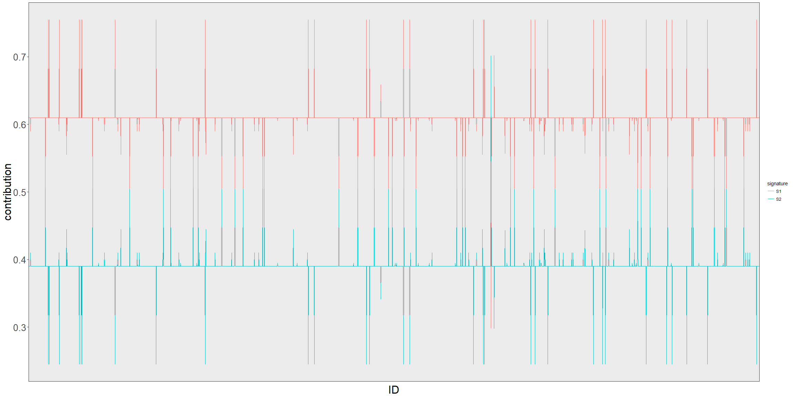
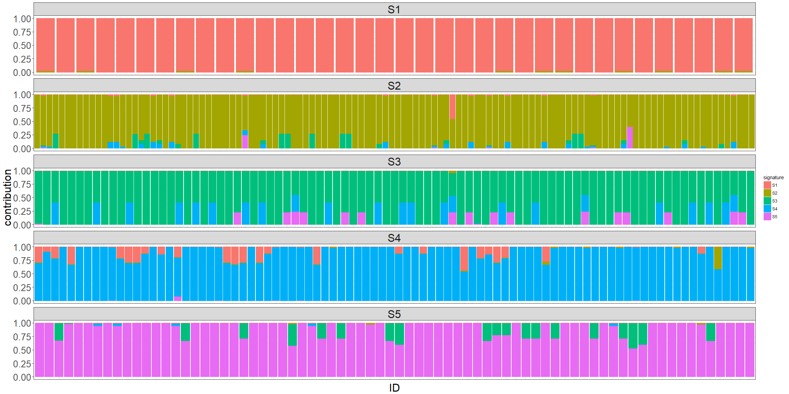

# doomsayer_diagnostics
`r format(Sys.Date())`  

#### Mutation spectrum per sample (M matrix)

Heatmap to visualize mutational spectra across all samples

### Combined mutation spectrum

These plots shows the total number of observations in each subtype, combined across all samples

#### All samples

<!-- -->

#### Kept samples

#### Dropped samples

### Signature loadings (H matrix)

Describes how each mutation subtype is loaded into the r signatures

<!-- -->

### Signature contributions per sample (W matrix)

Proportion each signature contributes to the mutation spectrum in each individual sample

<!-- -->

### Signature contributions per kept samples (W matrix)

Proportion each signature contributes to the mutation spectrum in each individual sample

<!-- -->

### Signature contributions per dropped samples (W matrix)

Proportion each signature contributes to the mutation spectrum in each individual sample
<!-- -->
