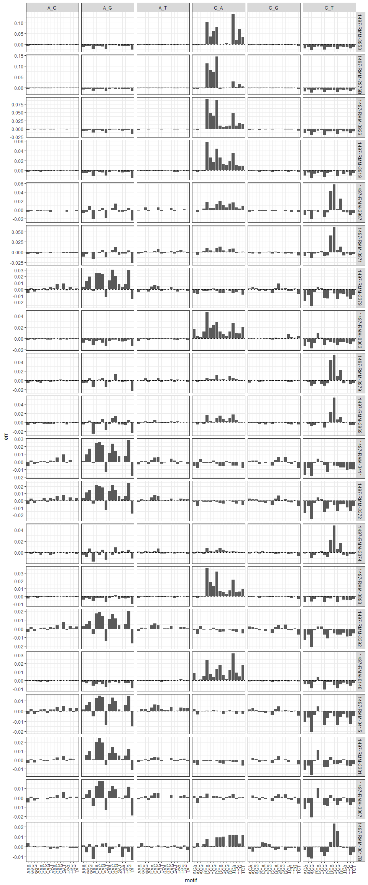

# doomsayer_diagnostics
`r format(Sys.Date())`  


#### Mutation spectrum per sample (M matrix)

Heatmap to visualize mutational spectra across all samples


### Combined mutation spectrum

These plots shows the total number of observations in each subtype, combined across all samples

#### All samples

<!-- -->

<!-- #### Kept samples -->


<!-- #### Dropped samples -->


### Signature loadings (H matrix)

Describes how each mutation subtype is loaded into the r signatures


```
## # A tibble: 3 x 4
##   rowname        S1        S2        S3
##     <chr>     <dbl>     <dbl>     <dbl>
## 1      S1        NA 0.9783121 0.8396949
## 2      S2 0.9783121        NA 0.7716099
## 3      S3 0.8396949 0.7716099        NA
```

```
## `mutate_each()` is deprecated.
## Use `mutate_all()`, `mutate_at()` or `mutate_if()` instead.
## To map `funs` over a selection of variables, use `mutate_at()`
```

<!-- -->

### Signature contributions per sample (W matrix)

Proportion each signature contributes to the mutation spectrum in each individual sample

<!-- -->

### Signature contributions per kept samples (W matrix)

Proportion each signature contributes to the mutation spectrum in each individual sample

<!-- -->

### Signature contributions per dropped samples (W matrix)

Proportion each signature contributes to the mutation spectrum in each individual sample
<!-- -->

### Outlier analysis

This plot shows detailed information about the top 50 IDs with the largest root mean squared error. The left panel shows the RMSE values, and each sample is colored by the mutation signature with the largest contribution.

The contributions of each mutation signature for each of these samples are broken down in the right panel. If the sample was identified as an outlier (by having a signature contribution >2 standard deviations from the mean), it is marked with a star.

<!-- -->

### Error profiles for top 20 outliers

<!-- -->

### Interactive heatmap of error profiles

IDs with similar error profiles are grouped together using hierarchical clustering.


```
## We recommend that you use the dev version of ggplot2 with `ggplotly()`
## Install it with: `devtools::install_github('hadley/ggplot2')`
## We recommend that you use the dev version of ggplot2 with `ggplotly()`
## Install it with: `devtools::install_github('hadley/ggplot2')`
```

```
## Warning: Specifying width/height in layout() is now deprecated.
## Please specify in ggplotly() or plot_ly()
```

<!--html_preserve--><div id="50384cbc767a" style="width:672px;height:480px;" class="plotly html-widget"></div>
<script type="application/json" data-for="50384cbc767a">{"x":{"data":[{"x":[1,2,3,4,5,6,7,8,9,10,11,12,13,14,15,16,17,18,19,20,21,22,23,24,25,26,27,28,29,30,31,32,33,34,35,36,37,38,39,40,41,42,43,44,45,46,47,48,49,50,51,52,53,54,55,56,57,58,59,60,61,62,63,64,65,66,67,68,69,70,71,72,73,74,75,76,77,78,79,80,81,82,83,84,85,86,87,88,89,90,91,92,93,94,95,96],"y":[1,2,3,4,5,6,7,8,9,10,11,12,13,14,15,16,17,18,19,20,21,22,23,24,25,26,27,28,29,30,31,32,33,34,35,36,37,38,39,40,41,42,43,44,45,46,47,48,49,50],"z":[[0.12005313393323,0.143462751220314,0.140777440332067,0.134395935357633,0.137850604663072,0.144122245853812,0.136057608063065,0.135205750741564,0.144608989413134,0.149598647356831,0.143817893407911,0.145984786228545,0.138371279942794,0.149269351612879,0.148424572666246,0.141546444465676,0.0891078594007203,0.106947234517647,0.108161381411128,0.0374274764388821,0.11167040024379,0.113695278664728,0.0947870031896055,0.0341777938176255,0.124158197343717,0.133007281295439,0.13004324614361,0.113424962934505,0.103431297299831,0.108000653501655,0.120916671157002,0.0169820134934191,0.131122361324777,0.145558880513888,0.142647668167854,0.13111491918889,0.144354685482015,0.145833896787662,0.140572505707229,0.132384629963611,0.142943853172964,0.146698759279436,0.141668099668705,0.131185648710795,0.133889769598153,0.14629647799148,0.148408812729005,0.134997920123677,0.128432934016832,0.126463546976307,0.150580079676195,0.144759375945301,0.749252994133512,0.368014185466211,0.50932322579416,0.629040298502403,0.167133570808094,0.155695678323519,0.1896993781491,0.17376972038015,0.978720488872556,0.27818306180142,0.565585992310702,0.357199371665994,0.131838023586949,0.13949491966219,0.151403041038184,0.125206541800583,0.144310529856987,0.137881825578159,0.152736385384388,0.131731443948073,0.144605874174557,0.141634123347942,0.152500543404831,0.136235392609646,0.137615614375472,0.136292446538639,0.15262978193155,0.110715550601574,0.0401296918314109,0.0850766055837613,0,0.0781545872374178,0.092454006537493,0.0942933460023955,0.018476719355319,0.0793019876763426,0.0841305581603468,0.0837520424856721,0.0275721905562259,0.0986673643617019,0.079076639844071,0.0879388776141142,0.0430538691447277,0.0802656624770047],[0.124471413455645,0.146678779358394,0.141056727285373,0.14644744240169,0.138417236973971,0.14025792122323,0.138213877870249,0.136703405887779,0.149084757904409,0.152334226894007,0.145376476912436,0.146453737035689,0.146563081371048,0.150502656989004,0.148583182528259,0.14894745634793,0.108248857756521,0.117972296986808,0.113502625364631,0.0773485412119257,0.119585174482919,0.118374468567696,0.112296991888951,0.05933358797132,0.129185660962645,0.134092294978048,0.126227172452158,0.119553557044499,0.114213825961196,0.118829173338026,0.120430423915964,0.0639707536157101,0.139404965477833,0.151249577808563,0.14482693356257,0.138451563323383,0.14788105456522,0.143521276882588,0.140409276830438,0.135917877825775,0.145369091765016,0.146145884526514,0.145349639224472,0.135415444004706,0.136227644854883,0.149679174395888,0.149422579884837,0.137415100311471,0.127750144143003,0.126196837955592,0.151166268185175,0.140251373836938,0.811393595092634,0.638878230265514,0.583364000662102,1,0.127647944113766,0.135902844599059,0.158289494806452,0.143097756629477,0.320738448150206,0.170697294094136,0.256236614661293,0.185985810025746,0.133274750374854,0.143153463630425,0.151508780946208,0.134684518559015,0.145887489934266,0.14221736078006,0.153193838397789,0.138749688733155,0.145415040293311,0.145383470040979,0.153253400180075,0.141914592110526,0.136475371488301,0.138478590712314,0.152788391793563,0.115538413183366,0.0570936845567351,0.108955462437066,0.0189340380677774,0.0961070917671512,0.102160660059505,0.1091470600956,0.0365705373129316,0.0906166552670449,0.0907166052837418,0.0939931941877934,0.0463223634107431,0.106595896158458,0.0929050889876491,0.104593709019816,0.063185639068886,0.10283878780205],[0.133779331744497,0.148867763664778,0.142614241941005,0.146751369354283,0.139698761098002,0.141109153439705,0.145912847711541,0.142737199315577,0.144889027088416,0.154485804806246,0.145507399291972,0.14823580843093,0.142039926231526,0.147518431682696,0.150374605522086,0.15156673256187,0.112168242917255,0.120221948309068,0.128030511258951,0.0850563891528085,0.1265309855177,0.128758175812696,0.113489439077765,0.0719855313607011,0.128951634249761,0.142558332648947,0.13824800131503,0.125484364513696,0.12064973812618,0.13023723574719,0.131155582882391,0.060382521580776,0.137618099908693,0.145636606315111,0.146987863073389,0.144836160071071,0.146987621780592,0.148764623484418,0.148052137080485,0.13929954607006,0.147188569554408,0.146585528032534,0.145817337526115,0.139073102780592,0.14017999735947,0.149435914459171,0.148842544026012,0.139360824681138,0.143536293539623,0.133834904031689,0.148528170399473,0.14631789785962,0.684510514225944,0.42759661744751,0.392438923872303,0.668357276861895,0.208211728788691,0.183397246092134,0.197813611725602,0.212669625030731,0.427794246117631,0.209383969445448,0.248541728745815,0.235042165223986,0.13496786320934,0.141988716113457,0.153955052587173,0.133692775615105,0.146158686291917,0.142516611933392,0.152281702416118,0.143221173331429,0.146266272509786,0.147296463815762,0.154329189136207,0.143850964881729,0.140198491453954,0.14150010403813,0.15457981478739,0.123564688973556,0.0749516865284327,0.117304368376484,0.0365019037360439,0.100774841559573,0.119822278461783,0.127692759684392,0.0480250025908108,0.107665507215964,0.104954473248679,0.115855219205617,0.057341979356669,0.128238040236335,0.104556292958724,0.105767453011238,0.0778677079644145,0.109868644848952],[0.13698177992624,0.151631030992909,0.144813698659633,0.148813137999842,0.137459345438608,0.14778981794383,0.150671808109941,0.144875725386952,0.149973612429679,0.151616502962115,0.14556556147801,0.152356969255341,0.151041908748841,0.153722724853663,0.150885398873532,0.146246338020792,0.125915735521057,0.124491087062507,0.139851154829106,0.0828003627261338,0.142621159835798,0.137635528574235,0.129627093731262,0.0947294695595075,0.139094296303258,0.152616323887435,0.152212707879045,0.133133598462712,0.132316866844995,0.135162769314395,0.13341834671498,0.0677690457065021,0.152747618171153,0.147060575386681,0.147617749258126,0.144695703536732,0.154343276338259,0.149402423058407,0.147707916897787,0.149656653622382,0.15192378978505,0.152874492018562,0.151730427772435,0.140486390001638,0.140066049454218,0.15097106297478,0.150377692541621,0.14365924052482,0.147625408812461,0.13434016046065,0.151958514391807,0.148157307617103,0.495581702283671,0.309669967830316,0.257461443881255,0.412425185629853,0.308914678451761,0.230659632655276,0.22006297534568,0.2634205177721,0.358925072941616,0.214907343645585,0.202069480624779,0.206555286897569,0.148593886513201,0.150418974632074,0.151231352205315,0.136598875944226,0.148937780398495,0.142410577417334,0.150966144327372,0.135645536352394,0.148346636395122,0.145620858765872,0.153730956508468,0.149668702462516,0.14059533690009,0.144363868959776,0.151326725814334,0.134951296618081,0.0913564119448909,0.131896192664081,0.0650556661262092,0.11533224382918,0.126311845640685,0.133782712955188,0.0782436881801673,0.119753221548556,0.135943893551849,0.147448017064554,0.0896228255864394,0.152130963355198,0.110545748636646,0.136653607259505,0.0952386263584726,0.121575340513854],[0.139907521198095,0.151515108501367,0.143255636056955,0.147499975059807,0.148706660098603,0.148942726078881,0.142883792107756,0.143144353299733,0.148112688918646,0.153995632168516,0.145017226654242,0.15066935522885,0.144047127233007,0.153707947415849,0.149457461947497,0.148985715128548,0.110252187394879,0.138131159861408,0.130403356917743,0.0859829098345868,0.130332839762951,0.139176516727954,0.112896430833408,0.0791647694766123,0.12673438605237,0.142304275564391,0.145144613426913,0.127493440936557,0.124772601999676,0.129493631165383,0.142833144234085,0.0772525621396167,0.133884448487971,0.148112912720718,0.146881901764715,0.139950499803487,0.150723148622694,0.149704709714049,0.146986272589477,0.146237667508672,0.14635694519531,0.148144065723131,0.14586072227434,0.144047407965947,0.139156892476266,0.152744470364356,0.152151099931197,0.138914036791575,0.2505712809181,0.178421984881166,0.169507946882182,0.225969169843123,0.427185632947702,0.265738061665362,0.294474599596169,0.324636983247037,0.228195719026679,0.20019908382592,0.179250065649939,0.228085213786094,0.316880199646401,0.211759940806637,0.209407435592891,0.27553870196144,0.15025079715852,0.151615066575024,0.156537945441875,0.155762609524735,0.157300814836277,0.146274456289998,0.157916593529647,0.144354615506488,0.162636763324057,0.149239837975894,0.159686455369712,0.16062735939914,0.20388580146692,0.169353549977709,0.164867376317611,0.17933540769418,0.074638803726478,0.115367245621028,0.051941685427466,0.107268050530235,0.2106826315338,0.164812537692367,0.0864288191112934,0.137529904999842,0.116718178955994,0.113512817887677,0.0826819855469177,0.114158001567411,0.114869297706137,0.109741595968197,0.0982774188581867,0.12402376288692],[0.148651688075833,0.150792939698764,0.150565512804903,0.15356058099203,0.152310319906337,0.152019283873495,0.146353346751468,0.155460631953603,0.162282076042623,0.155730409490343,0.152438979177635,0.156988852846092,0.15363179406157,0.152634377271106,0.153895166333281,0.147231571688279,0.121791790993869,0.132363856915822,0.153358506426651,0.120119806227046,0.137195213409232,0.138281510524503,0.137445797127113,0.130257171070867,0.148606646773451,0.150387235264986,0.143224087958571,0.141039624287768,0.152347611938066,0.137598820254554,0.143180953473525,0.101238957453567,0.137606439443985,0.149953110445216,0.148118261834889,0.155966540024795,0.148119186588575,0.161493886354798,0.157708334458376,0.151224703296211,0.155484790279121,0.150447540565155,0.155023707492394,0.142357089421273,0.145399654452304,0.153412132914332,0.151112669920756,0.140712639009054,0.218004185425273,0.17725517624703,0.169453440629555,0.197597389898787,0.302296606837912,0.205023666611072,0.211082584003983,0.234522425713386,0.221562094639518,0.185166238530152,0.165926905017171,0.19168138829109,0.282673699758535,0.183500036637163,0.182844305341567,0.232785965255395,0.156333632479319,0.154263487386296,0.155429235162948,0.157219129043101,0.151945874858408,0.152510762893261,0.155347771629771,0.153322533935118,0.156607705423378,0.155588020354603,0.158079327839073,0.156122238015121,0.170549215123796,0.172762142995961,0.164924745840372,0.156973319532023,0.105025024401689,0.129427620239927,0.0846406995877853,0.127683062900676,0.180160119197454,0.166540130808562,0.126648550824727,0.144228759888184,0.121180976001129,0.123768010536,0.132461291430029,0.131026723652879,0.135677306925035,0.12312785266446,0.122506931841646,0.129611044226433],[0.139363101168363,0.150032189642136,0.148657281667425,0.15514038916246,0.149254607687952,0.14954235521582,0.155326222683882,0.151396435036347,0.154204112411084,0.157158509286745,0.153685112478178,0.15635701313093,0.15801211971899,0.156948934782084,0.149249559903836,0.151407132817219,0.139654228582065,0.151083070829094,0.131720368490311,0.112888950644712,0.137349547734622,0.136289965110802,0.125015557773439,0.121128170391452,0.142730244986874,0.152482684801104,0.146747637291091,0.142149387157694,0.1415375249174,0.138579672783015,0.15608428184394,0.105083887429149,0.146235554465882,0.15579179402081,0.148977664111093,0.151247705359756,0.153131351961099,0.151280129024623,0.1474945771282,0.147944054468145,0.158694836823013,0.150695275207399,0.153383383078303,0.145428139583069,0.144103090948788,0.153616897442812,0.152411859375692,0.14103622783837,0.220997173213103,0.16041435311393,0.168897455101407,0.183170353228747,0.258497229510685,0.208014028447774,0.180021696916218,0.237568469656075,0.245705628933577,0.186642560343566,0.175243541860044,0.217548561275581,0.287698994887926,0.206480751907078,0.175196042848072,0.24742343612198,0.146400493864638,0.154973807239892,0.157254152024259,0.15361751733714,0.156326200515828,0.145130407123269,0.153674563142546,0.146061002465962,0.156534477187784,0.154420367192494,0.156888876644402,0.149879277285465,0.165628241881638,0.158580215016803,0.15345476916914,0.152504845460181,0.126400925281833,0.145316058544261,0.113167185490627,0.139924293433865,0.194175836388924,0.15499209176383,0.0996978744845683,0.132316787851618,0.141929871303901,0.137735505711333,0.101623132765691,0.133018686831688,0.144076651199637,0.142514416317506,0.123998591597713,0.14072496576009],[0.153289254900321,0.155603164601922,0.152392611891502,0.148341586097967,0.1443586992809,0.151239007271282,0.143090944503124,0.149422439454159,0.15263875103001,0.157157225619092,0.150217498273432,0.155336069462086,0.15522278123611,0.154297305311856,0.1520350473837,0.152152658460816,0.143110289778286,0.135309719352902,0.148839360235246,0.119125364649837,0.132791172603995,0.144846893648284,0.133230460197537,0.108471421333052,0.141026532759322,0.151255498530223,0.143480489184002,0.134804240879492,0.149616643830032,0.137146885743924,0.138068576932344,0.0994930156208624,0.152484805147534,0.154430749740236,0.153733296170187,0.151176604435067,0.154081194705312,0.155151884593699,0.152725451476314,0.145629958274284,0.150198098035405,0.151985218563226,0.155963911623841,0.153919743700066,0.155381466213302,0.163673221107056,0.152206900441308,0.149460582033578,0.206849372867509,0.156397828360228,0.160060615702185,0.185270504814655,0.295042249022674,0.200461355899883,0.181241181181182,0.233478918476088,0.260709065081179,0.193226135132161,0.163551397723863,0.225149870564122,0.344015919282497,0.210616372492876,0.181784752307628,0.259503675776948,0.149114880419871,0.151097558834089,0.154263063776185,0.149875126941031,0.147420827527164,0.150564314904287,0.158702404057755,0.141708228103545,0.152318770004135,0.148913432985366,0.154305780763558,0.150556269339736,0.146867011326387,0.15701292813425,0.152162900311794,0.147808119483483,0.130870228141157,0.131578817901319,0.100438051839943,0.145960883175508,0.180567960919183,0.150768040740963,0.0926121003856629,0.141546857440238,0.145453824255563,0.122979246901026,0.101065236543049,0.1288644530651,0.139240932542634,0.132310756133331,0.119907114916305,0.136365131225759],[0.140483238329171,0.152240571597661,0.151529772827842,0.144529971590181,0.146525180092206,0.153198099871405,0.148240445839715,0.148006884781441,0.149587240342524,0.153149318306355,0.155136461723971,0.152422497961291,0.150754757013616,0.154286209905625,0.153878391609652,0.152026773542703,0.129142406095398,0.145091210360299,0.134974211795718,0.122690962494841,0.143367012512909,0.144780321210194,0.144210939984991,0.112773973324011,0.145416889137903,0.15019732552396,0.165908825625333,0.137179068764328,0.141983278270459,0.138185744524476,0.146053023063353,0.0957566033112441,0.144043118693462,0.15232358140942,0.151626127839372,0.151039624110605,0.154899652143812,0.155521320528674,0.150952515137142,0.148545447499658,0.14746876507104,0.153172153074528,0.153096639472726,0.144142088141709,0.149105301708246,0.157880323186567,0.15415393877291,0.150003161098693,0.146393654598578,0.144213976422977,0.15461304517963,0.154288568994179,0.370610732526513,0.264910461567636,0.232660992348808,0.344578865316257,0.193309677185436,0.188852627333431,0.171880212390632,0.201333923436272,0.283242817601656,0.187353140973618,0.192267993517182,0.21204300692646,0.15160449781653,0.151778077085955,0.156083258327327,0.142988852070889,0.152593478538566,0.154735228803106,0.152160497723257,0.147837275740197,0.155222204960929,0.152888054079233,0.15464001275519,0.152434817509078,0.150669448152462,0.145012355870907,0.155342213642013,0.136453820390731,0.109083781499743,0.146579259269856,0.115085905853589,0.132650368069501,0.147147501362708,0.149746989402552,0.110392009517576,0.146216927641419,0.139030542882045,0.150281206305389,0.113476201858609,0.153736107554052,0.131562226495496,0.126889211872046,0.126109447026779,0.135528318423544],[0.149854044447248,0.152201723904167,0.154594803344842,0.152460975694983,0.151705085040749,0.153247559434742,0.146507936205675,0.151453830122623,0.152779425809791,0.158319061358261,0.157711846313212,0.154459227032641,0.15873477070855,0.155265501761144,0.158705517504076,0.153094372655112,0.158350209412543,0.129691512201447,0.147439184200858,0.140102303714761,0.145179467400022,0.130007135852976,0.149783821600939,0.147162581535818,0.145966156525753,0.150834450195378,0.146259954756823,0.16010052032691,0.151344822438834,0.148320380290974,0.156060503879525,0.14601648168294,0.143984847153279,0.158648780857244,0.154044771734902,0.154760753172448,0.150729074767494,0.155414039398418,0.148838090678862,0.149407746301547,0.147331898197342,0.153583653642094,0.15523138772428,0.157526730942394,0.148870865627606,0.157116943511468,0.157639731807527,0.153724290160536,0.148225533332613,0.154466055216194,0.157824654493644,0.153760525346189,0.264159840437889,0.244117646119694,0.189191323315561,0.299378936515348,0.16747337368956,0.164768707291431,0.161531914310149,0.166431033259337,0.198545508916973,0.17829806610957,0.164864283084093,0.193951831070973,0.152672546902202,0.152111432293327,0.15304826352698,0.15071455586523,0.154816534046951,0.146893431901662,0.154040486100896,0.150315091122439,0.158404678504823,0.156795059604849,0.154571579318352,0.151642302063858,0.15163947805793,0.152757483511937,0.155097615664736,0.14434642677536,0.147819131628791,0.142429905633574,0.126016656851067,0.147632453523814,0.138945013377002,0.153802373618003,0.142969962735092,0.131836718951255,0.148852597207477,0.159672786190295,0.141627917879191,0.141754218966086,0.147297979701244,0.146218039243017,0.149042410405731,0.136852027330008],[0.151901791418168,0.151596183557059,0.159515564404682,0.149591477234401,0.145485352578256,0.156506387099935,0.156453169361224,0.151911714079728,0.153825271972316,0.154382622965069,0.152636397606637,0.15386071794215,0.145842695269051,0.158011953230029,0.153647646939189,0.155254619732658,0.149099259585706,0.14232694677248,0.134973352063718,0.127311275956252,0.152227077068638,0.147107205340882,0.142796829888101,0.145459312874695,0.136354002521356,0.147938584522235,0.167243728212974,0.144289727630103,0.143296164235457,0.163138913524009,0.152501089992142,0.129199367009011,0.147248948260891,0.158025662368449,0.156215565697519,0.147423104166539,0.153472010608099,0.153680035622823,0.157126663882242,0.162090641855108,0.156757723899965,0.147974734969244,0.158509551345242,0.145162852026635,0.152680741400704,0.152620667939499,0.153696262157719,0.154731464411349,0.152516144646981,0.157052545596099,0.157226145403153,0.153658572124517,0.27369726070669,0.236484684333313,0.194057592136197,0.263769936117734,0.207886213871249,0.190740038745602,0.173146112117019,0.196896882471571,0.219966072560029,0.178652239030805,0.165362596766993,0.184741310970456,0.153093516761735,0.160382427355019,0.157481257788868,0.153917133477023,0.15083263467129,0.162387818048323,0.152899717973315,0.150750123495321,0.153318682913293,0.153374513036245,0.153999437440398,0.151003363247514,0.147627453655568,0.149308811916749,0.154514926901793,0.139132110749831,0.131700721452594,0.137127698899314,0.117546123248349,0.151713884952069,0.146406561648299,0.145137628183263,0.13171254793752,0.154289066243836,0.139636803664598,0.142619272144293,0.142186849517169,0.130888796727422,0.150300166498145,0.136996972257779,0.129068421288048,0.139882339153027],[0.150458664276669,0.150515125312812,0.152703879346095,0.156678748844539,0.153834514414173,0.156013235262822,0.147773523484747,0.152323127084465,0.155815233637666,0.148561580159952,0.155341010039786,0.151368522347226,0.145010382232988,0.159861749862941,0.155854768955972,0.150021483334685,0.151536557691914,0.147998337518967,0.15181184076799,0.136989431376516,0.14779426391579,0.144899678390029,0.129792951034463,0.136014457320664,0.152007596318961,0.150923527020201,0.13113691505469,0.154968012330495,0.146326112261772,0.155051512633918,0.146349563146418,0.142260457260032,0.15084904344343,0.151987459211794,0.154320358602189,0.142488462018304,0.151178811179687,0.160826138367093,0.151585951141954,0.15853989078017,0.151832163844191,0.15119500200368,0.152620595313544,0.145176272698348,0.148144091585551,0.151697938912669,0.154134921439895,0.145694493151001,0.211987653056203,0.161005222649126,0.16321893809739,0.174120063709573,0.243225509924818,0.203543645654995,0.20454596276213,0.214686490383136,0.200775629628621,0.1689617594457,0.171888560470435,0.18821249308142,0.24183829656175,0.172907786610856,0.178569405432092,0.217550051907283,0.155761800824984,0.154733134438927,0.152922105209553,0.146530962683017,0.15059731013482,0.15339151373707,0.157838698700744,0.159081121146317,0.155715719004127,0.15783850611154,0.158033853325971,0.152079677978495,0.167582372731798,0.161235566171032,0.153393201708393,0.157282238721205,0.126842264754921,0.138371020005985,0.128879417714092,0.129225293463913,0.161204934711246,0.15950642405626,0.135673497215041,0.154912491152611,0.137442697385517,0.121727393500913,0.139169107360473,0.143149968667156,0.134645762832516,0.137982466063398,0.119130818830916,0.141007997991551],[0.14390738837361,0.154067932629486,0.151429627829374,0.156454969756633,0.150763557024499,0.151800218114965,0.151495970650256,0.152099347996559,0.156267606567914,0.153156888811968,0.159098497918345,0.160615686267493,0.15273560226823,0.157480479301144,0.151267431397453,0.150452350361665,0.146587685570421,0.139100831766811,0.153133918845683,0.139789692570721,0.152434991751518,0.141823157284117,0.148241110729413,0.136630157421765,0.157049714184916,0.149029670101644,0.151126117160803,0.15275878899449,0.150551915257549,0.153082010572906,0.143879112632385,0.119796899339092,0.145755193715652,0.152361779622515,0.154236742366365,0.156775336427396,0.154400309892176,0.15122856731662,0.150529914996842,0.157421744302501,0.152720967517715,0.155537054571084,0.156321536575786,0.153402441186612,0.151408602104575,0.157526894652107,0.152303174853894,0.145963691422631,0.208568695913454,0.152199304226921,0.160379730889049,0.174898181527709,0.246171497687636,0.192504590616037,0.179529836015406,0.199038591882974,0.210908440883713,0.180988427619407,0.168577881805884,0.191972388337168,0.244178213732689,0.185632112705227,0.175258726767542,0.227952061433713,0.148286680535351,0.151309362541801,0.158786101662029,0.155074904965684,0.154136582641712,0.154619597108265,0.152313981945986,0.149879376409774,0.152841471082795,0.151659143241896,0.154693697664621,0.153709151379859,0.157979237965027,0.154126795198634,0.156501607188364,0.144861402649711,0.128217733110289,0.140765076416169,0.113731718704333,0.145680037817104,0.161705134202815,0.163360314018972,0.123865953867052,0.155913639096734,0.141048894979459,0.144989077220118,0.128409629064227,0.137516973434374,0.133311808360311,0.137254582183655,0.129885642864857,0.138997891501834],[0.148244485628659,0.149044793884777,0.15110321258101,0.150037734982592,0.143748859359985,0.147651141019841,0.149139282226667,0.147850685777271,0.151631706085915,0.15251516054913,0.156006047224698,0.15028175563953,0.14972613120231,0.156573206658686,0.154448364981375,0.148709730324985,0.145420323956667,0.151553470605703,0.146467697333653,0.113412603226088,0.139169018568477,0.155249442896641,0.143710250779554,0.107110848748454,0.141310909812081,0.151967168064872,0.168695928751565,0.133584561037604,0.139227684504944,0.151909145696431,0.146462535471437,0.115420848556751,0.151447672744672,0.156958917994637,0.156261464424588,0.160310297281097,0.153631336629244,0.152113683345638,0.162965996193869,0.152724972951759,0.154092906933608,0.156422170600102,0.15794241487492,0.150431684376054,0.156238073863502,0.162124033024229,0.163157092007149,0.148430971495421,0.19990536436479,0.167334998883251,0.163947902735623,0.171811234096551,0.213216813284381,0.183017013907215,0.168399272248641,0.211889523364126,0.212296890086722,0.197330102436175,0.168500405440646,0.202643692884134,0.23833068626428,0.204656843340017,0.166506960183293,0.23614493581931,0.155782602615339,0.157405685329967,0.155599616961162,0.15599318413312,0.154003786524674,0.158071578334238,0.155954079040796,0.145420489562664,0.144676113009643,0.157672486402335,0.154428153285013,0.164989021051186,0.154908896030364,0.150669215001202,0.155400715414521,0.144634524670765,0.133152197546958,0.146258337342346,0.111159110973017,0.143743702940652,0.156582314624505,0.154696982470309,0.126980321901918,0.142697386694091,0.174733599117362,0.169927565890657,0.139318722405622,0.164557660528725,0.125821293833725,0.122174063715406,0.135268216432921,0.138942476040599],[0.140209067860896,0.154948944092635,0.150346956350044,0.161828847756677,0.157691357047191,0.150707074401397,0.152565482330756,0.148548982546303,0.146796119369624,0.15122462257238,0.149070638520121,0.150514521229246,0.159537735479354,0.15617789090163,0.150920503883464,0.149768967567869,0.133910072871272,0.140851038676401,0.161539647686002,0.0966292129915991,0.138551728326238,0.135132187303376,0.144970808040884,0.0982361662531528,0.151975499632665,0.151831131787788,0.15381104048744,0.145720891499527,0.145917534545901,0.151335556986137,0.14716229709597,0.096909367912129,0.158867265125988,0.152140518920035,0.161417219794429,0.152248365623019,0.155249904652433,0.159438011270231,0.158802192356295,0.147287818779067,0.158809645014388,0.154297299577295,0.150955443245507,0.149925381376378,0.158304985424375,0.159405455937912,0.159861996498896,0.16171101255265,0.205581143550659,0.166013015334649,0.15807959266682,0.186486403836052,0.20898718859245,0.183544899116017,0.164493283035247,0.205869454231992,0.205726816423549,0.186129228900145,0.159190172481972,0.208043004948632,0.252665032882912,0.197586863214265,0.160096506975758,0.227493692665217,0.160096163546173,0.157544651318694,0.154291891342839,0.15341357303553,0.155227038790806,0.157410586560112,0.156135281705677,0.159578565197955,0.152714460488991,0.150513638356841,0.155848331001725,0.156909901751536,0.168843532324679,0.150145724359953,0.158800401628297,0.150936920347089,0.140241757911823,0.142114650857988,0.133112905135387,0.141726352334486,0.155882015886335,0.149873651714168,0.1252939310543,0.145060882729784,0.152372623865604,0.171189588007255,0.13119389960448,0.15876249559365,0.142546187492643,0.142814272836283,0.131694651833519,0.147853926417227],[0.139399180482943,0.147252513755816,0.147535237394369,0.145911031586053,0.148188643219004,0.147352609736699,0.145029163901352,0.145292364047264,0.150791031664041,0.152932915653127,0.162105430642419,0.156546989770134,0.152063682791764,0.152111673514504,0.154799779800242,0.153265609683039,0.133242362944084,0.138697557562367,0.149118329385704,0.107403494238465,0.139432343817051,0.134936206482193,0.152435388642461,0.105389129656257,0.148104830331895,0.15353038551764,0.156382158846961,0.142464128755759,0.143488160901909,0.151406429343785,0.140729116051745,0.0944172957916694,0.152576550022102,0.153457283093184,0.158098335553633,0.147434670844718,0.155534548043419,0.152916023411125,0.156070529354298,0.151594059782325,0.155437390137768,0.157224510665589,0.153873759227812,0.14833258042825,0.154114092308774,0.163427053550183,0.16176598191096,0.153872116275433,0.200473477540087,0.168859881979341,0.156709313612885,0.192927903006244,0.230901315899978,0.180937623352804,0.168034400680252,0.206767715689824,0.198368111623616,0.178895199828629,0.166993199845421,0.206788073782121,0.271082229585404,0.205941242902802,0.165666285761418,0.253215790796873,0.157746990100822,0.154296927925587,0.155475228926485,0.151518194239532,0.16052092504645,0.156431692168695,0.156855929534036,0.155049513810581,0.159449786646375,0.153520905398814,0.157022773479439,0.153706653888263,0.16549781852101,0.157637278769541,0.155801885447294,0.145758237734315,0.143025926080047,0.149036485750484,0.105405034698153,0.129731999120551,0.155258637243669,0.145655784791139,0.14524123022816,0.134926039398253,0.177614386275538,0.159462087972442,0.145740571251513,0.155834707525683,0.160821206745011,0.13273294438583,0.117022006253586,0.136348948276431],[0.141298908355935,0.149252628897369,0.151878761614856,0.149911261869101,0.148508648371709,0.145881966110463,0.146112855412645,0.149539880086963,0.148595980769121,0.154342451100706,0.14971048919871,0.152293634946853,0.151583641887824,0.153521208962084,0.149765288617336,0.149831210613364,0.125890604508711,0.140480907861918,0.144627840327302,0.100329542473984,0.145258122881462,0.15141862821454,0.140105868115356,0.0998207215204348,0.146114866711872,0.14896863675911,0.157078898243311,0.142741935426768,0.139740988809326,0.144267056663049,0.142246270897568,0.11256085146573,0.149159600953463,0.149394484935613,0.155941104052636,0.150252282043893,0.153301677754519,0.157221728237632,0.150538547266357,0.152446455842195,0.15394783681463,0.149215291924004,0.154366871045131,0.152674644952813,0.160838845002117,0.157457229039998,0.161934709487859,0.160444131697047,0.224935990445761,0.162786750808978,0.164351949632413,0.192746038166606,0.237156179211261,0.20344221959833,0.177505504872642,0.219871007747513,0.218866753944298,0.199149475784451,0.16838090620419,0.217661414942351,0.253273076973993,0.208291884111184,0.169266493016202,0.246406574790662,0.152802668315064,0.15438855701866,0.154711542567954,0.146136030031472,0.160401628080986,0.143120327094726,0.155615121663357,0.150925607474354,0.160818583308183,0.156643991141507,0.154619715917784,0.151129029966116,0.160610225826193,0.159614105126417,0.155781516054408,0.147673955912418,0.147615210011668,0.147191960922801,0.0949301241706703,0.138734673626689,0.150685210917567,0.141696226943921,0.110209191960839,0.131916345487676,0.17138121935359,0.177803498792126,0.107816742692805,0.164264252338592,0.155885576785092,0.135198503472136,0.123084853203059,0.13988074887311],[0.142499381462275,0.147131793076121,0.147607476428103,0.151701756730141,0.153825497840032,0.156786778918859,0.145855423748028,0.147346134970067,0.148160867839131,0.155481447988653,0.150273146539088,0.153883676101858,0.14990700923004,0.152398143411205,0.1477993616208,0.153558018926683,0.133250788529032,0.143752079934578,0.15914325640227,0.118685629065237,0.149918882402624,0.131943880618142,0.136962146739237,0.107435994361765,0.149636629345495,0.149998269703613,0.153896473089636,0.134133296861268,0.138118991266515,0.142200855956716,0.161898606045376,0.116674791269967,0.149952325544136,0.155538264512468,0.162381019071838,0.153698886251991,0.158055869882465,0.15210758160528,0.153600175399451,0.148375624361479,0.156136989957807,0.152645964795035,0.158877313715592,0.154096095075916,0.157522034334343,0.156933275477351,0.16388011317361,0.154170464865963,0.203003224964488,0.170183389476861,0.162527249253454,0.186237712111626,0.209434996683471,0.193785673907477,0.164149515282792,0.217112262446748,0.233347964500999,0.196427185131248,0.158617339413676,0.21505757846618,0.268517398576933,0.216665769738999,0.168314267627101,0.256336296055215,0.15720374704214,0.149030660928882,0.155761698823185,0.159015860069877,0.164055527098657,0.144792367778851,0.150389361957626,0.148000613985179,0.153649669046579,0.154693995482037,0.156335052353288,0.159343508509291,0.15496528452754,0.162839732317693,0.153512612511988,0.154649163857968,0.142569286987225,0.148203319686746,0.128901919946699,0.136752721579354,0.146737331873638,0.126879989739273,0.0702869480682136,0.123355500933204,0.181664054019362,0.193446478677029,0.115129038987668,0.152805778709501,0.142497630806968,0.123819780242056,0.123647416829124,0.13570280257842],[0.144990429177645,0.152839417660153,0.147578809435239,0.146242228751211,0.156488372179433,0.14914154614881,0.148461051768278,0.151373891304186,0.153935294406621,0.148313472433557,0.150855340728,0.153940922421008,0.142948995289533,0.152913535616658,0.152008500243255,0.145321036303474,0.138776943158091,0.142606627551864,0.149312231174526,0.143768458843135,0.138083534672215,0.137899601807333,0.123513732742082,0.107378485042882,0.158522520474615,0.156574407738888,0.160968892001575,0.142122007546104,0.144647350979903,0.155295885708058,0.150798167799352,0.109182010795717,0.156461661595953,0.147606712480146,0.164528501205785,0.153126160060751,0.147938613059025,0.157127987359828,0.160119067115575,0.158416435870576,0.158971690921237,0.156692832457768,0.162007889605661,0.147720275324321,0.155288551221804,0.158870795996673,0.165731720380918,0.158866328701008,0.193668480613349,0.174516488735581,0.160017002542891,0.17560497541598,0.218635786401267,0.170410941039409,0.16623019543328,0.220290441324675,0.197927922288074,0.186214371664966,0.155353071890171,0.209282976565709,0.239683050063824,0.19950449799646,0.164066906347474,0.22584119062069,0.146971909913821,0.151712646596897,0.154921764698228,0.144336255711614,0.158882318382058,0.154546860025616,0.155953826910551,0.140269467903116,0.156331654714594,0.15157288758964,0.155647833523804,0.151163772205232,0.154907950541753,0.148770989141207,0.15350305684768,0.139482746620654,0.14128049964019,0.148966720830782,0.112780812946161,0.150382167198362,0.142213031662831,0.15184841454504,0.123316238579922,0.152046251482434,0.180423044993573,0.187814948741321,0.115596477538604,0.168620929119744,0.158618211807807,0.161883322466033,0.11412173452604,0.157779192435203],[0.142895343057334,0.151397696025796,0.146023693964434,0.146296225816214,0.149538949919428,0.144438401791009,0.150928717636877,0.152810213232101,0.147876823718351,0.154806619494746,0.153733384290272,0.151440858313466,0.145827038851805,0.150526865345564,0.151908605673087,0.152702435083152,0.142648532715836,0.145606164510364,0.161415673284495,0.114569545967076,0.150810642882824,0.139022740758464,0.151794695513672,0.119727613798527,0.152191364608167,0.156555508766167,0.169219643527395,0.154552131899371,0.137425243542012,0.137007079806974,0.159853475592726,0.10728401396258,0.148213609923704,0.152263959332724,0.164906480660456,0.152402599390351,0.153273523076837,0.155022101826458,0.162600232250396,0.145805421349695,0.15655532226442,0.160318735369662,0.155525541957496,0.151005996726988,0.160620761386337,0.157429074362316,0.160788289084057,0.151366136378439,0.202677890902083,0.16070133966624,0.156782578351891,0.173269602356551,0.20679423005595,0.18703393748681,0.168754558220045,0.205838126889114,0.206189473226545,0.179119157329512,0.16348233001953,0.204614930299606,0.240374212495047,0.200087666297677,0.167692809259368,0.216777783267537,0.147744067942723,0.151893536764511,0.156854859623705,0.150726808349391,0.163409972278745,0.148825870993353,0.154498606009914,0.15083939336863,0.154042179160388,0.152798620964218,0.154983669624797,0.143199205123987,0.159208816765661,0.150701384213462,0.15660788808279,0.146181082528656,0.153797019297753,0.147981274395205,0.107605194269729,0.13567336670389,0.158660537648885,0.160433947873529,0.114485018605756,0.127242699694009,0.182356139919283,0.21707595824158,0.130853348242302,0.16212778205852,0.147918693386752,0.150873320921064,0.111961851927667,0.137508694250082],[0.149629243069562,0.153417866029494,0.158126582425373,0.149820553966042,0.14852658062638,0.148906237372998,0.144953678187138,0.148833405072892,0.151221835011385,0.157837635930595,0.151104878994289,0.155100625893988,0.146567006422745,0.151963684491646,0.150380985953008,0.156024746232658,0.129820001092931,0.146275747359927,0.161343004272035,0.114201013658386,0.136546814974792,0.141511999471833,0.12904006214755,0.121334612636664,0.154680623321535,0.145998371586494,0.1600304636328,0.146508476437492,0.157452195304301,0.145335177109144,0.157041846287736,0.109136907227142,0.151423181786103,0.1587754264923,0.164814918656098,0.151030834953178,0.156416517369489,0.156660176542561,0.16298004324685,0.145691159201808,0.156935894691235,0.150301833051806,0.164888708696068,0.150465000434868,0.151837899783762,0.157765007932552,0.161662934655271,0.153362844808189,0.196810260726399,0.153713169493034,0.15678181692153,0.182024433803012,0.210606045767573,0.180876535458367,0.163071574914324,0.200510731575363,0.201534706483802,0.186435646768995,0.163346129158476,0.209348314730688,0.230507835447278,0.210120415885871,0.162167204097391,0.228784541141836,0.161911765263939,0.15393564548126,0.15476582775912,0.150409767770703,0.151056620808923,0.152664194000366,0.150725337711884,0.146053755777535,0.160238890032418,0.153583227391796,0.154040162192689,0.151237530573222,0.158599720043015,0.146230502909913,0.157954668085236,0.147546755522534,0.152775512839848,0.140744164073547,0.122818478284867,0.151139398018993,0.145740444021797,0.147671993820779,0.111149763139765,0.124653503242137,0.197730609230202,0.20695987961529,0.127519615637033,0.178244503231463,0.140074770633589,0.139526247301345,0.116310856779196,0.145856445974278],[0.138269954374273,0.155767755589156,0.153371704501355,0.150146679323233,0.14921606026272,0.151591187231102,0.143935094879876,0.141526112253287,0.152897136503537,0.151855692735928,0.150874059677599,0.153860158211345,0.143500832402873,0.153700041415954,0.153716697368482,0.153770162713438,0.130458849395436,0.151410360288295,0.152749079906345,0.117337178051492,0.144157895798284,0.138064601290192,0.151229988844896,0.124914545780764,0.14323645268395,0.148678853973972,0.171760552391595,0.13758842671467,0.154581100835996,0.153979732808903,0.150782919912936,0.110716902679026,0.155731312645512,0.153968428077435,0.156469683489776,0.14953125397308,0.153378637330382,0.150758647819448,0.159234813688784,0.145144638626132,0.15008130556376,0.157199607728877,0.151717116075483,0.160019430989278,0.159401327587091,0.159666661270769,0.158007054510127,0.151160381779816,0.203530825734463,0.153294716409074,0.16042429465468,0.188564810828513,0.216878374554366,0.176584785324566,0.163204109876783,0.201852461925851,0.225961346817807,0.190527849880427,0.162690900130481,0.217870759565551,0.237276053476088,0.200484081702663,0.168838626928397,0.224211340357334,0.150750534433891,0.153195534510968,0.153864887845545,0.150925016051825,0.148212331164432,0.1489189644423,0.153107988722978,0.156589540717189,0.153549597318851,0.150823819689601,0.154346928510366,0.150469125622165,0.16222879536423,0.154383636838456,0.154190079487714,0.145132832216635,0.141730436246767,0.141968251030581,0.105136229469007,0.139191892354977,0.138034057158096,0.152991262202568,0.104421752346936,0.129435185990142,0.195563885966835,0.203019570506064,0.114572885705968,0.182875781134215,0.153725871770173,0.150204991301488,0.124843725712729,0.148477362086728],[0.14355269263409,0.155459541629701,0.15315957392403,0.145197702276618,0.144926893264167,0.150531337717129,0.146261863236879,0.15138200978249,0.150456449889175,0.152830103556896,0.151756644992052,0.155118561303029,0.154390228819472,0.15552217117357,0.153939472634932,0.146498675185494,0.128976867664532,0.139071719580761,0.156692234257147,0.106276100876053,0.14455074507809,0.14077783211349,0.152450593248166,0.0931536857265122,0.138575725783781,0.155401517400724,0.181788652872281,0.149993867866975,0.153946838041857,0.144306682919493,0.151177898130345,0.105906587771155,0.148651991881827,0.15544747749779,0.168803262948924,0.159483234884412,0.157774532400132,0.158919107475297,0.162160175089524,0.158046202626827,0.151778872374891,0.154883484060941,0.16480233108915,0.151718702449493,0.15721615367909,0.158855937649705,0.164850023007748,0.158007608153051,0.212501205638896,0.161028785972552,0.163753953397005,0.180679024319379,0.230177045710074,0.192411710726001,0.174408107066346,0.217967637473967,0.215079662779608,0.16868703666996,0.164799151096648,0.193962948580639,0.241358673337996,0.16681858550834,0.1684058500224,0.206399120190615,0.140881059905131,0.149312793791835,0.153176598233187,0.142875542342845,0.14479936266688,0.142621887735324,0.156968636691149,0.135961619531649,0.152614310751304,0.153401842877349,0.154818829669766,0.149566576494587,0.140597983793426,0.151414089935968,0.153753044706102,0.141732637346278,0.123489697049724,0.133431170224615,0.118962957540595,0.147692500037363,0.139224053059117,0.154117912162129,0.0999872552162364,0.141073285650827,0.221108568951374,0.243530686328256,0.13886342347374,0.185455129886854,0.149178259754943,0.130723683887817,0.121619991668946,0.153370705569351],[0.145595392846242,0.156279967158246,0.147829133962577,0.148202366020183,0.144415673834191,0.149152084521238,0.150139707582791,0.145160375291028,0.149963244386802,0.154996327844255,0.152148200474131,0.150698616508368,0.143803978025397,0.155926593746819,0.153030264177321,0.146457500493797,0.13399206389218,0.143712087545334,0.163460225234754,0.104986026520073,0.153138439680683,0.145427207041806,0.167916935812986,0.105023082443461,0.145459520582382,0.16097425458671,0.193361710581131,0.143675730192002,0.130051857917132,0.146319788821996,0.160181595688234,0.0869972095641368,0.157765059714513,0.153643214382802,0.170898718234879,0.146234980882359,0.155528532147508,0.156658953422381,0.159879433690701,0.152661720882449,0.150860656953421,0.148706884388603,0.158588416852425,0.149430240795992,0.154048077877686,0.160997714463847,0.159528590010096,0.152642427045457,0.188080852283844,0.155573535226769,0.155815552010557,0.170434147351652,0.194365456541992,0.171610177274141,0.158994915486057,0.205424005179815,0.242341663731057,0.196098295878721,0.163412177646079,0.230103440394161,0.233970488565062,0.176735351651034,0.163086990442994,0.178488617844419,0.146044227681319,0.153193211555994,0.155787133076428,0.140583220561975,0.146058951914874,0.151752969495729,0.153868756472962,0.144648390736115,0.14905467946782,0.151145548951801,0.153489758129473,0.155188208627007,0.144461674339104,0.150877136323652,0.155046088391114,0.146801875356967,0.124370993817303,0.141940375570891,0.0942659617253055,0.130709622311882,0.149428151245409,0.15119213358485,0.112172291576961,0.123199213395105,0.248628307636072,0.273597911109526,0.137480706061034,0.217455288695277,0.143168041468892,0.137039644055563,0.135244756553983,0.141213481920728],[0.177151869061112,0.153308269782947,0.160714450654696,0.152444954277606,0.153360097433672,0.161599524203091,0.152630787799028,0.142511743154881,0.148305178042421,0.144925156607467,0.158257108543913,0.152220501007206,0.155928352468098,0.149681503831519,0.148098805292881,0.149178204252323,0.164421792469857,0.123527004922844,0.1702659653312,0.0819947598412929,0.164667385193206,0.156195210304385,0.173710740042539,0.177173900169194,0.119165529890285,0.142447238308717,0.152366784932798,0.169539805273047,0.0966370232890013,0.145494736349763,0.124785629476863,0.0795185216396627,0.148433460652775,0.176484890540596,0.159054668882536,0.160319116834224,0.149606507471336,0.157075460358338,0.164445087187218,0.152733792504886,0.159596827084981,0.150228768887441,0.158567046778057,0.16252381095609,0.149971002939447,0.142606880031456,0.164323867049017,0.13697229637159,0.147638615416719,0.17618308618414,0.15558592846821,0.171590226462602,0.202161762429679,0.161496265888556,0.161277742234315,0.210593049005432,0.210384603378369,0.214934968720421,0.156499587178141,0.224971689441226,0.222478835925804,0.225670726432394,0.174335610865159,0.224014418240446,0.143165972002825,0.128672098979452,0.147467469880826,0.146785570328562,0.182130380078308,0.176439595391456,0.172999163080405,0.150850740502702,0.138868696459822,0.141720508193258,0.155126454399485,0.136567750652267,0.147713696804702,0.151064019717204,0.146726425195512,0.128691366014815,0.137680778844595,0.0932932872795693,0.0879647229861497,0.153142752932992,0.152271628174556,0.124740590972667,0.103243790776318,0.124520805824947,0.182818535645569,0.289564289672471,0.244712386159134,0.159548672964303,0.146679018950362,0.150621792773706,0.106561088741786,0.122851978962152],[0.150157978091518,0.154572039702455,0.150414670850064,0.166102206907082,0.149186798652839,0.153788627314366,0.149440217612968,0.161746585147008,0.164693697989489,0.16426186233891,0.158538149868591,0.170166107145039,0.167862532309655,0.166695313244243,0.161475016597714,0.185669240058824,0.138040916019366,0.165825739547103,0.140540807043548,0.131046180996602,0.179244159601188,0.186496558270996,0.156494119193077,0.197431959762286,0.14376104277828,0.16912326311384,0.156706986352647,0.171455246634358,0.156817241193257,0.185994000381631,0.169790165484104,0.197148606172093,0.152709539214496,0.159075901117275,0.171014314658879,0.145016105262816,0.162191442713301,0.169992368794668,0.176162348561934,0.154087151217016,0.16064367853759,0.156112865509614,0.171675407746384,0.151215836621783,0.140845404261584,0.156774367399086,0.163073288117716,0.153169363786661,0.152770092899109,0.125831986311158,0.160512762430396,0.158725165937472,0.142021117490337,0.145784883318368,0.159669724173863,0.160982293325829,0.149593203038561,0.135955577841154,0.161783860269536,0.181436482915618,0.155152583563009,0.149729110129833,0.16348693939932,0.199880040304235,0.19700279041644,0.152412212946776,0.161060599652463,0.182408932267641,0.148945885226962,0.140000407496154,0.151620602354827,0.140716947295165,0.163540607152325,0.147413152283433,0.159504396700558,0.156044977046079,0.181256546826595,0.14842234119235,0.157830672051184,0.17517659040794,0.241283896671821,0.146696268759676,0.123717246682355,0.187618315722239,0.146950530243192,0.12000612558405,0.0539913902668537,0.0970421460521586,0.20039534374936,0.129921092048429,0.099658237889536,0.148318012476157,0.146769523785196,0.106295310185731,0.0939647945951052,0.136446024775595],[0.155811745722871,0.166901601587363,0.145158028588389,0.159658871119229,0.164309164249691,0.162997063493917,0.14217437871908,0.166526294201253,0.164047603539975,0.164983364410321,0.152900712450383,0.168764752104844,0.165052574814771,0.167505156905508,0.155654566277297,0.17972549741393,0.168835603611456,0.161049426737695,0.175976773367849,0.0985867685775735,0.186633384941924,0.174664848266853,0.16036876422698,0.0814298909706931,0.173506180828969,0.171629668458245,0.176823722517355,0.158228785836,0.168084962737434,0.162941355443084,0.193435976784166,0.0838971429433286,0.173317703415969,0.174692722350055,0.179726185295099,0.173093028119531,0.187164119124353,0.18634335154357,0.180408705953951,0.170999832117199,0.172627121477401,0.161519679846219,0.176850681309336,0.164705580928033,0.19085405430719,0.1960954341724,0.196696004679912,0.201666300435901,0.186030728948741,0.142187188874984,0.154221065456131,0.177507146408883,0.181691330808259,0.161290153979215,0.156245595364635,0.168870468640603,0.173897768233433,0.148122033683057,0.149795922991556,0.169706048469577,0.195935643646416,0.154712931160788,0.155521615200689,0.158769944565142,0.17226294111659,0.155893952426215,0.156541421029727,0.154306141475011,0.150949669828898,0.141438274131945,0.150603344594009,0.137119162905683,0.160512960543912,0.160175064795946,0.156234934304429,0.159320494641289,0.171318537591579,0.147924583433608,0.157710681849463,0.141294355228481,0.120158752957036,0.131293285470945,0.0221898881774213,0.143143811751358,0.166714543217931,0.138434465172801,0.0580047401470856,0.120270376077664,0.164529873995801,0.130114105441456,0.0627809224057563,0.137542456259279,0.160576491500534,0.147087727590336,0.0792160708622566,0.155000409764973],[0.158970857176551,0.163377775708439,0.143086621850265,0.165064989780084,0.174108251875844,0.154631690744948,0.143930832608928,0.159491082837575,0.162638682106406,0.163199434343928,0.153611886238465,0.163603598156799,0.164588961127648,0.170601617186725,0.15196292609406,0.180567700870334,0.184654070172975,0.144084547281801,0.173214332055534,0.0994858958839182,0.13835825436895,0.136681954025623,0.123796313714319,0.0613747277578383,0.163860857473178,0.164813555270614,0.159332578201059,0.162932502621935,0.175958172529412,0.146882940255197,0.163103613022234,0.084864112198725,0.188464912760236,0.178558889908901,0.188521431685141,0.172139397662006,0.189619306408114,0.178623369475148,0.17605610276116,0.171863784427276,0.188454447296399,0.168617005836019,0.173109816095882,0.169984787603656,0.237211005865595,0.230627984462373,0.21998376127388,0.223793768790232,0.199167123885423,0.1369866549028,0.157222744158384,0.174387327634269,0.178403161182642,0.157078962007399,0.154595826901346,0.179829307959876,0.168370377565203,0.152819037397404,0.15469081257491,0.166605919707063,0.19346586978213,0.166200630727738,0.154671089033206,0.183141824738266,0.161477556080128,0.153342373923709,0.154472609679809,0.146422999331998,0.145542478074836,0.144724834117722,0.149679785701148,0.138609888977473,0.155524811676537,0.149448749795605,0.154117434470926,0.147646276506295,0.164502424403948,0.146837327919554,0.157386420541799,0.152808457879177,0.12577976476624,0.149181099928606,0.0447115186301008,0.13246717098297,0.146919917046604,0.135989035550453,0.0438483077530537,0.121796277145314,0.155251773108621,0.14953202599528,0.0803517251740333,0.137540846619148,0.171670478171394,0.128100129879728,0.0902448109718642,0.184164075231292],[0.160491404321378,0.15795955776948,0.148989371487789,0.157702294379766,0.156603857518899,0.158428067465967,0.147552500798488,0.152633870750548,0.158658880982162,0.162388802401662,0.153410396887388,0.154608557795693,0.162611296308545,0.166557173347104,0.152500442098335,0.16879833149099,0.144589870992999,0.14983007600225,0.152429548034175,0.115622978550796,0.149307698600736,0.154610334570652,0.154003644156237,0.102208288854949,0.162076543466738,0.158040205513519,0.167514677286844,0.142900114365068,0.143236871802138,0.149719025322113,0.157022690853084,0.0864528219298323,0.171154446549131,0.168448646309906,0.168463994609001,0.15584688194931,0.174447823138083,0.173256403841785,0.171252856618222,0.163586797806737,0.166154945334872,0.160457646236625,0.168689174373724,0.159245604465449,0.191224837433714,0.194997817414042,0.180148409597893,0.192232517068026,0.192242959749788,0.155602211163941,0.156191980583837,0.180198076403738,0.183487717673188,0.158930861267059,0.158088209660151,0.176593764062059,0.18994662978565,0.152085283913476,0.154735658342322,0.179817225772317,0.207155301007764,0.170786687776296,0.159990899565634,0.205144949813612,0.167080986293453,0.15504576813806,0.152457082964883,0.154430967219209,0.148451344395251,0.154165389614815,0.156159645238877,0.144240100010358,0.155031564106264,0.155869795822732,0.158102487466594,0.155350250431234,0.164144291469263,0.154307779802432,0.157062052298211,0.154050059880887,0.128826688259853,0.135634400414417,0.0730698923505519,0.14555328882225,0.153467361837262,0.136342549818151,0.0901309648138709,0.143286935035715,0.166212298416606,0.161049864255738,0.111244499332126,0.147789147391983,0.157247926666036,0.150498672452224,0.108469624273985,0.165354069361813],[0.143367486209288,0.15320198755768,0.15218864327282,0.157477449472489,0.155807770721194,0.15639901399374,0.146357272607219,0.144143525346543,0.152521782141502,0.159556464166684,0.154235885542229,0.161017105317175,0.153977723600636,0.159067751745297,0.153494696599605,0.161375521565512,0.150376628203063,0.154723065555372,0.159576964630978,0.114503755989742,0.165723206822469,0.152852729779073,0.162401229344145,0.0956525693824676,0.161365937586785,0.158453214172999,0.169082369667615,0.15071925969791,0.150551386920589,0.150647196811289,0.162889398341099,0.0902005217164818,0.161114139344531,0.164044142382244,0.165009337398487,0.156524141324508,0.170374181602468,0.173671079826453,0.170883117081794,0.162905065119918,0.171869560228807,0.158027784045646,0.164189185576773,0.153816305518252,0.18060828636283,0.187830921578166,0.174268892172023,0.18042740710651,0.211165474453786,0.14339629248408,0.156401819564012,0.181247271304321,0.195055172789223,0.165092359989174,0.159176281705521,0.179211790005299,0.196521137167536,0.161500466156165,0.157390894104638,0.179109954542973,0.216671498759017,0.162668277898024,0.161078971611005,0.206462258744756,0.164567839173913,0.156604595228888,0.159106009984752,0.15063877831572,0.149964096376653,0.151588965469439,0.155752167219197,0.142067819234169,0.158230835891295,0.156835177131043,0.156199459381921,0.152347479024581,0.164792677651443,0.154841811873725,0.157367376147675,0.146661653787994,0.12390641150531,0.142113422926956,0.0960310347603373,0.135847707324133,0.172477024784957,0.157976379344963,0.0993390327295762,0.139919954732783,0.159688786787403,0.138921327132598,0.106825518141363,0.148088330604753,0.154429984360976,0.14573662892857,0.107812291468272,0.161891604188951],[0.14355020862441,0.162217106086862,0.146480117772618,0.151419640636772,0.154083367113569,0.161407022297588,0.148858159401875,0.151337619608667,0.159045557517196,0.164766874291717,0.154262182801736,0.161517554356403,0.154292524436958,0.163335117762789,0.153205217760215,0.168465785191093,0.152300890982822,0.146978644538324,0.178318620928639,0.118104495186463,0.192505380830188,0.205789426647015,0.201495571269263,0.0915190233267433,0.178053586347487,0.180800102841175,0.173820961676928,0.157916662886318,0.153305319530061,0.155876694218544,0.183424806383619,0.0809416920283134,0.164807807135026,0.161251826222988,0.179785575946884,0.158212111907732,0.167756019479623,0.1799431677887,0.176462873087372,0.160700275018037,0.169948989514474,0.155557478699764,0.171666523963869,0.153007673496087,0.177334608446801,0.185342887351371,0.182917973747352,0.185869825239452,0.176196667499556,0.13189742391743,0.156641037548565,0.163517415128118,0.186792573851509,0.162053615868255,0.158586805122821,0.174771628352821,0.176145846346173,0.150781006564389,0.155334936042412,0.177995090063079,0.197314834897664,0.155023403327844,0.154689608320629,0.165939017781706,0.160067873025253,0.162250390445124,0.158151471710833,0.158720396378588,0.154438148404656,0.143863248595529,0.150911102974738,0.146301678015044,0.159848483074534,0.162617334957864,0.155348751744516,0.160517149368288,0.157289425143748,0.148124203055382,0.159547227391474,0.145039130291529,0.11573848270217,0.134144587018134,0.0599736605857791,0.145823006717985,0.173729018153194,0.133735600361045,0.095704960450563,0.11928148233142,0.181132756438156,0.158011291502849,0.0937356827900638,0.153005360839744,0.161281413140912,0.133172181474639,0.106345217865313,0.138701984138618],[0.147239102217017,0.161950374001694,0.140618470855357,0.15211466448552,0.156456205226505,0.155145948869722,0.148480624756461,0.151033219797296,0.159130066975696,0.162660282413263,0.153681876898989,0.167804435035155,0.150413948978922,0.166204609703754,0.15398083568165,0.163550118346733,0.147973360812485,0.161033564906454,0.174763650677882,0.106746389671236,0.20090448354042,0.216290719999321,0.205708640708349,0.104803098543207,0.165340042859054,0.188501123701153,0.190996330210702,0.154087987162841,0.15060350327157,0.164085743531009,0.201702941898998,0.085265564027996,0.162291271505292,0.164180877755173,0.171123170686086,0.149106496406122,0.170374555196375,0.177056556752196,0.179273662820782,0.152980791828169,0.156385835886666,0.156263019789246,0.165997131063208,0.158830309452677,0.16792153513179,0.179168524000313,0.180212242103049,0.172899209522279,0.183114611198814,0.135629243856579,0.160801635102038,0.15768071807802,0.184133683939502,0.158075612474429,0.161734403773468,0.167190098208612,0.16170850424498,0.144703870530754,0.154227767824077,0.164956598132493,0.175592045840857,0.158866025827239,0.159271524249839,0.165851821853806,0.153356130117931,0.164688046769677,0.158108545364291,0.146759721562559,0.154730687740826,0.156406801465591,0.151932418500018,0.136363943002751,0.160848764118434,0.162488555918297,0.157188611537773,0.161974215895764,0.152719741222777,0.147338925277053,0.159277437304218,0.137428249044009,0.12108587084512,0.129435606816746,0.064459578113919,0.152671730969945,0.173749080932941,0.152912874216854,0.119301618855333,0.124411666590375,0.170919486867351,0.141284277512869,0.131997404421106,0.140765236079275,0.162940765075328,0.123500692696595,0.134859743732923,0.137413450676989],[0.125941151583281,0.14631143858358,0.136984851367318,0.144028881241582,0.149102371923642,0.137869924915713,0.14096940246677,0.136427947185274,0.134817722250632,0.154661093496112,0.158663937166775,0.144310634578069,0.128040405654726,0.153839851357489,0.145766528226429,0.142181373052956,0.128425223259346,0.14381253594615,0.179296939644527,0.0102997553723187,0.1385061308552,0.138856857625674,0.200288139690186,0.0602525962080196,0.139044232290496,0.208673348085855,0.23938463233979,0.131310336980096,0.12716469780785,0.126330313211124,0.186347185121109,0.0133017285496541,0.140017387616751,0.153668326482977,0.165952122097809,0.14723848966525,0.148187265634621,0.18344478735096,0.153696737084778,0.142898477632147,0.15026771881914,0.148809527050726,0.168709812289564,0.143865594424466,0.170762740569418,0.165324066105038,0.15824007107941,0.159183275838276,0.152610620188437,0.128217681002544,0.154166686631495,0.140863795975857,0.252468761364937,0.172045860022984,0.154280911034949,0.205729738904994,0.240713521929089,0.203074827420384,0.175465254348592,0.212198512911196,0.25696610200246,0.182270497399421,0.152938288644256,0.163881421119462,0.148644183381499,0.141653348164331,0.150712782177047,0.136950255455823,0.149071672525146,0.130399638653356,0.154847153155678,0.137770113333729,0.152762980874497,0.156527827837657,0.152794177333034,0.141639133408021,0.136965346702262,0.127334420429826,0.149971737491734,0.127172746194064,0.157668175915504,0.139541316672169,0.110691225746454,0.118059218952474,0.14872818192639,0.162572547329535,0.090271858278334,0.151604412079724,0.289109500862247,0.475776893112506,0.193004778761244,0.229734374299248,0.151045439131206,0.161478837547019,0.119244203974502,0.117075633631722],[0.129269300607052,0.140341951377667,0.14984761257505,0.137739581353797,0.13684358482996,0.14508301159938,0.145458314240717,0.123967835386891,0.148521433526722,0.152458055972906,0.149129324982755,0.154247896171409,0.131806855337457,0.149753588992944,0.150054115295646,0.138095110688411,0.107555610777642,0.127870135897022,0.207272685061238,0.0345447023559506,0.148727553880516,0.138300068989489,0.182829512959613,0.0481594825695262,0.153351917680566,0.178588936101845,0.237832754408559,0.129190136184427,0.129012271399497,0.133105099235754,0.17613729632364,0.0117855018678017,0.14314421193578,0.150624338891426,0.185708157307377,0.141991464550552,0.155400352318288,0.151714126479929,0.187476296252196,0.13628936506253,0.154235493206572,0.148489714368895,0.175804410996025,0.138618569309767,0.150331428746576,0.152023004238269,0.158962533170608,0.152254350586829,0.152053831552253,0.126417292888705,0.153846873949664,0.172238992915445,0.257928645412282,0.175255521069432,0.178443021290928,0.234345109684785,0.272017416369337,0.218187811629129,0.184964215282943,0.237568571395043,0.252168911774703,0.18756470799216,0.170929586989539,0.199307229173843,0.132299133923179,0.141854672869014,0.151233919563556,0.137874042251705,0.135770610658377,0.135729500495649,0.150760890791133,0.136289537901721,0.140824006462588,0.156930477247024,0.153315314719543,0.132945471292347,0.148146207773303,0.127014607747995,0.150492874878242,0.127456907626284,0.0870409529678164,0.137184139922671,0.035657927751889,0.145312502277928,0.123653819102959,0.150159621009502,0.0565866700662974,0.118357524526783,0.399236211435619,0.492357869960273,0.163571526369151,0.304115464136698,0.131099613445325,0.121859813379164,0.0911258535596937,0.110750682493858],[0.123210521655339,0.148464498908638,0.148054659602638,0.130501506071114,0.149617054291934,0.151911982454473,0.151493084716502,0.143979380131565,0.152378155078375,0.153841904517729,0.150807997610335,0.149982070192108,0.139929402868428,0.150048413075725,0.148465714537087,0.147306682681454,0.0918761554052037,0.132406777483151,0.155697677357968,0.0599773609350656,0.157915117397723,0.149076033265314,0.187727242021533,0.0815101364656837,0.153327909204696,0.182921025474413,0.230342109959991,0.118570707170656,0.137110810454697,0.134669491518443,0.180854481647985,0.000257592129656431,0.135406760356546,0.146358512912125,0.1664668044661,0.159915232240039,0.150340325959679,0.167459845245285,0.202313534293294,0.134496412090118,0.149175466847963,0.153934836679224,0.174895930271884,0.138708841178671,0.172611294284326,0.187190619582884,0.165791504025702,0.144017522710984,0.153913047917757,0.122241738778367,0.15037524834973,0.168947911053319,0.213976808943647,0.17929278635901,0.165350719270269,0.216463596912752,0.235189374838727,0.177322504808941,0.163544813517535,0.201853562802485,0.206039026382053,0.146813681516456,0.15833666126549,0.161119347574281,0.14833967677135,0.137588846889713,0.153411968487705,0.134492688520675,0.153104730182409,0.150386194798997,0.162944712087616,0.138557858694815,0.163013600131434,0.14542657598504,0.155493363643692,0.134329319837169,0.140998404359525,0.135431979361764,0.152670923802391,0.111187804088389,0.106709656677859,0.149729048694688,0.0789000736760668,0.137436761877583,0.148087725088853,0.171121901395172,0.10606813867953,0.11068633634064,0.390765060835649,0.51079349835262,0.18577936647894,0.235248591826793,0.112038804341915,0.136787323289399,0.117238432172994,0.131327866928333],[0.124504867028285,0.144329711296758,0.160850489419827,0.132311217066056,0.122479297791581,0.151396616832477,0.150590206324987,0.138294541441727,0.144496092624075,0.147509893141399,0.164378852966503,0.153989004951511,0.143548824858312,0.149273387536716,0.14510595246414,0.145369118833977,0.124834511872002,0.128016284166259,0.181421144056735,0.0682548445826519,0.15895375706589,0.168982854209736,0.185410073828596,0.0682068494504419,0.138210956982541,0.155915076038322,0.236166664138629,0.142740168579552,0.133367489824249,0.143590193640852,0.163284599956357,0.021974124069079,0.161901298382379,0.15295018420545,0.183269569042634,0.139369147033057,0.156544484483543,0.147688785577282,0.187843754757758,0.139538032305484,0.157964361905748,0.146827799763903,0.169858264268489,0.138580988326194,0.166023577202973,0.158115299235042,0.157521928801883,0.133163210953244,0.156889251433285,0.131290293753136,0.149600222810721,0.149824024071819,0.185292955577411,0.176324491267832,0.175561812553536,0.22215634402665,0.16644408230217,0.176163920712182,0.163029447895539,0.20987138653303,0.185884408156153,0.173567879459448,0.15420187365361,0.162933012781136,0.13037832809829,0.162273673920605,0.16039115255049,0.131005073595239,0.14444764218913,0.156850013239786,0.1632043720046,0.145409189905123,0.156553735902558,0.148658485205464,0.154718338104683,0.148675200732317,0.134926052900167,0.135691639278748,0.151895898263383,0.145696211633029,0.154277508168351,0.139138351066019,0.0904134207561648,0.115732092574307,0.15920960518717,0.114265606072492,0.0901840693424546,0.119351332758153,0.408234769158541,0.475801358882105,0.208798152215427,0.283207910299067,0.12083165361173,0.1480370562406,0.1134990657544,0.124484444141968],[0.148110892473469,0.139788611333312,0.162593120500852,0.150261884571236,0.132746999811178,0.157051974772481,0.15366082773107,0.129840714619278,0.137998629231175,0.154564485522585,0.148799189646722,0.157130870473729,0.137679734569844,0.156956353022374,0.15858676412209,0.142084765079429,0.1340463760899,0.107824276766874,0.194332002785848,0.0612586723763956,0.163695765436688,0.128670083527159,0.182741269237636,0.0817460812836363,0.157904255568862,0.13383794932564,0.209049728649006,0.140498828685404,0.171568584903521,0.148403446127843,0.185348902727669,0.0927922004047464,0.1655290487767,0.143867984278628,0.172088517453993,0.163046416594435,0.151303767299506,0.166896199291384,0.195241743778845,0.14582176334992,0.143712688911025,0.148712919077199,0.155535347157631,0.143607973161708,0.147787933233077,0.152246208946574,0.161292167428591,0.139518186113874,0.145636955728276,0.163207657788439,0.154070078657968,0.140670580028803,0.199674292863269,0.168285305201235,0.163823631976599,0.182400702332194,0.20401680427736,0.186075402150938,0.171897915473897,0.163132396573687,0.168763022163025,0.16552869339285,0.152873883328552,0.147139617112891,0.14504464184898,0.157590085724865,0.163533018072708,0.143086650812008,0.168124911750507,0.15600790778689,0.161176764458917,0.150364930624501,0.136504216735525,0.143417768021428,0.149548865036812,0.154330558672321,0.136739928097328,0.143303360648183,0.153152644472276,0.117050377411254,0.14622549816085,0.161131409721138,0.0990553320450964,0.126829076105618,0.160453527455422,0.171116985878386,0.130399948027032,0.108513677808878,0.286726504181376,0.436149733596802,0.190750592711898,0.250422792928711,0.130671890934294,0.121762226204224,0.14044786512948,0.135581427673278],[0.139455933772229,0.164230989346847,0.145561331977937,0.150717603891729,0.158761733092773,0.157284366903396,0.151650883025389,0.159068557539284,0.158480451994142,0.172580644259378,0.15650150542911,0.170963146770412,0.153827279276131,0.165406114416942,0.156348959756163,0.167949102744513,0.162025317328584,0.180185170476577,0.200644086211739,0.130424586330419,0.224858572375184,0.226074937716583,0.196755668445916,0.109137037467872,0.193275656414992,0.212848389501513,0.196374880536696,0.178932943553785,0.171522848155221,0.184298965397099,0.219535268524266,0.0918667523100797,0.146706110266898,0.161733747398852,0.16701585872647,0.156032212263455,0.172086381295613,0.177369502803812,0.174705119325717,0.160779740535656,0.157467501164031,0.157759730467435,0.17063918748921,0.150416980186016,0.162071396379526,0.170636090489515,0.166305491995285,0.159106700118703,0.150508949619854,0.136244814058603,0.152278928671081,0.153158360717639,0.163746634257718,0.152752940373463,0.156877826747843,0.15648156297695,0.147388528190165,0.134373921645132,0.151725948885579,0.149240786116234,0.141946041579091,0.142521872442937,0.156164457010583,0.13945543121335,0.164637688324536,0.163054597141325,0.160174045288454,0.153710349941006,0.151020191654642,0.145703129773879,0.156322900450245,0.137220765779227,0.158704257912406,0.173169729364093,0.157397043965042,0.155684119221563,0.159842342973766,0.143759079968676,0.15905927779705,0.141652215982602,0.111592065943829,0.139487214261978,0.0780308489346547,0.135825618276711,0.192105830123679,0.159490374611161,0.107137660550779,0.130663449766523,0.162941846804338,0.138328504853778,0.115695763274506,0.136195467951804,0.150579326055518,0.121634492940995,0.116123743395729,0.130002780405886],[0.144430107998756,0.166838123107412,0.143388979232005,0.149775858641297,0.16377536230575,0.157892232416026,0.148448561092107,0.157020908422661,0.162339408390462,0.167622122666824,0.157130586081937,0.169310435600192,0.151241748737659,0.158226471127988,0.151600002353938,0.158673041388469,0.158255361032971,0.170702908306274,0.18287925217971,0.136353571229476,0.226293569636392,0.245591573146937,0.226022601232755,0.117013546370104,0.180581758347276,0.198790254426808,0.181326231261267,0.17262881288204,0.156006301548432,0.169885347362325,0.195696695070407,0.095872403639811,0.153330020369585,0.162156239155409,0.159945654514748,0.149521104613837,0.153078262428696,0.173097756696789,0.163764057541377,0.15101456670823,0.158470304623005,0.155213654915413,0.163493048598588,0.158253257938008,0.153858808609163,0.159755698831882,0.172780508034349,0.155545919931468,0.141321112200728,0.137913177862795,0.15149202807245,0.149132658493278,0.156296756651728,0.160251975011757,0.156650022711317,0.150605486568279,0.143751813324029,0.135692753077549,0.152880621702179,0.147776423996088,0.140685293061156,0.143877183567746,0.1514914342872,0.130531877523199,0.149041843663009,0.154899704203609,0.157050633328132,0.147588229649613,0.153086468699239,0.153448208294894,0.156711887808471,0.14307899042354,0.162040597439012,0.172932999445388,0.161149536578249,0.161223340598372,0.158633338700299,0.146347973883045,0.161857735901749,0.13851392755204,0.126235040342416,0.122311617814954,0.100640755302895,0.158043173910421,0.187464112667774,0.148567940754387,0.154252476881827,0.135057700372527,0.177572531944383,0.151582663728875,0.151443662688878,0.13878474994801,0.159737798615532,0.13240919697913,0.140744819188085,0.132497887876995],[0.140213721362979,0.157691920530239,0.151061046356779,0.156905563977861,0.151344546756989,0.161830401062096,0.157540683006398,0.156144226274877,0.154935256325343,0.164244433414197,0.157063169928496,0.177906733866791,0.155446821589863,0.161176763739945,0.154651924622817,0.154460426013844,0.146584512930463,0.182691242169291,0.177434756284746,0.137391017964325,0.222265357270084,0.241385761593739,0.24329797111694,0.134869262807191,0.175480136188062,0.196778539300641,0.179708710125694,0.158660216988534,0.160852605438139,0.168157643194178,0.198513166228829,0.08797067837266,0.149299786295941,0.162601753401371,0.159657872295634,0.151827405780603,0.162263460624082,0.167113659421245,0.165125249553337,0.154575648115302,0.155707175426762,0.156595724940296,0.161865963233958,0.156541649668225,0.155779469161104,0.162824727852472,0.166274926983517,0.154834512332894,0.148658858965869,0.129360657329026,0.158358600463975,0.15418976421925,0.156501026819095,0.155963390107806,0.155777111824627,0.14830874963092,0.14529538663697,0.141758612850616,0.154143955318428,0.150633640326891,0.153159886342748,0.141076069606811,0.156331945208709,0.137962700569378,0.154628986540154,0.164614939550168,0.156003894516346,0.146380998403349,0.149717332822497,0.148968688714135,0.155444782931128,0.145054742491884,0.155306096946681,0.171450310617046,0.159882431700906,0.164949696554655,0.151089572213624,0.152193467590497,0.157958562873834,0.129262324056851,0.112962767002641,0.131341105690945,0.103123916955265,0.163873582573322,0.190145751519315,0.152871882856058,0.147157257201564,0.128621557182064,0.163973480767746,0.139398885227197,0.149141404936084,0.150433981337302,0.152127626828705,0.139896122395585,0.135449501944259,0.131740952991484],[0.131853538610793,0.161711525481325,0.142462823612549,0.145062711079474,0.154621962541473,0.156246646209217,0.150871076237279,0.15691320991851,0.157369908050955,0.173037814789616,0.15380655746775,0.183068940977502,0.150861269355511,0.163617406618792,0.156412176443713,0.158242934260857,0.155112728411281,0.187057339734103,0.197819693546775,0.124611429130944,0.229128847956605,0.246409228891239,0.241177638237584,0.0988882573152432,0.17755503827998,0.2184107581918,0.201434569467917,0.166245093518268,0.153748525332233,0.174101759543257,0.235566435190943,0.0840393345819663,0.143366377540188,0.155632308531499,0.160226649442756,0.151703809563244,0.165241038307814,0.178753144533799,0.176621278412824,0.151725439800815,0.155807750318974,0.157264133691717,0.164369347509485,0.156599343199525,0.148542028532776,0.162120372181403,0.1621884760584,0.156951352497929,0.148043095880483,0.128238858493139,0.165267190513168,0.151158266156047,0.15327026554741,0.150941477960841,0.155790037419186,0.14880280307489,0.139799281081802,0.135419743236575,0.15729588830961,0.152687739095304,0.139701181164503,0.142893071671093,0.155708304394144,0.131780212802964,0.159311009089425,0.164060974573432,0.158712533153708,0.141808371763498,0.16075115058031,0.150760782877386,0.155694805229702,0.135289952974911,0.163057451054687,0.171907473853398,0.154840659518157,0.168739139242933,0.149637036222659,0.14571114172333,0.15731001415818,0.134056903804864,0.103264492034583,0.125403592357549,0.0913872986768603,0.161076963212842,0.191911663068564,0.153106761558956,0.186374020842036,0.114791120063887,0.155784492033573,0.141717818464803,0.166921108316761,0.131673385946756,0.138272281809847,0.119394191932288,0.138594169068827,0.127494958929477],[0.129479364416457,0.156154788367636,0.142509240855886,0.15478972953236,0.152430728816697,0.160094294213342,0.146625573149222,0.158208236304071,0.15978961721797,0.179188908284664,0.161284651493114,0.176480796704476,0.148771415072859,0.164834923886978,0.154902235443838,0.162966088918795,0.167359512067205,0.180545822307854,0.198393349242617,0.119772092488438,0.225075794256089,0.262203574134804,0.236431136081634,0.108220149188623,0.189568853448391,0.216486754467981,0.206004552123884,0.180893091332913,0.161462757484456,0.180022171918841,0.233738876728646,0.0746165361469749,0.14214031531661,0.157308982360922,0.155171875359025,0.143734584831831,0.167532328068669,0.182561596843879,0.170426055042955,0.151985448252423,0.152834726697889,0.157789084775708,0.164761827277255,0.165123728618252,0.152891639566917,0.164489612195021,0.162168657643713,0.157094656138058,0.143797151657097,0.123615759871281,0.169480719456413,0.148745337402995,0.150351321854339,0.152578956096219,0.164988052878079,0.148705034407383,0.142417256087733,0.134010740543437,0.157618521644623,0.146457813076721,0.140008047994891,0.135425809969637,0.154221792583573,0.12221948604424,0.160664167313061,0.163511712029365,0.158696766648966,0.148916532939738,0.157163069892405,0.151184354519195,0.154037067544309,0.137721376736665,0.164387621224348,0.174618724481446,0.159338508373162,0.173209065863169,0.148223981619519,0.147543274922949,0.166305711868212,0.12801713980519,0.0965736449128665,0.122958689459976,0.0897264730440536,0.14733564561804,0.173061050326456,0.160205936644184,0.164895123597525,0.1239292391431,0.15203557665966,0.133696801173775,0.159034408575082,0.122283002792488,0.140328838541353,0.12296474157408,0.139731530407318,0.13593284914005],[0.133277443667234,0.159028100185247,0.138048898562645,0.1538306485339,0.157978715658977,0.148881325872585,0.148616490013365,0.157148699675606,0.15857237016431,0.17306195724725,0.15413619797143,0.180570527220513,0.148219323285272,0.164851252314362,0.159289612271106,0.154898034654623,0.154155416263437,0.186053500538345,0.211299377537653,0.158128256306415,0.275296645477181,0.297412549409187,0.269845556817981,0.124773987466696,0.198886601022357,0.239043318568566,0.202601261393464,0.184212662018385,0.16054894118907,0.185035841512927,0.226994927352075,0.0889338993545357,0.140440221362493,0.152789110805365,0.158060069492244,0.145433850430656,0.16715654960073,0.176259778598593,0.171905806487259,0.146374829325525,0.157465387264807,0.157547247147775,0.169793482009076,0.148597787661769,0.150219856765858,0.162501587554546,0.164466108088608,0.148376328923362,0.135524465553954,0.124066567673512,0.156935994471616,0.145549781333673,0.14929922638362,0.14927550323903,0.157618639090041,0.147214738982915,0.134252466772458,0.130560738997759,0.152272063818896,0.14617504908104,0.140484899849319,0.140550479173718,0.154121336953567,0.117898251281684,0.156595103559793,0.16675625338078,0.160541134824562,0.142700288008967,0.152217606231581,0.146526821544729,0.153637519491182,0.137386524636473,0.158870016769652,0.178881047738228,0.157222537938591,0.158380944393735,0.144658642128227,0.15312474697523,0.156105358742086,0.125956149698625,0.0907515707458521,0.117735628493975,0.0586921698036782,0.149804032092978,0.221868292167722,0.15738966902272,0.111771181887719,0.108357001895532,0.17656672919648,0.129697600064061,0.129537939929784,0.136102019027326,0.159504645983332,0.118258012718595,0.112494688661061,0.129282742591031],[0.127017014089826,0.163134978948295,0.138550819692857,0.147160817892603,0.154177007074041,0.155635290714938,0.145086270371223,0.159758053953835,0.15681333159942,0.174121745077468,0.152899608914498,0.190040244876685,0.144993263476031,0.162940423159171,0.154011486231282,0.163337310416443,0.146937546825759,0.176102674863693,0.20523049104181,0.106327563489322,0.229550235075325,0.259054444496586,0.256510083875508,0.0792597452083449,0.197818859019606,0.22682488328998,0.206596102057304,0.157266332769073,0.149746063843768,0.169093907553671,0.22494430315944,0.045144867466949,0.145598070397523,0.158350289648102,0.166882725336326,0.142372881028678,0.170661758606458,0.186188771632207,0.184663600778644,0.153247335215828,0.156122978324587,0.153389336766746,0.17166932566513,0.151997176784209,0.152409835117477,0.167659436589575,0.171398463155188,0.160172926707093,0.168077218741498,0.123411119996213,0.168164750692678,0.158688209405381,0.181861954433478,0.155113663628556,0.16394657809736,0.164487224103724,0.162615217340934,0.142113026124866,0.158791692867347,0.164320114249721,0.17911521013132,0.147082829386889,0.157937934352862,0.160339087706507,0.154531326509759,0.169358957750586,0.16102975613787,0.141459795345493,0.159506741746555,0.147976639365691,0.153210915003847,0.133092869784047,0.165124806783791,0.176526410672315,0.161415865511725,0.176459510477716,0.146835320662941,0.142839405186191,0.162549092495358,0.120498476130148,0.0831104217751381,0.120816400662065,0.0345562810841479,0.153249823615283,0.217291290594186,0.156021092141834,0.110488906857238,0.106324738431528,0.174784268992921,0.137014345558348,0.109367114245957,0.136340111468088,0.157114444766156,0.125644582251298,0.110927193178495,0.129791745322286],[0.135195226360219,0.167643108174103,0.141718758592262,0.152645528390583,0.159899424395213,0.162180680059053,0.146660398981262,0.162121375268549,0.158596971754764,0.17641834673702,0.158077100913963,0.176814348915434,0.148894004524279,0.164319137862849,0.151671264413826,0.164151418119087,0.148368532823797,0.17615215413795,0.195674327403288,0.117649913718499,0.237876121832473,0.245408335741781,0.239962914841535,0.094557932201652,0.180695151568109,0.21691215941635,0.201922844779936,0.166736858408656,0.145141341722565,0.172024277167724,0.222142063891179,0.0736220499834532,0.153741038570558,0.160423282123464,0.16759912608576,0.154897099677032,0.172923604428348,0.185622349130345,0.183751923660746,0.160079284859682,0.159842403105417,0.157373687129261,0.179666221668105,0.154716081814288,0.167833298544054,0.174951237461839,0.179890454483872,0.17067119085592,0.157447605858739,0.126565937776067,0.155708716478457,0.153310695978506,0.165054329801088,0.157944373250731,0.159014818259893,0.160079731389245,0.151437398856959,0.138113250882275,0.157641332406923,0.159472940245913,0.160507543943767,0.144122586531961,0.153895377933804,0.143182439918409,0.165451894029172,0.16825137846663,0.157681477490438,0.142853095947809,0.153804631902362,0.140666133333493,0.152133346498606,0.136065883036728,0.167125007303912,0.17269811085745,0.156145411617998,0.162863933162097,0.14637972623384,0.142495127089548,0.15885555923189,0.122966553217484,0.105733700699049,0.120383417470351,0.0452430478577627,0.149173625415677,0.203886168941673,0.152882462577838,0.100952562436057,0.109408717294809,0.183440824467758,0.132884548822958,0.102232477978459,0.138220619595323,0.158165908570076,0.125295696633954,0.104552089558871,0.141966590093426],[0.141436568219836,0.169485635692307,0.139453997285654,0.151364600058086,0.164791830154701,0.168672298778766,0.14348636101064,0.165970446230296,0.165790231395347,0.177181446882997,0.152292844138228,0.184001060013492,0.15571978987766,0.173308934042644,0.15232887175724,0.170804267843361,0.165638129499782,0.190931514356647,0.208177221691067,0.124839147159357,0.230208805004908,0.242788520894809,0.235823599426805,0.0762500454132324,0.194931730709897,0.232905005141352,0.212975073786654,0.164555159356262,0.156146187289729,0.189192144662952,0.242229101356063,0.0679743736838376,0.157160762260288,0.170133951091935,0.16747496635648,0.152224594127456,0.175502472981402,0.194482829499016,0.18851779852977,0.166652008432074,0.161478687340923,0.159996589259713,0.177884739615358,0.157133719362781,0.159134200361501,0.175952909843368,0.173398008244803,0.172329078120476,0.166093901941858,0.13610882719751,0.155764040920748,0.153212316659497,0.158253497338739,0.155670278480764,0.161109015098639,0.158620711345623,0.156499955324719,0.141652956919946,0.1545872767843,0.161626225148581,0.154516630125627,0.140490635958098,0.153421997084331,0.139973288074098,0.165277152179971,0.171389888803856,0.163813562925861,0.148934599263311,0.150110808343684,0.142458492491426,0.154482976279525,0.131422926618036,0.168816615981709,0.181783087675712,0.15826678132752,0.16115602871871,0.158709533711191,0.150944513353094,0.157623820558868,0.13080055949486,0.0916610260859459,0.118851798518225,0.0363275454103206,0.132435407555579,0.183564776407188,0.156193081024697,0.0755808829993856,0.115097530853925,0.144417574324793,0.125662875032651,0.0780760902681884,0.120355590923152,0.138999327237156,0.120057570797811,0.0807518852706168,0.127457040965393],[0.134392984121867,0.166034575151943,0.13925770875416,0.152327344226258,0.160424241937381,0.163034546390167,0.147259330252187,0.168799475037731,0.163846044569763,0.180013352381107,0.154147579916934,0.201859843301503,0.146804146710148,0.175439362031435,0.157532208774522,0.17184929238074,0.17282184351468,0.189237087427159,0.210545881764909,0.118728059879762,0.258081727362528,0.266070111648834,0.241643383187098,0.0765460218002519,0.219570038942357,0.254349162358169,0.224184330483141,0.177630658594213,0.153373548635603,0.186216004701745,0.277507937524726,0.058018147309087,0.140622716768728,0.162209903195059,0.158134976234984,0.152236164036942,0.177667547551806,0.19274506276887,0.178639453292003,0.15647199657255,0.156988397742446,0.158587880859726,0.172658346974879,0.156556402628914,0.152480316635845,0.166061556350749,0.169596208949779,0.157016460752203,0.14753949977064,0.121978319201089,0.172388723915414,0.150288083423893,0.152699463664655,0.151588471939731,0.162558165559505,0.146495032217174,0.134057116355428,0.136731107591897,0.156466548629487,0.151407230622416,0.143763595519173,0.136072516213638,0.153390248242322,0.125001298945295,0.170682594257233,0.1675130429642,0.161540275672377,0.145832839132356,0.155250647676948,0.14242964138902,0.152991987510331,0.127756794861105,0.167065840996945,0.181790342549215,0.16193293413338,0.184143081430382,0.148398169349557,0.146119369945426,0.159485769113219,0.117146368324929,0.0817581868793232,0.117535502051797,0.0353865658623664,0.144706969981723,0.169865912336228,0.170443497907607,0.116526364757261,0.0913499232296026,0.148591855945881,0.124271532021415,0.116881033521849,0.11629690315257,0.12926967884138,0.103378104386634,0.110457841933279,0.124750797734771],[0.122417603442765,0.165296950079092,0.138071489232135,0.148491547784384,0.159438584395267,0.15914482722445,0.14347422036663,0.164532316905786,0.161542616963957,0.186758570558311,0.155718762662002,0.212452690367419,0.147396164348424,0.17032784560222,0.152095032058278,0.157212482234741,0.162802588703418,0.21085845143856,0.254435682472552,0.145935383908293,0.29470757168207,0.305341204597991,0.284313510575793,0.0799449959384575,0.220690402791422,0.29271552205207,0.23874124816395,0.195766723868053,0.154080915877995,0.200275805522501,0.319260366887498,0.0494288161985285,0.134698111593926,0.158878788071232,0.157765081626014,0.139382991363799,0.166548397817467,0.189502355987594,0.189671206404724,0.142620241787865,0.150398435200948,0.152809935041493,0.179546988341126,0.165772176695006,0.138733171131379,0.158632615724093,0.157206739540654,0.142717183540724,0.124496748036281,0.109793740062109,0.176482221128067,0.144077703893267,0.147885574138312,0.145805125808884,0.165981997215672,0.141748010084431,0.124806796369355,0.123737747897063,0.159122577783828,0.143306460294129,0.128409669427781,0.12619027255764,0.152691457178798,0.111131219278741,0.157985769342212,0.166342984178955,0.165574469949133,0.137712651799377,0.152162164709828,0.146679506460531,0.154476905957549,0.126584592031158,0.166383210670201,0.194668272238449,0.160163313352718,0.19034802044768,0.14567525270123,0.140076138798327,0.1615034022627,0.110960786011108,0.0589731359162098,0.105907342708943,0.0462209328613701,0.148235350617185,0.180830757854811,0.159417044604989,0.129141092861115,0.0799439070167318,0.150313966036187,0.125944047678112,0.123800884138097,0.11251608135636,0.112924694895609,0.0943898134615155,0.100571229786101,0.0995448054166482],[0.121242449512614,0.16920982076524,0.13548374265532,0.151091453811124,0.160916205322655,0.169308128910188,0.144262433700629,0.175252737033061,0.167409162204506,0.201806469753375,0.156686318352836,0.20785892860347,0.144205068371794,0.174908271722142,0.154568464558981,0.16446976796228,0.178592176225619,0.233538063559996,0.271405357405608,0.139779233569343,0.305566564886441,0.30556941890442,0.290271281640394,0.0825603504021246,0.236847251442045,0.334154709538499,0.273944690739528,0.203451011576989,0.173361893682062,0.20202129374007,0.332024865146112,0.0643407833078119,0.132287768832009,0.153911421355099,0.154281445511667,0.136830666740224,0.179472972810983,0.193781371506816,0.188928341883719,0.143732540129002,0.152993641897048,0.154780762424869,0.174075900212552,0.151604892851628,0.135502776117633,0.153434154115558,0.158940656405813,0.14128408917939,0.125042235226132,0.109751386187766,0.155868011099288,0.141521502185816,0.141742231245322,0.146154940059573,0.163302082770828,0.137211288283797,0.12255752684001,0.123600465366103,0.158828921350821,0.138452291358936,0.124804259117978,0.131961066894808,0.154225001774154,0.107472117891434,0.163379315792919,0.173811157132753,0.170036998957476,0.142054228859087,0.150906474163334,0.140640784933906,0.152736057171287,0.124769844501247,0.165467935713231,0.210016171690632,0.161901107301753,0.169331655535538,0.141545091066018,0.141387987162503,0.16334857836686,0.111737368093362,0.0505016313710024,0.105096395069871,0.00616484604656557,0.126813775984626,0.178336763740571,0.167367026912803,0.0786302206189266,0.0729879719909655,0.144419399062873,0.116281352669477,0.0699882447780275,0.116925447485205,0.115733255557679,0.0905491371269092,0.0690350511663754,0.103846789390251],[0.127939886653095,0.170509286673848,0.135149528538652,0.151885361015962,0.161081368980142,0.174372008017415,0.144688653530535,0.174728574544291,0.168096560198854,0.191033658334547,0.151877497476418,0.200125650336875,0.151612729571395,0.179850955133623,0.155991115311169,0.174279835203203,0.173702240813325,0.220599270047898,0.24369117016399,0.131425869801288,0.283319376035263,0.27135851208017,0.261341433627617,0.07699146155526,0.232590312355448,0.280601705018001,0.241651346177688,0.191044794615098,0.167312474830555,0.191641411881239,0.300742820980225,0.0510593311188604,0.142563618596683,0.164122527237194,0.161741336244547,0.149899527480014,0.182487538260596,0.200301344126621,0.189262769486442,0.154618438162112,0.159563610918135,0.15850132965383,0.173169394361642,0.157276648091276,0.149152373151209,0.170971379689384,0.168694271833627,0.165441402167667,0.143937367669509,0.11194698523583,0.156216911701155,0.147943166170571,0.147631227185722,0.144981014118566,0.161900421425592,0.145442016172638,0.138862263519864,0.129683692954418,0.157381302895954,0.151126324885218,0.14278854143865,0.131862941247938,0.152146467636032,0.118136522445971,0.171221610883978,0.169858906701945,0.166895209372574,0.142971412401537,0.147465963365911,0.138407703833862,0.150939538114558,0.12229859428948,0.172276104343914,0.197267235056371,0.159910326099054,0.16983733623133,0.145850616868596,0.140911770931257,0.158383068890549,0.113981065888965,0.0571386384024734,0.108639528276264,0.00662056083895099,0.137417872422059,0.180332224693317,0.167373665312635,0.0624388450352747,0.0891340614209081,0.14687219797977,0.117975767783266,0.0697065651748412,0.12415362451813,0.127093502666631,0.100340448092817,0.0724529188873227,0.11197740248433]],"text":[["value: -6.228457e-03<br />column: A_C_AAA<br />row: 1497-RMM-3953","value: -2.212108e-03<br />column: A_C_AAC<br />row: 1497-RMM-3953","value: -2.672822e-03<br />column: A_C_AAG<br />row: 1497-RMM-3953","value: -3.767686e-03<br />column: A_C_AAT<br />row: 1497-RMM-3953","value: -3.174974e-03<br />column: A_C_CAA<br />row: 1497-RMM-3953","value: -2.098959e-03<br />column: A_C_CAC<br />row: 1497-RMM-3953","value: -3.482596e-03<br />column: A_C_CAG<br />row: 1497-RMM-3953","value: -3.628748e-03<br />column: A_C_CAT<br />row: 1497-RMM-3953","value: -2.015449e-03<br />column: A_C_GAA<br />row: 1497-RMM-3953","value: -1.159382e-03<br />column: A_C_GAC<br />row: 1497-RMM-3953","value: -2.151176e-03<br />column: A_C_GAG<br />row: 1497-RMM-3953","value: -1.779406e-03<br />column: A_C_GAT<br />row: 1497-RMM-3953","value: -3.085643e-03<br />column: A_C_TAA<br />row: 1497-RMM-3953","value: -1.215879e-03<br />column: A_C_TAC<br />row: 1497-RMM-3953","value: -1.360816e-03<br />column: A_C_TAG<br />row: 1497-RMM-3953","value: -2.540885e-03<br />column: A_C_TAT<br />row: 1497-RMM-3953","value: -1.153769e-02<br />column: A_G_AAA<br />row: 1497-RMM-3953","value: -8.477015e-03<br />column: A_G_AAC<br />row: 1497-RMM-3953","value: -8.268705e-03<br />column: A_G_AAG<br />row: 1497-RMM-3953","value: -2.040440e-02<br />column: A_G_AAT<br />row: 1497-RMM-3953","value: -7.666669e-03<br />column: A_G_CAA<br />row: 1497-RMM-3953","value: -7.319264e-03<br />column: A_G_CAC<br />row: 1497-RMM-3953","value: -1.056333e-02<br />column: A_G_CAG<br />row: 1497-RMM-3953","value: -2.096195e-02<br />column: A_G_CAT<br />row: 1497-RMM-3953","value: -5.524158e-03<br />column: A_G_GAA<br />row: 1497-RMM-3953","value: -4.005935e-03<br />column: A_G_GAC<br />row: 1497-RMM-3953","value: -4.514470e-03<br />column: A_G_GAG<br />row: 1497-RMM-3953","value: -7.365641e-03<br />column: A_G_GAT<br />row: 1497-RMM-3953","value: -9.080238e-03<br />column: A_G_TAA<br />row: 1497-RMM-3953","value: -8.296281e-03<br />column: A_G_TAC<br />row: 1497-RMM-3953","value: -6.080301e-03<br />column: A_G_TAG<br />row: 1497-RMM-3953","value: -2.391220e-02<br />column: A_G_TAT<br />row: 1497-RMM-3953","value: -4.329328e-03<br />column: A_T_AAA<br />row: 1497-RMM-3953","value: -1.852478e-03<br />column: A_T_AAC<br />row: 1497-RMM-3953","value: -2.351950e-03<br />column: A_T_AAG<br />row: 1497-RMM-3953","value: -4.330605e-03<br />column: A_T_AAT<br />row: 1497-RMM-3953","value: -2.059080e-03<br />column: A_T_CAA<br />row: 1497-RMM-3953","value: -1.805294e-03<br />column: A_T_CAC<br />row: 1497-RMM-3953","value: -2.707982e-03<br />column: A_T_CAG<br />row: 1497-RMM-3953","value: -4.112763e-03<br />column: A_T_CAT<br />row: 1497-RMM-3953","value: -2.301134e-03<br />column: A_T_GAA<br />row: 1497-RMM-3953","value: -1.656911e-03<br />column: A_T_GAC<br />row: 1497-RMM-3953","value: -2.520013e-03<br />column: A_T_GAG<br />row: 1497-RMM-3953","value: -4.318470e-03<br />column: A_T_GAT<br />row: 1497-RMM-3953","value: -3.854528e-03<br />column: A_T_TAA<br />row: 1497-RMM-3953","value: -1.725930e-03<br />column: A_T_TAC<br />row: 1497-RMM-3953","value: -1.363520e-03<br />column: A_T_TAG<br />row: 1497-RMM-3953","value: -3.664405e-03<br />column: A_T_TAT<br />row: 1497-RMM-3953","value: -4.790749e-03<br />column: C_A_ACA<br />row: 1497-RMM-3953","value: -5.128633e-03<br />column: C_A_ACC<br />row: 1497-RMM-3953","value: -9.909994e-04<br />column: C_A_ACG<br />row: 1497-RMM-3953","value: -1.989648e-03<br />column: C_A_ACT<br />row: 1497-RMM-3953","value:  1.017223e-01<br />column: C_A_CCA<br />row: 1497-RMM-3953","value:  3.631381e-02<br />column: C_A_CCC<br />row: 1497-RMM-3953","value:  6.055797e-02<br />column: C_A_CCG<br />row: 1497-RMM-3953","value:  8.109763e-02<br />column: C_A_CCT<br />row: 1497-RMM-3953","value:  1.849056e-03<br />column: C_A_GCA<br />row: 1497-RMM-3953","value: -1.133245e-04<br />column: C_A_GCC<br />row: 1497-RMM-3953","value:  5.720634e-03<br />column: C_A_GCG<br />row: 1497-RMM-3953","value:  2.987609e-03<br />column: C_A_GCT<br />row: 1497-RMM-3953","value:  1.410917e-01<br />column: C_A_TCA<br />row: 1497-RMM-3953","value:  2.090163e-02<br />column: C_A_TCC<br />row: 1497-RMM-3953","value:  7.021088e-02<br />column: C_A_TCG<br />row: 1497-RMM-3953","value:  3.445833e-02<br />column: C_A_TCT<br />row: 1497-RMM-3953","value: -4.206543e-03<br />column: C_G_ACA<br />row: 1497-RMM-3953","value: -2.892862e-03<br />column: C_G_ACC<br />row: 1497-RMM-3953","value: -8.498052e-04<br />column: C_G_ACG<br />row: 1497-RMM-3953","value: -5.344295e-03<br />column: C_G_ACT<br />row: 1497-RMM-3953","value: -2.066656e-03<br />column: C_G_CCA<br />row: 1497-RMM-3953","value: -3.169618e-03<br />column: C_G_CCC<br />row: 1497-RMM-3953","value: -6.210456e-04<br />column: C_G_CCG<br />row: 1497-RMM-3953","value: -4.224829e-03<br />column: C_G_CCT<br />row: 1497-RMM-3953","value: -2.015984e-03<br />column: C_G_GCA<br />row: 1497-RMM-3953","value: -2.525842e-03<br />column: C_G_GCC<br />row: 1497-RMM-3953","value: -6.615086e-04<br />column: C_G_GCG<br />row: 1497-RMM-3953","value: -3.452094e-03<br />column: C_G_GCT<br />row: 1497-RMM-3953","value: -3.215291e-03<br />column: C_G_TCA<br />row: 1497-RMM-3953","value: -3.442305e-03<br />column: C_G_TCC<br />row: 1497-RMM-3953","value: -6.393353e-04<br />column: C_G_TCG<br />row: 1497-RMM-3953","value: -7.830491e-03<br />column: C_G_TCT<br />row: 1497-RMM-3953","value: -1.994079e-02<br />column: C_T_ACA<br />row: 1497-RMM-3953","value: -1.222932e-02<br />column: C_T_ACC<br />row: 1497-RMM-3953","value: -2.682578e-02<br />column: C_T_ACG<br />row: 1497-RMM-3953","value: -1.341692e-02<br />column: C_T_ACT<br />row: 1497-RMM-3953","value: -1.096359e-02<br />column: C_T_CCA<br />row: 1497-RMM-3953","value: -1.064802e-02<br />column: C_T_CCC<br />row: 1497-RMM-3953","value: -2.365575e-02<br />column: C_T_CCG<br />row: 1497-RMM-3953","value: -1.322006e-02<br />column: C_T_CCT<br />row: 1497-RMM-3953","value: -1.239163e-02<br />column: C_T_GCA<br />row: 1497-RMM-3953","value: -1.245658e-02<br />column: C_T_GCC<br />row: 1497-RMM-3953","value: -2.209526e-02<br />column: C_T_GCG<br />row: 1497-RMM-3953","value: -9.897578e-03<br />column: C_T_GCT<br />row: 1497-RMM-3953","value: -1.325873e-02<br />column: C_T_TCA<br />row: 1497-RMM-3953","value: -1.173825e-02<br />column: C_T_TCC<br />row: 1497-RMM-3953","value: -1.943909e-02<br />column: C_T_TCG<br />row: 1497-RMM-3953","value: -1.305473e-02<br />column: C_T_TCT<br />row: 1497-RMM-3953"],["value: -5.470420e-03<br />column: A_C_AAA<br />row: 1497-RMM-2976B","value: -1.660339e-03<br />column: A_C_AAC<br />row: 1497-RMM-2976B","value: -2.624905e-03<br />column: A_C_AAG<br />row: 1497-RMM-2976B","value: -1.700029e-03<br />column: A_C_AAT<br />row: 1497-RMM-2976B","value: -3.077758e-03<br />column: A_C_CAA<br />row: 1497-RMM-2976B","value: -2.761955e-03<br />column: A_C_CAC<br />row: 1497-RMM-2976B","value: -3.112648e-03<br />column: A_C_CAG<br />row: 1497-RMM-2976B","value: -3.371797e-03<br />column: A_C_CAT<br />row: 1497-RMM-2976B","value: -1.247549e-03<br />column: A_C_GAA<br />row: 1497-RMM-2976B","value: -6.900432e-04<br />column: A_C_GAC<br />row: 1497-RMM-2976B","value: -1.883773e-03<br />column: A_C_GAG<br />row: 1497-RMM-2976B","value: -1.698949e-03<br />column: A_C_GAT<br />row: 1497-RMM-2976B","value: -1.680189e-03<br />column: A_C_TAA<br />row: 1497-RMM-2976B","value: -1.004283e-03<br />column: A_C_TAC<br />row: 1497-RMM-2976B","value: -1.333604e-03<br />column: A_C_TAG<br />row: 1497-RMM-2976B","value: -1.271106e-03<br />column: A_C_TAT<br />row: 1497-RMM-2976B","value: -8.253697e-03<br />column: A_G_AAA<br />row: 1497-RMM-2976B","value: -6.585463e-03<br />column: A_G_AAC<br />row: 1497-RMM-2976B","value: -7.352317e-03<br />column: A_G_AAG<br />row: 1497-RMM-2976B","value: -1.355521e-02<br />column: A_G_AAT<br />row: 1497-RMM-2976B","value: -6.308744e-03<br />column: A_G_CAA<br />row: 1497-RMM-2976B","value: -6.516463e-03<br />column: A_G_CAC<br />row: 1497-RMM-2976B","value: -7.559166e-03<br />column: A_G_CAG<br />row: 1497-RMM-2976B","value: -1.664601e-02<br />column: A_G_CAT<br />row: 1497-RMM-2976B","value: -4.661604e-03<br />column: A_G_GAA<br />row: 1497-RMM-2976B","value: -3.819781e-03<br />column: A_G_GAC<br />row: 1497-RMM-2976B","value: -5.169187e-03<br />column: A_G_GAG<br />row: 1497-RMM-2976B","value: -6.314169e-03<br />column: A_G_GAT<br />row: 1497-RMM-2976B","value: -7.230297e-03<br />column: A_G_TAA<br />row: 1497-RMM-2976B","value: -6.438450e-03<br />column: A_G_TAC<br />row: 1497-RMM-2976B","value: -6.163726e-03<br />column: A_G_TAG<br />row: 1497-RMM-2976B","value: -1.585042e-02<br />column: A_G_TAT<br />row: 1497-RMM-2976B","value: -2.908295e-03<br />column: A_T_AAA<br />row: 1497-RMM-2976B","value: -8.761347e-04<br />column: A_T_AAC<br />row: 1497-RMM-2976B","value: -1.978057e-03<br />column: A_T_AAG<br />row: 1497-RMM-2976B","value: -3.071869e-03<br />column: A_T_AAT<br />row: 1497-RMM-2976B","value: -1.454067e-03<br />column: A_T_CAA<br />row: 1497-RMM-2976B","value: -2.202067e-03<br />column: A_T_CAC<br />row: 1497-RMM-2976B","value: -2.735987e-03<br />column: A_T_CAG<br />row: 1497-RMM-2976B","value: -3.506569e-03<br />column: A_T_CAT<br />row: 1497-RMM-2976B","value: -1.885040e-03<br />column: A_T_GAA<br />row: 1497-RMM-2976B","value: -1.751767e-03<br />column: A_T_GAC<br />row: 1497-RMM-2976B","value: -1.888377e-03<br />column: A_T_GAG<br />row: 1497-RMM-2976B","value: -3.592771e-03<br />column: A_T_GAT<br />row: 1497-RMM-2976B","value: -3.453423e-03<br />column: A_T_TAA<br />row: 1497-RMM-2976B","value: -1.145566e-03<br />column: A_T_TAC<br />row: 1497-RMM-2976B","value: -1.189590e-03<br />column: A_T_TAG<br />row: 1497-RMM-2976B","value: -3.249693e-03<br />column: A_T_TAT<br />row: 1497-RMM-2976B","value: -4.907894e-03<br />column: C_A_ACA<br />row: 1497-RMM-2976B","value: -5.174392e-03<br />column: C_A_ACC<br />row: 1497-RMM-2976B","value: -8.904280e-04<br />column: C_A_ACG<br />row: 1497-RMM-2976B","value: -2.763078e-03<br />column: C_A_ACT<br />row: 1497-RMM-2976B","value:  1.123837e-01<br />column: C_A_CCA<br />row: 1497-RMM-2976B","value:  8.278551e-02<br />column: C_A_CCC<br />row: 1497-RMM-2976B","value:  7.326102e-02<br />column: C_A_CCG<br />row: 1497-RMM-2976B","value:  1.447426e-01<br />column: C_A_CCT<br />row: 1497-RMM-2976B","value: -4.925428e-03<br />column: C_A_GCA<br />row: 1497-RMM-2976B","value: -3.509148e-03<br />column: C_A_GCC<br />row: 1497-RMM-2976B","value:  3.316923e-04<br />column: C_A_GCG<br />row: 1497-RMM-2976B","value: -2.274729e-03<br />column: C_A_GCT<br />row: 1497-RMM-2976B","value:  2.820279e-02<br />column: C_A_TCA<br />row: 1497-RMM-2976B","value:  2.460478e-03<br />column: C_A_TCC<br />row: 1497-RMM-2976B","value:  1.713632e-02<br />column: C_A_TCG<br />row: 1497-RMM-2976B","value:  5.083503e-03<br />column: C_A_TCT<br />row: 1497-RMM-2976B","value: -3.960046e-03<br />column: C_G_ACA<br />row: 1497-RMM-2976B","value: -2.265172e-03<br />column: C_G_ACC<br />row: 1497-RMM-2976B","value: -8.316636e-04<br />column: C_G_ACG<br />row: 1497-RMM-2976B","value: -3.718175e-03<br />column: C_G_ACT<br />row: 1497-RMM-2976B","value: -1.796099e-03<br />column: C_G_CCA<br />row: 1497-RMM-2976B","value: -2.425777e-03<br />column: C_G_CCC<br />row: 1497-RMM-2976B","value: -5.425611e-04<br />column: C_G_CCG<br />row: 1497-RMM-2976B","value: -3.020720e-03<br />column: C_G_CCT<br />row: 1497-RMM-2976B","value: -1.877157e-03<br />column: C_G_GCA<br />row: 1497-RMM-2976B","value: -1.882573e-03<br />column: C_G_GCC<br />row: 1497-RMM-2976B","value: -5.323422e-04<br />column: C_G_GCG<br />row: 1497-RMM-2976B","value: -2.477723e-03<br />column: C_G_GCT<br />row: 1497-RMM-2976B","value: -3.410921e-03<br />column: C_G_TCA<br />row: 1497-RMM-2976B","value: -3.067232e-03<br />column: C_G_TCC<br />row: 1497-RMM-2976B","value: -6.121229e-04<br />column: C_G_TCG<br />row: 1497-RMM-2976B","value: -7.003040e-03<br />column: C_G_TCT<br />row: 1497-RMM-2976B","value: -1.703031e-02<br />column: C_T_ACA<br />row: 1497-RMM-2976B","value: -8.132466e-03<br />column: C_T_ACC<br />row: 1497-RMM-2976B","value: -2.357729e-02<br />column: C_T_ACG<br />row: 1497-RMM-2976B","value: -1.033684e-02<br />column: C_T_ACT<br />row: 1497-RMM-2976B","value: -9.298239e-03<br />column: C_T_CCA<br />row: 1497-RMM-2976B","value: -8.099594e-03<br />column: C_T_CCC<br />row: 1497-RMM-2976B","value: -2.055143e-02<br />column: C_T_CCG<br />row: 1497-RMM-2976B","value: -1.127883e-02<br />column: C_T_CCT<br />row: 1497-RMM-2976B","value: -1.126168e-02<br />column: C_T_GCA<br />row: 1497-RMM-2976B","value: -1.069952e-02<br />column: C_T_GCC<br />row: 1497-RMM-2976B","value: -1.887832e-02<br />column: C_T_GCG<br />row: 1497-RMM-2976B","value: -8.537293e-03<br />column: C_T_GCT<br />row: 1497-RMM-2976B","value: -1.088620e-02<br />column: C_T_TCA<br />row: 1497-RMM-2976B","value: -8.880805e-03<br />column: C_T_TCC<br />row: 1497-RMM-2976B","value: -1.598512e-02<br />column: C_T_TCG<br />row: 1497-RMM-2976B","value: -9.181894e-03<br />column: C_T_TCT<br />row: 1497-RMM-2976B"],["value: -3.873476e-03<br />column: A_C_AAA<br />row: 1497-RMM-3926","value: -1.284779e-03<br />column: A_C_AAC<br />row: 1497-RMM-3926","value: -2.357685e-03<br />column: A_C_AAG<br />row: 1497-RMM-3926","value: -1.647885e-03<br />column: A_C_AAT<br />row: 1497-RMM-3926","value: -2.857889e-03<br />column: A_C_CAA<br />row: 1497-RMM-3926","value: -2.615911e-03<br />column: A_C_CAC<br />row: 1497-RMM-3926","value: -1.791749e-03<br />column: A_C_CAG<br />row: 1497-RMM-3926","value: -2.336589e-03<br />column: A_C_CAT<br />row: 1497-RMM-3926","value: -1.967404e-03<br />column: A_C_GAA<br />row: 1497-RMM-3926","value: -3.209006e-04<br />column: A_C_GAC<br />row: 1497-RMM-3926","value: -1.861311e-03<br />column: A_C_GAG<br />row: 1497-RMM-3926","value: -1.393202e-03<br />column: A_C_GAT<br />row: 1497-RMM-3926","value: -2.456219e-03<br />column: A_C_TAA<br />row: 1497-RMM-3926","value: -1.516281e-03<br />column: A_C_TAC<br />row: 1497-RMM-3926","value: -1.026252e-03<br />column: A_C_TAG<br />row: 1497-RMM-3926","value: -8.217210e-04<br />column: A_C_TAT<br />row: 1497-RMM-3926","value: -7.581255e-03<br />column: A_G_AAA<br />row: 1497-RMM-3926","value: -6.199494e-03<br />column: A_G_AAC<br />row: 1497-RMM-3926","value: -4.859792e-03<br />column: A_G_AAG<br />row: 1497-RMM-3926","value: -1.223279e-02<br />column: A_G_AAT<br />row: 1497-RMM-3926","value: -5.117063e-03<br />column: A_G_CAA<br />row: 1497-RMM-3926","value: -4.734947e-03<br />column: A_G_CAC<br />row: 1497-RMM-3926","value: -7.354579e-03<br />column: A_G_CAG<br />row: 1497-RMM-3926","value: -1.447534e-02<br />column: A_G_CAT<br />row: 1497-RMM-3926","value: -4.701756e-03<br />column: A_G_GAA<br />row: 1497-RMM-3926","value: -2.367277e-03<br />column: A_G_GAC<br />row: 1497-RMM-3926","value: -3.106794e-03<br />column: A_G_GAG<br />row: 1497-RMM-3926","value: -5.296630e-03<br />column: A_G_GAT<br />row: 1497-RMM-3926","value: -6.126099e-03<br />column: A_G_TAA<br />row: 1497-RMM-3926","value: -4.481188e-03<br />column: A_G_TAC<br />row: 1497-RMM-3926","value: -4.323628e-03<br />column: A_G_TAG<br />row: 1497-RMM-3926","value: -1.646605e-02<br />column: A_G_TAT<br />row: 1497-RMM-3926","value: -3.214865e-03<br />column: A_T_AAA<br />row: 1497-RMM-3926","value: -1.839143e-03<br />column: A_T_AAC<br />row: 1497-RMM-3926","value: -1.607310e-03<br />column: A_T_AAG<br />row: 1497-RMM-3926","value: -1.976474e-03<br />column: A_T_AAT<br />row: 1497-RMM-3926","value: -1.607351e-03<br />column: A_T_CAA<br />row: 1497-RMM-3926","value: -1.302474e-03<br />column: A_T_CAC<br />row: 1497-RMM-3926","value: -1.424714e-03<br />column: A_T_CAG<br />row: 1497-RMM-3926","value: -2.926382e-03<br />column: A_T_CAT<br />row: 1497-RMM-3926","value: -1.572875e-03<br />column: A_T_GAA<br />row: 1497-RMM-3926","value: -1.676338e-03<br />column: A_T_GAC<br />row: 1497-RMM-3926","value: -1.808135e-03<br />column: A_T_GAG<br />row: 1497-RMM-3926","value: -2.965232e-03<br />column: A_T_GAT<br />row: 1497-RMM-3926","value: -2.775324e-03<br />column: A_T_TAA<br />row: 1497-RMM-3926","value: -1.187302e-03<br />column: A_T_TAC<br />row: 1497-RMM-3926","value: -1.289105e-03<br />column: A_T_TAG<br />row: 1497-RMM-3926","value: -2.915868e-03<br />column: A_T_TAT<br />row: 1497-RMM-3926","value: -2.199490e-03<br />column: C_A_ACA<br />row: 1497-RMM-3926","value: -3.863942e-03<br />column: C_A_ACC<br />row: 1497-RMM-3926","value: -1.343042e-03<br />column: C_A_ACG<br />row: 1497-RMM-3926","value: -1.722255e-03<br />column: C_A_ACT<br />row: 1497-RMM-3926","value:  9.061456e-02<br />column: C_A_CCA<br />row: 1497-RMM-3926","value:  4.653627e-02<br />column: C_A_CCC<br />row: 1497-RMM-3926","value:  4.050432e-02<br />column: C_A_CCG<br />row: 1497-RMM-3926","value:  8.784318e-02<br />column: C_A_CCT<br />row: 1497-RMM-3926","value:  8.896768e-03<br />column: C_A_GCA<br />row: 1497-RMM-3926","value:  4.639388e-03<br />column: C_A_GCC<br />row: 1497-RMM-3926","value:  7.112780e-03<br />column: C_A_GCG<br />row: 1497-RMM-3926","value:  9.661601e-03<br />column: C_A_GCT<br />row: 1497-RMM-3926","value:  4.657018e-02<br />column: C_A_TCA<br />row: 1497-RMM-3926","value:  9.097887e-03<br />column: C_A_TCC<br />row: 1497-RMM-3926","value:  1.581612e-02<br />column: C_A_TCG<br />row: 1497-RMM-3926","value:  1.350002e-02<br />column: C_A_TCT<br />row: 1497-RMM-3926","value: -3.669562e-03<br />column: C_G_ACA<br />row: 1497-RMM-3926","value: -2.465005e-03<br />column: C_G_ACC<br />row: 1497-RMM-3926","value: -4.119608e-04<br />column: C_G_ACG<br />row: 1497-RMM-3926","value: -3.888326e-03<br />column: C_G_ACT<br />row: 1497-RMM-3926","value: -1.749571e-03<br />column: C_G_CCA<br />row: 1497-RMM-3926","value: -2.374435e-03<br />column: C_G_CCC<br />row: 1497-RMM-3926","value: -6.990548e-04<br />column: C_G_CCG<br />row: 1497-RMM-3926","value: -2.253555e-03<br />column: C_G_CCT<br />row: 1497-RMM-3926","value: -1.731112e-03<br />column: C_G_GCA<br />row: 1497-RMM-3926","value: -1.554364e-03<br />column: C_G_GCC<br />row: 1497-RMM-3926","value: -3.477708e-04<br />column: C_G_GCG<br />row: 1497-RMM-3926","value: -2.145502e-03<br />column: C_G_GCT<br />row: 1497-RMM-3926","value: -2.772151e-03<br />column: C_G_TCA<br />row: 1497-RMM-3926","value: -2.548836e-03<br />column: C_G_TCC<br />row: 1497-RMM-3926","value: -3.047714e-04<br />column: C_G_TCG<br />row: 1497-RMM-3926","value: -5.625985e-03<br />column: C_G_TCT<br />row: 1497-RMM-3926","value: -1.396644e-02<br />column: C_T_ACA<br />row: 1497-RMM-3926","value: -6.700058e-03<br />column: C_T_ACC<br />row: 1497-RMM-3926","value: -2.056320e-02<br />column: C_T_ACG<br />row: 1497-RMM-3926","value: -9.536002e-03<br />column: C_T_ACT<br />row: 1497-RMM-3926","value: -6.268065e-03<br />column: C_T_CCA<br />row: 1497-RMM-3926","value: -4.917739e-03<br />column: C_T_CCC<br />row: 1497-RMM-3926","value: -1.858620e-02<br />column: C_T_CCG<br />row: 1497-RMM-3926","value: -8.353782e-03<br />column: C_T_CCT<br />row: 1497-RMM-3926","value: -8.818909e-03<br />column: C_T_GCA<br />row: 1497-RMM-3926","value: -6.948686e-03<br />column: C_T_GCC<br />row: 1497-RMM-3926","value: -1.698771e-02<br />column: C_T_GCG<br />row: 1497-RMM-3926","value: -4.824186e-03<br />column: C_T_GCT<br />row: 1497-RMM-3926","value: -8.887224e-03<br />column: C_T_TCA<br />row: 1497-RMM-3926","value: -8.679428e-03<br />column: C_T_TCC<br />row: 1497-RMM-3926","value: -1.346614e-02<br />column: C_T_TCG<br />row: 1497-RMM-3926","value: -7.975793e-03<br />column: C_T_TCT<br />row: 1497-RMM-3926"],["value: -3.324037e-03<br />column: A_C_AAA<br />row: 1497-RMM-3919","value: -8.106894e-04<br />column: A_C_AAC<br />row: 1497-RMM-3919","value: -1.980328e-03<br />column: A_C_AAG<br />row: 1497-RMM-3919","value: -1.294151e-03<br />column: A_C_AAT<br />row: 1497-RMM-3919","value: -3.242102e-03<br />column: A_C_CAA<br />row: 1497-RMM-3919","value: -1.469720e-03<br />column: A_C_CAC<br />row: 1497-RMM-3919","value: -9.752617e-04<br />column: A_C_CAG<br />row: 1497-RMM-3919","value: -1.969686e-03<br />column: A_C_CAT<br />row: 1497-RMM-3919","value: -1.095050e-03<br />column: A_C_GAA<br />row: 1497-RMM-3919","value: -8.131819e-04<br />column: A_C_GAC<br />row: 1497-RMM-3919","value: -1.851332e-03<br />column: A_C_GAG<br />row: 1497-RMM-3919","value: -6.861414e-04<br />column: A_C_GAT<br />row: 1497-RMM-3919","value: -9.117641e-04<br />column: A_C_TAA<br />row: 1497-RMM-3919","value: -4.518209e-04<br />column: A_C_TAC<br />row: 1497-RMM-3919","value: -9.386163e-04<br />column: A_C_TAG<br />row: 1497-RMM-3919","value: -1.734532e-03<br />column: A_C_TAT<br />row: 1497-RMM-3919","value: -5.222620e-03<br />column: A_G_AAA<br />row: 1497-RMM-3919","value: -5.467045e-03<br />column: A_G_AAC<br />row: 1497-RMM-3919","value: -2.831743e-03<br />column: A_G_AAG<br />row: 1497-RMM-3919","value: -1.261985e-02<br />column: A_G_AAT<br />row: 1497-RMM-3919","value: -2.356498e-03<br />column: A_G_CAA<br />row: 1497-RMM-3919","value: -3.211875e-03<br />column: A_G_CAC<br />row: 1497-RMM-3919","value: -4.585869e-03<br />column: A_G_CAG<br />row: 1497-RMM-3919","value: -1.057320e-02<br />column: A_G_CAT<br />row: 1497-RMM-3919","value: -2.961596e-03<br />column: A_G_GAA<br />row: 1497-RMM-3919","value: -6.416443e-04<br />column: A_G_GAC<br />row: 1497-RMM-3919","value: -7.108920e-04<br />column: A_G_GAG<br />row: 1497-RMM-3919","value: -3.984263e-03<br />column: A_G_GAT<br />row: 1497-RMM-3919","value: -4.124389e-03<br />column: A_G_TAA<br />row: 1497-RMM-3919","value: -3.636122e-03<br />column: A_G_TAC<br />row: 1497-RMM-3919","value: -3.935410e-03<br />column: A_G_TAG<br />row: 1497-RMM-3919","value: -1.519875e-02<br />column: A_G_TAT<br />row: 1497-RMM-3919","value: -6.191184e-04<br />column: A_T_AAA<br />row: 1497-RMM-3919","value: -1.594835e-03<br />column: A_T_AAC<br />row: 1497-RMM-3919","value: -1.499242e-03<br />column: A_T_AAG<br />row: 1497-RMM-3919","value: -2.000572e-03<br />column: A_T_AAT<br />row: 1497-RMM-3919","value: -3.453539e-04<br />column: A_T_CAA<br />row: 1497-RMM-3919","value: -1.193048e-03<br />column: A_T_CAC<br />row: 1497-RMM-3919","value: -1.483772e-03<br />column: A_T_CAG<br />row: 1497-RMM-3919","value: -1.149430e-03<br />column: A_T_CAT<br />row: 1497-RMM-3919","value: -7.604612e-04<br />column: A_T_GAA<br />row: 1497-RMM-3919","value: -5.973508e-04<br />column: A_T_GAC<br />row: 1497-RMM-3919","value: -7.936360e-04<br />column: A_T_GAG<br />row: 1497-RMM-3919","value: -2.722757e-03<br />column: A_T_GAT<br />row: 1497-RMM-3919","value: -2.794874e-03<br />column: A_T_TAA<br />row: 1497-RMM-3919","value: -9.239190e-04<br />column: A_T_TAC<br />row: 1497-RMM-3919","value: -1.025723e-03<br />column: A_T_TAG<br />row: 1497-RMM-3919","value: -2.178396e-03<br />column: A_T_TAT<br />row: 1497-RMM-3919","value: -1.497927e-03<br />column: C_A_ACA<br />row: 1497-RMM-3919","value: -3.777255e-03<br />column: C_A_ACC<br />row: 1497-RMM-3919","value: -7.545036e-04<br />column: C_A_ACG<br />row: 1497-RMM-3919","value: -1.406670e-03<br />column: C_A_ACT<br />row: 1497-RMM-3919","value:  5.820036e-02<br />column: C_A_CCA<br />row: 1497-RMM-3919","value:  2.630379e-02<br />column: C_A_CCC<br />row: 1497-RMM-3919","value:  1.734646e-02<br />column: C_A_CCG<br />row: 1497-RMM-3919","value:  4.393333e-02<br />column: C_A_CCT<br />row: 1497-RMM-3919","value:  2.617421e-02<br />column: C_A_GCA<br />row: 1497-RMM-3919","value:  1.274812e-02<br />column: C_A_GCC<br />row: 1497-RMM-3919","value:  1.093007e-02<br />column: C_A_GCG<br />row: 1497-RMM-3919","value:  1.836885e-02<br />column: C_A_GCT<br />row: 1497-RMM-3919","value:  3.475441e-02<br />column: C_A_TCA<br />row: 1497-RMM-3919","value:  1.004552e-02<br />column: C_A_TCC<br />row: 1497-RMM-3919","value:  7.842952e-03<br />column: C_A_TCG<br />row: 1497-RMM-3919","value:  8.612575e-03<br />column: C_A_TCT<br />row: 1497-RMM-3919","value: -1.331767e-03<br />column: C_G_ACA<br />row: 1497-RMM-3919","value: -1.018640e-03<br />column: C_G_ACC<br />row: 1497-RMM-3919","value: -8.792616e-04<br />column: C_G_ACG<br />row: 1497-RMM-3919","value: -3.389731e-03<br />column: C_G_ACT<br />row: 1497-RMM-3919","value: -1.272766e-03<br />column: C_G_CCA<br />row: 1497-RMM-3919","value: -2.392627e-03<br />column: C_G_CCC<br />row: 1497-RMM-3919","value: -9.247629e-04<br />column: C_G_CCG<br />row: 1497-RMM-3919","value: -3.553294e-03<br />column: C_G_CCT<br />row: 1497-RMM-3919","value: -1.374188e-03<br />column: C_G_GCA<br />row: 1497-RMM-3919","value: -1.841845e-03<br />column: C_G_GCC<br />row: 1497-RMM-3919","value: -4.504086e-04<br />column: C_G_GCG<br />row: 1497-RMM-3919","value: -1.147363e-03<br />column: C_G_GCT<br />row: 1497-RMM-3919","value: -2.704065e-03<br />column: C_G_TCA<br />row: 1497-RMM-3919","value: -2.057504e-03<br />column: C_G_TCC<br />row: 1497-RMM-3919","value: -8.628985e-04<br />column: C_G_TCG<br />row: 1497-RMM-3919","value: -3.672404e-03<br />column: C_G_TCT<br />row: 1497-RMM-3919","value: -1.115191e-02<br />column: C_T_ACA<br />row: 1497-RMM-3919","value: -4.196563e-03<br />column: C_T_ACC<br />row: 1497-RMM-3919","value: -1.566428e-02<br />column: C_T_ACG<br />row: 1497-RMM-3919","value: -7.038412e-03<br />column: C_T_ACT<br />row: 1497-RMM-3919","value: -5.154660e-03<br />column: C_T_CCA<br />row: 1497-RMM-3919","value: -3.872896e-03<br />column: C_T_CCC<br />row: 1497-RMM-3919","value: -1.340163e-02<br />column: C_T_CCG<br />row: 1497-RMM-3919","value: -6.279913e-03<br />column: C_T_CCT<br />row: 1497-RMM-3919","value: -3.502106e-03<br />column: C_T_GCA<br />row: 1497-RMM-3919","value: -1.528362e-03<br />column: C_T_GCC<br />row: 1497-RMM-3919","value: -1.144933e-02<br />column: C_T_GCG<br />row: 1497-RMM-3919","value: -7.249168e-04<br />column: C_T_GCT<br />row: 1497-RMM-3919","value: -7.859623e-03<br />column: C_T_TCA<br />row: 1497-RMM-3919","value: -3.380341e-03<br />column: C_T_TCC<br />row: 1497-RMM-3919","value: -1.048584e-02<br />column: C_T_TCG<br />row: 1497-RMM-3919","value: -5.967295e-03<br />column: C_T_TCT<br />row: 1497-RMM-3919"],["value: -2.822073e-03<br />column: A_C_AAA<br />row: 1497-RMM-0063","value: -8.305780e-04<br />column: A_C_AAC<br />row: 1497-RMM-0063","value: -2.247642e-03<br />column: A_C_AAG<br />row: 1497-RMM-0063","value: -1.519448e-03<br />column: A_C_AAT<br />row: 1497-RMM-0063","value: -1.312419e-03<br />column: A_C_CAA<br />row: 1497-RMM-0063","value: -1.271917e-03<br />column: A_C_CAC<br />row: 1497-RMM-0063","value: -2.311439e-03<br />column: A_C_CAG<br />row: 1497-RMM-0063","value: -2.266735e-03<br />column: A_C_CAT<br />row: 1497-RMM-0063","value: -1.414326e-03<br />column: A_C_GAA<br />row: 1497-RMM-0063","value: -4.049987e-04<br />column: A_C_GAC<br />row: 1497-RMM-0063","value: -1.945409e-03<br />column: A_C_GAG<br />row: 1497-RMM-0063","value: -9.756825e-04<br />column: A_C_GAT<br />row: 1497-RMM-0063","value: -2.111847e-03<br />column: A_C_TAA<br />row: 1497-RMM-0063","value: -4.543563e-04<br />column: A_C_TAC<br />row: 1497-RMM-0063","value: -1.183605e-03<br />column: A_C_TAG<br />row: 1497-RMM-0063","value: -1.264542e-03<br />column: A_C_TAT<br />row: 1497-RMM-0063","value: -7.909989e-03<br />column: A_G_AAA<br />row: 1497-RMM-0063","value: -3.126840e-03<br />column: A_G_AAC<br />row: 1497-RMM-0063","value: -4.452686e-03<br />column: A_G_AAG<br />row: 1497-RMM-0063","value: -1.207383e-02<br />column: A_G_AAT<br />row: 1497-RMM-0063","value: -4.464785e-03<br />column: A_G_CAA<br />row: 1497-RMM-0063","value: -2.947490e-03<br />column: A_G_CAC<br />row: 1497-RMM-0063","value: -7.456321e-03<br />column: A_G_CAG<br />row: 1497-RMM-0063","value: -1.324361e-02<br />column: A_G_CAT<br />row: 1497-RMM-0063","value: -5.082166e-03<br />column: A_G_GAA<br />row: 1497-RMM-0063","value: -2.410865e-03<br />column: A_G_GAC<br />row: 1497-RMM-0063","value: -1.923553e-03<br />column: A_G_GAG<br />row: 1497-RMM-0063","value: -4.951936e-03<br />column: A_G_GAT<br />row: 1497-RMM-0063","value: -5.418746e-03<br />column: A_G_TAA<br />row: 1497-RMM-0063","value: -4.608767e-03<br />column: A_G_TAC<br />row: 1497-RMM-0063","value: -2.320128e-03<br />column: A_G_TAG<br />row: 1497-RMM-0063","value: -1.357168e-02<br />column: A_G_TAT<br />row: 1497-RMM-0063","value: -3.855441e-03<br />column: A_T_AAA<br />row: 1497-RMM-0063","value: -1.414287e-03<br />column: A_T_AAC<br />row: 1497-RMM-0063","value: -1.625490e-03<br />column: A_T_AAG<br />row: 1497-RMM-0063","value: -2.814699e-03<br />column: A_T_AAT<br />row: 1497-RMM-0063","value: -9.664533e-04<br />column: A_T_CAA<br />row: 1497-RMM-0063","value: -1.141185e-03<br />column: A_T_CAC<br />row: 1497-RMM-0063","value: -1.607583e-03<br />column: A_T_CAG<br />row: 1497-RMM-0063","value: -1.736020e-03<br />column: A_T_CAT<br />row: 1497-RMM-0063","value: -1.715556e-03<br />column: A_T_GAA<br />row: 1497-RMM-0063","value: -1.408942e-03<br />column: A_T_GAC<br />row: 1497-RMM-0063","value: -1.800692e-03<br />column: A_T_GAG<br />row: 1497-RMM-0063","value: -2.111799e-03<br />column: A_T_GAT<br />row: 1497-RMM-0063","value: -2.950857e-03<br />column: A_T_TAA<br />row: 1497-RMM-0063","value: -6.196584e-04<br />column: A_T_TAC<br />row: 1497-RMM-0063","value: -7.214620e-04<br />column: A_T_TAG<br />row: 1497-RMM-0063","value: -2.992523e-03<br />column: A_T_TAT<br />row: 1497-RMM-0063","value:  1.616433e-02<br />column: C_A_ACA<br />row: 1497-RMM-0063","value:  3.785790e-03<br />column: C_A_ACC<br />row: 1497-RMM-0063","value:  2.256424e-03<br />column: C_A_ACG<br />row: 1497-RMM-0063","value:  1.194338e-02<br />column: C_A_ACT<br />row: 1497-RMM-0063","value:  4.646576e-02<br />column: C_A_CCA<br />row: 1497-RMM-0063","value:  1.876647e-02<br />column: C_A_CCC<br />row: 1497-RMM-0063","value:  2.369675e-02<br />column: C_A_CCG<br />row: 1497-RMM-0063","value:  2.887166e-02<br />column: C_A_CCT<br />row: 1497-RMM-0063","value:  1.232539e-02<br />column: C_A_GCA<br />row: 1497-RMM-0063","value:  7.522051e-03<br />column: C_A_GCC<br />row: 1497-RMM-0063","value:  3.927863e-03<br />column: C_A_GCG<br />row: 1497-RMM-0063","value:  1.230643e-02<br />column: C_A_GCT<br />row: 1497-RMM-0063","value:  2.754084e-02<br />column: C_A_TCA<br />row: 1497-RMM-0063","value:  9.505528e-03<br />column: C_A_TCC<br />row: 1497-RMM-0063","value:  9.101913e-03<br />column: C_A_TCG<br />row: 1497-RMM-0063","value:  2.044795e-02<br />column: C_A_TCT<br />row: 1497-RMM-0063","value: -1.047494e-03<br />column: C_G_ACA<br />row: 1497-RMM-0063","value: -8.134284e-04<br />column: C_G_ACC<br />row: 1497-RMM-0063","value:  3.118183e-05<br />column: C_G_ACG<br />row: 1497-RMM-0063","value: -1.018413e-04<br />column: C_G_ACT<br />row: 1497-RMM-0063","value:  1.620661e-04<br />column: C_G_CCA<br />row: 1497-RMM-0063","value: -1.729708e-03<br />column: C_G_CCC<br />row: 1497-RMM-0063","value:  2.677142e-04<br />column: C_G_CCG<br />row: 1497-RMM-0063","value: -2.059092e-03<br />column: C_G_CCT<br />row: 1497-RMM-0063","value:  1.077546e-03<br />column: C_G_GCA<br />row: 1497-RMM-0063","value: -1.220942e-03<br />column: C_G_GCC<br />row: 1497-RMM-0063","value:  5.713665e-04<br />column: C_G_GCG<br />row: 1497-RMM-0063","value:  7.327958e-04<br />column: C_G_GCT<br />row: 1497-RMM-0063","value:  8.154575e-03<br />column: C_G_TCA<br />row: 1497-RMM-0063","value:  2.229934e-03<br />column: C_G_TCC<br />row: 1497-RMM-0063","value:  1.460249e-03<br />column: C_G_TCG<br />row: 1497-RMM-0063","value:  3.942505e-03<br />column: C_G_TCT<br />row: 1497-RMM-0063","value: -1.402012e-02<br />column: C_T_ACA<br />row: 1497-RMM-0063","value: -7.032407e-03<br />column: C_T_ACC<br />row: 1497-RMM-0063","value: -1.791423e-02<br />column: C_T_ACG<br />row: 1497-RMM-0063","value: -8.421973e-03<br />column: C_T_ACT<br />row: 1497-RMM-0063","value:  9.320696e-03<br />column: C_T_CCA<br />row: 1497-RMM-0063","value:  1.450840e-03<br />column: C_T_CCC<br />row: 1497-RMM-0063","value: -1.199733e-02<br />column: C_T_CCG<br />row: 1497-RMM-0063","value: -3.229996e-03<br />column: C_T_CCT<br />row: 1497-RMM-0063","value: -6.800630e-03<br />column: C_T_GCA<br />row: 1497-RMM-0063","value: -7.350568e-03<br />column: C_T_GCC<br />row: 1497-RMM-0063","value: -1.264016e-02<br />column: C_T_GCG<br />row: 1497-RMM-0063","value: -7.239875e-03<br />column: C_T_GCT<br />row: 1497-RMM-0063","value: -7.117839e-03<br />column: C_T_TCA<br />row: 1497-RMM-0063","value: -7.997591e-03<br />column: C_T_TCC<br />row: 1497-RMM-0063","value: -9.964481e-03<br />column: C_T_TCG<br />row: 1497-RMM-0063","value: -5.547223e-03<br />column: C_T_TCT<br />row: 1497-RMM-0063"],["value: -1.321850e-03<br />column: A_C_AAA<br />row: 1497-RMM-0082","value: -9.544793e-04<br />column: A_C_AAC<br />row: 1497-RMM-0082","value: -9.934986e-04<br />column: A_C_AAG<br />row: 1497-RMM-0082","value: -4.796397e-04<br />column: A_C_AAT<br />row: 1497-RMM-0082","value: -6.941449e-04<br />column: A_C_CAA<br />row: 1497-RMM-0082","value: -7.440775e-04<br />column: A_C_CAC<br />row: 1497-RMM-0082","value: -1.716173e-03<br />column: A_C_CAG<br />row: 1497-RMM-0082","value: -1.536511e-04<br />column: A_C_CAT<br />row: 1497-RMM-0082","value:  1.016693e-03<br />column: A_C_GAA<br />row: 1497-RMM-0082","value: -1.073658e-04<br />column: A_C_GAC<br />row: 1497-RMM-0082","value: -6.720710e-04<br />column: A_C_GAG<br />row: 1497-RMM-0082","value:  1.085433e-04<br />column: A_C_GAT<br />row: 1497-RMM-0082","value: -4.674218e-04<br />column: A_C_TAA<br />row: 1497-RMM-0082","value: -6.385469e-04<br />column: A_C_TAC<br />row: 1497-RMM-0082","value: -4.222354e-04<br />column: A_C_TAG<br />row: 1497-RMM-0082","value: -1.565497e-03<br />column: A_C_TAT<br />row: 1497-RMM-0082","value: -5.930159e-03<br />column: A_G_AAA<br />row: 1497-RMM-0082","value: -4.116327e-03<br />column: A_G_AAC<br />row: 1497-RMM-0082","value: -5.143093e-04<br />column: A_G_AAG<br />row: 1497-RMM-0082","value: -6.217018e-03<br />column: A_G_AAT<br />row: 1497-RMM-0082","value: -3.287419e-03<br />column: A_G_CAA<br />row: 1497-RMM-0082","value: -3.101045e-03<br />column: A_G_CAC<br />row: 1497-RMM-0082","value: -3.244427e-03<br />column: A_G_CAG<br />row: 1497-RMM-0082","value: -4.477767e-03<br />column: A_G_CAT<br />row: 1497-RMM-0082","value: -1.329578e-03<br />column: A_G_GAA<br />row: 1497-RMM-0082","value: -1.024085e-03<br />column: A_G_GAC<br />row: 1497-RMM-0082","value: -2.253055e-03<br />column: A_G_GAG<br />row: 1497-RMM-0082","value: -2.627840e-03<br />column: A_G_GAT<br />row: 1497-RMM-0082","value: -6.877468e-04<br />column: A_G_TAA<br />row: 1497-RMM-0082","value: -3.218173e-03<br />column: A_G_TAC<br />row: 1497-RMM-0082","value: -2.260455e-03<br />column: A_G_TAG<br />row: 1497-RMM-0082","value: -9.456374e-03<br />column: A_G_TAT<br />row: 1497-RMM-0082","value: -3.216865e-03<br />column: A_T_AAA<br />row: 1497-RMM-0082","value: -1.098567e-03<br />column: A_T_AAC<br />row: 1497-RMM-0082","value: -1.413369e-03<br />column: A_T_AAG<br />row: 1497-RMM-0082","value: -6.685325e-05<br />column: A_T_AAT<br />row: 1497-RMM-0082","value: -1.413211e-03<br />column: A_T_CAA<br />row: 1497-RMM-0082","value:  8.814644e-04<br />column: A_T_CAC<br />row: 1497-RMM-0082","value:  2.319835e-04<br />column: A_T_CAG<br />row: 1497-RMM-0082","value: -8.804024e-04<br />column: A_T_CAT<br />row: 1497-RMM-0082","value: -1.495063e-04<br />column: A_T_GAA<br />row: 1497-RMM-0082","value: -1.013739e-03<br />column: A_T_GAC<br />row: 1497-RMM-0082","value: -2.286135e-04<br />column: A_T_GAG<br />row: 1497-RMM-0082","value: -2.401804e-03<br />column: A_T_GAT<br />row: 1497-RMM-0082","value: -1.879796e-03<br />column: A_T_TAA<br />row: 1497-RMM-0082","value: -5.051087e-04<br />column: A_T_TAC<br />row: 1497-RMM-0082","value: -8.996237e-04<br />column: A_T_TAG<br />row: 1497-RMM-0082","value: -2.683940e-03<br />column: A_T_TAT<br />row: 1497-RMM-0082","value:  1.057684e-02<br />column: C_A_ACA<br />row: 1497-RMM-0082","value:  3.585603e-03<br />column: C_A_ACC<br />row: 1497-RMM-0082","value:  2.247072e-03<br />column: C_A_ACG<br />row: 1497-RMM-0082","value:  7.075683e-03<br />column: C_A_ACT<br />row: 1497-RMM-0082","value:  2.503875e-02<br />column: C_A_CCA<br />row: 1497-RMM-0082","value:  8.349797e-03<br />column: C_A_CCC<br />row: 1497-RMM-0082","value:  9.389315e-03<br />column: C_A_CCG<br />row: 1497-RMM-0082","value:  1.341085e-02<br />column: C_A_CCT<br />row: 1497-RMM-0082","value:  1.118727e-02<br />column: C_A_GCA<br />row: 1497-RMM-0082","value:  4.942891e-03<br />column: C_A_GCC<br />row: 1497-RMM-0082","value:  1.642030e-03<br />column: C_A_GCG<br />row: 1497-RMM-0082","value:  6.060684e-03<br />column: C_A_GCT<br />row: 1497-RMM-0082","value:  2.167208e-02<br />column: C_A_TCA<br />row: 1497-RMM-0082","value:  4.657023e-03<br />column: C_A_TCC<br />row: 1497-RMM-0082","value:  4.544521e-03<br />column: C_A_TCG<br />row: 1497-RMM-0082","value:  1.311293e-02<br />column: C_A_TCT<br />row: 1497-RMM-0082","value: -3.871808e-06<br />column: C_G_ACA<br />row: 1497-RMM-0082","value: -3.590432e-04<br />column: C_G_ACC<br />row: 1497-RMM-0082","value: -1.590378e-04<br />column: C_G_ACG<br />row: 1497-RMM-0082","value:  1.480514e-04<br />column: C_G_ACT<br />row: 1497-RMM-0082","value: -7.566721e-04<br />column: C_G_CCA<br />row: 1497-RMM-0082","value: -6.597552e-04<br />column: C_G_CCC<br />row: 1497-RMM-0082","value: -1.730143e-04<br />column: C_G_CCG<br />row: 1497-RMM-0082","value: -5.204810e-04<br />column: C_G_CCT<br />row: 1497-RMM-0082","value:  4.315043e-05<br />column: C_G_GCA<br />row: 1497-RMM-0082","value: -1.317952e-04<br />column: C_G_GCC<br />row: 1497-RMM-0082","value:  2.956343e-04<br />column: C_G_GCG<br />row: 1497-RMM-0082","value: -4.014041e-05<br />column: C_G_GCT<br />row: 1497-RMM-0082","value:  2.435072e-03<br />column: C_G_TCA<br />row: 1497-RMM-0082","value:  2.814741e-03<br />column: C_G_TCC<br />row: 1497-RMM-0082","value:  1.470091e-03<br />column: C_G_TCG<br />row: 1497-RMM-0082","value:  1.058782e-04<br />column: C_G_TCT<br />row: 1497-RMM-0082","value: -8.806805e-03<br />column: C_T_ACA<br />row: 1497-RMM-0082","value: -4.620092e-03<br />column: C_T_ACC<br />row: 1497-RMM-0082","value: -1.230411e-02<br />column: C_T_ACG<br />row: 1497-RMM-0082","value: -4.919403e-03<br />column: C_T_ACT<br />row: 1497-RMM-0082","value:  4.083999e-03<br />column: C_T_CCA<br />row: 1497-RMM-0082","value:  1.747240e-03<br />column: C_T_CCC<br />row: 1497-RMM-0082","value: -5.096892e-03<br />column: C_T_CCG<br />row: 1497-RMM-0082","value: -2.080685e-03<br />column: C_T_CCT<br />row: 1497-RMM-0082","value: -6.034955e-03<br />column: C_T_GCA<br />row: 1497-RMM-0082","value: -5.591102e-03<br />column: C_T_GCC<br />row: 1497-RMM-0082","value: -4.099610e-03<br />column: C_T_GCG<br />row: 1497-RMM-0082","value: -4.345736e-03<br />column: C_T_GCT<br />row: 1497-RMM-0082","value: -3.547843e-03<br />column: C_T_TCA<br />row: 1497-RMM-0082","value: -5.700933e-03<br />column: C_T_TCC<br />row: 1497-RMM-0082","value: -5.807463e-03<br />column: C_T_TCG<br />row: 1497-RMM-0082","value: -4.588622e-03<br />column: C_T_TCT<br />row: 1497-RMM-0082"],["value: -2.915478e-03<br />column: A_C_AAA<br />row: 1497-RMM-0036","value: -1.085000e-03<br />column: A_C_AAC<br />row: 1497-RMM-0036","value: -1.320891e-03<br />column: A_C_AAG<br />row: 1497-RMM-0036","value: -2.085946e-04<br />column: A_C_AAT<br />row: 1497-RMM-0036","value: -1.218408e-03<br />column: A_C_CAA<br />row: 1497-RMM-0036","value: -1.169040e-03<br />column: A_C_CAC<br />row: 1497-RMM-0036","value: -1.767114e-04<br />column: A_C_CAG<br />row: 1497-RMM-0036","value: -8.509386e-04<br />column: A_C_CAT<br />row: 1497-RMM-0036","value: -3.692301e-04<br />column: A_C_GAA<br />row: 1497-RMM-0036","value:  1.376509e-04<br />column: A_C_GAC<br />row: 1497-RMM-0036","value: -4.582740e-04<br />column: A_C_GAG<br />row: 1497-RMM-0036","value:  1.395718e-07<br />column: A_C_GAT<br />row: 1497-RMM-0036","value:  2.841035e-04<br />column: A_C_TAA<br />row: 1497-RMM-0036","value:  1.016946e-04<br />column: A_C_TAC<br />row: 1497-RMM-0036","value: -1.219274e-03<br />column: A_C_TAG<br />row: 1497-RMM-0036","value: -8.491032e-04<br />column: A_C_TAT<br />row: 1497-RMM-0036","value: -2.865530e-03<br />column: A_G_AAA<br />row: 1497-RMM-0036","value: -9.047020e-04<br />column: A_G_AAC<br />row: 1497-RMM-0036","value: -4.226729e-03<br />column: A_G_AAG<br />row: 1497-RMM-0036","value: -7.457604e-03<br />column: A_G_AAT<br />row: 1497-RMM-0036","value: -3.260940e-03<br />column: A_G_CAA<br />row: 1497-RMM-0036","value: -3.442731e-03<br />column: A_G_CAC<br />row: 1497-RMM-0036","value: -5.377062e-03<br />column: A_G_CAG<br />row: 1497-RMM-0036","value: -6.044015e-03<br />column: A_G_CAT<br />row: 1497-RMM-0036","value: -2.337783e-03<br />column: A_G_GAA<br />row: 1497-RMM-0036","value: -6.645725e-04<br />column: A_G_GAC<br />row: 1497-RMM-0036","value: -1.648525e-03<br />column: A_G_GAG<br />row: 1497-RMM-0036","value: -2.437439e-03<br />column: A_G_GAT<br />row: 1497-RMM-0036","value: -2.542416e-03<br />column: A_G_TAA<br />row: 1497-RMM-0036","value: -3.049889e-03<br />column: A_G_TAC<br />row: 1497-RMM-0036","value: -4.665248e-05<br />column: A_G_TAG<br />row: 1497-RMM-0036","value: -8.796706e-03<br />column: A_G_TAT<br />row: 1497-RMM-0036","value: -1.736382e-03<br />column: A_T_AAA<br />row: 1497-RMM-0036","value: -9.683414e-05<br />column: A_T_AAC<br />row: 1497-RMM-0036","value: -1.265923e-03<br />column: A_T_AAG<br />row: 1497-RMM-0036","value: -8.764559e-04<br />column: A_T_AAT<br />row: 1497-RMM-0036","value: -5.532818e-04<br />column: A_T_CAA<br />row: 1497-RMM-0036","value: -8.708931e-04<br />column: A_T_CAC<br />row: 1497-RMM-0036","value: -1.520374e-03<br />column: A_T_CAG<br />row: 1497-RMM-0036","value: -1.443258e-03<br />column: A_T_CAT<br />row: 1497-RMM-0036","value:  4.012361e-04<br />column: A_T_GAA<br />row: 1497-RMM-0036","value: -9.712355e-04<br />column: A_T_GAC<br />row: 1497-RMM-0036","value: -5.100412e-04<br />column: A_T_GAG<br />row: 1497-RMM-0036","value: -1.874909e-03<br />column: A_T_GAT<br />row: 1497-RMM-0036","value: -2.102246e-03<br />column: A_T_TAA<br />row: 1497-RMM-0036","value: -4.699776e-04<br />column: A_T_TAC<br />row: 1497-RMM-0036","value: -6.767239e-04<br />column: A_T_TAG<br />row: 1497-RMM-0036","value: -2.628422e-03<br />column: A_T_TAT<br />row: 1497-RMM-0036","value:  1.109035e-02<br />column: C_A_ACA<br />row: 1497-RMM-0036","value:  6.962507e-04<br />column: C_A_ACC<br />row: 1497-RMM-0036","value:  2.151682e-03<br />column: C_A_ACG<br />row: 1497-RMM-0036","value:  4.600460e-03<br />column: C_A_ACT<br />row: 1497-RMM-0036","value:  1.752417e-02<br />column: C_A_CCA<br />row: 1497-RMM-0036","value:  8.862848e-03<br />column: C_A_CCC<br />row: 1497-RMM-0036","value:  4.060250e-03<br />column: C_A_CCG<br />row: 1497-RMM-0036","value:  1.393346e-02<br />column: C_A_CCT<br />row: 1497-RMM-0036","value:  1.532953e-02<br />column: C_A_GCA<br />row: 1497-RMM-0036","value:  5.196181e-03<br />column: C_A_GCC<br />row: 1497-RMM-0036","value:  3.240470e-03<br />column: C_A_GCG<br />row: 1497-RMM-0036","value:  1.049867e-02<br />column: C_A_GCT<br />row: 1497-RMM-0036","value:  2.253427e-02<br />column: C_A_TCA<br />row: 1497-RMM-0036","value:  8.599787e-03<br />column: C_A_TCC<br />row: 1497-RMM-0036","value:  3.232321e-03<br />column: C_A_TCG<br />row: 1497-RMM-0036","value:  1.562426e-02<br />column: C_A_TCT<br />row: 1497-RMM-0036","value: -1.708084e-03<br />column: C_G_ACA<br />row: 1497-RMM-0036","value: -2.371748e-04<br />column: C_G_ACC<br />row: 1497-RMM-0036","value:  1.540602e-04<br />column: C_G_ACG<br />row: 1497-RMM-0036","value: -4.698712e-04<br />column: C_G_ACT<br />row: 1497-RMM-0036","value: -5.146898e-06<br />column: C_G_CCA<br />row: 1497-RMM-0036","value: -1.925991e-03<br />column: C_G_CCC<br />row: 1497-RMM-0036","value: -4.600839e-04<br />column: C_G_CCG<br />row: 1497-RMM-0036","value: -1.766330e-03<br />column: C_G_CCT<br />row: 1497-RMM-0036","value:  3.058679e-05<br />column: C_G_GCA<br />row: 1497-RMM-0036","value: -3.321276e-04<br />column: C_G_GCC<br />row: 1497-RMM-0036","value:  9.139052e-05<br />column: C_G_GCG<br />row: 1497-RMM-0036","value: -1.111235e-03<br />column: C_G_GCT<br />row: 1497-RMM-0036","value:  1.590789e-03<br />column: C_G_TCA<br />row: 1497-RMM-0036","value:  3.815706e-04<br />column: C_G_TCC<br />row: 1497-RMM-0036","value: -4.977936e-04<br />column: C_G_TCG<br />row: 1497-RMM-0036","value: -6.607705e-04<br />column: C_G_TCT<br />row: 1497-RMM-0036","value: -5.139377e-03<br />column: C_T_ACA<br />row: 1497-RMM-0036","value: -1.894139e-03<br />column: C_T_ACC<br />row: 1497-RMM-0036","value: -7.409868e-03<br />column: C_T_ACG<br />row: 1497-RMM-0036","value: -2.819195e-03<br />column: C_T_ACT<br />row: 1497-RMM-0036","value:  6.488653e-03<br />column: C_T_CCA<br />row: 1497-RMM-0036","value: -2.340377e-04<br />column: C_T_CCC<br />row: 1497-RMM-0036","value: -9.720775e-03<br />column: C_T_CCG<br />row: 1497-RMM-0036","value: -4.124402e-03<br />column: C_T_CCT<br />row: 1497-RMM-0036","value: -2.475101e-03<br />column: C_T_GCA<br />row: 1497-RMM-0036","value: -3.194722e-03<br />column: C_T_GCC<br />row: 1497-RMM-0036","value: -9.390462e-03<br />column: C_T_GCG<br />row: 1497-RMM-0036","value: -4.003979e-03<br />column: C_T_GCT<br />row: 1497-RMM-0036","value: -2.106782e-03<br />column: C_T_TCA<br />row: 1497-RMM-0036","value: -2.374812e-03<br />column: C_T_TCC<br />row: 1497-RMM-0036","value: -5.551541e-03<br />column: C_T_TCG<br />row: 1497-RMM-0036","value: -2.681825e-03<br />column: C_T_TCT<br />row: 1497-RMM-0036"],["value: -5.261906e-04<br />column: A_C_AAA<br />row: 1497-RMM-0148","value: -1.291970e-04<br />column: A_C_AAC<br />row: 1497-RMM-0148","value: -6.800262e-04<br />column: A_C_AAG<br />row: 1497-RMM-0148","value: -1.375054e-03<br />column: A_C_AAT<br />row: 1497-RMM-0148","value: -2.058391e-03<br />column: A_C_CAA<br />row: 1497-RMM-0148","value: -8.779482e-04<br />column: A_C_CAC<br />row: 1497-RMM-0148","value: -2.275898e-03<br />column: A_C_CAG<br />row: 1497-RMM-0148","value: -1.189614e-03<br />column: A_C_CAT<br />row: 1497-RMM-0148","value: -6.377965e-04<br />column: A_C_GAA<br />row: 1497-RMM-0148","value:  1.374307e-04<br />column: A_C_GAC<br />row: 1497-RMM-0148","value: -1.053207e-03<br />column: A_C_GAG<br />row: 1497-RMM-0148","value: -1.750220e-04<br />column: A_C_GAT<br />row: 1497-RMM-0148","value: -1.944587e-04<br />column: A_C_TAA<br />row: 1497-RMM-0148","value: -3.532411e-04<br />column: A_C_TAC<br />row: 1497-RMM-0148","value: -7.413730e-04<br />column: A_C_TAG<br />row: 1497-RMM-0148","value: -7.211946e-04<br />column: A_C_TAT<br />row: 1497-RMM-0148","value: -2.272579e-03<br />column: A_G_AAA<br />row: 1497-RMM-0148","value: -3.610910e-03<br />column: A_G_AAC<br />row: 1497-RMM-0148","value: -1.289652e-03<br />column: A_G_AAG<br />row: 1497-RMM-0148","value: -6.387633e-03<br />column: A_G_AAT<br />row: 1497-RMM-0148","value: -4.043013e-03<br />column: A_G_CAA<br />row: 1497-RMM-0148","value: -1.974633e-03<br />column: A_G_CAC<br />row: 1497-RMM-0148","value: -3.967645e-03<br />column: A_G_CAG<br />row: 1497-RMM-0148","value: -8.215512e-03<br />column: A_G_CAT<br />row: 1497-RMM-0148","value: -2.630086e-03<br />column: A_G_GAA<br />row: 1497-RMM-0148","value: -8.751189e-04<br />column: A_G_GAC<br />row: 1497-RMM-0148","value: -2.209064e-03<br />column: A_G_GAG<br />row: 1497-RMM-0148","value: -3.697634e-03<br />column: A_G_GAT<br />row: 1497-RMM-0148","value: -1.156294e-03<br />column: A_G_TAA<br />row: 1497-RMM-0148","value: -3.295710e-03<br />column: A_G_TAC<br />row: 1497-RMM-0148","value: -3.137577e-03<br />column: A_G_TAG<br />row: 1497-RMM-0148","value: -9.755923e-03<br />column: A_G_TAT<br />row: 1497-RMM-0148","value: -6.642088e-04<br />column: A_T_AAA<br />row: 1497-RMM-0148","value: -3.303463e-04<br />column: A_T_AAC<br />row: 1497-RMM-0148","value: -4.500072e-04<br />column: A_T_AAG<br />row: 1497-RMM-0148","value: -8.886546e-04<br />column: A_T_AAT<br />row: 1497-RMM-0148","value: -3.903188e-04<br />column: A_T_CAA<br />row: 1497-RMM-0148","value: -2.066223e-04<br />column: A_T_CAC<br />row: 1497-RMM-0148","value: -6.229215e-04<br />column: A_T_CAG<br />row: 1497-RMM-0148","value: -1.840284e-03<br />column: A_T_CAT<br />row: 1497-RMM-0148","value: -1.056535e-03<br />column: A_T_GAA<br />row: 1497-RMM-0148","value: -7.499220e-04<br />column: A_T_GAC<br />row: 1497-RMM-0148","value: -6.730420e-05<br />column: A_T_GAG<br />row: 1497-RMM-0148","value: -4.180187e-04<br />column: A_T_GAT<br />row: 1497-RMM-0148","value: -1.672334e-04<br />column: A_T_TAA<br />row: 1497-RMM-0148","value:  1.255369e-03<br />column: A_T_TAC<br />row: 1497-RMM-0148","value: -7.118884e-04<br />column: A_T_TAG<br />row: 1497-RMM-0148","value: -1.183070e-03<br />column: A_T_TAT<br />row: 1497-RMM-0148","value:  8.663030e-03<br />column: C_A_ACA<br />row: 1497-RMM-0148","value:  7.142173e-06<br />column: C_A_ACC<br />row: 1497-RMM-0148","value:  6.355606e-04<br />column: C_A_ACG<br />row: 1497-RMM-0148","value:  4.960780e-03<br />column: C_A_ACT<br />row: 1497-RMM-0148","value:  2.379414e-02<br />column: C_A_CCA<br />row: 1497-RMM-0148","value:  7.567049e-03<br />column: C_A_CCC<br />row: 1497-RMM-0148","value:  4.269475e-03<br />column: C_A_CCG<br />row: 1497-RMM-0148","value:  1.323182e-02<br />column: C_A_CCT<br />row: 1497-RMM-0148","value:  1.790365e-02<br />column: C_A_GCA<br />row: 1497-RMM-0148","value:  6.325714e-03<br />column: C_A_GCC<br />row: 1497-RMM-0148","value:  1.234468e-03<br />column: C_A_GCG<br />row: 1497-RMM-0148","value:  1.180282e-02<br />column: C_A_GCT<br />row: 1497-RMM-0148","value:  3.219647e-02<br />column: C_A_TCA<br />row: 1497-RMM-0148","value:  9.309328e-03<br />column: C_A_TCC<br />row: 1497-RMM-0148","value:  4.362735e-03<br />column: C_A_TCG<br />row: 1497-RMM-0148","value:  1.769684e-02<br />column: C_A_TCT<br />row: 1497-RMM-0148","value: -1.242381e-03<br />column: C_G_ACA<br />row: 1497-RMM-0148","value: -9.022163e-04<br />column: C_G_ACC<br />row: 1497-RMM-0148","value: -3.591159e-04<br />column: C_G_ACG<br />row: 1497-RMM-0148","value: -1.111947e-03<br />column: C_G_ACT<br />row: 1497-RMM-0148","value: -1.533027e-03<br />column: C_G_CCA<br />row: 1497-RMM-0148","value: -9.937041e-04<br />column: C_G_CCC<br />row: 1497-RMM-0148","value:  4.025344e-04<br />column: C_G_CCG<br />row: 1497-RMM-0148","value: -2.513128e-03<br />column: C_G_CCT<br />row: 1497-RMM-0148","value: -6.926951e-04<br />column: C_G_GCA<br />row: 1497-RMM-0148","value: -1.276943e-03<br />column: C_G_GCC<br />row: 1497-RMM-0148","value: -3.517870e-04<br />column: C_G_GCG<br />row: 1497-RMM-0148","value: -9.950845e-04<br />column: C_G_GCT<br />row: 1497-RMM-0148","value: -1.628044e-03<br />column: C_G_TCA<br />row: 1497-RMM-0148","value:  1.126738e-04<br />column: C_G_TCC<br />row: 1497-RMM-0148","value: -7.194374e-04<br />column: C_G_TCG<br />row: 1497-RMM-0148","value: -1.466580e-03<br />column: C_G_TCT<br />row: 1497-RMM-0148","value: -4.372586e-03<br />column: C_T_ACA<br />row: 1497-RMM-0148","value: -4.251014e-03<br />column: C_T_ACC<br />row: 1497-RMM-0148","value: -9.593784e-03<br />column: C_T_ACG<br />row: 1497-RMM-0148","value: -1.783507e-03<br />column: C_T_ACT<br />row: 1497-RMM-0148","value:  4.153972e-03<br />column: C_T_CCA<br />row: 1497-RMM-0148","value: -9.587512e-04<br />column: C_T_CCC<br />row: 1497-RMM-0148","value: -1.093647e-02<br />column: C_T_CCG<br />row: 1497-RMM-0148","value: -2.540814e-03<br />column: C_T_CCT<br />row: 1497-RMM-0148","value: -1.870503e-03<br />column: C_T_GCA<br />row: 1497-RMM-0148","value: -5.726429e-03<br />column: C_T_GCC<br />row: 1497-RMM-0148","value: -9.486179e-03<br />column: C_T_GCG<br />row: 1497-RMM-0148","value: -4.716714e-03<br />column: C_T_GCT<br />row: 1497-RMM-0148","value: -2.936438e-03<br />column: C_T_TCA<br />row: 1497-RMM-0148","value: -4.125437e-03<br />column: C_T_TCC<br />row: 1497-RMM-0148","value: -6.253509e-03<br />column: C_T_TCG<br />row: 1497-RMM-0148","value: -3.429835e-03<br />column: C_T_TCT<br />row: 1497-RMM-0148"],["value: -2.723298e-03<br />column: A_C_AAA<br />row: 1497-RMM-3898","value: -7.061115e-04<br />column: A_C_AAC<br />row: 1497-RMM-3898","value: -8.280621e-04<br />column: A_C_AAG<br />row: 1497-RMM-3898","value: -2.029006e-03<br />column: A_C_AAT<br />row: 1497-RMM-3898","value: -1.686692e-03<br />column: A_C_CAA<br />row: 1497-RMM-3898","value: -5.418300e-04<br />column: A_C_CAC<br />row: 1497-RMM-3898","value: -1.392406e-03<br />column: A_C_CAG<br />row: 1497-RMM-3898","value: -1.432478e-03<br />column: A_C_CAT<br />row: 1497-RMM-3898","value: -1.161339e-03<br />column: A_C_GAA<br />row: 1497-RMM-3898","value: -5.501993e-04<br />column: A_C_GAC<br />row: 1497-RMM-3898","value: -2.092684e-04<br />column: A_C_GAG<br />row: 1497-RMM-3898","value: -6.748987e-04<br />column: A_C_GAT<br />row: 1497-RMM-3898","value: -9.610303e-04<br />column: A_C_TAA<br />row: 1497-RMM-3898","value: -3.551447e-04<br />column: A_C_TAC<br />row: 1497-RMM-3898","value: -4.251134e-04<br />column: A_C_TAG<br />row: 1497-RMM-3898","value: -7.427925e-04<br />column: A_C_TAT<br />row: 1497-RMM-3898","value: -4.669026e-03<br />column: A_G_AAA<br />row: 1497-RMM-3898","value: -1.932716e-03<br />column: A_G_AAC<br />row: 1497-RMM-3898","value: -3.668472e-03<br />column: A_G_AAG<br />row: 1497-RMM-3898","value: -5.775889e-03<br />column: A_G_AAT<br />row: 1497-RMM-3898","value: -2.228533e-03<br />column: A_G_CAA<br />row: 1497-RMM-3898","value: -1.986054e-03<br />column: A_G_CAC<br />row: 1497-RMM-3898","value: -2.083742e-03<br />column: A_G_CAG<br />row: 1497-RMM-3898","value: -7.477331e-03<br />column: A_G_CAT<br />row: 1497-RMM-3898","value: -1.876839e-03<br />column: A_G_GAA<br />row: 1497-RMM-3898","value: -1.056668e-03<br />column: A_G_GAC<br />row: 1497-RMM-3898","value:  1.638928e-03<br />column: A_G_GAG<br />row: 1497-RMM-3898","value: -3.290189e-03<br />column: A_G_GAT<br />row: 1497-RMM-3898","value: -2.465938e-03<br />column: A_G_TAA<br />row: 1497-RMM-3898","value: -3.117475e-03<br />column: A_G_TAC<br />row: 1497-RMM-3898","value: -1.767699e-03<br />column: A_G_TAG<br />row: 1497-RMM-3898","value: -1.039697e-02<br />column: A_G_TAT<br />row: 1497-RMM-3898","value: -2.112535e-03<br />column: A_T_AAA<br />row: 1497-RMM-3898","value: -6.918696e-04<br />column: A_T_AAC<br />row: 1497-RMM-3898","value: -8.115306e-04<br />column: A_T_AAG<br />row: 1497-RMM-3898","value: -9.121561e-04<br />column: A_T_AAT<br />row: 1497-RMM-3898","value: -2.498974e-04<br />column: A_T_CAA<br />row: 1497-RMM-3898","value: -1.432388e-04<br />column: A_T_CAC<br />row: 1497-RMM-3898","value: -9.271012e-04<br />column: A_T_CAG<br />row: 1497-RMM-3898","value: -1.340078e-03<br />column: A_T_CAT<br />row: 1497-RMM-3898","value: -1.524802e-03<br />column: A_T_GAA<br />row: 1497-RMM-3898","value: -5.462816e-04<br />column: A_T_GAC<br />row: 1497-RMM-3898","value: -5.592374e-04<br />column: A_T_GAG<br />row: 1497-RMM-3898","value: -2.095555e-03<br />column: A_T_GAT<br />row: 1497-RMM-3898","value: -1.244025e-03<br />column: A_T_TAA<br />row: 1497-RMM-3898","value:  2.614914e-04<br />column: A_T_TAC<br />row: 1497-RMM-3898","value: -3.778383e-04<br />column: A_T_TAG<br />row: 1497-RMM-3898","value: -1.089980e-03<br />column: A_T_TAT<br />row: 1497-RMM-3898","value: -1.709257e-03<br />column: C_A_ACA<br />row: 1497-RMM-3898","value: -2.083221e-03<br />column: C_A_ACC<br />row: 1497-RMM-3898","value: -2.990701e-04<br />column: C_A_ACG<br />row: 1497-RMM-3898","value: -3.547400e-04<br />column: C_A_ACT<br />row: 1497-RMM-3898","value:  3.675930e-02<br />column: C_A_CCA<br />row: 1497-RMM-3898","value:  1.862448e-02<br />column: C_A_CCC<br />row: 1497-RMM-3898","value:  1.309149e-02<br />column: C_A_CCG<br />row: 1497-RMM-3898","value:  3.229305e-02<br />column: C_A_CCT<br />row: 1497-RMM-3898","value:  6.340047e-03<br />column: C_A_GCA<br />row: 1497-RMM-3898","value:  5.575358e-03<br />column: C_A_GCC<br />row: 1497-RMM-3898","value:  2.663429e-03<br />column: C_A_GCG<br />row: 1497-RMM-3898","value:  7.716754e-03<br />column: C_A_GCT<br />row: 1497-RMM-3898","value:  2.176973e-02<br />column: C_A_TCA<br />row: 1497-RMM-3898","value:  5.318094e-03<br />column: C_A_TCC<br />row: 1497-RMM-3898","value:  6.161327e-03<br />column: C_A_TCG<br />row: 1497-RMM-3898","value:  9.554094e-03<br />column: C_A_TCT<br />row: 1497-RMM-3898","value: -8.152416e-04<br />column: C_G_ACA<br />row: 1497-RMM-3898","value: -7.854609e-04<br />column: C_G_ACC<br />row: 1497-RMM-3898","value: -4.682809e-05<br />column: C_G_ACG<br />row: 1497-RMM-3898","value: -2.293414e-03<br />column: C_G_ACT<br />row: 1497-RMM-3898","value: -6.455638e-04<br />column: C_G_CCA<br />row: 1497-RMM-3898","value: -2.781073e-04<br />column: C_G_CCC<br />row: 1497-RMM-3898","value: -7.198496e-04<br />column: C_G_CCG<br />row: 1497-RMM-3898","value: -1.461578e-03<br />column: C_G_CCT<br />row: 1497-RMM-3898","value: -1.945576e-04<br />column: C_G_GCA<br />row: 1497-RMM-3898","value: -5.950240e-04<br />column: C_G_GCC<br />row: 1497-RMM-3898","value: -2.944433e-04<br />column: C_G_GCG<br />row: 1497-RMM-3898","value: -6.727851e-04<br />column: C_G_GCT<br />row: 1497-RMM-3898","value: -9.756666e-04<br />column: C_G_TCA<br />row: 1497-RMM-3898","value: -1.946245e-03<br />column: C_G_TCC<br />row: 1497-RMM-3898","value: -1.739679e-04<br />column: C_G_TCG<br />row: 1497-RMM-3898","value: -3.414618e-03<br />column: C_G_TCT<br />row: 1497-RMM-3898","value: -8.110451e-03<br />column: C_T_ACA<br />row: 1497-RMM-3898","value: -1.677414e-03<br />column: C_T_ACC<br />row: 1497-RMM-3898","value: -7.080676e-03<br />column: C_T_ACG<br />row: 1497-RMM-3898","value: -4.067170e-03<br />column: C_T_ACT<br />row: 1497-RMM-3898","value: -1.579921e-03<br />column: C_T_CCA<br />row: 1497-RMM-3898","value: -1.133931e-03<br />column: C_T_CCC<br />row: 1497-RMM-3898","value: -7.886000e-03<br />column: C_T_CCG<br />row: 1497-RMM-3898","value: -1.739578e-03<br />column: C_T_CCT<br />row: 1497-RMM-3898","value: -2.972534e-03<br />column: C_T_GCA<br />row: 1497-RMM-3898","value: -1.042277e-03<br />column: C_T_GCC<br />row: 1497-RMM-3898","value: -7.356850e-03<br />column: C_T_GCG<br />row: 1497-RMM-3898","value: -4.495249e-04<br />column: C_T_GCT<br />row: 1497-RMM-3898","value: -4.253861e-03<br />column: C_T_TCA<br />row: 1497-RMM-3898","value: -5.055602e-03<br />column: C_T_TCC<br />row: 1497-RMM-3898","value: -5.189385e-03<br />column: C_T_TCG<br />row: 1497-RMM-3898","value: -3.573405e-03<br />column: C_T_TCT<br />row: 1497-RMM-3898"],["value: -1.115564e-03<br />column: A_C_AAA<br />row: 1497-RMM-3030B","value: -7.127765e-04<br />column: A_C_AAC<br />row: 1497-RMM-3030B","value: -3.021999e-04<br />column: A_C_AAG<br />row: 1497-RMM-3030B","value: -6.682971e-04<br />column: A_C_AAT<br />row: 1497-RMM-3030B","value: -7.979841e-04<br />column: A_C_CAA<br />row: 1497-RMM-3030B","value: -5.333443e-04<br />column: A_C_CAC<br />row: 1497-RMM-3030B","value: -1.689650e-03<br />column: A_C_CAG<br />row: 1497-RMM-3030B","value: -8.410914e-04<br />column: A_C_CAT<br />row: 1497-RMM-3030B","value: -6.136612e-04<br />column: A_C_GAA<br />row: 1497-RMM-3030B","value:  3.367649e-04<br />column: A_C_GAC<br />row: 1497-RMM-3030B","value:  2.325861e-04<br />column: A_C_GAG<br />row: 1497-RMM-3030B","value: -3.254605e-04<br />column: A_C_GAT<br />row: 1497-RMM-3030B","value:  4.080875e-04<br />column: A_C_TAA<br />row: 1497-RMM-3030B","value: -1.871292e-04<br />column: A_C_TAC<br />row: 1497-RMM-3030B","value:  4.030686e-04<br />column: A_C_TAG<br />row: 1497-RMM-3030B","value: -5.596263e-04<br />column: A_C_TAT<br />row: 1497-RMM-3030B","value:  3.421090e-04<br />column: A_G_AAA<br />row: 1497-RMM-3030B","value: -4.574816e-03<br />column: A_G_AAC<br />row: 1497-RMM-3030B","value: -1.529878e-03<br />column: A_G_AAG<br />row: 1497-RMM-3030B","value: -2.788654e-03<br />column: A_G_AAT<br />row: 1497-RMM-3030B","value: -1.917573e-03<br />column: A_G_CAA<br />row: 1497-RMM-3030B","value: -4.520665e-03<br />column: A_G_CAC<br />row: 1497-RMM-3030B","value: -1.127612e-03<br />column: A_G_CAG<br />row: 1497-RMM-3030B","value: -1.577334e-03<br />column: A_G_CAT<br />row: 1497-RMM-3030B","value: -1.782603e-03<br />column: A_G_GAA<br />row: 1497-RMM-3030B","value: -9.473574e-04<br />column: A_G_GAC<br />row: 1497-RMM-3030B","value: -1.732196e-03<br />column: A_G_GAG<br />row: 1497-RMM-3030B","value:  6.424069e-04<br />column: A_G_GAT<br />row: 1497-RMM-3030B","value: -8.597937e-04<br />column: A_G_TAA<br />row: 1497-RMM-3030B","value: -1.378692e-03<br />column: A_G_TAC<br />row: 1497-RMM-3030B","value: -5.073203e-05<br />column: A_G_TAG<br />row: 1497-RMM-3030B","value: -1.773968e-03<br />column: A_G_TAT<br />row: 1497-RMM-3030B","value: -2.122533e-03<br />column: A_T_AAA<br />row: 1497-RMM-3030B","value:  3.933344e-04<br />column: A_T_AAC<br />row: 1497-RMM-3030B","value: -3.965679e-04<br />column: A_T_AAG<br />row: 1497-RMM-3030B","value: -2.737281e-04<br />column: A_T_AAT<br />row: 1497-RMM-3030B","value: -9.654365e-04<br />column: A_T_CAA<br />row: 1497-RMM-3030B","value: -1.616449e-04<br />column: A_T_CAC<br />row: 1497-RMM-3030B","value: -1.289870e-03<br />column: A_T_CAG<br />row: 1497-RMM-3030B","value: -1.192135e-03<br />column: A_T_CAT<br />row: 1497-RMM-3030B","value: -1.548284e-03<br />column: A_T_GAA<br />row: 1497-RMM-3030B","value: -4.756811e-04<br />column: A_T_GAC<br />row: 1497-RMM-3030B","value: -1.929821e-04<br />column: A_T_GAG<br />row: 1497-RMM-3030B","value:  2.008261e-04<br />column: A_T_GAT<br />row: 1497-RMM-3030B","value: -1.284246e-03<br />column: A_T_TAA<br />row: 1497-RMM-3030B","value:  1.305196e-04<br />column: A_T_TAC<br />row: 1497-RMM-3030B","value:  2.202135e-04<br />column: A_T_TAG<br />row: 1497-RMM-3030B","value: -4.515524e-04<br />column: A_T_TAT<br />row: 1497-RMM-3030B","value: -1.394965e-03<br />column: C_A_ACA<br />row: 1497-RMM-3030B","value: -3.242890e-04<br />column: C_A_ACC<br />row: 1497-RMM-3030B","value:  2.519404e-04<br />column: C_A_ACG<br />row: 1497-RMM-3030B","value: -4.453356e-04<br />column: C_A_ACT<br />row: 1497-RMM-3030B","value:  1.849569e-02<br />column: C_A_CCA<br />row: 1497-RMM-3030B","value:  1.505709e-02<br />column: C_A_CCC<br />row: 1497-RMM-3030B","value:  5.633468e-03<br />column: C_A_CCG<br />row: 1497-RMM-3030B","value:  2.453817e-02<br />column: C_A_CCT<br />row: 1497-RMM-3030B","value:  1.907355e-03<br />column: C_A_GCA<br />row: 1497-RMM-3030B","value:  1.443320e-03<br />column: C_A_GCC<br />row: 1497-RMM-3030B","value:  8.879888e-04<br />column: C_A_GCG<br />row: 1497-RMM-3030B","value:  1.728523e-03<br />column: C_A_GCT<br />row: 1497-RMM-3030B","value:  7.238350e-03<br />column: C_A_TCA<br />row: 1497-RMM-3030B","value:  3.764530e-03<br />column: C_A_TCC<br />row: 1497-RMM-3030B","value:  1.459718e-03<br />column: C_A_TCG<br />row: 1497-RMM-3030B","value:  6.450220e-03<br />column: C_A_TCT<br />row: 1497-RMM-3030B","value: -6.319982e-04<br />column: C_G_ACA<br />row: 1497-RMM-3030B","value: -7.282677e-04<br />column: C_G_ACC<br />row: 1497-RMM-3030B","value: -5.675371e-04<br />column: C_G_ACG<br />row: 1497-RMM-3030B","value: -9.679275e-04<br />column: C_G_ACT<br />row: 1497-RMM-3030B","value: -2.641579e-04<br />column: C_G_CCA<br />row: 1497-RMM-3030B","value: -1.623511e-03<br />column: C_G_CCC<br />row: 1497-RMM-3030B","value: -3.973031e-04<br />column: C_G_CCG<br />row: 1497-RMM-3030B","value: -1.036463e-03<br />column: C_G_CCT<br />row: 1497-RMM-3030B","value:  3.514541e-04<br />column: C_G_GCA<br />row: 1497-RMM-3030B","value:  7.529448e-05<br />column: C_G_GCC<br />row: 1497-RMM-3030B","value: -3.061844e-04<br />column: C_G_GCG<br />row: 1497-RMM-3030B","value: -8.087556e-04<br />column: C_G_GCT<br />row: 1497-RMM-3030B","value: -8.092401e-04<br />column: C_G_TCA<br />row: 1497-RMM-3030B","value: -6.174258e-04<br />column: C_G_TCC<br />row: 1497-RMM-3030B","value: -2.159332e-04<br />column: C_G_TCG<br />row: 1497-RMM-3030B","value: -2.060497e-03<br />column: C_G_TCT<br />row: 1497-RMM-3030B","value: -1.464691e-03<br />column: C_T_ACA<br />row: 1497-RMM-3030B","value: -2.389311e-03<br />column: C_T_ACC<br />row: 1497-RMM-3030B","value: -5.205305e-03<br />column: C_T_ACG<br />row: 1497-RMM-3030B","value: -1.496719e-03<br />column: C_T_ACT<br />row: 1497-RMM-3030B","value: -2.987208e-03<br />column: C_T_CCA<br />row: 1497-RMM-3030B","value: -4.381557e-04<br />column: C_T_CCC<br />row: 1497-RMM-3030B","value: -2.296655e-03<br />column: C_T_CCG<br />row: 1497-RMM-3030B","value: -4.206767e-03<br />column: C_T_CCT<br />row: 1497-RMM-3030B","value: -1.287381e-03<br />column: C_T_GCA<br />row: 1497-RMM-3030B","value:  5.690213e-04<br />column: C_T_GCC<br />row: 1497-RMM-3030B","value: -2.526907e-03<br />column: C_T_GCG<br />row: 1497-RMM-3030B","value: -2.505238e-03<br />column: C_T_GCT<br />row: 1497-RMM-3030B","value: -1.554104e-03<br />column: C_T_TCA<br />row: 1497-RMM-3030B","value: -1.739387e-03<br />column: C_T_TCC<br />row: 1497-RMM-3030B","value: -1.254815e-03<br />column: C_T_TCG<br />row: 1497-RMM-3030B","value: -3.346299e-03<br />column: C_T_TCT<br />row: 1497-RMM-3030B"],["value: -7.642355e-04<br />column: A_C_AAA<br />row: 1497-RMM-3890","value: -8.166681e-04<br />column: A_C_AAC<br />row: 1497-RMM-3890","value:  5.420470e-04<br />column: A_C_AAG<br />row: 1497-RMM-3890","value: -1.160612e-03<br />column: A_C_AAT<br />row: 1497-RMM-3890","value: -1.865093e-03<br />column: A_C_CAA<br />row: 1497-RMM-3890","value:  2.576742e-05<br />column: A_C_CAC<br />row: 1497-RMM-3890","value:  1.663694e-05<br />column: A_C_CAG<br />row: 1497-RMM-3890","value: -7.625330e-04<br />column: A_C_CAT<br />row: 1497-RMM-3890","value: -4.342271e-04<br />column: A_C_GAA<br />row: 1497-RMM-3890","value: -3.386033e-04<br />column: A_C_GAC<br />row: 1497-RMM-3890","value: -6.382003e-04<br />column: A_C_GAG<br />row: 1497-RMM-3890","value: -4.281457e-04<br />column: A_C_GAT<br />row: 1497-RMM-3890","value: -1.803785e-03<br />column: A_C_TAA<br />row: 1497-RMM-3890","value:  2.840749e-04<br />column: A_C_TAC<br />row: 1497-RMM-3890","value: -4.647019e-04<br />column: A_C_TAG<br />row: 1497-RMM-3890","value: -1.889962e-04<br />column: A_C_TAT<br />row: 1497-RMM-3890","value: -1.245061e-03<br />column: A_G_AAA<br />row: 1497-RMM-3890","value: -2.406976e-03<br />column: A_G_AAC<br />row: 1497-RMM-3890","value: -3.668620e-03<br />column: A_G_AAG<br />row: 1497-RMM-3890","value: -4.983190e-03<br />column: A_G_AAT<br />row: 1497-RMM-3890","value: -7.084267e-04<br />column: A_G_CAA<br />row: 1497-RMM-3890","value: -1.586835e-03<br />column: A_G_CAC<br />row: 1497-RMM-3890","value: -2.326359e-03<br />column: A_G_CAG<br />row: 1497-RMM-3890","value: -1.869561e-03<br />column: A_G_CAT<br />row: 1497-RMM-3890","value: -3.431744e-03<br />column: A_G_GAA<br />row: 1497-RMM-3890","value: -1.444196e-03<br />column: A_G_GAC<br />row: 1497-RMM-3890","value:  1.867955e-03<br />column: A_G_GAG<br />row: 1497-RMM-3890","value: -2.070225e-03<br />column: A_G_GAT<br />row: 1497-RMM-3890","value: -2.240689e-03<br />column: A_G_TAA<br />row: 1497-RMM-3890","value:  1.163699e-03<br />column: A_G_TAC<br />row: 1497-RMM-3890","value: -6.614148e-04<br />column: A_G_TAG<br />row: 1497-RMM-3890","value: -4.659253e-03<br />column: A_G_TAT<br />row: 1497-RMM-3890","value: -1.562516e-03<br />column: A_T_AAA<br />row: 1497-RMM-3890","value:  2.864270e-04<br />column: A_T_AAC<br />row: 1497-RMM-3890","value: -2.412833e-05<br />column: A_T_AAG<br />row: 1497-RMM-3890","value: -1.532636e-03<br />column: A_T_AAT<br />row: 1497-RMM-3890","value: -4.948355e-04<br />column: A_T_CAA<br />row: 1497-RMM-3890","value: -4.591450e-04<br />column: A_T_CAC<br />row: 1497-RMM-3890","value:  1.321873e-04<br />column: A_T_CAG<br />row: 1497-RMM-3890","value:  9.838488e-04<br />column: A_T_CAT<br />row: 1497-RMM-3890","value:  6.888886e-05<br />column: A_T_GAA<br />row: 1497-RMM-3890","value: -1.437994e-03<br />column: A_T_GAC<br />row: 1497-RMM-3890","value:  3.694470e-04<br />column: A_T_GAG<br />row: 1497-RMM-3890","value: -1.920424e-03<br />column: A_T_GAT<br />row: 1497-RMM-3890","value: -6.305923e-04<br />column: A_T_TAA<br />row: 1497-RMM-3890","value: -6.408990e-04<br />column: A_T_TAC<br />row: 1497-RMM-3890","value: -4.563611e-04<br />column: A_T_TAG<br />row: 1497-RMM-3890","value: -2.787531e-04<br />column: A_T_TAT<br />row: 1497-RMM-3890","value: -6.588319e-04<br />column: C_A_ACA<br />row: 1497-RMM-3890","value:  1.194709e-04<br />column: C_A_ACC<br />row: 1497-RMM-3890","value:  1.492552e-04<br />column: C_A_ACG<br />row: 1497-RMM-3890","value: -4.628275e-04<br />column: C_A_ACT<br />row: 1497-RMM-3890","value:  2.013201e-02<br />column: C_A_CCA<br />row: 1497-RMM-3890","value:  1.374751e-02<br />column: C_A_CCC<br />row: 1497-RMM-3890","value:  6.468366e-03<br />column: C_A_CCG<br />row: 1497-RMM-3890","value:  1.842880e-02<br />column: C_A_CCT<br />row: 1497-RMM-3890","value:  8.840919e-03<br />column: C_A_GCA<br />row: 1497-RMM-3890","value:  5.899179e-03<br />column: C_A_GCC<br />row: 1497-RMM-3890","value:  2.880618e-03<br />column: C_A_GCG<br />row: 1497-RMM-3890","value:  6.955498e-03<br />column: C_A_GCT<br />row: 1497-RMM-3890","value:  1.091344e-02<br />column: C_A_TCA<br />row: 1497-RMM-3890","value:  3.825295e-03<br />column: C_A_TCC<br />row: 1497-RMM-3890","value:  1.545213e-03<br />column: C_A_TCG<br />row: 1497-RMM-3890","value:  4.869987e-03<br />column: C_A_TCT<br />row: 1497-RMM-3890","value: -5.597731e-04<br />column: C_G_ACA<br />row: 1497-RMM-3890","value:  6.907732e-04<br />column: C_G_ACC<br />row: 1497-RMM-3890","value:  1.930244e-04<br />column: C_G_ACG<br />row: 1497-RMM-3890","value: -4.184666e-04<br />column: C_G_ACT<br />row: 1497-RMM-3890","value: -9.476689e-04<br />column: C_G_CCA<br />row: 1497-RMM-3890","value:  1.034835e-03<br />column: C_G_CCC<br />row: 1497-RMM-3890","value: -5.930229e-04<br />column: C_G_CCG<br />row: 1497-RMM-3890","value: -9.618252e-04<br />column: C_G_CCT<br />row: 1497-RMM-3890","value: -5.211417e-04<br />column: C_G_GCA<br />row: 1497-RMM-3890","value: -5.115630e-04<br />column: C_G_GCC<br />row: 1497-RMM-3890","value: -4.043458e-04<br />column: C_G_GCG<br />row: 1497-RMM-3890","value: -9.183773e-04<br />column: C_G_GCT<br />row: 1497-RMM-3890","value: -1.497577e-03<br />column: C_G_TCA<br />row: 1497-RMM-3890","value: -1.209109e-03<br />column: C_G_TCC<br />row: 1497-RMM-3890","value: -3.159041e-04<br />column: C_G_TCG<br />row: 1497-RMM-3890","value: -2.955108e-03<br />column: C_G_TCT<br />row: 1497-RMM-3890","value: -4.230100e-03<br />column: C_T_ACA<br />row: 1497-RMM-3890","value: -3.299002e-03<br />column: C_T_ACC<br />row: 1497-RMM-3890","value: -6.658581e-03<br />column: C_T_ACG<br />row: 1497-RMM-3890","value: -7.964743e-04<br />column: C_T_ACT<br />row: 1497-RMM-3890","value: -1.707043e-03<br />column: C_T_CCA<br />row: 1497-RMM-3890","value: -1.924752e-03<br />column: C_T_CCC<br />row: 1497-RMM-3890","value: -4.228071e-03<br />column: C_T_CCG<br />row: 1497-RMM-3890","value: -3.546547e-04<br />column: C_T_CCT<br />row: 1497-RMM-3890","value: -2.868519e-03<br />column: C_T_GCA<br />row: 1497-RMM-3890","value: -2.356822e-03<br />column: C_T_GCC<br />row: 1497-RMM-3890","value: -2.431012e-03<br />column: C_T_GCG<br />row: 1497-RMM-3890","value: -4.369400e-03<br />column: C_T_GCT<br />row: 1497-RMM-3890","value: -1.039024e-03<br />column: C_T_TCA<br />row: 1497-RMM-3890","value: -3.321431e-03<br />column: C_T_TCC<br />row: 1497-RMM-3890","value: -4.681719e-03<br />column: C_T_TCG<br />row: 1497-RMM-3890","value: -2.826393e-03<br />column: C_T_TCT<br />row: 1497-RMM-3890"],["value: -1.011830e-03<br />column: A_C_AAA<br />row: 1497-RMM-0021","value: -1.002143e-03<br />column: A_C_AAC<br />row: 1497-RMM-0021","value: -6.266226e-04<br />column: A_C_AAG<br />row: 1497-RMM-0021","value:  5.533924e-05<br />column: A_C_AAT<br />row: 1497-RMM-0021","value: -4.326414e-04<br />column: A_C_CAA<br />row: 1497-RMM-0021","value: -5.884183e-05<br />column: A_C_CAC<br />row: 1497-RMM-0021","value: -1.472516e-03<br />column: A_C_CAG<br />row: 1497-RMM-0021","value: -6.919476e-04<br />column: A_C_CAT<br />row: 1497-RMM-0021","value: -9.281264e-05<br />column: A_C_GAA<br />row: 1497-RMM-0021","value: -1.337310e-03<br />column: A_C_GAC<br />row: 1497-RMM-0021","value: -1.741744e-04<br />column: A_C_GAG<br />row: 1497-RMM-0021","value: -8.557276e-04<br />column: A_C_GAT<br />row: 1497-RMM-0021","value: -1.946583e-03<br />column: A_C_TAA<br />row: 1497-RMM-0021","value:  6.014415e-04<br />column: A_C_TAC<br />row: 1497-RMM-0021","value: -8.602963e-05<br />column: A_C_TAG<br />row: 1497-RMM-0021","value: -1.086837e-03<br />column: A_C_TAT<br />row: 1497-RMM-0021","value: -8.268980e-04<br />column: A_G_AAA<br />row: 1497-RMM-0021","value: -1.433945e-03<br />column: A_G_AAC<br />row: 1497-RMM-0021","value: -7.796681e-04<br />column: A_G_AAG<br />row: 1497-RMM-0021","value: -3.322724e-03<br />column: A_G_AAT<br />row: 1497-RMM-0021","value: -1.468957e-03<br />column: A_G_CAA<br />row: 1497-RMM-0021","value: -1.965576e-03<br />column: A_G_CAC<br />row: 1497-RMM-0021","value: -4.557413e-03<br />column: A_G_CAG<br />row: 1497-RMM-0021","value: -3.489999e-03<br />column: A_G_CAT<br />row: 1497-RMM-0021","value: -7.460827e-04<br />column: A_G_GAA<br />row: 1497-RMM-0021","value: -9.320747e-04<br />column: A_G_GAC<br />row: 1497-RMM-0021","value: -4.326831e-03<br />column: A_G_GAG<br />row: 1497-RMM-0021","value: -2.381690e-04<br />column: A_G_GAT<br />row: 1497-RMM-0021","value: -1.720846e-03<br />column: A_G_TAA<br />row: 1497-RMM-0021","value: -2.238430e-04<br />column: A_G_TAC<br />row: 1497-RMM-0021","value: -1.716822e-03<br />column: A_G_TAG<br />row: 1497-RMM-0021","value: -2.418383e-03<br />column: A_G_TAT<br />row: 1497-RMM-0021","value: -9.448537e-04<br />column: A_T_AAA<br />row: 1497-RMM-0021","value: -7.495376e-04<br />column: A_T_AAC<br />row: 1497-RMM-0021","value: -3.492859e-04<br />column: A_T_AAG<br />row: 1497-RMM-0021","value: -2.379265e-03<br />column: A_T_AAT<br />row: 1497-RMM-0021","value: -8.882760e-04<br />column: A_T_CAA<br />row: 1497-RMM-0021","value:  7.669000e-04<br />column: A_T_CAC<br />row: 1497-RMM-0021","value: -8.184237e-04<br />column: A_T_CAG<br />row: 1497-RMM-0021","value:  3.746523e-04<br />column: A_T_CAT<br />row: 1497-RMM-0021","value: -7.761814e-04<br />column: A_T_GAA<br />row: 1497-RMM-0021","value: -8.854982e-04<br />column: A_T_GAC<br />row: 1497-RMM-0021","value: -6.409115e-04<br />column: A_T_GAG<br />row: 1497-RMM-0021","value: -1.918122e-03<br />column: A_T_GAT<br />row: 1497-RMM-0021","value: -1.408938e-03<br />column: A_T_TAA<br />row: 1497-RMM-0021","value: -7.992101e-04<br />column: A_T_TAC<br />row: 1497-RMM-0021","value: -3.811010e-04<br />column: A_T_TAG<br />row: 1497-RMM-0021","value: -1.829211e-03<br />column: A_T_TAT<br />row: 1497-RMM-0021","value:  9.544597e-03<br />column: C_A_ACA<br />row: 1497-RMM-0021","value:  7.976252e-04<br />column: C_A_ACC<br />row: 1497-RMM-0021","value:  1.177429e-03<br />column: C_A_ACG<br />row: 1497-RMM-0021","value:  3.047717e-03<br />column: C_A_ACT<br />row: 1497-RMM-0021","value:  1.490402e-02<br />column: C_A_CCA<br />row: 1497-RMM-0021","value:  8.095872e-03<br />column: C_A_CCC<br />row: 1497-RMM-0021","value:  8.267838e-03<br />column: C_A_CCG<br />row: 1497-RMM-0021","value:  1.000763e-02<br />column: C_A_CCT<br />row: 1497-RMM-0021","value:  7.620968e-03<br />column: C_A_GCA<br />row: 1497-RMM-0021","value:  2.162715e-03<br />column: C_A_GCC<br />row: 1497-RMM-0021","value:  2.664862e-03<br />column: C_A_GCG<br />row: 1497-RMM-0021","value:  5.465532e-03<br />column: C_A_GCT<br />row: 1497-RMM-0021","value:  1.466602e-02<br />column: C_A_TCA<br />row: 1497-RMM-0021","value:  2.839728e-03<br />column: C_A_TCC<br />row: 1497-RMM-0021","value:  3.811083e-03<br />column: C_A_TCG<br />row: 1497-RMM-0021","value:  1.049893e-02<br />column: C_A_TCT<br />row: 1497-RMM-0021","value: -1.019800e-04<br />column: C_G_ACA<br />row: 1497-RMM-0021","value: -2.784666e-04<br />column: C_G_ACC<br />row: 1497-RMM-0021","value: -5.891819e-04<br />column: C_G_ACG<br />row: 1497-RMM-0021","value: -1.685700e-03<br />column: C_G_ACT<br />row: 1497-RMM-0021","value: -9.880432e-04<br />column: C_G_CCA<br />row: 1497-RMM-0021","value: -5.086463e-04<br />column: C_G_CCC<br />row: 1497-RMM-0021","value:  2.543499e-04<br />column: C_G_CCG<br />row: 1497-RMM-0021","value:  4.675103e-04<br />column: C_G_CCT<br />row: 1497-RMM-0021","value: -1.098862e-04<br />column: C_G_GCA<br />row: 1497-RMM-0021","value:  2.543169e-04<br />column: C_G_GCC<br />row: 1497-RMM-0021","value:  2.878323e-04<br />column: C_G_GCG<br />row: 1497-RMM-0021","value: -7.337158e-04<br />column: C_G_GCT<br />row: 1497-RMM-0021","value:  1.926056e-03<br />column: C_G_TCA<br />row: 1497-RMM-0021","value:  8.371449e-04<br />column: C_G_TCC<br />row: 1497-RMM-0021","value: -5.083567e-04<br />column: C_G_TCG<br />row: 1497-RMM-0021","value:  1.588790e-04<br />column: C_G_TCT<br />row: 1497-RMM-0021","value: -5.063657e-03<br />column: C_T_ACA<br />row: 1497-RMM-0021","value: -3.085688e-03<br />column: C_T_ACC<br />row: 1497-RMM-0021","value: -4.714146e-03<br />column: C_T_ACG<br />row: 1497-RMM-0021","value: -4.654805e-03<br />column: C_T_ACT<br />row: 1497-RMM-0021","value:  8.318895e-04<br />column: C_T_CCA<br />row: 1497-RMM-0021","value:  5.404788e-04<br />column: C_T_CCC<br />row: 1497-RMM-0021","value: -3.548497e-03<br />column: C_T_CCG<br />row: 1497-RMM-0021","value: -2.476947e-04<br />column: C_T_CCT<br />row: 1497-RMM-0021","value: -3.244958e-03<br />column: C_T_GCA<br />row: 1497-RMM-0021","value: -5.941207e-03<br />column: C_T_GCC<br />row: 1497-RMM-0021","value: -2.948761e-03<br />column: C_T_GCG<br />row: 1497-RMM-0021","value: -2.265771e-03<br />column: C_T_GCT<br />row: 1497-RMM-0021","value: -3.724824e-03<br />column: C_T_TCA<br />row: 1497-RMM-0021","value: -3.152351e-03<br />column: C_T_TCC<br />row: 1497-RMM-0021","value: -6.386697e-03<br />column: C_T_TCG<br />row: 1497-RMM-0021","value: -2.633266e-03<br />column: C_T_TCT<br />row: 1497-RMM-0021"],["value: -2.135822e-03<br />column: A_C_AAA<br />row: 1497-RMM-0013","value: -3.925942e-04<br />column: A_C_AAC<br />row: 1497-RMM-0013","value: -8.452438e-04<br />column: A_C_AAG<br />row: 1497-RMM-0013","value:  1.694583e-05<br />column: A_C_AAT<br />row: 1497-RMM-0013","value: -9.595205e-04<br />column: A_C_CAA<br />row: 1497-RMM-0013","value: -7.816622e-04<br />column: A_C_CAC<br />row: 1497-RMM-0013","value: -8.338615e-04<br />column: A_C_CAG<br />row: 1497-RMM-0013","value: -7.303410e-04<br />column: A_C_CAT<br />row: 1497-RMM-0013","value: -1.519976e-05<br />column: A_C_GAA<br />row: 1497-RMM-0013","value: -5.489005e-04<br />column: A_C_GAC<br />row: 1497-RMM-0013","value:  4.704916e-04<br />column: A_C_GAG<br />row: 1497-RMM-0013","value:  7.307931e-04<br />column: A_C_GAT<br />row: 1497-RMM-0013","value: -6.211799e-04<br />column: A_C_TAA<br />row: 1497-RMM-0013","value:  1.928908e-04<br />column: A_C_TAC<br />row: 1497-RMM-0013","value: -8.730716e-04<br />column: A_C_TAG<br />row: 1497-RMM-0013","value: -1.012914e-03<br />column: A_C_TAT<br />row: 1497-RMM-0013","value: -1.675968e-03<br />column: A_G_AAA<br />row: 1497-RMM-0013","value: -2.960475e-03<br />column: A_G_AAC<br />row: 1497-RMM-0013","value: -5.528414e-04<br />column: A_G_AAG<br />row: 1497-RMM-0013","value: -2.842288e-03<br />column: A_G_AAT<br />row: 1497-RMM-0013","value: -6.727552e-04<br />column: A_G_CAA<br />row: 1497-RMM-0013","value: -2.493410e-03<br />column: A_G_CAC<br />row: 1497-RMM-0013","value: -1.392292e-03<br />column: A_G_CAG<br />row: 1497-RMM-0013","value: -3.384364e-03<br />column: A_G_CAT<br />row: 1497-RMM-0013","value:  1.189851e-04<br />column: A_G_GAA<br />row: 1497-RMM-0013","value: -1.257001e-03<br />column: A_G_GAC<br />row: 1497-RMM-0013","value: -8.973166e-04<br />column: A_G_GAG<br />row: 1497-RMM-0013","value: -6.172018e-04<br />column: A_G_GAT<br />row: 1497-RMM-0013","value: -9.958315e-04<br />column: A_G_TAA<br />row: 1497-RMM-0013","value: -5.617472e-04<br />column: A_G_TAC<br />row: 1497-RMM-0013","value: -2.140673e-03<br />column: A_G_TAG<br />row: 1497-RMM-0013","value: -6.272419e-03<br />column: A_G_TAT<br />row: 1497-RMM-0013","value: -1.818797e-03<br />column: A_T_AAA<br />row: 1497-RMM-0013","value: -6.853160e-04<br />column: A_T_AAC<br />row: 1497-RMM-0013","value: -3.636318e-04<br />column: A_T_AAG<br />row: 1497-RMM-0013","value:  7.191061e-05<br />column: A_T_AAT<br />row: 1497-RMM-0013","value: -3.355688e-04<br />column: A_T_CAA<br />row: 1497-RMM-0013","value: -8.797394e-04<br />column: A_T_CAC<br />row: 1497-RMM-0013","value: -9.996060e-04<br />column: A_T_CAG<br />row: 1497-RMM-0013","value:  1.828137e-04<br />column: A_T_CAT<br />row: 1497-RMM-0013","value: -6.236908e-04<br />column: A_T_GAA<br />row: 1497-RMM-0013","value: -1.405394e-04<br />column: A_T_GAC<br />row: 1497-RMM-0013","value: -5.947082e-06<br />column: A_T_GAG<br />row: 1497-RMM-0013","value: -5.067715e-04<br />column: A_T_GAT<br />row: 1497-RMM-0013","value: -8.488511e-04<br />column: A_T_TAA<br />row: 1497-RMM-0013","value:  2.008542e-04<br />column: A_T_TAC<br />row: 1497-RMM-0013","value: -6.953708e-04<br />column: A_T_TAG<br />row: 1497-RMM-0013","value: -1.783025e-03<br />column: A_T_TAT<br />row: 1497-RMM-0013","value:  8.958012e-03<br />column: C_A_ACA<br />row: 1497-RMM-0013","value: -7.131917e-04<br />column: C_A_ACC<br />row: 1497-RMM-0013","value:  6.903106e-04<br />column: C_A_ACG<br />row: 1497-RMM-0013","value:  3.181217e-03<br />column: C_A_ACT<br />row: 1497-RMM-0013","value:  1.540946e-02<br />column: C_A_CCA<br />row: 1497-RMM-0013","value:  6.201920e-03<br />column: C_A_CCC<br />row: 1497-RMM-0013","value:  3.975863e-03<br />column: C_A_CCG<br />row: 1497-RMM-0013","value:  7.322948e-03<br />column: C_A_CCT<br />row: 1497-RMM-0013","value:  9.359438e-03<br />column: C_A_GCA<br />row: 1497-RMM-0013","value:  4.226111e-03<br />column: C_A_GCC<br />row: 1497-RMM-0013","value:  2.096854e-03<br />column: C_A_GCG<br />row: 1497-RMM-0013","value:  6.110611e-03<br />column: C_A_GCT<br />row: 1497-RMM-0013","value:  1.506748e-02<br />column: C_A_TCA<br />row: 1497-RMM-0013","value:  5.022820e-03<br />column: C_A_TCC<br />row: 1497-RMM-0013","value:  3.243075e-03<br />column: C_A_TCG<br />row: 1497-RMM-0013","value:  1.228358e-02<br />column: C_A_TCT<br />row: 1497-RMM-0013","value: -1.384474e-03<br />column: C_G_ACA<br />row: 1497-RMM-0013","value: -8.658775e-04<br />column: C_G_ACC<br />row: 1497-RMM-0013","value:  4.168943e-04<br />column: C_G_ACG<br />row: 1497-RMM-0013","value: -2.198296e-04<br />column: C_G_ACT<br />row: 1497-RMM-0013","value: -3.808160e-04<br />column: C_G_CCA<br />row: 1497-RMM-0013","value: -2.979460e-04<br />column: C_G_CCC<br />row: 1497-RMM-0013","value: -6.935166e-04<br />column: C_G_CCG<br />row: 1497-RMM-0013","value: -1.111218e-03<br />column: C_G_CCT<br />row: 1497-RMM-0013","value: -6.030162e-04<br />column: C_G_GCA<br />row: 1497-RMM-0013","value: -8.058662e-04<br />column: C_G_GCC<br />row: 1497-RMM-0013","value: -2.852327e-04<br />column: C_G_GCG<br />row: 1497-RMM-0013","value: -4.541497e-04<br />column: C_G_GCT<br />row: 1497-RMM-0013","value:  2.784620e-04<br />column: C_G_TCA<br />row: 1497-RMM-0013","value: -3.824952e-04<br />column: C_G_TCC<br />row: 1497-RMM-0013","value:  2.494734e-05<br />column: C_G_TCG<br />row: 1497-RMM-0013","value: -1.972143e-03<br />column: C_G_TCT<br />row: 1497-RMM-0013","value: -4.827670e-03<br />column: C_T_ACA<br />row: 1497-RMM-0013","value: -2.674943e-03<br />column: C_T_ACC<br />row: 1497-RMM-0013","value: -7.313012e-03<br />column: C_T_ACG<br />row: 1497-RMM-0013","value: -1.831691e-03<br />column: C_T_ACT<br />row: 1497-RMM-0013","value:  9.177079e-04<br />column: C_T_CCA<br />row: 1497-RMM-0013","value:  1.201684e-03<br />column: C_T_CCC<br />row: 1497-RMM-0013","value: -5.574298e-03<br />column: C_T_CCG<br />row: 1497-RMM-0013","value: -7.592938e-05<br />column: C_T_CCT<br />row: 1497-RMM-0013","value: -2.626249e-03<br />column: C_T_GCA<br />row: 1497-RMM-0013","value: -1.950238e-03<br />column: C_T_GCC<br />row: 1497-RMM-0013","value: -4.794747e-03<br />column: C_T_GCG<br />row: 1497-RMM-0013","value: -3.232215e-03<br />column: C_T_GCT<br />row: 1497-RMM-0013","value: -3.953688e-03<br />column: C_T_TCA<br />row: 1497-RMM-0013","value: -3.277233e-03<br />column: C_T_TCC<br />row: 1497-RMM-0013","value: -4.541510e-03<br />column: C_T_TCG<br />row: 1497-RMM-0013","value: -2.978136e-03<br />column: C_T_TCT<br />row: 1497-RMM-0013"],["value: -1.391713e-03<br />column: A_C_AAA<br />row: 1497-RMM-3324","value: -1.254406e-03<br />column: A_C_AAC<br />row: 1497-RMM-3324","value: -9.012463e-04<br />column: A_C_AAG<br />row: 1497-RMM-3324","value: -1.084049e-03<br />column: A_C_AAT<br />row: 1497-RMM-3324","value: -2.163021e-03<br />column: A_C_CAA<br />row: 1497-RMM-3324","value: -1.493513e-03<br />column: A_C_CAC<br />row: 1497-RMM-3324","value: -1.238195e-03<br />column: A_C_CAG<br />row: 1497-RMM-3324","value: -1.459277e-03<br />column: A_C_CAT<br />row: 1497-RMM-3324","value: -8.105736e-04<br />column: A_C_GAA<br />row: 1497-RMM-3324","value: -6.590007e-04<br />column: A_C_GAC<br />row: 1497-RMM-3324","value: -6.007507e-05<br />column: A_C_GAG<br />row: 1497-RMM-3324","value: -1.042182e-03<br />column: A_C_GAT<br />row: 1497-RMM-3324","value: -1.137510e-03<br />column: A_C_TAA<br />row: 1497-RMM-3324","value:  3.723154e-05<br />column: A_C_TAC<br />row: 1497-RMM-3324","value: -3.273240e-04<br />column: A_C_TAG<br />row: 1497-RMM-3324","value: -1.311892e-03<br />column: A_C_TAT<br />row: 1497-RMM-3324","value: -1.876250e-03<br />column: A_G_AAA<br />row: 1497-RMM-3324","value: -8.239963e-04<br />column: A_G_AAC<br />row: 1497-RMM-3324","value: -1.696554e-03<br />column: A_G_AAG<br />row: 1497-RMM-3324","value: -7.367762e-03<br />column: A_G_AAT<br />row: 1497-RMM-3324","value: -2.948776e-03<br />column: A_G_CAA<br />row: 1497-RMM-3324","value: -1.898844e-04<br />column: A_G_CAC<br />row: 1497-RMM-3324","value: -2.169645e-03<br />column: A_G_CAG<br />row: 1497-RMM-3324","value: -8.448944e-03<br />column: A_G_CAT<br />row: 1497-RMM-3324","value: -2.581296e-03<br />column: A_G_GAA<br />row: 1497-RMM-3324","value: -7.530189e-04<br />column: A_G_GAC<br />row: 1497-RMM-3324","value:  2.117107e-03<br />column: A_G_GAG<br />row: 1497-RMM-3324","value: -3.906892e-03<br />column: A_G_GAT<br />row: 1497-RMM-3324","value: -2.938711e-03<br />column: A_G_TAA<br />row: 1497-RMM-3324","value: -7.629737e-04<br />column: A_G_TAC<br />row: 1497-RMM-3324","value: -1.697440e-03<br />column: A_G_TAG<br />row: 1497-RMM-3324","value: -7.023211e-03<br />column: A_G_TAT<br />row: 1497-RMM-3324","value: -8.421479e-04<br />column: A_T_AAA<br />row: 1497-RMM-3324","value:  1.034074e-04<br />column: A_T_AAC<br />row: 1497-RMM-3324","value: -1.625356e-05<br />column: A_T_AAG<br />row: 1497-RMM-3324","value:  6.783980e-04<br />column: A_T_AAT<br />row: 1497-RMM-3324","value: -4.675002e-04<br />column: A_T_CAA<br />row: 1497-RMM-3324","value: -7.278815e-04<br />column: A_T_CAC<br />row: 1497-RMM-3324","value:  1.134032e-03<br />column: A_T_CAG<br />row: 1497-RMM-3324","value: -6.230036e-04<br />column: A_T_CAT<br />row: 1497-RMM-3324","value: -3.883094e-04<br />column: A_T_GAA<br />row: 1497-RMM-3324","value:  1.131853e-05<br />column: A_T_GAC<br />row: 1497-RMM-3324","value:  2.721443e-04<br />column: A_T_GAG<br />row: 1497-RMM-3324","value: -1.016459e-03<br />column: A_T_GAT<br />row: 1497-RMM-3324","value: -2.026664e-05<br />column: A_T_TAA<br />row: 1497-RMM-3324","value:  9.895777e-04<br />column: A_T_TAC<br />row: 1497-RMM-3324","value:  1.166818e-03<br />column: A_T_TAG<br />row: 1497-RMM-3324","value: -1.359718e-03<br />column: A_T_TAT<br />row: 1497-RMM-3324","value:  7.471658e-03<br />column: C_A_ACA<br />row: 1497-RMM-3324","value:  1.883614e-03<br />column: C_A_ACC<br />row: 1497-RMM-3324","value:  1.302496e-03<br />column: C_A_ACG<br />row: 1497-RMM-3324","value:  2.651595e-03<br />column: C_A_ACT<br />row: 1497-RMM-3324","value:  9.755482e-03<br />column: C_A_CCA<br />row: 1497-RMM-3324","value:  4.574152e-03<br />column: C_A_CCC<br />row: 1497-RMM-3324","value:  2.066210e-03<br />column: C_A_CCG<br />row: 1497-RMM-3324","value:  9.527761e-03<br />column: C_A_CCT<br />row: 1497-RMM-3324","value:  9.597652e-03<br />column: C_A_GCA<br />row: 1497-RMM-3324","value:  7.029825e-03<br />column: C_A_GCC<br />row: 1497-RMM-3324","value:  2.083561e-03<br />column: C_A_GCG<br />row: 1497-RMM-3324","value:  7.941469e-03<br />column: C_A_GCT<br />row: 1497-RMM-3324","value:  1.406423e-02<br />column: C_A_TCA<br />row: 1497-RMM-3324","value:  8.286862e-03<br />column: C_A_TCC<br />row: 1497-RMM-3324","value:  1.741549e-03<br />column: C_A_TCG<br />row: 1497-RMM-3324","value:  1.368922e-02<br />column: C_A_TCT<br />row: 1497-RMM-3324","value: -9.841109e-05<br />column: C_G_ACA<br />row: 1497-RMM-3324","value:  1.800585e-04<br />column: C_G_ACC<br />row: 1497-RMM-3324","value: -1.298056e-04<br />column: C_G_ACG<br />row: 1497-RMM-3324","value: -6.228197e-05<br />column: C_G_ACT<br />row: 1497-RMM-3324","value: -4.035996e-04<br />column: C_G_CCA<br />row: 1497-RMM-3324","value:  2.943047e-04<br />column: C_G_CCC<br />row: 1497-RMM-3324","value: -6.899116e-05<br />column: C_G_CCG<br />row: 1497-RMM-3324","value: -1.876222e-03<br />column: C_G_CCT<br />row: 1497-RMM-3324","value: -2.003933e-03<br />column: C_G_GCA<br />row: 1497-RMM-3324","value:  2.258331e-04<br />column: C_G_GCC<br />row: 1497-RMM-3324","value: -3.307917e-04<br />column: C_G_GCG<br />row: 1497-RMM-3324","value:  1.481119e-03<br />column: C_G_GCT<br />row: 1497-RMM-3324","value: -2.483115e-04<br />column: C_G_TCA<br />row: 1497-RMM-3324","value: -9.757066e-04<br />column: C_G_TCC<br />row: 1497-RMM-3324","value: -1.639308e-04<br />column: C_G_TCG<br />row: 1497-RMM-3324","value: -2.011068e-03<br />column: C_G_TCT<br />row: 1497-RMM-3324","value: -3.981072e-03<br />column: C_T_ACA<br />row: 1497-RMM-3324","value: -1.732474e-03<br />column: C_T_ACC<br />row: 1497-RMM-3324","value: -7.754390e-03<br />column: C_T_ACG<br />row: 1497-RMM-3324","value: -2.163905e-03<br />column: C_T_ACT<br />row: 1497-RMM-3324","value:  3.879418e-05<br />column: C_T_CCA<br />row: 1497-RMM-3324","value: -2.846691e-04<br />column: C_T_CCC<br />row: 1497-RMM-3324","value: -5.039971e-03<br />column: C_T_CCG<br />row: 1497-RMM-3324","value: -2.343420e-03<br />column: C_T_CCT<br />row: 1497-RMM-3324","value:  3.152980e-03<br />column: C_T_GCA<br />row: 1497-RMM-3324","value:  2.328417e-03<br />column: C_T_GCC<br />row: 1497-RMM-3324","value: -2.923092e-03<br />column: C_T_GCG<br />row: 1497-RMM-3324","value:  1.407111e-03<br />column: C_T_GCT<br />row: 1497-RMM-3324","value: -5.238823e-03<br />column: C_T_TCA<br />row: 1497-RMM-3324","value: -5.864573e-03<br />column: C_T_TCC<br />row: 1497-RMM-3324","value: -3.618030e-03<br />column: C_T_TCG<br />row: 1497-RMM-3324","value: -2.987644e-03<br />column: C_T_TCT<br />row: 1497-RMM-3324"],["value: -2.770337e-03<br />column: A_C_AAA<br />row: 1497-RMM-3342","value: -2.414405e-04<br />column: A_C_AAC<br />row: 1497-RMM-3342","value: -1.030996e-03<br />column: A_C_AAG<br />row: 1497-RMM-3342","value:  9.389332e-04<br />column: A_C_AAT<br />row: 1497-RMM-3342","value:  2.290708e-04<br />column: A_C_CAA<br />row: 1497-RMM-3342","value: -9.692111e-04<br />column: A_C_CAC<br />row: 1497-RMM-3342","value: -6.503671e-04<br />column: A_C_CAG<br />row: 1497-RMM-3342","value: -1.339471e-03<br />column: A_C_CAT<br />row: 1497-RMM-3342","value: -1.640207e-03<br />column: A_C_GAA<br />row: 1497-RMM-3342","value: -8.804162e-04<br />column: A_C_GAC<br />row: 1497-RMM-3342","value: -1.249972e-03<br />column: A_C_GAG<br />row: 1497-RMM-3342","value: -1.002247e-03<br />column: A_C_GAT<br />row: 1497-RMM-3342","value:  5.458509e-04<br />column: A_C_TAA<br />row: 1497-RMM-3342","value: -3.059213e-05<br />column: A_C_TAC<br />row: 1497-RMM-3342","value: -9.325933e-04<br />column: A_C_TAG<br />row: 1497-RMM-3342","value: -1.130161e-03<br />column: A_C_TAT<br />row: 1497-RMM-3342","value: -3.851045e-03<br />column: A_G_AAA<br />row: 1497-RMM-3342","value: -2.660195e-03<br />column: A_G_AAC<br />row: 1497-RMM-3342","value:  8.893156e-04<br />column: A_G_AAG<br />row: 1497-RMM-3342","value: -1.024726e-02<br />column: A_G_AAT<br />row: 1497-RMM-3342","value: -3.054684e-03<br />column: A_G_CAA<br />row: 1497-RMM-3342","value: -3.641369e-03<br />column: A_G_CAC<br />row: 1497-RMM-3342","value: -1.953373e-03<br />column: A_G_CAG<br />row: 1497-RMM-3342","value: -9.971558e-03<br />column: A_G_CAT<br />row: 1497-RMM-3342","value: -7.515895e-04<br />column: A_G_GAA<br />row: 1497-RMM-3342","value: -7.763584e-04<br />column: A_G_GAC<br />row: 1497-RMM-3342","value: -4.366688e-04<br />column: A_G_GAG<br />row: 1497-RMM-3342","value: -1.824682e-03<br />column: A_G_GAT<br />row: 1497-RMM-3342","value: -1.790945e-03<br />column: A_G_TAA<br />row: 1497-RMM-3342","value: -8.613834e-04<br />column: A_G_TAC<br />row: 1497-RMM-3342","value: -1.577383e-03<br />column: A_G_TAG<br />row: 1497-RMM-3342","value: -1.019919e-02<br />column: A_G_TAT<br />row: 1497-RMM-3342","value:  4.308194e-04<br />column: A_T_AAA<br />row: 1497-RMM-3342","value: -7.232774e-04<br />column: A_T_AAC<br />row: 1497-RMM-3342","value:  8.683109e-04<br />column: A_T_AAG<br />row: 1497-RMM-3342","value: -7.047743e-04<br />column: A_T_AAT<br />row: 1497-RMM-3342","value: -1.898052e-04<br />column: A_T_CAA<br />row: 1497-RMM-3342","value:  5.287413e-04<br />column: A_T_CAC<br />row: 1497-RMM-3342","value:  4.196549e-04<br />column: A_T_CAG<br />row: 1497-RMM-3342","value: -1.555847e-03<br />column: A_T_CAT<br />row: 1497-RMM-3342","value:  4.209336e-04<br />column: A_T_GAA<br />row: 1497-RMM-3342","value: -3.532421e-04<br />column: A_T_GAC<br />row: 1497-RMM-3342","value: -9.265989e-04<br />column: A_T_GAG<br />row: 1497-RMM-3342","value: -1.103325e-03<br />column: A_T_GAT<br />row: 1497-RMM-3342","value:  3.343500e-04<br />column: A_T_TAA<br />row: 1497-RMM-3342","value:  5.231559e-04<br />column: A_T_TAC<br />row: 1497-RMM-3342","value:  6.014838e-04<br />column: A_T_TAG<br />row: 1497-RMM-3342","value:  9.187164e-04<br />column: A_T_TAT<br />row: 1497-RMM-3342","value:  8.445442e-03<br />column: C_A_ACA<br />row: 1497-RMM-3342","value:  1.656804e-03<br />column: C_A_ACC<br />row: 1497-RMM-3342","value:  2.956797e-04<br />column: C_A_ACG<br />row: 1497-RMM-3342","value:  5.169389e-03<br />column: C_A_ACT<br />row: 1497-RMM-3342","value:  9.029812e-03<br />column: C_A_CCA<br />row: 1497-RMM-3342","value:  4.664720e-03<br />column: C_A_CCC<br />row: 1497-RMM-3342","value:  1.396066e-03<br />column: C_A_CCG<br />row: 1497-RMM-3342","value:  8.494907e-03<br />column: C_A_CCT<br />row: 1497-RMM-3342","value:  8.470435e-03<br />column: C_A_GCA<br />row: 1497-RMM-3342","value:  5.108109e-03<br />column: C_A_GCC<br />row: 1497-RMM-3342","value:  4.862200e-04<br />column: C_A_GCG<br />row: 1497-RMM-3342","value:  8.867820e-03<br />column: C_A_GCT<br />row: 1497-RMM-3342","value:  1.652355e-02<br />column: C_A_TCA<br />row: 1497-RMM-3342","value:  7.073877e-03<br />column: C_A_TCC<br />row: 1497-RMM-3342","value:  6.417184e-04<br />column: C_A_TCG<br />row: 1497-RMM-3342","value:  1.220494e-02<br />column: C_A_TCT<br />row: 1497-RMM-3342","value:  6.416594e-04<br />column: C_G_ACA<br />row: 1497-RMM-3342","value:  2.039007e-04<br />column: C_G_ACC<br />row: 1497-RMM-3342","value: -3.541700e-04<br />column: C_G_ACG<br />row: 1497-RMM-3342","value: -5.048616e-04<br />column: C_G_ACT<br />row: 1497-RMM-3342","value: -1.937283e-04<br />column: C_G_CCA<br />row: 1497-RMM-3342","value:  1.808994e-04<br />column: C_G_CCC<br />row: 1497-RMM-3342","value: -3.790252e-05<br />column: C_G_CCG<br />row: 1497-RMM-3342","value:  5.528559e-04<br />column: C_G_CCT<br />row: 1497-RMM-3342","value: -6.248072e-04<br />column: C_G_GCA<br />row: 1497-RMM-3342","value: -1.002399e-03<br />column: C_G_GCC<br />row: 1497-RMM-3342","value: -8.713418e-05<br />column: C_G_GCG<br />row: 1497-RMM-3342","value:  9.499776e-05<br />column: C_G_GCT<br />row: 1497-RMM-3342","value:  2.142431e-03<br />column: C_G_TCA<br />row: 1497-RMM-3342","value: -1.065521e-03<br />column: C_G_TCC<br />row: 1497-RMM-3342","value:  4.193477e-04<br />column: C_G_TCG<br />row: 1497-RMM-3342","value: -9.297768e-04<br />column: C_G_TCT<br />row: 1497-RMM-3342","value: -2.764728e-03<br />column: C_T_ACA<br />row: 1497-RMM-3342","value: -2.443399e-03<br />column: C_T_ACC<br />row: 1497-RMM-3342","value: -3.987814e-03<br />column: C_T_ACG<br />row: 1497-RMM-3342","value: -2.510019e-03<br />column: C_T_ACT<br />row: 1497-RMM-3342","value: -8.135492e-05<br />column: C_T_CCA<br />row: 1497-RMM-3342","value: -1.112200e-03<br />column: C_T_CCC<br />row: 1497-RMM-3342","value: -5.329302e-03<br />column: C_T_CCG<br />row: 1497-RMM-3342","value: -1.937919e-03<br />column: C_T_CCT<br />row: 1497-RMM-3342","value: -6.834555e-04<br />column: C_T_GCA<br />row: 1497-RMM-3342","value:  2.544940e-03<br />column: C_T_GCC<br />row: 1497-RMM-3342","value: -4.317054e-03<br />column: C_T_GCG<br />row: 1497-RMM-3342","value:  4.128442e-04<br />column: C_T_GCT<br />row: 1497-RMM-3342","value: -2.369361e-03<br />column: C_T_TCA<br />row: 1497-RMM-3342","value: -2.323366e-03<br />column: C_T_TCC<br />row: 1497-RMM-3342","value: -4.231141e-03<br />column: C_T_TCG<br />row: 1497-RMM-3342","value: -1.458721e-03<br />column: C_T_TCT<br />row: 1497-RMM-3342"],["value: -2.909288e-03<br />column: A_C_AAA<br />row: 1497-RMM-3329","value: -1.561904e-03<br />column: A_C_AAC<br />row: 1497-RMM-3329","value: -1.513398e-03<br />column: A_C_AAG<br />row: 1497-RMM-3329","value: -1.792060e-03<br />column: A_C_AAT<br />row: 1497-RMM-3329","value: -1.401294e-03<br />column: A_C_CAA<br />row: 1497-RMM-3329","value: -1.544731e-03<br />column: A_C_CAC<br />row: 1497-RMM-3329","value: -1.943361e-03<br />column: A_C_CAG<br />row: 1497-RMM-3329","value: -1.898204e-03<br />column: A_C_CAT<br />row: 1497-RMM-3329","value: -9.548067e-04<br />column: A_C_GAA<br />row: 1497-RMM-3329","value: -5.873272e-04<br />column: A_C_GAC<br />row: 1497-RMM-3329","value:  9.863861e-04<br />column: A_C_GAG<br />row: 1497-RMM-3329","value:  3.273355e-05<br />column: A_C_GAT<br />row: 1497-RMM-3329","value: -7.364600e-04<br />column: A_C_TAA<br />row: 1497-RMM-3329","value: -7.282263e-04<br />column: A_C_TAC<br />row: 1497-RMM-3329","value: -2.670324e-04<br />column: A_C_TAG<br />row: 1497-RMM-3329","value: -5.302474e-04<br />column: A_C_TAT<br />row: 1497-RMM-3329","value: -3.965603e-03<br />column: A_G_AAA<br />row: 1497-RMM-3329","value: -3.029664e-03<br />column: A_G_AAC<br />row: 1497-RMM-3329","value: -1.241789e-03<br />column: A_G_AAG<br />row: 1497-RMM-3329","value: -8.398735e-03<br />column: A_G_AAT<br />row: 1497-RMM-3329","value: -2.903598e-03<br />column: A_G_CAA<br />row: 1497-RMM-3329","value: -3.674993e-03<br />column: A_G_CAC<br />row: 1497-RMM-3329","value: -6.726871e-04<br />column: A_G_CAG<br />row: 1497-RMM-3329","value: -8.744336e-03<br />column: A_G_CAT<br />row: 1497-RMM-3329","value: -1.415674e-03<br />column: A_G_GAA<br />row: 1497-RMM-3329","value: -4.848203e-04<br />column: A_G_GAC<br />row: 1497-RMM-3329","value:  4.453781e-06<br />column: A_G_GAG<br />row: 1497-RMM-3329","value: -2.383440e-03<br />column: A_G_GAT<br />row: 1497-RMM-3329","value: -2.207748e-03<br />column: A_G_TAA<br />row: 1497-RMM-3329","value: -8.492239e-04<br />column: A_G_TAC<br />row: 1497-RMM-3329","value: -2.681113e-03<br />column: A_G_TAG<br />row: 1497-RMM-3329","value: -1.062676e-02<br />column: A_G_TAT<br />row: 1497-RMM-3329","value: -6.484682e-04<br />column: A_T_AAA<br />row: 1497-RMM-3329","value: -4.973623e-04<br />column: A_T_AAC<br />row: 1497-RMM-3329","value:  2.988954e-04<br />column: A_T_AAG<br />row: 1497-RMM-3329","value: -1.530652e-03<br />column: A_T_AAT<br />row: 1497-RMM-3329","value: -1.409694e-04<br />column: A_T_CAA<br />row: 1497-RMM-3329","value: -5.902254e-04<br />column: A_T_CAC<br />row: 1497-RMM-3329","value: -4.901198e-05<br />column: A_T_CAG<br />row: 1497-RMM-3329","value: -8.170325e-04<br />column: A_T_CAT<br />row: 1497-RMM-3329","value: -1.576386e-04<br />column: A_T_GAA<br />row: 1497-RMM-3329","value:  1.489747e-04<br />column: A_T_GAC<br />row: 1497-RMM-3329","value: -4.259082e-04<br />column: A_T_GAG<br />row: 1497-RMM-3329","value: -1.376599e-03<br />column: A_T_GAT<br />row: 1497-RMM-3329","value: -3.846747e-04<br />column: A_T_TAA<br />row: 1497-RMM-3329","value:  1.213135e-03<br />column: A_T_TAC<br />row: 1497-RMM-3329","value:  9.281474e-04<br />column: A_T_TAG<br />row: 1497-RMM-3329","value: -4.261901e-04<br />column: A_T_TAT<br />row: 1497-RMM-3329","value:  7.569129e-03<br />column: C_A_ACA<br />row: 1497-RMM-3329","value:  2.145236e-03<br />column: C_A_ACC<br />row: 1497-RMM-3329","value:  6.058318e-05<br />column: C_A_ACG<br />row: 1497-RMM-3329","value:  6.274547e-03<br />column: C_A_ACT<br />row: 1497-RMM-3329","value:  1.278958e-02<br />column: C_A_CCA<br />row: 1497-RMM-3329","value:  4.217394e-03<br />column: C_A_CCC<br />row: 1497-RMM-3329","value:  2.003610e-03<br />column: C_A_CCG<br />row: 1497-RMM-3329","value:  8.649021e-03<br />column: C_A_CCT<br />row: 1497-RMM-3329","value:  7.207914e-03<br />column: C_A_GCA<br />row: 1497-RMM-3329","value:  3.866979e-03<br />column: C_A_GCC<br />row: 1497-RMM-3329","value:  1.824973e-03<br />column: C_A_GCG<br />row: 1497-RMM-3329","value:  8.652513e-03<br />column: C_A_GCT<br />row: 1497-RMM-3329","value:  1.968336e-02<br />column: C_A_TCA<br />row: 1497-RMM-3329","value:  8.507224e-03<br />column: C_A_TCC<br />row: 1497-RMM-3329","value:  1.597316e-03<br />column: C_A_TCG<br />row: 1497-RMM-3329","value:  1.661804e-02<br />column: C_A_TCT<br />row: 1497-RMM-3329","value:  2.386156e-04<br />column: C_G_ACA<br />row: 1497-RMM-3329","value: -3.533058e-04<br />column: C_G_ACC<br />row: 1497-RMM-3329","value: -1.511467e-04<br />column: C_G_ACG<br />row: 1497-RMM-3329","value: -8.300486e-04<br />column: C_G_ACT<br />row: 1497-RMM-3329","value:  7.145351e-04<br />column: C_G_CCA<br />row: 1497-RMM-3329","value:  1.295213e-05<br />column: C_G_CCC<br />row: 1497-RMM-3329","value:  8.573784e-05<br />column: C_G_CCG<br />row: 1497-RMM-3329","value: -2.241859e-04<br />column: C_G_CCT<br />row: 1497-RMM-3329","value:  5.307616e-04<br />column: C_G_GCA<br />row: 1497-RMM-3329","value: -4.864467e-04<br />column: C_G_GCC<br />row: 1497-RMM-3329","value:  1.143630e-04<br />column: C_G_GCG<br />row: 1497-RMM-3329","value: -4.545782e-04<br />column: C_G_GCT<br />row: 1497-RMM-3329","value:  1.568412e-03<br />column: C_G_TCA<br />row: 1497-RMM-3329","value:  2.197926e-04<br />column: C_G_TCC<br />row: 1497-RMM-3329","value: -9.510277e-05<br />column: C_G_TCG<br />row: 1497-RMM-3329","value: -1.818275e-03<br />column: C_G_TCT<br />row: 1497-RMM-3329","value: -2.287053e-03<br />column: C_T_ACA<br />row: 1497-RMM-3329","value: -1.255831e-03<br />column: C_T_ACC<br />row: 1497-RMM-3329","value: -8.741607e-03<br />column: C_T_ACG<br />row: 1497-RMM-3329","value: -4.567870e-03<br />column: C_T_ACT<br />row: 1497-RMM-3329","value: -1.883070e-04<br />column: C_T_CCA<br />row: 1497-RMM-3329","value: -1.835853e-03<br />column: C_T_CCC<br />row: 1497-RMM-3329","value: -1.906977e-03<br />column: C_T_CCG<br />row: 1497-RMM-3329","value: -3.676737e-03<br />column: C_T_CCT<br />row: 1497-RMM-3329","value:  3.647232e-03<br />column: C_T_GCA<br />row: 1497-RMM-3329","value:  5.328721e-04<br />column: C_T_GCC<br />row: 1497-RMM-3329","value: -1.821306e-03<br />column: C_T_GCG<br />row: 1497-RMM-3329","value: -8.947154e-05<br />column: C_T_GCT<br />row: 1497-RMM-3329","value:  7.660539e-04<br />column: C_T_TCA<br />row: 1497-RMM-3329","value: -4.053003e-03<br />column: C_T_TCC<br />row: 1497-RMM-3329","value: -6.748503e-03<br />column: C_T_TCG<br />row: 1497-RMM-3329","value: -3.432611e-03<br />column: C_T_TCT<br />row: 1497-RMM-3329"],["value: -2.583355e-03<br />column: A_C_AAA<br />row: 1497-RMM-3362","value: -1.218748e-03<br />column: A_C_AAC<br />row: 1497-RMM-3362","value: -7.681866e-04<br />column: A_C_AAG<br />row: 1497-RMM-3362","value: -1.105747e-03<br />column: A_C_AAT<br />row: 1497-RMM-3362","value: -1.346391e-03<br />column: A_C_CAA<br />row: 1497-RMM-3362","value: -1.797047e-03<br />column: A_C_CAC<br />row: 1497-RMM-3362","value: -1.757434e-03<br />column: A_C_CAG<br />row: 1497-RMM-3362","value: -1.169465e-03<br />column: A_C_CAT<br />row: 1497-RMM-3362","value: -1.331408e-03<br />column: A_C_GAA<br />row: 1497-RMM-3362","value: -3.454955e-04<br />column: A_C_GAC<br />row: 1497-RMM-3362","value: -1.140194e-03<br />column: A_C_GAG<br />row: 1497-RMM-3362","value: -6.970075e-04<br />column: A_C_GAT<br />row: 1497-RMM-3362","value: -8.188199e-04<br />column: A_C_TAA<br />row: 1497-RMM-3362","value: -4.863947e-04<br />column: A_C_TAC<br />row: 1497-RMM-3362","value: -1.130792e-03<br />column: A_C_TAG<br />row: 1497-RMM-3362","value: -1.119482e-03<br />column: A_C_TAT<br />row: 1497-RMM-3362","value: -5.226932e-03<br />column: A_G_AAA<br />row: 1497-RMM-3362","value: -2.723698e-03<br />column: A_G_AAC<br />row: 1497-RMM-3362","value: -2.012215e-03<br />column: A_G_AAG<br />row: 1497-RMM-3362","value: -9.612401e-03<br />column: A_G_AAT<br />row: 1497-RMM-3362","value: -1.904079e-03<br />column: A_G_CAA<br />row: 1497-RMM-3362","value: -8.471310e-04<br />column: A_G_CAC<br />row: 1497-RMM-3362","value: -2.788043e-03<br />column: A_G_CAG<br />row: 1497-RMM-3362","value: -9.699699e-03<br />column: A_G_CAT<br />row: 1497-RMM-3362","value: -1.757089e-03<br />column: A_G_GAA<br />row: 1497-RMM-3362","value: -1.267472e-03<br />column: A_G_GAC<br />row: 1497-RMM-3362","value:  1.239922e-04<br />column: A_G_GAG<br />row: 1497-RMM-3362","value: -2.335777e-03<br />column: A_G_GAT<br />row: 1497-RMM-3362","value: -2.850644e-03<br />column: A_G_TAA<br />row: 1497-RMM-3362","value: -2.074114e-03<br />column: A_G_TAC<br />row: 1497-RMM-3362","value: -2.420817e-03<br />column: A_G_TAG<br />row: 1497-RMM-3362","value: -7.513896e-03<br />column: A_G_TAT<br />row: 1497-RMM-3362","value: -1.234709e-03<br />column: A_T_AAA<br />row: 1497-RMM-3362","value: -1.194410e-03<br />column: A_T_AAC<br />row: 1497-RMM-3362","value: -7.121726e-05<br />column: A_T_AAG<br />row: 1497-RMM-3362","value: -1.047239e-03<br />column: A_T_AAT<br />row: 1497-RMM-3362","value: -5.240593e-04<br />column: A_T_CAA<br />row: 1497-RMM-3362","value:  1.484973e-04<br />column: A_T_CAC<br />row: 1497-RMM-3362","value: -9.981250e-04<br />column: A_T_CAG<br />row: 1497-RMM-3362","value: -6.707883e-04<br />column: A_T_CAT<br />row: 1497-RMM-3362","value: -4.131988e-04<br />column: A_T_GAA<br />row: 1497-RMM-3362","value: -1.225154e-03<br />column: A_T_GAC<br />row: 1497-RMM-3362","value: -3.413058e-04<br />column: A_T_GAG<br />row: 1497-RMM-3362","value: -6.316383e-04<br />column: A_T_GAT<br />row: 1497-RMM-3362","value:  7.690801e-04<br />column: A_T_TAA<br />row: 1497-RMM-3362","value:  1.889018e-04<br />column: A_T_TAC<br />row: 1497-RMM-3362","value:  9.570957e-04<br />column: A_T_TAG<br />row: 1497-RMM-3362","value:  7.013598e-04<br />column: A_T_TAT<br />row: 1497-RMM-3362","value:  1.176612e-02<br />column: C_A_ACA<br />row: 1497-RMM-3362","value:  1.103279e-03<br />column: C_A_ACC<br />row: 1497-RMM-3362","value:  1.371818e-03<br />column: C_A_ACG<br />row: 1497-RMM-3362","value:  6.243345e-03<br />column: C_A_ACT<br />row: 1497-RMM-3362","value:  1.386272e-02<br />column: C_A_CCA<br />row: 1497-RMM-3362","value:  8.078471e-03<br />column: C_A_CCC<br />row: 1497-RMM-3362","value:  3.628551e-03<br />column: C_A_CCG<br />row: 1497-RMM-3362","value:  1.089713e-02<br />column: C_A_CCT<br />row: 1497-RMM-3362","value:  1.072483e-02<br />column: C_A_GCA<br />row: 1497-RMM-3362","value:  7.341972e-03<br />column: C_A_GCC<br />row: 1497-RMM-3362","value:  2.063059e-03<br />column: C_A_GCG<br />row: 1497-RMM-3362","value:  1.051803e-02<br />column: C_A_GCT<br />row: 1497-RMM-3362","value:  1.662787e-02<br />column: C_A_TCA<br />row: 1497-RMM-3362","value:  8.910520e-03<br />column: C_A_TCC<br />row: 1497-RMM-3362","value:  2.214998e-03<br />column: C_A_TCG<br />row: 1497-RMM-3362","value:  1.544979e-02<br />column: C_A_TCT<br />row: 1497-RMM-3362","value: -6.096735e-04<br />column: C_G_ACA<br />row: 1497-RMM-3362","value: -3.375852e-04<br />column: C_G_ACC<br />row: 1497-RMM-3362","value: -2.821711e-04<br />column: C_G_ACG<br />row: 1497-RMM-3362","value: -1.753458e-03<br />column: C_G_ACT<br />row: 1497-RMM-3362","value:  6.940675e-04<br />column: C_G_CCA<br />row: 1497-RMM-3362","value: -2.270857e-03<br />column: C_G_CCC<br />row: 1497-RMM-3362","value: -1.271455e-04<br />column: C_G_CCG<br />row: 1497-RMM-3362","value: -9.317177e-04<br />column: C_G_CCT<br />row: 1497-RMM-3362","value:  7.656038e-04<br />column: C_G_GCA<br />row: 1497-RMM-3362","value:  4.937592e-05<br />column: C_G_GCC<br />row: 1497-RMM-3362","value: -2.979256e-04<br />column: C_G_GCG<br />row: 1497-RMM-3362","value: -8.968169e-04<br />column: C_G_GCT<br />row: 1497-RMM-3362","value:  7.298563e-04<br />column: C_G_TCA<br />row: 1497-RMM-3362","value:  5.589535e-04<br />column: C_G_TCC<br />row: 1497-RMM-3362","value: -9.859751e-05<br />column: C_G_TCG<br />row: 1497-RMM-3362","value: -1.489598e-03<br />column: C_G_TCT<br />row: 1497-RMM-3362","value: -1.499677e-03<br />column: C_T_ACA<br />row: 1497-RMM-3362","value: -1.572293e-03<br />column: C_T_ACC<br />row: 1497-RMM-3362","value: -1.053877e-02<br />column: C_T_ACG<br />row: 1497-RMM-3362","value: -3.023296e-03<br />column: C_T_ACT<br />row: 1497-RMM-3362","value: -9.729622e-04<br />column: C_T_CCA<br />row: 1497-RMM-3362","value: -2.515187e-03<br />column: C_T_CCC<br />row: 1497-RMM-3362","value: -7.917366e-03<br />column: C_T_CCG<br />row: 1497-RMM-3362","value: -4.193105e-03<br />column: C_T_CCT<br />row: 1497-RMM-3362","value:  2.577818e-03<br />column: C_T_GCA<br />row: 1497-RMM-3362","value:  3.679678e-03<br />column: C_T_GCC<br />row: 1497-RMM-3362","value: -8.327834e-03<br />column: C_T_GCG<br />row: 1497-RMM-3362","value:  1.356772e-03<br />column: C_T_GCT<br />row: 1497-RMM-3362","value: -8.074398e-05<br />column: C_T_TCA<br />row: 1497-RMM-3362","value: -3.629991e-03<br />column: C_T_TCC<br />row: 1497-RMM-3362","value: -5.708310e-03<br />column: C_T_TCG<br />row: 1497-RMM-3362","value: -2.826666e-03<br />column: C_T_TCT<br />row: 1497-RMM-3362"],["value: -2.377391e-03<br />column: A_C_AAA<br />row: 1497-RMM-3154","value: -1.582616e-03<br />column: A_C_AAC<br />row: 1497-RMM-3154","value: -1.501004e-03<br />column: A_C_AAG<br />row: 1497-RMM-3154","value: -7.985551e-04<br />column: A_C_AAT<br />row: 1497-RMM-3154","value: -4.341883e-04<br />column: A_C_CAA<br />row: 1497-RMM-3154","value:  7.387378e-05<br />column: A_C_CAC<br />row: 1497-RMM-3154","value: -1.801601e-03<br />column: A_C_CAG<br />row: 1497-RMM-3154","value: -1.545842e-03<br />column: A_C_CAT<br />row: 1497-RMM-3154","value: -1.406060e-03<br />column: A_C_GAA<br />row: 1497-RMM-3154","value: -1.500797e-04<br />column: A_C_GAC<br />row: 1497-RMM-3154","value: -1.043659e-03<br />column: A_C_GAG<br />row: 1497-RMM-3154","value: -4.242068e-04<br />column: A_C_GAT<br />row: 1497-RMM-3154","value: -1.106477e-03<br />column: A_C_TAA<br />row: 1497-RMM-3154","value: -6.790772e-04<br />column: A_C_TAC<br />row: 1497-RMM-3154","value: -1.468083e-03<br />column: A_C_TAG<br />row: 1497-RMM-3154","value: -4.800792e-04<br />column: A_C_TAT<br />row: 1497-RMM-3154","value: -3.964157e-03<br />column: A_G_AAA<br />row: 1497-RMM-3154","value: -2.162468e-03<br />column: A_G_AAC<br />row: 1497-RMM-3154","value:  4.781707e-04<br />column: A_G_AAG<br />row: 1497-RMM-3154","value: -6.463078e-03<br />column: A_G_AAT<br />row: 1497-RMM-3154","value: -1.104440e-03<br />column: A_G_CAA<br />row: 1497-RMM-3154","value: -4.188381e-03<br />column: A_G_CAC<br />row: 1497-RMM-3154","value: -3.327406e-03<br />column: A_G_CAG<br />row: 1497-RMM-3154","value: -8.393159e-03<br />column: A_G_CAT<br />row: 1497-RMM-3154","value: -1.152866e-03<br />column: A_G_GAA<br />row: 1497-RMM-3154","value: -1.090820e-03<br />column: A_G_GAC<br />row: 1497-RMM-3154","value: -4.220112e-04<br />column: A_G_GAG<br />row: 1497-RMM-3154","value: -3.812747e-03<br />column: A_G_GAT<br />row: 1497-RMM-3154","value: -3.128928e-03<br />column: A_G_TAA<br />row: 1497-RMM-3154","value: -2.428609e-03<br />column: A_G_TAC<br />row: 1497-RMM-3154","value:  9.509015e-04<br />column: A_G_TAG<br />row: 1497-RMM-3154","value: -6.808074e-03<br />column: A_G_TAT<br />row: 1497-RMM-3154","value: -1.098702e-03<br />column: A_T_AAA<br />row: 1497-RMM-3154","value: -1.403318e-04<br />column: A_T_AAC<br />row: 1497-RMM-3154","value:  1.033668e-03<br />column: A_T_AAG<br />row: 1497-RMM-3154","value: -4.559109e-04<br />column: A_T_AAT<br />row: 1497-RMM-3154","value:  2.916096e-04<br />column: A_T_CAA<br />row: 1497-RMM-3154","value: -7.289284e-04<br />column: A_T_CAC<br />row: 1497-RMM-3154","value: -4.728465e-04<br />column: A_T_CAG<br />row: 1497-RMM-3154","value: -1.369214e-03<br />column: A_T_CAT<br />row: 1497-RMM-3154","value: -3.760944e-05<br />column: A_T_GAA<br />row: 1497-RMM-3154","value: -6.365589e-04<br />column: A_T_GAC<br />row: 1497-RMM-3154","value:  4.325434e-04<br />column: A_T_GAG<br />row: 1497-RMM-3154","value: -3.877624e-04<br />column: A_T_GAT<br />row: 1497-RMM-3154","value:  2.000203e-04<br />column: A_T_TAA<br />row: 1497-RMM-3154","value:  9.900795e-05<br />column: A_T_TAC<br />row: 1497-RMM-3154","value:  1.290865e-03<br />column: A_T_TAG<br />row: 1497-RMM-3154","value: -3.750029e-04<br />column: A_T_TAT<br />row: 1497-RMM-3154","value:  8.003153e-03<br />column: C_A_ACA<br />row: 1497-RMM-3154","value:  2.372308e-03<br />column: C_A_ACC<br />row: 1497-RMM-3154","value:  1.058757e-03<br />column: C_A_ACG<br />row: 1497-RMM-3154","value:  5.126722e-03<br />column: C_A_ACT<br />row: 1497-RMM-3154","value:  9.106642e-03<br />column: C_A_CCA<br />row: 1497-RMM-3154","value:  6.421713e-03<br />column: C_A_CCC<br />row: 1497-RMM-3154","value:  1.337086e-03<br />column: C_A_CCG<br />row: 1497-RMM-3154","value:  1.042382e-02<br />column: C_A_CCT<br />row: 1497-RMM-3154","value:  1.320935e-02<br />column: C_A_GCA<br />row: 1497-RMM-3154","value:  6.874913e-03<br />column: C_A_GCC<br />row: 1497-RMM-3154","value:  3.879400e-04<br />column: C_A_GCG<br />row: 1497-RMM-3154","value:  1.007130e-02<br />column: C_A_GCT<br />row: 1497-RMM-3154","value:  1.924331e-02<br />column: C_A_TCA<br />row: 1497-RMM-3154","value:  1.034721e-02<br />column: C_A_TCC<br />row: 1497-RMM-3154","value:  2.051626e-03<br />column: C_A_TCG<br />row: 1497-RMM-3154","value:  1.715342e-02<br />column: C_A_TCT<br />row: 1497-RMM-3154","value:  1.454123e-04<br />column: C_G_ACA<br />row: 1497-RMM-3154","value: -1.256831e-03<br />column: C_G_ACC<br />row: 1497-RMM-3154","value: -1.019975e-04<br />column: C_G_ACG<br />row: 1497-RMM-3154","value:  4.563136e-04<br />column: C_G_ACT<br />row: 1497-RMM-3154","value:  1.320961e-03<br />column: C_G_CCA<br />row: 1497-RMM-3154","value: -1.983988e-03<br />column: C_G_CCC<br />row: 1497-RMM-3154","value: -1.023720e-03<br />column: C_G_CCG<br />row: 1497-RMM-3154","value: -1.433554e-03<br />column: C_G_CCT<br />row: 1497-RMM-3154","value: -4.643550e-04<br />column: C_G_GCA<br />row: 1497-RMM-3154","value: -2.851816e-04<br />column: C_G_GCC<br />row: 1497-RMM-3154","value: -3.628203e-06<br />column: C_G_GCG<br />row: 1497-RMM-3154","value:  5.125277e-04<br />column: C_G_GCT<br />row: 1497-RMM-3154","value: -2.386370e-04<br />column: C_G_TCA<br />row: 1497-RMM-3154","value:  1.112369e-03<br />column: C_G_TCC<br />row: 1497-RMM-3154","value: -4.878695e-04<br />column: C_G_TCG<br />row: 1497-RMM-3154","value: -2.928733e-04<br />column: C_G_TCT<br />row: 1497-RMM-3154","value: -2.365398e-03<br />column: C_T_ACA<br />row: 1497-RMM-3154","value: -1.398776e-03<br />column: C_T_ACC<br />row: 1497-RMM-3154","value: -4.710285e-03<br />column: C_T_ACG<br />row: 1497-RMM-3154","value: -3.363336e-03<br />column: C_T_ACT<br />row: 1497-RMM-3154","value: -1.650293e-03<br />column: C_T_CCA<br />row: 1497-RMM-3154","value: -5.057185e-03<br />column: C_T_CCC<br />row: 1497-RMM-3154","value: -1.476676e-02<br />column: C_T_CCG<br />row: 1497-RMM-3154","value: -5.661875e-03<br />column: C_T_CCT<br />row: 1497-RMM-3154","value:  4.342027e-03<br />column: C_T_GCA<br />row: 1497-RMM-3154","value:  6.363518e-03<br />column: C_T_GCC<br />row: 1497-RMM-3154","value: -7.073276e-03<br />column: C_T_GCG<br />row: 1497-RMM-3154","value: -6.091399e-04<br />column: C_T_GCT<br />row: 1497-RMM-3154","value: -2.377692e-03<br />column: C_T_TCA<br />row: 1497-RMM-3154","value: -5.582220e-03<br />column: C_T_TCC<br />row: 1497-RMM-3154","value: -5.611792e-03<br />column: C_T_TCG<br />row: 1497-RMM-3154","value: -3.543469e-03<br />column: C_T_TCT<br />row: 1497-RMM-3154"],["value: -1.950006e-03<br />column: A_C_AAA<br />row: 1497-RMM-3346","value: -6.033685e-04<br />column: A_C_AAC<br />row: 1497-RMM-3346","value: -1.505922e-03<br />column: A_C_AAG<br />row: 1497-RMM-3346","value: -1.735237e-03<br />column: A_C_AAT<br />row: 1497-RMM-3346","value:  2.267663e-05<br />column: A_C_CAA<br />row: 1497-RMM-3346","value: -1.237806e-03<br />column: A_C_CAC<br />row: 1497-RMM-3346","value: -1.354557e-03<br />column: A_C_CAG<br />row: 1497-RMM-3346","value: -8.548064e-04<br />column: A_C_CAT<br />row: 1497-RMM-3346","value: -4.153507e-04<br />column: A_C_GAA<br />row: 1497-RMM-3346","value: -1.379877e-03<br />column: A_C_GAC<br />row: 1497-RMM-3346","value: -9.437733e-04<br />column: A_C_GAG<br />row: 1497-RMM-3346","value: -4.143851e-04<br />column: A_C_GAT<br />row: 1497-RMM-3346","value: -2.300252e-03<br />column: A_C_TAA<br />row: 1497-RMM-3346","value: -5.906522e-04<br />column: A_C_TAC<br />row: 1497-RMM-3346","value: -7.459276e-04<br />column: A_C_TAG<br />row: 1497-RMM-3346","value: -1.893285e-03<br />column: A_C_TAT<br />row: 1497-RMM-3346","value: -3.016044e-03<br />column: A_G_AAA<br />row: 1497-RMM-3346","value: -2.358991e-03<br />column: A_G_AAC<br />row: 1497-RMM-3346","value: -1.208522e-03<br />column: A_G_AAG<br />row: 1497-RMM-3346","value: -2.159658e-03<br />column: A_G_AAT<br />row: 1497-RMM-3346","value: -3.135011e-03<br />column: A_G_CAA<br />row: 1497-RMM-3346","value: -3.166568e-03<br />column: A_G_CAC<br />row: 1497-RMM-3346","value: -5.634728e-03<br />column: A_G_CAG<br />row: 1497-RMM-3346","value: -8.403026e-03<br />column: A_G_CAT<br />row: 1497-RMM-3346","value:  3.716721e-04<br />column: A_G_GAA<br />row: 1497-RMM-3346","value:  3.743761e-05<br />column: A_G_GAC<br />row: 1497-RMM-3346","value:  7.913920e-04<br />column: A_G_GAG<br />row: 1497-RMM-3346","value: -2.442137e-03<br />column: A_G_GAT<br />row: 1497-RMM-3346","value: -2.008868e-03<br />column: A_G_TAA<br />row: 1497-RMM-3346","value: -1.819163e-04<br />column: A_G_TAC<br />row: 1497-RMM-3346","value: -9.535823e-04<br />column: A_G_TAG<br />row: 1497-RMM-3346","value: -8.093598e-03<br />column: A_G_TAT<br />row: 1497-RMM-3346","value:  1.809394e-05<br />column: A_T_AAA<br />row: 1497-RMM-3346","value: -1.501135e-03<br />column: A_T_AAC<br />row: 1497-RMM-3346","value:  1.402108e-03<br />column: A_T_AAG<br />row: 1497-RMM-3346","value: -5.541726e-04<br />column: A_T_AAT<br />row: 1497-RMM-3346","value: -1.444191e-03<br />column: A_T_CAA<br />row: 1497-RMM-3346","value:  1.324143e-04<br />column: A_T_CAC<br />row: 1497-RMM-3346","value:  6.455890e-04<br />column: A_T_CAG<br />row: 1497-RMM-3346","value:  3.534713e-04<br />column: A_T_CAT<br />row: 1497-RMM-3346","value:  4.487355e-04<br />column: A_T_GAA<br />row: 1497-RMM-3346","value:  5.775554e-05<br />column: A_T_GAC<br />row: 1497-RMM-3346","value:  9.696511e-04<br />column: A_T_GAG<br />row: 1497-RMM-3346","value: -1.481651e-03<br />column: A_T_GAT<br />row: 1497-RMM-3346","value: -1.831747e-04<br />column: A_T_TAA<br />row: 1497-RMM-3346","value:  4.314251e-04<br />column: A_T_TAC<br />row: 1497-RMM-3346","value:  1.608543e-03<br />column: A_T_TAG<br />row: 1497-RMM-3346","value:  4.306587e-04<br />column: A_T_TAT<br />row: 1497-RMM-3346","value:  6.401606e-03<br />column: C_A_ACA<br />row: 1497-RMM-3346","value:  3.115731e-03<br />column: C_A_ACC<br />row: 1497-RMM-3346","value:  6.280779e-04<br />column: C_A_ACG<br />row: 1497-RMM-3346","value:  3.302481e-03<br />column: C_A_ACT<br />row: 1497-RMM-3346","value:  1.068521e-02<br />column: C_A_CCA<br />row: 1497-RMM-3346","value:  2.411349e-03<br />column: C_A_CCC<br />row: 1497-RMM-3346","value:  1.694065e-03<br />column: C_A_CCG<br />row: 1497-RMM-3346","value:  1.096909e-02<br />column: C_A_CCT<br />row: 1497-RMM-3346","value:  7.132392e-03<br />column: C_A_GCA<br />row: 1497-RMM-3346","value:  5.122717e-03<br />column: C_A_GCC<br />row: 1497-RMM-3346","value: -1.721050e-04<br />column: C_A_GCG<br />row: 1497-RMM-3346","value:  9.080560e-03<br />column: C_A_GCT<br />row: 1497-RMM-3346","value:  1.429625e-02<br />column: C_A_TCA<br />row: 1497-RMM-3346","value:  7.402882e-03<br />column: C_A_TCC<br />row: 1497-RMM-3346","value:  1.322913e-03<br />column: C_A_TCG<br />row: 1497-RMM-3346","value:  1.192143e-02<br />column: C_A_TCT<br />row: 1497-RMM-3346","value: -1.610047e-03<br />column: C_G_ACA<br />row: 1497-RMM-3346","value: -7.966867e-04<br />column: C_G_ACC<br />row: 1497-RMM-3346","value: -2.461036e-04<br />column: C_G_ACG<br />row: 1497-RMM-3346","value: -2.062242e-03<br />column: C_G_ACT<br />row: 1497-RMM-3346","value:  4.334020e-04<br />column: C_G_CCA<br />row: 1497-RMM-3346","value: -3.104254e-04<br />column: C_G_CCC<br />row: 1497-RMM-3346","value: -6.903442e-05<br />column: C_G_CCG<br />row: 1497-RMM-3346","value: -2.759974e-03<br />column: C_G_CCT<br />row: 1497-RMM-3346","value: -4.211130e-06<br />column: C_G_GCA<br />row: 1497-RMM-3346","value: -8.206649e-04<br />column: C_G_GCC<br />row: 1497-RMM-3346","value: -1.215332e-04<br />column: C_G_GCG<br />row: 1497-RMM-3346","value: -8.908562e-04<br />column: C_G_GCT<br />row: 1497-RMM-3346","value: -2.484737e-04<br />column: C_G_TCA<br />row: 1497-RMM-3346","value: -1.301382e-03<br />column: C_G_TCC<br />row: 1497-RMM-3346","value: -4.895090e-04<br />column: C_G_TCG<br />row: 1497-RMM-3346","value: -2.894950e-03<br />column: C_G_TCT<br />row: 1497-RMM-3346","value: -2.586513e-03<br />column: C_T_ACA<br />row: 1497-RMM-3346","value: -1.267801e-03<br />column: C_T_ACC<br />row: 1497-RMM-3346","value: -7.476157e-03<br />column: C_T_ACG<br />row: 1497-RMM-3346","value: -1.024955e-03<br />column: C_T_ACT<br />row: 1497-RMM-3346","value: -2.426520e-03<br />column: C_T_CCA<br />row: 1497-RMM-3346","value: -7.733932e-04<br />column: C_T_CCC<br />row: 1497-RMM-3346","value: -5.668612e-03<br />column: C_T_CCG<br />row: 1497-RMM-3346","value: -7.394507e-04<br />column: C_T_CCT<br />row: 1497-RMM-3346","value:  4.129109e-03<br />column: C_T_GCA<br />row: 1497-RMM-3346","value:  5.397326e-03<br />column: C_T_GCC<br />row: 1497-RMM-3346","value: -6.993078e-03<br />column: C_T_GCG<br />row: 1497-RMM-3346","value:  2.104239e-03<br />column: C_T_GCT<br />row: 1497-RMM-3346","value:  3.880897e-04<br />column: C_T_TCA<br />row: 1497-RMM-3346","value:  9.482793e-04<br />column: C_T_TCC<br />row: 1497-RMM-3346","value: -7.246097e-03<br />column: C_T_TCG<br />row: 1497-RMM-3346","value:  2.441405e-04<br />column: C_T_TCT<br />row: 1497-RMM-3346"],["value: -2.309457e-03<br />column: A_C_AAA<br />row: 1497-RMM-3357","value: -8.507223e-04<br />column: A_C_AAC<br />row: 1497-RMM-3357","value: -1.772731e-03<br />column: A_C_AAG<br />row: 1497-RMM-3357","value: -1.725973e-03<br />column: A_C_AAT<br />row: 1497-RMM-3357","value: -1.169624e-03<br />column: A_C_CAA<br />row: 1497-RMM-3357","value: -2.044717e-03<br />column: A_C_CAC<br />row: 1497-RMM-3357","value: -9.311841e-04<br />column: A_C_CAG<br />row: 1497-RMM-3357","value: -6.083790e-04<br />column: A_C_CAT<br />row: 1497-RMM-3357","value: -1.454793e-03<br />column: A_C_GAA<br />row: 1497-RMM-3357","value: -2.658589e-04<br />column: A_C_GAC<br />row: 1497-RMM-3357","value: -4.499921e-04<br />column: A_C_GAG<br />row: 1497-RMM-3357","value: -8.433170e-04<br />column: A_C_GAT<br />row: 1497-RMM-3357","value: -1.806471e-03<br />column: A_C_TAA<br />row: 1497-RMM-3357","value: -1.000129e-03<br />column: A_C_TAC<br />row: 1497-RMM-3357","value: -7.630664e-04<br />column: A_C_TAG<br />row: 1497-RMM-3357","value: -6.268704e-04<br />column: A_C_TAT<br />row: 1497-RMM-3357","value: -2.351802e-03<br />column: A_G_AAA<br />row: 1497-RMM-3357","value: -1.844366e-03<br />column: A_G_AAC<br />row: 1497-RMM-3357","value:  8.680455e-04<br />column: A_G_AAG<br />row: 1497-RMM-3357","value: -7.169267e-03<br />column: A_G_AAT<br />row: 1497-RMM-3357","value: -9.514420e-04<br />column: A_G_CAA<br />row: 1497-RMM-3357","value: -2.973873e-03<br />column: A_G_CAC<br />row: 1497-RMM-3357","value: -7.826097e-04<br />column: A_G_CAG<br />row: 1497-RMM-3357","value: -6.284306e-03<br />column: A_G_CAT<br />row: 1497-RMM-3357","value: -7.145539e-04<br />column: A_G_GAA<br />row: 1497-RMM-3357","value:  3.419514e-05<br />column: A_G_GAC<br />row: 1497-RMM-3357","value:  2.206960e-03<br />column: A_G_GAG<br />row: 1497-RMM-3357","value: -3.095209e-04<br />column: A_G_GAT<br />row: 1497-RMM-3357","value: -3.247953e-03<br />column: A_G_TAA<br />row: 1497-RMM-3357","value: -3.319697e-03<br />column: A_G_TAC<br />row: 1497-RMM-3357","value:  6.000219e-04<br />column: A_G_TAG<br />row: 1497-RMM-3357","value: -8.419234e-03<br />column: A_G_TAT<br />row: 1497-RMM-3357","value: -1.397011e-03<br />column: A_T_AAA<br />row: 1497-RMM-3357","value: -7.020989e-04<br />column: A_T_AAC<br />row: 1497-RMM-3357","value:  1.466958e-03<br />column: A_T_AAG<br />row: 1497-RMM-3357","value: -6.783127e-04<br />column: A_T_AAT<br />row: 1497-RMM-3357","value: -5.288897e-04<br />column: A_T_CAA<br />row: 1497-RMM-3357","value: -2.288890e-04<br />column: A_T_CAC<br />row: 1497-RMM-3357","value:  1.071278e-03<br />column: A_T_CAG<br />row: 1497-RMM-3357","value: -1.810180e-03<br />column: A_T_CAT<br />row: 1497-RMM-3357","value:  3.416314e-05<br />column: A_T_GAA<br />row: 1497-RMM-3357","value:  6.798457e-04<br />column: A_T_GAC<br />row: 1497-RMM-3357","value: -1.425146e-04<br />column: A_T_GAG<br />row: 1497-RMM-3357","value: -9.179255e-04<br />column: A_T_GAT<br />row: 1497-RMM-3357","value:  7.316638e-04<br />column: A_T_TAA<br />row: 1497-RMM-3357","value:  1.840713e-04<br />column: A_T_TAC<br />row: 1497-RMM-3357","value:  7.604063e-04<br />column: A_T_TAG<br />row: 1497-RMM-3357","value: -8.561369e-04<br />column: A_T_TAT<br />row: 1497-RMM-3357","value:  7.947336e-03<br />column: C_A_ACA<br />row: 1497-RMM-3357","value:  7.454885e-04<br />column: C_A_ACC<br />row: 1497-RMM-3357","value:  7.315309e-05<br />column: C_A_ACG<br />row: 1497-RMM-3357","value:  2.901805e-03<br />column: C_A_ACT<br />row: 1497-RMM-3357","value:  8.653570e-03<br />column: C_A_CCA<br />row: 1497-RMM-3357","value:  5.263329e-03<br />column: C_A_CCC<br />row: 1497-RMM-3357","value:  2.127166e-03<br />column: C_A_CCG<br />row: 1497-RMM-3357","value:  8.489533e-03<br />column: C_A_CCT<br />row: 1497-RMM-3357","value:  8.549812e-03<br />column: C_A_GCA<br />row: 1497-RMM-3357","value:  3.905403e-03<br />column: C_A_GCC<br />row: 1497-RMM-3357","value:  1.222618e-03<br />column: C_A_GCG<br />row: 1497-RMM-3357","value:  8.279671e-03<br />column: C_A_GCT<br />row: 1497-RMM-3357","value:  1.441483e-02<br />column: C_A_TCA<br />row: 1497-RMM-3357","value:  7.502936e-03<br />column: C_A_TCC<br />row: 1497-RMM-3357","value:  1.945003e-03<br />column: C_A_TCG<br />row: 1497-RMM-3357","value:  1.036643e-02<br />column: C_A_TCT<br />row: 1497-RMM-3357","value: -1.477569e-03<br />column: C_G_ACA<br />row: 1497-RMM-3357","value: -7.656517e-04<br />column: C_G_ACC<br />row: 1497-RMM-3357","value:  8.555427e-05<br />column: C_G_ACG<br />row: 1497-RMM-3357","value: -9.658254e-04<br />column: C_G_ACT<br />row: 1497-RMM-3357","value:  1.210204e-03<br />column: C_G_CCA<br />row: 1497-RMM-3357","value: -1.291966e-03<br />column: C_G_CCC<br />row: 1497-RMM-3357","value: -3.187043e-04<br />column: C_G_CCG<br />row: 1497-RMM-3357","value: -9.465093e-04<br />column: C_G_CCT<br />row: 1497-RMM-3357","value: -3.970127e-04<br />column: C_G_GCA<br />row: 1497-RMM-3357","value: -6.103679e-04<br />column: C_G_GCC<br />row: 1497-RMM-3357","value: -2.354827e-04<br />column: C_G_GCG<br />row: 1497-RMM-3357","value: -2.257324e-03<br />column: C_G_GCT<br />row: 1497-RMM-3357","value:  4.894188e-04<br />column: C_G_TCA<br />row: 1497-RMM-3357","value: -9.701873e-04<br />column: C_G_TCC<br />row: 1497-RMM-3357","value:  4.318177e-05<br />column: C_G_TCG<br />row: 1497-RMM-3357","value: -1.745728e-03<br />column: C_G_TCT<br />row: 1497-RMM-3357","value: -4.390743e-04<br />column: C_T_ACA<br />row: 1497-RMM-3357","value: -1.436872e-03<br />column: C_T_ACC<br />row: 1497-RMM-3357","value: -8.364130e-03<br />column: C_T_ACG<br />row: 1497-RMM-3357","value: -3.548519e-03<br />column: C_T_ACT<br />row: 1497-RMM-3357","value:  3.953515e-04<br />column: C_T_CCA<br />row: 1497-RMM-3357","value:  6.996125e-04<br />column: C_T_CCC<br />row: 1497-RMM-3357","value: -7.183769e-03<br />column: C_T_CCG<br />row: 1497-RMM-3357","value: -4.994955e-03<br />column: C_T_CCT<br />row: 1497-RMM-3357","value:  4.460767e-03<br />column: C_T_GCA<br />row: 1497-RMM-3357","value:  1.041759e-02<br />column: C_T_GCC<br />row: 1497-RMM-3357","value: -4.375482e-03<br />column: C_T_GCG<br />row: 1497-RMM-3357","value:  9.902209e-04<br />column: C_T_GCT<br />row: 1497-RMM-3357","value: -1.447609e-03<br />column: C_T_TCA<br />row: 1497-RMM-3357","value: -9.406884e-04<br />column: C_T_TCC<br />row: 1497-RMM-3357","value: -7.616665e-03<br />column: C_T_TCG<br />row: 1497-RMM-3357","value: -3.233635e-03<br />column: C_T_TCT<br />row: 1497-RMM-3357"],["value: -1.154133e-03<br />column: A_C_AAA<br />row: 1497-RMM-3171","value: -5.041250e-04<br />column: A_C_AAC<br />row: 1497-RMM-3171","value:  3.037417e-04<br />column: A_C_AAG<br />row: 1497-RMM-3171","value: -1.121310e-03<br />column: A_C_AAT<br />row: 1497-RMM-3171","value: -1.343315e-03<br />column: A_C_CAA<br />row: 1497-RMM-3171","value: -1.278178e-03<br />column: A_C_CAC<br />row: 1497-RMM-3171","value: -1.956312e-03<br />column: A_C_CAG<br />row: 1497-RMM-3171","value: -1.290673e-03<br />column: A_C_CAT<br />row: 1497-RMM-3171","value: -8.808945e-04<br />column: A_C_GAA<br />row: 1497-RMM-3171","value:  2.541676e-04<br />column: A_C_GAC<br />row: 1497-RMM-3171","value: -9.009604e-04<br />column: A_C_GAG<br />row: 1497-RMM-3171","value: -2.154167e-04<br />column: A_C_GAT<br />row: 1497-RMM-3171","value: -1.679516e-03<br />column: A_C_TAA<br />row: 1497-RMM-3171","value: -7.536166e-04<br />column: A_C_TAC<br />row: 1497-RMM-3171","value: -1.025158e-03<br />column: A_C_TAG<br />row: 1497-RMM-3171","value: -5.686691e-05<br />column: A_C_TAT<br />row: 1497-RMM-3171","value: -4.552772e-03<br />column: A_G_AAA<br />row: 1497-RMM-3171","value: -1.729487e-03<br />column: A_G_AAC<br />row: 1497-RMM-3171","value:  8.555778e-04<br />column: A_G_AAG<br />row: 1497-RMM-3171","value: -7.232496e-03<br />column: A_G_AAT<br />row: 1497-RMM-3171","value: -3.398663e-03<br />column: A_G_CAA<br />row: 1497-RMM-3171","value: -2.546795e-03<br />column: A_G_CAC<br />row: 1497-RMM-3171","value: -4.686585e-03<br />column: A_G_CAG<br />row: 1497-RMM-3171","value: -6.008596e-03<br />column: A_G_CAT<br />row: 1497-RMM-3171","value: -2.874759e-04<br />column: A_G_GAA<br />row: 1497-RMM-3171","value: -1.777075e-03<br />column: A_G_GAC<br />row: 1497-RMM-3171","value:  6.303874e-04<br />column: A_G_GAG<br />row: 1497-RMM-3171","value: -1.689558e-03<br />column: A_G_GAT<br />row: 1497-RMM-3171","value:  1.880382e-04<br />column: A_G_TAA<br />row: 1497-RMM-3171","value: -1.890859e-03<br />column: A_G_TAC<br />row: 1497-RMM-3171","value:  1.176353e-04<br />column: A_G_TAG<br />row: 1497-RMM-3171","value: -8.101336e-03<br />column: A_G_TAT<br />row: 1497-RMM-3171","value: -8.463497e-04<br />column: A_T_AAA<br />row: 1497-RMM-3171","value:  4.150628e-04<br />column: A_T_AAC<br />row: 1497-RMM-3171","value:  1.451248e-03<br />column: A_T_AAG<br />row: 1497-RMM-3171","value: -9.136640e-04<br />column: A_T_AAT<br />row: 1497-RMM-3171","value:  1.034862e-05<br />column: A_T_CAA<br />row: 1497-RMM-3171","value:  5.215282e-05<br />column: A_T_CAC<br />row: 1497-RMM-3171","value:  1.136442e-03<br />column: A_T_CAG<br />row: 1497-RMM-3171","value: -1.829783e-03<br />column: A_T_CAT<br />row: 1497-RMM-3171","value:  9.945733e-05<br />column: A_T_GAA<br />row: 1497-RMM-3171","value: -1.038738e-03<br />column: A_T_GAC<br />row: 1497-RMM-3171","value:  1.463908e-03<br />column: A_T_GAG<br />row: 1497-RMM-3171","value: -1.010743e-03<br />column: A_T_GAT<br />row: 1497-RMM-3171","value: -7.751972e-04<br />column: A_T_TAA<br />row: 1497-RMM-3171","value:  2.417069e-04<br />column: A_T_TAC<br />row: 1497-RMM-3171","value:  9.104678e-04<br />column: A_T_TAG<br />row: 1497-RMM-3171","value: -5.135649e-04<br />column: A_T_TAT<br />row: 1497-RMM-3171","value:  6.940636e-03<br />column: C_A_ACA<br />row: 1497-RMM-3171","value: -4.534603e-04<br />column: C_A_ACC<br />row: 1497-RMM-3171","value:  7.302246e-05<br />column: C_A_ACG<br />row: 1497-RMM-3171","value:  4.403857e-03<br />column: C_A_ACT<br />row: 1497-RMM-3171","value:  9.307557e-03<br />column: C_A_CCA<br />row: 1497-RMM-3171","value:  4.206914e-03<br />column: C_A_CCC<br />row: 1497-RMM-3171","value:  1.152146e-03<br />column: C_A_CCG<br />row: 1497-RMM-3171","value:  7.575520e-03<br />column: C_A_CCT<br />row: 1497-RMM-3171","value:  7.751202e-03<br />column: C_A_GCA<br />row: 1497-RMM-3171","value:  5.160681e-03<br />column: C_A_GCC<br />row: 1497-RMM-3171","value:  1.199251e-03<br />column: C_A_GCG<br />row: 1497-RMM-3171","value:  9.091770e-03<br />column: C_A_GCT<br />row: 1497-RMM-3171","value:  1.272207e-02<br />column: C_A_TCA<br />row: 1497-RMM-3171","value:  9.224238e-03<br />column: C_A_TCC<br />row: 1497-RMM-3171","value:  9.969844e-04<br />column: C_A_TCG<br />row: 1497-RMM-3171","value:  1.242641e-02<br />column: C_A_TCT<br />row: 1497-RMM-3171","value:  9.531592e-04<br />column: C_G_ACA<br />row: 1497-RMM-3171","value: -4.152905e-04<br />column: C_G_ACC<br />row: 1497-RMM-3171","value: -2.728575e-04<br />column: C_G_ACG<br />row: 1497-RMM-3171","value: -1.020219e-03<br />column: C_G_ACT<br />row: 1497-RMM-3171","value: -9.092400e-04<br />column: C_G_CCA<br />row: 1497-RMM-3171","value: -6.334313e-04<br />column: C_G_CCC<br />row: 1497-RMM-3171","value: -9.660777e-04<br />column: C_G_CCG<br />row: 1497-RMM-3171","value: -1.767573e-03<br />column: C_G_CCT<br />row: 1497-RMM-3171","value:  6.661468e-04<br />column: C_G_GCA<br />row: 1497-RMM-3171","value: -4.757543e-04<br />column: C_G_GCC<br />row: 1497-RMM-3171","value: -3.973587e-04<br />column: C_G_GCG<br />row: 1497-RMM-3171","value: -8.782016e-04<br />column: C_G_GCT<br />row: 1497-RMM-3171","value:  3.849171e-04<br />column: C_G_TCA<br />row: 1497-RMM-3171","value: -1.737249e-03<br />column: C_G_TCC<br />row: 1497-RMM-3171","value:  2.742466e-04<br />column: C_G_TCG<br />row: 1497-RMM-3171","value: -1.511422e-03<br />column: C_G_TCT<br />row: 1497-RMM-3171","value: -6.143325e-04<br />column: C_T_ACA<br />row: 1497-RMM-3171","value: -2.678531e-03<br />column: C_T_ACC<br />row: 1497-RMM-3171","value: -5.754011e-03<br />column: C_T_ACG<br />row: 1497-RMM-3171","value: -8.950380e-04<br />column: C_T_ACT<br />row: 1497-RMM-3171","value: -1.821328e-03<br />column: C_T_CCA<br />row: 1497-RMM-3171","value: -1.489935e-03<br />column: C_T_CCC<br />row: 1497-RMM-3171","value: -7.755994e-03<br />column: C_T_CCG<br />row: 1497-RMM-3171","value: -5.439179e-03<br />column: C_T_CCT<br />row: 1497-RMM-3171","value:  7.098539e-03<br />column: C_T_GCA<br />row: 1497-RMM-3171","value:  8.681990e-03<br />column: C_T_GCC<br />row: 1497-RMM-3171","value: -4.947445e-03<br />column: C_T_GCG<br />row: 1497-RMM-3171","value:  3.755340e-03<br />column: C_T_GCT<br />row: 1497-RMM-3171","value: -2.793378e-03<br />column: C_T_TCA<br />row: 1497-RMM-3171","value: -2.887487e-03<br />column: C_T_TCC<br />row: 1497-RMM-3171","value: -6.870513e-03<br />column: C_T_TCG<br />row: 1497-RMM-3171","value: -1.801425e-03<br />column: C_T_TCT<br />row: 1497-RMM-3171"],["value: -3.103027e-03<br />column: A_C_AAA<br />row: 1497-RMM-3128","value: -1.009584e-04<br />column: A_C_AAC<br />row: 1497-RMM-3128","value: -5.120449e-04<br />column: A_C_AAG<br />row: 1497-RMM-3128","value: -1.065357e-03<br />column: A_C_AAT<br />row: 1497-RMM-3128","value: -1.225022e-03<br />column: A_C_CAA<br />row: 1497-RMM-3128","value: -8.175253e-04<br />column: A_C_CAC<br />row: 1497-RMM-3128","value: -2.131068e-03<br />column: A_C_CAG<br />row: 1497-RMM-3128","value: -2.544374e-03<br />column: A_C_CAT<br />row: 1497-RMM-3128","value: -5.934657e-04<br />column: A_C_GAA<br />row: 1497-RMM-3128","value: -7.721445e-04<br />column: A_C_GAC<br />row: 1497-RMM-3128","value: -9.405617e-04<br />column: A_C_GAG<br />row: 1497-RMM-3128","value: -4.282417e-04<br />column: A_C_GAT<br />row: 1497-RMM-3128","value: -2.205574e-03<br />column: A_C_TAA<br />row: 1497-RMM-3128","value: -4.557127e-04<br />column: A_C_TAC<br />row: 1497-RMM-3128","value: -4.528550e-04<br />column: A_C_TAG<br />row: 1497-RMM-3128","value: -4.436821e-04<br />column: A_C_TAT<br />row: 1497-RMM-3128","value: -4.443166e-03<br />column: A_G_AAA<br />row: 1497-RMM-3128","value: -8.485495e-04<br />column: A_G_AAC<br />row: 1497-RMM-3128","value: -6.188676e-04<br />column: A_G_AAG<br />row: 1497-RMM-3128","value: -6.694429e-03<br />column: A_G_AAT<br />row: 1497-RMM-3128","value: -2.092843e-03<br />column: A_G_CAA<br />row: 1497-RMM-3128","value: -3.138259e-03<br />column: A_G_CAC<br />row: 1497-RMM-3128","value: -8.794955e-04<br />column: A_G_CAG<br />row: 1497-RMM-3128","value: -5.394393e-03<br />column: A_G_CAT<br />row: 1497-RMM-3128","value: -2.250933e-03<br />column: A_G_GAA<br />row: 1497-RMM-3128","value: -1.317190e-03<br />column: A_G_GAC<br />row: 1497-RMM-3128","value:  2.642899e-03<br />column: A_G_GAG<br />row: 1497-RMM-3128","value: -3.219956e-03<br />column: A_G_GAT<br />row: 1497-RMM-3128","value: -3.045508e-04<br />column: A_G_TAA<br />row: 1497-RMM-3128","value: -4.077265e-04<br />column: A_G_TAC<br />row: 1497-RMM-3128","value: -9.561984e-04<br />column: A_G_TAG<br />row: 1497-RMM-3128","value: -7.830259e-03<br />column: A_G_TAT<br />row: 1497-RMM-3128","value: -1.072108e-04<br />column: A_T_AAA<br />row: 1497-RMM-3128","value: -4.096660e-04<br />column: A_T_AAC<br />row: 1497-RMM-3128","value:  1.947024e-05<br />column: A_T_AAG<br />row: 1497-RMM-3128","value: -1.170945e-03<br />column: A_T_AAT<br />row: 1497-RMM-3128","value: -5.108554e-04<br />column: A_T_CAA<br />row: 1497-RMM-3128","value: -9.603627e-04<br />column: A_T_CAC<br />row: 1497-RMM-3128","value:  4.938791e-04<br />column: A_T_CAG<br />row: 1497-RMM-3128","value: -1.923549e-03<br />column: A_T_CAT<br />row: 1497-RMM-3128","value: -1.076573e-03<br />column: A_T_GAA<br />row: 1497-RMM-3128","value:  1.447021e-04<br />column: A_T_GAC<br />row: 1497-RMM-3128","value: -7.959199e-04<br />column: A_T_GAG<br />row: 1497-RMM-3128","value:  6.284946e-04<br />column: A_T_GAT<br />row: 1497-RMM-3128","value:  5.224476e-04<br />column: A_T_TAA<br />row: 1497-RMM-3128","value:  5.679704e-04<br />column: A_T_TAC<br />row: 1497-RMM-3128","value:  2.832344e-04<br />column: A_T_TAG<br />row: 1497-RMM-3128","value: -8.914379e-04<br />column: A_T_TAT<br />row: 1497-RMM-3128","value:  8.093673e-03<br />column: C_A_ACA<br />row: 1497-RMM-3128","value: -5.252536e-04<br />column: C_A_ACC<br />row: 1497-RMM-3128","value:  6.979563e-04<br />column: C_A_ACG<br />row: 1497-RMM-3128","value:  5.525978e-03<br />column: C_A_ACT<br />row: 1497-RMM-3128","value:  1.038369e-02<br />column: C_A_CCA<br />row: 1497-RMM-3128","value:  3.470585e-03<br />column: C_A_CCC<br />row: 1497-RMM-3128","value:  1.174885e-03<br />column: C_A_CCG<br />row: 1497-RMM-3128","value:  7.805719e-03<br />column: C_A_CCT<br />row: 1497-RMM-3128","value:  1.194204e-02<br />column: C_A_GCA<br />row: 1497-RMM-3128","value:  5.862774e-03<br />column: C_A_GCC<br />row: 1497-RMM-3128","value:  1.086834e-03<br />column: C_A_GCG<br />row: 1497-RMM-3128","value:  1.055395e-02<br />column: C_A_GCT<br />row: 1497-RMM-3128","value:  1.388329e-02<br />column: C_A_TCA<br />row: 1497-RMM-3128","value:  7.570948e-03<br />column: C_A_TCC<br />row: 1497-RMM-3128","value:  2.141589e-03<br />column: C_A_TCG<br />row: 1497-RMM-3128","value:  1.164179e-02<br />column: C_A_TCT<br />row: 1497-RMM-3128","value: -9.617547e-04<br />column: C_G_ACA<br />row: 1497-RMM-3128","value: -5.422701e-04<br />column: C_G_ACC<br />row: 1497-RMM-3128","value: -4.274302e-04<br />column: C_G_ACG<br />row: 1497-RMM-3128","value: -9.318192e-04<br />column: C_G_ACT<br />row: 1497-RMM-3128","value: -1.397230e-03<br />column: C_G_CCA<br />row: 1497-RMM-3128","value: -1.275994e-03<br />column: C_G_CCC<br />row: 1497-RMM-3128","value: -5.572902e-04<br />column: C_G_CCG<br />row: 1497-RMM-3128","value:  4.003395e-05<br />column: C_G_CCT<br />row: 1497-RMM-3128","value: -4.815241e-04<br />column: C_G_GCA<br />row: 1497-RMM-3128","value: -9.491813e-04<br />column: C_G_GCC<br />row: 1497-RMM-3128","value: -3.447273e-04<br />column: C_G_GCG<br />row: 1497-RMM-3128","value: -1.010036e-03<br />column: C_G_GCT<br />row: 1497-RMM-3128","value:  1.007552e-03<br />column: C_G_TCA<br />row: 1497-RMM-3128","value: -3.384293e-04<br />column: C_G_TCC<br />row: 1497-RMM-3128","value: -3.716377e-04<br />column: C_G_TCG<br />row: 1497-RMM-3128","value: -1.925575e-03<br />column: C_G_TCT<br />row: 1497-RMM-3128","value: -2.509318e-03<br />column: C_T_ACA<br />row: 1497-RMM-3128","value: -2.468517e-03<br />column: C_T_ACC<br />row: 1497-RMM-3128","value: -8.787726e-03<br />column: C_T_ACG<br />row: 1497-RMM-3128","value: -2.944852e-03<br />column: C_T_ACT<br />row: 1497-RMM-3128","value: -3.143500e-03<br />column: C_T_CCA<br />row: 1497-RMM-3128","value: -5.773168e-04<br />column: C_T_CCC<br />row: 1497-RMM-3128","value: -8.910307e-03<br />column: C_T_CCG<br />row: 1497-RMM-3128","value: -4.618794e-03<br />column: C_T_CCT<br />row: 1497-RMM-3128","value:  6.726798e-03<br />column: C_T_GCA<br />row: 1497-RMM-3128","value:  8.005958e-03<br />column: C_T_GCC<br />row: 1497-RMM-3128","value: -7.168694e-03<br />column: C_T_GCG<br />row: 1497-RMM-3128","value:  4.549921e-03<br />column: C_T_GCT<br />row: 1497-RMM-3128","value: -4.512810e-04<br />column: C_T_TCA<br />row: 1497-RMM-3128","value: -1.055353e-03<br />column: C_T_TCC<br />row: 1497-RMM-3128","value: -5.406543e-03<br />column: C_T_TCG<br />row: 1497-RMM-3128","value: -1.351759e-03<br />column: C_T_TCT<br />row: 1497-RMM-3128"],["value: -2.196677e-03<br />column: A_C_AAA<br />row: 1497-RMM-3607","value: -1.538381e-04<br />column: A_C_AAC<br />row: 1497-RMM-3607","value: -5.484398e-04<br />column: A_C_AAG<br />row: 1497-RMM-3607","value: -1.914445e-03<br />column: A_C_AAT<br />row: 1497-RMM-3607","value: -1.960907e-03<br />column: A_C_CAA<br />row: 1497-RMM-3607","value: -9.993619e-04<br />column: A_C_CAC<br />row: 1497-RMM-3607","value: -1.731869e-03<br />column: A_C_CAG<br />row: 1497-RMM-3607","value: -8.534135e-04<br />column: A_C_CAT<br />row: 1497-RMM-3607","value: -1.012210e-03<br />column: A_C_GAA<br />row: 1497-RMM-3607","value: -6.049665e-04<br />column: A_C_GAC<br />row: 1497-RMM-3607","value: -7.891380e-04<br />column: A_C_GAG<br />row: 1497-RMM-3607","value: -2.123396e-04<br />column: A_C_GAT<br />row: 1497-RMM-3607","value: -3.372984e-04<br />column: A_C_TAA<br />row: 1497-RMM-3607","value: -1.430929e-04<br />column: A_C_TAC<br />row: 1497-RMM-3607","value: -4.146339e-04<br />column: A_C_TAG<br />row: 1497-RMM-3607","value: -1.691239e-03<br />column: A_C_TAT<br />row: 1497-RMM-3607","value: -4.697427e-03<br />column: A_G_AAA<br />row: 1497-RMM-3607","value: -2.965470e-03<br />column: A_G_AAC<br />row: 1497-RMM-3607","value:  5.765291e-05<br />column: A_G_AAG<br />row: 1497-RMM-3607","value: -8.592160e-03<br />column: A_G_AAT<br />row: 1497-RMM-3607","value: -2.025442e-03<br />column: A_G_CAA<br />row: 1497-RMM-3607","value: -2.672755e-03<br />column: A_G_CAC<br />row: 1497-RMM-3607","value: -6.700784e-04<br />column: A_G_CAG<br />row: 1497-RMM-3607","value: -1.084355e-02<br />column: A_G_CAT<br />row: 1497-RMM-3607","value: -3.050567e-03<br />column: A_G_GAA<br />row: 1497-RMM-3607","value: -1.637933e-04<br />column: A_G_GAC<br />row: 1497-RMM-3607","value:  4.363404e-03<br />column: A_G_GAG<br />row: 1497-RMM-3607","value: -1.091575e-03<br />column: A_G_GAT<br />row: 1497-RMM-3607","value: -4.133702e-04<br />column: A_G_TAA<br />row: 1497-RMM-3607","value: -2.067316e-03<br />column: A_G_TAC<br />row: 1497-RMM-3607","value: -8.884326e-04<br />column: A_G_TAG<br />row: 1497-RMM-3607","value: -8.655557e-03<br />column: A_G_TAT<br />row: 1497-RMM-3607","value: -1.321798e-03<br />column: A_T_AAA<br />row: 1497-RMM-3607","value: -1.559080e-04<br />column: A_T_AAC<br />row: 1497-RMM-3607","value:  2.135522e-03<br />column: A_T_AAG<br />row: 1497-RMM-3607","value:  5.365003e-04<br />column: A_T_AAT<br />row: 1497-RMM-3607","value:  2.433410e-04<br />column: A_T_CAA<br />row: 1497-RMM-3607","value:  4.397139e-04<br />column: A_T_CAC<br />row: 1497-RMM-3607","value:  9.957785e-04<br />column: A_T_CAG<br />row: 1497-RMM-3607","value:  2.899510e-04<br />column: A_T_CAT<br />row: 1497-RMM-3607","value: -7.853245e-04<br />column: A_T_GAA<br />row: 1497-RMM-3607","value: -2.526714e-04<br />column: A_T_GAC<br />row: 1497-RMM-3607","value:  1.449089e-03<br />column: A_T_GAG<br />row: 1497-RMM-3607","value: -7.956477e-04<br />column: A_T_GAT<br />row: 1497-RMM-3607","value:  1.475409e-04<br />column: A_T_TAA<br />row: 1497-RMM-3607","value:  4.288759e-04<br />column: A_T_TAC<br />row: 1497-RMM-3607","value:  1.457271e-03<br />column: A_T_TAG<br />row: 1497-RMM-3607","value:  2.833294e-04<br />column: A_T_TAT<br />row: 1497-RMM-3607","value:  9.632706e-03<br />column: C_A_ACA<br />row: 1497-RMM-3607","value:  8.016679e-04<br />column: C_A_ACC<br />row: 1497-RMM-3607","value:  1.269220e-03<br />column: C_A_ACG<br />row: 1497-RMM-3607","value:  4.173027e-03<br />column: C_A_ACT<br />row: 1497-RMM-3607","value:  1.266532e-02<br />column: C_A_CCA<br />row: 1497-RMM-3607","value:  6.185985e-03<br />column: C_A_CCC<br />row: 1497-RMM-3607","value:  3.097136e-03<br />column: C_A_CCG<br />row: 1497-RMM-3607","value:  1.057057e-02<br />column: C_A_CCT<br />row: 1497-RMM-3607","value:  1.007509e-02<br />column: C_A_GCA<br />row: 1497-RMM-3607","value:  2.115581e-03<br />column: C_A_GCC<br />row: 1497-RMM-3607","value:  1.448543e-03<br />column: C_A_GCG<br />row: 1497-RMM-3607","value:  6.452128e-03<br />column: C_A_GCT<br />row: 1497-RMM-3607","value:  1.458373e-02<br />column: C_A_TCA<br />row: 1497-RMM-3607","value:  1.795014e-03<br />column: C_A_TCC<br />row: 1497-RMM-3607","value:  2.067339e-03<br />column: C_A_TCG<br />row: 1497-RMM-3607","value:  8.585781e-03<br />column: C_A_TCT<br />row: 1497-RMM-3607","value: -2.655044e-03<br />column: C_G_ACA<br />row: 1497-RMM-3607","value: -1.208426e-03<br />column: C_G_ACC<br />row: 1497-RMM-3607","value: -5.455190e-04<br />column: C_G_ACG<br />row: 1497-RMM-3607","value: -2.312854e-03<br />column: C_G_ACT<br />row: 1497-RMM-3607","value: -1.982787e-03<br />column: C_G_CCA<br />row: 1497-RMM-3607","value: -2.356373e-03<br />column: C_G_CCC<br />row: 1497-RMM-3607","value:  1.050748e-04<br />column: C_G_CCG<br />row: 1497-RMM-3607","value: -3.499064e-03<br />column: C_G_CCT<br />row: 1497-RMM-3607","value: -6.419897e-04<br />column: C_G_GCA<br />row: 1497-RMM-3607","value: -5.068741e-04<br />column: C_G_GCC<br />row: 1497-RMM-3607","value: -2.637640e-04<br />column: C_G_GCG<br />row: 1497-RMM-3607","value: -1.164884e-03<br />column: C_G_GCT<br />row: 1497-RMM-3607","value: -2.703611e-03<br />column: C_G_TCA<br />row: 1497-RMM-3607","value: -8.479096e-04<br />column: C_G_TCC<br />row: 1497-RMM-3607","value: -4.466190e-04<br />column: C_G_TCG<br />row: 1497-RMM-3607","value: -2.508940e-03<br />column: C_G_TCT<br />row: 1497-RMM-3607","value: -5.638852e-03<br />column: C_T_ACA<br />row: 1497-RMM-3607","value: -3.933209e-03<br />column: C_T_ACC<br />row: 1497-RMM-3607","value: -6.415497e-03<br />column: C_T_ACG<br />row: 1497-RMM-3607","value: -1.486417e-03<br />column: C_T_ACT<br />row: 1497-RMM-3607","value: -2.939334e-03<br />column: C_T_CCA<br />row: 1497-RMM-3607","value: -3.840193e-04<br />column: C_T_CCC<br />row: 1497-RMM-3607","value: -9.671127e-03<br />column: C_T_CCG<br />row: 1497-RMM-3607","value: -2.622064e-03<br />column: C_T_CCT<br />row: 1497-RMM-3607","value:  1.110946e-02<br />column: C_T_GCA<br />row: 1497-RMM-3607","value:  1.495638e-02<br />column: C_T_GCC<br />row: 1497-RMM-3607","value: -3.001207e-03<br />column: C_T_GCG<br />row: 1497-RMM-3607","value:  4.992455e-03<br />column: C_T_GCT<br />row: 1497-RMM-3607","value: -1.231507e-03<br />column: C_T_TCA<br />row: 1497-RMM-3607","value: -4.397728e-03<br />column: C_T_TCC<br />row: 1497-RMM-3607","value: -5.959634e-03<br />column: C_T_TCG<br />row: 1497-RMM-3607","value: -5.122163e-04<br />column: C_T_TCT<br />row: 1497-RMM-3607"],["value: -1.846214e-03<br />column: A_C_AAA<br />row: 1497-RMM-3991","value: -1.307908e-05<br />column: A_C_AAC<br />row: 1497-RMM-3991","value: -1.462975e-03<br />column: A_C_AAG<br />row: 1497-RMM-3991","value: -1.398940e-03<br />column: A_C_AAT<br />row: 1497-RMM-3991","value: -2.048616e-03<br />column: A_C_CAA<br />row: 1497-RMM-3991","value: -1.235998e-03<br />column: A_C_CAC<br />row: 1497-RMM-3991","value: -1.066553e-03<br />column: A_C_CAG<br />row: 1497-RMM-3991","value: -1.920849e-03<br />column: A_C_CAT<br />row: 1497-RMM-3991","value: -1.096829e-03<br />column: A_C_GAA<br />row: 1497-RMM-3991","value: -2.333110e-04<br />column: A_C_GAC<br />row: 1497-RMM-3991","value: -7.219595e-04<br />column: A_C_GAG<br />row: 1497-RMM-3991","value: -9.706622e-04<br />column: A_C_GAT<br />row: 1497-RMM-3991","value: -2.153564e-03<br />column: A_C_TAA<br />row: 1497-RMM-3991","value: -7.370677e-05<br />column: A_C_TAC<br />row: 1497-RMM-3991","value: -5.706253e-04<br />column: A_C_TAG<br />row: 1497-RMM-3991","value: -1.698303e-03<br />column: A_C_TAT<br />row: 1497-RMM-3991","value: -3.836978e-03<br />column: A_G_AAA<br />row: 1497-RMM-3991","value: -2.169329e-03<br />column: A_G_AAC<br />row: 1497-RMM-3991","value:  1.218826e-03<br />column: A_G_AAG<br />row: 1497-RMM-3991","value: -8.813496e-03<br />column: A_G_AAT<br />row: 1497-RMM-3991","value: -5.520658e-04<br />column: A_G_CAA<br />row: 1497-RMM-3991","value: -1.875069e-03<br />column: A_G_CAC<br />row: 1497-RMM-3991","value:  1.983456e-03<br />column: A_G_CAG<br />row: 1497-RMM-3991","value: -8.807138e-03<br />column: A_G_CAT<br />row: 1497-RMM-3991","value: -1.869525e-03<br />column: A_G_GAA<br />row: 1497-RMM-3991","value:  7.923121e-04<br />column: A_G_GAC<br />row: 1497-RMM-3991","value:  6.348974e-03<br />column: A_G_GAG<br />row: 1497-RMM-3991","value: -2.175567e-03<br />column: A_G_GAT<br />row: 1497-RMM-3991","value: -4.512992e-03<br />column: A_G_TAA<br />row: 1497-RMM-3991","value: -1.721930e-03<br />column: A_G_TAC<br />row: 1497-RMM-3991","value:  6.563169e-04<br />column: A_G_TAG<br />row: 1497-RMM-3991","value: -1.189981e-02<br />column: A_G_TAT<br />row: 1497-RMM-3991","value:  2.417158e-04<br />column: A_T_AAA<br />row: 1497-RMM-3991","value: -4.654624e-04<br />column: A_T_AAC<br />row: 1497-RMM-3991","value:  2.495036e-03<br />column: A_T_AAG<br />row: 1497-RMM-3991","value: -1.736481e-03<br />column: A_T_AAT<br />row: 1497-RMM-3991","value: -1.420015e-04<br />column: A_T_CAA<br />row: 1497-RMM-3991","value:  5.194297e-05<br />column: A_T_CAC<br />row: 1497-RMM-3991","value:  6.044755e-04<br />column: A_T_CAG<br />row: 1497-RMM-3991","value: -6.338556e-04<br />column: A_T_CAT<br />row: 1497-RMM-3991","value: -9.428612e-04<br />column: A_T_GAA<br />row: 1497-RMM-3991","value: -1.312380e-03<br />column: A_T_GAC<br />row: 1497-RMM-3991","value:  3.829778e-04<br />column: A_T_GAG<br />row: 1497-RMM-3991","value: -1.188275e-03<br />column: A_T_GAT<br />row: 1497-RMM-3991","value: -3.960006e-04<br />column: A_T_TAA<br />row: 1497-RMM-3991","value:  7.963370e-04<br />column: A_T_TAC<br />row: 1497-RMM-3991","value:  5.442818e-04<br />column: A_T_TAG<br />row: 1497-RMM-3991","value: -6.371658e-04<br />column: A_T_TAT<br />row: 1497-RMM-3991","value:  5.442946e-03<br />column: C_A_ACA<br />row: 1497-RMM-3991","value: -1.342804e-04<br />column: C_A_ACC<br />row: 1497-RMM-3991","value: -9.275802e-05<br />column: C_A_ACG<br />row: 1497-RMM-3991","value:  2.415330e-03<br />column: C_A_ACT<br />row: 1497-RMM-3991","value:  6.521185e-03<br />column: C_A_CCA<br />row: 1497-RMM-3991","value:  2.617100e-03<br />column: C_A_CCC<br />row: 1497-RMM-3991","value:  4.527201e-04<br />column: C_A_CCG<br />row: 1497-RMM-3991","value:  8.418482e-03<br />column: C_A_CCT<br />row: 1497-RMM-3991","value:  1.475238e-02<br />column: C_A_GCA<br />row: 1497-RMM-3991","value:  6.818486e-03<br />column: C_A_GCC<br />row: 1497-RMM-3991","value:  1.210583e-03<br />column: C_A_GCG<br />row: 1497-RMM-3991","value:  1.265269e-02<br />column: C_A_GCT<br />row: 1497-RMM-3991","value:  1.331616e-02<br />column: C_A_TCA<br />row: 1497-RMM-3991","value:  3.496417e-03<br />column: C_A_TCC<br />row: 1497-RMM-3991","value:  1.154791e-03<br />column: C_A_TCG<br />row: 1497-RMM-3991","value:  3.797222e-03<br />column: C_A_TCT<br />row: 1497-RMM-3991","value: -1.769208e-03<br />column: C_G_ACA<br />row: 1497-RMM-3991","value: -5.426686e-04<br />column: C_G_ACC<br />row: 1497-RMM-3991","value: -9.763381e-05<br />column: C_G_ACG<br />row: 1497-RMM-3991","value: -2.706144e-03<br />column: C_G_ACT<br />row: 1497-RMM-3991","value: -1.766682e-03<br />column: C_G_CCA<br />row: 1497-RMM-3991","value: -7.897686e-04<br />column: C_G_CCC<br />row: 1497-RMM-3991","value: -4.267665e-04<br />column: C_G_CCG<br />row: 1497-RMM-3991","value: -2.008689e-03<br />column: C_G_CCT<br />row: 1497-RMM-3991","value: -1.252710e-03<br />column: C_G_GCA<br />row: 1497-RMM-3991","value: -8.939827e-04<br />column: C_G_GCC<br />row: 1497-RMM-3991","value: -4.917906e-04<br />column: C_G_GCG<br />row: 1497-RMM-3991","value: -2.003903e-04<br />column: C_G_GCT<br />row: 1497-RMM-3991","value: -2.040724e-03<br />column: C_G_TCA<br />row: 1497-RMM-3991","value: -9.400338e-04<br />column: C_G_TCC<br />row: 1497-RMM-3991","value: -2.247736e-04<br />column: C_G_TCG<br />row: 1497-RMM-3991","value: -1.639220e-03<br />column: C_G_TCT<br />row: 1497-RMM-3991","value: -5.487649e-03<br />column: C_T_ACA<br />row: 1497-RMM-3991","value: -2.473299e-03<br />column: C_T_ACC<br />row: 1497-RMM-3991","value: -1.065272e-02<br />column: C_T_ACG<br />row: 1497-RMM-3991","value: -4.400141e-03<br />column: C_T_ACT<br />row: 1497-RMM-3991","value: -1.188634e-03<br />column: C_T_CCA<br />row: 1497-RMM-3991","value: -8.859903e-04<br />column: C_T_CCC<br />row: 1497-RMM-3991","value: -7.580560e-03<br />column: C_T_CCG<br />row: 1497-RMM-3991","value: -5.688689e-03<br />column: C_T_CCT<br />row: 1497-RMM-3991","value:  1.583097e-02<br />column: C_T_GCA<br />row: 1497-RMM-3991","value:  2.011497e-02<br />column: C_T_GCC<br />row: 1497-RMM-3991","value: -3.238437e-03<br />column: C_T_GCG<br />row: 1497-RMM-3991","value:  1.048267e-02<br />column: C_T_GCT<br />row: 1497-RMM-3991","value: -2.262671e-03<br />column: C_T_TCA<br />row: 1497-RMM-3991","value: -3.314110e-03<br />column: C_T_TCC<br />row: 1497-RMM-3991","value: -3.622055e-03<br />column: C_T_TCG<br />row: 1497-RMM-3991","value: -2.598011e-03<br />column: C_T_TCT<br />row: 1497-RMM-3991"],["value:  3.567879e-03<br />column: A_C_AAA<br />row: 1497-RMM-3017B","value: -5.229283e-04<br />column: A_C_AAC<br />row: 1497-RMM-3017B","value:  7.477379e-04<br />column: A_C_AAG<br />row: 1497-RMM-3017B","value: -6.710459e-04<br />column: A_C_AAT<br />row: 1497-RMM-3017B","value: -5.140363e-04<br />column: A_C_CAA<br />row: 1497-RMM-3017B","value:  8.995885e-04<br />column: A_C_CAC<br />row: 1497-RMM-3017B","value: -6.391628e-04<br />column: A_C_CAG<br />row: 1497-RMM-3017B","value: -2.375271e-03<br />column: A_C_CAT<br />row: 1497-RMM-3017B","value: -1.381300e-03<br />column: A_C_GAA<br />row: 1497-RMM-3017B","value: -1.961205e-03<br />column: A_C_GAC<br />row: 1497-RMM-3017B","value:  3.261358e-04<br />column: A_C_GAG<br />row: 1497-RMM-3017B","value: -7.095550e-04<br />column: A_C_GAT<br />row: 1497-RMM-3017B","value: -7.340503e-05<br />column: A_C_TAA<br />row: 1497-RMM-3017B","value: -1.145167e-03<br />column: A_C_TAC<br />row: 1497-RMM-3017B","value: -1.416708e-03<br />column: A_C_TAG<br />row: 1497-RMM-3017B","value: -1.231517e-03<br />column: A_C_TAT<br />row: 1497-RMM-3017B","value:  1.383800e-03<br />column: A_G_AAA<br />row: 1497-RMM-3017B","value: -5.632451e-03<br />column: A_G_AAC<br />row: 1497-RMM-3017B","value:  2.386476e-03<br />column: A_G_AAG<br />row: 1497-RMM-3017B","value: -1.275807e-02<br />column: A_G_AAT<br />row: 1497-RMM-3017B","value:  1.425936e-03<br />column: A_G_CAA<br />row: 1497-RMM-3017B","value: -2.762067e-05<br />column: A_G_CAC<br />row: 1497-RMM-3017B","value:  2.977490e-03<br />column: A_G_CAG<br />row: 1497-RMM-3017B","value:  3.571659e-03<br />column: A_G_CAT<br />row: 1497-RMM-3017B","value: -6.380742e-03<br />column: A_G_GAA<br />row: 1497-RMM-3017B","value: -2.386338e-03<br />column: A_G_GAC<br />row: 1497-RMM-3017B","value: -6.844573e-04<br />column: A_G_GAG<br />row: 1497-RMM-3017B","value:  2.261889e-03<br />column: A_G_GAT<br />row: 1497-RMM-3017B","value: -1.024592e-02<br />column: A_G_TAA<br />row: 1497-RMM-3017B","value: -1.863483e-03<br />column: A_G_TAC<br />row: 1497-RMM-3017B","value: -5.416511e-03<br />column: A_G_TAG<br />row: 1497-RMM-3017B","value: -1.318291e-02<br />column: A_G_TAT<br />row: 1497-RMM-3017B","value: -1.359291e-03<br />column: A_T_AAA<br />row: 1497-RMM-3017B","value:  3.453446e-03<br />column: A_T_AAC<br />row: 1497-RMM-3017B","value:  4.629719e-04<br />column: A_T_AAG<br />row: 1497-RMM-3017B","value:  6.799112e-04<br />column: A_T_AAT<br />row: 1497-RMM-3017B","value: -1.158034e-03<br />column: A_T_CAA<br />row: 1497-RMM-3017B","value:  1.234024e-04<br />column: A_T_CAC<br />row: 1497-RMM-3017B","value:  1.387797e-03<br />column: A_T_CAG<br />row: 1497-RMM-3017B","value: -6.214904e-04<br />column: A_T_CAT<br />row: 1497-RMM-3017B","value:  5.559891e-04<br />column: A_T_GAA<br />row: 1497-RMM-3017B","value: -1.051273e-03<br />column: A_T_GAC<br />row: 1497-RMM-3017B","value:  3.793114e-04<br />column: A_T_GAG<br />row: 1497-RMM-3017B","value:  1.058167e-03<br />column: A_T_GAT<br />row: 1497-RMM-3017B","value: -1.095498e-03<br />column: A_T_TAA<br />row: 1497-RMM-3017B","value: -2.358948e-03<br />column: A_T_TAC<br />row: 1497-RMM-3017B","value:  1.367000e-03<br />column: A_T_TAG<br />row: 1497-RMM-3017B","value: -3.325664e-03<br />column: A_T_TAT<br />row: 1497-RMM-3017B","value: -1.495662e-03<br />column: C_A_ACA<br />row: 1497-RMM-3017B","value:  3.401666e-03<br />column: C_A_ACC<br />row: 1497-RMM-3017B","value: -1.321542e-04<br />column: C_A_ACG<br />row: 1497-RMM-3017B","value:  2.613677e-03<br />column: C_A_ACT<br />row: 1497-RMM-3017B","value:  7.858785e-03<br />column: C_A_CCA<br />row: 1497-RMM-3017B","value:  8.818727e-04<br />column: C_A_CCC<br />row: 1497-RMM-3017B","value:  8.443809e-04<br />column: C_A_CCG<br />row: 1497-RMM-3017B","value:  9.305327e-03<br />column: C_A_CCT<br />row: 1497-RMM-3017B","value:  9.269564e-03<br />column: C_A_GCA<br />row: 1497-RMM-3017B","value:  1.005026e-02<br />column: C_A_GCC<br />row: 1497-RMM-3017B","value:  2.460077e-05<br />column: C_A_GCG<br />row: 1497-RMM-3017B","value:  1.177225e-02<br />column: C_A_GCT<br />row: 1497-RMM-3017B","value:  1.134455e-02<br />column: C_A_TCA<br />row: 1497-RMM-3017B","value:  1.189218e-02<br />column: C_A_TCC<br />row: 1497-RMM-3017B","value:  3.084698e-03<br />column: C_A_TCG<br />row: 1497-RMM-3017B","value:  1.160801e-02<br />column: C_A_TCT<br />row: 1497-RMM-3017B","value: -2.263026e-03<br />column: C_G_ACA<br />row: 1497-RMM-3017B","value: -4.749715e-03<br />column: C_G_ACC<br />row: 1497-RMM-3017B","value: -1.525025e-03<br />column: C_G_ACG<br />row: 1497-RMM-3017B","value: -1.642017e-03<br />column: C_G_ACT<br />row: 1497-RMM-3017B","value:  4.422034e-03<br />column: C_G_CCA<br />row: 1497-RMM-3017B","value:  3.445675e-03<br />column: C_G_CCC<br />row: 1497-RMM-3017B","value:  2.855406e-03<br />column: C_G_CCG<br />row: 1497-RMM-3017B","value: -9.445625e-04<br />column: C_G_CCT<br />row: 1497-RMM-3017B","value: -3.000302e-03<br />column: C_G_GCA<br />row: 1497-RMM-3017B","value: -2.511021e-03<br />column: C_G_GCC<br />row: 1497-RMM-3017B","value: -2.109854e-04<br />column: C_G_GCG<br />row: 1497-RMM-3017B","value: -3.395072e-03<br />column: C_G_GCT<br />row: 1497-RMM-3017B","value: -1.482780e-03<br />column: C_G_TCA<br />row: 1497-RMM-3017B","value: -9.079706e-04<br />column: C_G_TCC<br />row: 1497-RMM-3017B","value: -1.652165e-03<br />column: C_G_TCG<br />row: 1497-RMM-3017B","value: -4.746410e-03<br />column: C_G_TCT<br />row: 1497-RMM-3017B","value: -3.204111e-03<br />column: C_T_ACA<br />row: 1497-RMM-3017B","value: -1.081960e-02<br />column: C_T_ACC<br />row: 1497-RMM-3017B","value: -1.173381e-02<br />column: C_T_ACG<br />row: 1497-RMM-3017B","value: -5.513257e-04<br />column: C_T_ACT<br />row: 1497-RMM-3017B","value: -7.007832e-04<br />column: C_T_CCA<br />row: 1497-RMM-3017B","value: -5.424238e-03<br />column: C_T_CCC<br />row: 1497-RMM-3017B","value: -9.112408e-03<br />column: C_T_CCG<br />row: 1497-RMM-3017B","value: -5.461946e-03<br />column: C_T_CCT<br />row: 1497-RMM-3017B","value:  4.540099e-03<br />column: C_T_GCA<br />row: 1497-RMM-3017B","value:  2.285429e-02<br />column: C_T_GCC<br />row: 1497-RMM-3017B","value:  1.515913e-02<br />column: C_T_GCG<br />row: 1497-RMM-3017B","value:  5.477274e-04<br />column: C_T_GCT<br />row: 1497-RMM-3017B","value: -1.660298e-03<br />column: C_T_TCA<br />row: 1497-RMM-3017B","value: -9.838427e-04<br />column: C_T_TCC<br />row: 1497-RMM-3017B","value: -8.543265e-03<br />column: C_T_TCG<br />row: 1497-RMM-3017B","value: -5.748264e-03<br />column: C_T_TCT<br />row: 1497-RMM-3017B"],["value: -1.063419e-03<br />column: A_C_AAA<br />row: 1497-RMM-1789","value: -3.061054e-04<br />column: A_C_AAC<br />row: 1497-RMM-1789","value: -1.019378e-03<br />column: A_C_AAG<br />row: 1497-RMM-1789","value:  1.672106e-03<br />column: A_C_AAT<br />row: 1497-RMM-1789","value: -1.230042e-03<br />column: A_C_CAA<br />row: 1497-RMM-1789","value: -4.405141e-04<br />column: A_C_CAC<br />row: 1497-RMM-1789","value: -1.186564e-03<br />column: A_C_CAG<br />row: 1497-RMM-1789","value:  9.248195e-04<br />column: A_C_CAT<br />row: 1497-RMM-1789","value:  1.430451e-03<br />column: A_C_GAA<br />row: 1497-RMM-1789","value:  1.356362e-03<br />column: A_C_GAC<br />row: 1497-RMM-1789","value:  3.743536e-04<br />column: A_C_GAG<br />row: 1497-RMM-1789","value:  2.369343e-03<br />column: A_C_GAT<br />row: 1497-RMM-1789","value:  1.974123e-03<br />column: A_C_TAA<br />row: 1497-RMM-1789","value:  1.773865e-03<br />column: A_C_TAC<br />row: 1497-RMM-1789","value:  8.782270e-04<br />column: A_C_TAG<br />row: 1497-RMM-1789","value:  5.029190e-03<br />column: A_C_TAT<br />row: 1497-RMM-1789","value: -3.142323e-03<br />column: A_G_AAA<br />row: 1497-RMM-1789","value:  1.624673e-03<br />column: A_G_AAC<br />row: 1497-RMM-1789","value: -2.713421e-03<br />column: A_G_AAG<br />row: 1497-RMM-1789","value: -4.342398e-03<br />column: A_G_AAT<br />row: 1497-RMM-1789","value:  3.926850e-03<br />column: A_G_CAA<br />row: 1497-RMM-1789","value:  5.171132e-03<br />column: A_G_CAC<br />row: 1497-RMM-1789","value:  2.366263e-05<br />column: A_G_CAG<br />row: 1497-RMM-1789","value:  7.047300e-03<br />column: A_G_CAT<br />row: 1497-RMM-1789","value: -2.160930e-03<br />column: A_G_GAA<br />row: 1497-RMM-1789","value:  2.190424e-03<br />column: A_G_GAC<br />row: 1497-RMM-1789","value:  6.018390e-05<br />column: A_G_GAG<br />row: 1497-RMM-1789","value:  2.590519e-03<br />column: A_G_GAT<br />row: 1497-RMM-1789","value:  7.910014e-05<br />column: A_G_TAA<br />row: 1497-RMM-1789","value:  5.084909e-03<br />column: A_G_TAC<br />row: 1497-RMM-1789","value:  2.304843e-03<br />column: A_G_TAG<br />row: 1497-RMM-1789","value:  6.998686e-03<br />column: A_G_TAT<br />row: 1497-RMM-1789","value: -6.256515e-04<br />column: A_T_AAA<br />row: 1497-RMM-1789","value:  4.666147e-04<br />column: A_T_AAC<br />row: 1497-RMM-1789","value:  2.514869e-03<br />column: A_T_AAG<br />row: 1497-RMM-1789","value: -1.945601e-03<br />column: A_T_AAT<br />row: 1497-RMM-1789","value:  1.001143e-03<br />column: A_T_CAA<br />row: 1497-RMM-1789","value:  2.339535e-03<br />column: A_T_CAC<br />row: 1497-RMM-1789","value:  3.398108e-03<br />column: A_T_CAG<br />row: 1497-RMM-1789","value: -3.892969e-04<br />column: A_T_CAT<br />row: 1497-RMM-1789","value:  7.355957e-04<br />column: A_T_GAA<br />row: 1497-RMM-1789","value: -4.174843e-05<br />column: A_T_GAC<br />row: 1497-RMM-1789","value:  2.628291e-03<br />column: A_T_GAG<br />row: 1497-RMM-1789","value: -8.819236e-04<br />column: A_T_GAT<br />row: 1497-RMM-1789","value: -2.661162e-03<br />column: A_T_TAA<br />row: 1497-RMM-1789","value:  7.174435e-05<br />column: A_T_TAC<br />row: 1497-RMM-1789","value:  1.152440e-03<br />column: A_T_TAG<br />row: 1497-RMM-1789","value: -5.467602e-04<br />column: A_T_TAT<br />row: 1497-RMM-1789","value: -6.152624e-04<br />column: C_A_ACA<br />row: 1497-RMM-1789","value: -5.236989e-03<br />column: C_A_ACC<br />row: 1497-RMM-1789","value:  7.131346e-04<br />column: C_A_ACG<br />row: 1497-RMM-1789","value:  4.064396e-04<br />column: C_A_ACT<br />row: 1497-RMM-1789","value: -2.459446e-03<br />column: C_A_CCA<br />row: 1497-RMM-1789","value: -1.813703e-03<br />column: C_A_CCC<br />row: 1497-RMM-1789","value:  5.684959e-04<br />column: C_A_CCG<br />row: 1497-RMM-1789","value:  7.936913e-04<br />column: C_A_CCT<br />row: 1497-RMM-1789","value: -1.160316e-03<br />column: C_A_GCA<br />row: 1497-RMM-1789","value: -3.500101e-03<br />column: C_A_GCC<br />row: 1497-RMM-1789","value:  9.312148e-04<br />column: C_A_GCG<br />row: 1497-RMM-1789","value:  4.302983e-03<br />column: C_A_GCT<br />row: 1497-RMM-1789","value: -2.065024e-04<br />column: C_A_TCA<br />row: 1497-RMM-1789","value: -1.136999e-03<br />column: C_A_TCC<br />row: 1497-RMM-1789","value:  1.223409e-03<br />column: C_A_TCG<br />row: 1497-RMM-1789","value:  7.467313e-03<br />column: C_A_TCT<br />row: 1497-RMM-1789","value:  6.973668e-03<br />column: C_G_ACA<br />row: 1497-RMM-1789","value: -6.766633e-04<br />column: C_G_ACC<br />row: 1497-RMM-1789","value:  8.071261e-04<br />column: C_G_ACG<br />row: 1497-RMM-1789","value:  4.469824e-03<br />column: C_G_ACT<br />row: 1497-RMM-1789","value: -1.271375e-03<br />column: C_G_CCA<br />row: 1497-RMM-1789","value: -2.806136e-03<br />column: C_G_CCC<br />row: 1497-RMM-1789","value: -8.124786e-04<br />column: C_G_CCG<br />row: 1497-RMM-1789","value: -2.683201e-03<br />column: C_G_CCT<br />row: 1497-RMM-1789","value:  1.232617e-03<br />column: C_G_GCA<br />row: 1497-RMM-1789","value: -1.534344e-03<br />column: C_G_GCC<br />row: 1497-RMM-1789","value:  5.401310e-04<br />column: C_G_GCG<br />row: 1497-RMM-1789","value: -5.339594e-05<br />column: C_G_GCT<br />row: 1497-RMM-1789","value:  4.272111e-03<br />column: C_G_TCA<br />row: 1497-RMM-1789","value: -1.361199e-03<br />column: C_G_TCC<br />row: 1497-RMM-1789","value:  2.529728e-04<br />column: C_G_TCG<br />row: 1497-RMM-1789","value:  3.228983e-03<br />column: C_G_TCT<br />row: 1497-RMM-1789","value:  1.457090e-02<br />column: C_T_ACA<br />row: 1497-RMM-1789","value: -1.657338e-03<br />column: C_T_ACC<br />row: 1497-RMM-1789","value: -5.599811e-03<br />column: C_T_ACG<br />row: 1497-RMM-1789","value:  5.363590e-03<br />column: C_T_ACT<br />row: 1497-RMM-1789","value: -1.613715e-03<br />column: C_T_CCA<br />row: 1497-RMM-1789","value: -6.236522e-03<br />column: C_T_CCC<br />row: 1497-RMM-1789","value: -1.756256e-02<br />column: C_T_CCG<br />row: 1497-RMM-1789","value: -1.017641e-02<br />column: C_T_CCT<br />row: 1497-RMM-1789","value:  7.555723e-03<br />column: C_T_GCA<br />row: 1497-RMM-1789","value: -4.535428e-03<br />column: C_T_GCC<br />row: 1497-RMM-1789","value: -9.727576e-03<br />column: C_T_GCG<br />row: 1497-RMM-1789","value: -1.379098e-03<br />column: C_T_GCT<br />row: 1497-RMM-1789","value: -1.644770e-03<br />column: C_T_TCA<br />row: 1497-RMM-1789","value: -8.588864e-03<br />column: C_T_TCC<br />row: 1497-RMM-1789","value: -1.070439e-02<br />column: C_T_TCG<br />row: 1497-RMM-1789","value: -3.415956e-03<br />column: C_T_TCT<br />row: 1497-RMM-1789"],["value: -9.341106e-05<br />column: A_C_AAA<br />row: 1497-RMM-3365","value:  1.809257e-03<br />column: A_C_AAC<br />row: 1497-RMM-3365","value: -1.921252e-03<br />column: A_C_AAG<br />row: 1497-RMM-3365","value:  5.666339e-04<br />column: A_C_AAT<br />row: 1497-RMM-3365","value:  1.364477e-03<br />column: A_C_CAA<br />row: 1497-RMM-3365","value:  1.139362e-03<br />column: A_C_CAC<br />row: 1497-RMM-3365","value: -2.433152e-03<br />column: A_C_CAG<br />row: 1497-RMM-3365","value:  1.744866e-03<br />column: A_C_CAT<br />row: 1497-RMM-3365","value:  1.319601e-03<br />column: A_C_GAA<br />row: 1497-RMM-3365","value:  1.480148e-03<br />column: A_C_GAC<br />row: 1497-RMM-3365","value: -5.928522e-04<br />column: A_C_GAG<br />row: 1497-RMM-3365","value:  2.128915e-03<br />column: A_C_GAT<br />row: 1497-RMM-3365","value:  1.492023e-03<br />column: A_C_TAA<br />row: 1497-RMM-3365","value:  1.912808e-03<br />column: A_C_TAC<br />row: 1497-RMM-3365","value: -1.203781e-04<br />column: A_C_TAG<br />row: 1497-RMM-3365","value:  4.009432e-03<br />column: A_C_TAT<br />row: 1497-RMM-3365","value:  2.141071e-03<br />column: A_G_AAA<br />row: 1497-RMM-3365","value:  8.052092e-04<br />column: A_G_AAC<br />row: 1497-RMM-3365","value:  3.366269e-03<br />column: A_G_AAG<br />row: 1497-RMM-3365","value: -9.911406e-03<br />column: A_G_AAT<br />row: 1497-RMM-3365","value:  5.194607e-03<br />column: A_G_CAA<br />row: 1497-RMM-3365","value:  3.141185e-03<br />column: A_G_CAC<br />row: 1497-RMM-3365","value:  6.884291e-04<br />column: A_G_CAG<br />row: 1497-RMM-3365","value: -1.285498e-02<br />column: A_G_CAT<br />row: 1497-RMM-3365","value:  2.942394e-03<br />column: A_G_GAA<br />row: 1497-RMM-3365","value:  2.620444e-03<br />column: A_G_GAC<br />row: 1497-RMM-3365","value:  3.511579e-03<br />column: A_G_GAG<br />row: 1497-RMM-3365","value:  3.212765e-04<br />column: A_G_GAT<br />row: 1497-RMM-3365","value:  2.012285e-03<br />column: A_G_TAA<br />row: 1497-RMM-3365","value:  1.129804e-03<br />column: A_G_TAC<br />row: 1497-RMM-3365","value:  6.361716e-03<br />column: A_G_TAG<br />row: 1497-RMM-3365","value: -1.243168e-02<br />column: A_G_TAT<br />row: 1497-RMM-3365","value:  2.910057e-03<br />column: A_T_AAA<br />row: 1497-RMM-3365","value:  3.145967e-03<br />column: A_T_AAC<br />row: 1497-RMM-3365","value:  4.009550e-03<br />column: A_T_AAG<br />row: 1497-RMM-3365","value:  2.871510e-03<br />column: A_T_AAT<br />row: 1497-RMM-3365","value:  5.285664e-03<br />column: A_T_CAA<br />row: 1497-RMM-3365","value:  5.144846e-03<br />column: A_T_CAC<br />row: 1497-RMM-3365","value:  4.126649e-03<br />column: A_T_CAG<br />row: 1497-RMM-3365","value:  2.512384e-03<br />column: A_T_CAT<br />row: 1497-RMM-3365","value:  2.791575e-03<br />column: A_T_GAA<br />row: 1497-RMM-3365","value:  8.858898e-04<br />column: A_T_GAC<br />row: 1497-RMM-3365","value:  3.516204e-03<br />column: A_T_GAG<br />row: 1497-RMM-3365","value:  1.432490e-03<br />column: A_T_GAT<br />row: 1497-RMM-3365","value:  5.918740e-03<br />column: A_T_TAA<br />row: 1497-RMM-3365","value:  6.817995e-03<br />column: A_T_TAC<br />row: 1497-RMM-3365","value:  6.921034e-03<br />column: A_T_TAG<br />row: 1497-RMM-3365","value:  7.773779e-03<br />column: A_T_TAT<br />row: 1497-RMM-3365","value:  5.091210e-03<br />column: C_A_ACA<br />row: 1497-RMM-3365","value: -2.430954e-03<br />column: C_A_ACC<br />row: 1497-RMM-3365","value: -3.663214e-04<br />column: C_A_ACG<br />row: 1497-RMM-3365","value:  3.628833e-03<br />column: C_A_ACT<br />row: 1497-RMM-3365","value:  4.346707e-03<br />column: C_A_CCA<br />row: 1497-RMM-3365","value:  8.465104e-04<br />column: C_A_CCC<br />row: 1497-RMM-3365","value: -1.897619e-05<br />column: C_A_CCG<br />row: 1497-RMM-3365","value:  2.147052e-03<br />column: C_A_CCT<br />row: 1497-RMM-3365","value:  3.009578e-03<br />column: C_A_GCA<br />row: 1497-RMM-3365","value: -1.412722e-03<br />column: C_A_GCC<br />row: 1497-RMM-3365","value: -1.125536e-03<br />column: C_A_GCG<br />row: 1497-RMM-3365","value:  2.290412e-03<br />column: C_A_GCT<br />row: 1497-RMM-3365","value:  6.790580e-03<br />column: C_A_TCA<br />row: 1497-RMM-3365","value: -2.819329e-04<br />column: C_A_TCC<br />row: 1497-RMM-3365","value: -1.431883e-04<br />column: C_A_TCG<br />row: 1497-RMM-3365","value:  4.141222e-04<br />column: C_A_TCT<br />row: 1497-RMM-3365","value:  2.729093e-03<br />column: C_G_ACA<br />row: 1497-RMM-3365","value: -7.930699e-05<br />column: C_G_ACC<br />row: 1497-RMM-3365","value:  3.177813e-05<br />column: C_G_ACG<br />row: 1497-RMM-3365","value: -3.517251e-04<br />column: C_G_ACT<br />row: 1497-RMM-3365","value: -9.275894e-04<br />column: C_G_CCA<br />row: 1497-RMM-3365","value: -2.559444e-03<br />column: C_G_CCC<br />row: 1497-RMM-3365","value: -9.870078e-04<br />column: C_G_CCG<br />row: 1497-RMM-3365","value: -3.300467e-03<br />column: C_G_CCT<br />row: 1497-RMM-3365","value:  7.131686e-04<br />column: C_G_GCA<br />row: 1497-RMM-3365","value:  6.551964e-04<br />column: C_G_GCC<br />row: 1497-RMM-3365","value: -2.080529e-05<br />column: C_G_GCG<br />row: 1497-RMM-3365","value:  5.085792e-04<br />column: C_G_GCT<br />row: 1497-RMM-3365","value:  2.567064e-03<br />column: C_G_TCA<br />row: 1497-RMM-3365","value: -1.446598e-03<br />column: C_G_TCC<br />row: 1497-RMM-3365","value:  2.323863e-04<br />column: C_G_TCG<br />row: 1497-RMM-3365","value: -2.584136e-03<br />column: C_G_TCT<br />row: 1497-RMM-3365","value: -6.210336e-03<br />column: C_T_ACA<br />row: 1497-RMM-3365","value: -4.300003e-03<br />column: C_T_ACC<br />row: 1497-RMM-3365","value: -2.301869e-02<br />column: C_T_ACG<br />row: 1497-RMM-3365","value: -2.266828e-03<br />column: C_T_ACT<br />row: 1497-RMM-3365","value:  1.777164e-03<br />column: C_T_CCA<br />row: 1497-RMM-3365","value: -3.074802e-03<br />column: C_T_CCC<br />row: 1497-RMM-3365","value: -1.687400e-02<br />column: C_T_CCG<br />row: 1497-RMM-3365","value: -6.191185e-03<br />column: C_T_CCT<br />row: 1497-RMM-3365","value:  1.402344e-03<br />column: C_T_GCA<br />row: 1497-RMM-3365","value: -4.502313e-03<br />column: C_T_GCC<br />row: 1497-RMM-3365","value: -1.605456e-02<br />column: C_T_GCG<br />row: 1497-RMM-3365","value: -3.227843e-03<br />column: C_T_GCT<br />row: 1497-RMM-3365","value:  7.240685e-04<br />column: C_T_TCA<br />row: 1497-RMM-3365","value: -1.590176e-03<br />column: C_T_TCC<br />row: 1497-RMM-3365","value: -1.323480e-02<br />column: C_T_TCG<br />row: 1497-RMM-3365","value: -2.326106e-04<br />column: C_T_TCT<br />row: 1497-RMM-3365"],["value:  4.485925e-04<br />column: A_C_AAA<br />row: 1497-RMM-3248","value:  1.204680e-03<br />column: A_C_AAC<br />row: 1497-RMM-3248","value: -2.276640e-03<br />column: A_C_AAG<br />row: 1497-RMM-3248","value:  1.494153e-03<br />column: A_C_AAT<br />row: 1497-RMM-3248","value:  3.045690e-03<br />column: A_C_CAA<br />row: 1497-RMM-3248","value: -2.958711e-04<br />column: A_C_CAC<br />row: 1497-RMM-3248","value: -2.131800e-03<br />column: A_C_CAG<br />row: 1497-RMM-3248","value:  5.378467e-04<br />column: A_C_CAT<br />row: 1497-RMM-3248","value:  1.077875e-03<br />column: A_C_GAA<br />row: 1497-RMM-3248","value:  1.174082e-03<br />column: A_C_GAC<br />row: 1497-RMM-3248","value: -4.708373e-04<br />column: A_C_GAG<br />row: 1497-RMM-3248","value:  1.243424e-03<br />column: A_C_GAT<br />row: 1497-RMM-3248","value:  1.412481e-03<br />column: A_C_TAA<br />row: 1497-RMM-3248","value:  2.444063e-03<br />column: A_C_TAC<br />row: 1497-RMM-3248","value: -7.537467e-04<br />column: A_C_TAG<br />row: 1497-RMM-3248","value:  4.153927e-03<br />column: A_C_TAT<br />row: 1497-RMM-3248","value:  4.855019e-03<br />column: A_G_AAA<br />row: 1497-RMM-3248","value: -2.105427e-03<br />column: A_G_AAC<br />row: 1497-RMM-3248","value:  2.892322e-03<br />column: A_G_AAG<br />row: 1497-RMM-3248","value: -9.757144e-03<br />column: A_G_AAT<br />row: 1497-RMM-3248","value: -3.087878e-03<br />column: A_G_CAA<br />row: 1497-RMM-3248","value: -3.375478e-03<br />column: A_G_CAC<br />row: 1497-RMM-3248","value: -5.586246e-03<br />column: A_G_CAG<br />row: 1497-RMM-3248","value: -1.629581e-02<br />column: A_G_CAT<br />row: 1497-RMM-3248","value:  1.287562e-03<br />column: A_G_GAA<br />row: 1497-RMM-3248","value:  1.451015e-03<br />column: A_G_GAC<br />row: 1497-RMM-3248","value:  5.106524e-04<br />column: A_G_GAG<br />row: 1497-RMM-3248","value:  1.128285e-03<br />column: A_G_GAT<br />row: 1497-RMM-3248","value:  3.363078e-03<br />column: A_G_TAA<br />row: 1497-RMM-3248","value: -1.625311e-03<br />column: A_G_TAC<br />row: 1497-RMM-3248","value:  1.157643e-03<br />column: A_G_TAG<br />row: 1497-RMM-3248","value: -1.226578e-02<br />column: A_G_TAT<br />row: 1497-RMM-3248","value:  5.508839e-03<br />column: A_T_AAA<br />row: 1497-RMM-3248","value:  3.809279e-03<br />column: A_T_AAC<br />row: 1497-RMM-3248","value:  5.518536e-03<br />column: A_T_AAG<br />row: 1497-RMM-3248","value:  2.707897e-03<br />column: A_T_AAT<br />row: 1497-RMM-3248","value:  5.706896e-03<br />column: A_T_CAA<br />row: 1497-RMM-3248","value:  3.820342e-03<br />column: A_T_CAC<br />row: 1497-RMM-3248","value:  3.379880e-03<br />column: A_T_CAG<br />row: 1497-RMM-3248","value:  2.660611e-03<br />column: A_T_CAT<br />row: 1497-RMM-3248","value:  5.507043e-03<br />column: A_T_GAA<br />row: 1497-RMM-3248","value:  2.103566e-03<br />column: A_T_GAC<br />row: 1497-RMM-3248","value:  2.874390e-03<br />column: A_T_GAG<br />row: 1497-RMM-3248","value:  2.338234e-03<br />column: A_T_GAT<br />row: 1497-RMM-3248","value:  1.387213e-02<br />column: A_T_TAA<br />row: 1497-RMM-3248","value:  1.274269e-02<br />column: A_T_TAC<br />row: 1497-RMM-3248","value:  1.091648e-02<br />column: A_T_TAG<br />row: 1497-RMM-3248","value:  1.157015e-02<br />column: A_T_TAT<br />row: 1497-RMM-3248","value:  7.345000e-03<br />column: C_A_ACA<br />row: 1497-RMM-3248","value: -3.323201e-03<br />column: C_A_ACC<br />row: 1497-RMM-3248","value:  1.486716e-04<br />column: C_A_ACG<br />row: 1497-RMM-3248","value:  3.093571e-03<br />column: C_A_ACT<br />row: 1497-RMM-3248","value:  3.782561e-03<br />column: C_A_CCA<br />row: 1497-RMM-3248","value:  1.240031e-04<br />column: C_A_CCC<br />row: 1497-RMM-3248","value: -3.020242e-04<br />column: C_A_CCG<br />row: 1497-RMM-3248","value:  4.027242e-03<br />column: C_A_CCT<br />row: 1497-RMM-3248","value:  2.061253e-03<br />column: C_A_GCA<br />row: 1497-RMM-3248","value: -6.068651e-04<br />column: C_A_GCC<br />row: 1497-RMM-3248","value: -2.857277e-04<br />column: C_A_GCG<br />row: 1497-RMM-3248","value:  1.758528e-03<br />column: C_A_GCT<br />row: 1497-RMM-3248","value:  6.366845e-03<br />column: C_A_TCA<br />row: 1497-RMM-3248","value:  1.688993e-03<br />column: C_A_TCC<br />row: 1497-RMM-3248","value: -2.891116e-04<br />column: C_A_TCG<br />row: 1497-RMM-3248","value:  4.595565e-03<br />column: C_A_TCT<br />row: 1497-RMM-3248","value:  8.786627e-04<br />column: C_G_ACA<br />row: 1497-RMM-3248","value: -5.170771e-04<br />column: C_G_ACC<br />row: 1497-RMM-3248","value: -3.231644e-04<br />column: C_G_ACG<br />row: 1497-RMM-3248","value: -1.704223e-03<br />column: C_G_ACT<br />row: 1497-RMM-3248","value: -1.855292e-03<br />column: C_G_CCA<br />row: 1497-RMM-3248","value: -1.995574e-03<br />column: C_G_CCC<br />row: 1497-RMM-3248","value: -1.145461e-03<br />column: C_G_CCG<br />row: 1497-RMM-3248","value: -3.044705e-03<br />column: C_G_CCT<br />row: 1497-RMM-3248","value: -1.426399e-04<br />column: C_G_GCA<br />row: 1497-RMM-3248","value: -1.185100e-03<br />column: C_G_GCC<br />row: 1497-RMM-3248","value: -3.841012e-04<br />column: C_G_GCG<br />row: 1497-RMM-3248","value: -1.494347e-03<br />column: C_G_GCT<br />row: 1497-RMM-3248","value:  1.397634e-03<br />column: C_G_TCA<br />row: 1497-RMM-3248","value: -1.633137e-03<br />column: C_G_TCC<br />row: 1497-RMM-3248","value:  1.767533e-04<br />column: C_G_TCG<br />row: 1497-RMM-3248","value: -6.086802e-04<br />column: C_G_TCT<br />row: 1497-RMM-3248","value: -5.245948e-03<br />column: C_T_ACA<br />row: 1497-RMM-3248","value: -1.231020e-03<br />column: C_T_ACC<br />row: 1497-RMM-3248","value: -1.915469e-02<br />column: C_T_ACG<br />row: 1497-RMM-3248","value: -4.098601e-03<br />column: C_T_ACT<br />row: 1497-RMM-3248","value: -1.618967e-03<br />column: C_T_CCA<br />row: 1497-RMM-3248","value: -3.494361e-03<br />column: C_T_CCC<br />row: 1497-RMM-3248","value: -1.930279e-02<br />column: C_T_CCG<br />row: 1497-RMM-3248","value: -5.929389e-03<br />column: C_T_CCT<br />row: 1497-RMM-3248","value: -1.894846e-04<br />column: C_T_GCA<br />row: 1497-RMM-3248","value: -1.170812e-03<br />column: C_T_GCC<br />row: 1497-RMM-3248","value: -1.303996e-02<br />column: C_T_GCG<br />row: 1497-RMM-3248","value: -3.228119e-03<br />column: C_T_GCT<br />row: 1497-RMM-3248","value:  2.627445e-03<br />column: C_T_TCA<br />row: 1497-RMM-3248","value: -4.847847e-03<br />column: C_T_TCC<br />row: 1497-RMM-3248","value: -1.134262e-02<br />column: C_T_TCG<br />row: 1497-RMM-3248","value:  4.770951e-03<br />column: C_T_TCT<br />row: 1497-RMM-3248"],["value:  7.094702e-04<br />column: A_C_AAA<br />row: 1497-RMM-3376","value:  2.750855e-04<br />column: A_C_AAC<br />row: 1497-RMM-3376","value: -1.263915e-03<br />column: A_C_AAG<br />row: 1497-RMM-3376","value:  2.309473e-04<br />column: A_C_AAT<br />row: 1497-RMM-3376","value:  4.249026e-05<br />column: A_C_CAA<br />row: 1497-RMM-3376","value:  3.554669e-04<br />column: A_C_CAC<br />row: 1497-RMM-3376","value: -1.510436e-03<br />column: A_C_CAG<br />row: 1497-RMM-3376","value: -6.386338e-04<br />column: A_C_CAT<br />row: 1497-RMM-3376","value:  3.950672e-04<br />column: A_C_GAA<br />row: 1497-RMM-3376","value:  1.035004e-03<br />column: A_C_GAC<br />row: 1497-RMM-3376","value: -5.054065e-04<br />column: A_C_GAG<br />row: 1497-RMM-3376","value: -2.998400e-04<br />column: A_C_GAT<br />row: 1497-RMM-3376","value:  1.073177e-03<br />column: A_C_TAA<br />row: 1497-RMM-3376","value:  1.750164e-03<br />column: A_C_TAC<br />row: 1497-RMM-3376","value: -6.615260e-04<br />column: A_C_TAG<br />row: 1497-RMM-3376","value:  2.134676e-03<br />column: A_C_TAT<br />row: 1497-RMM-3376","value: -2.018730e-03<br />column: A_G_AAA<br />row: 1497-RMM-3376","value: -1.119676e-03<br />column: A_G_AAC<br />row: 1497-RMM-3376","value: -6.736891e-04<br />column: A_G_AAG<br />row: 1497-RMM-3376","value: -6.988531e-03<br />column: A_G_AAT<br />row: 1497-RMM-3376","value: -1.209300e-03<br />column: A_G_CAA<br />row: 1497-RMM-3376","value: -2.995352e-04<br />column: A_G_CAC<br />row: 1497-RMM-3376","value: -4.036241e-04<br />column: A_G_CAG<br />row: 1497-RMM-3376","value: -9.290068e-03<br />column: A_G_CAT<br />row: 1497-RMM-3376","value:  9.814299e-04<br />column: A_G_GAA<br />row: 1497-RMM-3376","value:  2.889221e-04<br />column: A_G_GAC<br />row: 1497-RMM-3376","value:  1.914442e-03<br />column: A_G_GAG<br />row: 1497-RMM-3376","value: -2.308638e-03<br />column: A_G_GAT<br />row: 1497-RMM-3376","value: -2.250861e-03<br />column: A_G_TAA<br />row: 1497-RMM-3376","value: -1.138729e-03<br />column: A_G_TAC<br />row: 1497-RMM-3376","value:  1.143488e-04<br />column: A_G_TAG<br />row: 1497-RMM-3376","value: -1.199321e-02<br />column: A_G_TAT<br />row: 1497-RMM-3376","value:  2.538911e-03<br />column: A_T_AAA<br />row: 1497-RMM-3376","value:  2.074681e-03<br />column: A_T_AAC<br />row: 1497-RMM-3376","value:  2.077314e-03<br />column: A_T_AAG<br />row: 1497-RMM-3376","value: -8.738279e-05<br />column: A_T_AAT<br />row: 1497-RMM-3376","value:  3.103950e-03<br />column: A_T_CAA<br />row: 1497-RMM-3376","value:  2.899540e-03<br />column: A_T_CAC<br />row: 1497-RMM-3376","value:  2.555795e-03<br />column: A_T_CAG<br />row: 1497-RMM-3376","value:  1.240542e-03<br />column: A_T_CAT<br />row: 1497-RMM-3376","value:  1.681155e-03<br />column: A_T_GAA<br />row: 1497-RMM-3376","value:  7.036784e-04<br />column: A_T_GAC<br />row: 1497-RMM-3376","value:  2.115948e-03<br />column: A_T_GAG<br />row: 1497-RMM-3376","value:  4.957304e-04<br />column: A_T_GAT<br />row: 1497-RMM-3376","value:  5.982355e-03<br />column: A_T_TAA<br />row: 1497-RMM-3376","value:  6.629679e-03<br />column: A_T_TAC<br />row: 1497-RMM-3376","value:  4.081990e-03<br />column: A_T_TAG<br />row: 1497-RMM-3376","value:  6.155241e-03<br />column: A_T_TAT<br />row: 1497-RMM-3376","value:  6.157032e-03<br />column: C_A_ACA<br />row: 1497-RMM-3376","value: -1.293606e-04<br />column: C_A_ACC<br />row: 1497-RMM-3376","value: -2.817479e-05<br />column: C_A_ACG<br />row: 1497-RMM-3376","value:  4.090511e-03<br />column: C_A_ACT<br />row: 1497-RMM-3376","value:  4.654910e-03<br />column: C_A_CCA<br />row: 1497-RMM-3376","value:  4.417304e-04<br />column: C_A_CCC<br />row: 1497-RMM-3376","value:  2.971581e-04<br />column: C_A_CCG<br />row: 1497-RMM-3376","value:  3.472126e-03<br />column: C_A_CCT<br />row: 1497-RMM-3376","value:  5.763055e-03<br />column: C_A_GCA<br />row: 1497-RMM-3376","value: -7.327540e-04<br />column: C_A_GCC<br />row: 1497-RMM-3376","value: -2.780336e-04<br />column: C_A_GCG<br />row: 1497-RMM-3376","value:  4.025170e-03<br />column: C_A_GCT<br />row: 1497-RMM-3376","value:  8.715518e-03<br />column: C_A_TCA<br />row: 1497-RMM-3376","value:  2.475815e-03<br />column: C_A_TCC<br />row: 1497-RMM-3376","value:  6.235995e-04<br />column: C_A_TCG<br />row: 1497-RMM-3376","value:  8.370605e-03<br />column: C_A_TCT<br />row: 1497-RMM-3376","value:  1.840034e-03<br />column: C_G_ACA<br />row: 1497-RMM-3376","value: -2.248286e-04<br />column: C_G_ACC<br />row: 1497-RMM-3376","value: -6.689650e-04<br />column: C_G_ACG<br />row: 1497-RMM-3376","value: -3.303089e-04<br />column: C_G_ACT<br />row: 1497-RMM-3376","value: -1.356223e-03<br />column: C_G_CCA<br />row: 1497-RMM-3376","value: -3.758737e-04<br />column: C_G_CCC<br />row: 1497-RMM-3376","value: -3.372251e-05<br />column: C_G_CCG<br />row: 1497-RMM-3376","value: -2.078739e-03<br />column: C_G_CCT<br />row: 1497-RMM-3376","value: -2.272655e-04<br />column: C_G_GCA<br />row: 1497-RMM-3376","value: -8.345150e-05<br />column: C_G_GCC<br />row: 1497-RMM-3376","value:  2.996077e-04<br />column: C_G_GCG<br />row: 1497-RMM-3376","value: -1.725890e-04<br />column: C_G_GCT<br />row: 1497-RMM-3376","value:  1.336190e-03<br />column: C_G_TCA<br />row: 1497-RMM-3376","value: -3.514440e-04<br />column: C_G_TCC<br />row: 1497-RMM-3376","value:  1.211020e-04<br />column: C_G_TCG<br />row: 1497-RMM-3376","value: -3.956606e-04<br />column: C_G_TCT<br />row: 1497-RMM-3376","value: -4.723193e-03<br />column: C_T_ACA<br />row: 1497-RMM-3376","value: -3.555205e-03<br />column: C_T_ACC<br />row: 1497-RMM-3376","value: -1.428929e-02<br />column: C_T_ACG<br />row: 1497-RMM-3376","value: -1.853438e-03<br />column: C_T_ACT<br />row: 1497-RMM-3376","value: -4.956331e-04<br />column: C_T_CCA<br />row: 1497-RMM-3376","value: -3.433709e-03<br />column: C_T_CCC<br />row: 1497-RMM-3376","value: -1.136215e-02<br />column: C_T_CCG<br />row: 1497-RMM-3376","value: -2.242272e-03<br />column: C_T_CCT<br />row: 1497-RMM-3376","value:  1.690995e-03<br />column: C_T_GCA<br />row: 1497-RMM-3376","value:  8.052843e-04<br />column: C_T_GCC<br />row: 1497-RMM-3376","value: -7.739740e-03<br />column: C_T_GCG<br />row: 1497-RMM-3376","value: -1.469835e-03<br />column: C_T_GCT<br />row: 1497-RMM-3376","value:  1.529921e-04<br />column: C_T_TCA<br />row: 1497-RMM-3376","value: -1.004966e-03<br />column: C_T_TCC<br />row: 1497-RMM-3376","value: -8.215821e-03<br />column: C_T_TCG<br />row: 1497-RMM-3376","value:  1.543750e-03<br />column: C_T_TCT<br />row: 1497-RMM-3376"],["value: -2.228452e-03<br />column: A_C_AAA<br />row: 1497-RMM-3361","value: -5.411630e-04<br />column: A_C_AAC<br />row: 1497-RMM-3361","value: -7.150208e-04<br />column: A_C_AAG<br />row: 1497-RMM-3361","value:  1.923710e-04<br />column: A_C_AAT<br />row: 1497-RMM-3361","value: -9.409304e-05<br />column: A_C_CAA<br />row: 1497-RMM-3361","value:  7.345590e-06<br />column: A_C_CAC<br />row: 1497-RMM-3361","value: -1.715499e-03<br />column: A_C_CAG<br />row: 1497-RMM-3361","value: -2.095308e-03<br />column: A_C_CAT<br />row: 1497-RMM-3361","value: -6.578647e-04<br />column: A_C_GAA<br />row: 1497-RMM-3361","value:  5.490641e-04<br />column: A_C_GAC<br />row: 1497-RMM-3361","value: -3.637788e-04<br />column: A_C_GAG<br />row: 1497-RMM-3361","value:  7.996639e-04<br />column: A_C_GAT<br />row: 1497-RMM-3361","value: -4.080712e-04<br />column: A_C_TAA<br />row: 1497-RMM-3361","value:  4.652165e-04<br />column: A_C_TAC<br />row: 1497-RMM-3361","value: -4.909434e-04<br />column: A_C_TAG<br />row: 1497-RMM-3361","value:  8.611568e-04<br />column: A_C_TAT<br />row: 1497-RMM-3361","value: -1.025905e-03<br />column: A_G_AAA<br />row: 1497-RMM-3361","value: -2.801941e-04<br />column: A_G_AAC<br />row: 1497-RMM-3361","value:  5.525813e-04<br />column: A_G_AAG<br />row: 1497-RMM-3361","value: -7.180555e-03<br />column: A_G_AAT<br />row: 1497-RMM-3361","value:  1.607082e-03<br />column: A_G_CAA<br />row: 1497-RMM-3361","value: -6.010845e-04<br />column: A_G_CAC<br />row: 1497-RMM-3361","value:  1.037136e-03<br />column: A_G_CAG<br />row: 1497-RMM-3361","value: -1.041482e-02<br />column: A_G_CAT<br />row: 1497-RMM-3361","value:  8.595125e-04<br />column: A_G_GAA<br />row: 1497-RMM-3361","value:  3.597813e-04<br />column: A_G_GAC<br />row: 1497-RMM-3361","value:  2.183408e-03<br />column: A_G_GAG<br />row: 1497-RMM-3361","value: -9.671205e-04<br />column: A_G_GAT<br />row: 1497-RMM-3361","value: -9.959221e-04<br />column: A_G_TAA<br />row: 1497-RMM-3361","value: -9.794842e-04<br />column: A_G_TAC<br />row: 1497-RMM-3361","value:  1.120890e-03<br />column: A_G_TAG<br />row: 1497-RMM-3361","value: -1.135022e-02<br />column: A_G_TAT<br />row: 1497-RMM-3361","value:  8.163119e-04<br />column: A_T_AAA<br />row: 1497-RMM-3361","value:  1.319008e-03<br />column: A_T_AAC<br />row: 1497-RMM-3361","value:  1.484605e-03<br />column: A_T_AAG<br />row: 1497-RMM-3361","value:  2.881348e-05<br />column: A_T_AAT<br />row: 1497-RMM-3361","value:  2.405042e-03<br />column: A_T_CAA<br />row: 1497-RMM-3361","value:  2.970685e-03<br />column: A_T_CAC<br />row: 1497-RMM-3361","value:  2.492359e-03<br />column: A_T_CAG<br />row: 1497-RMM-3361","value:  1.123578e-03<br />column: A_T_CAT<br />row: 1497-RMM-3361","value:  2.661602e-03<br />column: A_T_GAA<br />row: 1497-RMM-3361","value:  2.867910e-04<br />column: A_T_GAC<br />row: 1497-RMM-3361","value:  1.343892e-03<br />column: A_T_GAG<br />row: 1497-RMM-3361","value: -4.357654e-04<br />column: A_T_GAT<br />row: 1497-RMM-3361","value:  4.160890e-03<br />column: A_T_TAA<br />row: 1497-RMM-3361","value:  5.400066e-03<br />column: A_T_TAC<br />row: 1497-RMM-3361","value:  3.073251e-03<br />column: A_T_TAG<br />row: 1497-RMM-3361","value:  4.129857e-03<br />column: A_T_TAT<br />row: 1497-RMM-3361","value:  9.403537e-03<br />column: C_A_ACA<br />row: 1497-RMM-3361","value: -2.223510e-03<br />column: C_A_ACC<br />row: 1497-RMM-3361","value:  7.826938e-06<br />column: C_A_ACG<br />row: 1497-RMM-3361","value:  4.270520e-03<br />column: C_A_ACT<br />row: 1497-RMM-3361","value:  6.639519e-03<br />column: C_A_CCA<br />row: 1497-RMM-3361","value:  1.498849e-03<br />column: C_A_CCC<br />row: 1497-RMM-3361","value:  4.838368e-04<br />column: C_A_CCG<br />row: 1497-RMM-3361","value:  3.921296e-03<br />column: C_A_CCT<br />row: 1497-RMM-3361","value:  6.891032e-03<br />column: C_A_GCA<br />row: 1497-RMM-3361","value:  8.825933e-04<br />column: C_A_GCC<br />row: 1497-RMM-3361","value:  1.775208e-04<br />column: C_A_GCG<br />row: 1497-RMM-3361","value:  3.903824e-03<br />column: C_A_GCT<br />row: 1497-RMM-3361","value:  1.034820e-02<br />column: C_A_TCA<br />row: 1497-RMM-3361","value:  1.082953e-03<br />column: C_A_TCC<br />row: 1497-RMM-3361","value:  8.102782e-04<br />column: C_A_TCG<br />row: 1497-RMM-3361","value:  8.596614e-03<br />column: C_A_TCT<br />row: 1497-RMM-3361","value:  1.408857e-03<br />column: C_G_ACA<br />row: 1497-RMM-3361","value:  4.261682e-05<br />column: C_G_ACC<br />row: 1497-RMM-3361","value:  4.717804e-04<br />column: C_G_ACG<br />row: 1497-RMM-3361","value: -9.809285e-04<br />column: C_G_ACT<br />row: 1497-RMM-3361","value: -1.096683e-03<br />column: C_G_CCA<br />row: 1497-RMM-3361","value: -8.179065e-04<br />column: C_G_CCC<br />row: 1497-RMM-3361","value: -1.036328e-04<br />column: C_G_CCG<br />row: 1497-RMM-3361","value: -2.451434e-03<br />column: C_G_CCT<br />row: 1497-RMM-3361","value:  3.216282e-04<br />column: C_G_GCA<br />row: 1497-RMM-3361","value:  8.217738e-05<br />column: C_G_GCC<br />row: 1497-RMM-3361","value: -2.689166e-05<br />column: C_G_GCG<br />row: 1497-RMM-3361","value: -6.877696e-04<br />column: C_G_GCT<br />row: 1497-RMM-3361","value:  1.447433e-03<br />column: C_G_TCA<br />row: 1497-RMM-3361","value: -2.598210e-04<br />column: C_G_TCC<br />row: 1497-RMM-3361","value:  1.734859e-04<br />column: C_G_TCG<br />row: 1497-RMM-3361","value: -1.663277e-03<br />column: C_G_TCT<br />row: 1497-RMM-3361","value: -5.567357e-03<br />column: C_T_ACA<br />row: 1497-RMM-3361","value: -2.443610e-03<br />column: C_T_ACC<br />row: 1497-RMM-3361","value: -1.034989e-02<br />column: C_T_ACG<br />row: 1497-RMM-3361","value: -3.518608e-03<br />column: C_T_ACT<br />row: 1497-RMM-3361","value:  2.765823e-03<br />column: C_T_CCA<br />row: 1497-RMM-3361","value:  2.779716e-04<br />column: C_T_CCC<br />row: 1497-RMM-3361","value: -9.782341e-03<br />column: C_T_CCG<br />row: 1497-RMM-3361","value: -2.819939e-03<br />column: C_T_CCT<br />row: 1497-RMM-3361","value:  5.717665e-04<br />column: C_T_GCA<br />row: 1497-RMM-3361","value: -2.991272e-03<br />column: C_T_GCC<br />row: 1497-RMM-3361","value: -8.497897e-03<br />column: C_T_GCG<br />row: 1497-RMM-3361","value: -1.418505e-03<br />column: C_T_GCT<br />row: 1497-RMM-3361","value: -3.304776e-04<br />column: C_T_TCA<br />row: 1497-RMM-3361","value: -1.821982e-03<br />column: C_T_TCC<br />row: 1497-RMM-3361","value: -8.328598e-03<br />column: C_T_TCG<br />row: 1497-RMM-3361","value:  9.497002e-04<br />column: C_T_TCT<br />row: 1497-RMM-3361"],["value: -2.197103e-03<br />column: A_C_AAA<br />row: 1497-RMM-3370","value:  1.005546e-03<br />column: A_C_AAC<br />row: 1497-RMM-3370","value: -1.694423e-03<br />column: A_C_AAG<br />row: 1497-RMM-3370","value: -8.469573e-04<br />column: A_C_AAT<br />row: 1497-RMM-3370","value: -3.899461e-04<br />column: A_C_CAA<br />row: 1497-RMM-3370","value:  8.665613e-04<br />column: A_C_CAC<br />row: 1497-RMM-3370","value: -1.286426e-03<br />column: A_C_CAG<br />row: 1497-RMM-3370","value: -8.610295e-04<br />column: A_C_CAT<br />row: 1497-RMM-3370","value:  4.614087e-04<br />column: A_C_GAA<br />row: 1497-RMM-3370","value:  1.443006e-03<br />column: A_C_GAC<br />row: 1497-RMM-3370","value: -3.592670e-04<br />column: A_C_GAG<br />row: 1497-RMM-3370","value:  8.855251e-04<br />column: A_C_GAT<br />row: 1497-RMM-3370","value: -3.540613e-04<br />column: A_C_TAA<br />row: 1497-RMM-3370","value:  1.197361e-03<br />column: A_C_TAC<br />row: 1497-RMM-3370","value: -5.406088e-04<br />column: A_C_TAG<br />row: 1497-RMM-3370","value:  2.077622e-03<br />column: A_C_TAT<br />row: 1497-RMM-3370","value: -6.957626e-04<br />column: A_G_AAA<br />row: 1497-RMM-3370","value: -1.608892e-03<br />column: A_G_AAC<br />row: 1497-RMM-3370","value:  3.768056e-03<br />column: A_G_AAG<br />row: 1497-RMM-3370","value: -6.562782e-03<br />column: A_G_AAT<br />row: 1497-RMM-3370","value:  6.202055e-03<br />column: A_G_CAA<br />row: 1497-RMM-3370","value:  8.481177e-03<br />column: A_G_CAC<br />row: 1497-RMM-3370","value:  7.744487e-03<br />column: A_G_CAG<br />row: 1497-RMM-3370","value: -1.112401e-02<br />column: A_G_CAT<br />row: 1497-RMM-3370","value:  3.722585e-03<br />column: A_G_GAA<br />row: 1497-RMM-3370","value:  4.193800e-03<br />column: A_G_GAC<br />row: 1497-RMM-3370","value:  2.996400e-03<br />column: A_G_GAG<br />row: 1497-RMM-3370","value:  2.677261e-04<br />column: A_G_GAT<br />row: 1497-RMM-3370","value: -5.234345e-04<br />column: A_G_TAA<br />row: 1497-RMM-3370","value: -8.226795e-05<br />column: A_G_TAC<br />row: 1497-RMM-3370","value:  4.644116e-03<br />column: A_G_TAG<br />row: 1497-RMM-3370","value: -1.293874e-02<br />column: A_G_TAT<br />row: 1497-RMM-3370","value:  1.450028e-03<br />column: A_T_AAA<br />row: 1497-RMM-3370","value:  8.399346e-04<br />column: A_T_AAC<br />row: 1497-RMM-3370","value:  4.019739e-03<br />column: A_T_AAG<br />row: 1497-RMM-3370","value:  3.184158e-04<br />column: A_T_AAT<br />row: 1497-RMM-3370","value:  1.955848e-03<br />column: A_T_CAA<br />row: 1497-RMM-3370","value:  4.046777e-03<br />column: A_T_CAC<br />row: 1497-RMM-3370","value:  3.449669e-03<br />column: A_T_CAG<br />row: 1497-RMM-3370","value:  7.453058e-04<br />column: A_T_CAT<br />row: 1497-RMM-3370","value:  2.332093e-03<br />column: A_T_GAA<br />row: 1497-RMM-3370","value: -1.370352e-04<br />column: A_T_GAC<br />row: 1497-RMM-3370","value:  2.626767e-03<br />column: A_T_GAG<br />row: 1497-RMM-3370","value: -5.745011e-04<br />column: A_T_GAT<br />row: 1497-RMM-3370","value:  3.599231e-03<br />column: A_T_TAA<br />row: 1497-RMM-3370","value:  4.973198e-03<br />column: A_T_TAC<br />row: 1497-RMM-3370","value:  4.557160e-03<br />column: A_T_TAG<br />row: 1497-RMM-3370","value:  5.063604e-03<br />column: A_T_TAT<br />row: 1497-RMM-3370","value:  3.403996e-03<br />column: C_A_ACA<br />row: 1497-RMM-3370","value: -4.196352e-03<br />column: C_A_ACC<br />row: 1497-RMM-3370","value:  4.886917e-05<br />column: C_A_ACG<br />row: 1497-RMM-3370","value:  1.228638e-03<br />column: C_A_ACT<br />row: 1497-RMM-3370","value:  5.221918e-03<br />column: C_A_CCA<br />row: 1497-RMM-3370","value:  9.774963e-04<br />column: C_A_CCC<br />row: 1497-RMM-3370","value:  3.827013e-04<br />column: C_A_CCG<br />row: 1497-RMM-3370","value:  3.159505e-03<br />column: C_A_CCT<br />row: 1497-RMM-3370","value:  3.395277e-03<br />column: C_A_GCA<br />row: 1497-RMM-3370","value: -9.565267e-04<br />column: C_A_GCC<br />row: 1497-RMM-3370","value: -1.752165e-04<br />column: C_A_GCG<br />row: 1497-RMM-3370","value:  3.712549e-03<br />column: C_A_GCT<br />row: 1497-RMM-3370","value:  7.027205e-03<br />column: C_A_TCA<br />row: 1497-RMM-3370","value: -2.286657e-04<br />column: C_A_TCC<br />row: 1497-RMM-3370","value: -2.859343e-04<br />column: C_A_TCG<br />row: 1497-RMM-3370","value:  1.644108e-03<br />column: C_A_TCT<br />row: 1497-RMM-3370","value:  6.368057e-04<br />column: C_G_ACA<br />row: 1497-RMM-3370","value:  1.011257e-03<br />column: C_G_ACC<br />row: 1497-RMM-3370","value:  3.080119e-04<br />column: C_G_ACG<br />row: 1497-RMM-3370","value:  4.056213e-04<br />column: C_G_ACT<br />row: 1497-RMM-3370","value: -3.290769e-04<br />column: C_G_CCA<br />row: 1497-RMM-3370","value: -2.143395e-03<br />column: C_G_CCC<br />row: 1497-RMM-3370","value: -9.342062e-04<br />column: C_G_CCG<br />row: 1497-RMM-3370","value: -1.725038e-03<br />column: C_G_CCT<br />row: 1497-RMM-3370","value:  5.991653e-04<br />column: C_G_GCA<br />row: 1497-RMM-3370","value:  1.074213e-03<br />column: C_G_GCC<br />row: 1497-RMM-3370","value: -1.728462e-04<br />column: C_G_GCG<br />row: 1497-RMM-3370","value:  7.138873e-04<br />column: C_G_GCT<br />row: 1497-RMM-3370","value:  1.601120e-04<br />column: C_G_TCA<br />row: 1497-RMM-3370","value: -1.412350e-03<br />column: C_G_TCC<br />row: 1497-RMM-3370","value:  5.474794e-04<br />column: C_G_TCG<br />row: 1497-RMM-3370","value: -1.941651e-03<br />column: C_G_TCT<br />row: 1497-RMM-3370","value: -6.968715e-03<br />column: C_T_ACA<br />row: 1497-RMM-3370","value: -3.810810e-03<br />column: C_T_ACC<br />row: 1497-RMM-3370","value: -1.653619e-02<br />column: C_T_ACG<br />row: 1497-RMM-3370","value: -1.807163e-03<br />column: C_T_ACT<br />row: 1497-RMM-3370","value:  2.980626e-03<br />column: C_T_CCA<br />row: 1497-RMM-3370","value: -3.880979e-03<br />column: C_T_CCC<br />row: 1497-RMM-3370","value: -1.040583e-02<br />column: C_T_CCG<br />row: 1497-RMM-3370","value: -6.360848e-03<br />column: C_T_CCT<br />row: 1497-RMM-3370","value:  4.250873e-03<br />column: C_T_GCA<br />row: 1497-RMM-3370","value:  2.839614e-04<br />column: C_T_GCC<br />row: 1497-RMM-3370","value: -1.074370e-02<br />column: C_T_GCG<br />row: 1497-RMM-3370","value: -5.748979e-04<br />column: C_T_GCT<br />row: 1497-RMM-3370","value:  8.450108e-04<br />column: C_T_TCA<br />row: 1497-RMM-3370","value: -3.977644e-03<br />column: C_T_TCC<br />row: 1497-RMM-3370","value: -8.580302e-03<br />column: C_T_TCG<br />row: 1497-RMM-3370","value: -3.028905e-03<br />column: C_T_TCT<br />row: 1497-RMM-3370"],["value: -1.564205e-03<br />column: A_C_AAA<br />row: 1497-RMM-3393","value:  9.597833e-04<br />column: A_C_AAC<br />row: 1497-RMM-3393","value: -2.700096e-03<br />column: A_C_AAG<br />row: 1497-RMM-3393","value: -7.277132e-04<br />column: A_C_AAT<br />row: 1497-RMM-3393","value:  1.715780e-05<br />column: A_C_CAA<br />row: 1497-RMM-3393","value: -2.076407e-04<br />column: A_C_CAC<br />row: 1497-RMM-3393","value: -1.351199e-03<br />column: A_C_CAG<br />row: 1497-RMM-3393","value: -9.132549e-04<br />column: A_C_CAT<br />row: 1497-RMM-3393","value:  4.759078e-04<br />column: A_C_GAA<br />row: 1497-RMM-3393","value:  1.081581e-03<br />column: A_C_GAC<br />row: 1497-RMM-3393","value: -4.588291e-04<br />column: A_C_GAG<br />row: 1497-RMM-3393","value:  1.964155e-03<br />column: A_C_GAT<br />row: 1497-RMM-3393","value: -1.019502e-03<br />column: A_C_TAA<br />row: 1497-RMM-3393","value:  1.689675e-03<br />column: A_C_TAC<br />row: 1497-RMM-3393","value: -4.075373e-04<br />column: A_C_TAG<br />row: 1497-RMM-3393","value:  1.234249e-03<br />column: A_C_TAT<br />row: 1497-RMM-3393","value: -1.438230e-03<br />column: A_G_AAA<br />row: 1497-RMM-3393","value:  8.024878e-04<br />column: A_G_AAC<br />row: 1497-RMM-3393","value:  3.158136e-03<br />column: A_G_AAG<br />row: 1497-RMM-3393","value: -8.511473e-03<br />column: A_G_AAT<br />row: 1497-RMM-3393","value:  7.643076e-03<br />column: A_G_CAA<br />row: 1497-RMM-3393","value:  1.028287e-02<br />column: A_G_CAC<br />row: 1497-RMM-3393","value:  8.467317e-03<br />column: A_G_CAG<br />row: 1497-RMM-3393","value: -8.844880e-03<br />column: A_G_CAT<br />row: 1497-RMM-3393","value:  1.541343e-03<br />column: A_G_GAA<br />row: 1497-RMM-3393","value:  5.515052e-03<br />column: A_G_GAC<br />row: 1497-RMM-3393","value:  5.943150e-03<br />column: A_G_GAG<br />row: 1497-RMM-3393","value: -3.891535e-04<br />column: A_G_GAT<br />row: 1497-RMM-3393","value: -9.869806e-04<br />column: A_G_TAA<br />row: 1497-RMM-3393","value:  1.326145e-03<br />column: A_G_TAC<br />row: 1497-RMM-3393","value:  7.780066e-03<br />column: A_G_TAG<br />row: 1497-RMM-3393","value: -1.219690e-02<br />column: A_G_TAT<br />row: 1497-RMM-3393","value:  1.018270e-03<br />column: A_T_AAA<br />row: 1497-RMM-3393","value:  1.342467e-03<br />column: A_T_AAC<br />row: 1497-RMM-3393","value:  2.533545e-03<br />column: A_T_AAG<br />row: 1497-RMM-3393","value: -1.243820e-03<br />column: A_T_AAT<br />row: 1497-RMM-3393","value:  2.405106e-03<br />column: A_T_CAA<br />row: 1497-RMM-3393","value:  3.551526e-03<br />column: A_T_CAC<br />row: 1497-RMM-3393","value:  3.931911e-03<br />column: A_T_CAG<br />row: 1497-RMM-3393","value: -5.791131e-04<br />column: A_T_CAT<br />row: 1497-RMM-3393","value:  5.084644e-06<br />column: A_T_GAA<br />row: 1497-RMM-3393","value: -1.598671e-05<br />column: A_T_GAC<br />row: 1497-RMM-3393","value:  1.654079e-03<br />column: A_T_GAG<br />row: 1497-RMM-3393","value:  4.244789e-04<br />column: A_T_GAT<br />row: 1497-RMM-3393","value:  1.984246e-03<br />column: A_T_TAA<br />row: 1497-RMM-3393","value:  3.913873e-03<br />column: A_T_TAC<br />row: 1497-RMM-3393","value:  4.092942e-03<br />column: A_T_TAG<br />row: 1497-RMM-3393","value:  2.838257e-03<br />column: A_T_TAT<br />row: 1497-RMM-3393","value:  4.590896e-03<br />column: C_A_ACA<br />row: 1497-RMM-3393","value: -3.556090e-03<br />column: C_A_ACC<br />row: 1497-RMM-3393","value:  7.626960e-04<br />column: C_A_ACG<br />row: 1497-RMM-3393","value:  2.272454e-04<br />column: C_A_ACT<br />row: 1497-RMM-3393","value:  4.765737e-03<br />column: C_A_CCA<br />row: 1497-RMM-3393","value:  2.949968e-04<br />column: C_A_CCC<br />row: 1497-RMM-3393","value:  9.227296e-04<br />column: C_A_CCG<br />row: 1497-RMM-3393","value:  1.858754e-03<br />column: C_A_CCT<br />row: 1497-RMM-3393","value:  9.182861e-04<br />column: C_A_GCA<br />row: 1497-RMM-3393","value: -1.999171e-03<br />column: C_A_GCC<br />row: 1497-RMM-3393","value: -3.651715e-04<br />column: C_A_GCG<br />row: 1497-RMM-3393","value:  1.475556e-03<br />column: C_A_GCT<br />row: 1497-RMM-3393","value:  3.300262e-03<br />column: C_A_TCA<br />row: 1497-RMM-3393","value:  4.306067e-04<br />column: C_A_TCC<br />row: 1497-RMM-3393","value:  5.001774e-04<br />column: C_A_TCG<br />row: 1497-RMM-3393","value:  1.629148e-03<br />column: C_A_TCT<br />row: 1497-RMM-3393","value: -5.147170e-04<br />column: C_G_ACA<br />row: 1497-RMM-3393","value:  1.429481e-03<br />column: C_G_ACC<br />row: 1497-RMM-3393","value:  3.006471e-04<br />column: C_G_ACG<br />row: 1497-RMM-3393","value: -1.646452e-03<br />column: C_G_ACT<br />row: 1497-RMM-3393","value: -2.788864e-04<br />column: C_G_CCA<br />row: 1497-RMM-3393","value:  8.681674e-06<br />column: C_G_CCC<br />row: 1497-RMM-3393","value: -7.589808e-04<br />column: C_G_CCG<br />row: 1497-RMM-3393","value: -3.430038e-03<br />column: C_G_CCT<br />row: 1497-RMM-3393","value:  7.707819e-04<br />column: C_G_GCA<br />row: 1497-RMM-3393","value:  1.052118e-03<br />column: C_G_GCC<br />row: 1497-RMM-3393","value:  1.428155e-04<br />column: C_G_GCG<br />row: 1497-RMM-3393","value:  9.638738e-04<br />column: C_G_GCT<br />row: 1497-RMM-3393","value: -6.239012e-04<br />column: C_G_TCA<br />row: 1497-RMM-3393","value: -1.547079e-03<br />column: C_G_TCC<br />row: 1497-RMM-3393","value:  5.011919e-04<br />column: C_G_TCG<br />row: 1497-RMM-3393","value: -3.247437e-03<br />column: C_G_TCT<br />row: 1497-RMM-3393","value: -6.051272e-03<br />column: C_T_ACA<br />row: 1497-RMM-3393","value: -4.618722e-03<br />column: C_T_ACC<br />row: 1497-RMM-3393","value: -1.576655e-02<br />column: C_T_ACG<br />row: 1497-RMM-3393","value: -6.321382e-04<br />column: C_T_ACT<br />row: 1497-RMM-3393","value:  2.984068e-03<br />column: C_T_CCA<br />row: 1497-RMM-3393","value: -5.907657e-04<br />column: C_T_CCC<br />row: 1497-RMM-3393","value: -6.357393e-03<br />column: C_T_CCG<br />row: 1497-RMM-3393","value: -5.480671e-03<br />column: C_T_CCT<br />row: 1497-RMM-3393","value:  2.498599e-03<br />column: C_T_GCA<br />row: 1497-RMM-3393","value: -2.585865e-03<br />column: C_T_GCC<br />row: 1497-RMM-3393","value: -4.179198e-03<br />column: C_T_GCG<br />row: 1497-RMM-3393","value: -2.674916e-03<br />column: C_T_GCT<br />row: 1497-RMM-3393","value:  1.129703e-03<br />column: C_T_TCA<br />row: 1497-RMM-3393","value: -5.636965e-03<br />column: C_T_TCC<br />row: 1497-RMM-3393","value: -3.688111e-03<br />column: C_T_TCG<br />row: 1497-RMM-3393","value: -3.249976e-03<br />column: C_T_TCT<br />row: 1497-RMM-3393"],["value: -5.218260e-03<br />column: A_C_AAA<br />row: 1497-RMM-3969","value: -1.723363e-03<br />column: A_C_AAC<br />row: 1497-RMM-3969","value: -3.323510e-03<br />column: A_C_AAG<br />row: 1497-RMM-3969","value: -2.114978e-03<br />column: A_C_AAT<br />row: 1497-RMM-3969","value: -1.244527e-03<br />column: A_C_CAA<br />row: 1497-RMM-3969","value: -3.171660e-03<br />column: A_C_CAC<br />row: 1497-RMM-3969","value: -2.639887e-03<br />column: A_C_CAG<br />row: 1497-RMM-3969","value: -3.419057e-03<br />column: A_C_CAT<br />row: 1497-RMM-3969","value: -3.695321e-03<br />column: A_C_GAA<br />row: 1497-RMM-3969","value: -2.908266e-04<br />column: A_C_GAC<br />row: 1497-RMM-3969","value:  3.959347e-04<br />column: A_C_GAG<br />row: 1497-RMM-3969","value: -2.066638e-03<br />column: A_C_GAT<br />row: 1497-RMM-3969","value: -4.858094e-03<br />column: A_C_TAA<br />row: 1497-RMM-3969","value: -4.317257e-04<br />column: A_C_TAC<br />row: 1497-RMM-3969","value: -1.816852e-03<br />column: A_C_TAG<br />row: 1497-RMM-3969","value: -2.431952e-03<br />column: A_C_TAT<br />row: 1497-RMM-3969","value: -4.792072e-03<br />column: A_G_AAA<br />row: 1497-RMM-3969","value: -2.152096e-03<br />column: A_G_AAC<br />row: 1497-RMM-3969","value:  3.935905e-03<br />column: A_G_AAG<br />row: 1497-RMM-3969","value: -2.505866e-02<br />column: A_G_AAT<br />row: 1497-RMM-3969","value: -3.062507e-03<br />column: A_G_CAA<br />row: 1497-RMM-3969","value: -3.002333e-03<br />column: A_G_CAC<br />row: 1497-RMM-3969","value:  7.537330e-03<br />column: A_G_CAG<br />row: 1497-RMM-3969","value: -1.648834e-02<br />column: A_G_CAT<br />row: 1497-RMM-3969","value: -2.970186e-03<br />column: A_G_GAA<br />row: 1497-RMM-3969","value:  8.975967e-03<br />column: A_G_GAC<br />row: 1497-RMM-3969","value:  1.424505e-02<br />column: A_G_GAG<br />row: 1497-RMM-3969","value: -4.297077e-03<br />column: A_G_GAT<br />row: 1497-RMM-3969","value: -5.008338e-03<br />column: A_G_TAA<br />row: 1497-RMM-3969","value: -5.151492e-03<br />column: A_G_TAC<br />row: 1497-RMM-3969","value:  5.145504e-03<br />column: A_G_TAG<br />row: 1497-RMM-3969","value: -2.454362e-02<br />column: A_G_TAT<br />row: 1497-RMM-3969","value: -2.803223e-03<br />column: A_T_AAA<br />row: 1497-RMM-3969","value: -4.611540e-04<br />column: A_T_AAC<br />row: 1497-RMM-3969","value:  1.646357e-03<br />column: A_T_AAG<br />row: 1497-RMM-3969","value: -1.564310e-03<br />column: A_T_AAT<br />row: 1497-RMM-3969","value: -1.401531e-03<br />column: A_T_CAA<br />row: 1497-RMM-3969","value:  4.647544e-03<br />column: A_T_CAC<br />row: 1497-RMM-3969","value: -4.562796e-04<br />column: A_T_CAG<br />row: 1497-RMM-3969","value: -2.308919e-03<br />column: A_T_CAT<br />row: 1497-RMM-3969","value: -1.044591e-03<br />column: A_T_GAA<br />row: 1497-RMM-3969","value: -1.294770e-03<br />column: A_T_GAC<br />row: 1497-RMM-3969","value:  2.119489e-03<br />column: A_T_GAG<br />row: 1497-RMM-3969","value: -2.142993e-03<br />column: A_T_GAT<br />row: 1497-RMM-3969","value:  2.471706e-03<br />column: A_T_TAA<br />row: 1497-RMM-3969","value:  1.538602e-03<br />column: A_T_TAC<br />row: 1497-RMM-3969","value:  3.232127e-04<br />column: A_T_TAG<br />row: 1497-RMM-3969","value:  4.850368e-04<br />column: A_T_TAT<br />row: 1497-RMM-3969","value: -6.426229e-04<br />column: C_A_ACA<br />row: 1497-RMM-3969","value: -4.827679e-03<br />column: C_A_ACC<br />row: 1497-RMM-3969","value: -3.756511e-04<br />column: C_A_ACG<br />row: 1497-RMM-3969","value: -2.658006e-03<br />column: C_A_ACT<br />row: 1497-RMM-3969","value:  1.648987e-02<br />column: C_A_CCA<br />row: 1497-RMM-3969","value:  2.691849e-03<br />column: C_A_CCC<br />row: 1497-RMM-3969","value: -3.560538e-04<br />column: C_A_CCG<br />row: 1497-RMM-3969","value:  8.470937e-03<br />column: C_A_CCT<br />row: 1497-RMM-3969","value:  1.447305e-02<br />column: C_A_GCA<br />row: 1497-RMM-3969","value:  8.015438e-03<br />column: C_A_GCC<br />row: 1497-RMM-3969","value:  3.278509e-03<br />column: C_A_GCG<br />row: 1497-RMM-3969","value:  9.580774e-03<br />column: C_A_GCT<br />row: 1497-RMM-3969","value:  1.726147e-02<br />column: C_A_TCA<br />row: 1497-RMM-3969","value:  4.446073e-03<br />column: C_A_TCC<br />row: 1497-RMM-3969","value: -5.864053e-04<br />column: C_A_TCG<br />row: 1497-RMM-3969","value:  1.291090e-03<br />column: C_A_TCT<br />row: 1497-RMM-3969","value: -1.323138e-03<br />column: C_G_ACA<br />row: 1497-RMM-3969","value: -2.522544e-03<br />column: C_G_ACC<br />row: 1497-RMM-3969","value: -9.682318e-04<br />column: C_G_ACG<br />row: 1497-RMM-3969","value: -3.329446e-03<br />column: C_G_ACT<br />row: 1497-RMM-3969","value: -1.249794e-03<br />column: C_G_CCA<br />row: 1497-RMM-3969","value: -4.453324e-03<br />column: C_G_CCC<br />row: 1497-RMM-3969","value: -2.589046e-04<br />column: C_G_CCG<br />row: 1497-RMM-3969","value: -3.188784e-03<br />column: C_G_CCT<br />row: 1497-RMM-3969","value: -6.164826e-04<br />column: C_G_GCA<br />row: 1497-RMM-3969","value:  2.944597e-05<br />column: C_G_GCC<br />row: 1497-RMM-3969","value: -6.111303e-04<br />column: C_G_GCG<br />row: 1497-RMM-3969","value: -2.524983e-03<br />column: C_G_GCT<br />row: 1497-RMM-3969","value: -3.326857e-03<br />column: C_G_TCA<br />row: 1497-RMM-3969","value: -4.979219e-03<br />column: C_G_TCC<br />row: 1497-RMM-3969","value: -1.095372e-03<br />column: C_G_TCG<br />row: 1497-RMM-3969","value: -5.006957e-03<br />column: C_G_TCT<br />row: 1497-RMM-3969","value:  2.250936e-04<br />column: C_T_ACA<br />row: 1497-RMM-3969","value: -2.884902e-03<br />column: C_T_ACC<br />row: 1497-RMM-3969","value: -7.834664e-03<br />column: C_T_ACG<br />row: 1497-RMM-3969","value: -6.570550e-03<br />column: C_T_ACT<br />row: 1497-RMM-3969","value: -1.308726e-03<br />column: C_T_CCA<br />row: 1497-RMM-3969","value:  1.066529e-03<br />column: C_T_CCC<br />row: 1497-RMM-3969","value: -1.133798e-02<br />column: C_T_CCG<br />row: 1497-RMM-3969","value: -8.152563e-04<br />column: C_T_CCT<br />row: 1497-RMM-3969","value:  2.277626e-02<br />column: C_T_GCA<br />row: 1497-RMM-3969","value:  5.480248e-02<br />column: C_T_GCC<br />row: 1497-RMM-3969","value:  6.287736e-03<br />column: C_T_GCG<br />row: 1497-RMM-3969","value:  1.258937e-02<br />column: C_T_GCT<br />row: 1497-RMM-3969","value: -9.111584e-04<br />column: C_T_TCA<br />row: 1497-RMM-3969","value:  8.788825e-04<br />column: C_T_TCC<br />row: 1497-RMM-3969","value: -6.367244e-03<br />column: C_T_TCG<br />row: 1497-RMM-3969","value: -6.739302e-03<br />column: C_T_TCT<br />row: 1497-RMM-3969"],["value: -4.647255e-03<br />column: A_C_AAA<br />row: 1497-RMM-3967","value: -2.747538e-03<br />column: A_C_AAC<br />row: 1497-RMM-3967","value: -1.116668e-03<br />column: A_C_AAG<br />row: 1497-RMM-3967","value: -3.194022e-03<br />column: A_C_AAT<br />row: 1497-RMM-3967","value: -3.347747e-03<br />column: A_C_CAA<br />row: 1497-RMM-3967","value: -1.934122e-03<br />column: A_C_CAC<br />row: 1497-RMM-3967","value: -1.869732e-03<br />column: A_C_CAG<br />row: 1497-RMM-3967","value: -5.556818e-03<br />column: A_C_CAT<br />row: 1497-RMM-3967","value: -1.344198e-03<br />column: A_C_GAA<br />row: 1497-RMM-3967","value: -6.687981e-04<br />column: A_C_GAC<br />row: 1497-RMM-3967","value: -1.239903e-03<br />column: A_C_GAG<br />row: 1497-RMM-3967","value: -3.617181e-04<br />column: A_C_GAT<br />row: 1497-RMM-3967","value: -4.211890e-03<br />column: A_C_TAA<br />row: 1497-RMM-3967","value: -1.132799e-03<br />column: A_C_TAC<br />row: 1497-RMM-3967","value: -1.081238e-03<br />column: A_C_TAG<br />row: 1497-RMM-3967","value: -3.133025e-03<br />column: A_C_TAT<br />row: 1497-RMM-3967","value: -8.372636e-03<br />column: A_G_AAA<br />row: 1497-RMM-3967","value: -4.887307e-03<br />column: A_G_AAC<br />row: 1497-RMM-3967","value:  8.735657e-03<br />column: A_G_AAG<br />row: 1497-RMM-3967","value: -2.089900e-02<br />column: A_G_AAT<br />row: 1497-RMM-3967","value: -1.308834e-03<br />column: A_G_CAA<br />row: 1497-RMM-3967","value: -3.097861e-03<br />column: A_G_CAC<br />row: 1497-RMM-3967","value:  4.541983e-03<br />column: A_G_CAG<br />row: 1497-RMM-3967","value: -1.856313e-02<br />column: A_G_CAT<br />row: 1497-RMM-3967","value: -5.154397e-04<br />column: A_G_GAA<br />row: 1497-RMM-3967","value:  3.814434e-03<br />column: A_G_GAC<br />row: 1497-RMM-3967","value:  1.397880e-02<br />column: A_G_GAG<br />row: 1497-RMM-3967","value: -4.660837e-03<br />column: A_G_GAT<br />row: 1497-RMM-3967","value: -4.691353e-03<br />column: A_G_TAA<br />row: 1497-RMM-3967","value: -3.989153e-03<br />column: A_G_TAC<br />row: 1497-RMM-3967","value:  3.393810e-03<br />column: A_G_TAG<br />row: 1497-RMM-3967","value: -2.480376e-02<br />column: A_G_TAT<br />row: 1497-RMM-3967","value: -2.266759e-03<br />column: A_T_AAA<br />row: 1497-RMM-3967","value: -9.834059e-04<br />column: A_T_AAC<br />row: 1497-RMM-3967","value:  5.035867e-03<br />column: A_T_AAG<br />row: 1497-RMM-3967","value: -2.464534e-03<br />column: A_T_AAT<br />row: 1497-RMM-3967","value: -1.639931e-04<br />column: A_T_CAA<br />row: 1497-RMM-3967","value: -7.964328e-04<br />column: A_T_CAC<br />row: 1497-RMM-3967","value:  5.339224e-03<br />column: A_T_CAG<br />row: 1497-RMM-3967","value: -3.442834e-03<br />column: A_T_CAT<br />row: 1497-RMM-3967","value: -3.638461e-04<br />column: A_T_GAA<br />row: 1497-RMM-3967","value: -1.349640e-03<br />column: A_T_GAC<br />row: 1497-RMM-3967","value:  3.336698e-03<br />column: A_T_GAG<br />row: 1497-RMM-3967","value: -3.043216e-03<br />column: A_T_GAT<br />row: 1497-RMM-3967","value: -1.033660e-03<br />column: A_T_TAA<br />row: 1497-RMM-3967","value: -7.434392e-04<br />column: A_T_TAC<br />row: 1497-RMM-3967","value:  4.471643e-04<br />column: A_T_TAG<br />row: 1497-RMM-3967","value: -7.037475e-04<br />column: A_T_TAT<br />row: 1497-RMM-3967","value: -7.381502e-04<br />column: C_A_ACA<br />row: 1497-RMM-3967","value: -5.136569e-03<br />column: C_A_ACC<br />row: 1497-RMM-3967","value: -4.305209e-04<br />column: C_A_ACG<br />row: 1497-RMM-3967","value:  2.724985e-03<br />column: C_A_ACT<br />row: 1497-RMM-3967","value:  1.742662e-02<br />column: C_A_CCA<br />row: 1497-RMM-3967","value:  3.242525e-03<br />column: C_A_CCC<br />row: 1497-RMM-3967","value:  3.789400e-03<br />column: C_A_CCG<br />row: 1497-RMM-3967","value:  1.338043e-02<br />column: C_A_CCT<br />row: 1497-RMM-3967","value:  1.984380e-02<br />column: C_A_GCA<br />row: 1497-RMM-3967","value:  1.060835e-02<br />column: C_A_GCC<br />row: 1497-RMM-3967","value:  4.908230e-03<br />column: C_A_GCG<br />row: 1497-RMM-3967","value:  1.393347e-02<br />column: C_A_GCT<br />row: 1497-RMM-3967","value:  1.643843e-02<br />column: C_A_TCA<br />row: 1497-RMM-3967","value:  5.354392e-03<br />column: C_A_TCC<br />row: 1497-RMM-3967","value:  2.500332e-03<br />column: C_A_TCG<br />row: 1497-RMM-3967","value:  7.369037e-03<br />column: C_A_TCT<br />row: 1497-RMM-3967","value: -4.127431e-03<br />column: C_G_ACA<br />row: 1497-RMM-3967","value: -2.488003e-03<br />column: C_G_ACC<br />row: 1497-RMM-3967","value: -8.788211e-04<br />column: C_G_ACG<br />row: 1497-RMM-3967","value: -3.170953e-03<br />column: C_G_ACT<br />row: 1497-RMM-3967","value: -3.531836e-03<br />column: C_G_CCA<br />row: 1497-RMM-3967","value: -3.538889e-03<br />column: C_G_CCC<br />row: 1497-RMM-3967","value: -9.599779e-04<br />column: C_G_CCG<br />row: 1497-RMM-3967","value: -3.442804e-03<br />column: C_G_CCT<br />row: 1497-RMM-3967","value: -2.664833e-03<br />column: C_G_GCA<br />row: 1497-RMM-3967","value:  9.852786e-05<br />column: C_G_GCC<br />row: 1497-RMM-3967","value: -5.217196e-04<br />column: C_G_GCG<br />row: 1497-RMM-3967","value: -4.016540e-03<br />column: C_G_GCT<br />row: 1497-RMM-3967","value: -1.408575e-03<br />column: C_G_TCA<br />row: 1497-RMM-3967","value: -5.034088e-03<br />column: C_G_TCC<br />row: 1497-RMM-3967","value: -1.005961e-03<br />column: C_G_TCG<br />row: 1497-RMM-3967","value: -4.958204e-03<br />column: C_G_TCT<br />row: 1497-RMM-3967","value: -1.189230e-02<br />column: C_T_ACA<br />row: 1497-RMM-3967","value: -3.289319e-03<br />column: C_T_ACC<br />row: 1497-RMM-3967","value: -2.070800e-02<br />column: C_T_ACG<br />row: 1497-RMM-3967","value: -1.894749e-03<br />column: C_T_ACT<br />row: 1497-RMM-3967","value: -5.610693e-03<br />column: C_T_CCA<br />row: 1497-RMM-3967","value: -1.063137e-03<br />column: C_T_CCC<br />row: 1497-RMM-3967","value: -1.711729e-02<br />column: C_T_CCG<br />row: 1497-RMM-3967","value: -6.519370e-03<br />column: C_T_CCT<br />row: 1497-RMM-3967","value:  4.167052e-02<br />column: C_T_GCA<br />row: 1497-RMM-3967","value:  5.764725e-02<br />column: C_T_GCC<br />row: 1497-RMM-3967","value:  1.237922e-03<br />column: C_T_GCG<br />row: 1497-RMM-3967","value:  2.535081e-02<br />column: C_T_GCT<br />row: 1497-RMM-3967","value: -4.333231e-03<br />column: C_T_TCA<br />row: 1497-RMM-3967","value: -5.918488e-03<br />column: C_T_TCC<br />row: 1497-RMM-3967","value: -1.119146e-02<br />column: C_T_TCG<br />row: 1497-RMM-3967","value: -7.824463e-03<br />column: C_T_TCT<br />row: 1497-RMM-3967"],["value: -5.686749e-03<br />column: A_C_AAA<br />row: 1497-RMM-3971","value: -1.353966e-03<br />column: A_C_AAC<br />row: 1497-RMM-3971","value: -1.424282e-03<br />column: A_C_AAG<br />row: 1497-RMM-3971","value: -4.435847e-03<br />column: A_C_AAT<br />row: 1497-RMM-3971","value: -1.156224e-03<br />column: A_C_CAA<br />row: 1497-RMM-3971","value: -7.624870e-04<br />column: A_C_CAC<br />row: 1497-RMM-3971","value: -8.343566e-04<br />column: A_C_CAG<br />row: 1497-RMM-3971","value: -2.123470e-03<br />column: A_C_CAT<br />row: 1497-RMM-3971","value: -6.825065e-04<br />column: A_C_GAA<br />row: 1497-RMM-3971","value: -4.313735e-04<br />column: A_C_GAC<br />row: 1497-RMM-3971","value: -9.518959e-04<br />column: A_C_GAG<br />row: 1497-RMM-3971","value: -1.093599e-03<br />column: A_C_GAT<br />row: 1497-RMM-3971","value: -2.818318e-03<br />column: A_C_TAA<br />row: 1497-RMM-3971","value: -1.082217e-03<br />column: A_C_TAC<br />row: 1497-RMM-3971","value: -1.353758e-03<br />column: A_C_TAG<br />row: 1497-RMM-3971","value: -1.552611e-03<br />column: A_C_TAT<br />row: 1497-RMM-3971","value: -1.106273e-02<br />column: A_G_AAA<br />row: 1497-RMM-3971","value: -4.108963e-03<br />column: A_G_AAC<br />row: 1497-RMM-3971","value: -1.129816e-04<br />column: A_G_AAG<br />row: 1497-RMM-3971","value: -1.653556e-02<br />column: A_G_AAT<br />row: 1497-RMM-3971","value:  2.674609e-04<br />column: A_G_CAA<br />row: 1497-RMM-3971","value: -1.249046e-03<br />column: A_G_CAC<br />row: 1497-RMM-3971","value:  5.382278e-03<br />column: A_G_CAG<br />row: 1497-RMM-3971","value: -1.284122e-02<br />column: A_G_CAT<br />row: 1497-RMM-3971","value: -5.195588e-04<br />column: A_G_GAA<br />row: 1497-RMM-3971","value:  4.557683e-03<br />column: A_G_GAC<br />row: 1497-RMM-3971","value:  1.269364e-02<br />column: A_G_GAG<br />row: 1497-RMM-3971","value: -6.482795e-03<br />column: A_G_GAT<br />row: 1497-RMM-3971","value: -3.301900e-03<br />column: A_G_TAA<br />row: 1497-RMM-3971","value: -3.720753e-03<br />column: A_G_TAC<br />row: 1497-RMM-3971","value:  4.203130e-03<br />column: A_G_TAG<br />row: 1497-RMM-3971","value: -2.678158e-02<br />column: A_G_TAT<br />row: 1497-RMM-3971","value: -3.594261e-03<br />column: A_T_AAA<br />row: 1497-RMM-3971","value: -1.715287e-03<br />column: A_T_AAC<br />row: 1497-RMM-3971","value:  1.734660e-03<br />column: A_T_AAG<br />row: 1497-RMM-3971","value:  6.106174e-04<br />column: A_T_AAT<br />row: 1497-RMM-3971","value: -1.032134e-03<br />column: A_T_CAA<br />row: 1497-RMM-3971","value:  1.905034e-03<br />column: A_T_CAC<br />row: 1497-RMM-3971","value:  7.884824e-03<br />column: A_T_CAG<br />row: 1497-RMM-3971","value: -3.750448e-03<br />column: A_T_CAT<br />row: 1497-RMM-3971","value: -1.231986e-03<br />column: A_T_GAA<br />row: 1497-RMM-3971","value: -4.154292e-04<br />column: A_T_GAC<br />row: 1497-RMM-3971","value:  3.180831e-03<br />column: A_T_GAG<br />row: 1497-RMM-3971","value: -3.027728e-03<br />column: A_T_GAT<br />row: 1497-RMM-3971","value:  2.788860e-03<br />column: A_T_TAA<br />row: 1497-RMM-3971","value:  5.290211e-03<br />column: A_T_TAC<br />row: 1497-RMM-3971","value:  1.618800e-03<br />column: A_T_TAG<br />row: 1497-RMM-3971","value: -2.116926e-03<br />column: A_T_TAT<br />row: 1497-RMM-3971","value: -4.191675e-04<br />column: C_A_ACA<br />row: 1497-RMM-3971","value: -5.852962e-03<br />column: C_A_ACC<br />row: 1497-RMM-3971","value: -1.026142e-03<br />column: C_A_ACG<br />row: 1497-RMM-3971","value:  2.160339e-03<br />column: C_A_ACT<br />row: 1497-RMM-3971","value:  9.885873e-03<br />column: C_A_CCA<br />row: 1497-RMM-3971","value:  3.935192e-03<br />column: C_A_CCC<br />row: 1497-RMM-3971","value:  1.543175e-03<br />column: C_A_CCG<br />row: 1497-RMM-3971","value:  1.031253e-02<br />column: C_A_CCT<br />row: 1497-RMM-3971","value:  1.352528e-02<br />column: C_A_GCA<br />row: 1497-RMM-3971","value:  3.597154e-03<br />column: C_A_GCC<br />row: 1497-RMM-3971","value:  1.233339e-03<br />column: C_A_GCG<br />row: 1497-RMM-3971","value:  7.805907e-03<br />column: C_A_GCT<br />row: 1497-RMM-3971","value:  8.524001e-03<br />column: C_A_TCA<br />row: 1497-RMM-3971","value: -1.637194e-03<br />column: C_A_TCC<br />row: 1497-RMM-3971","value:  3.397845e-04<br />column: C_A_TCG<br />row: 1497-RMM-3971","value:  8.172054e-04<br />column: C_A_TCT<br />row: 1497-RMM-3971","value: -1.375382e-03<br />column: C_G_ACA<br />row: 1497-RMM-3971","value: -3.219884e-03<br />column: C_G_ACC<br />row: 1497-RMM-3971","value: -5.051369e-04<br />column: C_G_ACG<br />row: 1497-RMM-3971","value: -3.751087e-03<br />column: C_G_ACT<br />row: 1497-RMM-3971","value: -5.578492e-04<br />column: C_G_CCA<br />row: 1497-RMM-3971","value: -1.024264e-03<br />column: C_G_CCC<br />row: 1497-RMM-3971","value:  1.130380e-03<br />column: C_G_CCG<br />row: 1497-RMM-3971","value: -3.053632e-03<br />column: C_G_CCT<br />row: 1497-RMM-3971","value:  1.142199e-03<br />column: C_G_GCA<br />row: 1497-RMM-3971","value: -1.875177e-03<br />column: C_G_GCC<br />row: 1497-RMM-3971","value: -1.480353e-04<br />column: C_G_GCG<br />row: 1497-RMM-3971","value: -3.779115e-03<br />column: C_G_GCT<br />row: 1497-RMM-3971","value: -2.634912e-03<br />column: C_G_TCA<br />row: 1497-RMM-3971","value: -3.589934e-03<br />column: C_G_TCC<br />row: 1497-RMM-3971","value: -6.322767e-04<br />column: C_G_TCG<br />row: 1497-RMM-3971","value: -7.749467e-03<br />column: C_G_TCT<br />row: 1497-RMM-3971","value: -8.517775e-03<br />column: C_T_ACA<br />row: 1497-RMM-3971","value: -1.137009e-03<br />column: C_T_ACC<br />row: 1497-RMM-3971","value: -1.328902e-02<br />column: C_T_ACG<br />row: 1497-RMM-3971","value: -3.245977e-03<br />column: C_T_ACT<br />row: 1497-RMM-3971","value: -1.418609e-03<br />column: C_T_CCA<br />row: 1497-RMM-3971","value:  2.533327e-03<br />column: C_T_CCC<br />row: 1497-RMM-3971","value: -8.627840e-03<br />column: C_T_CCG<br />row: 1497-RMM-3971","value: -7.835503e-03<br />column: C_T_CCT<br />row: 1497-RMM-3971","value:  4.021714e-02<br />column: C_T_GCA<br />row: 1497-RMM-3971","value:  6.081022e-02<br />column: C_T_GCC<br />row: 1497-RMM-3971","value:  5.048084e-03<br />column: C_T_GCG<br />row: 1497-RMM-3971","value:  1.353544e-02<br />column: C_T_GCT<br />row: 1497-RMM-3971","value: -7.603462e-03<br />column: C_T_TCA<br />row: 1497-RMM-3971","value: -3.357400e-03<br />column: C_T_TCC<br />row: 1497-RMM-3971","value: -6.711371e-03<br />column: C_T_TCG<br />row: 1497-RMM-3971","value: -4.294070e-03<br />column: C_T_TCT<br />row: 1497-RMM-3971"],["value: -5.464681e-03<br />column: A_C_AAA<br />row: 1497-RMM-3979","value: -2.063365e-03<br />column: A_C_AAC<br />row: 1497-RMM-3979","value:  7.710779e-04<br />column: A_C_AAG<br />row: 1497-RMM-3979","value: -4.125358e-03<br />column: A_C_AAT<br />row: 1497-RMM-3979","value: -5.812204e-03<br />column: A_C_CAA<br />row: 1497-RMM-3979","value: -8.509074e-04<br />column: A_C_CAC<br />row: 1497-RMM-3979","value: -9.892620e-04<br />column: A_C_CAG<br />row: 1497-RMM-3979","value: -3.098809e-03<br />column: A_C_CAT<br />row: 1497-RMM-3979","value: -2.034819e-03<br />column: A_C_GAA<br />row: 1497-RMM-3979","value: -1.517746e-03<br />column: A_C_GAC<br />row: 1497-RMM-3979","value:  1.376433e-03<br />column: A_C_GAG<br />row: 1497-RMM-3979","value: -4.061357e-04<br />column: A_C_GAT<br />row: 1497-RMM-3979","value: -2.197340e-03<br />column: A_C_TAA<br />row: 1497-RMM-3979","value: -1.215186e-03<br />column: A_C_TAC<br />row: 1497-RMM-3979","value: -1.930186e-03<br />column: A_C_TAG<br />row: 1497-RMM-3979","value: -1.885035e-03<br />column: A_C_TAT<br />row: 1497-RMM-3979","value: -5.408124e-03<br />column: A_G_AAA<br />row: 1497-RMM-3979","value: -4.862233e-03<br />column: A_G_AAC<br />row: 1497-RMM-3979","value:  4.300351e-03<br />column: A_G_AAG<br />row: 1497-RMM-3979","value: -1.511540e-02<br />column: A_G_AAT<br />row: 1497-RMM-3979","value:  4.456586e-04<br />column: A_G_CAA<br />row: 1497-RMM-3979","value:  2.166334e-03<br />column: A_G_CAC<br />row: 1497-RMM-3979","value:  4.984725e-03<br />column: A_G_CAG<br />row: 1497-RMM-3979","value: -1.512364e-02<br />column: A_G_CAT<br />row: 1497-RMM-3979","value: -3.113149e-03<br />column: A_G_GAA<br />row: 1497-RMM-3979","value: -7.568285e-05<br />column: A_G_GAC<br />row: 1497-RMM-3979","value:  1.369295e-02<br />column: A_G_GAG<br />row: 1497-RMM-3979","value: -2.336080e-03<br />column: A_G_GAT<br />row: 1497-RMM-3979","value: -3.944135e-03<br />column: A_G_TAA<br />row: 1497-RMM-3979","value: -2.190243e-03<br />column: A_G_TAC<br />row: 1497-RMM-3979","value:  1.188694e-03<br />column: A_G_TAG<br />row: 1497-RMM-3979","value: -2.305571e-02<br />column: A_G_TAT<br />row: 1497-RMM-3979","value:  9.513634e-04<br />column: A_T_AAA<br />row: 1497-RMM-3979","value: -5.843644e-04<br />column: A_T_AAC<br />row: 1497-RMM-3979","value:  4.617482e-03<br />column: A_T_AAG<br />row: 1497-RMM-3979","value: -2.914441e-03<br />column: A_T_AAT<br />row: 1497-RMM-3979","value:  3.230372e-05<br />column: A_T_CAA<br />row: 1497-RMM-3979","value: -1.487054e-03<br />column: A_T_CAC<br />row: 1497-RMM-3979","value:  5.402268e-03<br />column: A_T_CAG<br />row: 1497-RMM-3979","value: -2.885465e-03<br />column: A_T_CAT<br />row: 1497-RMM-3979","value:  2.759097e-04<br />column: A_T_GAA<br />row: 1497-RMM-3979","value: -1.634772e-03<br />column: A_T_GAC<br />row: 1497-RMM-3979","value:  2.316527e-03<br />column: A_T_GAG<br />row: 1497-RMM-3979","value: -3.049664e-03<br />column: A_T_GAT<br />row: 1497-RMM-3979","value:  1.658616e-03<br />column: A_T_TAA<br />row: 1497-RMM-3979","value:  3.018058e-04<br />column: A_T_TAC<br />row: 1497-RMM-3979","value:  2.000022e-04<br />column: A_T_TAG<br />row: 1497-RMM-3979","value: -3.979183e-03<br />column: A_T_TAT<br />row: 1497-RMM-3979","value:  9.145482e-05<br />column: C_A_ACA<br />row: 1497-RMM-3979","value: -4.300516e-03<br />column: C_A_ACC<br />row: 1497-RMM-3979","value: -1.159112e-03<br />column: C_A_ACG<br />row: 1497-RMM-3979","value: -1.120715e-03<br />column: C_A_ACT<br />row: 1497-RMM-3979","value:  4.964631e-03<br />column: C_A_CCA<br />row: 1497-RMM-3979","value:  3.425927e-03<br />column: C_A_CCC<br />row: 1497-RMM-3979","value:  3.295075e-03<br />column: C_A_CCG<br />row: 1497-RMM-3979","value:  1.128922e-02<br />column: C_A_CCT<br />row: 1497-RMM-3979","value:  1.730761e-03<br />column: C_A_GCA<br />row: 1497-RMM-3979","value:  3.398378e-03<br />column: C_A_GCC<br />row: 1497-RMM-3979","value:  1.144918e-03<br />column: C_A_GCG<br />row: 1497-RMM-3979","value:  9.181512e-03<br />column: C_A_GCT<br />row: 1497-RMM-3979","value:  5.066106e-03<br />column: C_A_TCA<br />row: 1497-RMM-3979","value:  2.952979e-03<br />column: C_A_TCC<br />row: 1497-RMM-3979","value: -3.696142e-04<br />column: C_A_TCG<br />row: 1497-RMM-3979","value:  1.128373e-03<br />column: C_A_TCT<br />row: 1497-RMM-3979","value: -4.456981e-03<br />column: C_G_ACA<br />row: 1497-RMM-3979","value:  1.015251e-03<br />column: C_G_ACC<br />row: 1497-RMM-3979","value:  6.922702e-04<br />column: C_G_ACG<br />row: 1497-RMM-3979","value: -4.349451e-03<br />column: C_G_ACT<br />row: 1497-RMM-3979","value: -2.043132e-03<br />column: C_G_CCA<br />row: 1497-RMM-3979","value:  8.472279e-05<br />column: C_G_CCC<br />row: 1497-RMM-3979","value:  1.174930e-03<br />column: C_G_CCG<br />row: 1497-RMM-3979","value: -1.878160e-03<br />column: C_G_CCT<br />row: 1497-RMM-3979","value:  3.389097e-05<br />column: C_G_GCA<br />row: 1497-RMM-3979","value: -1.320684e-03<br />column: C_G_GCC<br />row: 1497-RMM-3979","value: -2.810052e-04<br />column: C_G_GCG<br />row: 1497-RMM-3979","value: -1.317816e-03<br />column: C_G_GCT<br />row: 1497-RMM-3979","value: -3.676735e-03<br />column: C_G_TCA<br />row: 1497-RMM-3979","value: -3.545385e-03<br />column: C_G_TCC<br />row: 1497-RMM-3979","value: -7.652465e-04<br />column: C_G_TCG<br />row: 1497-RMM-3979","value: -1.828917e-03<br />column: C_G_TCT<br />row: 1497-RMM-3979","value: -3.566377e-04<br />column: C_T_ACA<br />row: 1497-RMM-3979","value: -2.954038e-03<br />column: C_T_ACC<br />row: 1497-RMM-3979","value: -1.131369e-02<br />column: C_T_ACG<br />row: 1497-RMM-3979","value: -6.969811e-03<br />column: C_T_ACT<br />row: 1497-RMM-3979","value:  4.895541e-04<br />column: C_T_CCA<br />row: 1497-RMM-3979","value: -7.221414e-03<br />column: C_T_CCC<br />row: 1497-RMM-3979","value: -1.135304e-02<br />column: C_T_CCG<br />row: 1497-RMM-3979","value: -6.348864e-03<br />column: C_T_CCT<br />row: 1497-RMM-3979","value:  4.321439e-02<br />column: C_T_GCA<br />row: 1497-RMM-3979","value:  5.480668e-02<br />column: C_T_GCC<br />row: 1497-RMM-3979","value:  8.997379e-03<br />column: C_T_GCG<br />row: 1497-RMM-3979","value:  2.176374e-02<br />column: C_T_GCT<br />row: 1497-RMM-3979","value: -6.094888e-03<br />column: C_T_TCA<br />row: 1497-RMM-3979","value: -1.427302e-03<br />column: C_T_TCC<br />row: 1497-RMM-3979","value: -7.352928e-03<br />column: C_T_TCG<br />row: 1497-RMM-3979","value: -5.468184e-03<br />column: C_T_TCT<br />row: 1497-RMM-3979"],["value: -1.414634e-03<br />column: A_C_AAA<br />row: 1497-RMM-3874","value: -2.842474e-03<br />column: A_C_AAC<br />row: 1497-RMM-3874","value:  1.070058e-03<br />column: A_C_AAG<br />row: 1497-RMM-3874","value: -1.045592e-03<br />column: A_C_AAT<br />row: 1497-RMM-3874","value: -4.050591e-03<br />column: A_C_CAA<br />row: 1497-RMM-3874","value:  1.193730e-04<br />column: A_C_CAC<br />row: 1497-RMM-3874","value: -4.624405e-04<br />column: A_C_CAG<br />row: 1497-RMM-3874","value: -4.549218e-03<br />column: A_C_CAT<br />row: 1497-RMM-3874","value: -3.149578e-03<br />column: A_C_GAA<br />row: 1497-RMM-3874","value: -3.074014e-04<br />column: A_C_GAC<br />row: 1497-RMM-3874","value: -1.296544e-03<br />column: A_C_GAG<br />row: 1497-RMM-3874","value:  1.329090e-04<br />column: A_C_GAT<br />row: 1497-RMM-3874","value: -3.204290e-03<br />column: A_C_TAA<br />row: 1497-RMM-3874","value:  1.029673e-04<br />column: A_C_TAC<br />row: 1497-RMM-3874","value:  3.826943e-04<br />column: A_C_TAG<br />row: 1497-RMM-3874","value: -2.448526e-03<br />column: A_C_TAT<br />row: 1497-RMM-3874","value: -3.827660e-03<br />column: A_G_AAA<br />row: 1497-RMM-3874","value: -8.326542e-03<br />column: A_G_AAC<br />row: 1497-RMM-3874","value:  6.515446e-03<br />column: A_G_AAG<br />row: 1497-RMM-3874","value: -1.631573e-02<br />column: A_G_AAT<br />row: 1497-RMM-3874","value:  1.259237e-03<br />column: A_G_CAA<br />row: 1497-RMM-3874","value: -4.750061e-03<br />column: A_G_CAC<br />row: 1497-RMM-3874","value:  4.526843e-03<br />column: A_G_CAG<br />row: 1497-RMM-3874","value: -1.280073e-02<br />column: A_G_CAT<br />row: 1497-RMM-3874","value:  2.655974e-04<br />column: A_G_GAA<br />row: 1497-RMM-3874","value: -3.863419e-03<br />column: A_G_GAC<br />row: 1497-RMM-3874","value:  9.040542e-03<br />column: A_G_GAG<br />row: 1497-RMM-3874","value: -2.720623e-03<br />column: A_G_GAT<br />row: 1497-RMM-3874","value:  2.609964e-03<br />column: A_G_TAA<br />row: 1497-RMM-3874","value: -1.364441e-03<br />column: A_G_TAC<br />row: 1497-RMM-3874","value:  4.974230e-03<br />column: A_G_TAG<br />row: 1497-RMM-3874","value: -1.090557e-02<br />column: A_G_TAT<br />row: 1497-RMM-3874","value:  1.573771e-03<br />column: A_T_AAA<br />row: 1497-RMM-3874","value: -2.142582e-03<br />column: A_T_AAC<br />row: 1497-RMM-3874","value:  2.699168e-03<br />column: A_T_AAG<br />row: 1497-RMM-3874","value:  1.147829e-03<br />column: A_T_AAT<br />row: 1497-RMM-3874","value: -8.668375e-04<br />column: A_T_CAA<br />row: 1497-RMM-3874","value:  1.808330e-03<br />column: A_T_CAC<br />row: 1497-RMM-3874","value:  6.671529e-03<br />column: A_T_CAG<br />row: 1497-RMM-3874","value: -1.807376e-03<br />column: A_T_CAT<br />row: 1497-RMM-3874","value: -2.169226e-03<br />column: A_T_GAA<br />row: 1497-RMM-3874","value: -1.311345e-03<br />column: A_T_GAC<br />row: 1497-RMM-3874","value: -1.408323e-04<br />column: A_T_GAG<br />row: 1497-RMM-3874","value: -2.187192e-03<br />column: A_T_GAT<br />row: 1497-RMM-3874","value: -1.470043e-03<br />column: A_T_TAA<br />row: 1497-RMM-3874","value: -7.051443e-04<br />column: A_T_TAC<br />row: 1497-RMM-3874","value:  8.468558e-04<br />column: A_T_TAG<br />row: 1497-RMM-3874","value: -2.888870e-03<br />column: A_T_TAT<br />row: 1497-RMM-3874","value: -1.839083e-03<br />column: C_A_ACA<br />row: 1497-RMM-3874","value:  1.175493e-03<br />column: C_A_ACC<br />row: 1497-RMM-3874","value: -3.922260e-04<br />column: C_A_ACG<br />row: 1497-RMM-3874","value: -2.691156e-03<br />column: C_A_ACT<br />row: 1497-RMM-3874","value:  7.432014e-03<br />column: C_A_CCA<br />row: 1497-RMM-3874","value:  2.046657e-03<br />column: C_A_CCC<br />row: 1497-RMM-3874","value:  1.281175e-03<br />column: C_A_CCG<br />row: 1497-RMM-3874","value:  4.468412e-03<br />column: C_A_CCT<br />row: 1497-RMM-3874","value:  8.177051e-03<br />column: C_A_GCA<br />row: 1497-RMM-3874","value:  5.098875e-03<br />column: C_A_GCC<br />row: 1497-RMM-3874","value:  2.666467e-03<br />column: C_A_GCG<br />row: 1497-RMM-3874","value:  1.162581e-03<br />column: C_A_GCT<br />row: 1497-RMM-3874","value:  2.128618e-03<br />column: C_A_TCA<br />row: 1497-RMM-3874","value:  1.573710e-03<br />column: C_A_TCC<br />row: 1497-RMM-3874","value: -5.974553e-04<br />column: C_A_TCG<br />row: 1497-RMM-3874","value: -1.581274e-03<br />column: C_A_TCT<br />row: 1497-RMM-3874","value: -1.940705e-03<br />column: C_G_ACA<br />row: 1497-RMM-3874","value:  2.116958e-04<br />column: C_G_ACC<br />row: 1497-RMM-3874","value:  1.231315e-03<br />column: C_G_ACG<br />row: 1497-RMM-3874","value: -2.276635e-03<br />column: C_G_ACT<br />row: 1497-RMM-3874","value:  2.019139e-03<br />column: C_G_CCA<br />row: 1497-RMM-3874","value: -5.975586e-05<br />column: C_G_CCC<br />row: 1497-RMM-3874","value:  8.270564e-04<br />column: C_G_CCG<br />row: 1497-RMM-3874","value: -1.027912e-03<br />column: C_G_CCT<br />row: 1497-RMM-3874","value: -3.405972e-03<br />column: C_G_GCA<br />row: 1497-RMM-3874","value: -2.219825e-03<br />column: C_G_GCC<br />row: 1497-RMM-3874","value: -1.167923e-03<br />column: C_G_GCG<br />row: 1497-RMM-3874","value: -3.475359e-04<br />column: C_G_GCT<br />row: 1497-RMM-3874","value: -3.365531e-03<br />column: C_G_TCA<br />row: 1497-RMM-3874","value: -2.239454e-03<br />column: C_G_TCC<br />row: 1497-RMM-3874","value: -5.496287e-04<br />column: C_G_TCG<br />row: 1497-RMM-3874","value: -6.743635e-03<br />column: C_G_TCT<br />row: 1497-RMM-3874","value: -1.738108e-03<br />column: C_T_ACA<br />row: 1497-RMM-3874","value:  8.192749e-04<br />column: C_T_ACC<br />row: 1497-RMM-3874","value: -9.831015e-03<br />column: C_T_ACG<br />row: 1497-RMM-3874","value: -5.065920e-03<br />column: C_T_ACT<br />row: 1497-RMM-3874","value:  7.029718e-04<br />column: C_T_CCA<br />row: 1497-RMM-3874","value:  2.532484e-03<br />column: C_T_CCC<br />row: 1497-RMM-3874","value: -4.453271e-03<br />column: C_T_CCG<br />row: 1497-RMM-3874","value: -8.208262e-03<br />column: C_T_CCT<br />row: 1497-RMM-3874","value:  2.236742e-02<br />column: C_T_GCA<br />row: 1497-RMM-3874","value:  4.800371e-02<br />column: C_T_GCC<br />row: 1497-RMM-3874","value:  5.900989e-03<br />column: C_T_GCG<br />row: 1497-RMM-3874","value:  1.613885e-02<br />column: C_T_GCT<br />row: 1497-RMM-3874","value: -4.406614e-03<br />column: C_T_TCA<br />row: 1497-RMM-3874","value: -5.935231e-03<br />column: C_T_TCC<br />row: 1497-RMM-3874","value: -2.729367e-03<br />column: C_T_TCG<br />row: 1497-RMM-3874","value: -3.564293e-03<br />column: C_T_TCT<br />row: 1497-RMM-3874"],["value: -2.899551e-03<br />column: A_C_AAA<br />row: 1497-RMM-3409","value:  1.351065e-03<br />column: A_C_AAC<br />row: 1497-RMM-3409","value: -1.852058e-03<br />column: A_C_AAG<br />row: 1497-RMM-3409","value: -9.674046e-04<br />column: A_C_AAT<br />row: 1497-RMM-3409","value:  4.127134e-04<br />column: A_C_CAA<br />row: 1497-RMM-3409","value:  1.592441e-04<br />column: A_C_CAC<br />row: 1497-RMM-3409","value: -8.072834e-04<br />column: A_C_CAG<br />row: 1497-RMM-3409","value:  4.653548e-04<br />column: A_C_CAT<br />row: 1497-RMM-3409","value:  3.644545e-04<br />column: A_C_GAA<br />row: 1497-RMM-3409","value:  2.783601e-03<br />column: A_C_GAC<br />row: 1497-RMM-3409","value:  2.492988e-05<br />column: A_C_GAG<br />row: 1497-RMM-3409","value:  2.506090e-03<br />column: A_C_GAT<br />row: 1497-RMM-3409","value: -4.338827e-04<br />column: A_C_TAA<br />row: 1497-RMM-3409","value:  1.552679e-03<br />column: A_C_TAC<br />row: 1497-RMM-3409","value: -1.242132e-06<br />column: A_C_TAG<br />row: 1497-RMM-3409","value:  1.988975e-03<br />column: A_C_TAT<br />row: 1497-RMM-3409","value:  9.726412e-04<br />column: A_G_AAA<br />row: 1497-RMM-3409","value:  4.088297e-03<br />column: A_G_AAC<br />row: 1497-RMM-3409","value:  7.598400e-03<br />column: A_G_AAG<br />row: 1497-RMM-3409","value: -4.449044e-03<br />column: A_G_AAT<br />row: 1497-RMM-3409","value:  1.175284e-02<br />column: A_G_CAA<br />row: 1497-RMM-3409","value:  1.196153e-02<br />column: A_G_CAC<br />row: 1497-RMM-3409","value:  6.931270e-03<br />column: A_G_CAG<br />row: 1497-RMM-3409","value: -8.101314e-03<br />column: A_G_CAT<br />row: 1497-RMM-3409","value:  6.334210e-03<br />column: A_G_GAA<br />row: 1497-RMM-3409","value:  9.692272e-03<br />column: A_G_GAC<br />row: 1497-RMM-3409","value:  6.865939e-03<br />column: A_G_GAG<br />row: 1497-RMM-3409","value:  3.873455e-03<br />column: A_G_GAT<br />row: 1497-RMM-3409","value:  2.602117e-03<br />column: A_G_TAA<br />row: 1497-RMM-3409","value:  4.794094e-03<br />column: A_G_TAC<br />row: 1497-RMM-3409","value:  1.083953e-02<br />column: A_G_TAG<br />row: 1497-RMM-3409","value: -1.106435e-02<br />column: A_G_TAT<br />row: 1497-RMM-3409","value: -1.655650e-03<br />column: A_T_AAA<br />row: 1497-RMM-3409","value:  9.226170e-04<br />column: A_T_AAC<br />row: 1497-RMM-3409","value:  1.828860e-03<br />column: A_T_AAG<br />row: 1497-RMM-3409","value: -5.558598e-05<br />column: A_T_AAT<br />row: 1497-RMM-3409","value:  2.698801e-03<br />column: A_T_CAA<br />row: 1497-RMM-3409","value:  3.605218e-03<br />column: A_T_CAC<br />row: 1497-RMM-3409","value:  3.148094e-03<br />column: A_T_CAG<br />row: 1497-RMM-3409","value:  7.589396e-04<br />column: A_T_CAT<br />row: 1497-RMM-3409","value:  1.906642e-04<br />column: A_T_GAA<br />row: 1497-RMM-3409","value:  2.408015e-04<br />column: A_T_GAC<br />row: 1497-RMM-3409","value:  2.450509e-03<br />column: A_T_GAG<br />row: 1497-RMM-3409","value: -1.018982e-03<br />column: A_T_GAT<br />row: 1497-RMM-3409","value:  9.805469e-04<br />column: A_T_TAA<br />row: 1497-RMM-3409","value:  2.449977e-03<br />column: A_T_TAC<br />row: 1497-RMM-3409","value:  1.706984e-03<br />column: A_T_TAG<br />row: 1497-RMM-3409","value:  4.718988e-04<br />column: A_T_TAT<br />row: 1497-RMM-3409","value: -1.003203e-03<br />column: C_A_ACA<br />row: 1497-RMM-3409","value: -3.450477e-03<br />column: C_A_ACC<br />row: 1497-RMM-3409","value: -6.995306e-04<br />column: C_A_ACG<br />row: 1497-RMM-3409","value: -5.486479e-04<br />column: C_A_ACT<br />row: 1497-RMM-3409","value:  1.267965e-03<br />column: C_A_CCA<br />row: 1497-RMM-3409","value: -6.182052e-04<br />column: C_A_CCC<br />row: 1497-RMM-3409","value:  8.949470e-05<br />column: C_A_CCG<br />row: 1497-RMM-3409","value:  2.150838e-05<br />column: C_A_CCT<br />row: 1497-RMM-3409","value: -1.538569e-03<br />column: C_A_GCA<br />row: 1497-RMM-3409","value: -3.771463e-03<br />column: C_A_GCC<br />row: 1497-RMM-3409","value: -7.944045e-04<br />column: C_A_GCG<br />row: 1497-RMM-3409","value: -1.220780e-03<br />column: C_A_GCT<br />row: 1497-RMM-3409","value: -2.472327e-03<br />column: C_A_TCA<br />row: 1497-RMM-3409","value: -2.373533e-03<br />column: C_A_TCC<br />row: 1497-RMM-3409","value: -3.289696e-05<br />column: C_A_TCG<br />row: 1497-RMM-3409","value: -2.899637e-03<br />column: C_A_TCT<br />row: 1497-RMM-3409","value:  1.420841e-03<br />column: C_G_ACA<br />row: 1497-RMM-3409","value:  1.149233e-03<br />column: C_G_ACC<br />row: 1497-RMM-3409","value:  6.550215e-04<br />column: C_G_ACG<br />row: 1497-RMM-3409","value: -4.539441e-04<br />column: C_G_ACT<br />row: 1497-RMM-3409","value: -9.154901e-04<br />column: C_G_CCA<br />row: 1497-RMM-3409","value: -1.827730e-03<br />column: C_G_CCC<br />row: 1497-RMM-3409","value: -5.713085e-06<br />column: C_G_CCG<br />row: 1497-RMM-3409","value: -3.283035e-03<br />column: C_G_CCT<br />row: 1497-RMM-3409","value:  4.028525e-04<br />column: C_G_GCA<br />row: 1497-RMM-3409","value:  2.884670e-03<br />column: C_G_GCC<br />row: 1497-RMM-3409","value:  1.785759e-04<br />column: C_G_GCG<br />row: 1497-RMM-3409","value: -1.153077e-04<br />column: C_G_GCT<br />row: 1497-RMM-3409","value:  5.981119e-04<br />column: C_G_TCA<br />row: 1497-RMM-3409","value: -2.161267e-03<br />column: C_G_TCC<br />row: 1497-RMM-3409","value:  4.637627e-04<br />column: C_G_TCG<br />row: 1497-RMM-3409","value: -2.522738e-03<br />column: C_G_TCT<br />row: 1497-RMM-3409","value: -7.680109e-03<br />column: C_T_ACA<br />row: 1497-RMM-3409","value: -2.894184e-03<br />column: C_T_ACC<br />row: 1497-RMM-3409","value: -1.343815e-02<br />column: C_T_ACG<br />row: 1497-RMM-3409","value: -3.522398e-03<br />column: C_T_ACT<br />row: 1497-RMM-3409","value:  6.133505e-03<br />column: C_T_CCA<br />row: 1497-RMM-3409","value:  5.377252e-04<br />column: C_T_CCC<br />row: 1497-RMM-3409","value: -8.444343e-03<br />column: C_T_CCG<br />row: 1497-RMM-3409","value: -4.408063e-03<br />column: C_T_CCT<br />row: 1497-RMM-3409","value:  1.129889e-03<br />column: C_T_GCA<br />row: 1497-RMM-3409","value: -3.092982e-03<br />column: C_T_GCC<br />row: 1497-RMM-3409","value: -6.976044e-03<br />column: C_T_GCG<br />row: 1497-RMM-3409","value: -3.458943e-03<br />column: C_T_GCT<br />row: 1497-RMM-3409","value: -9.911287e-04<br />column: C_T_TCA<br />row: 1497-RMM-3409","value: -5.957146e-03<br />column: C_T_TCC<br />row: 1497-RMM-3409","value: -6.902616e-03<br />column: C_T_TCG<br />row: 1497-RMM-3409","value: -4.521413e-03<br />column: C_T_TCT<br />row: 1497-RMM-3409"],["value: -2.046140e-03<br />column: A_C_AAA<br />row: 1497-RMM-3402","value:  1.798366e-03<br />column: A_C_AAC<br />row: 1497-RMM-3402","value: -2.224765e-03<br />column: A_C_AAG<br />row: 1497-RMM-3402","value: -1.128978e-03<br />column: A_C_AAT<br />row: 1497-RMM-3402","value:  1.272893e-03<br />column: A_C_CAA<br />row: 1497-RMM-3402","value:  2.635346e-04<br />column: A_C_CAC<br />row: 1497-RMM-3402","value: -1.356700e-03<br />column: A_C_CAG<br />row: 1497-RMM-3402","value:  1.140430e-04<br />column: A_C_CAT<br />row: 1497-RMM-3402","value:  1.026529e-03<br />column: A_C_GAA<br />row: 1497-RMM-3402","value:  1.932876e-03<br />column: A_C_GAC<br />row: 1497-RMM-3402","value:  1.328602e-04<br />column: A_C_GAG<br />row: 1497-RMM-3402","value:  2.222537e-03<br />column: A_C_GAT<br />row: 1497-RMM-3402","value: -8.774779e-04<br />column: A_C_TAA<br />row: 1497-RMM-3402","value:  3.208794e-04<br />column: A_C_TAC<br />row: 1497-RMM-3402","value: -8.160129e-04<br />column: A_C_TAG<br />row: 1497-RMM-3402","value:  3.974967e-04<br />column: A_C_TAT<br />row: 1497-RMM-3402","value:  3.258360e-04<br />column: A_G_AAA<br />row: 1497-RMM-3402","value:  2.461441e-03<br />column: A_G_AAC<br />row: 1497-RMM-3402","value:  4.550516e-03<br />column: A_G_AAG<br />row: 1497-RMM-3402","value: -3.431818e-03<br />column: A_G_AAT<br />row: 1497-RMM-3402","value:  1.199904e-02<br />column: A_G_CAA<br />row: 1497-RMM-3402","value:  1.530997e-02<br />column: A_G_CAC<br />row: 1497-RMM-3402","value:  1.195255e-02<br />column: A_G_CAG<br />row: 1497-RMM-3402","value: -6.749954e-03<br />column: A_G_CAT<br />row: 1497-RMM-3402","value:  4.156339e-03<br />column: A_G_GAA<br />row: 1497-RMM-3402","value:  7.280341e-03<br />column: A_G_GAC<br />row: 1497-RMM-3402","value:  4.284067e-03<br />column: A_G_GAG<br />row: 1497-RMM-3402","value:  2.791865e-03<br />column: A_G_GAT<br />row: 1497-RMM-3402","value: -6.003144e-05<br />column: A_G_TAA<br />row: 1497-RMM-3402","value:  2.321174e-03<br />column: A_G_TAC<br />row: 1497-RMM-3402","value:  6.749584e-03<br />column: A_G_TAG<br />row: 1497-RMM-3402","value: -1.037711e-02<br />column: A_G_TAT<br />row: 1497-RMM-3402","value: -5.191966e-04<br />column: A_T_AAA<br />row: 1497-RMM-3402","value:  9.951032e-04<br />column: A_T_AAC<br />row: 1497-RMM-3402","value:  6.158368e-04<br />column: A_T_AAG<br />row: 1497-RMM-3402","value: -1.172686e-03<br />column: A_T_AAT<br />row: 1497-RMM-3402","value: -5.623903e-04<br />column: A_T_CAA<br />row: 1497-RMM-3402","value:  2.872321e-03<br />column: A_T_CAC<br />row: 1497-RMM-3402","value:  1.270954e-03<br />column: A_T_CAG<br />row: 1497-RMM-3402","value: -9.164551e-04<br />column: A_T_CAT<br />row: 1497-RMM-3402","value:  3.627135e-04<br />column: A_T_GAA<br />row: 1497-RMM-3402","value: -1.960245e-04<br />column: A_T_GAC<br />row: 1497-RMM-3402","value:  1.224457e-03<br />column: A_T_GAG<br />row: 1497-RMM-3402","value:  3.254752e-04<br />column: A_T_GAT<br />row: 1497-RMM-3402","value: -4.284733e-04<br />column: A_T_TAA<br />row: 1497-RMM-3402","value:  5.832465e-04<br />column: A_T_TAC<br />row: 1497-RMM-3402","value:  2.817891e-03<br />column: A_T_TAG<br />row: 1497-RMM-3402","value: -1.390183e-04<br />column: A_T_TAT<br />row: 1497-RMM-3402","value: -2.579545e-03<br />column: C_A_ACA<br />row: 1497-RMM-3402","value: -3.164239e-03<br />column: C_A_ACC<br />row: 1497-RMM-3402","value: -8.345379e-04<br />column: C_A_ACG<br />row: 1497-RMM-3402","value: -1.239331e-03<br />column: C_A_ACT<br />row: 1497-RMM-3402","value: -1.019853e-05<br />column: C_A_CCA<br />row: 1497-RMM-3402","value:  6.683918e-04<br />column: C_A_CCC<br />row: 1497-RMM-3402","value:  5.041074e-05<br />column: C_A_CCG<br />row: 1497-RMM-3402","value: -9.866403e-04<br />column: C_A_CCT<br />row: 1497-RMM-3402","value: -2.162514e-03<br />column: C_A_GCA<br />row: 1497-RMM-3402","value: -3.545193e-03<br />column: C_A_GCC<br />row: 1497-RMM-3402","value: -5.962992e-04<br />column: C_A_GCG<br />row: 1497-RMM-3402","value: -1.472018e-03<br />column: C_A_GCT<br />row: 1497-RMM-3402","value: -2.688632e-03<br />column: C_A_TCA<br />row: 1497-RMM-3402","value: -2.141004e-03<br />column: C_A_TCC<br />row: 1497-RMM-3402","value: -8.346398e-04<br />column: C_A_TCG<br />row: 1497-RMM-3402","value: -4.430636e-03<br />column: C_A_TCT<br />row: 1497-RMM-3402","value: -1.254912e-03<br />column: C_G_ACA<br />row: 1497-RMM-3402","value: -2.498885e-04<br />column: C_G_ACC<br />row: 1497-RMM-3402","value:  1.191428e-04<br />column: C_G_ACG<br />row: 1497-RMM-3402","value: -1.504306e-03<br />column: C_G_ACT<br />row: 1497-RMM-3402","value: -5.609823e-04<br />column: C_G_CCA<br />row: 1497-RMM-3402","value: -4.989193e-04<br />column: C_G_CCC<br />row: 1497-RMM-3402","value:  6.102483e-05<br />column: C_G_CCG<br />row: 1497-RMM-3402","value: -2.277949e-03<br />column: C_G_CCT<br />row: 1497-RMM-3402","value:  9.752627e-04<br />column: C_G_GCA<br />row: 1497-RMM-3402","value:  2.844054e-03<br />column: C_G_GCC<br />row: 1497-RMM-3402","value:  8.223849e-04<br />column: C_G_GCG<br />row: 1497-RMM-3402","value:  8.350473e-04<br />column: C_G_GCT<br />row: 1497-RMM-3402","value:  3.906850e-04<br />column: C_G_TCA<br />row: 1497-RMM-3402","value: -1.717095e-03<br />column: C_G_TCC<br />row: 1497-RMM-3402","value:  9.438895e-04<br />column: C_G_TCG<br />row: 1497-RMM-3402","value: -3.061169e-03<br />column: C_G_TCT<br />row: 1497-RMM-3402","value: -5.167838e-03<br />column: C_T_ACA<br />row: 1497-RMM-3402","value: -5.840973e-03<br />column: C_T_ACC<br />row: 1497-RMM-3402","value: -9.559007e-03<br />column: C_T_ACG<br />row: 1497-RMM-3402","value:  2.894314e-04<br />column: C_T_ACT<br />row: 1497-RMM-3402","value:  5.337133e-03<br />column: C_T_CCA<br />row: 1497-RMM-3402","value: -1.336219e-03<br />column: C_T_CCC<br />row: 1497-RMM-3402","value: -3.609322e-04<br />column: C_T_CCG<br />row: 1497-RMM-3402","value: -3.654148e-03<br />column: C_T_CCT<br />row: 1497-RMM-3402","value:  3.640051e-03<br />column: C_T_GCA<br />row: 1497-RMM-3402","value: -8.189877e-04<br />column: C_T_GCC<br />row: 1497-RMM-3402","value: -8.428359e-04<br />column: C_T_GCG<br />row: 1497-RMM-3402","value: -3.014705e-03<br />column: C_T_GCT<br />row: 1497-RMM-3402","value:  5.801754e-04<br />column: C_T_TCA<br />row: 1497-RMM-3402","value: -4.108548e-03<br />column: C_T_TCC<br />row: 1497-RMM-3402","value: -2.678419e-03<br />column: C_T_TCG<br />row: 1497-RMM-3402","value: -4.093331e-03<br />column: C_T_TCT<br />row: 1497-RMM-3402"],["value: -2.769538e-03<br />column: A_C_AAA<br />row: 1497-RMM-3384","value:  2.291674e-04<br />column: A_C_AAC<br />row: 1497-RMM-3384","value: -9.084807e-04<br />column: A_C_AAG<br />row: 1497-RMM-3384","value:  9.425354e-05<br />column: A_C_AAT<br />row: 1497-RMM-3384","value: -8.598410e-04<br />column: A_C_CAA<br />row: 1497-RMM-3384","value:  9.391997e-04<br />column: A_C_CAC<br />row: 1497-RMM-3384","value:  2.032199e-04<br />column: A_C_CAG<br />row: 1497-RMM-3384","value: -3.636792e-05<br />column: A_C_CAT<br />row: 1497-RMM-3384","value: -2.437889e-04<br />column: A_C_GAA<br />row: 1497-RMM-3384","value:  1.353371e-03<br />column: A_C_GAC<br />row: 1497-RMM-3384","value:  1.212937e-04<br />column: A_C_GAG<br />row: 1497-RMM-3384","value:  3.697390e-03<br />column: A_C_GAT<br />row: 1497-RMM-3384","value: -1.560205e-04<br />column: A_C_TAA<br />row: 1497-RMM-3384","value:  8.270562e-04<br />column: A_C_TAC<br />row: 1497-RMM-3384","value: -2.923996e-04<br />column: A_C_TAG<br />row: 1497-RMM-3384","value: -3.252547e-04<br />column: A_C_TAT<br />row: 1497-RMM-3384","value: -1.676512e-03<br />column: A_G_AAA<br />row: 1497-RMM-3384","value:  4.518260e-03<br />column: A_G_AAC<br />row: 1497-RMM-3384","value:  3.616413e-03<br />column: A_G_AAG<br />row: 1497-RMM-3384","value: -3.253825e-03<br />column: A_G_AAT<br />row: 1497-RMM-3384","value:  1.130793e-02<br />column: A_G_CAA<br />row: 1497-RMM-3384","value:  1.458838e-02<br />column: A_G_CAC<br />row: 1497-RMM-3384","value:  1.491646e-02<br />column: A_G_CAG<br />row: 1497-RMM-3384","value: -3.686478e-03<br />column: A_G_CAT<br />row: 1497-RMM-3384","value:  3.281062e-03<br />column: A_G_GAA<br />row: 1497-RMM-3384","value:  6.935194e-03<br />column: A_G_GAC<br />row: 1497-RMM-3384","value:  4.006552e-03<br />column: A_G_GAG<br />row: 1497-RMM-3384","value:  3.952965e-04<br />column: A_G_GAT<br />row: 1497-RMM-3384","value:  7.714409e-04<br />column: A_G_TAA<br />row: 1497-RMM-3384","value:  2.024754e-03<br />column: A_G_TAC<br />row: 1497-RMM-3384","value:  7.232801e-03<br />column: A_G_TAG<br />row: 1497-RMM-3384","value: -1.173279e-02<br />column: A_G_TAT<br />row: 1497-RMM-3384","value: -1.210657e-03<br />column: A_T_AAA<br />row: 1497-RMM-3384","value:  1.071539e-03<br />column: A_T_AAC<br />row: 1497-RMM-3384","value:  5.664625e-04<br />column: A_T_AAG<br />row: 1497-RMM-3384","value: -7.769977e-04<br />column: A_T_AAT<br />row: 1497-RMM-3384","value:  1.013499e-03<br />column: A_T_CAA<br />row: 1497-RMM-3384","value:  1.845640e-03<br />column: A_T_CAC<br />row: 1497-RMM-3384","value:  1.504491e-03<br />column: A_T_CAG<br />row: 1497-RMM-3384","value: -3.054863e-04<br />column: A_T_CAT<br />row: 1497-RMM-3384","value: -1.113520e-04<br />column: A_T_GAA<br />row: 1497-RMM-3384","value:  4.109496e-05<br />column: A_T_GAC<br />row: 1497-RMM-3384","value:  9.453010e-04<br />column: A_T_GAG<br />row: 1497-RMM-3384","value:  3.181736e-05<br />column: A_T_GAT<br />row: 1497-RMM-3384","value: -9.894869e-05<br />column: A_T_TAA<br />row: 1497-RMM-3384","value:  1.109795e-03<br />column: A_T_TAC<br />row: 1497-RMM-3384","value:  1.701740e-03<br />column: A_T_TAG<br />row: 1497-RMM-3384","value: -2.610734e-04<br />column: A_T_TAT<br />row: 1497-RMM-3384","value: -1.320620e-03<br />column: C_A_ACA<br />row: 1497-RMM-3384","value: -4.631581e-03<br />column: C_A_ACC<br />row: 1497-RMM-3384","value:  3.435486e-04<br />column: C_A_ACG<br />row: 1497-RMM-3384","value: -3.716917e-04<br />column: C_A_ACT<br />row: 1497-RMM-3384","value:  2.484776e-05<br />column: C_A_CCA<br />row: 1497-RMM-3384","value: -6.739368e-05<br />column: C_A_CCC<br />row: 1497-RMM-3384","value: -9.935314e-05<br />column: C_A_CCG<br />row: 1497-RMM-3384","value: -1.380688e-03<br />column: C_A_CCT<br />row: 1497-RMM-3384","value: -1.897685e-03<br />column: C_A_GCA<br />row: 1497-RMM-3384","value: -2.504484e-03<br />column: C_A_GCC<br />row: 1497-RMM-3384","value: -3.795511e-04<br />column: C_A_GCG<br />row: 1497-RMM-3384","value: -9.818101e-04<br />column: C_A_GCT<br />row: 1497-RMM-3384","value: -5.483862e-04<br />column: C_A_TCA<br />row: 1497-RMM-3384","value: -2.621587e-03<br />column: C_A_TCC<br />row: 1497-RMM-3384","value: -4.161290e-06<br />column: C_A_TCG<br />row: 1497-RMM-3384","value: -3.155742e-03<br />column: C_A_TCT<br />row: 1497-RMM-3384","value: -2.963351e-04<br />column: C_G_ACA<br />row: 1497-RMM-3384","value:  1.416938e-03<br />column: C_G_ACC<br />row: 1497-RMM-3384","value: -6.044441e-05<br />column: C_G_ACG<br />row: 1497-RMM-3384","value: -1.711429e-03<br />column: C_G_ACT<br />row: 1497-RMM-3384","value: -1.139019e-03<br />column: C_G_CCA<br />row: 1497-RMM-3384","value: -1.267463e-03<br />column: C_G_CCC<br />row: 1497-RMM-3384","value: -1.563703e-04<br />column: C_G_CCG<br />row: 1497-RMM-3384","value: -1.938972e-03<br />column: C_G_CCT<br />row: 1497-RMM-3384","value: -1.801644e-04<br />column: C_G_GCA<br />row: 1497-RMM-3384","value:  2.589672e-03<br />column: C_G_GCC<br />row: 1497-RMM-3384","value:  6.049898e-04<br />column: C_G_GCG<br />row: 1497-RMM-3384","value:  1.474372e-03<br />column: C_G_GCT<br />row: 1497-RMM-3384","value: -9.035866e-04<br />column: C_G_TCA<br />row: 1497-RMM-3384","value: -7.141931e-04<br />column: C_G_TCC<br />row: 1497-RMM-3384","value:  2.749148e-04<br />column: C_G_TCG<br />row: 1497-RMM-3384","value: -4.648452e-03<br />column: C_G_TCT<br />row: 1497-RMM-3384","value: -7.444940e-03<br />column: C_T_ACA<br />row: 1497-RMM-3384","value: -4.291798e-03<br />column: C_T_ACC<br />row: 1497-RMM-3384","value: -9.132975e-03<br />column: C_T_ACG<br />row: 1497-RMM-3384","value:  1.289745e-03<br />column: C_T_ACT<br />row: 1497-RMM-3384","value:  5.797218e-03<br />column: C_T_CCA<br />row: 1497-RMM-3384","value: -5.977985e-04<br />column: C_T_CCC<br />row: 1497-RMM-3384","value: -1.578247e-03<br />column: C_T_CCG<br />row: 1497-RMM-3384","value: -4.758387e-03<br />column: C_T_CCT<br />row: 1497-RMM-3384","value:  1.306884e-03<br />column: C_T_GCA<br />row: 1497-RMM-3384","value: -2.909338e-03<br />column: C_T_GCC<br />row: 1497-RMM-3384","value: -1.237830e-03<br />column: C_T_GCG<br />row: 1497-RMM-3384","value: -1.016065e-03<br />column: C_T_GCT<br />row: 1497-RMM-3384","value: -7.254893e-04<br />column: C_T_TCA<br />row: 1497-RMM-3384","value: -2.824028e-03<br />column: C_T_TCC<br />row: 1497-RMM-3384","value: -3.586928e-03<br />column: C_T_TCG<br />row: 1497-RMM-3384","value: -4.223197e-03<br />column: C_T_TCT<br />row: 1497-RMM-3384"],["value: -4.203881e-03<br />column: A_C_AAA<br />row: 1497-RMM-3388","value:  9.188044e-04<br />column: A_C_AAC<br />row: 1497-RMM-3388","value: -2.383664e-03<br />column: A_C_AAG<br />row: 1497-RMM-3388","value: -1.937605e-03<br />column: A_C_AAT<br />row: 1497-RMM-3388","value: -2.975402e-04<br />column: A_C_CAA<br />row: 1497-RMM-3388","value: -1.879590e-05<br />column: A_C_CAC<br />row: 1497-RMM-3388","value: -9.410736e-04<br />column: A_C_CAG<br />row: 1497-RMM-3388","value:  9.556534e-05<br />column: A_C_CAT<br />row: 1497-RMM-3388","value:  1.739203e-04<br />column: A_C_GAA<br />row: 1497-RMM-3388","value:  2.862037e-03<br />column: A_C_GAC<br />row: 1497-RMM-3388","value: -4.374379e-04<br />column: A_C_GAG<br />row: 1497-RMM-3388","value:  4.583061e-03<br />column: A_C_GAT<br />row: 1497-RMM-3388","value: -9.427561e-04<br />column: A_C_TAA<br />row: 1497-RMM-3388","value:  1.245793e-03<br />column: A_C_TAC<br />row: 1497-RMM-3388","value:  9.603850e-06<br />column: A_C_TAG<br />row: 1497-RMM-3388","value:  3.237039e-04<br />column: A_C_TAT<br />row: 1497-RMM-3388","value: -2.133403e-04<br />column: A_G_AAA<br />row: 1497-RMM-3388","value:  5.267344e-03<br />column: A_G_AAC<br />row: 1497-RMM-3388","value:  7.113823e-03<br />column: A_G_AAG<br />row: 1497-RMM-3388","value: -5.446398e-03<br />column: A_G_AAT<br />row: 1497-RMM-3388","value:  1.248548e-02<br />column: A_G_CAA<br />row: 1497-RMM-3388","value:  1.545025e-02<br />column: A_G_CAC<br />row: 1497-RMM-3388","value:  1.455267e-02<br />column: A_G_CAG<br />row: 1497-RMM-3388","value: -9.859680e-03<br />column: A_G_CAT<br />row: 1497-RMM-3388","value:  3.637050e-03<br />column: A_G_GAA<br />row: 1497-RMM-3388","value:  1.064660e-02<br />column: A_G_GAC<br />row: 1497-RMM-3388","value:  7.734021e-03<br />column: A_G_GAG<br />row: 1497-RMM-3388","value:  1.696621e-03<br />column: A_G_GAT<br />row: 1497-RMM-3388","value: -4.473944e-04<br />column: A_G_TAA<br />row: 1497-RMM-3388","value:  3.044576e-03<br />column: A_G_TAC<br />row: 1497-RMM-3388","value:  1.358997e-02<br />column: A_G_TAG<br />row: 1497-RMM-3388","value: -1.240729e-02<br />column: A_G_TAT<br />row: 1497-RMM-3388","value: -2.228642e-03<br />column: A_T_AAA<br />row: 1497-RMM-3388","value: -1.241968e-04<br />column: A_T_AAC<br />row: 1497-RMM-3388","value:  6.640467e-04<br />column: A_T_AAG<br />row: 1497-RMM-3388","value: -7.982029e-04<br />column: A_T_AAT<br />row: 1497-RMM-3388","value:  1.524357e-03<br />column: A_T_CAA<br />row: 1497-RMM-3388","value:  3.842607e-03<br />column: A_T_CAC<br />row: 1497-RMM-3388","value:  3.476846e-03<br />column: A_T_CAG<br />row: 1497-RMM-3388","value: -7.944918e-04<br />column: A_T_CAT<br />row: 1497-RMM-3388","value: -9.409654e-05<br />column: A_T_GAA<br />row: 1497-RMM-3388","value:  1.557727e-04<br />column: A_T_GAC<br />row: 1497-RMM-3388","value:  1.374803e-03<br />column: A_T_GAG<br />row: 1497-RMM-3388","value:  4.171574e-05<br />column: A_T_GAT<br />row: 1497-RMM-3388","value: -1.340664e-03<br />column: A_T_TAA<br />row: 1497-RMM-3388","value:  9.889496e-04<br />column: A_T_TAC<br />row: 1497-RMM-3388","value:  1.000634e-03<br />column: A_T_TAG<br />row: 1497-RMM-3388","value:  1.021094e-04<br />column: A_T_TAT<br />row: 1497-RMM-3388","value: -1.426265e-03<br />column: C_A_ACA<br />row: 1497-RMM-3388","value: -4.824046e-03<br />column: C_A_ACC<br />row: 1497-RMM-3388","value:  1.528844e-03<br />column: C_A_ACG<br />row: 1497-RMM-3388","value: -8.918009e-04<br />column: C_A_ACT<br />row: 1497-RMM-3388","value: -5.294486e-04<br />column: C_A_CCA<br />row: 1497-RMM-3388","value: -9.289949e-04<br />column: C_A_CCC<br />row: 1497-RMM-3388","value: -9.713552e-05<br />column: C_A_CCG<br />row: 1497-RMM-3388","value: -1.295924e-03<br />column: C_A_CCT<br />row: 1497-RMM-3388","value: -2.840643e-03<br />column: C_A_GCA<br />row: 1497-RMM-3388","value: -3.592033e-03<br />column: C_A_GCC<br />row: 1497-RMM-3388","value:  1.612208e-04<br />column: C_A_GCG<br />row: 1497-RMM-3388","value: -6.293917e-04<br />column: C_A_GCT<br />row: 1497-RMM-3388","value: -2.857474e-03<br />column: C_A_TCA<br />row: 1497-RMM-3388","value: -2.309847e-03<br />column: C_A_TCC<br />row: 1497-RMM-3388","value: -1.111583e-04<br />column: C_A_TCG<br />row: 1497-RMM-3388","value: -4.216461e-03<br />column: C_A_TCT<br />row: 1497-RMM-3388","value:  5.069518e-04<br />column: C_G_ACA<br />row: 1497-RMM-3388","value:  1.321896e-03<br />column: C_G_ACC<br />row: 1497-RMM-3388","value:  4.042723e-04<br />column: C_G_ACG<br />row: 1497-RMM-3388","value: -2.495947e-03<br />column: C_G_ACT<br />row: 1497-RMM-3388","value:  7.540345e-04<br />column: C_G_CCA<br />row: 1497-RMM-3388","value: -9.599964e-04<br />column: C_G_CCC<br />row: 1497-RMM-3388","value: -1.134743e-04<br />column: C_G_CCG<br />row: 1497-RMM-3388","value: -3.614301e-03<br />column: C_G_CCT<br />row: 1497-RMM-3388","value:  1.149723e-03<br />column: C_G_GCA<br />row: 1497-RMM-3388","value:  2.668106e-03<br />column: C_G_GCC<br />row: 1497-RMM-3388","value: -2.600187e-04<br />column: C_G_GCG<br />row: 1497-RMM-3388","value:  2.124521e-03<br />column: C_G_GCT<br />row: 1497-RMM-3388","value: -1.152796e-03<br />column: C_G_TCA<br />row: 1497-RMM-3388","value: -1.826355e-03<br />column: C_G_TCC<br />row: 1497-RMM-3388","value:  1.636444e-04<br />column: C_G_TCG<br />row: 1497-RMM-3388","value: -3.825853e-03<br />column: C_G_TCT<br />row: 1497-RMM-3388","value: -9.108857e-03<br />column: C_T_ACA<br />row: 1497-RMM-3388","value: -5.310488e-03<br />column: C_T_ACC<br />row: 1497-RMM-3388","value: -1.114661e-02<br />column: C_T_ACG<br />row: 1497-RMM-3388","value:  8.099336e-04<br />column: C_T_ACT<br />row: 1497-RMM-3388","value:  6.100192e-03<br />column: C_T_CCA<br />row: 1497-RMM-3388","value: -5.575007e-04<br />column: C_T_CCC<br />row: 1497-RMM-3388","value:  5.150108e-03<br />column: C_T_CCG<br />row: 1497-RMM-3388","value: -7.131252e-03<br />column: C_T_CCT<br />row: 1497-RMM-3388","value: -9.808693e-05<br />column: C_T_GCA<br />row: 1497-RMM-3388","value: -2.511483e-03<br />column: C_T_GCC<br />row: 1497-RMM-3388","value:  1.812604e-03<br />column: C_T_GCG<br />row: 1497-RMM-3388","value: -4.234790e-03<br />column: C_T_GCT<br />row: 1497-RMM-3388","value: -3.102628e-03<br />column: C_T_TCA<br />row: 1497-RMM-3388","value: -6.341511e-03<br />column: C_T_TCC<br />row: 1497-RMM-3388","value: -3.047402e-03<br />column: C_T_TCG<br />row: 1497-RMM-3388","value: -4.951675e-03<br />column: C_T_TCT<br />row: 1497-RMM-3388"],["value: -4.611214e-03<br />column: A_C_AAA<br />row: 1497-RMM-3407","value: -3.455580e-05<br />column: A_C_AAC<br />row: 1497-RMM-3407","value: -2.375700e-03<br />column: A_C_AAG<br />row: 1497-RMM-3407","value: -2.687567e-04<br />column: A_C_AAT<br />row: 1497-RMM-3407","value: -6.734865e-04<br />column: A_C_CAA<br />row: 1497-RMM-3407","value:  6.413387e-04<br />column: A_C_CAC<br />row: 1497-RMM-3407","value: -1.669468e-03<br />column: A_C_CAG<br />row: 1497-RMM-3407","value:  3.177509e-04<br />column: A_C_CAT<br />row: 1497-RMM-3407","value:  5.890658e-04<br />column: A_C_GAA<br />row: 1497-RMM-3407","value:  3.917370e-03<br />column: A_C_GAC<br />row: 1497-RMM-3407","value:  8.455664e-04<br />column: A_C_GAG<br />row: 1497-RMM-3407","value:  3.452744e-03<br />column: A_C_GAT<br />row: 1497-RMM-3407","value: -1.301309e-03<br />column: A_C_TAA<br />row: 1497-RMM-3407","value:  1.454681e-03<br />column: A_C_TAC<br />row: 1497-RMM-3407","value: -2.494542e-04<br />column: A_C_TAG<br />row: 1497-RMM-3407","value:  1.134048e-03<br />column: A_C_TAT<br />row: 1497-RMM-3407","value:  1.887820e-03<br />column: A_G_AAA<br />row: 1497-RMM-3407","value:  4.150174e-03<br />column: A_G_AAC<br />row: 1497-RMM-3407","value:  7.212244e-03<br />column: A_G_AAG<br />row: 1497-RMM-3407","value: -6.276675e-03<br />column: A_G_AAT<br />row: 1497-RMM-3407","value:  1.179011e-02<br />column: A_G_CAA<br />row: 1497-RMM-3407","value:  1.816006e-02<br />column: A_G_CAC<br />row: 1497-RMM-3407","value:  1.373832e-02<br />column: A_G_CAG<br />row: 1497-RMM-3407","value: -8.258623e-03<br />column: A_G_CAT<br />row: 1497-RMM-3407","value:  5.698240e-03<br />column: A_G_GAA<br />row: 1497-RMM-3407","value:  1.031650e-02<br />column: A_G_GAC<br />row: 1497-RMM-3407","value:  8.518086e-03<br />column: A_G_GAG<br />row: 1497-RMM-3407","value:  4.209754e-03<br />column: A_G_GAT<br />row: 1497-RMM-3407","value:  8.761237e-04<br />column: A_G_TAA<br />row: 1497-RMM-3407","value:  4.060332e-03<br />column: A_G_TAC<br />row: 1497-RMM-3407","value:  1.327642e-02<br />column: A_G_TAG<br />row: 1497-RMM-3407","value: -1.402394e-02<br />column: A_G_TAT<br />row: 1497-RMM-3407","value: -2.438996e-03<br />column: A_T_AAA<br />row: 1497-RMM-3407","value:  1.634674e-04<br />column: A_T_AAC<br />row: 1497-RMM-3407","value: -2.031926e-04<br />column: A_T_AAG<br />row: 1497-RMM-3407","value: -2.165470e-03<br />column: A_T_AAT<br />row: 1497-RMM-3407","value:  1.917470e-03<br />column: A_T_CAA<br />row: 1497-RMM-3407","value:  4.496017e-03<br />column: A_T_CAC<br />row: 1497-RMM-3407","value:  2.413942e-03<br />column: A_T_CAG<br />row: 1497-RMM-3407","value: -7.498826e-04<br />column: A_T_CAT<br />row: 1497-RMM-3407","value: -6.041733e-04<br />column: A_T_GAA<br />row: 1497-RMM-3407","value:  2.458377e-04<br />column: A_T_GAC<br />row: 1497-RMM-3407","value:  1.442140e-03<br />column: A_T_GAG<br />row: 1497-RMM-3407","value:  1.504230e-03<br />column: A_T_GAT<br />row: 1497-RMM-3407","value: -5.944088e-04<br />column: A_T_TAA<br />row: 1497-RMM-3407","value:  1.395436e-03<br />column: A_T_TAC<br />row: 1497-RMM-3407","value:  9.972338e-04<br />column: A_T_TAG<br />row: 1497-RMM-3407","value:  1.266958e-04<br />column: A_T_TAT<br />row: 1497-RMM-3407","value: -2.154735e-03<br />column: C_A_ACA<br />row: 1497-RMM-3407","value: -5.617223e-03<br />column: C_A_ACC<br />row: 1497-RMM-3407","value:  2.251752e-03<br />column: C_A_ACG<br />row: 1497-RMM-3407","value: -1.305783e-03<br />column: C_A_ACT<br />row: 1497-RMM-3407","value: -1.030247e-03<br />column: C_A_CCA<br />row: 1497-RMM-3407","value: -6.480554e-04<br />column: C_A_CCC<br />row: 1497-RMM-3407","value:  1.480953e-03<br />column: C_A_CCG<br />row: 1497-RMM-3407","value: -1.312698e-03<br />column: C_A_CCT<br />row: 1497-RMM-3407","value: -2.391482e-03<br />column: C_A_GCA<br />row: 1497-RMM-3407","value: -3.833774e-03<br />column: C_A_GCC<br />row: 1497-RMM-3407","value:  2.165745e-04<br />column: C_A_GCG<br />row: 1497-RMM-3407","value: -1.698250e-03<br />column: C_A_GCT<br />row: 1497-RMM-3407","value: -2.804825e-03<br />column: C_A_TCA<br />row: 1497-RMM-3407","value: -3.590992e-03<br />column: C_A_TCC<br />row: 1497-RMM-3407","value: -3.661967e-04<br />column: C_A_TCG<br />row: 1497-RMM-3407","value: -5.856780e-03<br />column: C_A_TCT<br />row: 1497-RMM-3407","value:  7.391109e-04<br />column: C_G_ACA<br />row: 1497-RMM-3407","value:  1.227659e-03<br />column: C_G_ACC<br />row: 1497-RMM-3407","value:  4.015672e-04<br />column: C_G_ACG<br />row: 1497-RMM-3407","value: -1.276411e-03<br />column: C_G_ACT<br />row: 1497-RMM-3407","value:  1.384334e-04<br />column: C_G_CCA<br />row: 1497-RMM-3407","value: -8.873249e-04<br />column: C_G_CCC<br />row: 1497-RMM-3407","value: -3.978897e-04<br />column: C_G_CCG<br />row: 1497-RMM-3407","value: -3.197146e-03<br />column: C_G_CCT<br />row: 1497-RMM-3407","value:  1.377938e-03<br />column: C_G_GCA<br />row: 1497-RMM-3407","value:  3.133271e-03<br />column: C_G_GCC<br />row: 1497-RMM-3407","value:  5.116698e-04<br />column: C_G_GCG<br />row: 1497-RMM-3407","value:  2.891418e-03<br />column: C_G_GCT<br />row: 1497-RMM-3407","value: -1.395231e-03<br />column: C_G_TCA<br />row: 1497-RMM-3407","value: -1.512019e-03<br />column: C_G_TCC<br />row: 1497-RMM-3407","value:  1.707021e-03<br />column: C_G_TCG<br />row: 1497-RMM-3407","value: -4.862086e-03<br />column: C_G_TCT<br />row: 1497-RMM-3407","value: -1.025679e-02<br />column: C_T_ACA<br />row: 1497-RMM-3407","value: -5.729956e-03<br />column: C_T_ACC<br />row: 1497-RMM-3407","value: -1.143155e-02<br />column: C_T_ACG<br />row: 1497-RMM-3407","value: -1.547642e-03<br />column: C_T_ACT<br />row: 1497-RMM-3407","value:  2.866024e-03<br />column: C_T_CCA<br />row: 1497-RMM-3407","value:  6.604930e-04<br />column: C_T_CCC<br />row: 1497-RMM-3407","value:  1.465009e-03<br />column: C_T_CCG<br />row: 1497-RMM-3407","value: -5.563440e-03<br />column: C_T_CCT<br />row: 1497-RMM-3407","value: -7.412821e-04<br />column: C_T_GCA<br />row: 1497-RMM-3407","value: -3.887636e-03<br />column: C_T_GCC<br />row: 1497-RMM-3407","value:  4.594959e-04<br />column: C_T_GCG<br />row: 1497-RMM-3407","value: -5.845882e-03<br />column: C_T_GCT<br />row: 1497-RMM-3407","value: -2.749788e-03<br />column: C_T_TCA<br />row: 1497-RMM-3407","value: -5.728917e-03<br />column: C_T_TCC<br />row: 1497-RMM-3407","value: -2.852267e-03<br />column: C_T_TCG<br />row: 1497-RMM-3407","value: -3.504001e-03<br />column: C_T_TCT<br />row: 1497-RMM-3407"],["value: -3.959584e-03<br />column: A_C_AAA<br />row: 1497-RMM-3381","value:  4.584136e-04<br />column: A_C_AAC<br />row: 1497-RMM-3381","value: -3.140953e-03<br />column: A_C_AAG<br />row: 1497-RMM-3381","value: -4.333046e-04<br />column: A_C_AAT<br />row: 1497-RMM-3381","value:  2.783724e-04<br />column: A_C_CAA<br />row: 1497-RMM-3381","value: -1.282452e-03<br />column: A_C_CAC<br />row: 1497-RMM-3381","value: -1.327889e-03<br />column: A_C_CAG<br />row: 1497-RMM-3381","value:  1.359679e-04<br />column: A_C_CAT<br />row: 1497-RMM-3381","value:  3.802247e-04<br />column: A_C_GAA<br />row: 1497-RMM-3381","value:  2.866179e-03<br />column: A_C_GAC<br />row: 1497-RMM-3381","value: -3.808820e-04<br />column: A_C_GAG<br />row: 1497-RMM-3381","value:  4.154412e-03<br />column: A_C_GAT<br />row: 1497-RMM-3381","value: -1.396030e-03<br />column: A_C_TAA<br />row: 1497-RMM-3381","value:  1.457482e-03<br />column: A_C_TAC<br />row: 1497-RMM-3381","value:  5.032808e-04<br />column: A_C_TAG<br />row: 1497-RMM-3381","value: -2.501750e-04<br />column: A_C_TAT<br />row: 1497-RMM-3381","value: -3.775848e-04<br />column: A_G_AAA<br />row: 1497-RMM-3381","value:  5.095117e-03<br />column: A_G_AAC<br />row: 1497-RMM-3381","value:  9.426510e-03<br />column: A_G_AAG<br />row: 1497-RMM-3381","value:  3.040288e-04<br />column: A_G_AAT<br />row: 1497-RMM-3381","value:  2.040642e-02<br />column: A_G_CAA<br />row: 1497-RMM-3381","value:  2.420081e-02<br />column: A_G_CAC<br />row: 1497-RMM-3381","value:  1.947118e-02<br />column: A_G_CAG<br />row: 1497-RMM-3381","value: -5.418508e-03<br />column: A_G_CAT<br />row: 1497-RMM-3381","value:  7.296871e-03<br />column: A_G_GAA<br />row: 1497-RMM-3381","value:  1.418649e-02<br />column: A_G_GAC<br />row: 1497-RMM-3381","value:  7.934189e-03<br />column: A_G_GAG<br />row: 1497-RMM-3381","value:  4.779287e-03<br />column: A_G_GAT<br />row: 1497-RMM-3381","value:  7.193417e-04<br />column: A_G_TAA<br />row: 1497-RMM-3381","value:  4.920519e-03<br />column: A_G_TAC<br />row: 1497-RMM-3381","value:  1.211937e-02<br />column: A_G_TAG<br />row: 1497-RMM-3381","value: -1.156753e-02<br />column: A_G_TAT<br />row: 1497-RMM-3381","value: -2.730678e-03<br />column: A_T_AAA<br />row: 1497-RMM-3381","value: -6.119995e-04<br />column: A_T_AAC<br />row: 1497-RMM-3381","value:  2.923301e-04<br />column: A_T_AAG<br />row: 1497-RMM-3381","value: -1.873929e-03<br />column: A_T_AAT<br />row: 1497-RMM-3381","value:  1.852998e-03<br />column: A_T_CAA<br />row: 1497-RMM-3381","value:  3.414824e-03<br />column: A_T_CAC<br />row: 1497-RMM-3381","value:  2.667820e-03<br />column: A_T_CAG<br />row: 1497-RMM-3381","value: -1.712487e-03<br />column: A_T_CAT<br />row: 1497-RMM-3381","value:  1.903015e-04<br />column: A_T_GAA<br />row: 1497-RMM-3381","value:  2.043461e-04<br />column: A_T_GAC<br />row: 1497-RMM-3381","value:  2.305412e-03<br />column: A_T_GAG<br />row: 1497-RMM-3381","value: -1.331098e-03<br />column: A_T_GAT<br />row: 1497-RMM-3381","value: -1.052802e-03<br />column: A_T_TAA<br />row: 1497-RMM-3381","value:  1.054354e-03<br />column: A_T_TAC<br />row: 1497-RMM-3381","value:  1.391404e-03<br />column: A_T_TAG<br />row: 1497-RMM-3381","value: -1.369093e-03<br />column: A_T_TAT<br />row: 1497-RMM-3381","value: -3.574066e-03<br />column: C_A_ACA<br />row: 1497-RMM-3381","value: -5.539879e-03<br />column: C_A_ACC<br />row: 1497-RMM-3381","value:  9.947444e-05<br />column: C_A_ACG<br />row: 1497-RMM-3381","value: -1.854039e-03<br />column: C_A_ACT<br />row: 1497-RMM-3381","value: -1.210753e-03<br />column: C_A_CCA<br />row: 1497-RMM-3381","value: -1.214823e-03<br />column: C_A_CCC<br />row: 1497-RMM-3381","value:  2.165947e-04<br />column: C_A_CCG<br />row: 1497-RMM-3381","value: -1.568385e-03<br />column: C_A_CCT<br />row: 1497-RMM-3381","value: -3.792301e-03<br />column: C_A_GCA<br />row: 1497-RMM-3381","value: -4.425685e-03<br />column: C_A_GCC<br />row: 1497-RMM-3381","value: -7.007084e-04<br />column: C_A_GCG<br />row: 1497-RMM-3381","value: -1.746763e-03<br />column: C_A_GCT<br />row: 1497-RMM-3381","value: -2.723013e-03<br />column: C_A_TCA<br />row: 1497-RMM-3381","value: -2.711761e-03<br />column: C_A_TCC<br />row: 1497-RMM-3381","value: -3.834317e-04<br />column: C_A_TCG<br />row: 1497-RMM-3381","value: -6.598167e-03<br />column: C_A_TCT<br />row: 1497-RMM-3381","value:  4.098835e-05<br />column: C_G_ACA<br />row: 1497-RMM-3381","value:  1.784320e-03<br />column: C_G_ACC<br />row: 1497-RMM-3381","value:  7.180024e-04<br />column: C_G_ACG<br />row: 1497-RMM-3381","value: -2.342922e-03<br />column: C_G_ACT<br />row: 1497-RMM-3381","value: -7.100516e-04<br />column: C_G_CCA<br />row: 1497-RMM-3381","value: -1.686410e-03<br />column: C_G_CCC<br />row: 1497-RMM-3381","value: -4.664395e-04<br />column: C_G_CCG<br />row: 1497-RMM-3381","value: -3.254596e-03<br />column: C_G_CCT<br />row: 1497-RMM-3381","value:  4.312915e-04<br />column: C_G_GCA<br />row: 1497-RMM-3381","value:  3.864551e-03<br />column: C_G_GCC<br />row: 1497-RMM-3381","value:  1.486362e-04<br />column: C_G_GCG<br />row: 1497-RMM-3381","value:  3.473821e-04<br />column: C_G_GCT<br />row: 1497-RMM-3381","value: -2.006931e-03<br />column: C_G_TCA<br />row: 1497-RMM-3381","value: -5.544150e-04<br />column: C_G_TCC<br />row: 1497-RMM-3381","value: -4.303636e-05<br />column: C_G_TCG<br />row: 1497-RMM-3381","value: -5.215686e-03<br />column: C_G_TCT<br />row: 1497-RMM-3381","value: -1.125568e-02<br />column: C_T_ACA<br />row: 1497-RMM-3381","value: -6.626068e-03<br />column: C_T_ACC<br />row: 1497-RMM-3381","value: -1.675606e-02<br />column: C_T_ACG<br />row: 1497-RMM-3381","value: -1.124145e-03<br />column: C_T_ACT<br />row: 1497-RMM-3381","value:  1.123980e-02<br />column: C_T_CCA<br />row: 1497-RMM-3381","value:  1.773106e-04<br />column: C_T_CCC<br />row: 1497-RMM-3381","value: -7.649378e-03<br />column: C_T_CCG<br />row: 1497-RMM-3381","value: -8.235143e-03<br />column: C_T_CCT<br />row: 1497-RMM-3381","value:  3.467487e-03<br />column: C_T_GCA<br />row: 1497-RMM-3381","value: -4.573772e-03<br />column: C_T_GCC<br />row: 1497-RMM-3381","value: -4.601165e-03<br />column: C_T_GCG<br />row: 1497-RMM-3381","value: -3.474976e-03<br />column: C_T_GCT<br />row: 1497-RMM-3381","value:  5.401737e-04<br />column: C_T_TCA<br />row: 1497-RMM-3381","value: -6.536443e-03<br />column: C_T_TCC<br />row: 1497-RMM-3381","value: -7.525247e-03<br />column: C_T_TCG<br />row: 1497-RMM-3381","value: -4.644948e-03<br />column: C_T_TCT<br />row: 1497-RMM-3381"],["value: -5.033676e-03<br />column: A_C_AAA<br />row: 1497-RMM-3367","value:  1.163024e-03<br />column: A_C_AAC<br />row: 1497-RMM-3367","value: -3.054840e-03<br />column: A_C_AAG<br />row: 1497-RMM-3367","value: -1.577636e-03<br />column: A_C_AAT<br />row: 1497-RMM-3367","value: -3.738805e-04<br />column: A_C_CAA<br />row: 1497-RMM-3367","value: -1.236852e-04<br />column: A_C_CAC<br />row: 1497-RMM-3367","value: -1.933563e-03<br />column: A_C_CAG<br />row: 1497-RMM-3367","value:  5.836505e-04<br />column: A_C_CAT<br />row: 1497-RMM-3367","value:  7.842938e-05<br />column: A_C_GAA<br />row: 1497-RMM-3367","value:  3.048005e-03<br />column: A_C_GAC<br />row: 1497-RMM-3367","value: -5.930416e-04<br />column: A_C_GAG<br />row: 1497-RMM-3367","value:  5.779116e-03<br />column: A_C_GAT<br />row: 1497-RMM-3367","value: -1.949520e-03<br />column: A_C_TAA<br />row: 1497-RMM-3367","value:  1.129644e-03<br />column: A_C_TAC<br />row: 1497-RMM-3367","value: -4.022786e-04<br />column: A_C_TAG<br />row: 1497-RMM-3367","value:  1.197738e-03<br />column: A_C_TAT<br />row: 1497-RMM-3367","value: -1.615943e-03<br />column: A_G_AAA<br />row: 1497-RMM-3367","value:  3.387870e-03<br />column: A_G_AAC<br />row: 1497-RMM-3367","value:  8.385281e-03<br />column: A_G_AAG<br />row: 1497-RMM-3367","value: -8.583331e-03<br />column: A_G_AAT<br />row: 1497-RMM-3367","value:  1.255778e-02<br />column: A_G_CAA<br />row: 1497-RMM-3367","value:  1.761977e-02<br />column: A_G_CAC<br />row: 1497-RMM-3367","value:  1.718324e-02<br />column: A_G_CAG<br />row: 1497-RMM-3367","value: -1.322731e-02<br />column: A_G_CAT<br />row: 1497-RMM-3367","value:  7.113680e-03<br />column: A_G_GAA<br />row: 1497-RMM-3367","value:  1.209020e-02<br />column: A_G_GAC<br />row: 1497-RMM-3367","value:  8.619577e-03<br />column: A_G_GAG<br />row: 1497-RMM-3367","value:  1.561500e-04<br />column: A_G_GAT<br />row: 1497-RMM-3367","value: -1.134090e-03<br />column: A_G_TAA<br />row: 1497-RMM-3367","value:  2.185388e-03<br />column: A_G_TAC<br />row: 1497-RMM-3367","value:  1.176755e-02<br />column: A_G_TAG<br />row: 1497-RMM-3367","value: -1.908034e-02<br />column: A_G_TAT<br />row: 1497-RMM-3367","value: -1.845754e-03<br />column: A_T_AAA<br />row: 1497-RMM-3367","value:  3.421227e-04<br />column: A_T_AAC<br />row: 1497-RMM-3367","value:  1.806019e-03<br />column: A_T_AAG<br />row: 1497-RMM-3367","value: -2.399095e-03<br />column: A_T_AAT<br />row: 1497-RMM-3367","value:  2.454381e-03<br />column: A_T_CAA<br />row: 1497-RMM-3367","value:  5.118325e-03<br />column: A_T_CAC<br />row: 1497-RMM-3367","value:  4.856654e-03<br />column: A_T_CAG<br />row: 1497-RMM-3367","value: -5.333827e-04<br />column: A_T_CAT<br />row: 1497-RMM-3367","value: -4.001339e-05<br />column: A_T_GAA<br />row: 1497-RMM-3367","value: -5.090198e-04<br />column: A_T_GAC<br />row: 1497-RMM-3367","value:  2.627248e-03<br />column: A_T_GAG<br />row: 1497-RMM-3367","value: -7.478704e-04<br />column: A_T_GAT<br />row: 1497-RMM-3367","value: -6.770712e-04<br />column: A_T_TAA<br />row: 1497-RMM-3367","value:  1.939278e-03<br />column: A_T_TAC<br />row: 1497-RMM-3367","value:  2.580776e-03<br />column: A_T_TAG<br />row: 1497-RMM-3367","value:  6.548296e-04<br />column: A_T_TAT<br />row: 1497-RMM-3367","value:  2.010956e-03<br />column: C_A_ACA<br />row: 1497-RMM-3367","value: -5.652333e-03<br />column: C_A_ACC<br />row: 1497-RMM-3367","value:  2.025974e-03<br />column: C_A_ACG<br />row: 1497-RMM-3367","value:  4.000991e-04<br />column: C_A_ACT<br />row: 1497-RMM-3367","value:  4.375980e-03<br />column: C_A_CCA<br />row: 1497-RMM-3367","value: -2.131798e-04<br />column: C_A_CCC<br />row: 1497-RMM-3367","value:  1.302269e-03<br />column: C_A_CCG<br />row: 1497-RMM-3367","value:  1.395026e-03<br />column: C_A_CCT<br />row: 1497-RMM-3367","value:  1.073849e-03<br />column: C_A_GCA<br />row: 1497-RMM-3367","value: -2.443678e-03<br />column: C_A_GCC<br />row: 1497-RMM-3367","value:  4.178536e-04<br />column: C_A_GCG<br />row: 1497-RMM-3367","value:  1.366356e-03<br />column: C_A_GCT<br />row: 1497-RMM-3367","value:  3.904726e-03<br />column: C_A_TCA<br />row: 1497-RMM-3367","value: -1.591017e-03<br />column: C_A_TCC<br />row: 1497-RMM-3367","value:  2.713756e-04<br />column: C_A_TCG<br />row: 1497-RMM-3367","value:  6.833375e-04<br />column: C_A_TCT<br />row: 1497-RMM-3367","value: -3.130905e-04<br />column: C_G_ACA<br />row: 1497-RMM-3367","value:  2.230862e-03<br />column: C_G_ACC<br />row: 1497-RMM-3367","value:  8.018344e-04<br />column: C_G_ACG<br />row: 1497-RMM-3367","value: -2.555751e-03<br />column: C_G_ACT<br />row: 1497-RMM-3367","value:  5.405333e-04<br />column: C_G_CCA<br />row: 1497-RMM-3367","value: -1.437667e-03<br />column: C_G_CCC<br />row: 1497-RMM-3367","value: -5.396313e-04<br />column: C_G_CCG<br />row: 1497-RMM-3367","value: -3.991251e-03<br />column: C_G_CCT<br />row: 1497-RMM-3367","value:  1.504415e-03<br />column: C_G_GCA<br />row: 1497-RMM-3367","value:  3.460570e-03<br />column: C_G_GCC<br />row: 1497-RMM-3367","value:  8.680785e-04<br />column: C_G_GCG<br />row: 1497-RMM-3367","value:  3.449092e-03<br />column: C_G_GCT<br />row: 1497-RMM-3367","value: -1.633481e-03<br />column: C_G_TCA<br />row: 1497-RMM-3367","value: -2.319054e-03<br />column: C_G_TCC<br />row: 1497-RMM-3367","value:  1.062504e-03<br />column: C_G_TCG<br />row: 1497-RMM-3367","value: -6.152050e-03<br />column: C_G_TCT<br />row: 1497-RMM-3367","value: -1.256666e-02<br />column: C_T_ACA<br />row: 1497-RMM-3367","value: -6.097505e-03<br />column: C_T_ACC<br />row: 1497-RMM-3367","value: -2.089701e-02<br />column: C_T_ACG<br />row: 1497-RMM-3367","value: -5.329558e-04<br />column: C_T_ACT<br />row: 1497-RMM-3367","value:  1.045453e-02<br />column: C_T_CCA<br />row: 1497-RMM-3367","value: -5.749384e-05<br />column: C_T_CCC<br />row: 1497-RMM-3367","value: -7.869376e-03<br />column: C_T_CCG<br />row: 1497-RMM-3367","value: -8.583815e-03<br />column: C_T_CCT<br />row: 1497-RMM-3367","value:  3.161673e-03<br />column: C_T_GCA<br />row: 1497-RMM-3367","value: -3.318450e-03<br />column: C_T_GCC<br />row: 1497-RMM-3367","value: -8.061840e-03<br />column: C_T_GCG<br />row: 1497-RMM-3367","value: -3.434127e-03<br />column: C_T_GCT<br />row: 1497-RMM-3367","value:  1.300909e-04<br />column: C_T_TCA<br />row: 1497-RMM-3367","value: -5.269141e-03<br />column: C_T_TCC<br />row: 1497-RMM-3367","value: -7.794180e-03<br />column: C_T_TCG<br />row: 1497-RMM-3367","value: -4.557620e-03<br />column: C_T_TCT<br />row: 1497-RMM-3367"],["value: -3.630553e-03<br />column: A_C_AAA<br />row: 1497-RMM-3373","value:  1.936476e-03<br />column: A_C_AAC<br />row: 1497-RMM-3373","value: -2.511322e-03<br />column: A_C_AAG<br />row: 1497-RMM-3373","value: -6.366337e-04<br />column: A_C_AAT<br />row: 1497-RMM-3373","value:  6.079052e-04<br />column: A_C_CAA<br />row: 1497-RMM-3373","value:  9.992965e-04<br />column: A_C_CAC<br />row: 1497-RMM-3373","value: -1.663493e-03<br />column: A_C_CAG<br />row: 1497-RMM-3373","value:  9.891217e-04<br />column: A_C_CAT<br />row: 1497-RMM-3373","value:  3.844456e-04<br />column: A_C_GAA<br />row: 1497-RMM-3373","value:  3.442029e-03<br />column: A_C_GAC<br />row: 1497-RMM-3373","value:  2.952522e-04<br />column: A_C_GAG<br />row: 1497-RMM-3373","value:  3.509971e-03<br />column: A_C_GAT<br />row: 1497-RMM-3373","value: -1.280276e-03<br />column: A_C_TAA<br />row: 1497-RMM-3373","value:  1.366188e-03<br />column: A_C_TAC<br />row: 1497-RMM-3373","value: -8.037866e-04<br />column: A_C_TAG<br />row: 1497-RMM-3373","value:  1.337413e-03<br />column: A_C_TAT<br />row: 1497-RMM-3373","value: -1.370431e-03<br />column: A_G_AAA<br />row: 1497-RMM-3373","value:  3.396359e-03<br />column: A_G_AAC<br />row: 1497-RMM-3373","value:  6.745746e-03<br />column: A_G_AAG<br />row: 1497-RMM-3373","value: -6.640774e-03<br />column: A_G_AAT<br />row: 1497-RMM-3373","value:  1.398624e-02<br />column: A_G_CAA<br />row: 1497-RMM-3373","value:  1.527853e-02<br />column: A_G_CAC<br />row: 1497-RMM-3373","value:  1.434427e-02<br />column: A_G_CAG<br />row: 1497-RMM-3373","value: -1.060263e-02<br />column: A_G_CAT<br />row: 1497-RMM-3373","value:  4.175794e-03<br />column: A_G_GAA<br />row: 1497-RMM-3373","value:  1.038949e-02<br />column: A_G_GAC<br />row: 1497-RMM-3373","value:  7.817794e-03<br />column: A_G_GAG<br />row: 1497-RMM-3373","value:  1.780992e-03<br />column: A_G_GAT<br />row: 1497-RMM-3373","value: -1.924115e-03<br />column: A_G_TAA<br />row: 1497-RMM-3373","value:  2.688146e-03<br />column: A_G_TAC<br />row: 1497-RMM-3373","value:  1.128677e-02<br />column: A_G_TAG<br />row: 1497-RMM-3373","value: -1.419456e-02<br />column: A_G_TAT<br />row: 1497-RMM-3373","value: -4.486789e-04<br />column: A_T_AAA<br />row: 1497-RMM-3373","value:  6.977826e-04<br />column: A_T_AAC<br />row: 1497-RMM-3373","value:  1.928930e-03<br />column: A_T_AAG<br />row: 1497-RMM-3373","value: -2.503354e-04<br />column: A_T_AAT<br />row: 1497-RMM-3373","value:  2.842442e-03<br />column: A_T_CAA<br />row: 1497-RMM-3373","value:  5.021145e-03<br />column: A_T_CAC<br />row: 1497-RMM-3373","value:  4.700239e-03<br />column: A_T_CAG<br />row: 1497-RMM-3373","value:  6.387636e-04<br />column: A_T_CAT<br />row: 1497-RMM-3373","value:  5.981222e-04<br />column: A_T_GAA<br />row: 1497-RMM-3373","value:  1.745687e-04<br />column: A_T_GAC<br />row: 1497-RMM-3373","value:  3.999262e-03<br />column: A_T_GAG<br />row: 1497-RMM-3373","value: -2.813923e-04<br />column: A_T_GAT<br />row: 1497-RMM-3373","value:  1.969107e-03<br />column: A_T_TAA<br />row: 1497-RMM-3373","value:  3.190320e-03<br />column: A_T_TAC<br />row: 1497-RMM-3373","value:  4.037733e-03<br />column: A_T_TAG<br />row: 1497-RMM-3373","value:  2.455999e-03<br />column: A_T_TAT<br />row: 1497-RMM-3373","value:  1.872508e-04<br />column: C_A_ACA<br />row: 1497-RMM-3373","value: -5.111066e-03<br />column: C_A_ACC<br />row: 1497-RMM-3373","value: -1.110876e-04<br />column: C_A_ACG<br />row: 1497-RMM-3373","value: -5.225120e-04<br />column: C_A_ACT<br />row: 1497-RMM-3373","value:  1.492324e-03<br />column: C_A_CCA<br />row: 1497-RMM-3373","value:  2.724803e-04<br />column: C_A_CCC<br />row: 1497-RMM-3373","value:  4.561348e-04<br />column: C_A_CCG<br />row: 1497-RMM-3373","value:  6.388402e-04<br />column: C_A_CCT<br />row: 1497-RMM-3373","value: -8.439105e-04<br />column: C_A_GCA<br />row: 1497-RMM-3373","value: -3.129913e-03<br />column: C_A_GCC<br />row: 1497-RMM-3373","value:  2.204881e-04<br />column: C_A_GCG<br />row: 1497-RMM-3373","value:  5.347340e-04<br />column: C_A_GCT<br />row: 1497-RMM-3373","value:  7.122393e-04<br />column: C_A_TCA<br />row: 1497-RMM-3373","value: -2.098901e-03<br />column: C_A_TCC<br />row: 1497-RMM-3373","value: -4.221991e-04<br />column: C_A_TCG<br />row: 1497-RMM-3373","value: -2.260200e-03<br />column: C_A_TCT<br />row: 1497-RMM-3373","value:  1.560533e-03<br />column: C_G_ACA<br />row: 1497-RMM-3373","value:  2.040836e-03<br />column: C_G_ACC<br />row: 1497-RMM-3373","value:  2.273757e-04<br />column: C_G_ACG<br />row: 1497-RMM-3373","value: -2.316705e-03<br />column: C_G_ACT<br />row: 1497-RMM-3373","value: -4.377683e-04<br />column: C_G_CCA<br />row: 1497-RMM-3373","value: -2.691919e-03<br />column: C_G_CCC<br />row: 1497-RMM-3373","value: -7.245079e-04<br />column: C_G_CCG<br />row: 1497-RMM-3373","value: -3.481176e-03<br />column: C_G_CCT<br />row: 1497-RMM-3373","value:  1.847587e-03<br />column: C_G_GCA<br />row: 1497-RMM-3373","value:  2.803755e-03<br />column: C_G_GCC<br />row: 1497-RMM-3373","value: -3.616455e-05<br />column: C_G_GCG<br />row: 1497-RMM-3373","value:  1.116521e-03<br />column: C_G_GCT<br />row: 1497-RMM-3373","value: -1.711647e-03<br />column: C_G_TCA<br />row: 1497-RMM-3373","value: -2.378121e-03<br />column: C_G_TCC<br />row: 1497-RMM-3373","value:  4.288110e-04<br />column: C_G_TCG<br />row: 1497-RMM-3373","value: -5.728607e-03<br />column: C_G_TCT<br />row: 1497-RMM-3373","value: -8.685219e-03<br />column: C_T_ACA<br />row: 1497-RMM-3373","value: -6.171791e-03<br />column: C_T_ACC<br />row: 1497-RMM-3373","value: -1.906350e-02<br />column: C_T_ACG<br />row: 1497-RMM-3373","value: -1.232302e-03<br />column: C_T_ACT<br />row: 1497-RMM-3373","value:  8.154638e-03<br />column: C_T_CCA<br />row: 1497-RMM-3373","value: -5.959833e-04<br />column: C_T_CCC<br />row: 1497-RMM-3373","value: -9.505511e-03<br />column: C_T_CCG<br />row: 1497-RMM-3373","value: -8.054702e-03<br />column: C_T_CCT<br />row: 1497-RMM-3373","value:  4.646864e-03<br />column: C_T_GCA<br />row: 1497-RMM-3373","value: -4.026992e-03<br />column: C_T_GCC<br />row: 1497-RMM-3373","value: -9.285918e-03<br />column: C_T_GCG<br />row: 1497-RMM-3373","value: -3.111492e-03<br />column: C_T_GCT<br />row: 1497-RMM-3373","value:  3.104888e-04<br />column: C_T_TCA<br />row: 1497-RMM-3373","value: -5.328999e-03<br />column: C_T_TCC<br />row: 1497-RMM-3373","value: -8.887946e-03<br />column: C_T_TCG<br />row: 1497-RMM-3373","value: -2.468802e-03<br />column: C_T_TCT<br />row: 1497-RMM-3373"],["value: -2.559737e-03<br />column: A_C_AAA<br />row: 1497-RMM-3415","value:  2.252596e-03<br />column: A_C_AAC<br />row: 1497-RMM-3415","value: -2.899883e-03<br />column: A_C_AAG<br />row: 1497-RMM-3415","value: -8.564005e-04<br />column: A_C_AAT<br />row: 1497-RMM-3415","value:  1.447287e-03<br />column: A_C_CAA<br />row: 1497-RMM-3415","value:  2.113053e-03<br />column: A_C_CAC<br />row: 1497-RMM-3415","value: -2.208057e-03<br />column: A_C_CAG<br />row: 1497-RMM-3415","value:  1.649500e-03<br />column: A_C_CAT<br />row: 1497-RMM-3415","value:  1.618581e-03<br />column: A_C_GAA<br />row: 1497-RMM-3415","value:  3.572953e-03<br />column: A_C_GAC<br />row: 1497-RMM-3415","value: -6.971432e-04<br />column: A_C_GAG<br />row: 1497-RMM-3415","value:  4.742983e-03<br />column: A_C_GAT<br />row: 1497-RMM-3415","value: -1.091878e-04<br />column: A_C_TAA<br />row: 1497-RMM-3415","value:  2.908553e-03<br />column: A_C_TAC<br />row: 1497-RMM-3415","value: -6.909620e-04<br />column: A_C_TAG<br />row: 1497-RMM-3415","value:  2.478831e-03<br />column: A_C_TAT<br />row: 1497-RMM-3415","value:  1.592485e-03<br />column: A_G_AAA<br />row: 1497-RMM-3415","value:  5.932030e-03<br />column: A_G_AAC<br />row: 1497-RMM-3415","value:  8.890847e-03<br />column: A_G_AAG<br />row: 1497-RMM-3415","value: -5.407329e-03<br />column: A_G_AAT<br />row: 1497-RMM-3415","value:  1.267077e-02<br />column: A_G_CAA<br />row: 1497-RMM-3415","value:  1.482905e-02<br />column: A_G_CAC<br />row: 1497-RMM-3415","value:  1.363409e-02<br />column: A_G_CAG<br />row: 1497-RMM-3415","value: -1.374368e-02<br />column: A_G_CAT<br />row: 1497-RMM-3415","value:  6.618340e-03<br />column: A_G_GAA<br />row: 1497-RMM-3415","value:  1.313335e-02<br />column: A_G_GAC<br />row: 1497-RMM-3415","value:  9.714007e-03<br />column: A_G_GAG<br />row: 1497-RMM-3415","value:  1.406682e-03<br />column: A_G_GAT<br />row: 1497-RMM-3415","value: -3.603147e-05<br />column: A_G_TAA<br />row: 1497-RMM-3415","value:  5.633609e-03<br />column: A_G_TAC<br />row: 1497-RMM-3415","value:  1.473307e-02<br />column: A_G_TAG<br />row: 1497-RMM-3415","value: -1.516352e-02<br />column: A_G_TAT<br />row: 1497-RMM-3415","value:  1.380375e-04<br />column: A_T_AAA<br />row: 1497-RMM-3415","value:  2.363826e-03<br />column: A_T_AAC<br />row: 1497-RMM-3415","value:  1.907628e-03<br />column: A_T_AAG<br />row: 1497-RMM-3415","value: -7.088527e-04<br />column: A_T_AAT<br />row: 1497-RMM-3415","value:  3.284895e-03<br />column: A_T_CAA<br />row: 1497-RMM-3415","value:  6.541323e-03<br />column: A_T_CAC<br />row: 1497-RMM-3415","value:  5.517912e-03<br />column: A_T_CAG<br />row: 1497-RMM-3415","value:  1.766435e-03<br />column: A_T_CAT<br />row: 1497-RMM-3415","value:  8.788568e-04<br />column: A_T_GAA<br />row: 1497-RMM-3415","value:  6.245756e-04<br />column: A_T_GAC<br />row: 1497-RMM-3415","value:  3.693616e-03<br />column: A_T_GAG<br />row: 1497-RMM-3415","value:  1.333978e-04<br />column: A_T_GAT<br />row: 1497-RMM-3415","value:  4.766170e-04<br />column: A_T_TAA<br />row: 1497-RMM-3415","value:  3.362175e-03<br />column: A_T_TAC<br />row: 1497-RMM-3415","value:  2.923835e-03<br />column: A_T_TAG<br />row: 1497-RMM-3415","value:  2.740440e-03<br />column: A_T_TAT<br />row: 1497-RMM-3415","value:  1.670682e-03<br />column: C_A_ACA<br />row: 1497-RMM-3415","value: -3.473808e-03<br />column: C_A_ACC<br />row: 1497-RMM-3415","value: -1.015957e-04<br />column: C_A_ACG<br />row: 1497-RMM-3415","value: -5.393908e-04<br />column: C_A_ACT<br />row: 1497-RMM-3415","value:  3.255162e-04<br />column: C_A_CCA<br />row: 1497-RMM-3415","value: -1.176824e-04<br />column: C_A_CCC<br />row: 1497-RMM-3415","value:  8.154327e-04<br />column: C_A_CCG<br />row: 1497-RMM-3415","value:  3.885185e-04<br />column: C_A_CCT<br />row: 1497-RMM-3415","value:  2.466393e-05<br />column: C_A_GCA<br />row: 1497-RMM-3415","value: -2.522611e-03<br />column: C_A_GCC<br />row: 1497-RMM-3415","value: -3.034912e-04<br />column: C_A_GCG<br />row: 1497-RMM-3415","value:  9.041696e-04<br />column: C_A_GCT<br />row: 1497-RMM-3415","value: -3.156119e-04<br />column: C_A_TCA<br />row: 1497-RMM-3415","value: -2.722029e-03<br />column: C_A_TCC<br />row: 1497-RMM-3415","value: -5.034163e-04<br />column: C_A_TCG<br />row: 1497-RMM-3415","value: -2.810789e-03<br />column: C_A_TCT<br />row: 1497-RMM-3415","value:  1.530553e-03<br />column: C_G_ACA<br />row: 1497-RMM-3415","value:  2.579305e-03<br />column: C_G_ACC<br />row: 1497-RMM-3415","value:  1.279448e-03<br />column: C_G_ACG<br />row: 1497-RMM-3415","value: -1.273312e-03<br />column: C_G_ACT<br />row: 1497-RMM-3415","value: -1.071511e-03<br />column: C_G_CCA<br />row: 1497-RMM-3415","value: -2.384407e-03<br />column: C_G_CCC<br />row: 1497-RMM-3415","value: -3.213858e-04<br />column: C_G_CCG<br />row: 1497-RMM-3415","value: -4.277760e-03<br />column: C_G_CCT<br />row: 1497-RMM-3415","value:  2.137813e-03<br />column: C_G_GCA<br />row: 1497-RMM-3415","value:  4.362449e-03<br />column: C_G_GCC<br />row: 1497-RMM-3415","value:  3.277953e-04<br />column: C_G_GCG<br />row: 1497-RMM-3415","value:  8.234988e-04<br />column: C_G_GCT<br />row: 1497-RMM-3415","value:  4.037576e-04<br />column: C_G_TCA<br />row: 1497-RMM-3415","value: -9.284741e-04<br />column: C_G_TCC<br />row: 1497-RMM-3415","value:  2.174836e-04<br />column: C_G_TCG<br />row: 1497-RMM-3415","value: -4.384539e-03<br />column: C_G_TCT<br />row: 1497-RMM-3415","value: -1.109964e-02<br />column: C_T_ACA<br />row: 1497-RMM-3415","value: -6.434568e-03<br />column: C_T_ACC<br />row: 1497-RMM-3415","value: -2.059312e-02<br />column: C_T_ACG<br />row: 1497-RMM-3415","value: -4.104051e-03<br />column: C_T_ACT<br />row: 1497-RMM-3415","value:  4.668131e-03<br />column: C_T_CCA<br />row: 1497-RMM-3415","value: -2.798599e-05<br />column: C_T_CCC<br />row: 1497-RMM-3415","value: -1.385849e-02<br />column: C_T_CCG<br />row: 1497-RMM-3415","value: -7.078682e-03<br />column: C_T_CCT<br />row: 1497-RMM-3415","value: -2.048290e-03<br />column: C_T_GCA<br />row: 1497-RMM-3415","value: -5.266003e-03<br />column: C_T_GCC<br />row: 1497-RMM-3415","value: -1.343039e-02<br />column: C_T_GCG<br />row: 1497-RMM-3415","value: -6.176565e-03<br />column: C_T_GCT<br />row: 1497-RMM-3415","value: -2.977890e-03<br />column: C_T_TCA<br />row: 1497-RMM-3415","value: -6.227696e-03<br />column: C_T_TCC<br />row: 1497-RMM-3415","value: -1.297131e-02<br />column: C_T_TCG<br />row: 1497-RMM-3415","value: -4.958181e-03<br />column: C_T_TCT<br />row: 1497-RMM-3415"],["value: -3.768193e-03<br />column: A_C_AAA<br />row: 1497-RMM-3392","value:  1.660503e-03<br />column: A_C_AAC<br />row: 1497-RMM-3392","value: -2.933560e-03<br />column: A_C_AAG<br />row: 1497-RMM-3392","value: -6.912241e-04<br />column: A_C_AAT<br />row: 1497-RMM-3392","value:  6.979473e-04<br />column: A_C_CAA<br />row: 1497-RMM-3392","value:  1.145793e-03<br />column: A_C_CAC<br />row: 1497-RMM-3392","value: -1.560735e-03<br />column: A_C_CAG<br />row: 1497-RMM-3392","value:  2.134872e-03<br />column: A_C_CAT<br />row: 1497-RMM-3392","value:  1.285020e-03<br />column: A_C_GAA<br />row: 1497-RMM-3392","value:  4.058819e-03<br />column: A_C_GAC<br />row: 1497-RMM-3392","value: -3.789292e-04<br />column: A_C_GAG<br />row: 1497-RMM-3392","value:  7.806985e-03<br />column: A_C_GAT<br />row: 1497-RMM-3392","value: -1.638830e-03<br />column: A_C_TAA<br />row: 1497-RMM-3392","value:  3.274067e-03<br />column: A_C_TAC<br />row: 1497-RMM-3392","value:  2.017659e-04<br />column: A_C_TAG<br />row: 1497-RMM-3392","value:  2.658124e-03<br />column: A_C_TAT<br />row: 1497-RMM-3392","value:  2.824983e-03<br />column: A_G_AAA<br />row: 1497-RMM-3392","value:  5.641320e-03<br />column: A_G_AAC<br />row: 1497-RMM-3392","value:  9.297234e-03<br />column: A_G_AAG<br />row: 1497-RMM-3392","value: -6.455798e-03<br />column: A_G_AAT<br />row: 1497-RMM-3392","value:  1.745288e-02<br />column: A_G_CAA<br />row: 1497-RMM-3392","value:  1.882343e-02<br />column: A_G_CAC<br />row: 1497-RMM-3392","value:  1.463258e-02<br />column: A_G_CAG<br />row: 1497-RMM-3392","value: -1.369290e-02<br />column: A_G_CAT<br />row: 1497-RMM-3392","value:  1.084549e-02<br />column: A_G_GAA<br />row: 1497-RMM-3392","value:  1.681249e-02<br />column: A_G_GAC<br />row: 1497-RMM-3392","value:  1.163716e-02<br />column: A_G_GAG<br />row: 1497-RMM-3392","value:  3.650024e-03<br />column: A_G_GAT<br />row: 1497-RMM-3392","value: -5.117285e-04<br />column: A_G_TAA<br />row: 1497-RMM-3392","value:  5.122997e-03<br />column: A_G_TAC<br />row: 1497-RMM-3392","value:  2.078580e-02<br />column: A_G_TAG<br />row: 1497-RMM-3392","value: -1.687170e-02<br />column: A_G_TAT<br />row: 1497-RMM-3392","value: -2.699368e-03<br />column: A_T_AAA<br />row: 1497-RMM-3392","value:  1.004310e-03<br />column: A_T_AAC<br />row: 1497-RMM-3392","value:  3.051818e-04<br />column: A_T_AAG<br />row: 1497-RMM-3392","value: -7.068677e-04<br />column: A_T_AAT<br />row: 1497-RMM-3392","value:  3.656353e-03<br />column: A_T_CAA<br />row: 1497-RMM-3392","value:  6.243177e-03<br />column: A_T_CAC<br />row: 1497-RMM-3392","value:  3.823101e-03<br />column: A_T_CAG<br />row: 1497-RMM-3392","value:  1.986709e-05<br />column: A_T_CAT<br />row: 1497-RMM-3392","value:  1.084652e-04<br />column: A_T_GAA<br />row: 1497-RMM-3392","value:  3.828859e-04<br />column: A_T_GAC<br />row: 1497-RMM-3392","value:  2.796933e-03<br />column: A_T_GAG<br />row: 1497-RMM-3392","value:  3.434850e-05<br />column: A_T_GAT<br />row: 1497-RMM-3392","value: -6.649788e-04<br />column: A_T_TAA<br />row: 1497-RMM-3392","value:  1.665132e-03<br />column: A_T_TAC<br />row: 1497-RMM-3392","value:  2.271567e-03<br />column: A_T_TAG<br />row: 1497-RMM-3392","value:  1.132799e-04<br />column: A_T_TAT<br />row: 1497-RMM-3392","value: -1.512667e-03<br />column: C_A_ACA<br />row: 1497-RMM-3392","value: -5.898156e-03<br />column: C_A_ACC<br />row: 1497-RMM-3392","value:  2.750674e-03<br />column: C_A_ACG<br />row: 1497-RMM-3392","value: -1.041097e-03<br />column: C_A_ACT<br />row: 1497-RMM-3392","value: -6.273802e-04<br />column: C_A_CCA<br />row: 1497-RMM-3392","value: -8.179912e-04<br />column: C_A_CCC<br />row: 1497-RMM-3392","value:  1.064061e-03<br />column: C_A_CCG<br />row: 1497-RMM-3392","value: -1.691864e-03<br />column: C_A_CCT<br />row: 1497-RMM-3392","value: -3.825817e-03<br />column: C_A_GCA<br />row: 1497-RMM-3392","value: -3.367045e-03<br />column: C_A_GCC<br />row: 1497-RMM-3392","value:  1.893240e-05<br />column: C_A_GCG<br />row: 1497-RMM-3392","value: -8.490864e-04<br />column: C_A_GCT<br />row: 1497-RMM-3392","value: -2.160492e-03<br />column: C_A_TCA<br />row: 1497-RMM-3392","value: -3.480038e-03<br />column: C_A_TCC<br />row: 1497-RMM-3392","value: -5.088634e-04<br />column: C_A_TCG<br />row: 1497-RMM-3392","value: -5.379509e-03<br />column: C_A_TCT<br />row: 1497-RMM-3392","value:  2.457956e-03<br />column: C_G_ACA<br />row: 1497-RMM-3392","value:  1.914161e-03<br />column: C_G_ACC<br />row: 1497-RMM-3392","value:  8.894234e-04<br />column: C_G_ACG<br />row: 1497-RMM-3392","value: -1.805476e-03<br />column: C_G_ACT<br />row: 1497-RMM-3392","value: -1.896777e-04<br />column: C_G_CCA<br />row: 1497-RMM-3392","value: -2.389357e-03<br />column: C_G_CCC<br />row: 1497-RMM-3392","value: -5.771923e-04<br />column: C_G_CCG<br />row: 1497-RMM-3392","value: -4.906753e-03<br />column: C_G_CCT<br />row: 1497-RMM-3392","value:  1.837435e-03<br />column: C_G_GCA<br />row: 1497-RMM-3392","value:  4.363694e-03<br />column: C_G_GCC<br />row: 1497-RMM-3392","value:  9.567911e-04<br />column: C_G_GCG<br />row: 1497-RMM-3392","value:  4.767349e-03<br />column: C_G_GCT<br />row: 1497-RMM-3392","value: -1.365346e-03<br />column: C_G_TCA<br />row: 1497-RMM-3392","value: -1.756316e-03<br />column: C_G_TCC<br />row: 1497-RMM-3392","value:  5.369351e-04<br />column: C_G_TCG<br />row: 1497-RMM-3392","value: -6.727166e-03<br />column: C_G_TCT<br />row: 1497-RMM-3392","value: -1.279866e-02<br />column: C_T_ACA<br />row: 1497-RMM-3392","value: -6.660403e-03<br />column: C_T_ACC<br />row: 1497-RMM-3392","value: -2.075456e-02<br />column: C_T_ACG<br />row: 1497-RMM-3392","value: -1.998639e-03<br />column: C_T_ACT<br />row: 1497-RMM-3392","value:  2.317839e-03<br />column: C_T_CCA<br />row: 1497-RMM-3392","value:  2.416935e-03<br />column: C_T_CCC<br />row: 1497-RMM-3392","value: -6.833539e-03<br />column: C_T_CCG<br />row: 1497-RMM-3392","value: -1.115302e-02<br />column: C_T_CCT<br />row: 1497-RMM-3392","value: -1.332116e-03<br />column: C_T_GCA<br />row: 1497-RMM-3392","value: -5.504713e-03<br />column: C_T_GCC<br />row: 1497-RMM-3392","value: -6.772689e-03<br />column: C_T_GCG<br />row: 1497-RMM-3392","value: -6.872907e-03<br />column: C_T_GCT<br />row: 1497-RMM-3392","value: -4.647190e-03<br />column: C_T_TCA<br />row: 1497-RMM-3392","value: -9.089364e-03<br />column: C_T_TCC<br />row: 1497-RMM-3392","value: -7.874705e-03<br />column: C_T_TCG<br />row: 1497-RMM-3392","value: -5.422487e-03<br />column: C_T_TCT<br />row: 1497-RMM-3392"],["value: -5.822789e-03<br />column: A_C_AAA<br />row: 1497-RMM-3411","value:  1.533950e-03<br />column: A_C_AAC<br />row: 1497-RMM-3411","value: -3.137078e-03<br />column: A_C_AAG<br />row: 1497-RMM-3411","value: -1.349325e-03<br />column: A_C_AAT<br />row: 1497-RMM-3411","value:  5.288397e-04<br />column: A_C_CAA<br />row: 1497-RMM-3411","value:  4.784402e-04<br />column: A_C_CAC<br />row: 1497-RMM-3411","value: -2.210140e-03<br />column: A_C_CAG<br />row: 1497-RMM-3411","value:  1.402763e-03<br />column: A_C_CAT<br />row: 1497-RMM-3411","value:  8.898251e-04<br />column: A_C_GAA<br />row: 1497-RMM-3411","value:  5.216085e-03<br />column: A_C_GAC<br />row: 1497-RMM-3411","value: -1.093640e-04<br />column: A_C_GAG<br />row: 1497-RMM-3411","value:  9.624382e-03<br />column: A_C_GAT<br />row: 1497-RMM-3411","value: -1.537258e-03<br />column: A_C_TAA<br />row: 1497-RMM-3411","value:  2.397092e-03<br />column: A_C_TAC<br />row: 1497-RMM-3411","value: -7.310815e-04<br />column: A_C_TAG<br />row: 1497-RMM-3411","value:  1.469110e-04<br />column: A_C_TAT<br />row: 1497-RMM-3411","value:  1.105996e-03<br />column: A_G_AAA<br />row: 1497-RMM-3411","value:  9.350861e-03<br />column: A_G_AAC<br />row: 1497-RMM-3411","value:  1.682733e-02<br />column: A_G_AAG<br />row: 1497-RMM-3411","value: -1.787882e-03<br />column: A_G_AAT<br />row: 1497-RMM-3411","value:  2.373672e-02<br />column: A_G_CAA<br />row: 1497-RMM-3411","value:  2.556111e-02<br />column: A_G_CAC<br />row: 1497-RMM-3411","value:  2.195342e-02<br />column: A_G_CAG<br />row: 1497-RMM-3411","value: -1.310974e-02<br />column: A_G_CAT<br />row: 1497-RMM-3411","value:  1.103771e-02<br />column: A_G_GAA<br />row: 1497-RMM-3411","value:  2.339494e-02<br />column: A_G_GAC<br />row: 1497-RMM-3411","value:  1.413467e-02<br />column: A_G_GAG<br />row: 1497-RMM-3411","value:  6.761599e-03<br />column: A_G_GAT<br />row: 1497-RMM-3411","value: -3.903667e-04<br />column: A_G_TAA<br />row: 1497-RMM-3411","value:  7.535214e-03<br />column: A_G_TAC<br />row: 1497-RMM-3411","value:  2.794920e-02<br />column: A_G_TAG<br />row: 1497-RMM-3411","value: -1.834535e-02<br />column: A_G_TAT<br />row: 1497-RMM-3411","value: -3.715842e-03<br />column: A_T_AAA<br />row: 1497-RMM-3411","value:  4.327963e-04<br />column: A_T_AAC<br />row: 1497-RMM-3411","value:  2.417196e-04<br />column: A_T_AAG<br />row: 1497-RMM-3411","value: -2.912065e-03<br />column: A_T_AAT<br />row: 1497-RMM-3411","value:  1.748659e-03<br />column: A_T_CAA<br />row: 1497-RMM-3411","value:  5.686831e-03<br />column: A_T_CAC<br />row: 1497-RMM-3411","value:  5.715801e-03<br />column: A_T_CAG<br />row: 1497-RMM-3411","value: -2.356656e-03<br />column: A_T_CAT<br />row: 1497-RMM-3411","value: -1.022164e-03<br />column: A_T_GAA<br />row: 1497-RMM-3411","value: -6.084268e-04<br />column: A_T_GAC<br />row: 1497-RMM-3411","value:  3.978805e-03<br />column: A_T_GAG<br />row: 1497-RMM-3411","value:  1.615484e-03<br />column: A_T_GAT<br />row: 1497-RMM-3411","value: -3.023554e-03<br />column: A_T_TAA<br />row: 1497-RMM-3411","value:  3.905610e-04<br />column: A_T_TAC<br />row: 1497-RMM-3411","value:  1.459257e-04<br />column: A_T_TAG<br />row: 1497-RMM-3411","value: -2.340023e-03<br />column: A_T_TAT<br />row: 1497-RMM-3411","value: -5.466074e-03<br />column: C_A_ACA<br />row: 1497-RMM-3411","value: -7.988644e-03<br />column: C_A_ACC<br />row: 1497-RMM-3411","value:  3.452988e-03<br />column: C_A_ACG<br />row: 1497-RMM-3411","value: -2.106601e-03<br />column: C_A_ACT<br />row: 1497-RMM-3411","value: -1.453291e-03<br />column: C_A_CCA<br />row: 1497-RMM-3411","value: -1.810230e-03<br />column: C_A_CCC<br />row: 1497-RMM-3411","value:  1.651482e-03<br />column: C_A_CCG<br />row: 1497-RMM-3411","value: -2.506303e-03<br />column: C_A_CCT<br />row: 1497-RMM-3411","value: -5.412879e-03<br />column: C_A_GCA<br />row: 1497-RMM-3411","value: -5.596294e-03<br />column: C_A_GCC<br />row: 1497-RMM-3411","value:  4.746229e-04<br />column: C_A_GCG<br />row: 1497-RMM-3411","value: -2.238922e-03<br />column: C_A_GCT<br />row: 1497-RMM-3411","value: -4.794740e-03<br />column: C_A_TCA<br />row: 1497-RMM-3411","value: -5.175518e-03<br />column: C_A_TCC<br />row: 1497-RMM-3411","value: -6.287538e-04<br />column: C_A_TCG<br />row: 1497-RMM-3411","value: -7.759175e-03<br />column: C_A_TCT<br />row: 1497-RMM-3411","value:  2.795826e-04<br />column: C_G_ACA<br />row: 1497-RMM-3411","value:  1.713416e-03<br />column: C_G_ACC<br />row: 1497-RMM-3411","value:  1.581563e-03<br />column: C_G_ACG<br />row: 1497-RMM-3411","value: -3.198643e-03<br />column: C_G_ACT<br />row: 1497-RMM-3411","value: -7.195636e-04<br />column: C_G_CCA<br />row: 1497-RMM-3411","value: -1.660214e-03<br />column: C_G_CCC<br />row: 1497-RMM-3411","value: -3.224273e-04<br />column: C_G_CCG<br />row: 1497-RMM-3411","value: -5.107866e-03<br />column: C_G_CCT<br />row: 1497-RMM-3411","value:  1.720318e-03<br />column: C_G_GCA<br />row: 1497-RMM-3411","value:  6.573139e-03<br />column: C_G_GCC<br />row: 1497-RMM-3411","value:  6.531802e-04<br />column: C_G_GCG<br />row: 1497-RMM-3411","value:  5.831921e-03<br />column: C_G_GCT<br />row: 1497-RMM-3411","value: -1.832512e-03<br />column: C_G_TCA<br />row: 1497-RMM-3411","value: -2.793143e-03<br />column: C_G_TCC<br />row: 1497-RMM-3411","value:  8.830971e-04<br />column: C_G_TCG<br />row: 1497-RMM-3411","value: -7.788416e-03<br />column: C_G_TCT<br />row: 1497-RMM-3411","value: -1.670785e-02<br />column: C_T_ACA<br />row: 1497-RMM-3411","value: -8.655427e-03<br />column: C_T_ACC<br />row: 1497-RMM-3411","value: -1.889573e-02<br />column: C_T_ACG<br />row: 1497-RMM-3411","value: -1.393281e-03<br />column: C_T_ACT<br />row: 1497-RMM-3411","value:  4.199060e-03<br />column: C_T_CCA<br />row: 1497-RMM-3411","value:  5.251441e-04<br />column: C_T_CCC<br />row: 1497-RMM-3411","value: -4.669251e-03<br />column: C_T_CCG<br />row: 1497-RMM-3411","value: -1.310993e-02<br />column: C_T_CCT<br />row: 1497-RMM-3411","value: -1.036656e-03<br />column: C_T_GCA<br />row: 1497-RMM-3411","value: -5.217763e-03<br />column: C_T_GCC<br />row: 1497-RMM-3411","value: -5.585462e-03<br />column: C_T_GCG<br />row: 1497-RMM-3411","value: -7.521577e-03<br />column: C_T_GCT<br />row: 1497-RMM-3411","value: -7.451472e-03<br />column: C_T_TCA<br />row: 1497-RMM-3411","value: -1.063147e-02<br />column: C_T_TCC<br />row: 1497-RMM-3411","value: -9.570935e-03<br />column: C_T_TCG<br />row: 1497-RMM-3411","value: -9.747037e-03<br />column: C_T_TCT<br />row: 1497-RMM-3411"],["value: -6.024408e-03<br />column: A_C_AAA<br />row: 1497-RMM-3379","value:  2.205275e-03<br />column: A_C_AAC<br />row: 1497-RMM-3379","value: -3.581053e-03<br />column: A_C_AAG<br />row: 1497-RMM-3379","value: -9.032637e-04<br />column: A_C_AAT<br />row: 1497-RMM-3379","value:  7.823526e-04<br />column: A_C_CAA<br />row: 1497-RMM-3379","value:  2.222141e-03<br />column: A_C_CAC<br />row: 1497-RMM-3379","value: -2.074907e-03<br />column: A_C_CAG<br />row: 1497-RMM-3379","value:  3.242048e-03<br />column: A_C_CAT<br />row: 1497-RMM-3379","value:  1.896339e-03<br />column: A_C_GAA<br />row: 1497-RMM-3379","value:  7.797828e-03<br />column: A_C_GAC<br />row: 1497-RMM-3379","value:  5.663793e-05<br />column: A_C_GAG<br />row: 1497-RMM-3379","value:  8.836238e-03<br />column: A_C_GAT<br />row: 1497-RMM-3379","value: -2.084750e-03<br />column: A_C_TAA<br />row: 1497-RMM-3379","value:  3.182948e-03<br />column: A_C_TAC<br />row: 1497-RMM-3379","value: -3.067188e-04<br />column: A_C_TAG<br />row: 1497-RMM-3379","value:  1.392032e-03<br />column: A_C_TAT<br />row: 1497-RMM-3379","value:  3.814990e-03<br />column: A_G_AAA<br />row: 1497-RMM-3379","value:  1.324196e-02<br />column: A_G_AAC<br />row: 1497-RMM-3379","value:  1.973879e-02<br />column: A_G_AAG<br />row: 1497-RMM-3379","value: -2.844083e-03<br />column: A_G_AAT<br />row: 1497-RMM-3379","value:  2.559978e-02<br />column: A_G_CAA<br />row: 1497-RMM-3379","value:  2.560027e-02<br />column: A_G_CAC<br />row: 1497-RMM-3379","value:  2.297559e-02<br />column: A_G_CAG<br />row: 1497-RMM-3379","value: -1.266103e-02<br />column: A_G_CAT<br />row: 1497-RMM-3379","value:  1.380972e-02<br />column: A_G_GAA<br />row: 1497-RMM-3379","value:  3.050460e-02<br />column: A_G_GAC<br />row: 1497-RMM-3379","value:  2.017446e-02<br />column: A_G_GAG<br />row: 1497-RMM-3379","value:  8.079979e-03<br />column: A_G_GAT<br />row: 1497-RMM-3379","value:  2.917639e-03<br />column: A_G_TAA<br />row: 1497-RMM-3379","value:  7.834685e-03<br />column: A_G_TAC<br />row: 1497-RMM-3379","value:  3.013918e-02<br />column: A_G_TAG<br />row: 1497-RMM-3379","value: -1.578693e-02<br />column: A_G_TAT<br />row: 1497-RMM-3379","value: -4.129381e-03<br />column: A_T_AAA<br />row: 1497-RMM-3379","value: -4.194466e-04<br />column: A_T_AAC<br />row: 1497-RMM-3379","value: -3.559621e-04<br />column: A_T_AAG<br />row: 1497-RMM-3379","value: -3.349963e-03<br />column: A_T_AAT<br />row: 1497-RMM-3379","value:  3.966107e-03<br />column: A_T_CAA<br />row: 1497-RMM-3379","value:  6.420975e-03<br />column: A_T_CAC<br />row: 1497-RMM-3379","value:  5.588349e-03<br />column: A_T_CAG<br />row: 1497-RMM-3379","value: -2.165820e-03<br />column: A_T_CAT<br />row: 1497-RMM-3379","value: -5.769085e-04<br />column: A_T_GAA<br />row: 1497-RMM-3379","value: -2.702952e-04<br />column: A_T_GAC<br />row: 1497-RMM-3379","value:  3.040140e-03<br />column: A_T_GAG<br />row: 1497-RMM-3379","value: -8.151739e-04<br />column: A_T_GAT<br />row: 1497-RMM-3379","value: -3.577787e-03<br />column: A_T_TAA<br />row: 1497-RMM-3379","value: -5.013305e-04<br />column: A_T_TAC<br />row: 1497-RMM-3379","value:  4.434110e-04<br />column: A_T_TAG<br />row: 1497-RMM-3379","value: -2.585897e-03<br />column: A_T_TAT<br />row: 1497-RMM-3379","value: -5.372485e-03<br />column: C_A_ACA<br />row: 1497-RMM-3379","value: -7.995911e-03<br />column: C_A_ACC<br />row: 1497-RMM-3379","value: -8.375770e-05<br />column: C_A_ACG<br />row: 1497-RMM-3379","value: -2.545165e-03<br />column: C_A_ACT<br />row: 1497-RMM-3379","value: -2.507294e-03<br />column: C_A_CCA<br />row: 1497-RMM-3379","value: -1.750213e-03<br />column: C_A_CCC<br />row: 1497-RMM-3379","value:  1.191694e-03<br />column: C_A_CCG<br />row: 1497-RMM-3379","value: -3.284661e-03<br />column: C_A_CCT<br />row: 1497-RMM-3379","value: -5.798782e-03<br />column: C_A_GCA<br />row: 1497-RMM-3379","value: -5.619847e-03<br />column: C_A_GCC<br />row: 1497-RMM-3379","value:  4.242408e-04<br />column: C_A_GCG<br />row: 1497-RMM-3379","value: -3.071744e-03<br />column: C_A_GCT<br />row: 1497-RMM-3379","value: -5.413314e-03<br />column: C_A_TCA<br />row: 1497-RMM-3379","value: -4.185433e-03<br />column: C_A_TCC<br />row: 1497-RMM-3379","value: -3.656461e-04<br />column: C_A_TCG<br />row: 1497-RMM-3379","value: -8.386961e-03<br />column: C_A_TCT<br />row: 1497-RMM-3379","value:  1.204944e-03<br />column: C_G_ACA<br />row: 1497-RMM-3379","value:  2.994718e-03<br />column: C_G_ACC<br />row: 1497-RMM-3379","value:  2.347192e-03<br />column: C_G_ACG<br />row: 1497-RMM-3379","value: -2.453766e-03<br />column: C_G_ACT<br />row: 1497-RMM-3379","value: -9.350004e-04<br />column: C_G_CCA<br />row: 1497-RMM-3379","value: -2.696268e-03<br />column: C_G_CCC<br />row: 1497-RMM-3379","value: -6.211019e-04<br />column: C_G_CCG<br />row: 1497-RMM-3379","value: -5.419219e-03<br />column: C_G_CCT<br />row: 1497-RMM-3379","value:  1.563286e-03<br />column: C_G_GCA<br />row: 1497-RMM-3379","value:  9.206353e-03<br />column: C_G_GCC<br />row: 1497-RMM-3379","value:  9.513307e-04<br />column: C_G_GCG<br />row: 1497-RMM-3379","value:  2.226178e-03<br />column: C_G_GCT<br />row: 1497-RMM-3379","value: -2.541117e-03<br />column: C_G_TCA<br />row: 1497-RMM-3379","value: -2.568072e-03<br />column: C_G_TCC<br />row: 1497-RMM-3379","value:  1.199671e-03<br />column: C_G_TCG<br />row: 1497-RMM-3379","value: -7.655179e-03<br />column: C_G_TCT<br />row: 1497-RMM-3379","value: -1.816129e-02<br />column: C_T_ACA<br />row: 1497-RMM-3379","value: -8.794560e-03<br />column: C_T_ACC<br />row: 1497-RMM-3379","value: -2.576808e-02<br />column: C_T_ACG<br />row: 1497-RMM-3379","value: -5.068545e-03<br />column: C_T_ACT<br />row: 1497-RMM-3379","value:  3.771169e-03<br />column: C_T_CCA<br />row: 1497-RMM-3379","value:  1.889109e-03<br />column: C_T_CCC<br />row: 1497-RMM-3379","value: -1.333532e-02<br />column: C_T_CCG<br />row: 1497-RMM-3379","value: -1.430335e-02<br />column: C_T_CCT<br />row: 1497-RMM-3379","value: -2.047977e-03<br />column: C_T_GCA<br />row: 1497-RMM-3379","value: -6.875575e-03<br />column: C_T_GCC<br />row: 1497-RMM-3379","value: -1.481801e-02<br />column: C_T_GCG<br />row: 1497-RMM-3379","value: -6.765069e-03<br />column: C_T_GCT<br />row: 1497-RMM-3379","value: -6.969611e-03<br />column: C_T_TCA<br />row: 1497-RMM-3379","value: -1.129041e-02<br />column: C_T_TCC<br />row: 1497-RMM-3379","value: -1.498155e-02<br />column: C_T_TCG<br />row: 1497-RMM-3379","value: -9.008953e-03<br />column: C_T_TCT<br />row: 1497-RMM-3379"],["value: -4.875340e-03<br />column: A_C_AAA<br />row: 1497-RMM-3372","value:  2.428222e-03<br />column: A_C_AAC<br />row: 1497-RMM-3372","value: -3.638394e-03<br />column: A_C_AAG<br />row: 1497-RMM-3372","value: -7.670544e-04<br />column: A_C_AAT<br />row: 1497-RMM-3372","value:  8.106895e-04<br />column: A_C_CAA<br />row: 1497-RMM-3372","value:  3.090943e-03<br />column: A_C_CAC<br />row: 1497-RMM-3372","value: -2.001782e-03<br />column: A_C_CAG<br />row: 1497-RMM-3372","value:  3.152118e-03<br />column: A_C_CAT<br />row: 1497-RMM-3372","value:  2.014274e-03<br />column: A_C_GAA<br />row: 1497-RMM-3372","value:  5.949554e-03<br />column: A_C_GAC<br />row: 1497-RMM-3372","value: -7.684035e-04<br />column: A_C_GAG<br />row: 1497-RMM-3372","value:  7.509452e-03<br />column: A_C_GAT<br />row: 1497-RMM-3372","value: -8.138293e-04<br />column: A_C_TAA<br />row: 1497-RMM-3372","value:  4.030956e-03<br />column: A_C_TAC<br />row: 1497-RMM-3372","value: -6.263691e-05<br />column: A_C_TAG<br />row: 1497-RMM-3372","value:  3.075129e-03<br />column: A_C_TAT<br />row: 1497-RMM-3372","value:  2.976032e-03<br />column: A_G_AAA<br />row: 1497-RMM-3372","value:  1.102208e-02<br />column: A_G_AAC<br />row: 1497-RMM-3372","value:  1.498392e-02<br />column: A_G_AAG<br />row: 1497-RMM-3372","value: -4.277256e-03<br />column: A_G_AAT<br />row: 1497-RMM-3372","value:  2.178286e-02<br />column: A_G_CAA<br />row: 1497-RMM-3372","value:  1.973076e-02<br />column: A_G_CAC<br />row: 1497-RMM-3372","value:  1.801214e-02<br />column: A_G_CAG<br />row: 1497-RMM-3372","value: -1.361648e-02<br />column: A_G_CAT<br />row: 1497-RMM-3372","value:  1.307936e-02<br />column: A_G_GAA<br />row: 1497-RMM-3372","value:  2.131660e-02<br />column: A_G_GAC<br />row: 1497-RMM-3372","value:  1.463395e-02<br />column: A_G_GAG<br />row: 1497-RMM-3372","value:  5.951465e-03<br />column: A_G_GAT<br />row: 1497-RMM-3372","value:  1.879750e-03<br />column: A_G_TAA<br />row: 1497-RMM-3372","value:  6.053826e-03<br />column: A_G_TAC<br />row: 1497-RMM-3372","value:  2.477217e-02<br />column: A_G_TAG<br />row: 1497-RMM-3372","value: -1.806561e-02<br />column: A_G_TAT<br />row: 1497-RMM-3372","value: -2.366370e-03<br />column: A_T_AAA<br />row: 1497-RMM-3372","value:  1.332456e-03<br />column: A_T_AAC<br />row: 1497-RMM-3372","value:  9.239190e-04<br />column: A_T_AAG<br />row: 1497-RMM-3372","value: -1.107761e-03<br />column: A_T_AAT<br />row: 1497-RMM-3372","value:  4.483311e-03<br />column: A_T_CAA<br />row: 1497-RMM-3372","value:  7.539596e-03<br />column: A_T_CAC<br />row: 1497-RMM-3372","value:  5.645726e-03<br />column: A_T_CAG<br />row: 1497-RMM-3372","value: -2.981449e-04<br />column: A_T_CAT<br />row: 1497-RMM-3372","value:  5.502903e-04<br />column: A_T_GAA<br />row: 1497-RMM-3372","value:  3.680364e-04<br />column: A_T_GAC<br />row: 1497-RMM-3372","value:  2.884612e-03<br />column: A_T_GAG<br />row: 1497-RMM-3372","value:  1.579198e-04<br />column: A_T_GAT<br />row: 1497-RMM-3372","value: -1.235949e-03<br />column: A_T_TAA<br />row: 1497-RMM-3372","value:  2.507502e-03<br />column: A_T_TAC<br />row: 1497-RMM-3372","value:  2.116823e-03<br />column: A_T_TAG<br />row: 1497-RMM-3372","value:  1.558733e-03<br />column: A_T_TAT<br />row: 1497-RMM-3372","value: -2.130678e-03<br />column: C_A_ACA<br />row: 1497-RMM-3372","value: -7.619216e-03<br />column: C_A_ACC<br />row: 1497-RMM-3372","value: -2.389740e-05<br />column: C_A_ACG<br />row: 1497-RMM-3372","value: -1.443410e-03<br />column: C_A_ACT<br />row: 1497-RMM-3372","value: -1.496929e-03<br />column: C_A_CCA<br />row: 1497-RMM-3372","value: -1.951622e-03<br />column: C_A_CCC<br />row: 1497-RMM-3372","value:  9.512130e-04<br />column: C_A_CCG<br />row: 1497-RMM-3372","value: -1.872528e-03<br />column: C_A_CCT<br />row: 1497-RMM-3372","value: -3.001406e-03<br />column: C_A_GCA<br />row: 1497-RMM-3372","value: -4.576158e-03<br />column: C_A_GCC<br />row: 1497-RMM-3372","value:  1.758753e-04<br />column: C_A_GCG<br />row: 1497-RMM-3372","value: -8.972810e-04<br />column: C_A_GCT<br />row: 1497-RMM-3372","value: -2.327781e-03<br />column: C_A_TCA<br />row: 1497-RMM-3372","value: -4.202268e-03<br />column: C_A_TCC<br />row: 1497-RMM-3372","value: -7.222568e-04<br />column: C_A_TCG<br />row: 1497-RMM-3372","value: -6.557287e-03<br />column: C_A_TCT<br />row: 1497-RMM-3372","value:  2.550434e-03<br />column: C_G_ACA<br />row: 1497-RMM-3372","value:  2.316637e-03<br />column: C_G_ACC<br />row: 1497-RMM-3372","value:  1.808161e-03<br />column: C_G_ACG<br />row: 1497-RMM-3372","value: -2.296406e-03<br />column: C_G_ACT<br />row: 1497-RMM-3372","value: -1.525283e-03<br />column: C_G_CCA<br />row: 1497-RMM-3372","value: -3.079394e-03<br />column: C_G_CCC<br />row: 1497-RMM-3372","value: -9.293277e-04<br />column: C_G_CCG<br />row: 1497-RMM-3372","value: -5.843207e-03<br />column: C_G_CCT<br />row: 1497-RMM-3372","value:  2.731352e-03<br />column: C_G_GCA<br />row: 1497-RMM-3372","value:  7.019039e-03<br />column: C_G_GCC<br />row: 1497-RMM-3372","value:  6.097756e-04<br />column: C_G_GCG<br />row: 1497-RMM-3372","value:  2.312936e-03<br />column: C_G_GCT<br />row: 1497-RMM-3372","value: -1.802425e-03<br />column: C_G_TCA<br />row: 1497-RMM-3372","value: -2.649775e-03<br />column: C_G_TCC<br />row: 1497-RMM-3372","value:  3.477466e-04<br />column: C_G_TCG<br />row: 1497-RMM-3372","value: -7.270232e-03<br />column: C_G_TCT<br />row: 1497-RMM-3372","value: -1.702259e-02<br />column: C_T_ACA<br />row: 1497-RMM-3372","value: -8.186671e-03<br />column: C_T_ACC<br />row: 1497-RMM-3372","value: -2.568990e-02<br />column: C_T_ACG<br />row: 1497-RMM-3372","value: -3.249218e-03<br />column: C_T_ACT<br />row: 1497-RMM-3372","value:  4.113527e-03<br />column: C_T_CCA<br />row: 1497-RMM-3372","value:  1.890248e-03<br />column: C_T_CCC<br />row: 1497-RMM-3372","value: -1.611325e-02<br />column: C_T_CCG<br />row: 1497-RMM-3372","value: -1.153319e-02<br />column: C_T_CCT<br />row: 1497-RMM-3372","value: -1.627155e-03<br />column: C_T_GCA<br />row: 1497-RMM-3372","value: -6.584867e-03<br />column: C_T_GCC<br />row: 1497-RMM-3372","value: -1.486633e-02<br />column: C_T_GCG<br />row: 1497-RMM-3372","value: -5.524943e-03<br />column: C_T_GCT<br />row: 1497-RMM-3372","value: -5.020553e-03<br />column: C_T_TCA<br />row: 1497-RMM-3372","value: -9.610530e-03<br />column: C_T_TCC<br />row: 1497-RMM-3372","value: -1.439515e-02<br />column: C_T_TCG<br />row: 1497-RMM-3372","value: -7.613997e-03<br />column: C_T_TCT<br />row: 1497-RMM-3372"]],"colorscale":[[0,"#000004"],[0.000257592129656431,"#000004"],[0.00616484604656557,"#010108"],[0.00662056083895099,"#010109"],[0.0102997553723187,"#01010B"],[0.0117855018678017,"#02020C"],[0.0133017285496541,"#02020D"],[0.0169820134934191,"#02020F"],[0.018476719355319,"#030210"],[0.0189340380677774,"#030310"],[0.021974124069079,"#030311"],[0.0221898881774213,"#030311"],[0.0275721905562259,"#040414"],[0.0341777938176255,"#050516"],[0.0345447023559506,"#050517"],[0.0345562810841479,"#050517"],[0.0353865658623664,"#050517"],[0.035657927751889,"#050517"],[0.0363275454103206,"#050517"],[0.0365019037360439,"#050517"],[0.0365705373129316,"#050517"],[0.0374274764388821,"#050518"],[0.0401296918314109,"#060519"],[0.0430538691447277,"#06061A"],[0.0438483077530537,"#06061A"],[0.0447115186301008,"#06061A"],[0.045144867466949,"#06061A"],[0.0452430478577627,"#06061A"],[0.0462209328613701,"#06061B"],[0.0463223634107431,"#06061B"],[0.0480250025908108,"#07061B"],[0.0481594825695262,"#07061B"],[0.0494288161985285,"#07071C"],[0.0505016313710024,"#07071C"],[0.0510593311188604,"#07071C"],[0.051941685427466,"#07071D"],[0.0539913902668537,"#08071E"],[0.0565866700662974,"#09081F"],[0.0570936845567351,"#0A081F"],[0.0571386384024734,"#0A081F"],[0.057341979356669,"#0A0820"],[0.0580047401470856,"#0A0820"],[0.058018147309087,"#0A0820"],[0.0586921698036782,"#0A0820"],[0.0589731359162098,"#0B0820"],[0.05933358797132,"#0B0821"],[0.0599736605857791,"#0B0821"],[0.0599773609350656,"#0B0821"],[0.0602525962080196,"#0B0821"],[0.060382521580776,"#0B0821"],[0.0612586723763956,"#0C0922"],[0.0613747277578383,"#0C0922"],[0.0624388450352747,"#0C0922"],[0.0627809224057563,"#0C0922"],[0.063185639068886,"#0C0923"],[0.0639707536157101,"#0D0923"],[0.0643407833078119,"#0D0923"],[0.064459578113919,"#0D0923"],[0.0650556661262092,"#0D0924"],[0.0677690457065021,"#0E0A25"],[0.0679743736838376,"#0E0A25"],[0.0682068494504419,"#0E0A25"],[0.0682548445826519,"#0E0A26"],[0.0690350511663754,"#0F0A26"],[0.0697065651748412,"#0F0A26"],[0.0699882447780275,"#0F0A26"],[0.0702869480682136,"#0F0A27"],[0.0719855313607011,"#0F0B28"],[0.0724529188873227,"#100B28"],[0.0729879719909655,"#100B28"],[0.0730698923505519,"#100B28"],[0.0736220499834532,"#100B29"],[0.0746165361469749,"#100B29"],[0.074638803726478,"#100B29"],[0.0749516865284327,"#100B29"],[0.0755808829993856,"#100B2A"],[0.0762500454132324,"#100B2A"],[0.0765460218002519,"#110B2A"],[0.07699146155526,"#110B2A"],[0.0772525621396167,"#110C2B"],[0.0773485412119257,"#110C2B"],[0.0778677079644145,"#110C2B"],[0.0780308489346547,"#110C2B"],[0.0780760902681884,"#110C2B"],[0.0781545872374178,"#110C2B"],[0.0782436881801673,"#110C2B"],[0.0786302206189266,"#110C2B"],[0.0789000736760668,"#110C2C"],[0.079076639844071,"#110C2C"],[0.0791647694766123,"#110C2C"],[0.0792160708622566,"#110C2C"],[0.0792597452083449,"#110C2C"],[0.0793019876763426,"#110C2C"],[0.0795185216396627,"#110C2C"],[0.0799439070167318,"#110C2C"],[0.0799449959384575,"#110C2C"],[0.0802656624770047,"#110C2C"],[0.0803517251740333,"#110C2C"],[0.0807518852706168,"#110C2D"],[0.0809416920283134,"#110C2D"],[0.0814298909706931,"#110C2D"],[0.0815101364656837,"#110C2D"],[0.0817460812836363,"#110C2D"],[0.0817581868793232,"#110C2D"],[0.0819947598412929,"#120C2D"],[0.0825603504021246,"#120C2E"],[0.0826819855469177,"#120D2E"],[0.0828003627261338,"#120D2E"],[0.0831104217751381,"#120D2E"],[0.0837520424856721,"#120D2E"],[0.0838971429433286,"#120D2E"],[0.0840393345819663,"#120D2E"],[0.0841305581603468,"#120D2F"],[0.0846406995877853,"#120D2F"],[0.084864112198725,"#120D2F"],[0.0850563891528085,"#120D2F"],[0.0850766055837613,"#120D2F"],[0.085265564027996,"#120D2F"],[0.0859829098345868,"#120D30"],[0.0864288191112934,"#120D30"],[0.0864528219298323,"#120D30"],[0.0869972095641368,"#120D30"],[0.0870409529678164,"#120D30"],[0.0879388776141142,"#130D31"],[0.0879647229861497,"#130D31"],[0.08797067837266,"#130D31"],[0.0889338993545357,"#130D31"],[0.0891078594007203,"#130D31"],[0.0891340614209081,"#130D31"],[0.0896228255864394,"#130E32"],[0.0897264730440536,"#130E32"],[0.0901309648138709,"#130E32"],[0.0901840693424546,"#130E32"],[0.0902005217164818,"#130E32"],[0.0902448109718642,"#130E32"],[0.090271858278334,"#130E32"],[0.0904134207561648,"#130E32"],[0.0905491371269092,"#130E32"],[0.0906166552670449,"#130E32"],[0.0907166052837418,"#130E32"],[0.0907515707458521,"#130E32"],[0.0911258535596937,"#130E33"],[0.0913499232296026,"#130E33"],[0.0913564119448909,"#130E33"],[0.0913872986768603,"#130E33"],[0.0915190233267433,"#130E33"],[0.0916610260859459,"#130E33"],[0.0918667523100797,"#130E33"],[0.0918761554052037,"#130E33"],[0.092454006537493,"#130E33"],[0.0926121003856629,"#130E33"],[0.0927922004047464,"#130E34"],[0.0929050889876491,"#130E34"],[0.0931536857265122,"#130E34"],[0.0932932872795693,"#140E34"],[0.0937356827900638,"#140E34"],[0.0939647945951052,"#140E34"],[0.0939931941877934,"#140E34"],[0.0942659617253055,"#140E34"],[0.0942933460023955,"#140E34"],[0.0943898134615155,"#140E35"],[0.0944172957916694,"#140E35"],[0.094557932201652,"#140E35"],[0.0947294695595075,"#140E35"],[0.0947870031896055,"#140E35"],[0.0949301241706703,"#140E35"],[0.0952386263584726,"#140E35"],[0.0956525693824676,"#140E35"],[0.095704960450563,"#140E35"],[0.0957566033112441,"#140E35"],[0.095872403639811,"#140E35"],[0.0960310347603373,"#140E35"],[0.0961070917671512,"#140E36"],[0.0965736449128665,"#140E36"],[0.0966292129915991,"#140E36"],[0.0966370232890013,"#140E36"],[0.096909367912129,"#140E36"],[0.0970421460521586,"#140E36"],[0.0982361662531528,"#140F37"],[0.0982774188581867,"#140F37"],[0.0985867685775735,"#150F37"],[0.0986673643617019,"#150F37"],[0.0988882573152432,"#150F37"],[0.0990553320450964,"#150F37"],[0.0993390327295762,"#150F37"],[0.0994858958839182,"#150F38"],[0.0994930156208624,"#150F38"],[0.0995448054166482,"#150F38"],[0.099658237889536,"#150F38"],[0.0996978744845683,"#150F38"],[0.0998207215204348,"#150F38"],[0.0999872552162364,"#150F38"],[0.100329542473984,"#150F38"],[0.100340448092817,"#150F38"],[0.100438051839943,"#150F38"],[0.100571229786101,"#150F38"],[0.100640755302895,"#150F38"],[0.100774841559573,"#150F38"],[0.100952562436057,"#150F38"],[0.101065236543049,"#150F38"],[0.101238957453567,"#150F39"],[0.101623132765691,"#150F39"],[0.102160660059505,"#150F39"],[0.102208288854949,"#150F39"],[0.102232477978459,"#150F39"],[0.10283878780205,"#150F3A"],[0.103123916955265,"#160F3A"],[0.103243790776318,"#160F3A"],[0.103264492034583,"#160F3A"],[0.103378104386634,"#160F3A"],[0.103431297299831,"#160F3A"],[0.103846789390251,"#160F3A"],[0.104421752346936,"#160F3A"],[0.104552089558871,"#160F3B"],[0.104556292958724,"#160F3B"],[0.104593709019816,"#160F3B"],[0.104803098543207,"#160F3B"],[0.104954473248679,"#160F3B"],[0.104986026520073,"#160F3B"],[0.105023082443461,"#160F3B"],[0.105025024401689,"#160F3B"],[0.105083887429149,"#160F3B"],[0.105096395069871,"#160F3B"],[0.105136229469007,"#160F3B"],[0.105389129656257,"#160F3B"],[0.105405034698153,"#160F3B"],[0.105733700699049,"#160F3B"],[0.105767453011238,"#160F3B"],[0.105906587771155,"#160F3B"],[0.105907342708943,"#160F3B"],[0.10606813867953,"#160F3B"],[0.106276100876053,"#160F3C"],[0.106295310185731,"#160F3C"],[0.106324738431528,"#160F3C"],[0.106327563489322,"#160F3C"],[0.106345217865313,"#160F3C"],[0.106561088741786,"#160F3C"],[0.106595896158458,"#160F3C"],[0.106709656677859,"#160F3C"],[0.106746389671236,"#170F3C"],[0.106825518141363,"#170F3C"],[0.106947234517647,"#170F3C"],[0.107110848748454,"#170F3C"],[0.107137660550779,"#170F3C"],[0.107268050530235,"#170F3C"],[0.10728401396258,"#170F3C"],[0.107378485042882,"#170F3C"],[0.107403494238465,"#170F3C"],[0.107435994361765,"#170F3C"],[0.107472117891434,"#170F3C"],[0.107555610777642,"#170F3C"],[0.107605194269729,"#170F3C"],[0.107665507215964,"#170F3C"],[0.107812291468272,"#170F3C"],[0.107816742692805,"#170F3C"],[0.107824276766874,"#170F3C"],[0.108000653501655,"#170F3D"],[0.108161381411128,"#170F3D"],[0.108220149188623,"#170F3D"],[0.108248857756521,"#170F3D"],[0.108357001895532,"#170F3D"],[0.108469624273985,"#170F3D"],[0.108471421333052,"#170F3D"],[0.108513677808878,"#170F3D"],[0.108639528276264,"#170F3D"],[0.108955462437066,"#170F3D"],[0.109083781499743,"#170F3D"],[0.109136907227142,"#170F3D"],[0.109137037467872,"#170F3D"],[0.1091470600956,"#170F3D"],[0.109182010795717,"#170F3D"],[0.109367114245957,"#170F3D"],[0.109408717294809,"#170F3D"],[0.109741595968197,"#180F3E"],[0.109751386187766,"#180F3E"],[0.109793740062109,"#180F3E"],[0.109868644848952,"#180F3E"],[0.110209191960839,"#180F3E"],[0.110252187394879,"#180F3E"],[0.110392009517576,"#180F3E"],[0.110457841933279,"#180F3E"],[0.110488906857238,"#180F3E"],[0.110545748636646,"#180F3E"],[0.11068633634064,"#180F3E"],[0.110691225746454,"#180F3E"],[0.110715550601574,"#180F3E"],[0.110716902679026,"#180F3E"],[0.110750682493858,"#180F3E"],[0.110927193178495,"#180F3E"],[0.110960786011108,"#180F3E"],[0.111131219278741,"#180F3E"],[0.111149763139765,"#180F3E"],[0.111159110973017,"#180F3E"],[0.111187804088389,"#180F3E"],[0.111244499332126,"#180F3E"],[0.111592065943829,"#180F3F"],[0.11167040024379,"#180F3F"],[0.111737368093362,"#180F3F"],[0.111771181887719,"#180F3F"],[0.11194698523583,"#180F3F"],[0.111961851927667,"#180F3F"],[0.11197740248433,"#180F3F"],[0.112038804341915,"#180F3F"],[0.112168242917255,"#180F3F"],[0.112172291576961,"#180F3F"],[0.112296991888951,"#180F3F"],[0.112494688661061,"#190F3F"],[0.11251608135636,"#190F3F"],[0.11256085146573,"#190F3F"],[0.112773973324011,"#19103F"],[0.112780812946161,"#19103F"],[0.112888950644712,"#19103F"],[0.112896430833408,"#19103F"],[0.112924694895609,"#19103F"],[0.112962767002641,"#19103F"],[0.113167185490627,"#191040"],[0.113412603226088,"#191040"],[0.113424962934505,"#191040"],[0.113476201858609,"#191040"],[0.113489439077765,"#191040"],[0.1134990657544,"#191040"],[0.113502625364631,"#191040"],[0.113512817887677,"#191040"],[0.113695278664728,"#191040"],[0.113731718704333,"#191040"],[0.113981065888965,"#191040"],[0.11412173452604,"#191040"],[0.114158001567411,"#191040"],[0.114201013658386,"#191040"],[0.114213825961196,"#191040"],[0.114265606072492,"#191040"],[0.114485018605756,"#191040"],[0.114503755989742,"#191040"],[0.114569545967076,"#191040"],[0.114572885705968,"#191040"],[0.114791120063887,"#191040"],[0.114869297706137,"#191040"],[0.115085905853589,"#191041"],[0.115097530853925,"#191041"],[0.115129038987668,"#191041"],[0.11533224382918,"#1A1041"],[0.115367245621028,"#1A1041"],[0.115420848556751,"#1A1041"],[0.115538413183366,"#1A1041"],[0.115596477538604,"#1A1041"],[0.115622978550796,"#1A1041"],[0.115695763274506,"#1A1041"],[0.115732092574307,"#1A1041"],[0.115733255557679,"#1A1041"],[0.11573848270217,"#1A1041"],[0.115855219205617,"#1A1041"],[0.116123743395729,"#1A1041"],[0.116281352669477,"#1A1041"],[0.11629690315257,"#1A1041"],[0.116310856779196,"#1A1041"],[0.116526364757261,"#1A1041"],[0.116674791269967,"#1A1042"],[0.116718178955994,"#1A1042"],[0.116881033521849,"#1A1042"],[0.116925447485205,"#1A1042"],[0.117013546370104,"#1A1042"],[0.117022006253586,"#1A1042"],[0.117050377411254,"#1A1042"],[0.117075633631722,"#1A1042"],[0.117146368324929,"#1A1042"],[0.117238432172994,"#1A1042"],[0.117304368376484,"#1A1042"],[0.117337178051492,"#1A1042"],[0.117535502051797,"#1A1042"],[0.117546123248349,"#1A1042"],[0.117649913718499,"#1A1042"],[0.117735628493975,"#1A1042"],[0.117898251281684,"#1A1042"],[0.117972296986808,"#1A1042"],[0.117975767783266,"#1A1042"],[0.118059218952474,"#1B1042"],[0.118104495186463,"#1B1042"],[0.118136522445971,"#1B1042"],[0.118258012718595,"#1B1042"],[0.118357524526783,"#1B1043"],[0.118374468567696,"#1B1043"],[0.118570707170656,"#1B1043"],[0.118685629065237,"#1B1043"],[0.118728059879762,"#1B1043"],[0.118829173338026,"#1B1043"],[0.118851798518225,"#1B1043"],[0.118962957540595,"#1B1043"],[0.119125364649837,"#1B1043"],[0.119130818830916,"#1B1043"],[0.119165529890285,"#1B1043"],[0.119244203974502,"#1B1043"],[0.11928148233142,"#1B1043"],[0.119301618855333,"#1B1043"],[0.119351332758153,"#1B1043"],[0.119394191932288,"#1B1043"],[0.119553557044499,"#1B1043"],[0.119585174482919,"#1B1043"],[0.119727613798527,"#1B1043"],[0.119753221548556,"#1B1043"],[0.119772092488438,"#1B1043"],[0.119796899339092,"#1B1043"],[0.119822278461783,"#1B1043"],[0.119907114916305,"#1B1043"],[0.12000612558405,"#1B1043"],[0.12005313393323,"#1B1043"],[0.120057570797811,"#1B1043"],[0.120119806227046,"#1B1044"],[0.120158752957036,"#1B1044"],[0.120221948309068,"#1B1044"],[0.120270376077664,"#1B1044"],[0.120355590923152,"#1B1044"],[0.120383417470351,"#1B1044"],[0.120430423915964,"#1B1044"],[0.120498476130148,"#1B1044"],[0.12064973812618,"#1B1044"],[0.120816400662065,"#1C1044"],[0.12083165361173,"#1C1044"],[0.120916671157002,"#1C1044"],[0.12108587084512,"#1C1044"],[0.121128170391452,"#1C1044"],[0.121180976001129,"#1C1044"],[0.121242449512614,"#1C1044"],[0.121334612636664,"#1C1044"],[0.121575340513854,"#1C1044"],[0.121619991668946,"#1C1044"],[0.121634492940995,"#1C1044"],[0.121727393500913,"#1C1044"],[0.121762226204224,"#1C1044"],[0.121791790993869,"#1C1044"],[0.121796277145314,"#1C1045"],[0.121859813379164,"#1C1045"],[0.121978319201089,"#1C1045"],[0.122174063715406,"#1C1045"],[0.12221948604424,"#1C1045"],[0.122241738778367,"#1C1045"],[0.122283002792488,"#1C1045"],[0.12229859428948,"#1C1045"],[0.122311617814954,"#1C1045"],[0.122417603442765,"#1C1045"],[0.122479297791581,"#1C1045"],[0.122506931841646,"#1C1045"],[0.12255752684001,"#1C1045"],[0.122690962494841,"#1C1045"],[0.122818478284867,"#1C1045"],[0.122851978962152,"#1C1045"],[0.122958689459976,"#1C1045"],[0.12296474157408,"#1C1045"],[0.122966553217484,"#1C1045"],[0.122979246901026,"#1C1045"],[0.123084853203059,"#1C1045"],[0.12312785266446,"#1C1045"],[0.123199213395105,"#1C1045"],[0.123210521655339,"#1C1045"],[0.123316238579922,"#1C1045"],[0.123355500933204,"#1C1045"],[0.123411119996213,"#1C1045"],[0.123489697049724,"#1C1045"],[0.123500692696595,"#1C1045"],[0.123513732742082,"#1C1046"],[0.123527004922844,"#1C1046"],[0.123564688973556,"#1D1046"],[0.123600465366103,"#1D1046"],[0.123615759871281,"#1D1046"],[0.123647416829124,"#1D1046"],[0.123653819102959,"#1D1046"],[0.123717246682355,"#1D1046"],[0.123737747897063,"#1D1046"],[0.123768010536,"#1D1046"],[0.123796313714319,"#1D1046"],[0.123800884138097,"#1D1046"],[0.123819780242056,"#1D1046"],[0.123865953867052,"#1D1046"],[0.12390641150531,"#1D1046"],[0.1239292391431,"#1D1046"],[0.123967835386891,"#1D1046"],[0.123998591597713,"#1D1046"],[0.12402376288692,"#1D1046"],[0.124066567673512,"#1D1046"],[0.12415362451813,"#1D1046"],[0.124158197343717,"#1D1046"],[0.124271532021415,"#1D1046"],[0.124370993817303,"#1D1046"],[0.124411666590375,"#1D1046"],[0.124471413455645,"#1D1046"],[0.124484444141968,"#1D1046"],[0.124491087062507,"#1D1046"],[0.124496748036281,"#1D1046"],[0.124504867028285,"#1D1046"],[0.124520805824947,"#1D1046"],[0.124611429130944,"#1D1046"],[0.124653503242137,"#1D1046"],[0.124740590972667,"#1D1046"],[0.124750797734771,"#1D1046"],[0.124769844501247,"#1D1046"],[0.124772601999676,"#1D1046"],[0.124773987466696,"#1D1046"],[0.124785629476863,"#1D1046"],[0.124804259117978,"#1D1046"],[0.124806796369355,"#1D1046"],[0.124834511872002,"#1D1046"],[0.124839147159357,"#1D1046"],[0.124843725712729,"#1D1046"],[0.124914545780764,"#1D1046"],[0.125001298945295,"#1D1046"],[0.125015557773439,"#1D1046"],[0.125042235226132,"#1D1046"],[0.125206541800583,"#1D1046"],[0.1252939310543,"#1D1047"],[0.125295696633954,"#1D1047"],[0.125403592357549,"#1D1047"],[0.125484364513696,"#1D1047"],[0.125644582251298,"#1D1047"],[0.125662875032651,"#1D1047"],[0.12577976476624,"#1D1047"],[0.125821293833725,"#1D1047"],[0.125831986311158,"#1D1047"],[0.125890604508711,"#1D1047"],[0.125915735521057,"#1D1047"],[0.125941151583281,"#1D1047"],[0.125944047678112,"#1D1047"],[0.125956149698625,"#1D1047"],[0.126016656851067,"#1D1047"],[0.126109447026779,"#1D1047"],[0.12619027255764,"#1D1047"],[0.126196837955592,"#1D1047"],[0.126227172452158,"#1D1047"],[0.126235040342416,"#1D1047"],[0.126311845640685,"#1D1047"],[0.126330313211124,"#1D1047"],[0.126400925281833,"#1E1047"],[0.126417292888705,"#1E1047"],[0.126463546976307,"#1E1047"],[0.1265309855177,"#1E1047"],[0.126565937776067,"#1E1047"],[0.126584592031158,"#1E1047"],[0.126648550824727,"#1E1047"],[0.12673438605237,"#1E1047"],[0.126813775984626,"#1E1047"],[0.126829076105618,"#1E1047"],[0.126842264754921,"#1E1047"],[0.126879989739273,"#1E1047"],[0.126889211872046,"#1E1047"],[0.126980321901918,"#1E1048"],[0.127014607747995,"#1E1048"],[0.127017014089826,"#1E1048"],[0.127093502666631,"#1E1048"],[0.12716469780785,"#1E1048"],[0.127172746194064,"#1E1048"],[0.127242699694009,"#1E1048"],[0.127311275956252,"#1E1048"],[0.127334420429826,"#1E1048"],[0.127456907626284,"#1E1048"],[0.127457040965393,"#1E1048"],[0.127493440936557,"#1E1048"],[0.127494958929477,"#1E1048"],[0.127519615637033,"#1E1048"],[0.127647944113766,"#1E1048"],[0.127683062900676,"#1E1048"],[0.127692759684392,"#1E1048"],[0.127750144143003,"#1E1048"],[0.127756794861105,"#1E1048"],[0.127870135897022,"#1E1048"],[0.127939886653095,"#1E1048"],[0.128016284166259,"#1E1048"],[0.12801713980519,"#1E1048"],[0.128030511258951,"#1E1048"],[0.128040405654726,"#1E1048"],[0.128100129879728,"#1E1048"],[0.128217681002544,"#1E1048"],[0.128217733110289,"#1E1048"],[0.128238040236335,"#1E1048"],[0.128238858493139,"#1E1048"],[0.128409629064227,"#1E1048"],[0.128409669427781,"#1E1048"],[0.128425223259346,"#1E1048"],[0.128432934016832,"#1E1048"],[0.128621557182064,"#1E1048"],[0.128670083527159,"#1E1049"],[0.128672098979452,"#1E1049"],[0.128691366014815,"#1E1049"],[0.128758175812696,"#1E1049"],[0.128826688259853,"#1E1049"],[0.1288644530651,"#1E1049"],[0.128879417714092,"#1E1049"],[0.128901919946699,"#1E1049"],[0.128951634249761,"#1E1049"],[0.128976867664532,"#1E1049"],[0.129012271399497,"#1E1049"],[0.12904006214755,"#1E1049"],[0.129068421288048,"#1E1049"],[0.129141092861115,"#1F1049"],[0.129142406095398,"#1F1049"],[0.129185660962645,"#1F1049"],[0.129190136184427,"#1F1049"],[0.129199367009011,"#1F1049"],[0.129225293463913,"#1F1049"],[0.129262324056851,"#1F1049"],[0.129269300607052,"#1F1049"],[0.12926967884138,"#1F1049"],[0.129282742591031,"#1F1049"],[0.129360657329026,"#1F1049"],[0.129427620239927,"#1F1049"],[0.129435185990142,"#1F1049"],[0.129435606816746,"#1F1049"],[0.129479364416457,"#1F1049"],[0.129493631165383,"#1F1049"],[0.129537939929784,"#1F1049"],[0.129611044226433,"#1F1049"],[0.129627093731262,"#1F1049"],[0.129683692954418,"#1F1049"],[0.129691512201447,"#1F1049"],[0.129697600064061,"#1F1049"],[0.129731999120551,"#1F1049"],[0.129791745322286,"#1F1049"],[0.129792951034463,"#1F1049"],[0.129820001092931,"#1F1049"],[0.129840714619278,"#1F1049"],[0.129885642864857,"#1F1049"],[0.129921092048429,"#1F1049"],[0.130002780405886,"#1F1049"],[0.130007135852976,"#1F1049"],[0.13004324614361,"#1F1049"],[0.130051857917132,"#1F1049"],[0.130114105441456,"#1F1049"],[0.13023723574719,"#1F1049"],[0.130257171070867,"#1F1049"],[0.130332839762951,"#1F1049"],[0.13037832809829,"#1F104A"],[0.130399638653356,"#1F104A"],[0.130399948027032,"#1F104A"],[0.130403356917743,"#1F104A"],[0.130424586330419,"#1F104A"],[0.130458849395436,"#1F104A"],[0.130501506071114,"#1F104A"],[0.130531877523199,"#1F104A"],[0.130560738997759,"#1F104A"],[0.130663449766523,"#1F104A"],[0.130671890934294,"#1F104A"],[0.130709622311882,"#1F104A"],[0.130723683887817,"#1F104A"],[0.13080055949486,"#1F104A"],[0.130853348242302,"#1F104A"],[0.130870228141157,"#1F104A"],[0.130888796727422,"#1F104A"],[0.131005073595239,"#1F104A"],[0.131026723652879,"#1F104A"],[0.131046180996602,"#1F104A"],[0.131099613445325,"#1F104A"],[0.13111491918889,"#1F104A"],[0.131122361324777,"#1F104A"],[0.13113691505469,"#1F104A"],[0.131155582882391,"#1F104A"],[0.131185648710795,"#1F104A"],[0.13119389960448,"#1F104A"],[0.131290293753136,"#1F104A"],[0.131293285470945,"#1F104A"],[0.131310336980096,"#1F104A"],[0.131327866928333,"#1F104A"],[0.131341105690945,"#1F104A"],[0.131422926618036,"#1F104A"],[0.131425869801288,"#1F104A"],[0.131562226495496,"#1F104A"],[0.131578817901319,"#1F104A"],[0.131673385946756,"#1F104A"],[0.131694651833519,"#1F104A"],[0.131700721452594,"#1F104A"],[0.13171254793752,"#1F104A"],[0.131720368490311,"#1F104A"],[0.131731443948073,"#1F104A"],[0.131740952991484,"#1F104A"],[0.131780212802964,"#1F104A"],[0.131806855337457,"#1F104A"],[0.131836718951255,"#1F104A"],[0.131838023586949,"#1F104A"],[0.131853538610793,"#1F104A"],[0.131862941247938,"#1F104A"],[0.131896192664081,"#20104A"],[0.13189742391743,"#20104A"],[0.131916345487676,"#20104A"],[0.131943880618142,"#20104A"],[0.131961066894808,"#20104A"],[0.131997404421106,"#20104A"],[0.132287768832009,"#20104B"],[0.132299133923179,"#20104B"],[0.132310756133331,"#20104B"],[0.132311217066056,"#20104B"],[0.132316787851618,"#20104B"],[0.132316866844995,"#20104B"],[0.132363856915822,"#20104B"],[0.132384629963611,"#20104B"],[0.132406777483151,"#20104B"],[0.13240919697913,"#20104B"],[0.132435407555579,"#20104B"],[0.132461291430029,"#20104B"],[0.13246717098297,"#20104B"],[0.132497887876995,"#20104B"],[0.132650368069501,"#20104B"],[0.13273294438583,"#20104B"],[0.132746999811178,"#20104B"],[0.132791172603995,"#20104B"],[0.132884548822958,"#20104B"],[0.132945471292347,"#20104B"],[0.133007281295439,"#20104B"],[0.133018686831688,"#20104B"],[0.133092869784047,"#20104B"],[0.133105099235754,"#20104B"],[0.133112905135387,"#20104B"],[0.133133598462712,"#20104B"],[0.133152197546958,"#20104B"],[0.133163210953244,"#20104B"],[0.133172181474639,"#20104B"],[0.133230460197537,"#20104B"],[0.133242362944084,"#20104B"],[0.133250788529032,"#20104B"],[0.133274750374854,"#20104B"],[0.133277443667234,"#20104B"],[0.133311808360311,"#20104B"],[0.133367489824249,"#20104B"],[0.13341834671498,"#20104B"],[0.133431170224615,"#20104B"],[0.133584561037604,"#20104B"],[0.133692775615105,"#20104B"],[0.133696801173775,"#20104B"],[0.133735600361045,"#20104C"],[0.133779331744497,"#20104C"],[0.133782712955188,"#20104C"],[0.133834904031689,"#20104C"],[0.13383794932564,"#20104C"],[0.133884448487971,"#20104C"],[0.133889769598153,"#20104C"],[0.133910072871272,"#20104C"],[0.13399206389218,"#20104C"],[0.134010740543437,"#20104C"],[0.1340463760899,"#20104C"],[0.134056903804864,"#20104C"],[0.134057116355428,"#20104C"],[0.134092294978048,"#20104C"],[0.134133296861268,"#20104C"],[0.134144587018134,"#20104C"],[0.134252466772458,"#20104C"],[0.134329319837169,"#20104C"],[0.13434016046065,"#20104C"],[0.134373921645132,"#20104C"],[0.134392984121867,"#20104C"],[0.134395935357633,"#20104C"],[0.134492688520675,"#20104C"],[0.134496412090118,"#20104C"],[0.134645762832516,"#21104C"],[0.134669491518443,"#21104C"],[0.134684518559015,"#21104C"],[0.134698111593926,"#21104C"],[0.134804240879492,"#21114C"],[0.134817722250632,"#21114C"],[0.134859743732923,"#21114C"],[0.134869262807191,"#21114C"],[0.134926039398253,"#21114C"],[0.134926052900167,"#21114C"],[0.134936206482193,"#21114C"],[0.134951296618081,"#21114C"],[0.13496786320934,"#21114C"],[0.134973352063718,"#21114C"],[0.134974211795718,"#21114C"],[0.134997920123677,"#21114C"],[0.135057700372527,"#21114C"],[0.135132187303376,"#21114C"],[0.135149528538652,"#21114C"],[0.135162769314395,"#21114C"],[0.135195226360219,"#21114C"],[0.135198503472136,"#21114C"],[0.135205750741564,"#21114C"],[0.135244756553983,"#21114C"],[0.135268216432921,"#21114C"],[0.135289952974911,"#21114C"],[0.135309719352902,"#21114C"],[0.135406760356546,"#21114C"],[0.135415444004706,"#21114C"],[0.135419743236575,"#21114C"],[0.135425809969637,"#21114D"],[0.135431979361764,"#21114D"],[0.135449501944259,"#21114D"],[0.13548374265532,"#21114D"],[0.135502776117633,"#21114D"],[0.135524465553954,"#21114D"],[0.135528318423544,"#21114D"],[0.135581427673278,"#21114D"],[0.135629243856579,"#21114D"],[0.135634400414417,"#21114D"],[0.135645536352394,"#21114D"],[0.13567336670389,"#21114D"],[0.135673497215041,"#21114D"],[0.135677306925035,"#21114D"],[0.135691639278748,"#21114D"],[0.135692753077549,"#21114D"],[0.13570280257842,"#21114D"],[0.135729500495649,"#21114D"],[0.135770610658377,"#21114D"],[0.135825618276711,"#21114D"],[0.135847707324133,"#21114D"],[0.135902844599059,"#21114D"],[0.135917877825775,"#21114D"],[0.13593284914005,"#21114D"],[0.135943893551849,"#21114D"],[0.135955577841154,"#21114D"],[0.135961619531649,"#21114D"],[0.135989035550453,"#21114D"],[0.136014457320664,"#21114D"],[0.136057608063065,"#21114D"],[0.136065883036728,"#21114D"],[0.136072516213638,"#21114D"],[0.136102019027326,"#21114D"],[0.13610882719751,"#21114D"],[0.136195467951804,"#21114D"],[0.136227644854883,"#21114D"],[0.136235392609646,"#21114D"],[0.136244814058603,"#21114D"],[0.13628936506253,"#21114D"],[0.136289537901721,"#21114D"],[0.136289965110802,"#21114D"],[0.136292446538639,"#21114D"],[0.136340111468088,"#21114D"],[0.136342549818151,"#21114D"],[0.136348948276431,"#21114D"],[0.136353571229476,"#21114D"],[0.136354002521356,"#21114D"],[0.136363943002751,"#21114D"],[0.136365131225759,"#21114D"],[0.136427947185274,"#21114D"],[0.136446024775595,"#21114D"],[0.136453820390731,"#21114D"],[0.136475371488301,"#21114D"],[0.136504216735525,"#21114D"],[0.136546814974792,"#21114D"],[0.136567750652267,"#21114D"],[0.136598875944226,"#21114D"],[0.136630157421765,"#21114D"],[0.136653607259505,"#21114D"],[0.136681954025623,"#21114D"],[0.136703405887779,"#21114D"],[0.136731107591897,"#21114D"],[0.136739928097328,"#21114D"],[0.136752721579354,"#21114D"],[0.136787323289399,"#21114D"],[0.136830666740224,"#21114D"],[0.13684358482996,"#21114D"],[0.136852027330008,"#21114D"],[0.136950255455823,"#21114D"],[0.136962146739237,"#21114D"],[0.136965346702262,"#21114D"],[0.13697229637159,"#21114D"],[0.13698177992624,"#21114D"],[0.136984851367318,"#21114D"],[0.1369866549028,"#21114D"],[0.136989431376516,"#21114D"],[0.136996972257779,"#21114D"],[0.137007079806974,"#21114D"],[0.137014345558348,"#21114D"],[0.137039644055563,"#21114D"],[0.137110810454697,"#21114E"],[0.137119162905683,"#21114E"],[0.137127698899314,"#21114E"],[0.137146885743924,"#21114E"],[0.137179068764328,"#21114E"],[0.137184139922671,"#21114E"],[0.137195213409232,"#21114E"],[0.137211288283797,"#21114E"],[0.137220765779227,"#21114E"],[0.137254582183655,"#21114E"],[0.137349547734622,"#21114E"],[0.137386524636473,"#21114E"],[0.137391017964325,"#21114E"],[0.137413450676989,"#22114E"],[0.137415100311471,"#22114E"],[0.137417872422059,"#22114E"],[0.137425243542012,"#22114E"],[0.137428249044009,"#22114E"],[0.137436761877583,"#22114E"],[0.137442697385517,"#22114E"],[0.137445797127113,"#22114E"],[0.137459345438608,"#22114E"],[0.137480706061034,"#22114E"],[0.137508694250082,"#22114E"],[0.137516973434374,"#22114E"],[0.137529904999842,"#22114E"],[0.137540846619148,"#22114E"],[0.137542456259279,"#22114E"],[0.13758842671467,"#22114E"],[0.137588846889713,"#22114E"],[0.137598820254554,"#22114E"],[0.137606439443985,"#22114E"],[0.137615614375472,"#22114E"],[0.137618099908693,"#22114E"],[0.137635528574235,"#22114E"],[0.137679734569844,"#22114E"],[0.137680778844595,"#22114E"],[0.137712651799377,"#22114E"],[0.137721376736665,"#22114E"],[0.137735505711333,"#22114E"],[0.137739581353797,"#22114E"],[0.137770113333729,"#22114E"],[0.137850604663072,"#22114E"],[0.137869924915713,"#22114E"],[0.137874042251705,"#22114E"],[0.137881825578159,"#22114E"],[0.137899601807333,"#22114E"],[0.137913177862795,"#22114E"],[0.137962700569378,"#22114E"],[0.137982466063398,"#22114E"],[0.137998629231175,"#22114E"],[0.138034057158096,"#22114E"],[0.138040916019366,"#22114E"],[0.138048898562645,"#22114E"],[0.138064601290192,"#22114E"],[0.138068576932344,"#22114E"],[0.138071489232135,"#22114E"],[0.138083534672215,"#22114E"],[0.138095110688411,"#22114E"],[0.138113250882275,"#22114E"],[0.138118991266515,"#22114E"],[0.138131159861408,"#22114E"],[0.138185744524476,"#22114E"],[0.138210956982541,"#22114E"],[0.138213877870249,"#22114E"],[0.138220619595323,"#22114E"],[0.13824800131503,"#22114E"],[0.138269954374273,"#22114E"],[0.138272281809847,"#22114E"],[0.138281510524503,"#22114E"],[0.138294541441727,"#22114E"],[0.138300068989489,"#22114E"],[0.138328504853778,"#22114E"],[0.13835825436895,"#22114E"],[0.138371020005985,"#22114E"],[0.138371279942794,"#22114E"],[0.138407703833862,"#22114E"],[0.138417236973971,"#22114E"],[0.138434465172801,"#22114E"],[0.138451563323383,"#22114E"],[0.138452291358936,"#22114E"],[0.138478590712314,"#22114E"],[0.1385061308552,"#22114E"],[0.13851392755204,"#22114E"],[0.138550819692857,"#22114E"],[0.138551728326238,"#22114E"],[0.138557858694815,"#22114E"],[0.138575725783781,"#22114E"],[0.138579672783015,"#22114E"],[0.138580988326194,"#22114E"],[0.138594169068827,"#22114E"],[0.138609888977473,"#22114E"],[0.138618569309767,"#22114E"],[0.138697557562367,"#22114E"],[0.138701984138618,"#22114E"],[0.138708841178671,"#22114E"],[0.138733171131379,"#22114E"],[0.138734673626689,"#22114E"],[0.138749688733155,"#22114E"],[0.138776943158091,"#22114E"],[0.13878474994801,"#22114E"],[0.138856857625674,"#22114F"],[0.138862263519864,"#22114F"],[0.13886342347374,"#22114F"],[0.138868696459822,"#22114F"],[0.138914036791575,"#22114F"],[0.138921327132598,"#22114F"],[0.138942476040599,"#22114F"],[0.138945013377002,"#22114F"],[0.138997891501834,"#22114F"],[0.138999327237156,"#22114F"],[0.139022740758464,"#22114F"],[0.139030542882045,"#22114F"],[0.139044232290496,"#22114F"],[0.139071719580761,"#22114F"],[0.139073102780592,"#22114F"],[0.139094296303258,"#22114F"],[0.139100831766811,"#22114F"],[0.139132110749831,"#22114F"],[0.139138351066019,"#22114F"],[0.139156892476266,"#22114F"],[0.139169018568477,"#22114F"],[0.139169107360473,"#22114F"],[0.139176516727954,"#22114F"],[0.139191892354977,"#22114F"],[0.139224053059117,"#22114F"],[0.139227684504944,"#22114F"],[0.139240932542634,"#22114F"],[0.13925770875416,"#22114F"],[0.13929954607006,"#22114F"],[0.139318722405622,"#22114F"],[0.139360824681138,"#22114F"],[0.139363101168363,"#22114F"],[0.139369147033057,"#22114F"],[0.139382991363799,"#22114F"],[0.139398885227197,"#22114F"],[0.139399180482943,"#22114F"],[0.139404965477833,"#22114F"],[0.139432343817051,"#22114F"],[0.139453997285654,"#22114F"],[0.13945543121335,"#22114F"],[0.139455933772229,"#22114F"],[0.139482746620654,"#22114F"],[0.139487214261978,"#22114F"],[0.13949491966219,"#22114F"],[0.139518186113874,"#22114F"],[0.139526247301345,"#22114F"],[0.139538032305484,"#22114F"],[0.139541316672169,"#22114F"],[0.139636803664598,"#22114F"],[0.139654228582065,"#22114F"],[0.139698761098002,"#22114F"],[0.139701181164503,"#22114F"],[0.139731530407318,"#22114F"],[0.139740988809326,"#22114F"],[0.139779233569343,"#22114F"],[0.139788611333312,"#22114F"],[0.139789692570721,"#22114F"],[0.139799281081802,"#22114F"],[0.139851154829106,"#22114F"],[0.13988074887311,"#22114F"],[0.139882339153027,"#22114F"],[0.139896122395585,"#22114F"],[0.139907521198095,"#22114F"],[0.139919954732783,"#22114F"],[0.139924293433865,"#22114F"],[0.139929402868428,"#22114F"],[0.139950499803487,"#22114F"],[0.139973288074098,"#22114F"],[0.140000407496154,"#22114F"],[0.140008047994891,"#22114F"],[0.140017387616751,"#22114F"],[0.140066049454218,"#22114F"],[0.140074770633589,"#22114F"],[0.140076138798327,"#22114F"],[0.140102303714761,"#22114F"],[0.140105868115356,"#22114F"],[0.14017999735947,"#23114F"],[0.140198491453954,"#23114F"],[0.140209067860896,"#23114F"],[0.140213721362979,"#23114F"],[0.140241757911823,"#23114F"],[0.140251373836938,"#23114F"],[0.14025792122323,"#23114F"],[0.140269467903116,"#23114F"],[0.140328838541353,"#23114F"],[0.140341951377667,"#23114F"],[0.140409276830438,"#23114F"],[0.140440221362493,"#23114F"],[0.14044786512948,"#23114F"],[0.140480907861918,"#231150"],[0.140483238329171,"#231150"],[0.140484899849319,"#231150"],[0.140486390001638,"#231150"],[0.140490635958098,"#231150"],[0.140498828685404,"#231150"],[0.140540807043548,"#231150"],[0.140550479173718,"#231150"],[0.140572505707229,"#231150"],[0.140583220561975,"#231150"],[0.14059533690009,"#231150"],[0.140597983793426,"#231150"],[0.140618470855357,"#231150"],[0.140622716768728,"#231150"],[0.140640784933906,"#231150"],[0.140666133333493,"#231150"],[0.140670580028803,"#231150"],[0.140685293061156,"#231150"],[0.140712639009054,"#231150"],[0.140716947295165,"#231150"],[0.14072496576009,"#231150"],[0.140729116051745,"#231150"],[0.140744164073547,"#231150"],[0.140744819188085,"#231150"],[0.140765076416169,"#231150"],[0.140765236079275,"#231150"],[0.140777440332067,"#231150"],[0.14077783211349,"#231150"],[0.140824006462588,"#231150"],[0.140845404261584,"#231150"],[0.140851038676401,"#231150"],[0.140863795975857,"#231150"],[0.140881059905131,"#231150"],[0.140911770931257,"#231150"],[0.14096940246677,"#231150"],[0.140998404359525,"#231150"],[0.141007997991551,"#231150"],[0.141026532759322,"#231150"],[0.14103622783837,"#231150"],[0.141039624287768,"#231150"],[0.141048894979459,"#231150"],[0.141056727285373,"#231150"],[0.141073285650827,"#231150"],[0.141076069606811,"#231150"],[0.141109153439705,"#231150"],[0.141213481920728,"#231150"],[0.14128049964019,"#231150"],[0.14128408917939,"#231150"],[0.141284277512869,"#231150"],[0.141294355228481,"#231150"],[0.141298908355935,"#231150"],[0.141310909812081,"#231150"],[0.141321112200728,"#231150"],[0.141387987162503,"#231150"],[0.141436568219836,"#231150"],[0.141438274131945,"#231150"],[0.141459795345493,"#231150"],[0.14150010403813,"#231150"],[0.141511999471833,"#231150"],[0.141521502185816,"#231150"],[0.141526112253287,"#231150"],[0.1415375249174,"#231150"],[0.141545091066018,"#231150"],[0.141546444465676,"#231150"],[0.141546857440238,"#231150"],[0.141627917879191,"#231150"],[0.141634123347942,"#231150"],[0.141639133408021,"#231150"],[0.141652215982602,"#231150"],[0.141652956919946,"#231150"],[0.141653348164331,"#231150"],[0.141668099668705,"#231150"],[0.141696226943921,"#231150"],[0.141708228103545,"#231150"],[0.141717818464803,"#231150"],[0.141718758592262,"#231150"],[0.141720508193258,"#231150"],[0.141726352334486,"#231150"],[0.141730436246767,"#231150"],[0.141732637346278,"#231150"],[0.141742231245322,"#231150"],[0.141748010084431,"#231150"],[0.141754218966086,"#231150"],[0.141758612850616,"#231150"],[0.141808371763498,"#231150"],[0.141823157284117,"#231150"],[0.141854672869014,"#231150"],[0.141914592110526,"#231150"],[0.141929871303901,"#231150"],[0.141940375570891,"#231150"],[0.141946041579091,"#231150"],[0.141966590093426,"#231150"],[0.141968251030581,"#231150"],[0.141983278270459,"#231150"],[0.141988716113457,"#231150"],[0.141991464550552,"#231150"],[0.142021117490337,"#231150"],[0.142039926231526,"#231150"],[0.142054228859087,"#231150"],[0.142067819234169,"#231150"],[0.142084765079429,"#231150"],[0.142113026124866,"#231150"],[0.142113422926956,"#231150"],[0.142114650857988,"#231150"],[0.142122007546104,"#231150"],[0.14214031531661,"#231150"],[0.142149387157694,"#231151"],[0.14217437871908,"#231151"],[0.142181373052956,"#231151"],[0.142186849517169,"#231151"],[0.142187188874984,"#231151"],[0.142200855956716,"#231151"],[0.142213031662831,"#231151"],[0.14221736078006,"#231151"],[0.142246270897568,"#231151"],[0.142260457260032,"#231151"],[0.142304275564391,"#231151"],[0.14232694677248,"#231151"],[0.142357089421273,"#231151"],[0.142372881028678,"#231151"],[0.142410577417334,"#231151"],[0.142417256087733,"#231151"],[0.14242964138902,"#231151"],[0.142429905633574,"#231151"],[0.142447238308717,"#231151"],[0.142458492491426,"#231151"],[0.142462823612549,"#231151"],[0.142464128755759,"#231151"],[0.142488462018304,"#231151"],[0.142495127089548,"#231151"],[0.142497630806968,"#231151"],[0.142499381462275,"#231151"],[0.142509240855886,"#231151"],[0.142511743154881,"#231151"],[0.142514416317506,"#231151"],[0.142516611933392,"#231151"],[0.142521872442937,"#231151"],[0.142546187492643,"#231151"],[0.142558332648947,"#231151"],[0.142563618596683,"#231151"],[0.142569286987225,"#231151"],[0.142606627551864,"#231151"],[0.142606880031456,"#231151"],[0.142614241941005,"#231151"],[0.142619272144293,"#231151"],[0.142620241787865,"#231151"],[0.142621159835798,"#231151"],[0.142621887735324,"#231151"],[0.142647668167854,"#231151"],[0.142648532715836,"#231151"],[0.142697386694091,"#231151"],[0.142700288008967,"#231151"],[0.142717183540724,"#231151"],[0.142730244986874,"#231151"],[0.142737199315577,"#231151"],[0.142740168579552,"#231151"],[0.142741935426768,"#231151"],[0.14278854143865,"#231151"],[0.142796829888101,"#231151"],[0.142814272836283,"#231151"],[0.142833144234085,"#231151"],[0.142839405186191,"#231151"],[0.142853095947809,"#231151"],[0.142875542342845,"#231151"],[0.142883792107756,"#231151"],[0.142893071671093,"#231151"],[0.142895343057334,"#231151"],[0.142898477632147,"#231151"],[0.142900114365068,"#231151"],[0.142943853172964,"#241151"],[0.142948995289533,"#241151"],[0.142969962735092,"#241151"],[0.142971412401537,"#241151"],[0.142988852070889,"#241151"],[0.143025926080047,"#241151"],[0.14307899042354,"#241151"],[0.143086621850265,"#241151"],[0.143086650812008,"#241151"],[0.143090944503124,"#241151"],[0.143097756629477,"#241151"],[0.143110289778286,"#241151"],[0.143120327094726,"#241151"],[0.143143811751358,"#241151"],[0.14314421193578,"#241151"],[0.143144353299733,"#241151"],[0.143149968667156,"#241151"],[0.143153463630425,"#241151"],[0.143165972002825,"#241151"],[0.143168041468892,"#241151"],[0.143180953473525,"#241151"],[0.143182439918409,"#241151"],[0.143199205123987,"#241151"],[0.143221173331429,"#241151"],[0.143224087958571,"#241151"],[0.14323645268395,"#241151"],[0.143236871802138,"#241151"],[0.143255636056955,"#241151"],[0.143286935035715,"#241151"],[0.143296164235457,"#241151"],[0.143303360648183,"#241151"],[0.143306460294129,"#241151"],[0.143366377540188,"#241151"],[0.143367012512909,"#241151"],[0.143367486209288,"#241151"],[0.143388979232005,"#241151"],[0.14339629248408,"#241151"],[0.143417768021428,"#241151"],[0.143462751220314,"#241151"],[0.14347422036663,"#241151"],[0.143480489184002,"#241151"],[0.14348636101064,"#241151"],[0.143488160901909,"#241151"],[0.143500832402873,"#241151"],[0.143521276882588,"#241151"],[0.143536293539623,"#241151"],[0.143548824858312,"#241151"],[0.14355020862441,"#241151"],[0.14355269263409,"#241151"],[0.143590193640852,"#241151"],[0.143607973161708,"#241151"],[0.14365924052482,"#241151"],[0.143675730192002,"#241151"],[0.143710250779554,"#241151"],[0.143712087545334,"#241151"],[0.143712688911025,"#241151"],[0.143732540129002,"#241151"],[0.143734584831831,"#241151"],[0.143743702940652,"#241151"],[0.143748859359985,"#241151"],[0.143751813324029,"#241151"],[0.143752079934578,"#241151"],[0.143759079968676,"#241151"],[0.14376104277828,"#241151"],[0.143763595519173,"#241151"],[0.143768458843135,"#241151"],[0.143797151657097,"#241151"],[0.143803978025397,"#241151"],[0.14381253594615,"#241151"],[0.143817893407911,"#241152"],[0.143850964881729,"#241152"],[0.143863248595529,"#241152"],[0.143865594424466,"#241152"],[0.143867984278628,"#241152"],[0.143877183567746,"#241152"],[0.143879112632385,"#241152"],[0.14390738837361,"#241152"],[0.143930832608928,"#241152"],[0.143935094879876,"#241152"],[0.143937367669509,"#241152"],[0.143979380131565,"#241152"],[0.143984847153279,"#241152"],[0.144017522710984,"#241152"],[0.144028881241582,"#241152"],[0.144043118693462,"#241152"],[0.144047127233007,"#241152"],[0.144047407965947,"#241152"],[0.144076651199637,"#241152"],[0.144077703893267,"#241152"],[0.144084547281801,"#241152"],[0.144103090948788,"#241152"],[0.144122245853812,"#241152"],[0.144122586531961,"#241152"],[0.144142088141709,"#241152"],[0.144143525346543,"#241152"],[0.144157895798284,"#241152"],[0.144205068371794,"#241152"],[0.144210939984991,"#241152"],[0.144213976422977,"#241152"],[0.144228759888184,"#241152"],[0.144240100010358,"#241152"],[0.144262433700629,"#241152"],[0.144267056663049,"#241152"],[0.144289727630103,"#241152"],[0.144306682919493,"#241152"],[0.144310529856987,"#241152"],[0.144310634578069,"#241152"],[0.144329711296758,"#241152"],[0.144336255711614,"#241152"],[0.14434642677536,"#241152"],[0.144354615506488,"#241152"],[0.144354685482015,"#241152"],[0.1443586992809,"#241152"],[0.144363868959776,"#241152"],[0.144415673834191,"#241152"],[0.144417574324793,"#241152"],[0.144419399062873,"#241152"],[0.144430107998756,"#241152"],[0.144438401791009,"#241152"],[0.14444764218913,"#241152"],[0.144461674339104,"#241152"],[0.144496092624075,"#241152"],[0.144529971590181,"#241152"],[0.14455074507809,"#241152"],[0.144589870992999,"#241152"],[0.144605874174557,"#241152"],[0.144608989413134,"#241152"],[0.144627840327302,"#241152"],[0.144634524670765,"#241152"],[0.144647350979903,"#241152"],[0.144648390736115,"#241152"],[0.144658642128227,"#241152"],[0.144676113009643,"#241152"],[0.144688653530535,"#241152"],[0.144695703536732,"#241152"],[0.144703870530754,"#241152"],[0.144706969981723,"#241152"],[0.144724834117722,"#241152"],[0.144759375945301,"#241152"],[0.144780321210194,"#241152"],[0.144792367778851,"#241152"],[0.14479936266688,"#241152"],[0.144813698659633,"#241152"],[0.14482693356257,"#241152"],[0.144836160071071,"#241152"],[0.144846893648284,"#241152"],[0.144861402649711,"#241152"],[0.144875725386952,"#241152"],[0.144889027088416,"#241152"],[0.144899678390029,"#241152"],[0.144925156607467,"#241152"],[0.144926893264167,"#241152"],[0.144953678187138,"#241152"],[0.144970808040884,"#241152"],[0.144981014118566,"#241152"],[0.144989077220118,"#241152"],[0.144990429177645,"#241152"],[0.144993263476031,"#241152"],[0.145010382232988,"#241152"],[0.145012355870907,"#241152"],[0.145016105262816,"#241152"],[0.145017226654242,"#241152"],[0.145029163901352,"#241152"],[0.145039130291529,"#241152"],[0.14504464184898,"#241152"],[0.145054742491884,"#241152"],[0.145060882729784,"#241152"],[0.145062711079474,"#241152"],[0.14508301159938,"#241152"],[0.145086270371223,"#241152"],[0.145091210360299,"#241152"],[0.14510595246414,"#241152"],[0.145130407123269,"#241152"],[0.145132832216635,"#241152"],[0.145137628183263,"#241152"],[0.145141341722565,"#241152"],[0.145144613426913,"#241152"],[0.145144638626132,"#241152"],[0.145158028588389,"#241152"],[0.145160375291028,"#241152"],[0.145162852026635,"#241152"],[0.145176272698348,"#241152"],[0.145179467400022,"#241152"],[0.145197702276618,"#241152"],[0.14524123022816,"#241152"],[0.145258122881462,"#241152"],[0.145292364047264,"#241152"],[0.14529538663697,"#241152"],[0.145312502277928,"#241152"],[0.145316058544261,"#241152"],[0.145321036303474,"#241152"],[0.145335177109144,"#241152"],[0.145349639224472,"#241152"],[0.145369091765016,"#241152"],[0.145369118833977,"#241152"],[0.145376476912436,"#241152"],[0.145383470040979,"#241152"],[0.145399654452304,"#241152"],[0.145409189905123,"#241152"],[0.145415040293311,"#241152"],[0.145416889137903,"#241152"],[0.145420323956667,"#241152"],[0.145420489562664,"#241152"],[0.14542657598504,"#241152"],[0.145427207041806,"#241152"],[0.145428139583069,"#241152"],[0.145433850430656,"#241152"],[0.145442016172638,"#241152"],[0.145453824255563,"#241152"],[0.145458314240717,"#241152"],[0.145459312874695,"#241152"],[0.145459520582382,"#241152"],[0.145485352578256,"#241152"],[0.145494736349763,"#241153"],[0.145507399291972,"#241153"],[0.145542478074836,"#241153"],[0.145549781333673,"#241153"],[0.14555328882225,"#241153"],[0.145558880513888,"#241153"],[0.145561331977937,"#241153"],[0.14556556147801,"#241153"],[0.145595392846242,"#241153"],[0.145598070397523,"#241153"],[0.145606164510364,"#241153"],[0.145620858765872,"#241153"],[0.145629958274284,"#241153"],[0.145636606315111,"#241153"],[0.145636955728276,"#241153"],[0.145655784791139,"#251153"],[0.14567525270123,"#251153"],[0.145680037817104,"#251153"],[0.145691159201808,"#251153"],[0.145694493151001,"#251153"],[0.145696211633029,"#251153"],[0.145703129773879,"#251153"],[0.14571114172333,"#251153"],[0.145720891499527,"#251153"],[0.14573662892857,"#251153"],[0.145740444021797,"#251153"],[0.145740571251513,"#251153"],[0.145755193715652,"#251153"],[0.145758237734315,"#251153"],[0.145766528226429,"#251153"],[0.145784883318368,"#251153"],[0.145805125808884,"#251153"],[0.145805421349695,"#251153"],[0.145817337526115,"#251153"],[0.14582176334992,"#251153"],[0.145823006717985,"#251153"],[0.145827038851805,"#251153"],[0.145832839132356,"#251153"],[0.145833896787662,"#251153"],[0.145842695269051,"#251153"],[0.145850616868596,"#251153"],[0.145855423748028,"#251153"],[0.145856445974278,"#251153"],[0.14586072227434,"#251153"],[0.145881966110463,"#251153"],[0.145887489934266,"#251153"],[0.145911031586053,"#251153"],[0.145912847711541,"#251153"],[0.145917534545901,"#251153"],[0.145935383908293,"#251153"],[0.145960883175508,"#251153"],[0.145963691422631,"#251153"],[0.145966156525753,"#251153"],[0.145984786228545,"#251153"],[0.145998371586494,"#251153"],[0.14601648168294,"#251153"],[0.146023693964434,"#251153"],[0.146044227681319,"#251153"],[0.146053023063353,"#251153"],[0.146053755777535,"#251153"],[0.146058951914874,"#251153"],[0.146061002465962,"#251153"],[0.146112855412645,"#251153"],[0.146114866711872,"#251153"],[0.146119369945426,"#251153"],[0.146136030031472,"#251153"],[0.146145884526514,"#251153"],[0.146154940059573,"#251153"],[0.146158686291917,"#251153"],[0.14617504908104,"#251153"],[0.146181082528656,"#251153"],[0.146216927641419,"#251153"],[0.146218039243017,"#251153"],[0.14622549816085,"#251153"],[0.146230502909913,"#251153"],[0.146234980882359,"#251153"],[0.146235554465882,"#251153"],[0.146237667508672,"#251153"],[0.146242228751211,"#251153"],[0.146246338020792,"#251153"],[0.146258337342346,"#251153"],[0.146259954756823,"#251153"],[0.146261863236879,"#251153"],[0.146266272509786,"#251153"],[0.146274456289998,"#251153"],[0.146275747359927,"#251153"],[0.146296225816214,"#251153"],[0.14629647799148,"#251153"],[0.146301678015044,"#251153"],[0.14631143858358,"#251153"],[0.14631789785962,"#251153"],[0.146319788821996,"#251153"],[0.146326112261772,"#251153"],[0.146347973883045,"#251153"],[0.146349563146418,"#251153"],[0.146353346751468,"#251153"],[0.14635694519531,"#251153"],[0.146357272607219,"#251153"],[0.146358512912125,"#251153"],[0.146374829325525,"#251153"],[0.14637972623384,"#251153"],[0.146380998403349,"#251153"],[0.146393654598578,"#251153"],[0.146400493864638,"#251153"],[0.146406561648299,"#251153"],[0.146422999331998,"#251153"],[0.14644744240169,"#251153"],[0.146453737035689,"#251153"],[0.146457500493797,"#251153"],[0.146457813076721,"#251153"],[0.146462535471437,"#251153"],[0.146467697333653,"#251153"],[0.146480117772618,"#251153"],[0.146495032217174,"#251153"],[0.146498675185494,"#251153"],[0.146507936205675,"#251153"],[0.146508476437492,"#251153"],[0.146525180092206,"#251153"],[0.146526821544729,"#251153"],[0.146530962683017,"#251153"],[0.146563081371048,"#251153"],[0.146567006422745,"#251153"],[0.146579259269856,"#251153"],[0.146584512930463,"#251153"],[0.146585528032534,"#251153"],[0.146587685570421,"#251153"],[0.146625573149222,"#251153"],[0.146660398981262,"#251153"],[0.146661653787994,"#251153"],[0.146678779358394,"#251153"],[0.146679018950362,"#251153"],[0.146679506460531,"#251153"],[0.146696268759676,"#251153"],[0.146698759279436,"#251153"],[0.146706110266898,"#251153"],[0.146726425195512,"#251153"],[0.146737331873638,"#251153"],[0.146747637291091,"#251153"],[0.146751369354283,"#251153"],[0.146759721562559,"#251153"],[0.146769523785196,"#251153"],[0.146785570328562,"#251153"],[0.146796119369624,"#251153"],[0.146801875356967,"#251153"],[0.146804146710148,"#251153"],[0.146813681516456,"#251153"],[0.146827799763903,"#251153"],[0.146835320662941,"#251153"],[0.146837327919554,"#251153"],[0.146867011326387,"#251153"],[0.14687219797977,"#251153"],[0.146881901764715,"#251153"],[0.146882940255197,"#251153"],[0.146893431901662,"#251153"],[0.146919917046604,"#251153"],[0.146937546825759,"#251153"],[0.146950530243192,"#251153"],[0.146971909913821,"#251153"],[0.146978644538324,"#251153"],[0.146986272589477,"#251153"],[0.146987621780592,"#251153"],[0.146987863073389,"#251153"],[0.147060575386681,"#251153"],[0.147082829386889,"#251153"],[0.147087727590336,"#251153"],[0.147107205340882,"#251153"],[0.147131793076121,"#251153"],[0.147139617112891,"#251153"],[0.147147501362708,"#251153"],[0.147157257201564,"#251154"],[0.147160817892603,"#251154"],[0.14716229709597,"#251154"],[0.147162581535818,"#251154"],[0.147188569554408,"#251154"],[0.147191960922801,"#251154"],[0.147214738982915,"#251154"],[0.147231571688279,"#251154"],[0.14723848966525,"#251154"],[0.147239102217017,"#251154"],[0.147248948260891,"#251154"],[0.147252513755816,"#251154"],[0.147259330252187,"#251154"],[0.147287818779067,"#251154"],[0.147296463815762,"#251154"],[0.147297979701244,"#251154"],[0.147306682681454,"#251154"],[0.147331898197342,"#251154"],[0.14733564561804,"#251154"],[0.147338925277053,"#251154"],[0.147346134970067,"#251154"],[0.147352609736699,"#251154"],[0.147388528190165,"#251154"],[0.147396164348424,"#251154"],[0.147413152283433,"#251154"],[0.147420827527164,"#251154"],[0.147423104166539,"#251154"],[0.147434670844718,"#251154"],[0.147439184200858,"#251154"],[0.147448017064554,"#251154"],[0.147465963365911,"#251154"],[0.147467469880826,"#251154"],[0.14746876507104,"#251154"],[0.1474945771282,"#251154"],[0.147499975059807,"#251154"],[0.147509893141399,"#251154"],[0.147518431682696,"#251154"],[0.147535237394369,"#251154"],[0.14753949977064,"#251154"],[0.147543274922949,"#251154"],[0.147546755522534,"#251154"],[0.147552500798488,"#251154"],[0.147578809435239,"#251154"],[0.147588229649613,"#251154"],[0.147606712480146,"#251154"],[0.147607476428103,"#251154"],[0.147615210011668,"#251154"],[0.147617749258126,"#251154"],[0.147625408812461,"#251154"],[0.147627453655568,"#251154"],[0.147631227185722,"#251154"],[0.147632453523814,"#251154"],[0.147638615416719,"#251154"],[0.147646276506295,"#251154"],[0.147651141019841,"#251154"],[0.147671993820779,"#251154"],[0.147673955912418,"#251154"],[0.147688785577282,"#251154"],[0.147692500037363,"#251154"],[0.147707916897787,"#251154"],[0.147713696804702,"#251154"],[0.147720275324321,"#251154"],[0.147744067942723,"#251154"],[0.147773523484747,"#251154"],[0.147776423996088,"#251154"],[0.147787933233077,"#251154"],[0.147789147391983,"#251154"],[0.14778981794383,"#251154"],[0.14779426391579,"#251154"],[0.1477993616208,"#251154"],[0.147808119483483,"#251154"],[0.147819131628791,"#251154"],[0.147829133962577,"#251154"],[0.147837275740197,"#251154"],[0.147850685777271,"#251154"],[0.147853926417227,"#251154"],[0.147876823718351,"#251154"],[0.14788105456522,"#251154"],[0.147885574138312,"#251154"],[0.147918693386752,"#251154"],[0.147924583433608,"#251154"],[0.147938584522235,"#251154"],[0.147938613059025,"#251154"],[0.147943166170571,"#251154"],[0.147944054468145,"#251154"],[0.147973360812485,"#251154"],[0.147974734969244,"#251154"],[0.147976639365691,"#251154"],[0.147981274395205,"#251154"],[0.147998337518967,"#251154"],[0.148000613985179,"#251154"],[0.148006884781441,"#251154"],[0.1480370562406,"#251154"],[0.148043095880483,"#251154"],[0.148052137080485,"#251154"],[0.148054659602638,"#251154"],[0.148087725088853,"#251154"],[0.148088330604753,"#251154"],[0.148098805292881,"#251154"],[0.148104830331895,"#251154"],[0.148110892473469,"#251154"],[0.148112688918646,"#251154"],[0.148112912720718,"#251154"],[0.148118261834889,"#251154"],[0.148119186588575,"#251154"],[0.148122033683057,"#251154"],[0.148124203055382,"#251154"],[0.148144065723131,"#251154"],[0.148144091585551,"#251154"],[0.148146207773303,"#251154"],[0.148157307617103,"#251154"],[0.148160867839131,"#251154"],[0.148187265634621,"#251154"],[0.148188643219004,"#251154"],[0.148202366020183,"#251154"],[0.148203319686746,"#251154"],[0.148212331164432,"#251154"],[0.148213609923704,"#251154"],[0.148219323285272,"#251154"],[0.148223981619519,"#251154"],[0.148225533332613,"#251154"],[0.148235350617185,"#251154"],[0.14823580843093,"#251154"],[0.148240445839715,"#251154"],[0.148241110729413,"#251154"],[0.148244485628659,"#251154"],[0.148286680535351,"#251154"],[0.148305178042421,"#251154"],[0.14830874963092,"#251154"],[0.148313472433557,"#251154"],[0.148318012476157,"#251154"],[0.148320380290974,"#251154"],[0.14833258042825,"#251154"],[0.14833967677135,"#251154"],[0.148341586097967,"#251154"],[0.148346636395122,"#251154"],[0.148368532823797,"#251154"],[0.148375624361479,"#261154"],[0.148376328923362,"#261154"],[0.148398169349557,"#261154"],[0.148403446127843,"#261154"],[0.148408812729005,"#261154"],[0.14842234119235,"#261154"],[0.148424572666246,"#261154"],[0.148430971495421,"#261154"],[0.148433460652775,"#261154"],[0.148448561092107,"#261154"],[0.148451344395251,"#261154"],[0.148461051768278,"#261154"],[0.148464498908638,"#261154"],[0.148465714537087,"#261154"],[0.148477362086728,"#261154"],[0.148480624756461,"#261154"],[0.148489714368895,"#261154"],[0.148491547784384,"#261154"],[0.148508648371709,"#261154"],[0.148521433526722,"#261154"],[0.14852658062638,"#261154"],[0.148528170399473,"#261154"],[0.148542028532776,"#261154"],[0.148545447499658,"#261154"],[0.148548982546303,"#261154"],[0.148561580159952,"#261154"],[0.148567940754387,"#261154"],[0.148583182528259,"#261154"],[0.148591855945881,"#261154"],[0.148593886513201,"#261154"],[0.148595980769121,"#261154"],[0.148597787661769,"#261154"],[0.148606646773451,"#261154"],[0.148616490013365,"#261154"],[0.148644183381499,"#261154"],[0.148651688075833,"#261154"],[0.148651991881827,"#261154"],[0.148657281667425,"#261154"],[0.148658485205464,"#261154"],[0.148658858965869,"#261154"],[0.148675200732317,"#261154"],[0.148678853973972,"#261154"],[0.148705034407383,"#261154"],[0.148706660098603,"#261154"],[0.148706884388603,"#261154"],[0.148709730324985,"#261154"],[0.148712919077199,"#261154"],[0.148727553880516,"#261154"],[0.14872818192639,"#261154"],[0.148745337402995,"#261154"],[0.148764623484418,"#261154"],[0.148770989141207,"#261154"],[0.148771415072859,"#261154"],[0.148799189646722,"#261154"],[0.14880280307489,"#261154"],[0.148809527050726,"#261154"],[0.148813137999842,"#261154"],[0.148825870993353,"#261155"],[0.148833405072892,"#261155"],[0.148838090678862,"#261155"],[0.148839360235246,"#261155"],[0.148842544026012,"#261155"],[0.148852597207477,"#261155"],[0.148858159401875,"#261155"],[0.148867763664778,"#261155"],[0.148870865627606,"#261155"],[0.148881325872585,"#261155"],[0.148894004524279,"#261155"],[0.148906237372998,"#261155"],[0.148913432985366,"#261155"],[0.148916532939738,"#261155"],[0.1489189644423,"#261155"],[0.148934599263311,"#261155"],[0.148937780398495,"#261155"],[0.148942726078881,"#261155"],[0.148945885226962,"#261155"],[0.14894745634793,"#261155"],[0.148966720830782,"#261155"],[0.14896863675911,"#261155"],[0.148968688714135,"#261155"],[0.148977664111093,"#261155"],[0.148985715128548,"#261155"],[0.148989371487789,"#261155"],[0.149029670101644,"#261155"],[0.149030660928882,"#261155"],[0.149036485750484,"#261155"],[0.149041843663009,"#261155"],[0.149042410405731,"#261155"],[0.149044793884777,"#261155"],[0.14905467946782,"#261155"],[0.149070638520121,"#261155"],[0.149071672525146,"#261155"],[0.149076033265314,"#261155"],[0.149084757904409,"#261155"],[0.149099259585706,"#261155"],[0.149102371923642,"#261155"],[0.149105301708246,"#261155"],[0.149106496406122,"#261155"],[0.149114880419871,"#261155"],[0.149118329385704,"#261155"],[0.149129324982755,"#261155"],[0.149132658493278,"#261155"],[0.149139282226667,"#261155"],[0.149141404936084,"#261155"],[0.14914154614881,"#261155"],[0.149152084521238,"#261155"],[0.149152373151209,"#261155"],[0.149159600953463,"#261155"],[0.149173625415677,"#261155"],[0.149175466847963,"#261155"],[0.149178204252323,"#261155"],[0.149178259754943,"#261155"],[0.149181099928606,"#261155"],[0.149186798652839,"#261155"],[0.149215291924004,"#261155"],[0.14921606026272,"#261155"],[0.149239837975894,"#261155"],[0.149240786116234,"#261155"],[0.149249559903836,"#261155"],[0.149252628897369,"#261155"],[0.149254607687952,"#261155"],[0.149269351612879,"#261155"],[0.149273387536716,"#261155"],[0.14927550323903,"#261155"],[0.14929922638362,"#261155"],[0.149299786295941,"#261155"],[0.149307698600736,"#261155"],[0.149308811916749,"#261155"],[0.149312231174526,"#261155"],[0.149312793791835,"#261155"],[0.149394484935613,"#261155"],[0.149402423058407,"#261155"],[0.149407746301547,"#261155"],[0.149422439454159,"#261155"],[0.149422579884837,"#261155"],[0.149428151245409,"#261155"],[0.149430240795992,"#261155"],[0.149435914459171,"#261155"],[0.149440217612968,"#261155"],[0.149448749795605,"#261155"],[0.149457461947497,"#261155"],[0.149460582033578,"#261155"],[0.149521104613837,"#261155"],[0.14953125397308,"#261155"],[0.14953202599528,"#261155"],[0.149538949919428,"#261155"],[0.149539880086963,"#261155"],[0.14954235521582,"#261155"],[0.149548865036812,"#261155"],[0.149566576494587,"#261155"],[0.149587240342524,"#261155"],[0.149591477234401,"#261155"],[0.149593203038561,"#261155"],[0.149598647356831,"#261155"],[0.149600222810721,"#261155"],[0.149606507471336,"#261155"],[0.149616643830032,"#261155"],[0.149617054291934,"#261155"],[0.149629243069562,"#261155"],[0.149636629345495,"#261155"],[0.149637036222659,"#261155"],[0.149656653622382,"#261155"],[0.149668702462516,"#261155"],[0.149679174395888,"#261155"],[0.149679785701148,"#261155"],[0.149681503831519,"#261155"],[0.149704709714049,"#261155"],[0.14971048919871,"#261155"],[0.149717332822497,"#261155"],[0.149719025322113,"#261155"],[0.14972613120231,"#261155"],[0.149729048694688,"#261155"],[0.149729110129833,"#261155"],[0.149746063843768,"#261155"],[0.149746989402552,"#261155"],[0.149753588992944,"#261155"],[0.149765288617336,"#261155"],[0.149768967567869,"#261155"],[0.149775858641297,"#261155"],[0.149783821600939,"#261155"],[0.149795922991556,"#261155"],[0.149804032092978,"#261155"],[0.149820553966042,"#261155"],[0.149824024071819,"#261155"],[0.14983007600225,"#261155"],[0.149831210613364,"#261155"],[0.14984761257505,"#261155"],[0.149854044447248,"#261155"],[0.149873651714168,"#261155"],[0.149875126941031,"#261155"],[0.149879277285465,"#261155"],[0.149879376409774,"#261155"],[0.149899527480014,"#261155"],[0.14990700923004,"#261155"],[0.149911261869101,"#261155"],[0.149918882402624,"#261155"],[0.149925381376378,"#261155"],[0.149952325544136,"#261155"],[0.149953110445216,"#261155"],[0.149963244386802,"#261155"],[0.149964096376653,"#261155"],[0.149971002939447,"#261155"],[0.149971737491734,"#261155"],[0.149973612429679,"#261155"],[0.149982070192108,"#261155"],[0.149993867866975,"#261155"],[0.149998269703613,"#261155"],[0.150003161098693,"#261155"],[0.150021483334685,"#261155"],[0.150032189642136,"#261155"],[0.150037734982592,"#261155"],[0.150048413075725,"#261155"],[0.150054115295646,"#261155"],[0.15008130556376,"#261155"],[0.150110808343684,"#261155"],[0.150139707582791,"#261155"],[0.150145724359953,"#261155"],[0.150146679323233,"#261155"],[0.150157978091518,"#261155"],[0.150159621009502,"#261155"],[0.15019732552396,"#261155"],[0.150198098035405,"#261155"],[0.150204991301488,"#261155"],[0.150217498273432,"#261155"],[0.150219856765858,"#261155"],[0.150228768887441,"#261155"],[0.15025079715852,"#261155"],[0.150252282043893,"#261155"],[0.150261884571236,"#261155"],[0.15026771881914,"#261155"],[0.150273146539088,"#261155"],[0.150281206305389,"#261155"],[0.15028175563953,"#261155"],[0.150288083423893,"#261155"],[0.150300166498145,"#261155"],[0.150301833051806,"#261155"],[0.150313966036187,"#261155"],[0.150315091122439,"#261155"],[0.150331428746576,"#261155"],[0.150340325959679,"#261155"],[0.150346956350044,"#261155"],[0.150351321854339,"#261155"],[0.150364930624501,"#261155"],[0.150374605522086,"#261155"],[0.15037524834973,"#261155"],[0.150376628203063,"#261155"],[0.150377692541621,"#261155"],[0.150380985953008,"#261155"],[0.150382167198362,"#261155"],[0.150386194798997,"#261155"],[0.150387235264986,"#261155"],[0.150389361957626,"#261155"],[0.150398435200948,"#261155"],[0.150409767770703,"#261155"],[0.150413948978922,"#261155"],[0.150414670850064,"#261155"],[0.150416980186016,"#261155"],[0.150418974632074,"#261155"],[0.150431684376054,"#261155"],[0.150433981337302,"#261155"],[0.150447540565155,"#261155"],[0.150452350361665,"#261155"],[0.150456449889175,"#261155"],[0.150458664276669,"#261155"],[0.150465000434868,"#261155"],[0.150469125622165,"#261155"],[0.150492874878242,"#261156"],[0.150498672452224,"#261156"],[0.150502656989004,"#261156"],[0.150508949619854,"#261156"],[0.150513638356841,"#261156"],[0.150514521229246,"#261156"],[0.150515125312812,"#261156"],[0.150526865345564,"#261156"],[0.150529914996842,"#261156"],[0.150531337717129,"#261156"],[0.150538547266357,"#261156"],[0.150551386920589,"#261156"],[0.150551915257549,"#261156"],[0.150556269339736,"#261156"],[0.150564314904287,"#261156"],[0.150565512804903,"#261156"],[0.150579326055518,"#261156"],[0.150580079676195,"#261156"],[0.150590206324987,"#261156"],[0.15059731013482,"#261156"],[0.150603344594009,"#261156"],[0.15060350327157,"#261156"],[0.150605486568279,"#261156"],[0.150621792773706,"#261156"],[0.150624338891426,"#261156"],[0.150633640326891,"#261156"],[0.15063877831572,"#261156"],[0.150647196811289,"#261156"],[0.150669215001202,"#261156"],[0.15066935522885,"#261156"],[0.150669448152462,"#261156"],[0.150671808109941,"#261156"],[0.150685210917567,"#261156"],[0.150695275207399,"#261156"],[0.150698616508368,"#261156"],[0.150701384213462,"#261156"],[0.150707074401397,"#261156"],[0.150712782177047,"#261156"],[0.15071455586523,"#261156"],[0.150717603891729,"#261156"],[0.15071925969791,"#261156"],[0.150723148622694,"#261156"],[0.150725337711884,"#261156"],[0.150726808349391,"#261156"],[0.150729074767494,"#261156"],[0.150750123495321,"#261156"],[0.150750534433891,"#261156"],[0.150754757013616,"#261156"],[0.150758647819448,"#261156"],[0.150760782877386,"#261156"],[0.150760890791133,"#261156"],[0.150763557024499,"#261156"],[0.150768040740963,"#261156"],[0.150781006564389,"#261156"],[0.150782919912936,"#261156"],[0.150791031664041,"#261156"],[0.150792939698764,"#261156"],[0.150798167799352,"#261156"],[0.150807997610335,"#261156"],[0.150810642882824,"#261156"],[0.150823819689601,"#261156"],[0.15083263467129,"#261156"],[0.150834450195378,"#261156"],[0.15083939336863,"#261156"],[0.15084904344343,"#261156"],[0.150850740502702,"#261156"],[0.150855340728,"#261156"],[0.150860656953421,"#261156"],[0.150861269355511,"#261156"],[0.150871076237279,"#261156"],[0.150873320921064,"#261156"],[0.150874059677599,"#261156"],[0.150877136323652,"#261156"],[0.150885398873532,"#261156"],[0.150906474163334,"#261156"],[0.150911102974738,"#261156"],[0.150920503883464,"#261156"],[0.150923527020201,"#261156"],[0.150925016051825,"#261156"],[0.150925607474354,"#261156"],[0.150928717636877,"#261156"],[0.150936920347089,"#261156"],[0.150939538114558,"#261156"],[0.150941477960841,"#261156"],[0.150944513353094,"#261156"],[0.150949669828898,"#261156"],[0.150952515137142,"#261156"],[0.150955443245507,"#261156"],[0.150966144327372,"#261156"],[0.15097106297478,"#261156"],[0.151003363247514,"#261156"],[0.151005996726988,"#261156"],[0.15101456670823,"#261156"],[0.151020191654642,"#261156"],[0.151030834953178,"#261156"],[0.151033219797296,"#261156"],[0.151039624110605,"#261156"],[0.151041908748841,"#261156"],[0.151045439131206,"#261156"],[0.151056620808923,"#261156"],[0.151061046356779,"#261156"],[0.151064019717204,"#261156"],[0.151083070829094,"#261156"],[0.151089572213624,"#261156"],[0.151091453811124,"#261156"],[0.151097558834089,"#261156"],[0.15110321258101,"#271156"],[0.151104878994289,"#271156"],[0.151112669920756,"#271156"],[0.151126117160803,"#271156"],[0.151126324885218,"#271156"],[0.151129029966116,"#271156"],[0.151139398018993,"#271156"],[0.151145548951801,"#271156"],[0.151158266156047,"#271156"],[0.151160381779816,"#271156"],[0.151163772205232,"#271156"],[0.151166268185175,"#271156"],[0.151176604435067,"#271156"],[0.151177898130345,"#271156"],[0.151178811179687,"#271156"],[0.151184354519195,"#271156"],[0.15119213358485,"#271156"],[0.15119500200368,"#271156"],[0.151215836621783,"#271156"],[0.151221835011385,"#271156"],[0.15122462257238,"#271156"],[0.151224703296211,"#271156"],[0.15122856731662,"#271156"],[0.151229988844896,"#271156"],[0.151231352205315,"#271156"],[0.151233919563556,"#271156"],[0.151237530573222,"#271156"],[0.151239007271282,"#271156"],[0.151241748737659,"#271156"],[0.151247705359756,"#271156"],[0.151249577808563,"#271156"],[0.151255498530223,"#271156"],[0.151267431397453,"#271156"],[0.151280129024623,"#271156"],[0.151303767299506,"#271156"],[0.151309362541801,"#271156"],[0.151326725814334,"#271156"],[0.151335556986137,"#271156"],[0.151337619608667,"#271156"],[0.151344546756989,"#271156"],[0.151344822438834,"#271156"],[0.151364600058086,"#271156"],[0.151366136378439,"#271156"],[0.151368522347226,"#271156"],[0.151373891304186,"#271156"],[0.15138200978249,"#271156"],[0.151396435036347,"#271156"],[0.151396616832477,"#271156"],[0.151397696025796,"#271156"],[0.151403041038184,"#271156"],[0.151406429343785,"#271156"],[0.151407132817219,"#271156"],[0.151407230622416,"#271156"],[0.151408602104575,"#271156"],[0.151410360288295,"#271156"],[0.151414089935968,"#271156"],[0.15141862821454,"#271156"],[0.151419640636772,"#271156"],[0.151423181786103,"#271156"],[0.151429627829374,"#271156"],[0.151437398856959,"#271156"],[0.151440858313466,"#271156"],[0.151443662688878,"#271156"],[0.151447672744672,"#271156"],[0.151453830122623,"#271156"],[0.1514914342872,"#271156"],[0.15149202807245,"#271156"],[0.151493084716502,"#271156"],[0.151495970650256,"#271156"],[0.151508780946208,"#271156"],[0.151515108501367,"#271156"],[0.151518194239532,"#271156"],[0.151529772827842,"#271156"],[0.151536557691914,"#271156"],[0.151553470605703,"#271156"],[0.15156673256187,"#271156"],[0.15157288758964,"#271156"],[0.151582663728875,"#271156"],[0.151583641887824,"#271156"],[0.151585951141954,"#271156"],[0.151588471939731,"#271156"],[0.151588965469439,"#271156"],[0.151591187231102,"#271156"],[0.151594059782325,"#271156"],[0.151596183557059,"#271156"],[0.151600002353938,"#271156"],[0.151604412079724,"#271156"],[0.15160449781653,"#271156"],[0.151604892851628,"#271156"],[0.151612729571395,"#271156"],[0.151615066575024,"#271156"],[0.151616502962115,"#271156"],[0.151620602354827,"#271156"],[0.151626127839372,"#271156"],[0.151631030992909,"#271156"],[0.151631706085915,"#271156"],[0.15163947805793,"#271156"],[0.151642302063858,"#271156"],[0.151650883025389,"#271156"],[0.151659143241896,"#271156"],[0.151671264413826,"#271156"],[0.151697938912669,"#271156"],[0.151701756730141,"#271156"],[0.151703809563244,"#271156"],[0.151705085040749,"#271156"],[0.151712646596897,"#271156"],[0.151713884952069,"#271156"],[0.151714126479929,"#271156"],[0.151717116075483,"#271156"],[0.151718702449493,"#271156"],[0.151725439800815,"#271156"],[0.151725948885579,"#271156"],[0.151730427772435,"#271156"],[0.151752969495729,"#271156"],[0.151756644992052,"#271156"],[0.151778077085955,"#271156"],[0.151778872374891,"#271156"],[0.151794695513672,"#271156"],[0.151800218114965,"#271156"],[0.15181184076799,"#271156"],[0.151827405780603,"#271156"],[0.151831131787788,"#271156"],[0.151832163844191,"#271156"],[0.151837899783762,"#271156"],[0.15184841454504,"#271156"],[0.151855692735928,"#271156"],[0.151877497476418,"#271156"],[0.151878761614856,"#271156"],[0.151885361015962,"#271156"],[0.151893536764511,"#271156"],[0.151895898263383,"#271156"],[0.151901791418168,"#271156"],[0.151908605673087,"#271156"],[0.151909145696431,"#271156"],[0.151911714079728,"#271156"],[0.151911982454473,"#271156"],[0.15192378978505,"#271156"],[0.151932418500018,"#271156"],[0.151945874858408,"#271156"],[0.151958514391807,"#271156"],[0.15196292609406,"#271156"],[0.151963684491646,"#271156"],[0.151967168064872,"#271156"],[0.151975499632665,"#271156"],[0.151985218563226,"#271156"],[0.151985448252423,"#271156"],[0.151987459211794,"#271156"],[0.151997176784209,"#271156"],[0.152007596318961,"#271156"],[0.152008500243255,"#271156"],[0.152019283873495,"#271156"],[0.152023004238269,"#271156"],[0.152026773542703,"#271156"],[0.1520350473837,"#271156"],[0.15203557665966,"#271156"],[0.152046251482434,"#271156"],[0.152053831552253,"#271156"],[0.152063682791764,"#271156"],[0.152079677978495,"#271156"],[0.152085283913476,"#271156"],[0.152095032058278,"#271156"],[0.152099347996559,"#271156"],[0.15210758160528,"#271156"],[0.152111432293327,"#271156"],[0.152111673514504,"#271156"],[0.152113683345638,"#271156"],[0.15211466448552,"#271156"],[0.152127626828705,"#271157"],[0.152130963355198,"#271157"],[0.152133346498606,"#271157"],[0.152140518920035,"#271157"],[0.152146467636032,"#271157"],[0.152148200474131,"#271157"],[0.152151099931197,"#271157"],[0.152152658460816,"#271157"],[0.152160497723257,"#271157"],[0.152162164709828,"#271157"],[0.152162900311794,"#271157"],[0.15218864327282,"#271157"],[0.152191364608167,"#271157"],[0.152193467590497,"#271157"],[0.152199304226921,"#271157"],[0.152201723904167,"#271157"],[0.152206900441308,"#271157"],[0.152212707879045,"#271157"],[0.152217606231581,"#271157"],[0.152220501007206,"#271157"],[0.152224594127456,"#271157"],[0.152227077068638,"#271157"],[0.152236164036942,"#271157"],[0.152240571597661,"#271157"],[0.152246208946574,"#271157"],[0.152248365623019,"#271157"],[0.152254350586829,"#271157"],[0.152263959332724,"#271157"],[0.152271628174556,"#271157"],[0.152272063818896,"#271157"],[0.152278928671081,"#271157"],[0.152281702416118,"#271157"],[0.152292844138228,"#271157"],[0.152293634946853,"#271157"],[0.152300890982822,"#271157"],[0.152303174853894,"#271157"],[0.152310319906337,"#271157"],[0.152313981945986,"#271157"],[0.152318770004135,"#271157"],[0.152323127084465,"#271157"],[0.15232358140942,"#271157"],[0.152327344226258,"#271157"],[0.15232887175724,"#271157"],[0.152334226894007,"#271157"],[0.152347479024581,"#271157"],[0.152347611938066,"#271157"],[0.152356969255341,"#271157"],[0.152361779622515,"#271157"],[0.152366784932798,"#271157"],[0.152372623865604,"#271157"],[0.152378155078375,"#271157"],[0.152392611891502,"#271157"],[0.152398143411205,"#271157"],[0.152402599390351,"#271157"],[0.152409835117477,"#271157"],[0.152411859375692,"#271157"],[0.152412212946776,"#271157"],[0.152422497961291,"#271157"],[0.152429548034175,"#271157"],[0.152430728816697,"#271157"],[0.152434817509078,"#271157"],[0.152434991751518,"#271157"],[0.152435388642461,"#271157"],[0.152438979177635,"#271157"],[0.152444954277606,"#271157"],[0.152446455842195,"#271157"],[0.152450593248166,"#271157"],[0.152457082964883,"#271157"],[0.152458055972906,"#271157"],[0.152460975694983,"#271157"],[0.152480316635845,"#271157"],[0.152482684801104,"#271157"],[0.152484805147534,"#271157"],[0.152500442098335,"#271157"],[0.152500543404831,"#271157"],[0.152501089992142,"#271157"],[0.152504845460181,"#271157"],[0.152510762893261,"#271157"],[0.15251516054913,"#271157"],[0.152516144646981,"#271157"],[0.152521782141502,"#271157"],[0.152565482330756,"#271157"],[0.152576550022102,"#271157"],[0.152578956096219,"#271157"],[0.152593478538566,"#271157"],[0.152610620188437,"#271157"],[0.152614310751304,"#271157"],[0.152616323887435,"#271157"],[0.152620595313544,"#271157"],[0.152620667939499,"#271157"],[0.15262978193155,"#271157"],[0.152630787799028,"#271157"],[0.152633870750548,"#271157"],[0.152634377271106,"#271157"],[0.152636397606637,"#271157"],[0.15263875103001,"#271157"],[0.152642427045457,"#271157"],[0.152645528390583,"#271157"],[0.152645964795035,"#271157"],[0.152661720882449,"#271157"],[0.152664194000366,"#271157"],[0.152670923802391,"#271157"],[0.152671730969945,"#271157"],[0.152672546902202,"#271157"],[0.152674644952813,"#271157"],[0.152680741400704,"#271157"],[0.152687739095304,"#271157"],[0.152691457178798,"#271157"],[0.152699463664655,"#271157"],[0.152702435083152,"#271157"],[0.152703879346095,"#271157"],[0.152709539214496,"#271157"],[0.152714460488991,"#271157"],[0.152719741222777,"#271157"],[0.152720967517715,"#271157"],[0.152724972951759,"#271157"],[0.152725451476314,"#271157"],[0.152733792504886,"#271157"],[0.15273560226823,"#271157"],[0.152736057171287,"#271157"],[0.152736385384388,"#271157"],[0.152744470364356,"#271157"],[0.152747618171153,"#271157"],[0.152749079906345,"#271157"],[0.152752940373463,"#271157"],[0.152757483511937,"#271157"],[0.15275878899449,"#271157"],[0.152762980874497,"#271157"],[0.152770092899109,"#271157"],[0.152775512839848,"#271157"],[0.152779425809791,"#271157"],[0.152788391793563,"#271157"],[0.152789110805365,"#271157"],[0.152794177333034,"#271157"],[0.152798620964218,"#271157"],[0.152802668315064,"#271157"],[0.152805778709501,"#271157"],[0.152808457879177,"#271157"],[0.152809935041493,"#271157"],[0.152810213232101,"#271157"],[0.152819037397404,"#271157"],[0.152830103556896,"#271157"],[0.152834726697889,"#271157"],[0.152839417660153,"#271157"],[0.152841471082795,"#271157"],[0.152852729779073,"#271157"],[0.152871882856058,"#271157"],[0.152873883328552,"#271157"],[0.152874492018562,"#271157"],[0.152880621702179,"#271157"],[0.152882462577838,"#271157"],[0.152888054079233,"#271157"],[0.152891639566917,"#271157"],[0.152897136503537,"#271157"],[0.152899608914498,"#271157"],[0.152899717973315,"#271157"],[0.152900712450383,"#271157"],[0.152912874216854,"#271157"],[0.152913535616658,"#271157"],[0.152916023411125,"#271157"],[0.152922105209553,"#271157"],[0.152932915653127,"#271157"],[0.152938288644256,"#271157"],[0.15295018420545,"#271157"],[0.152980791828169,"#271157"],[0.152991262202568,"#271157"],[0.152991987510331,"#271157"],[0.152993641897048,"#271157"],[0.153005360839744,"#271157"],[0.153007673496087,"#271157"],[0.153030264177321,"#271157"],[0.15304826352698,"#271157"],[0.153078262428696,"#271157"],[0.153082010572906,"#271157"],[0.153086468699239,"#271157"],[0.153093516761735,"#271157"],[0.153094372655112,"#271157"],[0.153096639472726,"#271157"],[0.153104730182409,"#271157"],[0.153106761558956,"#271157"],[0.153107988722978,"#271157"],[0.15312474697523,"#271157"],[0.153126160060751,"#271157"],[0.153131351961099,"#271157"],[0.153133918845683,"#271157"],[0.153138439680683,"#271157"],[0.153142752932992,"#271157"],[0.153149318306355,"#271157"],[0.153152644472276,"#271157"],[0.153156888811968,"#271157"],[0.153158360717639,"#271157"],[0.15315957392403,"#271157"],[0.153159886342748,"#271157"],[0.153169363786661,"#271157"],[0.153172153074528,"#271157"],[0.153176598233187,"#271157"],[0.153193211555994,"#271157"],[0.153193838397789,"#271157"],[0.153195534510968,"#271157"],[0.153198099871405,"#271157"],[0.15320198755768,"#271157"],[0.153205217760215,"#271157"],[0.153210915003847,"#271157"],[0.153212316659497,"#271157"],[0.153247335215828,"#271157"],[0.153247559434742,"#271157"],[0.153249823615283,"#271157"],[0.153253400180075,"#271157"],[0.153265609683039,"#271157"],[0.15327026554741,"#271157"],[0.153273523076837,"#271157"],[0.153289254900321,"#271157"],[0.153294716409074,"#271157"],[0.153301677754519,"#271157"],[0.153305319530061,"#271157"],[0.153308269782947,"#271157"],[0.153310695978506,"#271157"],[0.153315314719543,"#271157"],[0.153318682913293,"#271157"],[0.153322533935118,"#271157"],[0.153327909204696,"#271157"],[0.153330020369585,"#271157"],[0.153342373923709,"#271157"],[0.153351917680566,"#271157"],[0.153356130117931,"#271157"],[0.153358506426651,"#271157"],[0.153360097433672,"#271157"],[0.153362844808189,"#271157"],[0.153370705569351,"#271157"],[0.153371704501355,"#271157"],[0.153373548635603,"#271157"],[0.153374513036245,"#271157"],[0.153378637330382,"#271157"],[0.153383383078303,"#271157"],[0.153389336766746,"#271157"],[0.153390248242322,"#271157"],[0.15339151373707,"#271157"],[0.153393201708393,"#271157"],[0.153401842877349,"#271157"],[0.153402441186612,"#271157"],[0.153410396887388,"#271157"],[0.153411968487705,"#271157"],[0.153412132914332,"#271157"],[0.15341357303553,"#271157"],[0.153417866029494,"#271157"],[0.153421997084331,"#271157"],[0.153434154115558,"#271157"],[0.153448208294894,"#271157"],[0.15345476916914,"#271157"],[0.153457283093184,"#271157"],[0.153467361837262,"#271157"],[0.153472010608099,"#271157"],[0.153489758129473,"#271157"],[0.153494696599605,"#271157"],[0.15350305684768,"#271157"],[0.153512612511988,"#271157"],[0.153520905398814,"#271157"],[0.153521208962084,"#271157"],[0.15353038551764,"#271157"],[0.153549597318851,"#271157"],[0.153558018926683,"#271157"],[0.15356058099203,"#271157"],[0.153583227391796,"#271157"],[0.153583653642094,"#271157"],[0.153600175399451,"#271157"],[0.153611886238465,"#271157"],[0.153616897442812,"#271157"],[0.15361751733714,"#271157"],[0.153631336629244,"#271157"],[0.15363179406157,"#271157"],[0.153637519491182,"#271157"],[0.153643214382802,"#271157"],[0.153647646939189,"#271157"],[0.153649669046579,"#271157"],[0.153658572124517,"#271157"],[0.15366082773107,"#271157"],[0.153668326482977,"#271157"],[0.153674563142546,"#271157"],[0.153680035622823,"#271157"],[0.153681876898989,"#271157"],[0.153685112478178,"#271157"],[0.153696262157719,"#271157"],[0.153696737084778,"#271157"],[0.153698886251991,"#271157"],[0.153700041415954,"#271157"],[0.153706653888263,"#271157"],[0.153707947415849,"#271157"],[0.153709151379859,"#271157"],[0.153710349941006,"#271157"],[0.153713169493034,"#271157"],[0.153716697368482,"#271157"],[0.153722724853663,"#271157"],[0.153724290160536,"#271157"],[0.153725871770173,"#271157"],[0.153730956508468,"#271157"],[0.153733296170187,"#271157"],[0.153733384290272,"#271157"],[0.153736107554052,"#271157"],[0.153741038570558,"#271157"],[0.153748525332233,"#271157"],[0.153753044706102,"#271157"],[0.153760525346189,"#271157"],[0.153770162713438,"#271157"],[0.153788627314366,"#271158"],[0.153797019297753,"#271158"],[0.153802373618003,"#271158"],[0.153804631902362,"#271158"],[0.15380655746775,"#271158"],[0.15381104048744,"#271158"],[0.153816305518252,"#271158"],[0.153825271972316,"#281158"],[0.153825497840032,"#281158"],[0.153827279276131,"#281158"],[0.1538306485339,"#281158"],[0.153834514414173,"#281158"],[0.153839851357489,"#281158"],[0.153841904517729,"#281158"],[0.153846873949664,"#281158"],[0.153858808609163,"#281158"],[0.153860158211345,"#281158"],[0.15386071794215,"#281158"],[0.153864887845545,"#281158"],[0.153868756472962,"#281158"],[0.153872116275433,"#281158"],[0.153873759227812,"#281158"],[0.153878391609652,"#281158"],[0.153883676101858,"#281158"],[0.153895166333281,"#281158"],[0.153895377933804,"#281158"],[0.153896473089636,"#281158"],[0.153911421355099,"#281158"],[0.153913047917757,"#281158"],[0.153917133477023,"#281158"],[0.153919743700066,"#281158"],[0.153934836679224,"#281158"],[0.153935294406621,"#281158"],[0.15393564548126,"#281158"],[0.153939472634932,"#281158"],[0.153940922421008,"#281158"],[0.153946838041857,"#281158"],[0.15394783681463,"#281158"],[0.153955052587173,"#281158"],[0.153968428077435,"#281158"],[0.153977723600636,"#281158"],[0.153979732808903,"#281158"],[0.15398083568165,"#281158"],[0.153989004951511,"#281158"],[0.153995632168516,"#281158"],[0.153999437440398,"#281158"],[0.154003644156237,"#281158"],[0.154003786524674,"#281158"],[0.154011486231282,"#281158"],[0.154037067544309,"#281158"],[0.154040162192689,"#281158"],[0.154040486100896,"#281158"],[0.154042179160388,"#281158"],[0.154044771734902,"#281158"],[0.154048077877686,"#281158"],[0.154050059880887,"#281158"],[0.154067932629486,"#281158"],[0.154070078657968,"#281158"],[0.154080915877995,"#281158"],[0.154081194705312,"#281158"],[0.154083367113569,"#281158"],[0.154087151217016,"#281158"],[0.154087987162841,"#281158"],[0.154092906933608,"#281158"],[0.154096095075916,"#281158"],[0.154114092308774,"#281158"],[0.154117434470926,"#281158"],[0.154117912162129,"#281158"],[0.154121336953567,"#281158"],[0.154126795198634,"#281158"],[0.154134921439895,"#281158"],[0.15413619797143,"#281158"],[0.154136582641712,"#281158"],[0.154143955318428,"#281158"],[0.154147579916934,"#281158"],[0.15415393877291,"#281158"],[0.154155416263437,"#281158"],[0.154165389614815,"#281158"],[0.154166686631495,"#281158"],[0.154170464865963,"#281158"],[0.154177007074041,"#281158"],[0.15418976421925,"#281158"],[0.154190079487714,"#281158"],[0.15420187365361,"#281158"],[0.154204112411084,"#281158"],[0.154221065456131,"#281158"],[0.154221792583573,"#281158"],[0.154225001774154,"#281158"],[0.154227767824077,"#281158"],[0.154235493206572,"#281158"],[0.154235885542229,"#281158"],[0.154236742366365,"#281158"],[0.154247896171409,"#281158"],[0.154252476881827,"#281158"],[0.154262182801736,"#281158"],[0.154263063776185,"#281158"],[0.154263487386296,"#281158"],[0.154277508168351,"#281158"],[0.154280911034949,"#281158"],[0.154281445511667,"#281158"],[0.154286209905625,"#281158"],[0.154288568994179,"#281158"],[0.154289066243836,"#281158"],[0.154291891342839,"#281158"],[0.154292524436958,"#281158"],[0.154296927925587,"#281158"],[0.154297299577295,"#281158"],[0.154297305311856,"#281158"],[0.154305780763558,"#281158"],[0.154306141475011,"#281158"],[0.154307779802432,"#281158"],[0.154320358602189,"#281158"],[0.154329189136207,"#281158"],[0.154330558672321,"#281158"],[0.154342451100706,"#281158"],[0.154343276338259,"#281158"],[0.154346928510366,"#281158"],[0.154366871045131,"#281158"],[0.154382622965069,"#281158"],[0.154383636838456,"#281158"],[0.15438855701866,"#281158"],[0.154390228819472,"#281158"],[0.154400309892176,"#281158"],[0.154420367192494,"#281158"],[0.154428153285013,"#281158"],[0.154429984360976,"#281158"],[0.154430749740236,"#281158"],[0.154430967219209,"#281158"],[0.154438148404656,"#281158"],[0.154448364981375,"#281158"],[0.154459227032641,"#281158"],[0.154460426013844,"#281158"],[0.154466055216194,"#281158"],[0.154472609679809,"#281158"],[0.154476905957549,"#281158"],[0.154482976279525,"#281158"],[0.154485804806246,"#281158"],[0.154498606009914,"#281158"],[0.154514926901793,"#281158"],[0.154516630125627,"#281158"],[0.154531326509759,"#281158"],[0.154546860025616,"#281158"],[0.154552131899371,"#281158"],[0.154564485522585,"#281158"],[0.154568464558981,"#281158"],[0.154571579318352,"#281158"],[0.154572039702455,"#281158"],[0.154575648115302,"#281158"],[0.15457981478739,"#281158"],[0.154581100835996,"#281158"],[0.1545872767843,"#281158"],[0.154594803344842,"#281158"],[0.154595826901346,"#281158"],[0.154608557795693,"#281158"],[0.154610334570652,"#281158"],[0.15461304517963,"#281158"],[0.154618438162112,"#281158"],[0.154619597108265,"#281158"],[0.154619715917784,"#281158"],[0.154621962541473,"#281158"],[0.154628986540154,"#281158"],[0.154631690744948,"#281158"],[0.15464001275519,"#281158"],[0.154649163857968,"#281158"],[0.154651924622817,"#281158"],[0.154661093496112,"#281158"],[0.154671089033206,"#281158"],[0.154680623321535,"#281158"],[0.154689608320629,"#281158"],[0.15469081257491,"#281158"],[0.154693697664621,"#281158"],[0.154693995482037,"#281158"],[0.154696982470309,"#281158"],[0.154711542567954,"#281158"],[0.154712931160788,"#281158"],[0.154716081814288,"#281158"],[0.154718338104683,"#281158"],[0.154723065555372,"#281158"],[0.154730687740826,"#281158"],[0.154731464411349,"#281158"],[0.154733134438927,"#281158"],[0.154735228803106,"#281158"],[0.154735658342322,"#281158"],[0.154760753172448,"#281158"],[0.15476582775912,"#281158"],[0.154780762424869,"#281158"],[0.15478972953236,"#281158"],[0.154799779800242,"#281158"],[0.154806619494746,"#281158"],[0.154816534046951,"#281158"],[0.154818829669766,"#281158"],[0.154834512332894,"#281158"],[0.154840659518157,"#281158"],[0.154841811873725,"#281158"],[0.154847153155678,"#281158"],[0.154883484060941,"#281158"],[0.154897099677032,"#281158"],[0.154898034654623,"#281158"],[0.154899652143812,"#281158"],[0.154899704203609,"#281158"],[0.154902235443838,"#281158"],[0.154907950541753,"#281158"],[0.154908896030364,"#281158"],[0.154912491152611,"#281158"],[0.154921764698228,"#281158"],[0.154935256325343,"#281158"],[0.154948944092635,"#281158"],[0.15496528452754,"#281158"],[0.154968012330495,"#281158"],[0.154973807239892,"#281158"],[0.154983669624797,"#281158"],[0.15499209176383,"#281158"],[0.154996327844255,"#281158"],[0.155000409764973,"#281158"],[0.155022101826458,"#281158"],[0.155023403327844,"#281158"],[0.155023707492394,"#281158"],[0.155031564106264,"#281158"],[0.15504576813806,"#281158"],[0.155046088391114,"#281158"],[0.155049513810581,"#281158"],[0.155051512633918,"#281158"],[0.155074904965684,"#281158"],[0.155097615664736,"#281158"],[0.155100625893988,"#281158"],[0.155112728411281,"#281158"],[0.155113663628556,"#281158"],[0.155118561303029,"#281158"],[0.155126454399485,"#281158"],[0.155136461723971,"#281158"],[0.15514038916246,"#281158"],[0.155145948869722,"#281158"],[0.155151884593699,"#281158"],[0.155152583563009,"#281158"],[0.155171875359025,"#281158"],[0.155188208627007,"#281158"],[0.155213654915413,"#281158"],[0.155222204960929,"#281158"],[0.15522278123611,"#281158"],[0.155227038790806,"#281158"],[0.15523138772428,"#281158"],[0.155249442896641,"#281158"],[0.155249904652433,"#281158"],[0.155250647676948,"#281158"],[0.155251773108621,"#281158"],[0.155254619732658,"#281158"],[0.155258637243669,"#281158"],[0.155265501761144,"#281158"],[0.155288551221804,"#281158"],[0.155295885708058,"#281158"],[0.155306096946681,"#281158"],[0.155326222683882,"#281158"],[0.155334936042412,"#281158"],[0.155336069462086,"#281158"],[0.155341010039786,"#281158"],[0.155342213642013,"#281158"],[0.155347771629771,"#281158"],[0.155348751744516,"#281158"],[0.155350250431234,"#281158"],[0.155353071890171,"#281158"],[0.155381466213302,"#281158"],[0.155400352318288,"#281158"],[0.155400715414521,"#281158"],[0.155401517400724,"#281158"],[0.155414039398418,"#281158"],[0.155429235162948,"#281159"],[0.155437390137768,"#281159"],[0.155444782931128,"#281159"],[0.155446821589863,"#281159"],[0.15544747749779,"#281159"],[0.155459541629701,"#281159"],[0.155460631953603,"#281159"],[0.155475228926485,"#281159"],[0.155481447988653,"#281159"],[0.155484790279121,"#281159"],[0.155493363643692,"#281159"],[0.155521320528674,"#281159"],[0.155521615200689,"#281159"],[0.15552217117357,"#281159"],[0.155524811676537,"#281159"],[0.155525541957496,"#281159"],[0.155528532147508,"#281159"],[0.155534548043419,"#281159"],[0.155535347157631,"#281159"],[0.155537054571084,"#281159"],[0.155538264512468,"#281159"],[0.155545919931468,"#281159"],[0.155557478699764,"#281159"],[0.155573535226769,"#281159"],[0.15558592846821,"#281159"],[0.155588020354603,"#281159"],[0.155599616961162,"#281159"],[0.155602211163941,"#281159"],[0.155603164601922,"#281159"],[0.155615121663357,"#281159"],[0.155632308531499,"#281159"],[0.155635290714938,"#281159"],[0.155647833523804,"#281159"],[0.155654566277297,"#281159"],[0.155670278480764,"#281159"],[0.155684119221563,"#281159"],[0.155694805229702,"#281159"],[0.155695678323519,"#281159"],[0.155697677357968,"#281159"],[0.155707175426762,"#281159"],[0.155708304394144,"#281159"],[0.155708716478457,"#281159"],[0.155715719004127,"#281159"],[0.155718762662002,"#281159"],[0.15571978987766,"#281159"],[0.155730409490343,"#281159"],[0.155731312645512,"#281159"],[0.155752167219197,"#281159"],[0.155761698823185,"#281159"],[0.155761800824984,"#281159"],[0.155762609524735,"#281159"],[0.155764040920748,"#281159"],[0.155767755589156,"#281159"],[0.155777111824627,"#281159"],[0.155779469161104,"#281159"],[0.155781516054408,"#281159"],[0.155782602615339,"#281159"],[0.155784492033573,"#281159"],[0.155787133076428,"#281159"],[0.155790037419186,"#281159"],[0.15579179402081,"#281159"],[0.155801885447294,"#281159"],[0.155807750318974,"#281159"],[0.155807770721194,"#281159"],[0.155811745722871,"#281159"],[0.155815233637666,"#281159"],[0.155815552010557,"#281159"],[0.155834707525683,"#281159"],[0.15584688194931,"#281159"],[0.155848331001725,"#281159"],[0.155854768955972,"#281159"],[0.155868011099288,"#281159"],[0.155869795822732,"#281159"],[0.155876694218544,"#281159"],[0.155882015886335,"#281159"],[0.155885576785092,"#281159"],[0.155893952426215,"#281159"],[0.155913639096734,"#281159"],[0.155915076038322,"#281159"],[0.155926593746819,"#281159"],[0.155928352468098,"#281159"],[0.155941104052636,"#281159"],[0.155953826910551,"#281159"],[0.155954079040796,"#281159"],[0.155963390107806,"#281159"],[0.155963911623841,"#281159"],[0.155966540024795,"#281159"],[0.155991115311169,"#281159"],[0.15599318413312,"#281159"],[0.156003894516346,"#281159"],[0.156006047224698,"#281159"],[0.156006301548432,"#281159"],[0.15600790778689,"#281159"],[0.156013235262822,"#281159"],[0.156021092141834,"#281159"],[0.156024746232658,"#281159"],[0.156032212263455,"#281159"],[0.156044977046079,"#281159"],[0.156060503879525,"#281159"],[0.156070529354298,"#281159"],[0.156083258327327,"#281159"],[0.15608428184394,"#281159"],[0.156105358742086,"#281159"],[0.156112865509614,"#281159"],[0.156122238015121,"#281159"],[0.156122978324587,"#281159"],[0.156135281705677,"#281159"],[0.156136989957807,"#281159"],[0.156144226274877,"#281159"],[0.156145411617998,"#281159"],[0.156146187289729,"#281159"],[0.156154788367636,"#281159"],[0.156159645238877,"#281159"],[0.156164457010583,"#281159"],[0.15617789090163,"#281159"],[0.156191980583837,"#281159"],[0.156193081024697,"#281159"],[0.156195210304385,"#281159"],[0.156199459381921,"#281159"],[0.156215565697519,"#281159"],[0.156216911701155,"#281159"],[0.156234934304429,"#281159"],[0.156238073863502,"#281159"],[0.156245595364635,"#281159"],[0.156246646209217,"#281159"],[0.156261464424588,"#281159"],[0.156263019789246,"#281159"],[0.156267606567914,"#281159"],[0.156279967158246,"#281159"],[0.156296756651728,"#281159"],[0.156321536575786,"#281159"],[0.156322900450245,"#281159"],[0.156326200515828,"#281159"],[0.156331654714594,"#281159"],[0.156331945208709,"#281159"],[0.156333632479319,"#281159"],[0.156335052353288,"#281159"],[0.156348959756163,"#281159"],[0.15635701313093,"#281159"],[0.156382158846961,"#281159"],[0.156385835886666,"#281159"],[0.156397828360228,"#281159"],[0.15639901399374,"#281159"],[0.156401819564012,"#281159"],[0.156406801465591,"#281159"],[0.156412176443713,"#281159"],[0.156416517369489,"#281159"],[0.156422170600102,"#281159"],[0.156431692168695,"#281159"],[0.156453169361224,"#281159"],[0.156454969756633,"#281159"],[0.156456205226505,"#281159"],[0.156461661595953,"#281159"],[0.156466548629487,"#281159"],[0.156469683489776,"#281159"],[0.15647199657255,"#281159"],[0.15648156297695,"#281159"],[0.156488372179433,"#281159"],[0.156494119193077,"#281159"],[0.156499587178141,"#281159"],[0.156499955324719,"#281159"],[0.156501026819095,"#281159"],[0.15650150542911,"#281159"],[0.156501607188364,"#281159"],[0.156506387099935,"#281159"],[0.156524141324508,"#281159"],[0.156527827837657,"#281159"],[0.156534477187784,"#281159"],[0.156537945441875,"#281159"],[0.156541421029727,"#291159"],[0.156541649668225,"#291159"],[0.156544484483543,"#291159"],[0.156546989770134,"#291159"],[0.156553735902558,"#291159"],[0.15655532226442,"#291159"],[0.156555508766167,"#291159"],[0.156556402628914,"#291159"],[0.156573206658686,"#291159"],[0.156574407738888,"#291159"],[0.156582314624505,"#291159"],[0.156589540717189,"#291159"],[0.156595103559793,"#291159"],[0.156595724940296,"#291159"],[0.156599343199525,"#291159"],[0.156603857518899,"#291159"],[0.156604595228888,"#291159"],[0.156607705423378,"#291159"],[0.15660788808279,"#291159"],[0.156641037548565,"#291159"],[0.156643991141507,"#291159"],[0.156650022711317,"#291159"],[0.156658953422381,"#291159"],[0.156660176542561,"#291159"],[0.156678748844539,"#291159"],[0.156686318352836,"#291159"],[0.156692234257147,"#291159"],[0.156692832457768,"#291159"],[0.156706986352647,"#291159"],[0.156709313612885,"#291159"],[0.156711887808471,"#291159"],[0.156757723899965,"#291159"],[0.156774367399086,"#291159"],[0.156775336427396,"#291159"],[0.15678181692153,"#291159"],[0.156782578351891,"#291159"],[0.156786778918859,"#291159"],[0.156795059604849,"#291159"],[0.15681333159942,"#291159"],[0.156817241193257,"#291159"],[0.156835177131043,"#291159"],[0.156850013239786,"#291159"],[0.156854859623705,"#291159"],[0.156855929534036,"#291159"],[0.156877826747843,"#291159"],[0.156888876644402,"#291159"],[0.156889251433285,"#291159"],[0.156905563977861,"#291159"],[0.156909901751536,"#291159"],[0.15691320991851,"#291159"],[0.156930477247024,"#291159"],[0.156933275477351,"#291159"],[0.156935894691235,"#291159"],[0.156935994471616,"#291159"],[0.156948934782084,"#291159"],[0.156951352497929,"#291159"],[0.156956353022374,"#291159"],[0.156958917994637,"#291159"],[0.156968636691149,"#291159"],[0.156973319532023,"#291159"],[0.156988397742446,"#291159"],[0.156988852846092,"#291159"],[0.15701292813425,"#291159"],[0.157016460752203,"#291159"],[0.157020908422661,"#291159"],[0.157022690853084,"#291159"],[0.157022773479439,"#291159"],[0.157041846287736,"#291159"],[0.157049714184916,"#291159"],[0.157050633328132,"#291159"],[0.157051974772481,"#291159"],[0.157052545596099,"#291159"],[0.157062052298211,"#291159"],[0.157063169928496,"#291159"],[0.157075460358338,"#29115A"],[0.157078898243311,"#29115A"],[0.157078962007399,"#29115A"],[0.157094656138058,"#29115A"],[0.157114444766156,"#29115A"],[0.157116943511468,"#29115A"],[0.157126663882242,"#29115A"],[0.157127987359828,"#29115A"],[0.157130586081937,"#29115A"],[0.157130870473729,"#29115A"],[0.157133719362781,"#29115A"],[0.157148699675606,"#29115A"],[0.157157225619092,"#29115A"],[0.157158509286745,"#29115A"],[0.157160762260288,"#29115A"],[0.157163069892405,"#29115A"],[0.157188611537773,"#29115A"],[0.157199607728877,"#29115A"],[0.15720374704214,"#29115A"],[0.157206739540654,"#29115A"],[0.157212482234741,"#29115A"],[0.15721615367909,"#29115A"],[0.157219129043101,"#29115A"],[0.157221728237632,"#29115A"],[0.157222537938591,"#29115A"],[0.157222744158384,"#29115A"],[0.157224510665589,"#29115A"],[0.157226145403153,"#29115A"],[0.157247926666036,"#29115A"],[0.157254152024259,"#29115A"],[0.157264133691717,"#29115A"],[0.157266332769073,"#29115A"],[0.157276648091276,"#29115A"],[0.157282238721205,"#29115A"],[0.157284366903396,"#29115A"],[0.157289425143748,"#29115A"],[0.15729588830961,"#29115A"],[0.157300814836277,"#29115A"],[0.157308982360922,"#29115A"],[0.15731001415818,"#29115A"],[0.157367376147675,"#29115A"],[0.157369908050955,"#29115A"],[0.157373687129261,"#29115A"],[0.157381302895954,"#29115A"],[0.157386420541799,"#29115A"],[0.15738966902272,"#29115A"],[0.157390894104638,"#29115A"],[0.157397043965042,"#29115A"],[0.157405685329967,"#29115A"],[0.157410586560112,"#29115A"],[0.157421744302501,"#29115A"],[0.157429074362316,"#29115A"],[0.157447605858739,"#29115A"],[0.157452195304301,"#29115A"],[0.157457229039998,"#29115A"],[0.157465387264807,"#29115A"],[0.157467501164031,"#29115A"],[0.157477449472489,"#29115A"],[0.157480479301144,"#29115A"],[0.157481257788868,"#29115A"],[0.157521928801883,"#29115A"],[0.157522034334343,"#29115A"],[0.157526730942394,"#29115A"],[0.157526894652107,"#29115A"],[0.157532208774522,"#29115A"],[0.157540683006398,"#29115A"],[0.157544651318694,"#29115A"],[0.157547247147775,"#29115A"],[0.157590085724865,"#29115A"],[0.157618521644623,"#29115A"],[0.157618639090041,"#29115A"],[0.157623820558868,"#29115A"],[0.157637278769541,"#29115A"],[0.157639731807527,"#29115A"],[0.157641332406923,"#29115A"],[0.157668175915504,"#29115A"],[0.157672486402335,"#29115A"],[0.15768071807802,"#29115A"],[0.157681477490438,"#29115A"],[0.157691357047191,"#29115A"],[0.157691920530239,"#29115A"],[0.157702294379766,"#29115A"],[0.157708334458376,"#29115A"],[0.157710681849463,"#29115A"],[0.157711846313212,"#29115A"],[0.157746990100822,"#29115A"],[0.157759730467435,"#29115A"],[0.157765007932552,"#29115A"],[0.157765059714513,"#29115A"],[0.157765081626014,"#29115A"],[0.157774532400132,"#29115A"],[0.157779192435203,"#29115A"],[0.157789084775708,"#29115A"],[0.157824654493644,"#29115A"],[0.157830672051184,"#29115A"],[0.157837635930595,"#29115A"],[0.15783850611154,"#29115A"],[0.157838698700744,"#29115A"],[0.157880323186567,"#29115A"],[0.157892232416026,"#29115A"],[0.157904255568862,"#29115A"],[0.157915117397723,"#29115A"],[0.157916593529647,"#29115A"],[0.157916662886318,"#29115A"],[0.157937934352862,"#29115A"],[0.15794241487492,"#29115A"],[0.157944373250731,"#29115A"],[0.157954668085236,"#29115A"],[0.157958562873834,"#29115A"],[0.15795955776948,"#29115A"],[0.157964361905748,"#29115A"],[0.157976379344963,"#29115A"],[0.157978715658977,"#29115A"],[0.157979237965027,"#29115A"],[0.157985769342212,"#29115A"],[0.158007054510127,"#29115A"],[0.158007608153051,"#29115A"],[0.158011291502849,"#29115A"],[0.158011953230029,"#29115A"],[0.15801211971899,"#29115A"],[0.158025662368449,"#29115A"],[0.158027784045646,"#29115A"],[0.158033853325971,"#29115A"],[0.158040205513519,"#29115A"],[0.158043173910421,"#29115A"],[0.158046202626827,"#29115A"],[0.158055869882465,"#29115A"],[0.158060069492244,"#29115A"],[0.158071578334238,"#29115A"],[0.158075612474429,"#29115A"],[0.158077100913963,"#29115A"],[0.158079327839073,"#29115A"],[0.15807959266682,"#29115A"],[0.158088209660151,"#29115A"],[0.158098335553633,"#29115A"],[0.158102487466594,"#29115A"],[0.158108545364291,"#29115A"],[0.158115299235042,"#29115A"],[0.158126582425373,"#29115A"],[0.158128256306415,"#29115A"],[0.158134976234984,"#29115A"],[0.158151471710833,"#29115A"],[0.158165908570076,"#29115A"],[0.158208236304071,"#29115A"],[0.158212111907732,"#29115A"],[0.158226471127988,"#29115A"],[0.158228785836,"#29115A"],[0.158230835891295,"#29115A"],[0.15824007107941,"#29115A"],[0.158242934260857,"#29115A"],[0.158253257938008,"#29115A"],[0.158253497338739,"#29115A"],[0.158255361032971,"#29115A"],[0.158257108543913,"#29115A"],[0.15826678132752,"#29115A"],[0.158289494806452,"#29115A"],[0.158304985424375,"#29115A"],[0.158319061358261,"#29115A"],[0.15833666126549,"#29115A"],[0.158350209412543,"#29115A"],[0.158350289648102,"#29115A"],[0.158358600463975,"#29115A"],[0.158380944393735,"#29115A"],[0.158383068890549,"#29115A"],[0.158404678504823,"#29115A"],[0.158416435870576,"#29115A"],[0.158428067465967,"#29115A"],[0.158453214172999,"#29115A"],[0.158470304623005,"#29115A"],[0.158480451994142,"#29115A"],[0.15850132965383,"#29115A"],[0.158509551345242,"#29115A"],[0.158522520474615,"#29115A"],[0.158538149868591,"#29115A"],[0.15853989078017,"#29115A"],[0.158567046778057,"#29115A"],[0.15857237016431,"#29115A"],[0.158580215016803,"#29115A"],[0.15858676412209,"#29115A"],[0.158586805122821,"#29115A"],[0.158587880859726,"#29115A"],[0.158588416852425,"#29115A"],[0.158596971754764,"#29115A"],[0.158599720043015,"#29115A"],[0.158617339413676,"#29115A"],[0.158618211807807,"#29115A"],[0.158620711345623,"#29115A"],[0.158632615724093,"#29115A"],[0.158633338700299,"#29115A"],[0.158648780857244,"#29115A"],[0.158658880982162,"#29115A"],[0.158660216988534,"#29115A"],[0.158660537648885,"#29115A"],[0.158663937166775,"#29115A"],[0.158673041388469,"#29115A"],[0.158688209405381,"#29115A"],[0.158694836823013,"#29115A"],[0.158696766648966,"#29115A"],[0.158702404057755,"#29115A"],[0.158704257912406,"#29115A"],[0.158705517504076,"#29115A"],[0.158709533711191,"#29115A"],[0.158712533153708,"#29115A"],[0.158720396378588,"#29115A"],[0.158725165937472,"#29115A"],[0.15873477070855,"#29115A"],[0.158761733092773,"#29115A"],[0.15876249559365,"#29115A"],[0.158769944565142,"#29115A"],[0.1587754264923,"#29115A"],[0.158786101662029,"#29115A"],[0.158791692867347,"#29115A"],[0.158800401628297,"#29115A"],[0.158802192356295,"#29115A"],[0.158809645014388,"#29115A"],[0.158828921350821,"#29115A"],[0.158830309452677,"#29115A"],[0.15885555923189,"#29115A"],[0.158855937649705,"#29115A"],[0.158866025827239,"#29115A"],[0.158866328701008,"#29115A"],[0.158867265125988,"#29115A"],[0.158870016769652,"#29115A"],[0.158870795996673,"#29115A"],[0.158877313715592,"#29115A"],[0.158878788071232,"#29115A"],[0.158882318382058,"#29115A"],[0.158919107475297,"#29115A"],[0.158930861267059,"#29115A"],[0.158940656405813,"#29115A"],[0.15895375706589,"#29115A"],[0.158962533170608,"#29115A"],[0.158970857176551,"#29115B"],[0.158971690921237,"#29115B"],[0.158994915486057,"#29115B"],[0.159014818259893,"#29115B"],[0.159015860069877,"#29115B"],[0.159028100185247,"#29115B"],[0.159034408575082,"#29115B"],[0.159045557517196,"#2A115B"],[0.159054668882536,"#2A115B"],[0.15905927779705,"#2A115B"],[0.159067751745297,"#2A115B"],[0.159068557539284,"#2A115B"],[0.159075901117275,"#2A115B"],[0.159081121146317,"#2A115B"],[0.159098497918345,"#2A115B"],[0.159106009984752,"#2A115B"],[0.159106700118703,"#2A115B"],[0.159122577783828,"#2A115B"],[0.159130066975696,"#2A115B"],[0.159134200361501,"#2A115B"],[0.15914325640227,"#2A115B"],[0.15914482722445,"#2A115B"],[0.159176281705521,"#2A115B"],[0.159183275838276,"#2A115B"],[0.159190172481972,"#2A115B"],[0.159208816765661,"#2A115B"],[0.15920960518717,"#2A115B"],[0.159234813688784,"#2A115B"],[0.159245604465449,"#2A115B"],[0.159271524249839,"#2A115B"],[0.159277437304218,"#2A115B"],[0.159289612271106,"#2A115B"],[0.159311009089425,"#2A115B"],[0.159320494641289,"#2A115B"],[0.159332578201059,"#2A115B"],[0.159338508373162,"#2A115B"],[0.159343508509291,"#2A115B"],[0.159401327587091,"#2A115B"],[0.159405455937912,"#2A115B"],[0.159417044604989,"#2A115B"],[0.159438011270231,"#2A115B"],[0.159438584395267,"#2A115B"],[0.159449786646375,"#2A115B"],[0.159462087972442,"#2A115B"],[0.159472940245913,"#2A115B"],[0.159483234884412,"#2A115B"],[0.159485769113219,"#2A115B"],[0.159490374611161,"#2A115B"],[0.159491082837575,"#2A115B"],[0.159504396700558,"#2A115B"],[0.159504645983332,"#2A115B"],[0.15950642405626,"#2A115B"],[0.159506741746555,"#2A115B"],[0.159515564404682,"#2A115B"],[0.159528590010096,"#2A115B"],[0.159537735479354,"#2A115B"],[0.159547227391474,"#2A115B"],[0.159548672964303,"#2A115B"],[0.159556464166684,"#2A115B"],[0.159563610918135,"#2A115B"],[0.159576964630978,"#2A115B"],[0.159578565197955,"#2A115B"],[0.159596827084981,"#2A115B"],[0.159614105126417,"#2A115B"],[0.159657872295634,"#2A115B"],[0.159658871119229,"#2A115B"],[0.159666661270769,"#2A115B"],[0.159669724173863,"#2A115B"],[0.159672786190295,"#2A115B"],[0.159686455369712,"#2A115B"],[0.159688786787403,"#2A115B"],[0.159737798615532,"#2A115B"],[0.159755698831882,"#2A115B"],[0.159758053953835,"#2A115B"],[0.15978961721797,"#2A115B"],[0.159842342973766,"#2A115B"],[0.159842403105417,"#2A115B"],[0.159848483074534,"#2A115B"],[0.159853475592726,"#2A115B"],[0.159861749862941,"#2A115B"],[0.159861996498896,"#2A115B"],[0.159879433690701,"#2A115B"],[0.159882431700906,"#2A115B"],[0.159899424395213,"#2A115B"],[0.159910326099054,"#2A115B"],[0.159915232240039,"#2A115B"],[0.159945654514748,"#2A115B"],[0.159990899565634,"#2A115B"],[0.159996589259713,"#2A115B"],[0.160017002542891,"#2A115B"],[0.160019430989278,"#2A115B"],[0.1600304636328,"#2A115B"],[0.160060615702185,"#2A115B"],[0.160067873025253,"#2A115B"],[0.160079284859682,"#2A115B"],[0.160079731389245,"#2A115B"],[0.160094294213342,"#2A115B"],[0.160096163546173,"#2A115B"],[0.160096506975758,"#2A115B"],[0.16010052032691,"#2A115B"],[0.160119067115575,"#2A115B"],[0.160163313352718,"#2A115B"],[0.160172926707093,"#2A115B"],[0.160174045288454,"#2A115B"],[0.160175064795946,"#2A115B"],[0.160181595688234,"#2A115B"],[0.160205936644184,"#2A115B"],[0.160226649442756,"#2A115B"],[0.160238890032418,"#2A115B"],[0.160251975011757,"#2A115B"],[0.160310297281097,"#2A115B"],[0.160318735369662,"#2A115B"],[0.160319116834224,"#2A115B"],[0.160339087706507,"#2A115B"],[0.16036876422698,"#2A115B"],[0.160379730889049,"#2A115B"],[0.160382427355019,"#2A115B"],[0.16039115255049,"#2A115B"],[0.160401628080986,"#2A115B"],[0.16041435311393,"#2A115B"],[0.160423282123464,"#2A115B"],[0.160424241937381,"#2A115B"],[0.16042429465468,"#2A115B"],[0.160433947873529,"#2A115B"],[0.160444131697047,"#2A115B"],[0.160453527455422,"#2A115B"],[0.160457646236625,"#2A115B"],[0.160491404321378,"#2A115B"],[0.160507543943767,"#2A115B"],[0.160512762430396,"#2A115B"],[0.160512960543912,"#2A115B"],[0.160517149368288,"#2A115B"],[0.16052092504645,"#2A115B"],[0.160541134824562,"#2A115B"],[0.16054894118907,"#2A115B"],[0.160576491500534,"#2A115B"],[0.160610225826193,"#2A115B"],[0.160615686267493,"#2A115B"],[0.160620761386337,"#2A115B"],[0.16062735939914,"#2A115B"],[0.16064367853759,"#2A115B"],[0.160664167313061,"#2A115B"],[0.160700275018037,"#2A115B"],[0.16070133966624,"#2A115B"],[0.160714450654696,"#2A115B"],[0.16075115058031,"#2A115B"],[0.160779740535656,"#2A115B"],[0.160788289084057,"#2A115B"],[0.160801635102038,"#2A115B"],[0.160818583308183,"#2A115B"],[0.160821206745011,"#2A115B"],[0.160826138367093,"#2A115B"],[0.160838845002117,"#2A115B"],[0.160848764118434,"#2A115B"],[0.160850489419827,"#2A115B"],[0.160852605438139,"#2A115B"],[0.160916205322655,"#2A115B"],[0.160968892001575,"#2A115B"],[0.16097425458671,"#2A115B"],[0.160982293325829,"#2A115B"],[0.160997714463847,"#2A115B"],[0.161005222649126,"#2A115B"],[0.161017105317175,"#2A115B"],[0.161028785972552,"#2A115B"],[0.16102975613787,"#2A115B"],[0.161033564906454,"#2A115B"],[0.161049426737695,"#2A115B"],[0.161049864255738,"#2A115B"],[0.161060599652463,"#2A115B"],[0.161076963212842,"#2A115B"],[0.161078971611005,"#2A115B"],[0.161081368980142,"#2A115B"],[0.161109015098639,"#2A115B"],[0.161114139344531,"#2A115B"],[0.161119347574281,"#2A115C"],[0.161131409721138,"#2A115C"],[0.161149536578249,"#2A115C"],[0.16115602871871,"#2A115C"],[0.161176763739945,"#2A115C"],[0.161176764458917,"#2A115C"],[0.161204934711246,"#2A115C"],[0.161223340598372,"#2A115C"],[0.161235566171032,"#2A115C"],[0.161251826222988,"#2A115C"],[0.161277742234315,"#2A115C"],[0.161281413140912,"#2A115C"],[0.161284651493114,"#2A115C"],[0.161290153979215,"#2A115C"],[0.161292167428591,"#2A115C"],[0.161343004272035,"#2B115C"],[0.161365937586785,"#2B115C"],[0.161375521565512,"#2B115C"],[0.161407022297588,"#2B115C"],[0.161415673284495,"#2B115C"],[0.161415865511725,"#2B115C"],[0.161417219794429,"#2B115C"],[0.161462757484456,"#2B115C"],[0.161475016597714,"#2B115C"],[0.161477556080128,"#2B115C"],[0.161478687340923,"#2B115C"],[0.161478837547019,"#2B115C"],[0.161493886354798,"#2B115C"],[0.161496265888556,"#2B115C"],[0.161500466156165,"#2B115C"],[0.1615034022627,"#2B115C"],[0.161517554356403,"#2B115C"],[0.161519679846219,"#2B115C"],[0.161531914310149,"#2B115C"],[0.161539647686002,"#2B115C"],[0.161540275672377,"#2B115C"],[0.161542616963957,"#2B115C"],[0.161599524203091,"#2B115C"],[0.161626225148581,"#2B115C"],[0.161662934655271,"#2B115C"],[0.161705134202815,"#2B115C"],[0.16170850424498,"#2B115C"],[0.16171101255265,"#2B115C"],[0.161711525481325,"#2B115C"],[0.161733747398852,"#2B115C"],[0.161734403773468,"#2B115C"],[0.161741336244547,"#2B115C"],[0.161746585147008,"#2B115C"],[0.16176598191096,"#2B115C"],[0.161783860269536,"#2B115C"],[0.161828847756677,"#2B115C"],[0.161830401062096,"#2B115C"],[0.161857735901749,"#2B115C"],[0.161865963233958,"#2B115C"],[0.161883322466033,"#2B115C"],[0.161891604188951,"#2B115C"],[0.161898606045376,"#2B115C"],[0.161900421425592,"#2B115C"],[0.161901107301753,"#2B115C"],[0.161901298382379,"#2B115C"],[0.161911765263939,"#2B115C"],[0.16193293413338,"#2B115C"],[0.161934709487859,"#2B115C"],[0.161950374001694,"#2B115C"],[0.161974215895764,"#2B115C"],[0.162007889605661,"#2B115C"],[0.162025317328584,"#2B115C"],[0.162040597439012,"#2B115C"],[0.162053615868255,"#2B115C"],[0.162071396379526,"#2B115C"],[0.162076543466738,"#2B115C"],[0.162090641855108,"#2B115C"],[0.162105430642419,"#2B115C"],[0.162120372181403,"#2B115C"],[0.162121375268549,"#2B115C"],[0.162124033024229,"#2B115C"],[0.16212778205852,"#2B115C"],[0.162156239155409,"#2B115C"],[0.162160175089524,"#2B115C"],[0.162167204097391,"#2B115C"],[0.162168657643713,"#2B115C"],[0.162180680059053,"#2B115C"],[0.1621884760584,"#2B115C"],[0.162191442713301,"#2B115C"],[0.162209903195059,"#2B115C"],[0.162217106086862,"#2B115C"],[0.16222879536423,"#2B115C"],[0.162250390445124,"#2B115C"],[0.162263460624082,"#2B115C"],[0.162273673920605,"#2B115C"],[0.162282076042623,"#2B115C"],[0.162291271505292,"#2B115C"],[0.162339408390462,"#2B115C"],[0.162381019071838,"#2B115C"],[0.162387818048323,"#2B115C"],[0.162388802401662,"#2B115C"],[0.162401229344145,"#2B115C"],[0.162488555918297,"#2B115C"],[0.162501587554546,"#2B115C"],[0.16252381095609,"#2B115C"],[0.162527249253454,"#2B115C"],[0.162549092495358,"#2B115C"],[0.162558165559505,"#2B115C"],[0.162572547329535,"#2B115C"],[0.162593120500852,"#2B115C"],[0.162600232250396,"#2B115C"],[0.162601753401371,"#2B115C"],[0.162611296308545,"#2B115C"],[0.162615217340934,"#2B115C"],[0.162617334957864,"#2B115C"],[0.162636763324057,"#2B115C"],[0.162638682106406,"#2B115C"],[0.162660282413263,"#2B115C"],[0.162668277898024,"#2B115C"],[0.162690900130481,"#2B115C"],[0.162786750808978,"#2B115C"],[0.162802588703418,"#2B115C"],[0.162824727852472,"#2B115C"],[0.162839732317693,"#2B115C"],[0.162863933162097,"#2B115C"],[0.162889398341099,"#2B115C"],[0.162905065119918,"#2B115C"],[0.162932502621935,"#2B115C"],[0.162933012781136,"#2B115C"],[0.162940423159171,"#2B115C"],[0.162940765075328,"#2B115C"],[0.162941355443084,"#2B115C"],[0.162941846804338,"#2B115C"],[0.162944712087616,"#2B115C"],[0.162965996193869,"#2B115C"],[0.162966088918795,"#2B115C"],[0.16298004324685,"#2B115C"],[0.162997063493917,"#2B115C"],[0.163013600131434,"#2B115C"],[0.163029447895539,"#2B115C"],[0.163034546390167,"#2B115C"],[0.163046416594435,"#2B115C"],[0.163054597141325,"#2B115C"],[0.163057451054687,"#2B115C"],[0.163071574914324,"#2B115C"],[0.163073288117716,"#2B115C"],[0.163086990442994,"#2B115C"],[0.163103613022234,"#2B115C"],[0.163132396573687,"#2B115C"],[0.163134978948295,"#2B115C"],[0.163138913524009,"#2B115C"],[0.163157092007149,"#2B115C"],[0.163199434343928,"#2B115C"],[0.163204109876783,"#2B115C"],[0.1632043720046,"#2B115C"],[0.163207657788439,"#2B115C"],[0.16321893809739,"#2B115C"],[0.163284599956357,"#2B115D"],[0.163302082770828,"#2B115D"],[0.163335117762789,"#2B115D"],[0.163337310416443,"#2B115D"],[0.163346129158476,"#2B115D"],[0.16334857836686,"#2B115D"],[0.163360314018972,"#2B115D"],[0.163377775708439,"#2B115D"],[0.163379315792919,"#2B115D"],[0.163409972278745,"#2B115D"],[0.163412177646079,"#2B115D"],[0.163427053550183,"#2B115D"],[0.163460225234754,"#2B115D"],[0.16348233001953,"#2B115D"],[0.16348693939932,"#2B115D"],[0.163493048598588,"#2B115D"],[0.163511712029365,"#2B115D"],[0.163517415128118,"#2B115D"],[0.163533018072708,"#2B115D"],[0.163540607152325,"#2B115D"],[0.163544813517535,"#2B115D"],[0.163550118346733,"#2B115D"],[0.163551397723863,"#2B115D"],[0.163571526369151,"#2B115D"],[0.163586797806737,"#2B115D"],[0.163603598156799,"#2B115D"],[0.163617406618792,"#2B115D"],[0.163673221107056,"#2C115D"],[0.163695765436688,"#2C115D"],[0.163746634257718,"#2C115D"],[0.163753953397005,"#2C115D"],[0.163764057541377,"#2C115D"],[0.16377536230575,"#2C115D"],[0.163813562925861,"#2C115D"],[0.163823631976599,"#2C115D"],[0.163846044569763,"#2C115D"],[0.163860857473178,"#2C115D"],[0.163873582573322,"#2C115D"],[0.16388011317361,"#2C115D"],[0.163881421119462,"#2C115D"],[0.16394657809736,"#2C115D"],[0.163947902735623,"#2C115D"],[0.163973480767746,"#2C115D"],[0.164044142382244,"#2C115D"],[0.164047603539975,"#2C115D"],[0.164055527098657,"#2C115D"],[0.164060974573432,"#2C115D"],[0.164066906347474,"#2C115D"],[0.164085743531009,"#2C115D"],[0.164122527237194,"#2C115D"],[0.164144291469263,"#2C115D"],[0.164149515282792,"#2C115D"],[0.164151418119087,"#2C115D"],[0.164180877755173,"#2C115D"],[0.164189185576773,"#2C115D"],[0.164230989346847,"#2C115D"],[0.164244433414197,"#2C115D"],[0.16426186233891,"#2C115D"],[0.164264252338592,"#2C115D"],[0.164309164249691,"#2C115D"],[0.164319137862849,"#2C115D"],[0.164320114249721,"#2C115D"],[0.164323867049017,"#2C115D"],[0.164351949632413,"#2C115D"],[0.164369347509485,"#2C115D"],[0.164378852966503,"#2C115D"],[0.164387621224348,"#2C115D"],[0.164421792469857,"#2C115D"],[0.164445087187218,"#2C115D"],[0.164466108088608,"#2C115D"],[0.16446976796228,"#2C115D"],[0.164487224103724,"#2C115D"],[0.164489612195021,"#2C115D"],[0.164493283035247,"#2C115D"],[0.164502424403948,"#2C115D"],[0.164528501205785,"#2C115D"],[0.164529873995801,"#2C115D"],[0.164532316905786,"#2C115D"],[0.164555159356262,"#2C115D"],[0.164557660528725,"#2C115D"],[0.164567839173913,"#2C115D"],[0.164588961127648,"#2C115D"],[0.164614939550168,"#2C115D"],[0.164637688324536,"#2C115D"],[0.164667385193206,"#2C115D"],[0.164688046769677,"#2C115D"],[0.164693697989489,"#2C115D"],[0.164705580928033,"#2C115D"],[0.164761827277255,"#2C115D"],[0.164766874291717,"#2C115D"],[0.164768707291431,"#2C115D"],[0.164791830154701,"#2C115D"],[0.164792677651443,"#2C115D"],[0.164799151096648,"#2C115D"],[0.16480233108915,"#2C115D"],[0.164807807135026,"#2C115D"],[0.164812537692367,"#2C115D"],[0.164813555270614,"#2C115D"],[0.164814918656098,"#2C115D"],[0.164834923886978,"#2C115D"],[0.164850023007748,"#2C115D"],[0.164851252314362,"#2C115D"],[0.164864283084093,"#2C115D"],[0.164867376317611,"#2C115D"],[0.164888708696068,"#2C115D"],[0.164895123597525,"#2C115D"],[0.164906480660456,"#2C115D"],[0.164924745840372,"#2C115D"],[0.164949696554655,"#2C115D"],[0.164956598132493,"#2C115D"],[0.164983364410321,"#2C115D"],[0.164988052878079,"#2C115D"],[0.164989021051186,"#2C115D"],[0.165009337398487,"#2C115D"],[0.165052574814771,"#2C115D"],[0.165054329801088,"#2C115D"],[0.165064989780084,"#2C115D"],[0.165092359989174,"#2C115D"],[0.165123728618252,"#2C115D"],[0.165124806783791,"#2C115D"],[0.165125249553337,"#2C115D"],[0.165241038307814,"#2C115D"],[0.165267190513168,"#2C115D"],[0.165277152179971,"#2C115D"],[0.165296950079092,"#2C115D"],[0.165324066105038,"#2C115D"],[0.165340042859054,"#2C115D"],[0.165350719270269,"#2C115D"],[0.165354069361813,"#2C115D"],[0.165362596766993,"#2C115D"],[0.165406114416942,"#2C115E"],[0.165441402167667,"#2C115E"],[0.165451894029172,"#2C115E"],[0.165467935713231,"#2C115E"],[0.16549781852101,"#2C115E"],[0.16552869339285,"#2C115E"],[0.1655290487767,"#2C115E"],[0.165574469949133,"#2C115E"],[0.165628241881638,"#2C115E"],[0.165638129499782,"#2C115E"],[0.165666285761418,"#2C115E"],[0.165723206822469,"#2C115E"],[0.165731720380918,"#2C115E"],[0.165772176695006,"#2C115E"],[0.165790231395347,"#2C115E"],[0.165791504025702,"#2C115E"],[0.165825739547103,"#2C115E"],[0.165851821853806,"#2C115E"],[0.165908825625333,"#2C115E"],[0.165926905017171,"#2D115E"],[0.165939017781706,"#2D115E"],[0.165952122097809,"#2D115E"],[0.165970446230296,"#2D115E"],[0.165981997215672,"#2D115E"],[0.165997131063208,"#2D115E"],[0.166013015334649,"#2D115E"],[0.166023577202973,"#2D115E"],[0.166034575151943,"#2D115E"],[0.166061556350749,"#2D115E"],[0.166093901941858,"#2D115E"],[0.166102206907082,"#2D115E"],[0.166154945334872,"#2D115E"],[0.166200630727738,"#2D115E"],[0.166204609703754,"#2D115E"],[0.166212298416606,"#2D115E"],[0.16623019543328,"#2D115E"],[0.166245093518268,"#2D115E"],[0.166274926983517,"#2D115E"],[0.166305491995285,"#2D115E"],[0.166305711868212,"#2D115E"],[0.166342984178955,"#2D115E"],[0.166383210670201,"#2D115E"],[0.166431033259337,"#2D115E"],[0.16644408230217,"#2D115E"],[0.1664668044661,"#2D115E"],[0.166506960183293,"#2D115E"],[0.166526294201253,"#2D115E"],[0.166540130808562,"#2D115E"],[0.166548397817467,"#2D115E"],[0.166557173347104,"#2D115E"],[0.166605919707063,"#2D115E"],[0.166652008432074,"#2D115E"],[0.166695313244243,"#2D115E"],[0.166714543217931,"#2D115E"],[0.166736858408656,"#2D115E"],[0.16675625338078,"#2D115E"],[0.16681858550834,"#2D115E"],[0.166838123107412,"#2D115E"],[0.166882725336326,"#2D115E"],[0.166895209372574,"#2D115E"],[0.166896199291384,"#2D115E"],[0.166901601587363,"#2D115E"],[0.166921108316761,"#2D115E"],[0.166993199845421,"#2D115E"],[0.16701585872647,"#2D115E"],[0.167065840996945,"#2D115E"],[0.167080986293453,"#2D115E"],[0.167113659421245,"#2D115E"],[0.167125007303912,"#2D115E"],[0.167133570808094,"#2D115E"],[0.16715654960073,"#2D115E"],[0.167190098208612,"#2D115E"],[0.167243728212974,"#2D115E"],[0.167312474830555,"#2D115E"],[0.167334998883251,"#2D115E"],[0.167359512067205,"#2D115E"],[0.167367026912803,"#2D115E"],[0.167373665312635,"#2D115E"],[0.167409162204506,"#2D115E"],[0.167459845245285,"#2D115E"],[0.16747337368956,"#2D115E"],[0.16747496635648,"#2D115E"],[0.167505156905508,"#2D115E"],[0.1675130429642,"#2D115E"],[0.167514677286844,"#2D115E"],[0.167532328068669,"#2D115E"],[0.167582372731798,"#2D115F"],[0.16759912608576,"#2D115F"],[0.167622122666824,"#2D115F"],[0.167643108174103,"#2D115F"],[0.167659436589575,"#2D115F"],[0.167692809259368,"#2D115F"],[0.167756019479623,"#2D115F"],[0.167804435035155,"#2D115F"],[0.167833298544054,"#2D115F"],[0.167862532309655,"#2D115F"],[0.167916935812986,"#2D115F"],[0.16792153513179,"#2D115F"],[0.167949102744513,"#2D115F"],[0.168034400680252,"#2D115F"],[0.168077218741498,"#2D115F"],[0.168084962737434,"#2D115F"],[0.168096560198854,"#2D115F"],[0.168124911750507,"#2D115F"],[0.168157643194178,"#2D115F"],[0.168164750692678,"#2D115F"],[0.16825137846663,"#2E115F"],[0.168285305201235,"#2E115F"],[0.168314267627101,"#2E115F"],[0.168370377565203,"#2E115F"],[0.16838090620419,"#2E115F"],[0.168399272248641,"#2E115F"],[0.1684058500224,"#2E115F"],[0.168448646309906,"#2E115F"],[0.168463994609001,"#2E115F"],[0.168465785191093,"#2E115F"],[0.168500405440646,"#2E115F"],[0.168577881805884,"#2E115F"],[0.168617005836019,"#2E115F"],[0.168620929119744,"#2E115F"],[0.168672298778766,"#2E115F"],[0.16868703666996,"#2E115F"],[0.168689174373724,"#2E115F"],[0.168694271833627,"#2E115F"],[0.168695928751565,"#2E115F"],[0.168709812289564,"#2E115F"],[0.168739139242933,"#2E115F"],[0.168754558220045,"#2E115F"],[0.168763022163025,"#2E115F"],[0.168764752104844,"#2E115F"],[0.16879833149099,"#2E115F"],[0.168799475037731,"#2E115F"],[0.168803262948924,"#2E115F"],[0.168816615981709,"#2E115F"],[0.168835603611456,"#2E115F"],[0.168838626928397,"#2E115F"],[0.168843532324679,"#2E115F"],[0.168859881979341,"#2E115F"],[0.168870468640603,"#2E115F"],[0.168897455101407,"#2E115F"],[0.168947911053319,"#2E115F"],[0.1689617594457,"#2E115F"],[0.168982854209736,"#2E115F"],[0.169082369667615,"#2E115F"],[0.169093907553671,"#2E115F"],[0.16912326311384,"#2E115F"],[0.16920982076524,"#2E115F"],[0.169219643527395,"#2E115F"],[0.169266493016202,"#2E115F"],[0.169308128910188,"#2E115F"],[0.169310435600192,"#2E115F"],[0.169331655535538,"#2E115F"],[0.169353549977709,"#2E115F"],[0.169358957750586,"#2E115F"],[0.169453440629555,"#2E115F"],[0.169480719456413,"#2E115F"],[0.169485635692307,"#2E115F"],[0.169507946882182,"#2E115F"],[0.169539805273047,"#2E115F"],[0.169596208949779,"#2E115F"],[0.169706048469577,"#2E1160"],[0.169790165484104,"#2E1160"],[0.169793482009076,"#2E1160"],[0.16983733623133,"#2E1160"],[0.169858264268489,"#2E1160"],[0.169858906701945,"#2E1160"],[0.169865912336228,"#2E1160"],[0.169885347362325,"#2E1160"],[0.169927565890657,"#2E1160"],[0.169948989514474,"#2E1160"],[0.169984787603656,"#2E1160"],[0.169992368794668,"#2E1160"],[0.170036998957476,"#2E1160"],[0.170133951091935,"#2E1160"],[0.170166107145039,"#2E1160"],[0.170183389476861,"#2E1160"],[0.1702659653312,"#2E1160"],[0.17032784560222,"#2E1160"],[0.170374181602468,"#2E1160"],[0.170374555196375,"#2E1160"],[0.170410941039409,"#2E1160"],[0.170426055042955,"#2E1160"],[0.170434147351652,"#2E1160"],[0.170443497907607,"#2E1160"],[0.170509286673848,"#2F1160"],[0.170549215123796,"#2F1160"],[0.170601617186725,"#2F1160"],[0.170636090489515,"#2F1160"],[0.17063918748921,"#2F1160"],[0.170661758606458,"#2F1160"],[0.17067119085592,"#2F1160"],[0.170682594257233,"#2F1160"],[0.170697294094136,"#2F1160"],[0.170702908306274,"#2F1160"],[0.170762740569418,"#2F1160"],[0.170786687776296,"#2F1160"],[0.170804267843361,"#2F1160"],[0.170883117081794,"#2F1160"],[0.170898718234879,"#2F1160"],[0.170919486867351,"#2F1160"],[0.170929586989539,"#2F1160"],[0.170963146770412,"#2F1160"],[0.170971379689384,"#2F1160"],[0.170999832117199,"#2F1160"],[0.171014314658879,"#2F1160"],[0.171116985878386,"#2F1160"],[0.171121901395172,"#2F1160"],[0.171123170686086,"#2F1160"],[0.171154446549131,"#2F1160"],[0.171189588007255,"#2F1160"],[0.171221610883978,"#2F1160"],[0.171252856618222,"#2F1160"],[0.171318537591579,"#2F1160"],[0.17138121935359,"#2F1160"],[0.171389888803856,"#2F1160"],[0.171398463155188,"#2F1160"],[0.171450310617046,"#2F1160"],[0.171455246634358,"#2F1160"],[0.171522848155221,"#2F1160"],[0.171568584903521,"#2F1160"],[0.171590226462602,"#2F1160"],[0.171610177274141,"#2F1160"],[0.171629668458245,"#2F1160"],[0.171666523963869,"#2F1160"],[0.17166932566513,"#2F1160"],[0.171670478171394,"#2F1160"],[0.171675407746384,"#2F1160"],[0.171760552391595,"#2F1160"],[0.171811234096551,"#2F1161"],[0.17184929238074,"#2F1161"],[0.171863784427276,"#2F1161"],[0.171869560228807,"#2F1161"],[0.171880212390632,"#2F1161"],[0.171888560470435,"#2F1161"],[0.171897915473897,"#2F1161"],[0.171905806487259,"#2F1161"],[0.171907473853398,"#2F1161"],[0.172024277167724,"#2F1161"],[0.172045860022984,"#2F1161"],[0.172086381295613,"#2F1161"],[0.172088517453993,"#2F1161"],[0.172139397662006,"#2F1161"],[0.172238992915445,"#2F1161"],[0.17226294111659,"#2F1161"],[0.172276104343914,"#2F1161"],[0.172329078120476,"#2F1161"],[0.172388723915414,"#2F1161"],[0.172477024784957,"#2F1161"],[0.172580644259378,"#2F1161"],[0.172611294284326,"#2F1161"],[0.172627121477401,"#2F1161"],[0.17262881288204,"#2F1161"],[0.172658346974879,"#2F1161"],[0.17269811085745,"#2F1161"],[0.172762142995961,"#2F1161"],[0.172780508034349,"#2F1161"],[0.17282184351468,"#301161"],[0.172899209522279,"#301161"],[0.172907786610856,"#301161"],[0.172923604428348,"#301161"],[0.172932999445388,"#301161"],[0.172999163080405,"#301161"],[0.173037814789616,"#301161"],[0.173061050326456,"#301161"],[0.17306195724725,"#301161"],[0.173093028119531,"#301161"],[0.173097756696789,"#301161"],[0.173109816095882,"#301161"],[0.173146112117019,"#301161"],[0.173169394361642,"#301161"],[0.173169729364093,"#301161"],[0.173209065863169,"#301161"],[0.173214332055534,"#301161"],[0.173256403841785,"#301161"],[0.173269602356551,"#301161"],[0.173308934042644,"#301161"],[0.173317703415969,"#301161"],[0.173361893682062,"#301161"],[0.173398008244803,"#301161"],[0.173506180828969,"#301161"],[0.173567879459448,"#301161"],[0.173671079826453,"#301161"],[0.173702240813325,"#301161"],[0.173710740042539,"#301161"],[0.173729018153194,"#301161"],[0.173749080932941,"#301161"],[0.17376972038015,"#301161"],[0.173811157132753,"#301161"],[0.173820961676928,"#301161"],[0.173897768233433,"#301161"],[0.174075900212552,"#301162"],[0.174101759543257,"#301162"],[0.174108251875844,"#301162"],[0.174120063709573,"#301162"],[0.174121745077468,"#301162"],[0.174268892172023,"#301162"],[0.174279835203203,"#301162"],[0.174335610865159,"#301162"],[0.174372008017415,"#301162"],[0.174387327634269,"#301162"],[0.174408107066346,"#301162"],[0.174447823138083,"#301162"],[0.174516488735581,"#301162"],[0.174618724481446,"#301162"],[0.174664848266853,"#301162"],[0.174692722350055,"#301162"],[0.174705119325717,"#301162"],[0.174728574544291,"#301162"],[0.174733599117362,"#301162"],[0.174763650677882,"#301162"],[0.174771628352821,"#301162"],[0.174784268992921,"#301162"],[0.174895930271884,"#301162"],[0.174898181527709,"#301162"],[0.174908271722142,"#301162"],[0.174951237461839,"#301162"],[0.17517659040794,"#311162"],[0.175196042848072,"#311162"],[0.175243541860044,"#311162"],[0.175252737033061,"#311162"],[0.175255521069432,"#311162"],[0.175258726767542,"#311162"],[0.175439362031435,"#311162"],[0.175465254348592,"#311162"],[0.175480136188062,"#311162"],[0.175502472981402,"#311162"],[0.175561812553536,"#311162"],[0.175592045840857,"#311162"],[0.17560497541598,"#311162"],[0.175804410996025,"#311162"],[0.175952909843368,"#311162"],[0.175958172529412,"#311162"],[0.175976773367849,"#311162"],[0.17605610276116,"#311163"],[0.176102674863693,"#311163"],[0.17613729632364,"#311163"],[0.176145846346173,"#311163"],[0.17615215413795,"#311163"],[0.176162348561934,"#311163"],[0.176163920712182,"#311163"],[0.17618308618414,"#311163"],[0.176196667499556,"#311163"],[0.176259778598593,"#311163"],[0.176324491267832,"#311163"],[0.17641834673702,"#311163"],[0.176439595391456,"#311163"],[0.176459510477716,"#311163"],[0.176462873087372,"#311163"],[0.176480796704476,"#311163"],[0.176482221128067,"#311163"],[0.176484890540596,"#311163"],[0.176526410672315,"#311163"],[0.17656672919648,"#311163"],[0.176584785324566,"#311163"],[0.176593764062059,"#311163"],[0.176621278412824,"#311163"],[0.176735351651034,"#311163"],[0.176814348915434,"#311163"],[0.176823722517355,"#311163"],[0.176850681309336,"#311163"],[0.177056556752196,"#311163"],[0.177151869061112,"#311163"],[0.177173900169194,"#311163"],[0.177181446882997,"#311163"],[0.17725517624703,"#311163"],[0.177322504808941,"#311163"],[0.177334608446801,"#311163"],[0.177369502803812,"#311163"],[0.177434756284746,"#321163"],[0.177505504872642,"#321163"],[0.177507146408883,"#321163"],[0.17755503827998,"#321163"],[0.177572531944383,"#321163"],[0.177614386275538,"#321163"],[0.177630658594213,"#321163"],[0.177667547551806,"#321163"],[0.177803498792126,"#321163"],[0.177884739615358,"#321163"],[0.177906733866791,"#321163"],[0.177995090063079,"#321163"],[0.178053586347487,"#321163"],[0.178244503231463,"#321164"],[0.17829806610957,"#321164"],[0.178318620928639,"#321164"],[0.178336763740571,"#321164"],[0.178403161182642,"#321164"],[0.178421984881166,"#321164"],[0.178443021290928,"#321164"],[0.178488617844419,"#321164"],[0.178558889908901,"#321164"],[0.178569405432092,"#321164"],[0.178588936101845,"#321164"],[0.178592176225619,"#321164"],[0.178623369475148,"#321164"],[0.178639453292003,"#321164"],[0.178652239030805,"#321164"],[0.178753144533799,"#321164"],[0.178881047738228,"#321164"],[0.178895199828629,"#321164"],[0.178932943553785,"#321164"],[0.179109954542973,"#321164"],[0.17911521013132,"#321164"],[0.179119157329512,"#321164"],[0.179168524000313,"#321164"],[0.179188908284664,"#321164"],[0.179211790005299,"#321164"],[0.179244159601188,"#321164"],[0.179250065649939,"#321164"],[0.179273662820782,"#321164"],[0.17929278635901,"#321164"],[0.179296939644527,"#321164"],[0.17933540769418,"#321164"],[0.179472972810983,"#321164"],[0.179529836015406,"#321164"],[0.179546988341126,"#321164"],[0.179666221668105,"#321164"],[0.179708710125694,"#331164"],[0.17972549741393,"#331164"],[0.179726185295099,"#331164"],[0.179785575946884,"#331164"],[0.179817225772317,"#331164"],[0.179829307959876,"#331164"],[0.179850955133623,"#331164"],[0.179890454483872,"#331164"],[0.1799431677887,"#331164"],[0.180013352381107,"#331164"],[0.180021696916218,"#331164"],[0.180022171918841,"#331164"],[0.180148409597893,"#331164"],[0.180160119197454,"#331164"],[0.180185170476577,"#331164"],[0.180198076403738,"#331164"],[0.180212242103049,"#331164"],[0.180332224693317,"#331165"],[0.180408705953951,"#331165"],[0.180423044993573,"#331165"],[0.18042740710651,"#331165"],[0.180545822307854,"#331165"],[0.180567700870334,"#331165"],[0.180567960919183,"#331165"],[0.180570527220513,"#331165"],[0.180581758347276,"#331165"],[0.18060828636283,"#331165"],[0.180679024319379,"#331165"],[0.180695151568109,"#331165"],[0.180800102841175,"#331165"],[0.180830757854811,"#331165"],[0.180854481647985,"#331165"],[0.180876535458367,"#331165"],[0.180893091332913,"#331165"],[0.180937623352804,"#331165"],[0.180988427619407,"#331165"],[0.181132756438156,"#331165"],[0.181241181181182,"#331165"],[0.181247271304321,"#331165"],[0.181256546826595,"#331165"],[0.181326231261267,"#331165"],[0.181421144056735,"#331165"],[0.181436482915618,"#331165"],[0.181664054019362,"#331165"],[0.181691330808259,"#331165"],[0.181783087675712,"#331165"],[0.181784752307628,"#331165"],[0.181788652872281,"#331165"],[0.181790342549215,"#331165"],[0.181861954433478,"#331165"],[0.182024433803012,"#341165"],[0.182130380078308,"#341165"],[0.182270497399421,"#341165"],[0.182356139919283,"#341165"],[0.182400702332194,"#341166"],[0.182408932267641,"#341166"],[0.182487538260596,"#341166"],[0.182561596843879,"#341166"],[0.182691242169291,"#341166"],[0.182741269237636,"#341166"],[0.182818535645569,"#341166"],[0.182829512959613,"#341166"],[0.182844305341567,"#341166"],[0.182875781134215,"#341166"],[0.18287925217971,"#341166"],[0.182917973747352,"#341166"],[0.182921025474413,"#341166"],[0.183017013907215,"#341166"],[0.183068940977502,"#341166"],[0.183114611198814,"#341166"],[0.183141824738266,"#341166"],[0.183170353228747,"#341166"],[0.183269569042634,"#341166"],[0.183397246092134,"#341166"],[0.183424806383619,"#341166"],[0.183440824467758,"#341166"],[0.18344478735096,"#341166"],[0.183487717673188,"#341166"],[0.183500036637163,"#341166"],[0.183544899116017,"#341166"],[0.183564776407188,"#341166"],[0.183751923660746,"#341166"],[0.184001060013492,"#341166"],[0.184133683939502,"#341166"],[0.184143081430382,"#341166"],[0.184164075231292,"#341166"],[0.184212662018385,"#341166"],[0.184298965397099,"#351166"],[0.184654070172975,"#351167"],[0.184663600778644,"#351167"],[0.184741310970456,"#351167"],[0.184964215282943,"#351067"],[0.185035841512927,"#351067"],[0.185166238530152,"#351067"],[0.185270504814655,"#351067"],[0.185292955577411,"#351067"],[0.185342887351371,"#351067"],[0.185348902727669,"#351067"],[0.185410073828596,"#351067"],[0.185455129886854,"#351067"],[0.185622349130345,"#351067"],[0.185632112705227,"#351067"],[0.185669240058824,"#351067"],[0.185708157307377,"#351067"],[0.18577936647894,"#351067"],[0.185869825239452,"#351067"],[0.185884408156153,"#351067"],[0.185985810025746,"#351067"],[0.185994000381631,"#351067"],[0.186030728948741,"#351067"],[0.186053500538345,"#351067"],[0.186075402150938,"#351067"],[0.186129228900145,"#351067"],[0.186188771632207,"#351067"],[0.186214371664966,"#351067"],[0.186216004701745,"#351067"],[0.186237712111626,"#351067"],[0.18634335154357,"#351067"],[0.186347185121109,"#351067"],[0.186374020842036,"#351067"],[0.186435646768995,"#351067"],[0.186486403836052,"#351067"],[0.186496558270996,"#351067"],[0.186633384941924,"#361068"],[0.186642560343566,"#361068"],[0.186758570558311,"#361068"],[0.186792573851509,"#361068"],[0.18703393748681,"#361068"],[0.187057339734103,"#361068"],[0.187164119124353,"#361068"],[0.187190619582884,"#361068"],[0.187353140973618,"#361068"],[0.187464112667774,"#361068"],[0.187476296252196,"#361068"],[0.18756470799216,"#361068"],[0.187618315722239,"#361068"],[0.187727242021533,"#361068"],[0.187814948741321,"#361068"],[0.187830921578166,"#361068"],[0.187843754757758,"#361068"],[0.188080852283844,"#361068"],[0.18821249308142,"#361068"],[0.188454447296399,"#361068"],[0.188464912760236,"#361068"],[0.188501123701153,"#361068"],[0.18851779852977,"#361068"],[0.188521431685141,"#361068"],[0.188564810828513,"#361068"],[0.188852627333431,"#371069"],[0.188928341883719,"#371069"],[0.189191323315561,"#371069"],[0.189192144662952,"#371069"],[0.189237087427159,"#371069"],[0.189262769486442,"#371069"],[0.189502355987594,"#371069"],[0.189568853448391,"#371069"],[0.189619306408114,"#371069"],[0.189671206404724,"#371069"],[0.1896993781491,"#371069"],[0.18994662978565,"#371069"],[0.190040244876685,"#371069"],[0.190145751519315,"#371069"],[0.19034802044768,"#371069"],[0.190527849880427,"#371069"],[0.190740038745602,"#371069"],[0.190750592711898,"#371069"],[0.19085405430719,"#37106A"],[0.190931514356647,"#37106A"],[0.190996330210702,"#37106A"],[0.191033658334547,"#37106A"],[0.191044794615098,"#37106A"],[0.191224837433714,"#38106A"],[0.191641411881239,"#38106A"],[0.19168138829109,"#38106A"],[0.191911663068564,"#38106A"],[0.191972388337168,"#38106A"],[0.192105830123679,"#38106A"],[0.192232517068026,"#38106A"],[0.192242959749788,"#38106A"],[0.192267993517182,"#38106A"],[0.192411710726001,"#38106A"],[0.192504590616037,"#38106A"],[0.192505380830188,"#38106A"],[0.19274506276887,"#38106A"],[0.192746038166606,"#38106A"],[0.192927903006244,"#38106B"],[0.193004778761244,"#38106B"],[0.193226135132161,"#38106B"],[0.193275656414992,"#38106B"],[0.193309677185436,"#38106B"],[0.193361710581131,"#38106B"],[0.193435976784166,"#39106B"],[0.193446478677029,"#39106B"],[0.19346586978213,"#39106B"],[0.193668480613349,"#39106B"],[0.193781371506816,"#39106B"],[0.193785673907477,"#39106B"],[0.193951831070973,"#39106B"],[0.193962948580639,"#39106B"],[0.194057592136197,"#39106B"],[0.194175836388924,"#39106B"],[0.194332002785848,"#39106B"],[0.194365456541992,"#39106B"],[0.194482829499016,"#39106B"],[0.194668272238449,"#39106B"],[0.194931730709897,"#39106B"],[0.194997817414042,"#39106C"],[0.195055172789223,"#39106C"],[0.195241743778845,"#39106C"],[0.195563885966835,"#39106C"],[0.195674327403288,"#39106C"],[0.195696695070407,"#39106C"],[0.195766723868053,"#3A106C"],[0.195935643646416,"#3A106C"],[0.1960954341724,"#3A106C"],[0.196098295878721,"#3A106C"],[0.196374880536696,"#3A106C"],[0.196427185131248,"#3A106C"],[0.196521137167536,"#3A106C"],[0.196696004679912,"#3A106C"],[0.196755668445916,"#3A106C"],[0.196778539300641,"#3A106C"],[0.196810260726399,"#3A106C"],[0.196896882471571,"#3A106C"],[0.19700279041644,"#3A106C"],[0.197148606172093,"#3A106D"],[0.197267235056371,"#3A106D"],[0.197314834897664,"#3A106D"],[0.197330102436175,"#3A106D"],[0.197431959762286,"#3A106D"],[0.197586863214265,"#3A106D"],[0.197597389898787,"#3A106D"],[0.197730609230202,"#3A106D"],[0.197813611725602,"#3A106D"],[0.197818859019606,"#3A106D"],[0.197819693546775,"#3A106D"],[0.197927922288074,"#3A106D"],[0.198368111623616,"#3B106D"],[0.198393349242617,"#3B106D"],[0.198513166228829,"#3B106D"],[0.198545508916973,"#3B106D"],[0.198790254426808,"#3B106D"],[0.198886601022357,"#3B106D"],[0.199038591882974,"#3B106D"],[0.199149475784451,"#3B106E"],[0.199167123885423,"#3B106E"],[0.199307229173843,"#3B106E"],[0.19950449799646,"#3B106E"],[0.199674292863269,"#3B106E"],[0.199880040304235,"#3B106E"],[0.19990536436479,"#3B106E"],[0.200087666297677,"#3B106E"],[0.200125650336875,"#3B106E"],[0.20019908382592,"#3B106E"],[0.200275805522501,"#3B106E"],[0.200288139690186,"#3C106E"],[0.200301344126621,"#3C106E"],[0.20039534374936,"#3C106E"],[0.200461355899883,"#3C106E"],[0.200473477540087,"#3C106E"],[0.200484081702663,"#3C106E"],[0.200510731575363,"#3C106E"],[0.200644086211739,"#3C106E"],[0.200775629628621,"#3C106E"],[0.20090448354042,"#3C106E"],[0.201333923436272,"#3C106F"],[0.201434569467917,"#3C106F"],[0.201495571269263,"#3C106F"],[0.201534706483802,"#3C106F"],[0.201666300435901,"#3C106F"],[0.201702941898998,"#3C106F"],[0.201806469753375,"#3C106F"],[0.201852461925851,"#3C106F"],[0.201853562802485,"#3C106F"],[0.201859843301503,"#3C106F"],[0.201922844779936,"#3C106F"],[0.20202129374007,"#3C106F"],[0.202069480624779,"#3C106F"],[0.202161762429679,"#3C106F"],[0.202313534293294,"#3C106F"],[0.202601261393464,"#3D106F"],[0.202643692884134,"#3D106F"],[0.202677890902083,"#3D106F"],[0.203003224964488,"#3D106F"],[0.203019570506064,"#3D106F"],[0.203074827420384,"#3D106F"],[0.20344221959833,"#3D1070"],[0.203451011576989,"#3D1070"],[0.203530825734463,"#3D1070"],[0.203543645654995,"#3D1070"],[0.20388580146692,"#3D1070"],[0.203886168941673,"#3D1070"],[0.20401680427736,"#3D0F70"],[0.20454596276213,"#3D0F70"],[0.204614930299606,"#3D0F70"],[0.204656843340017,"#3D0F70"],[0.205023666611072,"#3E0F70"],[0.205144949813612,"#3E0F70"],[0.20523049104181,"#3E0F70"],[0.205424005179815,"#3E0F71"],[0.205581143550659,"#3E0F71"],[0.205708640708349,"#3E0F71"],[0.205726816423549,"#3E0F71"],[0.205729738904994,"#3E0F71"],[0.205789426647015,"#3E0F71"],[0.205838126889114,"#3E0F71"],[0.205869454231992,"#3E0F71"],[0.205941242902802,"#3E0F71"],[0.206004552123884,"#3E0F71"],[0.206039026382053,"#3E0F71"],[0.206189473226545,"#3E0F71"],[0.206399120190615,"#3E0F71"],[0.206462258744756,"#3E0F71"],[0.206480751907078,"#3E0F71"],[0.206555286897569,"#3E0F71"],[0.206596102057304,"#3E0F71"],[0.206767715689824,"#3E0F71"],[0.206788073782121,"#3E0F71"],[0.20679423005595,"#3E0F71"],[0.206849372867509,"#3E0F71"],[0.20695987961529,"#3E0F71"],[0.207155301007764,"#3F0F71"],[0.207272685061238,"#3F0F71"],[0.20785892860347,"#3F0F72"],[0.207886213871249,"#3F0F72"],[0.208014028447774,"#3F0F72"],[0.208043004948632,"#3F0F72"],[0.208177221691067,"#3F0F72"],[0.208211728788691,"#3F0F72"],[0.208291884111184,"#3F0F72"],[0.208568695913454,"#3F0F72"],[0.208673348085855,"#3F0F72"],[0.208798152215427,"#3F0F72"],[0.20898718859245,"#3F0F72"],[0.209049728649006,"#3F0F72"],[0.209282976565709,"#3F0F72"],[0.209348314730688,"#3F0F72"],[0.209383969445448,"#3F0F72"],[0.209407435592891,"#400F72"],[0.209434996683471,"#400F72"],[0.20987138653303,"#400F73"],[0.210016171690632,"#400F73"],[0.210120415885871,"#400F73"],[0.210384603378369,"#400F73"],[0.210545881764909,"#400F73"],[0.210593049005432,"#400F73"],[0.210606045767573,"#400F73"],[0.210616372492876,"#400F73"],[0.2106826315338,"#400F73"],[0.21085845143856,"#400F73"],[0.210908440883713,"#400F73"],[0.211082584003983,"#400F73"],[0.211165474453786,"#400F73"],[0.211299377537653,"#400F73"],[0.211759940806637,"#410F73"],[0.211889523364126,"#410F73"],[0.211987653056203,"#410F73"],[0.21204300692646,"#410F73"],[0.212198512911196,"#410F73"],[0.212296890086722,"#410F73"],[0.212452690367419,"#410F73"],[0.212501205638896,"#410F73"],[0.212669625030731,"#410F73"],[0.212848389501513,"#410F73"],[0.212975073786654,"#410F73"],[0.213216813284381,"#410F74"],[0.213976808943647,"#410F74"],[0.214686490383136,"#420F74"],[0.214907343645585,"#420F74"],[0.214934968720421,"#420F74"],[0.21505757846618,"#420F74"],[0.215079662779608,"#420F74"],[0.216290719999321,"#421074"],[0.216463596912752,"#431074"],[0.216486754467981,"#431074"],[0.216665769738999,"#431074"],[0.216671498759017,"#431074"],[0.216777783267537,"#431074"],[0.216878374554366,"#431074"],[0.21691215941635,"#431074"],[0.21707595824158,"#431074"],[0.217112262446748,"#431074"],[0.217291290594186,"#431074"],[0.217455288695277,"#431074"],[0.217548561275581,"#431074"],[0.217550051907283,"#431074"],[0.217661414942351,"#431074"],[0.217870759565551,"#431074"],[0.217967637473967,"#431074"],[0.218004185425273,"#431074"],[0.218187811629129,"#431074"],[0.2184107581918,"#431074"],[0.218635786401267,"#431075"],[0.218866753944298,"#441075"],[0.219535268524266,"#441075"],[0.219570038942357,"#441075"],[0.219871007747513,"#441075"],[0.219966072560029,"#441075"],[0.21998376127388,"#441075"],[0.22006297534568,"#441075"],[0.220290441324675,"#441075"],[0.220599270047898,"#441075"],[0.220690402791422,"#441075"],[0.220997173213103,"#441075"],[0.221108568951374,"#451075"],[0.221562094639518,"#451075"],[0.221868292167722,"#451075"],[0.222142063891179,"#451075"],[0.22215634402665,"#451075"],[0.222265357270084,"#451075"],[0.222478835925804,"#451075"],[0.223793768790232,"#461076"],[0.224014418240446,"#461076"],[0.224184330483141,"#461076"],[0.224211340357334,"#461076"],[0.224858572375184,"#461076"],[0.224935990445761,"#461076"],[0.22494430315944,"#461076"],[0.224971689441226,"#461076"],[0.225075794256089,"#461076"],[0.225149870564122,"#461076"],[0.225670726432394,"#461076"],[0.22584119062069,"#471076"],[0.225961346817807,"#471076"],[0.225969169843123,"#471076"],[0.226022601232755,"#471076"],[0.226074937716583,"#471076"],[0.226293569636392,"#471076"],[0.22682488328998,"#471076"],[0.226994927352075,"#471076"],[0.227493692665217,"#471176"],[0.227952061433713,"#471176"],[0.228085213786094,"#471176"],[0.228195719026679,"#481176"],[0.228784541141836,"#481176"],[0.229128847956605,"#481177"],[0.229550235075325,"#481177"],[0.229734374299248,"#481177"],[0.230103440394161,"#481177"],[0.230177045710074,"#481177"],[0.230208805004908,"#481177"],[0.230342109959991,"#481177"],[0.230507835447278,"#491177"],[0.230627984462373,"#491177"],[0.230659632655276,"#491177"],[0.230901315899978,"#491177"],[0.232590312355448,"#491177"],[0.232660992348808,"#491177"],[0.232785965255395,"#491177"],[0.232905005141352,"#4A1177"],[0.233347964500999,"#4A1177"],[0.233478918476088,"#4A1177"],[0.233538063559996,"#4A1177"],[0.233738876728646,"#4A1177"],[0.233970488565062,"#4A1177"],[0.234345109684785,"#4A1178"],[0.234522425713386,"#4A1178"],[0.235042165223986,"#4A1178"],[0.235189374838727,"#4A1178"],[0.235248591826793,"#4A1178"],[0.235566435190943,"#4B1178"],[0.235823599426805,"#4B1178"],[0.23614493581931,"#4B1178"],[0.236166664138629,"#4B1178"],[0.236431136081634,"#4B1178"],[0.236484684333313,"#4B1178"],[0.236847251442045,"#4B1178"],[0.237156179211261,"#4B1178"],[0.237211005865595,"#4B1178"],[0.237276053476088,"#4B1178"],[0.237568469656075,"#4B1178"],[0.237568571395043,"#4B1178"],[0.237832754408559,"#4C1278"],[0.237876121832473,"#4C1278"],[0.23833068626428,"#4C1278"],[0.23874124816395,"#4C1278"],[0.239043318568566,"#4C1278"],[0.23938463233979,"#4C1278"],[0.239683050063824,"#4C1279"],[0.239962914841535,"#4C1279"],[0.240374212495047,"#4D1279"],[0.240713521929089,"#4D1279"],[0.241177638237584,"#4D1279"],[0.241283896671821,"#4D1279"],[0.241358673337996,"#4D1279"],[0.241385761593739,"#4D1279"],[0.241643383187098,"#4D1279"],[0.241651346177688,"#4D1279"],[0.24183829656175,"#4D1279"],[0.242229101356063,"#4D1279"],[0.242341663731057,"#4D1279"],[0.242788520894809,"#4E1279"],[0.243225509924818,"#4E1279"],[0.24329797111694,"#4E1279"],[0.243530686328256,"#4E1279"],[0.24369117016399,"#4E1279"],[0.244117646119694,"#4E1279"],[0.244178213732689,"#4E1279"],[0.244712386159134,"#4E1279"],[0.245408335741781,"#4F127A"],[0.245591573146937,"#4F127A"],[0.245705628933577,"#4F127A"],[0.246171497687636,"#4F127A"],[0.246406574790662,"#4F127A"],[0.246409228891239,"#4F127A"],[0.24742343612198,"#50127A"],[0.248541728745815,"#50137A"],[0.248628307636072,"#50137A"],[0.250422792928711,"#51137B"],[0.2505712809181,"#51137B"],[0.252168911774703,"#52137B"],[0.252468761364937,"#52137B"],[0.252665032882912,"#52137B"],[0.253215790796873,"#52137B"],[0.253273076973993,"#52137B"],[0.254349162358169,"#52137B"],[0.254435682472552,"#52137B"],[0.256236614661293,"#53137C"],[0.256336296055215,"#53137C"],[0.256510083875508,"#53137C"],[0.25696610200246,"#53137C"],[0.257461443881255,"#54137C"],[0.257928645412282,"#54137C"],[0.258081727362528,"#54137C"],[0.258497229510685,"#54147C"],[0.259054444496586,"#54147C"],[0.259503675776948,"#55147C"],[0.260709065081179,"#55147D"],[0.261341433627617,"#55147D"],[0.262203574134804,"#56147D"],[0.2634205177721,"#56147D"],[0.263769936117734,"#56147D"],[0.264159840437889,"#56147D"],[0.264910461567636,"#57147D"],[0.265738061665362,"#57147D"],[0.266070111648834,"#57147D"],[0.268517398576933,"#58157D"],[0.269845556817981,"#59157E"],[0.271082229585404,"#59157E"],[0.27135851208017,"#59157E"],[0.271405357405608,"#59157E"],[0.272017416369337,"#5A157E"],[0.273597911109526,"#5A167E"],[0.27369726070669,"#5A167E"],[0.273944690739528,"#5A167E"],[0.275296645477181,"#5B167E"],[0.27553870196144,"#5B167E"],[0.277507937524726,"#5C167E"],[0.27818306180142,"#5C177E"],[0.280601705018001,"#5D177E"],[0.282673699758535,"#5E177E"],[0.283207910299067,"#5E177F"],[0.283242817601656,"#5E177F"],[0.283319376035263,"#5E177F"],[0.284313510575793,"#5F187F"],[0.286726504181376,"#60187F"],[0.287698994887926,"#60187F"],[0.289109500862247,"#61187F"],[0.289564289672471,"#61187F"],[0.290271281640394,"#61197F"],[0.29271552205207,"#62197F"],[0.294474599596169,"#63197F"],[0.29470757168207,"#63197F"],[0.295042249022674,"#63197F"],[0.297412549409187,"#641A80"],[0.299378936515348,"#651A80"],[0.300742820980225,"#651A80"],[0.302296606837912,"#661B80"],[0.304115464136698,"#661B80"],[0.305341204597991,"#671B80"],[0.305566564886441,"#671B80"],[0.30556941890442,"#671B80"],[0.308914678451761,"#681C80"],[0.309669967830316,"#691C81"],[0.316880199646401,"#6B1D81"],[0.319260366887498,"#6C1E81"],[0.320738448150206,"#6D1E81"],[0.324636983247037,"#6F1E81"],[0.332024865146112,"#721F81"],[0.334154709538499,"#722081"],[0.344015919282497,"#762182"],[0.344578865316257,"#772182"],[0.357199371665994,"#7C2382"],[0.358925072941616,"#7C2482"],[0.368014185466211,"#802582"],[0.370610732526513,"#812582"],[0.390765060835649,"#892881"],[0.392438923872303,"#8A2881"],[0.399236211435619,"#8C2981"],[0.408234769158541,"#902A81"],[0.412425185629853,"#922B80"],[0.427185632947702,"#982D80"],[0.42759661744751,"#982D80"],[0.427794246117631,"#982D7F"],[0.436149733596802,"#9B2E7F"],[0.475776893112506,"#AC337C"],[0.475801358882105,"#AC337C"],[0.492357869960273,"#B3357A"],[0.495581702283671,"#B4367A"],[0.50932322579416,"#B93878"],[0.51079349835262,"#BA3878"],[0.565585992310702,"#D0426F"],[0.583364000662102,"#D8466B"],[0.629040298502403,"#E75263"],[0.638878230265514,"#EA5661"],[0.668357276861895,"#F0625E"],[0.684510514225944,"#F4685C"],[0.749252994133512,"#FB8762"],[0.811393595092634,"#FEA571"],[0.978720488872556,"#FDF3B5"],[1,"#FCFDBF"]],"type":"heatmap","showscale":false,"autocolorscale":false,"showlegend":false,"xaxis":"x","yaxis":"y","hoverinfo":"text","frame":null},{"x":[0.5,96.5],"y":[0.5,50.5],"name":"99_5993351ce30af40dcc37bbce010c4e3e","type":"scatter","mode":"markers","opacity":0,"hoverinfo":"none","showlegend":false,"marker":{"color":[0,1],"colorscale":[[0,"#050519"],[0.0625,"#140E37"],[0.125,"#281159"],[0.1875,"#420F74"],[0.25,"#5A167E"],[0.3125,"#711F81"],[0.375,"#892881"],[0.4375,"#A02F7E"],[0.5,"#B83778"],[0.5625,"#D0426F"],[0.625,"#E55164"],[0.6875,"#F3675C"],[0.75,"#FA825F"],[0.8125,"#FD9E6D"],[0.875,"#FEBA80"],[0.9375,"#FED597"],[1,"#FDF0B2"]],"colorbar":{"bgcolor":"rgba(255,255,255,1)","bordercolor":"transparent","borderwidth":1.88976377952756,"thickness":23.04,"title":null,"titlefont":{"color":"rgba(0,0,0,1)","family":"","size":14.6118721461187},"tickmode":"array","ticktext":["0.00","0.05","0.10"],"tickvals":[0.125,0.4375,0.75],"tickfont":{"color":"rgba(0,0,0,1)","family":"","size":11.689497716895},"ticklen":2,"len":0.5}},"xaxis":"x","yaxis":"y","frame":null},{"x":[0.215143799896415,0.215143799896415,null,0.215143799896415,0.0468125315884364,null,0.0468125315884364,0.0468125315884364,null,0.0468125315884364,0.0400421701565026,null,0.0400421701565026,0.0400421701565026,null,0.0400421701565026,0,null,0.0400421701565026,0.0400421701565026,null,0.0400421701565026,0.0382204752756012,null,0.0382204752756012,0.0382204752756012,null,0.0382204752756012,0,null,0.0382204752756012,0.0382204752756012,null,0.0382204752756012,0.0301022129884489,null,0.0301022129884489,0.0301022129884489,null,0.0301022129884489,0,null,0.0301022129884489,0.0301022129884489,null,0.0301022129884489,0,null,0.0468125315884364,0.0468125315884364,null,0.0468125315884364,0],"y":[24.31640625,35.4375,null,35.4375,35.4375,null,35.4375,33.875,null,33.875,33.875,null,33.875,33,null,33,33,null,33.875,34.75,null,34.75,34.75,null,34.75,34,null,34,34,null,34.75,35.5,null,35.5,35.5,null,35.5,35,null,35,35,null,35.5,36,null,36,36,null,35.4375,37,null,37,37],"text":["y: 0.21514380","y: 0.21514380",null,"y: 0.21514380","y: 0.21514380",null,"y: 0.04681253","y: 0.04681253",null,"y: 0.04681253","y: 0.04681253",null,"y: 0.04004217","y: 0.04004217",null,"y: 0.04004217","y: 0.04004217",null,"y: 0.04004217","y: 0.04004217",null,"y: 0.04004217","y: 0.04004217",null,"y: 0.03822048","y: 0.03822048",null,"y: 0.03822048","y: 0.03822048",null,"y: 0.03822048","y: 0.03822048",null,"y: 0.03822048","y: 0.03822048",null,"y: 0.03010221","y: 0.03010221",null,"y: 0.03010221","y: 0.03010221",null,"y: 0.03010221","y: 0.03010221",null,"y: 0.03010221","y: 0.03010221",null,"y: 0.04681253","y: 0.04681253",null,"y: 0.04681253","y: 0.04681253"],"type":"scatter","mode":"lines","line":{"width":2.26771653543307,"color":"rgba(57,190,177,1)","dash":"solid"},"hoveron":"points","name":"(#39BEB1,solid,1)","legendgroup":"(#39BEB1,solid,1)","showlegend":true,"xaxis":"x2","yaxis":"y","hoverinfo":"text","frame":null},{"x":[0.215143799896415,0.215143799896415,null,0.215143799896415,0.127600393827933,null,0.127600393827933,0.127600393827933,null,0.127600393827933,0.0469703194434695,null,0.0469703194434695,0.0469703194434695,null,0.0469703194434695,0,null,0.0469703194434695,0.0469703194434695,null,0.0469703194434695,0,null,0.127600393827933,0.127600393827933,null,0.127600393827933,0.112536722045208,null,0.112536722045208,0.112536722045208,null,0.112536722045208,0.0770964079500313,null,0.0770964079500313,0.0770964079500313,null,0.0770964079500313,0.0465771954462509,null,0.0465771954462509,0.0465771954462509,null,0.0465771954462509,0.0426056734173646,null,0.0426056734173646,0.0426056734173646,null,0.0426056734173646,0.0229374148547445,null,0.0229374148547445,0.0229374148547445,null,0.0229374148547445,0,null,0.0229374148547445,0.0229374148547445,null,0.0229374148547445,0.0169963737489699,null,0.0169963737489699,0.0169963737489699,null,0.0169963737489699,0,null,0.0169963737489699,0.0169963737489699,null,0.0169963737489699,0,null,0.0426056734173646,0.0426056734173646,null,0.0426056734173646,0,null,0.0465771954462509,0.0465771954462509,null,0.0465771954462509,0.0328411815440055,null,0.0328411815440055,0.0328411815440055,null,0.0328411815440055,0.0182953104473162,null,0.0182953104473162,0.0182953104473162,null,0.0182953104473162,0,null,0.0182953104473162,0.0182953104473162,null,0.0182953104473162,0,null,0.0328411815440055,0.0328411815440055,null,0.0328411815440055,0.0133526573090021,null,0.0133526573090021,0.0133526573090021,null,0.0133526573090021,0,null,0.0133526573090021,0.0133526573090021,null,0.0133526573090021,0,null,0.0770964079500313,0.0770964079500313,null,0.0770964079500313,0.0541700043797499,null,0.0541700043797499,0.0541700043797499,null,0.0541700043797499,0.0400296133612521,null,0.0400296133612521,0.0400296133612521,null,0.0400296133612521,0.0242293355414174,null,0.0242293355414174,0.0242293355414174,null,0.0242293355414174,0.0212382625895491,null,0.0212382625895491,0.0212382625895491,null,0.0212382625895491,0.0152685636232551,null,0.0152685636232551,0.0152685636232551,null,0.0152685636232551,0,null,0.0152685636232551,0.0152685636232551,null,0.0152685636232551,0.0142655456127805,null,0.0142655456127805,0.0142655456127805,null,0.0142655456127805,0,null,0.0142655456127805,0.0142655456127805,null,0.0142655456127805,0,null,0.0212382625895491,0.0212382625895491,null,0.0212382625895491,0.0161329227757234,null,0.0161329227757234,0.0161329227757234,null,0.0161329227757234,0,null,0.0161329227757234,0.0161329227757234,null,0.0161329227757234,0,null,0.0242293355414174,0.0242293355414174,null,0.0242293355414174,0.0168472246590578,null,0.0168472246590578,0.0168472246590578,null,0.0168472246590578,0,null,0.0168472246590578,0.0168472246590578,null,0.0168472246590578,0.013284958888952,null,0.013284958888952,0.013284958888952,null,0.013284958888952,0,null,0.013284958888952,0.013284958888952,null,0.013284958888952,0.0119572599304212,null,0.0119572599304212,0.0119572599304212,null,0.0119572599304212,0,null,0.0119572599304212,0.0119572599304212,null,0.0119572599304212,0,null,0.0400296133612521,0.0400296133612521,null,0.0400296133612521,0.0204231723127002,null,0.0204231723127002,0.0204231723127002,null,0.0204231723127002,0,null,0.0204231723127002,0.0204231723127002,null,0.0204231723127002,0,null,0.0541700043797499,0.0541700043797499,null,0.0541700043797499,0,null,0.112536722045208,0.112536722045208,null,0.112536722045208,0.0612101604189516,null,0.0612101604189516,0.0612101604189516,null,0.0612101604189516,0,null,0.0612101604189516,0.0612101604189516,null,0.0612101604189516,0.0394203414783105,null,0.0394203414783105,0.0394203414783105,null,0.0394203414783105,0.0235904407061656,null,0.0235904407061656,0.0235904407061656,null,0.0235904407061656,0,null,0.0235904407061656,0.0235904407061656,null,0.0235904407061656,0,null,0.0394203414783105,0.0394203414783105,null,0.0394203414783105,0.0326800527855562,null,0.0326800527855562,0.0326800527855562,null,0.0326800527855562,0.0124583813193108,null,0.0124583813193108,0.0124583813193108,null,0.0124583813193108,0,null,0.0124583813193108,0.0124583813193108,null,0.0124583813193108,0,null,0.0326800527855562,0.0326800527855562,null,0.0326800527855562,0.0156568424827201,null,0.0156568424827201,0.0156568424827201,null,0.0156568424827201,0,null,0.0156568424827201,0.0156568424827201,null,0.0156568424827201,0],"y":[24.31640625,13.1953125,null,13.1953125,13.1953125,null,13.1953125,4.5,null,4.5,4.5,null,4.5,4,null,4,4,null,4.5,5,null,5,5,null,13.1953125,21.890625,null,21.890625,21.890625,null,21.890625,16.28125,null,16.28125,16.28125,null,16.28125,9.6875,null,9.6875,9.6875,null,9.6875,7.875,null,7.875,7.875,null,7.875,6.75,null,6.75,6.75,null,6.75,6,null,6,6,null,6.75,7.5,null,7.5,7.5,null,7.5,7,null,7,7,null,7.5,8,null,8,8,null,7.875,9,null,9,9,null,9.6875,11.5,null,11.5,11.5,null,11.5,10.5,null,10.5,10.5,null,10.5,10,null,10,10,null,10.5,11,null,11,11,null,11.5,12.5,null,12.5,12.5,null,12.5,12,null,12,12,null,12.5,13,null,13,13,null,16.28125,22.875,null,22.875,22.875,null,22.875,20.75,null,20.75,20.75,null,20.75,18,null,18,18,null,18,16.125,null,16.125,16.125,null,16.125,14.75,null,14.75,14.75,null,14.75,14,null,14,14,null,14.75,15.5,null,15.5,15.5,null,15.5,15,null,15,15,null,15.5,16,null,16,16,null,16.125,17.5,null,17.5,17.5,null,17.5,17,null,17,17,null,17.5,18,null,18,18,null,18,19.875,null,19.875,19.875,null,19.875,19,null,19,19,null,19.875,20.75,null,20.75,20.75,null,20.75,20,null,20,20,null,20.75,21.5,null,21.5,21.5,null,21.5,21,null,21,21,null,21.5,22,null,22,22,null,20.75,23.5,null,23.5,23.5,null,23.5,23,null,23,23,null,23.5,24,null,24,24,null,22.875,25,null,25,25,null,21.890625,27.5,null,27.5,27.5,null,27.5,26,null,26,26,null,27.5,29,null,29,29,null,29,27.5,null,27.5,27.5,null,27.5,27,null,27,27,null,27.5,28,null,28,28,null,29,30.5,null,30.5,30.5,null,30.5,29.5,null,29.5,29.5,null,29.5,29,null,29,29,null,29.5,30,null,30,30,null,30.5,31.5,null,31.5,31.5,null,31.5,31,null,31,31,null,31.5,32,null,32,32],"text":["y: 0.21514380","y: 0.21514380",null,"y: 0.21514380","y: 0.21514380",null,"y: 0.12760039","y: 0.12760039",null,"y: 0.12760039","y: 0.12760039",null,"y: 0.04697032","y: 0.04697032",null,"y: 0.04697032","y: 0.04697032",null,"y: 0.04697032","y: 0.04697032",null,"y: 0.04697032","y: 0.04697032",null,"y: 0.12760039","y: 0.12760039",null,"y: 0.12760039","y: 0.12760039",null,"y: 0.11253672","y: 0.11253672",null,"y: 0.11253672","y: 0.11253672",null,"y: 0.07709641","y: 0.07709641",null,"y: 0.07709641","y: 0.07709641",null,"y: 0.04657720","y: 0.04657720",null,"y: 0.04657720","y: 0.04657720",null,"y: 0.04260567","y: 0.04260567",null,"y: 0.04260567","y: 0.04260567",null,"y: 0.02293741","y: 0.02293741",null,"y: 0.02293741","y: 0.02293741",null,"y: 0.02293741","y: 0.02293741",null,"y: 0.02293741","y: 0.02293741",null,"y: 0.01699637","y: 0.01699637",null,"y: 0.01699637","y: 0.01699637",null,"y: 0.01699637","y: 0.01699637",null,"y: 0.01699637","y: 0.01699637",null,"y: 0.04260567","y: 0.04260567",null,"y: 0.04260567","y: 0.04260567",null,"y: 0.04657720","y: 0.04657720",null,"y: 0.04657720","y: 0.04657720",null,"y: 0.03284118","y: 0.03284118",null,"y: 0.03284118","y: 0.03284118",null,"y: 0.01829531","y: 0.01829531",null,"y: 0.01829531","y: 0.01829531",null,"y: 0.01829531","y: 0.01829531",null,"y: 0.01829531","y: 0.01829531",null,"y: 0.03284118","y: 0.03284118",null,"y: 0.03284118","y: 0.03284118",null,"y: 0.01335266","y: 0.01335266",null,"y: 0.01335266","y: 0.01335266",null,"y: 0.01335266","y: 0.01335266",null,"y: 0.01335266","y: 0.01335266",null,"y: 0.07709641","y: 0.07709641",null,"y: 0.07709641","y: 0.07709641",null,"y: 0.05417000","y: 0.05417000",null,"y: 0.05417000","y: 0.05417000",null,"y: 0.04002961","y: 0.04002961",null,"y: 0.04002961","y: 0.04002961",null,"y: 0.02422934","y: 0.02422934",null,"y: 0.02422934","y: 0.02422934",null,"y: 0.02123826","y: 0.02123826",null,"y: 0.02123826","y: 0.02123826",null,"y: 0.01526856","y: 0.01526856",null,"y: 0.01526856","y: 0.01526856",null,"y: 0.01526856","y: 0.01526856",null,"y: 0.01526856","y: 0.01526856",null,"y: 0.01426555","y: 0.01426555",null,"y: 0.01426555","y: 0.01426555",null,"y: 0.01426555","y: 0.01426555",null,"y: 0.01426555","y: 0.01426555",null,"y: 0.02123826","y: 0.02123826",null,"y: 0.02123826","y: 0.02123826",null,"y: 0.01613292","y: 0.01613292",null,"y: 0.01613292","y: 0.01613292",null,"y: 0.01613292","y: 0.01613292",null,"y: 0.01613292","y: 0.01613292",null,"y: 0.02422934","y: 0.02422934",null,"y: 0.02422934","y: 0.02422934",null,"y: 0.01684722","y: 0.01684722",null,"y: 0.01684722","y: 0.01684722",null,"y: 0.01684722","y: 0.01684722",null,"y: 0.01684722","y: 0.01684722",null,"y: 0.01328496","y: 0.01328496",null,"y: 0.01328496","y: 0.01328496",null,"y: 0.01328496","y: 0.01328496",null,"y: 0.01328496","y: 0.01328496",null,"y: 0.01195726","y: 0.01195726",null,"y: 0.01195726","y: 0.01195726",null,"y: 0.01195726","y: 0.01195726",null,"y: 0.01195726","y: 0.01195726",null,"y: 0.04002961","y: 0.04002961",null,"y: 0.04002961","y: 0.04002961",null,"y: 0.02042317","y: 0.02042317",null,"y: 0.02042317","y: 0.02042317",null,"y: 0.02042317","y: 0.02042317",null,"y: 0.02042317","y: 0.02042317",null,"y: 0.05417000","y: 0.05417000",null,"y: 0.05417000","y: 0.05417000",null,"y: 0.11253672","y: 0.11253672",null,"y: 0.11253672","y: 0.11253672",null,"y: 0.06121016","y: 0.06121016",null,"y: 0.06121016","y: 0.06121016",null,"y: 0.06121016","y: 0.06121016",null,"y: 0.06121016","y: 0.06121016",null,"y: 0.03942034","y: 0.03942034",null,"y: 0.03942034","y: 0.03942034",null,"y: 0.02359044","y: 0.02359044",null,"y: 0.02359044","y: 0.02359044",null,"y: 0.02359044","y: 0.02359044",null,"y: 0.02359044","y: 0.02359044",null,"y: 0.03942034","y: 0.03942034",null,"y: 0.03942034","y: 0.03942034",null,"y: 0.03268005","y: 0.03268005",null,"y: 0.03268005","y: 0.03268005",null,"y: 0.01245838","y: 0.01245838",null,"y: 0.01245838","y: 0.01245838",null,"y: 0.01245838","y: 0.01245838",null,"y: 0.01245838","y: 0.01245838",null,"y: 0.03268005","y: 0.03268005",null,"y: 0.03268005","y: 0.03268005",null,"y: 0.01565684","y: 0.01565684",null,"y: 0.01565684","y: 0.01565684",null,"y: 0.01565684","y: 0.01565684",null,"y: 0.01565684","y: 0.01565684"],"type":"scatter","mode":"lines","line":{"width":2.26771653543307,"color":"rgba(171,176,101,1)","dash":"solid"},"hoveron":"points","name":"(#ABB065,solid,1)","legendgroup":"(#ABB065,solid,1)","showlegend":true,"xaxis":"x2","yaxis":"y","hoverinfo":"text","frame":null},{"x":[0.26419903210574,0.26419903210574,null,0.26419903210574,0.0854110473153626,null,0.0854110473153626,0.0854110473153626,null,0.0854110473153626,0.042844591430388,null,0.042844591430388,0.042844591430388,null,0.042844591430388,0.0237351969342339,null,0.0237351969342339,0.0237351969342339,null,0.0237351969342339,0.0214628906107481,null,0.0214628906107481,0.0214628906107481,null,0.0214628906107481,0,null,0.0214628906107481,0.0214628906107481,null,0.0214628906107481,0.0110389076366238,null,0.0110389076366238,0.0110389076366238,null,0.0110389076366238,0,null,0.0110389076366238,0.0110389076366238,null,0.0110389076366238,0,null,0.0237351969342339,0.0237351969342339,null,0.0237351969342339,0.0106833480913663,null,0.0106833480913663,0.0106833480913663,null,0.0106833480913663,0,null,0.0106833480913663,0.0106833480913663,null,0.0106833480913663,0,null,0.042844591430388,0.042844591430388,null,0.042844591430388,0.0289738166040187,null,0.0289738166040187,0.0289738166040187,null,0.0289738166040187,0,null,0.0289738166040187,0.0289738166040187,null,0.0289738166040187,0.0201901447776906,null,0.0201901447776906,0.0201901447776906,null,0.0201901447776906,0.0142094766553089,null,0.0142094766553089,0.0142094766553089,null,0.0142094766553089,0,null,0.0142094766553089,0.0142094766553089,null,0.0142094766553089,0,null,0.0201901447776906,0.0201901447776906,null,0.0201901447776906,0,null,0.0854110473153626,0.0854110473153626,null,0.0854110473153626,0.02969648992793,null,0.02969648992793,0.02969648992793,null,0.02969648992793,0.0235293352481189,null,0.0235293352481189,0.0235293352481189,null,0.0235293352481189,0,null,0.0235293352481189,0.0235293352481189,null,0.0235293352481189,0,null,0.02969648992793,0.02969648992793,null,0.02969648992793,0.0203839620198607,null,0.0203839620198607,0.0203839620198607,null,0.0203839620198607,0,null,0.0203839620198607,0.0203839620198607,null,0.0203839620198607,0],"y":[34.814453125,45.3125,null,45.3125,45.3125,null,45.3125,42.125,null,42.125,42.125,null,42.125,40.125,null,40.125,40.125,null,40.125,38.75,null,38.75,38.75,null,38.75,38,null,38,38,null,38.75,39.5,null,39.5,39.5,null,39.5,39,null,39,39,null,39.5,40,null,40,40,null,40.125,41.5,null,41.5,41.5,null,41.5,41,null,41,41,null,41.5,42,null,42,42,null,42.125,44.125,null,44.125,44.125,null,44.125,43,null,43,43,null,44.125,45.25,null,45.25,45.25,null,45.25,44.5,null,44.5,44.5,null,44.5,44,null,44,44,null,44.5,45,null,45,45,null,45.25,46,null,46,46,null,45.3125,48.5,null,48.5,48.5,null,48.5,47.5,null,47.5,47.5,null,47.5,47,null,47,47,null,47.5,48,null,48,48,null,48.5,49.5,null,49.5,49.5,null,49.5,49,null,49,49,null,49.5,50,null,50,50],"text":["y: 0.26419903","y: 0.26419903",null,"y: 0.26419903","y: 0.26419903",null,"y: 0.08541105","y: 0.08541105",null,"y: 0.08541105","y: 0.08541105",null,"y: 0.04284459","y: 0.04284459",null,"y: 0.04284459","y: 0.04284459",null,"y: 0.02373520","y: 0.02373520",null,"y: 0.02373520","y: 0.02373520",null,"y: 0.02146289","y: 0.02146289",null,"y: 0.02146289","y: 0.02146289",null,"y: 0.02146289","y: 0.02146289",null,"y: 0.02146289","y: 0.02146289",null,"y: 0.01103891","y: 0.01103891",null,"y: 0.01103891","y: 0.01103891",null,"y: 0.01103891","y: 0.01103891",null,"y: 0.01103891","y: 0.01103891",null,"y: 0.02373520","y: 0.02373520",null,"y: 0.02373520","y: 0.02373520",null,"y: 0.01068335","y: 0.01068335",null,"y: 0.01068335","y: 0.01068335",null,"y: 0.01068335","y: 0.01068335",null,"y: 0.01068335","y: 0.01068335",null,"y: 0.04284459","y: 0.04284459",null,"y: 0.04284459","y: 0.04284459",null,"y: 0.02897382","y: 0.02897382",null,"y: 0.02897382","y: 0.02897382",null,"y: 0.02897382","y: 0.02897382",null,"y: 0.02897382","y: 0.02897382",null,"y: 0.02019014","y: 0.02019014",null,"y: 0.02019014","y: 0.02019014",null,"y: 0.01420948","y: 0.01420948",null,"y: 0.01420948","y: 0.01420948",null,"y: 0.01420948","y: 0.01420948",null,"y: 0.01420948","y: 0.01420948",null,"y: 0.02019014","y: 0.02019014",null,"y: 0.02019014","y: 0.02019014",null,"y: 0.08541105","y: 0.08541105",null,"y: 0.08541105","y: 0.08541105",null,"y: 0.02969649","y: 0.02969649",null,"y: 0.02969649","y: 0.02969649",null,"y: 0.02352934","y: 0.02352934",null,"y: 0.02352934","y: 0.02352934",null,"y: 0.02352934","y: 0.02352934",null,"y: 0.02352934","y: 0.02352934",null,"y: 0.02969649","y: 0.02969649",null,"y: 0.02969649","y: 0.02969649",null,"y: 0.02038396","y: 0.02038396",null,"y: 0.02038396","y: 0.02038396",null,"y: 0.02038396","y: 0.02038396",null,"y: 0.02038396","y: 0.02038396"],"type":"scatter","mode":"lines","line":{"width":2.26771653543307,"color":"rgba(172,164,226,1)","dash":"solid"},"hoveron":"points","name":"(#ACA4E2,solid,1)","legendgroup":"(#ACA4E2,solid,1)","showlegend":true,"xaxis":"x2","yaxis":"y","hoverinfo":"text","frame":null},{"x":[0.423045698531444,0.423045698531444,null,0.423045698531444,0.150758265149215,null,0.150758265149215,0.150758265149215,null,0.150758265149215,0,null,0.150758265149215,0.150758265149215,null,0.150758265149215,0.0846328798719293,null,0.0846328798719293,0.0846328798719293,null,0.0846328798719293,0,null,0.0846328798719293,0.0846328798719293,null,0.0846328798719293,0],"y":[18.2822265625,1.75,null,1.75,1.75,null,1.75,1,null,1,1,null,1.75,2.5,null,2.5,2.5,null,2.5,2,null,2,2,null,2.5,3,null,3,3],"text":["y: 0.42304570","y: 0.42304570",null,"y: 0.42304570","y: 0.42304570",null,"y: 0.15075827","y: 0.15075827",null,"y: 0.15075827","y: 0.15075827",null,"y: 0.15075827","y: 0.15075827",null,"y: 0.15075827","y: 0.15075827",null,"y: 0.08463288","y: 0.08463288",null,"y: 0.08463288","y: 0.08463288",null,"y: 0.08463288","y: 0.08463288",null,"y: 0.08463288","y: 0.08463288"],"type":"scatter","mode":"lines","line":{"width":2.26771653543307,"color":"rgba(228,149,165,1)","dash":"solid"},"hoveron":"points","name":"(#E495A5,solid,1)","legendgroup":"(#E495A5,solid,1)","showlegend":true,"xaxis":"x2","yaxis":"y","hoverinfo":"text","frame":null},{"x":[0.423045698531444,0.423045698531444,null,0.423045698531444,0.26419903210574,null,0.26419903210574,0.26419903210574,null,0.26419903210574,0.215143799896415],"y":[18.2822265625,34.814453125,null,34.814453125,34.814453125,null,34.814453125,24.31640625,null,24.31640625,24.31640625],"text":["y: 0.42304570","y: 0.42304570",null,"y: 0.42304570","y: 0.42304570",null,"y: 0.26419903","y: 0.26419903",null,"y: 0.26419903","y: 0.26419903"],"type":"scatter","mode":"lines","line":{"width":2.26771653543307,"color":"rgba(0,0,0,1)","dash":"solid"},"hoveron":"points","name":"(black,solid,1)","legendgroup":"(black,solid,1)","showlegend":true,"xaxis":"x2","yaxis":"y","hoverinfo":"text","frame":null},{"x":[0.423045698531444,0.150758265149215,0,0.0846328798719293,0,0,0.26419903210574,0.215143799896415,0.127600393827933,0.0469703194434695,0,0,0.112536722045208,0.0770964079500313,0.0465771954462509,0.0426056734173646,0.0229374148547445,0,0.0169963737489699,0,0,0,0.0328411815440055,0.0182953104473162,0,0,0.0133526573090021,0,0,0.0541700043797499,0.0400296133612521,0.0242293355414174,0.0212382625895491,0.0152685636232551,0,0.0142655456127805,0,0,0.0161329227757234,0,0,0.0168472246590578,0,0.013284958888952,0,0.0119572599304212,0,0,0.0204231723127002,0,0,0,0.0612101604189516,0,0.0394203414783105,0.0235904407061656,0,0,0.0326800527855562,0.0124583813193108,0,0,0.0156568424827201,0,0,0.0468125315884364,0.0400421701565026,0,0.0382204752756012,0,0.0301022129884489,0,0,0,0.0854110473153626,0.042844591430388,0.0237351969342339,0.0214628906107481,0,0.0110389076366238,0,0,0.0106833480913663,0,0,0.0289738166040187,0,0.0201901447776906,0.0142094766553089,0,0,0,0.02969648992793,0.0235293352481189,0,0,0.0203839620198607,0,0],"y":[18.2822265625,1.75,1,2.5,2,3,34.814453125,24.31640625,13.1953125,4.5,4,5,21.890625,16.28125,9.6875,7.875,6.75,6,7.5,7,8,9,11.5,10.5,10,11,12.5,12,13,22.875,20.75,18,16.125,14.75,14,15.5,15,16,17.5,17,18,19.875,19,20.75,20,21.5,21,22,23.5,23,24,25,27.5,26,29,27.5,27,28,30.5,29.5,29,30,31.5,31,32,35.4375,33.875,33,34.75,34,35.5,35,36,37,45.3125,42.125,40.125,38.75,38,39.5,39,40,41.5,41,42,44.125,43,45.25,44.5,44,45,46,48.5,47.5,47,48,49.5,49,50],"text":["y: 0.42304570","y: 0.15075827","y: 0.00000000","y: 0.08463288","y: 0.00000000","y: 0.00000000","y: 0.26419903","y: 0.21514380","y: 0.12760039","y: 0.04697032","y: 0.00000000","y: 0.00000000","y: 0.11253672","y: 0.07709641","y: 0.04657720","y: 0.04260567","y: 0.02293741","y: 0.00000000","y: 0.01699637","y: 0.00000000","y: 0.00000000","y: 0.00000000","y: 0.03284118","y: 0.01829531","y: 0.00000000","y: 0.00000000","y: 0.01335266","y: 0.00000000","y: 0.00000000","y: 0.05417000","y: 0.04002961","y: 0.02422934","y: 0.02123826","y: 0.01526856","y: 0.00000000","y: 0.01426555","y: 0.00000000","y: 0.00000000","y: 0.01613292","y: 0.00000000","y: 0.00000000","y: 0.01684722","y: 0.00000000","y: 0.01328496","y: 0.00000000","y: 0.01195726","y: 0.00000000","y: 0.00000000","y: 0.02042317","y: 0.00000000","y: 0.00000000","y: 0.00000000","y: 0.06121016","y: 0.00000000","y: 0.03942034","y: 0.02359044","y: 0.00000000","y: 0.00000000","y: 0.03268005","y: 0.01245838","y: 0.00000000","y: 0.00000000","y: 0.01565684","y: 0.00000000","y: 0.00000000","y: 0.04681253","y: 0.04004217","y: 0.00000000","y: 0.03822048","y: 0.00000000","y: 0.03010221","y: 0.00000000","y: 0.00000000","y: 0.00000000","y: 0.08541105","y: 0.04284459","y: 0.02373520","y: 0.02146289","y: 0.00000000","y: 0.01103891","y: 0.00000000","y: 0.00000000","y: 0.01068335","y: 0.00000000","y: 0.00000000","y: 0.02897382","y: 0.00000000","y: 0.02019014","y: 0.01420948","y: 0.00000000","y: 0.00000000","y: 0.00000000","y: 0.02969649","y: 0.02352934","y: 0.00000000","y: 0.00000000","y: 0.02038396","y: 0.00000000","y: 0.00000000"],"type":"scatter","mode":"markers","marker":{"autocolorscale":false,"color":"transparent","opacity":1,"size":null,"symbol":null,"line":{"width":1.88976377952756,"color":"transparent"}},"hoveron":"points","name":"(NA,1)","legendgroup":"(NA,1)","showlegend":true,"xaxis":"x2","yaxis":"y","hoverinfo":"text","frame":null}],"layout":{"xaxis":{"domain":[0,0.95],"type":"linear","autorange":false,"tickmode":"array","range":[0.5,96.5],"ticktext":["A_C_AAA","A_C_AAC","A_C_AAG","A_C_AAT","A_C_CAA","A_C_CAC","A_C_CAG","A_C_CAT","A_C_GAA","A_C_GAC","A_C_GAG","A_C_GAT","A_C_TAA","A_C_TAC","A_C_TAG","A_C_TAT","A_G_AAA","A_G_AAC","A_G_AAG","A_G_AAT","A_G_CAA","A_G_CAC","A_G_CAG","A_G_CAT","A_G_GAA","A_G_GAC","A_G_GAG","A_G_GAT","A_G_TAA","A_G_TAC","A_G_TAG","A_G_TAT","A_T_AAA","A_T_AAC","A_T_AAG","A_T_AAT","A_T_CAA","A_T_CAC","A_T_CAG","A_T_CAT","A_T_GAA","A_T_GAC","A_T_GAG","A_T_GAT","A_T_TAA","A_T_TAC","A_T_TAG","A_T_TAT","C_A_ACA","C_A_ACC","C_A_ACG","C_A_ACT","C_A_CCA","C_A_CCC","C_A_CCG","C_A_CCT","C_A_GCA","C_A_GCC","C_A_GCG","C_A_GCT","C_A_TCA","C_A_TCC","C_A_TCG","C_A_TCT","C_G_ACA","C_G_ACC","C_G_ACG","C_G_ACT","C_G_CCA","C_G_CCC","C_G_CCG","C_G_CCT","C_G_GCA","C_G_GCC","C_G_GCG","C_G_GCT","C_G_TCA","C_G_TCC","C_G_TCG","C_G_TCT","C_T_ACA","C_T_ACC","C_T_ACG","C_T_ACT","C_T_CCA","C_T_CCC","C_T_CCG","C_T_CCT","C_T_GCA","C_T_GCC","C_T_GCG","C_T_GCT","C_T_TCA","C_T_TCC","C_T_TCG","C_T_TCT"],"tickvals":[1,2,3,4,5,6,7,8,9,10,11,12,13,14,15,16,17,18,19,20,21,22,23,24,25,26,27,28,29,30,31,32,33,34,35,36,37,38,39,40,41,42,43,44,45,46,47,48,49,50,51,52,53,54,55,56,57,58,59,60,61,62,63,64,65,66,67,68,69,70,71,72,73,74,75,76,77,78,79,80,81,82,83,84,85,86,87,88,89,90,91,92,93,94,95,96],"ticks":"outside","tickcolor":"rgba(51,51,51,1)","ticklen":3.65296803652968,"tickwidth":0.66417600664176,"showticklabels":true,"tickfont":{"color":"rgba(77,77,77,1)","family":"","size":13.2835201328352},"tickangle":-90,"showline":true,"linecolor":"rgba(0,0,0,1)","linewidth":0.66417600664176,"showgrid":false,"gridcolor":null,"gridwidth":0,"zeroline":false,"anchor":"y","title":"","titlefont":{"color":"rgba(0,0,0,1)","family":"","size":14.6118721461187},"hoverformat":".2f"},"xaxis2":{"domain":[0.95,1],"type":"linear","autorange":false,"tickmode":"array","range":[0,0.423045698531444],"ticktext":["0.0","0.1","0.2","0.3","0.4"],"tickvals":[0,0.1,0.2,0.3,0.4],"ticks":"","tickcolor":null,"ticklen":3.65296803652968,"tickwidth":0,"showticklabels":false,"tickfont":{"color":null,"family":null,"size":0},"tickangle":-0,"showline":false,"linecolor":null,"linewidth":0,"showgrid":false,"gridcolor":null,"gridwidth":0,"zeroline":false,"anchor":"y","title":"","titlefont":{"color":null,"family":null,"size":0},"hoverformat":".2f"},"yaxis":{"domain":[0,1],"type":"linear","autorange":false,"tickmode":"array","range":[0.5,50.5],"ticktext":["1497-RMM-3953","1497-RMM-2976B","1497-RMM-3926","1497-RMM-3919","1497-RMM-0063","1497-RMM-0082","1497-RMM-0036","1497-RMM-0148","1497-RMM-3898","1497-RMM-3030B","1497-RMM-3890","1497-RMM-0021","1497-RMM-0013","1497-RMM-3324","1497-RMM-3342","1497-RMM-3329","1497-RMM-3362","1497-RMM-3154","1497-RMM-3346","1497-RMM-3357","1497-RMM-3171","1497-RMM-3128","1497-RMM-3607","1497-RMM-3991","1497-RMM-3017B","1497-RMM-1789","1497-RMM-3365","1497-RMM-3248","1497-RMM-3376","1497-RMM-3361","1497-RMM-3370","1497-RMM-3393","1497-RMM-3969","1497-RMM-3967","1497-RMM-3971","1497-RMM-3979","1497-RMM-3874","1497-RMM-3409","1497-RMM-3402","1497-RMM-3384","1497-RMM-3388","1497-RMM-3407","1497-RMM-3381","1497-RMM-3367","1497-RMM-3373","1497-RMM-3415","1497-RMM-3392","1497-RMM-3411","1497-RMM-3379","1497-RMM-3372"],"tickvals":[1,2,3,4,5,6,7,8,9,10,11,12,13,14,15,16,17,18,19,20,21,22,23,24,25,26,27,28,29,30,31,32,33,34,35,36,37,38,39,40,41,42,43,44,45,46,47,48,49,50],"ticks":"outside","tickcolor":"rgba(51,51,51,1)","ticklen":3.65296803652968,"tickwidth":0.66417600664176,"showticklabels":true,"tickfont":{"color":"rgba(77,77,77,1)","family":"","size":13.2835201328352},"tickangle":-0,"showline":true,"linecolor":"rgba(0,0,0,1)","linewidth":0.66417600664176,"showgrid":false,"gridcolor":null,"gridwidth":0,"zeroline":false,"anchor":"x","title":"","titlefont":{"color":"rgba(0,0,0,1)","family":"","size":14.6118721461187},"hoverformat":".2f"},"shapes":[{"type":"rect","fillcolor":null,"line":{"color":null,"width":0,"linetype":[]},"yref":"paper","xref":"paper","x0":0,"x1":0.95,"y0":0,"y1":1},{"type":"rect","fillcolor":null,"line":{"color":null,"width":0,"linetype":[]},"yref":"paper","xref":"paper","x0":0.95,"x1":1,"y0":0,"y1":1}],"margin":{"t":0,"r":null,"b":100,"l":130},"paper_bgcolor":"rgba(255,255,255,1)","font":{"color":"rgba(0,0,0,1)","family":"","size":14.6118721461187},"showlegend":false,"legend":{"bgcolor":"rgba(255,255,255,1)","bordercolor":"transparent","borderwidth":1.88976377952756,"font":{"color":"rgba(0,0,0,1)","family":"","size":11.689497716895},"y":1,"yanchor":"top"},"hovermode":"closest","width":1200,"height":800,"title":"","autosize":false},"attrs":{"50388bec84":{"fill":{},"x":{},"y":{},"type":"ggplotly"},"50382316b":{"xend":{},"yend":{},"colour":{},"linetype":{},"size":{},"x":{},"y":{},"type":"ggplotly"},"50387fac3886":{"colour":{},"shape":{},"size":{},"x":{},"y":{}}},"source":"A","config":{"modeBarButtonsToAdd":[],"cloud":false,"displaylogo":false,"modeBarButtonsToRemove":["sendDataToCloud","select2d","lasso2d","autoScale2d","hoverClosestCartesian","hoverCompareCartesian","sendDataToCloud"]},"highlight":{"on":"plotly_click","persistent":false,"dynamic":false,"selectize":false,"opacityDim":0.2,"selected":{"opacity":1}},"subplot":true,"base_url":"https://plot.ly"},"evals":[],"jsHooks":{"render":[{"code":"function(el, x) { var ctConfig = crosstalk.var('plotlyCrosstalkOpts').set({\"on\":\"plotly_click\",\"persistent\":false,\"dynamic\":false,\"selectize\":false,\"opacityDim\":0.2,\"selected\":{\"opacity\":1}}); }","data":null}]}}</script><!--/html_preserve-->
