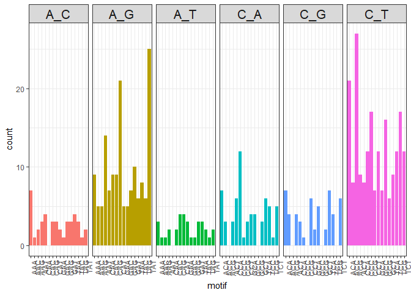
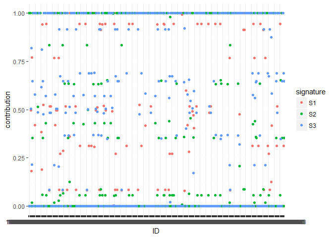
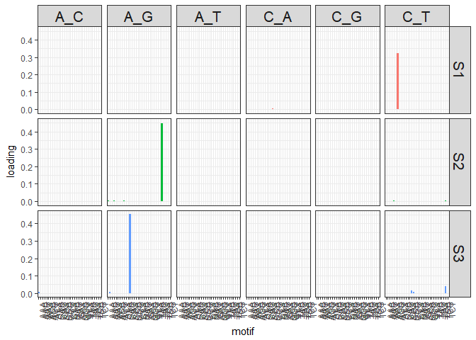

# doomsayer_diagnostics
jed c.  
July 1, 2017  


```r
# knitr::opts_chunk$set(echo = TRUE)

#specify the packages of interest
packages = c("dplyr","tidyr","ggplot2","yaml", "devtools")

#use this function to check if each package is on the local machine
#if a package is installed, it will be loaded
#if any are not, the missing package(s) will be installed and loaded
package.check <- lapply(packages, FUN = function(x) {
    if (!require(x, character.only = TRUE)) {
        install.packages(x, dependencies = TRUE)
        library(x, character.only = TRUE)
    }
})
```

```
## Loading required package: dplyr
```

```
## 
## Attaching package: 'dplyr'
```

```
## The following objects are masked from 'package:stats':
## 
##     filter, lag
```

```
## The following objects are masked from 'package:base':
## 
##     intersect, setdiff, setequal, union
```

```
## Loading required package: tidyr
```

```
## Loading required package: ggplot2
```

```
## Loading required package: yaml
```

```
## Loading required package: devtools
```


```r
# cmd_args <- commandArgs(TRUE)
# yaml_cfg <- as.double(cmd_args[1])

# static path for development
yaml_cfg <- "/mnt/c/Users/jedidiah/Dropbox/Github/doomsayer/demo/output/config.yaml"

# debug--paths generated from doomsayer.py refer are formatted for bash on Windows
# the sys.info check updates these paths with Windows format for proper loading in R
if(Sys.info()['sysname']=="Windows"){
  yaml_cfg <- gsub("/mnt/c", "C:", yaml_cfg)  
}

yaml_args <- yaml.load_file(yaml_cfg)
if(Sys.info()['sysname']=="Windows"){
  yaml_args <- lapply(yaml_args, function(x) gsub("/mnt/c", "C:", x))
}

attach(yaml_args)

# read tables
keep_ids <- read.table(keep_path, header=F, stringsAsFactors=F)
# drop_ids <- read.table(drop_path, header=F, stringsAsFactors=F)
spectra <- read.table(M_path, header=T, stringsAsFactors=F)
spectra_rates <- read.table(M_path_rates, header=T, stringsAsFactors=F)
sig_contribs <- read.table(W_path, header=T, stringsAsFactors=F)
sig_loads <- read.table(H_path, header=T, stringsAsFactors=F)
```


```r
# overall distribution
spectra2 <- spectra %>%
  gather(subtype, count, 2:ncol(spectra)) %>%
  separate(subtype, c("category", "motif"), sep = "[.]") %>%
  group_by(category, motif) %>%
  summarise(count=sum(count))

ggplot(spectra2, aes(x=motif, y=count, fill=category))+
  geom_bar(stat="identity")+
  facet_wrap(~category, ncol=6, scales="free_x")+
  theme_bw()+
  theme(axis.text.x=element_text(angle=90, hjust=1),
    strip.text=element_text(size=16),
    legend.position="none")
```

<!-- -->


```r
# signature contributions across samples
sig_contribs2 <- sig_contribs[complete.cases(sig_contribs),]
sig_contribs2 <- sig_contribs2 %>%
  gather(signature, contribution, S1:S3)

ggplot(sig_contribs2, aes(x=ID, y=contribution, colour=signature))+
  geom_point()
```

<!-- -->

```r
# signature loadings
sig_loads_long <- sig_loads %>%
   gather(subtype, loading, 2:ncol(sig_loads)) %>%
   separate(subtype, c("category", "motif"), sep = "[.]")

ggplot(sig_loads_long, aes(x=motif, y=loading, fill=Sig))+
  geom_bar(stat="identity")+
  facet_grid(Sig~category)+
  theme_bw()+
  theme(axis.text.x=element_text(angle=90, hjust=1),
    strip.text=element_text(size=16),
    legend.position="none")
```

<!-- -->


<!-- -->

