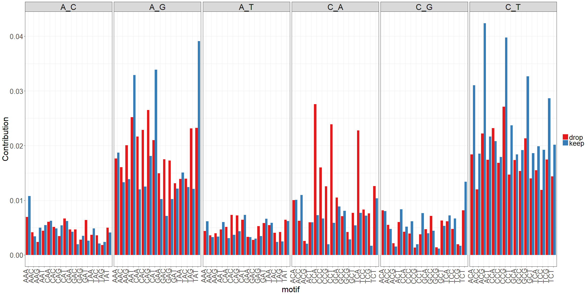
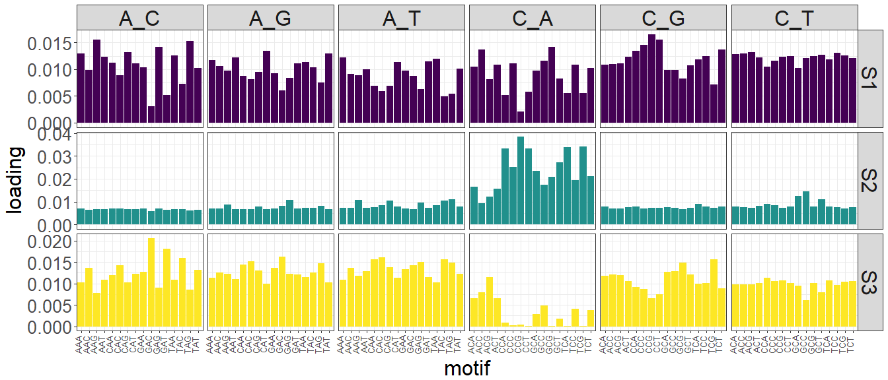

# doomsayer_diagnostics
`r format(Sys.Date())`  

<style>
body {
    position: absolute;
    left: 0px;}
</style>


### Error profile heatmap

Left panel shows root mean squared error (RMSE) of each outlier sample's mutation spectrum. Right panel shows the fold-difference in contribution per subtype for each outlier. Fold-differences are calculated relative to the mean contribution of that subtype across all samples.

<!-- # ```{r heatmap, message=FALSE, warning=FALSE, echo=FALSE} -->

```
##  [1] "#E495A5" "#E495A5" "#E495A5" "#E495A5" "#E495A5" "#E495A5" "#E495A5"
##  [8] "#E495A5" "#E495A5" "#E495A5" "#86B875" "#86B875" "#86B875" "#86B875"
## [15] "#86B875" "#86B875" "#7DB0DD" "#7DB0DD" "#7DB0DD" "#7DB0DD" "#7DB0DD"
## [22] "#7DB0DD" "#7DB0DD" "#7DB0DD" "#7DB0DD"
```

<!--html_preserve--><div id="abf02d951cbe" style="width:1344px;height:1728px;" class="plotly html-widget"></div>
<script type="application/json" data-for="abf02d951cbe">{"x":{"data":[{"x":[0,0.00701302445381,null,0,0.00907771514693,null,0,0.00948216565563,null,0,0.00881000617325,null,0,0.0105960661239,null,0,0.00558250782428,null,0,0.00623580194337,null,0,0.0053212804772,null,0,0.00547109317974,null,0,0.00941159288062,null,0,0.00676851308169,null,0,0.0231694300335,null,0,0.0240122113216,null,0,0.0164556001034,null,0,0.0106886631671],"y":[11,11,null,12,12,null,13,13,null,14,14,null,15,15,null,16,16,null,17,17,null,18,18,null,19,19,null,20,20,null,21,21,null,22,22,null,23,23,null,24,24,null,25,25],"text":["0: 0<br />ID: 1497-RMM-3874<br />ID: 11<br />RMSE: 0.007013024<br />maxgp: S2","0: 0<br />ID: 1497-RMM-3874<br />ID: 11<br />RMSE: 0.007013024<br />maxgp: S2",null,"0: 0<br />ID: 1497-RMM-3979<br />ID: 12<br />RMSE: 0.009077715<br />maxgp: S2","0: 0<br />ID: 1497-RMM-3979<br />ID: 12<br />RMSE: 0.009077715<br />maxgp: S2",null,"0: 0<br />ID: 1497-RMM-3971<br />ID: 13<br />RMSE: 0.009482166<br />maxgp: S2","0: 0<br />ID: 1497-RMM-3971<br />ID: 13<br />RMSE: 0.009482166<br />maxgp: S2",null,"0: 0<br />ID: 1497-RMM-3969<br />ID: 14<br />RMSE: 0.008810006<br />maxgp: S2","0: 0<br />ID: 1497-RMM-3969<br />ID: 14<br />RMSE: 0.008810006<br />maxgp: S2",null,"0: 0<br />ID: 1497-RMM-3967<br />ID: 15<br />RMSE: 0.010596066<br />maxgp: S2","0: 0<br />ID: 1497-RMM-3967<br />ID: 15<br />RMSE: 0.010596066<br />maxgp: S2",null,"0: 0<br />ID: 1497-RMM-3017B<br />ID: 16<br />RMSE: 0.005582508<br />maxgp: S2","0: 0<br />ID: 1497-RMM-3017B<br />ID: 16<br />RMSE: 0.005582508<br />maxgp: S2",null,"0: 0<br />ID: 1497-RMM-0148<br />ID: 17<br />RMSE: 0.006235802<br />maxgp: S2","0: 0<br />ID: 1497-RMM-0148<br />ID: 17<br />RMSE: 0.006235802<br />maxgp: S2",null,"0: 0<br />ID: 1497-RMM-0036<br />ID: 18<br />RMSE: 0.005321280<br />maxgp: S2","0: 0<br />ID: 1497-RMM-0036<br />ID: 18<br />RMSE: 0.005321280<br />maxgp: S2",null,"0: 0<br />ID: 1497-RMM-0082<br />ID: 19<br />RMSE: 0.005471093<br />maxgp: S2","0: 0<br />ID: 1497-RMM-0082<br />ID: 19<br />RMSE: 0.005471093<br />maxgp: S2",null,"0: 0<br />ID: 1497-RMM-0063<br />ID: 20<br />RMSE: 0.009411593<br />maxgp: S2","0: 0<br />ID: 1497-RMM-0063<br />ID: 20<br />RMSE: 0.009411593<br />maxgp: S2",null,"0: 0<br />ID: 1497-RMM-3898<br />ID: 21<br />RMSE: 0.006768513<br />maxgp: S2","0: 0<br />ID: 1497-RMM-3898<br />ID: 21<br />RMSE: 0.006768513<br />maxgp: S2",null,"0: 0<br />ID: 1497-RMM-2976B<br />ID: 22<br />RMSE: 0.023169430<br />maxgp: S2","0: 0<br />ID: 1497-RMM-2976B<br />ID: 22<br />RMSE: 0.023169430<br />maxgp: S2",null,"0: 0<br />ID: 1497-RMM-3953<br />ID: 23<br />RMSE: 0.024012211<br />maxgp: S2","0: 0<br />ID: 1497-RMM-3953<br />ID: 23<br />RMSE: 0.024012211<br />maxgp: S2",null,"0: 0<br />ID: 1497-RMM-3926<br />ID: 24<br />RMSE: 0.016455600<br />maxgp: S2","0: 0<br />ID: 1497-RMM-3926<br />ID: 24<br />RMSE: 0.016455600<br />maxgp: S2",null,"0: 0<br />ID: 1497-RMM-3919<br />ID: 25<br />RMSE: 0.010688663<br />maxgp: S2","0: 0<br />ID: 1497-RMM-3919<br />ID: 25<br />RMSE: 0.010688663<br />maxgp: S2"],"type":"scatter","mode":"lines","line":{"width":1.88976377952756,"color":"rgba(33,144,140,1)","dash":"solid"},"hoveron":"points","name":"(S2,1)","legendgroup":"(S2,1)","showlegend":true,"xaxis":"x","yaxis":"y","hoverinfo":"text","frame":null},{"x":[0,0.00825713378092,null,0,0.00948018714804,null,0,0.00817808709442,null,0,0.00658076590771,null,0,0.0059441169888,null,0,0.00589462780882,null,0,0.00595287584386,null,0,0.00524045977326,null,0,0.00510549478797,null,0,0.00548274208355],"y":[1,1,null,2,2,null,3,3,null,4,4,null,5,5,null,6,6,null,7,7,null,8,8,null,9,9,null,10,10],"text":["0: 0<br />ID: 1497-RMM-3411<br />ID:  1<br />RMSE: 0.008257134<br />maxgp: S3","0: 0<br />ID: 1497-RMM-3411<br />ID:  1<br />RMSE: 0.008257134<br />maxgp: S3",null,"0: 0<br />ID: 1497-RMM-3379<br />ID:  2<br />RMSE: 0.009480187<br />maxgp: S3","0: 0<br />ID: 1497-RMM-3379<br />ID:  2<br />RMSE: 0.009480187<br />maxgp: S3",null,"0: 0<br />ID: 1497-RMM-3372<br />ID:  3<br />RMSE: 0.008178087<br />maxgp: S3","0: 0<br />ID: 1497-RMM-3372<br />ID:  3<br />RMSE: 0.008178087<br />maxgp: S3",null,"0: 0<br />ID: 1497-RMM-3392<br />ID:  4<br />RMSE: 0.006580766<br />maxgp: S3","0: 0<br />ID: 1497-RMM-3392<br />ID:  4<br />RMSE: 0.006580766<br />maxgp: S3",null,"0: 0<br />ID: 1497-RMM-3381<br />ID:  5<br />RMSE: 0.005944117<br />maxgp: S3","0: 0<br />ID: 1497-RMM-3381<br />ID:  5<br />RMSE: 0.005944117<br />maxgp: S3",null,"0: 0<br />ID: 1497-RMM-3367<br />ID:  6<br />RMSE: 0.005894628<br />maxgp: S3","0: 0<br />ID: 1497-RMM-3367<br />ID:  6<br />RMSE: 0.005894628<br />maxgp: S3",null,"0: 0<br />ID: 1497-RMM-3415<br />ID:  7<br />RMSE: 0.005952876<br />maxgp: S3","0: 0<br />ID: 1497-RMM-3415<br />ID:  7<br />RMSE: 0.005952876<br />maxgp: S3",null,"0: 0<br />ID: 1497-RMM-3373<br />ID:  8<br />RMSE: 0.005240460<br />maxgp: S3","0: 0<br />ID: 1497-RMM-3373<br />ID:  8<br />RMSE: 0.005240460<br />maxgp: S3",null,"0: 0<br />ID: 1497-RMM-3365<br />ID:  9<br />RMSE: 0.005105495<br />maxgp: S3","0: 0<br />ID: 1497-RMM-3365<br />ID:  9<br />RMSE: 0.005105495<br />maxgp: S3",null,"0: 0<br />ID: 1497-RMM-3248<br />ID: 10<br />RMSE: 0.005482742<br />maxgp: S3","0: 0<br />ID: 1497-RMM-3248<br />ID: 10<br />RMSE: 0.005482742<br />maxgp: S3"],"type":"scatter","mode":"lines","line":{"width":1.88976377952756,"color":"rgba(253,231,37,1)","dash":"solid"},"hoveron":"points","name":"(S3,1)","legendgroup":"(S3,1)","showlegend":true,"xaxis":"x","yaxis":"y","hoverinfo":"text","frame":null},{"x":[0.00701302445381,0.00907771514693,0.00948216565563,0.00881000617325,0.0105960661239,0.00558250782428,0.00623580194337,0.0053212804772,0.00547109317974,0.00941159288062,0.00676851308169,0.0231694300335,0.0240122113216,0.0164556001034,0.0106886631671],"y":[11,12,13,14,15,16,17,18,19,20,21,22,23,24,25],"text":["RMSE: 0.007013024<br />ID: 1497-RMM-3874<br />maxgp: S2","RMSE: 0.009077715<br />ID: 1497-RMM-3979<br />maxgp: S2","RMSE: 0.009482166<br />ID: 1497-RMM-3971<br />maxgp: S2","RMSE: 0.008810006<br />ID: 1497-RMM-3969<br />maxgp: S2","RMSE: 0.010596066<br />ID: 1497-RMM-3967<br />maxgp: S2","RMSE: 0.005582508<br />ID: 1497-RMM-3017B<br />maxgp: S2","RMSE: 0.006235802<br />ID: 1497-RMM-0148<br />maxgp: S2","RMSE: 0.005321280<br />ID: 1497-RMM-0036<br />maxgp: S2","RMSE: 0.005471093<br />ID: 1497-RMM-0082<br />maxgp: S2","RMSE: 0.009411593<br />ID: 1497-RMM-0063<br />maxgp: S2","RMSE: 0.006768513<br />ID: 1497-RMM-3898<br />maxgp: S2","RMSE: 0.023169430<br />ID: 1497-RMM-2976B<br />maxgp: S2","RMSE: 0.024012211<br />ID: 1497-RMM-3953<br />maxgp: S2","RMSE: 0.016455600<br />ID: 1497-RMM-3926<br />maxgp: S2","RMSE: 0.010688663<br />ID: 1497-RMM-3919<br />maxgp: S2"],"type":"scatter","mode":"markers","marker":{"autocolorscale":false,"color":"rgba(33,144,140,1)","opacity":1,"size":7.55905511811024,"symbol":"circle","line":{"width":1.88976377952756,"color":"rgba(33,144,140,1)"}},"hoveron":"points","name":"(S2,1)","legendgroup":"(S2,1)","showlegend":false,"xaxis":"x","yaxis":"y","hoverinfo":"text","frame":null},{"x":[0.00825713378092,0.00948018714804,0.00817808709442,0.00658076590771,0.0059441169888,0.00589462780882,0.00595287584386,0.00524045977326,0.00510549478797,0.00548274208355],"y":[1,2,3,4,5,6,7,8,9,10],"text":["RMSE: 0.008257134<br />ID: 1497-RMM-3411<br />maxgp: S3","RMSE: 0.009480187<br />ID: 1497-RMM-3379<br />maxgp: S3","RMSE: 0.008178087<br />ID: 1497-RMM-3372<br />maxgp: S3","RMSE: 0.006580766<br />ID: 1497-RMM-3392<br />maxgp: S3","RMSE: 0.005944117<br />ID: 1497-RMM-3381<br />maxgp: S3","RMSE: 0.005894628<br />ID: 1497-RMM-3367<br />maxgp: S3","RMSE: 0.005952876<br />ID: 1497-RMM-3415<br />maxgp: S3","RMSE: 0.005240460<br />ID: 1497-RMM-3373<br />maxgp: S3","RMSE: 0.005105495<br />ID: 1497-RMM-3365<br />maxgp: S3","RMSE: 0.005482742<br />ID: 1497-RMM-3248<br />maxgp: S3"],"type":"scatter","mode":"markers","marker":{"autocolorscale":false,"color":"rgba(253,231,37,1)","opacity":1,"size":7.55905511811024,"symbol":"circle","line":{"width":1.88976377952756,"color":"rgba(253,231,37,1)"}},"hoveron":"points","name":"(S3,1)","legendgroup":"(S3,1)","showlegend":false,"xaxis":"x","yaxis":"y","hoverinfo":"text","frame":null},{"x":[1,2,3,4,5,6,7,8,9,10,11,12,13,14,15,16,17,18,19,20,21,22,23,24,25,26,27,28,29,30,31,32,33,34,35,36,37,38,39,40,41,42,43,44,45,46,47,48,49,50,51,52,53,54,55,56,57,58,59,60,61,62,63,64,65,66,67,68,69,70,71,72,73,74,75,76,77,78,79,80,81,82,83,84,85,86,87,88,89,90,91,92,93,94,95,96],"y":[1,2,3,4,5,6,7,8,9,10,11,12,13,14,15,16,17,18,19,20,21,22,23,24,25],"z":[[0.0769665309111996,0.160997092621807,0.116535554120594,0.362994053531999,0.126028575677401,0.146550656179798,0.0508074781075989,0.0571596417532012,0.233351192982006,0.1178774073408,0.0785295180106013,0.0623561277648004,0.145792212902196,0.188748148319588,0.119083802424799,0.214367632394014,0.166575429984401,0.165825367678207,0.193753511150001,0.172041363829197,0.145777439266403,0.0743633403038009,0.0663409496821998,0.110776252858799,0.0891045366708003,0.0890570940225987,0.0920517808498075,0.106301713257401,0.133161430446999,0.17649770053921,0.118502937915598,0.122310131632401,0.105970043201596,0.189116119599593,0.138400107133396,0.136713515529009,0.0920325002605948,0.12329928889841,0.1159906079518,0.0833969067945995,0.0541206723306012,0.149268846620603,0.0918476749990022,0.129765482739603,0.537530603888002,0.419701588666006,0.272148159560019,0.306901831911997,0.311853286411995,0.286945335531999,0.340741937832008,0.321635778099989,0.311834259232,0.219761935306006,0.24185330336801,0.245228374280007,0.29039873602998,0.207162319268005,0.158961468272405,0.21690754945599,0.206985502257998,0.211821319331998,0.248973821071995,0.150535524291207,0.135610986286001,0.0790411992613994,0.103231998498801,0.103025801273604,0.124892370037001,0.187101616273002,0.194805710618603,0.205879215228001,0.240382412453989,0.226673685954006,0.137516006495596,0.124472463391802,0.0971612948523945,0.233113145461993,0.211860256527995,0.313848329435988,0.428065961543984,0.507035411820037,0.661395387046034,0.596563933106021,0.610033632608006,0.497097944961978,0.416245689221973,0.407414795780013,0.442912890270013,0.442443178383989,0.430759738637996,0.462564275415993,0.475695218030013,0.852485212554058,0.731926454742008,0.933724945680065],[0.0610938578185997,0.132710133859206,0.0906148217715957,0.317614944487999,0.156982586670602,0.148322735731598,0.0387364819533992,0.0844852508298017,0.229810898848006,0.0873299053530001,0.0698694539316011,0.0617768207114004,0.128569054384596,0.177771281515789,0.127222218901999,0.178841872915811,0.135613200326601,0.109336062110405,0.203234959796001,0.163670571540197,0.111939955825803,0.0565825918500007,0.0581936761213998,0.0783256649003996,0.0790095426428003,0.0821808532111988,0.0826611969602067,0.104795546238601,0.0953764666083989,0.132877748733807,0.123489521865398,0.124969251424001,0.119083350364796,0.182686411423993,0.174156311190995,0.114174179497007,0.088294030025595,0.141160805970611,0.122760090247,0.0853916429521995,0.0539879784230012,0.129651872125402,0.0936994240058022,0.115143692183203,0.191812660637601,0.283865124260004,0.326100953978023,0.345224143975997,0.362909802773994,0.279008883891999,0.39930782186601,0.326469924791989,0.333639770328,0.291785360190008,0.289195096680012,0.304531238626009,0.329961249951978,0.267865405888007,0.181768526287605,0.22501262094199,0.230106103063997,0.240776096025998,0.175287785210397,0.166887549925008,0.140825023340201,0.0655796153289995,0.0886806332416011,0.110369072014004,0.129749312855001,0.153077625757001,0.238822628676003,0.221149396290001,0.236267384183989,0.174149073773405,0.164734081395595,0.116536547328002,0.0783104123015955,0.157495416555795,0.236038661861994,0.458217703339983,0.502834481233981,0.54667226376004,0.697548425446036,0.627689645780022,0.610661719584006,0.616116026617973,0.470553486631969,0.507823496160016,0.454223063780014,0.484390605177988,0.376319724453996,0.456709565973993,0.593500826552017,1,0.99520775237001,0.873639946492061],[0.140268933483799,0.159825954711207,0.137641398233794,0.293880551343999,0.115028170245201,0.142375893511198,0.0739172470477984,0.0840206106242017,0.212358547908005,0.1670881645948,0.132645418571202,0.0874469232630007,0.131589244929596,0.182338885400588,0.140563346252799,0.254917064240016,0.103660835445401,0.109040371630005,0.156111482954,0.140735142636598,0.0994270680542022,0.0542861625200007,0.0470990466037998,0.0786948525603996,0.1024420036668,0.0997109458811986,0.0900182574414073,0.111376181190801,0.0994715730505989,0.118895273451407,0.126185975821798,0.119307172820401,0.107403887766196,0.173961853322193,0.194722302210794,0.16649594174201,0.109600319149194,0.144934155902211,0.1203026893504,0.0911548265503994,0.0608667497758013,0.150101771504003,0.157842163539004,0.151876406012003,0.197664022311001,0.287133523820004,0.297548461112021,0.242095882511998,0.304420501955995,0.338043276425999,0.365895791876009,0.29772274045799,0.298434958656,0.327671131152009,0.294742254750012,0.301631693964009,0.343099976533977,0.349921064686009,0.224824145138007,0.22591857944999,0.263723793367997,0.231808984775998,0.204787381929996,0.171880803846608,0.191854026634402,0.122969467207999,0.163189088931602,0.124247620515205,0.149394988072001,0.169920163377002,0.225012293090003,0.221162147208001,0.239559845133989,0.282120642422008,0.233638769863993,0.250310298290005,0.157962265851991,0.412594957357987,0.372046836189991,0.491890835861981,0.583516302597978,0.607067274768045,0.608947924192031,0.563921339184019,0.516507127296005,0.517252075487977,0.45624469470597,0.437131964856014,0.399302927186012,0.41588376311399,0.367299545977997,0.459345277315993,0.485433636840014,0.794520077924054,0.806724314736008,0.772491031452054],[0.144561569643999,0.183162597118408,0.143657845406193,0.305018161663999,0.140133405968801,0.175847774288598,0.096563433078398,0.103953603063602,0.201330357138005,0.1688559169496,0.114144797898402,0.117185717980601,0.142811056790596,0.185541233685988,0.126062107582999,0.218139779220014,0.140165102821201,0.158561320409407,0.178356889898201,0.192630074541997,0.121963667038403,0.0825140112856011,0.0716035313727998,0.101999020552,0.1056578347004,0.105149481794999,0.11730879763561,0.127898607121201,0.145007040752798,0.165603930396209,0.142449206508398,0.118854279079001,0.113523341592996,0.160699797041794,0.217000513697993,0.132531978971408,0.130129300239993,0.156706242796212,0.1471752687502,0.0992852526347994,0.092294734212402,0.162201848077003,0.170070213372404,0.165289623306204,0.468879152532002,0.379596795022005,0.28060108927802,0.264997773529997,0.363844877471994,0.292864499531999,0.284908782902007,0.28269702220999,0.260370000274,0.247326884652007,0.260441482466011,0.268833298046008,0.29785676481598,0.329590949954009,0.225825743954007,0.22231409499999,0.261413182273997,0.230194521627998,0.201041283977996,0.174660643083208,0.200542812616002,0.112129675757999,0.176510768979802,0.146051165150406,0.153158326135001,0.181497472258402,0.193190848226403,0.227058625682001,0.222290690017989,0.261896680350007,0.206630383515994,0.203656267880004,0.17738238986059,0.341175811049989,0.38462379510799,0.438050841805983,0.511503726235981,0.53707285571404,0.543139490774028,0.491581317748017,0.501952494500005,0.397233693693982,0.412479825327973,0.31664379941601,0.361908343556011,0.333951754149992,0.362214373459997,0.375620145947994,0.426981614468012,0.668900534116045,0.613910659218006,0.795173745148055],[0.130127244541999,0.167506239753007,0.147769917352393,0.221376942921999,0.154890151924202,0.164130800122998,0.0731312151773984,0.125157454415403,0.150762045661204,0.1359295647422,0.114896929693802,0.0911478963976007,0.152482688766396,0.237636062519985,0.162616631895199,0.217375888032014,0.151646346684801,0.171847787345807,0.178245353856401,0.172410952868597,0.144921881796603,0.0742081168306009,0.1148360149572,0.120879560583399,0.1303398302822,0.131790058617598,0.12727787989201,0.128270300474201,0.147447481647398,0.161497470967009,0.151035195593797,0.167889291269001,0.140710080256995,0.201850800695992,0.242405726095993,0.142527648360609,0.126580475971993,0.143818733349611,0.1833248551428,0.121914141257199,0.0988371781902022,0.144440264729003,0.129283136989003,0.138185948133203,0.209723655742001,0.213086667070003,0.275133766404019,0.194790306145198,0.225453084517996,0.221797589939999,0.276687761328007,0.27942854871599,0.279047586816,0.147028433779404,0.217884032816009,0.204383925482006,0.227015230393985,0.187803275515005,0.213783190842006,0.208899852591991,0.201024113269998,0.195964227012998,0.159647408176397,0.184115627348409,0.153211083149202,0.111110452572399,0.137729279757602,0.153786967575206,0.205444719116002,0.189593160642402,0.209571691006003,0.201985069176001,0.308093323559985,0.162281835105605,0.211632966379994,0.155810597125403,0.164191537553591,0.289391884261991,0.313087690631992,0.320641472903988,0.338668870015987,0.384368392520028,0.400070898538021,0.540925357742019,0.588212542028006,0.374673037203983,0.342956864471977,0.294162727844009,0.415447070322012,0.335814324227992,0.333707559879997,0.322550515617995,0.35475553650801,0.59566141440604,0.492287547086005,0.516716000670036],[0.300195623417999,0.317440984012014,0.246456917237988,0.328528212169999,0.231926710374003,0.193705594817798,0.213139134891996,0.156089149056803,0.229362075778006,0.25011727055,0.224098265584004,0.139896425193001,0.165524336811596,0.234316763861985,0.163056081781999,0.30734841650002,0.144058883480201,0.150673655224606,0.166127544254801,0.221002414779997,0.153045817681603,0.077656883197401,0.0955597354295997,0.1013263829738,0.127390451448,0.145014768656798,0.11880773742321,0.133992195709201,0.145569392331198,0.160390129665209,0.128701474698398,0.121613413920601,0.102202818181596,0.147748265868394,0.166104573076595,0.119741355929007,0.106664421544594,0.138715269658611,0.1302497886622,0.107895508775999,0.0967836726970021,0.154778806188403,0.239788992136006,0.213339384946005,0.398039506826001,0.329935061578004,0.293936648268021,0.328619687095997,0.348653362643995,0.276033574523999,0.250991603060006,0.235277206691992,0.202582662066,0.194891194774005,0.203688959438008,0.218818264898007,0.268539334119982,0.258393039622007,0.165666494229205,0.188046655888392,0.192177287575598,0.182728175249198,0.177328109117397,0.142165941284207,0.185426810749402,0.139916653413599,0.120278018504002,0.154655809693006,0.201311260012002,0.195066127970602,0.184909592864603,0.199356331655601,0.300541384783986,0.221085378044006,0.197554015699394,0.221135541786004,0.17697109687039,0.364418855591988,0.40975512266199,0.359795164983986,0.307477477867989,0.476341423472035,0.39426289154402,0.409799976296014,0.482644111834005,0.356413575219984,0.339367877681978,0.30515690423001,0.390131140724012,0.320812612467992,0.352373125639997,0.423098026721994,0.36812396303001,0.537195676986036,0.510829824086005,0.640577011956044],[0.191901369665999,0.208736087682009,0.21293837373799,0.280479633235999,0.140774244199802,0.196525279252598,0.145954473135197,0.124874087478403,0.178674033820805,0.233164506076,0.200553483498003,0.137955017692001,0.145291039984996,0.177767883486589,0.133553273084799,0.31338802894802,0.166683394964201,0.117826200871605,0.160181623910201,0.158366435639398,0.122125331837203,0.0838627357064011,0.0880625582297997,0.1027613351464,0.140122210268001,0.135011937689998,0.12828600266621,0.130343354758801,0.109414951050999,0.130244415471207,0.118579744964998,0.118553349824401,0.122278662315595,0.167082439713193,0.141780518763996,0.195504913276012,0.152536772846191,0.169467076191813,0.1720742767162,0.134357538552599,0.136565355340803,0.211177600010004,0.233056286068006,0.182016599814004,0.190068991769001,0.231023053534003,0.308608831984022,0.226327115813998,0.256133033485996,0.308045665465999,0.289284325594007,0.29093947094199,0.223265983024,0.287279475674008,0.276130663592011,0.253183770360008,0.332749977911977,0.320849911308008,0.242127777544007,0.246271264303989,0.238241588297997,0.217021103711998,0.204043989509996,0.168605494491608,0.248262886526003,0.204493422101998,0.176444806375402,0.150670586526806,0.169984149599601,0.162006490349601,0.199520558767203,0.199686684765601,0.244893475075988,0.34568504679801,0.253723757155993,0.288451553820005,0.216210948003988,0.485057163503985,0.437637550375989,0.413866645393984,0.476727715695982,0.553169923434041,0.443218828570023,0.411687670488014,0.437877353304004,0.397177434455982,0.329663412241978,0.367793678392012,0.350860123776011,0.328096651123992,0.414219547347996,0.453473966503993,0.389470700490011,0.566289321104039,0.564363028374006,0.561586320612039],[0.218276125487999,0.24005045036201,0.22127454018199,0.245018506151999,0.150329255551802,0.208045326913998,0.156541132391197,0.142071938548403,0.215493439056006,0.219613787976,0.181061793933003,0.123018108679201,0.158163228575796,0.250437007615984,0.166526956705799,0.31465419697802,0.124893563783401,0.143184138765206,0.216863770580001,0.182990519852397,0.112081993514802,0.0994242097166013,0.108907020311,0.109984040092999,0.1318661614846,0.144390133484798,0.143885431409612,0.133188019247601,0.137931083877998,0.152154776253408,0.138660104073798,0.137167600694401,0.127245124052795,0.159573741827994,0.132274076863996,0.147293054124809,0.132681441412592,0.144447394679411,0.1284732232118,0.114235035167199,0.106667658658202,0.152614875309803,0.203704964014005,0.182579341710404,0.189141153526401,0.242061865532003,0.28593509316602,0.251908995887998,0.193807032555597,0.293377537203999,0.251119374092006,0.243392893999992,0.229456935874,0.241275861130007,0.218082562506009,0.231891607328007,0.314120427785979,0.265202589672007,0.211774697634006,0.21943535687599,0.238990656943997,0.185352302064798,0.191469516585796,0.176661852187808,0.217452425892002,0.185394521230199,0.191681349582203,0.175437658699207,0.203129593382002,0.188591882670602,0.174397383455002,0.193327709216001,0.278423267411987,0.243005065484007,0.236562693667993,0.279270822580005,0.266974299679985,0.470486662401985,0.528170724093987,0.385060310285985,0.329982907441988,0.471094607998035,0.38632607633802,0.433664910556015,0.445087556764004,0.326726327045985,0.281810190827981,0.229819285838007,0.358718159112011,0.297190682391993,0.431946168805996,0.415912861085994,0.35248526757601,0.489762867638033,0.551011663240006,0.467586337006032],[0.374246901781998,0.316655349294014,0.271500751409987,0.198127133191799,0.183154232660202,0.224994292261997,0.207962694333996,0.192218868140004,0.120909926444403,0.284011195232,0.267537974534004,0.165253332856601,0.153225083939796,0.215221022217986,0.165275263036399,0.438324687954028,0.0976813953728005,0.101770244104804,0.166138358225401,0.163958526199797,0.116408621488403,0.123055888032002,0.113635699693,0.0913080124173996,0.147629445664601,0.183405983708797,0.159875467491013,0.153450835943801,0.107574820305199,0.115066089100406,0.110279568406798,0.123819874890601,0.136280850132995,0.139663497044995,0.189857113479994,0.261424201620016,0.198267950557589,0.191565933726615,0.156490644735,0.161312002552599,0.155608750452603,0.271066420202005,0.300735234900007,0.320986036836007,0.1641919727922,0.219159324464003,0.196660558309814,0.228131130875998,0.196437215786997,0.236043739371999,0.212119386934005,0.218237653443993,0.205313791068,0.247061257728007,0.262068021208011,0.256258591722008,0.306623153529979,0.39547094618201,0.259753479146008,0.243623737057989,0.268187680131997,0.222884597533998,0.243426306473995,0.220772046516011,0.268643851742003,0.294728729249998,0.295420348344004,0.197685734750808,0.207298299298002,0.179014700486202,0.226775820710003,0.165576259234401,0.21709100933999,0.393889197214011,0.370646588697989,0.450909616678008,0.401311296015977,0.778053834231975,0.762513795919981,0.544128921187979,0.381989843323986,0.477773309156035,0.305021488532016,0.28678511469801,0.250388706650002,0.22961408550399,0.257646000463983,0.204167556212006,0.207617412850006,0.248500197205994,0.403930159291996,0.389564088575994,0.268492988550007,0.273084204148018,0.350942740244004,0.362300072136025],[0.363373822215998,0.301515006288013,0.334114496163984,0.1701915313156,0.165986687341802,0.203661350087998,0.288363000501994,0.246614912986005,0.179922251503005,0.264501946418,0.246256595512004,0.185073825396401,0.187836330953595,0.197943336155988,0.165272292106199,0.528017697654034,0.0812552458016004,0.120215026937205,0.173107422450201,0.127912639602198,0.134824592254003,0.108822978795401,0.1203282852514,0.109553432978799,0.149843951998001,0.149411113296198,0.166106306730213,0.186673740697401,0.120788867296999,0.102840940902806,0.121391667629598,0.103429108682001,0.137131184952795,0.140602578430994,0.136490369223596,0.258149607324016,0.208317905577988,0.159134198430012,0.1508801205664,0.190887236648199,0.139315573363203,0.238692016882004,0.345328960896008,0.303140286806007,0.214532693382001,0.143704576567202,0.178227028283812,0.221396574215998,0.134224912103998,0.192790942000999,0.168310738110204,0.173763715518794,0.21866141058,0.187779066325205,0.25069831986401,0.217341442934007,0.270994219795982,0.402515501308011,0.34188605299001,0.297373859459987,0.221953799649998,0.251892332301998,0.270884202899995,0.254773656578012,0.272693735834003,0.379324759801997,0.289983490908004,0.24746664806801,0.226483520968002,0.162056940355201,0.244749723994003,0.160879122603601,0.184430368403391,0.434769801216012,0.536640819619985,0.573442881966011,0.671826030441962,1,1,0.571553718611978,0.432534868053984,0.40626251774603,0.219110778246011,0.148411527456205,0.145852923966201,0.146434922221193,0.225225305183985,0.157618467435405,0.138188635453404,0.241671704309994,0.366706712967997,0.355260085247995,0.209960221606006,0.240468809888016,0.319730714122003,0.29479375667602],[0.254620534511999,0.399457711940017,0.348806255593984,0.326446360105999,0.129710777722401,0.260430139763997,0.169595449732796,0.243433185156005,0.38736945379401,0.242642910148,0.383501303400006,0.325409573374003,0.698714735715981,0.442775673725972,0.373619765397998,0.360436544132023,0.285737162606002,0.23610518651401,0.1259459659892,0.278453600677996,0.198048375095804,0.242854706950003,0.173102314937799,0.153578919176199,0.1305672105556,0.138063905638998,0.188770211778415,0.208868962196002,0.180939483793798,0.17758481702001,0.182947892850597,0.124141356330201,0.144102998604395,0.100676670519596,0.232245278285993,0.0680844685132042,0.17376953386659,0.145408253864211,0.1326439207674,0.0990386894567994,0.221465492152005,0.106828852658602,0.163611704159804,0.110276311990402,0.1616597949766,0.186907540558002,0.208914041422015,0.133465624215999,7.09974814698911e-031,0.0278612334585999,0.0746753273006018,0.177974771403994,0.1550019349772,0.204930691874006,0.0518582457490021,0.0533225198510016,0.0324873232447978,0.0806275293618021,0.111549461735603,0.0704984149305969,0.151510566517398,0.159088484253998,0.133694681157397,0.161670000776808,0.150618517482802,0.251229676001998,0.238142401584003,0.164538506899607,0.155583220866801,0.153101927013401,0.234728649296003,0.228352249098001,0.20676048902799,0.0679504241564019,0.067397066237598,0.106757666828002,0.150000113689591,0.140215359010796,0.268829038259993,0.143563599425195,0.209796595315992,0.297632832678022,0.282116373658014,0.221037789812008,0.123802809828401,0.0996665756137955,0.205203459557986,0.361481306180011,0.250089154514007,0.293872583261993,0.191832114756198,0.506467136337992,0.37633483539401,0.0922492054688062,0.168651782693202,0.210132457816015],[0.329996743989999,0.333238993264014,0.575951624653973,0.525209487567999,0.156515754405002,0.301154830687997,0.221696224811995,0.281499982016006,0.280452048898007,0.536773462206001,0.238840036404004,0.283584943064002,0.769391314777979,0.669048451051958,0.434131623927998,0.47445974759203,0.321799600068002,0.255050440188011,0.278617051590001,0.120614150483198,0.202767044304005,0.230880858670003,0.1508536138532,0.146577858296199,0.146295658504601,0.185105635498597,0.197695789879816,0.168021417926401,0.148650872603798,0.142855369434408,0.163521792377997,0.110375559062801,0.0818268964033969,0.107983728202796,0.0373652270341988,0.109539003000607,0.0986726284911944,0.0957038964962074,0.0933654382430002,0.172618652976599,0.121468978864803,0.0982135134484018,0.201809534988005,0.162635146301404,0.0866964872396002,0.150354890719602,0.242749983976017,0.107364364668799,0.151879505863998,0.201712859177999,0.126817434380203,0.164644421563794,0.161362129153,0.164853337055604,0.104291416617204,0.100087118561403,0.0784017796443947,0.108099289181403,0.0897342454938026,0.0141778408740793,0.088640247583199,0.142195866192199,0.107548625995398,0.0487698527842023,0.121162745327801,0.230968961555998,0.103153068917801,0.145596512934806,0.138566152078401,0.135476534440401,0.147518628680202,0.119153155351,0.20470804821999,0.163985014749205,0.216866125329994,0.0715662999358013,0.256413719841985,0.225588169619993,0.216255377117995,0.202103169123992,0.0843838190475968,0.119713072833409,0.219623389664011,0.207445517740007,0.234750833132002,0.140306671523794,0.139008640686991,0.290788066258009,0.255155586686008,0.261958165127994,0.334352175179997,0.448161651373993,0.467079570932013,0.197889204695413,0.0452231092100004,0.169037817507212],[0.418726635711998,0.46531349919002,0.543425897761974,0.352304596347999,0.239974860570003,0.316191539525997,0.215713131307995,0.154814692013403,0.286665248010007,0.486316939240001,0.503520916454008,0.288473955046002,0.831762647455978,0.63651634780796,0.345612572377998,0.303106898640019,0.317181364386002,0.23088668913001,0.1456310443042,0.178324774827397,0.166547564982604,0.142959022245202,0.1200946963146,0.137250564697999,0.1337203416332,0.164964424394598,0.144967269522812,0.187691441865001,0.153131181603998,0.156572462571209,0.169233797873997,0.123901463213001,0.0627297811963976,0.0993384220691961,0.0859343059275973,0.0839743164256052,0.0945549792825946,0.110052160427809,0.0920255248364002,0.0839800275973995,0.093120022893002,0.127055281453002,0.191706306156005,0.272026149856006,0.0996943287736003,0.0576322078144007,0.0644178261328045,0.123460806898399,0.174649814239197,0.257727065241999,0.138155067540403,0.139938449784795,0.0927770528404,0.168505535751605,0.167898012371407,0.131534320598004,0.120208066019392,0.124305913872603,0.171979197338605,0.163034325196393,0.165635444792198,0.0817571846667992,0.108213606663598,0.0373877334790017,0.097529522437401,0.0829989495645993,0.220290829410003,0.157277892180806,0.123360368319001,0.169950165590602,0.156064327924402,0.228361690732001,0.186357222632191,0.0942851117438026,0.124689727848196,0.131673233130202,0.294856164325983,0.64852284866398,0.331569522625992,0.132801820172195,0.0970349372523964,0.302853928774022,0.269386772024014,0.204468409340007,0.179963667758202,0.115244242837395,0.189821048260787,0.133753613342604,0.259554475806008,0.198372195418595,0.384479426327996,0.562201765619992,0.447588149096012,0.327113832276022,0.156009349212402,0.116628336097408],[0.642931026733997,0.642549295692028,0.482097592275977,0.1648590471134,0.131010774381201,0.279480256473997,0.224824925601995,0.322708232020007,0.430376953286011,0.551418172476001,0.524789807160009,0.397144024148003,0.769347706051979,0.447213291835972,0.335434919293998,0.297858221274019,0.173160538852601,0.23847149684601,0.222614403692001,0.151439259097598,0.0545545281064012,0.0668969080392008,0.116558128915,0.163005491316999,0.193103836260401,0.209171429423997,0.201454313498016,0.168769842950401,0.155534390182398,0.142931181808408,0.102656359078998,0.102288199388601,0.0742005527115972,0.0474533170845981,0.0469145807137985,4.19575393964426e-030,0.103241823147594,0.120162743095209,0.0502399928184001,0.125039102640999,0.111842539745202,0.107899520447002,0.187284993796604,0.111381531152802,0.163279993367201,0.104878210397201,0.0937812598710066,0.0674016264831993,0.0953475182969985,0.168842797863799,0.167608319380404,0.116843013898996,0.128927981812,0.0689948543170018,0.0261889915892011,0.0897615543890027,0.0984387600767933,0.0814356003688021,0.112667440750803,0.160211180700993,0.166940778090198,0.148780474323999,0.135034605578797,0.122467726089606,0.136915251471201,0.108748957747799,0.148017925809202,0.132950045218605,0.190815914933402,0.139172720513401,0.133358154523802,0.211940247326001,0.187413960487591,0.171578604426005,0.136145075896596,0.215655242346004,0.284068979223984,0.33044814935399,0.226269429937994,0.108751824620196,0.158924425349594,0.450923684698033,0.284943820610015,0.148835393733205,0.151838651347801,0.201330922229991,0.141809517738591,0.0730208340102023,0.283399959386008,0.256707333309994,0.322924513889997,0.179040080657397,0.477848253608013,0.450339801678031,0.170342056684602,0.0424476924808029],[0.621811590745997,0.667689275276029,0.64559260027197,0.573997121711999,0.494158248830005,0.295739670425997,0.341690993939993,0.347777142914007,0.544895526346014,0.711073084022001,0.645315039126011,0.460918040304004,0.798902275697978,0.652291330471959,0.472720930343998,0.499328217580032,0.100483466164801,0.207574220518009,0.1291810885408,0.062770576815199,0.0844199741342019,0.155278638886802,0.1099111144554,0.1022188586232,0.144853366689001,0.138238623021398,0.12316469464341,0.164391876103801,0.121844485440199,0.113841478520006,0.131055187720198,0.0899927196498005,0.0728672111035973,0.0727756248997971,0.108896396719997,0.0266031719726016,0.113829530633194,0.12396325922061,0.0485896753378001,0.125769002411199,0.106201956965602,0.161005109486203,0.185394880108804,0.290851545970006,0.1579164610062,0.0486878877864006,0.0952357026738067,0.0782250863741992,0.110658573739398,0.0653186138855997,0.126440033631803,0.135605850056795,0.122911541027,0.120111235884003,0.136775075945006,0.0208351213806006,0.0380820706727974,0.0472563290024012,0.108966463968203,0.0929690728723959,0.0968741962683989,0.110510002201799,0.107744089976598,0.0829113760044039,0.105934212878001,0.126212037554399,0.118103479091002,0.122153671056805,0.156322896461401,0.182459242130202,0.137576016097802,0.188097724777601,0.146041885369993,0.139391677857804,0.177758401195195,0.177285564332203,0.164842612823191,0.136968584408196,0.236343719903994,0.189323047190793,0.0922223805907965,0.157000117166812,0.256026232604013,0.178133604923206,0.150306268494201,0.204453340411991,0.189901747626987,0.0847466351422026,0.250256675522007,0.325860722373992,0.393519255763996,0.445265614855993,0.472655013666013,0.306384598628021,0.131797235888401,0.172424035499612],[0.491102232433998,0.410911239812018,0.509884299285976,0.283336697237999,0.562907537770006,0.226038408385998,0.423197449385991,0.528215069224011,0.201728666750005,0.631800343072001,0.408018395522007,0.447191640982004,0.437435213315988,0.249278180927984,0.205892383817999,0.227518709370015,0.496006902358003,0.292751065162012,0.218627734262001,0.371818057877994,0.312535669788007,0.229946118350003,0.175283348889199,0.144594097807199,0.153797999965601,0.189733276384997,0.179298469996815,0.0828737219242006,0.140338159332398,0.154133424915209,0.176431407564797,0.221166063836001,0.132430371809995,0.122334197344795,0.0806302267575975,0.196978031710412,0.266156432113985,0.160625837978212,0.17269096096,0.128939844024399,0.262117270180006,0.158950817817003,0.170406678284204,0.287140521460006,0.187081893516001,0.0721000060756009,4.52608944370556e-030,9.76215370211002e-031,0.163869993168197,0.0483639019077998,0.115224704921003,0.169919071223994,0.237410788106,0.237157432254006,0.135029939408806,0.123415695067604,0.169182787652788,0.139960132307804,0.129091370709804,0.183565729210792,0.143457242798398,0.214790597877998,0.232078613989995,0.175400347732008,0.183019515309802,0.155752095784999,0.222593464506003,0.142809976801206,0.183264910812402,0.194896067088602,0.0636659344826009,0.1392733153548,0.193260558679991,0.412839466954012,0.233987135223993,0.0926595251796017,0.162739357793991,0,0.311104226729992,0.124604961414595,0.0910456994981966,0.206662567838015,0.110582303216606,0.223822795456008,0.199556928322802,0.0865048651495961,0.074991503528195,2.80538659419222e-030,0.232945687438007,0.234383621429994,0.221999015097998,0.263750636931996,0.186649731073605,0.133445022902409,1.85875350792701e-030,0.14590632668981],[1,0.838578478944036,0.64064358389597,0.621378486079998,0.713265608082008,0.423426705465995,0.540272830985989,0.45693036098201,0.286744626576007,0.632921644840001,0.60177599433401,0.355584352516003,0.140507638182996,0.179697588843789,0.149258175293199,0.173251902832011,0.241728908928001,0.141958838187006,0.1398445152272,0.140434254227398,0.167545646461604,0.172765665269002,0.1342382181914,0.154699100249799,0.178507530566601,0.156949702222598,0.171749037971614,0.153981153203401,0.156328654644998,0.144952157559208,0.116078166363198,0.151313918079801,0.149995571162394,0.161114756649194,0.137532962279596,0.191994443874812,0.190243251310389,0.173336465342613,0.203388891684,0.178043319661999,0.200130422060004,0.154929326916403,0.371407661162009,0.365393409028008,0.262126227742001,0.162512926136202,0.162009668592211,0.112909708442999,0.139758540286198,0.164990995666999,0.145651375501403,0.146799617322995,0.1388425455466,0.163736418484804,0.170000967206407,0.161644055553005,0.192386163256987,0.164839757865004,0.149417579891804,0.134191106699594,0.168958522523198,0.175709792216798,0.187327650050996,0.149592345070607,0.149719407294002,0.178378551580799,0.170469986143202,0.165876249531607,0.170401966158401,0.183489068643402,0.184614137406203,0.189266366304401,0.239948804043989,0.179640418299205,0.135414905267396,0.161814766778603,0.194311969591189,0.30643467018999,0.142140572287596,0.174587865665393,0.166391668374194,0.188844336649214,0.148203751368208,0.132454303412605,0.168324311969602,0.142283710517394,0.14847259756299,0.152903600190005,0.156098325587805,0.181419086028796,0.196096541698998,0.171385124928597,0.156912426946204,0.175592926255012,0.214014923964002,0.186657009399213],[0.778231344879997,0.670307314870029,0.664009389915969,0.600728905437999,0.580275028182006,0.461686829391995,0.50042137266799,0.437347554040009,0.427704008530011,0.585086265868001,0.544010254502009,0.327802876722003,0.166809760352795,0.173135281155189,0.156925691109199,0.124754460748408,0.152305194281801,0.142544484432206,0.173824994408001,0.199800017355797,0.137097187504403,0.147099718031402,0.1537799136034,0.165011337515399,0.165112135550601,0.175218053542197,0.166794857377214,0.179495228080401,0.161230843344398,0.151071258476808,0.193483913219597,0.164182465110201,0.154912080084194,0.154601218169994,0.097265658157797,0.211696088022013,0.145940534977792,0.188732891349015,0.21147650386,0.190107374888199,0.212714120088005,0.244039297374005,0.41943477477201,0.353380281686008,0.410327586790001,0.158137278517602,0.190013095218613,0.139740427411999,0.215650090705997,0.201545864705999,0.186383124723604,0.150767735041595,0.1596856834838,0.151712895455404,0.182633106212208,0.172563738815405,0.136058778051991,0.158603857912804,0.134489934172804,0.161046226908993,0.157322718780198,0.169372104165998,0.143161622716597,0.192353199057009,0.160567021513602,0.143476954225199,0.170875348186802,0.173318268275207,0.178764544654802,0.173901123983202,0.166170160198602,0.197379846492001,0.262401460173988,0.194032011890405,0.224527218775994,0.115163988164402,0.128497316408193,0.160153632855395,0.144998598696596,0.163977984694194,0.209675503777992,0.152979965148211,0.19922984407261,0.145520217711205,0.144774099699801,0.184988234819992,0.15419926248999,0.220204290704007,0.140503236285604,0.139102562236797,0.170419015159798,0.130159237084998,0.167845686387205,0.181465065251812,0.214037383290002,0.200010640404014],[0.756107686285997,0.871981094418038,0.64660570213597,1,0.734652280736008,0.446538335431995,0.452133873681991,0.328530291618007,0.315383517442008,0.422302990562,0.451053607308008,0.321573069964003,0.141913560765796,0.134496673586991,0.153249102347799,0.115990365545207,0.182064393276001,0.174916547736607,0.161613657109401,0.170599513824597,0.178452408978404,0.160211426168202,0.186380417185399,0.141901210851799,0.182399716030601,0.140508885527798,0.143099870334412,0.149985749785801,0.159443616342798,0.17434520230161,0.136717556726798,0.173464230438801,0.151530920011794,0.162153387739594,0.164423040223195,0.180756989779811,0.17548994530459,0.203550145100016,0.284658979052001,0.201585140087999,0.265476108588006,0.267412379376005,0.40927456887201,0.43590471938001,0.419651939894001,0.198487820416003,0.184881486555013,0.377959437725996,0.250625635957996,0.202180834935999,0.138044233150603,0.148051254370395,0.1565365371362,0.169265939794605,0.24782058350201,0.195045928468806,0.14375062046599,0.123677652936403,0.131623067999804,0.177807471631992,0.199903261057998,0.136616157194599,0.127188658889797,0.182417046198809,0.175945471628402,0.0952839926411993,0.197778464728603,0.154347361990606,0.164239262935601,0.154458318366801,0.190848717448403,0.219561109332001,0.239275875345989,0.132294151978004,0.190860810858795,0.113372079789402,0.136063377592792,0.157175092323995,0.126882199994797,0.107991371818996,0.139246886490995,0.247590789820018,0.162683595516008,0.145077840984405,0.150255192247801,0.194043013933591,0.173951532541388,0.179142926174406,0.164100679414805,0.192589986754995,0.186741048778598,0.210656528003997,0.156054399998404,0.171438249250812,0.189051040502402,0.208274910674014],[0.906700418795996,1,1,1,1,0.754103672621992,0.593170720089988,0.46234533487801,0.476006279748012,0.651393890882001,0.476594171266008,0.385008914636003,0.123634311710597,0.126186049761392,0.122114312958799,0.103382093889407,0.227752711666001,0.122661195566605,0.0888850626874003,0.206297075139997,0.143507773679403,0.109984297728801,0.1461191227054,0.115410799043599,0.172677816696601,0.116542501332398,0.109417027716409,0.123871520579001,0.130413108780799,0.139612427334608,0.114767629271998,0.121516848864801,0.130437729073795,0.126499566805395,0.100271112276597,0.113058610292607,0.147672476661792,0.197557933540615,0.267069743346001,0.259024613431998,0.269131698534006,0.425750725866008,0.519829111416013,0.598194816772013,0.420566056396001,0.227606070078003,0.165748332510012,0.376767934783996,0.297843163161995,0.254459471089999,0.152937221341004,0.125603853912996,0.118096871346,0.147463553515204,0.133476592432206,0.126915146876404,0.15105237296359,0.138350069759404,0.104966504974403,0.158040615456193,0.173827874758198,0.115454955557199,0.135980243379397,0.144299059417807,0.152568120044002,0.0744969517103994,0.106467489202801,0.144810153152806,0.128255240129401,0.122033055556401,0.127897192625002,0.216242779972001,0.289637261675986,0.112836021073003,0.0951295646579972,0.103412124175202,0.0996339092763943,0.147463156465595,0.141362468459196,0.137078004742995,0.156771293260194,0.13838673414001,0.161698491320208,0.125407852583604,0.152718410911201,0.144814877465794,0.100432597640593,0.204089354084006,0.117496405876803,0.135847034553197,0.0955648451581991,0.126153156168198,0.162481290521804,0.132760940032609,0.158699001425602,0.125617814219009],[0.758613204577997,1,1,1,0.92486582148801,0.749911238473992,0.383705004483992,0.346775340164007,0.38715602710001,0.483046825494001,0.342277072374006,0.337128953294003,0.189171698698595,0.167736149708789,0.195164066701999,0.15176321892741,0.125376467559401,0.154987130804207,0.188047321322401,0.174916625160197,0.190917022234204,0.166836984120802,0.1617544577454,0.166565748064599,0.185285099738401,0.147243119147198,0.147598964776812,0.181841361393001,0.163759957509198,0.160306451496609,0.148656174889798,0.155688468952801,0.146709839511595,0.164838797219194,0.164180543029595,0.16043591348621,0.149503982563192,0.145005903782811,0.1414627852174,0.148878558511799,0.161958638487004,0.172989711188203,0.166180447125004,0.188172896547804,0.170765808199801,0.174654671038602,0.166925979658412,0.178940607781798,0.149578301230198,0.190167005285999,0.170910258455604,0.149676746876795,0.1455815352556,0.177619757097605,0.145375914073006,0.153813537183805,0.158387433625589,0.163786801790604,0.163153173625805,0.146074724157794,0.179630804761998,0.150095636536799,0.136472688290197,0.125619317778206,0.163386126275802,0.131232364520599,0.169689031120802,0.164447852075606,0.157122909493201,0.162347913173001,0.167187779171402,0.187305149510801,0.184805876865591,0.157359357588204,0.106790137473997,0.164819357428603,0.157687581721991,0.222170167049993,0.169290825522996,0.183730153750393,0.166210552669994,0.192266450308814,0.170818191962209,0.162768398660406,0.168141092601602,0.173105633698792,0.163229843231589,0.193858710839606,0.176943559532405,0.147145754248796,0.167565775440598,0.157412150276798,0.231967126980006,0.170529522986212,0.143891711123401,0.14854838508281],[0.923686201811996,1,1,1,1,1,0.297745013141994,0.267907313670006,0.223307623536006,0.1165640258546,0.0894684122622015,0.113690600354801,0.0888417851053976,0.0777659008037951,0.108156850262399,0.0824257414784053,0.143755163936401,0.0844930285786036,0.0924054935078003,0.130212587324398,0.120774169964003,0.0948753051828012,0.120955913522,0.0886703546039996,0.1045936591906,0.107325866748998,0.0899684265222073,0.111962963357801,0.088368013642399,0.0965560366480054,0.0852236995005986,0.101353812472601,0.118757953120396,0.117481516973995,0.0876324357383973,0.130829287255608,0.0985662039775944,0.110841361093409,0.1077468400136,0.0951550436927994,0.105511275723202,0.105572291605802,0.102891881209002,0.107878400621002,0.112960408347,0.106658600888001,0.104618638951807,0.125900490030599,0.108839519933198,0.1051279823072,0.100880703838402,0.0960685336535967,0.0955660613524,0.0859176691654023,0.141320985873606,0.0912853276998027,0.102152893683993,0.138030056718604,0.0818428997010024,0.101600896424195,0.101056386729799,0.111781271096199,0.0910841847537982,0.137679188996407,0.104192820172201,0.105328625936599,0.0979217219368013,0.108648463890804,0.0902717608302007,0.104306050813201,0.103792358089001,0.109321545566,0.110578707433595,0.146002913452204,0.0847691302865975,0.0951116002098017,0.0825403641721953,0.102874826875197,0.103314932868197,0.105331402641196,0.104449781218796,0.0811091172386059,0.098247003333405,0.0946012450898032,0.0954674186088009,0.114909969943195,0.108672034928193,0.0909311269774028,0.116358436928803,0.0940700292529977,0.0904793177767991,0.0743181336713988,0.0991755316906027,0.0934662603362063,0.129630695552001,0.0704788173072048],[1,1,1,1,1,1,0.862560804047982,0.776869147702016,0.601982201236016,0.309584064126,0.241494682530004,0.197212721485002,0.0705875631723981,0.0655013591735958,0.0935230702749995,0.0602018192002038,0.135619037829401,0.0648102132322027,0.0771323370376002,0.119700120465598,0.0964803521492022,0.0929562876454012,0.0894476407523997,0.0733313458141996,0.0881729333876003,0.0775075166873989,0.0711639985794058,0.0676129401212005,0.0642472028185993,0.0809306587392045,0.0715821890759988,0.0757770613920004,0.0774369269985971,0.075786499402797,0.0853395546545973,0.0729689889590046,0.0845105079017952,0.0718483773566056,0.0964657615882002,0.0827669927781995,0.106346870169602,0.110988088277402,0.105209727520202,0.133664731357003,0.1031295254084,0.0699518543086009,0.0781879882690055,0.122606334737799,0.0867205314967986,0.0981116122861996,0.0724105286618017,0.0660788420553977,0.0781751030842,0.113302657171403,0.105202470096604,0.0830006486554025,0.0696360618777952,0.076124782181802,0.0882409468726025,0.0984927952183956,0.0948975473027989,0.0766807130667992,0.0690844245205986,0.0618816216684029,0.0876302806142009,0.0590709016217995,0.0560938965974007,0.0701172718368027,0.0663577369508005,0.0757920011072007,0.0791767143522011,0.0807908023670003,0.0945629705045955,0.0858298508370024,0.0593336511981983,0.0817262017332015,0.0688977564737961,0.0536695352055983,0.0891785727585978,0.0659413494323974,0.0843179387029968,0.102531094411007,0.0996242071074051,0.0719147046150024,0.0825894431780008,0.0858349781333961,0.0917732892875939,0.0885519364504028,0.0831176480128024,0.080866980837398,0.0538461908881995,0.0756045831099988,0.111945728310403,0.0882744232788059,0.0817684045456008,0.0643450841460044],[1,1,1,1,1,1,0.45957684348799,0.451094740800009,0.699806632464018,0.554382902092001,0.399652464744007,0.314108246950003,0.127809497740797,0.104279668638793,0.148101998114599,0.104462676315607,0.127532178937801,0.0960607654484041,0.0936884520292003,0.132020459802198,0.122450999388803,0.105577194058801,0.141030556217,0.1029025878408,0.1293362794098,0.109427305566998,0.109763855388609,0.127469324265601,0.105959283941399,0.106447832239806,0.133930766212398,0.114217473416401,0.115602528453596,0.125531874778195,0.113529437617796,0.0988813563996062,0.128177112455393,0.106761269163608,0.123338642788,0.115771412385999,0.129441195970603,0.123255945627202,0.156480649216604,0.142579669854203,0.0687172508704002,0.119174087372202,0.0962040797662067,0.163106408130198,0.140446280027598,0.1125091121722,0.106690010353403,0.127663274075396,0.1123957654152,0.0919500257264025,0.107462315576204,0.124662865976804,0.124285422213592,0.159938819424604,0.0869305979100025,0.108630334383595,0.108314280274399,0.118968597676799,0.110108182487398,0.139590727824207,0.120044811386201,0.0953491154637993,0.134321715275802,0.120648077063205,0.110420597992001,0.111719860367801,0.118485026752402,0.144943787188,0.139719938594393,0.0866517183974024,0.103851495797197,0.105886260760802,0.105604210093794,0.0993363254233968,0.0952266892021976,0.0953516290855963,0.0557368224817979,0.12967864263441,0.128623997093407,0.114510394537604,0.124045255703201,0.129744628588794,0.107885404095393,0.145973224357205,0.118622166847204,0.129981585157997,0.0951331456037991,0.134553512788598,0.139402309401204,0.133976614090409,0.167275167869402,0.0937877662342065],[1,1,1,1,1,0.976652732377989,0.365601584995992,0.47724877703201,0.968042852290025,0.873760537606001,0.787375672502013,0.513546833176004,0.184121713434595,0.16198818913419,0.192201434066199,0.110886190242807,0.104134045799801,0.129947276281806,0.0942584055576003,0.150546695890598,0.121856843628403,0.120689951621202,0.1070198820886,0.126034811970999,0.146878910781401,0.164725022908798,0.12794834072761,0.154570610989601,0.126772190009599,0.132543948789407,0.164038041131197,0.137342008557401,0.122098100702395,0.123175598409995,0.120913520789796,0.16246412244621,0.138364932875792,0.118717146009409,0.1381164223422,0.145019161591399,0.131024155050603,0.125140837232802,0.170361846220804,0.153101321624803,0.1262470552152,0.156776256306402,0.157107329804011,0.095543268480199,0.122870160624398,0.130548180367999,0.117714267903203,0.141304587465195,0.1341018053326,0.139293335309804,0.148493856020606,0.136492693540004,0.15222444982319,0.115436731067803,0.159708542691005,0.0963466534539957,0.166725169709998,0.144178602553799,0.117458888099198,0.152558155645007,0.168595043420402,0.179846342648199,0.133520941614602,0.140630819040206,0.120778374530201,0.134841452745801,0.145120141111002,0.156641258391801,0.150427563058393,0.101708674631003,0.153513659160796,0.129689206514002,0.104939270180594,0.121666863383596,0.116633392027197,0.177515355449993,0.157012512553394,0.13558662945261,0.135032849684007,0.160630521263406,0.148477333289801,0.116750844046595,0.141977797229391,0.0846888685476026,0.149257730418804,0.159201094830196,0.153971297963199,0.131840623566198,0.186134124083405,0.182104534017612,0.117073242470001,0.14769128964581]],"text":[["error: 3.848327e-01<br />subtype: C_A_TCA<br />ID: 1497-RMM-3411","error: 8.049855e-01<br />subtype: C_A_CCA<br />ID: 1497-RMM-3411","error: 5.826778e-01<br />subtype: C_A_CCT<br />ID: 1497-RMM-3411","error: 1.814970e+00<br />subtype: C_A_CCG<br />ID: 1497-RMM-3411","error: 6.301429e-01<br />subtype: C_A_TCG<br />ID: 1497-RMM-3411","error: 7.327533e-01<br />subtype: C_A_CCC<br />ID: 1497-RMM-3411","error: 2.540374e-01<br />subtype: C_A_TCT<br />ID: 1497-RMM-3411","error: 2.857982e-01<br />subtype: C_A_TCC<br />ID: 1497-RMM-3411","error: 1.166756e+00<br />subtype: C_A_GCG<br />ID: 1497-RMM-3411","error: 5.893870e-01<br />subtype: C_A_GCT<br />ID: 1497-RMM-3411","error: 3.926476e-01<br />subtype: C_A_GCA<br />ID: 1497-RMM-3411","error: 3.117806e-01<br />subtype: C_A_GCC<br />ID: 1497-RMM-3411","error: 7.289611e-01<br />subtype: C_T_GCC<br />ID: 1497-RMM-3411","error: 9.437407e-01<br />subtype: C_T_GCA<br />ID: 1497-RMM-3411","error: 5.954190e-01<br />subtype: C_T_GCT<br />ID: 1497-RMM-3411","error: 1.071838e+00<br />subtype: A_T_AAG<br />ID: 1497-RMM-3411","error: 8.328771e-01<br />subtype: C_G_CCG<br />ID: 1497-RMM-3411","error: 8.291268e-01<br />subtype: C_T_GCG<br />ID: 1497-RMM-3411","error: 9.687676e-01<br />subtype: A_C_GAG<br />ID: 1497-RMM-3411","error: 8.602068e-01<br />subtype: C_G_CCA<br />ID: 1497-RMM-3411","error: 7.288872e-01<br />subtype: C_G_CCC<br />ID: 1497-RMM-3411","error: 3.718167e-01<br />subtype: A_C_AAG<br />ID: 1497-RMM-3411","error: 3.317047e-01<br />subtype: C_G_CCT<br />ID: 1497-RMM-3411","error: 5.538813e-01<br />subtype: C_T_ACG<br />ID: 1497-RMM-3411","error: 4.455227e-01<br />subtype: C_T_CCT<br />ID: 1497-RMM-3411","error: 4.452855e-01<br />subtype: C_T_TCC<br />ID: 1497-RMM-3411","error: 4.602589e-01<br />subtype: C_T_ACA<br />ID: 1497-RMM-3411","error: 5.315086e-01<br />subtype: C_T_ACC<br />ID: 1497-RMM-3411","error: 6.658072e-01<br />subtype: C_T_TCG<br />ID: 1497-RMM-3411","error: 8.824885e-01<br />subtype: C_T_CCG<br />ID: 1497-RMM-3411","error: 5.925147e-01<br />subtype: A_C_CAG<br />ID: 1497-RMM-3411","error: 6.115507e-01<br />subtype: A_G_CAT<br />ID: 1497-RMM-3411","error: 5.298502e-01<br />subtype: A_G_TAT<br />ID: 1497-RMM-3411","error: 9.455806e-01<br />subtype: A_G_AAT<br />ID: 1497-RMM-3411","error: 6.920005e-01<br />subtype: A_C_TAG<br />ID: 1497-RMM-3411","error: 6.835676e-01<br />subtype: A_C_TAA<br />ID: 1497-RMM-3411","error: 4.601625e-01<br />subtype: A_C_AAA<br />ID: 1497-RMM-3411","error: 6.164964e-01<br />subtype: C_G_ACT<br />ID: 1497-RMM-3411","error: 5.799530e-01<br />subtype: C_G_TCC<br />ID: 1497-RMM-3411","error: 4.169845e-01<br />subtype: C_G_TCT<br />ID: 1497-RMM-3411","error: 2.706034e-01<br />subtype: C_A_ACC<br />ID: 1497-RMM-3411","error: 7.463442e-01<br />subtype: C_G_TCA<br />ID: 1497-RMM-3411","error: 4.592384e-01<br />subtype: C_A_ACA<br />ID: 1497-RMM-3411","error: 6.488274e-01<br />subtype: C_A_ACT<br />ID: 1497-RMM-3411","error: 2.687653e+00<br />subtype: C_A_ACG<br />ID: 1497-RMM-3411","error: 2.098508e+00<br />subtype: C_G_GCT<br />ID: 1497-RMM-3411","error: 1.360741e+00<br />subtype: C_G_ACC<br />ID: 1497-RMM-3411","error: 1.534509e+00<br />subtype: C_G_TCG<br />ID: 1497-RMM-3411","error: 1.559266e+00<br />subtype: C_G_GCG<br />ID: 1497-RMM-3411","error: 1.434727e+00<br />subtype: C_G_GCA<br />ID: 1497-RMM-3411","error: 1.703710e+00<br />subtype: A_G_AAC<br />ID: 1497-RMM-3411","error: 1.608179e+00<br />subtype: A_G_TAC<br />ID: 1497-RMM-3411","error: 1.559171e+00<br />subtype: A_G_GAT<br />ID: 1497-RMM-3411","error: 1.098810e+00<br />subtype: A_C_CAC<br />ID: 1497-RMM-3411","error: 1.209267e+00<br />subtype: A_C_GAA<br />ID: 1497-RMM-3411","error: 1.226142e+00<br />subtype: A_C_CAT<br />ID: 1497-RMM-3411","error: 1.451994e+00<br />subtype: A_C_AAC<br />ID: 1497-RMM-3411","error: 1.035812e+00<br />subtype: A_C_TAT<br />ID: 1497-RMM-3411","error: 7.948073e-01<br />subtype: A_T_GAC<br />ID: 1497-RMM-3411","error: 1.084538e+00<br />subtype: A_C_CAA<br />ID: 1497-RMM-3411","error: 1.034928e+00<br />subtype: C_G_ACA<br />ID: 1497-RMM-3411","error: 1.059107e+00<br />subtype: A_G_AAA<br />ID: 1497-RMM-3411","error: 1.244869e+00<br />subtype: A_T_GAT<br />ID: 1497-RMM-3411","error: 7.526776e-01<br />subtype: A_C_AAT<br />ID: 1497-RMM-3411","error: 6.780549e-01<br />subtype: A_T_CAT<br />ID: 1497-RMM-3411","error: 3.952060e-01<br />subtype: A_T_AAA<br />ID: 1497-RMM-3411","error: 5.161600e-01<br />subtype: A_T_AAT<br />ID: 1497-RMM-3411","error: 5.151290e-01<br />subtype: C_T_TCT<br />ID: 1497-RMM-3411","error: 6.244619e-01<br />subtype: C_T_TCA<br />ID: 1497-RMM-3411","error: 9.355081e-01<br />subtype: C_T_ACT<br />ID: 1497-RMM-3411","error: 9.740286e-01<br />subtype: A_G_TAA<br />ID: 1497-RMM-3411","error: 1.029396e+00<br />subtype: C_T_CCC<br />ID: 1497-RMM-3411","error: 1.201912e+00<br />subtype: C_T_CCA<br />ID: 1497-RMM-3411","error: 1.133368e+00<br />subtype: A_T_AAC<br />ID: 1497-RMM-3411","error: 6.875800e-01<br />subtype: A_T_GAA<br />ID: 1497-RMM-3411","error: 6.223623e-01<br />subtype: A_T_TAT<br />ID: 1497-RMM-3411","error: 4.858065e-01<br />subtype: A_T_TAA<br />ID: 1497-RMM-3411","error: 1.165566e+00<br />subtype: A_T_TAC<br />ID: 1497-RMM-3411","error: 1.059301e+00<br />subtype: A_T_TAG<br />ID: 1497-RMM-3411","error: 1.569242e+00<br />subtype: A_T_CAA<br />ID: 1497-RMM-3411","error: 2.140330e+00<br />subtype: A_C_TAC<br />ID: 1497-RMM-3411","error: 2.535177e+00<br />subtype: A_T_CAC<br />ID: 1497-RMM-3411","error: 3.306977e+00<br />subtype: A_G_TAG<br />ID: 1497-RMM-3411","error: 2.982820e+00<br />subtype: A_G_CAA<br />ID: 1497-RMM-3411","error: 3.050168e+00<br />subtype: A_G_CAC<br />ID: 1497-RMM-3411","error: 2.485490e+00<br />subtype: C_G_GCC<br />ID: 1497-RMM-3411","error: 2.081228e+00<br />subtype: A_G_GAA<br />ID: 1497-RMM-3411","error: 2.037074e+00<br />subtype: C_G_ACG<br />ID: 1497-RMM-3411","error: 2.214564e+00<br />subtype: A_G_CAG<br />ID: 1497-RMM-3411","error: 2.212216e+00<br />subtype: A_G_AAG<br />ID: 1497-RMM-3411","error: 2.153799e+00<br />subtype: A_T_GAG<br />ID: 1497-RMM-3411","error: 2.312821e+00<br />subtype: A_T_CAG<br />ID: 1497-RMM-3411","error: 2.378476e+00<br />subtype: A_G_GAG<br />ID: 1497-RMM-3411","error: 4.262426e+00<br />subtype: A_G_GAC<br />ID: 1497-RMM-3411","error: 3.659632e+00<br />subtype: A_C_GAC<br />ID: 1497-RMM-3411","error: 4.668625e+00<br />subtype: A_C_GAT<br />ID: 1497-RMM-3411"],["error: 3.054693e-01<br />subtype: C_A_TCA<br />ID: 1497-RMM-3379","error: 6.635507e-01<br />subtype: C_A_CCA<br />ID: 1497-RMM-3379","error: 4.530741e-01<br />subtype: C_A_CCT<br />ID: 1497-RMM-3379","error: 1.588075e+00<br />subtype: C_A_CCG<br />ID: 1497-RMM-3379","error: 7.849129e-01<br />subtype: C_A_TCG<br />ID: 1497-RMM-3379","error: 7.416137e-01<br />subtype: C_A_CCC<br />ID: 1497-RMM-3379","error: 1.936824e-01<br />subtype: C_A_TCT<br />ID: 1497-RMM-3379","error: 4.224263e-01<br />subtype: C_A_TCC<br />ID: 1497-RMM-3379","error: 1.149054e+00<br />subtype: C_A_GCG<br />ID: 1497-RMM-3379","error: 4.366495e-01<br />subtype: C_A_GCT<br />ID: 1497-RMM-3379","error: 3.493473e-01<br />subtype: C_A_GCA<br />ID: 1497-RMM-3379","error: 3.088841e-01<br />subtype: C_A_GCC<br />ID: 1497-RMM-3379","error: 6.428453e-01<br />subtype: C_T_GCC<br />ID: 1497-RMM-3379","error: 8.888564e-01<br />subtype: C_T_GCA<br />ID: 1497-RMM-3379","error: 6.361111e-01<br />subtype: C_T_GCT<br />ID: 1497-RMM-3379","error: 8.942094e-01<br />subtype: A_T_AAG<br />ID: 1497-RMM-3379","error: 6.780660e-01<br />subtype: C_G_CCG<br />ID: 1497-RMM-3379","error: 5.466803e-01<br />subtype: C_T_GCG<br />ID: 1497-RMM-3379","error: 1.016175e+00<br />subtype: A_C_GAG<br />ID: 1497-RMM-3379","error: 8.183529e-01<br />subtype: C_G_CCA<br />ID: 1497-RMM-3379","error: 5.596998e-01<br />subtype: C_G_CCC<br />ID: 1497-RMM-3379","error: 2.829130e-01<br />subtype: A_C_AAG<br />ID: 1497-RMM-3379","error: 2.909684e-01<br />subtype: C_G_CCT<br />ID: 1497-RMM-3379","error: 3.916283e-01<br />subtype: C_T_ACG<br />ID: 1497-RMM-3379","error: 3.950477e-01<br />subtype: C_T_CCT<br />ID: 1497-RMM-3379","error: 4.109043e-01<br />subtype: C_T_TCC<br />ID: 1497-RMM-3379","error: 4.133060e-01<br />subtype: C_T_ACA<br />ID: 1497-RMM-3379","error: 5.239777e-01<br />subtype: C_T_ACC<br />ID: 1497-RMM-3379","error: 4.768823e-01<br />subtype: C_T_TCG<br />ID: 1497-RMM-3379","error: 6.643887e-01<br />subtype: C_T_CCG<br />ID: 1497-RMM-3379","error: 6.174476e-01<br />subtype: A_C_CAG<br />ID: 1497-RMM-3379","error: 6.248463e-01<br />subtype: A_G_CAT<br />ID: 1497-RMM-3379","error: 5.954168e-01<br />subtype: A_G_TAT<br />ID: 1497-RMM-3379","error: 9.134321e-01<br />subtype: A_G_AAT<br />ID: 1497-RMM-3379","error: 8.707816e-01<br />subtype: A_C_TAG<br />ID: 1497-RMM-3379","error: 5.708709e-01<br />subtype: A_C_TAA<br />ID: 1497-RMM-3379","error: 4.414702e-01<br />subtype: A_C_AAA<br />ID: 1497-RMM-3379","error: 7.058040e-01<br />subtype: C_G_ACT<br />ID: 1497-RMM-3379","error: 6.138005e-01<br />subtype: C_G_TCC<br />ID: 1497-RMM-3379","error: 4.269582e-01<br />subtype: C_G_TCT<br />ID: 1497-RMM-3379","error: 2.699399e-01<br />subtype: C_A_ACC<br />ID: 1497-RMM-3379","error: 6.482594e-01<br />subtype: C_G_TCA<br />ID: 1497-RMM-3379","error: 4.684971e-01<br />subtype: C_A_ACA<br />ID: 1497-RMM-3379","error: 5.757185e-01<br />subtype: C_A_ACT<br />ID: 1497-RMM-3379","error: 9.590633e-01<br />subtype: C_A_ACG<br />ID: 1497-RMM-3379","error: 1.419326e+00<br />subtype: C_G_GCT<br />ID: 1497-RMM-3379","error: 1.630505e+00<br />subtype: C_G_ACC<br />ID: 1497-RMM-3379","error: 1.726121e+00<br />subtype: C_G_TCG<br />ID: 1497-RMM-3379","error: 1.814549e+00<br />subtype: C_G_GCG<br />ID: 1497-RMM-3379","error: 1.395044e+00<br />subtype: C_G_GCA<br />ID: 1497-RMM-3379","error: 1.996539e+00<br />subtype: A_G_AAC<br />ID: 1497-RMM-3379","error: 1.632350e+00<br />subtype: A_G_TAC<br />ID: 1497-RMM-3379","error: 1.668199e+00<br />subtype: A_G_GAT<br />ID: 1497-RMM-3379","error: 1.458927e+00<br />subtype: A_C_CAC<br />ID: 1497-RMM-3379","error: 1.445975e+00<br />subtype: A_C_GAA<br />ID: 1497-RMM-3379","error: 1.522656e+00<br />subtype: A_C_CAT<br />ID: 1497-RMM-3379","error: 1.649806e+00<br />subtype: A_C_AAC<br />ID: 1497-RMM-3379","error: 1.339327e+00<br />subtype: A_C_TAT<br />ID: 1497-RMM-3379","error: 9.088426e-01<br />subtype: A_T_GAC<br />ID: 1497-RMM-3379","error: 1.125063e+00<br />subtype: A_C_CAA<br />ID: 1497-RMM-3379","error: 1.150531e+00<br />subtype: C_G_ACA<br />ID: 1497-RMM-3379","error: 1.203880e+00<br />subtype: A_G_AAA<br />ID: 1497-RMM-3379","error: 8.764389e-01<br />subtype: A_T_GAT<br />ID: 1497-RMM-3379","error: 8.344377e-01<br />subtype: A_C_AAT<br />ID: 1497-RMM-3379","error: 7.041251e-01<br />subtype: A_T_CAT<br />ID: 1497-RMM-3379","error: 3.278981e-01<br />subtype: A_T_AAA<br />ID: 1497-RMM-3379","error: 4.434032e-01<br />subtype: A_T_AAT<br />ID: 1497-RMM-3379","error: 5.518454e-01<br />subtype: C_T_TCT<br />ID: 1497-RMM-3379","error: 6.487466e-01<br />subtype: C_T_TCA<br />ID: 1497-RMM-3379","error: 7.653881e-01<br />subtype: C_T_ACT<br />ID: 1497-RMM-3379","error: 1.194113e+00<br />subtype: A_G_TAA<br />ID: 1497-RMM-3379","error: 1.105747e+00<br />subtype: C_T_CCC<br />ID: 1497-RMM-3379","error: 1.181337e+00<br />subtype: C_T_CCA<br />ID: 1497-RMM-3379","error: 8.707454e-01<br />subtype: A_T_AAC<br />ID: 1497-RMM-3379","error: 8.236704e-01<br />subtype: A_T_GAA<br />ID: 1497-RMM-3379","error: 5.826827e-01<br />subtype: A_T_TAT<br />ID: 1497-RMM-3379","error: 3.915521e-01<br />subtype: A_T_TAA<br />ID: 1497-RMM-3379","error: 7.874771e-01<br />subtype: A_T_TAC<br />ID: 1497-RMM-3379","error: 1.180193e+00<br />subtype: A_T_TAG<br />ID: 1497-RMM-3379","error: 2.291089e+00<br />subtype: A_T_CAA<br />ID: 1497-RMM-3379","error: 2.514172e+00<br />subtype: A_C_TAC<br />ID: 1497-RMM-3379","error: 2.733361e+00<br />subtype: A_T_CAC<br />ID: 1497-RMM-3379","error: 3.487742e+00<br />subtype: A_G_TAG<br />ID: 1497-RMM-3379","error: 3.138448e+00<br />subtype: A_G_CAA<br />ID: 1497-RMM-3379","error: 3.053309e+00<br />subtype: A_G_CAC<br />ID: 1497-RMM-3379","error: 3.080580e+00<br />subtype: C_G_GCC<br />ID: 1497-RMM-3379","error: 2.352767e+00<br />subtype: A_G_GAA<br />ID: 1497-RMM-3379","error: 2.539117e+00<br />subtype: C_G_ACG<br />ID: 1497-RMM-3379","error: 2.271115e+00<br />subtype: A_G_CAG<br />ID: 1497-RMM-3379","error: 2.421953e+00<br />subtype: A_G_AAG<br />ID: 1497-RMM-3379","error: 1.881599e+00<br />subtype: A_T_GAG<br />ID: 1497-RMM-3379","error: 2.283548e+00<br />subtype: A_T_CAG<br />ID: 1497-RMM-3379","error: 2.967504e+00<br />subtype: A_G_GAG<br />ID: 1497-RMM-3379","error: 5.000000e+00<br />subtype: A_G_GAC<br />ID: 1497-RMM-3379","error: 4.976039e+00<br />subtype: A_C_GAC<br />ID: 1497-RMM-3379","error: 4.368200e+00<br />subtype: A_C_GAT<br />ID: 1497-RMM-3379"],["error: 7.013447e-01<br />subtype: C_A_TCA<br />ID: 1497-RMM-3372","error: 7.991298e-01<br />subtype: C_A_CCA<br />ID: 1497-RMM-3372","error: 6.882070e-01<br />subtype: C_A_CCT<br />ID: 1497-RMM-3372","error: 1.469403e+00<br />subtype: C_A_CCG<br />ID: 1497-RMM-3372","error: 5.751409e-01<br />subtype: C_A_TCG<br />ID: 1497-RMM-3372","error: 7.118795e-01<br />subtype: C_A_CCC<br />ID: 1497-RMM-3372","error: 3.695862e-01<br />subtype: C_A_TCT<br />ID: 1497-RMM-3372","error: 4.201031e-01<br />subtype: C_A_TCC<br />ID: 1497-RMM-3372","error: 1.061793e+00<br />subtype: C_A_GCG<br />ID: 1497-RMM-3372","error: 8.354408e-01<br />subtype: C_A_GCT<br />ID: 1497-RMM-3372","error: 6.632271e-01<br />subtype: C_A_GCA<br />ID: 1497-RMM-3372","error: 4.372346e-01<br />subtype: C_A_GCC<br />ID: 1497-RMM-3372","error: 6.579462e-01<br />subtype: C_T_GCC<br />ID: 1497-RMM-3372","error: 9.116944e-01<br />subtype: C_T_GCA<br />ID: 1497-RMM-3372","error: 7.028167e-01<br />subtype: C_T_GCT<br />ID: 1497-RMM-3372","error: 1.274585e+00<br />subtype: A_T_AAG<br />ID: 1497-RMM-3372","error: 5.183042e-01<br />subtype: C_G_CCG<br />ID: 1497-RMM-3372","error: 5.452019e-01<br />subtype: C_T_GCG<br />ID: 1497-RMM-3372","error: 7.805574e-01<br />subtype: A_C_GAG<br />ID: 1497-RMM-3372","error: 7.036757e-01<br />subtype: C_G_CCA<br />ID: 1497-RMM-3372","error: 4.971353e-01<br />subtype: C_G_CCC<br />ID: 1497-RMM-3372","error: 2.714308e-01<br />subtype: A_C_AAG<br />ID: 1497-RMM-3372","error: 2.354952e-01<br />subtype: C_G_CCT<br />ID: 1497-RMM-3372","error: 3.934743e-01<br />subtype: C_T_ACG<br />ID: 1497-RMM-3372","error: 5.122100e-01<br />subtype: C_T_CCT<br />ID: 1497-RMM-3372","error: 4.985547e-01<br />subtype: C_T_TCC<br />ID: 1497-RMM-3372","error: 4.500913e-01<br />subtype: C_T_ACA<br />ID: 1497-RMM-3372","error: 5.568809e-01<br />subtype: C_T_ACC<br />ID: 1497-RMM-3372","error: 4.973579e-01<br />subtype: C_T_TCG<br />ID: 1497-RMM-3372","error: 5.944764e-01<br />subtype: C_T_CCG<br />ID: 1497-RMM-3372","error: 6.309299e-01<br />subtype: A_C_CAG<br />ID: 1497-RMM-3372","error: 5.965359e-01<br />subtype: A_G_CAT<br />ID: 1497-RMM-3372","error: 5.370194e-01<br />subtype: A_G_TAT<br />ID: 1497-RMM-3372","error: 8.698093e-01<br />subtype: A_G_AAT<br />ID: 1497-RMM-3372","error: 9.736115e-01<br />subtype: A_C_TAG<br />ID: 1497-RMM-3372","error: 8.324797e-01<br />subtype: A_C_TAA<br />ID: 1497-RMM-3372","error: 5.480016e-01<br />subtype: A_C_AAA<br />ID: 1497-RMM-3372","error: 7.246708e-01<br />subtype: C_G_ACT<br />ID: 1497-RMM-3372","error: 6.015134e-01<br />subtype: C_G_TCC<br />ID: 1497-RMM-3372","error: 4.557741e-01<br />subtype: C_G_TCT<br />ID: 1497-RMM-3372","error: 3.043337e-01<br />subtype: C_A_ACC<br />ID: 1497-RMM-3372","error: 7.505089e-01<br />subtype: C_G_TCA<br />ID: 1497-RMM-3372","error: 7.892108e-01<br />subtype: C_A_ACA<br />ID: 1497-RMM-3372","error: 7.593820e-01<br />subtype: C_A_ACT<br />ID: 1497-RMM-3372","error: 9.883201e-01<br />subtype: C_A_ACG<br />ID: 1497-RMM-3372","error: 1.435668e+00<br />subtype: C_G_GCT<br />ID: 1497-RMM-3372","error: 1.487742e+00<br />subtype: C_G_ACC<br />ID: 1497-RMM-3372","error: 1.210479e+00<br />subtype: C_G_TCG<br />ID: 1497-RMM-3372","error: 1.522103e+00<br />subtype: C_G_GCG<br />ID: 1497-RMM-3372","error: 1.690216e+00<br />subtype: C_G_GCA<br />ID: 1497-RMM-3372","error: 1.829479e+00<br />subtype: A_G_AAC<br />ID: 1497-RMM-3372","error: 1.488614e+00<br />subtype: A_G_TAC<br />ID: 1497-RMM-3372","error: 1.492175e+00<br />subtype: A_G_GAT<br />ID: 1497-RMM-3372","error: 1.638356e+00<br />subtype: A_C_CAC<br />ID: 1497-RMM-3372","error: 1.473711e+00<br />subtype: A_C_GAA<br />ID: 1497-RMM-3372","error: 1.508158e+00<br />subtype: A_C_CAT<br />ID: 1497-RMM-3372","error: 1.715500e+00<br />subtype: A_C_AAC<br />ID: 1497-RMM-3372","error: 1.749605e+00<br />subtype: A_C_TAT<br />ID: 1497-RMM-3372","error: 1.124121e+00<br />subtype: A_T_GAC<br />ID: 1497-RMM-3372","error: 1.129593e+00<br />subtype: A_C_CAA<br />ID: 1497-RMM-3372","error: 1.318619e+00<br />subtype: C_G_ACA<br />ID: 1497-RMM-3372","error: 1.159045e+00<br />subtype: A_G_AAA<br />ID: 1497-RMM-3372","error: 1.023937e+00<br />subtype: A_T_GAT<br />ID: 1497-RMM-3372","error: 8.594040e-01<br />subtype: A_C_AAT<br />ID: 1497-RMM-3372","error: 9.592701e-01<br />subtype: A_T_CAT<br />ID: 1497-RMM-3372","error: 6.148473e-01<br />subtype: A_T_AAA<br />ID: 1497-RMM-3372","error: 8.159454e-01<br />subtype: A_T_AAT<br />ID: 1497-RMM-3372","error: 6.212381e-01<br />subtype: C_T_TCT<br />ID: 1497-RMM-3372","error: 7.469749e-01<br />subtype: C_T_TCA<br />ID: 1497-RMM-3372","error: 8.496008e-01<br />subtype: C_T_ACT<br />ID: 1497-RMM-3372","error: 1.125061e+00<br />subtype: A_G_TAA<br />ID: 1497-RMM-3372","error: 1.105811e+00<br />subtype: C_T_CCC<br />ID: 1497-RMM-3372","error: 1.197799e+00<br />subtype: C_T_CCA<br />ID: 1497-RMM-3372","error: 1.410603e+00<br />subtype: A_T_AAC<br />ID: 1497-RMM-3372","error: 1.168194e+00<br />subtype: A_T_GAA<br />ID: 1497-RMM-3372","error: 1.251551e+00<br />subtype: A_T_TAT<br />ID: 1497-RMM-3372","error: 7.898113e-01<br />subtype: A_T_TAA<br />ID: 1497-RMM-3372","error: 2.062975e+00<br />subtype: A_T_TAC<br />ID: 1497-RMM-3372","error: 1.860234e+00<br />subtype: A_T_TAG<br />ID: 1497-RMM-3372","error: 2.459454e+00<br />subtype: A_T_CAA<br />ID: 1497-RMM-3372","error: 2.917582e+00<br />subtype: A_C_TAC<br />ID: 1497-RMM-3372","error: 3.035336e+00<br />subtype: A_T_CAC<br />ID: 1497-RMM-3372","error: 3.044740e+00<br />subtype: A_G_TAG<br />ID: 1497-RMM-3372","error: 2.819607e+00<br />subtype: A_G_CAA<br />ID: 1497-RMM-3372","error: 2.582536e+00<br />subtype: A_G_CAC<br />ID: 1497-RMM-3372","error: 2.586260e+00<br />subtype: C_G_GCC<br />ID: 1497-RMM-3372","error: 2.281223e+00<br />subtype: A_G_GAA<br />ID: 1497-RMM-3372","error: 2.185660e+00<br />subtype: C_G_ACG<br />ID: 1497-RMM-3372","error: 1.996515e+00<br />subtype: A_G_CAG<br />ID: 1497-RMM-3372","error: 2.079419e+00<br />subtype: A_G_AAG<br />ID: 1497-RMM-3372","error: 1.836498e+00<br />subtype: A_T_GAG<br />ID: 1497-RMM-3372","error: 2.296726e+00<br />subtype: A_T_CAG<br />ID: 1497-RMM-3372","error: 2.427168e+00<br />subtype: A_G_GAG<br />ID: 1497-RMM-3372","error: 3.972600e+00<br />subtype: A_G_GAC<br />ID: 1497-RMM-3372","error: 4.033622e+00<br />subtype: A_C_GAC<br />ID: 1497-RMM-3372","error: 3.862455e+00<br />subtype: A_C_GAT<br />ID: 1497-RMM-3372"],["error: 7.228078e-01<br />subtype: C_A_TCA<br />ID: 1497-RMM-3392","error: 9.158130e-01<br />subtype: C_A_CCA<br />ID: 1497-RMM-3392","error: 7.182892e-01<br />subtype: C_A_CCT<br />ID: 1497-RMM-3392","error: 1.525091e+00<br />subtype: C_A_CCG<br />ID: 1497-RMM-3392","error: 7.006670e-01<br />subtype: C_A_TCG<br />ID: 1497-RMM-3392","error: 8.792389e-01<br />subtype: C_A_CCC<br />ID: 1497-RMM-3392","error: 4.828172e-01<br />subtype: C_A_TCT<br />ID: 1497-RMM-3392","error: 5.197680e-01<br />subtype: C_A_TCC<br />ID: 1497-RMM-3392","error: 1.006652e+00<br />subtype: C_A_GCG<br />ID: 1497-RMM-3392","error: 8.442796e-01<br />subtype: C_A_GCT<br />ID: 1497-RMM-3392","error: 5.707240e-01<br />subtype: C_A_GCA<br />ID: 1497-RMM-3392","error: 5.859286e-01<br />subtype: C_A_GCC<br />ID: 1497-RMM-3392","error: 7.140553e-01<br />subtype: C_T_GCC<br />ID: 1497-RMM-3392","error: 9.277062e-01<br />subtype: C_T_GCA<br />ID: 1497-RMM-3392","error: 6.303105e-01<br />subtype: C_T_GCT<br />ID: 1497-RMM-3392","error: 1.090699e+00<br />subtype: A_T_AAG<br />ID: 1497-RMM-3392","error: 7.008255e-01<br />subtype: C_G_CCG<br />ID: 1497-RMM-3392","error: 7.928066e-01<br />subtype: C_T_GCG<br />ID: 1497-RMM-3392","error: 8.917844e-01<br />subtype: A_C_GAG<br />ID: 1497-RMM-3392","error: 9.631504e-01<br />subtype: C_G_CCA<br />ID: 1497-RMM-3392","error: 6.098183e-01<br />subtype: C_G_CCC<br />ID: 1497-RMM-3392","error: 4.125701e-01<br />subtype: A_C_AAG<br />ID: 1497-RMM-3392","error: 3.580177e-01<br />subtype: C_G_CCT<br />ID: 1497-RMM-3392","error: 5.099951e-01<br />subtype: C_T_ACG<br />ID: 1497-RMM-3392","error: 5.282892e-01<br />subtype: C_T_CCT<br />ID: 1497-RMM-3392","error: 5.257474e-01<br />subtype: C_T_TCC<br />ID: 1497-RMM-3392","error: 5.865440e-01<br />subtype: C_T_ACA<br />ID: 1497-RMM-3392","error: 6.394930e-01<br />subtype: C_T_ACC<br />ID: 1497-RMM-3392","error: 7.250352e-01<br />subtype: C_T_TCG<br />ID: 1497-RMM-3392","error: 8.280197e-01<br />subtype: C_T_CCG<br />ID: 1497-RMM-3392","error: 7.122460e-01<br />subtype: A_C_CAG<br />ID: 1497-RMM-3392","error: 5.942714e-01<br />subtype: A_G_CAT<br />ID: 1497-RMM-3392","error: 5.676167e-01<br />subtype: A_G_TAT<br />ID: 1497-RMM-3392","error: 8.034990e-01<br />subtype: A_G_AAT<br />ID: 1497-RMM-3392","error: 1.085003e+00<br />subtype: A_C_TAG<br />ID: 1497-RMM-3392","error: 6.626599e-01<br />subtype: A_C_TAA<br />ID: 1497-RMM-3392","error: 6.506465e-01<br />subtype: A_C_AAA<br />ID: 1497-RMM-3392","error: 7.835312e-01<br />subtype: C_G_ACT<br />ID: 1497-RMM-3392","error: 7.358763e-01<br />subtype: C_G_TCC<br />ID: 1497-RMM-3392","error: 4.964263e-01<br />subtype: C_G_TCT<br />ID: 1497-RMM-3392","error: 4.614737e-01<br />subtype: C_A_ACC<br />ID: 1497-RMM-3392","error: 8.110092e-01<br />subtype: C_G_TCA<br />ID: 1497-RMM-3392","error: 8.503511e-01<br />subtype: C_A_ACA<br />ID: 1497-RMM-3392","error: 8.264481e-01<br />subtype: C_A_ACT<br />ID: 1497-RMM-3392","error: 2.344396e+00<br />subtype: C_A_ACG<br />ID: 1497-RMM-3392","error: 1.897984e+00<br />subtype: C_G_GCT<br />ID: 1497-RMM-3392","error: 1.403005e+00<br />subtype: C_G_ACC<br />ID: 1497-RMM-3392","error: 1.324989e+00<br />subtype: C_G_TCG<br />ID: 1497-RMM-3392","error: 1.819224e+00<br />subtype: C_G_GCG<br />ID: 1497-RMM-3392","error: 1.464322e+00<br />subtype: C_G_GCA<br />ID: 1497-RMM-3392","error: 1.424544e+00<br />subtype: A_G_AAC<br />ID: 1497-RMM-3392","error: 1.413485e+00<br />subtype: A_G_TAC<br />ID: 1497-RMM-3392","error: 1.301850e+00<br />subtype: A_G_GAT<br />ID: 1497-RMM-3392","error: 1.236634e+00<br />subtype: A_C_CAC<br />ID: 1497-RMM-3392","error: 1.302207e+00<br />subtype: A_C_GAA<br />ID: 1497-RMM-3392","error: 1.344166e+00<br />subtype: A_C_CAT<br />ID: 1497-RMM-3392","error: 1.489284e+00<br />subtype: A_C_AAC<br />ID: 1497-RMM-3392","error: 1.647955e+00<br />subtype: A_C_TAT<br />ID: 1497-RMM-3392","error: 1.129129e+00<br />subtype: A_T_GAC<br />ID: 1497-RMM-3392","error: 1.111570e+00<br />subtype: A_C_CAA<br />ID: 1497-RMM-3392","error: 1.307066e+00<br />subtype: C_G_ACA<br />ID: 1497-RMM-3392","error: 1.150973e+00<br />subtype: A_G_AAA<br />ID: 1497-RMM-3392","error: 1.005206e+00<br />subtype: A_T_GAT<br />ID: 1497-RMM-3392","error: 8.733032e-01<br />subtype: A_C_AAT<br />ID: 1497-RMM-3392","error: 1.002714e+00<br />subtype: A_T_CAT<br />ID: 1497-RMM-3392","error: 5.606484e-01<br />subtype: A_T_AAA<br />ID: 1497-RMM-3392","error: 8.825538e-01<br />subtype: A_T_AAT<br />ID: 1497-RMM-3392","error: 7.302558e-01<br />subtype: C_T_TCT<br />ID: 1497-RMM-3392","error: 7.657916e-01<br />subtype: C_T_TCA<br />ID: 1497-RMM-3392","error: 9.074874e-01<br />subtype: C_T_ACT<br />ID: 1497-RMM-3392","error: 9.659542e-01<br />subtype: A_G_TAA<br />ID: 1497-RMM-3392","error: 1.135293e+00<br />subtype: C_T_CCC<br />ID: 1497-RMM-3392","error: 1.111453e+00<br />subtype: C_T_CCA<br />ID: 1497-RMM-3392","error: 1.309483e+00<br />subtype: A_T_AAC<br />ID: 1497-RMM-3392","error: 1.033152e+00<br />subtype: A_T_GAA<br />ID: 1497-RMM-3392","error: 1.018281e+00<br />subtype: A_T_TAT<br />ID: 1497-RMM-3392","error: 8.869119e-01<br />subtype: A_T_TAA<br />ID: 1497-RMM-3392","error: 1.705879e+00<br />subtype: A_T_TAC<br />ID: 1497-RMM-3392","error: 1.923119e+00<br />subtype: A_T_TAG<br />ID: 1497-RMM-3392","error: 2.190254e+00<br />subtype: A_T_CAA<br />ID: 1497-RMM-3392","error: 2.557519e+00<br />subtype: A_C_TAC<br />ID: 1497-RMM-3392","error: 2.685364e+00<br />subtype: A_T_CAC<br />ID: 1497-RMM-3392","error: 2.715697e+00<br />subtype: A_G_TAG<br />ID: 1497-RMM-3392","error: 2.457907e+00<br />subtype: A_G_CAA<br />ID: 1497-RMM-3392","error: 2.509762e+00<br />subtype: A_G_CAC<br />ID: 1497-RMM-3392","error: 1.986168e+00<br />subtype: C_G_GCC<br />ID: 1497-RMM-3392","error: 2.062399e+00<br />subtype: A_G_GAA<br />ID: 1497-RMM-3392","error: 1.583219e+00<br />subtype: C_G_ACG<br />ID: 1497-RMM-3392","error: 1.809542e+00<br />subtype: A_G_CAG<br />ID: 1497-RMM-3392","error: 1.669759e+00<br />subtype: A_G_AAG<br />ID: 1497-RMM-3392","error: 1.811072e+00<br />subtype: A_T_GAG<br />ID: 1497-RMM-3392","error: 1.878101e+00<br />subtype: A_T_CAG<br />ID: 1497-RMM-3392","error: 2.134908e+00<br />subtype: A_G_GAG<br />ID: 1497-RMM-3392","error: 3.344503e+00<br />subtype: A_G_GAC<br />ID: 1497-RMM-3392","error: 3.069553e+00<br />subtype: A_C_GAC<br />ID: 1497-RMM-3392","error: 3.975869e+00<br />subtype: A_C_GAT<br />ID: 1497-RMM-3392"],["error: 6.506362e-01<br />subtype: C_A_TCA<br />ID: 1497-RMM-3381","error: 8.375312e-01<br />subtype: C_A_CCA<br />ID: 1497-RMM-3381","error: 7.388496e-01<br />subtype: C_A_CCT<br />ID: 1497-RMM-3381","error: 1.106885e+00<br />subtype: C_A_CCG<br />ID: 1497-RMM-3381","error: 7.744508e-01<br />subtype: C_A_TCG<br />ID: 1497-RMM-3381","error: 8.206540e-01<br />subtype: C_A_CCC<br />ID: 1497-RMM-3381","error: 3.656561e-01<br />subtype: C_A_TCT<br />ID: 1497-RMM-3381","error: 6.257873e-01<br />subtype: C_A_TCC<br />ID: 1497-RMM-3381","error: 7.538102e-01<br />subtype: C_A_GCG<br />ID: 1497-RMM-3381","error: 6.796478e-01<br />subtype: C_A_GCT<br />ID: 1497-RMM-3381","error: 5.744846e-01<br />subtype: C_A_GCA<br />ID: 1497-RMM-3381","error: 4.557395e-01<br />subtype: C_A_GCC<br />ID: 1497-RMM-3381","error: 7.624134e-01<br />subtype: C_T_GCC<br />ID: 1497-RMM-3381","error: 1.188180e+00<br />subtype: C_T_GCA<br />ID: 1497-RMM-3381","error: 8.130832e-01<br />subtype: C_T_GCT<br />ID: 1497-RMM-3381","error: 1.086879e+00<br />subtype: A_T_AAG<br />ID: 1497-RMM-3381","error: 7.582317e-01<br />subtype: C_G_CCG<br />ID: 1497-RMM-3381","error: 8.592389e-01<br />subtype: C_T_GCG<br />ID: 1497-RMM-3381","error: 8.912268e-01<br />subtype: A_C_GAG<br />ID: 1497-RMM-3381","error: 8.620548e-01<br />subtype: C_G_CCA<br />ID: 1497-RMM-3381","error: 7.246094e-01<br />subtype: C_G_CCC<br />ID: 1497-RMM-3381","error: 3.710406e-01<br />subtype: A_C_AAG<br />ID: 1497-RMM-3381","error: 5.741801e-01<br />subtype: C_G_CCT<br />ID: 1497-RMM-3381","error: 6.043978e-01<br />subtype: C_T_ACG<br />ID: 1497-RMM-3381","error: 6.516992e-01<br />subtype: C_T_CCT<br />ID: 1497-RMM-3381","error: 6.589503e-01<br />subtype: C_T_TCC<br />ID: 1497-RMM-3381","error: 6.363894e-01<br />subtype: C_T_ACA<br />ID: 1497-RMM-3381","error: 6.413515e-01<br />subtype: C_T_ACC<br />ID: 1497-RMM-3381","error: 7.372374e-01<br />subtype: C_T_TCG<br />ID: 1497-RMM-3381","error: 8.074874e-01<br />subtype: C_T_CCG<br />ID: 1497-RMM-3381","error: 7.551760e-01<br />subtype: A_C_CAG<br />ID: 1497-RMM-3381","error: 8.394465e-01<br />subtype: A_G_CAT<br />ID: 1497-RMM-3381","error: 7.035504e-01<br />subtype: A_G_TAT<br />ID: 1497-RMM-3381","error: 1.009254e+00<br />subtype: A_G_AAT<br />ID: 1497-RMM-3381","error: 1.212029e+00<br />subtype: A_C_TAG<br />ID: 1497-RMM-3381","error: 7.126382e-01<br />subtype: A_C_TAA<br />ID: 1497-RMM-3381","error: 6.329024e-01<br />subtype: A_C_AAA<br />ID: 1497-RMM-3381","error: 7.190937e-01<br />subtype: C_G_ACT<br />ID: 1497-RMM-3381","error: 9.166243e-01<br />subtype: C_G_TCC<br />ID: 1497-RMM-3381","error: 6.095707e-01<br />subtype: C_G_TCT<br />ID: 1497-RMM-3381","error: 4.941859e-01<br />subtype: C_A_ACC<br />ID: 1497-RMM-3381","error: 7.222013e-01<br />subtype: C_G_TCA<br />ID: 1497-RMM-3381","error: 6.464157e-01<br />subtype: C_A_ACA<br />ID: 1497-RMM-3381","error: 6.909297e-01<br />subtype: C_A_ACT<br />ID: 1497-RMM-3381","error: 1.048618e+00<br />subtype: C_A_ACG<br />ID: 1497-RMM-3381","error: 1.065433e+00<br />subtype: C_G_GCT<br />ID: 1497-RMM-3381","error: 1.375669e+00<br />subtype: C_G_ACC<br />ID: 1497-RMM-3381","error: 9.739515e-01<br />subtype: C_G_TCG<br />ID: 1497-RMM-3381","error: 1.127265e+00<br />subtype: C_G_GCG<br />ID: 1497-RMM-3381","error: 1.108988e+00<br />subtype: C_G_GCA<br />ID: 1497-RMM-3381","error: 1.383439e+00<br />subtype: A_G_AAC<br />ID: 1497-RMM-3381","error: 1.397143e+00<br />subtype: A_G_TAC<br />ID: 1497-RMM-3381","error: 1.395238e+00<br />subtype: A_G_GAT<br />ID: 1497-RMM-3381","error: 7.351422e-01<br />subtype: A_C_CAC<br />ID: 1497-RMM-3381","error: 1.089420e+00<br />subtype: A_C_GAA<br />ID: 1497-RMM-3381","error: 1.021920e+00<br />subtype: A_C_CAT<br />ID: 1497-RMM-3381","error: 1.135076e+00<br />subtype: A_C_AAC<br />ID: 1497-RMM-3381","error: 9.390164e-01<br />subtype: A_C_TAT<br />ID: 1497-RMM-3381","error: 1.068916e+00<br />subtype: A_T_GAC<br />ID: 1497-RMM-3381","error: 1.044499e+00<br />subtype: A_C_CAA<br />ID: 1497-RMM-3381","error: 1.005121e+00<br />subtype: C_G_ACA<br />ID: 1497-RMM-3381","error: 9.798211e-01<br />subtype: A_G_AAA<br />ID: 1497-RMM-3381","error: 7.982370e-01<br />subtype: A_T_GAT<br />ID: 1497-RMM-3381","error: 9.205781e-01<br />subtype: A_C_AAT<br />ID: 1497-RMM-3381","error: 7.660554e-01<br />subtype: A_T_CAT<br />ID: 1497-RMM-3381","error: 5.555523e-01<br />subtype: A_T_AAA<br />ID: 1497-RMM-3381","error: 6.886464e-01<br />subtype: A_T_AAT<br />ID: 1497-RMM-3381","error: 7.689348e-01<br />subtype: C_T_TCT<br />ID: 1497-RMM-3381","error: 1.027224e+00<br />subtype: C_T_TCA<br />ID: 1497-RMM-3381","error: 9.479658e-01<br />subtype: C_T_ACT<br />ID: 1497-RMM-3381","error: 1.047858e+00<br />subtype: A_G_TAA<br />ID: 1497-RMM-3381","error: 1.009925e+00<br />subtype: C_T_CCC<br />ID: 1497-RMM-3381","error: 1.540467e+00<br />subtype: C_T_CCA<br />ID: 1497-RMM-3381","error: 8.114092e-01<br />subtype: A_T_AAC<br />ID: 1497-RMM-3381","error: 1.058165e+00<br />subtype: A_T_GAA<br />ID: 1497-RMM-3381","error: 7.790530e-01<br />subtype: A_T_TAT<br />ID: 1497-RMM-3381","error: 8.209577e-01<br />subtype: A_T_TAA<br />ID: 1497-RMM-3381","error: 1.446959e+00<br />subtype: A_T_TAC<br />ID: 1497-RMM-3381","error: 1.565438e+00<br />subtype: A_T_TAG<br />ID: 1497-RMM-3381","error: 1.603207e+00<br />subtype: A_T_CAA<br />ID: 1497-RMM-3381","error: 1.693344e+00<br />subtype: A_C_TAC<br />ID: 1497-RMM-3381","error: 1.921842e+00<br />subtype: A_T_CAC<br />ID: 1497-RMM-3381","error: 2.000354e+00<br />subtype: A_G_TAG<br />ID: 1497-RMM-3381","error: 2.704627e+00<br />subtype: A_G_CAA<br />ID: 1497-RMM-3381","error: 2.941063e+00<br />subtype: A_G_CAC<br />ID: 1497-RMM-3381","error: 1.873365e+00<br />subtype: C_G_GCC<br />ID: 1497-RMM-3381","error: 1.714784e+00<br />subtype: A_G_GAA<br />ID: 1497-RMM-3381","error: 1.470814e+00<br />subtype: C_G_ACG<br />ID: 1497-RMM-3381","error: 2.077235e+00<br />subtype: A_G_CAG<br />ID: 1497-RMM-3381","error: 1.679072e+00<br />subtype: A_G_AAG<br />ID: 1497-RMM-3381","error: 1.668538e+00<br />subtype: A_T_GAG<br />ID: 1497-RMM-3381","error: 1.612753e+00<br />subtype: A_T_CAG<br />ID: 1497-RMM-3381","error: 1.773778e+00<br />subtype: A_G_GAG<br />ID: 1497-RMM-3381","error: 2.978307e+00<br />subtype: A_G_GAC<br />ID: 1497-RMM-3381","error: 2.461438e+00<br />subtype: A_C_GAC<br />ID: 1497-RMM-3381","error: 2.583580e+00<br />subtype: A_C_GAT<br />ID: 1497-RMM-3381"],["error: 1.500978e+00<br />subtype: C_A_TCA<br />ID: 1497-RMM-3367","error: 1.587205e+00<br />subtype: C_A_CCA<br />ID: 1497-RMM-3367","error: 1.232285e+00<br />subtype: C_A_CCT<br />ID: 1497-RMM-3367","error: 1.642641e+00<br />subtype: C_A_CCG<br />ID: 1497-RMM-3367","error: 1.159634e+00<br />subtype: C_A_TCG<br />ID: 1497-RMM-3367","error: 9.685280e-01<br />subtype: C_A_CCC<br />ID: 1497-RMM-3367","error: 1.065696e+00<br />subtype: C_A_TCT<br />ID: 1497-RMM-3367","error: 7.804457e-01<br />subtype: C_A_TCC<br />ID: 1497-RMM-3367","error: 1.146810e+00<br />subtype: C_A_GCG<br />ID: 1497-RMM-3367","error: 1.250586e+00<br />subtype: C_A_GCT<br />ID: 1497-RMM-3367","error: 1.120491e+00<br />subtype: C_A_GCA<br />ID: 1497-RMM-3367","error: 6.994821e-01<br />subtype: C_A_GCC<br />ID: 1497-RMM-3367","error: 8.276217e-01<br />subtype: C_T_GCC<br />ID: 1497-RMM-3367","error: 1.171584e+00<br />subtype: C_T_GCA<br />ID: 1497-RMM-3367","error: 8.152804e-01<br />subtype: C_T_GCT<br />ID: 1497-RMM-3367","error: 1.536742e+00<br />subtype: A_T_AAG<br />ID: 1497-RMM-3367","error: 7.202944e-01<br />subtype: C_G_CCG<br />ID: 1497-RMM-3367","error: 7.533683e-01<br />subtype: C_T_GCG<br />ID: 1497-RMM-3367","error: 8.306377e-01<br />subtype: A_C_GAG<br />ID: 1497-RMM-3367","error: 1.105012e+00<br />subtype: C_G_CCA<br />ID: 1497-RMM-3367","error: 7.652291e-01<br />subtype: C_G_CCC<br />ID: 1497-RMM-3367","error: 3.882844e-01<br />subtype: A_C_AAG<br />ID: 1497-RMM-3367","error: 4.777987e-01<br />subtype: C_G_CCT<br />ID: 1497-RMM-3367","error: 5.066319e-01<br />subtype: C_T_ACG<br />ID: 1497-RMM-3367","error: 6.369523e-01<br />subtype: C_T_CCT<br />ID: 1497-RMM-3367","error: 7.250738e-01<br />subtype: C_T_TCC<br />ID: 1497-RMM-3367","error: 5.940387e-01<br />subtype: C_T_ACA<br />ID: 1497-RMM-3367","error: 6.699610e-01<br />subtype: C_T_ACC<br />ID: 1497-RMM-3367","error: 7.278470e-01<br />subtype: C_T_TCG<br />ID: 1497-RMM-3367","error: 8.019506e-01<br />subtype: C_T_CCG<br />ID: 1497-RMM-3367","error: 6.435074e-01<br />subtype: A_C_CAG<br />ID: 1497-RMM-3367","error: 6.080671e-01<br />subtype: A_G_CAT<br />ID: 1497-RMM-3367","error: 5.110141e-01<br />subtype: A_G_TAT<br />ID: 1497-RMM-3367","error: 7.387413e-01<br />subtype: A_G_AAT<br />ID: 1497-RMM-3367","error: 8.305229e-01<br />subtype: A_C_TAG<br />ID: 1497-RMM-3367","error: 5.987068e-01<br />subtype: A_C_TAA<br />ID: 1497-RMM-3367","error: 5.333221e-01<br />subtype: A_C_AAA<br />ID: 1497-RMM-3367","error: 6.935763e-01<br />subtype: C_G_ACT<br />ID: 1497-RMM-3367","error: 6.512489e-01<br />subtype: C_G_TCC<br />ID: 1497-RMM-3367","error: 5.394775e-01<br />subtype: C_G_TCT<br />ID: 1497-RMM-3367","error: 4.839184e-01<br />subtype: C_A_ACC<br />ID: 1497-RMM-3367","error: 7.738940e-01<br />subtype: C_G_TCA<br />ID: 1497-RMM-3367","error: 1.198945e+00<br />subtype: C_A_ACA<br />ID: 1497-RMM-3367","error: 1.066697e+00<br />subtype: C_A_ACT<br />ID: 1497-RMM-3367","error: 1.990198e+00<br />subtype: C_A_ACG<br />ID: 1497-RMM-3367","error: 1.649675e+00<br />subtype: C_G_GCT<br />ID: 1497-RMM-3367","error: 1.469683e+00<br />subtype: C_G_ACC<br />ID: 1497-RMM-3367","error: 1.643098e+00<br />subtype: C_G_TCG<br />ID: 1497-RMM-3367","error: 1.743267e+00<br />subtype: C_G_GCG<br />ID: 1497-RMM-3367","error: 1.380168e+00<br />subtype: C_G_GCA<br />ID: 1497-RMM-3367","error: 1.254958e+00<br />subtype: A_G_AAC<br />ID: 1497-RMM-3367","error: 1.176386e+00<br />subtype: A_G_TAC<br />ID: 1497-RMM-3367","error: 1.012913e+00<br />subtype: A_G_GAT<br />ID: 1497-RMM-3367","error: 9.744560e-01<br />subtype: A_C_CAC<br />ID: 1497-RMM-3367","error: 1.018445e+00<br />subtype: A_C_GAA<br />ID: 1497-RMM-3367","error: 1.094091e+00<br />subtype: A_C_CAT<br />ID: 1497-RMM-3367","error: 1.342697e+00<br />subtype: A_C_AAC<br />ID: 1497-RMM-3367","error: 1.291965e+00<br />subtype: A_C_TAT<br />ID: 1497-RMM-3367","error: 8.283325e-01<br />subtype: A_T_GAC<br />ID: 1497-RMM-3367","error: 9.402333e-01<br />subtype: A_C_CAA<br />ID: 1497-RMM-3367","error: 9.608864e-01<br />subtype: C_G_ACA<br />ID: 1497-RMM-3367","error: 9.136409e-01<br />subtype: A_G_AAA<br />ID: 1497-RMM-3367","error: 8.866405e-01<br />subtype: A_T_GAT<br />ID: 1497-RMM-3367","error: 7.108297e-01<br />subtype: A_C_AAT<br />ID: 1497-RMM-3367","error: 9.271341e-01<br />subtype: A_T_CAT<br />ID: 1497-RMM-3367","error: 6.995833e-01<br />subtype: A_T_AAA<br />ID: 1497-RMM-3367","error: 6.013901e-01<br />subtype: A_T_AAT<br />ID: 1497-RMM-3367","error: 7.732790e-01<br />subtype: C_T_TCT<br />ID: 1497-RMM-3367","error: 1.006556e+00<br />subtype: C_T_TCA<br />ID: 1497-RMM-3367","error: 9.753306e-01<br />subtype: C_T_ACT<br />ID: 1497-RMM-3367","error: 9.245480e-01<br />subtype: A_G_TAA<br />ID: 1497-RMM-3367","error: 9.967817e-01<br />subtype: C_T_CCC<br />ID: 1497-RMM-3367","error: 1.502707e+00<br />subtype: C_T_CCA<br />ID: 1497-RMM-3367","error: 1.105427e+00<br />subtype: A_T_AAC<br />ID: 1497-RMM-3367","error: 9.877701e-01<br />subtype: A_T_GAA<br />ID: 1497-RMM-3367","error: 1.105678e+00<br />subtype: A_T_TAT<br />ID: 1497-RMM-3367","error: 8.848555e-01<br />subtype: A_T_TAA<br />ID: 1497-RMM-3367","error: 1.822094e+00<br />subtype: A_T_TAC<br />ID: 1497-RMM-3367","error: 2.048776e+00<br />subtype: A_T_TAG<br />ID: 1497-RMM-3367","error: 1.798976e+00<br />subtype: A_T_CAA<br />ID: 1497-RMM-3367","error: 1.537387e+00<br />subtype: A_C_TAC<br />ID: 1497-RMM-3367","error: 2.381707e+00<br />subtype: A_T_CAC<br />ID: 1497-RMM-3367","error: 1.971314e+00<br />subtype: A_G_TAG<br />ID: 1497-RMM-3367","error: 2.049000e+00<br />subtype: A_G_CAA<br />ID: 1497-RMM-3367","error: 2.413221e+00<br />subtype: A_G_CAC<br />ID: 1497-RMM-3367","error: 1.782068e+00<br />subtype: C_G_GCC<br />ID: 1497-RMM-3367","error: 1.696839e+00<br />subtype: A_G_GAA<br />ID: 1497-RMM-3367","error: 1.525785e+00<br />subtype: C_G_ACG<br />ID: 1497-RMM-3367","error: 1.950656e+00<br />subtype: A_G_CAG<br />ID: 1497-RMM-3367","error: 1.604063e+00<br />subtype: A_G_AAG<br />ID: 1497-RMM-3367","error: 1.761866e+00<br />subtype: A_T_GAG<br />ID: 1497-RMM-3367","error: 2.115490e+00<br />subtype: A_T_CAG<br />ID: 1497-RMM-3367","error: 1.840620e+00<br />subtype: A_G_GAG<br />ID: 1497-RMM-3367","error: 2.685978e+00<br />subtype: A_G_GAC<br />ID: 1497-RMM-3367","error: 2.554149e+00<br />subtype: A_C_GAC<br />ID: 1497-RMM-3367","error: 3.202885e+00<br />subtype: A_C_GAT<br />ID: 1497-RMM-3367"],["error: 9.595068e-01<br />subtype: C_A_TCA<br />ID: 1497-RMM-3415","error: 1.043680e+00<br />subtype: C_A_CCA<br />ID: 1497-RMM-3415","error: 1.064692e+00<br />subtype: C_A_CCT<br />ID: 1497-RMM-3415","error: 1.402398e+00<br />subtype: C_A_CCG<br />ID: 1497-RMM-3415","error: 7.038712e-01<br />subtype: C_A_TCG<br />ID: 1497-RMM-3415","error: 9.826264e-01<br />subtype: C_A_CCC<br />ID: 1497-RMM-3415","error: 7.297724e-01<br />subtype: C_A_TCT<br />ID: 1497-RMM-3415","error: 6.243704e-01<br />subtype: C_A_TCC<br />ID: 1497-RMM-3415","error: 8.933702e-01<br />subtype: C_A_GCG<br />ID: 1497-RMM-3415","error: 1.165823e+00<br />subtype: C_A_GCT<br />ID: 1497-RMM-3415","error: 1.002767e+00<br />subtype: C_A_GCA<br />ID: 1497-RMM-3415","error: 6.897751e-01<br />subtype: C_A_GCC<br />ID: 1497-RMM-3415","error: 7.264552e-01<br />subtype: C_T_GCC<br />ID: 1497-RMM-3415","error: 8.888394e-01<br />subtype: C_T_GCA<br />ID: 1497-RMM-3415","error: 6.677664e-01<br />subtype: C_T_GCT<br />ID: 1497-RMM-3415","error: 1.566940e+00<br />subtype: A_T_AAG<br />ID: 1497-RMM-3415","error: 8.334170e-01<br />subtype: C_G_CCG<br />ID: 1497-RMM-3415","error: 5.891310e-01<br />subtype: C_T_GCG<br />ID: 1497-RMM-3415","error: 8.009081e-01<br />subtype: A_C_GAG<br />ID: 1497-RMM-3415","error: 7.918322e-01<br />subtype: C_G_CCA<br />ID: 1497-RMM-3415","error: 6.106267e-01<br />subtype: C_G_CCC<br />ID: 1497-RMM-3415","error: 4.193137e-01<br />subtype: A_C_AAG<br />ID: 1497-RMM-3415","error: 4.403128e-01<br />subtype: C_G_CCT<br />ID: 1497-RMM-3415","error: 5.138067e-01<br />subtype: C_T_ACG<br />ID: 1497-RMM-3415","error: 7.006111e-01<br />subtype: C_T_CCT<br />ID: 1497-RMM-3415","error: 6.750597e-01<br />subtype: C_T_TCC<br />ID: 1497-RMM-3415","error: 6.414300e-01<br />subtype: C_T_ACA<br />ID: 1497-RMM-3415","error: 6.517168e-01<br />subtype: C_T_ACC<br />ID: 1497-RMM-3415","error: 5.470748e-01<br />subtype: C_T_TCG<br />ID: 1497-RMM-3415","error: 6.512221e-01<br />subtype: C_T_CCG<br />ID: 1497-RMM-3415","error: 5.928987e-01<br />subtype: A_C_CAG<br />ID: 1497-RMM-3415","error: 5.927667e-01<br />subtype: A_G_CAT<br />ID: 1497-RMM-3415","error: 6.113933e-01<br />subtype: A_G_TAT<br />ID: 1497-RMM-3415","error: 8.354122e-01<br />subtype: A_G_AAT<br />ID: 1497-RMM-3415","error: 7.089026e-01<br />subtype: A_C_TAG<br />ID: 1497-RMM-3415","error: 9.775246e-01<br />subtype: A_C_TAA<br />ID: 1497-RMM-3415","error: 7.626839e-01<br />subtype: A_C_AAA<br />ID: 1497-RMM-3415","error: 8.473354e-01<br />subtype: C_G_ACT<br />ID: 1497-RMM-3415","error: 8.603714e-01<br />subtype: C_G_TCC<br />ID: 1497-RMM-3415","error: 6.717877e-01<br />subtype: C_G_TCT<br />ID: 1497-RMM-3415","error: 6.828268e-01<br />subtype: C_A_ACC<br />ID: 1497-RMM-3415","error: 1.055888e+00<br />subtype: C_G_TCA<br />ID: 1497-RMM-3415","error: 1.165281e+00<br />subtype: C_A_ACA<br />ID: 1497-RMM-3415","error: 9.100830e-01<br />subtype: C_A_ACT<br />ID: 1497-RMM-3415","error: 9.503450e-01<br />subtype: C_A_ACG<br />ID: 1497-RMM-3415","error: 1.155115e+00<br />subtype: C_G_GCT<br />ID: 1497-RMM-3415","error: 1.543044e+00<br />subtype: C_G_ACC<br />ID: 1497-RMM-3415","error: 1.131636e+00<br />subtype: C_G_TCG<br />ID: 1497-RMM-3415","error: 1.280665e+00<br />subtype: C_G_GCG<br />ID: 1497-RMM-3415","error: 1.540228e+00<br />subtype: C_G_GCA<br />ID: 1497-RMM-3415","error: 1.446422e+00<br />subtype: A_G_AAC<br />ID: 1497-RMM-3415","error: 1.454697e+00<br />subtype: A_G_TAC<br />ID: 1497-RMM-3415","error: 1.116330e+00<br />subtype: A_G_GAT<br />ID: 1497-RMM-3415","error: 1.436397e+00<br />subtype: A_C_CAC<br />ID: 1497-RMM-3415","error: 1.380653e+00<br />subtype: A_C_GAA<br />ID: 1497-RMM-3415","error: 1.265919e+00<br />subtype: A_C_CAT<br />ID: 1497-RMM-3415","error: 1.663750e+00<br />subtype: A_C_AAC<br />ID: 1497-RMM-3415","error: 1.604250e+00<br />subtype: A_C_TAT<br />ID: 1497-RMM-3415","error: 1.210639e+00<br />subtype: A_T_GAC<br />ID: 1497-RMM-3415","error: 1.231356e+00<br />subtype: A_C_CAA<br />ID: 1497-RMM-3415","error: 1.191208e+00<br />subtype: C_G_ACA<br />ID: 1497-RMM-3415","error: 1.085106e+00<br />subtype: A_G_AAA<br />ID: 1497-RMM-3415","error: 1.020220e+00<br />subtype: A_T_GAT<br />ID: 1497-RMM-3415","error: 8.430275e-01<br />subtype: A_C_AAT<br />ID: 1497-RMM-3415","error: 1.241314e+00<br />subtype: A_T_CAT<br />ID: 1497-RMM-3415","error: 1.022467e+00<br />subtype: A_T_AAA<br />ID: 1497-RMM-3415","error: 8.822240e-01<br />subtype: A_T_AAT<br />ID: 1497-RMM-3415","error: 7.533529e-01<br />subtype: C_T_TCT<br />ID: 1497-RMM-3415","error: 8.499207e-01<br />subtype: C_T_TCA<br />ID: 1497-RMM-3415","error: 8.100325e-01<br />subtype: C_T_ACT<br />ID: 1497-RMM-3415","error: 9.976028e-01<br />subtype: A_G_TAA<br />ID: 1497-RMM-3415","error: 9.984334e-01<br />subtype: C_T_CCC<br />ID: 1497-RMM-3415","error: 1.224467e+00<br />subtype: C_T_CCA<br />ID: 1497-RMM-3415","error: 1.728425e+00<br />subtype: A_T_AAC<br />ID: 1497-RMM-3415","error: 1.268619e+00<br />subtype: A_T_GAA<br />ID: 1497-RMM-3415","error: 1.442258e+00<br />subtype: A_T_TAT<br />ID: 1497-RMM-3415","error: 1.081055e+00<br />subtype: A_T_TAA<br />ID: 1497-RMM-3415","error: 2.425286e+00<br />subtype: A_T_TAC<br />ID: 1497-RMM-3415","error: 2.188188e+00<br />subtype: A_T_TAG<br />ID: 1497-RMM-3415","error: 2.069333e+00<br />subtype: A_T_CAA<br />ID: 1497-RMM-3415","error: 2.383639e+00<br />subtype: A_C_TAC<br />ID: 1497-RMM-3415","error: 2.765850e+00<br />subtype: A_T_CAC<br />ID: 1497-RMM-3415","error: 2.216094e+00<br />subtype: A_G_TAG<br />ID: 1497-RMM-3415","error: 2.058438e+00<br />subtype: A_G_CAA<br />ID: 1497-RMM-3415","error: 2.189387e+00<br />subtype: A_G_CAC<br />ID: 1497-RMM-3415","error: 1.985887e+00<br />subtype: C_G_GCC<br />ID: 1497-RMM-3415","error: 1.648317e+00<br />subtype: A_G_GAA<br />ID: 1497-RMM-3415","error: 1.838968e+00<br />subtype: C_G_ACG<br />ID: 1497-RMM-3415","error: 1.754301e+00<br />subtype: A_G_CAG<br />ID: 1497-RMM-3415","error: 1.640483e+00<br />subtype: A_G_AAG<br />ID: 1497-RMM-3415","error: 2.071098e+00<br />subtype: A_T_GAG<br />ID: 1497-RMM-3415","error: 2.267370e+00<br />subtype: A_T_CAG<br />ID: 1497-RMM-3415","error: 1.947354e+00<br />subtype: A_G_GAG<br />ID: 1497-RMM-3415","error: 2.831447e+00<br />subtype: A_G_GAC<br />ID: 1497-RMM-3415","error: 2.821815e+00<br />subtype: A_C_GAC<br />ID: 1497-RMM-3415","error: 2.807932e+00<br />subtype: A_C_GAT<br />ID: 1497-RMM-3415"],["error: 1.091381e+00<br />subtype: C_A_TCA<br />ID: 1497-RMM-3373","error: 1.200252e+00<br />subtype: C_A_CCA<br />ID: 1497-RMM-3373","error: 1.106373e+00<br />subtype: C_A_CCT<br />ID: 1497-RMM-3373","error: 1.225093e+00<br />subtype: C_A_CCG<br />ID: 1497-RMM-3373","error: 7.516463e-01<br />subtype: C_A_TCG<br />ID: 1497-RMM-3373","error: 1.040227e+00<br />subtype: C_A_CCC<br />ID: 1497-RMM-3373","error: 7.827057e-01<br />subtype: C_A_TCT<br />ID: 1497-RMM-3373","error: 7.103597e-01<br />subtype: C_A_TCC<br />ID: 1497-RMM-3373","error: 1.077467e+00<br />subtype: C_A_GCG<br />ID: 1497-RMM-3373","error: 1.098069e+00<br />subtype: C_A_GCT<br />ID: 1497-RMM-3373","error: 9.053090e-01<br />subtype: C_A_GCA<br />ID: 1497-RMM-3373","error: 6.150905e-01<br />subtype: C_A_GCC<br />ID: 1497-RMM-3373","error: 7.908161e-01<br />subtype: C_T_GCC<br />ID: 1497-RMM-3373","error: 1.252185e+00<br />subtype: C_T_GCA<br />ID: 1497-RMM-3373","error: 8.326348e-01<br />subtype: C_T_GCT<br />ID: 1497-RMM-3373","error: 1.573271e+00<br />subtype: A_T_AAG<br />ID: 1497-RMM-3373","error: 6.244678e-01<br />subtype: C_G_CCG<br />ID: 1497-RMM-3373","error: 7.159207e-01<br />subtype: C_T_GCG<br />ID: 1497-RMM-3373","error: 1.084319e+00<br />subtype: A_C_GAG<br />ID: 1497-RMM-3373","error: 9.149526e-01<br />subtype: C_G_CCA<br />ID: 1497-RMM-3373","error: 5.604100e-01<br />subtype: C_G_CCC<br />ID: 1497-RMM-3373","error: 4.971210e-01<br />subtype: A_C_AAG<br />ID: 1497-RMM-3373","error: 5.445351e-01<br />subtype: C_G_CCT<br />ID: 1497-RMM-3373","error: 5.499202e-01<br />subtype: C_T_ACG<br />ID: 1497-RMM-3373","error: 6.593308e-01<br />subtype: C_T_CCT<br />ID: 1497-RMM-3373","error: 7.219507e-01<br />subtype: C_T_TCC<br />ID: 1497-RMM-3373","error: 7.194272e-01<br />subtype: C_T_ACA<br />ID: 1497-RMM-3373","error: 6.659401e-01<br />subtype: C_T_ACC<br />ID: 1497-RMM-3373","error: 6.896554e-01<br />subtype: C_T_TCG<br />ID: 1497-RMM-3373","error: 7.607739e-01<br />subtype: C_T_CCG<br />ID: 1497-RMM-3373","error: 6.933005e-01<br />subtype: A_C_CAG<br />ID: 1497-RMM-3373","error: 6.858380e-01<br />subtype: A_G_CAT<br />ID: 1497-RMM-3373","error: 6.362256e-01<br />subtype: A_G_TAT<br />ID: 1497-RMM-3373","error: 7.978687e-01<br />subtype: A_G_AAT<br />ID: 1497-RMM-3373","error: 6.613704e-01<br />subtype: A_C_TAG<br />ID: 1497-RMM-3373","error: 7.364653e-01<br />subtype: A_C_TAA<br />ID: 1497-RMM-3373","error: 6.634072e-01<br />subtype: A_C_AAA<br />ID: 1497-RMM-3373","error: 7.222370e-01<br />subtype: C_G_ACT<br />ID: 1497-RMM-3373","error: 6.423661e-01<br />subtype: C_G_TCC<br />ID: 1497-RMM-3373","error: 5.711752e-01<br />subtype: C_G_TCT<br />ID: 1497-RMM-3373","error: 5.333383e-01<br />subtype: C_A_ACC<br />ID: 1497-RMM-3373","error: 7.630744e-01<br />subtype: C_G_TCA<br />ID: 1497-RMM-3373","error: 1.018525e+00<br />subtype: C_A_ACA<br />ID: 1497-RMM-3373","error: 9.128967e-01<br />subtype: C_A_ACT<br />ID: 1497-RMM-3373","error: 9.457058e-01<br />subtype: C_A_ACG<br />ID: 1497-RMM-3373","error: 1.210309e+00<br />subtype: C_G_GCT<br />ID: 1497-RMM-3373","error: 1.429675e+00<br />subtype: C_G_ACC<br />ID: 1497-RMM-3373","error: 1.259545e+00<br />subtype: C_G_TCG<br />ID: 1497-RMM-3373","error: 9.690352e-01<br />subtype: C_G_GCG<br />ID: 1497-RMM-3373","error: 1.466888e+00<br />subtype: C_G_GCA<br />ID: 1497-RMM-3373","error: 1.255597e+00<br />subtype: A_G_AAC<br />ID: 1497-RMM-3373","error: 1.216964e+00<br />subtype: A_G_TAC<br />ID: 1497-RMM-3373","error: 1.147285e+00<br />subtype: A_G_GAT<br />ID: 1497-RMM-3373","error: 1.206379e+00<br />subtype: A_C_CAC<br />ID: 1497-RMM-3373","error: 1.090413e+00<br />subtype: A_C_GAA<br />ID: 1497-RMM-3373","error: 1.159458e+00<br />subtype: A_C_CAT<br />ID: 1497-RMM-3373","error: 1.570602e+00<br />subtype: A_C_AAC<br />ID: 1497-RMM-3373","error: 1.326013e+00<br />subtype: A_C_TAT<br />ID: 1497-RMM-3373","error: 1.058873e+00<br />subtype: A_T_GAC<br />ID: 1497-RMM-3373","error: 1.097177e+00<br />subtype: A_C_CAA<br />ID: 1497-RMM-3373","error: 1.194953e+00<br />subtype: C_G_ACA<br />ID: 1497-RMM-3373","error: 9.267615e-01<br />subtype: A_G_AAA<br />ID: 1497-RMM-3373","error: 9.573476e-01<br />subtype: A_T_GAT<br />ID: 1497-RMM-3373","error: 8.833093e-01<br />subtype: A_C_AAT<br />ID: 1497-RMM-3373","error: 1.087262e+00<br />subtype: A_T_CAT<br />ID: 1497-RMM-3373","error: 9.269726e-01<br />subtype: A_T_AAA<br />ID: 1497-RMM-3373","error: 9.584067e-01<br />subtype: A_T_AAT<br />ID: 1497-RMM-3373","error: 8.771883e-01<br />subtype: C_T_TCT<br />ID: 1497-RMM-3373","error: 1.015648e+00<br />subtype: C_T_TCA<br />ID: 1497-RMM-3373","error: 9.429594e-01<br />subtype: C_T_ACT<br />ID: 1497-RMM-3373","error: 8.719869e-01<br />subtype: A_G_TAA<br />ID: 1497-RMM-3373","error: 9.666385e-01<br />subtype: C_T_CCC<br />ID: 1497-RMM-3373","error: 1.392116e+00<br />subtype: C_T_CCA<br />ID: 1497-RMM-3373","error: 1.215025e+00<br />subtype: A_T_AAC<br />ID: 1497-RMM-3373","error: 1.182813e+00<br />subtype: A_T_GAA<br />ID: 1497-RMM-3373","error: 1.396354e+00<br />subtype: A_T_TAT<br />ID: 1497-RMM-3373","error: 1.334871e+00<br />subtype: A_T_TAA<br />ID: 1497-RMM-3373","error: 2.352433e+00<br />subtype: A_T_TAC<br />ID: 1497-RMM-3373","error: 2.640854e+00<br />subtype: A_T_TAG<br />ID: 1497-RMM-3373","error: 1.925302e+00<br />subtype: A_T_CAA<br />ID: 1497-RMM-3373","error: 1.649915e+00<br />subtype: A_C_TAC<br />ID: 1497-RMM-3373","error: 2.355473e+00<br />subtype: A_T_CAC<br />ID: 1497-RMM-3373","error: 1.931630e+00<br />subtype: A_G_TAG<br />ID: 1497-RMM-3373","error: 2.168325e+00<br />subtype: A_G_CAA<br />ID: 1497-RMM-3373","error: 2.225438e+00<br />subtype: A_G_CAC<br />ID: 1497-RMM-3373","error: 1.633632e+00<br />subtype: C_G_GCC<br />ID: 1497-RMM-3373","error: 1.409051e+00<br />subtype: A_G_GAA<br />ID: 1497-RMM-3373","error: 1.149096e+00<br />subtype: C_G_ACG<br />ID: 1497-RMM-3373","error: 1.793591e+00<br />subtype: A_G_CAG<br />ID: 1497-RMM-3373","error: 1.485953e+00<br />subtype: A_G_AAG<br />ID: 1497-RMM-3373","error: 2.159731e+00<br />subtype: A_T_GAG<br />ID: 1497-RMM-3373","error: 2.079564e+00<br />subtype: A_T_CAG<br />ID: 1497-RMM-3373","error: 1.762426e+00<br />subtype: A_G_GAG<br />ID: 1497-RMM-3373","error: 2.448814e+00<br />subtype: A_G_GAC<br />ID: 1497-RMM-3373","error: 2.755058e+00<br />subtype: A_C_GAC<br />ID: 1497-RMM-3373","error: 2.337932e+00<br />subtype: A_C_GAT<br />ID: 1497-RMM-3373"],["error: 1.871235e+00<br />subtype: C_A_TCA<br />ID: 1497-RMM-3365","error: 1.583277e+00<br />subtype: C_A_CCA<br />ID: 1497-RMM-3365","error: 1.357504e+00<br />subtype: C_A_CCT<br />ID: 1497-RMM-3365","error: 9.906357e-01<br />subtype: C_A_CCG<br />ID: 1497-RMM-3365","error: 9.157712e-01<br />subtype: C_A_TCG<br />ID: 1497-RMM-3365","error: 1.124971e+00<br />subtype: C_A_CCC<br />ID: 1497-RMM-3365","error: 1.039813e+00<br />subtype: C_A_TCT<br />ID: 1497-RMM-3365","error: 9.610943e-01<br />subtype: C_A_TCC<br />ID: 1497-RMM-3365","error: 6.045496e-01<br />subtype: C_A_GCG<br />ID: 1497-RMM-3365","error: 1.420056e+00<br />subtype: C_A_GCT<br />ID: 1497-RMM-3365","error: 1.337690e+00<br />subtype: C_A_GCA<br />ID: 1497-RMM-3365","error: 8.262667e-01<br />subtype: C_A_GCC<br />ID: 1497-RMM-3365","error: 7.661254e-01<br />subtype: C_T_GCC<br />ID: 1497-RMM-3365","error: 1.076105e+00<br />subtype: C_T_GCA<br />ID: 1497-RMM-3365","error: 8.263763e-01<br />subtype: C_T_GCT<br />ID: 1497-RMM-3365","error: 2.191623e+00<br />subtype: A_T_AAG<br />ID: 1497-RMM-3365","error: 4.884070e-01<br />subtype: C_G_CCG<br />ID: 1497-RMM-3365","error: 5.088512e-01<br />subtype: C_T_GCG<br />ID: 1497-RMM-3365","error: 8.306918e-01<br />subtype: A_C_GAG<br />ID: 1497-RMM-3365","error: 8.197926e-01<br />subtype: C_G_CCA<br />ID: 1497-RMM-3365","error: 5.820431e-01<br />subtype: C_G_CCC<br />ID: 1497-RMM-3365","error: 6.152794e-01<br />subtype: A_C_AAG<br />ID: 1497-RMM-3365","error: 5.681785e-01<br />subtype: C_G_CCT<br />ID: 1497-RMM-3365","error: 4.565401e-01<br />subtype: C_T_ACG<br />ID: 1497-RMM-3365","error: 7.381472e-01<br />subtype: C_T_CCT<br />ID: 1497-RMM-3365","error: 9.170299e-01<br />subtype: C_T_TCC<br />ID: 1497-RMM-3365","error: 7.993773e-01<br />subtype: C_T_ACA<br />ID: 1497-RMM-3365","error: 7.672542e-01<br />subtype: C_T_ACC<br />ID: 1497-RMM-3365","error: 5.378741e-01<br />subtype: C_T_TCG<br />ID: 1497-RMM-3365","error: 5.753304e-01<br />subtype: C_T_CCG<br />ID: 1497-RMM-3365","error: 5.513978e-01<br />subtype: A_C_CAG<br />ID: 1497-RMM-3365","error: 6.190994e-01<br />subtype: A_G_CAT<br />ID: 1497-RMM-3365","error: 6.814043e-01<br />subtype: A_G_TAT<br />ID: 1497-RMM-3365","error: 6.983175e-01<br />subtype: A_G_AAT<br />ID: 1497-RMM-3365","error: 9.492856e-01<br />subtype: A_C_TAG<br />ID: 1497-RMM-3365","error: 1.307121e+00<br />subtype: A_C_TAA<br />ID: 1497-RMM-3365","error: 9.913398e-01<br />subtype: A_C_AAA<br />ID: 1497-RMM-3365","error: 9.578297e-01<br />subtype: C_G_ACT<br />ID: 1497-RMM-3365","error: 7.824532e-01<br />subtype: C_G_TCC<br />ID: 1497-RMM-3365","error: 8.065600e-01<br />subtype: C_G_TCT<br />ID: 1497-RMM-3365","error: 7.780438e-01<br />subtype: C_A_ACC<br />ID: 1497-RMM-3365","error: 1.355332e+00<br />subtype: C_G_TCA<br />ID: 1497-RMM-3365","error: 1.503676e+00<br />subtype: C_A_ACA<br />ID: 1497-RMM-3365","error: 1.604930e+00<br />subtype: C_A_ACT<br />ID: 1497-RMM-3365","error: 8.209599e-01<br />subtype: C_A_ACG<br />ID: 1497-RMM-3365","error: 1.095797e+00<br />subtype: C_G_GCT<br />ID: 1497-RMM-3365","error: 9.833028e-01<br />subtype: C_G_ACC<br />ID: 1497-RMM-3365","error: 1.140656e+00<br />subtype: C_G_TCG<br />ID: 1497-RMM-3365","error: 9.821861e-01<br />subtype: C_G_GCG<br />ID: 1497-RMM-3365","error: 1.180219e+00<br />subtype: C_G_GCA<br />ID: 1497-RMM-3365","error: 1.060597e+00<br />subtype: A_G_AAC<br />ID: 1497-RMM-3365","error: 1.091188e+00<br />subtype: A_G_TAC<br />ID: 1497-RMM-3365","error: 1.026569e+00<br />subtype: A_G_GAT<br />ID: 1497-RMM-3365","error: 1.235306e+00<br />subtype: A_C_CAC<br />ID: 1497-RMM-3365","error: 1.310340e+00<br />subtype: A_C_GAA<br />ID: 1497-RMM-3365","error: 1.281293e+00<br />subtype: A_C_CAT<br />ID: 1497-RMM-3365","error: 1.533116e+00<br />subtype: A_C_AAC<br />ID: 1497-RMM-3365","error: 1.977355e+00<br />subtype: A_C_TAT<br />ID: 1497-RMM-3365","error: 1.298767e+00<br />subtype: A_T_GAC<br />ID: 1497-RMM-3365","error: 1.218119e+00<br />subtype: A_C_CAA<br />ID: 1497-RMM-3365","error: 1.340938e+00<br />subtype: C_G_ACA<br />ID: 1497-RMM-3365","error: 1.114423e+00<br />subtype: A_G_AAA<br />ID: 1497-RMM-3365","error: 1.217132e+00<br />subtype: A_T_GAT<br />ID: 1497-RMM-3365","error: 1.103860e+00<br />subtype: A_C_AAT<br />ID: 1497-RMM-3365","error: 1.343219e+00<br />subtype: A_T_CAT<br />ID: 1497-RMM-3365","error: 1.473644e+00<br />subtype: A_T_AAA<br />ID: 1497-RMM-3365","error: 1.477102e+00<br />subtype: A_T_AAT<br />ID: 1497-RMM-3365","error: 9.884287e-01<br />subtype: C_T_TCT<br />ID: 1497-RMM-3365","error: 1.036491e+00<br />subtype: C_T_TCA<br />ID: 1497-RMM-3365","error: 8.950735e-01<br />subtype: C_T_ACT<br />ID: 1497-RMM-3365","error: 1.133879e+00<br />subtype: A_G_TAA<br />ID: 1497-RMM-3365","error: 8.278813e-01<br />subtype: C_T_CCC<br />ID: 1497-RMM-3365","error: 1.085455e+00<br />subtype: C_T_CCA<br />ID: 1497-RMM-3365","error: 1.969446e+00<br />subtype: A_T_AAC<br />ID: 1497-RMM-3365","error: 1.853233e+00<br />subtype: A_T_GAA<br />ID: 1497-RMM-3365","error: 2.254548e+00<br />subtype: A_T_TAT<br />ID: 1497-RMM-3365","error: 2.006556e+00<br />subtype: A_T_TAA<br />ID: 1497-RMM-3365","error: 3.890269e+00<br />subtype: A_T_TAC<br />ID: 1497-RMM-3365","error: 3.812569e+00<br />subtype: A_T_TAG<br />ID: 1497-RMM-3365","error: 2.720645e+00<br />subtype: A_T_CAA<br />ID: 1497-RMM-3365","error: 1.909949e+00<br />subtype: A_C_TAC<br />ID: 1497-RMM-3365","error: 2.388867e+00<br />subtype: A_T_CAC<br />ID: 1497-RMM-3365","error: 1.525107e+00<br />subtype: A_G_TAG<br />ID: 1497-RMM-3365","error: 1.433926e+00<br />subtype: A_G_CAA<br />ID: 1497-RMM-3365","error: 1.251944e+00<br />subtype: A_G_CAC<br />ID: 1497-RMM-3365","error: 1.148070e+00<br />subtype: C_G_GCC<br />ID: 1497-RMM-3365","error: 1.288230e+00<br />subtype: A_G_GAA<br />ID: 1497-RMM-3365","error: 1.020838e+00<br />subtype: C_G_ACG<br />ID: 1497-RMM-3365","error: 1.038087e+00<br />subtype: A_G_CAG<br />ID: 1497-RMM-3365","error: 1.242501e+00<br />subtype: A_G_AAG<br />ID: 1497-RMM-3365","error: 2.019651e+00<br />subtype: A_T_GAG<br />ID: 1497-RMM-3365","error: 1.947820e+00<br />subtype: A_T_CAG<br />ID: 1497-RMM-3365","error: 1.342465e+00<br />subtype: A_G_GAG<br />ID: 1497-RMM-3365","error: 1.365421e+00<br />subtype: A_G_GAC<br />ID: 1497-RMM-3365","error: 1.754714e+00<br />subtype: A_C_GAC<br />ID: 1497-RMM-3365","error: 1.811500e+00<br />subtype: A_C_GAT<br />ID: 1497-RMM-3365"],["error: 1.816869e+00<br />subtype: C_A_TCA<br />ID: 1497-RMM-3248","error: 1.507575e+00<br />subtype: C_A_CCA<br />ID: 1497-RMM-3248","error: 1.670572e+00<br />subtype: C_A_CCT<br />ID: 1497-RMM-3248","error: 8.509577e-01<br />subtype: C_A_CCG<br />ID: 1497-RMM-3248","error: 8.299334e-01<br />subtype: C_A_TCG<br />ID: 1497-RMM-3248","error: 1.018307e+00<br />subtype: C_A_CCC<br />ID: 1497-RMM-3248","error: 1.441815e+00<br />subtype: C_A_TCT<br />ID: 1497-RMM-3248","error: 1.233075e+00<br />subtype: C_A_TCC<br />ID: 1497-RMM-3248","error: 8.996113e-01<br />subtype: C_A_GCG<br />ID: 1497-RMM-3248","error: 1.322510e+00<br />subtype: C_A_GCT<br />ID: 1497-RMM-3248","error: 1.231283e+00<br />subtype: C_A_GCA<br />ID: 1497-RMM-3248","error: 9.253691e-01<br />subtype: C_A_GCC<br />ID: 1497-RMM-3248","error: 9.391817e-01<br />subtype: C_T_GCC<br />ID: 1497-RMM-3248","error: 9.897167e-01<br />subtype: C_T_GCA<br />ID: 1497-RMM-3248","error: 8.263615e-01<br />subtype: C_T_GCT<br />ID: 1497-RMM-3248","error: 2.640088e+00<br />subtype: A_T_AAG<br />ID: 1497-RMM-3248","error: 4.062762e-01<br />subtype: C_G_CCG<br />ID: 1497-RMM-3248","error: 6.010751e-01<br />subtype: C_T_GCG<br />ID: 1497-RMM-3248","error: 8.655371e-01<br />subtype: A_C_GAG<br />ID: 1497-RMM-3248","error: 6.395632e-01<br />subtype: C_G_CCA<br />ID: 1497-RMM-3248","error: 6.741230e-01<br />subtype: C_G_CCC<br />ID: 1497-RMM-3248","error: 5.441149e-01<br />subtype: A_C_AAG<br />ID: 1497-RMM-3248","error: 6.016414e-01<br />subtype: C_G_CCT<br />ID: 1497-RMM-3248","error: 5.477672e-01<br />subtype: C_T_ACG<br />ID: 1497-RMM-3248","error: 7.492198e-01<br />subtype: C_T_CCT<br />ID: 1497-RMM-3248","error: 7.470556e-01<br />subtype: C_T_TCC<br />ID: 1497-RMM-3248","error: 8.305315e-01<br />subtype: C_T_ACA<br />ID: 1497-RMM-3248","error: 9.333687e-01<br />subtype: C_T_ACC<br />ID: 1497-RMM-3248","error: 6.039443e-01<br />subtype: C_T_TCG<br />ID: 1497-RMM-3248","error: 5.142047e-01<br />subtype: C_T_CCG<br />ID: 1497-RMM-3248","error: 6.069583e-01<br />subtype: A_C_CAG<br />ID: 1497-RMM-3248","error: 5.171455e-01<br />subtype: A_G_CAT<br />ID: 1497-RMM-3248","error: 6.856559e-01<br />subtype: A_G_TAT<br />ID: 1497-RMM-3248","error: 7.030129e-01<br />subtype: A_G_AAT<br />ID: 1497-RMM-3248","error: 6.824518e-01<br />subtype: A_C_TAG<br />ID: 1497-RMM-3248","error: 1.290748e+00<br />subtype: A_C_TAA<br />ID: 1497-RMM-3248","error: 1.041590e+00<br />subtype: A_C_AAA<br />ID: 1497-RMM-3248","error: 7.956710e-01<br />subtype: C_G_ACT<br />ID: 1497-RMM-3248","error: 7.544006e-01<br />subtype: C_G_TCC<br />ID: 1497-RMM-3248","error: 9.544362e-01<br />subtype: C_G_TCT<br />ID: 1497-RMM-3248","error: 6.965779e-01<br />subtype: C_A_ACC<br />ID: 1497-RMM-3248","error: 1.193460e+00<br />subtype: C_G_TCA<br />ID: 1497-RMM-3248","error: 1.726645e+00<br />subtype: C_A_ACA<br />ID: 1497-RMM-3248","error: 1.515701e+00<br />subtype: C_A_ACT<br />ID: 1497-RMM-3248","error: 1.072663e+00<br />subtype: C_A_ACG<br />ID: 1497-RMM-3248","error: 7.185229e-01<br />subtype: C_G_GCT<br />ID: 1497-RMM-3248","error: 8.911351e-01<br />subtype: C_G_ACC<br />ID: 1497-RMM-3248","error: 1.106983e+00<br />subtype: C_G_TCG<br />ID: 1497-RMM-3248","error: 6.711246e-01<br />subtype: C_G_GCG<br />ID: 1497-RMM-3248","error: 9.639547e-01<br />subtype: C_G_GCA<br />ID: 1497-RMM-3248","error: 8.415537e-01<br />subtype: A_G_AAC<br />ID: 1497-RMM-3248","error: 8.688186e-01<br />subtype: A_G_TAC<br />ID: 1497-RMM-3248","error: 1.093307e+00<br />subtype: A_G_GAT<br />ID: 1497-RMM-3248","error: 9.388953e-01<br />subtype: A_C_CAC<br />ID: 1497-RMM-3248","error: 1.253492e+00<br />subtype: A_C_GAA<br />ID: 1497-RMM-3248","error: 1.086707e+00<br />subtype: A_C_CAT<br />ID: 1497-RMM-3248","error: 1.354971e+00<br />subtype: A_C_AAC<br />ID: 1497-RMM-3248","error: 2.012578e+00<br />subtype: A_C_TAT<br />ID: 1497-RMM-3248","error: 1.709430e+00<br />subtype: A_T_GAC<br />ID: 1497-RMM-3248","error: 1.486869e+00<br />subtype: A_C_CAA<br />ID: 1497-RMM-3248","error: 1.109769e+00<br />subtype: C_G_ACA<br />ID: 1497-RMM-3248","error: 1.259462e+00<br />subtype: A_G_AAA<br />ID: 1497-RMM-3248","error: 1.354421e+00<br />subtype: A_T_GAT<br />ID: 1497-RMM-3248","error: 1.273868e+00<br />subtype: A_C_AAT<br />ID: 1497-RMM-3248","error: 1.363469e+00<br />subtype: A_T_CAT<br />ID: 1497-RMM-3248","error: 1.896624e+00<br />subtype: A_T_AAA<br />ID: 1497-RMM-3248","error: 1.449917e+00<br />subtype: A_T_AAT<br />ID: 1497-RMM-3248","error: 1.237333e+00<br />subtype: C_T_TCT<br />ID: 1497-RMM-3248","error: 1.132418e+00<br />subtype: C_T_TCA<br />ID: 1497-RMM-3248","error: 8.102847e-01<br />subtype: C_T_ACT<br />ID: 1497-RMM-3248","error: 1.223749e+00<br />subtype: A_G_TAA<br />ID: 1497-RMM-3248","error: 8.043956e-01<br />subtype: C_T_CCC<br />ID: 1497-RMM-3248","error: 9.221518e-01<br />subtype: C_T_CCA<br />ID: 1497-RMM-3248","error: 2.173849e+00<br />subtype: A_T_AAC<br />ID: 1497-RMM-3248","error: 2.683204e+00<br />subtype: A_T_GAA<br />ID: 1497-RMM-3248","error: 2.867214e+00<br />subtype: A_T_TAT<br />ID: 1497-RMM-3248","error: 3.359130e+00<br />subtype: A_T_TAA<br />ID: 1497-RMM-3248","error: 5.000000e+00<br />subtype: A_T_TAC<br />ID: 1497-RMM-3248","error: 5.000000e+00<br />subtype: A_T_TAG<br />ID: 1497-RMM-3248","error: 2.857769e+00<br />subtype: A_T_CAA<br />ID: 1497-RMM-3248","error: 2.162674e+00<br />subtype: A_C_TAC<br />ID: 1497-RMM-3248","error: 2.031313e+00<br />subtype: A_T_CAC<br />ID: 1497-RMM-3248","error: 1.095554e+00<br />subtype: A_G_TAG<br />ID: 1497-RMM-3248","error: 7.420576e-01<br />subtype: A_G_CAA<br />ID: 1497-RMM-3248","error: 7.292646e-01<br />subtype: A_G_CAC<br />ID: 1497-RMM-3248","error: 7.321746e-01<br />subtype: C_G_GCC<br />ID: 1497-RMM-3248","error: 1.126127e+00<br />subtype: A_G_GAA<br />ID: 1497-RMM-3248","error: 7.880923e-01<br />subtype: C_G_ACG<br />ID: 1497-RMM-3248","error: 6.909432e-01<br />subtype: A_G_CAG<br />ID: 1497-RMM-3248","error: 1.208359e+00<br />subtype: A_G_AAG<br />ID: 1497-RMM-3248","error: 1.833534e+00<br />subtype: A_T_GAG<br />ID: 1497-RMM-3248","error: 1.776300e+00<br />subtype: A_T_CAG<br />ID: 1497-RMM-3248","error: 1.049801e+00<br />subtype: A_G_GAG<br />ID: 1497-RMM-3248","error: 1.202344e+00<br />subtype: A_G_GAC<br />ID: 1497-RMM-3248","error: 1.598654e+00<br />subtype: A_C_GAC<br />ID: 1497-RMM-3248","error: 1.473969e+00<br />subtype: A_C_GAT<br />ID: 1497-RMM-3248"],["error: 1.273103e+00<br />subtype: C_A_TCA<br />ID: 1497-RMM-3874","error: 1.997289e+00<br />subtype: C_A_CCA<br />ID: 1497-RMM-3874","error: 1.744031e+00<br />subtype: C_A_CCT<br />ID: 1497-RMM-3874","error: 1.632232e+00<br />subtype: C_A_CCG<br />ID: 1497-RMM-3874","error: 6.485539e-01<br />subtype: C_A_TCG<br />ID: 1497-RMM-3874","error: 1.302151e+00<br />subtype: C_A_CCC<br />ID: 1497-RMM-3874","error: 8.479772e-01<br />subtype: C_A_TCT<br />ID: 1497-RMM-3874","error: 1.217166e+00<br />subtype: C_A_TCC<br />ID: 1497-RMM-3874","error: 1.936847e+00<br />subtype: C_A_GCG<br />ID: 1497-RMM-3874","error: 1.213215e+00<br />subtype: C_A_GCT<br />ID: 1497-RMM-3874","error: 1.917507e+00<br />subtype: C_A_GCA<br />ID: 1497-RMM-3874","error: 1.627048e+00<br />subtype: C_A_GCC<br />ID: 1497-RMM-3874","error: 3.493574e+00<br />subtype: C_T_GCC<br />ID: 1497-RMM-3874","error: 2.213878e+00<br />subtype: C_T_GCA<br />ID: 1497-RMM-3874","error: 1.868099e+00<br />subtype: C_T_GCT<br />ID: 1497-RMM-3874","error: 1.802183e+00<br />subtype: A_T_AAG<br />ID: 1497-RMM-3874","error: 1.428686e+00<br />subtype: C_G_CCG<br />ID: 1497-RMM-3874","error: 1.180526e+00<br />subtype: C_T_GCG<br />ID: 1497-RMM-3874","error: 6.297298e-01<br />subtype: A_C_GAG<br />ID: 1497-RMM-3874","error: 1.392268e+00<br />subtype: C_G_CCA<br />ID: 1497-RMM-3874","error: 9.902419e-01<br />subtype: C_G_CCC<br />ID: 1497-RMM-3874","error: 1.214274e+00<br />subtype: A_C_AAG<br />ID: 1497-RMM-3874","error: 8.655116e-01<br />subtype: C_G_CCT<br />ID: 1497-RMM-3874","error: 7.678946e-01<br />subtype: C_T_ACG<br />ID: 1497-RMM-3874","error: 6.528361e-01<br />subtype: C_T_CCT<br />ID: 1497-RMM-3874","error: 6.903195e-01<br />subtype: C_T_TCC<br />ID: 1497-RMM-3874","error: 9.438511e-01<br />subtype: C_T_ACA<br />ID: 1497-RMM-3874","error: 1.044345e+00<br />subtype: C_T_ACC<br />ID: 1497-RMM-3874","error: 9.046974e-01<br />subtype: C_T_TCG<br />ID: 1497-RMM-3874","error: 8.879241e-01<br />subtype: C_T_CCG<br />ID: 1497-RMM-3874","error: 9.147395e-01<br />subtype: A_C_CAG<br />ID: 1497-RMM-3874","error: 6.207068e-01<br />subtype: A_G_CAT<br />ID: 1497-RMM-3874","error: 7.205150e-01<br />subtype: A_G_TAT<br />ID: 1497-RMM-3874","error: 5.033834e-01<br />subtype: A_G_AAT<br />ID: 1497-RMM-3874","error: 1.161226e+00<br />subtype: A_C_TAG<br />ID: 1497-RMM-3874","error: 3.404223e-01<br />subtype: A_C_TAA<br />ID: 1497-RMM-3874","error: 8.688477e-01<br />subtype: A_C_AAA<br />ID: 1497-RMM-3874","error: 7.270413e-01<br />subtype: C_G_ACT<br />ID: 1497-RMM-3874","error: 6.632196e-01<br />subtype: C_G_TCC<br />ID: 1497-RMM-3874","error: 4.951934e-01<br />subtype: C_G_TCT<br />ID: 1497-RMM-3874","error: 1.107327e+00<br />subtype: C_A_ACC<br />ID: 1497-RMM-3874","error: 5.341443e-01<br />subtype: C_G_TCA<br />ID: 1497-RMM-3874","error: 8.180585e-01<br />subtype: C_A_ACA<br />ID: 1497-RMM-3874","error: 5.513816e-01<br />subtype: C_A_ACT<br />ID: 1497-RMM-3874","error: 8.082990e-01<br />subtype: C_A_ACG<br />ID: 1497-RMM-3874","error: 9.345377e-01<br />subtype: C_G_GCT<br />ID: 1497-RMM-3874","error: 1.044570e+00<br />subtype: C_G_ACC<br />ID: 1497-RMM-3874","error: 6.673281e-01<br />subtype: C_G_TCG<br />ID: 1497-RMM-3874","error: 2.220446e-16<br />subtype: C_G_GCG<br />ID: 1497-RMM-3874","error: 1.393062e-01<br />subtype: C_G_GCA<br />ID: 1497-RMM-3874","error: 3.733766e-01<br />subtype: A_G_AAC<br />ID: 1497-RMM-3874","error: 8.898739e-01<br />subtype: A_G_TAC<br />ID: 1497-RMM-3874","error: 7.750097e-01<br />subtype: A_G_GAT<br />ID: 1497-RMM-3874","error: 1.024653e+00<br />subtype: A_C_CAC<br />ID: 1497-RMM-3874","error: 2.592912e-01<br />subtype: A_C_GAA<br />ID: 1497-RMM-3874","error: 2.666126e-01<br />subtype: A_C_CAT<br />ID: 1497-RMM-3874","error: 1.624366e-01<br />subtype: A_C_AAC<br />ID: 1497-RMM-3874","error: 4.031376e-01<br />subtype: A_C_TAT<br />ID: 1497-RMM-3874","error: 5.577473e-01<br />subtype: A_T_GAC<br />ID: 1497-RMM-3874","error: 3.524921e-01<br />subtype: A_C_CAA<br />ID: 1497-RMM-3874","error: 7.575528e-01<br />subtype: C_G_ACA<br />ID: 1497-RMM-3874","error: 7.954424e-01<br />subtype: A_G_AAA<br />ID: 1497-RMM-3874","error: 6.684734e-01<br />subtype: A_T_GAT<br />ID: 1497-RMM-3874","error: 8.083500e-01<br />subtype: A_C_AAT<br />ID: 1497-RMM-3874","error: 7.530926e-01<br />subtype: A_T_CAT<br />ID: 1497-RMM-3874","error: 1.256148e+00<br />subtype: A_T_AAA<br />ID: 1497-RMM-3874","error: 1.190712e+00<br />subtype: A_T_AAT<br />ID: 1497-RMM-3874","error: 8.226925e-01<br />subtype: C_T_TCT<br />ID: 1497-RMM-3874","error: 7.779161e-01<br />subtype: C_T_TCA<br />ID: 1497-RMM-3874","error: 7.655096e-01<br />subtype: C_T_ACT<br />ID: 1497-RMM-3874","error: 1.173643e+00<br />subtype: A_G_TAA<br />ID: 1497-RMM-3874","error: 1.141761e+00<br />subtype: C_T_CCC<br />ID: 1497-RMM-3874","error: 1.033802e+00<br />subtype: C_T_CCA<br />ID: 1497-RMM-3874","error: 3.397521e-01<br />subtype: A_T_AAC<br />ID: 1497-RMM-3874","error: 3.369853e-01<br />subtype: A_T_GAA<br />ID: 1497-RMM-3874","error: 5.337883e-01<br />subtype: A_T_TAT<br />ID: 1497-RMM-3874","error: 7.500006e-01<br />subtype: A_T_TAA<br />ID: 1497-RMM-3874","error: 7.010768e-01<br />subtype: A_T_TAC<br />ID: 1497-RMM-3874","error: 1.344145e+00<br />subtype: A_T_TAG<br />ID: 1497-RMM-3874","error: 7.178180e-01<br />subtype: A_T_CAA<br />ID: 1497-RMM-3874","error: 1.048983e+00<br />subtype: A_C_TAC<br />ID: 1497-RMM-3874","error: 1.488164e+00<br />subtype: A_T_CAC<br />ID: 1497-RMM-3874","error: 1.410582e+00<br />subtype: A_G_TAG<br />ID: 1497-RMM-3874","error: 1.105189e+00<br />subtype: A_G_CAA<br />ID: 1497-RMM-3874","error: 6.190140e-01<br />subtype: A_G_CAC<br />ID: 1497-RMM-3874","error: 4.983329e-01<br />subtype: C_G_GCC<br />ID: 1497-RMM-3874","error: 1.026017e+00<br />subtype: A_G_GAA<br />ID: 1497-RMM-3874","error: 1.807407e+00<br />subtype: C_G_ACG<br />ID: 1497-RMM-3874","error: 1.250446e+00<br />subtype: A_G_CAG<br />ID: 1497-RMM-3874","error: 1.469363e+00<br />subtype: A_G_AAG<br />ID: 1497-RMM-3874","error: 9.591606e-01<br />subtype: A_T_GAG<br />ID: 1497-RMM-3874","error: 2.532336e+00<br />subtype: A_T_CAG<br />ID: 1497-RMM-3874","error: 1.881674e+00<br />subtype: A_G_GAG<br />ID: 1497-RMM-3874","error: 4.612460e-01<br />subtype: A_G_GAC<br />ID: 1497-RMM-3874","error: 8.432589e-01<br />subtype: A_C_GAC<br />ID: 1497-RMM-3874","error: 1.050662e+00<br />subtype: A_C_GAT<br />ID: 1497-RMM-3874"],["error: 1.649984e+00<br />subtype: C_A_TCA<br />ID: 1497-RMM-3979","error: 1.666195e+00<br />subtype: C_A_CCA<br />ID: 1497-RMM-3979","error: 2.879758e+00<br />subtype: C_A_CCT<br />ID: 1497-RMM-3979","error: 2.626047e+00<br />subtype: C_A_CCG<br />ID: 1497-RMM-3979","error: 7.825788e-01<br />subtype: C_A_TCG<br />ID: 1497-RMM-3979","error: 1.505774e+00<br />subtype: C_A_CCC<br />ID: 1497-RMM-3979","error: 1.108481e+00<br />subtype: C_A_TCT<br />ID: 1497-RMM-3979","error: 1.407500e+00<br />subtype: C_A_TCC<br />ID: 1497-RMM-3979","error: 1.402260e+00<br />subtype: C_A_GCG<br />ID: 1497-RMM-3979","error: 2.683867e+00<br />subtype: C_A_GCT<br />ID: 1497-RMM-3979","error: 1.194200e+00<br />subtype: C_A_GCA<br />ID: 1497-RMM-3979","error: 1.417925e+00<br />subtype: C_A_GCC<br />ID: 1497-RMM-3979","error: 3.846957e+00<br />subtype: C_T_GCC<br />ID: 1497-RMM-3979","error: 3.345242e+00<br />subtype: C_T_GCA<br />ID: 1497-RMM-3979","error: 2.170658e+00<br />subtype: C_T_GCT<br />ID: 1497-RMM-3979","error: 2.372299e+00<br />subtype: A_T_AAG<br />ID: 1497-RMM-3979","error: 1.608998e+00<br />subtype: C_G_CCG<br />ID: 1497-RMM-3979","error: 1.275252e+00<br />subtype: C_T_GCG<br />ID: 1497-RMM-3979","error: 1.393085e+00<br />subtype: A_C_GAG<br />ID: 1497-RMM-3979","error: 6.030708e-01<br />subtype: C_G_CCA<br />ID: 1497-RMM-3979","error: 1.013835e+00<br />subtype: C_G_CCC<br />ID: 1497-RMM-3979","error: 1.154404e+00<br />subtype: A_C_AAG<br />ID: 1497-RMM-3979","error: 7.542681e-01<br />subtype: C_G_CCT<br />ID: 1497-RMM-3979","error: 7.328893e-01<br />subtype: C_T_ACG<br />ID: 1497-RMM-3979","error: 7.314783e-01<br />subtype: C_T_CCT<br />ID: 1497-RMM-3979","error: 9.255282e-01<br />subtype: C_T_TCC<br />ID: 1497-RMM-3979","error: 9.884789e-01<br />subtype: C_T_ACA<br />ID: 1497-RMM-3979","error: 8.401071e-01<br />subtype: C_T_ACC<br />ID: 1497-RMM-3979","error: 7.432544e-01<br />subtype: C_T_TCG<br />ID: 1497-RMM-3979","error: 7.142768e-01<br />subtype: C_T_CCG<br />ID: 1497-RMM-3979","error: 8.176090e-01<br />subtype: A_C_CAG<br />ID: 1497-RMM-3979","error: 5.518778e-01<br />subtype: A_G_CAT<br />ID: 1497-RMM-3979","error: 4.091345e-01<br />subtype: A_G_TAT<br />ID: 1497-RMM-3979","error: 5.399186e-01<br />subtype: A_G_AAT<br />ID: 1497-RMM-3979","error: 1.868261e-01<br />subtype: A_C_TAG<br />ID: 1497-RMM-3979","error: 5.476950e-01<br />subtype: A_C_TAA<br />ID: 1497-RMM-3979","error: 4.933631e-01<br />subtype: A_C_AAA<br />ID: 1497-RMM-3979","error: 4.785195e-01<br />subtype: C_G_ACT<br />ID: 1497-RMM-3979","error: 4.668272e-01<br />subtype: C_G_TCC<br />ID: 1497-RMM-3979","error: 8.630933e-01<br />subtype: C_G_TCT<br />ID: 1497-RMM-3979","error: 6.073449e-01<br />subtype: C_A_ACC<br />ID: 1497-RMM-3979","error: 4.910676e-01<br />subtype: C_G_TCA<br />ID: 1497-RMM-3979","error: 1.009048e+00<br />subtype: C_A_ACA<br />ID: 1497-RMM-3979","error: 8.131757e-01<br />subtype: C_A_ACT<br />ID: 1497-RMM-3979","error: 4.334824e-01<br />subtype: C_A_ACG<br />ID: 1497-RMM-3979","error: 7.517745e-01<br />subtype: C_G_GCT<br />ID: 1497-RMM-3979","error: 1.213750e+00<br />subtype: C_G_ACC<br />ID: 1497-RMM-3979","error: 5.368218e-01<br />subtype: C_G_TCG<br />ID: 1497-RMM-3979","error: 7.593975e-01<br />subtype: C_G_GCG<br />ID: 1497-RMM-3979","error: 1.008564e+00<br />subtype: C_G_GCA<br />ID: 1497-RMM-3979","error: 6.340872e-01<br />subtype: A_G_AAC<br />ID: 1497-RMM-3979","error: 8.232221e-01<br />subtype: A_G_TAC<br />ID: 1497-RMM-3979","error: 8.068106e-01<br />subtype: A_G_GAT<br />ID: 1497-RMM-3979","error: 8.242667e-01<br />subtype: A_C_CAC<br />ID: 1497-RMM-3979","error: 5.214571e-01<br />subtype: A_C_GAA<br />ID: 1497-RMM-3979","error: 5.004356e-01<br />subtype: A_C_CAT<br />ID: 1497-RMM-3979","error: 3.920089e-01<br />subtype: A_C_AAC<br />ID: 1497-RMM-3979","error: 5.404964e-01<br />subtype: A_C_TAT<br />ID: 1497-RMM-3979","error: 4.486712e-01<br />subtype: A_T_GAC<br />ID: 1497-RMM-3979","error: 7.088920e-02<br />subtype: A_C_CAA<br />ID: 1497-RMM-3979","error: 4.432012e-01<br />subtype: C_G_ACA<br />ID: 1497-RMM-3979","error: 7.109793e-01<br />subtype: A_G_AAA<br />ID: 1497-RMM-3979","error: 5.377431e-01<br />subtype: A_T_GAT<br />ID: 1497-RMM-3979","error: 2.438493e-01<br />subtype: A_C_AAT<br />ID: 1497-RMM-3979","error: 6.058137e-01<br />subtype: A_T_CAT<br />ID: 1497-RMM-3979","error: 1.154845e+00<br />subtype: A_T_AAA<br />ID: 1497-RMM-3979","error: 5.157653e-01<br />subtype: A_T_AAT<br />ID: 1497-RMM-3979","error: 7.279826e-01<br />subtype: C_T_TCT<br />ID: 1497-RMM-3979","error: 6.928308e-01<br />subtype: C_T_TCA<br />ID: 1497-RMM-3979","error: 6.773827e-01<br />subtype: C_T_ACT<br />ID: 1497-RMM-3979","error: 7.375931e-01<br />subtype: A_G_TAA<br />ID: 1497-RMM-3979","error: 5.957658e-01<br />subtype: C_T_CCC<br />ID: 1497-RMM-3979","error: 1.023540e+00<br />subtype: C_T_CCA<br />ID: 1497-RMM-3979","error: 8.199251e-01<br />subtype: A_T_AAC<br />ID: 1497-RMM-3979","error: 1.084331e+00<br />subtype: A_T_GAA<br />ID: 1497-RMM-3979","error: 3.578315e-01<br />subtype: A_T_TAT<br />ID: 1497-RMM-3979","error: 1.282069e+00<br />subtype: A_T_TAA<br />ID: 1497-RMM-3979","error: 1.127941e+00<br />subtype: A_T_TAC<br />ID: 1497-RMM-3979","error: 1.081277e+00<br />subtype: A_T_TAG<br />ID: 1497-RMM-3979","error: 1.010516e+00<br />subtype: A_T_CAA<br />ID: 1497-RMM-3979","error: 4.219191e-01<br />subtype: A_C_TAC<br />ID: 1497-RMM-3979","error: 5.985654e-01<br />subtype: A_T_CAC<br />ID: 1497-RMM-3979","error: 1.098117e+00<br />subtype: A_G_TAG<br />ID: 1497-RMM-3979","error: 1.037228e+00<br />subtype: A_G_CAA<br />ID: 1497-RMM-3979","error: 1.173754e+00<br />subtype: A_G_CAC<br />ID: 1497-RMM-3979","error: 7.015334e-01<br />subtype: C_G_GCC<br />ID: 1497-RMM-3979","error: 6.950432e-01<br />subtype: A_G_GAA<br />ID: 1497-RMM-3979","error: 1.453940e+00<br />subtype: C_G_ACG<br />ID: 1497-RMM-3979","error: 1.275778e+00<br />subtype: A_G_CAG<br />ID: 1497-RMM-3979","error: 1.309791e+00<br />subtype: A_G_AAG<br />ID: 1497-RMM-3979","error: 1.671761e+00<br />subtype: A_T_GAG<br />ID: 1497-RMM-3979","error: 2.240808e+00<br />subtype: A_T_CAG<br />ID: 1497-RMM-3979","error: 2.335398e+00<br />subtype: A_G_GAG<br />ID: 1497-RMM-3979","error: 9.894460e-01<br />subtype: A_G_GAC<br />ID: 1497-RMM-3979","error: 2.261155e-01<br />subtype: A_C_GAC<br />ID: 1497-RMM-3979","error: 8.451891e-01<br />subtype: A_C_GAT<br />ID: 1497-RMM-3979"],["error: 2.093633e+00<br />subtype: C_A_TCA<br />ID: 1497-RMM-3971","error: 2.326567e+00<br />subtype: C_A_CCA<br />ID: 1497-RMM-3971","error: 2.717129e+00<br />subtype: C_A_CCT<br />ID: 1497-RMM-3971","error: 1.761523e+00<br />subtype: C_A_CCG<br />ID: 1497-RMM-3971","error: 1.199874e+00<br />subtype: C_A_TCG<br />ID: 1497-RMM-3971","error: 1.580958e+00<br />subtype: C_A_CCC<br />ID: 1497-RMM-3971","error: 1.078566e+00<br />subtype: C_A_TCT<br />ID: 1497-RMM-3971","error: 7.740735e-01<br />subtype: C_A_TCC<br />ID: 1497-RMM-3971","error: 1.433326e+00<br />subtype: C_A_GCG<br />ID: 1497-RMM-3971","error: 2.431585e+00<br />subtype: C_A_GCT<br />ID: 1497-RMM-3971","error: 2.517605e+00<br />subtype: C_A_GCA<br />ID: 1497-RMM-3971","error: 1.442370e+00<br />subtype: C_A_GCC<br />ID: 1497-RMM-3971","error: 4.158813e+00<br />subtype: C_T_GCC<br />ID: 1497-RMM-3971","error: 3.182582e+00<br />subtype: C_T_GCA<br />ID: 1497-RMM-3971","error: 1.728063e+00<br />subtype: C_T_GCT<br />ID: 1497-RMM-3971","error: 1.515534e+00<br />subtype: A_T_AAG<br />ID: 1497-RMM-3971","error: 1.585907e+00<br />subtype: C_G_CCG<br />ID: 1497-RMM-3971","error: 1.154433e+00<br />subtype: C_T_GCG<br />ID: 1497-RMM-3971","error: 7.281552e-01<br />subtype: A_C_GAG<br />ID: 1497-RMM-3971","error: 8.916239e-01<br />subtype: C_G_CCA<br />ID: 1497-RMM-3971","error: 8.327378e-01<br />subtype: C_G_CCC<br />ID: 1497-RMM-3971","error: 7.147951e-01<br />subtype: A_C_AAG<br />ID: 1497-RMM-3971","error: 6.004735e-01<br />subtype: C_G_CCT<br />ID: 1497-RMM-3971","error: 6.862528e-01<br />subtype: C_T_ACG<br />ID: 1497-RMM-3971","error: 6.686017e-01<br />subtype: C_T_CCT<br />ID: 1497-RMM-3971","error: 8.248221e-01<br />subtype: C_T_TCC<br />ID: 1497-RMM-3971","error: 7.248363e-01<br />subtype: C_T_ACA<br />ID: 1497-RMM-3971","error: 9.384572e-01<br />subtype: C_T_ACC<br />ID: 1497-RMM-3971","error: 7.656559e-01<br />subtype: C_T_TCG<br />ID: 1497-RMM-3971","error: 7.828623e-01<br />subtype: C_T_CCG<br />ID: 1497-RMM-3971","error: 8.461690e-01<br />subtype: A_C_CAG<br />ID: 1497-RMM-3971","error: 6.195073e-01<br />subtype: A_G_CAT<br />ID: 1497-RMM-3971","error: 3.136489e-01<br />subtype: A_G_TAT<br />ID: 1497-RMM-3971","error: 4.966921e-01<br />subtype: A_G_AAT<br />ID: 1497-RMM-3971","error: 4.296715e-01<br />subtype: A_C_TAG<br />ID: 1497-RMM-3971","error: 4.198716e-01<br />subtype: A_C_TAA<br />ID: 1497-RMM-3971","error: 4.727749e-01<br />subtype: A_C_AAA<br />ID: 1497-RMM-3971","error: 5.502608e-01<br />subtype: C_G_ACT<br />ID: 1497-RMM-3971","error: 4.601276e-01<br />subtype: C_G_TCC<br />ID: 1497-RMM-3971","error: 4.199001e-01<br />subtype: C_G_TCT<br />ID: 1497-RMM-3971","error: 4.656001e-01<br />subtype: C_A_ACC<br />ID: 1497-RMM-3971","error: 6.352764e-01<br />subtype: C_G_TCA<br />ID: 1497-RMM-3971","error: 9.585315e-01<br />subtype: C_A_ACA<br />ID: 1497-RMM-3971","error: 1.360131e+00<br />subtype: C_A_ACT<br />ID: 1497-RMM-3971","error: 4.984716e-01<br />subtype: C_A_ACG<br />ID: 1497-RMM-3971","error: 2.881610e-01<br />subtype: C_G_GCT<br />ID: 1497-RMM-3971","error: 3.220891e-01<br />subtype: C_G_ACC<br />ID: 1497-RMM-3971","error: 6.173040e-01<br />subtype: C_G_TCG<br />ID: 1497-RMM-3971","error: 8.732491e-01<br />subtype: C_G_GCG<br />ID: 1497-RMM-3971","error: 1.288635e+00<br />subtype: C_G_GCA<br />ID: 1497-RMM-3971","error: 6.907753e-01<br />subtype: A_G_AAC<br />ID: 1497-RMM-3971","error: 6.996922e-01<br />subtype: A_G_TAC<br />ID: 1497-RMM-3971","error: 4.638853e-01<br />subtype: A_G_GAT<br />ID: 1497-RMM-3971","error: 8.425277e-01<br />subtype: A_C_CAC<br />ID: 1497-RMM-3971","error: 8.394901e-01<br />subtype: A_C_GAA<br />ID: 1497-RMM-3971","error: 6.576716e-01<br />subtype: A_C_CAT<br />ID: 1497-RMM-3971","error: 6.010403e-01<br />subtype: A_C_AAC<br />ID: 1497-RMM-3971","error: 6.215296e-01<br />subtype: A_C_TAT<br />ID: 1497-RMM-3971","error: 8.598960e-01<br />subtype: A_T_GAC<br />ID: 1497-RMM-3971","error: 8.151716e-01<br />subtype: A_C_CAA<br />ID: 1497-RMM-3971","error: 8.281772e-01<br />subtype: C_G_ACA<br />ID: 1497-RMM-3971","error: 4.087859e-01<br />subtype: A_G_AAA<br />ID: 1497-RMM-3971","error: 5.410680e-01<br />subtype: A_T_GAT<br />ID: 1497-RMM-3971","error: 1.869387e-01<br />subtype: A_C_AAT<br />ID: 1497-RMM-3971","error: 4.876476e-01<br />subtype: A_T_CAT<br />ID: 1497-RMM-3971","error: 4.149947e-01<br />subtype: A_T_AAA<br />ID: 1497-RMM-3971","error: 1.101454e+00<br />subtype: A_T_AAT<br />ID: 1497-RMM-3971","error: 7.863895e-01<br />subtype: C_T_TCT<br />ID: 1497-RMM-3971","error: 6.168018e-01<br />subtype: C_T_TCA<br />ID: 1497-RMM-3971","error: 8.497508e-01<br />subtype: C_T_ACT<br />ID: 1497-RMM-3971","error: 7.803216e-01<br />subtype: A_G_TAA<br />ID: 1497-RMM-3971","error: 1.141808e+00<br />subtype: C_T_CCC<br />ID: 1497-RMM-3971","error: 9.317861e-01<br />subtype: C_T_CCA<br />ID: 1497-RMM-3971","error: 4.714256e-01<br />subtype: A_T_AAC<br />ID: 1497-RMM-3971","error: 6.234486e-01<br />subtype: A_T_GAA<br />ID: 1497-RMM-3971","error: 6.583662e-01<br />subtype: A_T_TAT<br />ID: 1497-RMM-3971","error: 1.474281e+00<br />subtype: A_T_TAA<br />ID: 1497-RMM-3971","error: 3.242614e+00<br />subtype: A_T_TAC<br />ID: 1497-RMM-3971","error: 1.657848e+00<br />subtype: A_T_TAG<br />ID: 1497-RMM-3971","error: 6.640091e-01<br />subtype: A_T_CAA<br />ID: 1497-RMM-3971","error: 4.851747e-01<br />subtype: A_C_TAC<br />ID: 1497-RMM-3971","error: 1.514270e+00<br />subtype: A_T_CAC<br />ID: 1497-RMM-3971","error: 1.346934e+00<br />subtype: A_G_TAG<br />ID: 1497-RMM-3971","error: 1.022342e+00<br />subtype: A_G_CAA<br />ID: 1497-RMM-3971","error: 8.998183e-01<br />subtype: A_G_CAC<br />ID: 1497-RMM-3971","error: 5.762212e-01<br />subtype: C_G_GCC<br />ID: 1497-RMM-3971","error: 9.491052e-01<br />subtype: A_G_GAA<br />ID: 1497-RMM-3971","error: 6.687681e-01<br />subtype: C_G_ACG<br />ID: 1497-RMM-3971","error: 1.297772e+00<br />subtype: A_G_CAG<br />ID: 1497-RMM-3971","error: 9.918610e-01<br />subtype: A_G_AAG<br />ID: 1497-RMM-3971","error: 1.922397e+00<br />subtype: A_T_GAG<br />ID: 1497-RMM-3971","error: 2.811009e+00<br />subtype: A_T_CAG<br />ID: 1497-RMM-3971","error: 2.237941e+00<br />subtype: A_G_GAG<br />ID: 1497-RMM-3971","error: 1.635569e+00<br />subtype: A_G_GAC<br />ID: 1497-RMM-3971","error: 7.800467e-01<br />subtype: A_C_GAC<br />ID: 1497-RMM-3971","error: 5.831417e-01<br />subtype: A_C_GAT<br />ID: 1497-RMM-3971"],["error: 3.214655e+00<br />subtype: C_A_TCA<br />ID: 1497-RMM-3969","error: 3.212746e+00<br />subtype: C_A_CCA<br />ID: 1497-RMM-3969","error: 2.410488e+00<br />subtype: C_A_CCT<br />ID: 1497-RMM-3969","error: 8.242952e-01<br />subtype: C_A_CCG<br />ID: 1497-RMM-3969","error: 6.550539e-01<br />subtype: C_A_TCG<br />ID: 1497-RMM-3969","error: 1.397401e+00<br />subtype: C_A_CCC<br />ID: 1497-RMM-3969","error: 1.124125e+00<br />subtype: C_A_TCT<br />ID: 1497-RMM-3969","error: 1.613541e+00<br />subtype: C_A_TCC<br />ID: 1497-RMM-3969","error: 2.151885e+00<br />subtype: C_A_GCG<br />ID: 1497-RMM-3969","error: 2.757091e+00<br />subtype: C_A_GCT<br />ID: 1497-RMM-3969","error: 2.623949e+00<br />subtype: C_A_GCA<br />ID: 1497-RMM-3969","error: 1.985720e+00<br />subtype: C_A_GCC<br />ID: 1497-RMM-3969","error: 3.846739e+00<br />subtype: C_T_GCC<br />ID: 1497-RMM-3969","error: 2.236066e+00<br />subtype: C_T_GCA<br />ID: 1497-RMM-3969","error: 1.677175e+00<br />subtype: C_T_GCT<br />ID: 1497-RMM-3969","error: 1.489291e+00<br />subtype: A_T_AAG<br />ID: 1497-RMM-3969","error: 8.658027e-01<br />subtype: C_G_CCG<br />ID: 1497-RMM-3969","error: 1.192357e+00<br />subtype: C_T_GCG<br />ID: 1497-RMM-3969","error: 1.113072e+00<br />subtype: A_C_GAG<br />ID: 1497-RMM-3969","error: 7.571963e-01<br />subtype: C_G_CCA<br />ID: 1497-RMM-3969","error: 2.727726e-01<br />subtype: C_G_CCC<br />ID: 1497-RMM-3969","error: 3.344845e-01<br />subtype: A_C_AAG<br />ID: 1497-RMM-3969","error: 5.827906e-01<br />subtype: C_G_CCT<br />ID: 1497-RMM-3969","error: 8.150275e-01<br />subtype: C_T_ACG<br />ID: 1497-RMM-3969","error: 9.655192e-01<br />subtype: C_T_CCT<br />ID: 1497-RMM-3969","error: 1.045857e+00<br />subtype: C_T_TCC<br />ID: 1497-RMM-3969","error: 1.007272e+00<br />subtype: C_T_ACA<br />ID: 1497-RMM-3969","error: 8.438492e-01<br />subtype: C_T_ACC<br />ID: 1497-RMM-3969","error: 7.776720e-01<br />subtype: C_T_TCG<br />ID: 1497-RMM-3969","error: 7.146559e-01<br />subtype: C_T_CCG<br />ID: 1497-RMM-3969","error: 5.132818e-01<br />subtype: A_C_CAG<br />ID: 1497-RMM-3969","error: 5.114410e-01<br />subtype: A_G_CAT<br />ID: 1497-RMM-3969","error: 3.710028e-01<br />subtype: A_G_TAT<br />ID: 1497-RMM-3969","error: 2.372666e-01<br />subtype: A_G_AAT<br />ID: 1497-RMM-3969","error: 2.345729e-01<br />subtype: A_C_TAG<br />ID: 1497-RMM-3969","error: 2.220446e-16<br />subtype: A_C_TAA<br />ID: 1497-RMM-3969","error: 5.162091e-01<br />subtype: A_C_AAA<br />ID: 1497-RMM-3969","error: 6.008137e-01<br />subtype: C_G_ACT<br />ID: 1497-RMM-3969","error: 2.512000e-01<br />subtype: C_G_TCC<br />ID: 1497-RMM-3969","error: 6.251955e-01<br />subtype: C_G_TCT<br />ID: 1497-RMM-3969","error: 5.592127e-01<br />subtype: C_A_ACC<br />ID: 1497-RMM-3969","error: 5.394976e-01<br />subtype: C_G_TCA<br />ID: 1497-RMM-3969","error: 9.364250e-01<br />subtype: C_A_ACA<br />ID: 1497-RMM-3969","error: 5.569077e-01<br />subtype: C_A_ACT<br />ID: 1497-RMM-3969","error: 8.164000e-01<br />subtype: C_A_ACG<br />ID: 1497-RMM-3969","error: 5.243911e-01<br />subtype: C_G_GCT<br />ID: 1497-RMM-3969","error: 4.689063e-01<br />subtype: C_G_ACC<br />ID: 1497-RMM-3969","error: 3.370081e-01<br />subtype: C_G_TCG<br />ID: 1497-RMM-3969","error: 4.767376e-01<br />subtype: C_G_GCG<br />ID: 1497-RMM-3969","error: 8.442140e-01<br />subtype: C_G_GCA<br />ID: 1497-RMM-3969","error: 8.380416e-01<br />subtype: A_G_AAC<br />ID: 1497-RMM-3969","error: 5.842151e-01<br />subtype: A_G_TAC<br />ID: 1497-RMM-3969","error: 6.446399e-01<br />subtype: A_G_GAT<br />ID: 1497-RMM-3969","error: 3.449743e-01<br />subtype: A_C_CAC<br />ID: 1497-RMM-3969","error: 1.309450e-01<br />subtype: A_C_GAA<br />ID: 1497-RMM-3969","error: 4.488078e-01<br />subtype: A_C_CAT<br />ID: 1497-RMM-3969","error: 4.921938e-01<br />subtype: A_C_AAC<br />ID: 1497-RMM-3969","error: 4.071780e-01<br />subtype: A_C_TAT<br />ID: 1497-RMM-3969","error: 5.633372e-01<br />subtype: A_T_GAC<br />ID: 1497-RMM-3969","error: 8.010559e-01<br />subtype: A_C_CAA<br />ID: 1497-RMM-3969","error: 8.347039e-01<br />subtype: C_G_ACA<br />ID: 1497-RMM-3969","error: 7.439024e-01<br />subtype: A_G_AAA<br />ID: 1497-RMM-3969","error: 6.751730e-01<br />subtype: A_T_GAT<br />ID: 1497-RMM-3969","error: 6.123386e-01<br />subtype: A_C_AAT<br />ID: 1497-RMM-3969","error: 6.845763e-01<br />subtype: A_T_CAT<br />ID: 1497-RMM-3969","error: 5.437448e-01<br />subtype: A_T_AAA<br />ID: 1497-RMM-3969","error: 7.400896e-01<br />subtype: A_T_AAT<br />ID: 1497-RMM-3969","error: 6.647502e-01<br />subtype: C_T_TCT<br />ID: 1497-RMM-3969","error: 9.540796e-01<br />subtype: C_T_TCA<br />ID: 1497-RMM-3969","error: 6.958636e-01<br />subtype: C_T_ACT<br />ID: 1497-RMM-3969","error: 6.667908e-01<br />subtype: A_G_TAA<br />ID: 1497-RMM-3969","error: 1.059701e+00<br />subtype: C_T_CCC<br />ID: 1497-RMM-3969","error: 9.370698e-01<br />subtype: C_T_CCA<br />ID: 1497-RMM-3969","error: 8.578930e-01<br />subtype: A_T_AAC<br />ID: 1497-RMM-3969","error: 6.807254e-01<br />subtype: A_T_GAA<br />ID: 1497-RMM-3969","error: 1.078276e+00<br />subtype: A_T_TAT<br />ID: 1497-RMM-3969","error: 1.420345e+00<br />subtype: A_T_TAA<br />ID: 1497-RMM-3969","error: 1.652241e+00<br />subtype: A_T_TAC<br />ID: 1497-RMM-3969","error: 1.131347e+00<br />subtype: A_T_TAG<br />ID: 1497-RMM-3969","error: 5.437591e-01<br />subtype: A_T_CAA<br />ID: 1497-RMM-3969","error: 7.946221e-01<br />subtype: A_C_TAC<br />ID: 1497-RMM-3969","error: 2.254618e+00<br />subtype: A_T_CAC<br />ID: 1497-RMM-3969","error: 1.424719e+00<br />subtype: A_G_TAG<br />ID: 1497-RMM-3969","error: 7.441770e-01<br />subtype: A_G_CAA<br />ID: 1497-RMM-3969","error: 7.591933e-01<br />subtype: A_G_CAC<br />ID: 1497-RMM-3969","error: 1.006655e+00<br />subtype: C_G_GCC<br />ID: 1497-RMM-3969","error: 7.090476e-01<br />subtype: A_G_GAA<br />ID: 1497-RMM-3969","error: 3.651042e-01<br />subtype: C_G_ACG<br />ID: 1497-RMM-3969","error: 1.417000e+00<br />subtype: A_G_CAG<br />ID: 1497-RMM-3969","error: 1.283537e+00<br />subtype: A_G_AAG<br />ID: 1497-RMM-3969","error: 1.614623e+00<br />subtype: A_T_GAG<br />ID: 1497-RMM-3969","error: 8.952004e-01<br />subtype: A_T_CAG<br />ID: 1497-RMM-3969","error: 2.389241e+00<br />subtype: A_G_GAG<br />ID: 1497-RMM-3969","error: 2.251699e+00<br />subtype: A_G_GAC<br />ID: 1497-RMM-3969","error: 8.517103e-01<br />subtype: A_C_GAC<br />ID: 1497-RMM-3969","error: 2.122385e-01<br />subtype: A_C_GAT<br />ID: 1497-RMM-3969"],["error: 3.109058e+00<br />subtype: C_A_TCA<br />ID: 1497-RMM-3967","error: 3.338446e+00<br />subtype: C_A_CCA<br />ID: 1497-RMM-3967","error: 3.227963e+00<br />subtype: C_A_CCT<br />ID: 1497-RMM-3967","error: 2.869986e+00<br />subtype: C_A_CCG<br />ID: 1497-RMM-3967","error: 2.470791e+00<br />subtype: C_A_TCG<br />ID: 1497-RMM-3967","error: 1.478698e+00<br />subtype: C_A_CCC<br />ID: 1497-RMM-3967","error: 1.708455e+00<br />subtype: C_A_TCT<br />ID: 1497-RMM-3967","error: 1.738886e+00<br />subtype: C_A_TCC<br />ID: 1497-RMM-3967","error: 2.724478e+00<br />subtype: C_A_GCG<br />ID: 1497-RMM-3967","error: 3.555365e+00<br />subtype: C_A_GCT<br />ID: 1497-RMM-3967","error: 3.226575e+00<br />subtype: C_A_GCA<br />ID: 1497-RMM-3967","error: 2.304590e+00<br />subtype: C_A_GCC<br />ID: 1497-RMM-3967","error: 3.994511e+00<br />subtype: C_T_GCC<br />ID: 1497-RMM-3967","error: 3.261457e+00<br />subtype: C_T_GCA<br />ID: 1497-RMM-3967","error: 2.363605e+00<br />subtype: C_T_GCT<br />ID: 1497-RMM-3967","error: 2.496641e+00<br />subtype: A_T_AAG<br />ID: 1497-RMM-3967","error: 5.024173e-01<br />subtype: C_G_CCG<br />ID: 1497-RMM-3967","error: 1.037871e+00<br />subtype: C_T_GCG<br />ID: 1497-RMM-3967","error: 6.459054e-01<br />subtype: A_C_GAG<br />ID: 1497-RMM-3967","error: 3.138529e-01<br />subtype: C_G_CCA<br />ID: 1497-RMM-3967","error: 4.220999e-01<br />subtype: C_G_CCC<br />ID: 1497-RMM-3967","error: 7.763932e-01<br />subtype: A_C_AAG<br />ID: 1497-RMM-3967","error: 5.495556e-01<br />subtype: C_G_CCT<br />ID: 1497-RMM-3967","error: 5.110943e-01<br />subtype: C_T_ACG<br />ID: 1497-RMM-3967","error: 7.242668e-01<br />subtype: C_T_CCT<br />ID: 1497-RMM-3967","error: 6.911931e-01<br />subtype: C_T_TCC<br />ID: 1497-RMM-3967","error: 6.158235e-01<br />subtype: C_T_ACA<br />ID: 1497-RMM-3967","error: 8.219594e-01<br />subtype: C_T_ACC<br />ID: 1497-RMM-3967","error: 6.092224e-01<br />subtype: C_T_TCG<br />ID: 1497-RMM-3967","error: 5.692074e-01<br />subtype: C_T_CCG<br />ID: 1497-RMM-3967","error: 6.552759e-01<br />subtype: A_C_CAG<br />ID: 1497-RMM-3967","error: 4.499636e-01<br />subtype: A_G_CAT<br />ID: 1497-RMM-3967","error: 3.643361e-01<br />subtype: A_G_TAT<br />ID: 1497-RMM-3967","error: 3.638781e-01<br />subtype: A_G_AAT<br />ID: 1497-RMM-3967","error: 5.444820e-01<br />subtype: A_C_TAG<br />ID: 1497-RMM-3967","error: 1.330159e-01<br />subtype: A_C_TAA<br />ID: 1497-RMM-3967","error: 5.691477e-01<br />subtype: A_C_AAA<br />ID: 1497-RMM-3967","error: 6.198163e-01<br />subtype: C_G_ACT<br />ID: 1497-RMM-3967","error: 2.429484e-01<br />subtype: C_G_TCC<br />ID: 1497-RMM-3967","error: 6.288450e-01<br />subtype: C_G_TCT<br />ID: 1497-RMM-3967","error: 5.310098e-01<br />subtype: C_A_ACC<br />ID: 1497-RMM-3967","error: 8.050255e-01<br />subtype: C_G_TCA<br />ID: 1497-RMM-3967","error: 9.269744e-01<br />subtype: C_A_ACA<br />ID: 1497-RMM-3967","error: 1.454258e+00<br />subtype: C_A_ACT<br />ID: 1497-RMM-3967","error: 7.895823e-01<br />subtype: C_A_ACG<br />ID: 1497-RMM-3967","error: 2.434394e-01<br />subtype: C_G_GCT<br />ID: 1497-RMM-3967","error: 4.761785e-01<br />subtype: C_G_ACC<br />ID: 1497-RMM-3967","error: 3.911254e-01<br />subtype: C_G_TCG<br />ID: 1497-RMM-3967","error: 5.532929e-01<br />subtype: C_G_GCG<br />ID: 1497-RMM-3967","error: 3.265931e-01<br />subtype: C_G_GCA<br />ID: 1497-RMM-3967","error: 6.322002e-01<br />subtype: A_G_AAC<br />ID: 1497-RMM-3967","error: 6.780293e-01<br />subtype: A_G_TAC<br />ID: 1497-RMM-3967","error: 6.145577e-01<br />subtype: A_G_GAT<br />ID: 1497-RMM-3967","error: 6.005562e-01<br />subtype: A_C_CAC<br />ID: 1497-RMM-3967","error: 6.838754e-01<br />subtype: A_C_GAA<br />ID: 1497-RMM-3967","error: 1.041756e-01<br />subtype: A_C_CAT<br />ID: 1497-RMM-3967","error: 1.904104e-01<br />subtype: A_C_AAC<br />ID: 1497-RMM-3967","error: 2.362816e-01<br />subtype: A_C_TAT<br />ID: 1497-RMM-3967","error: 5.448323e-01<br />subtype: A_T_GAC<br />ID: 1497-RMM-3967","error: 4.648454e-01<br />subtype: A_C_CAA<br />ID: 1497-RMM-3967","error: 4.843710e-01<br />subtype: C_G_ACA<br />ID: 1497-RMM-3967","error: 5.525500e-01<br />subtype: A_G_AAA<br />ID: 1497-RMM-3967","error: 5.387204e-01<br />subtype: A_T_GAT<br />ID: 1497-RMM-3967","error: 4.145569e-01<br />subtype: A_C_AAT<br />ID: 1497-RMM-3967","error: 5.296711e-01<br />subtype: A_T_CAT<br />ID: 1497-RMM-3967","error: 6.310602e-01<br />subtype: A_T_AAA<br />ID: 1497-RMM-3967","error: 5.905174e-01<br />subtype: A_T_AAT<br />ID: 1497-RMM-3967","error: 6.107684e-01<br />subtype: C_T_TCT<br />ID: 1497-RMM-3967","error: 7.816145e-01<br />subtype: C_T_TCA<br />ID: 1497-RMM-3967","error: 9.122962e-01<br />subtype: C_T_ACT<br />ID: 1497-RMM-3967","error: 6.878801e-01<br />subtype: A_G_TAA<br />ID: 1497-RMM-3967","error: 9.404886e-01<br />subtype: C_T_CCC<br />ID: 1497-RMM-3967","error: 7.302094e-01<br />subtype: C_T_CCA<br />ID: 1497-RMM-3967","error: 6.969584e-01<br />subtype: A_T_AAC<br />ID: 1497-RMM-3967","error: 8.887920e-01<br />subtype: A_T_GAA<br />ID: 1497-RMM-3967","error: 8.864278e-01<br />subtype: A_T_TAT<br />ID: 1497-RMM-3967","error: 8.242131e-01<br />subtype: A_T_TAA<br />ID: 1497-RMM-3967","error: 6.848429e-01<br />subtype: A_T_TAC<br />ID: 1497-RMM-3967","error: 1.181719e+00<br />subtype: A_T_TAG<br />ID: 1497-RMM-3967","error: 9.466152e-01<br />subtype: A_T_CAA<br />ID: 1497-RMM-3967","error: 4.611119e-01<br />subtype: A_C_TAC<br />ID: 1497-RMM-3967","error: 7.850006e-01<br />subtype: A_T_CAC<br />ID: 1497-RMM-3967","error: 1.280131e+00<br />subtype: A_G_TAG<br />ID: 1497-RMM-3967","error: 8.906680e-01<br />subtype: A_G_CAA<br />ID: 1497-RMM-3967","error: 7.515313e-01<br />subtype: A_G_CAC<br />ID: 1497-RMM-3967","error: 1.022267e+00<br />subtype: C_G_GCC<br />ID: 1497-RMM-3967","error: 9.495087e-01<br />subtype: A_G_GAA<br />ID: 1497-RMM-3967","error: 4.237332e-01<br />subtype: C_G_ACG<br />ID: 1497-RMM-3967","error: 1.251283e+00<br />subtype: A_G_CAG<br />ID: 1497-RMM-3967","error: 1.629304e+00<br />subtype: A_G_AAG<br />ID: 1497-RMM-3967","error: 1.967596e+00<br />subtype: A_T_GAG<br />ID: 1497-RMM-3967","error: 2.226328e+00<br />subtype: A_T_CAG<br />ID: 1497-RMM-3967","error: 2.363275e+00<br />subtype: A_G_GAG<br />ID: 1497-RMM-3967","error: 1.531923e+00<br />subtype: A_G_GAC<br />ID: 1497-RMM-3967","error: 6.589862e-01<br />subtype: A_C_GAC<br />ID: 1497-RMM-3967","error: 8.621202e-01<br />subtype: A_C_GAT<br />ID: 1497-RMM-3967"],["error: 2.455511e+00<br />subtype: C_A_TCA<br />ID: 1497-RMM-3017B","error: 2.054556e+00<br />subtype: C_A_CCA<br />ID: 1497-RMM-3017B","error: 2.549421e+00<br />subtype: C_A_CCT<br />ID: 1497-RMM-3017B","error: 1.416683e+00<br />subtype: C_A_CCG<br />ID: 1497-RMM-3017B","error: 2.814538e+00<br />subtype: C_A_TCG<br />ID: 1497-RMM-3017B","error: 1.130192e+00<br />subtype: C_A_CCC<br />ID: 1497-RMM-3017B","error: 2.115987e+00<br />subtype: C_A_TCT<br />ID: 1497-RMM-3017B","error: 2.641075e+00<br />subtype: C_A_TCC<br />ID: 1497-RMM-3017B","error: 1.008643e+00<br />subtype: C_A_GCG<br />ID: 1497-RMM-3017B","error: 3.159002e+00<br />subtype: C_A_GCT<br />ID: 1497-RMM-3017B","error: 2.040092e+00<br />subtype: C_A_GCA<br />ID: 1497-RMM-3017B","error: 2.235958e+00<br />subtype: C_A_GCC<br />ID: 1497-RMM-3017B","error: 2.187176e+00<br />subtype: C_T_GCC<br />ID: 1497-RMM-3017B","error: 1.246391e+00<br />subtype: C_T_GCA<br />ID: 1497-RMM-3017B","error: 1.029462e+00<br />subtype: C_T_GCT<br />ID: 1497-RMM-3017B","error: 1.137594e+00<br />subtype: A_T_AAG<br />ID: 1497-RMM-3017B","error: 2.480035e+00<br />subtype: C_G_CCG<br />ID: 1497-RMM-3017B","error: 1.463755e+00<br />subtype: C_T_GCG<br />ID: 1497-RMM-3017B","error: 1.093139e+00<br />subtype: A_C_GAG<br />ID: 1497-RMM-3017B","error: 1.859090e+00<br />subtype: C_G_CCA<br />ID: 1497-RMM-3017B","error: 1.562678e+00<br />subtype: C_G_CCC<br />ID: 1497-RMM-3017B","error: 1.149731e+00<br />subtype: A_C_AAG<br />ID: 1497-RMM-3017B","error: 8.764167e-01<br />subtype: C_G_CCT<br />ID: 1497-RMM-3017B","error: 7.229705e-01<br />subtype: C_T_ACG<br />ID: 1497-RMM-3017B","error: 7.689900e-01<br />subtype: C_T_CCT<br />ID: 1497-RMM-3017B","error: 9.486664e-01<br />subtype: C_T_TCC<br />ID: 1497-RMM-3017B","error: 8.964923e-01<br />subtype: C_T_ACA<br />ID: 1497-RMM-3017B","error: 4.143686e-01<br />subtype: C_T_ACC<br />ID: 1497-RMM-3017B","error: 7.016908e-01<br />subtype: C_T_TCG<br />ID: 1497-RMM-3017B","error: 7.706671e-01<br />subtype: C_T_CCG<br />ID: 1497-RMM-3017B","error: 8.821570e-01<br />subtype: A_C_CAG<br />ID: 1497-RMM-3017B","error: 1.105830e+00<br />subtype: A_G_CAT<br />ID: 1497-RMM-3017B","error: 6.621519e-01<br />subtype: A_G_TAT<br />ID: 1497-RMM-3017B","error: 6.116710e-01<br />subtype: A_G_AAT<br />ID: 1497-RMM-3017B","error: 4.031511e-01<br />subtype: A_C_TAG<br />ID: 1497-RMM-3017B","error: 9.848902e-01<br />subtype: A_C_TAA<br />ID: 1497-RMM-3017B","error: 1.330782e+00<br />subtype: A_C_AAA<br />ID: 1497-RMM-3017B","error: 8.031292e-01<br />subtype: C_G_ACT<br />ID: 1497-RMM-3017B","error: 8.634548e-01<br />subtype: C_G_TCC<br />ID: 1497-RMM-3017B","error: 6.446992e-01<br />subtype: C_G_TCT<br />ID: 1497-RMM-3017B","error: 1.310586e+00<br />subtype: C_A_ACC<br />ID: 1497-RMM-3017B","error: 7.947541e-01<br />subtype: C_G_TCA<br />ID: 1497-RMM-3017B","error: 8.520334e-01<br />subtype: C_A_ACA<br />ID: 1497-RMM-3017B","error: 1.435703e+00<br />subtype: C_A_ACT<br />ID: 1497-RMM-3017B","error: 9.354095e-01<br />subtype: C_A_ACG<br />ID: 1497-RMM-3017B","error: 3.605000e-01<br />subtype: C_G_GCT<br />ID: 1497-RMM-3017B","error: 2.220446e-16<br />subtype: C_G_ACC<br />ID: 1497-RMM-3017B","error: 2.220446e-16<br />subtype: C_G_TCG<br />ID: 1497-RMM-3017B","error: 8.193500e-01<br />subtype: C_G_GCG<br />ID: 1497-RMM-3017B","error: 2.418195e-01<br />subtype: C_G_GCA<br />ID: 1497-RMM-3017B","error: 5.761235e-01<br />subtype: A_G_AAC<br />ID: 1497-RMM-3017B","error: 8.495954e-01<br />subtype: A_G_TAC<br />ID: 1497-RMM-3017B","error: 1.187054e+00<br />subtype: A_G_GAT<br />ID: 1497-RMM-3017B","error: 1.185787e+00<br />subtype: A_C_CAC<br />ID: 1497-RMM-3017B","error: 6.751497e-01<br />subtype: A_C_GAA<br />ID: 1497-RMM-3017B","error: 6.170785e-01<br />subtype: A_C_CAT<br />ID: 1497-RMM-3017B","error: 8.459139e-01<br />subtype: A_C_AAC<br />ID: 1497-RMM-3017B","error: 6.998007e-01<br />subtype: A_C_TAT<br />ID: 1497-RMM-3017B","error: 6.454569e-01<br />subtype: A_T_GAC<br />ID: 1497-RMM-3017B","error: 9.178286e-01<br />subtype: A_C_CAA<br />ID: 1497-RMM-3017B","error: 7.172862e-01<br />subtype: C_G_ACA<br />ID: 1497-RMM-3017B","error: 1.073953e+00<br />subtype: A_G_AAA<br />ID: 1497-RMM-3017B","error: 1.160393e+00<br />subtype: A_T_GAT<br />ID: 1497-RMM-3017B","error: 8.770017e-01<br />subtype: A_C_AAT<br />ID: 1497-RMM-3017B","error: 9.150976e-01<br />subtype: A_T_CAT<br />ID: 1497-RMM-3017B","error: 7.787605e-01<br />subtype: A_T_AAA<br />ID: 1497-RMM-3017B","error: 1.112967e+00<br />subtype: A_T_AAT<br />ID: 1497-RMM-3017B","error: 7.140499e-01<br />subtype: C_T_TCT<br />ID: 1497-RMM-3017B","error: 9.163246e-01<br />subtype: C_T_TCA<br />ID: 1497-RMM-3017B","error: 9.744803e-01<br />subtype: C_T_ACT<br />ID: 1497-RMM-3017B","error: 3.183297e-01<br />subtype: A_G_TAA<br />ID: 1497-RMM-3017B","error: 6.963666e-01<br />subtype: C_T_CCC<br />ID: 1497-RMM-3017B","error: 9.663028e-01<br />subtype: C_T_CCA<br />ID: 1497-RMM-3017B","error: 2.064197e+00<br />subtype: A_T_AAC<br />ID: 1497-RMM-3017B","error: 1.169936e+00<br />subtype: A_T_GAA<br />ID: 1497-RMM-3017B","error: 4.632976e-01<br />subtype: A_T_TAT<br />ID: 1497-RMM-3017B","error: 8.136968e-01<br />subtype: A_T_TAA<br />ID: 1497-RMM-3017B","error: 2.220446e-16<br />subtype: A_T_TAC<br />ID: 1497-RMM-3017B","error: 1.555521e+00<br />subtype: A_T_TAG<br />ID: 1497-RMM-3017B","error: 6.230248e-01<br />subtype: A_T_CAA<br />ID: 1497-RMM-3017B","error: 4.552285e-01<br />subtype: A_C_TAC<br />ID: 1497-RMM-3017B","error: 1.033313e+00<br />subtype: A_T_CAC<br />ID: 1497-RMM-3017B","error: 5.529115e-01<br />subtype: A_G_TAG<br />ID: 1497-RMM-3017B","error: 1.119114e+00<br />subtype: A_G_CAA<br />ID: 1497-RMM-3017B","error: 9.977846e-01<br />subtype: A_G_CAC<br />ID: 1497-RMM-3017B","error: 4.325243e-01<br />subtype: C_G_GCC<br />ID: 1497-RMM-3017B","error: 3.749575e-01<br />subtype: A_G_GAA<br />ID: 1497-RMM-3017B","error: 2.220446e-16<br />subtype: C_G_ACG<br />ID: 1497-RMM-3017B","error: 1.164728e+00<br />subtype: A_G_CAG<br />ID: 1497-RMM-3017B","error: 1.171918e+00<br />subtype: A_G_AAG<br />ID: 1497-RMM-3017B","error: 1.109995e+00<br />subtype: A_T_GAG<br />ID: 1497-RMM-3017B","error: 1.318753e+00<br />subtype: A_T_CAG<br />ID: 1497-RMM-3017B","error: 9.332487e-01<br />subtype: A_G_GAG<br />ID: 1497-RMM-3017B","error: 6.672251e-01<br />subtype: A_G_GAC<br />ID: 1497-RMM-3017B","error: 2.220446e-16<br />subtype: A_C_GAC<br />ID: 1497-RMM-3017B","error: 7.295316e-01<br />subtype: A_C_GAT<br />ID: 1497-RMM-3017B"],["error: 5.000000e+00<br />subtype: C_A_TCA<br />ID: 1497-RMM-0148","error: 4.192892e+00<br />subtype: C_A_CCA<br />ID: 1497-RMM-0148","error: 3.203218e+00<br />subtype: C_A_CCT<br />ID: 1497-RMM-0148","error: 3.106892e+00<br />subtype: C_A_CCG<br />ID: 1497-RMM-0148","error: 3.566328e+00<br />subtype: C_A_TCG<br />ID: 1497-RMM-0148","error: 2.117134e+00<br />subtype: C_A_CCC<br />ID: 1497-RMM-0148","error: 2.701364e+00<br />subtype: C_A_TCT<br />ID: 1497-RMM-0148","error: 2.284652e+00<br />subtype: C_A_TCC<br />ID: 1497-RMM-0148","error: 1.433723e+00<br />subtype: C_A_GCG<br />ID: 1497-RMM-0148","error: 3.164608e+00<br />subtype: C_A_GCT<br />ID: 1497-RMM-0148","error: 3.008880e+00<br />subtype: C_A_GCA<br />ID: 1497-RMM-0148","error: 1.777922e+00<br />subtype: C_A_GCC<br />ID: 1497-RMM-0148","error: 7.025382e-01<br />subtype: C_T_GCC<br />ID: 1497-RMM-0148","error: 8.984879e-01<br />subtype: C_T_GCA<br />ID: 1497-RMM-0148","error: 7.462909e-01<br />subtype: C_T_GCT<br />ID: 1497-RMM-0148","error: 8.662595e-01<br />subtype: A_T_AAG<br />ID: 1497-RMM-0148","error: 1.208645e+00<br />subtype: C_G_CCG<br />ID: 1497-RMM-0148","error: 7.097942e-01<br />subtype: C_T_GCG<br />ID: 1497-RMM-0148","error: 6.992226e-01<br />subtype: A_C_GAG<br />ID: 1497-RMM-0148","error: 7.021713e-01<br />subtype: C_G_CCA<br />ID: 1497-RMM-0148","error: 8.377282e-01<br />subtype: C_G_CCC<br />ID: 1497-RMM-0148","error: 8.638283e-01<br />subtype: A_C_AAG<br />ID: 1497-RMM-0148","error: 6.711911e-01<br />subtype: C_G_CCT<br />ID: 1497-RMM-0148","error: 7.734955e-01<br />subtype: C_T_ACG<br />ID: 1497-RMM-0148","error: 8.925377e-01<br />subtype: C_T_CCT<br />ID: 1497-RMM-0148","error: 7.847485e-01<br />subtype: C_T_TCC<br />ID: 1497-RMM-0148","error: 8.587452e-01<br />subtype: C_T_ACA<br />ID: 1497-RMM-0148","error: 7.699058e-01<br />subtype: C_T_ACC<br />ID: 1497-RMM-0148","error: 7.816433e-01<br />subtype: C_T_TCG<br />ID: 1497-RMM-0148","error: 7.247608e-01<br />subtype: C_T_CCG<br />ID: 1497-RMM-0148","error: 5.803908e-01<br />subtype: A_C_CAG<br />ID: 1497-RMM-0148","error: 7.565696e-01<br />subtype: A_G_CAT<br />ID: 1497-RMM-0148","error: 7.499779e-01<br />subtype: A_G_TAT<br />ID: 1497-RMM-0148","error: 8.055738e-01<br />subtype: A_G_AAT<br />ID: 1497-RMM-0148","error: 6.876648e-01<br />subtype: A_C_TAG<br />ID: 1497-RMM-0148","error: 9.599722e-01<br />subtype: A_C_TAA<br />ID: 1497-RMM-0148","error: 9.512163e-01<br />subtype: A_C_AAA<br />ID: 1497-RMM-0148","error: 8.666823e-01<br />subtype: C_G_ACT<br />ID: 1497-RMM-0148","error: 1.016944e+00<br />subtype: C_G_TCC<br />ID: 1497-RMM-0148","error: 8.902166e-01<br />subtype: C_G_TCT<br />ID: 1497-RMM-0148","error: 1.000652e+00<br />subtype: C_A_ACC<br />ID: 1497-RMM-0148","error: 7.746466e-01<br />subtype: C_G_TCA<br />ID: 1497-RMM-0148","error: 1.857038e+00<br />subtype: C_A_ACA<br />ID: 1497-RMM-0148","error: 1.826967e+00<br />subtype: C_A_ACT<br />ID: 1497-RMM-0148","error: 1.310631e+00<br />subtype: C_A_ACG<br />ID: 1497-RMM-0148","error: 8.125646e-01<br />subtype: C_G_GCT<br />ID: 1497-RMM-0148","error: 8.100483e-01<br />subtype: C_G_ACC<br />ID: 1497-RMM-0148","error: 5.645485e-01<br />subtype: C_G_TCG<br />ID: 1497-RMM-0148","error: 6.987927e-01<br />subtype: C_G_GCG<br />ID: 1497-RMM-0148","error: 8.249550e-01<br />subtype: C_G_GCA<br />ID: 1497-RMM-0148","error: 7.282569e-01<br />subtype: A_G_AAC<br />ID: 1497-RMM-0148","error: 7.339981e-01<br />subtype: A_G_TAC<br />ID: 1497-RMM-0148","error: 6.942127e-01<br />subtype: A_G_GAT<br />ID: 1497-RMM-0148","error: 8.186821e-01<br />subtype: A_C_CAC<br />ID: 1497-RMM-0148","error: 8.500048e-01<br />subtype: A_C_GAA<br />ID: 1497-RMM-0148","error: 8.082203e-01<br />subtype: A_C_CAT<br />ID: 1497-RMM-0148","error: 9.619308e-01<br />subtype: A_C_AAC<br />ID: 1497-RMM-0148","error: 8.241988e-01<br />subtype: A_C_TAT<br />ID: 1497-RMM-0148","error: 7.470879e-01<br />subtype: A_T_GAC<br />ID: 1497-RMM-0148","error: 6.709555e-01<br />subtype: A_C_CAA<br />ID: 1497-RMM-0148","error: 8.447926e-01<br />subtype: C_G_ACA<br />ID: 1497-RMM-0148","error: 8.785490e-01<br />subtype: A_G_AAA<br />ID: 1497-RMM-0148","error: 9.366383e-01<br />subtype: A_T_GAT<br />ID: 1497-RMM-0148","error: 7.479617e-01<br />subtype: A_C_AAT<br />ID: 1497-RMM-0148","error: 7.485970e-01<br />subtype: A_T_CAT<br />ID: 1497-RMM-0148","error: 8.918928e-01<br />subtype: A_T_AAA<br />ID: 1497-RMM-0148","error: 8.523499e-01<br />subtype: A_T_AAT<br />ID: 1497-RMM-0148","error: 8.293812e-01<br />subtype: C_T_TCT<br />ID: 1497-RMM-0148","error: 8.520098e-01<br />subtype: C_T_TCA<br />ID: 1497-RMM-0148","error: 9.174453e-01<br />subtype: C_T_ACT<br />ID: 1497-RMM-0148","error: 9.230707e-01<br />subtype: A_G_TAA<br />ID: 1497-RMM-0148","error: 9.463318e-01<br />subtype: C_T_CCC<br />ID: 1497-RMM-0148","error: 1.199744e+00<br />subtype: C_T_CCA<br />ID: 1497-RMM-0148","error: 8.982021e-01<br />subtype: A_T_AAC<br />ID: 1497-RMM-0148","error: 6.770745e-01<br />subtype: A_T_GAA<br />ID: 1497-RMM-0148","error: 8.090738e-01<br />subtype: A_T_TAT<br />ID: 1497-RMM-0148","error: 9.715598e-01<br />subtype: A_T_TAA<br />ID: 1497-RMM-0148","error: 1.532173e+00<br />subtype: A_T_TAC<br />ID: 1497-RMM-0148","error: 7.107029e-01<br />subtype: A_T_TAG<br />ID: 1497-RMM-0148","error: 8.729393e-01<br />subtype: A_T_CAA<br />ID: 1497-RMM-0148","error: 8.319583e-01<br />subtype: A_C_TAC<br />ID: 1497-RMM-0148","error: 9.442217e-01<br />subtype: A_T_CAC<br />ID: 1497-RMM-0148","error: 7.410188e-01<br />subtype: A_G_TAG<br />ID: 1497-RMM-0148","error: 6.622715e-01<br />subtype: A_G_CAA<br />ID: 1497-RMM-0148","error: 8.416216e-01<br />subtype: A_G_CAC<br />ID: 1497-RMM-0148","error: 7.114186e-01<br />subtype: C_G_GCC<br />ID: 1497-RMM-0148","error: 7.423630e-01<br />subtype: A_G_GAA<br />ID: 1497-RMM-0148","error: 7.645180e-01<br />subtype: C_G_ACG<br />ID: 1497-RMM-0148","error: 7.804916e-01<br />subtype: A_G_CAG<br />ID: 1497-RMM-0148","error: 9.070954e-01<br />subtype: A_G_AAG<br />ID: 1497-RMM-0148","error: 9.804827e-01<br />subtype: A_T_GAG<br />ID: 1497-RMM-0148","error: 8.569256e-01<br />subtype: A_T_CAG<br />ID: 1497-RMM-0148","error: 7.845621e-01<br />subtype: A_G_GAG<br />ID: 1497-RMM-0148","error: 8.779646e-01<br />subtype: A_G_GAC<br />ID: 1497-RMM-0148","error: 1.070075e+00<br />subtype: A_C_GAC<br />ID: 1497-RMM-0148","error: 9.332850e-01<br />subtype: A_C_GAT<br />ID: 1497-RMM-0148"],["error: 3.891157e+00<br />subtype: C_A_TCA<br />ID: 1497-RMM-0036","error: 3.351537e+00<br />subtype: C_A_CCA<br />ID: 1497-RMM-0036","error: 3.320047e+00<br />subtype: C_A_CCT<br />ID: 1497-RMM-0036","error: 3.003645e+00<br />subtype: C_A_CCG<br />ID: 1497-RMM-0036","error: 2.901375e+00<br />subtype: C_A_TCG<br />ID: 1497-RMM-0036","error: 2.308434e+00<br />subtype: C_A_CCC<br />ID: 1497-RMM-0036","error: 2.502107e+00<br />subtype: C_A_TCT<br />ID: 1497-RMM-0036","error: 2.186738e+00<br />subtype: C_A_TCC<br />ID: 1497-RMM-0036","error: 2.138520e+00<br />subtype: C_A_GCG<br />ID: 1497-RMM-0036","error: 2.925431e+00<br />subtype: C_A_GCT<br />ID: 1497-RMM-0036","error: 2.720051e+00<br />subtype: C_A_GCA<br />ID: 1497-RMM-0036","error: 1.639014e+00<br />subtype: C_A_GCC<br />ID: 1497-RMM-0036","error: 8.340488e-01<br />subtype: C_T_GCC<br />ID: 1497-RMM-0036","error: 8.656764e-01<br />subtype: C_T_GCA<br />ID: 1497-RMM-0036","error: 7.846285e-01<br />subtype: C_T_GCT<br />ID: 1497-RMM-0036","error: 6.237723e-01<br />subtype: A_T_AAG<br />ID: 1497-RMM-0036","error: 7.615260e-01<br />subtype: C_G_CCG<br />ID: 1497-RMM-0036","error: 7.127224e-01<br />subtype: C_T_GCG<br />ID: 1497-RMM-0036","error: 8.691250e-01<br />subtype: A_C_GAG<br />ID: 1497-RMM-0036","error: 9.990001e-01<br />subtype: C_G_CCA<br />ID: 1497-RMM-0036","error: 6.854859e-01<br />subtype: C_G_CCC<br />ID: 1497-RMM-0036","error: 7.354986e-01<br />subtype: A_C_AAG<br />ID: 1497-RMM-0036","error: 7.688996e-01<br />subtype: C_G_CCT<br />ID: 1497-RMM-0036","error: 8.250567e-01<br />subtype: C_T_ACG<br />ID: 1497-RMM-0036","error: 8.255607e-01<br />subtype: C_T_CCT<br />ID: 1497-RMM-0036","error: 8.760903e-01<br />subtype: C_T_TCC<br />ID: 1497-RMM-0036","error: 8.339743e-01<br />subtype: C_T_ACA<br />ID: 1497-RMM-0036","error: 8.974761e-01<br />subtype: C_T_ACC<br />ID: 1497-RMM-0036","error: 8.061542e-01<br />subtype: C_T_TCG<br />ID: 1497-RMM-0036","error: 7.553563e-01<br />subtype: C_T_CCG<br />ID: 1497-RMM-0036","error: 9.674196e-01<br />subtype: A_C_CAG<br />ID: 1497-RMM-0036","error: 8.209123e-01<br />subtype: A_G_CAT<br />ID: 1497-RMM-0036","error: 7.745604e-01<br />subtype: A_G_TAT<br />ID: 1497-RMM-0036","error: 7.730061e-01<br />subtype: A_G_AAT<br />ID: 1497-RMM-0036","error: 4.863283e-01<br />subtype: A_C_TAG<br />ID: 1497-RMM-0036","error: 1.058480e+00<br />subtype: A_C_TAA<br />ID: 1497-RMM-0036","error: 7.297027e-01<br />subtype: A_C_AAA<br />ID: 1497-RMM-0036","error: 9.436645e-01<br />subtype: C_G_ACT<br />ID: 1497-RMM-0036","error: 1.057383e+00<br />subtype: C_G_TCC<br />ID: 1497-RMM-0036","error: 9.505369e-01<br />subtype: C_G_TCT<br />ID: 1497-RMM-0036","error: 1.063571e+00<br />subtype: C_A_ACC<br />ID: 1497-RMM-0036","error: 1.220196e+00<br />subtype: C_G_TCA<br />ID: 1497-RMM-0036","error: 2.097174e+00<br />subtype: C_A_ACA<br />ID: 1497-RMM-0036","error: 1.766901e+00<br />subtype: C_A_ACT<br />ID: 1497-RMM-0036","error: 2.051638e+00<br />subtype: C_A_ACG<br />ID: 1497-RMM-0036","error: 7.906864e-01<br />subtype: C_G_GCT<br />ID: 1497-RMM-0036","error: 9.500655e-01<br />subtype: C_G_ACC<br />ID: 1497-RMM-0036","error: 6.987021e-01<br />subtype: C_G_TCG<br />ID: 1497-RMM-0036","error: 1.078250e+00<br />subtype: C_G_GCG<br />ID: 1497-RMM-0036","error: 1.007729e+00<br />subtype: C_G_GCA<br />ID: 1497-RMM-0036","error: 9.319156e-01<br />subtype: A_G_AAC<br />ID: 1497-RMM-0036","error: 7.538387e-01<br />subtype: A_G_TAC<br />ID: 1497-RMM-0036","error: 7.984284e-01<br />subtype: A_G_GAT<br />ID: 1497-RMM-0036","error: 7.585645e-01<br />subtype: A_C_CAC<br />ID: 1497-RMM-0036","error: 9.131655e-01<br />subtype: A_C_GAA<br />ID: 1497-RMM-0036","error: 8.628187e-01<br />subtype: A_C_CAT<br />ID: 1497-RMM-0036","error: 6.802939e-01<br />subtype: A_C_AAC<br />ID: 1497-RMM-0036","error: 7.930193e-01<br />subtype: A_C_TAT<br />ID: 1497-RMM-0036","error: 6.724497e-01<br />subtype: A_T_GAC<br />ID: 1497-RMM-0036","error: 8.052311e-01<br />subtype: A_C_CAA<br />ID: 1497-RMM-0036","error: 7.866136e-01<br />subtype: C_G_ACA<br />ID: 1497-RMM-0036","error: 8.468605e-01<br />subtype: A_G_AAA<br />ID: 1497-RMM-0036","error: 7.158081e-01<br />subtype: A_T_GAT<br />ID: 1497-RMM-0036","error: 9.617660e-01<br />subtype: A_C_AAT<br />ID: 1497-RMM-0036","error: 8.028351e-01<br />subtype: A_T_CAT<br />ID: 1497-RMM-0036","error: 7.173848e-01<br />subtype: A_T_AAA<br />ID: 1497-RMM-0036","error: 8.543767e-01<br />subtype: A_T_AAT<br />ID: 1497-RMM-0036","error: 8.665913e-01<br />subtype: C_T_TCT<br />ID: 1497-RMM-0036","error: 8.938227e-01<br />subtype: C_T_TCA<br />ID: 1497-RMM-0036","error: 8.695056e-01<br />subtype: C_T_ACT<br />ID: 1497-RMM-0036","error: 8.308508e-01<br />subtype: A_G_TAA<br />ID: 1497-RMM-0036","error: 9.868992e-01<br />subtype: C_T_CCC<br />ID: 1497-RMM-0036","error: 1.312007e+00<br />subtype: C_T_CCA<br />ID: 1497-RMM-0036","error: 9.701601e-01<br />subtype: A_T_AAC<br />ID: 1497-RMM-0036","error: 1.122636e+00<br />subtype: A_T_GAA<br />ID: 1497-RMM-0036","error: 5.758199e-01<br />subtype: A_T_TAT<br />ID: 1497-RMM-0036","error: 6.424866e-01<br />subtype: A_T_TAA<br />ID: 1497-RMM-0036","error: 8.007682e-01<br />subtype: A_T_TAC<br />ID: 1497-RMM-0036","error: 7.249930e-01<br />subtype: A_T_TAG<br />ID: 1497-RMM-0036","error: 8.198899e-01<br />subtype: A_T_CAA<br />ID: 1497-RMM-0036","error: 1.048378e+00<br />subtype: A_C_TAC<br />ID: 1497-RMM-0036","error: 7.648998e-01<br />subtype: A_T_CAC<br />ID: 1497-RMM-0036","error: 9.961492e-01<br />subtype: A_G_TAG<br />ID: 1497-RMM-0036","error: 7.276011e-01<br />subtype: A_G_CAA<br />ID: 1497-RMM-0036","error: 7.238705e-01<br />subtype: A_G_CAC<br />ID: 1497-RMM-0036","error: 9.249412e-01<br />subtype: C_G_GCC<br />ID: 1497-RMM-0036","error: 7.709963e-01<br />subtype: A_G_GAA<br />ID: 1497-RMM-0036","error: 1.101021e+00<br />subtype: C_G_ACG<br />ID: 1497-RMM-0036","error: 7.025162e-01<br />subtype: A_G_CAG<br />ID: 1497-RMM-0036","error: 6.955128e-01<br />subtype: A_G_AAG<br />ID: 1497-RMM-0036","error: 8.520951e-01<br />subtype: A_T_GAG<br />ID: 1497-RMM-0036","error: 6.507962e-01<br />subtype: A_T_CAG<br />ID: 1497-RMM-0036","error: 8.392284e-01<br />subtype: A_G_GAG<br />ID: 1497-RMM-0036","error: 9.073253e-01<br />subtype: A_G_GAC<br />ID: 1497-RMM-0036","error: 1.070187e+00<br />subtype: A_C_GAC<br />ID: 1497-RMM-0036","error: 1.000053e+00<br />subtype: A_C_GAT<br />ID: 1497-RMM-0036"],["error: 3.780538e+00<br />subtype: C_A_TCA<br />ID: 1497-RMM-0082","error: 4.359905e+00<br />subtype: C_A_CCA<br />ID: 1497-RMM-0082","error: 3.233029e+00<br />subtype: C_A_CCT<br />ID: 1497-RMM-0082","error: 5.000000e+00<br />subtype: C_A_CCG<br />ID: 1497-RMM-0082","error: 3.673261e+00<br />subtype: C_A_TCG<br />ID: 1497-RMM-0082","error: 2.232692e+00<br />subtype: C_A_CCC<br />ID: 1497-RMM-0082","error: 2.260669e+00<br />subtype: C_A_TCT<br />ID: 1497-RMM-0082","error: 1.642651e+00<br />subtype: C_A_TCC<br />ID: 1497-RMM-0082","error: 1.576918e+00<br />subtype: C_A_GCG<br />ID: 1497-RMM-0082","error: 2.111515e+00<br />subtype: C_A_GCT<br />ID: 1497-RMM-0082","error: 2.255268e+00<br />subtype: C_A_GCA<br />ID: 1497-RMM-0082","error: 1.607865e+00<br />subtype: C_A_GCC<br />ID: 1497-RMM-0082","error: 7.095678e-01<br />subtype: C_T_GCC<br />ID: 1497-RMM-0082","error: 6.724834e-01<br />subtype: C_T_GCA<br />ID: 1497-RMM-0082","error: 7.662455e-01<br />subtype: C_T_GCT<br />ID: 1497-RMM-0082","error: 5.799518e-01<br />subtype: A_T_AAG<br />ID: 1497-RMM-0082","error: 9.103220e-01<br />subtype: C_G_CCG<br />ID: 1497-RMM-0082","error: 8.745827e-01<br />subtype: C_T_GCG<br />ID: 1497-RMM-0082","error: 8.080683e-01<br />subtype: A_C_GAG<br />ID: 1497-RMM-0082","error: 8.529976e-01<br />subtype: C_G_CCA<br />ID: 1497-RMM-0082","error: 8.922620e-01<br />subtype: C_G_CCC<br />ID: 1497-RMM-0082","error: 8.010571e-01<br />subtype: A_C_AAG<br />ID: 1497-RMM-0082","error: 9.319021e-01<br />subtype: C_G_CCT<br />ID: 1497-RMM-0082","error: 7.095061e-01<br />subtype: C_T_ACG<br />ID: 1497-RMM-0082","error: 9.119986e-01<br />subtype: C_T_CCT<br />ID: 1497-RMM-0082","error: 7.025444e-01<br />subtype: C_T_TCC<br />ID: 1497-RMM-0082","error: 7.154994e-01<br />subtype: C_T_ACA<br />ID: 1497-RMM-0082","error: 7.499287e-01<br />subtype: C_T_ACC<br />ID: 1497-RMM-0082","error: 7.972181e-01<br />subtype: C_T_TCG<br />ID: 1497-RMM-0082","error: 8.717260e-01<br />subtype: C_T_CCG<br />ID: 1497-RMM-0082","error: 6.835878e-01<br />subtype: A_C_CAG<br />ID: 1497-RMM-0082","error: 8.673212e-01<br />subtype: A_G_CAT<br />ID: 1497-RMM-0082","error: 7.576546e-01<br />subtype: A_G_TAT<br />ID: 1497-RMM-0082","error: 8.107669e-01<br />subtype: A_G_AAT<br />ID: 1497-RMM-0082","error: 8.221152e-01<br />subtype: A_C_TAG<br />ID: 1497-RMM-0082","error: 9.037849e-01<br />subtype: A_C_TAA<br />ID: 1497-RMM-0082","error: 8.774497e-01<br />subtype: A_C_AAA<br />ID: 1497-RMM-0082","error: 1.017751e+00<br />subtype: C_G_ACT<br />ID: 1497-RMM-0082","error: 1.423295e+00<br />subtype: C_G_TCC<br />ID: 1497-RMM-0082","error: 1.007926e+00<br />subtype: C_G_TCT<br />ID: 1497-RMM-0082","error: 1.327381e+00<br />subtype: C_A_ACC<br />ID: 1497-RMM-0082","error: 1.337062e+00<br />subtype: C_G_TCA<br />ID: 1497-RMM-0082","error: 2.046373e+00<br />subtype: C_A_ACA<br />ID: 1497-RMM-0082","error: 2.179524e+00<br />subtype: C_A_ACT<br />ID: 1497-RMM-0082","error: 2.098260e+00<br />subtype: C_A_ACG<br />ID: 1497-RMM-0082","error: 9.924391e-01<br />subtype: C_G_GCT<br />ID: 1497-RMM-0082","error: 9.244074e-01<br />subtype: C_G_ACC<br />ID: 1497-RMM-0082","error: 1.889797e+00<br />subtype: C_G_TCG<br />ID: 1497-RMM-0082","error: 1.253128e+00<br />subtype: C_G_GCG<br />ID: 1497-RMM-0082","error: 1.010904e+00<br />subtype: C_G_GCA<br />ID: 1497-RMM-0082","error: 6.902212e-01<br />subtype: A_G_AAC<br />ID: 1497-RMM-0082","error: 7.402563e-01<br />subtype: A_G_TAC<br />ID: 1497-RMM-0082","error: 7.826827e-01<br />subtype: A_G_GAT<br />ID: 1497-RMM-0082","error: 8.463297e-01<br />subtype: A_C_CAC<br />ID: 1497-RMM-0082","error: 1.239103e+00<br />subtype: A_C_GAA<br />ID: 1497-RMM-0082","error: 9.752296e-01<br />subtype: A_C_CAT<br />ID: 1497-RMM-0082","error: 7.187531e-01<br />subtype: A_C_AAC<br />ID: 1497-RMM-0082","error: 6.183883e-01<br />subtype: A_C_TAT<br />ID: 1497-RMM-0082","error: 6.581153e-01<br />subtype: A_T_GAC<br />ID: 1497-RMM-0082","error: 8.890374e-01<br />subtype: A_C_CAA<br />ID: 1497-RMM-0082","error: 9.995163e-01<br />subtype: C_G_ACA<br />ID: 1497-RMM-0082","error: 6.830808e-01<br />subtype: A_G_AAA<br />ID: 1497-RMM-0082","error: 6.359433e-01<br />subtype: A_T_GAT<br />ID: 1497-RMM-0082","error: 9.120852e-01<br />subtype: A_C_AAT<br />ID: 1497-RMM-0082","error: 8.797274e-01<br />subtype: A_T_CAT<br />ID: 1497-RMM-0082","error: 4.764200e-01<br />subtype: A_T_AAA<br />ID: 1497-RMM-0082","error: 9.888923e-01<br />subtype: A_T_AAT<br />ID: 1497-RMM-0082","error: 7.717368e-01<br />subtype: C_T_TCT<br />ID: 1497-RMM-0082","error: 8.211963e-01<br />subtype: C_T_TCA<br />ID: 1497-RMM-0082","error: 7.722916e-01<br />subtype: C_T_ACT<br />ID: 1497-RMM-0082","error: 9.542436e-01<br />subtype: A_G_TAA<br />ID: 1497-RMM-0082","error: 1.097806e+00<br />subtype: C_T_CCC<br />ID: 1497-RMM-0082","error: 1.196379e+00<br />subtype: C_T_CCA<br />ID: 1497-RMM-0082","error: 6.614708e-01<br />subtype: A_T_AAC<br />ID: 1497-RMM-0082","error: 9.543041e-01<br />subtype: A_T_GAA<br />ID: 1497-RMM-0082","error: 5.668604e-01<br />subtype: A_T_TAT<br />ID: 1497-RMM-0082","error: 6.803169e-01<br />subtype: A_T_TAA<br />ID: 1497-RMM-0082","error: 7.858755e-01<br />subtype: A_T_TAC<br />ID: 1497-RMM-0082","error: 6.344110e-01<br />subtype: A_T_TAG<br />ID: 1497-RMM-0082","error: 5.399569e-01<br />subtype: A_T_CAA<br />ID: 1497-RMM-0082","error: 6.962344e-01<br />subtype: A_C_TAC<br />ID: 1497-RMM-0082","error: 1.237954e+00<br />subtype: A_T_CAC<br />ID: 1497-RMM-0082","error: 8.134180e-01<br />subtype: A_G_TAG<br />ID: 1497-RMM-0082","error: 7.253892e-01<br />subtype: A_G_CAA<br />ID: 1497-RMM-0082","error: 7.512760e-01<br />subtype: A_G_CAC<br />ID: 1497-RMM-0082","error: 9.702151e-01<br />subtype: C_G_GCC<br />ID: 1497-RMM-0082","error: 8.697577e-01<br />subtype: A_G_GAA<br />ID: 1497-RMM-0082","error: 8.957146e-01<br />subtype: C_G_ACG<br />ID: 1497-RMM-0082","error: 8.205034e-01<br />subtype: A_G_CAG<br />ID: 1497-RMM-0082","error: 9.629499e-01<br />subtype: A_G_AAG<br />ID: 1497-RMM-0082","error: 9.337052e-01<br />subtype: A_T_GAG<br />ID: 1497-RMM-0082","error: 1.053283e+00<br />subtype: A_T_CAG<br />ID: 1497-RMM-0082","error: 7.802720e-01<br />subtype: A_G_GAG<br />ID: 1497-RMM-0082","error: 8.571912e-01<br />subtype: A_G_GAC<br />ID: 1497-RMM-0082","error: 9.452552e-01<br />subtype: A_C_GAC<br />ID: 1497-RMM-0082","error: 1.041375e+00<br />subtype: A_C_GAT<br />ID: 1497-RMM-0082"],["error: 4.533502e+00<br />subtype: C_A_TCA<br />ID: 1497-RMM-0063","error: 5.000000e+00<br />subtype: C_A_CCA<br />ID: 1497-RMM-0063","error: 5.000000e+00<br />subtype: C_A_CCT<br />ID: 1497-RMM-0063","error: 5.000000e+00<br />subtype: C_A_CCG<br />ID: 1497-RMM-0063","error: 5.000000e+00<br />subtype: C_A_TCG<br />ID: 1497-RMM-0063","error: 3.770518e+00<br />subtype: C_A_CCC<br />ID: 1497-RMM-0063","error: 2.965854e+00<br />subtype: C_A_TCT<br />ID: 1497-RMM-0063","error: 2.311727e+00<br />subtype: C_A_TCC<br />ID: 1497-RMM-0063","error: 2.380031e+00<br />subtype: C_A_GCG<br />ID: 1497-RMM-0063","error: 3.256969e+00<br />subtype: C_A_GCT<br />ID: 1497-RMM-0063","error: 2.382971e+00<br />subtype: C_A_GCA<br />ID: 1497-RMM-0063","error: 1.925045e+00<br />subtype: C_A_GCC<br />ID: 1497-RMM-0063","error: 6.181716e-01<br />subtype: C_T_GCC<br />ID: 1497-RMM-0063","error: 6.309302e-01<br />subtype: C_T_GCA<br />ID: 1497-RMM-0063","error: 6.105716e-01<br />subtype: C_T_GCT<br />ID: 1497-RMM-0063","error: 5.169105e-01<br />subtype: A_T_AAG<br />ID: 1497-RMM-0063","error: 1.138764e+00<br />subtype: C_G_CCG<br />ID: 1497-RMM-0063","error: 6.133060e-01<br />subtype: C_T_GCG<br />ID: 1497-RMM-0063","error: 4.444253e-01<br />subtype: A_C_GAG<br />ID: 1497-RMM-0063","error: 1.031485e+00<br />subtype: C_G_CCA<br />ID: 1497-RMM-0063","error: 7.175389e-01<br />subtype: C_G_CCC<br />ID: 1497-RMM-0063","error: 5.499215e-01<br />subtype: A_C_AAG<br />ID: 1497-RMM-0063","error: 7.305956e-01<br />subtype: C_G_CCT<br />ID: 1497-RMM-0063","error: 5.770540e-01<br />subtype: C_T_ACG<br />ID: 1497-RMM-0063","error: 8.633891e-01<br />subtype: C_T_CCT<br />ID: 1497-RMM-0063","error: 5.827125e-01<br />subtype: C_T_TCC<br />ID: 1497-RMM-0063","error: 5.470851e-01<br />subtype: C_T_ACA<br />ID: 1497-RMM-0063","error: 6.193576e-01<br />subtype: C_T_ACC<br />ID: 1497-RMM-0063","error: 6.520655e-01<br />subtype: C_T_TCG<br />ID: 1497-RMM-0063","error: 6.980621e-01<br />subtype: C_T_CCG<br />ID: 1497-RMM-0063","error: 5.738381e-01<br />subtype: A_C_CAG<br />ID: 1497-RMM-0063","error: 6.075842e-01<br />subtype: A_G_CAT<br />ID: 1497-RMM-0063","error: 6.521886e-01<br />subtype: A_G_TAT<br />ID: 1497-RMM-0063","error: 6.324978e-01<br />subtype: A_G_AAT<br />ID: 1497-RMM-0063","error: 5.013556e-01<br />subtype: A_C_TAG<br />ID: 1497-RMM-0063","error: 5.652931e-01<br />subtype: A_C_TAA<br />ID: 1497-RMM-0063","error: 7.383624e-01<br />subtype: A_C_AAA<br />ID: 1497-RMM-0063","error: 9.877897e-01<br />subtype: C_G_ACT<br />ID: 1497-RMM-0063","error: 1.335349e+00<br />subtype: C_G_TCC<br />ID: 1497-RMM-0063","error: 1.295123e+00<br />subtype: C_G_TCT<br />ID: 1497-RMM-0063","error: 1.345658e+00<br />subtype: C_A_ACC<br />ID: 1497-RMM-0063","error: 2.128754e+00<br />subtype: C_G_TCA<br />ID: 1497-RMM-0063","error: 2.599146e+00<br />subtype: C_A_ACA<br />ID: 1497-RMM-0063","error: 2.990974e+00<br />subtype: C_A_ACT<br />ID: 1497-RMM-0063","error: 2.102830e+00<br />subtype: C_A_ACG<br />ID: 1497-RMM-0063","error: 1.138030e+00<br />subtype: C_G_GCT<br />ID: 1497-RMM-0063","error: 8.287417e-01<br />subtype: C_G_ACC<br />ID: 1497-RMM-0063","error: 1.883840e+00<br />subtype: C_G_TCG<br />ID: 1497-RMM-0063","error: 1.489216e+00<br />subtype: C_G_GCG<br />ID: 1497-RMM-0063","error: 1.272297e+00<br />subtype: C_G_GCA<br />ID: 1497-RMM-0063","error: 7.646861e-01<br />subtype: A_G_AAC<br />ID: 1497-RMM-0063","error: 6.280193e-01<br />subtype: A_G_TAC<br />ID: 1497-RMM-0063","error: 5.904844e-01<br />subtype: A_G_GAT<br />ID: 1497-RMM-0063","error: 7.373178e-01<br />subtype: A_C_CAC<br />ID: 1497-RMM-0063","error: 6.673830e-01<br />subtype: A_C_GAA<br />ID: 1497-RMM-0063","error: 6.345757e-01<br />subtype: A_C_CAT<br />ID: 1497-RMM-0063","error: 7.552619e-01<br />subtype: A_C_AAC<br />ID: 1497-RMM-0063","error: 6.917503e-01<br />subtype: A_C_TAT<br />ID: 1497-RMM-0063","error: 5.248325e-01<br />subtype: A_T_GAC<br />ID: 1497-RMM-0063","error: 7.902031e-01<br />subtype: A_C_CAA<br />ID: 1497-RMM-0063","error: 8.691394e-01<br />subtype: C_G_ACA<br />ID: 1497-RMM-0063","error: 5.772748e-01<br />subtype: A_G_AAA<br />ID: 1497-RMM-0063","error: 6.799012e-01<br />subtype: A_T_GAT<br />ID: 1497-RMM-0063","error: 7.214953e-01<br />subtype: A_C_AAT<br />ID: 1497-RMM-0063","error: 7.628406e-01<br />subtype: A_T_CAT<br />ID: 1497-RMM-0063","error: 3.724848e-01<br />subtype: A_T_AAA<br />ID: 1497-RMM-0063","error: 5.323374e-01<br />subtype: A_T_AAT<br />ID: 1497-RMM-0063","error: 7.240508e-01<br />subtype: C_T_TCT<br />ID: 1497-RMM-0063","error: 6.412762e-01<br />subtype: C_T_TCA<br />ID: 1497-RMM-0063","error: 6.101653e-01<br />subtype: C_T_ACT<br />ID: 1497-RMM-0063","error: 6.394860e-01<br />subtype: A_G_TAA<br />ID: 1497-RMM-0063","error: 1.081214e+00<br />subtype: C_T_CCC<br />ID: 1497-RMM-0063","error: 1.448186e+00<br />subtype: C_T_CCA<br />ID: 1497-RMM-0063","error: 5.641801e-01<br />subtype: A_T_AAC<br />ID: 1497-RMM-0063","error: 4.756478e-01<br />subtype: A_T_GAA<br />ID: 1497-RMM-0063","error: 5.170606e-01<br />subtype: A_T_TAT<br />ID: 1497-RMM-0063","error: 4.981695e-01<br />subtype: A_T_TAA<br />ID: 1497-RMM-0063","error: 7.373158e-01<br />subtype: A_T_TAC<br />ID: 1497-RMM-0063","error: 7.068123e-01<br />subtype: A_T_TAG<br />ID: 1497-RMM-0063","error: 6.853900e-01<br />subtype: A_T_CAA<br />ID: 1497-RMM-0063","error: 7.838565e-01<br />subtype: A_C_TAC<br />ID: 1497-RMM-0063","error: 6.919337e-01<br />subtype: A_T_CAC<br />ID: 1497-RMM-0063","error: 8.084925e-01<br />subtype: A_G_TAG<br />ID: 1497-RMM-0063","error: 6.270393e-01<br />subtype: A_G_CAA<br />ID: 1497-RMM-0063","error: 7.635921e-01<br />subtype: A_G_CAC<br />ID: 1497-RMM-0063","error: 7.240744e-01<br />subtype: C_G_GCC<br />ID: 1497-RMM-0063","error: 5.021630e-01<br />subtype: A_G_GAA<br />ID: 1497-RMM-0063","error: 1.020447e+00<br />subtype: C_G_ACG<br />ID: 1497-RMM-0063","error: 5.874820e-01<br />subtype: A_G_CAG<br />ID: 1497-RMM-0063","error: 6.792352e-01<br />subtype: A_G_AAG<br />ID: 1497-RMM-0063","error: 4.778242e-01<br />subtype: A_T_GAG<br />ID: 1497-RMM-0063","error: 6.307658e-01<br />subtype: A_T_CAG<br />ID: 1497-RMM-0063","error: 8.124065e-01<br />subtype: A_G_GAG<br />ID: 1497-RMM-0063","error: 6.638047e-01<br />subtype: A_G_GAC<br />ID: 1497-RMM-0063","error: 7.934950e-01<br />subtype: A_C_GAC<br />ID: 1497-RMM-0063","error: 6.280891e-01<br />subtype: A_C_GAT<br />ID: 1497-RMM-0063"],["error: 3.793066e+00<br />subtype: C_A_TCA<br />ID: 1497-RMM-3898","error: 5.000000e+00<br />subtype: C_A_CCA<br />ID: 1497-RMM-3898","error: 5.000000e+00<br />subtype: C_A_CCT<br />ID: 1497-RMM-3898","error: 5.000000e+00<br />subtype: C_A_CCG<br />ID: 1497-RMM-3898","error: 4.624329e+00<br />subtype: C_A_TCG<br />ID: 1497-RMM-3898","error: 3.749556e+00<br />subtype: C_A_CCC<br />ID: 1497-RMM-3898","error: 1.918525e+00<br />subtype: C_A_TCT<br />ID: 1497-RMM-3898","error: 1.733877e+00<br />subtype: C_A_TCC<br />ID: 1497-RMM-3898","error: 1.935780e+00<br />subtype: C_A_GCG<br />ID: 1497-RMM-3898","error: 2.415234e+00<br />subtype: C_A_GCT<br />ID: 1497-RMM-3898","error: 1.711385e+00<br />subtype: C_A_GCA<br />ID: 1497-RMM-3898","error: 1.685645e+00<br />subtype: C_A_GCC<br />ID: 1497-RMM-3898","error: 9.458585e-01<br />subtype: C_T_GCC<br />ID: 1497-RMM-3898","error: 8.386807e-01<br />subtype: C_T_GCA<br />ID: 1497-RMM-3898","error: 9.758203e-01<br />subtype: C_T_GCT<br />ID: 1497-RMM-3898","error: 7.588161e-01<br />subtype: A_T_AAG<br />ID: 1497-RMM-3898","error: 6.268823e-01<br />subtype: C_G_CCG<br />ID: 1497-RMM-3898","error: 7.749357e-01<br />subtype: C_T_GCG<br />ID: 1497-RMM-3898","error: 9.402366e-01<br />subtype: A_C_GAG<br />ID: 1497-RMM-3898","error: 8.745831e-01<br />subtype: C_G_CCA<br />ID: 1497-RMM-3898","error: 9.545851e-01<br />subtype: C_G_CCC<br />ID: 1497-RMM-3898","error: 8.341849e-01<br />subtype: A_C_AAG<br />ID: 1497-RMM-3898","error: 8.087723e-01<br />subtype: C_G_CCT<br />ID: 1497-RMM-3898","error: 8.328287e-01<br />subtype: C_T_ACG<br />ID: 1497-RMM-3898","error: 9.264255e-01<br />subtype: C_T_CCT<br />ID: 1497-RMM-3898","error: 7.362156e-01<br />subtype: C_T_TCC<br />ID: 1497-RMM-3898","error: 7.379948e-01<br />subtype: C_T_ACA<br />ID: 1497-RMM-3898","error: 9.092068e-01<br />subtype: C_T_ACC<br />ID: 1497-RMM-3898","error: 8.187998e-01<br />subtype: C_T_TCG<br />ID: 1497-RMM-3898","error: 8.015323e-01<br />subtype: C_T_CCG<br />ID: 1497-RMM-3898","error: 7.432809e-01<br />subtype: A_C_CAG<br />ID: 1497-RMM-3898","error: 7.784423e-01<br />subtype: A_G_CAT<br />ID: 1497-RMM-3898","error: 7.335492e-01<br />subtype: A_G_TAT<br />ID: 1497-RMM-3898","error: 8.241940e-01<br />subtype: A_G_AAT<br />ID: 1497-RMM-3898","error: 8.209027e-01<br />subtype: A_C_TAG<br />ID: 1497-RMM-3898","error: 8.021796e-01<br />subtype: A_C_TAA<br />ID: 1497-RMM-3898","error: 7.475199e-01<br />subtype: A_C_AAA<br />ID: 1497-RMM-3898","error: 7.250295e-01<br />subtype: C_G_ACT<br />ID: 1497-RMM-3898","error: 7.073139e-01<br />subtype: C_G_TCC<br />ID: 1497-RMM-3898","error: 7.443928e-01<br />subtype: C_G_TCT<br />ID: 1497-RMM-3898","error: 8.097932e-01<br />subtype: C_A_ACC<br />ID: 1497-RMM-3898","error: 8.649486e-01<br />subtype: C_G_TCA<br />ID: 1497-RMM-3898","error: 8.309022e-01<br />subtype: C_A_ACA<br />ID: 1497-RMM-3898","error: 9.408645e-01<br />subtype: C_A_ACT<br />ID: 1497-RMM-3898","error: 8.538290e-01<br />subtype: C_A_ACG<br />ID: 1497-RMM-3898","error: 8.732734e-01<br />subtype: C_G_GCT<br />ID: 1497-RMM-3898","error: 8.346299e-01<br />subtype: C_G_ACC<br />ID: 1497-RMM-3898","error: 8.947030e-01<br />subtype: C_G_TCG<br />ID: 1497-RMM-3898","error: 7.478915e-01<br />subtype: C_G_GCG<br />ID: 1497-RMM-3898","error: 9.508350e-01<br />subtype: C_G_GCA<br />ID: 1497-RMM-3898","error: 8.545513e-01<br />subtype: A_G_AAC<br />ID: 1497-RMM-3898","error: 7.483837e-01<br />subtype: A_G_TAC<br />ID: 1497-RMM-3898","error: 7.279077e-01<br />subtype: A_G_GAT<br />ID: 1497-RMM-3898","error: 8.880988e-01<br />subtype: A_C_CAC<br />ID: 1497-RMM-3898","error: 7.268796e-01<br />subtype: A_C_GAA<br />ID: 1497-RMM-3898","error: 7.690677e-01<br />subtype: A_C_CAT<br />ID: 1497-RMM-3898","error: 7.919372e-01<br />subtype: A_C_AAC<br />ID: 1497-RMM-3898","error: 8.189340e-01<br />subtype: A_C_TAT<br />ID: 1497-RMM-3898","error: 8.157659e-01<br />subtype: A_T_GAC<br />ID: 1497-RMM-3898","error: 7.303736e-01<br />subtype: A_C_CAA<br />ID: 1497-RMM-3898","error: 8.981540e-01<br />subtype: C_G_ACA<br />ID: 1497-RMM-3898","error: 7.504782e-01<br />subtype: A_G_AAA<br />ID: 1497-RMM-3898","error: 6.823634e-01<br />subtype: A_T_GAT<br />ID: 1497-RMM-3898","error: 6.280966e-01<br />subtype: A_C_AAT<br />ID: 1497-RMM-3898","error: 8.169306e-01<br />subtype: A_T_CAT<br />ID: 1497-RMM-3898","error: 6.561618e-01<br />subtype: A_T_AAA<br />ID: 1497-RMM-3898","error: 8.484452e-01<br />subtype: A_T_AAT<br />ID: 1497-RMM-3898","error: 8.222393e-01<br />subtype: C_T_TCT<br />ID: 1497-RMM-3898","error: 7.856145e-01<br />subtype: C_T_TCA<br />ID: 1497-RMM-3898","error: 8.117396e-01<br />subtype: C_T_ACT<br />ID: 1497-RMM-3898","error: 8.359389e-01<br />subtype: A_G_TAA<br />ID: 1497-RMM-3898","error: 9.365257e-01<br />subtype: C_T_CCC<br />ID: 1497-RMM-3898","error: 9.240294e-01<br />subtype: C_T_CCA<br />ID: 1497-RMM-3898","error: 7.867968e-01<br />subtype: A_T_AAC<br />ID: 1497-RMM-3898","error: 5.339507e-01<br />subtype: A_T_GAA<br />ID: 1497-RMM-3898","error: 8.240968e-01<br />subtype: A_T_TAT<br />ID: 1497-RMM-3898","error: 7.884379e-01<br />subtype: A_T_TAA<br />ID: 1497-RMM-3898","error: 1.110851e+00<br />subtype: A_T_TAC<br />ID: 1497-RMM-3898","error: 8.464541e-01<br />subtype: A_T_TAG<br />ID: 1497-RMM-3898","error: 9.186508e-01<br />subtype: A_T_CAA<br />ID: 1497-RMM-3898","error: 8.310528e-01<br />subtype: A_C_TAC<br />ID: 1497-RMM-3898","error: 9.613323e-01<br />subtype: A_T_CAC<br />ID: 1497-RMM-3898","error: 8.540910e-01<br />subtype: A_G_TAG<br />ID: 1497-RMM-3898","error: 8.138420e-01<br />subtype: A_G_CAA<br />ID: 1497-RMM-3898","error: 8.407055e-01<br />subtype: A_G_CAC<br />ID: 1497-RMM-3898","error: 8.655282e-01<br />subtype: C_G_GCC<br />ID: 1497-RMM-3898","error: 8.161492e-01<br />subtype: A_G_GAA<br />ID: 1497-RMM-3898","error: 9.692936e-01<br />subtype: C_G_ACG<br />ID: 1497-RMM-3898","error: 8.847178e-01<br />subtype: A_G_CAG<br />ID: 1497-RMM-3898","error: 7.357288e-01<br />subtype: A_G_AAG<br />ID: 1497-RMM-3898","error: 8.378289e-01<br />subtype: A_T_GAG<br />ID: 1497-RMM-3898","error: 7.870608e-01<br />subtype: A_T_CAG<br />ID: 1497-RMM-3898","error: 1.159836e+00<br />subtype: A_G_GAG<br />ID: 1497-RMM-3898","error: 8.526476e-01<br />subtype: A_G_GAC<br />ID: 1497-RMM-3898","error: 7.194586e-01<br />subtype: A_C_GAC<br />ID: 1497-RMM-3898","error: 7.427419e-01<br />subtype: A_C_GAT<br />ID: 1497-RMM-3898"],["error: 4.618431e+00<br />subtype: C_A_TCA<br />ID: 1497-RMM-2976B","error: 5.000000e+00<br />subtype: C_A_CCA<br />ID: 1497-RMM-2976B","error: 5.000000e+00<br />subtype: C_A_CCT<br />ID: 1497-RMM-2976B","error: 5.000000e+00<br />subtype: C_A_CCG<br />ID: 1497-RMM-2976B","error: 5.000000e+00<br />subtype: C_A_TCG<br />ID: 1497-RMM-2976B","error: 5.000000e+00<br />subtype: C_A_CCC<br />ID: 1497-RMM-2976B","error: 1.488725e+00<br />subtype: C_A_TCT<br />ID: 1497-RMM-2976B","error: 1.339537e+00<br />subtype: C_A_TCC<br />ID: 1497-RMM-2976B","error: 1.116538e+00<br />subtype: C_A_GCG<br />ID: 1497-RMM-2976B","error: 5.828201e-01<br />subtype: C_A_GCT<br />ID: 1497-RMM-2976B","error: 4.473421e-01<br />subtype: C_A_GCA<br />ID: 1497-RMM-2976B","error: 5.684530e-01<br />subtype: C_A_GCC<br />ID: 1497-RMM-2976B","error: 4.442089e-01<br />subtype: C_T_GCC<br />ID: 1497-RMM-2976B","error: 3.888295e-01<br />subtype: C_T_GCA<br />ID: 1497-RMM-2976B","error: 5.407843e-01<br />subtype: C_T_GCT<br />ID: 1497-RMM-2976B","error: 4.121287e-01<br />subtype: A_T_AAG<br />ID: 1497-RMM-2976B","error: 7.187758e-01<br />subtype: C_G_CCG<br />ID: 1497-RMM-2976B","error: 4.224651e-01<br />subtype: C_T_GCG<br />ID: 1497-RMM-2976B","error: 4.620275e-01<br />subtype: A_C_GAG<br />ID: 1497-RMM-2976B","error: 6.510629e-01<br />subtype: C_G_CCA<br />ID: 1497-RMM-2976B","error: 6.038708e-01<br />subtype: C_G_CCC<br />ID: 1497-RMM-2976B","error: 4.743765e-01<br />subtype: A_C_AAG<br />ID: 1497-RMM-2976B","error: 6.047796e-01<br />subtype: C_G_CCT<br />ID: 1497-RMM-2976B","error: 4.433518e-01<br />subtype: C_T_ACG<br />ID: 1497-RMM-2976B","error: 5.229683e-01<br />subtype: C_T_CCT<br />ID: 1497-RMM-2976B","error: 5.366293e-01<br />subtype: C_T_TCC<br />ID: 1497-RMM-2976B","error: 4.498421e-01<br />subtype: C_T_ACA<br />ID: 1497-RMM-2976B","error: 5.598148e-01<br />subtype: C_T_ACC<br />ID: 1497-RMM-2976B","error: 4.418401e-01<br />subtype: C_T_TCG<br />ID: 1497-RMM-2976B","error: 4.827802e-01<br />subtype: C_T_CCG<br />ID: 1497-RMM-2976B","error: 4.261185e-01<br />subtype: A_C_CAG<br />ID: 1497-RMM-2976B","error: 5.067691e-01<br />subtype: A_G_CAT<br />ID: 1497-RMM-2976B","error: 5.937898e-01<br />subtype: A_G_TAT<br />ID: 1497-RMM-2976B","error: 5.874076e-01<br />subtype: A_G_AAT<br />ID: 1497-RMM-2976B","error: 4.381622e-01<br />subtype: A_C_TAG<br />ID: 1497-RMM-2976B","error: 6.541464e-01<br />subtype: A_C_TAA<br />ID: 1497-RMM-2976B","error: 4.928310e-01<br />subtype: A_C_AAA<br />ID: 1497-RMM-2976B","error: 5.542068e-01<br />subtype: C_G_ACT<br />ID: 1497-RMM-2976B","error: 5.387342e-01<br />subtype: C_G_TCC<br />ID: 1497-RMM-2976B","error: 4.757752e-01<br />subtype: C_G_TCT<br />ID: 1497-RMM-2976B","error: 5.275564e-01<br />subtype: C_A_ACC<br />ID: 1497-RMM-2976B","error: 5.278615e-01<br />subtype: C_G_TCA<br />ID: 1497-RMM-2976B","error: 5.144594e-01<br />subtype: C_A_ACA<br />ID: 1497-RMM-2976B","error: 5.393920e-01<br />subtype: C_A_ACT<br />ID: 1497-RMM-2976B","error: 5.648020e-01<br />subtype: C_A_ACG<br />ID: 1497-RMM-2976B","error: 5.332930e-01<br />subtype: C_G_GCT<br />ID: 1497-RMM-2976B","error: 5.230932e-01<br />subtype: C_G_ACC<br />ID: 1497-RMM-2976B","error: 6.295025e-01<br />subtype: C_G_TCG<br />ID: 1497-RMM-2976B","error: 5.441976e-01<br />subtype: C_G_GCG<br />ID: 1497-RMM-2976B","error: 5.256399e-01<br />subtype: C_G_GCA<br />ID: 1497-RMM-2976B","error: 5.044035e-01<br />subtype: A_G_AAC<br />ID: 1497-RMM-2976B","error: 4.803427e-01<br />subtype: A_G_TAC<br />ID: 1497-RMM-2976B","error: 4.778303e-01<br />subtype: A_G_GAT<br />ID: 1497-RMM-2976B","error: 4.295883e-01<br />subtype: A_C_CAC<br />ID: 1497-RMM-2976B","error: 7.066049e-01<br />subtype: A_C_GAA<br />ID: 1497-RMM-2976B","error: 4.564266e-01<br />subtype: A_C_CAT<br />ID: 1497-RMM-2976B","error: 5.107645e-01<br />subtype: A_C_AAC<br />ID: 1497-RMM-2976B","error: 6.901503e-01<br />subtype: A_C_TAT<br />ID: 1497-RMM-2976B","error: 4.092145e-01<br />subtype: A_T_GAC<br />ID: 1497-RMM-2976B","error: 5.080045e-01<br />subtype: A_C_CAA<br />ID: 1497-RMM-2976B","error: 5.052819e-01<br />subtype: C_G_ACA<br />ID: 1497-RMM-2976B","error: 5.589064e-01<br />subtype: A_G_AAA<br />ID: 1497-RMM-2976B","error: 4.554209e-01<br />subtype: A_T_GAT<br />ID: 1497-RMM-2976B","error: 6.883959e-01<br />subtype: A_C_AAT<br />ID: 1497-RMM-2976B","error: 5.209641e-01<br />subtype: A_T_CAT<br />ID: 1497-RMM-2976B","error: 5.266431e-01<br />subtype: A_T_AAA<br />ID: 1497-RMM-2976B","error: 4.896086e-01<br />subtype: A_T_AAT<br />ID: 1497-RMM-2976B","error: 5.432423e-01<br />subtype: C_T_TCT<br />ID: 1497-RMM-2976B","error: 4.513588e-01<br />subtype: C_T_TCA<br />ID: 1497-RMM-2976B","error: 5.215303e-01<br />subtype: C_T_ACT<br />ID: 1497-RMM-2976B","error: 5.189618e-01<br />subtype: A_G_TAA<br />ID: 1497-RMM-2976B","error: 5.466077e-01<br />subtype: C_T_CCC<br />ID: 1497-RMM-2976B","error: 5.528935e-01<br />subtype: C_T_CCA<br />ID: 1497-RMM-2976B","error: 7.300146e-01<br />subtype: A_T_AAC<br />ID: 1497-RMM-2976B","error: 4.238457e-01<br />subtype: A_T_GAA<br />ID: 1497-RMM-2976B","error: 4.755580e-01<br />subtype: A_T_TAT<br />ID: 1497-RMM-2976B","error: 4.127018e-01<br />subtype: A_T_TAA<br />ID: 1497-RMM-2976B","error: 5.143741e-01<br />subtype: A_T_TAC<br />ID: 1497-RMM-2976B","error: 5.165747e-01<br />subtype: A_T_TAG<br />ID: 1497-RMM-2976B","error: 5.266570e-01<br />subtype: A_T_CAA<br />ID: 1497-RMM-2976B","error: 5.222489e-01<br />subtype: A_C_TAC<br />ID: 1497-RMM-2976B","error: 4.055456e-01<br />subtype: A_T_CAC<br />ID: 1497-RMM-2976B","error: 4.912350e-01<br />subtype: A_G_TAG<br />ID: 1497-RMM-2976B","error: 4.730062e-01<br />subtype: A_G_CAA<br />ID: 1497-RMM-2976B","error: 4.773371e-01<br />subtype: A_G_CAC<br />ID: 1497-RMM-2976B","error: 5.745498e-01<br />subtype: C_G_GCC<br />ID: 1497-RMM-2976B","error: 5.433602e-01<br />subtype: A_G_GAA<br />ID: 1497-RMM-2976B","error: 4.546556e-01<br />subtype: C_G_ACG<br />ID: 1497-RMM-2976B","error: 5.817922e-01<br />subtype: A_G_CAG<br />ID: 1497-RMM-2976B","error: 4.703501e-01<br />subtype: A_G_AAG<br />ID: 1497-RMM-2976B","error: 4.523966e-01<br />subtype: A_T_GAG<br />ID: 1497-RMM-2976B","error: 3.715907e-01<br />subtype: A_T_CAG<br />ID: 1497-RMM-2976B","error: 4.958777e-01<br />subtype: A_G_GAG<br />ID: 1497-RMM-2976B","error: 4.673313e-01<br />subtype: A_G_GAC<br />ID: 1497-RMM-2976B","error: 6.481535e-01<br />subtype: A_C_GAC<br />ID: 1497-RMM-2976B","error: 3.523941e-01<br />subtype: A_C_GAT<br />ID: 1497-RMM-2976B"],["error: 5.000000e+00<br />subtype: C_A_TCA<br />ID: 1497-RMM-3953","error: 5.000000e+00<br />subtype: C_A_CCA<br />ID: 1497-RMM-3953","error: 5.000000e+00<br />subtype: C_A_CCT<br />ID: 1497-RMM-3953","error: 5.000000e+00<br />subtype: C_A_CCG<br />ID: 1497-RMM-3953","error: 5.000000e+00<br />subtype: C_A_TCG<br />ID: 1497-RMM-3953","error: 5.000000e+00<br />subtype: C_A_CCC<br />ID: 1497-RMM-3953","error: 4.312804e+00<br />subtype: C_A_TCT<br />ID: 1497-RMM-3953","error: 3.884346e+00<br />subtype: C_A_TCC<br />ID: 1497-RMM-3953","error: 3.009911e+00<br />subtype: C_A_GCG<br />ID: 1497-RMM-3953","error: 1.547920e+00<br />subtype: C_A_GCT<br />ID: 1497-RMM-3953","error: 1.207473e+00<br />subtype: C_A_GCA<br />ID: 1497-RMM-3953","error: 9.860636e-01<br />subtype: C_A_GCC<br />ID: 1497-RMM-3953","error: 3.529378e-01<br />subtype: C_T_GCC<br />ID: 1497-RMM-3953","error: 3.275068e-01<br />subtype: C_T_GCA<br />ID: 1497-RMM-3953","error: 4.676154e-01<br />subtype: C_T_GCT<br />ID: 1497-RMM-3953","error: 3.010091e-01<br />subtype: A_T_AAG<br />ID: 1497-RMM-3953","error: 6.780952e-01<br />subtype: C_G_CCG<br />ID: 1497-RMM-3953","error: 3.240511e-01<br />subtype: C_T_GCG<br />ID: 1497-RMM-3953","error: 3.856617e-01<br />subtype: A_C_GAG<br />ID: 1497-RMM-3953","error: 5.985006e-01<br />subtype: C_G_CCA<br />ID: 1497-RMM-3953","error: 4.824018e-01<br />subtype: C_G_CCC<br />ID: 1497-RMM-3953","error: 4.647814e-01<br />subtype: A_C_AAG<br />ID: 1497-RMM-3953","error: 4.472382e-01<br />subtype: C_G_CCT<br />ID: 1497-RMM-3953","error: 3.666567e-01<br />subtype: C_T_ACG<br />ID: 1497-RMM-3953","error: 4.408647e-01<br />subtype: C_T_CCT<br />ID: 1497-RMM-3953","error: 3.875376e-01<br />subtype: C_T_TCC<br />ID: 1497-RMM-3953","error: 3.558200e-01<br />subtype: C_T_ACA<br />ID: 1497-RMM-3953","error: 3.380647e-01<br />subtype: C_T_ACC<br />ID: 1497-RMM-3953","error: 3.212360e-01<br />subtype: C_T_TCG<br />ID: 1497-RMM-3953","error: 4.046533e-01<br />subtype: C_T_CCG<br />ID: 1497-RMM-3953","error: 3.579109e-01<br />subtype: A_C_CAG<br />ID: 1497-RMM-3953","error: 3.788853e-01<br />subtype: A_G_CAT<br />ID: 1497-RMM-3953","error: 3.871846e-01<br />subtype: A_G_TAT<br />ID: 1497-RMM-3953","error: 3.789325e-01<br />subtype: A_G_AAT<br />ID: 1497-RMM-3953","error: 4.266978e-01<br />subtype: A_C_TAG<br />ID: 1497-RMM-3953","error: 3.648449e-01<br />subtype: A_C_TAA<br />ID: 1497-RMM-3953","error: 4.225525e-01<br />subtype: A_C_AAA<br />ID: 1497-RMM-3953","error: 3.592419e-01<br />subtype: C_G_ACT<br />ID: 1497-RMM-3953","error: 4.823288e-01<br />subtype: C_G_TCC<br />ID: 1497-RMM-3953","error: 4.138350e-01<br />subtype: C_G_TCT<br />ID: 1497-RMM-3953","error: 5.317344e-01<br />subtype: C_A_ACC<br />ID: 1497-RMM-3953","error: 5.549404e-01<br />subtype: C_G_TCA<br />ID: 1497-RMM-3953","error: 5.260486e-01<br />subtype: C_A_ACA<br />ID: 1497-RMM-3953","error: 6.683237e-01<br />subtype: C_A_ACT<br />ID: 1497-RMM-3953","error: 5.156476e-01<br />subtype: C_A_ACG<br />ID: 1497-RMM-3953","error: 3.497593e-01<br />subtype: C_G_GCT<br />ID: 1497-RMM-3953","error: 3.909399e-01<br />subtype: C_G_ACC<br />ID: 1497-RMM-3953","error: 6.130317e-01<br />subtype: C_G_TCG<br />ID: 1497-RMM-3953","error: 4.336027e-01<br />subtype: C_G_GCG<br />ID: 1497-RMM-3953","error: 4.905581e-01<br />subtype: C_G_GCA<br />ID: 1497-RMM-3953","error: 3.620526e-01<br />subtype: A_G_AAC<br />ID: 1497-RMM-3953","error: 3.303942e-01<br />subtype: A_G_TAC<br />ID: 1497-RMM-3953","error: 3.908755e-01<br />subtype: A_G_GAT<br />ID: 1497-RMM-3953","error: 5.665133e-01<br />subtype: A_C_CAC<br />ID: 1497-RMM-3953","error: 5.260124e-01<br />subtype: A_C_GAA<br />ID: 1497-RMM-3953","error: 4.150032e-01<br />subtype: A_C_CAT<br />ID: 1497-RMM-3953","error: 3.481803e-01<br />subtype: A_C_AAC<br />ID: 1497-RMM-3953","error: 3.806239e-01<br />subtype: A_C_TAT<br />ID: 1497-RMM-3953","error: 4.412047e-01<br />subtype: A_T_GAC<br />ID: 1497-RMM-3953","error: 4.924640e-01<br />subtype: A_C_CAA<br />ID: 1497-RMM-3953","error: 4.744877e-01<br />subtype: C_G_ACA<br />ID: 1497-RMM-3953","error: 3.834036e-01<br />subtype: A_G_AAA<br />ID: 1497-RMM-3953","error: 3.454221e-01<br />subtype: A_T_GAT<br />ID: 1497-RMM-3953","error: 3.094081e-01<br />subtype: A_C_AAT<br />ID: 1497-RMM-3953","error: 4.381514e-01<br />subtype: A_T_CAT<br />ID: 1497-RMM-3953","error: 2.953545e-01<br />subtype: A_T_AAA<br />ID: 1497-RMM-3953","error: 2.804695e-01<br />subtype: A_T_AAT<br />ID: 1497-RMM-3953","error: 3.505864e-01<br />subtype: C_T_TCT<br />ID: 1497-RMM-3953","error: 3.317887e-01<br />subtype: C_T_TCA<br />ID: 1497-RMM-3953","error: 3.789600e-01<br />subtype: C_T_ACT<br />ID: 1497-RMM-3953","error: 3.958836e-01<br />subtype: A_G_TAA<br />ID: 1497-RMM-3953","error: 4.039540e-01<br />subtype: C_T_CCC<br />ID: 1497-RMM-3953","error: 4.728149e-01<br />subtype: C_T_CCA<br />ID: 1497-RMM-3953","error: 4.291493e-01<br />subtype: A_T_AAC<br />ID: 1497-RMM-3953","error: 2.966683e-01<br />subtype: A_T_GAA<br />ID: 1497-RMM-3953","error: 4.086310e-01<br />subtype: A_T_TAT<br />ID: 1497-RMM-3953","error: 3.444888e-01<br />subtype: A_T_TAA<br />ID: 1497-RMM-3953","error: 2.683477e-01<br />subtype: A_T_TAC<br />ID: 1497-RMM-3953","error: 4.458929e-01<br />subtype: A_T_TAG<br />ID: 1497-RMM-3953","error: 3.297067e-01<br />subtype: A_T_CAA<br />ID: 1497-RMM-3953","error: 4.215897e-01<br />subtype: A_C_TAC<br />ID: 1497-RMM-3953","error: 5.126555e-01<br />subtype: A_T_CAC<br />ID: 1497-RMM-3953","error: 4.981210e-01<br />subtype: A_G_TAG<br />ID: 1497-RMM-3953","error: 3.595735e-01<br />subtype: A_G_CAA<br />ID: 1497-RMM-3953","error: 4.129472e-01<br />subtype: A_G_CAC<br />ID: 1497-RMM-3953","error: 4.291749e-01<br />subtype: C_G_GCC<br />ID: 1497-RMM-3953","error: 4.588664e-01<br />subtype: A_G_GAA<br />ID: 1497-RMM-3953","error: 4.427597e-01<br />subtype: C_G_ACG<br />ID: 1497-RMM-3953","error: 4.155882e-01<br />subtype: A_G_CAG<br />ID: 1497-RMM-3953","error: 4.043349e-01<br />subtype: A_G_AAG<br />ID: 1497-RMM-3953","error: 2.692310e-01<br />subtype: A_T_GAG<br />ID: 1497-RMM-3953","error: 3.780229e-01<br />subtype: A_T_CAG<br />ID: 1497-RMM-3953","error: 5.597286e-01<br />subtype: A_G_GAG<br />ID: 1497-RMM-3953","error: 4.413721e-01<br />subtype: A_G_GAC<br />ID: 1497-RMM-3953","error: 4.088420e-01<br />subtype: A_C_GAC<br />ID: 1497-RMM-3953","error: 3.217254e-01<br />subtype: A_C_GAT<br />ID: 1497-RMM-3953"],["error: 5.000000e+00<br />subtype: C_A_TCA<br />ID: 1497-RMM-3926","error: 5.000000e+00<br />subtype: C_A_CCA<br />ID: 1497-RMM-3926","error: 5.000000e+00<br />subtype: C_A_CCT<br />ID: 1497-RMM-3926","error: 5.000000e+00<br />subtype: C_A_CCG<br />ID: 1497-RMM-3926","error: 5.000000e+00<br />subtype: C_A_TCG<br />ID: 1497-RMM-3926","error: 5.000000e+00<br />subtype: C_A_CCC<br />ID: 1497-RMM-3926","error: 2.297884e+00<br />subtype: C_A_TCT<br />ID: 1497-RMM-3926","error: 2.255474e+00<br />subtype: C_A_TCC<br />ID: 1497-RMM-3926","error: 3.499033e+00<br />subtype: C_A_GCG<br />ID: 1497-RMM-3926","error: 2.771915e+00<br />subtype: C_A_GCT<br />ID: 1497-RMM-3926","error: 1.998262e+00<br />subtype: C_A_GCA<br />ID: 1497-RMM-3926","error: 1.570541e+00<br />subtype: C_A_GCC<br />ID: 1497-RMM-3926","error: 6.390475e-01<br />subtype: C_T_GCC<br />ID: 1497-RMM-3926","error: 5.213983e-01<br />subtype: C_T_GCA<br />ID: 1497-RMM-3926","error: 7.405100e-01<br />subtype: C_T_GCT<br />ID: 1497-RMM-3926","error: 5.223134e-01<br />subtype: A_T_AAG<br />ID: 1497-RMM-3926","error: 6.376609e-01<br />subtype: C_G_CCG<br />ID: 1497-RMM-3926","error: 4.803038e-01<br />subtype: C_T_GCG<br />ID: 1497-RMM-3926","error: 4.684423e-01<br />subtype: A_C_GAG<br />ID: 1497-RMM-3926","error: 6.601023e-01<br />subtype: C_G_CCA<br />ID: 1497-RMM-3926","error: 6.122550e-01<br />subtype: C_G_CCC<br />ID: 1497-RMM-3926","error: 5.278860e-01<br />subtype: A_C_AAG<br />ID: 1497-RMM-3926","error: 7.051528e-01<br />subtype: C_G_CCT<br />ID: 1497-RMM-3926","error: 5.145129e-01<br />subtype: C_T_ACG<br />ID: 1497-RMM-3926","error: 6.466814e-01<br />subtype: C_T_CCT<br />ID: 1497-RMM-3926","error: 5.471365e-01<br />subtype: C_T_TCC<br />ID: 1497-RMM-3926","error: 5.488193e-01<br />subtype: C_T_ACA<br />ID: 1497-RMM-3926","error: 6.373466e-01<br />subtype: C_T_ACC<br />ID: 1497-RMM-3926","error: 5.297964e-01<br />subtype: C_T_TCG<br />ID: 1497-RMM-3926","error: 5.322392e-01<br />subtype: C_T_CCG<br />ID: 1497-RMM-3926","error: 6.696538e-01<br />subtype: A_C_CAG<br />ID: 1497-RMM-3926","error: 5.710874e-01<br />subtype: A_G_CAT<br />ID: 1497-RMM-3926","error: 5.780126e-01<br />subtype: A_G_TAT<br />ID: 1497-RMM-3926","error: 6.276594e-01<br />subtype: A_G_AAT<br />ID: 1497-RMM-3926","error: 5.676472e-01<br />subtype: A_C_TAG<br />ID: 1497-RMM-3926","error: 4.944068e-01<br />subtype: A_C_TAA<br />ID: 1497-RMM-3926","error: 6.408856e-01<br />subtype: A_C_AAA<br />ID: 1497-RMM-3926","error: 5.338063e-01<br />subtype: C_G_ACT<br />ID: 1497-RMM-3926","error: 6.166932e-01<br />subtype: C_G_TCC<br />ID: 1497-RMM-3926","error: 5.788571e-01<br />subtype: C_G_TCT<br />ID: 1497-RMM-3926","error: 6.472060e-01<br />subtype: C_A_ACC<br />ID: 1497-RMM-3926","error: 6.162797e-01<br />subtype: C_G_TCA<br />ID: 1497-RMM-3926","error: 7.824032e-01<br />subtype: C_A_ACA<br />ID: 1497-RMM-3926","error: 7.128983e-01<br />subtype: C_A_ACT<br />ID: 1497-RMM-3926","error: 3.435863e-01<br />subtype: C_A_ACG<br />ID: 1497-RMM-3926","error: 5.958704e-01<br />subtype: C_G_GCT<br />ID: 1497-RMM-3926","error: 4.810204e-01<br />subtype: C_G_ACC<br />ID: 1497-RMM-3926","error: 8.155320e-01<br />subtype: C_G_TCG<br />ID: 1497-RMM-3926","error: 7.022314e-01<br />subtype: C_G_GCG<br />ID: 1497-RMM-3926","error: 5.625456e-01<br />subtype: C_G_GCA<br />ID: 1497-RMM-3926","error: 5.334501e-01<br />subtype: A_G_AAC<br />ID: 1497-RMM-3926","error: 6.383164e-01<br />subtype: A_G_TAC<br />ID: 1497-RMM-3926","error: 5.619788e-01<br />subtype: A_G_GAT<br />ID: 1497-RMM-3926","error: 4.597501e-01<br />subtype: A_C_CAC<br />ID: 1497-RMM-3926","error: 5.373116e-01<br />subtype: A_C_GAA<br />ID: 1497-RMM-3926","error: 6.233143e-01<br />subtype: A_C_CAT<br />ID: 1497-RMM-3926","error: 6.214271e-01<br />subtype: A_C_AAC<br />ID: 1497-RMM-3926","error: 7.996941e-01<br />subtype: A_C_TAT<br />ID: 1497-RMM-3926","error: 4.346530e-01<br />subtype: A_T_GAC<br />ID: 1497-RMM-3926","error: 5.431517e-01<br />subtype: A_C_CAA<br />ID: 1497-RMM-3926","error: 5.415714e-01<br />subtype: C_G_ACA<br />ID: 1497-RMM-3926","error: 5.948430e-01<br />subtype: A_G_AAA<br />ID: 1497-RMM-3926","error: 5.505409e-01<br />subtype: A_T_GAT<br />ID: 1497-RMM-3926","error: 6.979536e-01<br />subtype: A_C_AAT<br />ID: 1497-RMM-3926","error: 6.002241e-01<br />subtype: A_T_CAT<br />ID: 1497-RMM-3926","error: 4.767456e-01<br />subtype: A_T_AAA<br />ID: 1497-RMM-3926","error: 6.716086e-01<br />subtype: A_T_AAT<br />ID: 1497-RMM-3926","error: 6.032404e-01<br />subtype: C_T_TCT<br />ID: 1497-RMM-3926","error: 5.521030e-01<br />subtype: C_T_TCA<br />ID: 1497-RMM-3926","error: 5.585993e-01<br />subtype: C_T_ACT<br />ID: 1497-RMM-3926","error: 5.924251e-01<br />subtype: A_G_TAA<br />ID: 1497-RMM-3926","error: 7.247189e-01<br />subtype: C_T_CCC<br />ID: 1497-RMM-3926","error: 6.985997e-01<br />subtype: C_T_CCA<br />ID: 1497-RMM-3926","error: 4.332586e-01<br />subtype: A_T_AAC<br />ID: 1497-RMM-3926","error: 5.192575e-01<br />subtype: A_T_GAA<br />ID: 1497-RMM-3926","error: 5.294313e-01<br />subtype: A_T_TAT<br />ID: 1497-RMM-3926","error: 5.280211e-01<br />subtype: A_T_TAA<br />ID: 1497-RMM-3926","error: 4.966816e-01<br />subtype: A_T_TAC<br />ID: 1497-RMM-3926","error: 4.761334e-01<br />subtype: A_T_TAG<br />ID: 1497-RMM-3926","error: 4.767581e-01<br />subtype: A_T_CAA<br />ID: 1497-RMM-3926","error: 2.786841e-01<br />subtype: A_C_TAC<br />ID: 1497-RMM-3926","error: 6.483932e-01<br />subtype: A_T_CAC<br />ID: 1497-RMM-3926","error: 6.431200e-01<br />subtype: A_G_TAG<br />ID: 1497-RMM-3926","error: 5.725520e-01<br />subtype: A_G_CAA<br />ID: 1497-RMM-3926","error: 6.202263e-01<br />subtype: A_G_CAC<br />ID: 1497-RMM-3926","error: 6.487231e-01<br />subtype: C_G_GCC<br />ID: 1497-RMM-3926","error: 5.394270e-01<br />subtype: A_G_GAA<br />ID: 1497-RMM-3926","error: 7.298661e-01<br />subtype: C_G_ACG<br />ID: 1497-RMM-3926","error: 5.931108e-01<br />subtype: A_G_CAG<br />ID: 1497-RMM-3926","error: 6.499079e-01<br />subtype: A_G_AAG<br />ID: 1497-RMM-3926","error: 4.756657e-01<br />subtype: A_T_GAG<br />ID: 1497-RMM-3926","error: 6.727676e-01<br />subtype: A_T_CAG<br />ID: 1497-RMM-3926","error: 6.970115e-01<br />subtype: A_G_GAG<br />ID: 1497-RMM-3926","error: 6.698831e-01<br />subtype: A_G_GAC<br />ID: 1497-RMM-3926","error: 8.363758e-01<br />subtype: A_C_GAC<br />ID: 1497-RMM-3926","error: 4.689388e-01<br />subtype: A_C_GAT<br />ID: 1497-RMM-3926"],["error: 5.000000e+00<br />subtype: C_A_TCA<br />ID: 1497-RMM-3919","error: 5.000000e+00<br />subtype: C_A_CCA<br />ID: 1497-RMM-3919","error: 5.000000e+00<br />subtype: C_A_CCT<br />ID: 1497-RMM-3919","error: 5.000000e+00<br />subtype: C_A_CCG<br />ID: 1497-RMM-3919","error: 5.000000e+00<br />subtype: C_A_TCG<br />ID: 1497-RMM-3919","error: 4.883264e+00<br />subtype: C_A_CCC<br />ID: 1497-RMM-3919","error: 1.828008e+00<br />subtype: C_A_TCT<br />ID: 1497-RMM-3919","error: 2.386244e+00<br />subtype: C_A_TCC<br />ID: 1497-RMM-3919","error: 4.840214e+00<br />subtype: C_A_GCG<br />ID: 1497-RMM-3919","error: 4.368803e+00<br />subtype: C_A_GCT<br />ID: 1497-RMM-3919","error: 3.936878e+00<br />subtype: C_A_GCA<br />ID: 1497-RMM-3919","error: 2.567734e+00<br />subtype: C_A_GCC<br />ID: 1497-RMM-3919","error: 9.206086e-01<br />subtype: C_T_GCC<br />ID: 1497-RMM-3919","error: 8.099409e-01<br />subtype: C_T_GCA<br />ID: 1497-RMM-3919","error: 9.610072e-01<br />subtype: C_T_GCT<br />ID: 1497-RMM-3919","error: 5.544310e-01<br />subtype: A_T_AAG<br />ID: 1497-RMM-3919","error: 5.206702e-01<br />subtype: C_G_CCG<br />ID: 1497-RMM-3919","error: 6.497364e-01<br />subtype: C_T_GCG<br />ID: 1497-RMM-3919","error: 4.712920e-01<br />subtype: A_C_GAG<br />ID: 1497-RMM-3919","error: 7.527335e-01<br />subtype: C_G_CCA<br />ID: 1497-RMM-3919","error: 6.092842e-01<br />subtype: C_G_CCC<br />ID: 1497-RMM-3919","error: 6.034498e-01<br />subtype: A_C_AAG<br />ID: 1497-RMM-3919","error: 5.350994e-01<br />subtype: C_G_CCT<br />ID: 1497-RMM-3919","error: 6.301741e-01<br />subtype: C_T_ACG<br />ID: 1497-RMM-3919","error: 7.343946e-01<br />subtype: C_T_CCT<br />ID: 1497-RMM-3919","error: 8.236251e-01<br />subtype: C_T_TCC<br />ID: 1497-RMM-3919","error: 6.397417e-01<br />subtype: C_T_ACA<br />ID: 1497-RMM-3919","error: 7.728531e-01<br />subtype: C_T_ACC<br />ID: 1497-RMM-3919","error: 6.338610e-01<br />subtype: C_T_TCG<br />ID: 1497-RMM-3919","error: 6.627197e-01<br />subtype: C_T_CCG<br />ID: 1497-RMM-3919","error: 8.201902e-01<br />subtype: A_C_CAG<br />ID: 1497-RMM-3919","error: 6.867100e-01<br />subtype: A_G_CAT<br />ID: 1497-RMM-3919","error: 6.104905e-01<br />subtype: A_G_TAT<br />ID: 1497-RMM-3919","error: 6.158780e-01<br />subtype: A_G_AAT<br />ID: 1497-RMM-3919","error: 6.045676e-01<br />subtype: A_C_TAG<br />ID: 1497-RMM-3919","error: 8.123206e-01<br />subtype: A_C_TAA<br />ID: 1497-RMM-3919","error: 6.918247e-01<br />subtype: A_C_AAA<br />ID: 1497-RMM-3919","error: 5.935857e-01<br />subtype: C_G_ACT<br />ID: 1497-RMM-3919","error: 6.905821e-01<br />subtype: C_G_TCC<br />ID: 1497-RMM-3919","error: 7.250958e-01<br />subtype: C_G_TCT<br />ID: 1497-RMM-3919","error: 6.551208e-01<br />subtype: C_A_ACC<br />ID: 1497-RMM-3919","error: 6.257042e-01<br />subtype: C_G_TCA<br />ID: 1497-RMM-3919","error: 8.518092e-01<br />subtype: C_A_ACA<br />ID: 1497-RMM-3919","error: 7.655066e-01<br />subtype: C_A_ACT<br />ID: 1497-RMM-3919","error: 6.312353e-01<br />subtype: C_A_ACG<br />ID: 1497-RMM-3919","error: 7.838813e-01<br />subtype: C_G_GCT<br />ID: 1497-RMM-3919","error: 7.855366e-01<br />subtype: C_G_ACC<br />ID: 1497-RMM-3919","error: 4.777163e-01<br />subtype: C_G_TCG<br />ID: 1497-RMM-3919","error: 6.143508e-01<br />subtype: C_G_GCG<br />ID: 1497-RMM-3919","error: 6.527409e-01<br />subtype: C_G_GCA<br />ID: 1497-RMM-3919","error: 5.885713e-01<br />subtype: A_G_AAC<br />ID: 1497-RMM-3919","error: 7.065229e-01<br />subtype: A_G_TAC<br />ID: 1497-RMM-3919","error: 6.705090e-01<br />subtype: A_G_GAT<br />ID: 1497-RMM-3919","error: 6.964667e-01<br />subtype: A_C_CAC<br />ID: 1497-RMM-3919","error: 7.424693e-01<br />subtype: A_C_GAA<br />ID: 1497-RMM-3919","error: 6.824635e-01<br />subtype: A_C_CAT<br />ID: 1497-RMM-3919","error: 7.611222e-01<br />subtype: A_C_AAC<br />ID: 1497-RMM-3919","error: 5.771837e-01<br />subtype: A_C_TAT<br />ID: 1497-RMM-3919","error: 7.985427e-01<br />subtype: A_T_GAC<br />ID: 1497-RMM-3919","error: 4.817333e-01<br />subtype: A_C_CAA<br />ID: 1497-RMM-3919","error: 8.336258e-01<br />subtype: C_G_ACA<br />ID: 1497-RMM-3919","error: 7.208930e-01<br />subtype: A_G_AAA<br />ID: 1497-RMM-3919","error: 5.872944e-01<br />subtype: A_T_GAT<br />ID: 1497-RMM-3919","error: 7.627908e-01<br />subtype: A_C_AAT<br />ID: 1497-RMM-3919","error: 8.429752e-01<br />subtype: A_T_CAT<br />ID: 1497-RMM-3919","error: 8.992317e-01<br />subtype: A_T_AAA<br />ID: 1497-RMM-3919","error: 6.676047e-01<br />subtype: A_T_AAT<br />ID: 1497-RMM-3919","error: 7.031541e-01<br />subtype: C_T_TCT<br />ID: 1497-RMM-3919","error: 6.038919e-01<br />subtype: C_T_TCA<br />ID: 1497-RMM-3919","error: 6.742073e-01<br />subtype: C_T_ACT<br />ID: 1497-RMM-3919","error: 7.256007e-01<br />subtype: A_G_TAA<br />ID: 1497-RMM-3919","error: 7.832063e-01<br />subtype: C_T_CCC<br />ID: 1497-RMM-3919","error: 7.521378e-01<br />subtype: C_T_CCA<br />ID: 1497-RMM-3919","error: 5.085434e-01<br />subtype: A_T_AAC<br />ID: 1497-RMM-3919","error: 7.675683e-01<br />subtype: A_T_GAA<br />ID: 1497-RMM-3919","error: 6.484460e-01<br />subtype: A_T_TAT<br />ID: 1497-RMM-3919","error: 5.246964e-01<br />subtype: A_T_TAA<br />ID: 1497-RMM-3919","error: 6.083343e-01<br />subtype: A_T_TAC<br />ID: 1497-RMM-3919","error: 5.831670e-01<br />subtype: A_T_TAG<br />ID: 1497-RMM-3919","error: 8.875768e-01<br />subtype: A_T_CAA<br />ID: 1497-RMM-3919","error: 7.850626e-01<br />subtype: A_C_TAC<br />ID: 1497-RMM-3919","error: 6.779331e-01<br />subtype: A_T_CAC<br />ID: 1497-RMM-3919","error: 6.751642e-01<br />subtype: A_G_TAG<br />ID: 1497-RMM-3919","error: 8.031526e-01<br />subtype: A_G_CAA<br />ID: 1497-RMM-3919","error: 7.423867e-01<br />subtype: A_G_CAC<br />ID: 1497-RMM-3919","error: 5.837542e-01<br />subtype: C_G_GCC<br />ID: 1497-RMM-3919","error: 7.098890e-01<br />subtype: A_G_GAA<br />ID: 1497-RMM-3919","error: 4.234443e-01<br />subtype: C_G_ACG<br />ID: 1497-RMM-3919","error: 7.462887e-01<br />subtype: A_G_CAG<br />ID: 1497-RMM-3919","error: 7.960055e-01<br />subtype: A_G_AAG<br />ID: 1497-RMM-3919","error: 7.698565e-01<br />subtype: A_T_GAG<br />ID: 1497-RMM-3919","error: 6.592031e-01<br />subtype: A_T_CAG<br />ID: 1497-RMM-3919","error: 9.306706e-01<br />subtype: A_G_GAG<br />ID: 1497-RMM-3919","error: 9.105227e-01<br />subtype: A_G_GAC<br />ID: 1497-RMM-3919","error: 5.853662e-01<br />subtype: A_C_GAC<br />ID: 1497-RMM-3919","error: 7.384564e-01<br />subtype: A_C_GAT<br />ID: 1497-RMM-3919"]],"colorscale":[[0,"#000004"],[7.09974814698911e-031,"#000004"],[9.76215370211002e-031,"#000004"],[1.85875350792701e-030,"#000004"],[2.80538659419222e-030,"#000004"],[4.19575393964426e-030,"#000004"],[4.52608944370556e-030,"#000004"],[0.0141778408740793,"#02020D"],[0.0208351213806006,"#030311"],[0.0261889915892011,"#040313"],[0.0266031719726016,"#040413"],[0.0278612334585999,"#040414"],[0.0324873232447978,"#040416"],[0.0373652270341988,"#050518"],[0.0373877334790017,"#050518"],[0.0380820706727974,"#050518"],[0.0387364819533992,"#050518"],[0.0424476924808029,"#060619"],[0.0452231092100004,"#06061A"],[0.0469145807137985,"#06061B"],[0.0470990466037998,"#06061B"],[0.0472563290024012,"#06061B"],[0.0474533170845981,"#06061B"],[0.0483639019077998,"#07061C"],[0.0485896753378001,"#07061C"],[0.0486878877864006,"#07061C"],[0.0487698527842023,"#07061C"],[0.0502399928184001,"#07071C"],[0.0508074781075989,"#07071C"],[0.0518582457490021,"#07071D"],[0.0533225198510016,"#07071D"],[0.0536695352055983,"#08071E"],[0.0538461908881995,"#08071E"],[0.0539879784230012,"#08071E"],[0.0541206723306012,"#08071E"],[0.0542861625200007,"#08071E"],[0.0545545281064012,"#08071E"],[0.0557368224817979,"#09081F"],[0.0560938965974007,"#09081F"],[0.0565825918500007,"#09081F"],[0.0571596417532012,"#0A081F"],[0.0576322078144007,"#0A0820"],[0.0581936761213998,"#0A0820"],[0.0590709016217995,"#0B0820"],[0.0593336511981983,"#0B0821"],[0.0602018192002038,"#0B0821"],[0.0608667497758013,"#0B0821"],[0.0610938578185997,"#0C0922"],[0.0617768207114004,"#0C0922"],[0.0618816216684029,"#0C0922"],[0.0623561277648004,"#0C0922"],[0.0627297811963976,"#0C0922"],[0.062770576815199,"#0C0922"],[0.0636659344826009,"#0D0923"],[0.0642472028185993,"#0D0923"],[0.0643450841460044,"#0D0923"],[0.0644178261328045,"#0D0923"],[0.0648102132322027,"#0D0924"],[0.0653186138855997,"#0D0924"],[0.0655013591735958,"#0D0924"],[0.0655796153289995,"#0D0924"],[0.0659413494323974,"#0E0924"],[0.0660788420553977,"#0E0924"],[0.0663409496821998,"#0E0924"],[0.0663577369508005,"#0E0924"],[0.0668969080392008,"#0E0A25"],[0.067397066237598,"#0E0A25"],[0.0674016264831993,"#0E0A25"],[0.0676129401212005,"#0E0A25"],[0.0679504241564019,"#0E0A25"],[0.0680844685132042,"#0E0A25"],[0.0687172508704002,"#0E0A26"],[0.0688977564737961,"#0F0A26"],[0.0689948543170018,"#0F0A26"],[0.0690844245205986,"#0F0A26"],[0.0696360618777952,"#0F0A26"],[0.0698694539316011,"#0F0A26"],[0.0699518543086009,"#0F0A26"],[0.0701172718368027,"#0F0A27"],[0.0704788173072048,"#0F0A27"],[0.0704984149305969,"#0F0A27"],[0.0705875631723981,"#0F0A27"],[0.0711639985794058,"#0F0A27"],[0.0715662999358013,"#0F0A27"],[0.0715821890759988,"#0F0A27"],[0.0716035313727998,"#0F0A27"],[0.0718483773566056,"#0F0B28"],[0.0719147046150024,"#0F0B28"],[0.0721000060756009,"#0F0B28"],[0.0724105286618017,"#100B28"],[0.0727756248997971,"#100B28"],[0.0728672111035973,"#100B28"],[0.0729689889590046,"#100B28"],[0.0730208340102023,"#100B28"],[0.0731312151773984,"#100B28"],[0.0733313458141996,"#100B28"],[0.0739172470477984,"#100B29"],[0.0742005527115972,"#100B29"],[0.0742081168306009,"#100B29"],[0.0743181336713988,"#100B29"],[0.0743633403038009,"#100B29"],[0.0744969517103994,"#100B29"],[0.0746753273006018,"#100B29"],[0.074991503528195,"#100B29"],[0.0756045831099988,"#100B2A"],[0.0757770613920004,"#100B2A"],[0.075786499402797,"#100B2A"],[0.0757920011072007,"#100B2A"],[0.076124782181802,"#100B2A"],[0.0766807130667992,"#110B2A"],[0.0769665309111996,"#110B2A"],[0.0771323370376002,"#110C2B"],[0.0774369269985971,"#110C2B"],[0.0775075166873989,"#110C2B"],[0.077656883197401,"#110C2B"],[0.0777659008037951,"#110C2B"],[0.0781751030842,"#110C2B"],[0.0781879882690055,"#110C2B"],[0.0782250863741992,"#110C2B"],[0.0783104123015955,"#110C2B"],[0.0783256649003996,"#110C2B"],[0.0784017796443947,"#110C2B"],[0.0785295180106013,"#110C2B"],[0.0786948525603996,"#110C2B"],[0.0790095426428003,"#110C2C"],[0.0790411992613994,"#110C2C"],[0.0791767143522011,"#110C2C"],[0.0806275293618021,"#110C2D"],[0.0806302267575975,"#110C2D"],[0.0807908023670003,"#110C2D"],[0.080866980837398,"#110C2D"],[0.0809306587392045,"#110C2D"],[0.0811091172386059,"#110C2D"],[0.0812552458016004,"#110C2D"],[0.0814356003688021,"#110C2D"],[0.0817262017332015,"#110C2D"],[0.0817571846667992,"#110C2D"],[0.0817684045456008,"#110C2D"],[0.0818268964033969,"#110C2D"],[0.0818428997010024,"#110C2D"],[0.0821808532111988,"#120C2D"],[0.0824257414784053,"#120C2E"],[0.0825140112856011,"#120C2E"],[0.0825403641721953,"#120C2E"],[0.0825894431780008,"#120C2E"],[0.0826611969602067,"#120D2E"],[0.0827669927781995,"#120D2E"],[0.0828737219242006,"#120D2E"],[0.0829113760044039,"#120D2E"],[0.0829989495645993,"#120D2E"],[0.0830006486554025,"#120D2E"],[0.0831176480128024,"#120D2E"],[0.0833969067945995,"#120D2E"],[0.0838627357064011,"#120D2E"],[0.0839743164256052,"#120D2E"],[0.0839800275973995,"#120D2E"],[0.0840206106242017,"#120D2E"],[0.0843179387029968,"#120D2F"],[0.0843838190475968,"#120D2F"],[0.0844199741342019,"#120D2F"],[0.0844852508298017,"#120D2F"],[0.0844930285786036,"#120D2F"],[0.0845105079017952,"#120D2F"],[0.0846888685476026,"#120D2F"],[0.0847466351422026,"#120D2F"],[0.0847691302865975,"#120D2F"],[0.0852236995005986,"#120D2F"],[0.0853395546545973,"#120D2F"],[0.0853916429521995,"#120D2F"],[0.0858298508370024,"#120D30"],[0.0858349781333961,"#120D30"],[0.0859176691654023,"#120D30"],[0.0859343059275973,"#120D30"],[0.0865048651495961,"#120D30"],[0.0866517183974024,"#120D30"],[0.0866964872396002,"#120D30"],[0.0867205314967986,"#120D30"],[0.0869305979100025,"#120D30"],[0.0873299053530001,"#120D30"],[0.0874469232630007,"#120D30"],[0.0876302806142009,"#120D31"],[0.0876324357383973,"#120D31"],[0.0880625582297997,"#130D31"],[0.0881729333876003,"#130D31"],[0.0882409468726025,"#130D31"],[0.0882744232788059,"#130D31"],[0.088294030025595,"#130D31"],[0.088368013642399,"#130D31"],[0.0885519364504028,"#130D31"],[0.088640247583199,"#130D31"],[0.0886703546039996,"#130D31"],[0.0886806332416011,"#130D31"],[0.0888417851053976,"#130D31"],[0.0888850626874003,"#130D31"],[0.0890570940225987,"#130D31"],[0.0891045366708003,"#130D31"],[0.0891785727585978,"#130E31"],[0.0894476407523997,"#130E32"],[0.0894684122622015,"#130E32"],[0.0897342454938026,"#130E32"],[0.0897615543890027,"#130E32"],[0.0899684265222073,"#130E32"],[0.0899927196498005,"#130E32"],[0.0900182574414073,"#130E32"],[0.0902717608302007,"#130E32"],[0.0904793177767991,"#130E32"],[0.0906148217715957,"#130E32"],[0.0909311269774028,"#130E32"],[0.0910456994981966,"#130E33"],[0.0910841847537982,"#130E33"],[0.0911478963976007,"#130E33"],[0.0911548265503994,"#130E33"],[0.0912853276998027,"#130E33"],[0.0913080124173996,"#130E33"],[0.0917732892875939,"#130E33"],[0.0918476749990022,"#130E33"],[0.0919500257264025,"#130E33"],[0.0920255248364002,"#130E33"],[0.0920325002605948,"#130E33"],[0.0920517808498075,"#130E33"],[0.0922223805907965,"#130E33"],[0.0922492054688062,"#130E33"],[0.092294734212402,"#130E33"],[0.0924054935078003,"#130E33"],[0.0926595251796017,"#130E33"],[0.0927770528404,"#130E34"],[0.0929562876454012,"#130E34"],[0.0929690728723959,"#130E34"],[0.093120022893002,"#130E34"],[0.0933654382430002,"#140E34"],[0.0934662603362063,"#140E34"],[0.0935230702749995,"#140E34"],[0.0936884520292003,"#140E34"],[0.0936994240058022,"#140E34"],[0.0937812598710066,"#140E34"],[0.0937877662342065,"#140E34"],[0.0940700292529977,"#140E34"],[0.0942584055576003,"#140E34"],[0.0942851117438026,"#140E34"],[0.0945549792825946,"#140E35"],[0.0945629705045955,"#140E35"],[0.0946012450898032,"#140E35"],[0.0948753051828012,"#140E35"],[0.0948975473027989,"#140E35"],[0.0951116002098017,"#140E35"],[0.0951295646579972,"#140E35"],[0.0951331456037991,"#140E35"],[0.0951550436927994,"#140E35"],[0.0952266892021976,"#140E35"],[0.0952357026738067,"#140E35"],[0.0952839926411993,"#140E35"],[0.0953475182969985,"#140E35"],[0.0953491154637993,"#140E35"],[0.0953516290855963,"#140E35"],[0.0953764666083989,"#140E35"],[0.0954674186088009,"#140E35"],[0.095543268480199,"#140E35"],[0.0955597354295997,"#140E35"],[0.0955648451581991,"#140E35"],[0.0955660613524,"#140E35"],[0.0957038964962074,"#140E35"],[0.0960607654484041,"#140E36"],[0.0960685336535967,"#140E36"],[0.0962040797662067,"#140E36"],[0.0963466534539957,"#140E36"],[0.0964657615882002,"#140E36"],[0.0964803521492022,"#140E36"],[0.0965560366480054,"#140E36"],[0.096563433078398,"#140E36"],[0.0967836726970021,"#140E36"],[0.0968741962683989,"#140E36"],[0.0970349372523964,"#140E36"],[0.0971612948523945,"#140E36"],[0.097265658157797,"#140E36"],[0.097529522437401,"#140E36"],[0.0976813953728005,"#140E36"],[0.0979217219368013,"#140E37"],[0.0981116122861996,"#140E37"],[0.0982135134484018,"#140F37"],[0.098247003333405,"#140F37"],[0.0984387600767933,"#150F37"],[0.0984927952183956,"#150F37"],[0.0985662039775944,"#150F37"],[0.0986726284911944,"#150F37"],[0.0988371781902022,"#150F37"],[0.0988813563996062,"#150F37"],[0.0990386894567994,"#150F37"],[0.0991755316906027,"#150F37"],[0.0992852526347994,"#150F37"],[0.0993363254233968,"#150F37"],[0.0993384220691961,"#150F37"],[0.0994242097166013,"#150F38"],[0.0994270680542022,"#150F38"],[0.0994715730505989,"#150F38"],[0.0996242071074051,"#150F38"],[0.0996339092763943,"#150F38"],[0.0996665756137955,"#150F38"],[0.0996943287736003,"#150F38"],[0.0997109458811986,"#150F38"],[0.100087118561403,"#150F38"],[0.100271112276597,"#150F38"],[0.100432597640593,"#150F38"],[0.100483466164801,"#150F38"],[0.100676670519596,"#150F38"],[0.100880703838402,"#150F38"],[0.101056386729799,"#150F38"],[0.1013263829738,"#150F39"],[0.101353812472601,"#150F39"],[0.101600896424195,"#150F39"],[0.101708674631003,"#150F39"],[0.101770244104804,"#150F39"],[0.101999020552,"#150F39"],[0.102152893683993,"#150F39"],[0.102202818181596,"#150F39"],[0.1022188586232,"#150F39"],[0.102288199388601,"#150F39"],[0.1024420036668,"#150F39"],[0.102531094411007,"#150F39"],[0.102656359078998,"#150F39"],[0.1027613351464,"#150F39"],[0.102840940902806,"#150F3A"],[0.102874826875197,"#150F3A"],[0.102891881209002,"#150F3A"],[0.1029025878408,"#150F3A"],[0.103025801273604,"#160F3A"],[0.1031295254084,"#160F3A"],[0.103153068917801,"#160F3A"],[0.103231998498801,"#160F3A"],[0.103241823147594,"#160F3A"],[0.103314932868197,"#160F3A"],[0.103382093889407,"#160F3A"],[0.103412124175202,"#160F3A"],[0.103429108682001,"#160F3A"],[0.103660835445401,"#160F3A"],[0.103792358089001,"#160F3A"],[0.103851495797197,"#160F3A"],[0.103953603063602,"#160F3A"],[0.104134045799801,"#160F3A"],[0.104192820172201,"#160F3A"],[0.104279668638793,"#160F3A"],[0.104291416617204,"#160F3A"],[0.104306050813201,"#160F3A"],[0.104449781218796,"#160F3B"],[0.104462676315607,"#160F3B"],[0.1045936591906,"#160F3B"],[0.104618638951807,"#160F3B"],[0.104795546238601,"#160F3B"],[0.104878210397201,"#160F3B"],[0.104939270180594,"#160F3B"],[0.104966504974403,"#160F3B"],[0.1051279823072,"#160F3B"],[0.105149481794999,"#160F3B"],[0.105202470096604,"#160F3B"],[0.105209727520202,"#160F3B"],[0.105328625936599,"#160F3B"],[0.105331402641196,"#160F3B"],[0.105511275723202,"#160F3B"],[0.105572291605802,"#160F3B"],[0.105577194058801,"#160F3B"],[0.105604210093794,"#160F3B"],[0.1056578347004,"#160F3B"],[0.105886260760802,"#160F3B"],[0.105934212878001,"#160F3B"],[0.105959283941399,"#160F3B"],[0.105970043201596,"#160F3B"],[0.106201956965602,"#160F3C"],[0.106301713257401,"#160F3C"],[0.106346870169602,"#160F3C"],[0.106447832239806,"#160F3C"],[0.106467489202801,"#160F3C"],[0.106658600888001,"#160F3C"],[0.106664421544594,"#160F3C"],[0.106667658658202,"#160F3C"],[0.106690010353403,"#160F3C"],[0.106757666828002,"#170F3C"],[0.106761269163608,"#170F3C"],[0.106790137473997,"#170F3C"],[0.106828852658602,"#170F3C"],[0.1070198820886,"#170F3C"],[0.107325866748998,"#170F3C"],[0.107364364668799,"#170F3C"],[0.107403887766196,"#170F3C"],[0.107462315576204,"#170F3C"],[0.107548625995398,"#170F3C"],[0.107574820305199,"#170F3C"],[0.107744089976598,"#170F3C"],[0.1077468400136,"#170F3C"],[0.107878400621002,"#170F3C"],[0.107885404095393,"#170F3C"],[0.107895508775999,"#170F3C"],[0.107899520447002,"#170F3C"],[0.107983728202796,"#170F3D"],[0.107991371818996,"#170F3D"],[0.108099289181403,"#170F3D"],[0.108156850262399,"#170F3D"],[0.108213606663598,"#170F3D"],[0.108314280274399,"#170F3D"],[0.108630334383595,"#170F3D"],[0.108648463890804,"#170F3D"],[0.108672034928193,"#170F3D"],[0.108748957747799,"#170F3D"],[0.108751824620196,"#170F3D"],[0.108822978795401,"#170F3D"],[0.108839519933198,"#170F3D"],[0.108896396719997,"#170F3D"],[0.108907020311,"#170F3D"],[0.108966463968203,"#170F3D"],[0.109040371630005,"#170F3D"],[0.109321545566,"#170F3D"],[0.109336062110405,"#170F3D"],[0.109414951050999,"#170F3D"],[0.109417027716409,"#170F3D"],[0.109427305566998,"#170F3D"],[0.109539003000607,"#170F3D"],[0.109553432978799,"#170F3D"],[0.109600319149194,"#180F3D"],[0.109763855388609,"#180F3E"],[0.1099111144554,"#180F3E"],[0.109984040092999,"#180F3E"],[0.109984297728801,"#180F3E"],[0.110052160427809,"#180F3E"],[0.110108182487398,"#180F3E"],[0.110276311990402,"#180F3E"],[0.110279568406798,"#180F3E"],[0.110369072014004,"#180F3E"],[0.110375559062801,"#180F3E"],[0.110420597992001,"#180F3E"],[0.110510002201799,"#180F3E"],[0.110578707433595,"#180F3E"],[0.110582303216606,"#180F3E"],[0.110658573739398,"#180F3E"],[0.110776252858799,"#180F3E"],[0.110841361093409,"#180F3E"],[0.110886190242807,"#180F3E"],[0.110988088277402,"#180F3E"],[0.111110452572399,"#180F3E"],[0.111376181190801,"#180F3E"],[0.111381531152802,"#180F3E"],[0.111549461735603,"#180F3F"],[0.111719860367801,"#180F3F"],[0.111781271096199,"#180F3F"],[0.111842539745202,"#180F3F"],[0.111939955825803,"#180F3F"],[0.111945728310403,"#180F3F"],[0.111962963357801,"#180F3F"],[0.112081993514802,"#180F3F"],[0.112129675757999,"#180F3F"],[0.1123957654152,"#190F3F"],[0.1125091121722,"#190F3F"],[0.112667440750803,"#190F3F"],[0.112836021073003,"#19103F"],[0.112909708442999,"#19103F"],[0.112960408347,"#19103F"],[0.113058610292607,"#19103F"],[0.113302657171403,"#191040"],[0.113372079789402,"#191040"],[0.113523341592996,"#191040"],[0.113529437617796,"#191040"],[0.113635699693,"#191040"],[0.113690600354801,"#191040"],[0.113829530633194,"#191040"],[0.113841478520006,"#191040"],[0.114144797898402,"#191040"],[0.114174179497007,"#191040"],[0.114217473416401,"#191040"],[0.114235035167199,"#191040"],[0.114510394537604,"#191040"],[0.114767629271998,"#191040"],[0.1148360149572,"#191040"],[0.114896929693802,"#191041"],[0.114909969943195,"#191041"],[0.115028170245201,"#191041"],[0.115066089100406,"#191041"],[0.115143692183203,"#191041"],[0.115163988164402,"#191041"],[0.115224704921003,"#1A1041"],[0.115244242837395,"#1A1041"],[0.115410799043599,"#1A1041"],[0.115436731067803,"#1A1041"],[0.115454955557199,"#1A1041"],[0.115602528453596,"#1A1041"],[0.115771412385999,"#1A1041"],[0.115990365545207,"#1A1041"],[0.1159906079518,"#1A1041"],[0.116078166363198,"#1A1041"],[0.116358436928803,"#1A1041"],[0.116408621488403,"#1A1041"],[0.116535554120594,"#1A1041"],[0.116536547328002,"#1A1041"],[0.116542501332398,"#1A1041"],[0.116558128915,"#1A1041"],[0.1165640258546,"#1A1041"],[0.116628336097408,"#1A1042"],[0.116633392027197,"#1A1042"],[0.116750844046595,"#1A1042"],[0.116843013898996,"#1A1042"],[0.117073242470001,"#1A1042"],[0.117185717980601,"#1A1042"],[0.11730879763561,"#1A1042"],[0.117458888099198,"#1A1042"],[0.117481516973995,"#1A1042"],[0.117496405876803,"#1A1042"],[0.117714267903203,"#1A1042"],[0.117826200871605,"#1A1042"],[0.1178774073408,"#1A1042"],[0.118096871346,"#1B1042"],[0.118103479091002,"#1B1042"],[0.118485026752402,"#1B1043"],[0.118502937915598,"#1B1043"],[0.118553349824401,"#1B1043"],[0.118579744964998,"#1B1043"],[0.118622166847204,"#1B1043"],[0.118717146009409,"#1B1043"],[0.118757953120396,"#1B1043"],[0.11880773742321,"#1B1043"],[0.118854279079001,"#1B1043"],[0.118895273451407,"#1B1043"],[0.118968597676799,"#1B1043"],[0.119083350364796,"#1B1043"],[0.119083802424799,"#1B1043"],[0.119153155351,"#1B1043"],[0.119174087372202,"#1B1043"],[0.119307172820401,"#1B1043"],[0.119700120465598,"#1B1043"],[0.119713072833409,"#1B1043"],[0.119741355929007,"#1B1043"],[0.120044811386201,"#1B1043"],[0.1200946963146,"#1B1044"],[0.120111235884003,"#1B1044"],[0.120162743095209,"#1B1044"],[0.120208066019392,"#1B1044"],[0.120215026937205,"#1B1044"],[0.120278018504002,"#1B1044"],[0.1203026893504,"#1B1044"],[0.1203282852514,"#1B1044"],[0.120614150483198,"#1B1044"],[0.120648077063205,"#1B1044"],[0.120689951621202,"#1B1044"],[0.120774169964003,"#1C1044"],[0.120778374530201,"#1C1044"],[0.120788867296999,"#1C1044"],[0.120879560583399,"#1C1044"],[0.120909926444403,"#1C1044"],[0.120913520789796,"#1C1044"],[0.120955913522,"#1C1044"],[0.121162745327801,"#1C1044"],[0.121391667629598,"#1C1044"],[0.121468978864803,"#1C1044"],[0.121516848864801,"#1C1044"],[0.121613413920601,"#1C1044"],[0.121666863383596,"#1C1044"],[0.121844485440199,"#1C1045"],[0.121856843628403,"#1C1045"],[0.121914141257199,"#1C1045"],[0.121963667038403,"#1C1045"],[0.122033055556401,"#1C1045"],[0.122098100702395,"#1C1045"],[0.122114312958799,"#1C1045"],[0.122125331837203,"#1C1045"],[0.122153671056805,"#1C1045"],[0.122278662315595,"#1C1045"],[0.122310131632401,"#1C1045"],[0.122334197344795,"#1C1045"],[0.122450999388803,"#1C1045"],[0.122467726089606,"#1C1045"],[0.122606334737799,"#1C1045"],[0.122661195566605,"#1C1045"],[0.122760090247,"#1C1045"],[0.122870160624398,"#1C1045"],[0.122911541027,"#1C1045"],[0.122969467207999,"#1C1045"],[0.123018108679201,"#1C1045"],[0.123055888032002,"#1C1045"],[0.12316469464341,"#1C1045"],[0.123175598409995,"#1C1045"],[0.123255945627202,"#1C1045"],[0.12329928889841,"#1C1045"],[0.123338642788,"#1C1045"],[0.123360368319001,"#1C1045"],[0.123415695067604,"#1C1045"],[0.123460806898399,"#1C1045"],[0.123489521865398,"#1C1045"],[0.123634311710597,"#1D1046"],[0.123677652936403,"#1D1046"],[0.123802809828401,"#1D1046"],[0.123819874890601,"#1D1046"],[0.123871520579001,"#1D1046"],[0.123901463213001,"#1D1046"],[0.12396325922061,"#1D1046"],[0.124045255703201,"#1D1046"],[0.124141356330201,"#1D1046"],[0.124247620515205,"#1D1046"],[0.124285422213592,"#1D1046"],[0.124305913872603,"#1D1046"],[0.124472463391802,"#1D1046"],[0.124604961414595,"#1D1046"],[0.124662865976804,"#1D1046"],[0.124689727848196,"#1D1046"],[0.124754460748408,"#1D1046"],[0.124874087478403,"#1D1046"],[0.124892370037001,"#1D1046"],[0.124893563783401,"#1D1046"],[0.124969251424001,"#1D1046"],[0.125039102640999,"#1D1046"],[0.125140837232802,"#1D1046"],[0.125157454415403,"#1D1046"],[0.125376467559401,"#1D1047"],[0.125407852583604,"#1D1047"],[0.125531874778195,"#1D1047"],[0.125603853912996,"#1D1047"],[0.125617814219009,"#1D1047"],[0.125619317778206,"#1D1047"],[0.125769002411199,"#1D1047"],[0.125900490030599,"#1D1047"],[0.1259459659892,"#1D1047"],[0.126028575677401,"#1D1047"],[0.126034811970999,"#1D1047"],[0.126062107582999,"#1D1047"],[0.126153156168198,"#1D1047"],[0.126185975821798,"#1D1047"],[0.126186049761392,"#1D1047"],[0.126212037554399,"#1D1047"],[0.1262470552152,"#1D1047"],[0.126440033631803,"#1E1047"],[0.126499566805395,"#1E1047"],[0.126580475971993,"#1E1047"],[0.126772190009599,"#1E1047"],[0.126817434380203,"#1E1047"],[0.126882199994797,"#1E1047"],[0.126915146876404,"#1E1047"],[0.127055281453002,"#1E1048"],[0.127188658889797,"#1E1048"],[0.127222218901999,"#1E1048"],[0.127245124052795,"#1E1048"],[0.12727787989201,"#1E1048"],[0.127390451448,"#1E1048"],[0.127469324265601,"#1E1048"],[0.127532178937801,"#1E1048"],[0.127663274075396,"#1E1048"],[0.127809497740797,"#1E1048"],[0.127897192625002,"#1E1048"],[0.127898607121201,"#1E1048"],[0.127912639602198,"#1E1048"],[0.12794834072761,"#1E1048"],[0.128177112455393,"#1E1048"],[0.128255240129401,"#1E1048"],[0.128270300474201,"#1E1048"],[0.12828600266621,"#1E1048"],[0.1284732232118,"#1E1048"],[0.128497316408193,"#1E1048"],[0.128569054384596,"#1E1048"],[0.128623997093407,"#1E1048"],[0.128701474698398,"#1E1049"],[0.128927981812,"#1E1049"],[0.128939844024399,"#1E1049"],[0.129091370709804,"#1E1049"],[0.1291810885408,"#1F1049"],[0.129283136989003,"#1F1049"],[0.1293362794098,"#1F1049"],[0.129441195970603,"#1F1049"],[0.129630695552001,"#1F1049"],[0.129651872125402,"#1F1049"],[0.12967864263441,"#1F1049"],[0.129689206514002,"#1F1049"],[0.129710777722401,"#1F1049"],[0.129744628588794,"#1F1049"],[0.129749312855001,"#1F1049"],[0.129765482739603,"#1F1049"],[0.129947276281806,"#1F1049"],[0.129981585157997,"#1F1049"],[0.130127244541999,"#1F1049"],[0.130129300239993,"#1F1049"],[0.130159237084998,"#1F1049"],[0.130212587324398,"#1F1049"],[0.130244415471207,"#1F1049"],[0.1302497886622,"#1F1049"],[0.1303398302822,"#1F1049"],[0.130343354758801,"#1F104A"],[0.130413108780799,"#1F104A"],[0.130437729073795,"#1F104A"],[0.130548180367999,"#1F104A"],[0.1305672105556,"#1F104A"],[0.130829287255608,"#1F104A"],[0.131010774381201,"#1F104A"],[0.131024155050603,"#1F104A"],[0.131055187720198,"#1F104A"],[0.131232364520599,"#1F104A"],[0.131534320598004,"#1F104A"],[0.131589244929596,"#1F104A"],[0.131623067999804,"#1F104A"],[0.131673233130202,"#1F104A"],[0.131790058617598,"#1F104A"],[0.131797235888401,"#1F104A"],[0.131840623566198,"#1F104A"],[0.1318661614846,"#1F104A"],[0.132020459802198,"#20104A"],[0.132274076863996,"#20104B"],[0.132294151978004,"#20104B"],[0.132430371809995,"#20104B"],[0.132454303412605,"#20104B"],[0.132531978971408,"#20104B"],[0.132543948789407,"#20104B"],[0.1326439207674,"#20104B"],[0.132645418571202,"#20104B"],[0.132681441412592,"#20104B"],[0.132710133859206,"#20104B"],[0.132760940032609,"#20104B"],[0.132801820172195,"#20104B"],[0.132877748733807,"#20104B"],[0.132950045218605,"#20104B"],[0.133161430446999,"#20104B"],[0.133188019247601,"#20104B"],[0.133358154523802,"#20104B"],[0.133445022902409,"#20104B"],[0.133465624215999,"#20104B"],[0.133476592432206,"#20104B"],[0.133520941614602,"#20104B"],[0.133553273084799,"#20104B"],[0.133664731357003,"#20104B"],[0.133694681157397,"#20104B"],[0.1337203416332,"#20104B"],[0.133753613342604,"#20104C"],[0.133930766212398,"#20104C"],[0.133976614090409,"#20104C"],[0.133992195709201,"#20104C"],[0.1341018053326,"#20104C"],[0.134191106699594,"#20104C"],[0.134224912103998,"#20104C"],[0.1342382181914,"#20104C"],[0.134321715275802,"#20104C"],[0.134357538552599,"#20104C"],[0.134489934172804,"#20104C"],[0.134496673586991,"#20104C"],[0.134553512788598,"#20104C"],[0.134824592254003,"#21114C"],[0.134841452745801,"#21114C"],[0.135011937689998,"#21114C"],[0.135029939408806,"#21114C"],[0.135032849684007,"#21114C"],[0.135034605578797,"#21114C"],[0.135414905267396,"#21114C"],[0.135476534440401,"#21114D"],[0.13558662945261,"#21114D"],[0.135605850056795,"#21114D"],[0.135610986286001,"#21114D"],[0.135613200326601,"#21114D"],[0.135619037829401,"#21114D"],[0.135847034553197,"#21114D"],[0.1359295647422,"#21114D"],[0.135980243379397,"#21114D"],[0.136058778051991,"#21114D"],[0.136063377592792,"#21114D"],[0.136145075896596,"#21114D"],[0.136280850132995,"#21114D"],[0.136472688290197,"#21114D"],[0.136490369223596,"#21114D"],[0.136492693540004,"#21114D"],[0.136565355340803,"#21114D"],[0.136616157194599,"#21114D"],[0.136713515529009,"#21114D"],[0.136717556726798,"#21114D"],[0.136775075945006,"#21114D"],[0.136915251471201,"#21114D"],[0.136968584408196,"#21114D"],[0.137078004742995,"#21114D"],[0.137097187504403,"#21114D"],[0.137131184952795,"#21114E"],[0.137167600694401,"#21114E"],[0.137250564697999,"#21114E"],[0.137342008557401,"#21114E"],[0.137516006495596,"#22114E"],[0.137532962279596,"#22114E"],[0.137576016097802,"#22114E"],[0.137641398233794,"#22114E"],[0.137679188996407,"#22114E"],[0.137729279757602,"#22114E"],[0.137931083877998,"#22114E"],[0.137955017692001,"#22114E"],[0.138030056718604,"#22114E"],[0.138044233150603,"#22114E"],[0.138063905638998,"#22114E"],[0.1381164223422,"#22114E"],[0.138155067540403,"#22114E"],[0.138185948133203,"#22114E"],[0.138188635453404,"#22114E"],[0.138238623021398,"#22114E"],[0.138350069759404,"#22114E"],[0.138364932875792,"#22114E"],[0.13838673414001,"#22114E"],[0.138400107133396,"#22114E"],[0.138566152078401,"#22114E"],[0.138660104073798,"#22114E"],[0.138715269658611,"#22114E"],[0.1388425455466,"#22114F"],[0.139008640686991,"#22114F"],[0.139102562236797,"#22114F"],[0.139172720513401,"#22114F"],[0.139246886490995,"#22114F"],[0.1392733153548,"#22114F"],[0.139293335309804,"#22114F"],[0.139315573363203,"#22114F"],[0.139391677857804,"#22114F"],[0.139402309401204,"#22114F"],[0.139590727824207,"#22114F"],[0.139612427334608,"#22114F"],[0.139663497044995,"#22114F"],[0.139719938594393,"#22114F"],[0.139740427411999,"#22114F"],[0.139758540286198,"#22114F"],[0.1398445152272,"#22114F"],[0.139896425193001,"#22114F"],[0.139916653413599,"#22114F"],[0.139938449784795,"#22114F"],[0.139960132307804,"#22114F"],[0.140122210268001,"#22114F"],[0.140133405968801,"#22114F"],[0.140165102821201,"#23114F"],[0.140215359010796,"#23114F"],[0.140268933483799,"#23114F"],[0.140306671523794,"#23114F"],[0.140338159332398,"#23114F"],[0.140434254227398,"#23114F"],[0.140446280027598,"#23114F"],[0.140503236285604,"#231150"],[0.140507638182996,"#231150"],[0.140508885527798,"#231150"],[0.140563346252799,"#231150"],[0.140602578430994,"#231150"],[0.140630819040206,"#231150"],[0.140710080256995,"#231150"],[0.140735142636598,"#231150"],[0.140774244199802,"#231150"],[0.140825023340201,"#231150"],[0.141030556217,"#231150"],[0.141160805970611,"#231150"],[0.141304587465195,"#231150"],[0.141320985873606,"#231150"],[0.141362468459196,"#231150"],[0.1414627852174,"#231150"],[0.141780518763996,"#231150"],[0.141809517738591,"#231150"],[0.141901210851799,"#231150"],[0.141913560765796,"#231150"],[0.141958838187006,"#231150"],[0.141977797229391,"#231150"],[0.142071938548403,"#231150"],[0.142140572287596,"#231150"],[0.142165941284207,"#231151"],[0.142195866192199,"#231151"],[0.142283710517394,"#231151"],[0.142375893511198,"#231151"],[0.142449206508398,"#231151"],[0.142527648360609,"#231151"],[0.142544484432206,"#231151"],[0.142579669854203,"#231151"],[0.142809976801206,"#231151"],[0.142811056790596,"#231151"],[0.142855369434408,"#231151"],[0.142931181808408,"#241151"],[0.142959022245202,"#241151"],[0.143099870334412,"#241151"],[0.143161622716597,"#241151"],[0.143184138765206,"#241151"],[0.143457242798398,"#241151"],[0.143476954225199,"#241151"],[0.143507773679403,"#241151"],[0.143563599425195,"#241151"],[0.143657845406193,"#241151"],[0.143704576567202,"#241151"],[0.14375062046599,"#241151"],[0.143755163936401,"#241151"],[0.143818733349611,"#241152"],[0.143885431409612,"#241152"],[0.143891711123401,"#241152"],[0.144058883480201,"#241152"],[0.144102998604395,"#241152"],[0.144178602553799,"#241152"],[0.144299059417807,"#241152"],[0.144390133484798,"#241152"],[0.144440264729003,"#241152"],[0.144447394679411,"#241152"],[0.144561569643999,"#241152"],[0.144594097807199,"#241152"],[0.144774099699801,"#241152"],[0.144810153152806,"#241152"],[0.144814877465794,"#241152"],[0.144853366689001,"#241152"],[0.144921881796603,"#241152"],[0.144934155902211,"#241152"],[0.144943787188,"#241152"],[0.144952157559208,"#241152"],[0.144967269522812,"#241152"],[0.144998598696596,"#241152"],[0.145005903782811,"#241152"],[0.145007040752798,"#241152"],[0.145014768656798,"#241152"],[0.145019161591399,"#241152"],[0.145077840984405,"#241152"],[0.145120141111002,"#241152"],[0.145291039984996,"#241152"],[0.145375914073006,"#241152"],[0.145408253864211,"#241152"],[0.145520217711205,"#241153"],[0.145569392331198,"#241153"],[0.1455815352556,"#241153"],[0.145596512934806,"#241153"],[0.1456310443042,"#241153"],[0.145651375501403,"#251153"],[0.145777439266403,"#251153"],[0.145792212902196,"#251153"],[0.145852923966201,"#251153"],[0.14590632668981,"#251153"],[0.145940534977792,"#251153"],[0.145954473135197,"#251153"],[0.145973224357205,"#251153"],[0.146002913452204,"#251153"],[0.146041885369993,"#251153"],[0.146051165150406,"#251153"],[0.146074724157794,"#251153"],[0.1461191227054,"#251153"],[0.146295658504601,"#251153"],[0.146434922221193,"#251153"],[0.146550656179798,"#251153"],[0.146577858296199,"#251153"],[0.146709839511595,"#251153"],[0.146799617322995,"#251153"],[0.146878910781401,"#251153"],[0.147028433779404,"#251153"],[0.147099718031402,"#251153"],[0.147145754248796,"#251153"],[0.1471752687502,"#251154"],[0.147243119147198,"#251154"],[0.147293054124809,"#251154"],[0.147447481647398,"#251154"],[0.147463156465595,"#251154"],[0.147463553515204,"#251154"],[0.147518628680202,"#251154"],[0.147598964776812,"#251154"],[0.147629445664601,"#251154"],[0.147672476661792,"#251154"],[0.14769128964581,"#251154"],[0.147748265868394,"#251154"],[0.147769917352393,"#251154"],[0.148017925809202,"#251154"],[0.148051254370395,"#251154"],[0.148101998114599,"#251154"],[0.148203751368208,"#251154"],[0.148322735731598,"#251154"],[0.148411527456205,"#261154"],[0.14847259756299,"#261154"],[0.148477333289801,"#261154"],[0.148493856020606,"#261154"],[0.14854838508281,"#261154"],[0.148650872603798,"#261154"],[0.148656174889798,"#261154"],[0.148780474323999,"#261154"],[0.148835393733205,"#261155"],[0.148878558511799,"#261155"],[0.149257730418804,"#261155"],[0.149258175293199,"#261155"],[0.149268846620603,"#261155"],[0.149394988072001,"#261155"],[0.149411113296198,"#261155"],[0.149417579891804,"#261155"],[0.149503982563192,"#261155"],[0.149578301230198,"#261155"],[0.149592345070607,"#261155"],[0.149676746876795,"#261155"],[0.149719407294002,"#261155"],[0.149843951998001,"#261155"],[0.149985749785801,"#261155"],[0.149995571162394,"#261155"],[0.150000113689591,"#261155"],[0.150095636536799,"#261155"],[0.150101771504003,"#261155"],[0.150255192247801,"#261155"],[0.150306268494201,"#261155"],[0.150329255551802,"#261155"],[0.150354890719602,"#261155"],[0.150427563058393,"#261155"],[0.150535524291207,"#261156"],[0.150546695890598,"#261156"],[0.150618517482802,"#261156"],[0.150670586526806,"#261156"],[0.150673655224606,"#261156"],[0.150762045661204,"#261156"],[0.150767735041595,"#261156"],[0.1508536138532,"#261156"],[0.1508801205664,"#261156"],[0.151035195593797,"#261156"],[0.15105237296359,"#261156"],[0.151071258476808,"#261156"],[0.151313918079801,"#271156"],[0.151439259097598,"#271156"],[0.151510566517398,"#271156"],[0.151530920011794,"#271156"],[0.151646346684801,"#271156"],[0.151712895455404,"#271156"],[0.15176321892741,"#271156"],[0.151838651347801,"#271156"],[0.151876406012003,"#271156"],[0.151879505863998,"#271156"],[0.152154776253408,"#271157"],[0.15222444982319,"#271157"],[0.152305194281801,"#271157"],[0.152482688766396,"#271157"],[0.152536772846191,"#271157"],[0.152558155645007,"#271157"],[0.152568120044002,"#271157"],[0.152614875309803,"#271157"],[0.152718410911201,"#271157"],[0.152903600190005,"#271157"],[0.152937221341004,"#271157"],[0.152979965148211,"#271157"],[0.153045817681603,"#271157"],[0.153077625757001,"#271157"],[0.153101321624803,"#271157"],[0.153101927013401,"#271157"],[0.153131181603998,"#271157"],[0.153158326135001,"#271157"],[0.153211083149202,"#271157"],[0.153225083939796,"#271157"],[0.153249102347799,"#271157"],[0.153450835943801,"#271157"],[0.153513659160796,"#271157"],[0.153578919176199,"#271157"],[0.1537799136034,"#271158"],[0.153786967575206,"#271158"],[0.153797999965601,"#271158"],[0.153813537183805,"#271158"],[0.153971297963199,"#281158"],[0.153981153203401,"#281158"],[0.154133424915209,"#281158"],[0.15419926248999,"#281158"],[0.154347361990606,"#281158"],[0.154458318366801,"#281158"],[0.154570610989601,"#281158"],[0.154601218169994,"#281158"],[0.154655809693006,"#281158"],[0.154699100249799,"#281158"],[0.154778806188403,"#281158"],[0.154814692013403,"#281158"],[0.154890151924202,"#281158"],[0.154912080084194,"#281158"],[0.154929326916403,"#281158"],[0.154987130804207,"#281158"],[0.1550019349772,"#281158"],[0.155278638886802,"#281158"],[0.155534390182398,"#281159"],[0.155583220866801,"#281159"],[0.155608750452603,"#281159"],[0.155688468952801,"#281159"],[0.155752095784999,"#281159"],[0.155810597125403,"#281159"],[0.156009349212402,"#281159"],[0.156054399998404,"#281159"],[0.156064327924402,"#281159"],[0.156089149056803,"#281159"],[0.156098325587805,"#281159"],[0.156111482954,"#281159"],[0.156322896461401,"#281159"],[0.156328654644998,"#281159"],[0.156480649216604,"#281159"],[0.156490644735,"#281159"],[0.156515754405002,"#281159"],[0.1565365371362,"#281159"],[0.156541132391197,"#291159"],[0.156572462571209,"#291159"],[0.156641258391801,"#291159"],[0.156706242796212,"#291159"],[0.156771293260194,"#291159"],[0.156776256306402,"#291159"],[0.156912426946204,"#291159"],[0.156925691109199,"#291159"],[0.156949702222598,"#291159"],[0.156982586670602,"#291159"],[0.157000117166812,"#291159"],[0.157012512553394,"#291159"],[0.157107329804011,"#29115A"],[0.157122909493201,"#29115A"],[0.157175092323995,"#29115A"],[0.157277892180806,"#29115A"],[0.157322718780198,"#29115A"],[0.157359357588204,"#29115A"],[0.157412150276798,"#29115A"],[0.157495416555795,"#29115A"],[0.157618467435405,"#29115A"],[0.157687581721991,"#29115A"],[0.157842163539004,"#29115A"],[0.1579164610062,"#29115A"],[0.157962265851991,"#29115A"],[0.158040615456193,"#29115A"],[0.158137278517602,"#29115A"],[0.158163228575796,"#29115A"],[0.158366435639398,"#29115A"],[0.158387433625589,"#29115A"],[0.158561320409407,"#29115A"],[0.158603857912804,"#29115A"],[0.158699001425602,"#29115A"],[0.158924425349594,"#29115A"],[0.158950817817003,"#29115A"],[0.158961468272405,"#29115A"],[0.159088484253998,"#2A115B"],[0.159134198430012,"#2A115B"],[0.159201094830196,"#2A115B"],[0.159443616342798,"#2A115B"],[0.159573741827994,"#2A115B"],[0.159647408176397,"#2A115B"],[0.1596856834838,"#2A115B"],[0.159708542691005,"#2A115B"],[0.159825954711207,"#2A115B"],[0.159875467491013,"#2A115B"],[0.159938819424604,"#2A115B"],[0.160153632855395,"#2A115B"],[0.160181623910201,"#2A115B"],[0.160211180700993,"#2A115B"],[0.160211426168202,"#2A115B"],[0.160306451496609,"#2A115B"],[0.160390129665209,"#2A115B"],[0.16043591348621,"#2A115B"],[0.160567021513602,"#2A115B"],[0.160625837978212,"#2A115B"],[0.160630521263406,"#2A115B"],[0.160699797041794,"#2A115B"],[0.160879122603601,"#2A115B"],[0.160997092621807,"#2A115B"],[0.161005109486203,"#2A115B"],[0.161046226908993,"#2A115B"],[0.161114756649194,"#2A115B"],[0.161230843344398,"#2A115C"],[0.161312002552599,"#2A115C"],[0.161362129153,"#2B115C"],[0.161497470967009,"#2B115C"],[0.161613657109401,"#2B115C"],[0.161644055553005,"#2B115C"],[0.1616597949766,"#2B115C"],[0.161670000776808,"#2B115C"],[0.161698491320208,"#2B115C"],[0.1617544577454,"#2B115C"],[0.161814766778603,"#2B115C"],[0.161958638487004,"#2B115C"],[0.16198818913419,"#2B115C"],[0.162006490349601,"#2B115C"],[0.162009668592211,"#2B115C"],[0.162056940355201,"#2B115C"],[0.162153387739594,"#2B115C"],[0.162201848077003,"#2B115C"],[0.162281835105605,"#2B115C"],[0.162347913173001,"#2B115C"],[0.16246412244621,"#2B115C"],[0.162481290521804,"#2B115C"],[0.162512926136202,"#2B115C"],[0.162616631895199,"#2B115C"],[0.162635146301404,"#2B115C"],[0.162683595516008,"#2B115C"],[0.162739357793991,"#2B115C"],[0.162768398660406,"#2B115C"],[0.163005491316999,"#2B115C"],[0.163034325196393,"#2B115C"],[0.163056081781999,"#2B115C"],[0.163106408130198,"#2B115C"],[0.163153173625805,"#2B115C"],[0.163189088931602,"#2B115C"],[0.163229843231589,"#2B115C"],[0.163279993367201,"#2B115D"],[0.163386126275802,"#2B115D"],[0.163521792377997,"#2B115D"],[0.163611704159804,"#2B115D"],[0.163670571540197,"#2C115D"],[0.163736418484804,"#2C115D"],[0.163759957509198,"#2C115D"],[0.163786801790604,"#2C115D"],[0.163869993168197,"#2C115D"],[0.163958526199797,"#2C115D"],[0.163977984694194,"#2C115D"],[0.163985014749205,"#2C115D"],[0.164038041131197,"#2C115D"],[0.164100679414805,"#2C115D"],[0.164130800122998,"#2C115D"],[0.164180543029595,"#2C115D"],[0.164182465110201,"#2C115D"],[0.164191537553591,"#2C115D"],[0.1641919727922,"#2C115D"],[0.164239262935601,"#2C115D"],[0.164391876103801,"#2C115D"],[0.164423040223195,"#2C115D"],[0.164447852075606,"#2C115D"],[0.164538506899607,"#2C115D"],[0.164644421563794,"#2C115D"],[0.164725022908798,"#2C115D"],[0.164734081395595,"#2C115D"],[0.164819357428603,"#2C115D"],[0.164838797219194,"#2C115D"],[0.164839757865004,"#2C115D"],[0.164842612823191,"#2C115D"],[0.164853337055604,"#2C115D"],[0.1648590471134,"#2C115D"],[0.164964424394598,"#2C115D"],[0.164990995666999,"#2C115D"],[0.165011337515399,"#2C115D"],[0.165112135550601,"#2C115D"],[0.165253332856601,"#2C115D"],[0.165272292106199,"#2C115D"],[0.165275263036399,"#2C115D"],[0.165289623306204,"#2C115D"],[0.165524336811596,"#2C115E"],[0.165576259234401,"#2C115E"],[0.165603930396209,"#2C115E"],[0.165635444792198,"#2C115E"],[0.165666494229205,"#2C115E"],[0.165748332510012,"#2C115E"],[0.165825367678207,"#2C115E"],[0.165876249531607,"#2C115E"],[0.165986687341802,"#2D115E"],[0.166104573076595,"#2D115E"],[0.166106306730213,"#2D115E"],[0.166127544254801,"#2D115E"],[0.166138358225401,"#2D115E"],[0.166170160198602,"#2D115E"],[0.166180447125004,"#2D115E"],[0.166210552669994,"#2D115E"],[0.166391668374194,"#2D115E"],[0.16649594174201,"#2D115E"],[0.166526956705799,"#2D115E"],[0.166547564982604,"#2D115E"],[0.166565748064599,"#2D115E"],[0.166575429984401,"#2D115E"],[0.166683394964201,"#2D115E"],[0.166725169709998,"#2D115E"],[0.166794857377214,"#2D115E"],[0.166809760352795,"#2D115E"],[0.166836984120802,"#2D115E"],[0.166887549925008,"#2D115E"],[0.166925979658412,"#2D115E"],[0.166940778090198,"#2D115E"],[0.167082439713193,"#2D115E"],[0.1670881645948,"#2D115E"],[0.167187779171402,"#2D115E"],[0.167275167869402,"#2D115E"],[0.167506239753007,"#2D115E"],[0.167545646461604,"#2D115F"],[0.167565775440598,"#2D115F"],[0.167608319380404,"#2D115F"],[0.167736149708789,"#2D115F"],[0.167845686387205,"#2D115F"],[0.167889291269001,"#2D115F"],[0.167898012371407,"#2D115F"],[0.168021417926401,"#2D115F"],[0.168141092601602,"#2D115F"],[0.168310738110204,"#2E115F"],[0.168324311969602,"#2E115F"],[0.168505535751605,"#2E115F"],[0.168595043420402,"#2E115F"],[0.168605494491608,"#2E115F"],[0.168651782693202,"#2E115F"],[0.168769842950401,"#2E115F"],[0.168842797863799,"#2E115F"],[0.1688559169496,"#2E115F"],[0.168958522523198,"#2E115F"],[0.169037817507212,"#2E115F"],[0.169182787652788,"#2E115F"],[0.169233797873997,"#2E115F"],[0.169265939794605,"#2E115F"],[0.169290825522996,"#2E115F"],[0.169372104165998,"#2E115F"],[0.169467076191813,"#2E115F"],[0.169595449732796,"#2E115F"],[0.169689031120802,"#2E1160"],[0.169919071223994,"#2E1160"],[0.169920163377002,"#2E1160"],[0.169950165590602,"#2E1160"],[0.169984149599601,"#2E1160"],[0.170000967206407,"#2E1160"],[0.170070213372404,"#2E1160"],[0.1701915313156,"#2E1160"],[0.170342056684602,"#2E1160"],[0.170361846220804,"#2E1160"],[0.170401966158401,"#2E1160"],[0.170406678284204,"#2E1160"],[0.170419015159798,"#2E1160"],[0.170469986143202,"#2E1160"],[0.170529522986212,"#2F1160"],[0.170599513824597,"#2F1160"],[0.170765808199801,"#2F1160"],[0.170818191962209,"#2F1160"],[0.170875348186802,"#2F1160"],[0.170910258455604,"#2F1160"],[0.171385124928597,"#2F1160"],[0.171438249250812,"#2F1160"],[0.171578604426005,"#2F1160"],[0.171749037971614,"#2F1160"],[0.171847787345807,"#2F1161"],[0.171880803846608,"#2F1161"],[0.171979197338605,"#2F1161"],[0.172041363829197,"#2F1161"],[0.1720742767162,"#2F1161"],[0.172410952868597,"#2F1161"],[0.172424035499612,"#2F1161"],[0.172563738815405,"#2F1161"],[0.172618652976599,"#2F1161"],[0.172677816696601,"#2F1161"],[0.17269096096,"#2F1161"],[0.172765665269002,"#2F1161"],[0.172989711188203,"#301161"],[0.173102314937799,"#301161"],[0.173105633698792,"#301161"],[0.173107422450201,"#301161"],[0.173135281155189,"#301161"],[0.173160538852601,"#301161"],[0.173251902832011,"#301161"],[0.173318268275207,"#301161"],[0.173336465342613,"#301161"],[0.173464230438801,"#301161"],[0.173763715518794,"#301161"],[0.17376953386659,"#301161"],[0.173824994408001,"#301161"],[0.173827874758198,"#301161"],[0.173901123983202,"#301161"],[0.173951532541388,"#301162"],[0.173961853322193,"#301162"],[0.174149073773405,"#301162"],[0.174156311190995,"#301162"],[0.17434520230161,"#301162"],[0.174397383455002,"#301162"],[0.174587865665393,"#301162"],[0.174649814239197,"#301162"],[0.174654671038602,"#301162"],[0.174660643083208,"#301162"],[0.174916547736607,"#301162"],[0.174916625160197,"#301162"],[0.175218053542197,"#311162"],[0.175283348889199,"#311162"],[0.175287785210397,"#311162"],[0.175400347732008,"#311162"],[0.175437658699207,"#311162"],[0.17548994530459,"#311162"],[0.175592926255012,"#311162"],[0.175709792216798,"#311162"],[0.175847774288598,"#311162"],[0.175945471628402,"#311162"],[0.176431407564797,"#311163"],[0.176444806375402,"#311163"],[0.17649770053921,"#311163"],[0.176510768979802,"#311163"],[0.176661852187808,"#311163"],[0.176943559532405,"#311163"],[0.17697109687039,"#311163"],[0.177285564332203,"#311163"],[0.177328109117397,"#311163"],[0.17738238986059,"#311163"],[0.177515355449993,"#321163"],[0.17758481702001,"#321163"],[0.177619757097605,"#321163"],[0.177758401195195,"#321163"],[0.177767883486589,"#321163"],[0.177771281515789,"#321163"],[0.177807471631992,"#321163"],[0.177974771403994,"#321163"],[0.178043319661999,"#321163"],[0.178133604923206,"#321163"],[0.178227028283812,"#321164"],[0.178245353856401,"#321164"],[0.178324774827397,"#321164"],[0.178356889898201,"#321164"],[0.178378551580799,"#321164"],[0.178452408978404,"#321164"],[0.178507530566601,"#321164"],[0.178674033820805,"#321164"],[0.178764544654802,"#321164"],[0.178841872915811,"#321164"],[0.178940607781798,"#321164"],[0.179014700486202,"#321164"],[0.179040080657397,"#321164"],[0.179142926174406,"#321164"],[0.179298469996815,"#321164"],[0.179495228080401,"#321164"],[0.179630804761998,"#321164"],[0.179640418299205,"#321164"],[0.179697588843789,"#331164"],[0.179846342648199,"#331164"],[0.179922251503005,"#331164"],[0.179963667758202,"#331164"],[0.180756989779811,"#331165"],[0.180939483793798,"#331165"],[0.181061793933003,"#331165"],[0.181419086028796,"#331165"],[0.181465065251812,"#331165"],[0.181497472258402,"#331165"],[0.181768526287605,"#331165"],[0.181841361393001,"#331165"],[0.182016599814004,"#341165"],[0.182064393276001,"#341165"],[0.182104534017612,"#341165"],[0.182338885400588,"#341165"],[0.182399716030601,"#341166"],[0.182417046198809,"#341166"],[0.182459242130202,"#341166"],[0.182579341710404,"#341166"],[0.182633106212208,"#341166"],[0.182686411423993,"#341166"],[0.182728175249198,"#341166"],[0.182947892850597,"#341166"],[0.182990519852397,"#341166"],[0.183019515309802,"#341166"],[0.183154232660202,"#341166"],[0.183162597118408,"#341166"],[0.183264910812402,"#341166"],[0.1833248551428,"#341166"],[0.183405983708797,"#341166"],[0.183489068643402,"#341166"],[0.183565729210792,"#341166"],[0.183730153750393,"#341166"],[0.184115627348409,"#341166"],[0.184121713434595,"#341166"],[0.184430368403391,"#351166"],[0.184614137406203,"#351167"],[0.184805876865591,"#351167"],[0.184881486555013,"#351067"],[0.184909592864603,"#351067"],[0.184988234819992,"#351067"],[0.185073825396401,"#351067"],[0.185105635498597,"#351067"],[0.185285099738401,"#351067"],[0.185352302064798,"#351067"],[0.185394521230199,"#351067"],[0.185394880108804,"#351067"],[0.185426810749402,"#351067"],[0.185541233685988,"#351067"],[0.186134124083405,"#351067"],[0.186357222632191,"#351067"],[0.186380417185399,"#351067"],[0.186383124723604,"#351067"],[0.186649731073605,"#361068"],[0.186657009399213,"#361068"],[0.186673740697401,"#361068"],[0.186741048778598,"#361068"],[0.186907540558002,"#361068"],[0.187081893516001,"#361068"],[0.187101616273002,"#361068"],[0.187284993796604,"#361068"],[0.187305149510801,"#361068"],[0.187327650050996,"#361068"],[0.187413960487591,"#361068"],[0.187691441865001,"#361068"],[0.187779066325205,"#361068"],[0.187803275515005,"#361068"],[0.187836330953595,"#361068"],[0.188046655888392,"#361068"],[0.188047321322401,"#361068"],[0.188097724777601,"#361068"],[0.188172896547804,"#361068"],[0.188591882670602,"#361068"],[0.188732891349015,"#361069"],[0.188748148319588,"#361069"],[0.188770211778415,"#361069"],[0.188844336649214,"#361069"],[0.189051040502402,"#371069"],[0.189116119599593,"#371069"],[0.189141153526401,"#371069"],[0.189171698698595,"#371069"],[0.189266366304401,"#371069"],[0.189323047190793,"#371069"],[0.189593160642402,"#371069"],[0.189733276384997,"#371069"],[0.189821048260787,"#371069"],[0.189857113479994,"#371069"],[0.189901747626987,"#371069"],[0.190013095218613,"#371069"],[0.190068991769001,"#371069"],[0.190107374888199,"#371069"],[0.190167005285999,"#371069"],[0.190243251310389,"#371069"],[0.190815914933402,"#37106A"],[0.190848717448403,"#37106A"],[0.190860810858795,"#37106A"],[0.190887236648199,"#37106A"],[0.190917022234204,"#37106A"],[0.191469516585796,"#38106A"],[0.191565933726615,"#38106A"],[0.191681349582203,"#38106A"],[0.191706306156005,"#38106A"],[0.191812660637601,"#38106A"],[0.191832114756198,"#38106A"],[0.191854026634402,"#38106A"],[0.191901369665999,"#38106A"],[0.191994443874812,"#38106A"],[0.192177287575598,"#38106A"],[0.192201434066199,"#38106A"],[0.192218868140004,"#38106A"],[0.192266450308814,"#38106A"],[0.192353199057009,"#38106A"],[0.192386163256987,"#38106A"],[0.192589986754995,"#38106A"],[0.192630074541997,"#38106A"],[0.192790942000999,"#38106A"],[0.193103836260401,"#38106B"],[0.193190848226403,"#38106B"],[0.193260558679991,"#38106B"],[0.193327709216001,"#38106B"],[0.193483913219597,"#39106B"],[0.193705594817798,"#39106B"],[0.193753511150001,"#39106B"],[0.193807032555597,"#39106B"],[0.193858710839606,"#39106B"],[0.194032011890405,"#39106B"],[0.194043013933591,"#39106B"],[0.194311969591189,"#39106B"],[0.194722302210794,"#39106B"],[0.194790306145198,"#39106B"],[0.194805710618603,"#39106B"],[0.194891194774005,"#39106B"],[0.194896067088602,"#39106B"],[0.195045928468806,"#39106C"],[0.195066127970602,"#39106C"],[0.195164066701999,"#39106C"],[0.195504913276012,"#39106C"],[0.195964227012998,"#3A106C"],[0.196096541698998,"#3A106C"],[0.196437215786997,"#3A106C"],[0.196525279252598,"#3A106C"],[0.196660558309814,"#3A106C"],[0.196978031710412,"#3A106C"],[0.197212721485002,"#3A106D"],[0.197379846492001,"#3A106D"],[0.197554015699394,"#3A106D"],[0.197557933540615,"#3A106D"],[0.197664022311001,"#3A106D"],[0.197685734750808,"#3A106D"],[0.197695789879816,"#3A106D"],[0.197778464728603,"#3A106D"],[0.197889204695413,"#3A106D"],[0.197943336155988,"#3A106D"],[0.198048375095804,"#3B106D"],[0.198127133191799,"#3B106D"],[0.198267950557589,"#3B106D"],[0.198372195418595,"#3B106D"],[0.198487820416003,"#3B106D"],[0.19922984407261,"#3B106E"],[0.199356331655601,"#3B106E"],[0.199520558767203,"#3B106E"],[0.199556928322802,"#3B106E"],[0.199686684765601,"#3B106E"],[0.199800017355797,"#3B106E"],[0.199903261057998,"#3B106E"],[0.200010640404014,"#3B106E"],[0.200130422060004,"#3B106E"],[0.200542812616002,"#3C106E"],[0.200553483498003,"#3C106E"],[0.201024113269998,"#3C106E"],[0.201041283977996,"#3C106E"],[0.201311260012002,"#3C106F"],[0.201330357138005,"#3C106F"],[0.201330922229991,"#3C106F"],[0.201454313498016,"#3C106F"],[0.201545864705999,"#3C106F"],[0.201585140087999,"#3C106F"],[0.201712859177999,"#3C106F"],[0.201728666750005,"#3C106F"],[0.201809534988005,"#3C106F"],[0.201850800695992,"#3C106F"],[0.201985069176001,"#3C106F"],[0.202103169123992,"#3C106F"],[0.202180834935999,"#3C106F"],[0.202582662066,"#3D106F"],[0.202767044304005,"#3D106F"],[0.203129593382002,"#3D106F"],[0.203234959796001,"#3D106F"],[0.203388891684,"#3D1070"],[0.203550145100016,"#3D1070"],[0.203656267880004,"#3D1070"],[0.203661350087998,"#3D1070"],[0.203688959438008,"#3D1070"],[0.203704964014005,"#3D1070"],[0.204043989509996,"#3D0F70"],[0.204089354084006,"#3D0F70"],[0.204167556212006,"#3D0F70"],[0.204383925482006,"#3D0F70"],[0.204453340411991,"#3D0F70"],[0.204468409340007,"#3D0F70"],[0.204493422101998,"#3D0F70"],[0.20470804821999,"#3D0F70"],[0.204787381929996,"#3D0F70"],[0.204930691874006,"#3E0F70"],[0.205203459557986,"#3E0F70"],[0.205313791068,"#3E0F70"],[0.205444719116002,"#3E0F71"],[0.205879215228001,"#3E0F71"],[0.205892383817999,"#3E0F71"],[0.206297075139997,"#3E0F71"],[0.206630383515994,"#3E0F71"],[0.206662567838015,"#3E0F71"],[0.20676048902799,"#3E0F71"],[0.206985502257998,"#3E0F71"],[0.207162319268005,"#3F0F71"],[0.207298299298002,"#3F0F71"],[0.207445517740007,"#3F0F72"],[0.207574220518009,"#3F0F72"],[0.207617412850006,"#3F0F72"],[0.207962694333996,"#3F0F72"],[0.208045326913998,"#3F0F72"],[0.208274910674014,"#3F0F72"],[0.208317905577988,"#3F0F72"],[0.208736087682009,"#3F0F72"],[0.208868962196002,"#3F0F72"],[0.208899852591991,"#3F0F72"],[0.208914041422015,"#3F0F72"],[0.209171429423997,"#3F0F72"],[0.209571691006003,"#400F73"],[0.209675503777992,"#400F73"],[0.209723655742001,"#400F73"],[0.209796595315992,"#400F73"],[0.209960221606006,"#400F73"],[0.210132457816015,"#400F73"],[0.210656528003997,"#400F73"],[0.211177600010004,"#400F73"],[0.21147650386,"#400F73"],[0.211632966379994,"#400F73"],[0.211696088022013,"#410F73"],[0.211774697634006,"#410F73"],[0.211821319331998,"#410F73"],[0.211860256527995,"#410F73"],[0.211940247326001,"#410F73"],[0.212119386934005,"#410F73"],[0.212358547908005,"#410F73"],[0.212714120088005,"#410F73"],[0.21293837373799,"#410F73"],[0.213086667070003,"#410F73"],[0.213139134891996,"#410F73"],[0.213339384946005,"#410F74"],[0.213783190842006,"#410F74"],[0.214014923964002,"#420F74"],[0.214037383290002,"#420F74"],[0.214367632394014,"#420F74"],[0.214532693382001,"#420F74"],[0.214790597877998,"#420F74"],[0.215221022217986,"#420F74"],[0.215493439056006,"#420F74"],[0.215650090705997,"#420F74"],[0.215655242346004,"#420F74"],[0.215713131307995,"#420F74"],[0.216210948003988,"#421074"],[0.216242779972001,"#421074"],[0.216255377117995,"#421074"],[0.216863770580001,"#431074"],[0.216866125329994,"#431074"],[0.21690754945599,"#431074"],[0.217000513697993,"#431074"],[0.217021103711998,"#431074"],[0.21709100933999,"#431074"],[0.217341442934007,"#431074"],[0.217375888032014,"#431074"],[0.217452425892002,"#431074"],[0.217884032816009,"#431074"],[0.218082562506009,"#431074"],[0.218139779220014,"#431074"],[0.218237653443993,"#431074"],[0.218276125487999,"#431074"],[0.218627734262001,"#431075"],[0.21866141058,"#431075"],[0.218818264898007,"#441075"],[0.219110778246011,"#441075"],[0.219159324464003,"#441075"],[0.21943535687599,"#441075"],[0.219561109332001,"#441075"],[0.219613787976,"#441075"],[0.219623389664011,"#441075"],[0.219761935306006,"#441075"],[0.220204290704007,"#441075"],[0.220290829410003,"#441075"],[0.220772046516011,"#441075"],[0.221002414779997,"#441075"],[0.221037789812008,"#451075"],[0.221085378044006,"#451075"],[0.221135541786004,"#451075"],[0.221149396290001,"#451075"],[0.221162147208001,"#451075"],[0.221166063836001,"#451075"],[0.22127454018199,"#451075"],[0.221376942921999,"#451075"],[0.221396574215998,"#451075"],[0.221465492152005,"#451075"],[0.221696224811995,"#451075"],[0.221797589939999,"#451075"],[0.221953799649998,"#451075"],[0.221999015097998,"#451075"],[0.222170167049993,"#451075"],[0.222290690017989,"#451075"],[0.22231409499999,"#451075"],[0.222593464506003,"#451075"],[0.222614403692001,"#451075"],[0.222884597533998,"#451075"],[0.223265983024,"#451075"],[0.223307623536006,"#451075"],[0.223822795456008,"#461076"],[0.224098265584004,"#461076"],[0.224527218775994,"#461076"],[0.224824145138007,"#461076"],[0.224824925601995,"#461076"],[0.224994292261997,"#461076"],[0.225012293090003,"#461076"],[0.22501262094199,"#461076"],[0.225225305183985,"#461076"],[0.225453084517996,"#461076"],[0.225588169619993,"#461076"],[0.225825743954007,"#471076"],[0.22591857944999,"#471076"],[0.226038408385998,"#471076"],[0.226269429937994,"#471076"],[0.226327115813998,"#471076"],[0.226483520968002,"#471076"],[0.226673685954006,"#471076"],[0.226775820710003,"#471076"],[0.227015230393985,"#471076"],[0.227058625682001,"#471176"],[0.227518709370015,"#471176"],[0.227606070078003,"#471176"],[0.227752711666001,"#471176"],[0.228131130875998,"#481176"],[0.228352249098001,"#481176"],[0.228361690732001,"#481176"],[0.229362075778006,"#481177"],[0.229456935874,"#481177"],[0.22961408550399,"#481177"],[0.229810898848006,"#481177"],[0.229819285838007,"#481177"],[0.229946118350003,"#481177"],[0.230106103063997,"#481177"],[0.230194521627998,"#481177"],[0.230880858670003,"#491177"],[0.23088668913001,"#491177"],[0.230968961555998,"#491177"],[0.231023053534003,"#491177"],[0.231808984775998,"#491177"],[0.231891607328007,"#491177"],[0.231926710374003,"#491177"],[0.231967126980006,"#491177"],[0.232078613989995,"#491177"],[0.232245278285993,"#491177"],[0.232945687438007,"#4A1177"],[0.233056286068006,"#4A1177"],[0.233113145461993,"#4A1177"],[0.233164506076,"#4A1177"],[0.233351192982006,"#4A1177"],[0.233638769863993,"#4A1177"],[0.233987135223993,"#4A1177"],[0.234316763861985,"#4A1178"],[0.234383621429994,"#4A1178"],[0.234728649296003,"#4A1178"],[0.234750833132002,"#4A1178"],[0.235277206691992,"#4B1178"],[0.236038661861994,"#4B1178"],[0.236043739371999,"#4B1178"],[0.23610518651401,"#4B1178"],[0.236267384183989,"#4B1178"],[0.236343719903994,"#4B1178"],[0.236562693667993,"#4B1178"],[0.237157432254006,"#4B1178"],[0.237410788106,"#4B1178"],[0.237636062519985,"#4B1178"],[0.238142401584003,"#4C1278"],[0.238241588297997,"#4C1278"],[0.23847149684601,"#4C1278"],[0.238692016882004,"#4C1278"],[0.238822628676003,"#4C1278"],[0.238840036404004,"#4C1278"],[0.238990656943997,"#4C1278"],[0.239275875345989,"#4C1278"],[0.239559845133989,"#4C1279"],[0.239788992136006,"#4C1279"],[0.239948804043989,"#4C1279"],[0.239974860570003,"#4C1279"],[0.24005045036201,"#4C1279"],[0.240382412453989,"#4D1279"],[0.240468809888016,"#4D1279"],[0.240776096025998,"#4D1279"],[0.241275861130007,"#4D1279"],[0.241494682530004,"#4D1279"],[0.241671704309994,"#4D1279"],[0.241728908928001,"#4D1279"],[0.24185330336801,"#4D1279"],[0.242061865532003,"#4D1279"],[0.242095882511998,"#4D1279"],[0.242127777544007,"#4D1279"],[0.242405726095993,"#4D1279"],[0.242642910148,"#4E1279"],[0.242749983976017,"#4E1279"],[0.242854706950003,"#4E1279"],[0.243005065484007,"#4E1279"],[0.243392893999992,"#4E1279"],[0.243426306473995,"#4E1279"],[0.243433185156005,"#4E1279"],[0.243623737057989,"#4E1279"],[0.244039297374005,"#4E1279"],[0.244749723994003,"#4E1279"],[0.244893475075988,"#4F127A"],[0.245018506151999,"#4F127A"],[0.245228374280007,"#4F127A"],[0.246256595512004,"#4F127A"],[0.246271264303989,"#4F127A"],[0.246456917237988,"#4F127A"],[0.246614912986005,"#4F127A"],[0.247061257728007,"#4F127A"],[0.247326884652007,"#50127A"],[0.24746664806801,"#50127A"],[0.247590789820018,"#50127A"],[0.24782058350201,"#50127A"],[0.248262886526003,"#50137A"],[0.248500197205994,"#50137A"],[0.248973821071995,"#50137A"],[0.249278180927984,"#50137A"],[0.250089154514007,"#51137B"],[0.25011727055,"#51137B"],[0.250256675522007,"#51137B"],[0.250310298290005,"#51137B"],[0.250388706650002,"#51137B"],[0.250437007615984,"#51137B"],[0.250625635957996,"#51137B"],[0.25069831986401,"#51137B"],[0.250991603060006,"#51137B"],[0.251119374092006,"#51137B"],[0.251229676001998,"#51137B"],[0.251892332301998,"#51137B"],[0.251908995887998,"#51137B"],[0.253183770360008,"#52137B"],[0.253723757155993,"#52137B"],[0.254459471089999,"#52137B"],[0.254620534511999,"#53137B"],[0.254773656578012,"#53137B"],[0.254917064240016,"#53137B"],[0.255050440188011,"#53137B"],[0.255155586686008,"#53137B"],[0.256026232604013,"#53137C"],[0.256133033485996,"#53137C"],[0.256258591722008,"#53137C"],[0.256413719841985,"#53137C"],[0.256707333309994,"#53137C"],[0.257646000463983,"#54137C"],[0.257727065241999,"#54137C"],[0.258149607324016,"#54137C"],[0.258393039622007,"#54147C"],[0.259024613431998,"#54147C"],[0.259554475806008,"#55147C"],[0.259753479146008,"#55147C"],[0.260370000274,"#55147C"],[0.260430139763997,"#55147C"],[0.260441482466011,"#55147C"],[0.261413182273997,"#55147D"],[0.261424201620016,"#55147D"],[0.261896680350007,"#55147D"],[0.261958165127994,"#56147D"],[0.262068021208011,"#56147D"],[0.262117270180006,"#56147D"],[0.262126227742001,"#56147D"],[0.262401460173988,"#56147D"],[0.263723793367997,"#56147D"],[0.263750636931996,"#56147D"],[0.264501946418,"#57147D"],[0.264997773529997,"#57147D"],[0.265202589672007,"#57147D"],[0.265476108588006,"#57147D"],[0.266156432113985,"#57157D"],[0.266974299679985,"#58157D"],[0.267069743346001,"#58157D"],[0.267412379376005,"#58157D"],[0.267537974534004,"#58157D"],[0.267865405888007,"#58157D"],[0.267907313670006,"#58157D"],[0.268187680131997,"#58157D"],[0.268492988550007,"#58157D"],[0.268539334119982,"#58157D"],[0.268643851742003,"#58157D"],[0.268829038259993,"#58157D"],[0.268833298046008,"#58157D"],[0.269131698534006,"#58157D"],[0.269386772024014,"#59157D"],[0.270884202899995,"#59157E"],[0.270994219795982,"#59157E"],[0.271066420202005,"#59157E"],[0.271500751409987,"#59157E"],[0.272026149856006,"#5A157E"],[0.272148159560019,"#5A167E"],[0.272693735834003,"#5A167E"],[0.273084204148018,"#5A167E"],[0.275133766404019,"#5B167E"],[0.276033574523999,"#5B167E"],[0.276130663592011,"#5B167E"],[0.276687761328007,"#5C167E"],[0.278423267411987,"#5C177E"],[0.278453600677996,"#5C177E"],[0.278617051590001,"#5C177E"],[0.279008883891999,"#5C177E"],[0.279047586816,"#5C177E"],[0.279270822580005,"#5D177E"],[0.27942854871599,"#5D177E"],[0.279480256473997,"#5D177E"],[0.280452048898007,"#5D177E"],[0.280479633235999,"#5D177E"],[0.28060108927802,"#5D177E"],[0.281499982016006,"#5D177E"],[0.281810190827981,"#5E177E"],[0.282116373658014,"#5E177E"],[0.282120642422008,"#5E177E"],[0.28269702220999,"#5E177E"],[0.283336697237999,"#5E177F"],[0.283399959386008,"#5E177F"],[0.283584943064002,"#5E177F"],[0.283865124260004,"#5E177F"],[0.284011195232,"#5E187F"],[0.284068979223984,"#5F187F"],[0.284658979052001,"#5F187F"],[0.284908782902007,"#5F187F"],[0.284943820610015,"#5F187F"],[0.285737162606002,"#5F187F"],[0.28593509316602,"#5F187F"],[0.286665248010007,"#60187F"],[0.286744626576007,"#60187F"],[0.28678511469801,"#60187F"],[0.286945335531999,"#60187F"],[0.287133523820004,"#60187F"],[0.287140521460006,"#60187F"],[0.287279475674008,"#60187F"],[0.288363000501994,"#60187F"],[0.288451553820005,"#60187F"],[0.288473955046002,"#60187F"],[0.289195096680012,"#61187F"],[0.289284325594007,"#61187F"],[0.289391884261991,"#61187F"],[0.289637261675986,"#61187F"],[0.289983490908004,"#61197F"],[0.29039873602998,"#61197F"],[0.290788066258009,"#61197F"],[0.290851545970006,"#61197F"],[0.29093947094199,"#61197F"],[0.291785360190008,"#62197F"],[0.292751065162012,"#62197F"],[0.292864499531999,"#62197F"],[0.293377537203999,"#62197F"],[0.293872583261993,"#62197F"],[0.293880551343999,"#62197F"],[0.293936648268021,"#62197F"],[0.294162727844009,"#63197F"],[0.294728729249998,"#63197F"],[0.294742254750012,"#63197F"],[0.29479375667602,"#63197F"],[0.294856164325983,"#63197F"],[0.295420348344004,"#63197F"],[0.295739670425997,"#631A7F"],[0.297190682391993,"#641A80"],[0.297373859459987,"#641A80"],[0.297548461112021,"#641A80"],[0.297632832678022,"#641A80"],[0.29772274045799,"#641A80"],[0.297745013141994,"#641A80"],[0.297843163161995,"#641A80"],[0.29785676481598,"#641A80"],[0.297858221274019,"#641A80"],[0.298434958656,"#641A80"],[0.300195623417999,"#651A80"],[0.300541384783986,"#651A80"],[0.300735234900007,"#651A80"],[0.301154830687997,"#651A80"],[0.301515006288013,"#651B80"],[0.301631693964009,"#651B80"],[0.302853928774022,"#661B80"],[0.303106898640019,"#661B80"],[0.303140286806007,"#661B80"],[0.304420501955995,"#671B80"],[0.304531238626009,"#671B80"],[0.305018161663999,"#671B80"],[0.305021488532016,"#671B80"],[0.30515690423001,"#671B80"],[0.306384598628021,"#671B80"],[0.30643467018999,"#671B80"],[0.306623153529979,"#671B80"],[0.306901831911997,"#681B80"],[0.30734841650002,"#681C80"],[0.307477477867989,"#681C80"],[0.308045665465999,"#681C80"],[0.308093323559985,"#681C80"],[0.308608831984022,"#681C80"],[0.309584064126,"#691C81"],[0.311104226729992,"#691C81"],[0.311834259232,"#691C81"],[0.311853286411995,"#691C81"],[0.312535669788007,"#6A1C81"],[0.313087690631992,"#6A1D81"],[0.31338802894802,"#6A1D81"],[0.313848329435988,"#6A1D81"],[0.314108246950003,"#6A1D81"],[0.314120427785979,"#6A1D81"],[0.31465419697802,"#6B1D81"],[0.315383517442008,"#6B1D81"],[0.316191539525997,"#6B1D81"],[0.31664379941601,"#6B1D81"],[0.316655349294014,"#6B1D81"],[0.317181364386002,"#6C1D81"],[0.317440984012014,"#6C1D81"],[0.317614944487999,"#6C1D81"],[0.319730714122003,"#6D1E81"],[0.320641472903988,"#6D1E81"],[0.320812612467992,"#6D1E81"],[0.320849911308008,"#6D1E81"],[0.320986036836007,"#6D1E81"],[0.321573069964003,"#6D1E81"],[0.321635778099989,"#6D1E81"],[0.321799600068002,"#6D1E81"],[0.322550515617995,"#6E1E81"],[0.322708232020007,"#6E1E81"],[0.322924513889997,"#6E1E81"],[0.325409573374003,"#6F1E81"],[0.325860722373992,"#6F1E81"],[0.326100953978023,"#6F1F81"],[0.326446360105999,"#6F1F81"],[0.326469924791989,"#6F1F81"],[0.326726327045985,"#6F1F81"],[0.327113832276022,"#701F81"],[0.327671131152009,"#701F81"],[0.327802876722003,"#701F81"],[0.328096651123992,"#701F81"],[0.328528212169999,"#701F81"],[0.328530291618007,"#701F81"],[0.328619687095997,"#701F81"],[0.329590949954009,"#711F81"],[0.329663412241978,"#711F81"],[0.329935061578004,"#711F81"],[0.329961249951978,"#711F81"],[0.329982907441988,"#711F81"],[0.329996743989999,"#711F81"],[0.33044814935399,"#711F81"],[0.331569522625992,"#711F81"],[0.332749977911977,"#722081"],[0.333238993264014,"#722081"],[0.333639770328,"#722081"],[0.333707559879997,"#722081"],[0.333951754149992,"#722081"],[0.334114496163984,"#722081"],[0.334352175179997,"#732081"],[0.335434919293998,"#732081"],[0.335814324227992,"#732081"],[0.337128953294003,"#742081"],[0.338043276425999,"#742081"],[0.338668870015987,"#742081"],[0.339367877681978,"#752181"],[0.340741937832008,"#752181"],[0.341175811049989,"#752181"],[0.341690993939993,"#752182"],[0.34188605299001,"#762182"],[0.342277072374006,"#762182"],[0.342956864471977,"#762182"],[0.343099976533977,"#762182"],[0.345224143975997,"#772182"],[0.345328960896008,"#772182"],[0.345612572377998,"#772182"],[0.34568504679801,"#772182"],[0.346775340164007,"#772282"],[0.347777142914007,"#782282"],[0.348653362643995,"#782282"],[0.348806255593984,"#782282"],[0.349921064686009,"#792282"],[0.350860123776011,"#792282"],[0.350942740244004,"#792282"],[0.352304596347999,"#7A2282"],[0.352373125639997,"#7A2382"],[0.35248526757601,"#7A2382"],[0.353380281686008,"#7A2382"],[0.35475553650801,"#7B2382"],[0.355260085247995,"#7B2382"],[0.355584352516003,"#7B2382"],[0.356413575219984,"#7B2382"],[0.358718159112011,"#7C2382"],[0.359795164983986,"#7D2482"],[0.360436544132023,"#7D2482"],[0.361481306180011,"#7D2482"],[0.361908343556011,"#7D2482"],[0.362214373459997,"#7E2482"],[0.362300072136025,"#7E2482"],[0.362909802773994,"#7E2482"],[0.362994053531999,"#7E2482"],[0.363373822215998,"#7E2482"],[0.363844877471994,"#7E2482"],[0.364418855591988,"#7E2482"],[0.365393409028008,"#7F2582"],[0.365601584995992,"#7F2582"],[0.365895791876009,"#7F2582"],[0.366706712967997,"#7F2582"],[0.367299545977997,"#802582"],[0.367793678392012,"#802582"],[0.36812396303001,"#802582"],[0.370646588697989,"#812582"],[0.371407661162009,"#812582"],[0.371818057877994,"#812582"],[0.372046836189991,"#812582"],[0.373619765397998,"#822682"],[0.374246901781998,"#822682"],[0.374673037203983,"#832682"],[0.375620145947994,"#832682"],[0.376319724453996,"#832682"],[0.37633483539401,"#832682"],[0.376767934783996,"#832682"],[0.377959437725996,"#842682"],[0.379324759801997,"#842682"],[0.379596795022005,"#852682"],[0.381989843323986,"#862781"],[0.383501303400006,"#862781"],[0.383705004483992,"#862781"],[0.384368392520028,"#862781"],[0.384479426327996,"#872781"],[0.38462379510799,"#872781"],[0.385008914636003,"#872781"],[0.385060310285985,"#872781"],[0.38632607633802,"#872781"],[0.38715602710001,"#882781"],[0.38736945379401,"#882781"],[0.389470700490011,"#892881"],[0.389564088575994,"#892881"],[0.390131140724012,"#892881"],[0.393519255763996,"#8A2881"],[0.393889197214011,"#8A2881"],[0.39426289154402,"#8A2881"],[0.39547094618201,"#8B2981"],[0.397144024148003,"#8C2981"],[0.397177434455982,"#8C2981"],[0.397233693693982,"#8C2981"],[0.398039506826001,"#8C2981"],[0.399302927186012,"#8C2981"],[0.39930782186601,"#8C2981"],[0.399457711940017,"#8C2981"],[0.399652464744007,"#8D2981"],[0.400070898538021,"#8D2981"],[0.401311296015977,"#8D2981"],[0.402515501308011,"#8E2981"],[0.403930159291996,"#8E2A81"],[0.40626251774603,"#8F2A81"],[0.407414795780013,"#902A81"],[0.408018395522007,"#902A81"],[0.40927456887201,"#902A80"],[0.40975512266199,"#912A80"],[0.409799976296014,"#912A80"],[0.410327586790001,"#912B80"],[0.410911239812018,"#912B80"],[0.411687670488014,"#912B80"],[0.412479825327973,"#922B80"],[0.412594957357987,"#922B80"],[0.412839466954012,"#922B80"],[0.413866645393984,"#922B80"],[0.414219547347996,"#922B80"],[0.415447070322012,"#932B80"],[0.41588376311399,"#932B80"],[0.415912861085994,"#932B80"],[0.416245689221973,"#932B80"],[0.418726635711998,"#942C80"],[0.41943477477201,"#942C80"],[0.419651939894001,"#942C80"],[0.419701588666006,"#942C80"],[0.420566056396001,"#952C80"],[0.422302990562,"#962C80"],[0.423098026721994,"#962C80"],[0.423197449385991,"#962C80"],[0.423426705465995,"#962C80"],[0.425750725866008,"#972D80"],[0.426981614468012,"#982D80"],[0.427704008530011,"#982D80"],[0.428065961543984,"#982D7F"],[0.430376953286011,"#992D7F"],[0.430759738637996,"#992D7F"],[0.431946168805996,"#9A2D7F"],[0.432534868053984,"#9A2D7F"],[0.433664910556015,"#9A2E7F"],[0.434131623927998,"#9B2E7F"],[0.434769801216012,"#9B2E7F"],[0.43590471938001,"#9B2E7F"],[0.437131964856014,"#9C2E7F"],[0.437347554040009,"#9C2E7F"],[0.437435213315988,"#9C2E7F"],[0.437637550375989,"#9C2E7F"],[0.437877353304004,"#9C2E7F"],[0.438050841805983,"#9C2E7F"],[0.438324687954028,"#9C2E7F"],[0.442443178383989,"#9E2F7E"],[0.442775673725972,"#9E2F7E"],[0.442912890270013,"#9E2F7E"],[0.443218828570023,"#9E2F7E"],[0.445087556764004,"#9F2F7E"],[0.445265614855993,"#9F2F7E"],[0.446538335431995,"#A02F7E"],[0.447191640982004,"#A02F7E"],[0.447213291835972,"#A02F7E"],[0.447588149096012,"#A02F7E"],[0.448161651373993,"#A0307E"],[0.450339801678031,"#A1307E"],[0.450909616678008,"#A2307E"],[0.450923684698033,"#A2307E"],[0.451053607308008,"#A2307E"],[0.451094740800009,"#A2307E"],[0.452133873681991,"#A2307E"],[0.453473966503993,"#A3307E"],[0.454223063780014,"#A3307E"],[0.45624469470597,"#A4317D"],[0.456709565973993,"#A4317D"],[0.45693036098201,"#A4317D"],[0.458217703339983,"#A5317D"],[0.459345277315993,"#A5317D"],[0.45957684348799,"#A5317D"],[0.460918040304004,"#A6317D"],[0.461686829391995,"#A6317D"],[0.46234533487801,"#A6317D"],[0.462564275415993,"#A6317D"],[0.46531349919002,"#A8327D"],[0.467079570932013,"#A8327D"],[0.467586337006032,"#A8327C"],[0.468879152532002,"#A9327C"],[0.470486662401985,"#AA337C"],[0.470553486631969,"#AA337C"],[0.471094607998035,"#AA337C"],[0.472655013666013,"#AB337C"],[0.472720930343998,"#AB337C"],[0.47445974759203,"#AB337C"],[0.475695218030013,"#AC337C"],[0.476006279748012,"#AC337C"],[0.476341423472035,"#AC337C"],[0.476594171266008,"#AC337C"],[0.476727715695982,"#AC337C"],[0.47724877703201,"#AC337C"],[0.477773309156035,"#AD347C"],[0.477848253608013,"#AD347C"],[0.482097592275977,"#AE347B"],[0.482644111834005,"#AF347B"],[0.483046825494001,"#AF347B"],[0.484390605177988,"#AF347B"],[0.485057163503985,"#B0347B"],[0.485433636840014,"#B0357B"],[0.486316939240001,"#B0357B"],[0.489762867638033,"#B1357A"],[0.491102232433998,"#B2357A"],[0.491581317748017,"#B2357A"],[0.491890835861981,"#B2357A"],[0.492287547086005,"#B2357A"],[0.494158248830005,"#B3367A"],[0.496006902358003,"#B43679"],[0.497097944961978,"#B43679"],[0.499328217580032,"#B53679"],[0.50042137266799,"#B63679"],[0.501952494500005,"#B63779"],[0.502834481233981,"#B73779"],[0.503520916454008,"#B73779"],[0.506467136337992,"#B83778"],[0.507035411820037,"#B83778"],[0.507823496160016,"#B93778"],[0.509884299285976,"#BA3878"],[0.510829824086005,"#BA3878"],[0.511503726235981,"#BA3878"],[0.513546833176004,"#BB3877"],[0.516507127296005,"#BC3977"],[0.516716000670036,"#BC3977"],[0.517252075487977,"#BC3977"],[0.519829111416013,"#BD3977"],[0.524789807160009,"#BF3A76"],[0.525209487567999,"#C03A76"],[0.528017697654034,"#C13A76"],[0.528170724093987,"#C13A76"],[0.528215069224011,"#C13A76"],[0.536640819619985,"#C43C74"],[0.536773462206001,"#C43C74"],[0.53707285571404,"#C53C74"],[0.537195676986036,"#C53C74"],[0.537530603888002,"#C53C74"],[0.540272830985989,"#C63D73"],[0.540925357742019,"#C63D73"],[0.543139490774028,"#C73D73"],[0.543425897761974,"#C73E73"],[0.544010254502009,"#C73E73"],[0.544128921187979,"#C83E73"],[0.544895526346014,"#C83E73"],[0.54667226376004,"#C93E72"],[0.551011663240006,"#CA3F71"],[0.551418172476001,"#CB3F71"],[0.553169923434041,"#CB4071"],[0.554382902092001,"#CC4071"],[0.561586320612039,"#CF416F"],[0.562201765619992,"#CF416F"],[0.562907537770006,"#CF426F"],[0.563921339184019,"#D0426F"],[0.564363028374006,"#D0426F"],[0.566289321104039,"#D1426E"],[0.571553718611978,"#D3436D"],[0.573442881966011,"#D4446D"],[0.573997121711999,"#D4446D"],[0.575951624653973,"#D5446D"],[0.580275028182006,"#D6456C"],[0.583516302597978,"#D8466B"],[0.585086265868001,"#D8476B"],[0.588212542028006,"#D9476A"],[0.593170720089988,"#DB4969"],[0.593500826552017,"#DB4969"],[0.59566141440604,"#DC4969"],[0.596563933106021,"#DC4A69"],[0.598194816772013,"#DD4A68"],[0.600728905437999,"#DD4B68"],[0.60177599433401,"#DE4B68"],[0.601982201236016,"#DE4B68"],[0.607067274768045,"#E04D67"],[0.608947924192031,"#E04D66"],[0.610033632608006,"#E14D66"],[0.610661719584006,"#E14D66"],[0.613910659218006,"#E24E65"],[0.616116026617973,"#E34F65"],[0.621378486079998,"#E55064"],[0.621811590745997,"#E55064"],[0.627689645780022,"#E75263"],[0.631800343072001,"#E85362"],[0.632921644840001,"#E85462"],[0.63651634780796,"#E95561"],[0.640577011956044,"#EA5761"],[0.64064358389597,"#EA5761"],[0.642549295692028,"#EB5861"],[0.642931026733997,"#EB5861"],[0.645315039126011,"#EB5961"],[0.64559260027197,"#EB5960"],[0.64660570213597,"#EB5960"],[0.64852284866398,"#EC5A60"],[0.651393890882001,"#ED5B60"],[0.652291330471959,"#ED5B60"],[0.661395387046034,"#EF5F5F"],[0.664009389915969,"#EF605E"],[0.667689275276029,"#F0625E"],[0.668900534116045,"#F1625E"],[0.669048451051958,"#F1625E"],[0.670307314870029,"#F1635E"],[0.671826030441962,"#F1635D"],[0.697548425446036,"#F66F5D"],[0.698714735715981,"#F66F5D"],[0.699806632464018,"#F6705D"],[0.711073084022001,"#F7755E"],[0.713265608082008,"#F7765E"],[0.731926454742008,"#F97F5F"],[0.734652280736008,"#FA805F"],[0.749911238473992,"#FB8762"],[0.754103672621992,"#FB8963"],[0.756107686285997,"#FB8A63"],[0.758613204577997,"#FB8C64"],[0.762513795919981,"#FC8D64"],[0.769347706051979,"#FC9166"],[0.769391314777979,"#FC9166"],[0.772491031452054,"#FC9266"],[0.776869147702016,"#FC9467"],[0.778053834231975,"#FC9568"],[0.778231344879997,"#FC9568"],[0.787375672502013,"#FD996A"],[0.794520077924054,"#FD9C6C"],[0.795173745148055,"#FD9D6C"],[0.798902275697978,"#FD9F6D"],[0.806724314736008,"#FDA270"],[0.831762647455978,"#FEAE78"],[0.838578478944036,"#FEB17A"],[0.852485212554058,"#FEB87F"],[0.862560804047982,"#FEBD83"],[0.871981094418038,"#FEC186"],[0.873639946492061,"#FEC287"],[0.873760537606001,"#FEC287"],[0.906700418795996,"#FED194"],[0.923686201811996,"#FED99C"],[0.92486582148801,"#FEDA9C"],[0.933724945680065,"#FDDEA0"],[0.968042852290025,"#FDEEB0"],[0.976652732377989,"#FDF2B4"],[0.99520775237001,"#FCFBBD"],[1,"#FCFDBF"]],"type":"heatmap","showscale":false,"autocolorscale":false,"showlegend":false,"xaxis":"x2","yaxis":"y","hoverinfo":"text","frame":null},{"x":[1],"y":[1],"name":"99_b7caf6c249d060e1ed51547c242da0b1","type":"scatter","mode":"markers","opacity":0,"hoverinfo":"none","showlegend":false,"marker":{"color":[0,1],"colorscale":[[0,"#060519"],[0.0416666666666667,"#110C2C"],[0.0833333333333334,"#1B1043"],[0.125,"#2A115B"],[0.166666666666667,"#3B106E"],[0.208333333333333,"#4C1279"],[0.25,"#5D177E"],[0.291666666666667,"#6D1E81"],[0.333333333333333,"#7D2482"],[0.375,"#8D2981"],[0.416666666666667,"#9D2E7F"],[0.458333333333333,"#AE347B"],[0.5,"#BE3977"],[0.541666666666667,"#CE4170"],[0.583333333333333,"#DD4B68"],[0.625,"#EA5661"],[0.666666666666667,"#F3665D"],[0.708333333333333,"#F8795E"],[0.75,"#FB8C64"],[0.791666666666667,"#FD9F6D"],[0.833333333333333,"#FEB27A"],[0.875,"#FEC589"],[0.916666666666667,"#FED89A"],[0.958333333333333,"#FDEAAC"],[1,"#FCFDBF"]],"colorbar":{"bgcolor":"rgba(255,255,255,1)","bordercolor":"transparent","borderwidth":1.88976377952756,"thickness":23.04,"title":null,"titlefont":{"color":"rgba(0,0,0,1)","family":"","size":14.6118721461187},"tickmode":"array","ticktext":["1","2","3","4","5"],"tickvals":[0.166666666666667,0.375,0.583333333333333,0.791666666666667,1],"tickfont":{"color":"rgba(0,0,0,1)","family":"","size":11.689497716895},"ticklen":2,"len":0.5}},"xaxis":"x2","yaxis":"y","frame":null},{"x":[21.1273866569773,21.1273866569773,null,21.1273866569773,10.0693520938373,null,10.0693520938373,10.0693520938373,null,10.0693520938373,5.32930775887596,null,5.32930775887596,5.32930775887596,null,5.32930775887596,3.75852968518396,null,3.75852968518396,3.75852968518396,null,3.75852968518396,2.5673952881592,null,2.5673952881592,2.5673952881592,null,2.5673952881592,0,null,2.5673952881592,2.5673952881592,null,2.5673952881592,0,null,3.75852968518396,3.75852968518396,null,3.75852968518396,0,null,5.32930775887596,5.32930775887596,null,5.32930775887596,0,null,10.0693520938373,10.0693520938373,null,10.0693520938373,5.96059239319379,null,5.96059239319379,5.96059239319379,null,5.96059239319379,5.36359188606681,null,5.36359188606681,5.36359188606681,null,5.36359188606681,4.34545622831492,null,4.34545622831492,4.34545622831492,null,4.34545622831492,0,null,4.34545622831492,4.34545622831492,null,4.34545622831492,0,null,5.36359188606681,5.36359188606681,null,5.36359188606681,0,null,5.96059239319379,5.96059239319379,null,5.96059239319379,3.48596865938495,null,3.48596865938495,3.48596865938495,null,3.48596865938495,0,null,3.48596865938495,3.48596865938495,null,3.48596865938495,0],"y":[17.90625,21.25,null,21.25,21.25,null,21.25,19.125,null,19.125,19.125,null,19.125,18.25,null,18.25,18.25,null,18.25,17.5,null,17.5,17.5,null,17.5,17,null,17,17,null,17.5,18,null,18,18,null,18.25,19,null,19,19,null,19.125,20,null,20,20,null,21.25,23.375,null,23.375,23.375,null,23.375,22.25,null,22.25,22.25,null,22.25,21.5,null,21.5,21.5,null,21.5,21,null,21,21,null,21.5,22,null,22,22,null,22.25,23,null,23,23,null,23.375,24.5,null,24.5,24.5,null,24.5,24,null,24,24,null,24.5,25,null,25,25],"text":["xend: 21.25000<br />yend: 21.127387<br />col: #7DB0DD<br />lty: solid<br />lwd: 0.6<br />x: 17.90625<br />y: 21.127387","xend: 21.25000<br />yend: 21.127387<br />col: #7DB0DD<br />lty: solid<br />lwd: 0.6<br />x: 17.90625<br />y: 21.127387",null,"xend: 21.25000<br />yend: 10.069352<br />col: #7DB0DD<br />lty: solid<br />lwd: 0.6<br />x: 21.25000<br />y: 21.127387","xend: 21.25000<br />yend: 10.069352<br />col: #7DB0DD<br />lty: solid<br />lwd: 0.6<br />x: 21.25000<br />y: 21.127387",null,"xend: 19.12500<br />yend: 10.069352<br />col: #7DB0DD<br />lty: solid<br />lwd: 0.6<br />x: 21.25000<br />y: 10.069352","xend: 19.12500<br />yend: 10.069352<br />col: #7DB0DD<br />lty: solid<br />lwd: 0.6<br />x: 21.25000<br />y: 10.069352",null,"xend: 19.12500<br />yend:  5.329308<br />col: #7DB0DD<br />lty: solid<br />lwd: 0.6<br />x: 19.12500<br />y: 10.069352","xend: 19.12500<br />yend:  5.329308<br />col: #7DB0DD<br />lty: solid<br />lwd: 0.6<br />x: 19.12500<br />y: 10.069352",null,"xend: 18.25000<br />yend:  5.329308<br />col: #7DB0DD<br />lty: solid<br />lwd: 0.6<br />x: 19.12500<br />y:  5.329308","xend: 18.25000<br />yend:  5.329308<br />col: #7DB0DD<br />lty: solid<br />lwd: 0.6<br />x: 19.12500<br />y:  5.329308",null,"xend: 18.25000<br />yend:  3.758530<br />col: #7DB0DD<br />lty: solid<br />lwd: 0.6<br />x: 18.25000<br />y:  5.329308","xend: 18.25000<br />yend:  3.758530<br />col: #7DB0DD<br />lty: solid<br />lwd: 0.6<br />x: 18.25000<br />y:  5.329308",null,"xend: 17.50000<br />yend:  3.758530<br />col: #7DB0DD<br />lty: solid<br />lwd: 0.6<br />x: 18.25000<br />y:  3.758530","xend: 17.50000<br />yend:  3.758530<br />col: #7DB0DD<br />lty: solid<br />lwd: 0.6<br />x: 18.25000<br />y:  3.758530",null,"xend: 17.50000<br />yend:  2.567395<br />col: #7DB0DD<br />lty: solid<br />lwd: 0.6<br />x: 17.50000<br />y:  3.758530","xend: 17.50000<br />yend:  2.567395<br />col: #7DB0DD<br />lty: solid<br />lwd: 0.6<br />x: 17.50000<br />y:  3.758530",null,"xend: 17.00000<br />yend:  2.567395<br />col: #7DB0DD<br />lty: solid<br />lwd: 0.6<br />x: 17.50000<br />y:  2.567395","xend: 17.00000<br />yend:  2.567395<br />col: #7DB0DD<br />lty: solid<br />lwd: 0.6<br />x: 17.50000<br />y:  2.567395",null,"xend: 17.00000<br />yend:  0.000000<br />col: #7DB0DD<br />lty: solid<br />lwd: 0.6<br />x: 17.00000<br />y:  2.567395","xend: 17.00000<br />yend:  0.000000<br />col: #7DB0DD<br />lty: solid<br />lwd: 0.6<br />x: 17.00000<br />y:  2.567395",null,"xend: 18.00000<br />yend:  2.567395<br />col: #7DB0DD<br />lty: solid<br />lwd: 0.6<br />x: 17.50000<br />y:  2.567395","xend: 18.00000<br />yend:  2.567395<br />col: #7DB0DD<br />lty: solid<br />lwd: 0.6<br />x: 17.50000<br />y:  2.567395",null,"xend: 18.00000<br />yend:  0.000000<br />col: #7DB0DD<br />lty: solid<br />lwd: 0.6<br />x: 18.00000<br />y:  2.567395","xend: 18.00000<br />yend:  0.000000<br />col: #7DB0DD<br />lty: solid<br />lwd: 0.6<br />x: 18.00000<br />y:  2.567395",null,"xend: 19.00000<br />yend:  3.758530<br />col: #7DB0DD<br />lty: solid<br />lwd: 0.6<br />x: 18.25000<br />y:  3.758530","xend: 19.00000<br />yend:  3.758530<br />col: #7DB0DD<br />lty: solid<br />lwd: 0.6<br />x: 18.25000<br />y:  3.758530",null,"xend: 19.00000<br />yend:  0.000000<br />col: #7DB0DD<br />lty: solid<br />lwd: 0.6<br />x: 19.00000<br />y:  3.758530","xend: 19.00000<br />yend:  0.000000<br />col: #7DB0DD<br />lty: solid<br />lwd: 0.6<br />x: 19.00000<br />y:  3.758530",null,"xend: 20.00000<br />yend:  5.329308<br />col: #7DB0DD<br />lty: solid<br />lwd: 0.6<br />x: 19.12500<br />y:  5.329308","xend: 20.00000<br />yend:  5.329308<br />col: #7DB0DD<br />lty: solid<br />lwd: 0.6<br />x: 19.12500<br />y:  5.329308",null,"xend: 20.00000<br />yend:  0.000000<br />col: #7DB0DD<br />lty: solid<br />lwd: 0.6<br />x: 20.00000<br />y:  5.329308","xend: 20.00000<br />yend:  0.000000<br />col: #7DB0DD<br />lty: solid<br />lwd: 0.6<br />x: 20.00000<br />y:  5.329308",null,"xend: 23.37500<br />yend: 10.069352<br />col: #7DB0DD<br />lty: solid<br />lwd: 0.6<br />x: 21.25000<br />y: 10.069352","xend: 23.37500<br />yend: 10.069352<br />col: #7DB0DD<br />lty: solid<br />lwd: 0.6<br />x: 21.25000<br />y: 10.069352",null,"xend: 23.37500<br />yend:  5.960592<br />col: #7DB0DD<br />lty: solid<br />lwd: 0.6<br />x: 23.37500<br />y: 10.069352","xend: 23.37500<br />yend:  5.960592<br />col: #7DB0DD<br />lty: solid<br />lwd: 0.6<br />x: 23.37500<br />y: 10.069352",null,"xend: 22.25000<br />yend:  5.960592<br />col: #7DB0DD<br />lty: solid<br />lwd: 0.6<br />x: 23.37500<br />y:  5.960592","xend: 22.25000<br />yend:  5.960592<br />col: #7DB0DD<br />lty: solid<br />lwd: 0.6<br />x: 23.37500<br />y:  5.960592",null,"xend: 22.25000<br />yend:  5.363592<br />col: #7DB0DD<br />lty: solid<br />lwd: 0.6<br />x: 22.25000<br />y:  5.960592","xend: 22.25000<br />yend:  5.363592<br />col: #7DB0DD<br />lty: solid<br />lwd: 0.6<br />x: 22.25000<br />y:  5.960592",null,"xend: 21.50000<br />yend:  5.363592<br />col: #7DB0DD<br />lty: solid<br />lwd: 0.6<br />x: 22.25000<br />y:  5.363592","xend: 21.50000<br />yend:  5.363592<br />col: #7DB0DD<br />lty: solid<br />lwd: 0.6<br />x: 22.25000<br />y:  5.363592",null,"xend: 21.50000<br />yend:  4.345456<br />col: #7DB0DD<br />lty: solid<br />lwd: 0.6<br />x: 21.50000<br />y:  5.363592","xend: 21.50000<br />yend:  4.345456<br />col: #7DB0DD<br />lty: solid<br />lwd: 0.6<br />x: 21.50000<br />y:  5.363592",null,"xend: 21.00000<br />yend:  4.345456<br />col: #7DB0DD<br />lty: solid<br />lwd: 0.6<br />x: 21.50000<br />y:  4.345456","xend: 21.00000<br />yend:  4.345456<br />col: #7DB0DD<br />lty: solid<br />lwd: 0.6<br />x: 21.50000<br />y:  4.345456",null,"xend: 21.00000<br />yend:  0.000000<br />col: #7DB0DD<br />lty: solid<br />lwd: 0.6<br />x: 21.00000<br />y:  4.345456","xend: 21.00000<br />yend:  0.000000<br />col: #7DB0DD<br />lty: solid<br />lwd: 0.6<br />x: 21.00000<br />y:  4.345456",null,"xend: 22.00000<br />yend:  4.345456<br />col: #7DB0DD<br />lty: solid<br />lwd: 0.6<br />x: 21.50000<br />y:  4.345456","xend: 22.00000<br />yend:  4.345456<br />col: #7DB0DD<br />lty: solid<br />lwd: 0.6<br />x: 21.50000<br />y:  4.345456",null,"xend: 22.00000<br />yend:  0.000000<br />col: #7DB0DD<br />lty: solid<br />lwd: 0.6<br />x: 22.00000<br />y:  4.345456","xend: 22.00000<br />yend:  0.000000<br />col: #7DB0DD<br />lty: solid<br />lwd: 0.6<br />x: 22.00000<br />y:  4.345456",null,"xend: 23.00000<br />yend:  5.363592<br />col: #7DB0DD<br />lty: solid<br />lwd: 0.6<br />x: 22.25000<br />y:  5.363592","xend: 23.00000<br />yend:  5.363592<br />col: #7DB0DD<br />lty: solid<br />lwd: 0.6<br />x: 22.25000<br />y:  5.363592",null,"xend: 23.00000<br />yend:  0.000000<br />col: #7DB0DD<br />lty: solid<br />lwd: 0.6<br />x: 23.00000<br />y:  5.363592","xend: 23.00000<br />yend:  0.000000<br />col: #7DB0DD<br />lty: solid<br />lwd: 0.6<br />x: 23.00000<br />y:  5.363592",null,"xend: 24.50000<br />yend:  5.960592<br />col: #7DB0DD<br />lty: solid<br />lwd: 0.6<br />x: 23.37500<br />y:  5.960592","xend: 24.50000<br />yend:  5.960592<br />col: #7DB0DD<br />lty: solid<br />lwd: 0.6<br />x: 23.37500<br />y:  5.960592",null,"xend: 24.50000<br />yend:  3.485969<br />col: #7DB0DD<br />lty: solid<br />lwd: 0.6<br />x: 24.50000<br />y:  5.960592","xend: 24.50000<br />yend:  3.485969<br />col: #7DB0DD<br />lty: solid<br />lwd: 0.6<br />x: 24.50000<br />y:  5.960592",null,"xend: 24.00000<br />yend:  3.485969<br />col: #7DB0DD<br />lty: solid<br />lwd: 0.6<br />x: 24.50000<br />y:  3.485969","xend: 24.00000<br />yend:  3.485969<br />col: #7DB0DD<br />lty: solid<br />lwd: 0.6<br />x: 24.50000<br />y:  3.485969",null,"xend: 24.00000<br />yend:  0.000000<br />col: #7DB0DD<br />lty: solid<br />lwd: 0.6<br />x: 24.00000<br />y:  3.485969","xend: 24.00000<br />yend:  0.000000<br />col: #7DB0DD<br />lty: solid<br />lwd: 0.6<br />x: 24.00000<br />y:  3.485969",null,"xend: 25.00000<br />yend:  3.485969<br />col: #7DB0DD<br />lty: solid<br />lwd: 0.6<br />x: 24.50000<br />y:  3.485969","xend: 25.00000<br />yend:  3.485969<br />col: #7DB0DD<br />lty: solid<br />lwd: 0.6<br />x: 24.50000<br />y:  3.485969",null,"xend: 25.00000<br />yend:  0.000000<br />col: #7DB0DD<br />lty: solid<br />lwd: 0.6<br />x: 25.00000<br />y:  3.485969","xend: 25.00000<br />yend:  0.000000<br />col: #7DB0DD<br />lty: solid<br />lwd: 0.6<br />x: 25.00000<br />y:  3.485969"],"type":"scatter","mode":"lines","line":{"width":2.26771653543307,"color":"rgba(125,176,221,1)","dash":"solid"},"hoveron":"points","name":"(#7DB0DD,solid,1)","legendgroup":"(#7DB0DD,solid,1)","showlegend":true,"xaxis":"x3","yaxis":"y","hoverinfo":"text","frame":null},{"x":[21.1273866569773,21.1273866569773,null,21.1273866569773,7.60048073028295,null,7.60048073028295,7.60048073028295,null,7.60048073028295,6.06058870438691,null,6.06058870438691,6.06058870438691,null,6.06058870438691,4.93016593029052,null,4.93016593029052,4.93016593029052,null,4.93016593029052,0,null,4.93016593029052,4.93016593029052,null,4.93016593029052,4.28744697197112,null,4.28744697197112,4.28744697197112,null,4.28744697197112,0,null,4.28744697197112,4.28744697197112,null,4.28744697197112,0,null,6.06058870438691,6.06058870438691,null,6.06058870438691,4.83024419289276,null,4.83024419289276,4.83024419289276,null,4.83024419289276,0,null,4.83024419289276,4.83024419289276,null,4.83024419289276,0,null,7.60048073028295,7.60048073028295,null,7.60048073028295,0],"y":[17.90625,14.5625,null,14.5625,14.5625,null,14.5625,13.125,null,13.125,13.125,null,13.125,11.75,null,11.75,11.75,null,11.75,11,null,11,11,null,11.75,12.5,null,12.5,12.5,null,12.5,12,null,12,12,null,12.5,13,null,13,13,null,13.125,14.5,null,14.5,14.5,null,14.5,14,null,14,14,null,14.5,15,null,15,15,null,14.5625,16,null,16,16],"text":["xend: 14.56250<br />yend: 21.127387<br />col: #86B875<br />lty: solid<br />lwd: 0.6<br />x: 17.90625<br />y: 21.127387","xend: 14.56250<br />yend: 21.127387<br />col: #86B875<br />lty: solid<br />lwd: 0.6<br />x: 17.90625<br />y: 21.127387",null,"xend: 14.56250<br />yend:  7.600481<br />col: #86B875<br />lty: solid<br />lwd: 0.6<br />x: 14.56250<br />y: 21.127387","xend: 14.56250<br />yend:  7.600481<br />col: #86B875<br />lty: solid<br />lwd: 0.6<br />x: 14.56250<br />y: 21.127387",null,"xend: 13.12500<br />yend:  7.600481<br />col: #86B875<br />lty: solid<br />lwd: 0.6<br />x: 14.56250<br />y:  7.600481","xend: 13.12500<br />yend:  7.600481<br />col: #86B875<br />lty: solid<br />lwd: 0.6<br />x: 14.56250<br />y:  7.600481",null,"xend: 13.12500<br />yend:  6.060589<br />col: #86B875<br />lty: solid<br />lwd: 0.6<br />x: 13.12500<br />y:  7.600481","xend: 13.12500<br />yend:  6.060589<br />col: #86B875<br />lty: solid<br />lwd: 0.6<br />x: 13.12500<br />y:  7.600481",null,"xend: 11.75000<br />yend:  6.060589<br />col: #86B875<br />lty: solid<br />lwd: 0.6<br />x: 13.12500<br />y:  6.060589","xend: 11.75000<br />yend:  6.060589<br />col: #86B875<br />lty: solid<br />lwd: 0.6<br />x: 13.12500<br />y:  6.060589",null,"xend: 11.75000<br />yend:  4.930166<br />col: #86B875<br />lty: solid<br />lwd: 0.6<br />x: 11.75000<br />y:  6.060589","xend: 11.75000<br />yend:  4.930166<br />col: #86B875<br />lty: solid<br />lwd: 0.6<br />x: 11.75000<br />y:  6.060589",null,"xend: 11.00000<br />yend:  4.930166<br />col: #86B875<br />lty: solid<br />lwd: 0.6<br />x: 11.75000<br />y:  4.930166","xend: 11.00000<br />yend:  4.930166<br />col: #86B875<br />lty: solid<br />lwd: 0.6<br />x: 11.75000<br />y:  4.930166",null,"xend: 11.00000<br />yend:  0.000000<br />col: #86B875<br />lty: solid<br />lwd: 0.6<br />x: 11.00000<br />y:  4.930166","xend: 11.00000<br />yend:  0.000000<br />col: #86B875<br />lty: solid<br />lwd: 0.6<br />x: 11.00000<br />y:  4.930166",null,"xend: 12.50000<br />yend:  4.930166<br />col: #86B875<br />lty: solid<br />lwd: 0.6<br />x: 11.75000<br />y:  4.930166","xend: 12.50000<br />yend:  4.930166<br />col: #86B875<br />lty: solid<br />lwd: 0.6<br />x: 11.75000<br />y:  4.930166",null,"xend: 12.50000<br />yend:  4.287447<br />col: #86B875<br />lty: solid<br />lwd: 0.6<br />x: 12.50000<br />y:  4.930166","xend: 12.50000<br />yend:  4.287447<br />col: #86B875<br />lty: solid<br />lwd: 0.6<br />x: 12.50000<br />y:  4.930166",null,"xend: 12.00000<br />yend:  4.287447<br />col: #86B875<br />lty: solid<br />lwd: 0.6<br />x: 12.50000<br />y:  4.287447","xend: 12.00000<br />yend:  4.287447<br />col: #86B875<br />lty: solid<br />lwd: 0.6<br />x: 12.50000<br />y:  4.287447",null,"xend: 12.00000<br />yend:  0.000000<br />col: #86B875<br />lty: solid<br />lwd: 0.6<br />x: 12.00000<br />y:  4.287447","xend: 12.00000<br />yend:  0.000000<br />col: #86B875<br />lty: solid<br />lwd: 0.6<br />x: 12.00000<br />y:  4.287447",null,"xend: 13.00000<br />yend:  4.287447<br />col: #86B875<br />lty: solid<br />lwd: 0.6<br />x: 12.50000<br />y:  4.287447","xend: 13.00000<br />yend:  4.287447<br />col: #86B875<br />lty: solid<br />lwd: 0.6<br />x: 12.50000<br />y:  4.287447",null,"xend: 13.00000<br />yend:  0.000000<br />col: #86B875<br />lty: solid<br />lwd: 0.6<br />x: 13.00000<br />y:  4.287447","xend: 13.00000<br />yend:  0.000000<br />col: #86B875<br />lty: solid<br />lwd: 0.6<br />x: 13.00000<br />y:  4.287447",null,"xend: 14.50000<br />yend:  6.060589<br />col: #86B875<br />lty: solid<br />lwd: 0.6<br />x: 13.12500<br />y:  6.060589","xend: 14.50000<br />yend:  6.060589<br />col: #86B875<br />lty: solid<br />lwd: 0.6<br />x: 13.12500<br />y:  6.060589",null,"xend: 14.50000<br />yend:  4.830244<br />col: #86B875<br />lty: solid<br />lwd: 0.6<br />x: 14.50000<br />y:  6.060589","xend: 14.50000<br />yend:  4.830244<br />col: #86B875<br />lty: solid<br />lwd: 0.6<br />x: 14.50000<br />y:  6.060589",null,"xend: 14.00000<br />yend:  4.830244<br />col: #86B875<br />lty: solid<br />lwd: 0.6<br />x: 14.50000<br />y:  4.830244","xend: 14.00000<br />yend:  4.830244<br />col: #86B875<br />lty: solid<br />lwd: 0.6<br />x: 14.50000<br />y:  4.830244",null,"xend: 14.00000<br />yend:  0.000000<br />col: #86B875<br />lty: solid<br />lwd: 0.6<br />x: 14.00000<br />y:  4.830244","xend: 14.00000<br />yend:  0.000000<br />col: #86B875<br />lty: solid<br />lwd: 0.6<br />x: 14.00000<br />y:  4.830244",null,"xend: 15.00000<br />yend:  4.830244<br />col: #86B875<br />lty: solid<br />lwd: 0.6<br />x: 14.50000<br />y:  4.830244","xend: 15.00000<br />yend:  4.830244<br />col: #86B875<br />lty: solid<br />lwd: 0.6<br />x: 14.50000<br />y:  4.830244",null,"xend: 15.00000<br />yend:  0.000000<br />col: #86B875<br />lty: solid<br />lwd: 0.6<br />x: 15.00000<br />y:  4.830244","xend: 15.00000<br />yend:  0.000000<br />col: #86B875<br />lty: solid<br />lwd: 0.6<br />x: 15.00000<br />y:  4.830244",null,"xend: 16.00000<br />yend:  7.600481<br />col: #86B875<br />lty: solid<br />lwd: 0.6<br />x: 14.56250<br />y:  7.600481","xend: 16.00000<br />yend:  7.600481<br />col: #86B875<br />lty: solid<br />lwd: 0.6<br />x: 14.56250<br />y:  7.600481",null,"xend: 16.00000<br />yend:  0.000000<br />col: #86B875<br />lty: solid<br />lwd: 0.6<br />x: 16.00000<br />y:  7.600481","xend: 16.00000<br />yend:  0.000000<br />col: #86B875<br />lty: solid<br />lwd: 0.6<br />x: 16.00000<br />y:  7.600481"],"type":"scatter","mode":"lines","line":{"width":2.26771653543307,"color":"rgba(134,184,117,1)","dash":"solid"},"hoveron":"points","name":"(#86B875,solid,1)","legendgroup":"(#86B875,solid,1)","showlegend":true,"xaxis":"x3","yaxis":"y","hoverinfo":"text","frame":null},{"x":[34.1078727840653,34.1078727840653,null,34.1078727840653,13.7142231294756,null,13.7142231294756,13.7142231294756,null,13.7142231294756,7.7190336039321,null,7.7190336039321,7.7190336039321,null,7.7190336039321,4.01203654281408,null,4.01203654281408,4.01203654281408,null,4.01203654281408,3.08088420435054,null,3.08088420435054,3.08088420435054,null,3.08088420435054,0,null,3.08088420435054,3.08088420435054,null,3.08088420435054,0,null,4.01203654281408,4.01203654281408,null,4.01203654281408,2.60272589393334,null,2.60272589393334,2.60272589393334,null,2.60272589393334,0,null,2.60272589393334,2.60272589393334,null,2.60272589393334,0,null,7.7190336039321,7.7190336039321,null,7.7190336039321,3.43696911180272,null,3.43696911180272,3.43696911180272,null,3.43696911180272,0,null,3.43696911180272,3.43696911180272,null,3.43696911180272,2.8209663890715,null,2.8209663890715,2.8209663890715,null,2.8209663890715,0,null,2.8209663890715,2.8209663890715,null,2.8209663890715,2.00010766379036,null,2.00010766379036,2.00010766379036,null,2.00010766379036,0,null,2.00010766379036,2.00010766379036,null,2.00010766379036,0,null,13.7142231294756,13.7142231294756,null,13.7142231294756,3.12959587610022,null,3.12959587610022,3.12959587610022,null,3.12959587610022,0,null,3.12959587610022,3.12959587610022,null,3.12959587610022,0],"y":[12.375,6.84375,null,6.84375,6.84375,null,6.84375,4.1875,null,4.1875,4.1875,null,4.1875,2.5,null,2.5,2.5,null,2.5,1.5,null,1.5,1.5,null,1.5,1,null,1,1,null,1.5,2,null,2,2,null,2.5,3.5,null,3.5,3.5,null,3.5,3,null,3,3,null,3.5,4,null,4,4,null,4.1875,5.875,null,5.875,5.875,null,5.875,5,null,5,5,null,5.875,6.75,null,6.75,6.75,null,6.75,6,null,6,6,null,6.75,7.5,null,7.5,7.5,null,7.5,7,null,7,7,null,7.5,8,null,8,8,null,6.84375,9.5,null,9.5,9.5,null,9.5,9,null,9,9,null,9.5,10,null,10,10],"text":["xend:  6.84375<br />yend: 34.107873<br />col: #E495A5<br />lty: solid<br />lwd: 0.6<br />x: 12.37500<br />y: 34.107873","xend:  6.84375<br />yend: 34.107873<br />col: #E495A5<br />lty: solid<br />lwd: 0.6<br />x: 12.37500<br />y: 34.107873",null,"xend:  6.84375<br />yend: 13.714223<br />col: #E495A5<br />lty: solid<br />lwd: 0.6<br />x:  6.84375<br />y: 34.107873","xend:  6.84375<br />yend: 13.714223<br />col: #E495A5<br />lty: solid<br />lwd: 0.6<br />x:  6.84375<br />y: 34.107873",null,"xend:  4.18750<br />yend: 13.714223<br />col: #E495A5<br />lty: solid<br />lwd: 0.6<br />x:  6.84375<br />y: 13.714223","xend:  4.18750<br />yend: 13.714223<br />col: #E495A5<br />lty: solid<br />lwd: 0.6<br />x:  6.84375<br />y: 13.714223",null,"xend:  4.18750<br />yend:  7.719034<br />col: #E495A5<br />lty: solid<br />lwd: 0.6<br />x:  4.18750<br />y: 13.714223","xend:  4.18750<br />yend:  7.719034<br />col: #E495A5<br />lty: solid<br />lwd: 0.6<br />x:  4.18750<br />y: 13.714223",null,"xend:  2.50000<br />yend:  7.719034<br />col: #E495A5<br />lty: solid<br />lwd: 0.6<br />x:  4.18750<br />y:  7.719034","xend:  2.50000<br />yend:  7.719034<br />col: #E495A5<br />lty: solid<br />lwd: 0.6<br />x:  4.18750<br />y:  7.719034",null,"xend:  2.50000<br />yend:  4.012037<br />col: #E495A5<br />lty: solid<br />lwd: 0.6<br />x:  2.50000<br />y:  7.719034","xend:  2.50000<br />yend:  4.012037<br />col: #E495A5<br />lty: solid<br />lwd: 0.6<br />x:  2.50000<br />y:  7.719034",null,"xend:  1.50000<br />yend:  4.012037<br />col: #E495A5<br />lty: solid<br />lwd: 0.6<br />x:  2.50000<br />y:  4.012037","xend:  1.50000<br />yend:  4.012037<br />col: #E495A5<br />lty: solid<br />lwd: 0.6<br />x:  2.50000<br />y:  4.012037",null,"xend:  1.50000<br />yend:  3.080884<br />col: #E495A5<br />lty: solid<br />lwd: 0.6<br />x:  1.50000<br />y:  4.012037","xend:  1.50000<br />yend:  3.080884<br />col: #E495A5<br />lty: solid<br />lwd: 0.6<br />x:  1.50000<br />y:  4.012037",null,"xend:  1.00000<br />yend:  3.080884<br />col: #E495A5<br />lty: solid<br />lwd: 0.6<br />x:  1.50000<br />y:  3.080884","xend:  1.00000<br />yend:  3.080884<br />col: #E495A5<br />lty: solid<br />lwd: 0.6<br />x:  1.50000<br />y:  3.080884",null,"xend:  1.00000<br />yend:  0.000000<br />col: #E495A5<br />lty: solid<br />lwd: 0.6<br />x:  1.00000<br />y:  3.080884","xend:  1.00000<br />yend:  0.000000<br />col: #E495A5<br />lty: solid<br />lwd: 0.6<br />x:  1.00000<br />y:  3.080884",null,"xend:  2.00000<br />yend:  3.080884<br />col: #E495A5<br />lty: solid<br />lwd: 0.6<br />x:  1.50000<br />y:  3.080884","xend:  2.00000<br />yend:  3.080884<br />col: #E495A5<br />lty: solid<br />lwd: 0.6<br />x:  1.50000<br />y:  3.080884",null,"xend:  2.00000<br />yend:  0.000000<br />col: #E495A5<br />lty: solid<br />lwd: 0.6<br />x:  2.00000<br />y:  3.080884","xend:  2.00000<br />yend:  0.000000<br />col: #E495A5<br />lty: solid<br />lwd: 0.6<br />x:  2.00000<br />y:  3.080884",null,"xend:  3.50000<br />yend:  4.012037<br />col: #E495A5<br />lty: solid<br />lwd: 0.6<br />x:  2.50000<br />y:  4.012037","xend:  3.50000<br />yend:  4.012037<br />col: #E495A5<br />lty: solid<br />lwd: 0.6<br />x:  2.50000<br />y:  4.012037",null,"xend:  3.50000<br />yend:  2.602726<br />col: #E495A5<br />lty: solid<br />lwd: 0.6<br />x:  3.50000<br />y:  4.012037","xend:  3.50000<br />yend:  2.602726<br />col: #E495A5<br />lty: solid<br />lwd: 0.6<br />x:  3.50000<br />y:  4.012037",null,"xend:  3.00000<br />yend:  2.602726<br />col: #E495A5<br />lty: solid<br />lwd: 0.6<br />x:  3.50000<br />y:  2.602726","xend:  3.00000<br />yend:  2.602726<br />col: #E495A5<br />lty: solid<br />lwd: 0.6<br />x:  3.50000<br />y:  2.602726",null,"xend:  3.00000<br />yend:  0.000000<br />col: #E495A5<br />lty: solid<br />lwd: 0.6<br />x:  3.00000<br />y:  2.602726","xend:  3.00000<br />yend:  0.000000<br />col: #E495A5<br />lty: solid<br />lwd: 0.6<br />x:  3.00000<br />y:  2.602726",null,"xend:  4.00000<br />yend:  2.602726<br />col: #E495A5<br />lty: solid<br />lwd: 0.6<br />x:  3.50000<br />y:  2.602726","xend:  4.00000<br />yend:  2.602726<br />col: #E495A5<br />lty: solid<br />lwd: 0.6<br />x:  3.50000<br />y:  2.602726",null,"xend:  4.00000<br />yend:  0.000000<br />col: #E495A5<br />lty: solid<br />lwd: 0.6<br />x:  4.00000<br />y:  2.602726","xend:  4.00000<br />yend:  0.000000<br />col: #E495A5<br />lty: solid<br />lwd: 0.6<br />x:  4.00000<br />y:  2.602726",null,"xend:  5.87500<br />yend:  7.719034<br />col: #E495A5<br />lty: solid<br />lwd: 0.6<br />x:  4.18750<br />y:  7.719034","xend:  5.87500<br />yend:  7.719034<br />col: #E495A5<br />lty: solid<br />lwd: 0.6<br />x:  4.18750<br />y:  7.719034",null,"xend:  5.87500<br />yend:  3.436969<br />col: #E495A5<br />lty: solid<br />lwd: 0.6<br />x:  5.87500<br />y:  7.719034","xend:  5.87500<br />yend:  3.436969<br />col: #E495A5<br />lty: solid<br />lwd: 0.6<br />x:  5.87500<br />y:  7.719034",null,"xend:  5.00000<br />yend:  3.436969<br />col: #E495A5<br />lty: solid<br />lwd: 0.6<br />x:  5.87500<br />y:  3.436969","xend:  5.00000<br />yend:  3.436969<br />col: #E495A5<br />lty: solid<br />lwd: 0.6<br />x:  5.87500<br />y:  3.436969",null,"xend:  5.00000<br />yend:  0.000000<br />col: #E495A5<br />lty: solid<br />lwd: 0.6<br />x:  5.00000<br />y:  3.436969","xend:  5.00000<br />yend:  0.000000<br />col: #E495A5<br />lty: solid<br />lwd: 0.6<br />x:  5.00000<br />y:  3.436969",null,"xend:  6.75000<br />yend:  3.436969<br />col: #E495A5<br />lty: solid<br />lwd: 0.6<br />x:  5.87500<br />y:  3.436969","xend:  6.75000<br />yend:  3.436969<br />col: #E495A5<br />lty: solid<br />lwd: 0.6<br />x:  5.87500<br />y:  3.436969",null,"xend:  6.75000<br />yend:  2.820966<br />col: #E495A5<br />lty: solid<br />lwd: 0.6<br />x:  6.75000<br />y:  3.436969","xend:  6.75000<br />yend:  2.820966<br />col: #E495A5<br />lty: solid<br />lwd: 0.6<br />x:  6.75000<br />y:  3.436969",null,"xend:  6.00000<br />yend:  2.820966<br />col: #E495A5<br />lty: solid<br />lwd: 0.6<br />x:  6.75000<br />y:  2.820966","xend:  6.00000<br />yend:  2.820966<br />col: #E495A5<br />lty: solid<br />lwd: 0.6<br />x:  6.75000<br />y:  2.820966",null,"xend:  6.00000<br />yend:  0.000000<br />col: #E495A5<br />lty: solid<br />lwd: 0.6<br />x:  6.00000<br />y:  2.820966","xend:  6.00000<br />yend:  0.000000<br />col: #E495A5<br />lty: solid<br />lwd: 0.6<br />x:  6.00000<br />y:  2.820966",null,"xend:  7.50000<br />yend:  2.820966<br />col: #E495A5<br />lty: solid<br />lwd: 0.6<br />x:  6.75000<br />y:  2.820966","xend:  7.50000<br />yend:  2.820966<br />col: #E495A5<br />lty: solid<br />lwd: 0.6<br />x:  6.75000<br />y:  2.820966",null,"xend:  7.50000<br />yend:  2.000108<br />col: #E495A5<br />lty: solid<br />lwd: 0.6<br />x:  7.50000<br />y:  2.820966","xend:  7.50000<br />yend:  2.000108<br />col: #E495A5<br />lty: solid<br />lwd: 0.6<br />x:  7.50000<br />y:  2.820966",null,"xend:  7.00000<br />yend:  2.000108<br />col: #E495A5<br />lty: solid<br />lwd: 0.6<br />x:  7.50000<br />y:  2.000108","xend:  7.00000<br />yend:  2.000108<br />col: #E495A5<br />lty: solid<br />lwd: 0.6<br />x:  7.50000<br />y:  2.000108",null,"xend:  7.00000<br />yend:  0.000000<br />col: #E495A5<br />lty: solid<br />lwd: 0.6<br />x:  7.00000<br />y:  2.000108","xend:  7.00000<br />yend:  0.000000<br />col: #E495A5<br />lty: solid<br />lwd: 0.6<br />x:  7.00000<br />y:  2.000108",null,"xend:  8.00000<br />yend:  2.000108<br />col: #E495A5<br />lty: solid<br />lwd: 0.6<br />x:  7.50000<br />y:  2.000108","xend:  8.00000<br />yend:  2.000108<br />col: #E495A5<br />lty: solid<br />lwd: 0.6<br />x:  7.50000<br />y:  2.000108",null,"xend:  8.00000<br />yend:  0.000000<br />col: #E495A5<br />lty: solid<br />lwd: 0.6<br />x:  8.00000<br />y:  2.000108","xend:  8.00000<br />yend:  0.000000<br />col: #E495A5<br />lty: solid<br />lwd: 0.6<br />x:  8.00000<br />y:  2.000108",null,"xend:  9.50000<br />yend: 13.714223<br />col: #E495A5<br />lty: solid<br />lwd: 0.6<br />x:  6.84375<br />y: 13.714223","xend:  9.50000<br />yend: 13.714223<br />col: #E495A5<br />lty: solid<br />lwd: 0.6<br />x:  6.84375<br />y: 13.714223",null,"xend:  9.50000<br />yend:  3.129596<br />col: #E495A5<br />lty: solid<br />lwd: 0.6<br />x:  9.50000<br />y: 13.714223","xend:  9.50000<br />yend:  3.129596<br />col: #E495A5<br />lty: solid<br />lwd: 0.6<br />x:  9.50000<br />y: 13.714223",null,"xend:  9.00000<br />yend:  3.129596<br />col: #E495A5<br />lty: solid<br />lwd: 0.6<br />x:  9.50000<br />y:  3.129596","xend:  9.00000<br />yend:  3.129596<br />col: #E495A5<br />lty: solid<br />lwd: 0.6<br />x:  9.50000<br />y:  3.129596",null,"xend:  9.00000<br />yend:  0.000000<br />col: #E495A5<br />lty: solid<br />lwd: 0.6<br />x:  9.00000<br />y:  3.129596","xend:  9.00000<br />yend:  0.000000<br />col: #E495A5<br />lty: solid<br />lwd: 0.6<br />x:  9.00000<br />y:  3.129596",null,"xend: 10.00000<br />yend:  3.129596<br />col: #E495A5<br />lty: solid<br />lwd: 0.6<br />x:  9.50000<br />y:  3.129596","xend: 10.00000<br />yend:  3.129596<br />col: #E495A5<br />lty: solid<br />lwd: 0.6<br />x:  9.50000<br />y:  3.129596",null,"xend: 10.00000<br />yend:  0.000000<br />col: #E495A5<br />lty: solid<br />lwd: 0.6<br />x: 10.00000<br />y:  3.129596","xend: 10.00000<br />yend:  0.000000<br />col: #E495A5<br />lty: solid<br />lwd: 0.6<br />x: 10.00000<br />y:  3.129596"],"type":"scatter","mode":"lines","line":{"width":2.26771653543307,"color":"rgba(228,149,165,1)","dash":"solid"},"hoveron":"points","name":"(#E495A5,solid,1)","legendgroup":"(#E495A5,solid,1)","showlegend":true,"xaxis":"x3","yaxis":"y","hoverinfo":"text","frame":null},{"x":[34.1078727840653,34.1078727840653,null,34.1078727840653,21.1273866569773],"y":[12.375,17.90625,null,17.90625,17.90625],"text":["xend: 17.90625<br />yend: 34.107873<br />col: black<br />lty: solid<br />lwd: 0.6<br />x: 12.37500<br />y: 34.107873","xend: 17.90625<br />yend: 34.107873<br />col: black<br />lty: solid<br />lwd: 0.6<br />x: 12.37500<br />y: 34.107873",null,"xend: 17.90625<br />yend: 21.127387<br />col: black<br />lty: solid<br />lwd: 0.6<br />x: 17.90625<br />y: 34.107873","xend: 17.90625<br />yend: 21.127387<br />col: black<br />lty: solid<br />lwd: 0.6<br />x: 17.90625<br />y: 34.107873"],"type":"scatter","mode":"lines","line":{"width":2.26771653543307,"color":"rgba(0,0,0,1)","dash":"solid"},"hoveron":"points","name":"(black,solid,1)","legendgroup":"(black,solid,1)","showlegend":true,"xaxis":"x3","yaxis":"y","hoverinfo":"text","frame":null},{"x":[34.1078727840653,13.7142231294756,7.7190336039321,4.01203654281408,3.08088420435054,0,0,2.60272589393334,0,0,3.43696911180272,0,2.8209663890715,0,2.00010766379036,0,0,3.12959587610022,0,0,21.1273866569773,7.60048073028295,6.06058870438691,4.93016593029052,0,4.28744697197112,0,0,4.83024419289276,0,0,0,10.0693520938373,5.32930775887596,3.75852968518396,2.5673952881592,0,0,0,0,5.96059239319379,5.36359188606681,4.34545622831492,0,0,0,3.48596865938495,0,0],"y":[12.375,6.84375,4.1875,2.5,1.5,1,2,3.5,3,4,5.875,5,6.75,6,7.5,7,8,9.5,9,10,17.90625,14.5625,13.125,11.75,11,12.5,12,13,14.5,14,15,16,21.25,19.125,18.25,17.5,17,18,19,20,23.375,22.25,21.5,21,22,23,24.5,24,25],"text":["col: NA<br />pch: NA<br />cex: NA<br />x: 12.37500<br />y: 34.107873","col: NA<br />pch: NA<br />cex: NA<br />x:  6.84375<br />y: 13.714223","col: NA<br />pch: NA<br />cex: NA<br />x:  4.18750<br />y:  7.719034","col: NA<br />pch: NA<br />cex: NA<br />x:  2.50000<br />y:  4.012037","col: NA<br />pch: NA<br />cex: NA<br />x:  1.50000<br />y:  3.080884","col: NA<br />pch: NA<br />cex: NA<br />x:  1.00000<br />y:  0.000000","col: NA<br />pch: NA<br />cex: NA<br />x:  2.00000<br />y:  0.000000","col: NA<br />pch: NA<br />cex: NA<br />x:  3.50000<br />y:  2.602726","col: NA<br />pch: NA<br />cex: NA<br />x:  3.00000<br />y:  0.000000","col: NA<br />pch: NA<br />cex: NA<br />x:  4.00000<br />y:  0.000000","col: NA<br />pch: NA<br />cex: NA<br />x:  5.87500<br />y:  3.436969","col: NA<br />pch: NA<br />cex: NA<br />x:  5.00000<br />y:  0.000000","col: NA<br />pch: NA<br />cex: NA<br />x:  6.75000<br />y:  2.820966","col: NA<br />pch: NA<br />cex: NA<br />x:  6.00000<br />y:  0.000000","col: NA<br />pch: NA<br />cex: NA<br />x:  7.50000<br />y:  2.000108","col: NA<br />pch: NA<br />cex: NA<br />x:  7.00000<br />y:  0.000000","col: NA<br />pch: NA<br />cex: NA<br />x:  8.00000<br />y:  0.000000","col: NA<br />pch: NA<br />cex: NA<br />x:  9.50000<br />y:  3.129596","col: NA<br />pch: NA<br />cex: NA<br />x:  9.00000<br />y:  0.000000","col: NA<br />pch: NA<br />cex: NA<br />x: 10.00000<br />y:  0.000000","col: NA<br />pch: NA<br />cex: NA<br />x: 17.90625<br />y: 21.127387","col: NA<br />pch: NA<br />cex: NA<br />x: 14.56250<br />y:  7.600481","col: NA<br />pch: NA<br />cex: NA<br />x: 13.12500<br />y:  6.060589","col: NA<br />pch: NA<br />cex: NA<br />x: 11.75000<br />y:  4.930166","col: NA<br />pch: NA<br />cex: NA<br />x: 11.00000<br />y:  0.000000","col: NA<br />pch: NA<br />cex: NA<br />x: 12.50000<br />y:  4.287447","col: NA<br />pch: NA<br />cex: NA<br />x: 12.00000<br />y:  0.000000","col: NA<br />pch: NA<br />cex: NA<br />x: 13.00000<br />y:  0.000000","col: NA<br />pch: NA<br />cex: NA<br />x: 14.50000<br />y:  4.830244","col: NA<br />pch: NA<br />cex: NA<br />x: 14.00000<br />y:  0.000000","col: NA<br />pch: NA<br />cex: NA<br />x: 15.00000<br />y:  0.000000","col: NA<br />pch: NA<br />cex: NA<br />x: 16.00000<br />y:  0.000000","col: NA<br />pch: NA<br />cex: NA<br />x: 21.25000<br />y: 10.069352","col: NA<br />pch: NA<br />cex: NA<br />x: 19.12500<br />y:  5.329308","col: NA<br />pch: NA<br />cex: NA<br />x: 18.25000<br />y:  3.758530","col: NA<br />pch: NA<br />cex: NA<br />x: 17.50000<br />y:  2.567395","col: NA<br />pch: NA<br />cex: NA<br />x: 17.00000<br />y:  0.000000","col: NA<br />pch: NA<br />cex: NA<br />x: 18.00000<br />y:  0.000000","col: NA<br />pch: NA<br />cex: NA<br />x: 19.00000<br />y:  0.000000","col: NA<br />pch: NA<br />cex: NA<br />x: 20.00000<br />y:  0.000000","col: NA<br />pch: NA<br />cex: NA<br />x: 23.37500<br />y:  5.960592","col: NA<br />pch: NA<br />cex: NA<br />x: 22.25000<br />y:  5.363592","col: NA<br />pch: NA<br />cex: NA<br />x: 21.50000<br />y:  4.345456","col: NA<br />pch: NA<br />cex: NA<br />x: 21.00000<br />y:  0.000000","col: NA<br />pch: NA<br />cex: NA<br />x: 22.00000<br />y:  0.000000","col: NA<br />pch: NA<br />cex: NA<br />x: 23.00000<br />y:  0.000000","col: NA<br />pch: NA<br />cex: NA<br />x: 24.50000<br />y:  3.485969","col: NA<br />pch: NA<br />cex: NA<br />x: 24.00000<br />y:  0.000000","col: NA<br />pch: NA<br />cex: NA<br />x: 25.00000<br />y:  0.000000"],"type":"scatter","mode":"markers","marker":{"autocolorscale":false,"color":"transparent","opacity":1,"size":null,"symbol":null,"line":{"width":1.88976377952756,"color":"transparent"}},"hoveron":"points","name":"(NA,1)","legendgroup":"(NA,1)","showlegend":true,"xaxis":"x3","yaxis":"y","hoverinfo":"text","frame":null}],"layout":{"xaxis":{"domain":[0,0.1],"type":"linear","autorange":false,"tickmode":"array","range":[-0.00120061056608,0.02521282188768],"ticktext":["0.000","0.005","0.010","0.015","0.020","0.025"],"tickvals":[0,0.005,0.01,0.015,0.02,0.025],"ticks":"outside","tickcolor":"rgba(51,51,51,1)","ticklen":3.65296803652968,"tickwidth":0.66417600664176,"showticklabels":true,"tickfont":{"color":"rgba(77,77,77,1)","family":"","size":18.5969281859693},"tickangle":-45,"showline":false,"linecolor":null,"linewidth":0,"showgrid":true,"gridcolor":"rgba(235,235,235,1)","gridwidth":0.66417600664176,"zeroline":false,"anchor":"y","title":"RMSE","titlefont":{"color":"rgba(0,0,0,1)","family":"","size":14.6118721461187},"hoverformat":".2f"},"xaxis2":{"domain":[0.1,0.95],"type":"linear","autorange":false,"tickmode":"array","range":[0.5,96.5],"ticktext":["C_A_TCA","C_A_CCA","C_A_CCT","C_A_CCG","C_A_TCG","C_A_CCC","C_A_TCT","C_A_TCC","C_A_GCG","C_A_GCT","C_A_GCA","C_A_GCC","C_T_GCC","C_T_GCA","C_T_GCT","A_T_AAG","C_G_CCG","C_T_GCG","A_C_GAG","C_G_CCA","C_G_CCC","A_C_AAG","C_G_CCT","C_T_ACG","C_T_CCT","C_T_TCC","C_T_ACA","C_T_ACC","C_T_TCG","C_T_CCG","A_C_CAG","A_G_CAT","A_G_TAT","A_G_AAT","A_C_TAG","A_C_TAA","A_C_AAA","C_G_ACT","C_G_TCC","C_G_TCT","C_A_ACC","C_G_TCA","C_A_ACA","C_A_ACT","C_A_ACG","C_G_GCT","C_G_ACC","C_G_TCG","C_G_GCG","C_G_GCA","A_G_AAC","A_G_TAC","A_G_GAT","A_C_CAC","A_C_GAA","A_C_CAT","A_C_AAC","A_C_TAT","A_T_GAC","A_C_CAA","C_G_ACA","A_G_AAA","A_T_GAT","A_C_AAT","A_T_CAT","A_T_AAA","A_T_AAT","C_T_TCT","C_T_TCA","C_T_ACT","A_G_TAA","C_T_CCC","C_T_CCA","A_T_AAC","A_T_GAA","A_T_TAT","A_T_TAA","A_T_TAC","A_T_TAG","A_T_CAA","A_C_TAC","A_T_CAC","A_G_TAG","A_G_CAA","A_G_CAC","C_G_GCC","A_G_GAA","C_G_ACG","A_G_CAG","A_G_AAG","A_T_GAG","A_T_CAG","A_G_GAG","A_G_GAC","A_C_GAC","A_C_GAT"],"tickvals":[1,2,3,4,5,6,7,8,9,10,11,12,13,14,15,16,17,18,19,20,21,22,23,24,25,26,27,28,29,30,31,32,33,34,35,36,37,38,39,40,41,42,43,44,45,46,47,48,49,50,51,52,53,54,55,56,57,58,59,60,61,62,63,64,65,66,67,68,69,70,71,72,73,74,75,76,77,78,79,80,81,82,83,84,85,86,87,88,89,90,91,92,93,94,95,96],"ticks":"outside","tickcolor":"rgba(51,51,51,1)","ticklen":3.65296803652968,"tickwidth":0.66417600664176,"showticklabels":true,"tickfont":{"color":"rgba(77,77,77,1)","family":"","size":13.2835201328352},"tickangle":-90,"showline":true,"linecolor":"rgba(0,0,0,1)","linewidth":0.66417600664176,"showgrid":false,"gridcolor":null,"gridwidth":0,"zeroline":false,"anchor":"y","title":"subtype","titlefont":{"color":"rgba(0,0,0,1)","family":"","size":14.6118721461187},"hoverformat":".2f"},"xaxis3":{"domain":[0.95,1],"type":"linear","autorange":false,"tickmode":"array","range":[0,34.1078727840653],"ticktext":["0","10","20","30"],"tickvals":[0,10,20,30],"ticks":"","tickcolor":null,"ticklen":3.65296803652968,"tickwidth":0,"showticklabels":false,"tickfont":{"color":null,"family":null,"size":0},"tickangle":-0,"showline":false,"linecolor":null,"linewidth":0,"showgrid":false,"gridcolor":null,"gridwidth":0,"zeroline":false,"anchor":"y","title":"","titlefont":{"color":null,"family":null,"size":0},"hoverformat":".2f"},"yaxis":{"domain":[0,1],"type":"linear","autorange":false,"tickmode":"array","range":[0.4,25.6],"ticktext":["1497-RMM-3411","1497-RMM-3379","1497-RMM-3372","1497-RMM-3392","1497-RMM-3381","1497-RMM-3367","1497-RMM-3415","1497-RMM-3373","1497-RMM-3365","1497-RMM-3248","1497-RMM-3874","1497-RMM-3979","1497-RMM-3971","1497-RMM-3969","1497-RMM-3967","1497-RMM-3017B","1497-RMM-0148","1497-RMM-0036","1497-RMM-0082","1497-RMM-0063","1497-RMM-3898","1497-RMM-2976B","1497-RMM-3953","1497-RMM-3926","1497-RMM-3919"],"tickvals":[1,2,3,4,5,6,7,8,9,10,11,12,13,14,15,16,17,18,19,20,21,22,23,24,25],"ticks":"outside","tickcolor":"rgba(51,51,51,1)","ticklen":3.65296803652968,"tickwidth":0.66417600664176,"showticklabels":true,"tickfont":{"color":"rgba(77,77,77,1)","family":"","size":11.689497716895},"tickangle":-0,"showline":false,"linecolor":null,"linewidth":0,"showgrid":true,"gridcolor":"rgba(235,235,235,1)","gridwidth":0.66417600664176,"zeroline":false,"anchor":"x","title":"ID","titlefont":{"color":"rgba(0,0,0,1)","family":"","size":14.6118721461187},"hoverformat":".2f"},"shapes":[{"type":"rect","fillcolor":"transparent","line":{"color":"rgba(51,51,51,1)","width":0.66417600664176,"linetype":"solid"},"yref":"paper","xref":"paper","x0":0,"x1":0.1,"y0":0,"y1":1},{"type":"rect","fillcolor":null,"line":{"color":null,"width":0,"linetype":[]},"yref":"paper","xref":"paper","x0":0.1,"x1":0.95,"y0":0,"y1":1},{"type":"rect","fillcolor":null,"line":{"color":null,"width":0,"linetype":[]},"yref":"paper","xref":"paper","x0":0.95,"x1":1,"y0":0,"y1":1}],"margin":{"t":21.6823947234906,"r":7.30593607305936,"b":100,"l":130},"plot_bgcolor":"rgba(255,255,255,1)","paper_bgcolor":"rgba(255,255,255,1)","font":{"color":"rgba(0,0,0,1)","family":"","size":14.6118721461187},"showlegend":false,"legend":{"bgcolor":"rgba(255,255,255,1)","bordercolor":"transparent","borderwidth":1.88976377952756,"font":{"color":"rgba(0,0,0,1)","family":"","size":11.689497716895}},"hovermode":"closest","autosize":false,"width":1600,"height":1600},"attrs":{"abf0657d12d7":{"x":{},"y":{},"yend":{},"xend":{},"colour":{},"type":"ggplotly"},"abf0363a38cf":{"x":{},"y":{},"colour":{}},"abf06de216a":{"fill":{},"x":{},"y":{},"type":"ggplotly"},"abf0346ebcc":{"xend":{},"yend":{},"colour":{},"linetype":{},"size":{},"x":{},"y":{},"type":"ggplotly"},"abf02c7a3786":{"colour":{},"shape":{},"size":{},"x":{},"y":{}}},"source":"A","config":{"modeBarButtonsToAdd":[{"name":"Collaborate","icon":{"width":1000,"ascent":500,"descent":-50,"path":"M487 375c7-10 9-23 5-36l-79-259c-3-12-11-23-22-31-11-8-22-12-35-12l-263 0c-15 0-29 5-43 15-13 10-23 23-28 37-5 13-5 25-1 37 0 0 0 3 1 7 1 5 1 8 1 11 0 2 0 4-1 6 0 3-1 5-1 6 1 2 2 4 3 6 1 2 2 4 4 6 2 3 4 5 5 7 5 7 9 16 13 26 4 10 7 19 9 26 0 2 0 5 0 9-1 4-1 6 0 8 0 2 2 5 4 8 3 3 5 5 5 7 4 6 8 15 12 26 4 11 7 19 7 26 1 1 0 4 0 9-1 4-1 7 0 8 1 2 3 5 6 8 4 4 6 6 6 7 4 5 8 13 13 24 4 11 7 20 7 28 1 1 0 4 0 7-1 3-1 6-1 7 0 2 1 4 3 6 1 1 3 4 5 6 2 3 3 5 5 6 1 2 3 5 4 9 2 3 3 7 5 10 1 3 2 6 4 10 2 4 4 7 6 9 2 3 4 5 7 7 3 2 7 3 11 3 3 0 8 0 13-1l0-1c7 2 12 2 14 2l218 0c14 0 25-5 32-16 8-10 10-23 6-37l-79-259c-7-22-13-37-20-43-7-7-19-10-37-10l-248 0c-5 0-9-2-11-5-2-3-2-7 0-12 4-13 18-20 41-20l264 0c5 0 10 2 16 5 5 3 8 6 10 11l85 282c2 5 2 10 2 17 7-3 13-7 17-13z m-304 0c-1-3-1-5 0-7 1-1 3-2 6-2l174 0c2 0 4 1 7 2 2 2 4 4 5 7l6 18c0 3 0 5-1 7-1 1-3 2-6 2l-173 0c-3 0-5-1-8-2-2-2-4-4-4-7z m-24-73c-1-3-1-5 0-7 2-2 3-2 6-2l174 0c2 0 5 0 7 2 3 2 4 4 5 7l6 18c1 2 0 5-1 6-1 2-3 3-5 3l-174 0c-3 0-5-1-7-3-3-1-4-4-5-6z"},"click":"function(gd) { \n        // is this being viewed in RStudio?\n        if (location.search == '?viewer_pane=1') {\n          alert('To learn about plotly for collaboration, visit:\\n https://cpsievert.github.io/plotly_book/plot-ly-for-collaboration.html');\n        } else {\n          window.open('https://cpsievert.github.io/plotly_book/plot-ly-for-collaboration.html', '_blank');\n        }\n      }"}],"cloud":false},"highlight":{"on":"plotly_click","persistent":false,"dynamic":false,"selectize":false,"opacityDim":0.2,"selected":{"opacity":1}},"subplot":true,"base_url":"https://plot.ly"},"evals":["config.modeBarButtonsToAdd.0.click"],"jsHooks":{"render":[{"code":"function(el, x) { var ctConfig = crosstalk.var('plotlyCrosstalkOpts').set({\"on\":\"plotly_click\",\"persistent\":false,\"dynamic\":false,\"selectize\":false,\"opacityDim\":0.2,\"selected\":{\"opacity\":1}}); }","data":null}]}}</script><!--/html_preserve-->

### Combined mutation spectrum

These plots shows the total number of observations in each subtype, combined across all samples

#### All samples


```
##  [1] "#E495A5" "#E495A5" "#E495A5" "#E495A5" "#E495A5" "#E495A5" "#E495A5"
##  [8] "#E495A5" "#E495A5" "#E495A5" "#86B875" "#86B875" "#86B875" "#86B875"
## [15] "#86B875" "#86B875" "#7DB0DD" "#7DB0DD" "#7DB0DD" "#7DB0DD" "#7DB0DD"
## [22] "#7DB0DD" "#7DB0DD" "#7DB0DD" "#7DB0DD"
```

<!-- -->

### Signature loadings (H matrix)

Describes how each mutation subtype is loaded into the r signatures


```
## # A tibble: 3 x 4
##   rowname         S1         S2         S3
##     <chr>      <dbl>      <dbl>      <dbl>
## 1      S1         NA -0.4194753 -0.1991260
## 2      S2 -0.4194753         NA -0.8060593
## 3      S3 -0.1991260 -0.8060593         NA
```

<!-- -->

### Signature contributions per sample (W matrix)

Proportion each signature contributes to the mutation spectrum in each individual sample

<!--html_preserve--><div id="abf04d46ad6" style="width:960px;height:1152px;" class="plotly html-widget"></div>
<script type="application/json" data-for="abf04d46ad6">{"x":{"visdat":{"abf079c47475":["function () ","plotlyVisDat"]},"cur_data":"abf079c47475","attrs":{"abf079c47475":{"x":{},"y":{},"orientation":"h","marker":{"color":"#440154FF"},"alpha":1,"sizes":[10,100],"type":"bar"},"abf079c47475.1":{"x":{},"y":{},"orientation":"h","marker":{"color":"#21908CFF"},"alpha":1,"sizes":[10,100],"type":"bar"},"abf079c47475.2":{"x":{},"y":{},"orientation":"h","marker":{"color":"#FDE725FF"},"alpha":1,"sizes":[10,100],"type":"bar"}},"layout":{"margin":{"b":40,"l":60,"t":25,"r":10},"barmode":"stack","showlegend":false,"xaxis":{"domain":[0,1],"title":"S1"},"yaxis":{"domain":[0,1],"title":"ID","type":"category","categoryorder":"array","categoryarray":["1497-RMM-3411","1497-RMM-3379","1497-RMM-3372","1497-RMM-3392","1497-RMM-3381","1497-RMM-3367","1497-RMM-3415","1497-RMM-3373","1497-RMM-3365","1497-RMM-3248","1497-RMM-3874","1497-RMM-3979","1497-RMM-3971","1497-RMM-3969","1497-RMM-3967","1497-RMM-3017B","1497-RMM-0148","1497-RMM-0036","1497-RMM-0082","1497-RMM-0063","1497-RMM-3898","1497-RMM-2976B","1497-RMM-3953","1497-RMM-3926","1497-RMM-3919"]},"hovermode":"closest"},"source":"A","config":{"modeBarButtonsToAdd":[{"name":"Collaborate","icon":{"width":1000,"ascent":500,"descent":-50,"path":"M487 375c7-10 9-23 5-36l-79-259c-3-12-11-23-22-31-11-8-22-12-35-12l-263 0c-15 0-29 5-43 15-13 10-23 23-28 37-5 13-5 25-1 37 0 0 0 3 1 7 1 5 1 8 1 11 0 2 0 4-1 6 0 3-1 5-1 6 1 2 2 4 3 6 1 2 2 4 4 6 2 3 4 5 5 7 5 7 9 16 13 26 4 10 7 19 9 26 0 2 0 5 0 9-1 4-1 6 0 8 0 2 2 5 4 8 3 3 5 5 5 7 4 6 8 15 12 26 4 11 7 19 7 26 1 1 0 4 0 9-1 4-1 7 0 8 1 2 3 5 6 8 4 4 6 6 6 7 4 5 8 13 13 24 4 11 7 20 7 28 1 1 0 4 0 7-1 3-1 6-1 7 0 2 1 4 3 6 1 1 3 4 5 6 2 3 3 5 5 6 1 2 3 5 4 9 2 3 3 7 5 10 1 3 2 6 4 10 2 4 4 7 6 9 2 3 4 5 7 7 3 2 7 3 11 3 3 0 8 0 13-1l0-1c7 2 12 2 14 2l218 0c14 0 25-5 32-16 8-10 10-23 6-37l-79-259c-7-22-13-37-20-43-7-7-19-10-37-10l-248 0c-5 0-9-2-11-5-2-3-2-7 0-12 4-13 18-20 41-20l264 0c5 0 10 2 16 5 5 3 8 6 10 11l85 282c2 5 2 10 2 17 7-3 13-7 17-13z m-304 0c-1-3-1-5 0-7 1-1 3-2 6-2l174 0c2 0 4 1 7 2 2 2 4 4 5 7l6 18c0 3 0 5-1 7-1 1-3 2-6 2l-173 0c-3 0-5-1-8-2-2-2-4-4-4-7z m-24-73c-1-3-1-5 0-7 2-2 3-2 6-2l174 0c2 0 5 0 7 2 3 2 4 4 5 7l6 18c1 2 0 5-1 6-1 2-3 3-5 3l-174 0c-3 0-5-1-7-3-3-1-4-4-5-6z"},"click":"function(gd) { \n        // is this being viewed in RStudio?\n        if (location.search == '?viewer_pane=1') {\n          alert('To learn about plotly for collaboration, visit:\\n https://cpsievert.github.io/plotly_book/plot-ly-for-collaboration.html');\n        } else {\n          window.open('https://cpsievert.github.io/plotly_book/plot-ly-for-collaboration.html', '_blank');\n        }\n      }"}],"cloud":false},"data":[{"x":[0.00152110723556821,1.41487009585196e-014,6.65328701125469e-005,2.76556444842443e-005,1.93242947573844e-018,0.295699812038182,0.000123607930353672,0.000103645288430847,2.06253030368891e-005,9.1126883826217e-007,0.000147662874463359,2.03528872479958e-006,0.000841263406835925,1.11817354250235e-005,4.62106978573213e-006,2.54499090921257e-005,0.30710558602478,8.78536029911341e-009,2.93880744134679e-017,2.17400254042341e-018,1.69827076118961e-018,4.635411546965e-007,0.00651337862026964,0.000528507018422322,0.20370610759174],"y":["1497-RMM-0036","1497-RMM-0063","1497-RMM-0082","1497-RMM-0148","1497-RMM-2976B","1497-RMM-3017B","1497-RMM-3248","1497-RMM-3365","1497-RMM-3367","1497-RMM-3372","1497-RMM-3373","1497-RMM-3379","1497-RMM-3381","1497-RMM-3392","1497-RMM-3411","1497-RMM-3415","1497-RMM-3874","1497-RMM-3898","1497-RMM-3919","1497-RMM-3926","1497-RMM-3953","1497-RMM-3967","1497-RMM-3969","1497-RMM-3971","1497-RMM-3979"],"orientation":"h","marker":{"fillcolor":"rgba(31,119,180,1)","color":"#440154FF","line":{"color":"transparent"}},"type":"bar","xaxis":"x","yaxis":"y","frame":null},{"x":[0.998390521079703,0.999999999999986,0.999912031349274,0.999971963241925,1,0.704150824758257,0.371950089681045,0.35552320117927,0.359876540574533,0.18567103140631,0.296761619044621,0.157831486870932,0.223300358023003,0.217860513148809,0.186921825158771,0.263397851729808,0.560121639373782,0.99999999121376,1,1,1,0.999999536393631,0.987291961168415,0.808144568635936,0.776805658593956],"y":["1497-RMM-0036","1497-RMM-0063","1497-RMM-0082","1497-RMM-0148","1497-RMM-2976B","1497-RMM-3017B","1497-RMM-3248","1497-RMM-3365","1497-RMM-3367","1497-RMM-3372","1497-RMM-3373","1497-RMM-3379","1497-RMM-3381","1497-RMM-3392","1497-RMM-3411","1497-RMM-3415","1497-RMM-3874","1497-RMM-3898","1497-RMM-3919","1497-RMM-3926","1497-RMM-3953","1497-RMM-3967","1497-RMM-3969","1497-RMM-3971","1497-RMM-3979"],"orientation":"h","marker":{"fillcolor":"rgba(255,127,14,1)","color":"#21908CFF","line":{"color":"transparent"}},"type":"bar","xaxis":"x","yaxis":"y","frame":null},{"x":[8.83716847291896e-005,2.40822521711139e-018,2.14357806132596e-005,3.81113591179794e-007,1.93242947573844e-018,0.000149363203560669,0.627926302388601,0.6443731535323,0.64010283412243,0.814328057324852,0.703090718080916,0.842166477840343,0.775858378570161,0.782128305115766,0.813073553771443,0.7365766983611,0.132772774601438,8.79766638706204e-013,2.49538628180439e-018,2.17400254042341e-018,1.69827076118961e-018,6.52146969451801e-011,0.00619466021131514,0.191326924345641,0.0194882338143045],"y":["1497-RMM-0036","1497-RMM-0063","1497-RMM-0082","1497-RMM-0148","1497-RMM-2976B","1497-RMM-3017B","1497-RMM-3248","1497-RMM-3365","1497-RMM-3367","1497-RMM-3372","1497-RMM-3373","1497-RMM-3379","1497-RMM-3381","1497-RMM-3392","1497-RMM-3411","1497-RMM-3415","1497-RMM-3874","1497-RMM-3898","1497-RMM-3919","1497-RMM-3926","1497-RMM-3953","1497-RMM-3967","1497-RMM-3969","1497-RMM-3971","1497-RMM-3979"],"orientation":"h","marker":{"fillcolor":"rgba(44,160,44,1)","color":"#FDE725FF","line":{"color":"transparent"}},"type":"bar","xaxis":"x","yaxis":"y","frame":null}],"highlight":{"on":"plotly_click","persistent":false,"dynamic":false,"selectize":false,"opacityDim":0.2,"selected":{"opacity":1}},"base_url":"https://plot.ly"},"evals":["config.modeBarButtonsToAdd.0.click"],"jsHooks":{"render":[{"code":"function(el, x) { var ctConfig = crosstalk.var('plotlyCrosstalkOpts').set({\"on\":\"plotly_click\",\"persistent\":false,\"dynamic\":false,\"selectize\":false,\"opacityDim\":0.2,\"selected\":{\"opacity\":1}}); }","data":null}]}}</script><!--/html_preserve-->

